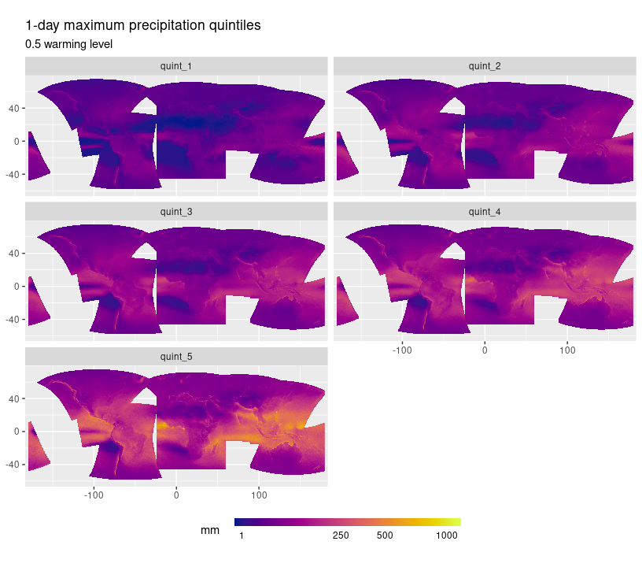
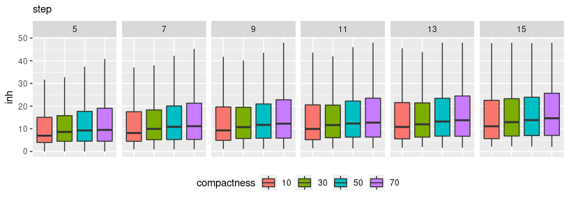
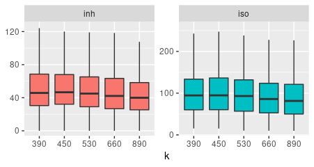

Regionalization tests
================
Carlos Dobler -
2023-03-02

Regional Frequency Analysis (RFA) consists of an approach that seeks to
increase the accuracy with which a distribution is fit to a sample of
observations. This is done by leveraging the tendency of samples from
different *but proximate* sites to behave similarly (i.e. to exhibit
similar distributions). RFA thus “pools” observations from multiple,
close-by sites to fit a “regional” distribution, and from it, derive
site-specific statistics (e.g. 99th percentile) with more less
uncertainty than when analyzing sites individually.

A key step in RFA is the regionalization of sites - or in other words,
to define the extent to which a group of sites can be considered similar
enough to conclude that their observations belong to (almost) the same
distribution. Regionalization requires a great amount of subjective
judgement since there will always be multiple ways to group sites, each
with their trade-offs. Subjectivity is particularly high in the context
of regionalizing global gridded data (such as CORDEX climate data),
where each site consists of a grid cell. This because how the boundaries
and number of regions are defined can vary significantly. In other
words, there are so many ways one can divide a continuous surface.

In this report I show the approach I followed to regionalize CORDEX
precipitation data to conduct an extreme precipitation RFA under climate
change at global scale for the [Probable
Futures](https://probablefutures.org/) initiative. I include some tests
I performed in an attempt to minimize subjectivity and choose the
combination of parameters that provide the best regionalization in terms
of intra-regional homogeneity and inter-regional differentiation.

## 1. Input data

Data used to regionalize consisted of daily precipitation layers from
six CORDEX RCMs (two regional models (REMO and RegCM) each driven by
three GCMs). For each model I first calculated [annual block
maximas](scripts/01_block_max.R). Next, I split the resulting datasets
temporally into warming levels, pooled the observations of the six
models (by warming level; i.e. 21 years x 6 models = 126 observations
per cell per warming level), and calculated their
[quintiles](scripts/02_ensemble_quintiles.R). Lastly, given CORDEX data
is split into regional domains, I [mosaicked](scripts/03_mosaic.R) the
quintile layers into global layers. The result is shown in the next
figure:

## 2. Preliminary (micro-) regionalization

Rather than directly assigning grid cells to a given region, my approach
first divides the globe into micro-regions based on 1-day maximum
precipitation quintiles to make the actual regionalization more
efficient, as well as to ensure that grid cells belonging to a given
region are all contiguous. Micro-regions were generated using the SLIC
algorithm (Simple Linear Iterative Clustering) implemented in R’s
{[supercells](https://github.com/Nowosad/supercells)} package. This
algorithm works by randomly distributing a number of “seeds” at a
specified distance from each other (the “step” parameter). Each seed
then forms a region by growing iteratively, progressively including
neighboring cells found to be similar enough. How uneven can regions be
is controlled by the “compactness” parameter. As compactness decreases,
regions will tend to be more irregular and spatially adapted.

To determine the optimal configuration of “step” and “compactness”
values, I ran the algorithm with 24 combinations of them and calculated
the *inhomogeneity* of the resulting regions for each combination.
Inhomogeneity refers to the degree of dissimilarity *within* regions.
The goal was to find out which combination of parameters would give me
the lowest levels of it (i.e. grid cells inside a region being highly
similar). Tests were ran only with the 0.5 warming level.

The following figure shows the distribution of inhomogeneity values
(y-axis) per combination of step (facets: 5-15) and compactness (colors:
10-70) values.

As expected, with lower step values, regions’ inhomogeneity decreases
since regions will be smaller and thus display less internal
variability. Reducing the compactness parameter has the same (although
less pronounced) effect since allowing regions to have more variable
shape results in a better division of the space. Based on these results,
I chose a step value of 5 and of compactness of 10 to run the
preliminary regionalization.

## 2. Aggregation (formal regionalization)

The next step involved aggregating micro-regions into larger regions
depending on the similarity of their spatially-aggregated 1-day maximum
precipitation quintiles. To do so, I used a spatially constrained
clustering algorithm called SKATER (Spatial C(K)luster Analysis by Tree
Edge Removal) implemented in R’s
{[rgeoda](https://cran.r-project.org/web/packages/rgeoda/index.html)}
package. Different from conventional clustering methods (hierarchical,
K-means), spatially constrained approaches form aggregates only from
spatially contiguous sub-units. This prevents the formation of regions
that, although potentially homogeneous in terms of precipitation
patterns, are spatially disconnected. To accomplish this, spatially
constrained clustering incorporates neighborhood information when
grouping.

SKATER has one main parameter: the final number of regions to be
generated (k). Therefore, similar to the previous step, I ran the
algorithm five times with varying values of k. For each run, I estimated
the regions’ inhomogenity again, as well as an additional metric called
“isolation”. Isolation measures the dissimilarity between a given region
and its neighbors. While the ideal is to minimize inhomogeneity, for the
case of isolation is the opposite as we prefer regions that stand out
from their surroundings (i.e. that are actually distinct).

The following figure shows the distribution of inhomogeneity (left) and
isolation values (right) as k values change (x-axis).

Boxplots indicate that as k increases, inhomogeneity decreases (as
expected: more regions means they have to be smaller and thus with less
internal variability). Similarly, as k increases, isolation also
increases (also expected: more regions means similar sub-units were
aggregated at a lower rate). Based on this trade-off, I chose a final k
value of 530 as it provides a balance between internal variability and
broader distinction.

The final regionalization looks like this:

<script type="application/json" data-for="htmlwidget-c1c5c734bc9e5fa8770c">{"x":{"options":{"crs":{"crsClass":"L.CRS.EPSG3857","code":null,"proj4def":null,"projectedBounds":null,"options":{}}},"calls":[{"method":"createMapPane","args":["tmap401",401]},{"method":"addProviderTiles","args":["Stamen.Terrain",null,"Stamen.Terrain",{"minZoom":0,"maxZoom":18,"tileSize":256,"subdomains":"abc","errorTileUrl":"","tms":false,"noWrap":false,"zoomOffset":0,"zoomReverse":false,"opacity":1,"zIndex":1,"detectRetina":false,"pane":"tilePane"}]},{"method":"addPolygons","args":[[[[{"lng":[-8.29999999999998,-7.5,-7.5,-8.09999999999999,-8.09999999999999,-9.69999999999999,-9.69999999999999,-8.29999999999998,-8.29999999999998],"lat":[70.3,70.3,70.1,70.1,69.9,69.9,70.1,70.1,70.3]}]],[[{"lng":[-104.7,-89.3,-89.3,-84.1,-84.1,-80.5,-80.5,-77.7,-77.7,-76.7,-76.7,-76.3,-76.3,-75.9,-75.9,-75.5,-75.5,-75.3,-75.3,-75.1,-75.1,-75.7,-75.7,-77.3,-77.3,-77.5,-77.5,-78.7,-78.7,-79.7,-79.7,-80.5,-80.5,-81.1,-81.1,-81.9,-81.9,-81.7,-81.7,-81.3,-81.3,-81.1,-81.1,-80.7,-80.7,-81.5,-81.5,-81.7,-81.7,-81.9,-81.9,-81.7,-81.7,-81.9,-81.9,-82.5,-82.5,-82.9,-82.9,-83.3,-83.3,-83.7,-83.7,-83.5,-83.5,-83.3,-83.3,-83.5,-83.5,-83.3,-83.3,-83.1,-83.1,-82.5,-82.5,-82.3,-82.3,-82.5,-82.5,-84.3,-84.3,-85.3,-85.3,-85.7,-85.7,-85.9,-85.9,-85.7,-85.7,-86.3,-86.3,-86.5,-86.5,-86.7,-86.7,-86.9,-86.9,-87.3,-87.3,-87.5,-87.5,-88.5,-88.5,-88.3,-88.3,-87.9,-87.9,-87.7,-87.7,-87.9,-87.9,-88.1,-88.1,-88.5,-88.5,-88.7,-88.7,-88.9,-88.9,-89.5,-89.5,-89.7,-89.7,-90.5,-90.5,-91.1,-91.1,-91.3,-91.3,-91.5,-91.5,-91.7,-91.7,-91.9,-91.9,-92.5,-92.5,-93.3,-93.3,-93.5,-93.5,-93.7,-93.7,-94.7,-94.7,-94.9,-94.9,-95.3,-95.3,-95.9,-95.9,-96.5,-96.5,-96.7,-96.7,-96.9,-96.9,-97.3,-97.3,-97.9,-97.9,-98.3,-98.3,-98.5,-98.5,-98.7,-98.7,-99.1,-99.1,-99.7,-99.7,-99.9,-99.9,-100.1,-100.1,-100.7,-100.7,-100.9,-100.9,-100.7,-100.7,-100.3,-100.3,-99.7,-99.7,-99.5,-99.5,-98.5,-98.5,-98.3,-98.3,-98.5,-98.5,-99.5,-99.5,-101.9,-101.9,-102.3,-102.3,-102.5,-102.5,-103.5,-103.5,-103.7,-103.7,-104.1,-104.1,-104.7,-104.7,-104.9,-104.9,-105.5,-105.5,-105.7,-105.7,-105.9,-105.9,-106.3,-106.3,-106.5,-106.5,-106.7,-106.7,-107.1,-107.1,-106.9,-106.9,-107.1,-107.1,-108.3,-108.3,-108.5,-108.5,-108.7,-108.7,-109.1,-109.1,-109.5,-109.5,-110.5,-110.5,-110.7,-110.7,-109.9,-109.9,-110.3,-110.3,-112.9,-112.9,-114.1,-114.1,-114.3,-114.3,-114.5,-114.5,-114.7,-114.7,-115.3,-115.3,-115.5,-115.5,-116.7,-116.7,-117.3,-117.3,-117.7,-117.7,-118.3,-118.3,-119.3,-119.3,-119.9,-119.9,-120.3,-120.3,-120.5,-120.5,-120.7,-120.7,-122.3,-122.3,-124.3,-124.3,-124.5,-124.5,-125.5,-125.5,-126.5,-126.5,-128.1,-128.1,-128.3,-128.3,-128.5,-128.5,-128.7,-128.7,-129.3,-129.3,-129.9,-129.9,-130.7,-130.7,-132.7,-132.7,-133.1,-133.1,-133.9,-133.9,-134.7,-134.7,-134.9,-134.9,-136.9,-136.9,-137.9,-137.9,-138.1,-138.1,-138.3,-138.3,-138.1,-138.1,-137.3,-137.3,-136.5,-136.5,-136.1,-136.1,-135.5,-135.5,-134.9,-134.9,-133.9,-133.9,-133.1,-133.1,-131.9,-131.9,-131.3,-131.3,-128.9,-128.9,-128.7,-128.7,-127.3,-127.3,-126.7,-126.7,-126.9,-126.9,-126.7,-126.7,-126.5,-126.5,-126.3,-126.3,-126.1,-126.1,-125.9,-125.9,-125.7,-125.7,-124.7,-124.7,-122.9,-122.9,-120.9,-120.9,-118.7,-118.7,-116.3,-116.3,-113.5,-113.5,-109.9,-109.9,-104.7,-104.7],"lat":[75.3,75.3,75.1,75.1,74.9,74.9,74.7,74.7,74.5,74.5,74.3,74.3,74.1,74.1,73.9,73.9,73.7,73.7,73.5,73.5,73.3,73.3,73.5,73.5,73.1,73.1,72.9,72.9,73.1,73.1,73.3,73.3,73.5,73.5,73.7,73.7,73.3,73.3,73.1,73.1,72.5,72.5,72.1,72.1,71.5,71.5,71.3,71.3,70.1,70.1,69.9,69.9,69.7,69.7,69.5,69.5,69.7,69.7,69.9,69.9,69.7,69.7,69.5,69.5,69.1,69.1,68.7,68.7,68.3,68.3,68.1,68.1,67.9,67.9,67.7,67.7,67.5,67.5,66.9,66.9,67.1,67.1,67.3,67.3,67.7,67.7,67.9,67.9,68.3,68.3,68.5,68.5,68.7,68.7,68.5,68.5,68.1,68.1,67.7,67.7,67.9,67.9,67.5,67.5,66.9,66.9,66.7,66.7,66.3,66.3,66.1,66.1,65.9,65.9,65.7,65.7,65.5,65.5,65.7,65.7,65.9,65.9,66.1,66.1,66.3,66.3,66.5,66.5,66.7,66.7,66.9,66.9,67.1,67.1,67.3,67.3,67.1,67.1,67.3,67.3,67.5,67.5,67.3,67.3,67.5,67.5,67.3,67.3,67.5,67.5,67.7,67.7,67.5,67.5,67.3,67.3,67.5,67.5,67.3,67.3,67.5,67.5,67.7,67.7,67.5,67.5,66.1,66.1,66.3,66.3,66.1,66.1,66.3,66.3,66.5,66.5,66.3,66.3,65.7,65.7,65.5,65.5,65.7,65.7,65.5,65.5,65.3,65.3,64.7,64.7,64.5,64.5,64.3,64.3,64.5,64.5,64.3,64.3,64.5,64.5,64.3,64.3,65.5,65.5,65.7,65.7,65.5,65.5,65.7,65.7,65.5,65.5,65.3,65.3,65.5,65.5,65.3,65.3,65.1,65.1,65.3,65.3,65.5,65.5,65.7,65.7,66.1,66.1,66.3,66.3,66.5,66.5,66.9,66.9,67.1,67.1,67.3,67.3,67.5,67.5,67.7,67.7,67.9,67.9,68.1,68.1,68.3,68.3,68.1,68.1,68.5,68.5,68.9,68.9,69.3,69.3,69.1,69.1,68.9,68.9,69.1,69.1,69.3,69.3,69.1,69.1,69.3,69.3,69.5,69.5,69.7,69.7,69.9,69.9,69.7,69.7,69.9,69.9,69.7,69.7,70.1,70.1,69.9,69.9,70.1,70.1,70.3,70.3,70.1,70.1,70.3,70.3,70.5,70.5,70.3,70.3,70.1,70.1,70.3,70.3,69.1,69.1,69.3,69.3,69.1,69.1,69.3,69.3,69.5,69.5,69.3,69.3,69.1,69.1,69.3,69.3,69.5,69.5,69.7,69.7,70.3,70.3,70.1,70.1,69.9,69.9,70.1,70.1,70.3,70.3,70.5,70.5,70.7,70.7,70.5,70.5,70.7,70.7,70.9,70.9,71.1,71.1,71.3,71.3,71.5,71.5,71.3,71.3,71.7,71.7,72.3,72.3,72.7,72.7,72.9,72.9,73.1,73.1,73.3,73.3,73.5,73.5,73.7,73.7,73.9,73.9,74.1,74.1,74.3,74.3,74.5,74.5,74.7,74.7,74.9,74.9,75.1,75.1,75.3]}]],[[{"lng":[-23.1,-22.1,-22.1,-21.7,-21.7,-21.1,-21.1,-20.7,-20.7,-17.3,-17.3,-16.9,-16.9,-15.5,-15.5,-14.1,-14.1,-13.9,-13.9,-13.7,-13.7,-13.1,-13.1,-12.9,-12.9,-12.7,-12.7,-12.5,-12.5,-12.7,-12.7,-12.9,-12.9,-13.1,-13.1,-13.3,-13.3,-13.7,-13.7,-14.1,-14.1,-14.5,-14.5,-15.7,-15.7,-16.1,-16.1,-17.1,-17.1,-17.5,-17.5,-20.5,-20.5,-20.9,-20.9,-23.3,-23.3,-23.5,-23.5,-23.7,-23.7,-24.1,-24.1,-24.5,-24.5,-24.7,-24.7,-24.9,-24.9,-25.1,-25.1,-25.3,-25.3,-25.5,-25.5,-25.3,-25.3,-24.9,-24.9,-24.7,-24.7,-24.5,-24.5,-24.1,-24.1,-23.7,-23.7,-23.1,-23.1],"lat":[67.5,67.5,67.3,67.3,67.1,67.1,66.9,66.9,67.1,67.1,67.3,67.3,67.5,67.5,67.3,67.3,67.1,67.1,66.9,66.9,66.5,66.5,66.3,66.3,66.1,66.1,65.5,65.5,64.9,64.9,64.5,64.5,64.3,64.3,64.1,64.1,63.9,63.9,63.7,63.7,63.5,63.5,63.3,63.3,63.1,63.1,62.9,62.9,62.7,62.7,62.5,62.5,62.7,62.7,62.9,62.9,63.1,63.1,63.5,63.5,63.7,63.7,63.9,63.9,64.1,64.1,64.3,64.3,64.7,64.7,64.9,64.9,65.1,65.1,65.9,65.9,66.3,66.3,66.5,66.5,66.7,66.7,66.9,66.9,67.1,67.1,67.3,67.3,67.5]}]],[[{"lng":[17.3,17.7,17.7,17.5,17.5,17.3,17.3,17.1,17.1,16.9,16.9,16.7,16.7,16.5,16.5,16.3,16.3,16.1,16.1,14.7,14.7,14.9,14.9,14.3,14.3,14.1,14.1,13.1,13.1,12.9,12.9,12.5,12.5,12.7,12.7,12.9,12.9,12.7,12.7,12.5,12.5,11.9,11.9,11.7,11.7,11.1,11.1,10.9,10.9,10.5,10.5,10.7,10.7,11.1,11.1,11.5,11.5,11.7,11.7,11.5,11.5,11.3,11.3,11.5,11.5,11.7,11.7,11.9,11.9,12.1,12.1,12.3,12.3,12.5,12.5,12.7,12.7,13.1,13.1,13.3,13.3,13.9,13.9,14.1,14.1,13.9,13.9,14.1,14.1,13.9,13.9,15.5,15.5,17.3,17.3,17.1,17.1,17.3,17.3],"lat":[69.1,69.1,68.3,68.3,68.1,68.1,67.9,67.9,67.7,67.7,67.9,67.9,67.5,67.5,67.3,67.3,67.1,67.1,66.9,66.9,66.5,66.5,66.1,66.1,65.9,65.9,65.7,65.7,65.1,65.1,64.9,64.9,64.7,64.7,64.5,64.5,64.3,64.3,64.1,64.1,63.9,63.9,63.5,63.5,63.3,63.3,63.1,63.1,63.3,63.3,63.5,63.5,63.7,63.7,63.9,63.9,64.1,64.1,64.5,64.5,64.7,64.7,64.9,64.9,65.9,65.9,66.1,66.1,66.3,66.3,66.7,66.7,66.9,66.9,67.1,67.1,67.3,67.3,67.5,67.5,67.7,67.7,67.9,67.9,68.1,68.1,68.3,68.3,68.7,68.7,68.9,68.9,68.5,68.5,68.7,68.7,68.9,68.9,69.1]}]],[[{"lng":[-56.7,-56.5,-56.5,-55.5,-55.5,-54.7,-54.7,-53.7,-53.7,-52.9,-52.9,-52.1,-52.1,-51.1,-51.1,-50.3,-50.3,-49.7,-49.7,-48.9,-48.9,-48.1,-48.1,-47.5,-47.5,-46.7,-46.7,-46.1,-46.1,-45.5,-45.5,-44.7,-44.7,-44.1,-44.1,-43.5,-43.5,-42.9,-42.9,-42.3,-42.3,-41.7,-41.7,-41.3,-41.3,-40.7,-40.7,-40.1,-40.1,-39.7,-39.7,-39.3,-39.3,-39.7,-39.7,-40.1,-40.1,-41.7,-41.7,-42.1,-42.1,-42.5,-42.5,-42.7,-42.7,-42.9,-42.9,-43.1,-43.1,-43.5,-43.5,-43.9,-43.9,-44.1,-44.1,-44.5,-44.5,-44.3,-44.3,-44.1,-44.1,-45.1,-45.1,-45.5,-45.5,-45.9,-45.9,-46.1,-46.1,-46.9,-46.9,-47.1,-47.1,-47.5,-47.5,-48.1,-48.1,-48.5,-48.5,-48.7,-48.7,-49.1,-49.1,-49.3,-49.3,-49.5,-49.5,-49.7,-49.7,-49.9,-49.9,-50.1,-50.1,-50.3,-50.3,-50.5,-50.5,-50.9,-50.9,-51.1,-51.1,-51.3,-51.3,-51.5,-51.5,-51.7,-51.7,-52.1,-52.1,-52.3,-52.3,-52.5,-52.5,-52.7,-52.7,-52.9,-52.9,-53.1,-53.1,-53.3,-53.3,-53.9,-53.9,-54.1,-54.1,-54.3,-54.3,-54.5,-54.5,-54.7,-54.7,-54.9,-54.9,-54.7,-54.7,-54.5,-54.5,-54.7,-54.7,-55.3,-55.3,-55.7,-55.7,-55.9,-55.9,-56.3,-56.3,-56.5,-56.5,-56.7,-56.7],"lat":[71.9,71.9,71.7,71.7,71.5,71.5,71.3,71.3,71.1,71.1,70.9,70.9,70.7,70.7,70.5,70.5,70.3,70.3,70.1,70.1,69.9,69.9,69.7,69.7,69.5,69.5,69.3,69.3,69.1,69.1,68.9,68.9,68.7,68.7,68.5,68.5,68.3,68.3,68.1,68.1,67.9,67.9,67.7,67.7,67.5,67.5,67.3,67.3,67.1,67.1,66.9,66.9,66.7,66.7,66.5,66.5,66.3,66.3,66.1,66.1,65.9,65.9,65.3,65.3,64.5,64.5,64.3,64.3,63.7,63.7,63.5,63.5,63.1,63.1,62.7,62.7,62.5,62.5,62.3,62.3,61.7,61.7,61.9,61.9,61.7,61.7,61.9,61.9,61.7,61.7,61.5,61.5,61.3,61.3,61.1,61.1,61.5,61.5,61.3,61.3,61.5,61.5,61.1,61.1,60.7,60.7,60.5,60.5,60.7,60.7,60.9,60.9,61.1,61.1,61.3,61.3,61.5,61.5,61.7,61.7,62.1,62.1,62.3,62.3,62.5,62.5,62.7,62.7,62.9,62.9,63.3,63.3,63.5,63.5,63.7,63.7,63.9,63.9,64.5,64.5,64.7,64.7,64.9,64.9,65.3,65.3,65.5,65.5,65.9,65.9,66.7,66.7,67.5,67.5,68.1,68.1,68.5,68.5,68.7,68.7,68.9,68.9,69.3,69.3,70.7,70.7,70.9,70.9,71.3,71.3,71.9]}]],[[{"lng":[-150.7,-149.7,-149.7,-149.9,-149.9,-148.9,-148.9,-148.5,-148.5,-148.3,-148.3,-146.1,-146.1,-145.9,-145.9,-145.7,-145.7,-145.5,-145.5,-143.9,-143.9,-144.5,-144.5,-145.1,-145.1,-144.9,-144.9,-144.5,-144.5,-143.9,-143.9,-143.1,-143.1,-143.7,-143.7,-144.1,-144.1,-144.3,-144.3,-144.7,-144.7,-145.5,-145.5,-146.5,-146.5,-148.5,-148.5,-148.9,-148.9,-150.3,-150.3,-150.5,-150.5,-150.9,-150.9,-151.5,-151.5,-151.9,-151.9,-150.7,-150.7],"lat":[62.9,62.9,62.7,62.7,62.1,62.1,61.9,61.9,61.7,61.7,61.5,61.5,61.9,61.9,62.1,62.1,62.3,62.3,62.1,62.1,61.9,61.9,61.7,61.7,61.3,61.3,61.1,61.1,60.9,60.9,60.7,60.7,60.5,60.5,60.3,60.3,60.5,60.5,60.7,60.7,60.9,60.9,60.7,60.7,61.3,61.3,61.1,61.1,61.5,61.5,61.7,61.7,61.9,61.9,62.1,62.1,62.3,62.3,62.7,62.7,62.9]}]],[[{"lng":[-7.5,-6.09999999999999,-6.09999999999999,-5.69999999999999,-5.69999999999999,-5.5,-5.5,-5.69999999999999,-5.69999999999999,-5.90000000000001,-5.90000000000001,-6.09999999999999,-6.09999999999999,-7.29999999999998,-7.29999999999998,-7.5,-7.5,-7.69999999999999,-7.69999999999999,-7.90000000000001,-7.90000000000001,-8.09999999999999,-8.09999999999999,-8.29999999999998,-8.29999999999998,-8.5,-8.5,-8.29999999999998,-8.29999999999998,-8.09999999999999,-8.09999999999999,-7.90000000000001,-7.90000000000001,-7.5,-7.5],"lat":[63.3,63.3,63.1,63.1,62.9,62.9,61.7,61.7,60.9,60.9,60.7,60.7,60.5,60.5,60.7,60.7,60.9,60.9,61.1,61.1,61.3,61.3,61.5,61.5,61.9,61.9,62.3,62.3,62.7,62.7,62.9,62.9,63.1,63.1,63.3]}]],[[{"lng":[-143.9,-143.3,-143.3,-142.5,-142.5,-142.1,-142.1,-141.5,-141.5,-141.1,-141.1,-141.7,-141.7,-142.7,-142.7,-143.9,-143.9,-144.5,-144.5,-143.9,-143.9],"lat":[62.1,62.1,61.9,61.9,61.7,61.7,61.5,61.5,61.3,61.3,60.9,60.9,61.1,61.1,61.3,61.3,61.5,61.5,61.9,61.9,62.1]}]],[[{"lng":[-145.1,-145.1,-144.9,-144.9,-144.5,-144.5,-143.9,-143.9,-143.1,-143.1,-138.9,-138.9,-139.9,-139.9,-140.3,-140.3,-140.7,-140.7,-140.9,-140.9,-141.1,-141.1,-141.7,-141.7,-142.7,-142.7,-143.9,-143.9,-144.5,-144.5,-145.1],"lat":[61.7,61.3,61.3,61.1,61.1,60.9,60.9,60.7,60.7,60.5,60.5,60.7,60.7,60.9,60.9,61.1,61.1,60.9,60.9,61.3,61.3,60.9,60.9,61.1,61.1,61.3,61.3,61.5,61.5,61.7,61.7]}]],[[{"lng":[-147.7,-146.5,-146.5,-148.1,-148.1,-147.7,-147.7],"lat":[61.3,61.3,60.7,60.7,61.1,61.1,61.3]}]],[[{"lng":[-81.9,-81.1,-81.1,-80.5,-80.5,-79.7,-79.7,-78.7,-78.7,-77.5,-77.5,-77.3,-77.3,-75.7,-75.7,-75.1,-75.1,-74.9,-74.9,-74.5,-74.5,-73.9,-73.9,-73.7,-73.7,-72.1,-72.1,-71.1,-71.1,-70.7,-70.7,-70.3,-70.3,-69.5,-69.5,-68.3,-68.3,-67.9,-67.9,-67.5,-67.5,-67.1,-67.1,-66.7,-66.7,-66.5,-66.5,-66.3,-66.3,-65.9,-65.9,-65.7,-65.7,-65.5,-65.5,-65.3,-65.3,-64.7,-64.7,-64.3,-64.3,-63.7,-63.7,-63.3,-63.3,-62.7,-62.7,-61.7,-61.7,-61.3,-61.3,-60.9,-60.9,-61.5,-61.5,-62.1,-62.1,-62.5,-62.5,-62.9,-62.9,-63.9,-63.9,-63.5,-63.5,-63.3,-63.3,-62.9,-62.9,-63.1,-63.1,-63.3,-63.3,-63.7,-63.7,-64.1,-64.1,-65.7,-65.7,-66.9,-66.9,-67.3,-67.3,-67.5,-67.5,-67.3,-67.3,-66.3,-66.3,-65.9,-65.9,-65.7,-65.7,-65.9,-65.9,-66.1,-66.1,-66.5,-66.5,-66.9,-66.9,-67.7,-67.7,-68.3,-68.3,-68.7,-68.7,-69.3,-69.3,-70.1,-70.1,-70.7,-70.7,-70.9,-70.9,-71.3,-71.3,-71.7,-71.7,-72.3,-72.3,-72.5,-72.5,-72.9,-72.9,-73.5,-73.5,-73.3,-73.3,-75.7,-75.7,-76.5,-76.5,-78.1,-78.1,-78.5,-78.5,-78.7,-78.7,-78.9,-78.9,-79.3,-79.3,-79.1,-79.1,-79.3,-79.3,-79.5,-79.5,-79.3,-79.3,-79.9,-79.9,-80.1,-80.1,-80.3,-80.3,-80.5,-80.5,-81.1,-81.1,-81.7,-81.7,-81.9,-81.9,-82.7,-82.7,-82.9,-82.9,-83.1,-83.1,-83.3,-83.3,-83.5,-83.5,-84.3,-84.3,-84.9,-84.9,-85.5,-85.5,-85.7,-85.7,-85.9,-85.9,-86.3,-86.3,-86.9,-86.9,-87.1,-87.1,-87.3,-87.3,-87.5,-87.5,-88.5,-88.5,-89.3,-89.3,-89.5,-89.5,-89.9,-89.9,-90.1,-90.1,-90.7,-90.7,-91.7,-91.7,-92.9,-92.9,-92.7,-92.7,-92.3,-92.3,-91.3,-91.3,-91.1,-91.1,-90.7,-90.7,-90.5,-90.5,-90.3,-90.3,-89.7,-89.7,-88.7,-88.7,-88.5,-88.5,-89.5,-89.5,-89.9,-89.9,-90.3,-90.3,-90.5,-90.5,-90.1,-90.1,-89.7,-89.7,-89.5,-89.5,-88.9,-88.9,-88.7,-88.7,-88.5,-88.5,-88.1,-88.1,-87.9,-87.9,-87.7,-87.7,-87.9,-87.9,-88.3,-88.3,-88.5,-88.5,-87.5,-87.5,-87.3,-87.3,-86.9,-86.9,-86.7,-86.7,-86.5,-86.5,-86.3,-86.3,-85.7,-85.7,-85.9,-85.9,-85.7,-85.7,-85.3,-85.3,-84.3,-84.3,-82.5,-82.5,-82.3,-82.3,-82.5,-82.5,-83.1,-83.1,-83.3,-83.3,-83.5,-83.5,-83.3,-83.3,-83.5,-83.5,-83.7,-83.7,-83.3,-83.3,-82.9,-82.9,-82.5,-82.5,-81.9,-81.9,-81.7,-81.7,-81.9,-81.9,-81.7,-81.7,-81.5,-81.5,-80.7,-80.7,-81.1,-81.1,-81.3,-81.3,-81.7,-81.7,-81.9,-81.9],"lat":[73.7,73.7,73.5,73.5,73.3,73.3,73.1,73.1,72.9,72.9,73.1,73.1,73.5,73.5,73.3,73.3,73.5,73.5,73.3,73.3,73.1,73.1,72.9,72.9,72.7,72.7,72.5,72.5,72.3,72.3,72.1,72.1,71.9,71.9,71.7,71.7,71.5,71.5,71.3,71.3,71.1,71.1,70.9,70.9,70.7,70.7,70.5,70.5,70.1,70.1,69.7,69.7,69.1,69.1,68.9,68.9,69.1,69.1,68.9,68.9,68.7,68.7,68.5,68.5,68.3,68.3,68.1,68.1,67.9,67.9,67.7,67.7,67.1,67.1,67.3,67.3,67.5,67.5,67.7,67.7,67.9,67.9,67.7,67.7,67.5,67.5,67.1,67.1,66.3,66.3,66.1,66.1,65.9,65.9,65.7,65.7,64.9,64.9,65.1,65.1,65.3,65.3,65.1,65.1,64.9,64.9,64.7,64.7,64.5,64.5,64.1,64.1,63.5,63.5,62.9,62.9,63.1,63.1,62.9,62.9,63.1,63.1,62.3,62.3,62.5,62.5,62.7,62.7,62.9,62.9,63.1,63.1,62.7,62.7,62.5,62.5,62.3,62.3,62.1,62.1,62.3,62.3,62.5,62.5,62.3,62.3,62.1,62.1,61.9,61.9,62.1,62.1,62.5,62.5,62.3,62.3,62.1,62.1,61.9,61.9,61.7,61.7,60.7,60.7,60.3,60.3,60.1,60.1,59.9,59.9,59.5,59.5,59.3,59.3,59.5,59.5,59.7,59.7,59.9,59.9,60.1,60.1,60.3,60.3,60.1,60.1,60.3,60.3,60.5,60.5,60.1,60.1,59.7,59.7,59.5,59.5,59.7,59.7,59.5,59.5,59.7,59.7,60.7,60.7,60.9,60.9,60.7,60.7,60.9,60.9,61.1,61.1,61.5,61.5,61.7,61.7,61.9,61.9,61.5,61.5,61.3,61.3,61.5,61.5,61.7,61.7,61.5,61.5,61.3,61.3,61.9,61.9,62.1,62.1,62.3,62.3,62.5,62.5,62.7,62.7,62.9,62.9,63.1,63.1,63.3,63.3,64.3,64.3,64.7,64.7,65.1,65.1,65.3,65.3,65.5,65.5,65.7,65.7,65.9,65.9,66.1,66.1,65.9,65.9,65.7,65.7,65.5,65.5,65.7,65.7,65.9,65.9,66.1,66.1,66.3,66.3,66.7,66.7,66.9,66.9,67.5,67.5,67.9,67.9,67.7,67.7,68.1,68.1,68.5,68.5,68.7,68.7,68.5,68.5,68.3,68.3,67.9,67.9,67.7,67.7,67.3,67.3,67.1,67.1,66.9,66.9,67.5,67.5,67.7,67.7,67.9,67.9,68.1,68.1,68.3,68.3,68.7,68.7,69.1,69.1,69.5,69.5,69.7,69.7,69.9,69.9,69.7,69.7,69.5,69.5,69.7,69.7,69.9,69.9,70.1,70.1,71.3,71.3,71.5,71.5,72.1,72.1,72.5,72.5,73.1,73.1,73.3,73.3,73.7]}]],[[{"lng":[5.5,5.70000000000002,5.70000000000002,5.90000000000001,5.90000000000001,6.5,6.5,6.30000000000001,6.30000000000001,5.90000000000001,5.90000000000001,5.70000000000002,5.70000000000002,5.5,5.5,5.30000000000001,5.30000000000001,4.90000000000001,4.90000000000001,4.70000000000002,4.70000000000002,5.5,5.5],"lat":[61.9,61.9,61.5,61.5,60.3,60.3,59.1,59.1,58.9,58.9,59.3,59.3,59.5,59.5,59.9,59.9,60.5,60.5,61.3,61.3,61.7,61.7,61.9]}]],[[{"lng":[-39.3,-39.1,-39.1,-38.7,-38.7,-38.1,-38.1,-37.7,-37.7,-37.1,-37.1,-36.7,-36.7,-36.3,-36.3,-35.7,-35.7,-35.3,-35.3,-35.7,-35.7,-36.3,-36.3,-36.7,-36.7,-37.5,-37.5,-37.7,-37.7,-37.9,-37.9,-38.9,-38.9,-39.1,-39.1,-39.3,-39.3,-39.5,-39.5,-39.7,-39.7,-39.9,-39.9,-40.1,-40.1,-40.3,-40.3,-40.5,-40.5,-40.9,-40.9,-41.1,-41.1,-41.3,-41.3,-41.5,-41.5,-41.7,-41.7,-41.9,-41.9,-42.1,-42.1,-42.3,-42.3,-42.7,-42.7,-42.9,-42.9,-44.9,-44.9,-45.5,-45.5,-45.9,-45.9,-46.1,-46.1,-48.5,-48.5,-48.9,-48.9,-49.1,-49.1,-49.5,-49.5,-49.3,-49.3,-49.1,-49.1,-48.7,-48.7,-48.5,-48.5,-48.1,-48.1,-47.5,-47.5,-47.1,-47.1,-46.9,-46.9,-46.1,-46.1,-45.9,-45.9,-45.5,-45.5,-45.1,-45.1,-44.1,-44.1,-44.3,-44.3,-44.5,-44.5,-44.1,-44.1,-43.9,-43.9,-43.5,-43.5,-43.1,-43.1,-42.9,-42.9,-42.7,-42.7,-42.5,-42.5,-42.1,-42.1,-41.7,-41.7,-40.1,-40.1,-39.7,-39.7,-39.3,-39.3],"lat":[66.9,66.9,66.7,66.7,66.5,66.5,66.3,66.3,66.1,66.1,65.9,65.9,65.7,65.7,65.5,65.5,65.3,65.3,65.1,65.1,64.9,64.9,64.7,64.7,64.5,64.5,64.7,64.7,64.5,64.5,64.7,64.7,64.5,64.5,64.3,64.3,63.9,63.9,63.5,63.5,63.1,63.1,62.9,62.9,62.7,62.7,62.5,62.5,62.3,62.3,62.1,62.1,61.5,61.5,61.1,61.1,60.9,60.9,60.3,60.3,60.1,60.1,59.7,59.7,59.3,59.3,59.1,59.1,58.9,58.9,59.1,59.1,59.3,59.3,59.5,59.5,59.7,59.7,59.9,59.9,60.1,60.1,60.3,60.3,60.7,60.7,61.1,61.1,61.5,61.5,61.3,61.3,61.5,61.5,61.1,61.1,61.3,61.3,61.5,61.5,61.7,61.7,61.9,61.9,61.7,61.7,61.9,61.9,61.7,61.7,62.3,62.3,62.5,62.5,62.7,62.7,63.1,63.1,63.5,63.5,63.7,63.7,64.3,64.3,64.5,64.5,65.3,65.3,65.9,65.9,66.1,66.1,66.3,66.3,66.5,66.5,66.7,66.7,66.9]}]],[[{"lng":[-142.9,-142.9,-139.1,-139.1,-138.5,-138.5,-138.3,-138.3,-137.7,-137.7,-137.9,-137.9,-138.1,-138.1,-138.3,-138.3,-138.7,-138.7,-142.9],"lat":[60.5,60.3,60.3,60.1,60.1,59.5,59.5,59.3,59.3,59.7,59.7,59.9,59.9,60.1,60.1,60.3,60.3,60.5,60.5]}]],[[{"lng":[-142.3,-142.3,-142.1,-142.1,-140.7,-140.7,-139.1,-139.1,-138.7,-138.7,-138.9,-138.9,-139.1,-139.1,-142.3],"lat":[60.3,59.9,59.9,59.7,59.7,59.5,59.5,59.7,59.7,59.9,59.9,60.1,60.1,60.3,60.3]}]],[[{"lng":[-148.5,-147.7,-147.7,-148.1,-148.1,-145.5,-145.5,-144.7,-144.7,-144.3,-144.3,-144.1,-144.1,-143.7,-143.7,-142.9,-142.9,-142.3,-142.3,-142.5,-142.5,-142.9,-142.9,-144.1,-144.1,-145.3,-145.3,-146.1,-146.1,-146.5,-146.5,-147.5,-147.5,-147.7,-147.7,-147.9,-147.9,-149.7,-149.7,-150.1,-150.1,-149.9,-149.9,-149.3,-149.3,-149.1,-149.1,-148.9,-148.9,-148.7,-148.7,-148.9,-148.9,-148.5,-148.5],"lat":[61.3,61.3,61.1,61.1,60.7,60.7,60.9,60.9,60.7,60.7,60.5,60.5,60.3,60.3,60.5,60.5,60.3,60.3,59.7,59.7,59.9,59.9,59.7,59.7,59.9,59.9,60.1,60.1,60.3,60.3,60.5,60.5,60.3,60.3,59.7,59.7,59.5,59.5,59.3,59.3,59.7,59.7,60.1,60.1,60.3,60.3,60.1,60.1,60.3,60.3,60.7,60.7,61.1,61.1,61.3]}]],[[{"lng":[143.1,143.9,143.9,145.1,145.1,146.5,146.5,147.7,147.7,148.7,148.7,149.9,149.9,150.9,150.9,151.9,151.9,152.9,152.9,153.9,153.9,154.7,154.7,155.3,155.3,153.3,153.3,150.9,150.9,149.9,149.9,149.7,149.7,149.3,149.3,146.3,146.3,145.9,145.9,145.3,145.3,145.1,145.1,144.1,144.1,143.9,143.9,143.7,143.7,143.3,143.3,143.1,143.1,142.9,142.9,143.1,143.1],"lat":[60.5,60.5,60.3,60.3,60.1,60.1,59.9,59.9,59.7,59.7,59.5,59.5,59.3,59.3,59.1,59.1,58.9,58.9,58.7,58.7,58.5,58.5,58.3,58.3,58.1,58.1,57.9,57.9,58.1,58.1,58.3,58.3,58.5,58.5,58.3,58.3,58.1,58.1,58.3,58.3,58.5,58.5,58.3,58.3,58.5,58.5,58.7,58.7,58.9,58.9,59.7,59.7,60.1,60.1,60.3,60.3,60.5]}]],[[{"lng":[-152.3,-149.9,-149.9,-150.3,-150.3,-150.5,-150.5,-150.3,-150.3,-150.1,-150.1,-151.5,-151.5,-151.9,-151.9,-151.5,-151.5,-150.7,-150.7,-149.3,-149.3,-148.7,-148.7,-147.7,-147.7,-146.9,-146.9,-146.7,-146.7,-145.3,-145.3,-144.7,-144.7,-144.1,-144.1,-143.9,-143.9,-144.9,-144.9,-145.5,-145.5,-146.3,-146.3,-147.5,-147.5,-148.3,-148.3,-147.7,-147.7,-147.3,-147.3,-147.1,-147.1,-145.7,-145.7,-145.5,-145.5,-145.3,-145.3,-144.5,-144.5,-144.3,-144.3,-144.5,-144.5,-145.5,-145.5,-145.7,-145.7,-145.9,-145.9,-146.1,-146.1,-148.3,-148.3,-148.5,-148.5,-148.9,-148.9,-149.3,-149.3,-149.7,-149.7,-149.5,-149.5,-149.3,-149.3,-149.1,-149.1,-150.9,-150.9,-150.7,-150.7,-150.9,-150.9,-151.1,-151.1,-151.9,-151.9,-152.1,-152.1,-152.3,-152.3,-152.5,-152.5,-152.7,-152.7,-152.9,-152.9,-152.7,-152.7,-153.9,-153.9,-154.1,-154.1,-154.3,-154.3,-155.5,-155.5,-155.7,-155.7,-155.5,-155.5,-155.7,-155.7,-155.5,-155.5,-155.3,-155.3,-156.5,-156.5,-159.1,-159.1,-159.3,-159.3,-159.5,-159.5,-160.7,-160.7,-160.9,-160.9,-161.1,-161.1,-160.9,-160.9,-159.7,-159.7,-160.7,-160.7,-159.9,-159.9,-160.3,-160.3,-160.7,-160.7,-161.3,-161.3,-162.7,-162.7,-162.9,-162.9,-163.1,-163.1,-164.5,-164.5,-165.1,-165.1,-165.9,-165.9,-166.5,-166.5,-167.1,-167.1,-167.7,-167.7,-168.1,-168.1,-168.3,-168.3,-167.9,-167.9,-167.7,-167.7,-167.3,-167.3,-166.9,-166.9,-166.7,-166.7,-166.3,-166.3,-165.9,-165.9,-165.7,-165.7,-165.3,-165.3,-164.9,-164.9,-164.5,-164.5,-164.3,-164.3,-163.9,-163.9,-163.5,-163.5,-163.1,-163.1,-162.7,-162.7,-162.3,-162.3,-161.9,-161.9,-161.5,-161.5,-161.1,-161.1,-160.7,-160.7,-160.3,-160.3,-159.9,-159.9,-159.5,-159.5,-159.1,-159.1,-158.7,-158.7,-158.3,-158.3,-157.7,-157.7,-157.3,-157.3,-156.9,-156.9,-156.3,-156.3,-155.9,-155.9,-155.3,-155.3,-154.9,-154.9,-154.3,-154.3,-153.9,-153.9,-153.3,-153.3,-152.7,-152.7,-152.3,-152.3],"lat":[67.9,67.9,67.5,67.5,66.9,66.9,66.7,66.7,66.5,66.5,66.3,66.3,66.1,66.1,65.7,65.7,65.5,65.5,65.3,65.3,65.5,65.5,65.7,65.7,65.5,65.5,65.3,65.3,65.1,65.1,64.9,64.9,64.7,64.7,64.5,64.5,63.9,63.9,64.1,64.1,64.3,64.3,64.5,64.5,64.7,64.7,63.7,63.7,63.5,63.5,63.7,63.7,63.5,63.5,63.7,63.7,63.5,63.5,63.3,63.3,63.1,63.1,62.5,62.5,62.1,62.1,62.3,62.3,62.1,62.1,61.9,61.9,61.5,61.5,61.7,61.7,61.9,61.9,62.1,62.1,62.3,62.3,62.5,62.5,62.7,62.7,62.9,62.9,63.1,63.1,63.5,63.5,63.9,63.9,64.1,64.1,63.9,63.9,63.7,63.7,63.5,63.5,63.3,63.3,62.5,62.5,62.3,62.3,62.1,62.1,61.5,61.5,61.3,61.3,61.7,61.7,61.9,61.9,61.7,61.7,61.5,61.5,61.3,61.3,61.1,61.1,60.9,60.9,60.5,60.5,60.3,60.3,60.1,60.1,59.9,59.9,59.7,59.7,59.5,59.5,59.1,59.1,58.9,58.9,58.7,58.7,58.5,58.5,58.3,58.3,57.9,57.9,57.7,57.7,57.5,57.5,57.7,57.7,57.9,57.9,58.1,58.1,58.9,58.9,59.1,59.1,58.9,58.9,58.7,58.7,58.9,58.9,59.1,59.1,59.3,59.3,59.5,59.5,60.1,60.1,60.3,60.3,60.5,60.5,60.7,60.7,60.9,60.9,61.1,61.1,61.3,61.3,61.5,61.5,61.7,61.7,61.9,61.9,62.1,62.1,62.3,62.3,62.5,62.5,62.7,62.7,62.9,62.9,63.1,63.1,63.3,63.3,63.5,63.5,63.7,63.7,63.9,63.9,64.1,64.1,64.3,64.3,64.5,64.5,64.7,64.7,64.9,64.9,65.1,65.1,65.3,65.3,65.5,65.5,65.7,65.7,65.9,65.9,66.1,66.1,66.3,66.3,66.5,66.5,66.7,66.7,66.9,66.9,67.1,67.1,67.3,67.3,67.5,67.5,67.7,67.7,67.9]}]],[[{"lng":[-138.9,-138.5,-138.5,-138.3,-138.3,-137.7,-137.7,-137.5,-137.5,-137.3,-137.3,-136.9,-136.9,-136.5,-136.5,-136.7,-136.7,-137.5,-137.5,-137.9,-137.9,-138.5,-138.5,-138.7,-138.7,-138.9,-138.9,-139.9,-139.9,-141.7,-141.7,-142.5,-142.5,-142.3,-142.3,-142.1,-142.1,-140.7,-140.7,-139.1,-139.1,-138.7,-138.7,-138.9,-138.9],"lat":[60.1,60.1,59.5,59.5,59.3,59.3,59.1,59.1,58.9,58.9,58.7,58.7,58.5,58.5,58.3,58.3,58.1,58.1,58.3,58.3,58.5,58.5,58.7,58.7,58.9,58.9,59.1,59.1,59.3,59.3,59.5,59.5,59.7,59.7,59.9,59.9,59.7,59.7,59.5,59.5,59.7,59.7,59.9,59.9,60.1]}]],[[{"lng":[-137.7,-137.7,-137.5,-137.5,-137.3,-137.3,-136.9,-136.9,-136.5,-136.5,-136.3,-136.3,-135.9,-135.9,-135.3,-135.3,-135.5,-135.5,-136.7,-136.7,-136.9,-136.9,-136.7,-136.7,-137.7],"lat":[59.3,59.1,59.1,58.9,58.9,58.7,58.7,58.5,58.5,57.9,57.9,58.1,58.1,58.3,58.3,58.5,58.5,58.7,58.7,58.9,58.9,59.1,59.1,59.3,59.3]}]],[[{"lng":[7.70000000000002,8.70000000000002,8.70000000000002,8.90000000000001,8.90000000000001,8.70000000000002,8.70000000000002,8.30000000000001,8.30000000000001,7.90000000000001,7.90000000000001,7.70000000000002,7.70000000000002,7.5,7.5,7.30000000000001,7.30000000000001,6.70000000000002,6.70000000000002,6.90000000000001,6.90000000000001,6.70000000000002,6.70000000000002,7.70000000000002,7.70000000000002,8.09999999999999,8.09999999999999,8.70000000000002,8.70000000000002,9.09999999999999,9.09999999999999,10.3,10.3,10.1,10.1,9.70000000000002,9.70000000000002,9.5,9.5,9.09999999999999,9.09999999999999,8.90000000000001,8.90000000000001,8.5,8.5,7.90000000000001,7.90000000000001,6.09999999999999,6.09999999999999,5.70000000000002,5.70000000000002,5.5,5.5,5.30000000000001,5.30000000000001,5.09999999999999,5.09999999999999,4.90000000000001,4.90000000000001,3.90000000000001,3.90000000000001,4.09999999999999,4.09999999999999,4.70000000000002,4.70000000000002,5.09999999999999,5.09999999999999,6.09999999999999,6.09999999999999,7.09999999999999,7.09999999999999,7.70000000000002,7.70000000000002],"lat":[63.3,63.3,63.1,63.1,62.5,62.5,62.7,62.7,62.5,62.5,62.1,62.1,60.9,60.9,60.7,60.7,60.1,60.1,59.7,59.7,59.5,59.5,58.7,58.7,58.5,58.5,58.7,58.7,59.1,59.1,59.3,59.3,59.1,59.1,58.9,58.9,58.7,58.7,58.5,58.5,58.3,58.3,58.1,58.1,57.9,57.9,57.7,57.7,57.9,57.9,58.1,58.1,58.3,58.3,59.1,59.1,59.5,59.5,59.9,59.9,62.1,62.1,62.3,62.3,62.5,62.5,62.3,62.3,62.7,62.7,62.9,62.9,63.3]},{"lng":[5.5,5.5,4.70000000000002,4.70000000000002,4.90000000000001,4.90000000000001,5.30000000000001,5.30000000000001,5.5,5.5,5.70000000000002,5.70000000000002,5.90000000000001,5.90000000000001,6.30000000000001,6.30000000000001,6.5,6.5,5.90000000000001,5.90000000000001,5.70000000000002,5.70000000000002,5.5],"lat":[61.9,61.7,61.7,61.3,61.3,60.5,60.5,59.9,59.9,59.5,59.5,59.3,59.3,58.9,58.9,59.1,59.1,60.3,60.3,61.5,61.5,61.9,61.9]}]],[[{"lng":[-152.7,-151.9,-151.9,-152.1,-152.1,-152.3,-152.3,-152.1,-152.1,-152.5,-152.5,-152.7,-152.7,-153.1,-153.1,-153.3,-153.3,-153.1,-153.1,-153.3,-153.3,-153.5,-153.5,-153.9,-153.9,-154.3,-154.3,-154.5,-154.5,-154.7,-154.7,-154.9,-154.9,-155.5,-155.5,-155.7,-155.7,-155.5,-155.5,-155.1,-155.1,-154.9,-154.9,-154.7,-154.7,-154.5,-154.5,-154.1,-154.1,-153.9,-153.9,-154.1,-154.1,-153.9,-153.9,-153.7,-153.7,-153.3,-153.3,-153.1,-153.1,-152.9,-152.9,-152.7,-152.7],"lat":[61.1,61.1,60.7,60.7,60.3,60.3,59.9,59.9,59.7,59.7,59.5,59.5,59.3,59.3,59.1,59.1,58.9,58.9,58.5,58.5,58.3,58.3,58.1,58.1,57.7,57.7,57.9,57.9,57.7,57.7,57.5,57.5,57.7,57.7,57.9,57.9,58.1,58.1,58.3,58.3,58.5,58.5,58.3,58.3,58.5,58.5,58.7,58.7,58.9,58.9,59.5,59.5,59.9,59.9,60.1,60.1,59.9,59.9,60.5,60.5,60.7,60.7,60.9,60.9,61.1]}]],[[{"lng":[11.7,12.3,12.3,12.1,12.1,11.9,11.9,11.7,11.7,11.5,11.5,11.3,11.3,11.1,11.1,10.7,10.7,10.5,10.5,10.3,10.3,9.70000000000002,9.70000000000002,9.5,9.5,9.90000000000001,9.90000000000001,10.3,10.3,10.5,10.5,10.7,10.7,10.9,10.9,11.7,11.7,11.9,11.9,11.7,11.7,10.5,10.5,11.3,11.3,11.1,11.1,11.3,11.3,11.5,11.5,11.7,11.7,11.9,11.9,12.1,12.1,12.3,12.3,12.5,12.5,12.7,12.7,12.9,12.9,13.1,13.1,12.7,12.7,12.5,12.5,12.3,12.3,12.1,12.1,11.7,11.7,11.5,11.5,11.1,11.1,10.7,10.7,10.3,10.3,9.90000000000001,9.90000000000001,8.5,8.5,8.90000000000001,8.90000000000001,9.09999999999999,9.09999999999999,9.5,9.5,9.70000000000002,9.70000000000002,10.1,10.1,10.3,10.3,9.09999999999999,9.09999999999999,8.70000000000002,8.70000000000002,8.09999999999999,8.09999999999999,7.70000000000002,7.70000000000002,6.70000000000002,6.70000000000002,6.90000000000001,6.90000000000001,6.70000000000002,6.70000000000002,7.30000000000001,7.30000000000001,7.5,7.5,7.70000000000002,7.70000000000002,7.90000000000001,7.90000000000001,8.30000000000001,8.30000000000001,8.70000000000002,8.70000000000002,8.90000000000001,8.90000000000001,8.70000000000002,8.70000000000002,7.70000000000002,7.70000000000002,7.09999999999999,7.09999999999999,6.09999999999999,6.09999999999999,5.09999999999999,5.09999999999999,4.70000000000002,4.70000000000002,4.09999999999999,4.09999999999999,4.30000000000001,4.30000000000001,4.70000000000002,4.70000000000002,5.09999999999999,5.09999999999999,5.70000000000002,5.70000000000002,6.09999999999999,6.09999999999999,6.5,6.5,6.90000000000001,6.90000000000001,7.09999999999999,7.09999999999999,7.5,7.5,7.90000000000001,7.90000000000001,8.70000000000002,8.70000000000002,8.90000000000001,8.90000000000001,9.30000000000001,9.30000000000001,9.70000000000002,9.70000000000002,9.90000000000001,9.90000000000001,10.1,10.1,10.3,10.3,10.9,10.9,11.1,11.1,11.5,11.5,11.7,11.7],"lat":[66.9,66.9,66.7,66.7,66.3,66.3,66.1,66.1,65.9,65.9,64.9,64.9,64.5,64.5,64.3,64.3,64.1,64.1,63.9,63.9,63.3,63.3,62.5,62.5,62.1,62.1,61.9,61.9,61.7,61.7,62.1,62.1,61.9,61.9,61.5,61.5,61.3,61.3,60.7,60.7,60.5,60.5,60.3,60.3,60.1,60.1,59.5,59.5,59.3,59.3,58.7,58.7,58.5,58.5,58.3,58.3,57.9,57.9,57.7,57.7,57.1,57.1,56.9,56.9,56.7,56.7,56.3,56.3,56.1,56.1,56.5,56.5,56.7,56.7,57.1,57.1,57.3,57.3,57.7,57.7,58.7,58.7,58.5,58.5,58.3,58.3,57.9,57.9,58.1,58.1,58.3,58.3,58.5,58.5,58.7,58.7,58.9,58.9,59.1,59.1,59.3,59.3,59.1,59.1,58.7,58.7,58.5,58.5,58.7,58.7,59.5,59.5,59.7,59.7,60.1,60.1,60.7,60.7,60.9,60.9,62.1,62.1,62.5,62.5,62.7,62.7,62.5,62.5,63.1,63.1,63.3,63.3,62.9,62.9,62.7,62.7,62.3,62.3,62.5,62.5,62.3,62.3,62.5,62.5,62.9,62.9,63.1,63.1,63.3,63.3,63.5,63.5,63.7,63.7,63.9,63.9,64.1,64.1,64.3,64.3,64.5,64.5,64.7,64.7,64.9,64.9,64.7,64.7,64.9,64.9,65.3,65.3,65.5,65.5,65.7,65.7,65.9,65.9,66.3,66.3,66.5,66.5,66.7,66.7,66.9]}]],[[{"lng":[-128.7,-127.9,-127.9,-127.3,-127.3,-126.5,-126.5,-126.1,-126.1,-126.3,-126.3,-126.5,-126.5,-126.7,-126.7,-126.1,-126.1,-125.7,-125.7,-125.1,-125.1,-124.9,-124.9,-124.7,-124.7,-124.5,-124.5,-123.9,-123.9,-123.7,-123.7,-123.5,-123.5,-123.3,-123.3,-123.1,-123.1,-123.5,-123.5,-124.1,-124.1,-123.9,-123.9,-124.3,-124.3,-125.1,-125.1,-125.5,-125.5,-125.7,-125.7,-126.1,-126.1,-126.5,-126.5,-126.7,-126.7,-126.9,-126.9,-127.3,-127.3,-127.5,-127.5,-127.1,-127.1,-126.7,-126.7,-126.3,-126.3,-126.1,-126.1,-125.5,-125.5,-125.1,-125.1,-124.9,-124.9,-124.7,-124.7,-124.5,-124.5,-124.3,-124.3,-124.1,-124.1,-123.7,-123.7,-123.5,-123.5,-123.1,-123.1,-122.9,-122.9,-122.7,-122.7,-122.5,-122.5,-121.7,-121.7,-121.5,-121.5,-122.1,-122.1,-121.9,-121.9,-122.5,-122.5,-122.7,-122.7,-122.9,-122.9,-123.3,-123.3,-124.5,-124.5,-124.9,-124.9,-125.3,-125.3,-125.5,-125.5,-125.9,-125.9,-126.3,-126.3,-126.7,-126.7,-127.5,-127.5,-127.9,-127.9,-129.1,-129.1,-131.9,-131.9,-132.5,-132.5,-132.7,-132.7,-132.9,-132.9,-133.1,-133.1,-133.3,-133.3,-133.5,-133.5,-134.1,-134.1,-134.3,-134.3,-134.5,-134.5,-134.7,-134.7,-134.9,-134.9,-135.5,-135.5,-134.9,-134.9,-135.1,-135.1,-134.9,-134.9,-134.3,-134.3,-133.7,-133.7,-133.1,-133.1,-132.3,-132.3,-130.9,-130.9,-129.9,-129.9,-130.1,-130.1,-130.5,-130.5,-131.1,-131.1,-130.9,-130.9,-131.3,-131.3,-131.5,-131.5,-132.3,-132.3,-132.5,-132.5,-133.7,-133.7,-134.1,-134.1,-133.3,-133.3,-132.3,-132.3,-132.1,-132.1,-131.7,-131.7,-131.5,-131.5,-130.7,-130.7,-130.3,-130.3,-130.1,-130.1,-128.9,-128.9,-128.3,-128.3,-128.1,-128.1,-128.3,-128.3,-127.5,-127.5,-127.3,-127.3,-127.1,-127.1,-126.7,-126.7,-126.9,-126.9,-127.1,-127.1,-127.5,-127.5,-127.9,-127.9,-128.3,-128.3,-128.7,-128.7],"lat":[64.9,64.9,64.7,64.7,64.5,64.5,64.3,64.3,64.1,64.1,63.9,63.9,63.1,63.1,62.9,62.9,62.3,62.3,62.1,62.1,61.9,61.9,61.1,61.1,60.9,60.9,60.7,60.7,60.5,60.5,60.7,60.7,60.5,60.5,60.1,60.1,59.9,59.9,59.5,59.5,59.7,59.7,59.9,59.9,60.1,60.1,60.3,60.3,60.5,60.5,60.3,60.3,60.5,60.5,60.3,60.3,60.1,60.1,59.9,59.9,59.5,59.5,58.9,58.9,58.5,58.5,58.3,58.3,58.1,58.1,58.5,58.5,58.3,58.3,58.1,58.1,57.9,57.9,57.7,57.7,57.5,57.5,56.9,56.9,56.5,56.5,56.1,56.1,55.9,55.9,55.7,55.7,55.5,55.5,55.3,55.3,55.1,55.1,54.9,54.9,54.5,54.5,54.3,54.3,54.1,54.1,54.3,54.3,54.5,54.5,55.1,55.1,55.3,55.3,55.5,55.5,55.7,55.7,55.9,55.9,56.1,56.1,56.3,56.3,56.5,56.5,56.7,56.7,56.9,56.9,57.1,57.1,57.3,57.3,57.1,57.1,57.3,57.3,57.7,57.7,58.3,58.3,58.1,58.1,58.3,58.3,58.7,58.7,59.1,59.1,58.9,58.9,58.7,58.7,58.5,58.5,59.7,59.7,60.1,60.1,60.5,60.5,61.5,61.5,62.1,62.1,61.5,61.5,61.7,61.7,61.5,61.5,61.3,61.3,61.1,61.1,61.5,61.5,61.7,61.7,61.9,61.9,62.3,62.3,62.7,62.7,63.1,63.1,63.3,63.3,63.5,63.5,63.7,63.7,63.9,63.9,64.3,64.3,64.5,64.5,64.3,64.3,64.1,64.1,63.9,63.9,63.7,63.7,63.5,63.5,63.3,63.3,63.1,63.1,62.9,62.9,62.7,62.7,62.5,62.5,61.9,61.9,62.1,62.1,61.9,61.9,62.1,62.1,62.3,62.3,62.5,62.5,63.7,63.7,64.3,64.3,64.5,64.5,64.7,64.7,64.9]}]],[[{"lng":[-151.1,-150.9,-150.9,-150.7,-150.7,-150.9,-150.9,-149.1,-149.1,-149.3,-149.3,-149.5,-149.5,-149.7,-149.7,-149.3,-149.3,-149.9,-149.9,-149.7,-149.7,-150.7,-150.7,-151.9,-151.9,-151.5,-151.5,-150.9,-150.9,-150.5,-150.5,-150.3,-150.3,-148.9,-148.9,-148.7,-148.7,-148.9,-148.9,-149.1,-149.1,-149.3,-149.3,-149.9,-149.9,-150.1,-150.1,-149.7,-149.7,-147.9,-147.9,-146.9,-146.9,-146.5,-146.5,-145.3,-145.3,-144.1,-144.1,-143.9,-143.9,-145.1,-145.1,-145.5,-145.5,-145.7,-145.7,-145.9,-145.9,-146.7,-146.7,-147.1,-147.1,-149.3,-149.3,-149.9,-149.9,-150.5,-150.5,-150.9,-150.9,-151.1,-151.1,-151.3,-151.3,-151.5,-151.5,-151.9,-151.9,-152.3,-152.3,-152.5,-152.5,-153.3,-153.3,-153.5,-153.5,-153.7,-153.7,-154.7,-154.7,-154.9,-154.9,-155.5,-155.5,-155.9,-155.9,-156.3,-156.3,-156.5,-156.5,-156.7,-156.7,-157.1,-157.1,-157.5,-157.5,-157.7,-157.7,-157.9,-157.9,-158.3,-158.3,-158.5,-158.5,-158.7,-158.7,-159.3,-159.3,-159.7,-159.7,-160.1,-160.1,-160.3,-160.3,-160.7,-160.7,-161.1,-161.1,-161.5,-161.5,-161.7,-161.7,-162.1,-162.1,-162.5,-162.5,-162.9,-162.9,-162.7,-162.7,-162.1,-162.1,-161.5,-161.5,-160.7,-160.7,-160.3,-160.3,-159.7,-159.7,-159.9,-159.9,-160.7,-160.7,-159.7,-159.7,-160.9,-160.9,-161.1,-161.1,-160.9,-160.9,-160.7,-160.7,-159.5,-159.5,-159.3,-159.3,-159.1,-159.1,-156.5,-156.5,-155.3,-155.3,-155.5,-155.5,-155.7,-155.7,-155.5,-155.5,-155.7,-155.7,-155.5,-155.5,-154.3,-154.3,-154.1,-154.1,-153.9,-153.9,-152.7,-152.7,-152.9,-152.9,-152.7,-152.7,-152.5,-152.5,-152.3,-152.3,-152.1,-152.1,-151.9,-151.9,-151.1,-151.1],"lat":[64.1,64.1,63.9,63.9,63.5,63.5,63.1,63.1,62.9,62.9,62.7,62.7,62.5,62.5,62.3,62.3,62.1,62.1,62.7,62.7,62.9,62.9,62.7,62.7,62.3,62.3,62.1,62.1,61.9,61.9,61.7,61.7,61.5,61.5,60.7,60.7,60.3,60.3,60.1,60.1,60.3,60.3,60.1,60.1,59.7,59.7,59.3,59.3,59.5,59.5,59.7,59.7,59.9,59.9,59.7,59.7,59.5,59.5,59.1,59.1,58.9,58.9,59.1,59.1,59.3,59.3,59.5,59.5,59.3,59.3,59.1,59.1,58.9,58.9,58.7,58.7,58.5,58.5,58.3,58.3,58.1,58.1,57.7,57.7,56.9,56.9,56.7,56.7,56.5,56.5,56.3,56.3,56.1,56.1,55.9,55.9,55.7,55.7,55.5,55.5,55.1,55.1,54.9,54.9,54.7,54.7,54.9,54.9,55.1,55.1,55.3,55.3,55.9,55.9,55.7,55.7,55.5,55.5,55.3,55.3,55.1,55.1,54.7,54.7,54.3,54.3,54.1,54.1,54.3,54.3,54.5,54.5,54.7,54.7,54.9,54.9,55.1,55.1,55.3,55.3,55.5,55.5,55.7,55.7,55.9,55.9,56.1,56.1,56.5,56.5,56.7,56.7,56.9,56.9,57.1,57.1,57.3,57.3,57.5,57.5,57.7,57.7,58.3,58.3,58.5,58.5,58.7,58.7,58.9,58.9,59.1,59.1,59.5,59.5,59.7,59.7,59.9,59.9,60.1,60.1,60.3,60.3,60.5,60.5,60.9,60.9,61.1,61.1,61.3,61.3,61.5,61.5,61.7,61.7,61.9,61.9,61.7,61.7,61.3,61.3,61.5,61.5,62.1,62.1,62.3,62.3,62.5,62.5,63.3,63.3,63.5,63.5,63.7,63.7,63.9,63.9,64.1]},{"lng":[-152.7,-152.7,-152.9,-152.9,-153.1,-153.1,-153.3,-153.3,-153.7,-153.7,-153.9,-153.9,-154.1,-154.1,-153.9,-153.9,-154.1,-154.1,-154.5,-154.5,-154.7,-154.7,-154.9,-154.9,-155.1,-155.1,-155.5,-155.5,-155.7,-155.7,-155.5,-155.5,-154.9,-154.9,-154.7,-154.7,-154.5,-154.5,-154.3,-154.3,-153.9,-153.9,-153.5,-153.5,-153.3,-153.3,-153.1,-153.1,-153.3,-153.3,-153.1,-153.1,-152.7,-152.7,-152.5,-152.5,-152.1,-152.1,-152.3,-152.3,-152.1,-152.1,-151.9,-151.9,-152.7],"lat":[61.1,60.9,60.9,60.7,60.7,60.5,60.5,59.9,59.9,60.1,60.1,59.9,59.9,59.5,59.5,58.9,58.9,58.7,58.7,58.5,58.5,58.3,58.3,58.5,58.5,58.3,58.3,58.1,58.1,57.9,57.9,57.7,57.7,57.5,57.5,57.7,57.7,57.9,57.9,57.7,57.7,58.1,58.1,58.3,58.3,58.5,58.5,58.9,58.9,59.1,59.1,59.3,59.3,59.5,59.5,59.7,59.7,59.9,59.9,60.3,60.3,60.7,60.7,61.1,61.1]}]],[[{"lng":[-141.9,-141.7,-141.7,-139.7,-139.7,-139.5,-139.5,-138.7,-138.7,-138.3,-138.3,-138.1,-138.1,-137.9,-137.9,-136.9,-136.9,-134.9,-134.9,-134.7,-134.7,-133.9,-133.9,-133.1,-133.1,-132.7,-132.7,-130.7,-130.7,-129.9,-129.9,-129.3,-129.3,-128.7,-128.7,-128.5,-128.5,-128.3,-128.3,-128.1,-128.1,-126.5,-126.5,-125.5,-125.5,-124.5,-124.5,-124.3,-124.3,-122.3,-122.3,-120.7,-120.7,-120.5,-120.5,-120.3,-120.3,-119.9,-119.9,-119.3,-119.3,-118.3,-118.3,-117.7,-117.7,-117.3,-117.3,-116.7,-116.7,-115.5,-115.5,-115.3,-115.3,-114.7,-114.7,-114.5,-114.5,-114.3,-114.3,-114.1,-114.1,-112.9,-112.9,-110.3,-110.3,-109.9,-109.9,-110.7,-110.7,-110.5,-110.5,-109.5,-109.5,-109.1,-109.1,-108.7,-108.7,-108.5,-108.5,-108.3,-108.3,-107.1,-107.1,-106.9,-106.9,-107.1,-107.1,-106.7,-106.7,-106.5,-106.5,-106.3,-106.3,-105.9,-105.9,-105.7,-105.7,-105.5,-105.5,-104.9,-104.9,-104.7,-104.7,-104.1,-104.1,-103.7,-103.7,-103.5,-103.5,-102.5,-102.5,-102.3,-102.3,-101.9,-101.9,-99.5,-99.5,-99.3,-99.3,-99.5,-99.5,-99.7,-99.7,-99.9,-99.9,-100.1,-100.1,-100.5,-100.5,-100.7,-100.7,-100.9,-100.9,-101.1,-101.1,-101.3,-101.3,-101.1,-101.1,-102.5,-102.5,-102.7,-102.7,-102.5,-102.5,-102.7,-102.7,-101.7,-101.7,-101.5,-101.5,-101.3,-101.3,-101.1,-101.1,-101.3,-101.3,-101.5,-101.5,-101.9,-101.9,-102.5,-102.5,-102.9,-102.9,-103.3,-103.3,-103.7,-103.7,-103.5,-103.5,-103.3,-103.3,-103.5,-103.5,-104.5,-104.5,-104.7,-104.7,-103.9,-103.9,-103.7,-103.7,-104.1,-104.1,-104.3,-104.3,-104.7,-104.7,-104.9,-104.9,-105.3,-105.3,-105.5,-105.5,-106.3,-106.3,-106.5,-106.5,-106.7,-106.7,-106.5,-106.5,-106.7,-106.7,-107.1,-107.1,-107.9,-107.9,-108.7,-108.7,-109.3,-109.3,-109.7,-109.7,-110.5,-110.5,-110.7,-110.7,-110.5,-110.5,-110.7,-110.7,-110.9,-110.9,-111.3,-111.3,-111.7,-111.7,-111.9,-111.9,-112.1,-112.1,-112.5,-112.5,-112.9,-112.9,-113.1,-113.1,-113.9,-113.9,-114.3,-114.3,-114.5,-114.5,-114.7,-114.7,-115.3,-115.3,-115.7,-115.7,-116.3,-116.3,-116.5,-116.5,-117.3,-117.3,-117.5,-117.5,-118.1,-118.1,-118.3,-118.3,-118.9,-118.9,-119.5,-119.5,-120.5,-120.5,-121.5,-121.5,-121.7,-121.7,-122.1,-122.1,-122.5,-122.5,-122.9,-122.9,-123.5,-123.5,-123.1,-123.1,-123.3,-123.3,-123.5,-123.5,-123.7,-123.7,-123.9,-123.9,-124.5,-124.5,-124.7,-124.7,-124.9,-124.9,-125.1,-125.1,-125.7,-125.7,-126.1,-126.1,-126.7,-126.7,-126.5,-126.5,-126.3,-126.3,-126.1,-126.1,-126.5,-126.5,-127.3,-127.3,-127.9,-127.9,-128.7,-128.7,-128.3,-128.3,-127.9,-127.9,-127.5,-127.5,-127.1,-127.1,-126.9,-126.9,-126.7,-126.7,-127.1,-127.1,-127.3,-127.3,-127.5,-127.5,-128.3,-128.3,-128.1,-128.1,-128.3,-128.3,-128.9,-128.9,-130.1,-130.1,-130.3,-130.3,-130.7,-130.7,-131.5,-131.5,-131.7,-131.7,-132.1,-132.1,-132.3,-132.3,-133.3,-133.3,-134.1,-134.1,-133.7,-133.7,-132.5,-132.5,-132.3,-132.3,-131.5,-131.5,-131.3,-131.3,-130.9,-130.9,-131.1,-131.1,-130.5,-130.5,-130.1,-130.1,-129.9,-129.9,-130.9,-130.9,-132.3,-132.3,-133.1,-133.1,-133.7,-133.7,-134.3,-134.3,-134.9,-134.9,-135.1,-135.1,-134.9,-134.9,-135.5,-135.5,-135.7,-135.7,-136.1,-136.1,-136.3,-136.3,-136.5,-136.5,-137.7,-137.7,-137.9,-137.9,-138.1,-138.1,-138.3,-138.3,-138.7,-138.7,-138.9,-138.9,-139.9,-139.9,-140.3,-140.3,-140.7,-140.7,-140.9,-140.9,-141.5,-141.5,-142.1,-142.1,-142.5,-142.5,-143.3,-143.3,-144.5,-144.5,-144.3,-144.3,-144.5,-144.5,-145.3,-145.3,-145.5,-145.5,-145.7,-145.7,-147.1,-147.1,-147.3,-147.3,-147.7,-147.7,-148.3,-148.3,-147.5,-147.5,-146.3,-146.3,-145.5,-145.5,-144.9,-144.9,-143.9,-143.9,-144.1,-144.1,-144.7,-144.7,-145.3,-145.3,-146.7,-146.7,-146.9,-146.9,-147.7,-147.7,-148.7,-148.7,-149.3,-149.3,-150.7,-150.7,-151.5,-151.5,-151.9,-151.9,-151.5,-151.5,-150.1,-150.1,-150.3,-150.3,-150.5,-150.5,-150.3,-150.3,-149.9,-149.9,-151.7,-151.7,-151.1,-151.1,-150.5,-150.5,-149.9,-149.9,-149.3,-149.3,-148.5,-148.5,-147.9,-147.9,-147.3,-147.3,-146.5,-146.5,-145.9,-145.9,-145.1,-145.1,-144.3,-144.3,-143.7,-143.7,-142.9,-142.9,-141.9,-141.9],"lat":[70.9,70.9,70.7,70.7,70.5,70.5,70.7,70.7,70.5,70.5,69.7,69.7,69.5,69.5,69.3,69.3,69.1,69.1,69.3,69.3,69.5,69.5,69.3,69.3,69.1,69.1,69.3,69.3,69.1,69.1,70.3,70.3,70.1,70.1,70.3,70.3,70.5,70.5,70.3,70.3,70.1,70.1,70.3,70.3,70.1,70.1,69.9,69.9,70.1,70.1,69.7,69.7,69.9,69.9,69.7,69.7,69.9,69.9,69.7,69.7,69.5,69.5,69.3,69.3,69.1,69.1,69.3,69.3,69.1,69.1,68.9,68.9,69.1,69.1,69.3,69.3,68.9,68.9,68.5,68.5,68.1,68.1,68.3,68.3,68.1,68.1,67.9,67.9,67.7,67.7,67.5,67.5,67.3,67.3,67.1,67.1,66.9,66.9,66.5,66.5,66.3,66.3,66.1,66.1,65.7,65.7,65.5,65.5,65.3,65.3,65.1,65.1,65.3,65.3,65.5,65.5,65.3,65.3,65.5,65.5,65.7,65.7,65.5,65.5,65.7,65.7,65.5,65.5,64.3,64.3,64.5,64.5,64.3,64.3,64.5,64.5,63.3,63.3,63.1,63.1,62.7,62.7,62.5,62.5,62.3,62.3,62.5,62.5,62.7,62.7,62.5,62.5,62.3,62.3,61.9,61.9,61.7,61.7,61.5,61.5,61.3,61.3,60.7,60.7,60.5,60.5,60.3,60.3,59.9,59.9,59.7,59.7,59.1,59.1,58.5,58.5,58.1,58.1,58.3,58.3,58.5,58.5,58.3,58.3,58.1,58.1,57.9,57.9,57.7,57.7,57.5,57.5,57.3,57.3,57.1,57.1,56.5,56.5,56.1,56.1,55.9,55.9,55.1,55.1,55.3,55.3,55.1,55.1,54.5,54.5,54.3,54.3,54.5,54.5,54.7,54.7,54.5,54.5,54.9,54.9,55.5,55.5,55.7,55.7,56.1,56.1,56.3,56.3,56.1,56.1,56.3,56.3,56.5,56.5,56.3,56.3,56.5,56.5,57.1,57.1,57.7,57.7,57.9,57.9,57.7,57.7,57.3,57.3,58.1,58.1,58.3,58.3,58.5,58.5,58.7,58.7,58.5,58.5,58.3,58.3,58.5,58.5,58.3,58.3,58.5,58.5,58.3,58.3,58.1,58.1,58.3,58.3,58.5,58.5,58.3,58.3,58.1,58.1,58.3,58.3,58.1,58.1,58.3,58.3,58.5,58.5,58.7,58.7,58.3,58.3,58.5,58.5,58.3,58.3,58.5,58.5,58.7,58.7,59.3,59.3,59.9,59.9,60.1,60.1,60.5,60.5,60.7,60.7,60.5,60.5,60.7,60.7,60.9,60.9,61.1,61.1,61.9,61.9,62.1,62.1,62.3,62.3,62.9,62.9,63.1,63.1,63.9,63.9,64.1,64.1,64.3,64.3,64.5,64.5,64.7,64.7,64.9,64.9,64.7,64.7,64.5,64.5,64.3,64.3,63.7,63.7,62.5,62.5,62.3,62.3,62.1,62.1,61.9,61.9,62.1,62.1,61.9,61.9,62.5,62.5,62.7,62.7,62.9,62.9,63.1,63.1,63.3,63.3,63.5,63.5,63.7,63.7,63.9,63.9,64.1,64.1,64.3,64.3,64.5,64.5,64.3,64.3,63.9,63.9,63.7,63.7,63.5,63.5,63.3,63.3,63.1,63.1,62.7,62.7,62.3,62.3,61.9,61.9,61.7,61.7,61.5,61.5,61.1,61.1,61.3,61.3,61.5,61.5,61.7,61.7,61.5,61.5,62.1,62.1,61.5,61.5,60.5,60.5,60.1,60.1,59.7,59.7,59.3,59.3,59.1,59.1,59.5,59.5,59.3,59.3,59.7,59.7,59.9,59.9,60.1,60.1,60.3,60.3,60.5,60.5,60.7,60.7,60.9,60.9,61.1,61.1,60.9,60.9,61.3,61.3,61.5,61.5,61.7,61.7,61.9,61.9,62.1,62.1,62.5,62.5,63.1,63.1,63.3,63.3,63.5,63.5,63.7,63.7,63.5,63.5,63.7,63.7,63.5,63.5,63.7,63.7,64.7,64.7,64.5,64.5,64.3,64.3,64.1,64.1,63.9,63.9,64.5,64.5,64.7,64.7,64.9,64.9,65.1,65.1,65.3,65.3,65.5,65.5,65.7,65.7,65.5,65.5,65.3,65.3,65.5,65.5,65.7,65.7,66.1,66.1,66.3,66.3,66.5,66.5,66.7,66.7,66.9,66.9,67.5,67.5,67.9,67.9,68.1,68.1,68.3,68.3,68.5,68.5,68.7,68.7,68.9,68.9,69.1,69.1,69.3,69.3,69.5,69.5,69.7,69.7,69.9,69.9,70.1,70.1,70.3,70.3,70.5,70.5,70.7,70.7,70.9]}]],[[{"lng":[164.7,164.7,164.9,164.9,165.1,165.1,165.3,165.3,165.5,165.5,165.9,165.9,166.1,166.1,167.1,167.1,167.3,167.3,167.7,167.7,168.5,168.5,168.7,168.7,168.9,168.9,169.1,169.1,168.9,168.9,168.3,168.3,167.7,167.7,167.1,167.1,166.5,166.5,165.9,165.9,165.3,165.3,164.7],"lat":[55.7,54.9,54.9,54.7,54.7,54.5,54.5,54.3,54.3,54.1,54.1,53.9,53.9,53.7,53.7,53.9,53.9,53.7,53.7,53.5,53.5,53.7,53.7,53.9,53.9,54.1,54.1,54.3,54.3,54.5,54.5,54.7,54.7,54.9,54.9,55.1,55.1,55.3,55.3,55.5,55.5,55.7,55.7]}]],[[{"lng":[-129.1,-127.7,-127.7,-127.5,-127.5,-127.3,-127.3,-127.1,-127.1,-126.9,-126.9,-127.5,-127.5,-127.7,-127.7,-128.1,-128.1,-128.3,-128.3,-129.3,-129.3,-129.1,-129.1],"lat":[54.9,54.9,54.7,54.7,54.5,54.5,54.1,54.1,53.3,53.3,52.7,52.7,52.9,52.9,53.7,53.7,53.9,53.9,54.1,54.1,54.5,54.5,54.9]}]],[[{"lng":[65.9,66.1,66.1,66.3,66.3,66.5,66.5,67.3,67.3,66.9,66.9,66.7,66.7,68.3,68.3,68.1,68.1,67.9,67.9,68.1,68.1,68.9,68.9,69.3,69.3,69.5,69.5,69.7,69.7,70.3,70.3,70.5,70.5,70.7,70.7,70.9,70.9,71.1,71.1,71.5,71.5,71.7,71.7,72.5,72.5,72.7,72.7,72.9,72.9,73.7,73.7,73.9,73.9,74.1,74.1,74.5,74.5,74.7,74.7,74.5,74.5,74.9,74.9,74.7,74.7,74.5,74.5,73.9,73.9,73.7,73.7,73.5,73.5,73.3,73.3,73.1,73.1,72.9,72.9,72.7,72.7,72.5,72.5,72.3,72.3,72.1,72.1,71.3,71.3,70.5,70.5,70.3,70.3,70.5,70.5,70.7,70.7,70.3,70.3,70.1,70.1,69.9,69.9,69.7,69.7,69.5,69.5,69.3,69.3,68.5,68.5,67.7,67.7,67.5,67.5,67.1,67.1,66.9,66.9,66.7,66.7,66.9,66.9,66.5,66.5,66.1,66.1,65.7,65.7,65.5,65.5,64.9,64.9,64.5,64.5,63.9,63.9,63.5,63.5,62.5,62.5,62.1,62.1,61.9,61.9,61.5,61.5,60.9,60.9,60.7,60.7,60.9,60.9,60.7,60.7,60.9,60.9,60.5,60.5,60.1,60.1,59.7,59.7,59.5,59.5,58.9,58.9,58.7,58.7,58.5,58.5,58.3,58.3,58.1,58.1,57.7,57.7,57.3,57.3,57.1,57.1,56.9,56.9,56.7,56.7,56.9,56.9,57.5,57.5,57.7,57.7,57.5,57.5,57.9,57.9,58.1,58.1,57.9,57.9,57.7,57.7,57.3,57.3,56.9,56.9,56.7,56.7,56.9,56.9,56.7,56.7,56.9,56.9,56.7,56.7,56.5,56.5,56.9,56.9,57.3,57.3,57.5,57.5,57.7,57.7,56.7,56.7,57.5,57.5,57.7,57.7,57.9,57.9,58.1,58.1,58.5,58.5,58.7,58.7,58.9,58.9,59.1,59.1,59.5,59.5,59.7,59.7,61.7,61.7,61.9,61.9,62.9,62.9,63.1,63.1,64.3,64.3,64.7,64.7,64.9,64.9,65.1,65.1,65.3,65.3,65.7,65.7,65.9,65.9],"lat":[68.7,68.7,68.5,68.5,68.7,68.7,68.5,68.5,67.7,67.7,67.5,67.5,67.3,67.3,66.9,66.9,66.5,66.5,66.3,66.3,65.9,65.9,65.7,65.7,64.1,64.1,63.9,63.9,63.7,63.7,63.5,63.5,63.1,63.1,62.1,62.1,61.9,61.9,61.7,61.7,61.3,61.3,61.1,61.1,60.7,60.7,60.5,60.5,60.3,60.3,60.5,60.5,60.3,60.3,60.1,60.1,59.7,59.7,59.1,59.1,58.9,58.9,58.3,58.3,57.9,57.9,57.7,57.7,57.9,57.9,56.9,56.9,56.3,56.3,55.9,55.9,55.7,55.7,55.9,55.9,55.3,55.3,55.1,55.1,54.9,54.9,55.1,55.1,54.9,54.9,54.5,54.5,54.3,54.3,53.9,53.9,53.3,53.3,52.9,52.9,53.1,53.1,52.7,52.7,52.3,52.3,52.1,52.1,52.3,52.3,52.5,52.5,52.7,52.7,53.1,53.1,53.3,53.3,53.5,53.5,53.7,53.7,54.3,54.3,54.5,54.5,54.3,54.3,54.1,54.1,54.3,54.3,54.5,54.5,54.7,54.7,54.9,54.9,55.1,55.1,54.9,54.9,54.7,54.7,54.5,54.5,54.3,54.3,54.1,54.1,53.9,53.9,53.7,53.7,53.5,53.5,52.7,52.7,52.5,52.5,52.3,52.3,52.9,52.9,53.1,53.1,52.9,52.9,52.7,52.7,52.9,52.9,53.5,53.5,53.7,53.7,53.3,53.3,53.1,53.1,53.5,53.5,53.1,53.1,54.1,54.1,54.3,54.3,54.1,54.1,54.5,54.5,55.1,55.1,55.3,55.3,55.7,55.7,56.5,56.5,56.7,56.7,56.9,56.9,57.1,57.1,57.5,57.5,57.7,57.7,57.9,57.9,58.1,58.1,59.5,59.5,60.1,60.1,60.3,60.3,61.3,61.3,61.7,61.7,62.3,62.3,64.3,64.3,64.5,64.5,64.7,64.7,64.9,64.9,65.1,65.1,65.3,65.3,65.5,65.5,65.7,65.7,65.9,65.9,66.1,66.1,66.3,66.3,66.5,66.5,66.7,66.7,66.9,66.9,67.1,67.1,67.3,67.3,67.7,67.7,67.9,67.9,68.1,68.1,68.3,68.3,68.5,68.5,68.7]}]],[[{"lng":[-98.5,-98.3,-98.3,-97.9,-97.9,-97.3,-97.3,-96.9,-96.9,-96.7,-96.7,-96.5,-96.5,-95.9,-95.9,-95.3,-95.3,-94.9,-94.9,-94.7,-94.7,-93.7,-93.7,-93.5,-93.5,-93.3,-93.3,-92.5,-92.5,-91.9,-91.9,-91.7,-91.7,-91.5,-91.5,-91.3,-91.3,-91.1,-91.1,-90.5,-90.5,-90.1,-90.1,-90.5,-90.5,-90.3,-90.3,-89.9,-89.9,-89.5,-89.5,-88.5,-88.5,-88.7,-88.7,-89.7,-89.7,-90.3,-90.3,-90.5,-90.5,-90.7,-90.7,-91.1,-91.1,-91.3,-91.3,-92.3,-92.3,-92.7,-92.7,-92.9,-92.9,-91.7,-91.7,-90.7,-90.7,-90.1,-90.1,-89.9,-89.9,-89.5,-89.5,-89.3,-89.3,-88.5,-88.5,-87.5,-87.5,-87.3,-87.3,-87.1,-87.1,-86.9,-86.9,-86.3,-86.3,-85.9,-85.9,-85.7,-85.7,-85.5,-85.5,-84.9,-84.9,-84.3,-84.3,-83.5,-83.5,-83.3,-83.3,-83.1,-83.1,-82.9,-82.9,-82.7,-82.7,-81.9,-81.9,-81.7,-81.7,-81.1,-81.1,-80.5,-80.5,-80.3,-80.3,-80.1,-80.1,-79.9,-79.9,-79.3,-79.3,-79.5,-79.5,-79.3,-79.3,-79.1,-79.1,-79.3,-79.3,-78.9,-78.9,-78.7,-78.7,-78.5,-78.5,-78.1,-78.1,-76.5,-76.5,-75.7,-75.7,-73.1,-73.1,-72.7,-72.7,-72.3,-72.3,-72.1,-72.1,-71.7,-71.7,-70.9,-70.9,-70.3,-70.3,-70.5,-70.5,-70.7,-70.7,-70.5,-70.5,-70.7,-70.7,-70.9,-70.9,-71.5,-71.5,-71.7,-71.7,-71.9,-71.9,-71.7,-71.7,-71.5,-71.5,-73.7,-73.7,-74.1,-74.1,-74.3,-74.3,-74.5,-74.5,-74.9,-74.9,-74.7,-74.7,-74.5,-74.5,-75.1,-75.1,-75.5,-75.5,-75.7,-75.7,-76.3,-76.3,-76.5,-76.5,-77.3,-77.3,-77.5,-77.5,-77.3,-77.3,-78.1,-78.1,-78.3,-78.3,-78.9,-78.9,-79.5,-79.5,-79.7,-79.7,-79.3,-79.3,-78.7,-78.7,-78.5,-78.5,-78.7,-78.7,-78.9,-78.9,-79.3,-79.3,-79.5,-79.5,-79.7,-79.7,-80.3,-80.3,-80.5,-80.5,-81.1,-81.1,-81.3,-81.3,-81.5,-81.5,-81.7,-81.7,-82.5,-82.5,-82.9,-82.9,-82.7,-82.7,-82.5,-82.5,-82.7,-82.7,-82.9,-82.9,-83.3,-83.3,-83.5,-83.5,-83.3,-83.3,-84.3,-84.3,-84.5,-84.5,-85.7,-85.7,-85.9,-85.9,-86.1,-86.1,-86.5,-86.5,-86.9,-86.9,-87.9,-87.9,-88.1,-88.1,-88.5,-88.5,-89.5,-89.5,-90.5,-90.5,-91.3,-91.3,-91.5,-91.5,-91.7,-91.7,-91.9,-91.9,-92.1,-92.1,-92.3,-92.3,-92.5,-92.5,-92.7,-92.7,-93.1,-93.1,-93.3,-93.3,-93.5,-93.5,-94.1,-94.1,-94.5,-94.5,-95.3,-95.3,-95.5,-95.5,-95.7,-95.7,-96.3,-96.3,-96.1,-96.1,-96.3,-96.3,-97.1,-97.1,-97.3,-97.3,-97.5,-97.5,-97.7,-97.7,-98.5,-98.5,-99.5,-99.5,-100.5,-100.5,-100.1,-100.1,-100.3,-100.3,-100.5,-100.5,-101.3,-101.3,-101.7,-101.7,-101.9,-101.9,-102.3,-102.3,-102.5,-102.5,-102.7,-102.7,-102.5,-102.5,-101.9,-101.9,-101.5,-101.5,-101.3,-101.3,-101.1,-101.1,-101.3,-101.3,-101.5,-101.5,-101.7,-101.7,-102.7,-102.7,-102.5,-102.5,-102.7,-102.7,-102.5,-102.5,-101.1,-101.1,-101.3,-101.3,-101.1,-101.1,-100.9,-100.9,-100.7,-100.7,-100.5,-100.5,-100.1,-100.1,-99.9,-99.9,-99.7,-99.7,-99.5,-99.5,-99.3,-99.3,-99.5,-99.5,-98.5,-98.5,-98.3,-98.3,-98.5,-98.5,-99.5,-99.5,-99.7,-99.7,-100.3,-100.3,-100.7,-100.7,-100.9,-100.9,-100.7,-100.7,-100.1,-100.1,-99.9,-99.9,-99.7,-99.7,-99.1,-99.1,-98.7,-98.7,-98.5,-98.5],"lat":[67.7,67.7,67.5,67.5,67.3,67.3,67.5,67.5,67.3,67.3,67.5,67.5,67.7,67.7,67.5,67.5,67.3,67.3,67.5,67.5,67.3,67.3,67.5,67.5,67.3,67.3,67.1,67.1,67.3,67.3,67.1,67.1,66.9,66.9,66.7,66.7,66.5,66.5,66.3,66.3,66.1,66.1,65.9,65.9,65.7,65.7,65.5,65.5,65.3,65.3,65.1,65.1,64.7,64.7,64.3,64.3,63.3,63.3,63.1,63.1,62.9,62.9,62.7,62.7,62.5,62.5,62.3,62.3,62.1,62.1,61.9,61.9,61.3,61.3,61.5,61.5,61.7,61.7,61.5,61.5,61.3,61.3,61.5,61.5,61.9,61.9,61.7,61.7,61.5,61.5,61.1,61.1,60.9,60.9,60.7,60.7,60.9,60.9,60.7,60.7,59.7,59.7,59.5,59.5,59.7,59.7,59.5,59.5,59.7,59.7,60.1,60.1,60.5,60.5,60.3,60.3,60.1,60.1,60.3,60.3,60.1,60.1,59.9,59.9,59.7,59.7,59.5,59.5,59.3,59.3,59.5,59.5,59.9,59.9,60.1,60.1,60.3,60.3,60.7,60.7,61.7,61.7,61.9,61.9,62.1,62.1,62.3,62.3,62.5,62.5,62.1,62.1,61.9,61.9,61.7,61.7,61.5,61.5,61.3,61.3,61.1,61.1,60.9,60.9,60.7,60.7,60.1,60.1,59.9,59.9,59.7,59.7,59.5,59.5,58.9,58.9,58.7,58.7,58.9,58.9,59.1,59.1,59.3,59.3,59.7,59.7,60.3,60.3,60.1,60.1,59.7,59.7,59.1,59.1,58.7,58.7,58.3,58.3,58.1,58.1,57.3,57.3,57.1,57.1,57.3,57.3,57.5,57.5,57.9,57.9,58.1,58.1,57.5,57.5,57.3,57.3,56.1,56.1,55.7,55.7,55.3,55.3,55.5,55.5,55.3,55.3,54.5,54.5,54.3,54.3,54.1,54.1,53.7,53.7,53.5,53.5,53.7,53.7,53.5,53.5,53.1,53.1,52.9,52.9,52.7,52.7,52.3,52.3,52.5,52.5,52.7,52.7,52.9,52.9,53.1,53.1,53.3,53.3,53.5,53.5,53.9,53.9,54.1,54.1,54.3,54.3,54.5,54.5,54.7,54.7,54.9,54.9,55.1,55.1,55.3,55.3,55.7,55.7,55.9,55.9,56.1,56.1,55.9,55.9,56.3,56.3,56.5,56.5,56.7,56.7,56.9,56.9,57.1,57.1,57.3,57.3,57.5,57.5,57.7,57.7,57.5,57.5,57.7,57.7,57.5,57.5,57.7,57.7,58.3,58.3,58.7,58.7,58.9,58.9,59.1,59.1,59.3,59.3,59.7,59.7,60.5,60.5,60.7,60.7,60.5,60.5,60.3,60.3,60.1,60.1,59.9,59.9,59.5,59.5,59.3,59.3,59.1,59.1,59.3,59.3,59.5,59.5,59.3,59.3,59.1,59.1,59.3,59.3,58.3,58.3,58.1,58.1,57.7,57.7,57.5,57.5,57.7,57.7,57.5,57.5,57.3,57.3,57.5,57.5,57.9,57.9,58.3,58.3,58.5,58.5,58.3,58.3,58.1,58.1,58.5,58.5,59.1,59.1,59.7,59.7,59.9,59.9,60.3,60.3,60.5,60.5,60.7,60.7,61.3,61.3,61.5,61.5,61.7,61.7,61.9,61.9,62.3,62.3,62.5,62.5,62.7,62.7,62.5,62.5,62.3,62.3,62.5,62.5,62.7,62.7,63.1,63.1,63.3,63.3,64.3,64.3,64.5,64.5,64.7,64.7,65.3,65.3,65.5,65.5,65.7,65.7,65.5,65.5,65.7,65.7,66.3,66.3,66.5,66.5,66.3,66.3,66.1,66.1,66.3,66.3,66.1,66.1,67.5,67.5,67.7]}]],[[{"lng":[-135.7,-134.9,-134.9,-134.7,-134.7,-134.5,-134.5,-134.3,-134.3,-134.1,-134.1,-133.5,-133.5,-133.3,-133.3,-133.1,-133.1,-132.9,-132.9,-132.7,-132.7,-132.5,-132.5,-131.5,-131.5,-130.5,-130.5,-130.1,-130.1,-129.7,-129.7,-129.3,-129.3,-129.1,-129.1,-129.3,-129.3,-128.3,-128.3,-128.1,-128.1,-127.7,-127.7,-127.5,-127.5,-126.7,-126.7,-126.5,-126.5,-126.3,-126.3,-126.1,-126.1,-125.7,-125.7,-125.3,-125.3,-124.9,-124.9,-126.7,-126.7,-126.9,-126.9,-127.5,-127.5,-127.9,-127.9,-128.1,-128.1,-128.3,-128.3,-128.5,-128.5,-128.7,-128.7,-129.3,-129.3,-129.5,-129.5,-129.7,-129.7,-129.9,-129.9,-130.3,-130.3,-130.5,-130.5,-130.7,-130.7,-130.9,-130.9,-131.7,-131.7,-131.9,-131.9,-132.1,-132.1,-132.5,-132.5,-132.7,-132.7,-133.1,-133.1,-133.3,-133.3,-133.5,-133.5,-134.1,-134.1,-134.3,-134.3,-135.3,-135.3,-135.5,-135.5,-136.7,-136.7,-136.9,-136.9,-136.7,-136.7,-136.5,-136.5,-136.3,-136.3,-136.1,-136.1,-135.7,-135.7],"lat":[59.7,59.7,58.5,58.5,58.7,58.7,58.9,58.9,59.1,59.1,58.7,58.7,58.3,58.3,58.1,58.1,58.3,58.3,57.7,57.7,57.3,57.3,57.1,57.1,56.3,56.3,56.1,56.1,55.9,55.9,54.9,54.9,55.1,55.1,54.5,54.5,54.1,54.1,53.9,53.9,53.7,53.7,52.9,52.9,52.7,52.7,52.5,52.5,52.3,52.3,52.1,52.1,51.9,51.9,51.7,51.7,51.5,51.5,51.3,51.3,51.5,51.5,51.3,51.3,50.9,50.9,51.1,51.1,51.3,51.3,51.5,51.5,51.7,51.7,52.3,52.3,52.5,52.5,52.7,52.7,52.9,52.9,53.1,53.1,53.5,53.5,54.1,54.1,54.3,54.3,54.9,54.9,55.5,55.5,55.7,55.7,55.9,55.9,56.1,56.1,56.3,56.3,56.7,56.7,56.9,56.9,57.1,57.1,57.3,57.3,58.3,58.3,58.5,58.5,58.7,58.7,58.9,58.9,59.1,59.1,59.3,59.3,59.5,59.5,59.1,59.1,59.3,59.3,59.7]}]],[[{"lng":[-136.7,-136.1,-136.1,-136.3,-136.3,-136.1,-136.1,-135.9,-135.9,-135.7,-135.7,-135.5,-135.5,-135.3,-135.3,-134.9,-134.9,-134.5,-134.5,-134.1,-134.1,-133.7,-133.7,-133.5,-133.5,-133.3,-133.3,-132.9,-132.9,-132.1,-132.1,-131.7,-131.7,-131.5,-131.5,-130.9,-130.9,-130.7,-130.7,-130.5,-130.5,-130.3,-130.3,-130.1,-130.1,-130.3,-130.3,-130.7,-130.7,-131.3,-131.3,-131.7,-131.7,-131.9,-131.9,-132.3,-132.3,-132.5,-132.5,-132.7,-132.7,-132.9,-132.9,-133.3,-133.3,-133.5,-133.5,-133.7,-133.7,-133.9,-133.9,-134.1,-134.1,-134.3,-134.3,-134.5,-134.5,-134.7,-134.7,-135.3,-135.3,-135.5,-135.5,-135.7,-135.7,-135.9,-135.9,-136.3,-136.3,-136.7,-136.7,-136.9,-136.9,-136.7,-136.7],"lat":[57.5,57.5,57.3,57.3,57.1,57.1,56.9,56.9,56.7,56.7,56.5,56.5,56.3,56.3,56.1,56.1,55.9,55.9,55.7,55.7,55.5,55.5,55.3,55.3,55.1,55.1,54.9,54.9,54.7,54.7,54.5,54.5,54.3,54.3,53.3,53.3,53.1,53.1,52.9,52.9,52.7,52.7,52.5,52.5,51.5,51.5,51.1,51.1,50.9,50.9,51.1,51.1,51.3,51.3,51.5,51.5,51.7,51.7,51.9,51.9,52.1,52.1,52.3,52.3,52.5,52.5,52.7,52.7,53.1,53.1,53.5,53.5,54.5,54.5,54.7,54.7,54.9,54.9,55.3,55.3,55.5,55.5,55.7,55.7,55.9,55.9,56.1,56.1,56.3,56.3,56.9,56.9,57.1,57.1,57.5]}]],[[{"lng":[171.5,171.5,171.7,171.7,171.9,171.9,172.1,172.1,172.7,172.7,172.9,172.9,173.3,173.3,174.1,174.1,174.3,174.3,174.5,174.5,174.7,174.7,174.5,174.5,174.1,174.1,173.5,173.5,173.1,173.1,172.5,172.5,172.1,172.1,171.5],"lat":[53.3,52.5,52.5,52.3,52.3,52.1,52.1,51.9,51.9,51.7,51.7,51.5,51.5,51.3,51.3,51.5,51.5,51.7,51.7,51.9,51.9,52.1,52.1,52.3,52.3,52.5,52.5,52.7,52.7,52.9,52.9,53.1,53.1,53.3,53.3]}]],[[{"lng":[-131.9,-131.9,-131.5,-131.5,-130.5,-130.5,-130.1,-130.1,-129.7,-129.7,-129.3,-129.3,-129.1,-129.1,-128.7,-128.7,-128.9,-128.9,-128.7,-128.7,-128.1,-128.1,-127.9,-127.9,-125.7,-125.7,-124.7,-124.7,-124.5,-124.5,-123.9,-123.9,-123.1,-123.1,-122.9,-122.9,-123.1,-123.1,-122.9,-122.9,-123.1,-123.1,-122.9,-122.9,-122.7,-122.7,-122.3,-122.3,-122.1,-122.1,-121.9,-121.9,-121.7,-121.7,-121.3,-121.3,-121.1,-121.1,-120.9,-120.9,-120.7,-120.7,-120.5,-120.5,-120.3,-120.3,-120.1,-120.1,-119.9,-119.9,-119.7,-119.7,-119.3,-119.3,-119.5,-119.5,-118.7,-118.7,-118.9,-118.9,-118.7,-118.7,-118.5,-118.5,-118.7,-118.7,-118.9,-118.9,-119.1,-119.1,-119.5,-119.5,-119.9,-119.9,-120.1,-120.1,-120.3,-120.3,-120.7,-120.7,-120.9,-120.9,-121.5,-121.5,-122.1,-122.1,-121.9,-121.9,-122.5,-122.5,-122.7,-122.7,-122.9,-122.9,-123.3,-123.3,-124.5,-124.5,-124.9,-124.9,-125.3,-125.3,-125.5,-125.5,-125.9,-125.9,-126.3,-126.3,-126.7,-126.7,-127.5,-127.5,-127.9,-127.9,-129.1,-129.1,-131.9],"lat":[57.3,57.1,57.1,56.3,56.3,56.1,56.1,55.9,55.9,54.9,54.9,55.1,55.1,54.9,54.9,55.3,55.3,55.5,55.5,55.7,55.7,55.5,55.5,55.1,55.1,54.9,54.9,54.7,54.7,54.5,54.5,54.3,54.3,54.1,54.1,53.9,53.9,53.5,53.5,53.1,53.1,52.9,52.9,52.7,52.7,52.5,52.5,52.3,52.3,52.1,52.1,51.9,51.9,51.7,51.7,51.5,51.5,51.7,51.7,51.5,51.5,51.7,51.7,51.5,51.5,51.3,51.3,51.1,51.1,50.9,50.9,50.7,50.7,51.1,51.1,51.5,51.5,51.7,51.7,52.3,52.3,52.5,52.5,52.7,52.7,52.9,52.9,53.1,53.1,53.5,53.5,53.7,53.7,53.9,53.9,54.1,54.1,54.3,54.3,54.5,54.5,54.7,54.7,54.5,54.5,54.3,54.3,54.1,54.1,54.3,54.3,54.5,54.5,55.1,55.1,55.3,55.3,55.5,55.5,55.7,55.7,55.9,55.9,56.1,56.1,56.3,56.3,56.5,56.5,56.7,56.7,56.9,56.9,57.1,57.1,57.3,57.3]}]],[[{"lng":[-63.9,-62.9,-62.9,-62.5,-62.5,-62.1,-62.1,-61.5,-61.5,-60.9,-60.9,-60.7,-60.7,-60.5,-60.5,-60.3,-60.3,-60.5,-60.5,-60.7,-60.7,-60.9,-60.9,-61.3,-61.3,-61.5,-61.5,-61.9,-61.9,-62.1,-62.1,-62.5,-62.5,-62.7,-62.7,-62.9,-62.9,-63.3,-63.3,-63.5,-63.5,-63.7,-63.7,-63.5,-63.5,-63.3,-63.3,-63.1,-63.1,-62.7,-62.7,-62.5,-62.5,-62.3,-62.3,-62.1,-62.1,-62.7,-62.7,-63.1,-63.1,-63.3,-63.3,-63.5,-63.5,-63.9,-63.9,-64.1,-64.1,-64.3,-64.3,-64.1,-64.1,-63.9,-63.9,-64.1,-64.1,-64.7,-64.7,-65.1,-65.1,-65.3,-65.3,-65.1,-65.1,-65.3,-65.3,-65.5,-65.5,-65.7,-65.7,-65.9,-65.9,-66.1,-66.1,-66.3,-66.3,-69.3,-69.3,-69.5,-69.5,-69.7,-69.7,-70.7,-70.7,-71.3,-71.3,-71.5,-71.5,-71.9,-71.9,-72.1,-72.1,-72.3,-72.3,-73.9,-73.9,-74.7,-74.7,-74.5,-74.5,-74.7,-74.7,-74.9,-74.9,-75.3,-75.3,-76.5,-76.5,-76.9,-76.9,-77.1,-77.1,-78.3,-78.3,-78.7,-78.7,-79.1,-79.1,-79.3,-79.3,-79.7,-79.7,-80.1,-80.1,-80.3,-80.3,-80.5,-80.5,-80.3,-80.3,-79.7,-79.7,-79.5,-79.5,-79.3,-79.3,-78.9,-78.9,-78.7,-78.7,-78.5,-78.5,-78.7,-78.7,-79.3,-79.3,-79.7,-79.7,-79.5,-79.5,-78.9,-78.9,-78.3,-78.3,-78.1,-78.1,-77.3,-77.3,-77.5,-77.5,-77.3,-77.3,-76.5,-76.5,-76.3,-76.3,-75.7,-75.7,-75.5,-75.5,-75.1,-75.1,-74.5,-74.5,-74.7,-74.7,-74.9,-74.9,-74.5,-74.5,-74.3,-74.3,-74.1,-74.1,-73.7,-73.7,-71.5,-71.5,-71.7,-71.7,-71.9,-71.9,-71.7,-71.7,-71.5,-71.5,-70.9,-70.9,-70.7,-70.7,-70.5,-70.5,-70.7,-70.7,-70.5,-70.5,-70.3,-70.3,-70.9,-70.9,-71.7,-71.7,-72.1,-72.1,-72.3,-72.3,-72.7,-72.7,-73.1,-73.1,-73.3,-73.3,-73.5,-73.5,-72.9,-72.9,-72.5,-72.5,-72.3,-72.3,-71.7,-71.7,-71.3,-71.3,-70.9,-70.9,-70.7,-70.7,-70.1,-70.1,-69.3,-69.3,-68.7,-68.7,-68.3,-68.3,-67.7,-67.7,-66.9,-66.9,-66.5,-66.5,-66.1,-66.1,-65.9,-65.9,-65.7,-65.7,-65.9,-65.9,-66.3,-66.3,-67.3,-67.3,-67.5,-67.5,-67.3,-67.3,-66.9,-66.9,-65.7,-65.7,-64.1,-64.1,-63.7,-63.7,-63.3,-63.3,-63.1,-63.1,-62.9,-62.9,-63.3,-63.3,-63.5,-63.5,-63.9,-63.9],"lat":[67.9,67.9,67.7,67.7,67.5,67.5,67.3,67.3,67.1,67.1,67.5,67.5,67.3,67.3,67.1,67.1,66.1,66.1,65.9,65.9,65.7,65.7,65.5,65.5,65.3,65.3,65.1,65.1,64.9,64.9,64.7,64.7,64.5,64.5,64.3,64.3,64.1,64.1,63.9,63.9,61.9,61.9,60.9,60.9,60.5,60.5,60.3,60.3,60.1,60.1,59.9,59.9,59.7,59.7,59.5,59.5,59.3,59.3,59.5,59.5,59.7,59.7,59.5,59.5,59.7,59.7,59.9,59.9,59.7,59.7,59.1,59.1,58.1,58.1,57.7,57.7,57.3,57.3,57.5,57.5,56.1,56.1,55.3,55.3,54.9,54.9,55.1,55.1,54.9,54.9,55.1,55.1,54.9,54.9,54.7,54.7,54.3,54.3,54.1,54.1,53.7,53.7,53.5,53.5,53.9,53.9,54.1,54.1,54.3,54.3,54.5,54.5,54.3,54.3,54.1,54.1,54.3,54.3,53.5,53.5,52.9,52.9,52.7,52.7,52.9,52.9,52.3,52.3,52.1,52.1,52.3,52.3,52.5,52.5,52.7,52.7,52.5,52.5,52.3,52.3,51.7,51.7,51.5,51.5,51.7,51.7,52.1,52.1,52.7,52.7,52.9,52.9,53.1,53.1,53.5,53.5,53.7,53.7,53.5,53.5,53.7,53.7,54.1,54.1,54.3,54.3,54.5,54.5,55.3,55.3,55.5,55.5,55.3,55.3,55.7,55.7,56.1,56.1,57.3,57.3,57.5,57.5,58.1,58.1,57.9,57.9,57.5,57.5,57.3,57.3,57.1,57.1,57.3,57.3,58.1,58.1,58.3,58.3,58.7,58.7,59.1,59.1,59.7,59.7,60.1,60.1,60.3,60.3,59.7,59.7,59.3,59.3,59.1,59.1,58.9,58.9,58.7,58.7,58.9,58.9,59.5,59.5,59.7,59.7,59.9,59.9,60.1,60.1,60.7,60.7,60.9,60.9,61.1,61.1,61.3,61.3,61.5,61.5,61.7,61.7,61.9,61.9,62.1,62.1,62.3,62.3,62.5,62.5,62.3,62.3,62.1,62.1,62.3,62.3,62.5,62.5,62.7,62.7,63.1,63.1,62.9,62.9,62.7,62.7,62.5,62.5,62.3,62.3,63.1,63.1,62.9,62.9,63.1,63.1,62.9,62.9,63.5,63.5,64.1,64.1,64.5,64.5,64.7,64.7,64.9,64.9,65.1,65.1,65.3,65.3,65.1,65.1,64.9,64.9,65.7,65.7,65.9,65.9,66.1,66.1,66.3,66.3,67.1,67.1,67.5,67.5,67.7,67.7,67.9]}]],[[{"lng":[-7.69999999999999,-6.29999999999998,-6.29999999999998,-6.09999999999999,-6.09999999999999,-5.69999999999999,-5.69999999999999,-5.29999999999998,-5.29999999999998,-4.5,-4.5,-4.69999999999999,-4.69999999999999,-5.09999999999999,-5.09999999999999,-5.29999999999998,-5.29999999999998,-4.69999999999999,-4.69999999999999,-4.5,-4.5,-4.69999999999999,-4.69999999999999,-4.5,-4.5,-3.90000000000001,-3.90000000000001,-2.90000000000001,-2.90000000000001,-2.69999999999999,-2.69999999999999,-2.5,-2.5,-2.69999999999999,-2.69999999999999,-2.90000000000001,-2.90000000000001,-3.29999999999998,-3.29999999999998,-3.5,-3.5,-3.90000000000001,-3.90000000000001,-5.09999999999999,-5.09999999999999,-5.29999999999998,-5.29999999999998,-6.69999999999999,-6.69999999999999,-8.09999999999999,-8.09999999999999,-8.90000000000001,-8.90000000000001,-9.09999999999999,-9.09999999999999,-9.5,-9.5,-9.69999999999999,-9.69999999999999,-9.5,-9.5,-9.29999999999998,-9.29999999999998,-9.09999999999999,-9.09999999999999,-9.29999999999998,-9.29999999999998,-9.5,-9.5,-9.90000000000001,-9.90000000000001,-10.3,-10.3,-10.7,-10.7,-10.5,-10.5,-10.3,-10.3,-9.90000000000001,-9.90000000000001,-9.69999999999999,-9.69999999999999,-9.90000000000001,-9.90000000000001,-9.69999999999999,-9.69999999999999,-10.3,-10.3,-10.7,-10.7,-10.9,-10.9,-11.1,-11.1,-11.3,-11.3,-11.1,-11.1,-11.3,-11.3,-11.1,-11.1,-10.9,-10.9,-10.7,-10.7,-10.3,-10.3,-9.5,-9.5,-9.29999999999998,-9.29999999999998,-9.09999999999999,-9.09999999999999,-8.69999999999999,-8.69999999999999,-8.09999999999999,-8.09999999999999,-8.29999999999998,-8.29999999999998,-8.5,-8.5,-8.29999999999998,-8.29999999999998,-8.09999999999999,-8.09999999999999,-7.90000000000001,-7.90000000000001,-7.69999999999999,-7.69999999999999],"lat":[59.1,59.1,58.9,58.9,58.3,58.3,58.5,58.5,58.7,58.7,58.3,58.3,58.1,58.1,57.7,57.7,57.1,57.1,56.5,56.5,56.1,56.1,55.7,55.7,55.1,55.1,55.3,55.3,54.9,54.9,54.5,54.5,54.1,54.1,53.9,53.9,53.7,53.7,54.1,54.1,54.3,54.3,54.7,54.7,54.9,54.9,55.3,55.3,55.1,55.1,54.3,54.3,54.5,54.5,54.3,54.3,53.9,53.9,53.7,53.7,53.5,53.5,53.3,53.3,53.1,53.1,52.7,52.7,52.5,52.5,52.3,52.3,52.1,52.1,51.7,51.7,51.5,51.5,51.3,51.3,51.1,51.1,50.9,50.9,50.7,50.7,50.5,50.5,50.7,50.7,50.9,50.9,51.1,51.1,51.3,51.3,52.7,52.7,53.7,53.7,54.3,54.3,54.7,54.7,54.9,54.9,55.1,55.1,55.3,55.3,55.5,55.5,55.7,55.7,55.9,55.9,56.1,56.1,56.3,56.3,56.5,56.5,58.1,58.1,58.3,58.3,58.5,58.5,58.9,58.9,59.1]}]],[[{"lng":[160.9,161.3,161.3,162.3,162.3,162.7,162.7,162.9,162.9,163.1,163.1,162.9,162.9,162.7,162.7,162.5,162.5,162.1,162.1,160.9,160.9,161.1,161.1,160.9,160.9,160.7,160.7,160.3,160.3,159.5,159.5,159.3,159.3,158.9,158.9,158.5,158.5,158.3,158.3,158.5,158.5,158.7,158.7,159.5,159.5,159.7,159.7,159.9,159.9,160.3,160.3,160.9,160.9,161.1,161.1,160.9,160.9],"lat":[56.3,56.3,55.9,55.9,55.5,55.5,55.3,55.3,54.9,54.9,54.3,54.3,54.1,54.1,53.9,53.9,53.7,53.7,53.5,53.5,53.3,53.3,52.9,52.9,52.5,52.5,52.3,52.3,52.1,52.1,51.9,51.9,52.3,52.3,52.1,52.1,51.9,51.9,52.7,52.7,53.1,53.1,53.3,53.3,53.9,53.9,54.5,54.5,54.7,54.7,54.9,54.9,55.1,55.1,55.7,55.7,56.3]}]],[[{"lng":[108.9,109.9,109.9,110.9,110.9,111.9,111.9,112.9,112.9,113.7,113.7,114.7,114.7,115.5,115.5,116.3,116.3,117.1,117.1,117.9,117.9,118.7,118.7,119.5,119.5,120.1,120.1,120.9,120.9,121.5,121.5,122.3,122.3,122.9,122.9,123.5,123.5,124.1,124.1,124.7,124.7,125.3,125.3,125.9,125.9,126.5,126.5,128.3,128.3,131.3,131.3,133.9,133.9,135.9,135.9,137.7,137.7,139.5,139.5,141.1,141.1,141.9,141.9,142.1,142.1,141.9,141.9,141.3,141.3,140.9,140.9,140.3,140.3,139.5,139.5,139.1,139.1,138.9,138.9,138.7,138.7,138.3,138.3,137.9,137.9,137.5,137.5,137.1,137.1,135.7,135.7,135.3,135.3,134.9,134.9,133.9,133.9,133.5,133.5,133.7,133.7,133.3,133.3,132.9,132.9,132.3,132.3,131.9,131.9,131.7,131.7,131.5,131.5,131.3,131.3,131.1,131.1,130.9,130.9,129.3,129.3,128.3,128.3,128.1,128.1,127.5,127.5,127.3,127.3,127.1,127.1,126.9,126.9,126.3,126.3,126.5,126.5,126.7,126.7,126.5,126.5,126.3,126.3,125.9,125.9,125.3,125.3,125.1,125.1,124.5,124.5,124.3,124.3,123.9,123.9,122.7,122.7,122.5,122.5,122.1,122.1,121.3,121.3,119.7,119.7,119.3,119.3,118.5,118.5,118.3,118.3,118.1,118.1,117.7,117.7,117.5,117.5,116.5,116.5,115.9,115.9,115.7,115.7,115.5,115.5,114.5,114.5,113.1,113.1,112.9,112.9,112.7,112.7,112.1,112.1,111.9,111.9,111.5,111.5,110.7,110.7,110.3,110.3,109.9,109.9,109.7,109.7,109.5,109.5,109.1,109.1,108.7,108.7,108.3,108.3,108.1,108.1,107.9,107.9,107.7,107.7,107.9,107.9,108.3,108.3,108.5,108.5,108.9,108.9,109.1,109.1,109.7,109.7,110.1,110.1,109.7,109.7,109.5,109.5,109.3,109.3,109.1,109.1,108.9,108.9,108.7,108.7,108.5,108.5,108.3,108.3,108.1,108.1,107.1,107.1,106.7,106.7,106.5,106.5,106.1,106.1,105.7,105.7,103.7,103.7,103.9,103.9,103.5,103.5,102.7,102.7,102.5,102.5,101.7,101.7,101.3,101.3,101.1,101.1,100.5,100.5,100.3,100.3,100.1,100.1,99.7,99.7,99.5,99.5,99.9,99.9,100.5,100.5,101.9,101.9,101.7,101.7,102.1,102.1,102.7,102.7,103.1,103.1,103.3,103.3,103.7,103.7,103.9,103.9,104.1,104.1,104.9,104.9,105.5,105.5,105.7,105.7,106.3,106.3,106.5,106.5,106.7,106.7,105.1,105.1,104.9,104.9,104.7,104.7,105.1,105.1,105.3,105.3,105.5,105.5,105.7,105.7,105.5,105.5,105.3,105.3,105.7,105.7,106.1,106.1,106.3,106.3,106.5,106.5,106.7,106.7,106.9,106.9,108.5,108.5,108.7,108.7,109.7,109.7,110.5,110.5,110.7,110.7,111.7,111.7,112.5,112.5,112.7,112.7,112.5,112.5,112.3,112.3,112.5,112.5,112.3,112.3,112.1,112.1,111.3,111.3,110.9,110.9,110.5,110.5,111.1,111.1,110.9,110.9,110.7,110.7,109.9,109.9,109.7,109.7,108.9,108.9],"lat":[66.7,66.7,66.5,66.5,66.3,66.3,66.1,66.1,65.9,65.9,65.7,65.7,65.5,65.5,65.3,65.3,65.1,65.1,64.9,64.9,64.7,64.7,64.5,64.5,64.3,64.3,64.1,64.1,63.9,63.9,63.7,63.7,63.5,63.5,63.3,63.3,63.1,63.1,62.9,62.9,62.7,62.7,62.5,62.5,62.3,62.3,62.1,62.1,61.9,61.9,61.7,61.7,61.5,61.5,61.3,61.3,61.1,61.1,60.9,60.9,60.7,60.7,60.5,60.5,60.1,60.1,59.9,59.9,59.7,59.7,59.5,59.5,59.7,59.7,60.1,60.1,60.3,60.3,60.5,60.5,60.3,60.3,60.1,60.1,59.9,59.9,60.1,60.1,60.3,60.3,60.1,60.1,60.3,60.3,60.1,60.1,59.9,59.9,59.7,59.7,59.5,59.5,59.7,59.7,59.5,59.5,59.3,59.3,59.5,59.5,59.3,59.3,59.1,59.1,58.7,58.7,58.5,58.5,58.7,58.7,58.5,58.5,58.7,58.7,58.9,58.9,58.7,58.7,58.5,58.5,58.3,58.3,58.1,58.1,58.3,58.3,58.5,58.5,58.7,58.7,58.9,58.9,59.1,59.1,58.9,58.9,59.1,59.1,58.9,58.9,58.7,58.7,58.5,58.5,58.3,58.3,58.5,58.5,58.7,58.7,58.5,58.5,58.7,58.7,58.9,58.9,59.1,59.1,59.3,59.3,59.5,59.5,60.1,60.1,60.3,60.3,60.5,60.5,60.7,60.7,60.5,60.5,60.3,60.3,60.1,60.1,59.9,59.9,59.7,59.7,59.5,59.5,59.3,59.3,58.9,58.9,58.5,58.5,58.3,58.3,58.1,58.1,58.3,58.3,58.1,58.1,57.9,57.9,57.7,57.7,57.5,57.5,57.3,57.3,57.1,57.1,56.7,56.7,56.3,56.3,56.1,56.1,55.9,55.9,55.7,55.7,55.9,55.9,56.1,56.1,56.3,56.3,56.1,56.1,55.9,55.9,55.1,55.1,54.5,54.5,54.3,54.3,54.1,54.1,53.9,53.9,53.7,53.7,53.5,53.5,53.3,53.3,52.9,52.9,52.7,52.7,52.5,52.5,52.3,52.3,52.1,52.1,51.9,51.9,52.1,52.1,52.5,52.5,52.9,52.9,53.1,53.1,52.9,52.9,53.1,53.1,53.3,53.3,53.5,53.5,53.7,53.7,53.9,53.9,54.1,54.1,54.3,54.3,55.1,55.1,55.3,55.3,55.1,55.1,55.3,55.3,55.9,55.9,56.1,56.1,56.3,56.3,56.5,56.5,56.3,56.3,56.5,56.5,56.7,56.7,56.9,56.9,57.1,57.1,57.5,57.5,57.7,57.7,58.7,58.7,58.9,58.9,59.3,59.3,59.5,59.5,59.7,59.7,59.9,59.9,60.1,60.1,60.3,60.3,60.1,60.1,60.5,60.5,61.3,61.3,61.5,61.5,61.7,61.7,61.5,61.5,61.3,61.3,61.5,61.5,61.9,61.9,62.1,62.1,61.7,61.7,61.5,61.5,61.3,61.3,60.9,60.9,60.5,60.5,61.5,61.5,61.9,61.9,62.3,62.3,62.5,62.5,62.7,62.7,62.9,62.9,63.1,63.1,63.3,63.3,63.5,63.5,63.7,63.7,64.5,64.5,64.7,64.7,65.3,65.3,65.7,65.7,65.9,65.9,66.3,66.3,66.7]}]],[[{"lng":[176.5,176.5,176.7,176.7,176.5],"lat":[51.3,51.1,51.1,51.3,51.3]}]],[[{"lng":[176.7,176.7,177.3,177.3,176.7],"lat":[51.1,50.9,50.9,51.1,51.1]}]],[[{"lng":[95.3,96.9,96.9,97.3,97.3,98.3,98.3,98.7,98.7,99.1,99.1,99.3,99.3,100.1,100.1,100.3,100.3,100.5,100.5,101.1,101.1,101.3,101.3,101.7,101.7,102.5,102.5,102.7,102.7,103.5,103.5,103.9,103.9,103.7,103.7,105.3,105.3,105.5,105.5,105.3,105.3,102.5,102.5,102.1,102.1,101.3,101.3,100.7,100.7,100.1,100.1,99.9,99.9,100.1,100.1,100.3,100.3,100.1,100.1,99.7,99.7,98.9,98.9,98.7,98.7,98.5,98.5,98.3,98.3,98.1,98.1,97.7,97.7,97.9,97.9,97.3,97.3,97.5,97.5,97.3,97.3,97.5,97.5,97.9,97.9,97.5,97.5,97.1,97.1,96.7,96.7,96.5,96.5,95.9,95.9,95.7,95.7,95.3,95.3,95.1,95.1,94.9,94.9,94.7,94.7,94.5,94.5,94.3,94.3,94.1,94.1,93.7,93.7,92.7,92.7,92.9,92.9,93.3,93.3,93.7,93.7,94.5,94.5,94.7,94.7,95.1,95.1,94.9,94.9,95.3,95.3],"lat":[55.3,55.3,54.7,54.7,54.5,54.5,54.3,54.3,54.1,54.1,53.9,53.9,54.1,54.1,53.9,53.9,53.7,53.7,53.5,53.5,53.3,53.3,53.1,53.1,52.9,52.9,53.1,53.1,52.9,52.9,52.5,52.5,52.1,52.1,51.9,51.9,51.7,51.7,51.5,51.5,51.3,51.3,51.1,51.1,51.3,51.3,51.5,51.5,50.5,50.5,50.7,50.7,50.9,50.9,51.5,51.5,51.7,51.7,51.9,51.9,52.1,52.1,51.9,51.9,51.7,51.7,50.9,50.9,50.7,50.7,50.5,50.5,50.9,50.9,51.9,51.9,52.1,52.1,52.3,52.3,52.5,52.5,52.9,52.9,53.3,53.3,53.5,53.5,53.7,53.7,53.5,53.5,53.3,53.3,53.5,53.5,53.7,53.7,53.5,53.5,52.9,52.9,53.1,53.1,52.9,52.9,53.1,53.1,53.3,53.3,53.1,53.1,52.9,52.9,53.1,53.1,53.7,53.7,53.9,53.9,54.3,54.3,54.1,54.1,54.3,54.3,54.7,54.7,55.1,55.1,55.3]}]],[[{"lng":[-126.9,-126.7,-126.7,-124.9,-124.9,-124.3,-124.3,-124.1,-124.1,-123.9,-123.9,-123.7,-123.7,-123.5,-123.5,-122.7,-122.7,-122.5,-122.5,-121.9,-121.9,-122.3,-122.3,-123.1,-123.1,-123.3,-123.3,-123.5,-123.5,-123.9,-123.9,-124.1,-124.1,-124.9,-124.9,-125.3,-125.3,-125.9,-125.9,-126.1,-126.1,-127.5,-127.5,-126.9,-126.9],"lat":[51.5,51.5,51.3,51.3,51.1,51.1,50.9,50.9,50.7,50.7,50.9,50.9,50.5,50.5,50.1,50.1,49.7,49.7,49.5,49.5,49.3,49.3,49.1,49.1,49.3,49.3,49.1,49.1,49.3,49.3,49.9,49.9,50.1,50.1,50.3,50.3,50.5,50.5,50.7,50.7,50.9,50.9,51.3,51.3,51.5]}]],[[{"lng":[-95.3,-94.5,-94.5,-94.1,-94.1,-93.5,-93.5,-93.3,-93.3,-93.1,-93.1,-92.7,-92.7,-92.5,-92.5,-92.3,-92.3,-92.1,-92.1,-91.9,-91.9,-91.7,-91.7,-91.5,-91.5,-91.3,-91.3,-90.5,-90.5,-89.5,-89.5,-88.5,-88.5,-88.1,-88.1,-87.9,-87.9,-86.9,-86.9,-86.5,-86.5,-86.1,-86.1,-85.9,-85.9,-85.7,-85.7,-84.5,-84.5,-84.3,-84.3,-83.3,-83.3,-83.5,-83.5,-83.3,-83.3,-82.9,-82.9,-82.7,-82.7,-82.5,-82.5,-82.7,-82.7,-82.9,-82.9,-82.5,-82.5,-81.7,-81.7,-81.5,-81.5,-81.3,-81.3,-81.1,-81.1,-80.5,-80.5,-80.3,-80.3,-80.1,-80.1,-80.3,-80.3,-81.1,-81.1,-81.3,-81.3,-81.7,-81.7,-82.5,-82.5,-82.7,-82.7,-82.9,-82.9,-83.1,-83.1,-83.3,-83.3,-83.5,-83.5,-83.7,-83.7,-84.1,-84.1,-84.3,-84.3,-85.1,-85.1,-85.5,-85.5,-86.5,-86.5,-87.3,-87.3,-88.1,-88.1,-88.5,-88.5,-88.9,-88.9,-89.1,-89.1,-89.3,-89.3,-89.7,-89.7,-90.1,-90.1,-90.5,-90.5,-90.9,-90.9,-91.1,-91.1,-91.3,-91.3,-91.7,-91.7,-92.3,-92.3,-92.7,-92.7,-92.9,-92.9,-93.3,-93.3,-93.5,-93.5,-93.9,-93.9,-94.5,-94.5,-95.1,-95.1,-95.3,-95.3,-95.5,-95.5,-95.7,-95.7,-95.9,-95.9,-96.1,-96.1,-96.3,-96.3,-97.7,-97.7,-97.5,-97.5,-97.7,-97.7,-98.3,-98.3,-98.9,-98.9,-99.3,-99.3,-99.1,-99.1,-99.3,-99.3,-99.5,-99.5,-99.3,-99.3,-99.7,-99.7,-99.9,-99.9,-100.5,-100.5,-100.7,-100.7,-100.9,-100.9,-101.9,-101.9,-102.1,-102.1,-102.3,-102.3,-102.7,-102.7,-102.9,-102.9,-103.3,-103.3,-103.5,-103.5,-103.7,-103.7,-103.9,-103.9,-104.7,-104.7,-104.5,-104.5,-103.5,-103.5,-103.3,-103.3,-103.5,-103.5,-103.7,-103.7,-103.3,-103.3,-102.9,-102.9,-102.7,-102.7,-102.5,-102.5,-102.3,-102.3,-101.9,-101.9,-101.7,-101.7,-101.3,-101.3,-100.5,-100.5,-100.3,-100.3,-100.1,-100.1,-100.5,-100.5,-99.5,-99.5,-98.5,-98.5,-97.7,-97.7,-97.5,-97.5,-97.3,-97.3,-97.1,-97.1,-96.3,-96.3,-96.1,-96.1,-96.3,-96.3,-95.7,-95.7,-95.5,-95.5,-95.3,-95.3],"lat":[60.7,60.7,60.5,60.5,59.7,59.7,59.3,59.3,59.1,59.1,58.9,58.9,58.7,58.7,58.3,58.3,57.7,57.7,57.5,57.5,57.7,57.7,57.5,57.5,57.7,57.7,57.5,57.5,57.3,57.3,57.1,57.1,56.9,56.9,56.7,56.7,56.5,56.5,56.3,56.3,55.9,55.9,56.1,56.1,55.9,55.9,55.7,55.7,55.3,55.3,55.1,55.1,54.9,54.9,54.7,54.7,54.5,54.5,54.3,54.3,54.1,54.1,53.9,53.9,53.5,53.5,53.3,53.3,53.1,53.1,52.9,52.9,52.7,52.7,52.5,52.5,52.3,52.3,52.1,52.1,51.7,51.7,51.5,51.5,51.3,51.3,51.1,51.1,51.5,51.5,51.9,51.9,51.7,51.7,51.3,51.3,51.1,51.1,50.9,50.9,50.7,50.7,50.9,50.9,50.7,50.7,50.9,50.9,51.3,51.3,51.1,51.1,51.3,51.3,51.1,51.1,51.3,51.3,51.5,51.5,51.3,51.3,51.5,51.5,51.3,51.3,51.1,51.1,51.5,51.5,51.3,51.3,51.1,51.1,51.3,51.3,51.5,51.5,51.3,51.3,51.1,51.1,51.5,51.5,51.3,51.3,51.1,51.1,50.9,50.9,50.7,50.7,50.5,50.5,50.1,50.1,50.3,50.3,50.1,50.1,50.5,50.5,50.1,50.1,49.9,49.9,49.7,49.7,49.5,49.5,49.7,49.7,49.9,49.9,50.1,50.1,50.3,50.3,50.1,50.1,50.7,50.7,50.9,50.9,51.5,51.5,52.1,52.1,52.3,52.3,52.5,52.5,52.9,52.9,53.1,53.1,52.9,52.9,53.1,53.1,53.5,53.5,53.7,53.7,53.9,53.9,53.7,53.7,53.9,53.9,54.3,54.3,54.9,54.9,55.9,55.9,56.1,56.1,56.5,56.5,57.1,57.1,57.3,57.3,57.5,57.5,57.7,57.7,57.9,57.9,58.1,58.1,58.3,58.3,57.9,57.9,57.5,57.5,57.3,57.3,57.5,57.5,57.7,57.7,57.5,57.5,57.7,57.7,58.1,58.1,58.3,58.3,59.3,59.3,59.1,59.1,59.3,59.3,59.5,59.5,59.3,59.3,59.1,59.1,59.3,59.3,59.5,59.5,59.9,59.9,60.1,60.1,60.3,60.3,60.5,60.5,60.7]}]],[[{"lng":[86.5,87.5,87.5,88.1,88.1,88.3,88.3,88.9,88.9,89.1,89.1,88.9,88.9,89.3,89.3,89.1,89.1,88.9,88.9,89.1,89.1,88.1,88.1,87.9,87.9,87.1,87.1,87.3,87.3,87.1,87.1,86.9,86.9,86.7,86.7,86.9,86.9,87.7,87.7,87.9,87.9,88.1,88.1,88.3,88.3,87.9,87.9,87.7,87.7,87.5,87.5,87.3,87.3,86.7,86.7,86.3,86.3,86.1,86.1,85.3,85.3,84.5,84.5,84.3,84.3,82.9,82.9,82.3,82.3,82.1,82.1,81.9,81.9,81.7,81.7,81.9,81.9,82.1,82.1,82.3,82.3,83.9,83.9,84.9,84.9,85.1,85.1,85.3,85.3,86.1,86.1,86.9,86.9,87.1,87.1,86.9,86.9,86.7,86.7,86.5,86.5],"lat":[55.3,55.3,55.1,55.1,54.9,54.9,54.3,54.3,54.1,54.1,53.5,53.5,52.5,52.5,52.3,52.3,51.9,51.9,51.1,51.1,50.5,50.5,50.9,50.9,51.3,51.3,50.7,50.7,49.9,49.9,50.1,50.1,49.9,49.9,49.7,49.7,49.1,49.1,48.7,48.7,48.5,48.5,48.3,48.3,47.9,47.9,48.1,48.1,48.3,48.3,48.5,48.5,48.7,48.7,48.9,48.9,49.1,49.1,49.3,49.3,49.5,49.5,49.7,49.7,49.9,49.9,49.7,49.7,49.9,49.9,50.1,50.1,50.3,50.3,51.3,51.3,51.7,51.7,51.9,51.9,52.1,52.1,52.3,52.3,52.5,52.5,52.7,52.7,52.9,52.9,53.1,53.1,53.5,53.5,53.9,53.9,54.7,54.7,55.1,55.1,55.3]}]],[[{"lng":[-127.9,-127.9,-127.7,-127.7,-127.5,-127.5,-127.3,-127.3,-126.1,-126.1,-125.9,-125.9,-125.7,-125.7,-125.3,-125.3,-124.9,-124.9,-124.5,-124.5,-125.1,-125.1,-125.3,-125.3,-125.7,-125.7,-125.9,-125.9,-126.7,-126.7,-126.9,-126.9,-127.9],"lat":[50.3,50.1,50.1,49.9,49.9,49.7,49.7,49.3,49.3,49.1,49.1,48.9,48.9,48.7,48.7,48.5,48.5,48.3,48.3,48.7,48.7,49.3,49.3,49.5,49.5,49.7,49.7,49.9,49.9,50.1,50.1,50.3,50.3]}]],[[{"lng":[95.3,95.7,95.7,95.9,95.9,96.5,96.5,96.7,96.7,97.1,97.1,97.5,97.5,97.9,97.9,97.5,97.5,97.3,97.3,97.5,97.5,97.3,97.3,97.9,97.9,97.7,97.7,98.1,98.1,98.3,98.3,98.5,98.5,98.7,98.7,98.9,98.9,99.7,99.7,99.3,99.3,99.1,99.1,99.5,99.5,99.7,99.7,99.9,99.9,99.7,99.7,100.3,100.3,100.5,100.5,100.1,100.1,99.7,99.7,99.5,99.5,99.7,99.7,99.5,99.5,100.3,100.3,100.9,100.9,100.7,100.7,100.5,100.5,100.1,100.1,99.9,99.9,99.7,99.7,99.5,99.5,99.1,99.1,98.5,98.5,97.5,97.5,97.3,97.3,96.7,96.7,96.5,96.5,96.3,96.3,95.9,95.9,95.7,95.7,95.3,95.3,94.5,94.5,94.3,94.3,93.9,93.9,94.1,94.1,93.7,93.7,93.3,93.3,92.1,92.1,91.9,91.9,91.7,91.7,91.1,91.1,90.7,90.7,89.7,89.7,89.9,89.9,90.1,90.1,89.1,89.1,88.7,88.7,88.1,88.1,87.9,87.9,88.1,88.1,87.9,87.9,87.7,87.7,86.9,86.9,86.7,86.7,86.9,86.9,87.1,87.1,87.3,87.3,87.1,87.1,87.9,87.9,88.1,88.1,89.1,89.1,88.9,88.9,89.3,89.3,90.1,90.1,91.5,91.5,91.9,91.9,92.5,92.5,93.3,93.3,93.7,93.7,94.3,94.3,94.7,94.7,94.9,94.9,95.1,95.1,95.3,95.3],"lat":[53.7,53.7,53.5,53.5,53.3,53.3,53.5,53.5,53.7,53.7,53.5,53.5,53.3,53.3,52.9,52.9,52.5,52.5,52.3,52.3,52.1,52.1,51.9,51.9,50.9,50.9,50.5,50.5,50.7,50.7,50.9,50.9,51.7,51.7,51.9,51.9,52.1,52.1,51.5,51.5,51.3,51.3,50.7,50.7,50.5,50.5,50.1,50.1,49.9,49.9,49.3,49.3,48.9,48.9,48.3,48.3,48.5,48.5,48.3,48.3,47.9,47.9,47.7,47.7,47.5,47.5,47.1,47.1,46.9,46.9,46.5,46.5,46.3,46.3,46.5,46.5,46.7,46.7,47.3,47.3,47.1,47.1,46.9,46.9,47.3,47.3,46.9,46.9,47.1,47.1,47.3,47.3,47.1,47.1,47.7,47.7,47.9,47.9,48.1,48.1,48.3,48.3,48.1,48.1,48.5,48.5,48.7,48.7,48.9,48.9,49.1,49.1,49.7,49.7,49.5,49.5,49.7,49.7,49.5,49.5,50.1,50.1,50.3,50.3,50.1,50.1,49.9,49.9,49.7,49.7,49.9,49.9,50.1,50.1,49.5,49.5,49.3,49.3,49.1,49.1,48.7,48.7,49.1,49.1,49.7,49.7,49.9,49.9,50.1,50.1,49.9,49.9,50.7,50.7,51.3,51.3,50.9,50.9,50.5,50.5,51.1,51.1,51.7,51.7,51.9,51.9,52.1,52.1,52.3,52.3,52.5,52.5,52.7,52.7,52.5,52.5,52.7,52.7,52.9,52.9,53.1,53.1,52.9,52.9,53.5,53.5,53.7]}]],[[{"lng":[-64.1,-63.9,-63.9,-63.5,-63.5,-63.3,-63.3,-63.1,-63.1,-62.7,-62.7,-61.9,-61.9,-61.7,-61.7,-61.5,-61.5,-61.3,-61.3,-61.1,-61.1,-60.9,-60.9,-60.7,-60.7,-60.5,-60.5,-60.3,-60.3,-59.7,-59.7,-59.5,-59.5,-59.3,-59.3,-58.5,-58.5,-57.5,-57.5,-57.3,-57.3,-56.9,-56.9,-56.7,-56.7,-56.5,-56.5,-55.9,-55.9,-55.5,-55.5,-55.3,-55.3,-55.1,-55.1,-54.9,-54.9,-54.7,-54.7,-54.9,-54.9,-54.7,-54.7,-54.5,-54.5,-54.3,-54.3,-54.5,-54.5,-53.5,-53.5,-53.3,-53.3,-53.1,-53.1,-52.9,-52.9,-52.7,-52.7,-52.3,-52.3,-52.1,-52.1,-51.9,-51.9,-51.7,-51.7,-51.9,-51.9,-52.1,-52.1,-52.3,-52.3,-53.1,-53.1,-53.5,-53.5,-53.7,-53.7,-53.9,-53.9,-54.3,-54.3,-55.1,-55.1,-58.1,-58.1,-57.9,-57.9,-57.5,-57.5,-57.7,-57.7,-57.5,-57.5,-57.9,-57.9,-57.7,-57.7,-57.3,-57.3,-56.9,-56.9,-56.7,-56.7,-58.1,-58.1,-59.1,-59.1,-59.9,-59.9,-60.9,-60.9,-64.9,-64.9,-66.1,-66.1,-66.3,-66.3,-66.9,-66.9,-66.7,-66.7,-66.5,-66.5,-65.7,-65.7,-66.3,-66.3,-66.5,-66.5,-66.7,-66.7,-66.9,-66.9,-67.5,-67.5,-67.9,-67.9,-68.5,-68.5,-68.9,-68.9,-69.3,-69.3,-69.7,-69.7,-70.1,-70.1,-70.5,-70.5,-71.1,-71.1,-72.3,-72.3,-72.5,-72.5,-73.1,-73.1,-73.7,-73.7,-74.1,-74.1,-74.7,-74.7,-75.1,-75.1,-75.3,-75.3,-76.3,-76.3,-77.7,-77.7,-78.1,-78.1,-78.3,-78.3,-79.3,-79.3,-79.1,-79.1,-79.7,-79.7,-80.1,-80.1,-80.5,-80.5,-83.3,-83.3,-83.1,-83.1,-83.9,-83.9,-83.7,-83.7,-84.5,-84.5,-84.7,-84.7,-84.9,-84.9,-85.1,-85.1,-85.5,-85.5,-85.9,-85.9,-86.1,-86.1,-86.3,-86.3,-86.5,-86.5,-85.5,-85.5,-85.1,-85.1,-84.3,-84.3,-84.1,-84.1,-83.7,-83.7,-83.5,-83.5,-83.3,-83.3,-83.1,-83.1,-82.9,-82.9,-82.7,-82.7,-82.5,-82.5,-81.7,-81.7,-81.3,-81.3,-81.1,-81.1,-80.3,-80.3,-79.7,-79.7,-79.3,-79.3,-79.1,-79.1,-78.7,-78.7,-78.3,-78.3,-77.1,-77.1,-76.9,-76.9,-76.5,-76.5,-75.3,-75.3,-74.9,-74.9,-74.7,-74.7,-74.5,-74.5,-74.7,-74.7,-73.9,-73.9,-72.3,-72.3,-72.1,-72.1,-71.9,-71.9,-71.5,-71.5,-71.3,-71.3,-70.7,-70.7,-69.7,-69.7,-69.5,-69.5,-69.3,-69.3,-66.3,-66.3,-66.1,-66.1,-65.9,-65.9,-65.7,-65.7,-65.5,-65.5,-65.3,-65.3,-65.1,-65.1,-65.3,-65.3,-65.1,-65.1,-64.7,-64.7,-64.1,-64.1,-63.9,-63.9,-64.1,-64.1,-64.3,-64.3,-64.1,-64.1],"lat":[59.9,59.9,59.7,59.7,59.5,59.5,59.7,59.7,59.5,59.5,59.3,59.3,59.1,59.1,58.9,58.9,58.7,58.7,58.5,58.5,58.3,58.3,58.1,58.1,57.7,57.7,57.3,57.3,56.7,56.7,56.5,56.5,56.3,56.3,56.1,56.1,55.9,55.9,55.7,55.7,55.5,55.5,55.3,55.3,55.1,55.1,54.7,54.7,54.5,54.5,54.3,54.3,54.1,54.1,53.9,53.9,53.3,53.3,53.1,53.1,52.9,52.9,52.7,52.7,52.5,52.5,51.5,51.5,50.7,50.7,50.5,50.5,50.3,50.3,50.1,50.1,49.9,49.9,49.5,49.5,49.1,49.1,48.7,48.7,48.1,48.1,46.9,46.9,46.7,46.7,46.9,46.9,47.3,47.3,47.1,47.1,46.9,46.9,47.1,47.1,47.7,47.7,47.9,47.9,48.1,48.1,48.3,48.3,49.1,49.1,49.7,49.7,49.9,49.9,50.1,50.1,50.3,50.3,50.7,50.7,50.9,50.9,51.5,51.5,51.7,51.7,51.5,51.5,51.3,51.3,51.1,51.1,50.9,50.9,50.7,50.7,50.5,50.5,50.3,50.3,50.1,50.1,49.9,49.9,50.1,50.1,49.9,49.9,49.7,49.7,49.5,49.5,49.3,49.3,49.1,49.1,48.9,48.9,48.7,48.7,48.3,48.3,48.1,48.1,47.9,47.9,47.3,47.3,47.5,47.5,47.7,47.7,47.3,47.3,47.1,47.1,46.9,46.9,46.7,46.7,46.5,46.5,46.3,46.3,46.1,46.1,46.7,46.7,47.3,47.3,46.9,46.9,46.7,46.7,46.3,46.3,45.9,45.9,46.1,46.1,46.3,46.3,46.5,46.5,46.7,46.7,46.5,46.5,46.7,46.7,46.9,46.9,47.1,47.1,47.3,47.3,47.7,47.7,47.9,47.9,48.3,48.3,48.5,48.5,48.7,48.7,49.1,49.1,48.9,48.9,49.1,49.1,51.3,51.3,51.1,51.1,51.3,51.3,50.9,50.9,50.7,50.7,50.9,50.9,50.7,50.7,50.9,50.9,51.1,51.1,51.3,51.3,51.7,51.7,51.9,51.9,51.5,51.5,51.1,51.1,51.3,51.3,51.5,51.5,51.7,51.7,52.3,52.3,52.5,52.5,52.7,52.7,52.5,52.5,52.3,52.3,52.1,52.1,52.3,52.3,52.9,52.9,52.7,52.7,52.9,52.9,53.5,53.5,54.3,54.3,54.1,54.1,54.3,54.3,54.5,54.5,54.3,54.3,54.1,54.1,53.9,53.9,53.5,53.5,53.7,53.7,54.1,54.1,54.3,54.3,54.7,54.7,54.9,54.9,55.1,55.1,54.9,54.9,55.1,55.1,54.9,54.9,55.3,55.3,56.1,56.1,57.5,57.5,57.3,57.3,57.7,57.7,58.1,58.1,59.1,59.1,59.7,59.7,59.9]}]],[[{"lng":[10.3,10.5,10.5,10.3,10.3,9.90000000000001,9.90000000000001,9.70000000000002,9.70000000000002,10.1,10.1,10.5,10.5,10.9,10.9,11.1,11.1,11.7,11.7,11.9,11.9,12.1,12.1,12.3,12.3,12.5,12.5,12.9,12.9,14.1,14.1,13.7,13.7,14.3,14.3,14.5,14.5,14.7,14.7,14.5,14.5,14.9,14.9,15.1,15.1,15.3,15.3,15.1,15.1,15.5,15.5,15.3,15.3,14.9,14.9,14.7,14.7,14.1,14.1,13.5,13.5,12.7,12.7,12.5,12.5,12.1,12.1,11.3,11.3,10.1,10.1,9.90000000000001,9.90000000000001,8.70000000000002,8.70000000000002,8.5,8.5,8.30000000000001,8.30000000000001,7.90000000000001,7.90000000000001,7.70000000000002,7.70000000000002,7.5,7.5,7.30000000000001,7.30000000000001,7.09999999999999,7.09999999999999,6.90000000000001,6.90000000000001,6.70000000000002,6.70000000000002,6.5,6.5,6.09999999999999,6.09999999999999,5.70000000000002,5.70000000000002,5.90000000000001,5.90000000000001,6.09999999999999,6.09999999999999,6.30000000000001,6.30000000000001,6.70000000000002,6.70000000000002,7.09999999999999,7.09999999999999,7.30000000000001,7.30000000000001,7.90000000000001,7.90000000000001,8.30000000000001,8.30000000000001,8.5,8.5,8.90000000000001,8.90000000000001,9.09999999999999,9.09999999999999,9.5,9.5,10.3,10.3],"lat":[48.1,48.1,47.3,47.3,47.1,47.1,46.7,46.7,46.5,46.5,46.3,46.3,46.5,46.5,46.7,46.7,47.9,47.9,47.7,47.7,47.5,47.5,47.7,47.7,47.9,47.9,48.1,48.1,47.9,47.9,47.5,47.5,47.1,47.1,46.9,46.9,47.1,47.1,46.7,46.7,46.5,46.5,45.7,45.7,45.5,45.5,45.3,45.3,44.7,44.7,44.1,44.1,44.3,44.3,44.5,44.5,44.7,44.7,45.3,45.3,45.5,45.5,45.3,45.3,45.1,45.1,45.5,45.5,45.3,45.3,45.1,45.1,45.5,45.5,45.3,45.3,45.1,45.1,44.9,44.9,45.1,45.1,44.5,44.5,44.3,44.3,44.1,44.1,45.1,45.1,45.5,45.5,45.3,45.3,45.1,45.1,44.9,44.9,45.5,45.5,45.9,45.9,46.1,46.1,46.3,46.3,46.5,46.5,46.9,46.9,47.1,47.1,47.3,47.3,47.5,47.5,47.7,47.7,47.5,47.5,47.7,47.7,47.9,47.9,48.1]}]],[[{"lng":[65.3,87.9,87.9,91.1,91.1,93.5,93.5,95.7,95.7,97.7,97.7,99.5,99.5,101.1,101.1,102.5,102.5,103.9,103.9,105.3,105.3,106.5,106.5,107.7,107.7,108.9,108.9,109.7,109.7,109.9,109.9,110.7,110.7,110.9,110.9,111.1,111.1,110.5,110.5,110.9,110.9,111.3,111.3,112.1,112.1,112.3,112.3,112.5,112.5,112.3,112.3,112.5,112.5,112.7,112.7,112.5,112.5,111.7,111.7,110.7,110.7,110.5,110.5,109.7,109.7,108.7,108.7,108.5,108.5,106.9,106.9,106.7,106.7,106.5,106.5,106.3,106.3,106.1,106.1,105.7,105.7,105.3,105.3,105.5,105.5,105.7,105.7,105.5,105.5,105.3,105.3,105.1,105.1,104.7,104.7,104.9,104.9,105.1,105.1,106.7,106.7,106.5,106.5,106.3,106.3,105.7,105.7,105.5,105.5,104.9,104.9,104.1,104.1,103.9,103.9,103.7,103.7,103.3,103.3,103.1,103.1,102.7,102.7,102.1,102.1,101.7,101.7,101.9,101.9,100.5,100.5,99.9,99.9,99.5,99.5,99.7,99.7,99.3,99.3,99.1,99.1,98.7,98.7,98.3,98.3,97.3,97.3,96.9,96.9,95.3,95.3,94.9,94.9,95.1,95.1,94.7,94.7,94.5,94.5,93.7,93.7,93.3,93.3,92.9,92.9,92.7,92.7,93.7,93.7,94.1,94.1,94.3,94.3,94.5,94.5,94.3,94.3,93.7,93.7,93.3,93.3,92.5,92.5,91.9,91.9,91.5,91.5,90.1,90.1,89.3,89.3,88.9,88.9,89.1,89.1,89.3,89.3,88.9,88.9,89.1,89.1,88.9,88.9,88.3,88.3,88.1,88.1,87.5,87.5,86.5,86.5,86.7,86.7,86.9,86.9,87.1,87.1,86.9,86.9,86.1,86.1,85.3,85.3,85.1,85.1,84.9,84.9,83.9,83.9,82.3,82.3,82.1,82.1,81.9,81.9,81.7,81.7,81.9,81.9,82.1,82.1,82.3,82.3,82.9,82.9,84.3,84.3,84.5,84.5,85.3,85.3,86.1,86.1,86.3,86.3,86.7,86.7,87.3,87.3,87.5,87.5,87.7,87.7,87.9,87.9,88.3,88.3,88.7,88.7,88.9,88.9,89.1,89.1,89.5,89.5,89.9,89.9,90.3,90.3,90.7,90.7,90.9,90.9,90.5,90.5,90.1,90.1,89.3,89.3,88.9,88.9,88.5,88.5,87.1,87.1,86.7,86.7,86.5,86.5,85.7,85.7,86.3,86.3,84.9,84.9,84.3,84.3,83.7,83.7,83.5,83.5,83.1,83.1,82.5,82.5,81.7,81.7,81.3,81.3,80.1,80.1,80.3,80.3,80.7,80.7,80.9,80.9,81.1,81.1,80.9,80.9,80.1,80.1,79.7,79.7,79.5,79.5,79.1,79.1,77.9,77.9,78.3,78.3,78.5,78.5,79.3,79.3,79.7,79.7,79.5,79.5,78.9,78.9,79.1,79.1,78.9,78.9,78.7,78.7,78.1,78.1,77.5,77.5,76.3,76.3,76.5,76.5,75.9,75.9,75.5,75.5,75.3,75.3,75.1,75.1,74.7,74.7,74.5,74.5,74.3,74.3,73.9,73.9,73.3,73.3,73.5,73.5,74.1,74.1,74.3,74.3,74.1,74.1,73.9,73.9,73.7,73.7,73.1,73.1,72.9,72.9,72.1,72.1,71.9,71.9,71.7,71.7,71.5,71.5,70.5,70.5,69.9,69.9,69.7,69.7,69.5,69.5,69.3,69.3,69.1,69.1,68.9,68.9,68.3,68.3,67.9,67.9,67.7,67.7,67.5,67.5,67.3,67.3,66.9,66.9,66.7,66.7,66.3,66.3,66.1,66.1,66.3,66.3,66.5,66.5,66.3,66.3,66.1,66.1,65.3,65.3,64.9,64.9,64.7,64.7,64.5,64.5,64.1,64.1,63.9,63.9,63.7,63.7,62.5,62.5,62.3,62.3,61.9,61.9,60.9,60.9,60.7,60.7,60.5,60.5,60.1,60.1,59.9,59.9,58.9,58.9,58.7,58.7,59.3,59.3,59.1,59.1,58.7,58.7,58.5,58.5,57.3,57.3,56.3,56.3,55.5,55.5,54.5,54.5,54.3,54.3,52.9,52.9,51.7,51.7,50.7,50.7,50.5,50.5,50.1,50.1,49.9,49.9,50.1,50.1,49.9,49.9,49.3,49.3,48.9,48.9,48.7,48.7,48.5,48.5,48.1,48.1,47.9,47.9,47.1,47.1,46.7,46.7,46.3,46.3,45.9,45.9,45.3,45.3,45.1,45.1,44.9,44.9,45.1,45.1,45.5,45.5,45.3,45.3,44.5,44.5,44.3,44.3,44.1,44.1,44.3,44.3,44.5,44.5,44.7,44.7,45.1,45.1,45.5,45.5,45.7,45.7,46.7,46.7,46.9,46.9,47.7,47.7,47.9,47.9,48.1,48.1,48.7,48.7,48.9,48.9,49.1,49.1,49.7,49.7,49.9,49.9,50.1,50.1,49.9,49.9,50.7,50.7,51.3,51.3,51.5,51.5,51.9,51.9,52.1,52.1,52.9,52.9,53.1,53.1,53.7,53.7,53.3,53.3,52.9,52.9,52.7,52.7,52.9,52.9,53.5,53.5,53.9,53.9,54.3,54.3,54.5,54.5,54.3,54.3,54.5,54.5,55.7,55.7,55.5,55.5,55.3,55.3,55.7,55.7,55.5,55.5,55.3,55.3,55.5,55.5,55.3,55.3,55.1,55.1,54.9,54.9,55.1,55.1,55.3,55.3,55.9,55.9,56.1,56.1,56.3,56.3,57.3,57.3,57.5,57.5,57.7,57.7,57.5,57.5,56.9,56.9,56.7,56.7,56.9,56.9,57.1,57.1,57.3,57.3,57.7,57.7,58.1,58.1,58.3,58.3,58.5,58.5,58.7,58.7,58.9,58.9,59.5,59.5,59.7,59.7,60.1,60.1,60.5,60.5,60.9,60.9,60.7,60.7,60.9,60.9,60.7,60.7,60.9,60.9,61.5,61.5,61.9,61.9,62.1,62.1,62.5,62.5,63.5,63.5,63.9,63.9,64.5,64.5,64.9,64.9,65.5,65.5,65.7,65.7,66.1,66.1,66.5,66.5,66.9,66.9,66.7,66.7,66.9,66.9,67.1,67.1,67.5,67.5,67.7,67.7,68.5,68.5,69.3,69.3,69.5,69.5,69.7,69.7,69.9,69.9,70.1,70.1,70.3,70.3,70.7,70.7,70.5,70.5,70.3,70.3,70.5,70.5,71.3,71.3,72.1,72.1,72.3,72.3,72.5,72.5,72.7,72.7,72.9,72.9,73.1,73.1,73.3,73.3,73.5,73.5,73.7,73.7,73.9,73.9,74.5,74.5,74.7,74.7,74.9,74.9,74.5,74.5,74.7,74.7,74.5,74.5,74.1,74.1,73.9,73.9,73.7,73.7,72.9,72.9,72.7,72.7,72.5,72.5,71.7,71.7,71.5,71.5,71.1,71.1,70.9,70.9,70.7,70.7,70.5,70.5,70.3,70.3,69.7,69.7,69.5,69.5,69.3,69.3,68.9,68.9,68.1,68.1,67.9,67.9,68.1,68.1,68.3,68.3,66.7,66.7,66.9,66.9,67.3,67.3,66.5,66.5,66.3,66.3,66.1,66.1,65.9,65.9,65.7,65.7,65.3,65.3,65.1,65.1,64.9,64.9,64.7,64.7,64.3,64.3,63.1,63.1,62.9,62.9,61.9,61.9,61.7,61.7,59.7,59.7,59.5,59.5,58.9,58.9,58.7,58.7,57.9,57.9,57.5,57.5,59.7,59.7,62.1,62.1,65.3,65.3],"lat":[69.3,69.3,69.1,69.1,68.9,68.9,68.7,68.7,68.5,68.5,68.3,68.3,68.1,68.1,67.9,67.9,67.7,67.7,67.5,67.5,67.3,67.3,67.1,67.1,66.9,66.9,66.3,66.3,65.9,65.9,65.7,65.7,65.3,65.3,64.7,64.7,64.5,64.5,63.7,63.7,63.5,63.5,63.3,63.3,63.1,63.1,62.9,62.9,62.7,62.7,62.5,62.5,62.3,62.3,61.9,61.9,61.5,61.5,60.5,60.5,60.9,60.9,61.3,61.3,61.5,61.5,61.7,61.7,62.1,62.1,61.9,61.9,61.5,61.5,61.3,61.3,61.5,61.5,61.7,61.7,61.5,61.5,61.3,61.3,60.5,60.5,60.1,60.1,60.3,60.3,60.1,60.1,59.9,59.9,59.7,59.7,59.5,59.5,59.3,59.3,58.9,58.9,58.7,58.7,57.7,57.7,57.5,57.5,57.1,57.1,56.9,56.9,56.7,56.7,56.5,56.5,56.3,56.3,56.5,56.5,56.3,56.3,56.1,56.1,55.9,55.9,55.3,55.3,55.1,55.1,55.3,55.3,55.1,55.1,54.3,54.3,54.1,54.1,53.9,53.9,54.1,54.1,54.3,54.3,54.5,54.5,54.7,54.7,55.3,55.3,55.1,55.1,54.7,54.7,54.3,54.3,54.1,54.1,54.3,54.3,53.9,53.9,53.7,53.7,53.1,53.1,52.9,52.9,53.1,53.1,53.3,53.3,53.1,53.1,52.9,52.9,52.7,52.7,52.5,52.5,52.7,52.7,52.5,52.5,52.3,52.3,52.1,52.1,51.9,51.9,51.7,51.7,51.9,51.9,52.3,52.3,52.5,52.5,53.5,53.5,54.1,54.1,54.3,54.3,54.9,54.9,55.1,55.1,55.3,55.3,55.1,55.1,54.7,54.7,53.9,53.9,53.5,53.5,53.1,53.1,52.9,52.9,52.7,52.7,52.5,52.5,52.3,52.3,52.1,52.1,51.9,51.9,51.7,51.7,51.3,51.3,50.3,50.3,50.1,50.1,49.9,49.9,49.7,49.7,49.9,49.9,49.7,49.7,49.5,49.5,49.3,49.3,49.1,49.1,48.9,48.9,48.7,48.7,48.5,48.5,48.3,48.3,48.1,48.1,47.9,47.9,48.3,48.3,48.1,48.1,48.3,48.3,48.1,48.1,47.9,47.9,47.7,47.7,47.3,47.3,46.7,46.7,46.5,46.5,46.7,46.7,46.9,46.9,47.3,47.3,47.5,47.5,47.7,47.7,47.9,47.9,47.7,47.7,47.9,47.9,47.3,47.3,46.9,46.9,47.3,47.3,46.9,46.9,46.5,46.5,46.7,46.7,47.1,47.1,47.3,47.3,47.5,47.5,47.7,47.7,47.1,47.1,46.9,46.9,46.7,46.7,46.5,46.5,45.9,45.9,46.1,46.1,45.9,45.9,45.5,45.5,45.1,45.1,45.3,45.3,45.5,45.5,46.1,46.1,46.3,46.3,46.5,46.5,46.7,46.7,46.9,46.9,47.3,47.3,47.5,47.5,47.7,47.7,48.1,48.1,48.3,48.3,48.1,48.1,48.3,48.3,48.9,48.9,49.1,49.1,48.9,48.9,48.7,48.7,48.9,48.9,49.1,49.1,48.9,48.9,49.1,49.1,49.3,49.3,49.7,49.7,50.3,50.3,50.7,50.7,50.9,50.9,51.1,51.1,51.3,51.3,51.1,51.1,50.9,50.9,51.1,51.1,50.9,50.9,51.1,51.1,51.3,51.3,51.5,51.5,51.9,51.9,51.7,51.7,51.9,51.9,51.7,51.7,51.5,51.5,51.3,51.3,51.5,51.5,51.3,51.3,51.5,51.5,51.3,51.3,51.1,51.1,50.9,50.9,51.3,51.3,51.1,51.1,50.9,50.9,50.7,50.7,50.5,50.5,49.9,49.9,49.3,49.3,49.5,49.5,49.3,49.3,49.5,49.5,49.9,49.9,50.3,50.3,50.1,50.1,50.3,50.3,50.1,50.1,50.3,50.3,50.1,50.1,49.9,49.9,50.1,50.1,49.9,49.9,49.3,49.3,49.5,49.5,49.3,49.3,49.1,49.1,48.5,48.5,47.7,47.7,47.5,47.5,47.3,47.3,47.5,47.5,47.3,47.3,47.5,47.5,47.3,47.3,47.1,47.1,47.3,47.3,47.7,47.7,48.1,48.1,47.9,47.9,48.1,48.1,48.7,48.7,48.9,48.9,49.3,49.3,49.1,49.1,48.9,48.9,48.1,48.1,47.7,47.7,47.5,47.5,47.3,47.3,47.1,47.1,47.3,47.3,47.1,47.1,46.9,46.9,46.7,46.7,47.3,47.3,47.5,47.5,47.9,47.9,48.1,48.1,48.5,48.5,49.1,49.1,49.3,49.3,49.5,49.5,49.7,49.7,49.9,49.9,50.3,50.3,50.5,50.5,50.3,50.3,50.5,50.5,51.1,51.1,51.5,51.5,51.3,51.3,51.5,51.5,51.7,51.7,52.1,52.1,53.1,53.1,53.3,53.3,53.1,53.1,52.9,52.9,53.1,53.1,53.7,53.7,53.9,53.9,54.1,54.1,53.9,53.9,53.5,53.5,52.9,52.9,52.7,52.7,53.3,53.3,52.9,52.9,52.3,52.3,52.1,52.1,51.9,51.9,51.7,51.7,51.5,51.5,51.1,51.1,50.9,50.9,51.1,51.1,51.3,51.3,51.5,51.5,51.7,51.7,51.9,51.9,52.3,52.3,52.7,52.7,53.5,53.5,53.7,53.7,54.1,54.1,54.3,54.3,54.5,54.5,54.9,54.9,55.1,55.1,55.3,55.3,55.5,55.5,55.3,55.3,55.1,55.1,55.3,55.3,55.1,55.1,54.5,54.5,54.1,54.1,54.3,54.3,54.1,54.1,53.1,53.1,53.5,53.5,53.1,53.1,53.3,53.3,53.7,53.7,53.5,53.5,52.9,52.9,52.7,52.7,52.9,52.9,53.1,53.1,52.9,52.9,52.3,52.3,52.5,52.5,52.7,52.7,53.5,53.5,53.7,53.7,53.9,53.9,54.1,54.1,54.3,54.3,54.5,54.5,54.7,54.7,54.9,54.9,55.1,55.1,54.9,54.9,54.7,54.7,54.5,54.5,54.3,54.3,54.1,54.1,54.3,54.3,54.5,54.5,54.3,54.3,53.7,53.7,53.5,53.5,53.3,53.3,53.1,53.1,52.7,52.7,52.5,52.5,52.3,52.3,52.1,52.1,52.3,52.3,52.7,52.7,53.1,53.1,52.9,52.9,53.3,53.3,53.9,53.9,54.3,54.3,54.5,54.5,54.9,54.9,55.1,55.1,54.9,54.9,55.1,55.1,55.3,55.3,55.9,55.9,55.7,55.7,55.9,55.9,56.3,56.3,56.9,56.9,57.9,57.9,57.7,57.7,57.9,57.9,58.3,58.3,58.9,58.9,59.1,59.1,59.7,59.7,60.1,60.1,60.3,60.3,60.5,60.5,60.3,60.3,60.5,60.5,60.7,60.7,61.1,61.1,61.3,61.3,61.7,61.7,61.9,61.9,62.1,62.1,63.1,63.1,63.5,63.5,63.7,63.7,63.9,63.9,64.1,64.1,65.7,65.7,65.9,65.9,66.3,66.3,66.5,66.5,66.9,66.9,67.3,67.3,67.5,67.5,67.7,67.7,68.5,68.5,68.7,68.7,68.5,68.5,68.7,68.7,68.5,68.5,68.3,68.3,68.1,68.1,67.9,67.9,67.7,67.7,67.3,67.3,67.1,67.1,66.9,66.9,66.7,66.7,66.5,66.5,66.3,66.3,66.1,66.1,65.9,65.9,66.1,66.1,66.3,66.3,66.5,66.5,68.7,68.7,68.9,68.9,69.1,69.1,69.3]}]],[[{"lng":[80.1,81.3,81.3,81.7,81.7,82.5,82.5,83.1,83.1,83.5,83.5,83.7,83.7,84.3,84.3,84.9,84.9,84.7,84.7,84.3,84.3,84.1,84.1,83.9,83.9,83.7,83.7,83.3,83.3,82.9,82.9,83.1,83.1,82.5,82.5,82.3,82.3,82.1,82.1,81.9,81.9,82.1,82.1,81.9,81.9,80.7,80.7,79.3,79.3,79.1,79.1,79.5,79.5,79.7,79.7,80.1,80.1,80.9,80.9,81.1,81.1,80.9,80.9,80.7,80.7,80.3,80.3,80.1,80.1],"lat":[47.7,47.7,47.5,47.5,47.3,47.3,47.1,47.1,46.7,46.7,46.5,46.5,46.9,46.9,47.3,47.3,46.9,46.9,46.7,46.7,46.1,46.1,45.9,45.9,46.3,46.3,46.1,46.1,46.3,46.3,46.1,46.1,45.5,45.5,45.3,45.3,45.1,45.1,44.9,44.9,44.7,44.7,44.1,44.1,44.3,44.3,44.5,44.5,44.9,44.9,45.1,45.1,45.5,45.5,45.9,45.9,46.1,46.1,45.9,45.9,46.5,46.5,46.7,46.7,46.9,46.9,47.1,47.1,47.7]}]],[[{"lng":[115.9,116.5,116.5,117.5,117.5,117.7,117.7,118.1,118.1,118.3,118.3,118.5,118.5,119.3,119.3,119.7,119.7,121.3,121.3,122.1,122.1,122.5,122.5,122.7,122.7,123.9,123.9,124.3,124.3,124.5,124.5,125.1,125.1,125.3,125.3,125.9,125.9,126.3,126.3,126.5,126.5,126.7,126.7,126.5,126.5,126.3,126.3,126.9,126.9,127.1,127.1,127.3,127.3,127.5,127.5,128.1,128.1,128.3,128.3,129.3,129.3,130.9,130.9,131.1,131.1,131.3,131.3,131.5,131.5,131.7,131.7,131.9,131.9,132.3,132.3,132.9,132.9,133.3,133.3,133.7,133.7,133.5,133.5,133.9,133.9,134.9,134.9,135.3,135.3,135.7,135.7,137.1,137.1,137.5,137.5,137.9,137.9,138.3,138.3,138.7,138.7,138.9,138.9,139.1,139.1,139.5,139.5,140.3,140.3,140.9,140.9,141.3,141.3,141.9,141.9,142.1,142.1,141.9,141.9,142.5,142.5,143.1,143.1,142.9,142.9,143.1,143.1,142.1,142.1,141.7,141.7,141.5,141.5,141.3,141.3,140.9,140.9,140.7,140.7,139.9,139.9,139.1,139.1,138.9,138.9,138.3,138.3,137.9,137.9,137.7,137.7,137.5,137.5,136.9,136.9,136.7,136.7,135.9,135.9,135.7,135.7,135.3,135.3,135.1,135.1,134.9,134.9,135.1,135.1,134.9,134.9,135.1,135.1,134.9,134.9,135.1,135.1,134.9,134.9,134.7,134.7,134.9,134.9,134.7,134.7,134.3,134.3,133.9,133.9,133.7,133.7,133.3,133.3,132.9,132.9,132.5,132.5,132.3,132.3,132.1,132.1,130.7,130.7,130.5,130.5,130.1,130.1,129.7,129.7,129.3,129.3,129.5,129.5,130.3,130.3,130.7,130.7,131.1,131.1,131.7,131.7,131.5,131.5,131.3,131.3,131.5,131.5,131.3,131.3,130.9,130.9,131.1,131.1,130.3,130.3,129.7,129.7,129.5,129.5,129.1,129.1,128.5,128.5,127.9,127.9,126.7,126.7,126.5,126.5,125.9,125.9,125.5,125.5,125.3,125.3,125.1,125.1,124.9,124.9,124.7,124.7,124.5,124.5,124.3,124.3,124.1,124.1,124.3,124.3,124.7,124.7,125.1,125.1,125.5,125.5,125.7,125.7,125.5,125.5,125.1,125.1,124.7,124.7,123.7,123.7,123.3,123.3,122.9,122.9,122.5,122.5,122.1,122.1,121.7,121.7,121.5,121.5,121.3,121.3,121.5,121.5,121.3,121.3,121.5,121.5,122.1,122.1,122.3,122.3,122.5,122.5,122.7,122.7,122.5,122.5,122.9,122.9,122.7,122.7,122.5,122.5,122.7,122.7,122.5,122.5,122.3,122.3,122.1,122.1,121.9,121.9,121.7,121.7,121.5,121.5,121.7,121.7,121.9,121.9,122.1,122.1,121.5,121.5,121.3,121.3,121.1,121.1,120.7,120.7,120.5,120.5,120.1,120.1,119.9,119.9,119.7,119.7,119.9,119.9,120.1,120.1,119.9,119.9,119.5,119.5,119.1,119.1,118.9,118.9,118.7,118.7,118.5,118.5,118.3,118.3,117.1,117.1,116.9,116.9,116.7,116.7,117.3,117.3,117.9,117.9,118.1,118.1,117.9,117.9,118.1,118.1,117.9,117.9,118.1,118.1,117.9,117.9,118.1,118.1,118.3,118.3,118.9,118.9,118.7,118.7,118.5,118.5,118.3,118.3,117.7,117.7,117.5,117.5,117.7,117.7,117.9,117.9,118.1,118.1,118.5,118.5,118.7,118.7,118.3,118.3,118.1,118.1,117.7,117.7,117.5,117.5,116.9,116.9,116.7,116.7,116.5,116.5,116.3,116.3,115.3,115.3,114.5,114.5,114.3,114.3,113.9,113.9,112.7,112.7,112.5,112.5,112.3,112.3,111.9,111.9,111.7,111.7,110.9,110.9,110.7,110.7,110.3,110.3,109.9,109.9,109.3,109.3,108.9,108.9,108.7,108.7,108.3,108.3,107.9,107.9,107.5,107.5,106.9,106.9,106.1,106.1,105.9,105.9,106.1,106.1,106.3,106.3,106.5,106.5,107.3,107.3,107.9,107.9,107.5,107.5,107.7,107.7,108.3,108.3,108.7,108.7,109.1,109.1,109.3,109.3,108.9,108.9,108.5,108.5,108.7,108.7,108.9,108.9,109.5,109.5,109.3,109.3,109.5,109.5,109.7,109.7,110.1,110.1,109.7,109.7,110.1,110.1,109.7,109.7,109.1,109.1,108.9,108.9,108.5,108.5,108.3,108.3,107.9,107.9,107.7,107.7,107.9,107.9,108.1,108.1,108.3,108.3,108.7,108.7,109.1,109.1,109.5,109.5,109.7,109.7,109.9,109.9,110.3,110.3,110.7,110.7,111.5,111.5,111.9,111.9,112.1,112.1,112.7,112.7,112.9,112.9,113.1,113.1,114.5,114.5,115.5,115.5,115.7,115.7,115.9,115.9],"lat":[60.7,60.7,60.5,60.5,60.3,60.3,60.1,60.1,59.5,59.5,59.3,59.3,59.1,59.1,58.9,58.9,58.7,58.7,58.5,58.5,58.7,58.7,58.5,58.5,58.3,58.3,58.5,58.5,58.7,58.7,58.9,58.9,59.1,59.1,58.9,58.9,59.1,59.1,58.9,58.9,58.7,58.7,58.5,58.5,58.3,58.3,58.1,58.1,58.3,58.3,58.5,58.5,58.7,58.7,58.9,58.9,58.7,58.7,58.5,58.5,58.7,58.7,58.5,58.5,58.7,58.7,59.1,59.1,59.3,59.3,59.5,59.5,59.3,59.3,59.5,59.5,59.7,59.7,59.5,59.5,59.7,59.7,59.9,59.9,60.1,60.1,60.3,60.3,60.1,60.1,60.3,60.3,60.1,60.1,59.9,59.9,60.1,60.1,60.3,60.3,60.5,60.5,60.3,60.3,60.1,60.1,59.7,59.7,59.5,59.5,59.7,59.7,59.9,59.9,60.1,60.1,60.5,60.5,60.7,60.7,60.5,60.5,60.3,60.3,60.1,60.1,59.7,59.7,59.5,59.5,59.3,59.3,58.9,58.9,58.7,58.7,58.5,58.5,58.3,58.3,57.7,57.7,57.5,57.5,57.3,57.3,57.1,57.1,56.7,56.7,56.1,56.1,56.3,56.3,56.1,56.1,55.9,55.9,55.7,55.7,55.5,55.5,54.7,54.7,54.5,54.5,53.3,53.3,52.9,52.9,52.7,52.7,52.5,52.5,51.9,51.9,51.5,51.5,51.3,51.3,51.1,51.1,50.9,50.9,50.7,50.7,50.5,50.5,50.9,50.9,51.9,51.9,52.1,52.1,52.3,52.3,52.5,52.5,52.7,52.7,52.5,52.5,52.7,52.7,52.9,52.9,53.1,53.1,53.3,53.3,53.7,53.7,53.9,53.9,54.1,54.1,53.7,53.7,53.9,53.9,54.1,54.1,54.3,54.3,54.5,54.5,55.3,55.3,55.5,55.5,55.7,55.7,55.9,55.9,55.7,55.7,55.9,55.9,56.1,56.1,55.9,55.9,55.7,55.7,56.1,56.1,55.9,55.9,55.7,55.7,56.3,56.3,56.1,56.1,55.9,55.9,56.3,56.3,56.5,56.5,56.7,56.7,56.1,56.1,55.9,55.9,55.5,55.5,55.3,55.3,55.1,55.1,54.9,54.9,54.5,54.5,53.9,53.9,53.7,53.7,53.9,53.9,54.1,54.1,54.3,54.3,53.9,53.9,53.7,53.7,53.9,53.9,54.3,54.3,54.1,54.1,53.9,53.9,53.7,53.7,53.3,53.3,52.9,52.9,53.1,53.1,53.3,53.3,53.1,53.1,52.9,52.9,52.7,52.7,52.5,52.5,52.1,52.1,51.9,51.9,51.7,51.7,51.1,51.1,50.9,50.9,50.7,50.7,50.5,50.5,50.7,50.7,50.5,50.5,50.3,50.3,50.1,50.1,49.7,49.7,49.3,49.3,48.7,48.7,48.3,48.3,47.7,47.7,47.3,47.3,46.9,46.9,46.7,46.7,46.3,46.3,46.1,46.1,45.9,45.9,45.5,45.5,45.3,45.3,45.1,45.1,44.7,44.7,44.3,44.3,44.5,44.5,44.3,44.3,44.1,44.1,44.3,44.3,44.9,44.9,45.1,45.1,45.3,45.3,45.5,45.5,45.9,45.9,46.3,46.3,46.5,46.5,46.9,46.9,47.5,47.5,47.7,47.7,47.9,47.9,48.3,48.3,49.1,49.1,49.3,49.3,49.7,49.7,50.1,50.1,50.3,50.3,50.5,50.5,51.1,51.1,50.9,50.9,51.1,51.1,51.3,51.3,51.7,51.7,52.1,52.1,52.3,52.3,52.1,52.1,51.7,51.7,51.5,51.5,51.3,51.3,51.1,51.1,51.3,51.3,51.1,51.1,50.3,50.3,50.1,50.1,49.9,49.9,49.7,49.7,49.9,49.9,49.7,49.7,49.5,49.5,48.9,48.9,48.5,48.5,47.9,47.9,48.1,48.1,48.5,48.5,48.7,48.7,48.9,48.9,48.7,48.7,48.5,48.5,48.3,48.3,48.5,48.5,48.3,48.3,48.5,48.5,48.7,48.7,48.9,48.9,49.5,49.5,49.7,49.7,49.9,49.9,50.1,50.1,50.3,50.3,50.7,50.7,50.9,50.9,51.1,51.1,51.3,51.3,52.3,52.3,52.5,52.5,52.7,52.7,52.9,52.9,53.1,53.1,53.5,53.5,53.7,53.7,53.9,53.9,54.5,54.5,55.1,55.1,55.9,55.9,56.1,56.1,56.3,56.3,56.1,56.1,55.9,55.9,55.7,55.7,55.9,55.9,56.1,56.1,56.3,56.3,56.7,56.7,57.1,57.1,57.3,57.3,57.5,57.5,57.7,57.7,57.9,57.9,58.1,58.1,58.3,58.3,58.1,58.1,58.3,58.3,58.5,58.5,58.9,58.9,59.3,59.3,59.5,59.5,59.7,59.7,59.9,59.9,60.1,60.1,60.3,60.3,60.5,60.5,60.7]}]],[[{"lng":[-123.7,-122.3,-122.3,-121.9,-121.9,-121.7,-121.7,-120.7,-120.7,-120.5,-120.5,-120.7,-120.7,-121.1,-121.1,-121.3,-121.3,-121.7,-121.7,-121.9,-121.9,-121.7,-121.7,-121.5,-121.5,-121.3,-121.3,-122.7,-122.7,-123.5,-123.5,-123.7,-123.7],"lat":[50.7,50.7,50.5,50.5,50.3,50.3,50.1,50.1,49.9,49.9,48.1,48.1,47.9,47.9,47.1,47.1,45.7,45.7,43.7,43.7,45.9,45.9,47.3,47.3,47.5,47.5,49.7,49.7,50.1,50.1,50.5,50.5,50.7]}]],[[{"lng":[-118.7,-117.7,-117.7,-117.3,-117.3,-116.9,-116.9,-116.5,-116.5,-116.3,-116.3,-116.1,-116.1,-115.9,-115.9,-115.7,-115.7,-115.5,-115.5,-115.3,-115.3,-115.1,-115.1,-114.9,-114.9,-114.7,-114.7,-115.1,-115.1,-115.3,-115.3,-115.7,-115.7,-115.9,-115.9,-116.1,-116.1,-116.3,-116.3,-116.5,-116.5,-116.9,-116.9,-117.3,-117.3,-117.1,-117.1,-116.9,-116.9,-116.5,-116.5,-116.9,-116.9,-117.1,-117.1,-116.9,-116.9,-116.3,-116.3,-115.9,-115.9,-115.7,-115.7,-115.5,-115.5,-115.3,-115.3,-115.1,-115.1,-114.7,-114.7,-114.5,-114.5,-114.7,-114.7,-114.9,-114.9,-115.3,-115.3,-115.5,-115.5,-115.3,-115.3,-114.9,-114.9,-114.7,-114.7,-114.9,-114.9,-115.3,-115.3,-115.5,-115.5,-115.7,-115.7,-116.1,-116.1,-116.5,-116.5,-116.7,-116.7,-116.9,-116.9,-117.1,-117.1,-117.5,-117.5,-117.9,-117.9,-118.1,-118.1,-118.5,-118.5,-118.7,-118.7,-118.5,-118.5,-117.9,-117.9,-117.7,-117.7,-117.5,-117.5,-117.3,-117.3,-116.5,-116.5,-116.3,-116.3,-116.7,-116.7,-117.1,-117.1,-117.3,-117.3,-117.7,-117.7,-117.5,-117.5,-117.1,-117.1,-117.3,-117.3,-117.1,-117.1,-117.3,-117.3,-117.5,-117.5,-117.7,-117.7,-117.9,-117.9,-117.3,-117.3,-117.9,-117.9,-118.3,-118.3,-118.7,-118.7,-118.9,-118.9,-119.1,-119.1,-119.3,-119.3,-119.5,-119.5,-118.7,-118.7,-118.9,-118.9,-118.7,-118.7],"lat":[52.5,52.5,52.3,52.3,52.1,52.1,51.9,51.9,51.7,51.7,51.5,51.5,51.3,51.3,51.1,51.1,50.9,50.9,50.7,50.7,49.9,49.9,49.7,49.7,49.5,49.5,48.9,48.9,49.1,49.1,49.5,49.5,50.5,50.5,50.7,50.7,50.9,50.9,51.1,51.1,51.3,51.3,51.1,51.1,50.9,50.9,50.7,50.7,50.5,50.5,49.5,49.5,49.1,49.1,48.9,48.9,48.5,48.5,48.3,48.3,47.7,47.7,47.1,47.1,46.9,46.9,46.7,46.7,46.5,46.5,45.9,45.9,45.7,45.7,45.5,45.5,45.3,45.3,45.1,45.1,44.9,44.9,44.3,44.3,43.7,43.7,43.5,43.5,43.3,43.3,43.1,43.1,43.3,43.3,43.1,43.1,43.3,43.3,43.5,43.5,44.1,44.1,44.3,44.3,44.7,44.7,44.9,44.9,45.1,45.1,45.3,45.3,45.5,45.5,45.9,45.9,46.3,46.3,45.7,45.7,45.5,45.5,45.3,45.3,45.1,45.1,45.3,45.3,46.5,46.5,46.7,46.7,46.5,46.5,46.7,46.7,47.1,47.1,47.3,47.3,47.7,47.7,47.9,47.9,48.3,48.3,48.5,48.5,48.7,48.7,48.9,48.9,49.1,49.1,49.9,49.9,50.5,50.5,50.3,50.3,50.1,50.1,49.9,49.9,50.7,50.7,51.1,51.1,51.5,51.5,51.7,51.7,52.3,52.3,52.5]}]],[[{"lng":[-122.5,-121.3,-121.3,-121.5,-121.5,-121.7,-121.7,-121.9,-121.9,-122.1,-122.1,-122.9,-122.9,-122.7,-122.7,-122.9,-122.9,-122.5,-122.5,-122.3,-122.3,-122.5,-122.5,-122.3,-122.3,-121.9,-121.9,-122.5,-122.5],"lat":[49.7,49.7,47.5,47.5,47.3,47.3,45.9,45.9,44.7,44.7,43.9,43.9,45.1,45.1,45.9,45.9,46.3,46.3,47.3,47.3,48.3,48.3,49.1,49.1,49.3,49.3,49.5,49.5,49.7]}]],[[{"lng":[21.1,21.7,21.7,21.5,21.5,21.3,21.3,21.5,21.5,21.7,21.7,21.5,21.5,22.5,22.5,22.7,22.7,23.9,23.9,24.1,24.1,24.9,24.9,26.5,26.5,27.1,27.1,27.3,27.3,28.3,28.3,28.5,28.5,28.9,28.9,29.1,29.1,29.3,29.3,28.9,28.9,28.3,28.3,26.7,26.7,26.5,26.5,25.3,25.3,24.7,24.7,23.7,23.7,23.5,23.5,23.7,23.7,23.5,23.5,23.7,23.7,23.9,23.9,24.1,24.1,24.5,24.5,24.7,24.7,24.5,24.5,23.3,23.3,23.1,23.1,22.9,22.9,21.7,21.7,21.5,21.5,21.1,21.1,20.9,20.9,20.7,20.7,20.9,20.9,19.9,19.9,19.7,19.7,19.5,19.5,19.9,19.9,19.7,19.7,19.5,19.5,19.1,19.1,18.9,18.9,18.7,18.7,18.5,18.5,18.3,18.3,17.9,17.9,17.5,17.5,16.5,16.5,16.3,16.3,15.5,15.5,15.3,15.3,15.1,15.1,14.9,14.9,14.7,14.7,13.5,13.5,13.9,13.9,14.5,14.5,14.7,14.7,15.7,15.7,15.9,15.9,15.7,15.7,15.5,15.5,14.3,14.3,13.9,13.9,13.1,13.1,12.9,12.9,13.3,13.3,13.5,13.5,13.7,13.7,13.9,13.9,12.5,12.5,12.3,12.3,12.1,12.1,11.9,11.9,11.7,11.7,11.1,11.1,10.9,10.9,10.5,10.5,10.1,10.1,9.70000000000002,9.70000000000002,9.90000000000001,9.90000000000001,10.3,10.3,10.5,10.5,10.3,10.3,9.5,9.5,9.09999999999999,9.09999999999999,8.90000000000001,8.90000000000001,8.5,8.5,8.30000000000001,8.30000000000001,7.90000000000001,7.90000000000001,7.30000000000001,7.30000000000001,7.09999999999999,7.09999999999999,6.70000000000002,6.70000000000002,6.5,6.5,6.30000000000001,6.30000000000001,6.09999999999999,6.09999999999999,6.30000000000001,6.30000000000001,6.5,6.5,5.70000000000002,5.70000000000002,5.5,5.5,5.30000000000001,5.30000000000001,5.09999999999999,5.09999999999999,5.30000000000001,5.30000000000001,5.5,5.5,5.30000000000001,5.30000000000001,4.30000000000001,4.30000000000001,4.09999999999999,4.09999999999999,4.30000000000001,4.30000000000001,4.09999999999999,4.09999999999999,4.70000000000002,4.70000000000002,4.90000000000001,4.90000000000001,5.09999999999999,5.09999999999999,4.5,4.5,4.30000000000001,4.30000000000001,4.09999999999999,4.09999999999999,3.5,3.5,3.09999999999999,3.09999999999999,2.70000000000002,2.70000000000002,2.5,2.5,2.09999999999999,2.09999999999999,1.09999999999999,1.09999999999999,0.900000000000006,0.900000000000006,1.09999999999999,1.09999999999999,1.30000000000001,1.30000000000001,1.5,1.5,1.30000000000001,1.30000000000001,1.5,1.5,1.70000000000002,1.70000000000002,1.30000000000001,1.30000000000001,0.300000000000011,0.300000000000011,-0.0999999999999943,-0.0999999999999943,-0.299999999999983,-0.299999999999983,-0.900000000000006,-0.900000000000006,-0.699999999999989,-0.699999999999989,-1.09999999999999,-1.09999999999999,-1.5,-1.5,-2.29999999999998,-2.29999999999998,-2.09999999999999,-2.09999999999999,-2.29999999999998,-2.29999999999998,-2.5,-2.5,-2.69999999999999,-2.69999999999999,-2.90000000000001,-2.90000000000001,-3.29999999999998,-3.29999999999998,-3.90000000000001,-3.90000000000001,-4.90000000000001,-4.90000000000001,-5.29999999999998,-5.29999999999998,-5.5,-5.5,-5.69999999999999,-5.69999999999999,-6.09999999999999,-6.09999999999999,-6.29999999999998,-6.29999999999998,-6.5,-6.5,-6.69999999999999,-6.69999999999999,-6.5,-6.5,-6.29999999999998,-6.29999999999998,-6.09999999999999,-6.09999999999999,-6.5,-6.5,-7.5,-7.5,-7.90000000000001,-7.90000000000001,-8.69999999999999,-8.69999999999999,-9.69999999999999,-9.69999999999999,-9.90000000000001,-9.90000000000001,-9.69999999999999,-9.69999999999999,-9.90000000000001,-9.90000000000001,-10.3,-10.3,-10.5,-10.5,-10.7,-10.7,-10.3,-10.3,-9.90000000000001,-9.90000000000001,-9.5,-9.5,-9.29999999999998,-9.29999999999998,-9.09999999999999,-9.09999999999999,-9.29999999999998,-9.29999999999998,-9.5,-9.5,-9.69999999999999,-9.69999999999999,-9.5,-9.5,-9.09999999999999,-9.09999999999999,-8.90000000000001,-8.90000000000001,-8.09999999999999,-8.09999999999999,-6.69999999999999,-6.69999999999999,-5.29999999999998,-5.29999999999998,-5.09999999999999,-5.09999999999999,-3.90000000000001,-3.90000000000001,-3.5,-3.5,-3.29999999999998,-3.29999999999998,-2.90000000000001,-2.90000000000001,-2.69999999999999,-2.69999999999999,-2.5,-2.5,-2.69999999999999,-2.69999999999999,-2.90000000000001,-2.90000000000001,-3.90000000000001,-3.90000000000001,-4.5,-4.5,-4.69999999999999,-4.69999999999999,-4.5,-4.5,-4.69999999999999,-4.69999999999999,-5.29999999999998,-5.29999999999998,-5.09999999999999,-5.09999999999999,-4.69999999999999,-4.69999999999999,-4.5,-4.5,-5.29999999999998,-5.29999999999998,-5.69999999999999,-5.69999999999999,-6.09999999999999,-6.09999999999999,-6.29999999999998,-6.29999999999998,-7.29999999999998,-7.29999999999998,-6.69999999999999,-6.69999999999999,-5.69999999999999,-5.69999999999999,-5.5,-5.5,-4.09999999999999,-4.09999999999999,-3.90000000000001,-3.90000000000001,-3.5,-3.5,-2.69999999999999,-2.69999999999999,-2.5,-2.5,-2.29999999999998,-2.29999999999998,-2.09999999999999,-2.09999999999999,-1.5,-1.5,-1.09999999999999,-1.09999999999999,-0.5,-0.5,-0.0999999999999943,-0.0999999999999943,0.0999999999999943,0.0999999999999943,0.300000000000011,0.300000000000011,0.0999999999999943,0.0999999999999943,-0.0999999999999943,-0.0999999999999943,-0.299999999999983,-0.299999999999983,-0.5,-0.5,-0.900000000000006,-0.900000000000006,-1.5,-1.5,-1.29999999999998,-1.29999999999998,-1.09999999999999,-1.09999999999999,-0.900000000000006,-0.900000000000006,-0.699999999999989,-0.699999999999989,-0.900000000000006,-0.900000000000006,-1.09999999999999,-1.09999999999999,-1.29999999999998,-1.29999999999998,-1.09999999999999,-1.09999999999999,-0.900000000000006,-0.900000000000006,-0.699999999999989,-0.699999999999989,-0.5,-0.5,-0.299999999999983,-0.299999999999983,0.0999999999999943,0.0999999999999943,0.300000000000011,0.300000000000011,0.700000000000017,0.700000000000017,0.900000000000006,0.900000000000006,1.09999999999999,1.09999999999999,1.90000000000001,1.90000000000001,2.09999999999999,2.09999999999999,2.5,2.5,2.70000000000002,2.70000000000002,2.90000000000001,2.90000000000001,3.30000000000001,3.30000000000001,3.5,3.5,3.70000000000002,3.70000000000002,3.90000000000001,3.90000000000001,4.09999999999999,4.09999999999999,4.30000000000001,4.30000000000001,4.5,4.5,5.09999999999999,5.09999999999999,6.5,6.5,7.30000000000001,7.30000000000001,7.09999999999999,7.09999999999999,7.30000000000001,7.30000000000001,6.09999999999999,6.09999999999999,5.90000000000001,5.90000000000001,5.30000000000001,5.30000000000001,5.09999999999999,5.09999999999999,4.90000000000001,4.90000000000001,4.70000000000002,4.70000000000002,4.5,4.5,4.30000000000001,4.30000000000001,4.09999999999999,4.09999999999999,4.90000000000001,4.90000000000001,5.09999999999999,5.09999999999999,5.30000000000001,5.30000000000001,5.5,5.5,5.70000000000002,5.70000000000002,6.09999999999999,6.09999999999999,7.90000000000001,7.90000000000001,9.90000000000001,9.90000000000001,10.3,10.3,10.7,10.7,11.1,11.1,11.5,11.5,11.7,11.7,12.1,12.1,12.3,12.3,12.5,12.5,12.7,12.7,13.1,13.1,13.3,13.3,13.1,13.1,13.5,13.5,14.1,14.1,14.5,14.5,14.7,14.7,14.9,14.9,15.3,15.3,15.5,15.5,16.1,16.1,16.3,16.3,16.5,16.5,16.9,16.9,17.1,17.1,16.9,16.9,16.5,16.5,16.9,16.9,17.5,17.5,17.9,17.9,18.3,18.3,18.5,18.5,18.3,18.3,18.7,18.7,18.1,18.1,16.9,16.9,16.7,16.7,16.9,16.9,17.1,17.1,17.3,17.3,17.9,17.9,18.1,18.1,18.5,18.5,18.7,18.7,19.1,19.1,19.5,19.5,20.3,20.3,21.1,21.1],"lat":[64.3,64.3,63.1,63.1,62.9,62.9,62.7,62.7,62.3,62.3,61.5,61.5,60.7,60.7,60.5,60.5,60.3,60.3,60.1,60.1,60.3,60.3,60.5,60.5,60.7,60.7,60.9,60.9,60.7,60.7,60.9,60.9,60.7,60.7,60.5,60.5,60.3,60.3,59.7,59.7,59.5,59.5,59.3,59.3,59.5,59.5,59.7,59.7,59.5,59.5,59.3,59.3,59.1,59.1,58.9,58.9,58.7,58.7,58.5,58.5,58.3,58.3,58.1,58.1,58.3,58.3,57.7,57.7,57.1,57.1,56.9,56.9,57.3,57.3,57.5,57.5,57.7,57.7,57.5,57.5,57.3,57.3,56.9,56.9,56.7,56.7,55.7,55.7,55.1,55.1,54.7,54.7,54.5,54.5,54.3,54.3,54.1,54.1,53.9,53.9,53.7,53.7,53.9,53.9,54.1,54.1,54.3,54.3,54.5,54.5,54.7,54.7,54.5,54.5,53.5,53.5,53.1,53.1,52.9,52.9,52.7,52.7,52.5,52.5,52.3,52.3,52.5,52.5,52.1,52.1,51.5,51.5,51.3,51.3,51.5,51.5,51.3,51.3,50.7,50.7,50.5,50.5,50.3,50.3,50.1,50.1,49.5,49.5,49.7,49.7,49.5,49.5,49.3,49.3,48.9,48.9,48.5,48.5,48.3,48.3,48.1,48.1,47.9,47.9,47.7,47.7,47.5,47.5,47.7,47.7,47.9,47.9,46.7,46.7,46.5,46.5,46.3,46.3,46.5,46.5,46.7,46.7,47.1,47.1,47.3,47.3,48.1,48.1,47.9,47.9,47.7,47.7,47.5,47.5,47.7,47.7,47.5,47.5,47.3,47.3,47.1,47.1,46.9,46.9,46.5,46.5,46.3,46.3,46.5,46.5,46.7,46.7,46.9,46.9,47.1,47.1,47.3,47.3,47.1,47.1,46.9,46.9,46.3,46.3,45.9,45.9,45.7,45.7,45.3,45.3,45.1,45.1,44.9,44.9,45.3,45.3,45.5,45.5,45.7,45.7,46.1,46.1,46.5,46.5,46.7,46.7,46.9,46.9,47.1,47.1,47.5,47.5,47.3,47.3,47.1,47.1,46.7,46.7,46.5,46.5,46.1,46.1,45.5,45.5,45.3,45.3,44.7,44.7,44.5,44.5,44.3,44.3,44.1,44.1,43.7,43.7,43.5,43.5,43.3,43.3,43.5,43.5,43.7,43.7,43.9,43.9,44.9,44.9,45.7,45.7,45.5,45.5,44.7,44.7,45.1,45.1,45.5,45.5,45.7,45.7,45.9,45.9,46.1,46.1,46.5,46.5,46.7,46.7,46.9,46.9,47.1,47.1,47.3,47.3,47.7,47.7,49.1,49.1,49.3,49.3,49.5,49.5,49.7,49.7,50.5,50.5,50.7,50.7,50.9,50.9,51.3,51.3,51.1,51.1,50.9,50.9,50.7,50.7,50.5,50.5,50.7,50.7,50.9,50.9,51.1,51.1,51.3,51.3,51.5,51.5,51.7,51.7,52.1,52.1,52.3,52.3,52.5,52.5,52.7,52.7,53.1,53.1,53.3,53.3,53.5,53.5,53.7,53.7,53.9,53.9,54.3,54.3,54.5,54.5,54.3,54.3,55.1,55.1,55.3,55.3,54.9,54.9,54.7,54.7,54.3,54.3,54.1,54.1,53.7,53.7,53.9,53.9,54.1,54.1,54.5,54.5,54.9,54.9,55.3,55.3,55.1,55.1,55.7,55.7,56.1,56.1,56.5,56.5,57.1,57.1,57.7,57.7,58.1,58.1,58.3,58.3,58.7,58.7,58.5,58.5,58.3,58.3,58.9,58.9,59.1,59.1,59.3,59.3,59.5,59.5,59.3,59.3,59.5,59.5,59.9,59.9,60.1,60.1,60.3,60.3,60.7,60.7,61.1,61.1,61.3,61.3,61.5,61.5,61.7,61.7,61.9,61.9,61.7,61.7,61.5,61.5,61.1,61.1,60.5,60.5,60.1,60.1,59.9,59.9,59.5,59.5,59.1,59.1,58.9,58.9,58.5,58.5,58.3,58.3,58.1,58.1,57.7,57.7,57.3,57.3,56.9,56.9,56.7,56.7,56.5,56.5,56.3,56.3,56.1,56.1,55.7,55.7,55.5,55.5,55.3,55.3,55.1,55.1,54.9,54.9,54.5,54.5,54.1,54.1,53.9,53.9,53.7,53.7,53.5,53.5,53.1,53.1,52.3,52.3,52.5,52.5,52.7,52.7,52.9,52.9,53.5,53.5,53.7,53.7,53.9,53.9,54.1,54.1,54.3,54.3,54.5,54.5,54.7,54.7,55.3,55.3,56.9,56.9,57.1,57.1,57.3,57.3,57.5,57.5,57.7,57.7,57.9,57.9,58.1,58.1,58.3,58.3,58.5,58.5,58.9,58.9,59.9,59.9,59.5,59.5,59.1,59.1,58.3,58.3,58.1,58.1,57.9,57.9,57.7,57.7,57.9,57.9,58.3,58.3,58.5,58.5,58.7,58.7,57.7,57.7,57.3,57.3,57.1,57.1,56.7,56.7,56.5,56.5,56.1,56.1,56.3,56.3,56.7,56.7,55.9,55.9,55.7,55.7,55.5,55.5,56.1,56.1,56.3,56.3,56.5,56.5,56.7,56.7,56.9,56.9,56.7,56.7,56.9,56.9,57.1,57.1,57.3,57.3,57.5,57.5,57.9,57.9,58.3,58.3,58.7,58.7,58.9,58.9,59.1,59.1,59.3,59.3,59.7,59.7,60.1,60.1,60.3,60.3,60.5,60.5,60.7,60.7,60.9,60.9,61.3,61.3,61.9,61.9,62.1,62.1,62.7,62.7,62.9,62.9,63.1,63.1,63.3,63.3,63.5,63.5,63.7,63.7,63.9,63.9,64.1,64.1,64.3]}]],[[{"lng":[85.7,86.5,86.5,86.7,86.7,87.1,87.1,88.5,88.5,88.9,88.9,89.3,89.3,90.1,90.1,90.5,90.5,90.3,90.3,91.3,91.3,92.1,92.1,92.7,92.7,93.1,93.1,93.7,93.7,93.9,93.9,95.3,95.3,95.9,95.9,96.3,96.3,96.7,96.7,96.1,96.1,95.5,95.5,94.5,94.5,94.3,94.3,94.5,94.5,94.3,94.3,93.9,93.9,93.5,93.5,90.5,90.5,90.3,90.3,88.9,88.9,87.9,87.9,87.7,87.7,87.5,87.5,86.9,86.9,86.7,86.7,86.3,86.3,85.1,85.1,84.9,84.9,84.1,84.1,82.5,82.5,82.9,82.9,82.5,82.5,81.5,81.5,79.1,79.1,78.5,78.5,78.3,78.3,78.1,78.1,78.5,78.5,78.9,78.9,80.7,80.7,81.9,81.9,82.1,82.1,81.9,81.9,82.1,82.1,82.3,82.3,82.5,82.5,83.1,83.1,82.9,82.9,83.3,83.3,83.7,83.7,83.9,83.9,84.1,84.1,84.3,84.3,84.7,84.7,86.3,86.3,85.7,85.7],"lat":[47.9,47.9,47.7,47.7,47.9,47.9,47.7,47.7,47.5,47.5,47.3,47.3,46.9,46.9,46.7,46.7,46.5,46.5,46.3,46.3,46.1,46.1,45.9,45.9,45.7,45.7,45.5,45.5,45.3,45.3,45.7,45.7,45.5,45.5,45.3,45.3,45.1,45.1,44.1,44.1,44.3,44.3,44.5,44.5,44.3,44.3,43.7,43.7,43.3,43.3,42.9,42.9,43.1,43.1,43.3,43.3,43.1,43.1,43.3,43.3,43.5,43.5,43.1,43.1,42.9,42.9,43.3,43.3,43.5,43.5,43.7,43.7,43.9,43.9,44.1,44.1,44.3,44.3,44.5,44.5,43.7,43.7,43.5,43.5,43.3,43.3,43.5,43.5,43.3,43.3,43.5,43.5,43.9,43.9,44.1,44.1,44.3,44.3,44.5,44.5,44.3,44.3,44.1,44.1,44.7,44.7,44.9,44.9,45.1,45.1,45.3,45.3,45.5,45.5,46.1,46.1,46.3,46.3,46.1,46.1,46.3,46.3,45.9,45.9,46.1,46.1,46.7,46.7,46.9,46.9,47.3,47.3,47.9]}]],[[{"lng":[143.7,144.1,144.1,144.3,144.3,144.5,144.5,143.7,143.7,143.5,143.5,143.9,143.9,143.7,143.7],"lat":[44.3,44.3,44.1,44.1,43.9,43.9,43.5,43.5,43.7,43.7,43.9,43.9,44.1,44.1,44.3]}]],[[{"lng":[142.1,143.3,143.3,143.7,143.7,143.9,143.9,142.7,142.7,142.5,142.5,142.1,142.1,141.7,141.7,141.3,141.3,141.1,141.1,140.5,140.5,140.3,140.3,139.9,139.9,139.5,139.5,139.1,139.1,138.9,138.9,139.1,139.1,140.1,140.1,140.5,140.5,140.9,140.9,141.1,141.1,141.3,141.3,141.5,141.5,141.7,141.7,141.9,141.9,142.5,142.5,142.9,142.9,143.3,143.3,143.5,143.5,143.7,143.7,143.9,143.9,144.1,144.1,144.3,144.3,144.5,144.5,144.7,144.7,144.9,144.9,145.1,145.1,145.3,145.3,145.5,145.5,145.7,145.7,145.5,145.5,145.3,145.3,144.1,144.1,144.3,144.3,144.5,144.5,144.3,144.3,143.9,143.9,144.9,144.9,145.7,145.7,146.5,146.5,146.9,146.9,147.1,147.1,147.3,147.3,148.3,148.3,149.1,149.1,149.3,149.3,149.7,149.7,150.1,150.1,150.9,150.9,151.1,151.1,151.3,151.3,151.7,151.7,152.1,152.1,152.3,152.3,152.5,152.5,152.9,152.9,153.1,153.1,153.3,153.3,153.5,153.5,153.7,153.7,153.9,153.9,154.1,154.1,154.3,154.3,154.5,154.5,154.7,154.7,155.1,155.1,155.5,155.5,155.3,155.3,155.1,155.1,154.9,154.9,154.7,154.7,154.5,154.5,154.7,154.7,154.9,154.9,155.1,155.1,155.3,155.3,155.5,155.5,155.7,155.7,155.9,155.9,156.5,156.5,157.3,157.3,158.1,158.1,158.9,158.9,159.7,159.7,160.5,160.5,161.1,161.1,161.9,161.9,162.5,162.5,163.3,163.3,163.9,163.9,164.3,164.3,164.1,164.1,163.9,163.9,163.5,163.5,163.1,163.1,162.9,162.9,162.7,162.7,162.3,162.3,161.3,161.3,160.9,160.9,161.1,161.1,160.9,160.9,160.3,160.3,159.9,159.9,159.7,159.7,159.5,159.5,158.7,158.7,158.5,158.5,158.3,158.3,158.5,158.5,158.9,158.9,159.3,159.3,159.1,159.1,158.9,158.9,158.7,158.7,158.5,158.5,158.1,158.1,157.7,157.7,157.5,157.5,157.1,157.1,156.9,156.9,156.7,156.7,156.3,156.3,155.9,155.9,155.7,155.7,155.3,155.3,154.9,154.9,154.7,154.7,154.3,154.3,154.1,154.1,153.9,153.9,153.7,153.7,153.5,153.5,153.1,153.1,152.9,152.9,152.7,152.7,152.5,152.5,151.9,151.9,151.7,151.7,151.5,151.5,151.3,151.3,151.1,151.1,150.9,150.9,150.5,150.5,149.9,149.9,149.7,149.7,149.3,149.3,148.5,148.5,148.1,148.1,147.3,147.3,146.9,146.9,146.5,146.5,146.1,146.1,144.7,144.7,144.5,144.5,144.3,144.3,144.1,144.1,143.7,143.7,143.3,143.3,143.1,143.1,142.5,142.5,142.1,142.1,141.9,141.9,141.7,141.7,141.5,141.5,140.9,140.9,141.1,141.1,140.9,140.9,140.7,140.7,140.5,140.5,140.3,140.3,140.1,140.1,140.3,140.3,140.5,140.5,140.7,140.7,140.5,140.5,140.7,140.7,140.3,140.3,139.9,139.9,139.5,139.5,139.1,139.1,138.9,138.9,138.7,138.7,138.3,138.3,138.1,138.1,137.9,137.9,137.5,137.5,137.3,137.3,137.1,137.1,136.9,136.9,136.5,136.5,135.9,135.9,135.7,135.7,135.5,135.5,135.3,135.3,135.1,135.1,134.7,134.7,134.5,134.5,134.1,134.1,133.7,133.7,133.5,133.5,133.3,133.3,133.1,133.1,132.3,132.3,132.5,132.5,132.3,132.3,131.9,131.9,131.3,131.3,131.1,131.1,129.5,129.5,129.3,129.3,128.9,128.9,129.3,129.3,129.1,129.1,128.3,128.3,128.1,128.1,127.9,127.9,127.7,127.7,127.3,127.3,127.1,127.1,126.9,126.9,126.7,126.7,126.5,126.5,125.9,125.9,125.7,125.7,125.5,125.5,125.7,125.7,125.3,125.3,125.5,125.5,126.1,126.1,126.5,126.5,126.9,126.9,127.3,127.3,127.7,127.7,128.7,128.7,128.3,128.3,128.1,128.1,128.7,128.7,128.9,128.9,129.3,129.3,129.5,129.5,129.7,129.7,129.9,129.9,130.3,130.3,130.5,130.5,130.7,130.7,131.3,131.3,131.1,131.1,131.7,131.7,132.1,132.1,132.7,132.7,133.3,133.3,133.5,133.5,134.7,134.7,134.9,134.9,135.5,135.5,135.3,135.3,135.1,135.1,134.9,134.9,134.7,134.7,134.9,134.9,135.1,135.1,134.9,134.9,135.1,135.1,134.9,134.9,135.1,135.1,134.9,134.9,135.1,135.1,135.3,135.3,135.7,135.7,135.9,135.9,136.7,136.7,136.9,136.9,137.5,137.5,137.7,137.7,137.9,137.9,138.3,138.3,138.9,138.9,139.1,139.1,139.9,139.9,140.7,140.7,140.9,140.9,141.3,141.3,141.5,141.5,141.7,141.7,142.1,142.1],"lat":[59.7,59.7,58.9,58.9,58.7,58.7,58.3,58.3,58.1,58.1,57.9,57.9,57.7,57.7,57.5,57.5,57.1,57.1,56.9,56.9,56.7,56.7,56.5,56.5,56.3,56.3,56.1,56.1,55.9,55.9,55.7,55.7,55.3,55.3,55.1,55.1,54.9,54.9,54.7,54.7,54.5,54.5,54.7,54.7,54.9,54.9,55.1,55.1,55.3,55.3,55.5,55.5,55.3,55.3,55.1,55.1,54.9,54.9,54.7,54.7,53.9,53.9,53.5,53.5,51.7,51.7,51.1,51.1,50.5,50.5,50.3,50.3,49.7,49.7,49.5,49.5,49.3,49.3,48.1,48.1,47.9,47.9,47.7,47.7,47.5,47.5,47.1,47.1,45.7,45.7,45.3,45.3,45.1,45.1,45.3,45.3,45.5,45.5,45.7,45.7,45.9,45.9,46.1,46.1,46.3,46.3,46.5,46.5,46.7,46.7,46.9,46.9,47.1,47.1,47.3,47.3,47.5,47.5,47.7,47.7,47.9,47.9,48.1,48.1,48.3,48.3,48.5,48.5,48.7,48.7,48.9,48.9,49.3,49.3,49.5,49.5,49.7,49.7,49.9,49.9,50.3,50.3,50.5,50.5,50.9,50.9,51.5,51.5,51.7,51.7,51.9,51.9,52.1,52.1,52.5,52.5,53.3,53.3,54.1,54.1,54.9,54.9,55.7,55.7,56.5,56.5,56.9,56.9,57.3,57.3,57.5,57.5,57.7,57.7,57.9,57.9,58.1,58.1,57.9,57.9,57.7,57.7,57.5,57.5,57.3,57.3,57.1,57.1,56.9,56.9,56.7,56.7,56.5,56.5,56.3,56.3,56.1,56.1,55.9,55.9,55.7,55.7,55.5,55.5,55.3,55.3,55.1,55.1,54.9,54.9,55.3,55.3,55.5,55.5,55.9,55.9,56.3,56.3,55.7,55.7,55.1,55.1,54.9,54.9,54.7,54.7,54.5,54.5,53.9,53.9,53.3,53.3,53.1,53.1,52.7,52.7,51.9,51.9,52.1,52.1,52.3,52.3,51.5,51.5,51.3,51.3,51.1,51.1,50.9,50.9,50.7,50.7,50.5,50.5,50.3,50.3,50.1,50.1,49.9,49.9,49.7,49.7,49.5,49.5,49.3,49.3,49.1,49.1,48.7,48.7,48.3,48.3,48.1,48.1,47.9,47.9,47.7,47.7,47.3,47.3,47.1,47.1,46.9,46.9,46.7,46.7,46.5,46.5,46.3,46.3,46.1,46.1,45.9,45.9,45.7,45.7,45.9,45.9,45.7,45.7,45.5,45.5,45.3,45.3,45.5,45.5,45.7,45.7,45.3,45.3,45.1,45.1,44.9,44.9,45.1,45.1,44.9,44.9,44.7,44.7,44.3,44.3,44.1,44.1,43.9,43.9,43.7,43.7,43.9,43.9,44.1,44.1,44.3,44.3,44.5,44.5,44.7,44.7,44.9,44.9,45.1,45.1,45.3,45.3,45.5,45.5,45.7,45.7,45.5,45.5,45.9,45.9,46.1,46.1,46.3,46.3,46.1,46.1,45.9,45.9,46.5,46.5,47.7,47.7,47.9,47.9,48.3,48.3,49.1,49.1,49.3,49.3,49.5,49.5,49.3,49.3,48.5,48.5,48.3,48.3,48.1,48.1,47.9,47.9,47.3,47.3,47.1,47.1,46.5,46.5,46.3,46.3,46.1,46.1,45.9,45.9,45.7,45.7,45.3,45.3,45.1,45.1,44.9,44.9,44.7,44.7,44.3,44.3,44.1,44.1,43.9,43.9,43.7,43.7,43.5,43.5,43.1,43.1,43.3,43.3,43.1,43.1,43.3,43.3,43.1,43.1,43.3,43.3,43.5,43.5,43.7,43.7,43.9,43.9,43.7,43.7,43.5,43.5,43.9,43.9,43.7,43.7,44.1,44.1,44.3,44.3,44.7,44.7,44.5,44.5,44.3,44.3,44.1,44.1,44.3,44.3,44.1,44.1,44.3,44.3,44.1,44.1,43.7,43.7,43.5,43.5,43.3,43.3,43.5,43.5,43.7,43.7,43.9,43.9,44.1,44.1,44.3,44.3,44.5,44.5,44.7,44.7,44.9,44.9,45.1,45.1,44.9,44.9,45.1,45.1,45.3,45.3,45.9,45.9,46.3,46.3,46.9,46.9,47.1,47.1,47.3,47.3,47.5,47.5,47.9,47.9,47.7,47.7,47.9,47.9,48.1,48.1,48.9,48.9,49.1,49.1,49.3,49.3,49.5,49.5,49.7,49.7,50.1,50.1,50.3,50.3,50.5,50.5,50.1,50.1,50.3,50.3,50.5,50.5,50.9,50.9,51.1,51.1,51.3,51.3,51.5,51.5,51.9,51.9,52.5,52.5,52.7,52.7,52.9,52.9,53.3,53.3,54.5,54.5,54.7,54.7,55.5,55.5,55.7,55.7,55.9,55.9,56.1,56.1,56.3,56.3,56.1,56.1,56.7,56.7,57.1,57.1,57.3,57.3,57.5,57.5,57.7,57.7,58.3,58.3,58.5,58.5,58.7,58.7,58.9,58.9,59.3,59.3,59.5,59.5,59.7]}]],[[{"lng":[16.7,16.7,16.9,16.9,17.1,17.1,17.9,17.9,18.1,18.1,18.3,18.3,18.7,18.7,18.9,18.9,19.3,19.3,19.5,19.5,20.3,20.3,20.1,20.1,19.7,19.7,19.3,19.3,19.5,19.5,18.7,18.7,17.9,17.9,17.3,17.3,17.1,17.1,16.9,16.9,16.7],"lat":[43.7,43.3,43.3,43.1,43.1,42.7,42.7,42.5,42.5,41.9,41.9,42.1,42.1,41.9,41.9,41.7,41.7,41.3,41.3,41.1,41.1,41.3,41.3,42.5,42.5,42.7,42.7,42.9,42.9,43.1,43.1,43.3,43.3,43.5,43.5,43.3,43.3,43.5,43.5,43.7,43.7]}]],[[{"lng":[3.5,4.09999999999999,4.09999999999999,4.30000000000001,4.30000000000001,4.5,4.5,5.09999999999999,5.09999999999999,4.90000000000001,4.90000000000001,4.70000000000002,4.70000000000002,4.09999999999999,4.09999999999999,4.30000000000001,4.30000000000001,4.09999999999999,4.09999999999999,4.30000000000001,4.30000000000001,3.90000000000001,3.90000000000001,3.70000000000002,3.70000000000002,3.5,3.5,3.30000000000001,3.30000000000001,2.70000000000002,2.70000000000002,2.5,2.5,2.30000000000001,2.30000000000001,2.5,2.5,1.70000000000002,1.70000000000002,1.5,1.5,1.09999999999999,1.09999999999999,0.900000000000006,0.900000000000006,0.5,0.5,-0.0999999999999943,-0.0999999999999943,-0.5,-0.5,-0.900000000000006,-0.900000000000006,-1.09999999999999,-1.09999999999999,-1.29999999999998,-1.29999999999998,-1.90000000000001,-1.90000000000001,-1.5,-1.5,-1.29999999999998,-1.29999999999998,-0.5,-0.5,-0.299999999999983,-0.299999999999983,0.0999999999999943,0.0999999999999943,0.300000000000011,0.300000000000011,1.30000000000001,1.30000000000001,1.70000000000002,1.70000000000002,1.5,1.5,1.30000000000001,1.30000000000001,1.5,1.5,1.30000000000001,1.30000000000001,1.09999999999999,1.09999999999999,0.900000000000006,0.900000000000006,1.09999999999999,1.09999999999999,2.09999999999999,2.09999999999999,2.5,2.5,2.70000000000002,2.70000000000002,3.09999999999999,3.09999999999999,3.5,3.5],"lat":[47.5,47.5,47.1,47.1,46.9,46.9,46.7,46.7,46.5,46.5,46.1,46.1,45.7,45.7,45.5,45.5,45.3,45.3,44.9,44.9,44.7,44.7,44.5,44.5,44.3,44.3,43.9,43.9,43.7,43.7,43.1,43.1,42.7,42.7,42.3,42.3,41.7,41.7,41.5,41.5,41.3,41.3,41.1,41.1,41.9,41.9,42.1,42.1,42.3,42.3,42.5,42.5,42.7,42.7,42.9,42.9,43.1,43.1,43.3,43.3,43.5,43.5,43.3,43.3,43.5,43.5,43.3,43.3,43.5,43.5,43.3,43.3,43.5,43.5,43.7,43.7,44.1,44.1,44.3,44.3,44.5,44.5,44.7,44.7,45.3,45.3,45.5,45.5,46.1,46.1,46.5,46.5,46.7,46.7,47.1,47.1,47.3,47.3,47.5]}]],[[{"lng":[48.5,48.7,48.7,48.9,48.9,49.1,49.1,49.3,49.3,49.5,49.5,50.1,50.1,50.3,50.3,50.5,50.5,50.3,50.3,49.9,49.9,49.3,49.3,49.1,49.1,48.7,48.7,48.3,48.3,48.1,48.1,47.7,47.7,48.5,48.5],"lat":[43.5,43.5,43.3,43.3,43.5,43.5,43.1,43.1,42.9,42.9,42.3,42.3,42.1,42.1,41.9,41.9,41.7,41.7,41.3,41.3,40.9,40.9,41.9,41.9,42.1,42.1,42.3,42.3,42.5,42.5,42.9,42.9,43.3,43.3,43.5]}]],[[{"lng":[149.9,150.5,150.5,150.9,150.9,150.5,150.5,150.3,150.3,149.7,149.7,149.1,149.1,148.5,148.5,148.1,148.1,147.9,147.9,147.7,147.7,147.5,147.5,147.1,147.1,146.7,146.7,146.1,146.1,145.7,145.7,144.9,144.9,144.3,144.3,143.9,143.9,143.7,143.7,143.3,143.3,143.1,143.1,142.9,142.9,142.3,142.3,142.5,142.5,142.9,142.9,143.3,143.3,143.5,143.5,143.7,143.7,143.9,143.9,144.1,144.1,144.5,144.5,144.7,144.7,146.1,146.1,146.5,146.5,146.9,146.9,147.3,147.3,148.1,148.1,148.5,148.5,149.3,149.3,149.7,149.7,149.9,149.9],"lat":[45.7,45.7,45.5,45.5,45.1,45.1,44.9,44.9,44.7,44.7,44.5,44.5,44.3,44.3,44.1,44.1,43.9,43.9,43.3,43.3,43.1,43.1,42.9,42.9,42.7,42.7,42.5,42.5,42.3,42.3,42.1,42.1,41.9,41.9,41.7,41.7,41.9,41.9,42.1,42.1,41.9,41.9,41.7,41.7,42.1,42.1,42.7,42.7,42.9,42.9,43.3,43.3,43.5,43.5,42.9,42.9,43.1,43.1,43.3,43.3,43.5,43.5,43.7,43.7,43.9,43.9,44.1,44.1,44.3,44.3,44.7,44.7,44.9,44.9,45.1,45.1,44.9,44.9,45.1,45.1,45.3,45.3,45.7]}]],[[{"lng":[23.1,23.5,23.5,28.9,28.9,31.1,31.1,31.5,31.5,31.7,31.7,32.7,32.7,33.5,33.5,33.7,33.7,35.9,35.9,36.7,36.7,37.5,37.5,38.1,38.1,38.7,38.7,39.3,39.3,40.3,40.3,40.7,40.7,41.5,41.5,41.7,41.7,41.9,41.9,42.1,42.1,42.9,42.9,42.5,42.5,42.3,42.3,42.5,42.5,42.7,42.7,42.9,42.9,43.9,43.9,46.3,46.3,46.7,46.7,46.9,46.9,47.3,47.3,48.5,48.5,49.7,49.7,50.9,50.9,51.9,51.9,52.9,52.9,53.9,53.9,54.9,54.9,55.5,55.5,57.5,57.5,57.9,57.9,58.7,58.7,58.9,58.9,59.1,59.1,58.9,58.9,58.7,58.7,58.5,58.5,58.1,58.1,57.9,57.9,57.7,57.7,57.5,57.5,56.7,56.7,57.7,57.7,57.5,57.5,57.3,57.3,56.9,56.9,56.5,56.5,56.7,56.7,56.9,56.9,56.7,56.7,56.9,56.9,56.7,56.7,56.9,56.9,57.3,57.3,57.7,57.7,57.9,57.9,58.1,58.1,57.9,57.9,57.3,57.3,56.3,56.3,56.1,56.1,55.9,55.9,55.3,55.3,55.1,55.1,54.9,54.9,55.1,55.1,55.3,55.3,55.5,55.5,55.3,55.3,55.5,55.5,55.7,55.7,55.3,55.3,55.5,55.5,55.7,55.7,54.5,54.5,54.3,54.3,54.5,54.5,54.3,54.3,53.9,53.9,53.5,53.5,52.9,52.9,52.7,52.7,52.9,52.9,53.3,53.3,53.7,53.7,53.1,53.1,52.9,52.9,52.1,52.1,51.9,51.9,51.5,51.5,51.3,51.3,50.7,50.7,49.9,49.9,50.1,50.1,49.9,49.9,49.7,49.7,49.1,49.1,48.9,48.9,48.7,48.7,48.1,48.1,47.9,47.9,47.7,47.7,46.9,46.9,46.7,46.7,45.7,45.7,45.5,45.5,45.1,45.1,44.7,44.7,44.5,44.5,44.3,44.3,44.1,44.1,44.3,44.3,44.5,44.5,45.3,45.3,45.5,45.5,45.1,45.1,44.9,44.9,45.1,45.1,45.3,45.3,45.7,45.7,45.9,45.9,45.7,45.7,45.5,45.5,45.7,45.7,45.9,45.9,46.5,46.5,47.1,47.1,47.3,47.3,47.7,47.7,47.5,47.5,47.3,47.3,47.1,47.1,46.7,46.7,46.5,46.5,45.9,45.9,43.5,43.5,42.7,42.7,42.5,42.5,41.9,41.9,41.5,41.5,41.3,41.3,40.9,40.9,40.7,40.7,40.3,40.3,39.9,39.9,39.3,39.3,39.5,39.5,39.7,39.7,40.1,40.1,40.7,40.7,40.9,40.9,40.5,40.5,40.3,40.3,38.9,38.9,38.7,38.7,37.1,37.1,36.5,36.5,36.1,36.1,35.7,35.7,35.3,35.3,33.1,33.1,32.5,32.5,32.1,32.1,31.1,31.1,30.7,30.7,29.7,29.7,28.7,28.7,28.5,28.5,27.9,27.9,27.7,27.7,27.3,27.3,27.1,27.1,26.9,26.9,26.7,26.7,25.9,25.9,25.5,25.5,24.3,24.3,23.9,23.9,22.9,22.9,22.5,22.5,22.1,22.1,21.9,21.9,21.3,21.3,21.1,21.1,20.9,20.9,20.7,20.7,20.5,20.5,20.3,20.3,20.1,20.1,19.7,19.7,19.3,19.3,19.5,19.5,18.7,18.7,17.9,17.9,17.7,17.7,17.5,17.5,17.3,17.3,17.1,17.1,16.7,16.7,16.1,16.1,15.5,15.5,15.1,15.1,15.3,15.3,15.1,15.1,14.9,14.9,14.5,14.5,14.7,14.7,14.5,14.5,14.3,14.3,13.7,13.7,14.1,14.1,12.9,12.9,13.9,13.9,13.7,13.7,13.5,13.5,13.3,13.3,12.9,12.9,13.1,13.1,13.9,13.9,14.3,14.3,15.5,15.5,15.7,15.7,15.9,15.9,15.7,15.7,14.7,14.7,14.5,14.5,13.9,13.9,13.5,13.5,14.7,14.7,14.9,14.9,15.1,15.1,15.3,15.3,15.5,15.5,16.3,16.3,16.5,16.5,17.5,17.5,17.9,17.9,18.3,18.3,18.5,18.5,18.7,18.7,18.9,18.9,19.1,19.1,19.5,19.5,19.7,19.7,19.9,19.9,19.5,19.5,19.7,19.7,19.9,19.9,20.9,20.9,20.7,20.7,20.9,20.9,21.1,21.1,21.5,21.5,21.7,21.7,22.9,22.9,23.1,23.1,23.3,23.3,24.5,24.5,24.7,24.7,24.5,24.5,24.1,24.1,23.9,23.9,23.7,23.7,23.5,23.5,23.7,23.7,23.5,23.5,23.7,23.7,24.7,24.7,25.3,25.3,26.5,26.5,26.7,26.7,28.3,28.3,28.9,28.9,29.3,29.3,29.1,29.1,28.9,28.9,28.5,28.5,28.3,28.3,27.3,27.3,27.1,27.1,26.5,26.5,24.9,24.9,24.1,24.1,23.9,23.9,22.7,22.7,22.5,22.5,21.5,21.5,21.7,21.7,21.5,21.5,21.3,21.3,21.5,21.5,21.7,21.7,21.1,21.1,20.3,20.3,19.5,19.5,19.1,19.1,18.7,18.7,18.5,18.5,18.1,18.1,17.9,17.9,17.3,17.3,17.1,17.1,16.9,16.9,16.7,16.7,16.9,16.9,18.1,18.1,18.7,18.7,18.3,18.3,18.5,18.5,18.3,18.3,17.9,17.9,17.5,17.5,16.9,16.9,16.5,16.5,16.9,16.9,17.1,17.1,16.9,16.9,16.5,16.5,16.3,16.3,16.1,16.1,15.5,15.5,15.3,15.3,14.9,14.9,14.7,14.7,14.5,14.5,14.1,14.1,13.5,13.5,13.1,13.1,13.3,13.3,12.9,12.9,12.7,12.7,12.5,12.5,12.3,12.3,12.1,12.1,11.9,11.9,11.7,11.7,11.5,11.5,11.3,11.3,11.1,11.1,11.3,11.3,10.5,10.5,11.7,11.7,11.9,11.9,11.7,11.7,10.9,10.9,10.7,10.7,10.5,10.5,10.3,10.3,9.90000000000001,9.90000000000001,9.5,9.5,9.70000000000002,9.70000000000002,10.3,10.3,10.5,10.5,10.7,10.7,11.1,11.1,11.3,11.3,11.5,11.5,11.7,11.7,11.5,11.5,11.1,11.1,10.7,10.7,10.5,10.5,10.9,10.9,11.1,11.1,11.7,11.7,11.9,11.9,12.5,12.5,12.7,12.7,12.9,12.9,12.7,12.7,12.5,12.5,12.9,12.9,13.1,13.1,14.1,14.1,14.3,14.3,14.9,14.9,14.7,14.7,16.1,16.1,16.3,16.3,16.5,16.5,16.7,16.7,16.9,16.9,17.1,17.1,17.3,17.3,17.5,17.5,17.7,17.7,17.3,17.3,17.1,17.1,17.3,17.3,15.5,15.5,13.9,13.9,14.1,14.1,13.9,13.9,14.1,14.1,13.9,13.9,13.3,13.3,13.1,13.1,12.7,12.7,12.5,12.5,11.9,11.9,12.1,12.1,11.9,11.9,12.1,12.1,12.3,12.3,12.7,12.7,13.3,13.3,13.7,13.7,13.9,13.9,14.3,14.3,14.9,14.9,15.5,15.5,16.9,16.9,17.7,17.7,18.3,18.3,18.5,18.5,18.9,18.9,20.1,20.1,20.3,20.3,20.9,20.9,21.1,21.1,21.3,21.3,21.7,21.7,23.1,23.1],"lat":[71.9,71.9,71.7,71.7,71.5,71.5,71.3,71.3,71.1,71.1,70.9,70.9,70.7,70.7,70.5,70.5,70.3,70.3,70.1,70.1,69.9,69.9,69.7,69.7,69.5,69.5,69.3,69.3,69.1,69.1,68.9,68.9,68.7,68.7,68.5,68.5,68.3,68.3,67.9,67.9,67.7,67.7,67.9,67.9,68.3,68.3,69.1,69.1,69.3,69.3,69.5,69.5,69.7,69.7,69.5,69.5,69.3,69.3,69.1,69.1,68.9,68.9,69.7,69.7,69.5,69.5,69.3,69.3,69.1,69.1,68.9,68.9,68.7,68.7,68.5,68.5,68.3,68.3,68.5,68.5,66.5,66.5,66.3,66.3,66.1,66.1,65.9,65.9,65.7,65.7,65.5,65.5,65.3,65.3,65.1,65.1,64.9,64.9,64.7,64.7,64.5,64.5,64.3,64.3,62.3,62.3,61.7,61.7,61.3,61.3,60.3,60.3,60.1,60.1,59.5,59.5,58.1,58.1,57.9,57.9,57.7,57.7,57.5,57.5,57.1,57.1,56.9,56.9,56.7,56.7,56.5,56.5,55.7,55.7,55.3,55.3,55.1,55.1,55.3,55.3,55.1,55.1,55.3,55.3,55.5,55.5,55.3,55.3,55.1,55.1,54.9,54.9,54.5,54.5,54.3,54.3,54.1,54.1,53.7,53.7,53.5,53.5,52.7,52.7,52.3,52.3,51.9,51.9,51.7,51.7,51.5,51.5,51.3,51.3,51.1,51.1,50.9,50.9,51.1,51.1,51.5,51.5,51.7,51.7,51.9,51.9,52.1,52.1,52.3,52.3,52.9,52.9,53.3,53.3,52.7,52.7,52.9,52.9,53.5,53.5,53.9,53.9,54.1,54.1,53.9,53.9,53.7,53.7,53.1,53.1,52.9,52.9,53.1,53.1,53.3,53.3,53.1,53.1,52.1,52.1,51.7,51.7,51.5,51.5,51.3,51.3,51.5,51.5,51.1,51.1,50.5,50.5,50.3,50.3,50.5,50.5,50.3,50.3,49.9,49.9,49.7,49.7,49.5,49.5,49.3,49.3,49.1,49.1,48.5,48.5,48.1,48.1,47.9,47.9,47.5,47.5,47.3,47.3,46.5,46.5,46.3,46.3,45.5,45.5,45.1,45.1,44.9,44.9,44.7,44.7,44.5,44.5,44.3,44.3,44.1,44.1,43.9,43.9,43.3,43.3,43.5,43.5,43.3,43.3,43.1,43.1,43.3,43.3,43.5,43.5,43.3,43.3,43.1,43.1,43.3,43.3,43.1,43.1,43.3,43.3,43.5,43.5,43.3,43.3,43.5,43.5,43.7,43.7,43.9,43.9,44.1,44.1,43.7,43.7,43.1,43.1,42.9,42.9,42.5,42.5,42.3,42.3,41.7,41.7,41.5,41.5,41.3,41.3,41.5,41.5,41.3,41.3,41.5,41.5,41.7,41.7,41.9,41.9,42.1,42.1,42.3,42.3,42.1,42.1,41.9,41.9,41.7,41.7,41.5,41.5,41.3,41.3,41.5,41.5,41.7,41.7,42.3,42.3,42.5,42.5,42.1,42.1,42.5,42.5,42.3,42.3,42.1,42.1,41.9,41.9,42.1,42.1,42.3,42.3,42.5,42.5,42.3,42.3,41.9,41.9,41.3,41.3,40.9,40.9,40.1,40.1,40.3,40.3,40.1,40.1,40.3,40.3,40.5,40.5,40.9,40.9,41.3,41.3,42.5,42.5,42.7,42.7,42.9,42.9,43.1,43.1,43.3,43.3,43.5,43.5,43.9,43.9,43.7,43.7,43.9,43.9,44.1,44.1,44.3,44.3,44.5,44.5,44.7,44.7,45.3,45.3,45.5,45.5,45.7,45.7,46.5,46.5,46.7,46.7,47.1,47.1,46.9,46.9,47.1,47.1,47.5,47.5,47.9,47.9,48.1,48.1,48.3,48.3,48.5,48.5,48.9,48.9,49.3,49.3,49.5,49.5,49.7,49.7,49.5,49.5,50.1,50.1,50.3,50.3,50.5,50.5,50.7,50.7,51.3,51.3,51.5,51.5,51.3,51.3,51.5,51.5,52.1,52.1,52.5,52.5,52.3,52.3,52.5,52.5,52.7,52.7,52.9,52.9,53.1,53.1,53.5,53.5,54.5,54.5,54.7,54.7,54.5,54.5,54.3,54.3,54.1,54.1,53.9,53.9,53.7,53.7,53.9,53.9,54.1,54.1,54.3,54.3,54.5,54.5,54.7,54.7,55.1,55.1,55.7,55.7,56.7,56.7,56.9,56.9,57.3,57.3,57.5,57.5,57.7,57.7,57.5,57.5,57.3,57.3,56.9,56.9,57.1,57.1,57.7,57.7,58.3,58.3,58.1,58.1,58.3,58.3,58.5,58.5,58.7,58.7,58.9,58.9,59.1,59.1,59.3,59.3,59.5,59.5,59.7,59.7,59.5,59.5,59.3,59.3,59.5,59.5,59.7,59.7,60.3,60.3,60.5,60.5,60.7,60.7,60.9,60.9,60.7,60.7,60.9,60.9,60.7,60.7,60.5,60.5,60.3,60.3,60.1,60.1,60.3,60.3,60.5,60.5,60.7,60.7,61.5,61.5,62.3,62.3,62.7,62.7,62.9,62.9,63.1,63.1,64.3,64.3,64.1,64.1,63.9,63.9,63.7,63.7,63.5,63.5,63.3,63.3,63.1,63.1,62.9,62.9,62.7,62.7,62.1,62.1,61.9,61.9,61.3,61.3,60.9,60.9,60.7,60.7,60.5,60.5,60.3,60.3,60.1,60.1,59.7,59.7,59.3,59.3,59.1,59.1,58.9,58.9,58.7,58.7,58.3,58.3,57.9,57.9,57.5,57.5,57.3,57.3,57.1,57.1,56.9,56.9,56.7,56.7,56.9,56.9,56.7,56.7,56.5,56.5,56.3,56.3,56.1,56.1,55.5,55.5,55.7,55.7,55.9,55.9,56.7,56.7,56.9,56.9,57.1,57.1,57.7,57.7,57.9,57.9,58.3,58.3,58.5,58.5,58.7,58.7,59.3,59.3,59.5,59.5,60.1,60.1,60.3,60.3,60.5,60.5,60.7,60.7,61.3,61.3,61.5,61.5,61.9,61.9,62.1,62.1,61.7,61.7,61.9,61.9,62.1,62.1,62.5,62.5,63.3,63.3,63.9,63.9,64.1,64.1,64.3,64.3,64.5,64.5,64.7,64.7,64.5,64.5,64.1,64.1,63.9,63.9,63.7,63.7,63.5,63.5,63.3,63.3,63.1,63.1,63.3,63.3,63.5,63.5,63.9,63.9,64.1,64.1,64.3,64.3,64.5,64.5,64.7,64.7,64.9,64.9,65.1,65.1,65.7,65.7,65.9,65.9,66.1,66.1,66.5,66.5,66.9,66.9,67.1,67.1,67.3,67.3,67.5,67.5,67.9,67.9,67.7,67.7,67.9,67.9,68.1,68.1,68.3,68.3,69.1,69.1,68.9,68.9,68.7,68.7,68.5,68.5,68.9,68.9,68.7,68.7,68.3,68.3,68.1,68.1,67.9,67.9,67.7,67.7,67.5,67.5,67.3,67.3,67.1,67.1,66.9,66.9,67.1,67.1,67.3,67.3,68.3,68.3,68.7,68.7,68.9,68.9,69.1,69.1,69.3,69.3,69.5,69.5,69.7,69.7,69.9,69.9,70.1,70.1,70.3,70.3,70.5,70.5,70.7,70.7,70.9,70.9,71.1,71.1,71.3,71.3,71.1,71.1,71.3,71.3,71.1,71.1,71.3,71.3,71.5,71.5,71.7,71.7,71.9]}]],[[{"lng":[-9.29999999999998,-9.29999999999998,-9.09999999999999,-9.09999999999999,-8.90000000000001,-8.90000000000001,-8.69999999999999,-8.69999999999999,-9.29999999999998],"lat":[41.7,41.5,41.5,40.7,40.7,41.3,41.3,41.7,41.7]}]],[[{"lng":[-8.90000000000001,-8.69999999999999,-8.69999999999999,-8.29999999999998,-8.29999999999998,-8.5,-8.5,-8.09999999999999,-8.09999999999999,-7.90000000000001,-7.90000000000001,-8.09999999999999,-8.09999999999999,-8.69999999999999,-8.69999999999999,-8.90000000000001,-8.90000000000001,-8.69999999999999,-8.69999999999999,-9.09999999999999,-9.09999999999999,-8.90000000000001,-8.90000000000001],"lat":[43.1,43.1,42.9,42.9,42.7,42.7,42.1,42.1,41.9,41.9,41.5,41.5,40.5,40.5,40.7,40.7,41.3,41.3,41.7,41.7,42.9,42.9,43.1]}]],[[{"lng":[41.3,41.5,41.5,41.7,41.7,41.5,41.5,41.3,41.3,41.1,41.1,40.7,40.7,40.3,40.3,40.9,40.9,39.3,39.3,38.7,38.7,38.3,38.3,37.9,37.9,37.3,37.3,37.1,37.1,36.7,36.7,36.5,36.5,38.7,38.7,38.9,38.9,40.3,40.3,40.5,40.5,40.9,40.9,40.7,40.7,40.1,40.1,41.3,41.3],"lat":[42.9,42.9,42.5,42.5,42.1,42.1,41.9,41.9,41.7,41.7,41.3,41.3,41.1,41.1,40.7,40.7,40.5,40.5,40.3,40.3,40.1,40.1,40.5,40.5,40.7,40.7,40.5,40.5,40.7,40.7,41.1,41.1,41.3,41.3,41.5,41.5,41.3,41.3,41.5,41.5,41.7,41.7,42.3,42.3,42.5,42.5,42.7,42.7,42.9]}]],[[{"lng":[124.5,124.7,124.7,124.9,124.9,125.1,125.1,125.3,125.3,125.5,125.5,125.9,125.9,126.5,126.5,126.7,126.7,127.9,127.9,128.5,128.5,129.1,129.1,129.5,129.5,129.7,129.7,130.3,130.3,131.1,131.1,130.9,130.9,131.3,131.3,131.5,131.5,131.3,131.3,131.5,131.5,131.7,131.7,131.1,131.1,130.7,130.7,130.3,130.3,129.5,129.5,129.3,129.3,129.7,129.7,130.1,130.1,130.5,130.5,130.7,130.7,132.1,132.1,132.3,132.3,132.5,132.5,132.9,132.9,133.3,133.3,133.7,133.7,133.9,133.9,134.3,134.3,134.7,134.7,135.1,135.1,135.3,135.3,135.5,135.5,134.9,134.9,134.7,134.7,133.5,133.5,133.3,133.3,132.7,132.7,132.1,132.1,131.7,131.7,131.1,131.1,131.3,131.3,130.7,130.7,130.5,130.5,130.3,130.3,129.9,129.9,129.7,129.7,129.5,129.5,129.3,129.3,128.9,128.9,128.7,128.7,128.1,128.1,128.3,128.3,128.7,128.7,127.7,127.7,127.3,127.3,126.9,126.9,126.5,126.5,126.1,126.1,125.5,125.5,125.3,125.3,124.7,124.7,124.1,124.1,123.9,123.9,123.3,123.3,123.1,123.1,122.5,122.5,122.3,122.3,121.3,121.3,121.5,121.5,121.9,121.9,122.1,122.1,121.3,121.3,121.1,121.1,120.7,120.7,120.5,120.5,120.3,120.3,120.1,120.1,119.9,119.9,119.7,119.7,119.1,119.1,118.9,118.9,118.3,118.3,116.5,116.5,116.1,116.1,115.1,115.1,114.9,114.9,114.5,114.5,114.1,114.1,113.7,113.7,113.5,113.5,113.3,113.3,113.1,113.1,112.9,112.9,112.7,112.7,112.9,112.9,113.1,113.1,113.3,113.3,113.7,113.7,114.5,114.5,114.7,114.7,115.1,115.1,115.3,115.3,115.7,115.7,116.1,116.1,116.3,116.3,116.5,116.5,116.7,116.7,117.1,117.1,118.3,118.3,118.5,118.5,118.7,118.7,118.9,118.9,119.1,119.1,119.5,119.5,119.9,119.9,120.1,120.1,119.9,119.9,119.7,119.7,119.9,119.9,120.1,120.1,120.5,120.5,120.7,120.7,121.1,121.1,121.3,121.3,121.5,121.5,122.1,122.1,121.9,121.9,121.7,121.7,121.5,121.5,121.7,121.7,121.9,121.9,122.1,122.1,122.3,122.3,122.5,122.5,122.7,122.7,122.5,122.5,122.7,122.7,122.9,122.9,122.5,122.5,122.7,122.7,122.5,122.5,122.3,122.3,122.1,122.1,121.5,121.5,121.3,121.3,121.5,121.5,121.3,121.3,121.5,121.5,121.7,121.7,122.1,122.1,122.5,122.5,122.9,122.9,123.3,123.3,123.7,123.7,124.7,124.7,125.1,125.1,125.5,125.5,125.7,125.7,125.5,125.5,125.1,125.1,124.7,124.7,124.3,124.3,124.1,124.1,124.3,124.3,124.5,124.5],"lat":[56.7,56.7,56.5,56.5,56.3,56.3,55.9,55.9,56.1,56.1,56.3,56.3,55.7,55.7,55.9,55.9,56.1,56.1,55.7,55.7,55.9,55.9,56.1,56.1,55.9,55.9,55.7,55.7,55.9,55.9,55.7,55.7,55.5,55.5,55.3,55.3,54.5,54.5,54.3,54.3,54.1,54.1,53.9,53.9,53.7,53.7,54.1,54.1,53.9,53.9,53.7,53.7,53.3,53.3,53.1,53.1,52.9,52.9,52.7,52.7,52.5,52.5,52.7,52.7,52.5,52.5,52.3,52.3,52.1,52.1,51.9,51.9,50.9,50.9,50.5,50.5,50.7,50.7,50.9,50.9,50.5,50.5,50.3,50.3,50.1,50.1,50.5,50.5,50.3,50.3,50.1,50.1,49.7,49.7,49.5,49.5,49.3,49.3,49.1,49.1,48.9,48.9,48.1,48.1,47.9,47.9,47.7,47.7,47.9,47.9,47.5,47.5,47.3,47.3,47.1,47.1,46.9,46.9,46.3,46.3,45.9,45.9,45.3,45.3,45.1,45.1,44.9,44.9,45.1,45.1,44.9,44.9,44.7,44.7,44.5,44.5,44.3,44.3,44.1,44.1,43.9,43.9,43.7,43.7,43.5,43.5,43.9,43.9,44.1,44.1,43.9,43.9,43.7,43.7,43.5,43.5,42.9,42.9,43.1,43.1,42.9,42.9,42.5,42.5,42.3,42.3,42.5,42.5,42.3,42.3,42.5,42.5,42.1,42.1,41.9,41.9,41.3,41.3,41.5,41.5,41.9,41.9,42.1,42.1,41.9,41.9,41.7,41.7,41.3,41.3,41.1,41.1,41.3,41.3,41.1,41.1,39.9,39.9,39.7,39.7,40.1,40.1,40.5,40.5,40.7,40.7,40.9,40.9,41.3,41.3,41.7,41.7,41.9,41.9,42.1,42.1,42.3,42.3,42.5,42.5,42.9,42.9,43.1,43.1,43.3,43.3,43.5,43.5,43.7,43.7,43.9,43.9,44.1,44.1,44.3,44.3,44.1,44.1,44.3,44.3,44.5,44.5,44.3,44.3,44.7,44.7,45.1,45.1,45.3,45.3,45.5,45.5,45.9,45.9,46.1,46.1,46.3,46.3,46.7,46.7,46.9,46.9,47.3,47.3,47.7,47.7,48.3,48.3,48.7,48.7,49.3,49.3,49.7,49.7,50.1,50.1,50.3,50.3,50.5,50.5,50.7,50.7,50.5,50.5,50.7,50.7,50.9,50.9,51.1,51.1,51.7,51.7,51.9,51.9,52.1,52.1,52.5,52.5,52.7,52.7,52.9,52.9,53.1,53.1,53.3,53.3,53.1,53.1,52.9,52.9,53.3,53.3,53.7,53.7,53.9,53.9,54.1,54.1,54.3,54.3,53.9,53.9,53.7,53.7,53.9,53.9,54.3,54.3,54.1,54.1,53.9,53.9,53.7,53.7,53.9,53.9,54.5,54.5,54.9,54.9,55.1,55.1,55.3,55.3,55.5,55.5,55.9,55.9,56.1,56.1,56.7]}]],[[{"lng":[39.3,39.3,39.5,39.5,39.7,39.7,40.1,40.1,41.3,41.3,41.5,41.5,41.7,41.7,41.5,41.5,41.3,41.3,41.1,41.1,40.7,40.7,40.3,40.3,40.9,40.9,41.5,41.5,41.7,41.7,42.1,42.1,42.7,42.7,42.9,42.9,43.9,43.9,43.7,43.7,43.5,43.5,43.1,43.1,42.7,42.7,42.5,42.5,41.9,41.9,41.5,41.5,41.3,41.3,40.9,40.9,40.7,40.7,40.3,40.3,39.9,39.9,39.3],"lat":[44.1,43.7,43.7,43.1,43.1,42.9,42.9,42.7,42.7,42.9,42.9,42.5,42.5,42.1,42.1,41.9,41.9,41.7,41.7,41.3,41.3,41.1,41.1,40.7,40.7,40.9,40.9,41.1,41.1,41.3,41.3,41.7,41.7,42.1,42.1,42.3,42.3,42.9,42.9,42.7,42.7,42.9,42.9,43.1,43.1,43.3,43.3,43.1,43.1,43.3,43.3,43.5,43.5,43.3,43.3,43.5,43.5,43.7,43.7,43.9,43.9,44.1,44.1]}]],[[{"lng":[116.5,116.9,116.9,116.7,116.7,116.3,116.3,116.1,116.1,115.5,115.5,115.1,115.1,114.9,114.9,114.7,114.7,114.3,114.3,114.1,114.1,114.5,114.5,114.9,114.9,115.1,115.1,116.1,116.1,116.5,116.5],"lat":[41.9,41.9,41.3,41.3,41.1,41.1,40.7,40.7,40.3,40.3,39.7,39.7,39.9,39.9,40.1,40.1,39.7,39.7,39.9,39.9,41.1,41.1,41.3,41.3,41.1,41.1,41.3,41.3,41.7,41.7,41.9]}]],[[{"lng":[-8.5,-6.90000000000001,-6.90000000000001,-6.29999999999998,-6.29999999999998,-5.5,-5.5,-2.5,-2.5,-3.09999999999999,-3.09999999999999,-2.69999999999999,-2.69999999999999,-2.90000000000001,-2.90000000000001,-4.29999999999998,-4.29999999999998,-5.5,-5.5,-5.69999999999999,-5.69999999999999,-6.29999999999998,-6.29999999999998,-6.5,-6.5,-6.69999999999999,-6.69999999999999,-6.29999999999998,-6.29999999999998,-6.5,-6.5,-6.69999999999999,-6.69999999999999,-6.90000000000001,-6.90000000000001,-7.09999999999999,-7.09999999999999,-7.5,-7.5,-7.69999999999999,-7.69999999999999,-7.90000000000001,-7.90000000000001,-8.09999999999999,-8.09999999999999,-8.29999999999998,-8.29999999999998,-8.90000000000001,-8.90000000000001,-9.09999999999999,-9.09999999999999,-8.90000000000001,-8.90000000000001,-8.69999999999999,-8.69999999999999,-8.09999999999999,-8.09999999999999,-7.90000000000001,-7.90000000000001,-8.09999999999999,-8.09999999999999,-8.5,-8.5,-8.29999999999998,-8.29999999999998,-8.69999999999999,-8.69999999999999,-8.90000000000001,-8.90000000000001,-9.09999999999999,-9.09999999999999,-9.29999999999998,-9.29999999999998,-9.5,-9.5,-9.69999999999999,-9.69999999999999,-9.5,-9.5,-9.09999999999999,-9.09999999999999,-9.29999999999998,-9.29999999999998,-8.90000000000001,-8.90000000000001,-8.5,-8.5],"lat":[44.7,44.7,44.5,44.5,44.7,44.7,44.5,44.5,43.9,43.9,43.5,43.5,43.1,43.1,43.3,43.3,43.1,43.1,43.3,43.3,43.1,43.1,42.5,42.5,42.3,42.3,42.1,42.1,41.5,41.5,41.1,41.1,40.9,40.9,41.1,41.1,41.3,41.3,41.1,41.1,40.3,40.3,40.1,40.1,39.7,39.7,39.9,39.9,40.1,40.1,40.3,40.3,40.7,40.7,40.5,40.5,41.5,41.5,41.9,41.9,42.1,42.1,42.7,42.7,42.9,42.9,43.1,43.1,42.9,42.9,41.9,41.9,42.1,42.1,42.7,42.7,43.5,43.5,43.9,43.9,44.1,44.1,44.3,44.3,44.5,44.5,44.7]}]],[[{"lng":[4.30000000000001,4.70000000000002,4.70000000000002,4.5,4.5,4.30000000000001,4.30000000000001,4.09999999999999,4.09999999999999,3.70000000000002,3.70000000000002,3.5,3.5,3.30000000000001,3.30000000000001,3.09999999999999,3.09999999999999,2.5,2.5,2.30000000000001,2.30000000000001,1.90000000000001,1.90000000000001,1.70000000000002,1.70000000000002,1.09999999999999,1.09999999999999,0.900000000000006,0.900000000000006,0.700000000000017,0.700000000000017,0.5,0.5,0.300000000000011,0.300000000000011,-0.0999999999999943,-0.0999999999999943,0.0999999999999943,0.0999999999999943,0.300000000000011,0.300000000000011,1.09999999999999,1.09999999999999,1.5,1.5,1.70000000000002,1.70000000000002,2.5,2.5,2.30000000000001,2.30000000000001,2.5,2.5,2.70000000000002,2.70000000000002,3.30000000000001,3.30000000000001,3.5,3.5,3.70000000000002,3.70000000000002,3.90000000000001,3.90000000000001,4.30000000000001,4.30000000000001],"lat":[44.9,44.9,44.3,44.3,43.3,43.3,42.1,42.1,41.9,41.9,41.7,41.7,41.5,41.5,41.3,41.3,40.9,40.9,40.7,40.7,40.5,40.5,40.3,40.3,40.5,40.5,40.3,40.3,40.1,40.1,40.3,40.3,40.1,40.1,39.9,39.9,40.1,40.1,40.9,40.9,41.1,41.1,41.3,41.3,41.5,41.5,41.7,41.7,42.3,42.3,42.7,42.7,43.1,43.1,43.7,43.7,43.9,43.9,44.3,44.3,44.5,44.5,44.7,44.7,44.9]}]],[[{"lng":[140.3,140.7,140.7,140.5,140.5,140.7,140.7,140.5,140.5,140.3,140.3,140.1,140.1,140.3,140.3,140.5,140.5,140.7,140.7,140.9,140.9,141.1,141.1,140.9,140.9,141.5,141.5,141.7,141.7,141.9,141.9,142.1,142.1,142.5,142.5,143.1,143.1,143.3,143.3,143.7,143.7,143.3,143.3,142.9,142.9,142.7,142.7,142.5,142.5,142.3,142.3,141.9,141.9,141.7,141.7,141.5,141.5,141.3,141.3,141.1,141.1,140.9,140.9,140.5,140.5,139.7,139.7,139.3,139.3,138.7,138.7,138.3,138.3,138.1,138.1,137.9,137.9,137.7,137.7,137.3,137.3,137.5,137.5,136.9,136.9,135.9,135.9,135.3,135.3,135.1,135.1,134.5,134.5,134.1,134.1,133.9,133.9,133.5,133.5,133.1,133.1,132.9,132.9,132.7,132.7,132.5,132.5,131.9,131.9,131.5,131.5,131.7,131.7,131.5,131.5,131.3,131.3,130.7,130.7,130.9,130.9,130.7,130.7,130.9,130.9,131.1,131.1,131.7,131.7,132.1,132.1,131.9,131.9,131.5,131.5,131.3,131.3,131.1,131.1,130.9,130.9,131.1,131.1,131.3,131.3,131.9,131.9,132.3,132.3,132.5,132.5,132.3,132.3,133.1,133.1,133.3,133.3,133.5,133.5,133.7,133.7,134.1,134.1,134.5,134.5,134.7,134.7,135.1,135.1,135.3,135.3,135.5,135.5,135.7,135.7,135.9,135.9,136.5,136.5,136.9,136.9,137.1,137.1,137.3,137.3,137.5,137.5,137.9,137.9,138.1,138.1,138.3,138.3,138.7,138.7,138.9,138.9,139.1,139.1,139.5,139.5,139.9,139.9,140.3,140.3],"lat":[49.5,49.5,49.3,49.3,49.1,49.1,48.3,48.3,47.9,47.9,47.7,47.7,46.5,46.5,45.9,45.9,46.1,46.1,46.3,46.3,46.1,46.1,45.9,45.9,45.5,45.5,45.7,45.7,45.5,45.5,45.3,45.3,45.1,45.1,44.9,44.9,44.7,44.7,44.5,44.5,44.3,44.3,43.7,43.7,43.5,43.5,43.3,43.3,43.1,43.1,43.3,43.3,43.9,43.9,43.7,43.7,43.5,43.5,43.3,43.3,43.1,43.1,42.7,42.7,42.5,42.5,42.3,42.3,42.1,42.1,41.3,41.3,40.5,40.5,40.3,40.3,40.1,40.1,40.3,40.3,40.7,40.7,40.9,40.9,41.1,41.1,41.3,41.3,41.5,41.5,41.3,41.3,41.1,41.1,40.9,40.9,41.1,41.1,40.9,40.9,40.5,40.5,40.3,40.3,39.9,39.9,39.7,39.7,39.9,39.9,40.1,40.1,40.7,40.7,41.1,41.1,41.3,41.3,41.5,41.5,41.9,41.9,42.1,42.1,42.5,42.5,42.7,42.7,42.9,42.9,43.1,43.1,43.3,43.3,43.5,43.5,43.3,43.3,43.1,43.1,43.5,43.5,43.7,43.7,43.9,43.9,43.7,43.7,43.5,43.5,43.3,43.3,43.1,43.1,43.3,43.3,43.1,43.1,43.3,43.3,43.1,43.1,43.5,43.5,43.7,43.7,43.9,43.9,44.1,44.1,44.3,44.3,44.7,44.7,44.9,44.9,45.1,45.1,45.3,45.3,45.7,45.7,45.9,45.9,46.1,46.1,46.3,46.3,46.5,46.5,47.1,47.1,47.3,47.3,47.9,47.9,48.1,48.1,48.3,48.3,48.5,48.5,49.3,49.3,49.5]}]],[[{"lng":[-147.5,-146.5,-146.5,-146.1,-146.1,-145.3,-145.3,-144.1,-144.1,-142.9,-142.9,-142.5,-142.5,-141.7,-141.7,-139.9,-139.9,-138.9,-138.9,-138.7,-138.7,-138.5,-138.5,-137.9,-137.9,-137.5,-137.5,-136.7,-136.7,-136.5,-136.5,-136.3,-136.3,-135.9,-135.9,-134.3,-134.3,-134.1,-134.1,-133.5,-133.5,-133.3,-133.3,-133.1,-133.1,-132.7,-132.7,-132.5,-132.5,-132.1,-132.1,-131.9,-131.9,-131.7,-131.7,-130.9,-130.9,-130.7,-130.7,-130.5,-130.5,-130.3,-130.3,-129.9,-129.9,-129.7,-129.7,-129.5,-129.5,-129.3,-129.3,-128.7,-128.7,-128.5,-128.5,-128.3,-128.3,-128.1,-128.1,-127.9,-127.9,-126.1,-126.1,-125.9,-125.9,-125.3,-125.3,-124.9,-124.9,-124.1,-124.1,-123.9,-123.9,-123.5,-123.5,-123.3,-123.3,-123.1,-123.1,-122.5,-122.5,-122.3,-122.3,-122.5,-122.5,-122.9,-122.9,-122.7,-122.7,-122.9,-122.9,-122.1,-122.1,-121.9,-121.9,-122.1,-122.1,-121.7,-121.7,-121.5,-121.5,-121.3,-121.3,-121.1,-121.1,-120.9,-120.9,-120.7,-120.7,-120.3,-120.3,-120.1,-120.1,-120.3,-120.3,-120.5,-120.5,-120.7,-120.7,-120.9,-120.9,-121.3,-121.3,-121.5,-121.5,-121.7,-121.7,-121.9,-121.9,-122.1,-122.1,-122.3,-122.3,-122.7,-122.7,-123.1,-123.1,-123.3,-123.3,-123.5,-123.5,-123.7,-123.7,-123.9,-123.9,-124.3,-124.3,-124.7,-124.7,-124.5,-124.5,-124.7,-124.7,-124.9,-124.9,-125.3,-125.3,-125.1,-125.1,-125.3,-125.3,-125.5,-125.5,-125.3,-125.3,-125.1,-125.1,-124.9,-124.9,-125.1,-125.1,-125.3,-125.3,-125.5,-125.5,-125.7,-125.7,-125.9,-125.9,-126.3,-126.3,-126.7,-126.7,-127.1,-127.1,-127.3,-127.3,-127.7,-127.7,-128.3,-128.3,-128.5,-128.5,-128.7,-128.7,-128.9,-128.9,-129.1,-129.1,-129.3,-129.3,-129.1,-129.1,-129.5,-129.5,-129.7,-129.7,-129.9,-129.9,-130.1,-130.1,-130.3,-130.3,-130.5,-130.5,-130.7,-130.7,-130.9,-130.9,-131.5,-131.5,-131.7,-131.7,-132.1,-132.1,-132.9,-132.9,-133.3,-133.3,-133.5,-133.5,-133.7,-133.7,-134.1,-134.1,-134.5,-134.5,-134.9,-134.9,-135.3,-135.3,-135.5,-135.5,-135.7,-135.7,-135.9,-135.9,-136.1,-136.1,-136.3,-136.3,-136.1,-136.1,-136.7,-136.7,-137.3,-137.3,-137.7,-137.7,-138.1,-138.1,-138.5,-138.5,-138.9,-138.9,-139.5,-139.5,-140.1,-140.1,-141.1,-141.1,-141.9,-141.9,-144.1,-144.1,-145.3,-145.3,-146.5,-146.5,-146.9,-146.9,-147.7,-147.7,-147.5,-147.5],"lat":[60.5,60.5,60.3,60.3,60.1,60.1,59.9,59.9,59.7,59.7,59.9,59.9,59.5,59.5,59.3,59.3,59.1,59.1,58.9,58.9,58.7,58.7,58.5,58.5,58.3,58.3,58.1,58.1,58.3,58.3,57.9,57.9,58.1,58.1,58.3,58.3,57.3,57.3,57.1,57.1,56.9,56.9,56.7,56.7,56.3,56.3,56.1,56.1,55.9,55.9,55.7,55.7,55.5,55.5,54.9,54.9,54.3,54.3,54.1,54.1,53.5,53.5,53.1,53.1,52.9,52.9,52.7,52.7,52.5,52.5,52.3,52.3,51.7,51.7,51.5,51.5,51.3,51.3,51.1,51.1,50.9,50.9,50.7,50.7,50.5,50.5,50.3,50.3,50.1,50.1,49.9,49.9,49.3,49.3,49.1,49.1,49.3,49.3,49.1,49.1,48.3,48.3,47.3,47.3,46.3,46.3,45.9,45.9,45.1,45.1,43.9,43.9,44.7,44.7,42.5,42.5,41.5,41.5,41.1,41.1,41.3,41.3,40.9,40.9,40.5,40.5,40.1,40.1,39.9,39.9,39.7,39.7,38.5,38.5,38.9,38.9,39.3,39.3,39.5,39.5,39.9,39.9,40.7,40.7,40.5,40.5,40.7,40.7,40.9,40.9,41.3,41.3,41.1,41.1,40.9,40.9,41.1,41.1,41.5,41.5,41.7,41.7,42.1,42.1,42.3,42.3,42.5,42.5,41.5,41.5,40.5,40.5,40.1,40.1,40.9,40.9,41.1,41.1,41.5,41.5,42.1,42.1,43.3,43.3,43.9,43.9,45.1,45.1,45.9,45.9,46.9,46.9,47.3,47.3,47.7,47.7,47.9,47.9,48.1,48.1,48.3,48.3,48.5,48.5,48.7,48.7,48.9,48.9,49.1,49.1,49.3,49.3,49.5,49.5,49.7,49.7,49.9,49.9,50.1,50.1,51.3,51.3,51.5,51.5,51.7,51.7,51.9,51.9,52.1,52.1,52.5,52.5,52.7,52.7,52.9,52.9,53.1,53.1,53.3,53.3,54.3,54.3,54.5,54.5,54.7,54.7,54.9,54.9,55.1,55.1,55.3,55.3,55.5,55.5,55.7,55.7,55.9,55.9,56.1,56.1,56.3,56.3,56.5,56.5,56.7,56.7,56.9,56.9,57.1,57.1,57.3,57.3,57.5,57.5,57.1,57.1,57.5,57.5,57.7,57.7,57.9,57.9,58.1,58.1,58.3,58.3,58.5,58.5,58.7,58.7,58.9,58.9,59.1,59.1,59.5,59.5,59.7,59.7,59.9,59.9,59.7,59.7,60.3,60.3,60.5]},{"lng":[-127.9,-127.9,-127.7,-127.7,-127.5,-127.5,-127.3,-127.3,-126.1,-126.1,-125.9,-125.9,-125.7,-125.7,-125.3,-125.3,-124.9,-124.9,-124.5,-124.5,-125.1,-125.1,-125.3,-125.3,-125.7,-125.7,-125.9,-125.9,-126.7,-126.7,-126.9,-126.9,-127.9],"lat":[50.3,50.1,50.1,49.9,49.9,49.7,49.7,49.3,49.3,49.1,49.1,48.9,48.9,48.7,48.7,48.5,48.5,48.3,48.3,48.7,48.7,49.3,49.3,49.5,49.5,49.7,49.7,49.9,49.9,50.1,50.1,50.3,50.3]}]],[[{"lng":[5.70000000000002,6.5,6.5,6.30000000000001,6.30000000000001,6.09999999999999,6.09999999999999,6.30000000000001,6.30000000000001,6.5,6.5,6.30000000000001,6.30000000000001,6.09999999999999,6.09999999999999,5.90000000000001,5.90000000000001,5.70000000000002,5.70000000000002,6.09999999999999,6.09999999999999,6.5,6.5,6.70000000000002,6.70000000000002,6.90000000000001,6.90000000000001,7.09999999999999,7.09999999999999,7.30000000000001,7.30000000000001,7.5,7.5,7.70000000000002,7.70000000000002,7.90000000000001,7.90000000000001,8.30000000000001,8.30000000000001,8.5,8.5,8.70000000000002,8.70000000000002,9.90000000000001,9.90000000000001,10.1,10.1,11.3,11.3,12.1,12.1,12.5,12.5,12.7,12.7,13.5,13.5,14.1,14.1,14.7,14.7,14.9,14.9,15.3,15.3,15.5,15.5,16.1,16.1,16.7,16.7,17.1,17.1,17.3,17.3,17.5,17.5,17.7,17.7,17.3,17.3,17.1,17.1,16.9,16.9,16.7,16.7,16.9,16.9,17.1,17.1,17.9,17.9,18.1,18.1,18.3,18.3,18.5,18.5,18.3,18.3,18.5,18.5,17.9,17.9,17.5,17.5,17.3,17.3,16.9,16.9,16.7,16.7,16.5,16.5,16.3,16.3,15.9,15.9,15.3,15.3,15.1,15.1,14.3,14.3,14.1,14.1,13.9,13.9,12.7,12.7,11.9,11.9,11.5,11.5,11.1,11.1,10.3,10.3,10.1,10.1,9.90000000000001,9.90000000000001,9.5,9.5,9.90000000000001,9.90000000000001,9.30000000000001,9.30000000000001,8.90000000000001,8.90000000000001,8.5,8.5,8.09999999999999,8.09999999999999,7.90000000000001,7.90000000000001,7.70000000000002,7.70000000000002,7.90000000000001,7.90000000000001,6.90000000000001,6.90000000000001,6.70000000000002,6.70000000000002,5.70000000000002,5.70000000000002,5.5,5.5,5.09999999999999,5.09999999999999,4.90000000000001,4.90000000000001,4.5,4.5,4.70000000000002,4.70000000000002,4.30000000000001,4.30000000000001,5.30000000000001,5.30000000000001,5.5,5.5,5.30000000000001,5.30000000000001,5.09999999999999,5.09999999999999,5.30000000000001,5.30000000000001,5.5,5.5,5.70000000000002,5.70000000000002],"lat":[47.3,47.3,47.1,47.1,46.9,46.9,46.7,46.7,46.5,46.5,46.3,46.3,46.1,46.1,45.9,45.9,45.5,45.5,44.9,44.9,45.1,45.1,45.3,45.3,45.5,45.5,45.1,45.1,44.1,44.1,44.3,44.3,44.5,44.5,45.1,45.1,44.9,44.9,45.1,45.1,45.3,45.3,45.5,45.5,45.1,45.1,45.3,45.3,45.5,45.5,45.1,45.1,45.3,45.3,45.5,45.5,45.3,45.3,44.7,44.7,44.5,44.5,44.3,44.3,44.1,44.1,44.5,44.5,44.3,44.3,44.1,44.1,43.9,43.9,43.7,43.7,43.9,43.9,43.5,43.5,43.3,43.3,43.5,43.5,43.7,43.7,43.3,43.3,43.1,43.1,42.7,42.7,42.5,42.5,41.5,41.5,40.9,40.9,40.5,40.5,40.3,40.3,40.1,40.1,40.3,40.3,40.5,40.5,40.7,40.7,40.5,40.5,40.3,40.3,39.7,39.7,40.1,40.1,40.3,40.3,40.7,40.7,40.9,40.9,40.1,40.1,40.9,40.9,41.1,41.1,41.3,41.3,41.5,41.5,41.9,41.9,42.1,42.1,41.9,41.9,41.7,41.7,40.9,40.9,39.3,39.3,39.1,39.1,39.3,39.3,38.9,38.9,39.1,39.1,40.3,40.3,40.7,40.7,40.9,40.9,41.9,41.9,42.3,42.3,42.5,42.5,42.7,42.7,42.9,42.9,43.1,43.1,43.3,43.3,44.3,44.3,44.9,44.9,45.1,45.1,45.3,45.3,45.7,45.7,45.9,45.9,46.3,46.3,46.9,46.9,47.1,47.1,47.3]}]],[[{"lng":[-124.7,-124.3,-124.3,-123.9,-123.9,-123.7,-123.7,-123.5,-123.5,-123.3,-123.3,-123.1,-123.1,-122.7,-122.7,-122.3,-122.3,-122.1,-122.1,-121.9,-121.9,-121.7,-121.7,-121.5,-121.5,-121.3,-121.3,-121.7,-121.7,-121.9,-121.9,-122.1,-122.1,-122.3,-122.3,-122.9,-122.9,-123.3,-123.3,-123.1,-123.1,-123.3,-123.3,-123.5,-123.5,-123.9,-123.9,-124.1,-124.1,-124.3,-124.3,-124.5,-124.5,-124.7,-124.7,-124.5,-124.5,-124.7,-124.7],"lat":[42.5,42.5,42.3,42.3,42.1,42.1,41.7,41.7,41.5,41.5,41.1,41.1,40.9,40.9,41.1,41.1,41.3,41.3,40.9,40.9,40.7,40.7,40.5,40.5,40.7,40.7,40.1,40.1,39.5,39.5,39.7,39.7,39.9,39.9,40.5,40.5,40.7,40.7,39.5,39.5,39.3,39.3,39.1,39.1,39.3,39.3,39.7,39.7,39.9,39.9,40.1,40.1,40.3,40.3,40.5,40.5,41.5,41.5,42.5]}]],[[{"lng":[77.7,79.1,79.1,79.3,79.3,78.9,78.9,78.5,78.5,78.1,78.1,78.3,78.3,78.5,78.5,79.1,79.1,81.5,81.5,82.5,82.5,82.9,82.9,82.5,82.5,84.1,84.1,84.9,84.9,85.1,85.1,86.3,86.3,86.7,86.7,86.9,86.9,87.5,87.5,87.7,87.7,86.5,86.5,85.9,85.9,85.7,85.7,83.3,83.3,81.7,81.7,81.3,81.3,81.1,81.1,80.7,80.7,80.3,80.3,80.1,80.1,79.5,79.5,79.3,79.3,79.1,79.1,78.9,78.9,78.3,78.3,77.9,77.9,77.3,77.3,76.5,76.5,75.7,75.7,75.1,75.1,74.9,74.9,74.7,74.7,74.5,74.5,74.7,74.7,74.9,74.9,74.7,74.7,74.5,74.5,74.3,74.3,74.5,74.5,73.9,73.9,73.3,73.3,73.1,73.1,72.7,72.7,72.5,72.5,72.3,72.3,72.1,72.1,72.3,72.3,72.9,72.9,73.1,73.1,73.7,73.7,73.9,73.9,74.1,74.1,73.9,73.9,73.7,73.7,73.9,73.9,74.1,74.1,74.5,74.5,75.1,75.1,74.7,74.7,73.9,73.9,74.9,74.9,75.5,75.5,75.9,75.9,76.1,76.1,76.5,76.5,76.9,76.9,77.1,77.1,77.5,77.5,77.7,77.7],"lat":[45.3,45.3,44.9,44.9,44.5,44.5,44.3,44.3,44.1,44.1,43.9,43.9,43.5,43.5,43.3,43.3,43.5,43.5,43.3,43.3,43.5,43.5,43.7,43.7,44.5,44.5,44.3,44.3,44.1,44.1,43.9,43.9,43.7,43.7,43.5,43.5,43.3,43.3,42.9,42.9,42.5,42.5,42.7,42.7,42.5,42.5,42.1,42.1,42.3,42.3,42.1,42.1,41.9,41.9,42.1,42.1,41.7,41.7,41.5,41.5,41.7,41.7,41.9,41.9,41.5,41.5,41.3,41.3,41.1,41.1,40.7,40.7,40.5,40.5,40.3,40.3,40.1,40.1,39.9,39.9,39.7,39.7,39.5,39.5,39.3,39.3,39.1,39.1,38.9,38.9,38.7,38.7,38.5,38.5,38.3,38.3,38.1,38.1,37.9,37.9,37.7,37.7,38.1,38.1,38.5,38.5,38.3,38.3,38.7,38.7,38.9,38.9,39.5,39.5,39.1,39.1,39.3,39.3,39.5,39.5,40.1,40.1,40.5,40.5,40.9,40.9,41.1,41.1,41.7,41.7,42.3,42.3,42.1,42.1,42.3,42.3,42.5,42.5,42.7,42.7,42.9,42.9,43.1,43.1,42.9,42.9,43.1,43.1,43.3,43.3,43.7,43.7,44.5,44.5,44.7,44.7,45.1,45.1,45.3]}]],[[{"lng":[109.5,110.1,110.1,109.7,109.7,109.5,109.5,109.3,109.3,109.5,109.5,108.9,108.9,108.7,108.7,108.5,108.5,108.9,108.9,109.3,109.3,109.1,109.1,108.7,108.7,108.3,108.3,107.7,107.7,107.5,107.5,107.9,107.9,107.3,107.3,106.5,106.5,106.3,106.3,106.1,106.1,105.9,105.9,106.1,106.1,106.9,106.9,107.5,107.5,107.9,107.9,108.3,108.3,108.7,108.7,108.9,108.9,109.3,109.3,109.9,109.9,110.3,110.3,110.7,110.7,110.9,110.9,111.7,111.7,111.9,111.9,112.3,112.3,112.5,112.5,112.7,112.7,113.9,113.9,114.3,114.3,114.5,114.5,115.3,115.3,116.3,116.3,116.5,116.5,116.7,116.7,116.9,116.9,117.5,117.5,117.7,117.7,118.1,118.1,118.3,118.3,118.7,118.7,118.5,118.5,118.1,118.1,117.9,117.9,117.7,117.7,117.5,117.5,117.7,117.7,118.3,118.3,118.5,118.5,118.7,118.7,118.9,118.9,118.3,118.3,118.1,118.1,117.9,117.9,118.1,118.1,117.9,117.9,118.1,118.1,117.9,117.9,118.1,118.1,117.9,117.9,117.3,117.3,116.7,116.7,116.9,116.9,116.7,116.7,116.5,116.5,116.3,116.3,116.1,116.1,115.7,115.7,115.3,115.3,115.1,115.1,114.7,114.7,114.5,114.5,113.7,113.7,113.3,113.3,113.1,113.1,112.9,112.9,112.7,112.7,112.3,112.3,111.3,111.3,110.7,110.7,110.5,110.5,110.3,110.3,110.5,110.5,110.3,110.3,108.7,108.7,108.3,108.3,108.1,108.1,107.9,107.9,107.3,107.3,107.1,107.1,107.3,107.3,107.9,107.9,108.1,108.1,108.3,108.3,108.5,108.5,109.1,109.1,109.3,109.3,109.5,109.5,110.1,110.1,110.7,110.7,111.3,111.3,111.9,111.9,112.3,112.3,112.7,112.7,112.9,112.9,112.5,112.5,112.3,112.3,111.9,111.9,111.3,111.3,111.1,111.1,110.9,110.9,110.7,110.7,110.5,110.5,109.9,109.9,109.5,109.5,109.3,109.3,108.5,108.5,108.1,108.1,107.7,107.7,107.3,107.3,107.1,107.1,106.9,106.9,106.3,106.3,106.1,106.1,104.5,104.5,104.3,104.3,104.1,104.1,103.9,103.9,103.5,103.5,102.3,102.3,101.5,101.5,101.1,101.1,100.9,100.9,100.3,100.3,99.5,99.5,99.7,99.7,99.5,99.5,99.7,99.7,100.1,100.1,100.5,100.5,100.3,100.3,99.7,99.7,99.9,99.9,99.7,99.7,99.5,99.5,99.1,99.1,99.3,99.3,99.7,99.7,100.1,100.1,100.3,100.3,100.1,100.1,99.9,99.9,100.1,100.1,100.7,100.7,101.3,101.3,102.1,102.1,102.5,102.5,105.3,105.3,105.5,105.5,105.3,105.3,105.7,105.7,106.1,106.1,106.5,106.5,106.7,106.7,107.1,107.1,108.1,108.1,108.3,108.3,108.5,108.5,108.7,108.7,108.9,108.9,109.1,109.1,109.3,109.3,109.5,109.5],"lat":[55.1,55.1,54.5,54.5,53.9,53.9,53.7,53.7,53.5,53.5,53.1,53.1,52.9,52.9,52.7,52.7,52.5,52.5,52.3,52.3,51.3,51.3,51.1,51.1,50.9,50.9,50.7,50.7,50.3,50.3,50.1,50.1,49.9,49.9,49.7,49.7,49.5,49.5,48.9,48.9,48.7,48.7,48.5,48.5,48.3,48.3,48.5,48.5,48.3,48.3,48.5,48.5,48.7,48.7,48.9,48.9,48.7,48.7,48.5,48.5,48.1,48.1,47.9,47.9,48.5,48.5,48.9,48.9,49.5,49.5,49.7,49.7,49.9,49.9,49.7,49.7,49.9,49.9,50.1,50.1,50.3,50.3,51.1,51.1,51.3,51.3,51.1,51.1,51.3,51.3,51.5,51.5,51.7,51.7,52.1,52.1,52.3,52.3,52.1,52.1,51.7,51.7,51.3,51.3,51.1,51.1,50.9,50.9,51.1,51.1,50.5,50.5,50.3,50.3,50.1,50.1,49.7,49.7,49.3,49.3,49.1,49.1,48.3,48.3,47.9,47.9,47.7,47.7,47.5,47.5,46.9,46.9,46.5,46.5,46.3,46.3,45.9,45.9,45.5,45.5,45.3,45.3,45.1,45.1,44.9,44.9,44.3,44.3,44.1,44.1,43.9,43.9,43.7,43.7,43.5,43.5,43.3,43.3,43.1,43.1,42.9,42.9,42.5,42.5,42.3,42.3,42.1,42.1,41.9,41.9,41.7,41.7,41.3,41.3,40.9,40.9,41.3,41.3,41.1,41.1,40.9,40.9,40.7,40.7,40.5,40.5,40.3,40.3,40.1,40.1,39.7,39.7,39.5,39.5,39.3,39.3,39.1,39.1,38.9,38.9,39.5,39.5,40.3,40.3,41.5,41.5,42.3,42.3,42.5,42.5,42.9,42.9,43.1,43.1,43.3,43.3,43.5,43.5,43.3,43.3,43.5,43.5,43.7,43.7,43.9,43.9,44.1,44.1,44.5,44.5,45.1,45.1,45.3,45.3,45.5,45.5,45.7,45.7,46.1,46.1,46.3,46.3,46.5,46.5,46.3,46.3,46.5,46.5,46.3,46.3,46.1,46.1,46.3,46.3,46.7,46.7,46.9,46.9,46.7,46.7,46.1,46.1,45.9,45.9,46.1,46.1,46.3,46.3,46.7,46.7,47.1,47.1,46.9,46.9,47.1,47.1,46.9,46.9,46.7,46.7,46.5,46.5,46.7,46.7,46.9,46.9,47.1,47.1,47.5,47.5,47.7,47.7,47.9,47.9,48.3,48.3,48.5,48.5,48.3,48.3,48.9,48.9,49.3,49.3,49.9,49.9,50.1,50.1,50.5,50.5,50.7,50.7,51.3,51.3,51.5,51.5,51.9,51.9,51.7,51.7,51.5,51.5,50.9,50.9,50.7,50.7,50.5,50.5,51.5,51.5,51.3,51.3,51.1,51.1,51.3,51.3,51.5,51.5,51.7,51.7,51.9,51.9,52.1,52.1,52.3,52.3,52.5,52.5,52.7,52.7,52.9,52.9,53.3,53.3,53.5,53.5,53.7,53.7,53.9,53.9,54.1,54.1,54.3,54.3,54.5,54.5,55.1]}]],[[{"lng":[38.9,40.1,40.1,40.7,40.7,41.1,41.1,41.7,41.7,42.1,42.1,41.7,41.7,40.1,40.1,39.7,39.7,39.5,39.5,39.3,39.3,38.9,38.9,38.7,38.7,38.9,38.9],"lat":[39.5,39.5,39.3,39.3,39.1,39.1,38.7,38.7,38.5,38.5,37.9,37.9,38.1,38.1,37.9,37.9,37.7,37.7,38.3,38.3,38.9,38.9,39.1,39.1,39.3,39.3,39.5]}]],[[{"lng":[18.9,18.9,19.1,19.1,19.5,19.5,19.7,19.7,19.9,19.9,20.3,20.3,21.1,21.1,21.3,21.3,21.5,21.5,21.7,21.7,21.9,21.9,22.1,22.1,21.9,21.9,22.1,22.1,21.9,21.9,21.7,21.7,21.5,21.5,21.1,21.1,20.9,20.9,20.7,20.7,20.5,20.5,20.3,20.3,19.5,19.5,19.3,19.3,18.9],"lat":[41.7,41.3,41.3,39.9,39.9,39.5,39.5,39.3,39.3,38.7,38.7,38.5,38.5,37.7,37.7,37.3,37.3,36.7,36.7,36.9,36.9,37.1,37.1,37.3,37.3,37.5,37.5,38.3,38.3,38.7,38.7,38.9,38.9,39.7,39.7,39.9,39.9,40.3,40.3,40.5,40.5,40.9,40.9,41.1,41.1,41.3,41.3,41.7,41.7]}]],[[{"lng":[-121.7,-121.7,-121.5,-121.5,-121.3,-121.3,-121.1,-121.1,-120.7,-120.7,-120.3,-120.3,-119.9,-119.9,-119.7,-119.7,-119.5,-119.5,-119.3,-119.3,-119.1,-119.1,-118.5,-118.5,-118.7,-118.7,-118.9,-118.9,-119.1,-119.1,-119.5,-119.5,-119.7,-119.7,-119.9,-119.9,-120.3,-120.3,-120.5,-120.5,-120.7,-120.7,-120.9,-120.9,-121.3,-121.3,-121.7],"lat":[40.1,39.1,39.1,38.9,38.9,38.5,38.5,38.1,38.1,37.9,37.9,37.3,37.3,37.1,37.1,36.9,36.9,36.7,36.7,36.5,36.5,36.3,36.3,36.5,36.5,37.3,37.3,37.5,37.5,37.9,37.9,38.1,38.1,38.3,38.3,38.5,38.5,38.9,38.9,39.3,39.3,39.5,39.5,39.9,39.9,40.1,40.1]}]],[[{"lng":[87.9,88.9,88.9,90.3,90.3,90.5,90.5,93.5,93.5,93.9,93.9,94.1,94.1,94.3,94.3,94.5,94.5,94.3,94.3,94.5,94.5,94.7,94.7,94.9,94.9,94.7,94.7,94.5,94.5,92.9,92.9,91.7,91.7,91.5,91.5,91.3,91.3,91.1,91.1,90.5,90.5,89.9,89.9,89.5,89.5,88.5,88.5,88.3,88.3,88.1,88.1,87.7,87.7,87.5,87.5,86.1,86.1,85.9,85.9,85.7,85.7,85.5,85.5,85.3,85.3,84.7,84.7,83.9,83.9,83.7,83.7,82.9,82.9,82.5,82.5,81.9,81.9,81.5,81.5,80.5,80.5,79.9,79.9,79.5,79.5,79.1,79.1,78.7,78.7,77.3,77.3,76.9,76.9,76.5,76.5,76.3,76.3,75.5,75.5,75.3,75.3,75.1,75.1,74.9,74.9,75.1,75.1,75.7,75.7,76.5,76.5,77.3,77.3,77.9,77.9,78.3,78.3,78.9,78.9,79.1,79.1,79.3,79.3,79.5,79.5,80.1,80.1,80.3,80.3,80.7,80.7,81.1,81.1,81.3,81.3,81.7,81.7,83.3,83.3,85.7,85.7,85.9,85.9,86.5,86.5,87.7,87.7,87.9,87.9],"lat":[43.5,43.5,43.3,43.3,43.1,43.1,43.3,43.3,43.1,43.1,42.9,42.9,42.5,42.5,42.3,42.3,41.9,41.9,41.1,41.1,40.9,40.9,40.7,40.7,40.5,40.5,40.3,40.3,40.1,40.1,39.9,39.9,39.7,39.7,39.5,39.5,39.1,39.1,39.3,39.3,39.5,39.5,39.3,39.3,39.1,39.1,38.9,38.9,38.7,38.7,38.5,38.5,38.3,38.3,38.1,38.1,37.7,37.7,37.5,37.5,37.7,37.7,37.5,37.5,37.3,37.3,37.1,37.1,36.9,36.9,36.7,36.7,36.5,36.5,36.7,36.7,36.5,36.5,36.3,36.3,36.7,36.7,36.5,36.5,36.7,36.7,36.9,36.9,37.1,37.1,37.3,37.3,37.5,37.5,37.9,37.9,38.9,38.9,39.1,39.1,39.3,39.3,39.5,39.5,39.7,39.7,39.9,39.9,40.1,40.1,40.3,40.3,40.5,40.5,40.7,40.7,41.1,41.1,41.3,41.3,41.5,41.5,41.9,41.9,41.7,41.7,41.5,41.5,41.7,41.7,42.1,42.1,41.9,41.9,42.1,42.1,42.3,42.3,42.1,42.1,42.5,42.5,42.7,42.7,42.5,42.5,43.1,43.1,43.5]}]],[[{"lng":[66.9,67.5,67.5,68.1,68.1,68.3,68.3,68.7,68.7,69.5,69.5,69.9,69.9,70.5,70.5,70.7,70.7,71.5,71.5,72.1,72.1,72.5,72.5,72.7,72.7,73.7,73.7,74.7,74.7,75.1,75.1,74.5,74.5,74.1,74.1,73.9,73.9,73.7,73.7,73.9,73.9,74.1,74.1,73.9,73.9,73.7,73.7,73.1,73.1,72.9,72.9,72.3,72.3,72.1,72.1,72.3,72.3,72.5,72.5,72.3,72.3,71.9,71.9,72.3,72.3,72.1,72.1,71.9,71.9,71.7,71.7,71.5,71.5,71.3,71.3,71.1,71.1,70.9,70.9,70.3,70.3,69.9,69.9,68.7,68.7,68.3,68.3,68.1,68.1,67.7,67.7,67.5,67.5,67.9,67.9,67.5,67.5,66.5,66.5,66.3,66.3,66.1,66.1,66.9,66.9,67.5,67.5,68.9,68.9,68.7,68.7,68.3,68.3,68.1,68.1,67.9,67.9,68.1,68.1,67.9,67.9,67.7,67.7,67.5,67.5,67.1,67.1,66.9,66.9],"lat":[44.3,44.3,44.1,44.1,43.9,43.9,43.7,43.7,43.5,43.5,43.3,43.3,43.1,43.1,42.9,42.9,42.5,42.5,43.1,43.1,42.9,42.9,42.7,42.7,42.9,42.9,42.7,42.7,42.5,42.5,42.3,42.3,42.1,42.1,42.3,42.3,41.7,41.7,41.1,41.1,40.9,40.9,40.5,40.5,40.1,40.1,39.5,39.5,39.3,39.3,39.1,39.1,39.5,39.5,38.9,38.9,38.7,38.7,38.5,38.5,38.3,38.3,38.1,38.1,37.9,37.9,37.5,37.5,37.3,37.3,38.1,38.1,38.3,38.3,38.5,38.5,38.7,38.7,38.5,38.5,38.7,38.7,38.9,38.9,39.1,39.1,38.9,38.9,39.1,39.1,38.9,38.9,38.7,38.7,38.5,38.5,38.3,38.3,38.9,38.9,39.1,39.1,39.5,39.5,40.3,40.3,40.1,40.1,41.5,41.5,41.7,41.7,41.9,41.9,42.1,42.1,42.3,42.3,42.5,42.5,43.1,43.1,43.3,43.3,43.5,43.5,43.7,43.7,44.3]}]],[[{"lng":[89.7,90.7,90.7,91.1,91.1,91.7,91.7,91.9,91.9,92.1,92.1,93.3,93.3,93.7,93.7,94.1,94.1,93.9,93.9,94.3,94.3,94.5,94.5,95.3,95.3,95.7,95.7,95.9,95.9,96.3,96.3,96.5,96.5,96.7,96.7,97.3,97.3,97.5,97.5,98.5,98.5,99.1,99.1,99.5,99.5,99.7,99.7,99.9,99.9,100.1,100.1,100.5,100.5,100.7,100.7,101.1,101.1,101.5,101.5,102.3,102.3,103.5,103.5,103.9,103.9,104.1,104.1,104.3,104.3,104.5,104.5,106.1,106.1,106.3,106.3,106.9,106.9,107.1,107.1,107.3,107.3,107.7,107.7,108.1,108.1,108.5,108.5,109.3,109.3,109.5,109.5,109.9,109.9,110.5,110.5,110.7,110.7,110.9,110.9,111.1,111.1,111.3,111.3,111.9,111.9,112.3,112.3,112.5,112.5,112.9,112.9,112.7,112.7,112.3,112.3,111.9,111.9,111.3,111.3,110.7,110.7,110.1,110.1,109.5,109.5,109.3,109.3,109.1,109.1,108.5,108.5,108.3,108.3,108.1,108.1,107.9,107.9,107.3,107.3,107.1,107.1,106.9,106.9,106.5,106.5,105.9,105.9,105.7,105.7,105.3,105.3,104.1,104.1,102.7,102.7,101.3,101.3,101.1,101.1,100.7,100.7,100.5,100.5,100.3,100.3,99.9,99.9,99.5,99.5,98.9,98.9,99.5,99.5,99.7,99.7,100.3,100.3,100.7,100.7,100.9,100.9,101.7,101.7,102.1,102.1,101.9,101.9,102.1,102.1,102.5,102.5,104.7,104.7,105.1,105.1,104.9,104.9,104.1,104.1,103.7,103.7,103.5,103.5,103.3,103.3,102.7,102.7,102.5,102.5,102.3,102.3,101.7,101.7,100.3,100.3,100.1,100.1,99.9,99.9,99.7,99.7,99.3,99.3,97.9,97.9,97.7,97.7,97.3,97.3,96.7,96.7,96.3,96.3,95.9,95.9,95.3,95.3,93.9,93.9,93.7,93.7,93.1,93.1,92.7,92.7,92.1,92.1,91.3,91.3,90.3,90.3,90.9,90.9,90.7,90.7,90.3,90.3,89.9,89.9,89.5,89.5,89.1,89.1,88.9,88.9,88.7,88.7,88.1,88.1,87.9,87.9,88.1,88.1,87.9,87.9,88.1,88.1,88.7,88.7,89.1,89.1,90.1,90.1,89.9,89.9,89.7,89.7],"lat":[50.3,50.3,50.1,50.1,49.5,49.5,49.7,49.7,49.5,49.5,49.7,49.7,49.1,49.1,48.9,48.9,48.7,48.7,48.5,48.5,48.1,48.1,48.3,48.3,48.1,48.1,47.9,47.9,47.7,47.7,47.1,47.1,47.3,47.3,47.1,47.1,46.9,46.9,47.3,47.3,46.9,46.9,47.1,47.1,47.3,47.3,46.7,46.7,46.5,46.5,46.3,46.3,46.5,46.5,46.9,46.9,46.7,46.7,46.5,46.5,46.7,46.7,46.9,46.9,47.1,47.1,46.9,46.9,47.1,47.1,46.7,46.7,46.3,46.3,46.1,46.1,45.9,45.9,46.1,46.1,46.7,46.7,46.9,46.9,46.7,46.7,46.3,46.3,46.1,46.1,46.3,46.3,46.5,46.5,46.3,46.3,46.5,46.5,46.3,46.3,46.1,46.1,45.7,45.7,45.5,45.5,45.3,45.3,45.1,45.1,44.5,44.5,44.1,44.1,43.9,43.9,43.7,43.7,43.5,43.5,43.3,43.3,43.5,43.5,43.3,43.3,43.1,43.1,42.9,42.9,42.5,42.5,42.3,42.3,41.5,41.5,40.3,40.3,39.5,39.5,38.7,38.7,38.9,38.9,39.1,39.1,38.7,38.7,37.7,37.7,37.5,37.5,37.7,37.7,37.9,37.9,38.1,38.1,38.3,38.3,38.5,38.5,38.7,38.7,38.9,38.9,39.1,39.1,39.3,39.3,39.5,39.5,39.7,39.7,39.9,39.9,39.7,39.7,39.9,39.9,40.1,40.1,40.3,40.3,40.5,40.5,40.7,40.7,41.1,41.1,41.3,41.3,41.5,41.5,42.1,42.1,42.5,42.5,42.7,42.7,42.9,42.9,43.3,43.3,43.5,43.5,43.9,43.9,44.3,44.3,44.5,44.5,44.7,44.7,44.9,44.9,45.1,45.1,44.7,44.7,44.5,44.5,44.3,44.3,44.5,44.5,44.7,44.7,44.9,44.9,45.1,45.1,45.3,45.3,45.5,45.5,45.7,45.7,45.3,45.3,45.5,45.5,45.7,45.7,45.9,45.9,46.1,46.1,46.3,46.3,46.5,46.5,46.7,46.7,47.3,47.3,47.7,47.7,47.9,47.9,48.1,48.1,48.3,48.3,48.1,48.1,48.3,48.3,48.5,48.5,49.1,49.1,49.3,49.3,49.5,49.5,50.1,50.1,49.9,49.9,49.7,49.7,49.9,49.9,50.1,50.1,50.3]}]],[[{"lng":[48.7,48.7,49.1,49.1,49.5,49.5,50.3,50.3,50.7,50.7,50.9,50.9,51.5,51.5,51.7,51.7,51.1,51.1,50.5,50.5,50.1,50.1,49.9,49.9,49.5,49.5,49.3,49.3,49.1,49.1,48.7],"lat":[38.9,37.5,37.5,37.3,37.3,36.9,36.9,36.7,36.7,36.5,36.5,36.3,36.3,36.1,36.1,36.9,36.9,37.1,37.1,37.5,37.5,37.9,37.9,37.7,37.7,37.9,37.9,38.5,38.5,38.9,38.9]}]],[[{"lng":[67.7,68.1,68.1,68.3,68.3,68.7,68.7,69.9,69.9,70.3,70.3,70.5,70.5,70.7,70.7,70.9,70.9,71.1,71.1,70.5,70.5,70.3,70.3,70.1,70.1,69.7,69.7,69.5,69.5,69.3,69.3,67.9,67.9,67.5,67.5,67.7,67.7],"lat":[39.1,39.1,38.9,38.9,39.1,39.1,38.9,38.9,38.7,38.7,38.5,38.5,38.3,38.3,37.9,37.9,37.3,37.3,37.1,37.1,37.3,37.3,37.5,37.5,37.7,37.7,38.1,38.1,38.3,38.3,38.5,38.5,38.7,38.7,38.9,38.9,39.1]}]],[[{"lng":[-24.5,-24.5,-24.3,-24.3,-24.1,-24.1,-24.3,-24.3,-24.1,-24.1,-24.3,-24.3,-24.5],"lat":[38.5,36.1,36.1,36.3,36.3,37.5,37.5,37.7,37.7,38.1,38.1,38.5,38.5]}]],[[{"lng":[26.1,27.1,27.1,27.3,27.3,27.5,27.5,27.7,27.7,27.9,27.9,27.5,27.5,27.9,27.9,28.1,28.1,28.3,28.3,27.9,27.9,28.1,28.1,27.5,27.5,27.3,27.3,26.7,26.7,26.5,26.5,26.7,26.7,26.9,26.9,26.1,26.1,25.7,25.7,26.1,26.1,25.9,25.9,26.1,26.1],"lat":[39.9,39.9,38.7,38.7,38.5,38.5,38.3,38.3,38.1,38.1,37.9,37.9,37.7,37.7,37.5,37.5,37.3,37.3,37.1,37.1,36.9,36.9,36.5,36.5,36.9,36.9,37.5,37.5,37.7,37.7,38.3,38.3,38.5,38.5,38.9,38.9,39.1,39.1,39.3,39.3,39.5,39.5,39.7,39.7,39.9]}]],[[{"lng":[23.9,24.3,24.3,25.5,25.5,25.9,25.9,26.7,26.7,26.9,26.9,27.1,27.1,27.3,27.3,27.7,27.7,27.9,27.9,28.5,28.5,28.7,28.7,29.7,29.7,30.7,30.7,31.1,31.1,32.1,32.1,32.5,32.5,33.1,33.1,33.5,33.5,34.3,34.3,33.1,33.1,32.5,32.5,31.9,31.9,32.1,32.1,31.5,31.5,30.5,30.5,29.7,29.7,29.9,29.9,30.1,30.1,30.3,30.3,30.5,30.5,30.7,30.7,30.9,30.9,31.1,31.1,31.7,31.7,31.5,31.5,31.9,31.9,32.1,32.1,31.7,31.7,30.9,30.9,30.5,30.5,30.3,30.3,30.1,30.1,29.7,29.7,29.3,29.3,29.1,29.1,28.1,28.1,27.9,27.9,27.5,27.5,27.9,27.9,27.7,27.7,27.5,27.5,27.3,27.3,27.1,27.1,26.1,26.1,25.1,25.1,24.9,24.9,24.5,24.5,24.3,24.3,24.1,24.1,23.9,23.9,24.1,24.1,24.3,24.3,24.5,24.5,24.7,24.7,24.3,24.3,24.1,24.1,23.9,23.9,23.7,23.7,23.5,23.5,23.1,23.1,22.7,22.7,22.5,22.5,22.9,22.9,22.5,22.5,22.9,22.9,23.9,23.9],"lat":[42.5,42.5,42.3,42.3,42.1,42.1,41.9,41.9,42.1,42.1,42.3,42.3,42.5,42.5,42.1,42.1,42.5,42.5,42.3,42.3,41.7,41.7,41.5,41.5,41.3,41.3,41.5,41.5,41.7,41.7,41.9,41.9,42.1,42.1,42.3,42.3,42.1,42.1,41.7,41.7,41.3,41.3,40.9,40.9,40.5,40.5,40.1,40.1,40.5,40.5,40.7,40.7,38.9,38.9,38.7,38.7,38.5,38.5,38.1,38.1,37.9,37.9,38.1,38.1,38.3,38.3,37.9,37.9,37.7,37.7,37.5,37.5,37.3,37.3,37.1,37.1,37.3,37.3,37.1,37.1,36.9,36.9,36.7,36.7,36.5,36.5,36.9,36.9,37.1,37.1,37.3,37.3,37.5,37.5,37.7,37.7,37.9,37.9,38.1,38.1,38.3,38.3,38.5,38.5,38.7,38.7,39.9,39.9,39.7,39.7,40.3,40.3,40.5,40.5,40.1,40.1,39.9,39.9,39.7,39.7,39.1,39.1,38.9,38.9,38.7,38.7,38.3,38.3,37.9,37.9,38.1,38.1,38.3,38.3,38.5,38.5,38.7,38.7,38.9,38.9,38.7,38.7,39.9,39.9,40.3,40.3,40.7,40.7,41.9,41.9,42.3,42.3,42.5]}]],[[{"lng":[-89.7,-89.5,-89.5,-88.7,-88.7,-88.9,-88.9,-89.1,-89.1,-88.5,-88.5,-87.9,-87.9,-87.5,-87.5,-87.3,-87.3,-87.7,-87.7,-87.5,-87.5,-86.7,-86.7,-86.3,-86.3,-85.7,-85.7,-85.3,-85.3,-85.1,-85.1,-85.3,-85.3,-85.7,-85.7,-85.9,-85.9,-86.1,-86.1,-84.9,-84.9,-84.7,-84.7,-84.5,-84.5,-83.7,-83.7,-83.9,-83.9,-83.1,-83.1,-83.3,-83.3,-80.5,-80.5,-80.1,-80.1,-79.7,-79.7,-79.1,-79.1,-79.3,-79.3,-78.3,-78.3,-78.1,-78.1,-77.7,-77.7,-76.3,-76.3,-75.3,-75.3,-75.1,-75.1,-74.7,-74.7,-74.3,-74.3,-74.5,-74.5,-74.7,-74.7,-74.1,-74.1,-73.9,-73.9,-74.1,-74.1,-74.5,-74.5,-74.7,-74.7,-75.1,-75.1,-75.7,-75.7,-75.9,-75.9,-76.7,-76.7,-76.9,-76.9,-77.1,-77.1,-77.5,-77.5,-79.7,-79.7,-79.9,-79.9,-80.1,-80.1,-80.5,-80.5,-80.9,-80.9,-81.1,-81.1,-81.7,-81.7,-81.5,-81.5,-81.3,-81.3,-81.5,-81.5,-82.7,-82.7,-82.3,-82.3,-82.1,-82.1,-81.9,-81.9,-82.1,-82.1,-82.5,-82.5,-82.9,-82.9,-84.5,-84.5,-85.3,-85.3,-85.9,-85.9,-85.7,-85.7,-85.9,-85.9,-86.1,-86.1,-86.3,-86.3,-86.7,-86.7,-86.9,-86.9,-86.7,-86.7,-87.1,-87.1,-87.5,-87.5,-87.7,-87.7,-88.3,-88.3,-89.3,-89.3,-89.5,-89.5,-89.7,-89.7,-89.9,-89.9,-91.3,-91.3,-91.5,-91.5,-91.9,-91.9,-92.1,-92.1,-92.9,-92.9,-93.1,-93.1,-93.7,-93.7,-94.1,-94.1,-94.3,-94.3,-94.5,-94.5,-94.7,-94.7,-94.9,-94.9,-95.5,-95.5,-96.3,-96.3,-96.1,-96.1,-96.3,-96.3,-96.7,-96.7,-96.9,-96.9,-97.1,-97.1,-97.5,-97.5,-97.7,-97.7,-97.9,-97.9,-98.3,-98.3,-98.7,-98.7,-98.9,-98.9,-99.1,-99.1,-98.9,-98.9,-99.1,-99.1,-99.3,-99.3,-99.1,-99.1,-99.5,-99.5,-99.9,-99.9,-100.1,-100.1,-100.3,-100.3,-100.5,-100.5,-100.3,-100.3,-100.1,-100.1,-99.7,-99.7,-99.5,-99.5,-99.1,-99.1,-98.7,-98.7,-98.5,-98.5,-98.3,-98.3,-98.1,-98.1,-97.7,-97.7,-97.1,-97.1,-96.9,-96.9,-96.7,-96.7,-96.1,-96.1,-95.9,-95.9,-95.7,-95.7,-95.9,-95.9,-95.5,-95.5,-95.3,-95.3,-95.5,-95.5,-95.3,-95.3,-95.1,-95.1,-94.9,-94.9,-94.7,-94.7,-94.5,-94.5,-94.3,-94.3,-93.9,-93.9,-93.5,-93.5,-93.1,-93.1,-92.3,-92.3,-92.1,-92.1,-92.3,-92.3,-91.7,-91.7,-91.5,-91.5,-90.1,-90.1,-90.3,-90.3,-90.1,-90.1,-88.9,-88.9,-89.1,-89.1,-89.7,-89.7,-90.9,-90.9,-91.1,-91.1,-91.9,-91.9,-92.7,-92.7,-93.1,-93.1,-93.3,-93.3,-93.1,-93.1,-92.9,-92.9,-92.1,-92.1,-91.7,-91.7,-91.5,-91.5,-91.3,-91.3,-91.1,-91.1,-90.9,-90.9,-90.5,-90.5,-90.3,-90.3,-90.1,-90.1,-89.9,-89.9,-89.7,-89.7],"lat":[48.7,48.7,48.5,48.5,48.3,48.3,47.9,47.9,47.5,47.5,47.3,47.3,47.1,47.1,46.9,46.9,46.5,46.5,46.3,46.3,45.9,45.9,46.1,46.1,45.9,45.9,46.1,46.1,46.9,46.9,47.1,47.1,47.5,47.5,47.7,47.7,47.9,47.9,48.3,48.3,47.9,47.9,47.7,47.7,47.3,47.3,47.1,47.1,46.9,46.9,46.7,46.7,46.5,46.5,46.7,46.7,46.5,46.5,46.3,46.3,46.1,46.1,45.9,45.9,46.3,46.3,46.7,46.7,46.9,46.9,47.3,47.3,46.7,46.7,46.1,46.1,46.3,46.3,46.1,46.1,45.7,45.7,45.5,45.5,44.9,44.9,43.9,43.9,43.7,43.7,43.5,43.5,43.7,43.7,43.9,43.9,44.1,44.1,44.5,44.5,44.3,44.3,44.5,44.5,44.3,44.3,44.1,44.1,43.9,43.9,43.5,43.5,43.1,43.1,42.9,42.9,43.1,43.1,42.9,42.9,43.3,43.3,43.5,43.5,43.9,43.9,44.5,44.5,44.3,44.3,44.1,44.1,43.9,43.9,43.5,43.5,43.1,43.1,42.7,42.7,42.3,42.3,42.1,42.1,42.3,42.3,42.5,42.5,42.7,42.7,43.1,43.1,42.7,42.7,41.9,41.9,41.7,41.7,41.3,41.3,41.1,41.1,40.9,40.9,40.7,40.7,40.5,40.5,41.3,41.3,40.7,40.7,40.5,40.5,40.3,40.3,40.5,40.5,40.7,40.7,40.5,40.5,40.3,40.3,40.1,40.1,39.9,39.9,40.1,40.1,39.9,39.9,39.7,39.7,39.9,39.9,39.5,39.5,39.3,39.3,39.5,39.5,39.3,39.3,39.1,39.1,38.9,38.9,38.7,38.7,38.3,38.3,38.1,38.1,37.9,37.9,37.7,37.7,37.3,37.3,37.1,37.1,36.7,36.7,36.9,36.9,37.1,37.1,37.3,37.3,37.5,37.5,37.7,37.7,37.9,37.9,38.3,38.3,38.5,38.5,38.3,38.3,38.1,38.1,38.5,38.5,38.7,38.7,39.7,39.7,39.9,39.9,40.1,40.1,39.9,39.9,39.7,39.7,39.9,39.9,40.1,40.1,40.3,40.3,40.1,40.1,40.3,40.3,40.5,40.5,40.9,40.9,41.1,41.1,41.5,41.5,41.7,41.7,42.1,42.1,42.3,42.3,42.5,42.5,42.7,42.7,42.9,42.9,43.3,43.3,43.5,43.5,43.7,43.7,44.1,44.1,44.3,44.3,43.9,43.9,44.1,44.1,43.9,43.9,43.7,43.7,43.9,43.9,44.1,44.1,44.3,44.3,44.5,44.5,44.3,44.3,44.9,44.9,45.1,45.1,45.3,45.3,45.7,45.7,45.5,45.5,45.7,45.7,45.5,45.5,45.7,45.7,45.5,45.5,45.7,45.7,45.9,45.9,46.1,46.1,46.3,46.3,46.7,46.7,47.1,47.1,47.7,47.7,47.9,47.9,48.1,48.1,47.9,47.9,48.1,48.1,47.9,47.9,48.1,48.1,48.3,48.3,48.5,48.5,48.7]}]],[[{"lng":[28.3,29.1,29.1,29.3,29.3,29.7,29.7,30.1,30.1,30.3,30.3,30.5,30.5,30.9,30.9,31.7,31.7,32.1,32.1,32.3,32.3,32.5,32.5,32.7,32.7,32.3,32.3,31.5,31.5,31.1,31.1,30.9,30.9,30.7,30.7,30.5,30.5,29.5,29.5,29.1,29.1,28.7,28.7,28.3,28.3,28.1,28.1,27.9,27.9,28.3,28.3],"lat":[37.3,37.3,37.1,37.1,36.9,36.9,36.5,36.5,36.7,36.7,36.9,36.9,37.1,37.1,37.3,37.3,37.1,37.1,36.9,36.9,36.7,36.7,36.5,36.5,36.1,36.1,36.3,36.3,36.5,36.5,36.7,36.7,36.5,36.5,36.3,36.3,36.1,36.1,36.3,36.3,36.5,36.5,36.7,36.7,36.5,36.5,36.9,36.9,37.1,37.1,37.3]}]],[[{"lng":[3.70000000000002,4.30000000000001,4.30000000000001,4.90000000000001,4.90000000000001,5.5,5.5,8.70000000000002,8.70000000000002,9.09999999999999,9.09999999999999,8.70000000000002,8.70000000000002,7.70000000000002,7.70000000000002,7.30000000000001,7.30000000000001,6.90000000000001,6.90000000000001,6.30000000000001,6.30000000000001,6.09999999999999,6.09999999999999,5.70000000000002,5.70000000000002,4.90000000000001,4.90000000000001,3.90000000000001,3.90000000000001,2.09999999999999,2.09999999999999,1.30000000000001,1.30000000000001,1.90000000000001,1.90000000000001,2.70000000000002,2.70000000000002,2.90000000000001,2.90000000000001,3.09999999999999,3.09999999999999,3.70000000000002,3.70000000000002],"lat":[37.3,37.3,37.1,37.1,36.9,36.9,37.1,37.1,37.3,37.3,36.9,36.9,36.7,36.7,36.9,36.9,36.7,36.7,36.9,36.9,36.7,36.7,36.5,36.5,36.3,36.3,36.5,36.5,36.3,36.3,36.5,36.5,36.7,36.7,36.9,36.9,37.1,37.1,36.9,36.9,37.1,37.1,37.3]}]],[[{"lng":[42.1,42.9,42.9,43.1,43.1,43.9,43.9,44.5,44.5,44.7,44.7,44.9,44.9,45.1,45.1,45.5,45.5,45.9,45.9,46.1,46.1,46.3,46.3,45.9,45.9,45.7,45.7,45.5,45.5,45.3,45.3,44.7,44.7,44.5,44.5,44.3,44.3,43.9,43.9,43.7,43.7,43.3,43.3,43.1,43.1,42.1,42.1,41.9,41.9,41.7,41.7,42.1,42.1],"lat":[38.3,38.3,37.9,37.9,37.7,37.7,37.5,37.5,37.3,37.3,36.9,36.9,36.7,36.7,36.5,36.5,36.3,36.3,36.1,36.1,35.7,35.7,35.1,35.1,35.3,35.3,35.5,35.5,35.7,35.7,35.9,35.9,36.1,36.1,36.3,36.3,36.7,36.7,36.5,36.5,36.7,36.7,36.9,36.9,37.1,37.1,37.3,37.3,37.7,37.7,37.9,37.9,38.3]}]],[[{"lng":[99.9,100.1,100.1,100.3,100.3,101.7,101.7,102.3,102.3,102.5,102.5,102.7,102.7,103.3,103.3,103.5,103.5,103.7,103.7,104.1,104.1,104.9,104.9,105.1,105.1,104.7,104.7,102.5,102.5,102.1,102.1,101.9,101.9,102.1,102.1,101.7,101.7,100.9,100.9,100.7,100.7,100.3,100.3,99.7,99.7,99.5,99.5,98.1,98.1,97.7,97.7,96.5,96.5,95.1,95.1,94.7,94.7,94.5,94.5,94.3,94.3,93.7,93.7,92.9,92.9,94.1,94.1,94.5,94.5,94.7,94.7,94.9,94.9,95.3,95.3,95.5,95.5,96.3,96.3,96.7,96.7,96.9,96.9,97.9,97.9,98.1,98.1,97.9,97.9,97.5,97.5,97.1,97.1,96.3,96.3,95.9,95.9,95.7,95.7,94.9,94.9,94.5,94.5,92.3,92.3,91.7,91.7,90.5,90.5,90.3,90.3,90.5,90.5,90.3,90.3,89.7,89.7,89.5,89.5,89.7,89.7,89.9,89.9,89.5,89.5,89.9,89.9,90.5,90.5,91.1,91.1,91.3,91.3,91.5,91.5,91.7,91.7,92.9,92.9,94.5,94.5,94.7,94.7,94.9,94.9,94.7,94.7,94.5,94.5,94.3,94.3,94.5,94.5,94.3,94.3,94.1,94.1,94.3,94.3,94.5,94.5,94.3,94.3,94.5,94.5,95.5,95.5,96.1,96.1,96.7,96.7,97.3,97.3,97.7,97.7,97.9,97.9,99.3,99.3,99.7,99.7,99.9,99.9],"lat":[45.1,45.1,44.9,44.9,44.7,44.7,44.5,44.5,44.3,44.3,43.9,43.9,43.5,43.5,43.3,43.3,42.9,42.9,42.7,42.7,42.5,42.5,42.1,42.1,41.5,41.5,41.3,41.3,41.1,41.1,40.7,40.7,40.5,40.5,40.3,40.3,40.1,40.1,39.9,39.9,39.7,39.7,39.9,39.9,39.7,39.7,39.5,39.5,39.7,39.7,39.9,39.9,40.1,40.1,39.9,39.9,39.7,39.7,39.9,39.9,39.7,39.7,39.5,39.5,39.1,39.1,39.3,39.3,38.3,38.3,38.1,38.1,37.9,37.9,37.7,37.7,37.5,37.5,37.3,37.3,37.5,37.5,37.3,37.3,37.1,37.1,36.3,36.3,36.1,36.1,35.9,35.9,36.1,36.1,36.3,36.3,36.1,36.1,36.3,36.3,36.1,36.1,36.3,36.3,36.5,36.5,36.7,36.7,36.9,36.9,37.1,37.1,37.3,37.3,37.9,37.9,38.5,38.5,38.7,38.7,38.9,38.9,39.1,39.1,39.3,39.3,39.5,39.5,39.3,39.3,39.1,39.1,39.5,39.5,39.7,39.7,39.9,39.9,40.1,40.1,40.3,40.3,40.5,40.5,40.7,40.7,40.9,40.9,41.1,41.1,41.9,41.9,42.3,42.3,42.5,42.5,42.9,42.9,43.3,43.3,43.7,43.7,44.3,44.3,44.5,44.5,44.3,44.3,44.1,44.1,44.9,44.9,44.7,44.7,44.5,44.5,44.3,44.3,44.5,44.5,44.7,44.7,45.1]}]],[[{"lng":[42.7,42.7,42.9,42.9,43.3,43.3,44.1,44.1,44.3,44.3,44.7,44.7,44.5,44.5,44.3,44.3,43.9,43.9,43.7,43.7,43.3,43.3,42.7],"lat":[36.9,36.7,36.7,36.5,36.5,36.3,36.3,36.1,36.1,35.9,35.9,36.1,36.1,36.3,36.3,36.7,36.7,36.5,36.5,36.7,36.7,36.9,36.9]}]],[[{"lng":[50.1,50.7,50.7,51.1,51.1,51.5,51.5,51.7,51.7,51.9,51.9,52.3,52.3,52.7,52.7,53.5,53.5,54.3,54.3,54.5,54.5,54.9,54.9,55.1,55.1,55.5,55.5,55.3,55.3,55.1,55.1,54.5,54.5,53.9,53.9,53.7,53.7,52.7,52.7,52.5,52.5,51.1,51.1,50.7,50.7,50.5,50.5,50.3,50.3,50.7,50.7,50.9,50.9,51.5,51.5,51.7,51.7,51.1,51.1,50.5,50.5,50.1,50.1],"lat":[37.7,37.7,37.5,37.5,37.3,37.3,37.1,37.1,37.3,37.3,36.9,36.9,36.7,36.7,36.9,36.9,37.1,37.1,36.9,36.9,37.1,37.1,37.3,37.3,37.5,37.5,37.1,37.1,36.9,36.9,36.5,36.5,36.3,36.3,36.1,36.1,35.9,35.9,35.7,35.7,35.5,35.5,35.7,35.7,36.1,36.1,36.3,36.3,36.7,36.7,36.5,36.5,36.3,36.3,36.1,36.1,36.9,36.9,37.1,37.1,37.5,37.5,37.7]}]],[[{"lng":[28.3,28.7,28.7,29.1,29.1,29.5,29.5,29.1,29.1,28.7,28.7,28.3,28.3,28.1,28.1,28.3,28.3],"lat":[36.7,36.7,36.5,36.5,36.3,36.3,35.9,35.9,36.1,36.1,36.3,36.3,36.1,36.1,36.5,36.5,36.7]}]],[[{"lng":[143.3,143.7,143.7,143.9,143.9,143.5,143.5,143.7,143.7,144.1,144.1,143.9,143.9,143.7,143.7,143.5,143.5,143.3,143.3,142.9,142.9,142.5,142.5,142.3,142.3,142.9,142.9,143.1,143.1,143.3,143.3,143.7,143.7,143.9,143.9,144.1,144.1,143.9,143.9,142.5,142.5,142.7,142.7,142.9,142.9,142.7,142.7,142.5,142.5,142.1,142.1,141.7,141.7,141.5,141.5,141.3,141.3,141.1,141.1,140.9,140.9,140.7,140.7,140.5,140.5,140.3,140.3,140.1,140.1,139.7,139.7,139.5,139.5,139.3,139.3,138.7,138.7,138.5,138.5,138.3,138.3,137.9,137.9,137.5,137.5,137.1,137.1,136.7,136.7,136.5,136.5,135.9,135.9,135.3,135.3,135.1,135.1,134.5,134.5,134.3,134.3,132.9,132.9,133.1,133.1,132.5,132.5,132.3,132.3,132.1,132.1,131.9,131.9,131.7,131.7,131.3,131.3,130.9,130.9,130.7,130.7,130.5,130.5,130.3,130.3,130.1,130.1,129.5,129.5,129.1,129.1,128.7,128.7,128.5,128.5,129.1,129.1,128.9,128.9,129.3,129.3,129.5,129.5,129.3,129.3,129.5,129.5,129.7,129.7,129.9,129.9,130.3,130.3,130.5,130.5,130.9,130.9,131.1,131.1,131.3,131.3,131.5,131.5,131.9,131.9,132.1,132.1,131.7,131.7,131.1,131.1,130.9,130.9,130.7,130.7,130.9,130.9,130.7,130.7,131.3,131.3,131.5,131.5,131.7,131.7,131.5,131.5,131.9,131.9,132.5,132.5,132.7,132.7,132.9,132.9,133.1,133.1,133.5,133.5,133.9,133.9,134.1,134.1,134.5,134.5,135.1,135.1,135.3,135.3,135.9,135.9,136.9,136.9,137.5,137.5,137.3,137.3,137.7,137.7,137.9,137.9,138.1,138.1,138.3,138.3,138.7,138.7,139.3,139.3,139.7,139.7,140.5,140.5,140.9,140.9,141.1,141.1,141.3,141.3,141.5,141.5,141.7,141.7,141.9,141.9,142.3,142.3,142.5,142.5,142.7,142.7,142.9,142.9,143.3,143.3],"lat":[44.3,44.3,44.1,44.1,43.9,43.9,43.7,43.7,43.5,43.5,43.3,43.3,43.1,43.1,42.9,42.9,43.5,43.5,43.3,43.3,42.9,42.9,42.7,42.7,42.1,42.1,41.7,41.7,41.9,41.9,42.1,42.1,41.9,41.9,41.7,41.7,41.3,41.3,41.1,41.1,40.9,40.9,40.5,40.5,38.7,38.7,39.3,39.3,39.5,39.5,40.1,40.1,39.1,39.1,38.7,38.7,38.3,38.3,38.7,38.7,38.5,38.5,37.5,37.5,37.9,37.9,37.7,37.7,37.5,37.5,37.3,37.3,36.7,36.7,36.9,36.9,36.3,36.3,36.1,36.1,35.9,35.9,36.1,36.1,36.7,36.7,36.5,36.5,36.7,36.7,36.9,36.9,37.1,37.1,36.3,36.3,35.7,35.7,35.3,35.3,35.5,35.5,36.3,36.3,36.7,36.7,36.9,36.9,37.1,37.1,37.5,37.5,37.3,37.3,37.5,37.5,37.9,37.9,37.7,37.7,37.5,37.5,37.3,37.3,37.5,37.5,38.1,38.1,38.3,38.3,38.5,38.5,38.7,38.7,38.9,38.9,39.1,39.1,39.7,39.7,40.1,40.1,41.1,41.1,41.9,41.9,42.1,42.1,42.3,42.3,42.5,42.5,42.7,42.7,42.9,42.9,43.1,43.1,43.3,43.3,43.5,43.5,43.3,43.3,43.1,43.1,42.9,42.9,42.7,42.7,42.5,42.5,42.1,42.1,41.9,41.9,41.5,41.5,41.3,41.3,41.1,41.1,40.7,40.7,40.1,40.1,39.9,39.9,39.7,39.7,39.9,39.9,40.3,40.3,40.5,40.5,40.9,40.9,41.1,41.1,40.9,40.9,41.1,41.1,41.3,41.3,41.5,41.5,41.3,41.3,41.1,41.1,40.9,40.9,40.7,40.7,40.3,40.3,40.1,40.1,40.3,40.3,40.5,40.5,41.3,41.3,42.1,42.1,42.3,42.3,42.5,42.5,42.7,42.7,43.1,43.1,43.3,43.3,43.5,43.5,43.7,43.7,43.9,43.9,43.3,43.3,43.1,43.1,43.3,43.3,43.5,43.5,43.7,43.7,44.3]}]],[[{"lng":[-58.1,-56.7,-56.7,-56.9,-56.9,-57.3,-57.3,-57.7,-57.7,-57.9,-57.9,-57.5,-57.5,-57.7,-57.7,-57.5,-57.5,-57.9,-57.9,-58.1,-58.1,-55.1,-55.1,-54.3,-54.3,-53.9,-53.9,-53.7,-53.7,-53.5,-53.5,-53.1,-53.1,-52.3,-52.3,-52.1,-52.1,-51.9,-51.9,-52.1,-52.1,-52.3,-52.3,-52.5,-52.5,-54.1,-54.1,-54.7,-54.7,-54.9,-54.9,-55.9,-55.9,-56.5,-56.5,-56.9,-56.9,-57.1,-57.1,-57.3,-57.3,-58.7,-58.7,-58.9,-58.9,-59.1,-59.1,-59.5,-59.5,-59.1,-59.1,-58.9,-58.9,-58.7,-58.7,-58.9,-58.9,-59.1,-59.1,-59.5,-59.5,-60.5,-60.5,-60.7,-60.7,-60.9,-60.9,-61.1,-61.1,-61.3,-61.3,-61.9,-61.9,-62.5,-62.5,-63.1,-63.1,-63.9,-63.9,-64.1,-64.1,-64.3,-64.3,-64.7,-64.7,-65.1,-65.1,-66.1,-66.1,-66.3,-66.3,-66.7,-66.7,-66.9,-66.9,-67.1,-67.1,-67.3,-67.3,-67.7,-67.7,-68.5,-68.5,-69.1,-69.1,-69.5,-69.5,-69.3,-69.3,-69.1,-69.1,-68.9,-68.9,-69.1,-69.1,-69.3,-69.3,-70.1,-70.1,-70.3,-70.3,-70.5,-70.5,-70.9,-70.9,-70.5,-70.5,-70.3,-70.3,-69.9,-69.9,-69.7,-69.7,-69.1,-69.1,-68.7,-68.7,-68.5,-68.5,-68.3,-68.3,-68.1,-68.1,-69.1,-69.1,-69.3,-69.3,-69.7,-69.7,-70.5,-70.5,-70.7,-70.7,-71.1,-71.1,-71.9,-71.9,-72.1,-72.1,-71.9,-71.9,-72.3,-72.3,-72.7,-72.7,-72.9,-72.9,-73.1,-73.1,-73.3,-73.3,-73.5,-73.5,-73.7,-73.7,-73.9,-73.9,-74.1,-74.1,-74.5,-74.5,-74.3,-74.3,-74.1,-74.1,-74.3,-74.3,-74.7,-74.7,-74.5,-74.5,-74.9,-74.9,-75.1,-75.1,-75.3,-75.3,-75.5,-75.5,-75.7,-75.7,-75.5,-75.5,-75.3,-75.3,-75.5,-75.5,-75.9,-75.9,-76.1,-76.1,-76.3,-76.3,-76.5,-76.5,-76.3,-76.3,-76.5,-76.5,-76.7,-76.7,-77.7,-77.7,-77.9,-77.9,-77.7,-77.7,-77.1,-77.1,-76.9,-76.9,-76.7,-76.7,-77.1,-77.1,-76.7,-76.7,-76.9,-76.9,-76.7,-76.7,-76.5,-76.5,-76.3,-76.3,-76.1,-76.1,-75.7,-75.7,-76.1,-76.1,-75.9,-75.9,-75.7,-75.7,-75.9,-75.9,-76.3,-76.3,-76.1,-76.1,-75.7,-75.7,-75.3,-75.3,-75.1,-75.1,-75.5,-75.5,-75.9,-75.9,-76.5,-76.5,-76.7,-76.7,-76.9,-76.9,-77.1,-77.1,-78.1,-78.1,-78.3,-78.3,-78.5,-78.5,-78.7,-78.7,-78.5,-78.5,-78.9,-78.9,-79.1,-79.1,-79.3,-79.3,-79.1,-79.1,-79.3,-79.3,-79.9,-79.9,-80.1,-80.1,-80.3,-80.3,-81.1,-81.1,-81.5,-81.5,-81.9,-81.9,-82.1,-82.1,-82.3,-82.3,-82.5,-82.5,-82.9,-82.9,-83.1,-83.1,-83.5,-83.5,-83.3,-83.3,-82.9,-82.9,-82.5,-82.5,-82.9,-82.9,-83.1,-83.1,-83.3,-83.3,-83.1,-83.1,-83.5,-83.5,-83.7,-83.7,-83.9,-83.9,-84.1,-84.1,-84.3,-84.3,-84.7,-84.7,-84.9,-84.9,-86.3,-86.3,-86.5,-86.5,-87.5,-87.5,-88.1,-88.1,-87.7,-87.7,-87.9,-87.9,-88.1,-88.1,-88.9,-88.9,-89.3,-89.3,-89.7,-89.7,-89.9,-89.9,-90.3,-90.3,-90.5,-90.5,-91.3,-91.3,-91.9,-91.9,-92.1,-92.1,-92.3,-92.3,-92.5,-92.5,-92.3,-92.3,-92.9,-92.9,-92.1,-92.1,-91.9,-91.9,-91.5,-91.5,-91.3,-91.3,-89.9,-89.9,-89.7,-89.7,-89.5,-89.5,-89.3,-89.3,-88.3,-88.3,-87.7,-87.7,-87.5,-87.5,-87.1,-87.1,-86.7,-86.7,-86.9,-86.9,-86.7,-86.7,-86.3,-86.3,-86.1,-86.1,-85.9,-85.9,-85.7,-85.7,-85.9,-85.9,-85.3,-85.3,-84.5,-84.5,-82.9,-82.9,-82.5,-82.5,-82.1,-82.1,-81.9,-81.9,-82.1,-82.1,-82.3,-82.3,-82.7,-82.7,-81.5,-81.5,-81.3,-81.3,-81.5,-81.5,-81.7,-81.7,-81.1,-81.1,-80.9,-80.9,-80.5,-80.5,-80.1,-80.1,-79.9,-79.9,-79.7,-79.7,-77.5,-77.5,-77.1,-77.1,-76.9,-76.9,-76.7,-76.7,-75.9,-75.9,-75.7,-75.7,-75.1,-75.1,-74.7,-74.7,-74.5,-74.5,-74.1,-74.1,-73.9,-73.9,-74.1,-74.1,-74.7,-74.7,-74.5,-74.5,-74.3,-74.3,-74.1,-74.1,-73.7,-73.7,-73.1,-73.1,-72.5,-72.5,-72.3,-72.3,-71.1,-71.1,-70.5,-70.5,-70.1,-70.1,-69.7,-69.7,-69.3,-69.3,-68.9,-68.9,-68.5,-68.5,-67.9,-67.9,-67.5,-67.5,-66.9,-66.9,-66.7,-66.7,-66.5,-66.5,-66.3,-66.3,-65.7,-65.7,-66.5,-66.5,-66.7,-66.7,-66.9,-66.9,-66.3,-66.3,-66.1,-66.1,-64.9,-64.9,-60.9,-60.9,-59.9,-59.9,-59.1,-59.1,-58.1,-58.1],"lat":[51.7,51.7,51.5,51.5,50.9,50.9,50.7,50.7,50.3,50.3,50.1,50.1,49.9,49.9,49.7,49.7,49.1,49.1,48.3,48.3,48.1,48.1,47.9,47.9,47.7,47.7,47.1,47.1,46.9,46.9,47.1,47.1,47.3,47.3,46.9,46.9,46.7,46.7,46.5,46.5,46.1,46.1,45.9,45.9,45.7,45.7,45.9,45.9,46.1,46.1,45.9,45.9,45.7,45.7,45.9,45.9,46.1,46.1,46.3,46.3,46.7,46.7,46.5,46.5,45.5,45.5,45.1,45.1,44.9,44.9,44.7,44.7,44.3,44.3,43.7,43.7,43.3,43.3,43.1,43.1,42.9,42.9,43.1,43.1,43.3,43.3,43.5,43.5,44.3,44.3,44.1,44.1,43.9,43.9,43.7,43.7,43.5,43.5,43.3,43.3,43.1,43.1,42.9,42.9,42.7,42.7,42.5,42.5,42.7,42.7,42.9,42.9,43.1,43.1,43.3,43.3,43.7,43.7,43.5,43.5,43.3,43.3,43.1,43.1,42.9,42.9,42.7,42.7,42.5,42.5,42.1,42.1,41.1,41.1,40.7,40.7,41.1,41.1,40.9,40.9,41.1,41.1,41.5,41.5,41.7,41.7,42.9,42.9,43.1,43.1,43.5,43.5,43.7,43.7,43.9,43.9,44.1,44.1,44.3,44.3,44.5,44.5,44.7,44.7,44.5,44.5,44.3,44.3,44.1,44.1,43.9,43.9,43.5,43.5,43.3,43.3,42.9,42.9,42.7,42.7,42.1,42.1,41.9,41.9,41.7,41.7,41.5,41.5,41.7,41.7,41.9,41.9,41.7,41.7,41.9,41.9,41.3,41.3,41.9,41.9,41.7,41.7,41.1,41.1,40.5,40.5,39.9,39.9,39.5,39.5,39.3,39.3,39.1,39.1,38.9,38.9,38.3,38.3,38.1,38.1,37.7,37.7,37.9,37.9,37.1,37.1,36.9,36.9,37.1,37.1,36.9,36.9,35.9,35.9,35.7,35.7,35.5,35.5,35.3,35.3,35.1,35.1,35.3,35.3,35.5,35.5,36.1,36.1,36.5,36.5,36.3,36.3,37.3,37.3,37.5,37.5,37.7,37.7,38.3,38.3,38.9,38.9,39.3,39.3,38.9,38.9,38.5,38.5,39.1,39.1,39.3,39.3,39.5,39.5,39.9,39.9,40.5,40.5,40.7,40.7,40.9,40.9,41.1,41.1,41.3,41.3,41.9,41.9,41.5,41.5,41.3,41.3,41.1,41.1,41.3,41.3,41.5,41.5,41.7,41.7,41.5,41.5,41.3,41.3,40.5,40.5,40.3,40.3,39.9,39.9,39.5,39.5,39.3,39.3,38.9,38.9,38.3,38.3,38.1,38.1,37.9,37.9,37.1,37.1,36.7,36.7,36.5,36.5,36.3,36.3,36.1,36.1,35.9,35.9,35.7,35.7,35.5,35.5,35.3,35.3,35.5,35.5,36.1,36.1,36.3,36.3,36.5,36.5,36.9,36.9,37.1,37.1,36.9,36.9,37.3,37.3,37.5,37.5,37.7,37.7,38.1,38.1,38.3,38.3,38.5,38.5,38.7,38.7,38.9,38.9,39.1,39.1,39.3,39.3,39.1,39.1,39.3,39.3,39.1,39.1,38.9,38.9,38.7,38.7,38.9,38.9,38.7,38.7,38.9,38.9,39.3,39.3,39.1,39.1,39.3,39.3,39.5,39.5,39.7,39.7,39.3,39.3,39.1,39.1,39.5,39.5,39.7,39.7,39.9,39.9,40.1,40.1,40.3,40.3,40.5,40.5,40.7,40.7,40.5,40.5,40.3,40.3,40.5,40.5,40.7,40.7,41.3,41.3,40.5,40.5,40.7,40.7,40.9,40.9,41.1,41.1,41.3,41.3,41.7,41.7,41.9,41.9,42.7,42.7,43.1,43.1,42.7,42.7,42.5,42.5,42.3,42.3,42.1,42.1,42.3,42.3,42.7,42.7,43.1,43.1,43.5,43.5,43.9,43.9,44.1,44.1,44.3,44.3,44.5,44.5,43.9,43.9,43.5,43.5,43.3,43.3,42.9,42.9,43.1,43.1,42.9,42.9,43.1,43.1,43.5,43.5,43.9,43.9,44.1,44.1,44.3,44.3,44.5,44.5,44.3,44.3,44.5,44.5,44.1,44.1,43.9,43.9,43.7,43.7,43.5,43.5,43.7,43.7,43.9,43.9,44.9,44.9,45.5,45.5,45.7,45.7,46.1,46.1,46.3,46.3,46.5,46.5,46.7,46.7,46.9,46.9,47.1,47.1,47.3,47.3,47.7,47.7,47.5,47.5,47.3,47.3,47.9,47.9,48.1,48.1,48.3,48.3,48.7,48.7,48.9,48.9,49.1,49.1,49.3,49.3,49.5,49.5,49.7,49.7,49.9,49.9,50.1,50.1,49.9,49.9,50.1,50.1,50.3,50.3,50.5,50.5,50.7,50.7,50.9,50.9,51.1,51.1,51.3,51.3,51.5,51.5,51.7]}]],[[{"lng":[128.3,129.1,129.1,129.3,129.3,128.9,128.9,129.3,129.3,129.5,129.5,130.9,130.9,130.5,130.5,130.3,130.3,129.9,129.9,129.7,129.7,129.5,129.5,129.3,129.3,129.5,129.5,129.1,129.1,128.9,128.9,128.5,128.5,127.7,127.7,127.3,127.3,127.1,127.1,126.9,126.9,126.7,126.7,125.9,125.9,125.7,125.7,124.3,124.3,123.7,123.7,123.5,123.5,123.1,123.1,122.5,122.5,122.3,122.3,121.9,121.9,121.7,121.7,121.1,121.1,120.9,120.9,120.5,120.5,120.3,120.3,120.1,120.1,119.9,119.9,119.7,119.7,119.5,119.5,118.3,118.3,117.7,117.7,117.5,117.5,117.3,117.3,116.9,116.9,116.3,116.3,115.3,115.3,115.1,115.1,114.7,114.7,114.3,114.3,113.7,113.7,113.3,113.3,112.9,112.9,112.7,112.7,112.5,112.5,112.3,112.3,112.1,112.1,112.5,112.5,112.7,112.7,112.9,112.9,113.1,113.1,113.3,113.3,113.5,113.5,114.3,114.3,114.1,114.1,113.9,113.9,113.3,113.3,113.1,113.1,113.3,113.3,113.5,113.5,113.7,113.7,113.9,113.9,114.1,114.1,114.3,114.3,114.7,114.7,114.9,114.9,115.1,115.1,115.5,115.5,116.1,116.1,116.3,116.3,116.7,116.7,116.9,116.9,118.3,118.3,118.9,118.9,119.1,119.1,119.7,119.7,119.9,119.9,120.1,120.1,120.3,120.3,120.5,120.5,120.7,120.7,121.1,121.1,121.3,121.3,122.1,122.1,121.9,121.9,121.5,121.5,121.3,121.3,122.3,122.3,122.5,122.5,123.1,123.1,123.3,123.3,123.9,123.9,124.1,124.1,124.7,124.7,125.7,125.7,125.5,125.5,125.7,125.7,125.9,125.9,126.5,126.5,126.7,126.7,126.9,126.9,127.1,127.1,127.3,127.3,127.7,127.7,127.9,127.9,128.1,128.1,128.3,128.3],"lat":[44.7,44.7,44.3,44.3,44.1,44.1,43.7,43.7,43.9,43.9,43.5,43.5,42.9,42.9,42.7,42.7,42.5,42.5,42.3,42.3,42.1,42.1,41.9,41.9,41.1,41.1,40.9,40.9,41.1,41.1,40.9,40.9,40.7,40.7,40.5,40.5,40.7,40.7,40.5,40.5,40.7,40.7,40.9,40.9,40.7,40.7,41.5,41.5,41.3,41.3,40.7,40.7,40.5,40.5,40.1,40.1,39.9,39.9,39.7,39.7,39.5,39.5,39.3,39.3,38.9,38.9,38.7,38.7,38.5,38.5,38.3,38.3,38.5,38.5,38.3,38.3,38.1,38.1,37.9,37.9,37.3,37.3,37.1,37.1,36.9,36.9,36.7,36.7,36.3,36.3,36.1,36.1,35.7,35.7,35.5,35.5,35.3,35.3,35.1,35.1,34.9,34.9,34.7,34.7,34.5,34.5,35.1,35.1,34.9,34.9,35.3,35.3,35.5,35.5,35.7,35.7,35.3,35.3,35.5,35.5,35.9,35.9,36.3,36.3,36.5,36.5,37.3,37.3,37.5,37.5,38.1,38.1,37.9,37.9,38.3,38.3,38.5,38.5,38.7,38.7,39.5,39.5,39.7,39.7,39.9,39.9,39.7,39.7,40.1,40.1,39.9,39.9,39.7,39.7,40.3,40.3,40.7,40.7,41.1,41.1,41.3,41.3,41.9,41.9,42.1,42.1,41.9,41.9,41.5,41.5,41.3,41.3,41.9,41.9,42.1,42.1,42.5,42.5,42.3,42.3,42.5,42.5,42.3,42.3,42.5,42.5,42.9,42.9,43.1,43.1,42.9,42.9,43.5,43.5,43.7,43.7,43.9,43.9,44.1,44.1,43.9,43.9,43.5,43.5,43.7,43.7,43.9,43.9,43.7,43.7,43.5,43.5,43.3,43.3,43.5,43.5,43.7,43.7,44.1,44.1,44.3,44.3,44.1,44.1,44.3,44.3,44.1,44.1,44.3,44.3,44.5,44.5,44.7]}]],[[{"lng":[71.7,72.1,72.1,73.3,73.3,74.5,74.5,74.9,74.9,74.7,74.7,73.3,73.3,73.1,73.1,72.9,72.9,72.7,72.7,72.5,72.5,71.7,71.7,71.3,71.3,71.1,71.1,70.5,70.5,70.3,70.3,69.7,69.7,69.5,69.5,69.9,69.9,70.1,70.1,71.1,71.1,71.5,71.5,71.7,71.7],"lat":[36.3,36.3,35.9,35.9,35.3,35.3,35.5,35.5,35.3,35.3,34.9,34.9,35.1,35.1,34.9,34.9,35.3,35.3,35.1,35.1,35.5,35.5,35.3,35.3,35.1,35.1,34.7,34.7,34.9,34.9,34.7,34.7,34.9,34.9,35.3,35.3,35.5,35.5,35.7,35.7,35.9,35.9,36.1,36.1,36.3]}]],[[{"lng":[74.5,75.1,75.1,75.3,75.3,75.5,75.5,76.1,76.1,76.9,76.9,77.3,77.3,77.5,77.5,76.9,76.9,77.1,77.1,76.5,76.5,76.3,76.3,76.1,76.1,75.9,75.9,75.5,75.5,75.3,75.3,74.7,74.7,74.9,74.9,74.5,74.5,73.3,73.3,72.1,72.1,73.5,73.5,73.1,73.1,73.5,73.5,74.5,74.5],"lat":[37.1,37.1,36.9,36.9,36.3,36.3,36.1,36.1,35.9,35.9,35.7,35.7,35.5,35.5,34.9,34.9,34.5,34.5,34.3,34.3,33.3,33.3,33.5,33.5,33.9,33.9,34.1,34.1,34.7,34.7,34.9,34.9,35.3,35.3,35.5,35.5,35.3,35.3,35.9,35.9,36.1,36.1,36.5,36.5,36.7,36.7,36.9,36.9,37.1]}]],[[{"lng":[71.7,72.5,72.5,72.7,72.7,72.9,72.9,73.1,73.1,73.3,73.3,74.3,74.3,74.5,74.5,74.7,74.7,75.1,75.1,74.5,74.5,74.3,74.3,73.9,73.9,73.5,73.5,73.1,73.1,72.9,72.9,72.5,72.5,72.3,72.3,71.7,71.7,71.1,71.1,71.3,71.3,71.7,71.7],"lat":[35.5,35.5,35.1,35.1,35.3,35.3,34.9,34.9,35.1,35.1,34.9,34.9,34.5,34.5,34.3,34.3,34.1,34.1,33.7,33.7,33.9,33.9,33.3,33.3,33.5,33.5,33.7,33.7,33.3,33.3,33.9,33.9,34.1,34.1,34.3,34.3,34.7,34.7,35.1,35.1,35.3,35.3,35.5]}]],[[{"lng":[137.1,137.5,137.5,138.1,138.1,138.3,138.3,138.9,138.9,139.5,139.5,139.3,139.3,138.5,138.5,138.3,138.3,137.9,137.9,137.5,137.5,137.1,137.1,136.9,136.9,136.7,136.7,136.3,136.3,136.1,136.1,135.9,135.9,135.1,135.1,134.9,134.9,135.7,135.7,135.9,135.9,136.3,136.3,137.1,137.1,136.5,136.5,136.3,136.3,136.5,136.5,136.9,136.9,137.1,137.1],"lat":[36.7,36.7,35.3,35.3,35.5,35.5,35.7,35.7,35.5,35.5,35.3,35.3,34.5,34.5,34.3,34.3,34.1,34.1,34.3,34.3,34.5,34.5,34.3,34.3,33.9,33.9,33.7,33.7,33.9,33.9,33.5,33.5,33.3,33.3,33.7,33.7,33.9,33.9,34.1,34.1,34.3,34.3,34.7,34.7,34.9,34.9,35.1,35.1,35.5,35.5,35.7,35.7,36.1,36.1,36.7]}]],[[{"lng":[124.3,125.7,125.7,125.3,125.3,124.9,124.9,125.1,125.1,125.3,125.3,125.5,125.5,125.9,125.9,125.5,125.5,125.3,125.3,125.1,125.1,124.9,124.9,124.3,124.3,124.1,124.1,123.9,123.9,123.7,123.7,123.5,123.5,123.3,123.3,123.1,123.1,122.9,122.9,121.7,121.7,121.5,121.5,121.3,121.3,121.1,121.1,120.9,120.9,121.1,121.1,120.7,120.7,120.5,120.5,119.5,119.5,119.3,119.3,119.1,119.1,118.1,118.1,118.9,118.9,119.1,119.1,119.3,119.3,119.5,119.5,118.5,118.5,118.3,118.3,118.1,118.1,117.5,117.5,117.7,117.7,117.1,117.1,116.1,116.1,115.7,115.7,114.9,114.9,114.3,114.3,114.1,114.1,113.9,113.9,113.7,113.7,113.5,113.5,113.3,113.3,112.9,112.9,112.7,112.7,112.1,112.1,110.7,110.7,110.5,110.5,109.7,109.7,109.3,109.3,108.7,108.7,108.5,108.5,108.3,108.3,107.9,107.9,107.7,107.7,107.3,107.3,107.9,107.9,109.7,109.7,111.1,111.1,111.7,111.7,111.9,111.9,112.1,112.1,112.3,112.3,112.5,112.5,112.7,112.7,112.9,112.9,113.3,113.3,113.7,113.7,114.3,114.3,114.7,114.7,115.1,115.1,115.3,115.3,116.3,116.3,116.9,116.9,117.3,117.3,117.5,117.5,117.7,117.7,118.3,118.3,119.5,119.5,119.7,119.7,119.9,119.9,120.1,120.1,120.3,120.3,120.5,120.5,120.9,120.9,121.1,121.1,121.7,121.7,121.9,121.9,122.3,122.3,122.5,122.5,123.1,123.1,123.5,123.5,123.7,123.7,124.3,124.3],"lat":[41.5,41.5,40.5,40.5,40.1,40.1,39.5,39.5,39.3,39.3,39.1,39.1,38.9,38.9,38.3,38.3,38.1,38.1,37.7,37.7,37.5,37.5,37.1,37.1,37.3,37.3,37.5,37.5,37.7,37.7,37.1,37.1,36.5,36.5,36.3,36.3,36.1,36.1,35.9,35.9,35.7,35.7,35.5,35.5,35.3,35.3,35.1,35.1,34.9,34.9,34.7,34.7,34.5,34.5,34.7,34.7,34.9,34.9,34.7,34.7,34.5,34.5,34.1,34.1,33.9,33.9,33.7,33.7,33.5,33.5,32.9,32.9,32.7,32.7,32.5,32.5,31.9,31.9,31.7,31.7,31.5,31.5,31.7,31.7,32.1,32.1,32.3,32.3,32.1,32.1,32.3,32.3,32.9,32.9,32.7,32.7,32.3,32.3,32.5,32.5,32.1,32.1,31.9,31.9,31.7,31.7,31.9,31.9,32.1,32.1,31.9,31.9,32.1,32.1,31.9,31.9,32.3,32.3,32.9,32.9,33.1,33.1,33.3,33.3,33.5,33.5,34.1,34.1,34.3,34.3,34.5,34.5,34.7,34.7,34.9,34.9,35.1,35.1,35.3,35.3,34.9,34.9,35.1,35.1,34.5,34.5,34.7,34.7,34.9,34.9,35.1,35.1,35.3,35.3,35.5,35.5,35.7,35.7,36.1,36.1,36.3,36.3,36.7,36.7,36.9,36.9,37.1,37.1,37.3,37.3,37.9,37.9,38.1,38.1,38.3,38.3,38.5,38.5,38.3,38.3,38.5,38.5,38.7,38.7,38.9,38.9,39.3,39.3,39.5,39.5,39.7,39.7,39.9,39.9,40.1,40.1,40.5,40.5,40.7,40.7,41.3,41.3,41.5]}]],[[{"lng":[45.9,46.5,46.5,46.7,46.7,47.1,47.1,47.3,47.3,47.5,47.5,47.7,47.7,48.1,48.1,48.3,48.3,48.7,48.7,49.1,49.1,49.3,49.3,49.1,49.1,48.9,48.9,48.7,48.7,48.5,48.5,48.7,48.7,48.9,48.9,49.7,49.7,49.3,49.3,49.5,49.5,49.7,49.7,49.9,49.9,49.5,49.5,49.3,49.3,49.1,49.1,48.7,48.7,49.1,49.1,49.5,49.5,49.9,49.9,49.5,49.5,49.3,49.3,48.7,48.7,48.5,48.5,48.1,48.1,47.9,47.9,48.3,48.3,47.7,47.7,47.5,47.5,48.3,48.3,49.1,49.1,48.5,48.5,48.1,48.1,48.3,48.3,47.3,47.3,46.9,46.9,46.7,46.7,46.5,46.5,46.3,46.3,46.1,46.1,45.9,45.9,45.7,45.7,45.9,45.9,45.3,45.3,44.9,44.9,45.1,45.1,44.7,44.7,45.3,45.3,45.5,45.5,45.7,45.7,45.9,45.9,46.3,46.3,46.1,46.1,45.9,45.9,45.5,45.5,45.1,45.1,44.9,44.9,44.7,44.7,44.5,44.5,43.9,43.9,43.1,43.1,42.9,42.9,42.1,42.1,41.7,41.7,41.1,41.1,40.7,40.7,40.1,40.1,38.9,38.9,38.7,38.7,38.3,38.3,38.7,38.7,39.3,39.3,40.9,40.9,41.5,41.5,41.7,41.7,42.1,42.1,42.7,42.7,42.9,42.9,43.9,43.9,43.7,43.7,43.5,43.5,43.1,43.1,43.5,43.5,45.9,45.9],"lat":[43.5,43.5,43.3,43.3,43.1,43.1,43.3,43.3,43.5,43.5,43.3,43.3,42.9,42.9,42.5,42.5,42.3,42.3,42.1,42.1,41.9,41.9,40.9,40.9,40.7,40.7,40.5,40.5,40.3,40.3,40.1,40.1,39.9,39.9,39.7,39.7,38.9,38.9,38.7,38.7,38.1,38.1,37.9,37.9,37.7,37.7,37.9,37.9,38.5,38.5,38.9,38.9,37.5,37.5,37.3,37.3,36.9,36.9,36.7,36.7,35.1,35.1,35.3,35.3,35.5,35.5,35.7,35.7,35.3,35.3,34.9,34.9,34.7,34.7,34.3,34.3,34.1,34.1,33.9,33.9,33.3,33.3,33.1,33.1,32.7,32.7,32.3,32.3,32.5,32.5,32.7,32.7,32.9,32.9,33.1,33.1,33.3,33.3,33.5,33.5,33.7,33.7,33.9,33.9,34.3,34.3,34.5,34.5,35.5,35.5,35.7,35.7,35.9,35.9,35.7,35.7,35.5,35.5,35.3,35.3,35.1,35.1,35.7,35.7,36.1,36.1,36.3,36.3,36.5,36.5,36.7,36.7,36.9,36.9,37.3,37.3,37.5,37.5,37.7,37.7,37.9,37.9,38.3,38.3,38.5,38.5,38.7,38.7,39.1,39.1,39.3,39.3,39.5,39.5,39.3,39.3,39.9,39.9,40.1,40.1,40.3,40.3,40.5,40.5,40.9,40.9,41.1,41.1,41.3,41.3,41.7,41.7,42.1,42.1,42.3,42.3,42.9,42.9,42.7,42.7,42.9,42.9,43.1,43.1,43.3,43.3,43.5]}]],[[{"lng":[35.5,35.9,35.9,36.1,36.1,35.9,35.9,35.7,35.7,35.5,35.5,35.3,35.3,34.9,34.9,35.1,35.1,34.9,34.9,35.1,35.1,35.3,35.3,35.5,35.5,35.3,35.3,35.1,35.1,34.9,34.9,33.7,33.7,32.9,32.9,32.5,32.5,32.3,32.3,32.7,32.7,33.5,33.5,34.3,34.3,34.5,34.5,34.9,34.9,35.1,35.1,35.3,35.3,35.5,35.5],"lat":[37.9,37.9,36.3,36.3,33.9,33.9,32.9,32.9,32.7,32.7,33.1,33.1,32.7,32.7,33.5,33.5,33.9,33.9,34.1,34.1,34.5,34.5,34.7,34.7,35.1,35.1,35.7,35.7,35.9,35.9,36.1,36.1,35.9,35.9,35.7,35.7,35.9,35.9,36.1,36.1,36.5,36.5,36.7,36.7,37.1,37.1,37.3,37.3,37.7,37.7,37.5,37.5,37.7,37.7,37.9]}]],[[{"lng":[128.9,129.1,129.1,129.5,129.5,129.3,129.3,128.9,128.9,129.1,129.1,128.5,128.5,128.7,128.7,128.5,128.5,128.9,128.9,129.1,129.1,129.3,129.3,128.5,128.5,128.3,128.3,128.1,128.1,127.9,127.9,127.7,127.7,127.3,127.3,126.9,126.9,126.7,126.7,127.1,127.1,126.9,126.9,126.5,126.5,126.1,126.1,125.9,125.9,125.7,125.7,125.5,125.5,125.3,125.3,125.1,125.1,125.3,125.3,125.1,125.1,125.3,125.3,125.5,125.5,125.3,125.3,125.1,125.1,124.9,124.9,124.7,124.7,124.9,124.9,125.1,125.1,125.3,125.3,125.5,125.5,125.9,125.9,125.5,125.5,125.3,125.3,125.1,125.1,124.9,124.9,125.3,125.3,125.7,125.7,125.9,125.9,126.7,126.7,126.9,126.9,127.1,127.1,127.3,127.3,127.7,127.7,128.5,128.5,128.9,128.9],"lat":[41.1,41.1,40.9,40.9,40.1,40.1,39.7,39.7,39.1,39.1,38.9,38.9,38.7,38.7,37.9,37.9,37.5,37.5,37.3,37.3,36.3,36.3,35.9,35.9,35.7,35.7,36.3,36.3,36.1,36.1,35.7,35.7,35.3,35.3,35.1,35.1,34.5,34.5,34.3,34.3,33.7,33.7,33.9,33.9,33.7,33.7,33.3,33.3,33.1,33.1,32.5,32.5,32.7,32.7,33.1,33.1,33.5,33.5,33.9,33.9,35.5,35.5,35.7,35.7,36.1,36.1,36.5,36.5,36.7,36.7,36.9,36.9,37.1,37.1,37.5,37.5,37.7,37.7,38.1,38.1,38.3,38.3,38.9,38.9,39.1,39.1,39.3,39.3,39.5,39.5,40.1,40.1,40.5,40.5,40.7,40.7,40.9,40.9,40.7,40.7,40.5,40.5,40.7,40.7,40.5,40.5,40.7,40.7,40.9,40.9,41.1]}]],[[{"lng":[76.5,76.5,76.7,76.7,77.1,77.1,77.5,77.5,77.3,77.3,77.1,77.1,76.7,76.7,76.5],"lat":[33.3,32.7,32.7,32.5,32.5,32.3,32.3,32.7,32.7,32.9,32.9,33.1,33.1,33.3,33.3]}]],[[{"lng":[-17.5,-16.7,-16.7,-16.1,-16.1,-15.9,-15.9,-15.7,-15.7,-15.9,-15.9,-16.1,-16.1,-16.3,-16.3,-17.5,-17.5,-17.9,-17.9,-18.1,-18.1,-18.3,-18.3,-18.1,-18.1,-17.9,-17.9,-17.5,-17.5],"lat":[33.9,33.9,33.7,33.7,33.5,33.5,33.3,33.3,32.3,32.3,32.1,32.1,31.9,31.9,31.7,31.7,31.9,31.9,32.1,32.1,32.5,32.5,33.1,33.1,33.5,33.5,33.7,33.7,33.9]}]],[[{"lng":[128.7,129.1,129.1,129.5,129.5,130.1,130.1,130.3,130.3,130.5,130.5,130.7,130.7,130.9,130.9,131.3,131.3,131.7,131.7,131.9,131.9,132.1,132.1,132.3,132.3,132.5,132.5,133.1,133.1,132.9,132.9,134.3,134.3,134.5,134.5,135.1,135.1,135.3,135.3,135.9,135.9,136.5,136.5,136.7,136.7,137.1,137.1,136.9,136.9,136.5,136.5,136.3,136.3,136.5,136.5,137.1,137.1,136.3,136.3,135.9,135.9,135.7,135.7,134.9,134.9,134.7,134.7,134.5,134.5,134.3,134.3,134.1,134.1,133.9,133.9,133.5,133.5,133.1,133.1,132.9,132.9,131.7,131.7,131.5,131.5,131.3,131.3,131.1,131.1,130.9,130.9,130.7,130.7,130.5,130.5,130.3,130.3,130.1,130.1,129.9,129.9,130.1,130.1,130.3,130.3,130.1,130.1,129.9,129.9,129.1,129.1,128.5,128.5,128.1,128.1,127.9,127.9,127.7,127.7,127.5,127.5,127.3,127.3,125.7,125.7,125.9,125.9,126.1,126.1,126.5,126.5,126.9,126.9,127.1,127.1,126.7,126.7,126.9,126.9,127.3,127.3,127.7,127.7,127.9,127.9,128.1,128.1,128.3,128.3,128.5,128.5,129.3,129.3,129.1,129.1,128.9,128.9,128.5,128.5,128.7,128.7],"lat":[38.5,38.5,38.3,38.3,38.1,38.1,37.5,37.5,37.3,37.3,37.5,37.5,37.7,37.7,37.9,37.9,37.5,37.5,37.3,37.3,37.5,37.5,37.1,37.1,36.9,36.9,36.7,36.7,36.3,36.3,35.5,35.5,35.3,35.3,35.7,35.7,36.3,36.3,37.1,37.1,36.9,36.9,36.7,36.7,36.5,36.5,36.1,36.1,35.7,35.7,35.5,35.5,35.1,35.1,34.9,34.9,34.7,34.7,34.3,34.3,34.1,34.1,33.9,33.9,34.3,34.3,34.1,34.1,34.3,34.3,34.5,34.5,34.3,34.3,34.1,34.1,33.9,33.9,33.3,33.3,33.1,33.1,32.9,32.9,32.1,32.1,31.5,31.5,32.5,32.5,33.1,33.1,33.3,33.3,33.5,33.5,33.1,33.1,32.7,32.7,32.5,32.5,32.3,32.3,32.1,32.1,31.9,31.9,31.7,31.7,31.5,31.5,31.7,31.7,31.9,31.9,32.1,32.1,32.7,32.7,32.5,32.5,32.3,32.3,33.1,33.1,33.3,33.3,33.7,33.7,33.9,33.9,33.7,33.7,34.3,34.3,34.5,34.5,35.1,35.1,35.3,35.3,35.7,35.7,36.1,36.1,36.3,36.3,35.7,35.7,35.9,35.9,36.3,36.3,37.3,37.3,37.5,37.5,37.9,37.9,38.5]}]],[[{"lng":[141.7,142.1,142.1,142.5,142.5,142.7,142.7,142.5,142.5,142.3,142.3,142.1,142.1,141.9,141.9,141.7,141.7,141.9,141.9,141.7,141.7,141.5,141.5,141.3,141.3,141.1,141.1,140.9,140.9,140.7,140.7,140.3,140.3,140.5,140.5,140.7,140.7,140.9,140.9,140.7,140.7,140.3,140.3,139.3,139.3,139.1,139.1,138.9,138.9,138.7,138.7,138.9,138.9,138.3,138.3,138.1,138.1,137.5,137.5,137.3,137.3,136.9,136.9,136.7,136.7,136.5,136.5,136.1,136.1,135.1,135.1,134.9,134.9,135.1,135.1,135.9,135.9,136.1,136.1,136.3,136.3,136.7,136.7,136.9,136.9,137.1,137.1,137.5,137.5,137.9,137.9,138.3,138.3,138.5,138.5,139.3,139.3,139.5,139.5,138.9,138.9,138.3,138.3,138.1,138.1,137.5,137.5,137.9,137.9,138.3,138.3,138.5,138.5,138.7,138.7,139.3,139.3,139.5,139.5,139.7,139.7,140.1,140.1,140.3,140.3,140.5,140.5,140.7,140.7,140.9,140.9,141.1,141.1,141.3,141.3,141.5,141.5,141.7,141.7],"lat":[40.1,40.1,39.5,39.5,39.3,39.3,38.3,38.3,38.1,38.1,37.7,37.7,37.1,37.1,36.5,36.5,36.1,36.1,35.3,35.3,35.1,35.1,34.9,34.9,34.7,34.7,34.5,34.5,34.3,34.3,34.1,34.1,33.9,33.9,33.7,33.7,33.5,33.5,32.7,32.7,32.5,32.5,32.1,32.1,32.3,32.3,32.5,32.5,32.9,32.9,33.3,33.3,33.7,33.7,33.5,33.5,33.7,33.7,33.5,33.5,33.3,33.3,33.1,33.1,32.9,32.9,32.7,32.7,32.5,32.5,32.9,32.9,33.1,33.1,33.3,33.3,33.5,33.5,33.9,33.9,33.7,33.7,33.9,33.9,34.3,34.3,34.5,34.5,34.3,34.3,34.1,34.1,34.3,34.3,34.5,34.5,35.3,35.3,35.5,35.5,35.7,35.7,35.5,35.5,35.3,35.3,36.1,36.1,35.9,35.9,36.1,36.1,36.3,36.3,36.9,36.9,36.7,36.7,37.3,37.3,37.5,37.5,37.7,37.7,37.9,37.9,37.5,37.5,38.5,38.5,38.7,38.7,38.3,38.3,38.7,38.7,39.1,39.1,40.1]}]],[[{"lng":[-65.3,-64.1,-64.1,-63.9,-63.9,-63.7,-63.7,-63.9,-63.9,-64.1,-64.1,-64.3,-64.3,-65.3,-65.3,-65.7,-65.7,-65.9,-65.9,-65.7,-65.7,-65.5,-65.5,-65.3,-65.3],"lat":[33.3,33.3,33.1,33.1,32.9,32.9,31.9,31.9,31.7,31.7,31.5,31.5,31.3,31.3,31.5,31.5,31.9,31.9,32.7,32.7,32.9,32.9,33.1,33.1,33.3]}]],[[{"lng":[-75.5,-75.1,-75.1,-75.3,-75.3,-75.7,-75.7,-76.1,-76.1,-76.3,-76.3,-75.9,-75.9,-75.7,-75.7,-75.9,-75.9,-76.1,-76.1,-75.7,-75.7,-76.1,-76.1,-76.3,-76.3,-76.5,-76.5,-76.7,-76.7,-76.9,-76.9,-76.7,-76.7,-77.1,-77.1,-76.7,-76.7,-76.9,-76.9,-77.1,-77.1,-77.7,-77.7,-77.9,-77.9,-77.7,-77.7,-77.5,-77.5,-78.1,-78.1,-78.3,-78.3,-78.7,-78.7,-79.1,-79.1,-79.3,-79.3,-79.1,-79.1,-79.5,-79.5,-79.7,-79.7,-79.9,-79.9,-80.1,-80.1,-80.3,-80.3,-80.5,-80.5,-80.9,-80.9,-80.5,-80.5,-80.7,-80.7,-80.9,-80.9,-81.1,-81.1,-81.5,-81.5,-82.3,-82.3,-82.1,-82.1,-82.7,-82.7,-82.9,-82.9,-83.1,-83.1,-83.3,-83.3,-83.7,-83.7,-83.9,-83.9,-84.5,-84.5,-85.3,-85.3,-85.7,-85.7,-85.5,-85.5,-85.9,-85.9,-86.1,-86.1,-85.9,-85.9,-85.7,-85.7,-85.3,-85.3,-85.1,-85.1,-85.3,-85.3,-85.5,-85.5,-85.3,-85.3,-85.9,-85.9,-86.3,-86.3,-87.5,-87.5,-87.7,-87.7,-87.9,-87.9,-88.3,-88.3,-88.5,-88.5,-88.7,-88.7,-89.1,-89.1,-88.9,-88.9,-89.7,-89.7,-90.1,-90.1,-90.7,-90.7,-90.9,-90.9,-91.1,-91.1,-91.3,-91.3,-91.7,-91.7,-91.9,-91.9,-92.5,-92.5,-92.9,-92.9,-93.3,-93.3,-93.5,-93.5,-94.7,-94.7,-95.1,-95.1,-95.3,-95.3,-95.1,-95.1,-94.9,-94.9,-95.9,-95.9,-96.5,-96.5,-95.9,-95.9,-96.1,-96.1,-96.3,-96.3,-96.1,-96.1,-96.3,-96.3,-96.1,-96.1,-96.5,-96.5,-96.7,-96.7,-96.9,-96.9,-97.3,-97.3,-97.1,-97.1,-97.5,-97.5,-97.1,-97.1,-96.9,-96.9,-96.7,-96.7,-96.3,-96.3,-96.1,-96.1,-96.3,-96.3,-95.5,-95.5,-94.9,-94.9,-94.7,-94.7,-94.5,-94.5,-94.3,-94.3,-94.1,-94.1,-93.7,-93.7,-93.1,-93.1,-92.3,-92.3,-92.5,-92.5,-92.3,-92.3,-92.1,-92.1,-91.9,-91.9,-91.3,-91.3,-90.5,-90.5,-90.3,-90.3,-89.9,-89.9,-89.7,-89.7,-89.3,-89.3,-88.9,-88.9,-88.1,-88.1,-87.9,-87.9,-87.7,-87.7,-88.1,-88.1,-87.5,-87.5,-86.5,-86.5,-86.3,-86.3,-84.9,-84.9,-84.7,-84.7,-84.3,-84.3,-84.1,-84.1,-83.9,-83.9,-83.7,-83.7,-83.5,-83.5,-83.1,-83.1,-83.3,-83.3,-83.1,-83.1,-82.9,-82.9,-82.5,-82.5,-82.9,-82.9,-83.3,-83.3,-83.5,-83.5,-83.1,-83.1,-82.9,-82.9,-82.5,-82.5,-82.3,-82.3,-82.1,-82.1,-81.9,-81.9,-81.5,-81.5,-81.1,-81.1,-80.3,-80.3,-80.1,-80.1,-79.9,-79.9,-79.3,-79.3,-79.1,-79.1,-79.3,-79.3,-79.1,-79.1,-78.9,-78.9,-78.5,-78.5,-78.7,-78.7,-78.5,-78.5,-78.3,-78.3,-78.1,-78.1,-77.1,-77.1,-76.9,-76.9,-76.7,-76.7,-76.5,-76.5,-75.9,-75.9,-75.5,-75.5],"lat":[41.9,41.9,41.3,41.3,41.1,41.1,40.9,40.9,40.7,40.7,40.5,40.5,39.9,39.9,39.5,39.5,39.3,39.3,39.1,39.1,38.5,38.5,38.9,38.9,39.3,39.3,38.9,38.9,38.3,38.3,37.7,37.7,37.5,37.5,37.3,37.3,36.3,36.3,36.5,36.5,36.1,36.1,35.5,35.5,35.3,35.3,35.1,35.1,34.5,34.5,34.3,34.3,34.1,34.1,33.9,33.9,33.5,33.5,33.3,33.3,32.9,32.9,32.7,32.7,32.5,32.5,33.1,33.1,32.7,32.7,32.9,32.9,32.7,32.7,32.5,32.5,32.3,32.3,32.1,32.1,31.9,31.9,32.5,32.5,32.3,32.3,32.5,32.5,32.7,32.7,32.9,32.9,32.7,32.7,32.5,32.5,32.7,32.7,32.3,32.3,32.7,32.7,32.5,32.5,32.7,32.7,33.1,33.1,33.3,33.3,33.1,33.1,33.5,33.5,33.9,33.9,34.1,34.1,34.3,34.3,34.7,34.7,34.5,34.5,34.9,34.9,35.3,35.3,35.5,35.5,35.3,35.3,34.9,34.9,35.1,35.1,35.3,35.3,35.7,35.7,35.9,35.9,35.7,35.7,35.3,35.3,35.1,35.1,35.9,35.9,35.7,35.7,35.5,35.5,35.3,35.3,35.5,35.5,35.9,35.9,35.7,35.7,35.3,35.3,35.5,35.5,35.7,35.7,35.9,35.9,36.1,36.1,36.3,36.3,35.9,35.9,35.7,35.7,34.9,34.9,34.5,34.5,34.7,34.7,34.9,34.9,35.1,35.1,35.3,35.3,35.7,35.7,36.1,36.1,36.5,36.5,37.1,37.1,37.5,37.5,37.3,37.3,37.1,37.1,37.3,37.3,37.7,37.7,37.9,37.9,38.1,38.1,38.3,38.3,38.7,38.7,38.9,38.9,39.1,39.1,39.3,39.3,39.5,39.5,39.3,39.3,39.5,39.5,39.9,39.9,39.7,39.7,39.9,39.9,40.1,40.1,39.9,39.9,39.7,39.7,39.5,39.5,39.1,39.1,39.3,39.3,39.7,39.7,39.5,39.5,39.3,39.3,39.1,39.1,39.3,39.3,38.9,38.9,38.7,38.7,38.9,38.9,38.7,38.7,38.9,38.9,39.1,39.1,39.3,39.3,39.1,39.1,39.3,39.3,39.1,39.1,38.9,38.9,38.7,38.7,38.5,38.5,38.3,38.3,38.1,38.1,37.7,37.7,37.5,37.5,37.3,37.3,36.9,36.9,37.1,37.1,36.9,36.9,36.5,36.5,36.3,36.3,36.1,36.1,35.5,35.5,35.3,35.3,35.5,35.5,35.7,35.7,35.9,35.9,36.1,36.1,36.3,36.3,36.5,36.5,36.7,36.7,37.1,37.1,37.9,37.9,38.1,38.1,38.3,38.3,38.9,38.9,39.3,39.3,39.5,39.5,39.9,39.9,40.3,40.3,40.5,40.5,41.3,41.3,41.5,41.5,41.7,41.7,41.5,41.5,41.3,41.3,41.1,41.1,41.3,41.3,41.5,41.5,41.9]}]],[[{"lng":[-69.1,-68.1,-68.1,-68.3,-68.3,-68.5,-68.5,-68.7,-68.7,-69.1,-69.1,-69.7,-69.7,-69.9,-69.9,-70.3,-70.3,-70.5,-70.5,-70.9,-70.9,-70.5,-70.5,-70.3,-70.3,-70.1,-70.1,-69.3,-69.3,-69.5,-69.5,-71.3,-71.3,-71.9,-71.9,-72.5,-72.5,-73.1,-73.1,-73.3,-73.3,-73.5,-73.5,-73.9,-73.9,-74.1,-74.1,-74.3,-74.3,-74.5,-74.5,-74.7,-74.7,-74.9,-74.9,-74.7,-74.7,-74.5,-74.5,-74.7,-74.7,-75.1,-75.1,-75.5,-75.5,-75.7,-75.7,-75.9,-75.9,-76.9,-76.9,-77.1,-77.1,-77.3,-77.3,-77.5,-77.5,-78.3,-78.3,-78.5,-78.5,-78.9,-78.9,-79.1,-79.1,-79.5,-79.5,-79.9,-79.9,-79.7,-79.7,-79.5,-79.5,-79.1,-79.1,-79.3,-79.3,-79.1,-79.1,-78.7,-78.7,-78.3,-78.3,-78.1,-78.1,-77.5,-77.5,-76.7,-76.7,-76.5,-76.5,-76.3,-76.3,-76.5,-76.5,-76.3,-76.3,-76.1,-76.1,-75.9,-75.9,-75.5,-75.5,-75.3,-75.3,-75.5,-75.5,-75.7,-75.7,-75.5,-75.5,-75.3,-75.3,-75.1,-75.1,-74.9,-74.9,-74.5,-74.5,-74.7,-74.7,-74.3,-74.3,-74.1,-74.1,-74.3,-74.3,-74.5,-74.5,-74.1,-74.1,-73.9,-73.9,-73.7,-73.7,-73.5,-73.5,-73.3,-73.3,-73.1,-73.1,-72.9,-72.9,-72.7,-72.7,-72.3,-72.3,-71.9,-71.9,-72.1,-72.1,-71.9,-71.9,-71.1,-71.1,-70.7,-70.7,-70.5,-70.5,-69.7,-69.7,-69.3,-69.3,-69.1,-69.1],"lat":[44.7,44.7,44.5,44.5,44.3,44.3,44.1,44.1,43.9,43.9,43.7,43.7,43.5,43.5,43.1,43.1,42.9,42.9,41.7,41.7,41.5,41.5,41.1,41.1,40.9,40.9,41.1,41.1,40.5,40.5,40.3,40.3,40.1,40.1,39.9,39.9,39.7,39.7,39.3,39.3,38.9,38.9,38.7,38.7,38.3,38.3,37.9,37.9,37.5,37.5,37.3,37.3,36.9,36.9,36.5,36.5,36.1,36.1,34.9,34.9,34.5,34.5,34.3,34.3,34.1,34.1,33.9,33.9,33.7,33.7,33.5,33.5,33.3,33.3,33.1,33.1,32.9,32.9,32.7,32.7,32.3,32.3,32.1,32.1,31.9,31.9,31.7,31.7,32.5,32.5,32.7,32.7,32.9,32.9,33.3,33.3,33.5,33.5,33.9,33.9,34.1,34.1,34.3,34.3,34.5,34.5,35.1,35.1,35.3,35.3,35.5,35.5,35.7,35.7,35.9,35.9,36.9,36.9,37.1,37.1,36.9,36.9,37.1,37.1,37.9,37.9,37.7,37.7,38.1,38.1,38.3,38.3,38.9,38.9,39.1,39.1,39.3,39.3,39.5,39.5,39.9,39.9,40.5,40.5,41.1,41.1,41.7,41.7,41.9,41.9,41.3,41.3,41.9,41.9,41.7,41.7,41.9,41.9,41.7,41.7,41.5,41.5,41.7,41.7,41.9,41.9,42.1,42.1,42.7,42.7,42.9,42.9,43.3,43.3,43.5,43.5,43.9,43.9,44.1,44.1,44.3,44.3,44.5,44.5,44.7]}]],[[{"lng":[95.1,96.5,96.5,97.7,97.7,98.1,98.1,98.9,98.9,99.5,99.5,99.9,99.9,100.3,100.3,100.5,100.5,100.7,100.7,101.1,101.1,101.3,101.3,102.7,102.7,104.1,104.1,104.7,104.7,104.5,104.5,104.3,104.3,104.1,104.1,104.3,104.3,104.1,104.1,103.1,103.1,102.5,102.5,102.3,102.3,102.1,102.1,101.7,101.7,101.3,101.3,101.5,101.5,101.9,101.9,101.7,101.7,101.1,101.1,101.3,101.3,101.1,101.1,100.9,100.9,101.1,101.1,100.9,100.9,100.3,100.3,99.9,99.9,99.3,99.3,99.1,99.1,98.1,98.1,97.9,97.9,97.7,97.7,97.3,97.3,97.1,97.1,96.7,96.7,96.3,96.3,96.1,96.1,95.9,95.9,95.7,95.7,95.5,95.5,95.3,95.3,94.7,94.7,93.7,93.7,93.9,93.9,93.5,93.5,92.9,92.9,92.7,92.7,92.3,92.3,91.7,91.7,91.9,91.9,91.7,91.7,91.5,91.5,91.3,91.3,90.7,90.7,90.9,90.9,90.7,90.7,91.7,91.7,92.5,92.5,93.5,93.5,93.7,93.7,94.1,94.1,94.5,94.5,94.9,94.9,95.1,95.1,95.3,95.3,95.5,95.5,95.7,95.7,96.7,96.7,97.1,97.1,97.5,97.5,97.9,97.9,98.1,98.1,97.9,97.9,96.9,96.9,96.7,96.7,96.3,96.3,95.5,95.5,95.3,95.3,94.9,94.9,94.7,94.7,94.5,94.5,94.1,94.1,92.9,92.9,93.7,93.7,94.3,94.3,94.5,94.5,94.7,94.7,95.1,95.1],"lat":[40.1,40.1,39.9,39.9,39.7,39.7,39.5,39.5,39.3,39.3,39.1,39.1,38.9,38.9,38.7,38.7,38.5,38.5,38.3,38.3,38.1,38.1,37.9,37.9,37.7,37.7,37.5,37.5,37.3,37.3,37.1,37.1,36.9,36.9,36.7,36.7,36.5,36.5,36.1,36.1,36.3,36.3,36.1,36.1,35.9,35.9,36.1,36.1,35.7,35.7,35.5,35.5,35.1,35.1,34.5,34.5,34.1,34.1,33.7,33.7,33.5,33.5,33.3,33.3,32.7,32.7,32.1,32.1,32.3,32.3,31.9,31.9,31.7,31.7,31.9,31.9,32.1,32.1,32.3,32.3,32.1,32.1,31.9,31.9,32.3,32.3,32.5,32.5,32.1,32.1,32.3,32.3,32.1,32.1,32.3,32.3,32.5,32.5,32.7,32.7,32.9,32.9,32.3,32.3,31.9,31.9,31.7,31.7,31.9,31.9,31.5,31.5,31.7,31.7,32.1,32.1,32.3,32.3,32.7,32.7,32.5,32.5,32.7,32.7,32.9,32.9,33.1,33.1,33.9,33.9,34.1,34.1,33.9,33.9,34.1,34.1,34.3,34.3,35.1,35.1,34.9,34.9,34.7,34.7,34.5,34.5,34.7,34.7,35.1,35.1,35.3,35.3,35.1,35.1,36.1,36.1,35.9,35.9,36.1,36.1,36.3,36.3,37.1,37.1,37.3,37.3,37.5,37.5,37.3,37.3,37.5,37.5,37.7,37.7,37.9,37.9,38.1,38.1,38.3,38.3,39.3,39.3,39.1,39.1,39.5,39.5,39.7,39.7,39.9,39.9,39.7,39.7,39.9,39.9,40.1]}]],[[{"lng":[-125.3,-125.3,-125.1,-125.1,-124.9,-124.9,-124.7,-124.7,-124.5,-124.5,-124.1,-124.1,-123.5,-123.5,-122.9,-122.9,-122.5,-122.5,-122.3,-122.3,-121.9,-121.9,-121.7,-121.7,-121.3,-121.3,-121.1,-121.1,-120.9,-120.9,-120.7,-120.7,-120.5,-120.5,-120.3,-120.3,-120.1,-120.1,-119.7,-119.7,-118.7,-118.7,-117.9,-117.9,-117.7,-117.7,-117.5,-117.5,-117.3,-117.3,-117.1,-117.1,-116.7,-116.7,-116.5,-116.5,-116.1,-116.1,-115.9,-115.9,-115.3,-115.3,-115.5,-115.5,-115.7,-115.7,-115.9,-115.9,-116.1,-116.1,-116.3,-116.3,-116.5,-116.5,-116.7,-116.7,-116.9,-116.9,-117.5,-117.5,-118.3,-118.3,-118.5,-118.5,-118.9,-118.9,-119.3,-119.3,-119.7,-119.7,-120.1,-120.1,-120.5,-120.5,-120.7,-120.7,-121.1,-121.1,-121.3,-121.3,-120.3,-120.3,-119.9,-119.9,-119.7,-119.7,-119.5,-119.5,-119.1,-119.1,-118.3,-118.3,-118.1,-118.1,-118.3,-118.3,-118.5,-118.5,-119.1,-119.1,-119.3,-119.3,-119.5,-119.5,-119.7,-119.7,-119.9,-119.9,-120.3,-120.3,-120.7,-120.7,-121.1,-121.1,-121.3,-121.3,-121.5,-121.5,-121.7,-121.7,-121.9,-121.9,-122.1,-122.1,-122.3,-122.3,-122.9,-122.9,-123.3,-123.3,-123.1,-123.1,-123.3,-123.3,-123.5,-123.5,-123.9,-123.9,-124.1,-124.1,-124.3,-124.3,-124.5,-124.5,-124.7,-124.7,-124.9,-124.9,-125.3],"lat":[40.9,39.7,39.7,39.5,39.5,39.1,39.1,38.5,38.5,38.1,38.1,37.9,37.9,37.7,37.7,37.1,37.1,36.5,36.5,36.1,36.1,35.9,35.9,35.7,35.7,35.3,35.3,34.7,34.7,34.5,34.5,34.3,34.3,33.9,33.9,33.7,33.7,33.9,33.9,33.7,33.7,33.5,33.5,33.3,33.3,33.1,33.1,32.7,32.7,32.1,32.1,31.5,31.5,31.1,31.1,30.9,30.9,30.3,30.3,30.1,30.1,30.5,30.5,30.9,30.9,31.3,31.3,31.5,31.5,31.9,31.9,32.5,32.5,32.9,32.9,33.1,33.1,34.3,34.3,34.5,34.5,34.7,34.7,34.5,34.5,34.7,34.7,34.9,34.9,35.1,35.1,35.3,35.3,35.5,35.5,35.7,35.7,36.5,36.5,36.9,36.9,36.7,36.7,36.3,36.3,36.1,36.1,35.9,35.9,35.3,35.3,35.5,35.5,36.3,36.3,36.7,36.7,36.3,36.3,36.5,36.5,36.7,36.7,36.9,36.9,37.1,37.1,37.3,37.3,37.9,37.9,38.1,38.1,38.5,38.5,38.9,38.9,39.1,39.1,39.5,39.5,39.7,39.7,39.9,39.9,40.5,40.5,40.7,40.7,39.5,39.5,39.3,39.3,39.1,39.1,39.3,39.3,39.7,39.7,39.9,39.9,40.1,40.1,40.3,40.3,40.1,40.1,40.9,40.9]}]],[[{"lng":[74.7,75.1,75.1,75.3,75.3,75.5,75.5,76.3,76.3,76.5,76.5,76.9,76.9,77.3,77.3,78.7,78.7,79.1,79.1,79.5,79.5,79.9,79.9,80.5,80.5,81.5,81.5,81.9,81.9,82.5,82.5,82.9,82.9,83.7,83.7,83.9,83.9,84.7,84.7,85.3,85.3,85.5,85.5,85.7,85.7,85.9,85.9,86.1,86.1,87.5,87.5,87.7,87.7,88.1,88.1,88.3,88.3,88.5,88.5,89.9,89.9,89.7,89.7,89.5,89.5,89.7,89.7,90.3,90.3,90.5,90.5,90.3,90.3,90.5,90.5,91.7,91.7,92.3,92.3,94.5,94.5,94.9,94.9,95.7,95.7,95.9,95.9,96.3,96.3,96.7,96.7,95.7,95.7,95.5,95.5,95.3,95.3,95.1,95.1,94.9,94.9,94.5,94.5,94.1,94.1,93.7,93.7,93.5,93.5,92.5,92.5,91.7,91.7,90.7,90.7,90.9,90.9,90.7,90.7,91.3,91.3,91.5,91.5,91.7,91.7,91.9,91.9,91.3,91.3,91.1,91.1,90.5,90.5,90.3,90.3,89.7,89.7,89.3,89.3,89.1,89.1,88.9,88.9,88.3,88.3,88.1,88.1,87.9,87.9,87.5,87.5,86.9,86.9,86.7,86.7,86.5,86.5,86.3,86.3,86.1,86.1,85.9,85.9,85.7,85.7,84.9,84.9,84.7,84.7,84.5,84.5,84.3,84.3,84.1,84.1,83.3,83.3,83.1,83.1,82.7,82.7,82.5,82.5,81.5,81.5,80.9,80.9,80.7,80.7,80.1,80.1,78.9,78.9,78.7,78.7,78.3,78.3,77.9,77.9,77.7,77.7,77.5,77.5,77.3,77.3,77.1,77.1,76.7,76.7,76.5,76.5,77.1,77.1,76.9,76.9,77.5,77.5,77.3,77.3,76.9,76.9,76.1,76.1,75.5,75.5,75.3,75.3,75.1,75.1,74.5,74.5,73.5,73.5,73.1,73.1,73.5,73.5,72.1,72.1,71.5,71.5,71.3,71.3,70.9,70.9,70.7,70.7,70.5,70.5,70.9,70.9,71.1,71.1,71.3,71.3,71.5,71.5,71.7,71.7,71.9,71.9,72.1,72.1,72.3,72.3,71.9,71.9,72.3,72.3,72.5,72.5,72.7,72.7,73.1,73.1,73.3,73.3,73.9,73.9,74.5,74.5,74.3,74.3,74.5,74.5,74.7,74.7,74.9,74.9,74.7,74.7,74.5,74.5,74.7,74.7],"lat":[39.5,39.5,39.3,39.3,39.1,39.1,38.9,38.9,37.9,37.9,37.5,37.5,37.3,37.3,37.1,37.1,36.9,36.9,36.7,36.7,36.5,36.5,36.7,36.7,36.3,36.3,36.5,36.5,36.7,36.7,36.5,36.5,36.7,36.7,36.9,36.9,37.1,37.1,37.3,37.3,37.5,37.5,37.7,37.7,37.5,37.5,37.7,37.7,38.1,38.1,38.3,38.3,38.5,38.5,38.7,38.7,38.9,38.9,39.1,39.1,38.9,38.9,38.7,38.7,38.5,38.5,37.9,37.9,37.3,37.3,37.1,37.1,36.9,36.9,36.7,36.7,36.5,36.5,36.3,36.3,36.1,36.1,36.3,36.3,36.1,36.1,36.3,36.3,36.1,36.1,35.1,35.1,35.3,35.3,35.1,35.1,34.7,34.7,34.5,34.5,34.7,34.7,34.9,34.9,35.1,35.1,34.3,34.3,34.1,34.1,33.9,33.9,34.1,34.1,33.9,33.9,33.1,33.1,32.9,32.9,32.7,32.7,32.5,32.5,32.7,32.7,32.3,32.3,32.1,32.1,31.9,31.9,32.1,32.1,32.3,32.3,32.5,32.5,32.3,32.3,32.1,32.1,31.9,31.9,31.7,31.7,31.5,31.5,31.3,31.3,31.5,31.5,31.3,31.3,31.5,31.5,31.1,31.1,30.1,30.1,30.7,30.7,30.5,30.5,30.3,30.3,30.5,30.5,30.3,30.3,30.1,30.1,30.3,30.3,30.7,30.7,30.9,30.9,30.7,30.7,30.9,30.9,31.1,31.1,31.3,31.3,31.5,31.5,30.9,30.9,31.1,31.1,31.3,31.3,31.5,31.5,31.9,31.9,32.1,32.1,32.3,32.3,32.7,32.7,32.9,32.9,33.1,33.1,33.3,33.3,34.3,34.3,34.5,34.5,34.9,34.9,35.5,35.5,35.7,35.7,35.9,35.9,36.1,36.1,36.3,36.3,36.9,36.9,37.1,37.1,36.9,36.9,36.7,36.7,36.5,36.5,36.1,36.1,36.5,36.5,37.1,37.1,37.3,37.3,37.9,37.9,38.3,38.3,38.5,38.5,38.7,38.7,38.5,38.5,38.3,38.3,38.1,38.1,37.3,37.3,37.5,37.5,37.9,37.9,38.1,38.1,38.3,38.3,38.5,38.5,38.3,38.3,38.5,38.5,38.1,38.1,37.7,37.7,37.9,37.9,38.1,38.1,38.3,38.3,38.5,38.5,38.7,38.7,38.9,38.9,39.1,39.1,39.3,39.3,39.5]}]],[[{"lng":[33.5,35.3,35.3,35.7,35.7,36.1,36.1,36.5,36.5,37.1,37.1,36.5,36.5,36.7,36.7,37.1,37.1,37.3,37.3,37.9,37.9,38.3,38.3,38.7,38.7,38.9,38.9,39.3,39.3,39.5,39.5,39.7,39.7,40.1,40.1,41.7,41.7,41.9,41.9,42.1,42.1,43.1,43.1,42.7,42.7,42.9,42.9,43.3,43.3,44.1,44.1,44.3,44.3,44.7,44.7,45.1,45.1,44.9,44.9,44.7,44.7,43.7,43.7,43.5,43.5,43.1,43.1,42.7,42.7,42.5,42.5,42.3,42.3,41.9,41.9,41.5,41.5,41.1,41.1,40.9,40.9,40.5,40.5,39.7,39.7,39.3,39.3,39.1,39.1,38.7,38.7,38.5,38.5,37.9,37.9,37.7,37.7,37.5,37.5,36.9,36.9,36.5,36.5,36.7,36.7,36.5,36.5,36.3,36.3,36.1,36.1,36.5,36.5,36.7,36.7,36.1,36.1,35.9,35.9,35.7,35.7,35.5,35.5,35.3,35.3,35.1,35.1,35.3,35.3,35.5,35.5,35.7,35.7,35.9,35.9,36.1,36.1,35.9,35.9,35.5,35.5,35.3,35.3,35.1,35.1,34.9,34.9,34.5,34.5,34.3,34.3,33.5,33.5,32.5,32.5,32.3,32.3,32.1,32.1,31.9,31.9,31.5,31.5,31.7,31.7,31.1,31.1,30.9,30.9,30.7,30.7,30.5,30.5,30.3,30.3,30.1,30.1,29.9,29.9,29.7,29.7,30.5,30.5,31.5,31.5,32.1,32.1,31.9,31.9,32.5,32.5,33.1,33.1,34.3,34.3,33.5,33.5],"lat":[42.3,42.3,42.1,42.1,41.9,41.9,41.7,41.7,41.5,41.5,41.3,41.3,41.1,41.1,40.7,40.7,40.5,40.5,40.7,40.7,40.5,40.5,39.9,39.9,39.1,39.1,38.9,38.9,38.3,38.3,37.7,37.7,37.9,37.9,38.1,38.1,37.7,37.7,37.3,37.3,37.1,37.1,36.9,36.9,36.7,36.7,36.5,36.5,36.3,36.3,36.1,36.1,35.9,35.9,35.7,35.7,35.5,35.5,34.7,34.7,34.9,34.9,35.3,35.3,35.5,35.5,35.9,35.9,35.7,35.7,35.5,35.5,35.3,35.3,35.5,35.5,35.7,35.7,35.9,35.9,35.7,35.7,35.5,35.5,35.7,35.7,35.5,35.5,35.3,35.3,35.5,35.5,35.7,35.7,35.5,35.5,34.9,34.9,34.7,34.7,34.5,34.5,34.3,34.3,34.1,34.1,33.9,33.9,33.5,33.5,33.1,33.1,32.9,32.9,32.3,32.3,31.5,31.5,31.1,31.1,30.9,30.9,31.3,31.3,31.9,31.9,32.7,32.7,33.1,33.1,32.7,32.7,32.9,32.9,33.9,33.9,36.3,36.3,37.9,37.9,37.7,37.7,37.5,37.5,37.7,37.7,37.3,37.3,37.1,37.1,36.7,36.7,36.5,36.5,36.7,36.7,36.9,36.9,37.3,37.3,37.5,37.5,37.7,37.7,37.9,37.9,38.3,38.3,38.1,38.1,37.9,37.9,38.1,38.1,38.5,38.5,38.7,38.7,38.9,38.9,40.7,40.7,40.5,40.5,40.1,40.1,40.5,40.5,40.9,40.9,41.3,41.3,41.7,41.7,42.1,42.1,42.3]}]],[[{"lng":[51.5,51.5,51.7,51.7,51.9,51.9,52.1,52.1,52.9,52.9,53.5,53.5,52.7,52.7,52.5,52.5,52.1,52.1,51.9,51.9,51.7,51.7,51.5],"lat":[31.5,30.9,30.9,30.1,30.1,29.7,29.7,29.9,29.9,29.7,29.7,30.5,30.5,30.7,30.7,30.9,30.9,31.1,31.1,31.3,31.3,31.5,31.5]}]],[[{"lng":[26.3,26.9,26.9,26.7,26.7,26.5,26.5,26.7,26.7,27.3,27.3,27.5,27.5,28.1,28.1,28.3,28.3,28.7,28.7,29.1,29.1,29.5,29.5,30.5,30.5,30.7,30.7,30.9,30.9,31.1,31.1,31.5,31.5,32.3,32.3,32.5,32.5,32.9,32.9,33.7,33.7,34.9,34.9,35.1,35.1,35.3,35.3,35.5,35.5,35.3,35.3,35.1,35.1,34.9,34.9,35.1,35.1,34.9,34.9,35.1,35.1,34.9,34.9,34.7,34.7,34.5,34.5,32.9,32.9,33.1,33.1,33.3,33.3,33.1,33.1,32.9,32.9,32.7,32.7,32.1,32.1,31.9,31.9,31.5,31.5,29.1,29.1,28.9,28.9,28.5,28.5,28.3,28.3,28.1,28.1,27.9,27.9,27.7,27.7,27.1,27.1,27.3,27.3,27.7,27.7,27.5,27.5,27.3,27.3,26.9,26.9,26.7,26.7,26.5,26.5,26.3,26.3,25.9,25.9,26.3,26.3],"lat":[38.9,38.9,38.5,38.5,38.3,38.3,37.7,37.7,37.5,37.5,36.9,36.9,36.5,36.5,36.1,36.1,36.3,36.3,36.1,36.1,35.9,35.9,36.1,36.1,36.3,36.3,36.5,36.5,36.7,36.7,36.5,36.5,36.3,36.3,35.9,35.9,35.7,35.7,35.9,35.9,36.1,36.1,35.9,35.9,35.7,35.7,35.1,35.1,34.7,34.7,34.5,34.5,34.1,34.1,33.9,33.9,33.5,33.5,32.7,32.7,31.3,31.3,31.5,31.5,31.3,31.3,31.1,31.1,31.3,31.3,32.3,32.3,33.1,33.1,33.3,33.3,33.5,33.5,33.7,33.7,33.9,33.9,34.1,34.1,34.3,34.3,34.5,34.5,34.7,34.7,34.9,34.9,35.1,35.1,34.9,34.9,35.1,35.1,35.3,35.3,35.5,35.5,35.7,35.7,35.9,35.9,36.3,36.3,36.7,36.7,37.1,37.1,37.3,37.3,37.5,37.5,38.1,38.1,38.5,38.5,38.9]}]],[[{"lng":[89.3,89.7,89.7,90.3,90.3,90.5,90.5,91.1,91.1,91.3,91.3,91.7,91.7,92.3,92.3,92.7,92.7,92.5,92.5,92.1,92.1,91.9,91.9,91.5,91.5,90.3,90.3,90.1,90.1,89.9,89.9,89.5,89.5,89.3,89.3,88.1,88.1,87.9,87.9,87.7,87.7,87.1,87.1,86.9,86.9,86.7,86.7,86.3,86.3,86.5,86.5,86.7,86.7,86.9,86.9,87.5,87.5,87.9,87.9,88.1,88.1,88.3,88.3,88.9,88.9,89.1,89.1,89.3,89.3],"lat":[32.5,32.5,32.3,32.3,32.1,32.1,31.9,31.9,32.1,32.1,32.3,32.3,32.1,32.1,31.7,31.7,31.3,31.3,30.9,30.9,30.7,30.7,30.5,30.5,30.3,30.3,30.5,30.5,30.7,30.7,30.9,30.9,31.1,31.1,30.9,30.9,30.7,30.7,30.9,30.9,30.7,30.7,30.5,30.5,30.3,30.3,30.1,30.1,31.1,31.1,31.5,31.5,31.3,31.3,31.5,31.5,31.3,31.3,31.5,31.5,31.7,31.7,31.9,31.9,32.1,32.1,32.3,32.3,32.5]}]],[[{"lng":[24.7,24.9,24.9,25.1,25.1,26.1,26.1,26.3,26.3,26.5,26.5,26.7,26.7,26.9,26.9,27.1,27.1,27.7,27.7,27.9,27.9,28.1,28.1,28.3,28.3,28.5,28.5,28.9,28.9,29.1,29.1,31.5,31.5,31.9,31.9,32.1,32.1,32.7,32.7,32.9,32.9,33.1,33.1,33.3,33.3,33.1,33.1,32.9,32.9,32.1,32.1,30.7,30.7,30.1,30.1,28.5,28.5,27.3,27.3,26.7,26.7,25.1,25.1,24.1,24.1,23.3,23.3,23.1,23.1,22.5,22.5,21.9,21.9,21.5,21.5,21.1,21.1,20.7,20.7,20.5,20.5,20.3,20.3,20.5,20.5,20.1,20.1,19.9,19.9,18.7,18.7,18.3,18.3,17.7,17.7,18.1,18.1,17.7,17.7,17.3,17.3,15.9,15.9,15.7,15.7,15.9,15.9,15.7,15.7,15.9,15.9,16.1,16.1,15.5,15.5,15.1,15.1,15.3,15.3,15.7,15.7,15.9,15.9,16.1,16.1,16.5,16.5,16.9,16.9,17.3,17.3,17.7,17.7,17.9,17.9,17.7,17.7,18.1,18.1,17.9,17.9,18.3,18.3,19.1,19.1,19.3,19.3,19.5,19.5,19.9,19.9,20.1,20.1,20.3,20.3,20.5,20.5,20.7,20.7,20.9,20.9,21.1,21.1,22.7,22.7,23.5,23.5,23.7,23.7,24.7,24.7,25.7,25.7,26.1,26.1,25.9,25.9,25.5,25.5,24.3,24.3,24.1,24.1,24.7,24.7],"lat":[37.1,37.1,36.9,36.9,36.7,36.7,36.5,36.5,36.3,36.3,36.1,36.1,35.9,35.9,35.5,35.5,35.3,35.3,35.1,35.1,34.9,34.9,35.1,35.1,34.9,34.9,34.7,34.7,34.5,34.5,34.3,34.3,34.1,34.1,33.9,33.9,33.7,33.7,33.5,33.5,33.3,33.3,33.1,33.1,32.3,32.3,31.3,31.3,31.1,31.1,31.3,31.3,31.1,31.1,30.9,30.9,31.1,31.1,31.3,31.3,31.5,31.5,31.9,31.9,32.1,32.1,32.3,32.3,32.5,32.5,32.7,32.7,32.5,32.5,32.7,32.7,32.5,32.5,32.1,32.1,31.7,31.7,31.3,31.3,30.7,30.7,30.5,30.5,30.3,30.3,30.5,30.5,30.7,30.7,30.9,30.9,31.1,31.1,31.3,31.3,31.5,31.5,31.7,31.7,32.3,32.3,32.7,32.7,32.9,32.9,33.3,33.3,33.5,33.5,33.3,33.3,34.1,34.1,34.5,34.5,34.3,34.3,34.5,34.5,34.1,34.1,34.3,34.3,34.5,34.5,34.3,34.3,34.5,34.5,34.7,34.7,34.9,34.9,35.1,35.1,35.3,35.3,35.1,35.1,35.5,35.5,35.7,35.7,35.5,35.5,35.3,35.3,34.9,34.9,35.1,35.1,34.9,34.9,35.1,35.1,34.9,34.9,35.1,35.1,35.3,35.3,35.1,35.1,34.9,34.9,34.7,34.7,34.9,34.9,35.1,35.1,35.5,35.5,35.7,35.7,35.9,35.9,36.5,36.5,37.1]}]],[[{"lng":[-89.3,-87.9,-87.9,-85.7,-85.7,-85.5,-85.5,-85.9,-85.9,-89.5,-89.5,-89.3,-89.3],"lat":[30.9,30.9,30.7,30.7,30.5,30.5,29.9,29.9,30.1,30.1,30.7,30.7,30.9]}]],[[{"lng":[73.1,73.1,73.3,73.3,73.7,73.7,73.9,73.9,74.3,74.3,74.5,74.5,75.7,75.7,76.1,76.1,76.3,76.3,76.5,76.5,76.7,76.7,76.9,76.9,76.7,76.7,76.9,76.9,77.5,77.5,77.3,77.3,77.5,77.5,77.7,77.7,77.5,77.5,77.3,77.3,77.1,77.1,76.9,76.9,76.3,76.3,76.1,76.1,75.7,75.7,75.3,75.3,74.9,74.9,74.3,74.3,74.1,74.1,73.9,73.9,73.5,73.5,73.1],"lat":[33.7,33.5,33.5,33.1,33.1,32.9,32.9,32.7,32.7,32.5,32.5,32.1,32.1,31.5,31.5,31.3,31.3,30.9,30.9,31.1,31.1,31.3,31.3,30.7,30.7,30.5,30.5,30.3,30.3,30.5,30.5,30.9,30.9,31.1,31.1,31.5,31.5,31.7,31.7,31.9,31.9,31.7,31.7,31.9,31.9,32.1,32.1,32.3,32.3,32.5,32.5,32.7,32.7,32.9,32.9,33.1,33.1,33.3,33.3,33.5,33.5,33.7,33.7]}]],[[{"lng":[-3.09999999999999,-2.90000000000001,-2.90000000000001,-3.09999999999999,-3.09999999999999,-3.69999999999999,-3.69999999999999,-3.5,-3.5,-3.09999999999999,-3.09999999999999,-1.90000000000001,-1.90000000000001,-1.29999999999998,-1.29999999999998,-0.900000000000006,-0.900000000000006,-0.699999999999989,-0.699999999999989,-0.5,-0.5,-0.299999999999983,-0.299999999999983,0.0999999999999943,0.0999999999999943,0.300000000000011,0.300000000000011,0.5,0.5,0.900000000000006,0.900000000000006,1.90000000000001,1.90000000000001,1.30000000000001,1.30000000000001,2.09999999999999,2.09999999999999,3.90000000000001,3.90000000000001,4.90000000000001,4.90000000000001,5.70000000000002,5.70000000000002,6.09999999999999,6.09999999999999,6.30000000000001,6.30000000000001,6.90000000000001,6.90000000000001,7.30000000000001,7.30000000000001,7.70000000000002,7.70000000000002,8.70000000000002,8.70000000000002,9.70000000000002,9.70000000000002,9.5,9.5,9.70000000000002,9.70000000000002,9.5,9.5,10.1,10.1,10.3,10.3,10.5,10.5,10.7,10.7,10.9,10.9,10.7,10.7,10.3,10.3,10.1,10.1,9.90000000000001,9.90000000000001,9.70000000000002,9.70000000000002,9.5,9.5,9.30000000000001,9.30000000000001,9.09999999999999,9.09999999999999,8.90000000000001,8.90000000000001,8.70000000000002,8.70000000000002,8.30000000000001,8.30000000000001,7.70000000000002,7.70000000000002,7.5,7.5,7.30000000000001,7.30000000000001,7.09999999999999,7.09999999999999,6.90000000000001,6.90000000000001,5.90000000000001,5.90000000000001,5.09999999999999,5.09999999999999,4.90000000000001,4.90000000000001,4.09999999999999,4.09999999999999,3.90000000000001,3.90000000000001,3.70000000000002,3.70000000000002,3.5,3.5,3.09999999999999,3.09999999999999,2.90000000000001,2.90000000000001,1.5,1.5,1.09999999999999,1.09999999999999,0.300000000000011,0.300000000000011,-0.699999999999989,-0.699999999999989,-2.69999999999999,-2.69999999999999,-3.29999999999998,-3.29999999999998,-3.5,-3.5,-3.90000000000001,-3.90000000000001,-4.09999999999999,-4.09999999999999,-4.29999999999998,-4.29999999999998,-4.5,-4.5,-5.09999999999999,-5.09999999999999,-5.69999999999999,-5.69999999999999,-6.5,-6.5,-7.29999999999998,-7.29999999999998,-7.5,-7.5,-7.69999999999999,-7.69999999999999,-8.5,-8.5,-7.69999999999999,-7.69999999999999,-7.29999999999998,-7.29999999999998,-6.69999999999999,-6.69999999999999,-6.29999999999998,-6.29999999999998,-5.90000000000001,-5.90000000000001,-5.69999999999999,-5.69999999999999,-5.5,-5.5,-5.29999999999998,-5.29999999999998,-5.09999999999999,-5.09999999999999,-4.90000000000001,-4.90000000000001,-4.69999999999999,-4.69999999999999,-4.5,-4.5,-4.09999999999999,-4.09999999999999,-4.5,-4.5,-5.09999999999999,-5.09999999999999,-5.29999999999998,-5.29999999999998,-5.5,-5.5,-5.69999999999999,-5.69999999999999,-5.09999999999999,-5.09999999999999,-4.90000000000001,-4.90000000000001,-3.90000000000001,-3.90000000000001,-3.29999999999998,-3.29999999999998,-3.09999999999999,-3.09999999999999],"lat":[36.9,36.9,36.5,36.5,36.3,36.3,36.1,36.1,35.9,35.9,35.5,35.5,35.7,35.7,35.9,35.9,36.1,36.1,35.9,35.9,35.7,35.7,36.1,36.1,36.3,36.3,36.5,36.5,36.7,36.7,36.9,36.9,36.7,36.7,36.5,36.5,36.3,36.3,36.5,36.5,36.3,36.3,36.5,36.5,36.7,36.7,36.9,36.9,36.7,36.7,36.9,36.9,36.7,36.7,36.9,36.9,36.5,36.5,36.1,36.1,35.9,35.9,35.7,35.7,35.9,35.9,36.1,36.1,35.9,35.9,35.7,35.7,34.9,34.9,34.7,34.7,34.3,34.3,33.5,33.5,33.9,33.9,34.3,34.3,34.5,34.5,34.7,34.7,34.9,34.9,34.7,34.7,34.5,34.5,34.7,34.7,34.9,34.9,35.1,35.1,35.3,35.3,35.1,35.1,34.7,34.7,34.9,34.9,34.5,34.5,34.3,34.3,34.1,34.1,34.3,34.3,33.9,33.9,33.7,33.7,33.5,33.5,33.3,33.3,33.1,33.1,33.3,33.3,32.9,32.9,33.1,33.1,32.9,32.9,32.7,32.7,31.9,31.9,31.7,31.7,31.5,31.5,31.7,31.7,31.5,31.5,31.3,31.3,31.1,31.1,30.9,30.9,30.7,30.7,30.1,30.1,30.3,30.3,30.5,30.5,31.1,31.1,31.3,31.3,31.7,31.7,31.9,31.9,32.1,32.1,32.3,32.3,32.5,32.5,33.1,33.1,33.5,33.5,33.9,33.9,33.7,33.7,33.5,33.5,34.7,34.7,34.9,34.9,35.1,35.1,35.3,35.3,35.5,35.5,35.7,35.7,35.9,35.9,36.1,36.1,36.5,36.5,36.7,36.7,36.9]}]],[[{"lng":[111.3,112.3,112.3,112.9,112.9,113.1,113.1,113.3,113.3,113.5,113.5,113.7,113.7,114.1,114.1,113.9,113.9,113.7,113.7,113.5,113.5,113.3,113.3,113.1,113.1,113.3,113.3,113.9,113.9,114.1,114.1,114.3,114.3,113.5,113.5,113.3,113.3,113.1,113.1,112.9,112.9,112.7,112.7,112.5,112.5,112.1,112.1,111.9,111.9,111.7,111.7,111.1,111.1,109.7,109.7,107.9,107.9,107.3,107.3,107.7,107.7,107.9,107.9,107.7,107.7,107.1,107.1,106.7,106.7,106.5,106.5,106.3,106.3,106.1,106.1,106.3,106.3,106.5,106.5,106.7,106.7,106.5,106.5,106.7,106.7,107.5,107.5,107.3,107.3,106.5,106.5,105.1,105.1,104.9,104.9,104.7,104.7,104.3,104.3,104.1,104.1,103.5,103.5,103.3,103.3,102.9,102.9,102.7,102.7,102.5,102.5,102.3,102.3,102.1,102.1,101.9,101.9,101.5,101.5,101.3,101.3,101.5,101.5,102.3,102.3,102.7,102.7,102.9,102.9,103.1,103.1,102.9,102.9,102.7,102.7,102.9,102.9,103.3,103.3,103.1,103.1,102.9,102.9,102.7,102.7,102.5,102.5,102.9,102.9,103.1,103.1,103.3,103.3,103.5,103.5,103.9,103.9,104.3,104.3,104.5,104.5,105.1,105.1,106.5,106.5,106.9,106.9,107.1,107.1,107.9,107.9,108.3,108.3,108.7,108.7,109.1,109.1,109.3,109.3,110.3,110.3,110.5,110.5,110.3,110.3,110.5,110.5,110.7,110.7,111.3,111.3],"lat":[41.3,41.3,40.9,40.9,40.7,40.7,40.5,40.5,40.1,40.1,39.7,39.7,39.9,39.9,39.7,39.7,39.5,39.5,38.7,38.7,38.5,38.5,38.3,38.3,37.9,37.9,38.1,38.1,37.5,37.5,37.3,37.3,36.5,36.5,36.3,36.3,35.9,35.9,35.5,35.5,35.3,35.3,35.7,35.7,35.5,35.5,35.1,35.1,34.9,34.9,34.7,34.7,34.5,34.5,34.3,34.3,34.1,34.1,33.5,33.5,33.3,33.3,33.1,33.1,32.9,32.9,33.1,33.1,32.9,32.9,32.7,32.7,32.5,32.5,31.9,31.9,31.5,31.5,31.1,31.1,30.9,30.9,30.5,30.5,29.9,29.9,28.5,28.5,29.1,29.1,28.9,28.9,29.1,29.1,29.5,29.5,29.7,29.7,29.9,29.9,30.7,30.7,31.5,31.5,31.3,31.3,31.1,31.1,30.7,30.7,30.5,30.5,30.1,30.1,29.5,29.5,29.3,29.3,28.7,28.7,31.9,31.9,32.1,32.1,32.5,32.5,32.7,32.7,32.9,32.9,33.5,33.5,33.9,33.9,34.3,34.3,34.5,34.5,34.9,34.9,35.1,35.1,35.3,35.3,35.5,35.5,35.7,35.7,35.9,35.9,35.7,35.7,35.5,35.5,35.7,35.7,35.9,35.9,36.1,36.1,36.3,36.3,36.7,36.7,37.3,37.3,37.7,37.7,37.9,37.9,38.9,38.9,39.1,39.1,39.5,39.5,39.7,39.7,40.1,40.1,40.3,40.3,40.5,40.5,40.7,40.7,40.9,40.9,41.1,41.1,41.3]}]],[[{"lng":[48.5,49.3,49.3,49.5,49.5,49.7,49.7,50.1,50.1,50.3,50.3,50.9,50.9,51.1,51.1,51.5,51.5,51.7,51.7,51.9,51.9,52.1,52.1,51.7,51.7,51.3,51.3,51.1,51.1,50.7,50.7,50.3,50.3,49.7,49.7,49.1,49.1,48.9,48.9,49.7,49.7,49.5,49.5,49.3,49.3,49.1,49.1,48.9,48.9,48.7,48.7,48.3,48.3,48.1,48.1,48.5,48.5],"lat":[33.3,33.3,33.1,33.1,32.9,32.9,32.7,32.7,32.3,32.3,31.7,31.7,31.9,31.9,31.1,31.1,30.9,30.9,30.1,30.1,29.7,29.7,29.3,29.3,29.5,29.5,29.7,29.7,29.5,29.5,28.9,28.9,29.3,29.3,29.5,29.5,29.7,29.7,30.3,30.3,31.1,31.1,31.3,31.3,31.5,31.5,31.7,31.7,31.9,31.9,32.3,32.3,32.7,32.7,33.1,33.1,33.3]}]],[[{"lng":[77.1,77.1,77.3,77.3,77.5,77.5,77.9,77.9,78.3,78.3,77.7,77.7,77.5,77.5,77.1],"lat":[30.3,30.1,30.1,29.9,29.9,29.5,29.5,29.7,29.7,29.9,29.9,30.1,30.1,30.3,30.3]}]],[[{"lng":[-126.5,-126.1,-126.1,-125.7,-125.7,-125.5,-125.5,-125.1,-125.1,-124.3,-124.3,-123.9,-123.9,-124.1,-124.1,-123.5,-123.5,-122.9,-122.9,-122.5,-122.5,-122.1,-122.1,-121.7,-121.7,-121.5,-121.5,-120.5,-120.5,-119.5,-119.5,-118.9,-118.9,-118.3,-118.3,-118.1,-118.1,-117.5,-117.5,-117.3,-117.3,-116.5,-116.5,-116.3,-116.3,-115.7,-115.7,-115.3,-115.3,-114.7,-114.7,-114.5,-114.5,-114.3,-114.3,-113.9,-113.9,-113.1,-113.1,-112.9,-112.9,-112.5,-112.5,-112.1,-112.1,-111.9,-111.9,-111.7,-111.7,-111.3,-111.3,-110.9,-110.9,-110.7,-110.7,-110.5,-110.5,-110.7,-110.7,-110.5,-110.5,-109.7,-109.7,-109.3,-109.3,-108.7,-108.7,-107.9,-107.9,-107.1,-107.1,-106.7,-106.7,-106.5,-106.5,-106.7,-106.7,-106.5,-106.5,-106.3,-106.3,-105.5,-105.5,-105.3,-105.3,-104.9,-104.9,-104.7,-104.7,-104.3,-104.3,-104.1,-104.1,-103.7,-103.7,-103.5,-103.5,-103.3,-103.3,-102.9,-102.9,-102.7,-102.7,-102.3,-102.3,-102.1,-102.1,-101.9,-101.9,-100.9,-100.9,-100.7,-100.7,-100.5,-100.5,-99.9,-99.9,-99.7,-99.7,-99.3,-99.3,-99.5,-99.5,-99.3,-99.3,-99.1,-99.1,-99.3,-99.3,-98.9,-98.9,-98.3,-98.3,-97.7,-97.7,-97.5,-97.5,-97.7,-97.7,-97.5,-97.5,-97.7,-97.7,-97.9,-97.9,-98.3,-98.3,-98.5,-98.5,-98.7,-98.7,-99.1,-99.1,-99.3,-99.3,-100.1,-100.1,-100.5,-100.5,-101.1,-101.1,-101.3,-101.3,-102.5,-102.5,-102.7,-102.7,-102.3,-102.3,-102.1,-102.1,-101.5,-101.5,-101.1,-101.1,-100.9,-100.9,-100.7,-100.7,-100.5,-100.5,-100.3,-100.3,-100.1,-100.1,-99.9,-99.9,-99.7,-99.7,-99.9,-99.9,-99.7,-99.7,-99.5,-99.5,-99.7,-99.7,-99.9,-99.9,-100.1,-100.1,-100.3,-100.3,-100.7,-100.7,-100.9,-100.9,-101.1,-101.1,-101.9,-101.9,-102.3,-102.3,-102.5,-102.5,-103.3,-103.3,-103.5,-103.5,-104.3,-104.3,-104.1,-104.1,-103.9,-103.9,-103.7,-103.7,-103.9,-103.9,-104.1,-104.1,-104.3,-104.3,-104.5,-104.5,-104.3,-104.3,-103.9,-103.9,-103.7,-103.7,-103.9,-103.9,-104.1,-104.1,-104.7,-104.7,-105.1,-105.1,-105.3,-105.3,-105.1,-105.1,-105.3,-105.3,-105.7,-105.7,-105.5,-105.5,-105.1,-105.1,-105.5,-105.5,-105.3,-105.3,-105.5,-105.5,-105.3,-105.3,-105.5,-105.5,-105.9,-105.9,-106.1,-106.1,-106.5,-106.5,-107.7,-107.7,-107.5,-107.5,-107.1,-107.1,-107.3,-107.3,-107.7,-107.7,-108.3,-108.3,-108.1,-108.1,-107.9,-107.9,-108.3,-108.3,-108.7,-108.7,-108.9,-108.9,-109.5,-109.5,-110.3,-110.3,-110.7,-110.7,-111.5,-111.5,-111.9,-111.9,-112.3,-112.3,-112.9,-112.9,-113.1,-113.1,-113.7,-113.7,-113.9,-113.9,-113.7,-113.7,-113.5,-113.5,-113.3,-113.3,-113.1,-113.1,-112.9,-112.9,-113.3,-113.3,-114.3,-114.3,-114.7,-114.7,-114.5,-114.5,-114.3,-114.3,-114.7,-114.7,-115.3,-115.3,-115.5,-115.5,-115.9,-115.9,-115.3,-115.3,-115.5,-115.5,-115.7,-115.7,-115.9,-115.9,-116.1,-116.1,-116.3,-116.3,-116.5,-116.5,-116.7,-116.7,-116.9,-116.9,-117.5,-117.5,-118.3,-118.3,-118.5,-118.5,-118.9,-118.9,-119.3,-119.3,-119.7,-119.7,-120.1,-120.1,-120.5,-120.5,-120.7,-120.7,-121.1,-121.1,-121.3,-121.3,-120.3,-120.3,-119.9,-119.9,-119.7,-119.7,-119.5,-119.5,-119.1,-119.1,-118.3,-118.3,-118.1,-118.1,-118.3,-118.3,-118.5,-118.5,-118.7,-118.7,-118.9,-118.9,-119.1,-119.1,-119.5,-119.5,-119.7,-119.7,-119.9,-119.9,-120.1,-120.1,-120.3,-120.3,-120.7,-120.7,-120.9,-120.9,-121.1,-121.1,-121.3,-121.3,-121.5,-121.5,-121.7,-121.7,-122.1,-122.1,-121.9,-121.9,-121.7,-121.7,-121.3,-121.3,-121.1,-121.1,-120.7,-120.7,-120.5,-120.5,-120.7,-120.7,-121.7,-121.7,-121.9,-121.9,-122.3,-122.3,-123.7,-123.7,-123.9,-123.9,-124.1,-124.1,-124.3,-124.3,-124.9,-124.9,-125.3,-125.3,-125.7,-125.7,-126.1,-126.1,-126.3,-126.3,-126.5,-126.5,-126.7,-126.7,-126.9,-126.9,-127.1,-127.1,-127.3,-127.3,-127.5,-127.5,-127.7,-127.7,-128.7,-128.7,-128.9,-128.9,-128.7,-128.7,-128.1,-128.1,-127.9,-127.9,-125.7,-125.7,-124.7,-124.7,-124.5,-124.5,-123.9,-123.9,-123.1,-123.1,-122.9,-122.9,-123.1,-123.1,-122.9,-122.9,-123.1,-123.1,-122.9,-122.9,-122.7,-122.7,-122.3,-122.3,-122.1,-122.1,-121.9,-121.9,-121.7,-121.7,-121.3,-121.3,-121.1,-121.1,-120.9,-120.9,-120.7,-120.7,-120.5,-120.5,-120.3,-120.3,-120.1,-120.1,-119.9,-119.9,-119.7,-119.7,-119.1,-119.1,-118.9,-118.9,-118.7,-118.7,-118.3,-118.3,-117.9,-117.9,-117.3,-117.3,-117.9,-117.9,-117.7,-117.7,-117.5,-117.5,-117.3,-117.3,-117.1,-117.1,-117.3,-117.3,-117.1,-117.1,-117.5,-117.5,-117.7,-117.7,-117.3,-117.3,-117.1,-117.1,-116.7,-116.7,-116.3,-116.3,-116.5,-116.5,-117.3,-117.3,-117.5,-117.5,-117.7,-117.7,-117.9,-117.9,-118.5,-118.5,-118.7,-118.7,-118.5,-118.5,-118.1,-118.1,-117.9,-117.9,-117.5,-117.5,-117.1,-117.1,-116.9,-116.9,-116.7,-116.7,-116.5,-116.5,-116.1,-116.1,-115.7,-115.7,-115.5,-115.5,-115.3,-115.3,-114.9,-114.9,-114.7,-114.7,-114.9,-114.9,-115.3,-115.3,-115.5,-115.5,-115.3,-115.3,-114.9,-114.9,-114.7,-114.7,-114.5,-114.5,-114.7,-114.7,-115.1,-115.1,-115.3,-115.3,-115.5,-115.5,-115.7,-115.7,-115.9,-115.9,-116.3,-116.3,-116.9,-116.9,-117.1,-117.1,-116.9,-116.9,-116.5,-116.5,-116.9,-116.9,-117.1,-117.1,-117.3,-117.3,-116.9,-116.9,-116.5,-116.5,-116.3,-116.3,-116.1,-116.1,-115.9,-115.9,-115.7,-115.7,-115.3,-115.3,-115.1,-115.1,-114.7,-114.7,-114.9,-114.9,-115.1,-115.1,-115.3,-115.3,-115.5,-115.5,-115.7,-115.7,-115.9,-115.9,-116.1,-116.1,-116.3,-116.3,-116.5,-116.5,-116.9,-116.9,-117.3,-117.3,-117.7,-117.7,-118.5,-118.5,-118.7,-118.7,-118.9,-118.9,-119.1,-119.1,-119.5,-119.5,-119.9,-119.9,-120.1,-120.1,-120.3,-120.3,-120.7,-120.7,-120.9,-120.9,-121.5,-121.5,-121.7,-121.7,-122.5,-122.5,-122.7,-122.7,-122.9,-122.9,-123.1,-123.1,-123.5,-123.5,-123.7,-123.7,-124.1,-124.1,-124.3,-124.3,-124.5,-124.5,-124.7,-124.7,-124.9,-124.9,-125.1,-125.1,-125.5,-125.5,-126.1,-126.1,-126.3,-126.3,-126.7,-126.7,-127.1,-127.1,-127.5,-127.5,-127.3,-127.3,-126.9,-126.9,-126.7,-126.7,-126.5,-126.5],"lat":[60.5,60.5,60.3,60.3,60.5,60.5,60.3,60.3,60.1,60.1,59.9,59.9,59.7,59.7,59.5,59.5,59.3,59.3,58.7,58.7,58.5,58.5,58.3,58.3,58.5,58.5,58.3,58.3,58.7,58.7,58.5,58.5,58.3,58.3,58.1,58.1,58.3,58.3,58.1,58.1,58.3,58.3,58.5,58.5,58.3,58.3,58.1,58.1,58.3,58.3,58.5,58.5,58.3,58.3,58.5,58.5,58.3,58.3,58.5,58.5,58.7,58.7,58.5,58.5,58.3,58.3,58.1,58.1,57.3,57.3,57.7,57.7,57.9,57.9,57.7,57.7,57.1,57.1,56.5,56.5,56.3,56.3,56.5,56.5,56.3,56.3,56.1,56.1,56.3,56.3,56.1,56.1,55.7,55.7,55.5,55.5,54.9,54.9,54.5,54.5,54.7,54.7,54.5,54.5,54.3,54.3,54.5,54.5,55.1,55.1,55.3,55.3,55.1,55.1,54.9,54.9,54.3,54.3,53.9,53.9,53.7,53.7,53.9,53.9,53.7,53.7,53.5,53.5,53.1,53.1,52.9,52.9,53.1,53.1,52.9,52.9,52.5,52.5,52.3,52.3,52.1,52.1,51.5,51.5,50.9,50.9,50.7,50.7,50.1,50.1,50.3,50.3,50.1,50.1,49.9,49.9,49.7,49.7,49.5,49.5,49.3,49.3,48.7,48.7,48.9,48.9,48.7,48.7,48.3,48.3,48.1,48.1,47.9,47.9,48.1,48.1,48.3,48.3,48.5,48.5,48.7,48.7,49.1,49.1,48.9,48.9,48.7,48.7,48.5,48.5,48.1,48.1,47.7,47.7,47.5,47.5,47.3,47.3,47.1,47.1,47.3,47.3,47.5,47.5,47.3,47.3,47.1,47.1,46.9,46.9,46.7,46.7,46.1,46.1,45.5,45.5,45.1,45.1,44.9,44.9,44.5,44.5,44.3,44.3,44.1,44.1,43.9,43.9,44.1,44.1,44.7,44.7,44.9,44.9,44.7,44.7,45.1,45.1,44.7,44.7,44.5,44.5,44.3,44.3,44.1,44.1,43.5,43.5,43.3,43.3,43.5,43.5,43.3,43.3,42.9,42.9,42.7,42.7,42.3,42.3,42.1,42.1,41.9,41.9,42.1,42.1,42.3,42.3,42.5,42.5,41.3,41.3,41.1,41.1,40.9,40.9,39.9,39.9,39.3,39.3,39.1,39.1,38.9,38.9,38.5,38.5,38.3,38.3,37.9,37.9,36.9,36.9,37.1,37.1,37.3,37.3,36.7,36.7,36.5,36.5,36.3,36.3,35.5,35.5,35.3,35.3,34.3,34.3,34.1,34.1,33.9,33.9,33.7,33.7,33.9,33.9,34.1,34.1,33.9,33.9,34.1,34.1,34.3,34.3,34.5,34.5,34.9,34.9,35.1,35.1,34.5,34.5,34.1,34.1,34.3,34.3,34.1,34.1,33.5,33.5,33.3,33.3,33.1,33.1,32.9,32.9,32.1,32.1,31.9,31.9,31.7,31.7,31.5,31.5,31.3,31.3,30.3,30.3,29.3,29.3,29.5,29.5,29.1,29.1,29.9,29.9,30.1,30.1,30.5,30.5,30.9,30.9,31.3,31.3,31.5,31.5,31.9,31.9,32.5,32.5,32.9,32.9,33.1,33.1,34.3,34.3,34.5,34.5,34.7,34.7,34.5,34.5,34.7,34.7,34.9,34.9,35.1,35.1,35.3,35.3,35.5,35.5,35.7,35.7,36.5,36.5,36.9,36.9,36.7,36.7,36.3,36.3,36.1,36.1,35.9,35.9,35.3,35.3,35.5,35.5,36.3,36.3,36.7,36.7,36.5,36.5,37.3,37.3,37.5,37.5,37.9,37.9,38.1,38.1,38.3,38.3,38.5,38.5,39.7,39.7,39.9,39.9,40.1,40.1,40.5,40.5,40.9,40.9,41.3,41.3,41.1,41.1,41.5,41.5,42.5,42.5,43.7,43.7,45.7,45.7,47.1,47.1,47.9,47.9,48.1,48.1,49.9,49.9,50.1,50.1,50.3,50.3,50.5,50.5,50.7,50.7,50.9,50.9,50.7,50.7,50.9,50.9,51.1,51.1,51.5,51.5,51.7,51.7,51.9,51.9,52.1,52.1,52.3,52.3,52.5,52.5,52.7,52.7,53.3,53.3,54.1,54.1,54.5,54.5,54.7,54.7,54.9,54.9,55.3,55.3,55.5,55.5,55.7,55.7,55.5,55.5,55.1,55.1,54.9,54.9,54.7,54.7,54.5,54.5,54.3,54.3,54.1,54.1,53.9,53.9,53.5,53.5,53.1,53.1,52.9,52.9,52.7,52.7,52.5,52.5,52.3,52.3,52.1,52.1,51.9,51.9,51.7,51.7,51.5,51.5,51.7,51.7,51.5,51.5,51.7,51.7,51.5,51.5,51.3,51.3,51.1,51.1,50.9,50.9,50.7,50.7,49.9,49.9,50.1,50.1,50.3,50.3,50.5,50.5,49.9,49.9,49.1,49.1,48.9,48.9,48.7,48.7,48.5,48.5,48.3,48.3,47.9,47.9,47.7,47.7,47.3,47.3,47.1,47.1,46.7,46.7,46.5,46.5,46.7,46.7,46.5,46.5,45.3,45.3,45.1,45.1,45.3,45.3,45.5,45.5,45.7,45.7,46.3,46.3,45.9,45.9,45.5,45.5,45.3,45.3,45.1,45.1,44.9,44.9,44.7,44.7,44.3,44.3,44.1,44.1,43.5,43.5,43.3,43.3,43.1,43.1,43.3,43.3,43.1,43.1,43.3,43.3,43.5,43.5,43.7,43.7,44.3,44.3,44.9,44.9,45.1,45.1,45.3,45.3,45.5,45.5,45.7,45.7,45.9,45.9,46.5,46.5,46.7,46.7,46.9,46.9,47.1,47.1,47.7,47.7,48.3,48.3,48.5,48.5,48.9,48.9,49.1,49.1,49.5,49.5,50.5,50.5,50.7,50.7,50.9,50.9,51.1,51.1,51.3,51.3,51.1,51.1,50.9,50.9,50.7,50.7,50.5,50.5,49.5,49.5,49.1,49.1,48.9,48.9,49.5,49.5,49.7,49.7,49.9,49.9,50.7,50.7,50.9,50.9,51.1,51.1,51.3,51.3,51.5,51.5,51.7,51.7,51.9,51.9,52.1,52.1,52.3,52.3,52.5,52.5,52.7,52.7,52.9,52.9,53.1,53.1,53.5,53.5,53.7,53.7,53.9,53.9,54.1,54.1,54.3,54.3,54.5,54.5,54.7,54.7,54.9,54.9,55.1,55.1,55.3,55.3,55.5,55.5,55.7,55.7,55.9,55.9,56.1,56.1,56.5,56.5,56.9,56.9,57.5,57.5,57.7,57.7,57.9,57.9,58.1,58.1,58.3,58.3,58.5,58.5,58.1,58.1,58.3,58.3,58.5,58.5,58.9,58.9,59.5,59.5,59.9,59.9,60.1,60.1,60.3,60.3,60.5]}]],[[{"lng":[68.3,69.3,69.3,69.5,69.5,69.7,69.7,70.1,70.1,70.3,70.3,70.5,70.5,71.1,71.1,71.3,71.3,71.5,71.5,72.1,72.1,71.7,71.7,71.5,71.5,71.1,71.1,70.1,70.1,69.9,69.9,69.5,69.5,69.7,69.7,70.3,70.3,70.5,70.5,71.3,71.3,71.1,71.1,70.7,70.7,70.9,70.9,71.1,71.1,70.5,70.5,70.3,70.3,69.9,69.9,70.1,70.1,70.3,70.3,70.1,70.1,69.9,69.9,69.7,69.7,69.9,69.9,69.7,69.7,69.3,69.3,67.9,67.9,67.7,67.7,67.1,67.1,66.7,66.7,66.9,66.9,66.7,66.7,66.5,66.5,66.3,66.3,66.1,66.1,65.7,65.7,65.1,65.1,64.7,64.7,65.3,65.3,65.1,65.1,64.7,64.7,64.5,64.5,63.9,63.9,63.7,63.7,63.5,63.5,63.3,63.3,62.7,62.7,61.9,61.9,62.1,62.1,62.5,62.5,61.9,61.9,63.1,63.1,63.3,63.3,63.5,63.5,63.7,63.7,64.5,64.5,65.9,65.9,66.1,66.1,66.9,66.9,67.3,67.3,67.7,67.7,68.5,68.5,68.7,68.7,68.9,68.9,69.1,69.1,69.3,69.3,69.1,69.1,68.7,68.7,68.3,68.3],"lat":[38.5,38.5,38.3,38.3,38.1,38.1,37.7,37.7,37.5,37.5,37.3,37.3,37.1,37.1,37.3,37.3,37.1,37.1,36.5,36.5,36.3,36.3,36.1,36.1,35.9,35.9,35.7,35.7,35.5,35.5,35.3,35.3,34.9,34.9,34.7,34.7,34.9,34.9,34.7,34.7,34.1,34.1,33.9,33.9,33.7,33.7,33.5,33.5,33.3,33.3,33.1,33.1,32.7,32.7,32.5,32.5,32.3,32.3,32.1,32.1,31.9,31.9,31.7,31.7,30.9,30.9,30.3,30.3,30.1,30.1,29.7,29.7,29.9,29.9,30.1,30.1,29.5,29.5,30.1,30.1,30.5,30.5,30.7,30.7,30.9,30.9,31.1,31.1,31.3,31.3,31.5,31.5,32.1,32.1,32.3,32.3,32.9,32.9,33.3,33.3,33.1,33.1,32.9,32.9,33.1,33.1,33.3,33.3,33.1,33.1,32.9,32.9,33.3,33.3,33.5,33.5,33.9,33.9,34.3,34.3,34.7,34.7,35.1,35.1,35.5,35.5,35.7,35.7,35.9,35.9,36.1,36.1,36.3,36.3,36.1,36.1,36.5,36.5,36.1,36.1,36.3,36.3,36.7,36.7,37.1,37.1,37.3,37.3,37.5,37.5,37.9,37.9,38.1,38.1,38.3,38.3,38.5]}]],[[{"lng":[69.5,69.7,69.7,69.9,69.9,70.5,70.5,71.5,71.5,71.7,71.7,71.9,71.9,72.1,72.1,72.9,72.9,73.1,73.1,73.7,73.7,73.9,73.9,74.1,74.1,74.3,74.3,74.1,74.1,73.5,73.5,73.3,73.3,73.9,73.9,74.3,74.3,74.5,74.5,74.7,74.7,75.1,75.1,75.3,75.3,75.5,75.5,75.9,75.9,76.5,76.5,76.3,76.3,77.5,77.5,78.1,78.1,78.7,78.7,78.9,78.9,79.1,79.1,78.9,78.9,79.5,79.5,79.7,79.7,79.3,79.3,78.5,78.5,78.3,78.3,77.9,77.9,77.7,77.7,77.5,77.5,77.1,77.1,76.9,76.9,76.5,76.5,76.1,76.1,75.9,75.9,75.5,75.5,74.9,74.9,73.9,73.9,73.7,73.7,72.7,72.7,72.5,72.5,72.1,72.1,71.5,71.5,70.7,70.7,70.5,70.5,69.9,69.9,69.5,69.5,68.7,68.7,68.3,68.3,68.1,68.1,67.5,67.5,66.9,66.9,67.1,67.1,67.5,67.5,67.7,67.7,67.9,67.9,68.1,68.1,67.9,67.9,68.1,68.1,68.3,68.3,68.7,68.7,68.9,68.9,67.5,67.5,66.9,66.9,66.1,66.1,66.3,66.3,66.5,66.5,67.5,67.5,68.3,68.3,68.7,68.7,69.1,69.1,69.3,69.3,69.1,69.1,68.9,68.9,68.7,68.7,68.5,68.5,67.7,67.7,67.3,67.3,66.9,66.9,66.1,66.1,65.9,65.9,64.5,64.5,62.7,62.7,62.3,62.3,62.1,62.1,61.7,61.7,61.5,61.5,61.3,61.3,61.5,61.5,61.3,61.3,60.5,60.5,60.3,60.3,59.9,59.9,59.5,59.5,59.3,59.3,58.9,58.9,58.7,58.7,58.5,58.5,58.3,58.3,57.7,57.7,57.3,57.3,57.1,57.1,56.7,56.7,56.5,56.5,56.3,56.3,55.3,55.3,55.1,55.1,54.9,54.9,54.5,54.5,54.3,54.3,54.7,54.7,54.9,54.9,55.1,55.1,55.7,55.7,56.1,56.1,56.3,56.3,56.5,56.5,56.7,56.7,57.1,57.1,57.3,57.3,57.5,57.5,57.7,57.7,57.9,57.9,58.1,58.1,58.3,58.3,57.9,57.9,57.7,57.7,57.5,57.5,57.1,57.1,56.1,56.1,55.7,55.7,55.5,55.5,54.9,54.9,54.5,54.5,53.1,53.1,52.7,52.7,52.5,52.5,52.3,52.3,52.1,52.1,52.9,52.9,53.5,53.5,52.7,52.7,52.5,52.5,52.1,52.1,51.9,51.9,51.7,51.7,51.5,51.5,51.1,51.1,50.9,50.9,50.3,50.3,50.1,50.1,49.7,49.7,49.5,49.5,49.3,49.3,49.1,49.1,48.3,48.3,47.5,47.5,47.7,47.7,48.3,48.3,47.9,47.9,48.1,48.1,48.5,48.5,48.7,48.7,49.3,49.3,49.5,49.5,49.9,49.9,50.3,50.3,50.5,50.5,50.7,50.7,51.1,51.1,52.5,52.5,52.7,52.7,53.7,53.7,53.9,53.9,54.5,54.5,55.1,55.1,55.3,55.3,55.5,55.5,55.1,55.1,54.9,54.9,54.5,54.5,54.3,54.3,53.5,53.5,52.7,52.7,52.3,52.3,51.9,51.9,51.7,51.7,51.5,51.5,51.1,51.1,50.7,50.7,50.1,50.1,49.7,49.7,49.5,49.5,49.3,49.3,49.7,49.7,48.9,48.9,48.7,48.7,48.5,48.5,48.7,48.7,48.9,48.9,49.1,49.1,49.9,49.9,50.3,50.3,50.5,50.5,50.3,50.3,50.1,50.1,49.5,49.5,49.3,49.3,49.1,49.1,48.9,48.9,48.7,48.7,48.5,48.5,47.7,47.7,47.3,47.3,47.1,47.1,46.5,46.5,45.9,45.9,45.7,45.7,45.5,45.5,45.7,45.7,45.9,45.9,45.7,45.7,45.3,45.3,45.9,45.9,46.3,46.3,46.7,46.7,47.1,47.1,47.9,47.9,48.1,48.1,48.5,48.5,48.7,48.7,48.9,48.9,49.3,49.3,49.9,49.9,50.1,50.1,49.9,49.9,50.1,50.1,50.5,50.5,50.7,50.7,51.7,51.7,52.9,52.9,54.3,54.3,54.5,54.5,55.5,55.5,56.3,56.3,57.3,57.3,58.5,58.5,58.7,58.7,59.1,59.1,59.3,59.3,58.7,58.7,58.9,58.9,59.9,59.9,60.1,60.1,60.5,60.5,60.7,60.7,60.9,60.9,61.9,61.9,62.3,62.3,62.5,62.5,63.7,63.7,63.9,63.9,64.1,64.1,64.5,64.5,64.7,64.7,64.9,64.9,65.3,65.3,66.1,66.1,66.3,66.3,66.5,66.5,66.3,66.3,66.1,66.1,66.3,66.3,66.7,66.7,66.9,66.9,67.3,67.3,67.5,67.5,67.7,67.7,67.9,67.9,68.3,68.3,68.9,68.9,69.1,69.1,69.3,69.3,69.5,69.5],"lat":[51.9,51.9,51.7,51.7,51.9,51.9,51.5,51.5,51.3,51.3,51.1,51.1,50.9,50.9,51.1,51.1,50.9,50.9,51.1,51.1,51.3,51.3,51.1,51.1,50.9,50.9,50.7,50.7,50.3,50.3,49.7,49.7,49.3,49.3,49.1,49.1,48.9,48.9,49.1,49.1,48.9,48.9,48.7,48.7,48.9,48.9,49.1,49.1,48.9,48.9,48.3,48.3,48.1,48.1,48.3,48.3,48.1,48.1,47.7,47.7,47.5,47.5,47.3,47.3,46.9,46.9,46.7,46.7,46.5,46.5,46.3,46.3,46.1,46.1,45.5,45.5,45.3,45.3,45.1,45.1,44.7,44.7,44.5,44.5,43.7,43.7,43.3,43.3,43.1,43.1,42.9,42.9,43.1,43.1,42.9,42.9,42.7,42.7,42.9,42.9,42.7,42.7,42.9,42.9,43.1,43.1,42.5,42.5,42.9,42.9,43.1,43.1,43.3,43.3,43.5,43.5,43.7,43.7,43.9,43.9,44.1,44.1,44.3,44.3,43.7,43.7,43.5,43.5,43.3,43.3,43.1,43.1,42.5,42.5,42.3,42.3,42.1,42.1,41.9,41.9,41.7,41.7,41.5,41.5,40.1,40.1,40.3,40.3,39.5,39.5,39.1,39.1,38.9,38.9,38.3,38.3,38.5,38.5,38.3,38.3,38.1,38.1,37.9,37.9,37.5,37.5,37.3,37.3,37.1,37.1,36.7,36.7,36.3,36.3,36.1,36.1,36.5,36.5,36.1,36.1,36.3,36.3,36.1,36.1,35.9,35.9,35.7,35.7,35.5,35.5,35.3,35.3,35.1,35.1,34.7,34.7,34.5,34.5,34.1,34.1,33.5,33.5,33.3,33.3,32.9,32.9,32.7,32.7,32.3,32.3,32.1,32.1,32.3,32.3,32.5,32.5,32.1,32.1,32.5,32.5,32.7,32.7,32.9,32.9,33.3,33.3,33.5,33.5,34.1,34.1,34.5,34.5,33.9,33.9,33.7,33.7,33.5,33.5,33.3,33.3,32.9,32.9,32.7,32.7,32.5,32.5,31.9,31.9,31.7,31.7,31.5,31.5,31.3,31.3,31.1,31.1,30.9,30.9,30.7,30.7,30.5,30.5,30.3,30.3,29.1,29.1,28.9,28.9,28.7,28.7,28.3,28.3,28.5,28.5,28.7,28.7,28.9,28.9,29.1,29.1,29.3,29.3,28.9,28.9,28.7,28.7,28.9,28.9,29.1,29.1,28.9,28.9,29.1,29.1,29.3,29.3,29.7,29.7,29.9,29.9,29.7,29.7,30.5,30.5,30.7,30.7,30.9,30.9,31.1,31.1,31.3,31.3,31.5,31.5,31.1,31.1,31.9,31.9,31.7,31.7,32.3,32.3,32.7,32.7,32.9,32.9,33.1,33.1,33.3,33.3,33.9,33.9,34.1,34.1,34.3,34.3,34.7,34.7,34.9,34.9,35.3,35.3,35.7,35.7,35.5,35.5,35.3,35.3,35.1,35.1,36.7,36.7,36.9,36.9,36.3,36.3,36.1,36.1,35.7,35.7,35.5,35.5,35.7,35.7,35.9,35.9,36.1,36.1,36.3,36.3,36.5,36.5,36.9,36.9,37.1,37.1,37.5,37.5,37.3,37.3,37.1,37.1,36.9,36.9,37.1,37.1,36.9,36.9,36.7,36.7,36.9,36.9,37.3,37.3,37.1,37.1,37.3,37.3,37.5,37.5,37.7,37.7,37.9,37.9,38.1,38.1,38.7,38.7,38.9,38.9,39.7,39.7,39.9,39.9,40.1,40.1,40.3,40.3,40.5,40.5,40.7,40.7,40.9,40.9,41.3,41.3,41.7,41.7,41.9,41.9,42.1,42.1,42.3,42.3,42.9,42.9,43.1,43.1,43.5,43.5,43.3,43.3,43.5,43.5,43.3,43.3,43.9,43.9,44.1,44.1,44.3,44.3,44.5,44.5,44.7,44.7,44.9,44.9,45.1,45.1,45.5,45.5,46.3,46.3,46.5,46.5,46.7,46.7,46.9,46.9,47.1,47.1,47.3,47.3,47.1,47.1,47.3,47.3,47.5,47.5,47.7,47.7,48.1,48.1,48.9,48.9,49.1,49.1,49.3,49.3,48.9,48.9,48.7,48.7,48.1,48.1,47.9,47.9,48.1,48.1,47.7,47.7,47.3,47.3,47.1,47.1,47.3,47.3,47.5,47.5,47.3,47.3,47.5,47.5,47.3,47.3,47.5,47.5,47.7,47.7,48.5,48.5,49.1,49.1,49.3,49.3,49.5,49.5,49.3,49.3,49.9,49.9,50.1,50.1,49.9,49.9,50.1,50.1,50.3,50.3,50.1,50.1,50.3,50.3,50.1,50.1,50.3,50.3,49.9,49.9,49.5,49.5,49.3,49.3,49.5,49.5,49.3,49.3,49.9,49.9,50.5,50.5,50.7,50.7,50.9,50.9,51.1,51.1,51.3,51.3,50.9,50.9,51.1,51.1,51.3,51.3,51.5,51.5,51.3,51.3,51.5,51.5,51.3,51.3,51.5,51.5,51.7,51.7,51.9]}]],[[{"lng":[74.3,75.3,75.3,75.5,75.5,75.9,75.9,76.1,76.1,76.3,76.3,76.5,76.5,76.7,76.7,77.1,77.1,77.7,77.7,77.9,77.9,78.3,78.3,78.7,78.7,78.9,78.9,79.7,79.7,79.9,79.9,80.7,80.7,80.9,80.9,81.3,81.3,81.7,81.7,82.1,82.1,82.3,82.3,82.5,82.5,82.7,82.7,82.9,82.9,82.7,82.7,84.7,84.7,83.9,83.9,83.7,83.7,82.5,82.5,82.3,82.3,81.9,81.9,81.5,81.5,81.3,81.3,80.9,80.9,80.7,80.7,79.7,79.7,79.5,79.5,79.7,79.7,78.9,78.9,78.7,78.7,78.5,78.5,78.1,78.1,77.5,77.5,77.3,77.3,77.5,77.5,77.7,77.7,77.5,77.5,77.3,77.3,77.1,77.1,76.9,76.9,76.3,76.3,76.1,76.1,75.7,75.7,75.3,75.3,74.9,74.9,74.3,74.3,74.1,74.1,74.3,74.3,74.5,74.5,75.1,75.1,74.7,74.7,74.5,74.5,74.3,74.3],"lat":[34.9,34.9,34.7,34.7,34.1,34.1,33.9,33.9,33.5,33.5,33.3,33.3,32.7,32.7,32.5,32.5,32.3,32.3,32.1,32.1,31.9,31.9,31.5,31.5,31.3,31.3,31.1,31.1,30.9,30.9,30.7,30.7,30.5,30.5,29.7,29.7,29.9,29.9,30.3,30.3,30.1,30.1,29.9,29.9,29.7,29.7,29.5,29.5,29.1,29.1,28.9,28.9,28.7,28.7,28.5,28.5,28.3,28.3,28.5,28.5,28.3,28.3,28.5,28.5,28.7,28.7,28.5,28.5,28.7,28.7,28.9,28.9,29.1,29.1,29.5,29.5,29.9,29.9,30.1,30.1,29.9,29.9,30.1,30.1,30.3,30.3,30.5,30.5,30.9,30.9,31.1,31.1,31.5,31.5,31.7,31.7,31.9,31.9,31.7,31.7,31.9,31.9,32.1,32.1,32.3,32.3,32.5,32.5,32.7,32.7,32.9,32.9,33.1,33.1,33.3,33.3,33.9,33.9,33.7,33.7,34.1,34.1,34.3,34.3,34.5,34.5,34.9]}]],[[{"lng":[94.9,96.1,96.1,96.3,96.3,96.5,96.5,95.5,95.5,95.3,95.3,94.7,94.7,94.5,94.5,93.9,93.9,94.1,94.1,94.3,94.3,94.5,94.5,94.9,94.9],"lat":[30.5,30.5,30.3,30.3,29.7,29.7,29.5,29.5,29.3,29.3,29.5,29.5,29.3,29.3,29.1,29.1,29.5,29.5,29.7,29.7,29.9,29.9,30.1,30.1,30.5]}]],[[{"lng":[-1.09999999999999,-0.699999999999989,-0.699999999999989,-0.900000000000006,-0.900000000000006,-0.299999999999983,-0.299999999999983,-0.0999999999999943,-0.0999999999999943,0.0999999999999943,0.0999999999999943,-0.299999999999983,-0.299999999999983,-0.5,-0.5,-1.29999999999998,-1.29999999999998,-1.5,-1.5,-1.90000000000001,-1.90000000000001,-1.29999999999998,-1.29999999999998,-1.09999999999999,-1.09999999999999,-0.900000000000006,-0.900000000000006,-0.5,-0.5,-0.0999999999999943,-0.0999999999999943,0.5,0.5,0.900000000000006,0.900000000000006,0.300000000000011,0.300000000000011,0.0999999999999943,0.0999999999999943,-0.0999999999999943,-0.0999999999999943,0.300000000000011,0.300000000000011,0.5,0.5,0.700000000000017,0.700000000000017,0.900000000000006,0.900000000000006,1.09999999999999,1.09999999999999,1.70000000000002,1.70000000000002,1.90000000000001,1.90000000000001,2.30000000000001,2.30000000000001,2.5,2.5,3.09999999999999,3.09999999999999,3.30000000000001,3.30000000000001,3.5,3.5,3.70000000000002,3.70000000000002,4.09999999999999,4.09999999999999,4.30000000000001,4.30000000000001,4.90000000000001,4.90000000000001,5.09999999999999,5.09999999999999,5.5,5.5,5.70000000000002,5.70000000000002,6.70000000000002,6.70000000000002,6.90000000000001,6.90000000000001,7.90000000000001,7.90000000000001,7.70000000000002,7.70000000000002,7.90000000000001,7.90000000000001,8.09999999999999,8.09999999999999,8.5,8.5,8.90000000000001,8.90000000000001,9.30000000000001,9.30000000000001,9.90000000000001,9.90000000000001,9.5,9.5,9.90000000000001,9.90000000000001,10.1,10.1,10.3,10.3,11.1,11.1,11.5,11.5,11.9,11.9,12.7,12.7,13.9,13.9,14.1,14.1,14.3,14.3,15.1,15.1,15.3,15.3,15.9,15.9,16.3,16.3,16.5,16.5,16.7,16.7,16.9,16.9,17.3,17.3,17.5,17.5,17.9,17.9,18.5,18.5,18.3,18.3,18.5,18.5,18.3,18.3,18.1,18.1,18.3,18.3,18.7,18.7,18.9,18.9,19.1,19.1,19.5,19.5,19.7,19.7,19.9,19.9,20.3,20.3,21.1,21.1,21.3,21.3,21.5,21.5,21.7,21.7,21.9,21.9,22.1,22.1,21.9,21.9,22.1,22.1,21.9,21.9,21.7,21.7,21.5,21.5,21.1,21.1,20.9,20.9,21.1,21.1,21.3,21.3,21.9,21.9,22.1,22.1,22.5,22.5,22.9,22.9,22.5,22.5,22.7,22.7,23.1,23.1,23.5,23.5,23.7,23.7,23.9,23.9,24.1,24.1,24.3,24.3,24.7,24.7,24.5,24.5,24.3,24.3,24.1,24.1,23.9,23.9,24.1,24.1,24.3,24.3,24.5,24.5,24.9,24.9,25.1,25.1,25.9,25.9,26.1,26.1,25.7,25.7,26.1,26.1,26.3,26.3,25.9,25.9,26.3,26.3,26.5,26.5,26.7,26.7,26.9,26.9,27.3,27.3,27.5,27.5,27.7,27.7,27.3,27.3,26.9,26.9,26.7,26.7,26.5,26.5,26.3,26.3,26.1,26.1,25.1,25.1,24.9,24.9,24.7,24.7,24.1,24.1,24.3,24.3,25.5,25.5,25.9,25.9,26.1,26.1,25.7,25.7,24.7,24.7,23.7,23.7,23.5,23.5,22.7,22.7,21.1,21.1,20.9,20.9,20.7,20.7,20.5,20.5,20.3,20.3,20.1,20.1,19.9,19.9,19.5,19.5,19.3,19.3,19.1,19.1,18.3,18.3,17.9,17.9,18.1,18.1,17.7,17.7,17.9,17.9,17.7,17.7,17.3,17.3,16.9,16.9,16.5,16.5,16.1,16.1,15.9,15.9,15.7,15.7,15.3,15.3,15.1,15.1,15.5,15.5,16.1,16.1,15.9,15.9,15.7,15.7,15.9,15.9,15.7,15.7,15.9,15.9,17.3,17.3,17.7,17.7,18.1,18.1,17.5,17.5,16.5,16.5,16.3,16.3,15.7,15.7,15.5,15.5,15.3,15.3,14.5,14.5,14.1,14.1,11.9,11.9,11.5,11.5,10.7,10.7,10.1,10.1,10.3,10.3,10.7,10.7,10.9,10.9,10.7,10.7,10.5,10.5,10.3,10.3,10.1,10.1,9.5,9.5,9.70000000000002,9.70000000000002,9.5,9.5,9.70000000000002,9.70000000000002,9.09999999999999,9.09999999999999,8.70000000000002,8.70000000000002,5.5,5.5,4.90000000000001,4.90000000000001,4.30000000000001,4.30000000000001,3.70000000000002,3.70000000000002,3.09999999999999,3.09999999999999,2.90000000000001,2.90000000000001,2.70000000000002,2.70000000000002,0.900000000000006,0.900000000000006,0.5,0.5,0.300000000000011,0.300000000000011,0.0999999999999943,0.0999999999999943,-0.299999999999983,-0.299999999999983,-0.5,-0.5,-0.699999999999989,-0.699999999999989,-0.900000000000006,-0.900000000000006,-1.29999999999998,-1.29999999999998,-1.90000000000001,-1.90000000000001,-3.09999999999999,-3.09999999999999,-3.5,-3.5,-3.69999999999999,-3.69999999999999,-3.09999999999999,-3.09999999999999,-2.90000000000001,-2.90000000000001,-3.09999999999999,-3.09999999999999,-3.29999999999998,-3.29999999999998,-3.90000000000001,-3.90000000000001,-4.90000000000001,-4.90000000000001,-5.09999999999999,-5.09999999999999,-5.69999999999999,-5.69999999999999,-5.5,-5.5,-5.29999999999998,-5.29999999999998,-5.09999999999999,-5.09999999999999,-4.5,-4.5,-4.09999999999999,-4.09999999999999,-4.5,-4.5,-4.69999999999999,-4.69999999999999,-4.90000000000001,-4.90000000000001,-5.09999999999999,-5.09999999999999,-5.29999999999998,-5.29999999999998,-5.5,-5.5,-5.69999999999999,-5.69999999999999,-5.90000000000001,-5.90000000000001,-6.29999999999998,-6.29999999999998,-6.69999999999999,-6.69999999999999,-7.29999999999998,-7.29999999999998,-7.69999999999999,-7.69999999999999,-8.5,-8.5,-8.69999999999999,-8.69999999999999,-9.09999999999999,-9.09999999999999,-9.29999999999998,-9.29999999999998,-9.69999999999999,-9.69999999999999,-10.1,-10.1,-10.5,-10.5,-10.3,-10.3,-10.1,-10.1,-10.3,-10.3,-10.7,-10.7,-10.9,-10.9,-10.7,-10.7,-10.5,-10.5,-10.3,-10.3,-10.1,-10.1,-9.90000000000001,-9.90000000000001,-9.5,-9.5,-9.29999999999998,-9.29999999999998,-9.09999999999999,-9.09999999999999,-8.90000000000001,-8.90000000000001,-8.5,-8.5,-7.90000000000001,-7.90000000000001,-7.5,-7.5,-7.29999999999998,-7.29999999999998,-7.09999999999999,-7.09999999999999,-9.5,-9.5,-9.69999999999999,-9.69999999999999,-9.90000000000001,-9.90000000000001,-10.1,-10.1,-10.3,-10.3,-10.5,-10.5,-10.3,-10.3,-10.1,-10.1,-9.90000000000001,-9.90000000000001,-9.69999999999999,-9.69999999999999,-9.90000000000001,-9.90000000000001,-10.1,-10.1,-10.3,-10.3,-10.1,-10.1,-9.90000000000001,-9.90000000000001,-9.69999999999999,-9.69999999999999,-9.09999999999999,-9.09999999999999,-9.5,-9.5,-9.69999999999999,-9.69999999999999,-9.5,-9.5,-9.29999999999998,-9.29999999999998,-9.09999999999999,-9.09999999999999,-9.29999999999998,-9.29999999999998,-9.09999999999999,-9.09999999999999,-8.90000000000001,-8.90000000000001,-9.09999999999999,-9.09999999999999,-8.90000000000001,-8.90000000000001,-8.29999999999998,-8.29999999999998,-8.09999999999999,-8.09999999999999,-7.90000000000001,-7.90000000000001,-7.69999999999999,-7.69999999999999,-7.5,-7.5,-7.09999999999999,-7.09999999999999,-6.90000000000001,-6.90000000000001,-6.69999999999999,-6.69999999999999,-6.5,-6.5,-6.29999999999998,-6.29999999999998,-6.69999999999999,-6.69999999999999,-6.5,-6.5,-6.29999999999998,-6.29999999999998,-5.69999999999999,-5.69999999999999,-5.5,-5.5,-4.29999999999998,-4.29999999999998,-2.90000000000001,-2.90000000000001,-2.69999999999999,-2.69999999999999,-3.09999999999999,-3.09999999999999,-2.5,-2.5,-2.29999999999998,-2.29999999999998,-1.5,-1.5,-1.09999999999999,-1.09999999999999],"lat":[45.7,45.7,44.9,44.9,43.9,43.9,43.7,43.7,43.5,43.5,43.3,43.3,43.5,43.5,43.3,43.3,43.5,43.5,43.3,43.3,43.1,43.1,42.9,42.9,42.7,42.7,42.5,42.5,42.3,42.3,42.1,42.1,41.9,41.9,41.1,41.1,40.9,40.9,40.1,40.1,39.9,39.9,40.1,40.1,40.3,40.3,40.1,40.1,40.3,40.3,40.5,40.5,40.3,40.3,40.5,40.5,40.7,40.7,40.9,40.9,41.3,41.3,41.5,41.5,41.7,41.7,41.9,41.9,42.1,42.1,43.3,43.3,43.1,43.1,42.9,42.9,42.7,42.7,42.5,42.5,42.3,42.3,41.9,41.9,40.9,40.9,40.7,40.7,40.3,40.3,39.1,39.1,38.9,38.9,39.3,39.3,39.1,39.1,39.3,39.3,40.9,40.9,41.7,41.7,41.9,41.9,42.1,42.1,41.9,41.9,41.5,41.5,41.3,41.3,41.1,41.1,40.9,40.9,40.1,40.1,40.9,40.9,40.7,40.7,40.3,40.3,40.1,40.1,39.7,39.7,40.3,40.3,40.5,40.5,40.7,40.7,40.5,40.5,40.3,40.3,40.1,40.1,40.3,40.3,40.5,40.5,40.9,40.9,41.5,41.5,41.9,41.9,42.1,42.1,41.9,41.9,41.3,41.3,39.9,39.9,39.5,39.5,39.3,39.3,38.7,38.7,38.5,38.5,37.7,37.7,37.3,37.3,36.7,36.7,36.9,36.9,37.1,37.1,37.3,37.3,37.5,37.5,38.3,38.3,38.7,38.7,38.9,38.9,39.7,39.7,39.9,39.9,40.1,40.1,40.3,40.3,40.1,40.1,40.9,40.9,41.3,41.3,40.7,40.7,40.3,40.3,39.9,39.9,38.7,38.7,38.9,38.9,38.7,38.7,38.5,38.5,38.3,38.3,38.1,38.1,37.9,37.9,38.3,38.3,38.7,38.7,38.9,38.9,39.1,39.1,39.7,39.7,39.9,39.9,40.1,40.1,40.5,40.5,40.3,40.3,39.7,39.7,39.5,39.5,39.3,39.3,39.1,39.1,38.9,38.9,38.5,38.5,38.1,38.1,37.5,37.5,37.3,37.3,37.1,37.1,36.7,36.7,36.3,36.3,35.9,35.9,35.7,35.7,35.5,35.5,35.9,35.9,36.1,36.1,36.3,36.3,36.5,36.5,36.7,36.7,36.9,36.9,37.1,37.1,36.5,36.5,35.9,35.9,35.7,35.7,35.5,35.5,35.1,35.1,34.9,34.9,34.7,34.7,34.9,34.9,35.1,35.1,35.3,35.3,35.1,35.1,34.9,34.9,35.1,35.1,34.9,34.9,35.1,35.1,34.9,34.9,35.3,35.3,35.5,35.5,35.7,35.7,35.5,35.5,35.1,35.1,35.3,35.3,35.1,35.1,34.9,34.9,34.7,34.7,34.5,34.5,34.3,34.3,34.5,34.5,34.3,34.3,34.1,34.1,34.5,34.5,34.3,34.3,34.5,34.5,34.1,34.1,33.3,33.3,33.5,33.5,33.3,33.3,32.9,32.9,32.7,32.7,32.3,32.3,31.7,31.7,31.5,31.5,31.3,31.3,31.1,31.1,30.9,30.9,31.1,31.1,31.3,31.3,31.1,31.1,31.5,31.5,31.7,31.7,32.3,32.3,32.5,32.5,32.7,32.7,32.9,32.9,33.1,33.1,33.5,33.5,34.3,34.3,34.7,34.7,34.9,34.9,35.7,35.7,35.9,35.9,36.1,36.1,35.9,35.9,35.7,35.7,35.9,35.9,36.1,36.1,36.5,36.5,36.9,36.9,37.3,37.3,37.1,37.1,36.9,36.9,37.1,37.1,37.3,37.3,37.1,37.1,36.9,36.9,37.1,37.1,36.9,36.9,36.7,36.7,36.5,36.5,36.3,36.3,36.1,36.1,35.7,35.7,35.9,35.9,36.1,36.1,35.9,35.9,35.7,35.7,35.5,35.5,35.9,35.9,36.1,36.1,36.3,36.3,36.5,36.5,36.9,36.9,36.7,36.7,36.5,36.5,36.1,36.1,35.9,35.9,35.7,35.7,35.5,35.5,35.3,35.3,35.1,35.1,34.9,34.9,34.7,34.7,33.5,33.5,33.7,33.7,33.9,33.9,33.5,33.5,33.1,33.1,32.5,32.5,32.3,32.3,32.1,32.1,31.9,31.9,31.7,31.7,31.3,31.3,31.1,31.1,30.5,30.5,30.3,30.3,30.1,30.1,29.7,29.7,29.5,29.5,29.3,29.3,29.1,29.1,29.3,29.3,29.9,29.9,30.1,30.1,30.9,30.9,31.1,31.1,31.5,31.5,32.1,32.1,32.5,32.5,32.9,32.9,33.3,33.3,33.5,33.5,33.7,33.7,33.9,33.9,34.1,34.1,34.3,34.3,34.5,34.5,34.7,34.7,34.9,34.9,35.3,35.3,36.1,36.1,36.3,36.3,36.5,36.5,37.9,37.9,38.1,38.1,38.3,38.3,39.3,39.3,39.9,39.9,40.1,40.1,40.7,40.7,41.3,41.3,42.3,42.3,42.7,42.7,43.3,43.3,43.7,43.7,43.9,43.9,44.1,44.1,43.9,43.9,43.5,43.5,42.7,42.7,42.1,42.1,41.9,41.9,41.7,41.7,41.5,41.5,40.7,40.7,40.3,40.3,40.1,40.1,39.9,39.9,39.7,39.7,40.1,40.1,40.3,40.3,41.1,41.1,41.3,41.3,41.1,41.1,40.9,40.9,41.1,41.1,41.5,41.5,42.1,42.1,42.3,42.3,42.5,42.5,43.1,43.1,43.3,43.3,43.1,43.1,43.3,43.3,43.1,43.1,43.5,43.5,43.9,43.9,44.3,44.3,44.7,44.7,45.5,45.5,45.7]}]],[[{"lng":[108.7,109.3,109.3,109.1,109.1,108.7,108.7,108.3,108.3,107.9,107.9,107.1,107.1,106.9,106.9,106.5,106.5,105.1,105.1,104.5,104.5,104.3,104.3,103.9,103.9,103.5,103.5,103.3,103.3,103.1,103.1,102.9,102.9,102.5,102.5,102.7,102.7,102.9,102.9,103.1,103.1,103.3,103.3,102.9,102.9,102.7,102.7,102.9,102.9,103.1,103.1,102.9,102.9,102.7,102.7,102.3,102.3,101.5,101.5,101.3,101.3,101.1,101.1,100.3,100.3,100.1,100.1,99.9,99.9,99.7,99.7,99.5,99.5,98.9,98.9,98.3,98.3,97.7,97.7,97.5,97.5,97.1,97.1,96.9,96.9,96.7,96.7,96.3,96.3,96.1,96.1,94.9,94.9,94.5,94.5,94.3,94.3,94.1,94.1,93.9,93.9,93.7,93.7,93.5,93.5,93.3,93.3,92.9,92.9,92.5,92.5,91.7,91.7,91.3,91.3,88.9,88.9,87.3,87.3,87.1,87.1,86.5,86.5,86.3,86.3,85.3,85.3,85.1,85.1,84.7,84.7,82.7,82.7,82.9,82.9,82.7,82.7,82.5,82.5,82.3,82.3,82.1,82.1,81.7,81.7,81.3,81.3,80.9,80.9,80.7,80.7,79.9,79.9,79.7,79.7,80.1,80.1,80.7,80.7,80.9,80.9,81.5,81.5,82.5,82.5,82.7,82.7,83.1,83.1,83.3,83.3,84.1,84.1,84.3,84.3,84.5,84.5,84.7,84.7,84.9,84.9,85.7,85.7,85.9,85.9,86.1,86.1,86.7,86.7,86.9,86.9,87.1,87.1,87.7,87.7,87.9,87.9,88.1,88.1,89.3,89.3,89.5,89.5,89.9,89.9,90.1,90.1,90.3,90.3,91.5,91.5,91.9,91.9,92.1,92.1,92.5,92.5,92.7,92.7,92.9,92.9,93.5,93.5,93.9,93.9,93.7,93.7,94.7,94.7,95.3,95.3,95.5,95.5,95.7,95.7,95.9,95.9,96.1,96.1,96.3,96.3,96.7,96.7,97.1,97.1,97.3,97.3,97.7,97.7,97.9,97.9,98.1,98.1,99.1,99.1,99.3,99.3,99.9,99.9,100.3,100.3,100.9,100.9,101.1,101.1,100.9,100.9,101.1,101.1,101.3,101.3,101.1,101.1,101.7,101.7,101.9,101.9,101.5,101.5,101.3,101.3,101.7,101.7,102.1,102.1,102.3,102.3,102.5,102.5,103.1,103.1,104.1,104.1,104.3,104.3,104.1,104.1,104.3,104.3,104.5,104.5,104.7,104.7,105.3,105.3,105.7,105.7,105.9,105.9,106.5,106.5,106.9,106.9,107.1,107.1,107.3,107.3,107.9,107.9,108.1,108.1,108.3,108.3,108.7,108.7],"lat":[40.1,40.1,39.7,39.7,39.5,39.5,39.1,39.1,38.9,38.9,37.9,37.9,37.7,37.7,37.3,37.3,36.7,36.7,36.3,36.3,36.1,36.1,35.9,35.9,35.7,35.7,35.5,35.5,35.7,35.7,35.9,35.9,35.7,35.7,35.5,35.5,35.3,35.3,35.1,35.1,34.9,34.9,34.5,34.5,34.3,34.3,33.9,33.9,33.5,33.5,32.9,32.9,32.7,32.7,32.5,32.5,32.1,32.1,31.9,31.9,28.9,28.9,28.7,28.7,28.5,28.5,28.7,28.7,28.5,28.5,28.3,28.3,28.1,28.1,28.3,28.3,28.5,28.5,28.7,28.7,28.9,28.9,29.1,29.1,29.3,29.3,29.7,29.7,30.3,30.3,30.5,30.5,30.1,30.1,29.9,29.9,29.7,29.7,29.5,29.5,29.1,29.1,28.9,28.9,28.7,28.7,28.5,28.5,28.3,28.3,28.1,28.1,28.3,28.3,28.1,28.1,28.3,28.3,28.9,28.9,28.3,28.3,28.1,28.1,28.3,28.3,28.5,28.5,28.7,28.7,28.9,28.9,29.1,29.1,29.5,29.5,29.7,29.7,29.9,29.9,30.1,30.1,30.3,30.3,29.9,29.9,29.7,29.7,30.5,30.5,30.7,30.7,30.9,30.9,31.1,31.1,30.9,30.9,31.5,31.5,31.3,31.3,31.1,31.1,30.9,30.9,30.7,30.7,30.9,30.9,30.7,30.7,30.3,30.3,30.1,30.1,30.3,30.3,30.5,30.5,30.3,30.3,30.5,30.5,30.7,30.7,30.1,30.1,30.3,30.3,30.5,30.5,30.7,30.7,30.9,30.9,30.7,30.7,30.9,30.9,31.1,31.1,30.9,30.9,30.7,30.7,30.5,30.5,30.3,30.3,30.5,30.5,30.7,30.7,30.9,30.9,31.3,31.3,31.5,31.5,31.9,31.9,31.7,31.7,31.9,31.9,32.3,32.3,32.9,32.9,32.7,32.7,32.5,32.5,32.3,32.3,32.1,32.1,32.3,32.3,32.1,32.1,32.5,32.5,32.3,32.3,31.9,31.9,32.1,32.1,32.3,32.3,32.1,32.1,31.9,31.9,31.7,31.7,31.9,31.9,32.3,32.3,32.1,32.1,32.7,32.7,33.3,33.3,33.5,33.5,33.7,33.7,34.1,34.1,34.5,34.5,35.1,35.1,35.5,35.5,35.7,35.7,36.1,36.1,35.9,35.9,36.1,36.1,36.3,36.3,36.1,36.1,36.5,36.5,36.7,36.7,36.9,36.9,37.1,37.1,37.3,37.3,37.5,37.5,37.7,37.7,38.7,38.7,39.1,39.1,38.9,38.9,38.7,38.7,38.9,38.9,39.1,39.1,39.3,39.3,39.5,39.5,39.7,39.7,40.1]}]],[[{"lng":[119.3,119.5,119.5,120.5,120.5,120.7,120.7,121.3,121.3,121.5,121.5,121.7,121.7,121.9,121.9,122.1,122.1,122.3,122.3,122.5,122.5,122.7,122.7,122.9,122.9,123.1,123.1,123.3,123.3,123.5,123.5,123.3,123.3,123.1,123.1,122.3,122.3,121.9,121.9,121.3,121.3,121.1,121.1,120.7,120.7,120.5,120.5,119.9,119.9,119.3,119.3,120.1,120.1,120.3,120.3,120.5,120.5,120.3,120.3,120.1,120.1,120.3,120.3,120.1,120.1,119.9,119.9,119.7,119.7,119.3,119.3,118.7,118.7,118.3,118.3,118.1,118.1,117.9,117.9,117.5,117.5,117.7,117.7,117.9,117.9,117.3,117.3,117.7,117.7,117.5,117.5,118.1,118.1,118.3,118.3,118.5,118.5,119.5,119.5,119.3,119.3,119.1,119.1,118.9,118.9,118.1,118.1,119.1,119.1,119.3,119.3],"lat":[34.9,34.9,34.7,34.7,34.5,34.5,34.7,34.7,34.1,34.1,33.7,33.7,33.3,33.3,33.1,33.1,32.9,32.9,32.7,32.7,32.5,32.5,32.1,32.1,30.7,30.7,30.5,30.5,30.1,30.1,29.9,29.9,29.7,29.7,29.9,29.9,30.1,30.1,29.3,29.3,29.1,29.1,28.5,28.5,28.3,28.3,28.7,28.7,28.9,28.9,29.1,29.1,28.9,28.9,29.3,29.3,29.7,29.7,29.9,29.9,30.7,30.7,30.9,30.9,31.1,31.1,31.3,31.3,30.9,30.9,30.7,30.7,30.5,30.5,30.7,30.7,30.5,30.5,30.7,30.7,30.9,30.9,31.1,31.1,31.3,31.3,31.5,31.5,31.7,31.7,31.9,31.9,32.5,32.5,32.7,32.7,32.9,32.9,33.5,33.5,33.7,33.7,33.9,33.9,34.1,34.1,34.5,34.5,34.7,34.7,34.9]}]],[[{"lng":[-95.1,-94.7,-94.7,-93.5,-93.5,-93.3,-93.3,-92.9,-92.9,-92.5,-92.5,-91.9,-91.9,-91.7,-91.7,-91.3,-91.3,-91.1,-91.1,-90.9,-90.9,-90.7,-90.7,-90.1,-90.1,-89.7,-89.7,-88.9,-88.9,-89.1,-89.1,-88.7,-88.7,-88.5,-88.5,-88.3,-88.3,-87.9,-87.9,-87.7,-87.7,-87.5,-87.5,-86.3,-86.3,-85.9,-85.9,-85.3,-85.3,-85.5,-85.5,-85.3,-85.3,-85.1,-85.1,-85.3,-85.3,-85.7,-85.7,-85.9,-85.9,-86.1,-86.1,-85.9,-85.9,-85.5,-85.5,-85.7,-85.7,-85.3,-85.3,-84.5,-84.5,-83.9,-83.9,-83.7,-83.7,-83.3,-83.3,-83.1,-83.1,-82.9,-82.9,-82.7,-82.7,-82.5,-82.5,-82.3,-82.3,-81.9,-81.9,-81.7,-81.7,-82.1,-82.1,-82.7,-82.7,-82.9,-82.9,-83.1,-83.1,-84.1,-84.1,-84.3,-84.3,-83.9,-83.9,-84.5,-84.5,-85.1,-85.1,-85.3,-85.3,-85.5,-85.5,-85.7,-85.7,-87.9,-87.9,-88.1,-88.1,-87.7,-87.7,-87.9,-87.9,-87.7,-87.7,-87.9,-87.9,-88.1,-88.1,-88.7,-88.7,-88.9,-88.9,-89.1,-89.1,-89.3,-89.3,-89.5,-89.5,-90.1,-90.1,-90.5,-90.5,-90.7,-90.7,-91.1,-91.1,-91.3,-91.3,-91.9,-91.9,-92.1,-92.1,-92.3,-92.3,-93.1,-93.1,-93.7,-93.7,-93.9,-93.9,-94.1,-94.1,-94.3,-94.3,-94.7,-94.7,-94.9,-94.9,-95.1,-95.1,-95.5,-95.5,-95.3,-95.3,-95.5,-95.5,-95.7,-95.7,-95.9,-95.9,-95.7,-95.7,-95.5,-95.5,-97.1,-97.1,-97.7,-97.7,-97.5,-97.5,-97.9,-97.9,-98.1,-98.1,-98.7,-98.7,-98.9,-98.9,-98.5,-98.5,-98.3,-98.3,-98.1,-98.1,-97.9,-97.9,-97.5,-97.5,-97.7,-97.7,-97.5,-97.5,-97.3,-97.3,-97.1,-97.1,-96.7,-96.7,-96.5,-96.5,-96.3,-96.3,-96.1,-96.1,-95.7,-95.7,-95.3,-95.3,-94.9,-94.9,-95.1,-95.1,-95.3,-95.3,-95.1,-95.1],"lat":[36.3,36.3,36.1,36.1,35.9,35.9,35.7,35.7,35.5,35.5,35.3,35.3,35.7,35.7,35.9,35.9,35.5,35.5,35.3,35.3,35.5,35.5,35.7,35.7,35.9,35.9,35.1,35.1,35.3,35.3,35.7,35.7,35.9,35.9,35.7,35.7,35.3,35.3,35.1,35.1,34.9,34.9,35.3,35.3,35.5,35.5,35.3,35.3,34.9,34.9,34.5,34.5,34.7,34.7,34.3,34.3,34.1,34.1,33.9,33.9,33.5,33.5,33.1,33.1,33.3,33.3,33.1,33.1,32.7,32.7,32.5,32.5,32.7,32.7,32.3,32.3,32.7,32.7,32.5,32.5,32.7,32.7,32.9,32.9,32.7,32.7,32.1,32.1,31.9,31.9,32.1,32.1,29.9,29.9,30.1,30.1,30.7,30.7,30.9,30.9,30.7,30.7,30.5,30.5,30.3,30.3,29.9,29.9,30.1,30.1,29.9,29.9,29.7,29.7,30.5,30.5,30.7,30.7,30.9,30.9,31.1,31.1,31.5,31.5,31.7,31.7,32.3,32.3,32.1,32.1,32.5,32.5,32.3,32.3,32.1,32.1,32.3,32.3,32.1,32.1,32.3,32.3,31.9,31.9,32.1,32.1,31.7,31.7,31.5,31.5,31.7,31.7,31.9,31.9,31.5,31.5,31.3,31.3,31.1,31.1,31.3,31.3,31.5,31.5,31.3,31.3,31.7,31.7,32.1,32.1,31.9,31.9,32.1,32.1,31.7,31.7,31.5,31.5,31.3,31.3,30.7,30.7,30.5,30.5,30.1,30.1,28.9,28.9,28.7,28.7,28.9,28.9,29.7,29.7,29.5,29.5,29.3,29.3,29.7,29.7,29.9,29.9,30.1,30.1,30.7,30.7,31.3,31.3,31.5,31.5,31.7,31.7,32.1,32.1,32.3,32.3,32.7,32.7,33.1,33.1,33.5,33.5,33.9,33.9,33.7,33.7,33.9,33.9,34.1,34.1,34.5,34.5,34.9,34.9,35.7,35.7,35.9,35.9,36.3]}]],[[{"lng":[-113.3,-112.7,-112.7,-112.1,-112.1,-111.7,-111.7,-111.3,-111.3,-111.1,-111.1,-110.9,-110.9,-110.7,-110.7,-109.9,-109.9,-109.3,-109.3,-109.1,-109.1,-109.3,-109.3,-109.1,-109.1,-109.3,-109.3,-109.7,-109.7,-108.7,-108.7,-108.9,-108.9,-109.1,-109.1,-109.5,-109.5,-109.7,-109.7,-109.5,-109.5,-109.3,-109.3,-109.1,-109.1,-109.7,-109.7,-110.1,-110.1,-110.3,-110.3,-110.5,-110.5,-110.7,-110.7,-110.9,-110.9,-111.5,-111.5,-111.7,-111.7,-111.9,-111.9,-112.3,-112.3,-112.5,-112.5,-112.7,-112.7,-112.9,-112.9,-113.3,-113.3,-113.5,-113.5,-113.7,-113.7,-113.9,-113.9,-113.3,-113.3],"lat":[31.9,31.9,31.5,31.5,31.3,31.3,31.5,31.5,31.3,31.3,31.1,31.1,31.3,31.3,30.9,30.9,30.7,30.7,30.5,30.5,29.9,29.9,29.7,29.7,29.5,29.5,29.3,29.3,29.1,29.1,28.7,28.7,28.5,28.5,28.7,28.7,28.9,28.9,28.5,28.5,27.9,27.9,27.3,27.3,27.1,27.1,27.3,27.3,27.5,27.5,27.3,27.3,27.5,27.5,27.7,27.7,28.1,28.1,28.5,28.5,28.7,28.7,29.1,29.1,29.7,29.7,29.9,29.9,30.5,30.5,31.3,31.3,30.9,30.9,31.1,31.1,31.5,31.5,31.7,31.7,31.9]}]],[[{"lng":[48.7,48.9,48.9,49.1,49.1,49.7,49.7,50.3,50.3,50.7,50.7,51.1,51.1,51.3,51.3,51.7,51.7,52.1,52.1,52.3,52.3,52.5,52.5,52.7,52.7,53.1,53.1,54.5,54.5,54.9,54.9,55.1,55.1,55.5,55.5,54.9,54.9,53.9,53.9,53.7,53.7,53.1,53.1,52.9,52.9,53.1,53.1,53.3,53.3,52.7,52.7,52.5,52.5,51.9,51.9,51.7,51.7,51.5,51.5,50.9,50.9,50.7,50.7,50.5,50.5,50.3,50.3,50.1,50.1,49.9,49.9,49.7,49.7,49.3,49.3,48.9,48.9,48.7,48.7,48.5,48.5,48.7,48.7],"lat":[30.5,30.5,29.7,29.7,29.5,29.5,29.3,29.3,28.9,28.9,29.5,29.5,29.7,29.7,29.5,29.5,29.3,29.3,29.7,29.7,29.3,29.3,29.1,29.1,28.9,28.9,29.1,29.1,28.9,28.9,28.7,28.7,28.5,28.5,28.1,28.1,28.3,28.3,28.1,28.1,27.9,27.9,27.7,27.7,27.5,27.5,27.3,27.3,26.9,26.9,26.7,26.7,26.9,26.9,27.1,27.1,27.3,27.3,27.5,27.5,27.7,27.7,27.9,27.9,28.1,28.1,28.3,28.3,28.5,28.5,28.7,28.7,28.9,28.9,29.1,29.1,29.5,29.5,29.7,29.7,30.1,30.1,30.5]}]],[[{"lng":[-118.9,-117.7,-117.7,-117.5,-117.5,-117.3,-117.3,-117.5,-117.5,-117.9,-117.9,-118.7,-118.7,-118.9,-118.9,-119.1,-119.1,-119.3,-119.3,-119.5,-119.5,-119.3,-119.3,-119.1,-119.1,-118.9,-118.9],"lat":[30.1,30.1,29.9,29.9,29.5,29.5,28.5,28.5,28.1,28.1,27.9,27.9,28.1,28.1,28.3,28.3,28.5,28.5,29.1,29.1,29.3,29.3,29.7,29.7,29.9,29.9,30.1]}]],[[{"lng":[87.1,87.1,87.3,87.3,87.7,87.7,88.7,88.7,89.9,89.9,90.3,90.3,91.7,91.7,92.1,92.1,92.3,92.3,91.7,91.7,91.3,91.3,88.9,88.9,87.3,87.3,87.1],"lat":[28.9,27.7,27.7,27.9,27.9,28.1,28.1,27.9,27.9,27.7,27.7,27.9,27.9,27.7,27.7,27.9,27.9,28.1,28.1,28.3,28.3,28.1,28.1,28.3,28.3,28.9,28.9]}]],[[{"lng":[-123.9,-123.5,-123.5,-122.9,-122.9,-122.5,-122.5,-122.3,-122.3,-121.9,-121.9,-121.7,-121.7,-121.3,-121.3,-121.1,-121.1,-120.9,-120.9,-120.7,-120.7,-120.5,-120.5,-120.3,-120.3,-120.1,-120.1,-119.7,-119.7,-118.7,-118.7,-117.9,-117.9,-117.7,-117.7,-117.5,-117.5,-117.3,-117.3,-117.1,-117.1,-116.7,-116.7,-116.5,-116.5,-116.1,-116.1,-115.9,-115.9,-115.5,-115.5,-115.3,-115.3,-115.1,-115.1,-115.3,-115.3,-115.7,-115.7,-115.9,-115.9,-116.3,-116.3,-116.1,-116.1,-116.3,-116.3,-116.5,-116.5,-116.7,-116.7,-116.9,-116.9,-117.1,-117.1,-117.3,-117.3,-117.5,-117.5,-117.7,-117.7,-117.9,-117.9,-119.1,-119.1,-119.3,-119.3,-120.1,-120.1,-120.3,-120.3,-120.5,-120.5,-120.9,-120.9,-121.3,-121.3,-121.5,-121.5,-121.7,-121.7,-122.1,-122.1,-122.3,-122.3,-122.5,-122.5,-122.7,-122.7,-122.9,-122.9,-123.1,-123.1,-123.3,-123.3,-123.7,-123.7,-123.9,-123.9],"lat":[37.9,37.9,37.7,37.7,37.1,37.1,36.5,36.5,36.1,36.1,35.9,35.9,35.7,35.7,35.3,35.3,34.7,34.7,34.5,34.5,34.3,34.3,33.9,33.9,33.7,33.7,33.9,33.9,33.7,33.7,33.5,33.5,33.3,33.3,33.1,33.1,32.7,32.7,32.1,32.1,31.5,31.5,31.1,31.1,30.9,30.9,30.3,30.3,29.9,29.9,29.1,29.1,28.9,28.9,28.3,28.3,27.9,27.9,28.1,28.1,27.9,27.9,28.7,28.7,28.9,28.9,29.1,29.1,29.3,29.3,29.9,29.9,30.3,30.3,30.5,30.5,30.9,30.9,31.3,31.3,31.7,31.7,31.9,31.9,32.1,32.1,32.3,32.3,32.5,32.5,32.7,32.7,33.1,33.1,33.3,33.3,33.7,33.7,34.3,34.3,34.9,34.9,35.3,35.3,35.5,35.5,35.7,35.7,35.9,35.9,36.5,36.5,36.7,36.7,37.1,37.1,37.3,37.3,37.9]}]],[[{"lng":[84.7,84.7,84.9,84.9,85.1,85.1,85.3,85.3,85.5,85.5,85.9,85.9,86.1,86.1,86.5,86.5,86.7,86.7,87.1,87.1,86.5,86.5,86.3,86.3,85.3,85.3,85.1,85.1,84.7],"lat":[28.7,28.5,28.5,28.3,28.3,28.1,28.1,27.9,27.9,27.7,27.7,27.5,27.5,27.7,27.7,27.9,27.9,28.1,28.1,28.3,28.3,28.1,28.1,28.3,28.3,28.5,28.5,28.7,28.7]}]],[[{"lng":[95.5,96.1,96.1,96.5,96.5,95.1,95.1,94.5,94.5,95.3,95.3,95.5,95.5],"lat":[29.1,29.1,28.5,28.5,27.9,27.9,28.1,28.1,28.7,28.7,28.9,28.9,29.1]}]],[[{"lng":[91.1,91.1,91.3,91.3,91.5,91.5,91.7,91.7,92.5,92.5,92.7,92.7,92.3,92.3,92.1,92.1,91.1],"lat":[27.3,26.7,26.7,26.5,26.5,26.7,26.7,26.5,26.5,26.7,26.7,26.9,26.9,26.7,26.7,27.3,27.3]}]],[[{"lng":[77.5,77.5,77.7,77.7,78.3,78.3,78.7,78.7,78.9,78.9,79.1,79.1,79.3,79.3,79.9,79.9,80.3,80.3,80.5,80.5,80.9,80.9,81.1,81.1,81.5,81.5,81.9,81.9,82.5,82.5,82.7,82.7,82.9,82.9,83.1,83.1,83.9,83.9,84.1,84.1,84.9,84.9,85.1,85.1,85.3,85.3,85.9,85.9,86.3,86.3,86.5,86.5,86.3,86.3,85.9,85.9,85.5,85.5,84.3,84.3,83.5,83.5,83.7,83.7,83.5,83.5,83.1,83.1,82.9,82.9,83.1,83.1,82.5,82.5,82.3,82.3,81.9,81.9,81.5,81.5,81.3,81.3,80.9,80.9,80.7,80.7,79.7,79.7,79.5,79.5,79.7,79.7,78.9,78.9,78.7,78.7,78.5,78.5,78.1,78.1,77.5],"lat":[30.3,30.1,30.1,29.9,29.9,29.7,29.7,29.5,29.5,29.3,29.3,28.7,28.7,28.5,28.5,28.3,28.3,28.1,28.1,27.9,27.9,28.1,28.1,27.7,27.7,27.3,27.3,26.3,26.3,26.5,26.5,26.1,26.1,26.3,26.3,26.5,26.5,26.3,26.3,26.1,26.1,25.9,25.9,25.7,25.7,25.9,25.9,25.7,25.7,25.5,25.5,26.7,26.7,26.9,26.9,27.1,27.1,26.7,26.7,26.9,26.9,27.1,27.1,27.3,27.3,27.5,27.5,27.7,27.7,28.1,28.1,28.3,28.3,28.5,28.5,28.3,28.3,28.5,28.5,28.7,28.7,28.5,28.5,28.7,28.7,28.9,28.9,29.1,29.1,29.5,29.5,29.9,29.9,30.1,30.1,29.9,29.9,30.1,30.1,30.3,30.3]}]],[[{"lng":[-97.7,-97.1,-97.1,-97.3,-97.3,-96.9,-96.9,-96.7,-96.7,-96.5,-96.5,-96.1,-96.1,-96.3,-96.3,-96.1,-96.1,-96.3,-96.3,-96.1,-96.1,-95.9,-95.9,-96.5,-96.5,-95.9,-95.9,-95.3,-95.3,-95.7,-95.7,-96.1,-96.1,-96.3,-96.3,-96.5,-96.5,-96.7,-96.7,-97.1,-97.1,-97.3,-97.3,-97.5,-97.5,-97.7,-97.7,-97.5,-97.5,-97.9,-97.9,-98.1,-98.1,-98.3,-98.3,-98.5,-98.5,-98.9,-98.9,-98.7,-98.7,-98.1,-98.1,-97.9,-97.9,-97.5,-97.5,-97.7,-97.7,-97.5,-97.5,-97.7,-97.7,-97.9,-97.9,-99.3,-99.3,-99.7,-99.7,-100.3,-100.3,-100.5,-100.5,-100.3,-100.3,-100.5,-100.5,-100.9,-100.9,-101.3,-101.3,-101.5,-101.5,-101.7,-101.7,-101.9,-101.9,-102.1,-102.1,-101.9,-101.9,-102.3,-102.3,-102.1,-102.1,-101.9,-101.9,-102.1,-102.1,-101.9,-101.9,-102.1,-102.1,-101.9,-101.9,-101.7,-101.7,-101.5,-101.5,-101.3,-101.3,-101.5,-101.5,-101.1,-101.1,-100.9,-100.9,-101.1,-101.1,-100.9,-100.9,-100.5,-100.5,-100.3,-100.3,-100.1,-100.1,-99.7,-99.7,-99.5,-99.5,-99.3,-99.3,-98.9,-98.9,-99.1,-99.1,-98.9,-98.9,-98.7,-98.7,-98.3,-98.3,-97.9,-97.9,-97.7,-97.7],"lat":[37.7,37.7,37.3,37.3,37.1,37.1,37.3,37.3,37.5,37.5,37.1,37.1,36.5,36.5,36.1,36.1,35.7,35.7,35.3,35.3,35.1,35.1,34.9,34.9,34.7,34.7,34.5,34.5,34.1,34.1,33.9,33.9,33.7,33.7,33.9,33.9,33.5,33.5,33.1,33.1,32.7,32.7,32.3,32.3,32.1,32.1,31.7,31.7,31.5,31.5,31.3,31.3,30.7,30.7,30.1,30.1,29.9,29.9,29.7,29.7,29.3,29.3,29.5,29.5,29.7,29.7,28.9,28.9,28.7,28.7,28.3,28.3,28.1,28.1,27.3,27.3,27.1,27.1,26.9,26.9,26.7,26.7,26.3,26.3,25.3,25.3,25.5,25.5,26.3,26.3,26.5,26.5,26.9,26.9,27.3,27.3,27.9,27.9,29.7,29.7,30.1,30.1,30.3,30.3,30.7,30.7,31.1,31.1,31.3,31.3,31.9,31.9,32.5,32.5,32.7,32.7,32.9,32.9,33.5,33.5,33.9,33.9,34.1,34.1,34.3,34.3,34.5,34.5,34.9,34.9,35.1,35.1,35.3,35.3,35.1,35.1,35.5,35.5,35.9,35.9,36.1,36.1,35.9,35.9,36.1,36.1,36.3,36.3,36.5,36.5,36.7,36.7,37.1,37.1,37.3,37.3,37.7]}]],[[{"lng":[-114.3,-113.9,-113.9,-113.7,-113.7,-113.5,-113.5,-113.3,-113.3,-112.9,-112.9,-112.7,-112.7,-112.9,-112.9,-113.1,-113.1,-113.3,-113.3,-113.1,-113.1,-113.3,-113.3,-112.9,-112.9,-112.7,-112.7,-112.5,-112.5,-113.1,-113.1,-113.3,-113.3,-113.5,-113.5,-113.3,-113.3,-113.9,-113.9,-114.3,-114.3,-114.7,-114.7,-115.1,-115.1,-115.3,-115.3,-115.7,-115.7,-115.9,-115.9,-116.1,-116.1,-116.3,-116.3,-115.9,-115.9,-115.7,-115.7,-115.3,-115.3,-115.1,-115.1,-115.3,-115.3,-114.7,-114.7,-114.3,-114.3,-114.5,-114.5,-114.7,-114.7,-114.3,-114.3],"lat":[31.7,31.7,31.5,31.5,31.1,31.1,30.9,30.9,31.3,31.3,30.5,30.5,30.1,30.1,29.9,29.9,30.7,30.7,29.7,29.7,29.3,29.3,29.1,29.1,27.9,27.9,28.1,28.1,26.9,26.9,27.1,27.1,26.9,26.9,26.7,26.7,25.7,25.7,25.9,25.9,26.1,26.1,26.3,26.3,26.5,26.5,26.9,26.9,27.1,27.1,27.3,27.3,27.5,27.5,27.9,27.9,28.1,28.1,27.9,27.9,28.3,28.3,28.9,28.9,29.5,29.5,29.3,29.3,30.3,30.3,31.3,31.3,31.5,31.5,31.7]}]],[[{"lng":[96.5,96.7,96.7,96.9,96.9,97.1,97.1,97.5,97.5,97.7,97.7,98.3,98.3,98.5,98.5,98.3,98.3,98.1,98.1,97.9,97.9,97.5,97.5,97.1,97.1,96.7,96.7,96.5,96.5,96.3,96.3,95.9,95.9,96.5,96.5,96.1,96.1,95.5,95.5,95.3,95.3,94.5,94.5,95.1,95.1,95.5,95.5,94.5,94.5,94.3,94.3,94.1,94.1,93.9,93.9,93.1,93.1,92.9,92.9,92.3,92.3,92.1,92.1,90.7,90.7,90.5,90.5,90.3,90.3,89.7,89.7,88.7,88.7,88.5,88.5,87.9,87.9,87.5,87.5,87.7,87.7,88.7,88.7,89.9,89.9,90.3,90.3,91.7,91.7,92.1,92.1,92.3,92.3,92.5,92.5,92.9,92.9,93.3,93.3,93.5,93.5,93.7,93.7,94.5,94.5,94.7,94.7,95.3,95.3,95.5,95.5,96.5,96.5],"lat":[29.7,29.7,29.3,29.3,29.1,29.1,28.9,28.9,28.7,28.7,28.5,28.5,27.7,27.7,27.1,27.1,26.3,26.3,26.5,26.5,26.7,26.7,26.3,26.3,26.5,26.5,27.3,27.3,27.5,27.5,27.7,27.7,27.9,27.9,28.5,28.5,29.1,29.1,28.9,28.9,28.7,28.7,28.1,28.1,27.9,27.9,27.7,27.7,27.5,27.5,27.3,27.3,27.1,27.1,26.9,26.9,27.1,27.1,26.9,26.9,26.7,26.7,27.3,27.3,27.1,27.1,27.5,27.5,27.3,27.3,27.5,27.5,27.7,27.7,27.9,27.9,27.7,27.7,27.9,27.9,28.1,28.1,27.9,27.9,27.7,27.7,27.9,27.9,27.7,27.7,27.9,27.9,28.1,28.1,28.3,28.3,28.5,28.5,28.7,28.7,28.9,28.9,29.1,29.1,29.3,29.3,29.5,29.5,29.3,29.3,29.5,29.5,29.7]}]],[[{"lng":[83.9,84.7,84.7,84.9,84.9,85.1,85.1,85.3,85.3,85.5,85.5,85.9,85.9,86.1,86.1,86.5,86.5,86.7,86.7,87.1,87.1,87.3,87.3,87.5,87.5,87.9,87.9,87.7,87.7,87.9,87.9,88.7,88.7,87.7,87.7,86.9,86.9,86.5,86.5,86.3,86.3,85.9,85.9,85.5,85.5,84.3,84.3,83.5,83.5,83.7,83.7,83.5,83.5,83.1,83.1,82.9,82.9,83.1,83.1,83.7,83.7,83.9,83.9],"lat":[28.7,28.7,28.5,28.5,28.3,28.3,28.1,28.1,27.9,27.9,27.7,27.7,27.5,27.5,27.7,27.7,27.9,27.9,28.1,28.1,27.7,27.7,27.9,27.9,27.7,27.7,27.1,27.1,26.7,26.7,26.5,26.5,26.1,26.1,26.3,26.3,26.5,26.5,26.7,26.7,26.9,26.9,27.1,27.1,26.7,26.7,26.9,26.9,27.1,27.1,27.3,27.3,27.5,27.5,27.7,27.7,28.1,28.1,28.3,28.3,28.5,28.5,28.7]}]],[[{"lng":[87.9,88.5,88.5,88.7,88.7,89.7,89.7,90.3,90.3,90.5,90.5,90.7,90.7,91.1,91.1,90.3,90.3,88.7,88.7,87.9,87.9,87.7,87.7,87.9,87.9],"lat":[27.9,27.9,27.7,27.7,27.5,27.5,27.3,27.3,27.5,27.5,27.1,27.1,27.3,27.3,26.5,26.5,26.3,26.3,26.5,26.5,26.7,26.7,27.1,27.1,27.9]}]],[[{"lng":[141.7,142.7,142.7,142.9,142.9,143.1,143.1,143.3,143.3,143.1,143.1,142.9,142.9,142.7,142.7,141.5,141.5,141.3,141.3,141.1,141.1,141.3,141.3,141.7,141.7],"lat":[27.7,27.7,27.5,27.5,27.3,27.3,26.7,26.7,26.5,26.5,26.1,26.1,25.9,25.9,25.7,25.7,25.9,25.9,26.3,26.3,27.1,27.1,27.5,27.5,27.7]}]],[[{"lng":[62.7,63.7,63.7,63.5,63.5,63.3,63.3,63.1,63.1,61.9,61.9,62.5,62.5,62.1,62.1,61.9,61.9,62.7,62.7,63.3,63.3,63.5,63.5,63.7,63.7,63.9,63.9,64.5,64.5,64.7,64.7,65.1,65.1,65.3,65.3,64.7,64.7,65.1,65.1,65.7,65.7,66.1,66.1,66.3,66.3,66.5,66.5,66.7,66.7,66.9,66.9,66.7,66.7,66.5,66.5,66.3,66.3,66.1,66.1,65.9,65.9,66.1,66.1,65.9,65.9,65.5,65.5,65.1,65.1,64.9,64.9,63.7,63.7,63.3,63.3,62.9,62.9,62.7,62.7,62.5,62.5,62.3,62.3,61.9,61.9,61.1,61.1,60.7,60.7,60.9,60.9,60.5,60.5,60.3,60.3,60.5,60.5,60.3,60.3,59.7,59.7,59.5,59.5,58.7,58.7,58.5,58.5,58.3,58.3,58.1,58.1,57.9,57.9,57.7,57.7,57.5,57.5,57.3,57.3,57.1,57.1,56.7,56.7,56.5,56.5,56.3,56.3,56.1,56.1,55.7,55.7,55.1,55.1,54.9,54.9,54.7,54.7,54.3,54.3,54.5,54.5,54.9,54.9,55.1,55.1,55.3,55.3,56.3,56.3,56.5,56.5,56.7,56.7,57.1,57.1,57.3,57.3,57.7,57.7,58.3,58.3,58.5,58.5,58.7,58.7,58.9,58.9,59.3,59.3,59.5,59.5,59.9,59.9,60.3,60.3,60.5,60.5,61.3,61.3,61.5,61.5,61.3,61.3,61.5,61.5,61.7,61.7,62.1,62.1,62.3,62.3,62.7,62.7],"lat":[35.9,35.9,35.7,35.7,35.5,35.5,35.1,35.1,34.7,34.7,34.3,34.3,33.9,33.9,33.5,33.5,33.3,33.3,32.9,32.9,33.1,33.1,33.3,33.3,33.1,33.1,32.9,32.9,33.1,33.1,33.3,33.3,32.9,32.9,32.3,32.3,32.1,32.1,31.5,31.5,31.3,31.3,31.1,31.1,30.9,30.9,30.7,30.7,30.5,30.5,30.1,30.1,29.3,29.3,28.9,28.9,28.7,28.7,28.5,28.5,28.3,28.3,28.1,28.1,27.9,27.9,27.7,27.7,27.5,27.5,27.1,27.1,26.9,26.9,27.3,27.3,27.1,27.1,27.5,27.5,27.7,27.7,27.5,27.5,27.3,27.3,26.7,26.7,26.3,26.3,26.1,26.1,26.3,26.3,26.9,26.9,27.1,27.1,27.5,27.5,27.7,27.7,28.3,28.3,28.5,28.5,29.1,29.1,29.3,29.3,29.5,29.5,29.9,29.9,30.3,30.3,30.5,30.5,30.7,30.7,30.9,30.9,31.1,31.1,31.3,31.3,31.5,31.5,31.7,31.7,31.9,31.9,32.5,32.5,32.7,32.7,32.9,32.9,33.3,33.3,33.5,33.5,33.7,33.7,33.9,33.9,34.5,34.5,34.1,34.1,33.5,33.5,33.3,33.3,32.9,32.9,32.7,32.7,32.5,32.5,32.1,32.1,32.5,32.5,32.3,32.3,32.1,32.1,32.3,32.3,32.7,32.7,32.9,32.9,33.3,33.3,33.5,33.5,34.1,34.1,34.5,34.5,34.7,34.7,35.1,35.1,35.3,35.3,35.5,35.5,35.7,35.7,35.9]}]],[[{"lng":[134.1,134.3,134.3,134.5,134.5,134.7,134.7,134.9,134.9,135.1,135.1,134.9,134.9,135.1,135.1,134.9,134.9,134.7,134.7,133.7,133.7,133.5,133.5,133.1,133.1,132.5,132.5,132.3,132.3,132.1,132.1,131.9,131.9,131.7,131.7,131.5,131.5,131.1,131.1,130.5,130.5,130.7,130.7,130.5,130.5,130.3,130.3,130.1,130.1,129.9,129.9,129.7,129.7,129.3,129.3,129.1,129.1,128.7,128.7,128.3,128.3,128.1,128.1,127.3,127.3,126.9,126.9,126.7,126.7,127.1,127.1,127.7,127.7,127.9,127.9,128.1,128.1,128.3,128.3,128.5,128.5,128.7,128.7,129.3,129.3,129.7,129.7,129.5,129.5,129.3,129.3,129.5,129.5,129.1,129.1,128.9,128.9,128.7,128.7,129.1,129.1,129.9,129.9,130.1,130.1,130.3,130.3,130.1,130.1,129.9,129.9,130.1,130.1,130.3,130.3,130.5,130.5,130.7,130.7,130.9,130.9,131.1,131.1,131.3,131.3,131.5,131.5,131.7,131.7,132.9,132.9,133.1,133.1,133.5,133.5,133.9,133.9,134.1,134.1],"lat":[34.5,34.5,34.3,34.3,34.1,34.1,34.3,34.3,33.7,33.7,33.1,33.1,32.9,32.9,32.7,32.7,32.5,32.5,32.3,32.3,32.1,32.1,31.9,31.9,31.7,31.7,31.3,31.3,30.9,30.9,30.3,30.3,29.9,29.9,29.7,29.7,29.5,29.5,29.3,29.3,28.9,28.9,27.9,27.9,27.7,27.7,27.5,27.5,27.3,27.3,27.1,27.1,26.9,26.9,26.3,26.3,25.9,25.9,25.5,25.5,25.3,25.3,25.1,25.1,25.3,25.3,25.5,25.5,26.9,26.9,27.5,27.5,27.7,27.7,27.9,27.9,28.7,28.7,28.9,28.9,29.1,29.1,29.3,29.3,29.5,29.5,29.7,29.7,30.3,30.3,30.5,30.5,30.7,30.7,30.9,30.9,31.1,31.1,31.5,31.5,31.7,31.7,31.9,31.9,32.1,32.1,32.3,32.3,32.5,32.5,32.7,32.7,33.1,33.1,33.5,33.5,33.3,33.3,33.1,33.1,32.5,32.5,31.5,31.5,32.1,32.1,32.9,32.9,33.1,33.1,33.3,33.3,33.9,33.9,34.1,34.1,34.3,34.3,34.5]}]],[[{"lng":[121.9,122.3,122.3,123.1,123.1,123.3,123.3,123.1,123.1,122.9,122.9,122.7,122.7,122.5,122.5,122.3,122.3,122.1,122.1,121.7,121.7,121.5,121.5,121.3,121.3,121.1,121.1,120.9,120.9,120.7,120.7,120.5,120.5,120.3,120.3,119.9,119.9,120.1,120.1,120.3,120.3,120.5,120.5,120.7,120.7,121.1,121.1,121.3,121.3,121.9,121.9],"lat":[30.1,30.1,29.9,29.9,29.7,29.7,29.3,29.3,29.1,29.1,28.7,28.7,28.1,28.1,27.7,27.7,27.5,27.5,27.3,27.3,27.1,27.1,26.9,26.9,26.5,26.5,26.3,26.3,26.1,26.1,26.3,26.3,26.5,26.5,26.3,26.3,26.7,26.7,26.9,26.9,27.9,27.9,28.3,28.3,28.5,28.5,29.1,29.1,29.3,29.3,30.1]}]],[[{"lng":[-109.1,-108.9,-108.9,-108.5,-108.5,-108.3,-108.3,-108.1,-108.1,-107.9,-107.9,-107.7,-107.7,-107.5,-107.5,-107.3,-107.3,-107.1,-107.1,-106.9,-106.9,-106.7,-106.7,-106.5,-106.5,-106.3,-106.3,-106.1,-106.1,-106.3,-106.3,-106.1,-106.1,-107.1,-107.1,-107.5,-107.5,-107.7,-107.7,-107.9,-107.9,-108.3,-108.3,-108.5,-108.5,-108.9,-108.9,-109.3,-109.3,-109.5,-109.5,-110.1,-110.1,-109.7,-109.7,-109.1,-109.1,-109.3,-109.3,-109.5,-109.5,-109.7,-109.7,-109.5,-109.5,-109.1,-109.1,-108.9,-108.9,-108.7,-108.7,-109.7,-109.7,-109.3,-109.3,-109.1,-109.1,-109.3,-109.3,-109.1,-109.1],"lat":[30.3,30.3,30.1,30.1,29.5,29.5,28.5,28.5,28.3,28.3,28.1,28.1,27.9,27.9,27.7,27.7,27.1,27.1,26.3,26.3,25.9,25.9,25.7,25.7,25.5,25.5,25.3,25.3,24.7,24.7,24.5,24.5,24.3,24.3,24.5,24.5,24.7,24.7,24.9,24.9,25.1,25.1,24.7,24.7,25.1,25.1,25.5,25.5,26.9,26.9,26.7,26.7,27.3,27.3,27.1,27.1,27.3,27.3,27.9,27.9,28.5,28.5,28.9,28.9,28.7,28.7,28.5,28.5,28.7,28.7,29.1,29.1,29.3,29.3,29.5,29.5,29.7,29.7,29.9,29.9,30.3]}]],[[{"lng":[91.1,91.3,91.3,91.9,91.9,92.9,92.9,93.3,93.3,93.1,93.1,92.9,92.9,92.5,92.5,91.7,91.7,90.9,90.9,90.5,90.5,90.3,90.3,89.9,89.9,89.5,89.5,89.1,89.1,90.3,90.3,91.1,91.1],"lat":[26.7,26.7,25.9,25.9,25.7,25.7,25.3,25.3,24.9,24.9,24.7,24.7,24.9,24.9,24.5,24.5,24.7,24.7,24.9,24.9,25.1,25.1,25.9,25.9,25.7,25.7,25.9,25.9,26.3,26.3,26.5,26.5,26.7]}]],[[{"lng":[71.3,71.7,71.7,72.3,72.3,72.5,72.5,72.9,72.9,73.1,73.1,73.3,73.3,73.7,73.7,73.9,73.9,74.3,74.3,74.5,74.5,75.7,75.7,76.1,76.1,76.3,76.3,76.5,76.5,76.7,76.7,76.9,76.9,76.7,76.7,76.9,76.9,77.1,77.1,77.3,77.3,77.5,77.5,77.9,77.9,78.3,78.3,78.5,78.5,78.7,78.7,79.5,79.5,80.1,80.1,80.3,80.3,80.5,80.5,80.7,80.7,80.9,80.9,81.1,81.1,81.3,81.3,81.1,81.1,81.5,81.5,82.1,82.1,82.5,82.5,82.3,82.3,81.7,81.7,81.5,81.5,81.3,81.3,80.9,80.9,80.7,80.7,80.3,80.3,80.1,80.1,79.7,79.7,79.5,79.5,78.9,78.9,78.7,78.7,77.5,77.5,77.1,77.1,76.9,76.9,76.7,76.7,76.3,76.3,75.7,75.7,75.5,75.5,74.7,74.7,74.1,74.1,73.9,73.9,73.3,73.3,73.1,73.1,72.9,72.9,73.1,73.1,73.3,73.3,73.7,73.7,74.1,74.1,74.3,74.3,74.9,74.9,75.1,75.1,75.5,75.5,75.7,75.7,75.9,75.9,76.3,76.3,76.5,76.5,76.3,76.3,75.9,75.9,75.7,75.7,75.5,75.5,74.7,74.7,74.5,74.5,74.1,74.1,73.9,73.9,73.1,73.1,72.9,72.9,71.9,71.9,71.3,71.3,71.1,71.1,70.5,70.5,71.1,71.1,70.9,70.9,70.7,70.7,71.1,71.1,71.3,71.3],"lat":[34.7,34.7,34.3,34.3,34.1,34.1,33.9,33.9,33.3,33.3,33.5,33.5,33.1,33.1,32.9,32.9,32.7,32.7,32.5,32.5,32.1,32.1,31.5,31.5,31.3,31.3,30.9,30.9,31.1,31.1,31.3,31.3,30.7,30.7,30.5,30.5,30.3,30.3,30.1,30.1,29.9,29.9,29.5,29.5,29.7,29.7,29.3,29.3,29.1,29.1,28.3,28.3,28.1,28.1,27.9,27.9,27.7,27.7,27.5,27.5,27.7,27.7,27.3,27.3,26.9,26.9,26.7,26.7,26.5,26.5,25.7,25.7,26.1,26.1,25.3,25.3,25.5,25.5,25.1,25.1,24.9,24.9,24.7,24.7,25.1,25.1,25.3,25.3,25.1,25.1,25.3,25.3,24.9,24.9,24.7,24.7,24.9,24.9,24.7,24.7,24.9,24.9,24.7,24.7,25.1,25.1,24.9,24.9,25.1,25.1,24.9,24.9,25.1,25.1,24.9,24.9,25.3,25.3,25.5,25.5,25.3,25.3,25.1,25.1,25.7,25.7,26.1,26.1,26.3,26.3,26.5,26.5,26.7,26.7,27.1,27.1,27.3,27.3,27.5,27.5,27.7,27.7,28.5,28.5,28.7,28.7,28.9,28.9,29.1,29.1,29.7,29.7,30.3,30.3,30.7,30.7,31.1,31.1,31.7,31.7,31.9,31.9,32.1,32.1,32.3,32.3,32.5,32.5,32.3,32.3,32.7,32.7,32.9,32.9,33.1,33.1,33.3,33.3,33.5,33.5,33.7,33.7,33.9,33.9,34.1,34.1,34.7]}]],[[{"lng":[70.3,71.1,71.1,71.3,71.3,71.9,71.9,72.9,72.9,73.1,73.1,73.9,73.9,74.1,74.1,74.5,74.5,74.7,74.7,75.5,75.5,75.7,75.7,75.9,75.9,76.3,76.3,76.5,76.5,76.3,76.3,75.9,75.9,75.7,75.7,75.5,75.5,75.1,75.1,74.9,74.9,74.3,74.3,74.1,74.1,73.7,73.7,73.3,73.3,73.1,73.1,72.9,72.9,72.7,72.7,72.5,72.5,72.1,72.1,71.9,71.9,71.7,71.7,71.5,71.5,71.3,71.3,70.1,70.1,69.9,69.9,69.7,69.7,69.5,69.5,69.1,69.1,68.7,68.7,68.5,68.5,67.9,67.9,67.7,67.7,67.5,67.5,67.1,67.1,66.9,66.9,66.7,66.7,66.5,66.5,65.9,65.9,65.7,65.7,64.1,64.1,62.3,62.3,62.5,62.5,62.3,62.3,62.1,62.1,63.3,63.3,62.7,62.7,62.5,62.5,62.3,62.3,62.1,62.1,61.5,61.5,60.9,60.9,60.7,60.7,61.1,61.1,61.9,61.9,62.3,62.3,62.5,62.5,62.7,62.7,62.9,62.9,63.3,63.3,63.7,63.7,64.9,64.9,65.1,65.1,65.5,65.5,65.9,65.9,66.1,66.1,65.9,65.9,66.1,66.1,66.3,66.3,66.5,66.5,66.7,66.7,67.1,67.1,67.7,67.7,67.9,67.9,69.3,69.3,69.7,69.7,69.9,69.9,69.7,69.7,69.9,69.9,70.1,70.1,70.3,70.3,70.1,70.1,69.9,69.9,70.3,70.3],"lat":[33.1,33.1,32.9,32.9,32.7,32.7,32.3,32.3,32.5,32.5,32.3,32.3,32.1,32.1,31.9,31.9,31.7,31.7,31.1,31.1,30.7,30.7,30.3,30.3,29.7,29.7,29.1,29.1,28.9,28.9,28.7,28.7,28.5,28.5,27.7,27.7,27.5,27.5,27.3,27.3,27.1,27.1,26.7,26.7,26.5,26.5,26.3,26.3,26.1,26.1,25.7,25.7,25.1,25.1,24.9,24.9,25.1,25.1,24.5,24.5,23.7,23.7,23.9,23.9,23.7,23.7,23.5,23.5,23.7,23.7,24.5,24.5,24.3,24.3,24.9,24.9,24.7,24.7,24.3,24.3,24.5,24.5,24.3,24.3,24.1,24.1,24.5,24.5,24.7,24.7,24.9,24.9,25.3,25.3,25.5,25.5,25.3,25.3,25.5,25.5,25.3,25.3,25.1,25.1,24.7,24.7,24.9,24.9,25.5,25.5,25.9,25.9,26.1,26.1,26.5,26.5,26.3,26.3,26.1,26.1,25.9,25.9,26.3,26.3,26.7,26.7,27.3,27.3,27.5,27.5,27.7,27.7,27.5,27.5,27.1,27.1,27.3,27.3,26.9,26.9,27.1,27.1,27.5,27.5,27.7,27.7,27.9,27.9,28.1,28.1,28.3,28.3,28.5,28.5,28.7,28.7,28.9,28.9,29.3,29.3,29.5,29.5,30.1,30.1,29.9,29.9,29.7,29.7,30.1,30.1,30.3,30.3,30.9,30.9,31.7,31.7,31.9,31.9,32.1,32.1,32.3,32.3,32.5,32.5,32.7,32.7,33.1]}]],[[{"lng":[113.9,114.1,114.1,114.3,114.3,114.9,114.9,115.7,115.7,116.1,116.1,117.1,117.1,117.3,117.3,117.9,117.9,117.7,117.7,117.5,117.5,117.9,117.9,118.1,118.1,118.3,118.3,118.7,118.7,119.3,119.3,119.7,119.7,119.9,119.9,120.1,120.1,120.3,120.3,120.1,120.1,120.3,120.3,120.5,120.5,120.3,120.3,120.1,120.1,119.3,119.3,119.9,119.9,120.5,120.5,120.3,120.3,119.7,119.7,119.3,119.3,119.1,119.1,118.7,118.7,117.9,117.9,117.7,117.7,117.1,117.1,116.9,116.9,116.5,116.5,116.3,116.3,116.1,116.1,115.9,115.9,115.7,115.7,115.5,115.5,115.1,115.1,114.9,114.9,114.3,114.3,114.1,114.1,113.9,113.9,113.5,113.5,113.7,113.7,113.9,113.9,113.3,113.3,113.1,113.1,112.9,112.9,112.7,112.7,111.3,111.3,111.1,111.1,110.7,110.7,110.9,110.9,110.7,110.7,110.5,110.5,110.9,110.9,111.1,111.1,111.3,111.3,110.9,110.9,110.7,110.7,109.7,109.7,109.3,109.3,109.1,109.1,108.3,108.3,107.3,107.3,106.5,106.5,106.3,106.3,106.1,106.1,105.9,105.9,105.5,105.5,105.3,105.3,105.1,105.1,105.3,105.3,105.9,105.9,105.7,105.7,106.3,106.3,106.5,106.5,107.1,107.1,107.3,107.3,107.7,107.7,107.9,107.9,108.3,108.3,108.9,108.9,109.1,109.1,108.9,108.9,108.7,108.7,108.3,108.3,108.5,108.5,108.7,108.7,108.9,108.9,108.7,108.7,108.9,108.9,109.1,109.1,108.7,108.7,108.9,108.9,108.7,108.7,109.3,109.3,109.7,109.7,110.5,110.5,110.7,110.7,112.1,112.1,112.7,112.7,112.9,112.9,113.3,113.3,113.5,113.5,113.7,113.7,113.9,113.9],"lat":[32.9,32.9,32.3,32.3,32.1,32.1,32.3,32.3,32.1,32.1,31.7,31.7,31.5,31.5,31.3,31.3,31.1,31.1,30.9,30.9,30.7,30.7,30.5,30.5,30.7,30.7,30.5,30.5,30.7,30.7,30.9,30.9,31.3,31.3,31.1,31.1,30.9,30.9,30.7,30.7,29.9,29.9,29.7,29.7,29.3,29.3,28.9,28.9,29.1,29.1,28.9,28.9,28.7,28.7,27.9,27.9,26.9,26.9,26.7,26.7,26.1,26.1,25.7,25.7,25.5,25.5,25.1,25.1,24.9,24.9,24.5,24.5,24.3,24.3,23.5,23.5,23.3,23.3,23.7,23.7,23.9,23.9,23.5,23.5,23.3,23.3,23.7,23.7,24.1,24.1,23.9,23.9,23.7,23.7,23.9,23.9,24.7,24.7,25.1,25.1,25.3,25.3,25.1,25.1,24.9,24.9,24.5,24.5,24.7,24.7,24.9,24.9,24.5,24.5,24.7,24.7,24.9,24.9,25.1,25.1,25.3,25.3,25.9,25.9,26.1,26.1,26.3,26.3,26.5,26.5,26.3,26.3,26.5,26.5,26.3,26.3,26.1,26.1,26.3,26.3,26.1,26.1,26.3,26.3,26.1,26.1,25.7,25.7,25.9,25.9,26.1,26.1,26.3,26.3,26.7,26.7,26.9,26.9,27.1,27.1,27.3,27.3,27.1,27.1,26.9,26.9,27.1,27.1,27.3,27.3,26.7,26.7,26.5,26.5,26.7,26.7,26.9,26.9,27.1,27.1,27.3,27.3,27.1,27.1,27.3,27.3,27.5,27.5,28.1,28.1,28.7,28.7,29.1,29.1,29.3,29.3,29.7,29.7,30.1,30.1,31.1,31.1,31.9,31.9,32.1,32.1,31.9,31.9,32.1,32.1,31.9,31.9,31.7,31.7,31.9,31.9,32.1,32.1,32.5,32.5,32.3,32.3,32.7,32.7,32.9]}]],[[{"lng":[-92.7,-92.3,-92.3,-91.7,-91.7,-91.3,-91.3,-91.1,-91.1,-90.9,-90.9,-90.5,-90.5,-90.1,-90.1,-89.7,-89.7,-89.3,-89.3,-89.1,-89.1,-88.9,-88.9,-88.5,-88.5,-88.1,-88.1,-87.3,-87.3,-86.5,-86.5,-86.3,-86.3,-86.1,-86.1,-85.9,-85.9,-85.5,-85.5,-85.1,-85.1,-86.1,-86.1,-85.9,-85.9,-85.7,-85.7,-85.3,-85.3,-85.1,-85.1,-85.3,-85.3,-85.7,-85.7,-86.3,-86.3,-86.7,-86.7,-87.5,-87.5,-87.7,-87.7,-87.3,-87.3,-87.5,-87.5,-87.9,-87.9,-88.5,-88.5,-89.1,-89.1,-88.9,-88.9,-88.7,-88.7,-89.5,-89.5,-89.7,-89.7,-89.9,-89.9,-90.1,-90.1,-90.3,-90.3,-90.5,-90.5,-90.9,-90.9,-91.1,-91.1,-91.3,-91.3,-91.5,-91.5,-91.7,-91.7,-92.1,-92.1,-92.9,-92.9,-93.1,-93.1,-93.3,-93.3,-93.1,-93.1,-92.7,-92.7,-91.9,-91.9,-91.1,-91.1,-90.9,-90.9,-89.7,-89.7,-89.1,-89.1,-88.9,-88.9,-90.1,-90.1,-90.3,-90.3,-90.1,-90.1,-91.5,-91.5,-91.7,-91.7,-92.3,-92.3,-92.1,-92.1,-92.3,-92.3,-93.1,-93.1,-93.5,-93.5,-93.9,-93.9,-94.3,-94.3,-94.5,-94.5,-94.7,-94.7,-94.9,-94.9,-95.1,-95.1,-95.3,-95.3,-95.5,-95.5,-95.3,-95.3,-95.5,-95.5,-95.9,-95.9,-95.7,-95.7,-95.9,-95.9,-96.1,-96.1,-96.7,-96.7,-96.9,-96.9,-97.1,-97.1,-97.7,-97.7,-98.1,-98.1,-98.3,-98.3,-98.5,-98.5,-98.7,-98.7,-99.1,-99.1,-99.5,-99.5,-99.7,-99.7,-100.1,-100.1,-100.3,-100.3,-100.5,-100.5,-100.3,-100.3,-100.1,-100.1,-99.9,-99.9,-99.5,-99.5,-99.1,-99.1,-99.3,-99.3,-99.1,-99.1,-98.9,-98.9,-99.1,-99.1,-98.9,-98.9,-98.7,-98.7,-98.9,-98.9,-99.1,-99.1,-98.9,-98.9,-99.3,-99.3,-99.5,-99.5,-99.7,-99.7,-100.1,-100.1,-100.3,-100.3,-100.5,-100.5,-100.9,-100.9,-101.1,-101.1,-100.9,-100.9,-101.1,-101.1,-101.5,-101.5,-101.3,-101.3,-101.5,-101.5,-101.7,-101.7,-101.9,-101.9,-102.1,-102.1,-101.9,-101.9,-102.1,-102.1,-101.9,-101.9,-102.1,-102.1,-102.3,-102.3,-101.9,-101.9,-102.1,-102.1,-101.9,-101.9,-101.7,-101.7,-101.5,-101.5,-101.3,-101.3,-100.9,-100.9,-100.5,-100.5,-100.3,-100.3,-99.9,-99.9,-100.7,-100.7,-101.1,-101.1,-101.3,-101.3,-101.7,-101.7,-101.9,-101.9,-102.1,-102.1,-102.3,-102.3,-102.5,-102.5,-102.7,-102.7,-102.9,-102.9,-103.5,-103.5,-103.7,-103.7,-103.9,-103.9,-104.3,-104.3,-104.5,-104.5,-104.7,-104.7,-104.9,-104.9,-105.3,-105.3,-105.5,-105.5,-106.7,-106.7,-106.9,-106.9,-107.1,-107.1,-107.3,-107.3,-107.5,-107.5,-107.7,-107.7,-107.9,-107.9,-108.1,-108.1,-108.3,-108.3,-108.5,-108.5,-108.9,-108.9,-109.1,-109.1,-109.3,-109.3,-109.9,-109.9,-110.7,-110.7,-110.9,-110.9,-111.1,-111.1,-111.3,-111.3,-111.7,-111.7,-112.1,-112.1,-112.7,-112.7,-112.9,-112.9,-113.1,-113.1,-113.3,-113.3,-113.5,-113.5,-113.7,-113.7,-113.9,-113.9,-113.7,-113.7,-113.1,-113.1,-112.9,-112.9,-112.3,-112.3,-111.9,-111.9,-111.5,-111.5,-110.7,-110.7,-110.3,-110.3,-109.5,-109.5,-108.9,-108.9,-108.7,-108.7,-108.3,-108.3,-107.9,-107.9,-108.1,-108.1,-108.3,-108.3,-107.7,-107.7,-107.3,-107.3,-107.1,-107.1,-107.5,-107.5,-107.7,-107.7,-106.5,-106.5,-106.1,-106.1,-105.9,-105.9,-105.5,-105.5,-105.3,-105.3,-105.5,-105.5,-105.3,-105.3,-105.5,-105.5,-105.1,-105.1,-105.5,-105.5,-105.7,-105.7,-105.3,-105.3,-105.1,-105.1,-105.3,-105.3,-105.1,-105.1,-104.7,-104.7,-104.1,-104.1,-103.9,-103.9,-103.7,-103.7,-103.9,-103.9,-104.3,-104.3,-104.5,-104.5,-104.3,-104.3,-104.1,-104.1,-103.9,-103.9,-103.7,-103.7,-103.9,-103.9,-104.1,-104.1,-104.3,-104.3,-103.5,-103.5,-103.3,-103.3,-102.5,-102.5,-102.3,-102.3,-101.9,-101.9,-101.1,-101.1,-100.9,-100.9,-100.7,-100.7,-100.3,-100.3,-100.1,-100.1,-99.9,-99.9,-99.7,-99.7,-99.5,-99.5,-99.7,-99.7,-99.9,-99.9,-99.7,-99.7,-99.9,-99.9,-100.1,-100.1,-100.3,-100.3,-100.5,-100.5,-100.7,-100.7,-100.9,-100.9,-101.1,-101.1,-101.5,-101.5,-102.1,-102.1,-102.3,-102.3,-102.7,-102.7,-102.5,-102.5,-101.3,-101.3,-101.1,-101.1,-100.5,-100.5,-100.1,-100.1,-99.3,-99.3,-99.1,-99.1,-98.7,-98.7,-98.5,-98.5,-98.3,-98.3,-97.9,-97.9,-97.7,-97.7,-97.5,-97.5,-96.3,-96.3,-96.1,-96.1,-95.9,-95.9,-95.7,-95.7,-95.5,-95.5,-95.3,-95.3,-95.1,-95.1,-94.5,-94.5,-93.9,-93.9,-93.5,-93.5,-93.3,-93.3,-92.9,-92.9,-92.7,-92.7],"lat":[51.5,51.5,51.1,51.1,51.3,51.3,51.5,51.5,51.3,51.3,51.1,51.1,51.3,51.3,51.5,51.5,51.1,51.1,51.3,51.3,51.5,51.5,51.3,51.3,51.5,51.5,51.3,51.3,51.1,51.1,49.1,49.1,48.9,48.9,49.1,49.1,48.7,48.7,48.5,48.5,48.3,48.3,47.9,47.9,47.7,47.7,47.5,47.5,47.1,47.1,46.9,46.9,46.1,46.1,45.9,45.9,46.1,46.1,45.9,45.9,46.3,46.3,46.5,46.5,46.9,46.9,47.1,47.1,47.3,47.3,47.5,47.5,47.9,47.9,48.3,48.3,48.5,48.5,48.7,48.7,48.5,48.5,48.3,48.3,48.1,48.1,47.9,47.9,48.1,48.1,47.9,47.9,48.1,48.1,47.9,47.9,47.7,47.7,47.1,47.1,46.7,46.7,46.3,46.3,46.1,46.1,45.9,45.9,45.7,45.7,45.5,45.5,45.7,45.7,45.5,45.5,45.7,45.7,45.5,45.5,45.7,45.7,45.3,45.3,45.1,45.1,44.9,44.9,44.3,44.3,44.5,44.5,44.3,44.3,44.1,44.1,43.9,43.9,43.7,43.7,43.9,43.9,44.1,44.1,43.9,43.9,44.3,44.3,44.1,44.1,43.7,43.7,43.5,43.5,43.3,43.3,42.9,42.9,42.7,42.7,42.5,42.5,42.3,42.3,42.1,42.1,41.7,41.7,41.5,41.5,41.1,41.1,40.9,40.9,40.5,40.5,40.3,40.3,40.1,40.1,40.3,40.3,40.1,40.1,39.9,39.9,39.7,39.7,39.9,39.9,40.1,40.1,39.9,39.9,39.7,39.7,38.7,38.7,38.5,38.5,38.1,38.1,38.3,38.3,38.5,38.5,38.3,38.3,37.9,37.9,37.7,37.7,37.5,37.5,37.3,37.3,37.1,37.1,36.9,36.9,36.5,36.5,36.3,36.3,36.1,36.1,35.9,35.9,36.1,36.1,35.9,35.9,35.5,35.5,35.1,35.1,35.3,35.3,35.1,35.1,34.9,34.9,34.5,34.5,34.3,34.3,34.1,34.1,33.9,33.9,33.5,33.5,32.9,32.9,32.7,32.7,32.5,32.5,31.9,31.9,31.3,31.3,31.1,31.1,30.7,30.7,30.3,30.3,30.1,30.1,29.7,29.7,27.9,27.9,27.3,27.3,26.9,26.9,26.5,26.5,26.3,26.3,25.5,25.5,25.3,25.3,24.7,24.7,22.9,22.9,23.1,23.1,22.5,22.5,22.3,22.3,22.5,22.5,22.3,22.3,22.5,22.5,22.7,22.7,22.9,22.9,22.7,22.7,23.3,23.3,23.5,23.5,23.9,23.9,23.7,23.7,24.1,24.1,24.3,24.3,25.3,25.3,25.7,25.7,25.9,25.9,26.7,26.7,26.5,26.5,26.3,26.3,27.1,27.1,27.7,27.7,27.9,27.9,28.1,28.1,28.3,28.3,28.5,28.5,29.5,29.5,30.1,30.1,30.3,30.3,30.5,30.5,30.7,30.7,30.9,30.9,31.3,31.3,31.1,31.1,31.3,31.3,31.5,31.5,31.3,31.3,31.5,31.5,31.9,31.9,32.1,32.1,32.9,32.9,33.1,33.1,33.3,33.3,33.5,33.5,34.1,34.1,34.3,34.3,34.1,34.1,34.5,34.5,35.1,35.1,34.9,34.9,34.5,34.5,34.3,34.3,34.1,34.1,33.9,33.9,34.1,34.1,33.9,33.9,33.7,33.7,33.9,33.9,34.1,34.1,34.3,34.3,35.3,35.3,35.5,35.5,36.3,36.3,36.5,36.5,36.7,36.7,37.3,37.3,37.1,37.1,36.9,36.9,37.9,37.9,38.3,38.3,38.5,38.5,38.9,38.9,39.1,39.1,39.3,39.3,39.9,39.9,40.9,40.9,41.1,41.1,41.3,41.3,42.5,42.5,42.3,42.3,42.1,42.1,41.9,41.9,42.1,42.1,42.3,42.3,42.7,42.7,42.9,42.9,43.3,43.3,43.5,43.5,43.3,43.3,43.5,43.5,44.1,44.1,44.3,44.3,44.5,44.5,44.7,44.7,45.1,45.1,44.7,44.7,44.9,44.9,44.7,44.7,44.1,44.1,43.9,43.9,44.1,44.1,44.3,44.3,44.5,44.5,44.9,44.9,45.1,45.1,45.5,45.5,46.1,46.1,46.7,46.7,46.9,46.9,47.1,47.1,47.3,47.3,47.5,47.5,47.3,47.3,47.1,47.1,47.3,47.3,47.5,47.5,47.7,47.7,48.1,48.1,48.5,48.5,48.7,48.7,48.9,48.9,49.1,49.1,48.7,48.7,48.5,48.5,48.3,48.3,48.1,48.1,47.9,47.9,48.1,48.1,48.3,48.3,48.7,48.7,48.9,48.9,48.7,48.7,49.3,49.3,49.5,49.5,49.7,49.7,49.9,49.9,50.1,50.1,50.5,50.5,50.1,50.1,50.3,50.3,50.1,50.1,50.5,50.5,50.7,50.7,50.9,50.9,51.1,51.1,51.3,51.3,51.5]}]],[[{"lng":[-113.3,-113.1,-113.1,-112.9,-112.9,-112.7,-112.7,-112.5,-112.5,-112.3,-112.3,-111.9,-111.9,-111.7,-111.7,-111.5,-111.5,-110.9,-110.9,-110.7,-110.7,-110.5,-110.5,-110.3,-110.3,-110.1,-110.1,-109.5,-109.5,-109.3,-109.3,-108.9,-108.9,-110.1,-110.1,-109.7,-109.7,-109.5,-109.5,-110.1,-110.1,-110.3,-110.3,-110.5,-110.5,-110.7,-110.7,-110.9,-110.9,-110.7,-110.7,-111.3,-111.3,-111.5,-111.5,-112.1,-112.1,-112.5,-112.5,-112.7,-112.7,-112.9,-112.9,-113.1,-113.1,-113.3,-113.3,-113.1,-113.1,-113.3,-113.3,-113.5,-113.5,-113.3,-113.3,-113.1,-113.1,-112.5,-112.5,-112.7,-112.7,-112.9,-112.9,-113.3,-113.3,-113.1,-113.1,-113.3,-113.3],"lat":[30.7,30.7,29.9,29.9,30.1,30.1,29.9,29.9,29.7,29.7,29.1,29.1,28.7,28.7,28.5,28.5,28.1,28.1,27.7,27.7,27.5,27.5,27.3,27.3,27.5,27.5,26.7,26.7,26.9,26.9,25.5,25.5,25.1,25.1,24.9,24.9,24.7,24.7,24.1,24.1,23.1,23.1,23.3,23.3,23.9,23.9,23.5,23.5,23.3,23.3,22.9,22.9,23.1,23.1,23.3,23.3,23.5,23.5,23.7,23.7,23.9,23.9,24.1,24.1,24.3,24.3,25.3,25.3,25.5,25.5,26.7,26.7,26.9,26.9,27.1,27.1,26.9,26.9,28.1,28.1,27.9,27.9,29.1,29.1,29.3,29.3,29.7,29.7,30.7]}]],[[{"lng":[106.7,107.1,107.1,107.7,107.7,108.3,108.3,108.5,108.5,108.7,108.7,108.9,108.9,108.7,108.7,109.1,109.1,108.9,108.9,108.7,108.7,108.9,108.9,108.7,108.7,108.5,108.5,108.3,108.3,108.7,108.7,108.9,108.9,109.1,109.1,108.9,108.9,108.3,108.3,107.9,107.9,107.7,107.7,107.3,107.3,107.1,107.1,106.5,106.5,106.3,106.3,105.7,105.7,105.9,105.9,104.5,104.5,104.7,104.7,104.9,104.9,104.7,104.7,104.3,104.3,104.1,104.1,103.9,103.9,103.7,103.7,103.9,103.9,103.7,103.7,103.9,103.9,103.5,103.5,103.3,103.3,102.9,102.9,102.7,102.7,101.9,101.9,101.7,101.7,101.5,101.5,101.1,101.1,100.9,100.9,100.7,100.7,100.5,100.5,99.9,99.9,99.5,99.5,99.3,99.3,99.1,99.1,98.9,98.9,98.7,98.7,98.5,98.5,98.7,98.7,98.9,98.9,99.1,99.1,98.9,98.9,99.1,99.1,98.9,98.9,99.5,99.5,99.7,99.7,99.9,99.9,100.1,100.1,100.3,100.3,101.1,101.1,101.3,101.3,101.5,101.5,101.9,101.9,102.1,102.1,102.3,102.3,102.5,102.5,102.7,102.7,102.9,102.9,103.3,103.3,103.5,103.5,104.1,104.1,104.3,104.3,104.7,104.7,104.9,104.9,105.1,105.1,106.5,106.5,107.3,107.3,107.5,107.5,106.7,106.7,106.5,106.5,106.7,106.7,106.5,106.5,106.3,106.3,106.1,106.1,106.3,106.3,106.5,106.5,106.7,106.7],"lat":[33.1,33.1,32.9,32.9,33.1,33.1,32.9,32.9,32.3,32.3,31.1,31.1,30.1,30.1,29.7,29.7,29.3,29.3,29.1,29.1,28.7,28.7,28.1,28.1,27.5,27.5,27.3,27.3,27.1,27.1,27.3,27.3,27.1,27.1,26.9,26.9,26.7,26.7,26.5,26.5,26.7,26.7,27.3,27.3,27.1,27.1,26.9,26.9,27.1,27.1,27.3,27.3,27.1,27.1,26.9,26.9,26.5,26.5,26.3,26.3,26.1,26.1,25.9,25.9,25.7,25.7,25.3,25.3,24.9,24.9,24.7,24.7,24.5,24.5,24.3,24.3,23.9,23.9,23.5,23.5,23.3,23.3,23.5,23.5,23.3,23.3,23.5,23.5,23.3,23.3,23.1,23.1,23.3,23.3,23.9,23.9,23.7,23.7,24.1,24.1,23.9,23.9,24.1,24.1,23.9,23.9,24.1,24.1,24.3,24.3,24.5,24.5,25.1,25.1,26.1,26.1,26.3,26.3,26.7,26.7,27.3,27.3,27.7,27.7,28.1,28.1,28.3,28.3,28.5,28.5,28.7,28.7,28.5,28.5,28.7,28.7,28.9,28.9,28.7,28.7,29.3,29.3,29.5,29.5,30.1,30.1,30.5,30.5,30.7,30.7,31.1,31.1,31.3,31.3,31.5,31.5,30.7,30.7,29.9,29.9,29.7,29.7,29.5,29.5,29.1,29.1,28.9,28.9,29.1,29.1,28.5,28.5,29.9,29.9,30.5,30.5,30.9,30.9,31.1,31.1,31.5,31.5,31.9,31.9,32.5,32.5,32.7,32.7,32.9,32.9,33.1]}]],[[{"lng":[-106.9,-106.9,-106.5,-106.5,-106.3,-106.3,-105.7,-105.7,-105.3,-105.3,-105.7,-105.7,-106.9],"lat":[24.3,23.7,23.7,23.5,23.5,23.3,23.3,22.9,22.9,23.9,23.9,24.3,24.3]}]],[[{"lng":[95.5,95.9,95.9,96.3,96.3,96.5,96.5,96.7,96.7,96.5,96.5,96.3,96.3,95.7,95.7,95.5,95.5,95.3,95.3,95.5,95.5,94.7,94.7,94.5,94.5,94.3,94.3,93.9,93.9,94.1,94.1,93.5,93.5,93.3,93.3,93.1,93.1,92.9,92.9,92.3,92.3,92.1,92.1,92.3,92.3,92.5,92.5,92.9,92.9,93.1,93.1,93.3,93.3,92.9,92.9,91.9,91.9,91.3,91.3,91.5,91.5,91.7,91.7,92.5,92.5,92.7,92.7,92.9,92.9,93.1,93.1,93.9,93.9,94.1,94.1,94.3,94.3,94.5,94.5,95.5,95.5],"lat":[27.9,27.9,27.7,27.7,27.5,27.5,27.3,27.3,26.9,26.9,26.7,26.7,26.5,26.5,26.1,26.1,25.5,25.5,24.7,24.7,24.5,24.5,24.3,24.3,23.9,23.9,23.1,23.1,22.7,22.7,21.7,21.7,21.9,21.9,22.3,22.3,23.1,23.1,23.3,23.3,24.1,24.1,24.3,24.3,24.5,24.5,24.9,24.9,24.7,24.7,24.9,24.9,25.3,25.3,25.7,25.7,25.9,25.9,26.5,26.5,26.7,26.7,26.5,26.5,26.7,26.7,26.9,26.9,27.1,27.1,26.9,26.9,27.1,27.1,27.3,27.3,27.5,27.5,27.7,27.7,27.9]}]],[[{"lng":[119.7,120.1,120.1,119.9,119.9,120.3,120.3,120.5,120.5,120.7,120.7,120.9,120.9,121.9,121.9,122.3,122.3,122.5,122.5,122.7,122.7,122.9,122.9,123.1,123.1,123.7,123.7,124.5,124.5,124.9,124.9,125.7,125.7,125.9,125.9,126.1,126.1,126.3,126.3,126.5,126.5,126.3,126.3,126.1,126.1,125.7,125.7,124.9,124.9,124.5,124.5,123.3,123.3,122.9,122.9,122.7,122.7,122.3,122.3,122.1,122.1,121.7,121.7,121.5,121.5,121.3,121.3,121.1,121.1,120.9,120.9,120.7,120.7,120.5,120.5,119.3,119.3,118.7,118.7,118.1,118.1,116.7,116.7,116.5,116.5,116.9,116.9,117.1,117.1,117.7,117.7,117.9,117.9,118.7,118.7,119.1,119.1,119.3,119.3,119.7,119.7],"lat":[26.9,26.9,26.7,26.7,26.3,26.3,26.5,26.5,26.3,26.3,26.1,26.1,26.3,26.3,26.1,26.1,25.9,25.9,25.7,25.7,25.5,25.5,25.1,25.1,25.3,25.3,25.5,25.5,25.7,25.7,25.9,25.9,25.7,25.7,25.5,25.5,25.3,25.3,25.1,25.1,24.5,24.5,24.1,24.1,23.9,23.9,23.7,23.7,23.5,23.5,23.3,23.3,23.5,23.5,23.9,23.9,23.7,23.7,24.9,24.9,25.1,25.1,24.7,24.7,24.5,24.5,23.5,23.5,23.3,23.3,23.7,23.7,23.5,23.5,23.3,23.3,22.7,22.7,22.1,22.1,22.7,22.7,23.5,23.5,24.3,24.3,24.5,24.5,24.9,24.9,25.1,25.1,25.5,25.5,25.7,25.7,26.1,26.1,26.7,26.7,26.9]}]],[[{"lng":[121.3,121.9,121.9,121.7,121.7,121.5,121.5,121.3,121.3,121.1,121.1,121.3,121.3],"lat":[24.5,24.5,24.1,24.1,23.3,23.3,23.1,23.1,22.9,22.9,23.5,23.5,24.5]}]],[[{"lng":[121.7,122.1,122.1,121.9,121.9,121.7,121.7,121.5,121.5,121.1,121.1,120.9,120.9,121.1,121.1,121.3,121.3,121.5,121.5,121.7,121.7,121.9,121.9,121.5,121.5,121.7,121.7],"lat":[25.1,25.1,23.7,23.7,23.1,23.1,22.9,22.9,22.5,22.5,22.1,22.1,23.3,23.3,22.9,22.9,23.1,23.1,23.3,23.3,24.1,24.1,24.5,24.5,24.7,24.7,25.1]}]],[[{"lng":[-110.1,-108.5,-108.5,-108.3,-108.3,-107.9,-107.9,-107.7,-107.7,-107.5,-107.5,-107.3,-107.3,-107.5,-107.5,-107.7,-107.7,-107.9,-107.9,-108.3,-108.3,-108.5,-108.5,-108.7,-108.7,-108.9,-108.9,-109.1,-109.1,-109.5,-109.5,-110.5,-110.5,-110.7,-110.7,-110.9,-110.9,-111.1,-111.1,-110.7,-110.7,-110.9,-110.9,-110.7,-110.7,-110.5,-110.5,-110.3,-110.3,-110.1,-110.1,-109.5,-109.5,-109.7,-109.7,-110.1,-110.1],"lat":[25.1,25.1,24.7,24.7,24.5,24.5,24.3,24.3,23.7,23.7,23.3,23.3,22.9,22.9,23.1,23.1,23.3,23.3,23.5,23.5,23.7,23.7,22.7,22.7,22.5,22.5,22.3,22.3,22.1,22.1,21.9,21.9,22.1,22.1,22.3,22.3,22.5,22.5,22.9,22.9,23.3,23.3,23.5,23.5,23.9,23.9,23.3,23.3,23.1,23.1,24.1,24.1,24.7,24.7,24.9,24.9,25.1]}]],[[{"lng":[78.3,78.3,78.5,78.5,78.7,78.7,79.5,79.5,80.1,80.1,80.3,80.3,80.5,80.5,80.7,80.7,80.9,80.9,81.1,81.1,81.3,81.3,81.1,81.1,81.5,81.5,82.1,82.1,82.5,82.5,82.3,82.3,81.7,81.7,81.5,81.5,81.3,81.3,80.9,80.9,80.7,80.7,80.3,80.3,80.1,80.1,79.7,79.7,79.5,79.5,78.9,78.9,78.7,78.7,77.5,77.5,77.1,77.1,76.9,76.9,77.1,77.1,77.7,77.7,78.3,78.3,78.5,78.5,78.7,78.7,79.1,79.1,79.7,79.7,79.9,79.9,80.3,80.3,80.9,80.9,80.5,80.5,81.5,81.5,81.7,81.7,82.1,82.1,82.5,82.5,82.9,82.9,83.5,83.5,83.3,83.3,83.1,83.1,83.7,83.7,83.9,83.9,84.9,84.9,85.3,85.3,85.5,85.5,86.1,86.1,86.3,86.3,86.5,86.5,87.3,87.3,87.7,87.7,87.9,87.9,88.1,88.1,88.5,88.5,89.3,89.3,89.1,89.1,88.1,88.1,88.3,88.3,88.5,88.5,88.3,88.3,87.1,87.1,86.9,86.9,86.7,86.7,86.3,86.3,85.9,85.9,85.3,85.3,85.1,85.1,84.9,84.9,84.1,84.1,83.9,83.9,83.1,83.1,82.9,82.9,82.7,82.7,82.5,82.5,81.9,81.9,81.5,81.5,81.1,81.1,80.9,80.9,80.5,80.5,80.3,80.3,79.9,79.9,79.3,79.3,79.1,79.1,78.9,78.9,78.7,78.7,78.3],"lat":[29.7,29.3,29.3,29.1,29.1,28.3,28.3,28.1,28.1,27.9,27.9,27.7,27.7,27.5,27.5,27.7,27.7,27.3,27.3,26.9,26.9,26.7,26.7,26.5,26.5,25.7,25.7,26.1,26.1,25.3,25.3,25.5,25.5,25.1,25.1,24.9,24.9,24.7,24.7,25.1,25.1,25.3,25.3,25.1,25.1,25.3,25.3,24.9,24.9,24.7,24.7,24.9,24.9,24.7,24.7,24.9,24.9,24.7,24.7,24.3,24.3,23.7,23.7,24.1,24.1,24.3,24.3,24.1,24.1,23.9,23.9,23.7,23.7,23.9,23.9,23.7,23.7,22.9,22.9,23.1,23.1,23.5,23.5,23.3,23.3,23.1,23.1,22.9,22.9,23.1,23.1,23.3,23.3,23.1,23.1,22.9,22.9,22.7,22.7,22.5,22.5,22.7,22.7,22.5,22.5,22.7,22.7,22.9,22.9,23.1,23.1,22.9,22.9,23.1,23.1,22.9,22.9,23.1,23.1,23.3,23.3,23.1,23.1,23.3,23.3,24.7,24.7,24.5,24.5,24.7,24.7,24.9,24.9,25.1,25.1,25.7,25.7,25.9,25.9,25.7,25.7,25.5,25.5,25.7,25.7,25.9,25.9,25.7,25.7,25.9,25.9,26.1,26.1,26.3,26.3,26.5,26.5,26.3,26.3,26.1,26.1,26.5,26.5,26.3,26.3,27.3,27.3,27.7,27.7,28.1,28.1,27.9,27.9,28.1,28.1,28.3,28.3,28.5,28.5,28.7,28.7,29.3,29.3,29.5,29.5,29.7,29.7]}]],[[{"lng":[86.5,86.5,86.7,86.7,86.9,86.9,87.1,87.1,88.3,88.3,88.5,88.5,88.3,88.3,88.1,88.1,89.1,89.1,89.3,89.3,88.5,88.5,88.1,88.1,87.9,87.9,87.7,87.7,87.3,87.3,86.5,86.5,86.3,86.3,86.5,86.5,86.9,86.9,87.1,87.1,87.3,87.3,87.7,87.7,88.3,88.3,89.5,89.5,89.9,89.9,90.5,90.5,91.1,91.1,91.5,91.5,91.9,91.9,92.3,92.3,92.1,92.1,92.3,92.3,91.7,91.7,90.9,90.9,90.5,90.5,90.3,90.3,89.9,89.9,89.5,89.5,89.1,89.1,88.7,88.7,87.7,87.7,86.9,86.9,86.5],"lat":[26.5,25.5,25.5,25.7,25.7,25.9,25.9,25.7,25.7,25.1,25.1,24.9,24.9,24.7,24.7,24.5,24.5,24.7,24.7,23.3,23.3,23.1,23.1,23.3,23.3,23.1,23.1,22.9,22.9,23.1,23.1,22.9,22.9,22.7,22.7,22.3,22.3,22.1,22.1,22.3,22.3,22.1,22.1,21.9,21.9,22.1,22.1,22.3,22.3,22.5,22.5,22.9,22.9,23.1,23.1,23.3,23.3,23.7,23.7,24.1,24.1,24.3,24.3,24.5,24.5,24.7,24.7,24.9,24.9,25.1,25.1,25.9,25.9,25.7,25.7,25.9,25.9,26.3,26.3,26.1,26.1,26.3,26.3,26.5,26.5]}]],[[{"lng":[73.3,73.9,73.9,74.1,74.1,73.5,73.5,73.3,73.3,73.5,73.5,73.3,73.3,72.7,72.7,72.5,72.5,72.7,72.7,72.5,72.5,72.1,72.1,71.9,71.9,71.1,71.1,71.3,71.3,70.3,70.3,69.7,69.7,69.5,69.5,68.7,68.7,69.1,69.1,69.3,69.3,69.9,69.9,70.3,70.3,70.5,70.5,71.3,71.3,71.5,71.5,71.7,71.7,71.9,71.9,72.1,72.1,72.5,72.5,72.7,72.7,73.1,73.1,73.3,73.3],"lat":[25.5,25.5,25.3,25.3,24.7,24.7,24.5,24.5,24.3,24.3,23.7,23.7,23.5,23.5,23.7,23.7,23.3,23.3,23.1,23.1,22.9,22.9,22.7,22.7,22.5,22.5,22.3,22.3,22.1,22.1,21.9,21.9,22.1,22.1,21.7,21.7,22.1,22.1,22.3,22.3,23.1,23.1,22.9,22.9,23.3,23.3,23.5,23.5,23.7,23.7,23.9,23.9,23.7,23.7,24.5,24.5,25.1,25.1,24.9,24.9,25.1,25.1,25.3,25.3,25.5]}]],[[{"lng":[76.7,76.9,76.9,77.1,77.1,76.9,76.9,76.7,76.7,76.1,76.1,75.7,75.7,75.1,75.1,74.9,74.9,74.7,74.7,74.3,74.3,74.1,74.1,73.9,73.9,74.5,74.5,74.7,74.7,74.9,74.9,75.1,75.1,75.5,75.5,75.7,75.7,75.9,75.9,76.3,76.3,76.7,76.7],"lat":[25.1,25.1,24.3,24.3,22.7,22.7,22.3,22.3,22.5,22.5,22.3,22.3,22.5,22.5,22.1,22.1,21.9,21.9,21.3,21.3,20.9,20.9,20.7,20.7,22.9,22.9,23.1,23.1,22.3,22.3,23.3,23.3,23.5,23.5,23.7,23.7,24.1,24.1,24.3,24.3,24.9,24.9,25.1]}]],[[{"lng":[114.3,114.9,114.9,115.1,115.1,115.5,115.5,115.7,115.7,115.9,115.9,116.1,116.1,116.3,116.3,115.9,115.9,115.5,115.5,114.9,114.9,115.1,115.1,115.3,115.3,115.1,115.1,114.9,114.9,114.7,114.7,114.5,114.5,114.3,114.3,113.5,113.5,113.3,113.3,113.1,113.1,112.9,112.9,113.1,113.1,112.9,112.9,111.7,111.7,111.1,111.1,110.5,110.5,110.3,110.3,110.5,110.5,110.7,110.7,110.9,110.9,111.1,111.1,110.9,110.9,111.1,111.1,110.9,110.9,112.7,112.7,113.1,113.1,113.3,113.3,113.5,113.5,113.9,113.9,114.1,114.1,113.9,113.9,114.1,114.1,114.3,114.3],"lat":[24.1,24.1,23.7,23.7,23.3,23.3,23.5,23.5,23.9,23.9,23.7,23.7,23.3,23.3,23.1,23.1,22.9,22.9,22.5,22.5,22.1,22.1,21.7,21.7,21.3,21.3,21.5,21.5,21.7,21.7,21.5,21.5,22.1,22.1,22.3,22.3,22.1,22.1,21.7,21.7,21.5,21.5,20.9,20.9,20.7,20.7,20.5,20.5,20.1,20.1,20.5,20.5,20.7,20.7,20.9,20.9,21.5,21.5,21.1,21.1,20.9,20.9,22.1,22.1,22.3,22.3,22.5,22.5,22.7,22.7,22.9,22.9,22.7,22.7,22.9,22.9,23.3,23.3,23.1,23.1,23.5,23.5,23.7,23.7,23.9,23.9,24.1]}]],[[{"lng":[116.3,116.7,116.7,118.1,118.1,118.7,118.7,119.3,119.3,120.3,120.3,120.5,120.5,120.1,120.1,119.7,119.7,119.5,119.5,119.3,119.3,118.9,118.9,118.5,118.5,118.3,118.3,117.9,117.9,118.3,118.3,117.9,117.9,117.1,117.1,116.5,116.5,116.1,116.1,115.9,115.9,115.5,115.5,115.1,115.1,114.9,114.9,114.7,114.7,114.3,114.3,113.7,113.7,113.5,113.5,113.7,113.7,114.5,114.5,114.7,114.7,114.9,114.9,115.1,115.1,115.3,115.3,115.1,115.1,114.9,114.9,115.5,115.5,115.9,115.9,116.3,116.3],"lat":[23.5,23.5,22.7,22.7,22.1,22.1,22.7,22.7,23.3,23.3,22.3,22.3,21.3,21.3,20.9,20.9,20.5,20.5,20.7,20.7,20.9,20.9,20.5,20.5,20.3,20.3,20.5,20.5,20.9,20.9,21.1,21.1,21.3,21.3,21.1,21.1,21.3,21.3,21.1,21.1,20.9,20.9,20.5,20.5,20.7,20.7,20.5,20.5,20.3,20.3,20.5,20.5,20.7,20.7,21.3,21.3,21.1,21.1,21.5,21.5,21.7,21.7,21.5,21.5,21.3,21.3,21.7,21.7,22.1,22.1,22.5,22.5,22.9,22.9,23.1,23.1,23.5]}]],[[{"lng":[104.5,105.3,105.3,105.1,105.1,105.3,105.3,105.5,105.5,105.9,105.9,106.1,106.1,106.3,106.3,106.5,106.5,107.3,107.3,108.3,108.3,109.1,109.1,109.3,109.3,109.7,109.7,110.7,110.7,110.9,110.9,111.3,111.3,111.1,111.1,110.9,110.9,110.5,110.5,110.7,110.7,110.9,110.9,110.7,110.7,111.1,111.1,111.3,111.3,112.7,112.7,112.9,112.9,113.1,113.1,113.3,113.3,113.9,113.9,113.7,113.7,113.5,113.5,113.9,113.9,114.1,114.1,113.9,113.9,113.5,113.5,113.3,113.3,113.1,113.1,112.7,112.7,110.9,110.9,111.1,111.1,110.9,110.9,111.1,111.1,110.9,110.9,110.7,110.7,110.5,110.5,110.3,110.3,110.1,110.1,109.7,109.7,109.3,109.3,108.9,108.9,108.7,108.7,108.5,108.5,107.9,107.9,107.5,107.5,107.3,107.3,107.1,107.1,106.5,106.5,106.3,106.3,106.1,106.1,105.9,105.9,105.7,105.7,105.5,105.5,105.3,105.3,105.1,105.1,104.9,104.9,104.7,104.7,104.5,104.5,104.1,104.1,103.9,103.9,103.7,103.7,103.5,103.5,103.9,103.9,103.7,103.7,103.9,103.9,103.7,103.7,103.9,103.9,104.1,104.1,104.3,104.3,104.7,104.7,104.9,104.9,104.7,104.7,104.5,104.5],"lat":[26.9,26.9,26.7,26.7,26.3,26.3,26.1,26.1,25.9,25.9,25.7,25.7,26.1,26.1,26.3,26.3,26.1,26.1,26.3,26.3,26.1,26.1,26.3,26.3,26.5,26.5,26.3,26.3,26.5,26.5,26.3,26.3,26.1,26.1,25.9,25.9,25.3,25.3,25.1,25.1,24.9,24.9,24.7,24.7,24.5,24.5,24.9,24.9,24.7,24.7,24.5,24.5,24.9,24.9,25.1,25.1,25.3,25.3,25.1,25.1,24.7,24.7,23.9,23.9,23.5,23.5,23.1,23.1,23.3,23.3,22.9,22.9,22.7,22.7,22.9,22.9,22.7,22.7,22.5,22.5,22.3,22.3,22.1,22.1,20.9,20.9,21.1,21.1,21.5,21.5,20.9,20.9,21.1,21.1,20.9,20.9,21.5,21.5,21.7,21.7,21.9,21.9,21.7,21.7,21.9,21.9,21.7,21.7,21.3,21.3,20.5,20.5,20.7,20.7,20.5,20.5,19.9,19.9,20.3,20.3,20.5,20.5,20.9,20.9,21.1,21.1,21.5,21.5,21.7,21.7,21.9,21.9,22.1,22.1,22.3,22.3,22.5,22.5,22.7,22.7,22.9,22.9,23.9,23.9,24.3,24.3,24.5,24.5,24.7,24.7,24.9,24.9,25.3,25.3,25.7,25.7,25.9,25.9,26.1,26.1,26.3,26.3,26.5,26.5,26.9]}]],[[{"lng":[-78.5,-78.3,-78.3,-78.1,-78.1,-78.3,-78.3,-78.1,-78.1,-77.5,-77.5,-76.3,-76.3,-76.1,-76.1,-75.9,-75.9,-75.7,-75.7,-75.3,-75.3,-75.1,-75.1,-74.9,-74.9,-74.7,-74.7,-74.3,-74.3,-73.9,-73.9,-73.7,-73.7,-73.9,-73.9,-74.1,-74.1,-74.3,-74.3,-74.1,-74.1,-74.3,-74.3,-74.1,-74.1,-73.9,-73.9,-74.9,-74.9,-75.1,-75.1,-75.3,-75.3,-76.1,-76.1,-76.3,-76.3,-76.5,-76.5,-77.5,-77.5,-77.9,-77.9,-78.1,-78.1,-78.3,-78.3,-79.7,-79.7,-79.9,-79.9,-80.1,-80.1,-80.3,-80.3,-80.1,-80.1,-79.3,-79.3,-79.1,-79.1,-79.5,-79.5,-79.3,-79.3,-79.1,-79.1,-78.5,-78.5],"lat":[24.9,24.9,23.9,23.9,23.7,23.7,23.3,23.3,23.1,23.1,23.5,23.5,23.3,23.3,23.5,23.5,23.3,23.3,23.5,23.5,23.3,23.3,23.1,23.1,22.9,22.9,23.1,23.1,22.9,22.9,22.7,22.7,22.5,22.5,22.3,22.3,22.1,22.1,21.5,21.5,21.3,21.3,21.1,21.1,20.9,20.9,19.9,19.9,19.7,19.7,19.9,19.9,19.7,19.7,20.3,20.3,20.5,20.5,20.3,20.3,20.5,20.5,21.9,21.9,22.1,22.1,21.9,21.9,22.7,22.7,23.1,23.1,22.9,22.9,23.5,23.5,23.3,23.3,23.5,23.5,23.7,23.7,24.1,24.1,24.3,24.3,24.5,24.5,24.9]}]],[[{"lng":[69.1,69.5,69.5,69.7,69.7,69.9,69.9,70.1,70.1,70.5,70.5,70.3,70.3,69.9,69.9,69.3,69.3,69.1,69.1,68.7,68.7,69.7,69.7,69.9,69.9,70.1,70.1,70.3,70.3,70.7,70.7,70.9,70.9,70.7,70.7,70.5,70.5,70.7,70.7,70.3,70.3,69.9,69.9,69.7,69.7,69.5,69.5,69.3,69.3,69.1,69.1,68.9,68.9,68.5,68.5,68.3,68.3,68.1,68.1,67.9,67.9,67.7,67.7,67.5,67.5,68.1,68.1,67.7,67.7,67.9,67.9,68.5,68.5,68.7,68.7,69.1,69.1],"lat":[24.9,24.9,24.3,24.3,24.5,24.5,23.7,23.7,23.5,23.5,23.3,23.3,22.9,22.9,23.1,23.1,22.3,22.3,22.1,22.1,21.7,21.7,21.5,21.5,21.1,21.1,20.3,20.3,20.5,20.5,20.7,20.7,20.1,20.1,20.3,20.3,19.9,19.9,19.7,19.7,19.9,19.9,20.1,20.1,20.3,20.3,20.5,20.5,20.7,20.7,20.9,20.9,21.1,21.1,21.3,21.3,21.7,21.7,22.1,22.1,22.7,22.7,23.1,23.1,23.5,23.5,23.7,23.7,24.3,24.3,24.5,24.5,24.3,24.3,24.7,24.7,24.9]}]],[[{"lng":[91.9,92.3,92.3,92.9,92.9,93.1,93.1,93.3,93.3,93.5,93.5,93.7,93.7,93.9,93.9,94.1,94.1,94.3,94.3,93.9,93.9,93.7,93.7,93.5,93.5,93.3,93.3,93.1,93.1,93.3,93.3,93.1,93.1,92.9,92.9,92.7,92.7,92.5,92.5,92.3,92.3,92.1,92.1,91.7,91.7,91.5,91.5,91.1,91.1,91.5,91.5,91.9,91.9],"lat":[23.7,23.7,23.3,23.3,23.1,23.1,22.3,22.3,21.9,21.9,21.7,21.7,21.3,21.3,20.5,20.5,20.1,20.1,19.7,19.7,19.9,19.9,20.5,20.5,21.1,21.1,20.7,20.7,20.5,20.5,20.1,20.1,19.9,19.9,20.7,20.7,20.5,20.5,21.1,21.1,21.5,21.5,22.3,22.3,21.9,21.9,22.9,22.9,23.1,23.1,23.3,23.3,23.7]}]],[[{"lng":[95.7,95.9,95.9,96.1,96.1,96.3,96.3,96.7,96.7,96.9,96.9,97.3,97.3,97.1,97.1,96.9,96.9,96.7,96.7,96.5,96.5,96.3,96.3,96.1,96.1,95.9,95.9,96.1,96.1,95.9,95.9,95.7,95.7,95.9,95.9,95.7,95.7,95.3,95.3,94.9,94.9,94.5,94.5,94.3,94.3,94.1,94.1,93.9,93.9,94.3,94.3,94.5,94.5,94.7,94.7,95.5,95.5,95.3,95.3,95.7,95.7],"lat":[25.9,25.9,25.7,25.7,25.5,25.5,25.7,25.7,25.3,25.3,25.1,25.1,24.5,24.5,23.5,23.5,23.3,23.3,22.9,22.9,23.1,23.1,22.9,22.9,22.7,22.7,22.5,22.5,21.1,21.1,20.7,20.7,20.3,20.3,19.9,19.9,19.5,19.5,19.7,19.7,20.1,20.1,20.7,20.7,21.1,21.1,22.7,22.7,23.1,23.1,23.9,23.9,24.3,24.3,24.5,24.5,24.7,24.7,25.5,25.5,25.9]}]],[[{"lng":[98.3,98.9,98.9,99.1,99.1,98.9,98.9,99.1,99.1,98.9,98.9,98.7,98.7,98.5,98.5,98.7,98.7,98.9,98.9,99.1,99.1,99.3,99.3,99.5,99.5,99.9,99.9,100.5,100.5,100.7,100.7,100.9,100.9,101.1,101.1,101.5,101.5,101.7,101.7,101.9,101.9,102.1,102.1,102.5,102.5,102.7,102.7,102.9,102.9,103.3,103.3,103.5,103.5,103.7,103.7,103.9,103.9,103.1,103.1,102.9,102.9,103.1,103.1,101.7,101.7,101.5,101.5,101.1,101.1,100.9,100.9,100.3,100.3,100.1,100.1,100.3,100.3,99.1,99.1,98.9,98.9,98.5,98.5,97.9,97.9,97.7,97.7,97.3,97.3,96.7,96.7,96.1,96.1,95.9,95.9,96.1,96.1,96.3,96.3,96.5,96.5,96.7,96.7,96.9,96.9,97.1,97.1,97.3,97.3,96.9,96.9,96.7,96.7,96.3,96.3,96.1,96.1,95.9,95.9,95.7,95.7,95.5,95.5,95.7,95.7,96.3,96.3,96.5,96.5,96.7,96.7,97.1,97.1,97.5,97.5,97.9,97.9,98.1,98.1,98.3,98.3,98.5,98.5,98.3,98.3],"lat":[28.3,28.3,27.7,27.7,27.3,27.3,26.7,26.7,26.3,26.3,26.1,26.1,25.1,25.1,24.5,24.5,24.3,24.3,24.1,24.1,23.9,23.9,24.1,24.1,23.9,23.9,24.1,24.1,23.7,23.7,23.9,23.9,23.3,23.3,23.1,23.1,23.3,23.3,23.5,23.5,23.3,23.3,22.5,22.5,22.3,22.3,22.1,22.1,22.3,22.3,22.5,22.5,22.3,22.3,21.9,21.9,21.3,21.3,20.5,20.5,20.1,20.1,19.9,19.9,19.5,19.5,19.7,19.7,19.9,19.9,20.1,20.1,19.7,19.7,19.5,19.5,19.1,19.1,19.3,19.3,19.5,19.5,19.7,19.7,19.9,19.9,20.9,20.9,21.1,21.1,21.3,21.3,22.5,22.5,22.7,22.7,22.9,22.9,23.1,23.1,22.9,22.9,23.3,23.3,23.5,23.5,24.5,24.5,25.1,25.1,25.3,25.3,25.7,25.7,25.5,25.5,25.7,25.7,25.9,25.9,25.5,25.5,26.1,26.1,26.5,26.5,26.7,26.7,26.9,26.9,26.5,26.5,26.3,26.3,26.7,26.7,26.5,26.5,26.3,26.3,27.1,27.1,27.7,27.7,28.3]}]],[[{"lng":[-80.1,-79.9,-79.9,-80.1,-80.1,-80.3,-80.3,-80.5,-80.5,-80.3,-80.3,-80.1,-80.1,-79.9,-79.9,-79.7,-79.7,-79.5,-79.5,-79.3,-79.3,-78.3,-78.3,-77.1,-77.1,-76.9,-76.9,-76.5,-76.5,-76.3,-76.3,-76.1,-76.1,-75.9,-75.9,-75.5,-75.5,-75.3,-75.3,-74.9,-74.9,-74.7,-74.7,-73.9,-73.9,-73.7,-73.7,-73.5,-73.5,-73.3,-73.3,-73.5,-73.5,-73.7,-73.7,-73.9,-73.9,-74.1,-74.1,-74.7,-74.7,-74.9,-74.9,-75.1,-75.1,-75.3,-75.3,-75.7,-75.7,-75.9,-75.9,-76.1,-76.1,-76.3,-76.3,-77.5,-77.5,-78.1,-78.1,-78.3,-78.3,-78.1,-78.1,-78.3,-78.3,-78.5,-78.5,-79.1,-79.1,-79.3,-79.3,-79.5,-79.5,-79.1,-79.1,-79.3,-79.3,-80.1,-80.1,-80.3,-80.3,-80.1,-80.1,-79.9,-79.9,-79.7,-79.7,-80.3,-80.3,-81.1,-81.1,-81.5,-81.5,-81.9,-81.9,-83.3,-83.3,-83.1,-83.1,-83.5,-83.5,-83.7,-83.7,-83.5,-83.5,-83.3,-83.3,-83.5,-83.5,-83.9,-83.9,-84.1,-84.1,-84.5,-84.5,-85.1,-85.1,-85.5,-85.5,-85.7,-85.7,-85.9,-85.9,-86.1,-86.1,-86.7,-86.7,-86.5,-86.5,-87.1,-87.1,-87.3,-87.3,-87.9,-87.9,-88.1,-88.1,-88.3,-88.3,-88.7,-88.7,-88.9,-88.9,-89.1,-89.1,-89.3,-89.3,-89.1,-89.1,-88.7,-88.7,-88.1,-88.1,-88.3,-88.3,-88.7,-88.7,-89.1,-89.1,-89.3,-89.3,-89.5,-89.5,-89.9,-89.9,-90.1,-90.1,-90.5,-90.5,-90.7,-90.7,-90.9,-90.9,-91.5,-91.5,-92.3,-92.3,-92.5,-92.5,-92.9,-92.9,-92.7,-92.7,-93.1,-93.1,-93.5,-93.5,-93.7,-93.7,-93.9,-93.9,-94.3,-94.3,-94.5,-94.5,-94.9,-94.9,-95.1,-95.1,-95.5,-95.5,-95.7,-95.7,-95.9,-95.9,-96.1,-96.1,-96.3,-96.3,-96.5,-96.5,-96.7,-96.7,-96.5,-96.5,-96.3,-96.3,-96.7,-96.7,-96.3,-96.3,-96.7,-96.7,-96.9,-96.9,-97.1,-97.1,-97.3,-97.3,-97.5,-97.5,-97.7,-97.7,-97.9,-97.9,-97.7,-97.7,-97.5,-97.5,-97.1,-97.1,-95.5,-95.5,-95.7,-95.7,-95.9,-95.9,-95.7,-95.7,-95.5,-95.5,-95.3,-95.3,-95.5,-95.5,-95.1,-95.1,-94.9,-94.9,-94.7,-94.7,-94.3,-94.3,-94.1,-94.1,-93.9,-93.9,-93.7,-93.7,-93.1,-93.1,-92.3,-92.3,-92.1,-92.1,-91.9,-91.9,-91.3,-91.3,-91.1,-91.1,-90.7,-90.7,-90.5,-90.5,-90.1,-90.1,-89.5,-89.5,-89.3,-89.3,-89.1,-89.1,-88.9,-88.9,-88.7,-88.7,-88.1,-88.1,-87.9,-87.9,-87.7,-87.7,-87.9,-87.9,-87.7,-87.7,-88.1,-88.1,-89.3,-89.3,-89.5,-89.5,-85.9,-85.9,-85.5,-85.5,-85.3,-85.3,-85.1,-85.1,-84.5,-84.5,-83.9,-83.9,-84.3,-84.3,-84.1,-84.1,-83.1,-83.1,-82.9,-82.9,-82.7,-82.7,-82.1,-82.1,-81.7,-81.7,-81.9,-81.9,-82.3,-82.3,-82.5,-82.5,-82.1,-82.1,-82.3,-82.3,-81.5,-81.5,-81.1,-81.1,-80.9,-80.9,-80.7,-80.7,-80.5,-80.5,-80.9,-80.9,-80.5,-80.5,-80.3,-80.3,-80.1,-80.1],"lat":[33.1,33.1,31.5,31.5,31.3,31.3,30.9,30.9,30.5,30.5,29.9,29.9,29.5,29.5,29.3,29.3,28.9,28.9,27.9,27.9,27.7,27.7,27.9,27.9,27.7,27.7,27.5,27.5,27.3,27.3,27.1,27.1,26.3,26.3,26.1,26.1,25.9,25.9,25.5,25.5,25.3,25.3,25.1,25.1,24.9,24.9,24.7,24.7,23.7,23.7,23.3,23.3,23.1,23.1,23.3,23.3,23.5,23.5,23.1,23.1,22.9,22.9,23.1,23.1,23.3,23.3,23.5,23.5,23.3,23.3,23.5,23.5,23.3,23.3,23.5,23.5,23.1,23.1,23.3,23.3,23.7,23.7,23.9,23.9,24.9,24.9,24.5,24.5,24.3,24.3,24.1,24.1,23.7,23.7,23.5,23.5,23.3,23.3,23.5,23.5,22.9,22.9,23.1,23.1,22.7,22.7,22.1,22.1,22.3,22.3,22.5,22.5,22.7,22.7,22.9,22.9,23.1,23.1,23.3,23.3,23.1,23.1,22.9,22.9,22.1,22.1,21.3,21.3,21.5,21.5,21.9,21.9,22.3,22.3,22.1,22.1,21.7,21.7,21.5,21.5,21.7,21.7,20.9,20.9,20.7,20.7,20.5,20.5,20.1,20.1,19.9,19.9,19.7,19.7,20.7,20.7,20.9,20.9,21.1,21.1,20.9,20.9,20.7,20.7,20.9,20.9,21.1,21.1,21.5,21.5,21.7,21.7,21.9,21.9,22.3,22.3,22.7,22.7,23.3,23.3,24.1,24.1,24.9,24.9,25.3,25.3,25.7,25.7,25.9,25.9,26.1,26.1,26.7,26.7,26.5,26.5,26.7,26.7,27.1,27.1,27.3,27.3,27.5,27.5,27.9,27.9,27.7,27.7,27.3,27.3,27.1,27.1,26.7,26.7,26.9,26.9,27.1,27.1,27.3,27.3,27.5,27.5,27.3,27.3,27.5,27.5,27.7,27.7,27.5,27.5,27.3,27.3,26.9,26.9,26.5,26.5,26.3,26.3,26.1,26.1,25.9,25.9,25.3,25.3,25.5,25.5,25.7,25.7,25.5,25.5,26.5,26.5,27.9,27.9,28.1,28.1,28.3,28.3,28.7,28.7,28.9,28.9,30.1,30.1,30.5,30.5,30.7,30.7,31.3,31.3,31.5,31.5,31.7,31.7,32.1,32.1,31.9,31.9,32.1,32.1,31.7,31.7,31.3,31.3,31.5,31.5,31.3,31.3,31.1,31.1,31.3,31.3,31.5,31.5,31.9,31.9,31.7,31.7,31.5,31.5,31.7,31.7,32.1,32.1,31.9,31.9,32.3,32.3,32.1,32.1,32.3,32.3,32.1,32.1,32.3,32.3,32.5,32.5,32.1,32.1,32.3,32.3,31.7,31.7,31.5,31.5,31.1,31.1,30.9,30.9,30.7,30.7,30.1,30.1,29.9,29.9,29.7,29.7,29.9,29.9,30.1,30.1,29.9,29.9,30.3,30.3,30.5,30.5,30.7,30.7,30.9,30.9,30.7,30.7,30.1,30.1,29.9,29.9,32.1,32.1,31.9,31.9,32.1,32.1,32.7,32.7,32.5,32.5,32.3,32.3,32.5,32.5,31.9,31.9,32.1,32.1,32.3,32.3,32.5,32.5,32.7,32.7,32.9,32.9,32.7,32.7,33.1]}]],[[{"lng":[90.5,91.5,91.5,91.7,91.7,91.9,91.9,91.7,91.7,91.3,91.3,91.1,91.1,90.7,90.7,89.9,89.9,88.9,88.9,88.5,88.5,87.9,87.9,87.5,87.5,87.3,87.3,86.9,86.9,86.7,86.7,86.5,86.5,86.7,86.7,87.1,87.1,87.5,87.5,87.9,87.9,87.7,87.7,88.3,88.3,87.7,87.7,88.3,88.3,89.5,89.5,89.9,89.9,90.5,90.5],"lat":[22.9,22.9,21.9,21.9,21.1,21.1,20.5,20.5,20.3,20.3,20.7,20.7,21.1,21.1,20.9,20.9,20.7,20.7,20.5,20.5,20.7,20.7,20.3,20.3,20.5,20.5,20.1,20.1,19.9,19.9,20.3,20.3,20.7,20.7,21.5,21.5,21.7,21.7,21.5,21.5,21.3,21.3,21.1,21.1,21.7,21.7,21.9,21.9,22.1,22.1,22.3,22.3,22.5,22.5,22.9]}]],[[{"lng":[78.3,78.5,78.5,78.7,78.7,79.1,79.1,79.7,79.7,79.9,79.9,80.3,80.3,80.9,80.9,80.5,80.5,81.5,81.5,81.7,81.7,82.1,82.1,82.5,82.5,82.9,82.9,83.5,83.5,83.3,83.3,83.1,83.1,83.7,83.7,83.9,83.9,84.9,84.9,85.3,85.3,85.5,85.5,86.1,86.1,86.3,86.3,86.5,86.5,86.9,86.9,87.1,87.1,87.3,87.3,87.7,87.7,88.3,88.3,87.7,87.7,87.9,87.9,87.5,87.5,87.1,87.1,86.7,86.7,86.5,86.5,86.7,86.7,86.5,86.5,85.5,85.5,85.7,85.7,85.9,85.9,86.1,86.1,85.3,85.3,85.1,85.1,84.5,84.5,84.3,84.3,84.1,84.1,83.9,83.9,82.7,82.7,82.5,82.5,82.3,82.3,82.1,82.1,81.7,81.7,81.3,81.3,80.7,80.7,80.5,80.5,80.1,80.1,79.9,79.9,79.7,79.7,79.5,79.5,78.5,78.5,78.1,78.1,77.5,77.5,77.1,77.1,76.9,76.9,77.9,77.9,78.1,78.1,77.9,77.9,77.7,77.7,77.9,77.9,78.1,78.1,78.7,78.7,78.3,78.3,77.9,77.9,77.7,77.7,77.5,77.5,76.7,76.7,76.5,76.5,75.9,75.9,75.7,75.7,75.1,75.1,74.9,74.9,74.7,74.7,74.9,74.9,75.1,75.1,75.7,75.7,76.1,76.1,76.7,76.7,76.9,76.9,77.1,77.1,77.7,77.7,78.3,78.3],"lat":[24.3,24.3,24.1,24.1,23.9,23.9,23.7,23.7,23.9,23.9,23.7,23.7,22.9,22.9,23.1,23.1,23.5,23.5,23.3,23.3,23.1,23.1,22.9,22.9,23.1,23.1,23.3,23.3,23.1,23.1,22.9,22.9,22.7,22.7,22.5,22.5,22.7,22.7,22.5,22.5,22.7,22.7,22.9,22.9,23.1,23.1,22.7,22.7,22.3,22.3,22.1,22.1,22.3,22.3,22.1,22.1,21.7,21.7,21.1,21.1,21.3,21.3,21.5,21.5,21.7,21.7,21.5,21.5,20.7,20.7,20.3,20.3,20.1,20.1,19.9,19.9,20.3,20.3,20.1,20.1,20.3,20.3,20.9,20.9,21.5,21.5,21.7,21.7,22.1,22.1,21.9,21.9,21.7,21.7,22.1,22.1,22.3,22.3,22.5,22.5,21.1,21.1,21.3,21.3,21.5,21.5,21.1,21.1,20.9,20.9,21.1,21.1,20.7,20.7,21.3,21.3,21.1,21.1,20.9,20.9,21.5,21.5,21.3,21.3,21.1,21.1,20.9,20.9,20.5,20.5,20.7,20.7,20.1,20.1,19.9,19.9,19.7,19.7,19.5,19.5,19.3,19.3,18.7,18.7,18.5,18.5,18.7,18.7,18.5,18.5,18.7,18.7,19.1,19.1,19.3,19.3,19.9,19.9,20.1,20.1,19.9,19.9,21.5,21.5,21.9,21.9,22.1,22.1,22.5,22.5,22.3,22.3,22.5,22.5,22.3,22.3,22.7,22.7,23.7,23.7,24.1,24.1,24.3]}]],[[{"lng":[-96.9,-96.3,-96.3,-96.1,-96.1,-96.3,-96.3,-96.5,-96.5,-96.7,-96.7,-96.9,-96.9,-97.3,-97.3,-97.5,-97.5,-97.3,-97.3,-96.9,-96.9],"lat":[20.9,20.9,20.1,20.1,19.9,19.9,19.3,19.3,19.7,19.7,19.3,19.3,19.7,19.7,19.5,19.5,19.9,19.9,20.7,20.7,20.9]}]],[[{"lng":[-106.7,-105.5,-105.5,-105.3,-105.3,-104.9,-104.9,-104.7,-104.7,-104.5,-104.5,-104.3,-104.3,-103.9,-103.9,-103.7,-103.7,-103.5,-103.5,-102.9,-102.9,-102.7,-102.7,-102.5,-102.5,-102.3,-102.3,-102.1,-102.1,-101.9,-101.9,-101.7,-101.7,-101.3,-101.3,-101.1,-101.1,-100.7,-100.7,-99.9,-99.9,-99.7,-99.7,-99.5,-99.5,-99.7,-99.7,-99.5,-99.5,-99.1,-99.1,-98.7,-98.7,-98.5,-98.5,-98.3,-98.3,-98.1,-98.1,-97.9,-97.9,-97.7,-97.7,-97.9,-97.9,-98.5,-98.5,-98.9,-98.9,-99.3,-99.3,-99.5,-99.5,-99.7,-99.7,-100.7,-100.7,-100.9,-100.9,-101.1,-101.1,-101.3,-101.3,-101.9,-101.9,-102.3,-102.3,-102.5,-102.5,-102.7,-102.7,-102.9,-102.9,-103.1,-103.1,-103.3,-103.3,-103.9,-103.9,-104.1,-104.1,-104.7,-104.7,-104.9,-104.9,-104.7,-104.7,-104.9,-104.9,-105.1,-105.1,-105.3,-105.3,-105.7,-105.7,-106.1,-106.1,-106.3,-106.3,-106.1,-106.1,-106.3,-106.3,-106.5,-106.5,-106.7,-106.7,-106.9,-106.9,-106.7,-106.7],"lat":[26.7,26.7,25.9,25.9,25.7,25.7,25.3,25.3,24.3,24.3,24.1,24.1,23.7,23.7,23.9,23.9,23.5,23.5,23.3,23.3,22.7,22.7,22.9,22.9,22.7,22.7,22.5,22.5,22.3,22.3,22.5,22.5,22.3,22.3,22.5,22.5,23.1,23.1,22.9,22.9,23.9,23.9,23.7,23.7,21.5,21.5,21.1,21.1,20.7,20.7,20.5,20.5,19.7,19.7,19.5,19.5,19.3,19.3,18.9,18.9,18.7,18.7,17.7,17.7,17.5,17.5,17.7,17.7,18.1,18.1,17.7,17.7,17.5,17.5,17.7,17.7,17.9,17.9,18.1,18.1,19.1,19.1,19.3,19.3,19.5,19.5,19.3,19.3,18.9,18.9,19.5,19.5,19.7,19.7,19.5,19.5,19.7,19.7,19.9,19.9,20.3,20.3,20.5,20.5,22.1,22.1,22.5,22.5,23.1,23.1,22.9,22.9,23.9,23.9,24.3,24.3,24.5,24.5,24.7,24.7,25.3,25.3,25.5,25.5,25.7,25.7,25.9,25.9,26.5,26.5,26.7]}]],[[{"lng":[-108.3,-107.9,-107.9,-107.7,-107.7,-107.5,-107.5,-107.1,-107.1,-106.9,-106.9,-106.5,-106.5,-106.3,-106.3,-105.7,-105.7,-105.3,-105.3,-105.1,-105.1,-105.3,-105.3,-105.7,-105.7,-105.1,-105.1,-105.3,-105.3,-105.7,-105.7,-105.5,-105.5,-105.3,-105.3,-105.1,-105.1,-104.7,-104.7,-105.3,-105.3,-105.7,-105.7,-105.9,-105.9,-106.1,-106.1,-106.3,-106.3,-106.5,-106.5,-106.7,-106.7,-106.9,-106.9,-107.3,-107.3,-107.5,-107.5,-107.7,-107.7,-107.5,-107.5,-107.3,-107.3,-107.5,-107.5,-107.7,-107.7,-107.9,-107.9,-108.3,-108.3],"lat":[25.1,25.1,24.9,24.9,24.7,24.7,24.5,24.5,24.3,24.3,23.7,23.7,23.5,23.5,23.3,23.3,22.9,22.9,22.5,22.5,22.1,22.1,21.3,21.3,21.1,21.1,20.3,20.3,20.5,20.5,19.7,19.7,19.5,19.5,18.9,18.9,18.7,18.7,18.3,18.3,18.5,18.5,18.7,18.7,19.1,19.1,19.3,19.3,19.5,19.5,20.1,20.1,20.5,20.5,20.7,20.7,20.9,20.9,21.3,21.3,21.9,21.9,22.3,22.3,23.3,23.3,23.7,23.7,24.3,24.3,24.5,24.5,25.1]}]],[[{"lng":[-105.1,-104.9,-104.9,-104.7,-104.7,-104.9,-104.9,-104.7,-104.7,-104.1,-104.1,-103.9,-103.9,-103.3,-103.3,-103.1,-103.1,-102.9,-102.9,-102.7,-102.7,-102.5,-102.5,-102.3,-102.3,-101.9,-101.9,-101.3,-101.3,-101.1,-101.1,-100.9,-100.9,-101.3,-101.3,-101.7,-101.7,-101.9,-101.9,-103.1,-103.1,-103.3,-103.3,-103.5,-103.5,-103.7,-103.7,-103.9,-103.9,-104.5,-104.5,-104.7,-104.7,-104.9,-104.9,-105.1,-105.1,-105.7,-105.7,-105.3,-105.3,-105.1,-105.1,-105.3,-105.3,-105.1,-105.1],"lat":[23.1,23.1,22.5,22.5,22.1,22.1,20.5,20.5,20.3,20.3,19.9,19.9,19.7,19.7,19.5,19.5,19.7,19.7,19.5,19.5,18.9,18.9,19.3,19.3,19.5,19.5,19.3,19.3,19.1,19.1,18.1,18.1,17.9,17.9,18.1,18.1,18.3,18.3,18.5,18.5,18.7,18.7,18.5,18.5,18.7,18.7,19.1,19.1,19.3,19.3,19.5,19.5,19.7,19.7,20.3,20.3,21.1,21.1,21.3,21.3,22.1,22.1,22.5,22.5,22.9,22.9,23.1]}]],[[{"lng":[93.3,93.5,93.5,93.7,93.7,93.9,93.9,94.3,94.3,94.5,94.5,94.7,94.7,94.3,94.3,94.1,94.1,93.7,93.7,93.5,93.5,93.3,93.3,93.1,93.1,93.3,93.3],"lat":[21.1,21.1,20.5,20.5,19.9,19.9,19.7,19.7,18.7,18.7,18.3,18.3,17.5,17.5,18.1,18.1,19.1,19.1,18.9,18.9,18.7,18.7,20.5,20.5,20.7,20.7,21.1]}]],[[{"lng":[-111.3,-110.7,-110.7,-110.3,-110.3,-110.1,-110.1,-109.9,-109.9,-110.1,-110.1,-110.3,-110.3,-110.5,-110.5,-111.3,-111.3,-111.7,-111.7,-111.9,-111.9,-112.1,-112.1,-111.9,-111.9,-111.7,-111.7,-111.3,-111.3],"lat":[19.9,19.9,19.7,19.7,19.5,19.5,19.1,19.1,18.3,18.3,18.1,18.1,17.9,17.9,17.7,17.7,17.9,17.9,18.1,18.1,18.5,18.5,19.1,19.1,19.5,19.5,19.7,19.7,19.9]}]],[[{"lng":[-70.5,-70.1,-70.1,-69.9,-69.9,-70.1,-70.1,-70.9,-70.9,-71.3,-71.3,-71.5,-71.5,-71.7,-71.7,-72.1,-72.1,-72.9,-72.9,-72.5,-72.5,-72.1,-72.1,-71.5,-71.5,-71.3,-71.3,-71.1,-71.1,-70.9,-70.9,-70.7,-70.7,-70.5,-70.5],"lat":[18.9,18.9,18.7,18.7,18.1,18.1,17.9,17.9,17.7,17.7,17.1,17.1,16.9,16.9,17.7,17.7,17.9,17.9,18.1,18.1,18.3,18.3,18.5,18.5,18.7,18.7,18.5,18.5,18.3,18.3,18.5,18.5,18.7,18.7,18.9]}]],[[{"lng":[-93.5,-93.1,-93.1,-92.7,-92.7,-92.9,-92.9,-92.5,-92.5,-92.3,-92.3,-91.5,-91.5,-90.9,-90.9,-90.7,-90.7,-90.5,-90.5,-90.1,-90.1,-89.9,-89.9,-89.5,-89.5,-89.3,-89.3,-89.5,-89.5,-90.3,-90.3,-90.9,-90.9,-91.1,-91.1,-91.3,-91.3,-91.5,-91.5,-92.1,-92.1,-92.5,-92.5,-92.7,-92.7,-92.9,-92.9,-93.3,-93.3,-93.5,-93.5,-93.9,-93.9,-94.1,-94.1,-93.7,-93.7,-93.5,-93.5,-93.3,-93.3,-92.5,-92.5,-92.3,-92.3,-92.1,-92.1,-91.9,-91.9,-91.7,-91.7,-92.1,-92.1,-91.9,-91.9,-91.5,-91.5,-91.7,-91.7,-91.9,-91.9,-92.7,-92.7,-92.5,-92.5,-91.7,-91.7,-91.5,-91.5,-91.9,-91.9,-93.5,-93.5,-93.7,-93.7,-94.1,-94.1,-94.5,-94.5,-94.7,-94.7,-95.1,-95.1,-95.3,-95.3,-95.5,-95.5,-95.3,-95.3,-94.7,-94.7,-94.5,-94.5,-94.9,-94.9,-95.1,-95.1,-94.9,-94.9,-95.1,-95.1,-95.3,-95.3,-95.5,-95.5,-95.3,-95.3,-95.7,-95.7,-95.9,-95.9,-95.7,-95.7,-95.5,-95.5,-96.1,-96.1,-95.9,-95.9,-96.7,-96.7,-96.9,-96.9,-96.7,-96.7,-96.3,-96.3,-96.7,-96.7,-96.3,-96.3,-96.5,-96.5,-96.7,-96.7,-96.5,-96.5,-96.3,-96.3,-96.1,-96.1,-95.9,-95.9,-95.7,-95.7,-95.5,-95.5,-95.1,-95.1,-94.9,-94.9,-94.5,-94.5,-94.3,-94.3,-93.9,-93.9,-93.7,-93.7,-93.5,-93.5],"lat":[27.9,27.9,27.5,27.5,27.3,27.3,27.1,27.1,26.7,26.7,26.5,26.5,26.7,26.7,26.1,26.1,25.9,25.9,25.7,25.7,25.3,25.3,24.9,24.9,24.1,24.1,23.7,23.7,23.5,23.5,23.7,23.7,23.5,23.5,23.3,23.3,23.7,23.7,23.5,23.5,24.3,24.3,24.5,24.5,24.3,24.3,24.1,24.1,23.7,23.7,23.1,23.1,22.3,22.3,22.1,22.1,21.3,21.3,21.1,21.1,20.3,20.3,20.5,20.5,20.9,20.9,20.3,20.3,20.1,20.1,19.7,19.7,19.5,19.5,18.7,18.7,18.3,18.3,18.1,18.1,18.3,18.3,18.1,18.1,17.9,17.9,17.7,17.7,17.5,17.5,17.7,17.7,18.1,18.1,17.5,17.5,17.3,17.3,17.5,17.5,17.1,17.1,17.5,17.5,17.7,17.7,17.9,17.9,18.1,18.1,18.3,18.3,18.7,18.7,18.9,18.9,19.3,19.3,19.7,19.7,19.9,19.9,19.5,19.5,20.3,20.3,20.5,20.5,21.1,21.1,22.9,22.9,23.1,23.1,23.5,23.5,23.7,23.7,24.5,24.5,24.9,24.9,25.3,25.3,25.9,25.9,26.1,26.1,26.3,26.3,26.5,26.5,26.9,26.9,27.3,27.3,27.5,27.5,27.7,27.7,27.5,27.5,27.3,27.3,27.5,27.5,27.3,27.3,27.1,27.1,26.9,26.9,26.7,26.7,27.1,27.1,27.3,27.3,27.7,27.7,27.9]}]],[[{"lng":[72.7,72.9,72.9,73.1,73.1,73.5,73.5,73.7,73.7,73.5,73.5,73.3,73.3,72.9,72.9,73.1,73.1,72.9,72.9,72.7,72.7,72.5,72.5,72.7,72.7],"lat":[21.3,21.3,21.1,21.1,20.9,20.9,19.9,19.9,17.9,17.9,18.7,18.7,18.1,18.1,17.7,17.7,17.3,17.3,16.5,16.5,19.3,19.3,20.1,20.1,21.3]}]],[[{"lng":[113.5,114.3,114.3,114.5,114.5,113.7,113.7,113.5,113.5,113.7,113.7,114.3,114.3,114.1,114.1,113.7,113.7,113.5,113.5,113.1,113.1,112.9,112.9,112.7,112.7,112.3,112.3,112.5,112.5,111.9,111.9,111.3,111.3,111.1,111.1,110.7,110.7,110.9,110.9,110.7,110.7,110.5,110.5,110.3,110.3,110.1,110.1,109.9,109.9,109.7,109.7,109.3,109.3,108.9,108.9,108.7,108.7,108.3,108.3,107.9,107.9,107.7,107.7,107.5,107.5,107.3,107.3,106.7,106.7,106.5,106.5,106.7,106.7,106.5,106.5,106.3,106.3,106.1,106.1,106.3,106.3,106.5,106.5,107.1,107.1,107.3,107.3,107.5,107.5,107.9,107.9,108.5,108.5,108.7,108.7,108.9,108.9,109.3,109.3,109.7,109.7,110.1,110.1,110.3,110.3,110.5,110.5,111.1,111.1,111.7,111.7,112.9,112.9,113.1,113.1,112.9,112.9,113.1,113.1,113.3,113.3,113.5,113.5],"lat":[22.3,22.3,22.1,22.1,21.1,21.1,21.3,21.3,20.7,20.7,20.5,20.5,19.3,19.3,19.7,19.7,19.5,19.5,19.7,19.7,19.5,19.5,19.3,19.3,19.9,19.9,19.7,19.7,19.5,19.5,19.3,19.3,19.9,19.9,19.7,19.7,19.1,19.1,18.9,18.9,17.9,17.9,18.5,18.5,18.1,18.1,17.9,17.9,17.7,17.7,15.9,15.9,16.9,16.9,16.7,16.7,16.9,16.9,17.5,17.5,17.3,17.3,17.9,17.9,18.1,18.1,18.3,18.3,18.5,18.5,18.7,18.7,18.9,18.9,19.3,19.3,19.5,19.5,19.9,19.9,20.5,20.5,20.7,20.7,20.5,20.5,21.3,21.3,21.7,21.7,21.9,21.9,21.7,21.7,21.9,21.9,21.7,21.7,21.5,21.5,20.9,20.9,21.1,21.1,20.7,20.7,20.5,20.5,20.1,20.1,20.5,20.5,20.7,20.7,20.9,20.9,21.5,21.5,21.7,21.7,22.1,22.1,22.3]}]],[[{"lng":[82.3,82.5,82.5,82.7,82.7,83.9,83.9,84.1,84.1,84.3,84.3,84.5,84.5,85.1,85.1,85.3,85.3,86.1,86.1,85.9,85.9,85.7,85.7,85.5,85.5,86.5,86.5,86.7,86.7,86.9,86.9,87.3,87.3,87.5,87.5,87.9,87.9,87.7,87.7,87.5,87.5,87.1,87.1,86.9,86.9,86.7,86.7,86.1,86.1,85.7,85.7,85.5,85.5,85.3,85.3,85.1,85.1,84.9,84.9,84.7,84.7,84.5,84.5,84.3,84.3,84.1,84.1,83.7,83.7,83.5,83.5,83.1,83.1,82.9,82.9,81.7,81.7,81.5,81.5,81.3,81.3,80.9,80.9,80.5,80.5,80.3,80.3,79.5,79.5,79.3,79.3,79.5,79.5,79.3,79.3,78.7,78.7,78.1,78.1,77.9,77.9,77.7,77.7,77.9,77.9,78.1,78.1,77.9,77.9,76.9,76.9,77.1,77.1,77.5,77.5,78.1,78.1,78.5,78.5,79.5,79.5,79.7,79.7,79.9,79.9,80.1,80.1,80.5,80.5,80.7,80.7,81.3,81.3,81.7,81.7,82.1,82.1,82.3,82.3],"lat":[22.5,22.5,22.3,22.3,22.1,22.1,21.7,21.7,21.9,21.9,22.1,22.1,21.7,21.7,21.5,21.5,20.9,20.9,20.3,20.3,20.1,20.1,20.3,20.3,19.9,19.9,20.1,20.1,19.9,19.9,20.1,20.1,20.5,20.5,20.3,20.3,20.1,20.1,19.7,19.7,19.5,19.5,19.3,19.3,19.1,19.1,18.9,18.9,18.7,18.7,18.5,18.5,18.3,18.3,18.1,18.1,17.9,17.9,17.7,17.7,17.5,17.5,17.3,17.3,17.1,17.1,16.9,16.9,16.7,16.7,17.5,17.5,17.7,17.7,17.5,17.5,17.3,17.3,17.7,17.7,17.9,17.9,17.7,17.7,17.9,17.9,18.1,18.1,18.3,18.3,18.5,18.5,18.7,18.7,18.9,18.9,19.3,19.3,19.5,19.5,19.7,19.7,19.9,19.9,20.1,20.1,20.7,20.7,20.5,20.5,20.9,20.9,21.1,21.1,21.3,21.3,21.5,21.5,20.9,20.9,21.1,21.1,21.3,21.3,20.7,20.7,21.1,21.1,20.9,20.9,21.1,21.1,21.5,21.5,21.3,21.3,21.1,21.1,22.5]}]],[[{"lng":[120.7,121.1,121.1,120.9,120.9,120.7,120.7,120.9,120.9,120.5,120.5,120.3,120.3,120.5,120.5,120.7,120.7],"lat":[18.9,18.9,18.5,18.5,16.7,16.7,16.3,16.3,16.1,16.1,16.7,16.7,18.5,18.5,18.7,18.7,18.9]}]],[[{"lng":[-105.7,-105.3,-105.3,-104.9,-104.9,-104.7,-104.7,-104.5,-104.5,-103.9,-103.9,-103.7,-103.7,-103.5,-103.5,-103.3,-103.3,-103.1,-103.1,-101.9,-101.9,-101.7,-101.7,-101.3,-101.3,-100.7,-100.7,-100.1,-100.1,-99.9,-99.9,-99.3,-99.3,-100.1,-100.1,-100.5,-100.5,-101.1,-101.1,-101.5,-101.5,-101.7,-101.7,-102.1,-102.1,-102.5,-102.5,-103.3,-103.3,-103.9,-103.9,-104.1,-104.1,-104.3,-104.3,-104.5,-104.5,-104.9,-104.9,-104.7,-104.7,-105.1,-105.1,-105.3,-105.3,-105.5,-105.5,-105.7,-105.7],"lat":[20.5,20.5,20.3,20.3,19.7,19.7,19.5,19.5,19.3,19.3,19.1,19.1,18.7,18.7,18.5,18.5,18.7,18.7,18.5,18.5,18.3,18.3,18.1,18.1,17.9,17.9,17.5,17.5,17.3,17.3,17.1,17.1,15.7,15.7,15.9,15.9,16.1,16.1,16.3,16.3,16.5,16.5,16.7,16.7,16.9,16.9,17.1,17.1,17.3,17.3,17.5,17.5,17.7,17.7,17.9,17.9,18.1,18.1,18.3,18.3,18.7,18.7,18.9,18.9,19.5,19.5,19.7,19.7,20.5]}]],[[{"lng":[-97.9,-97.7,-97.7,-97.5,-97.5,-97.7,-97.7,-97.9,-97.9,-98.1,-98.1,-97.9,-97.9,-97.7,-97.7,-98.3,-98.3,-98.5,-98.5,-98.9,-98.9,-98.5,-98.5,-98.3,-98.3,-98.1,-98.1,-97.7,-97.7,-97.5,-97.5,-97.1,-97.1,-96.9,-96.9,-96.7,-96.7,-96.5,-96.5,-96.3,-96.3,-97.3,-97.3,-97.5,-97.5,-97.9,-97.9,-98.5,-98.5,-98.7,-98.7,-98.9,-98.9,-100.1,-100.1,-100.7,-100.7,-99.7,-99.7,-99.5,-99.5,-99.3,-99.3,-98.9,-98.9,-98.5,-98.5,-97.9,-97.9,-97.7,-97.7,-97.9,-97.9,-98.1,-98.1,-98.3,-98.3,-98.5,-98.5,-98.7,-98.7,-99.1,-99.1,-99.5,-99.5,-99.7,-99.7,-99.5,-99.5,-99.7,-99.7,-99.9,-99.9,-100.3,-100.3,-100.5,-100.5,-100.3,-100.3,-99.7,-99.7,-99.3,-99.3,-97.9,-97.9],"lat":[27.9,27.9,26.5,26.5,25.5,25.5,25.1,25.1,22.5,22.5,22.1,22.1,21.5,21.5,21.1,21.1,21.3,21.3,21.5,21.5,20.9,20.9,20.7,20.7,20.5,20.5,20.1,20.1,18.9,18.9,18.7,18.7,18.3,18.3,17.7,17.7,17.5,17.5,17.3,17.3,16.3,16.3,16.5,16.5,16.7,16.7,17.1,17.1,17.3,17.3,17.1,17.1,17.3,17.3,17.5,17.5,17.7,17.7,17.5,17.5,17.7,17.7,18.1,18.1,17.7,17.7,17.5,17.5,17.7,17.7,18.7,18.7,18.9,18.9,19.3,19.3,19.5,19.5,19.7,19.7,20.5,20.5,20.7,20.7,21.1,21.1,21.5,21.5,23.7,23.7,23.9,23.9,24.7,24.7,26.3,26.3,26.7,26.7,26.9,26.9,27.1,27.1,27.3,27.3,27.9]}]],[[{"lng":[-25.7,-25.1,-25.1,-25.3,-25.3,-25.5,-25.5,-25.7,-25.7,-25.9,-25.9,-26.1,-26.1,-26.3,-26.3,-26.1,-26.1,-25.7,-25.7],"lat":[18.1,18.1,17.7,17.7,16.5,16.5,15.9,15.9,16.1,16.1,16.3,16.3,16.5,16.5,17.5,17.5,17.9,17.9,18.1]}]],[[{"lng":[21.1,21.5,21.5,21.9,21.9,22.5,22.5,23.1,23.1,23.3,23.3,24.1,24.1,25.1,25.1,26.7,26.7,27.3,27.3,28.5,28.5,28.1,28.1,28.3,28.3,28.5,28.5,28.7,28.7,28.9,28.9,29.1,29.1,29.3,29.3,29.7,29.7,29.9,29.9,30.1,30.1,30.5,30.5,30.7,30.7,31.3,31.3,31.1,31.1,31.3,31.3,31.5,31.5,31.7,31.7,31.9,31.9,32.3,32.3,32.9,32.9,32.7,32.7,32.9,32.9,32.7,32.7,32.9,32.9,32.7,32.7,32.5,32.5,32.3,32.3,31.7,31.7,31.5,31.5,32.5,32.5,32.7,32.7,32.5,32.5,32.7,32.7,32.9,32.9,32.7,32.7,32.5,32.5,32.3,32.3,32.9,32.9,33.1,33.1,33.7,33.7,33.9,33.9,35.1,35.1,35.7,35.7,36.3,36.3,36.5,36.5,36.7,36.7,36.5,36.5,36.3,36.3,36.1,36.1,35.9,35.9,35.5,35.5,35.3,35.3,35.1,35.1,34.9,34.9,34.3,34.3,33.7,33.7,33.5,33.5,33.3,33.3,32.7,32.7,32.5,32.5,31.7,31.7,31.5,31.5,31.3,31.3,30.9,30.9,30.7,30.7,30.1,30.1,29.9,29.9,29.7,29.7,29.5,29.5,28.7,28.7,28.5,28.5,28.3,28.3,28.1,28.1,27.5,27.5,27.3,27.3,27.1,27.1,26.7,26.7,26.3,26.3,25.5,25.5,24.9,24.9,24.1,24.1,23.7,23.7,23.5,23.5,23.7,23.7,23.5,23.5,23.3,23.3,23.1,23.1,22.9,22.9,22.7,22.7,21.7,21.7,21.5,21.5,21.9,21.9,21.7,21.7,21.9,21.9,20.7,20.7,20.3,20.3,19.7,19.7,19.1,19.1,18.9,18.9,17.9,17.9,17.7,17.7,17.5,17.5,17.1,17.1,16.7,16.7,16.5,16.5,16.1,16.1,15.9,15.9,15.3,15.3,14.1,14.1,13.5,13.5,13.7,13.7,13.3,13.3,12.1,12.1,10.5,10.5,10.1,10.1,10.3,10.3,10.1,10.1,9.70000000000002,9.70000000000002,9.30000000000001,9.30000000000001,9.09999999999999,9.09999999999999,8.90000000000001,8.90000000000001,8.70000000000002,8.70000000000002,8.5,8.5,8.30000000000001,8.30000000000001,7.90000000000001,7.90000000000001,7.70000000000002,7.70000000000002,7.30000000000001,7.30000000000001,7.5,7.5,7.70000000000002,7.70000000000002,7.5,7.5,6.90000000000001,6.90000000000001,6.5,6.5,5.90000000000001,5.90000000000001,5.5,5.5,5.30000000000001,5.30000000000001,5.90000000000001,5.90000000000001,6.09999999999999,6.09999999999999,6.30000000000001,6.30000000000001,6.5,6.5,6.70000000000002,6.70000000000002,7.09999999999999,7.09999999999999,7.5,7.5,8.30000000000001,8.30000000000001,8.5,8.5,8.90000000000001,8.90000000000001,9.09999999999999,9.09999999999999,9.30000000000001,9.30000000000001,9.90000000000001,9.90000000000001,10.1,10.1,9.30000000000001,9.30000000000001,8.70000000000002,8.70000000000002,8.09999999999999,8.09999999999999,7.90000000000001,7.90000000000001,7.5,7.5,7.30000000000001,7.30000000000001,7.09999999999999,7.09999999999999,7.5,7.5,7.90000000000001,7.90000000000001,8.09999999999999,8.09999999999999,9.09999999999999,9.09999999999999,9.30000000000001,9.30000000000001,9.5,9.5,9.90000000000001,9.90000000000001,10.1,10.1,9.90000000000001,9.90000000000001,10.1,10.1,10.7,10.7,11.1,11.1,11.5,11.5,11.9,11.9,12.1,12.1,12.3,12.3,13.1,13.1,13.7,13.7,13.9,13.9,14.1,14.1,14.5,14.5,14.7,14.7,14.9,14.9,15.5,15.5,16.5,16.5,16.7,16.7,17.5,17.5,17.9,17.9,18.3,18.3,18.7,18.7,19.9,19.9,20.1,20.1,20.5,20.5,20.3,20.3,20.5,20.5,20.7,20.7,21.1,21.1],"lat":[32.7,32.7,32.5,32.5,32.7,32.7,32.5,32.5,32.3,32.3,32.1,32.1,31.9,31.9,31.5,31.5,31.3,31.3,31.1,31.1,30.7,30.7,30.3,30.3,30.1,30.1,29.9,29.9,29.7,29.7,29.9,29.9,30.1,30.1,30.5,30.5,30.3,30.3,30.1,30.1,29.7,29.7,29.3,29.3,28.7,28.7,28.5,28.5,28.1,28.1,27.7,27.7,27.5,27.5,27.3,27.3,26.9,26.9,26.7,26.7,26.3,26.3,25.7,25.7,24.1,24.1,23.5,23.5,23.3,23.3,22.9,22.9,22.7,22.7,22.5,22.5,22.3,22.3,21.3,21.3,21.1,21.1,20.5,20.5,20.1,20.1,19.5,19.5,19.3,19.3,19.1,19.1,18.9,18.9,18.5,18.5,18.3,18.3,18.1,18.1,17.9,17.9,17.7,17.7,17.9,17.9,19.1,19.1,18.9,18.9,18.7,18.7,18.3,18.3,17.9,17.9,17.7,17.7,17.5,17.5,17.7,17.7,17.5,17.5,17.3,17.3,17.1,17.1,16.9,16.9,17.1,17.1,16.9,16.9,16.7,16.7,16.3,16.3,16.1,16.1,16.3,16.3,16.5,16.5,16.7,16.7,16.3,16.3,16.1,16.1,15.9,15.9,16.1,16.1,15.9,15.9,16.1,16.1,15.9,15.9,15.7,15.7,15.9,15.9,16.1,16.1,15.9,15.9,16.1,16.1,15.9,15.9,16.1,16.1,15.9,15.9,16.1,16.1,15.9,15.9,16.1,16.1,16.3,16.3,16.5,16.5,16.7,16.7,16.9,16.9,17.3,17.3,17.5,17.5,17.7,17.7,17.5,17.5,17.7,17.7,17.3,17.3,17.1,17.1,16.9,16.9,16.7,16.7,16.5,16.5,16.7,16.7,16.5,16.5,16.9,16.9,16.7,16.7,16.9,16.9,16.7,16.7,16.5,16.5,16.3,16.3,16.5,16.5,16.7,16.7,16.9,16.9,16.7,16.7,16.5,16.5,16.7,16.7,16.9,16.9,17.1,17.1,17.5,17.5,17.3,17.3,17.7,17.7,18.3,18.3,18.7,18.7,18.9,18.9,19.1,19.1,19.3,19.3,19.5,19.5,19.3,19.3,19.5,19.5,20.3,20.3,20.7,20.7,21.3,21.3,21.7,21.7,21.5,21.5,22.5,22.5,22.7,22.7,22.9,22.9,23.1,23.1,22.9,22.9,22.7,22.7,22.5,22.5,22.7,22.7,23.7,23.7,23.9,23.9,24.1,24.1,24.3,24.3,24.1,24.1,24.3,24.3,24.5,24.5,24.3,24.3,24.7,24.7,24.9,24.9,25.1,25.1,24.9,24.9,24.7,24.7,24.5,24.5,25.5,25.5,25.7,25.7,26.1,26.1,26.3,26.3,26.5,26.5,26.7,26.7,26.9,26.9,27.1,27.1,27.3,27.3,27.1,27.1,26.9,26.9,26.7,26.7,26.5,26.5,26.3,26.3,26.5,26.5,27.5,27.5,27.9,27.9,28.1,28.1,28.3,28.3,28.5,28.5,28.3,28.3,28.5,28.5,28.7,28.7,28.5,28.5,28.7,28.7,28.3,28.3,28.1,28.1,28.3,28.3,28.7,28.7,28.9,28.9,28.7,28.7,29.7,29.7,29.9,29.9,30.3,30.3,30.5,30.5,30.7,30.7,30.5,30.5,30.3,30.3,30.5,30.5,30.7,30.7,31.3,31.3,31.7,31.7,32.1,32.1,32.5,32.5,32.7]}]],[[{"lng":[93.7,94.1,94.1,94.3,94.3,94.5,94.5,94.9,94.9,95.3,95.3,95.7,95.7,95.9,95.9,95.7,95.7,95.9,95.9,96.1,96.1,96.7,96.7,96.9,96.9,97.1,97.1,97.3,97.3,97.5,97.5,97.1,97.1,97.3,97.3,97.5,97.5,97.9,97.9,98.1,98.1,98.7,98.7,98.9,98.9,99.1,99.1,99.3,99.3,99.1,99.1,98.7,98.7,98.3,98.3,97.9,97.9,97.7,97.7,97.5,97.5,97.3,97.3,96.9,96.9,96.5,96.5,96.3,96.3,95.9,95.9,95.7,95.7,95.3,95.3,94.5,94.5,94.7,94.7,94.5,94.5,94.3,94.3,94.1,94.1,93.9,93.9,93.7,93.7],"lat":[21.7,21.7,21.1,21.1,20.7,20.7,20.1,20.1,19.7,19.7,19.5,19.5,19.9,19.9,20.3,20.3,20.7,20.7,21.1,21.1,21.3,21.3,20.9,20.9,20.7,20.7,20.5,20.5,20.3,20.3,19.7,19.7,19.3,19.3,19.1,19.1,18.9,18.9,19.3,19.3,19.1,19.1,17.9,17.9,17.7,17.7,17.5,17.5,17.1,17.1,16.9,16.9,17.5,17.5,17.9,17.9,17.7,17.7,16.9,16.9,17.1,17.1,17.5,17.5,16.9,16.9,16.7,16.7,16.5,16.5,16.3,16.3,16.1,16.1,16.3,16.3,16.7,16.7,18.3,18.3,18.7,18.7,20.1,20.1,20.5,20.5,21.3,21.3,21.7]}]],[[{"lng":[74.7,75.5,75.5,75.7,75.7,76.3,76.3,75.9,75.9,75.7,75.7,75.5,75.5,75.1,75.1,74.9,74.9,74.7,74.7,74.5,74.5,73.9,73.9,73.7,73.7,73.5,73.5,73.1,73.1,72.9,72.9,72.7,72.7,72.5,72.5,72.7,72.7,72.9,72.9,73.1,73.1,73.3,73.3,73.7,73.7,73.3,73.3,73.1,73.1,72.9,72.9,72.7,72.7,72.5,72.5,72.3,72.3,72.1,72.1,71.9,71.9,71.7,71.7,71.3,71.3,70.7,70.7,70.5,70.5,70.7,70.7,70.9,70.9,70.7,70.7,70.3,70.3,70.1,70.1,69.9,69.9,69.7,69.7,69.5,69.5,69.7,69.7,70.3,70.3,71.3,71.3,71.1,71.1,71.9,71.9,72.1,72.1,72.5,72.5,72.7,72.7,72.5,72.5,72.7,72.7,73.3,73.3,73.5,73.5,73.3,73.3,73.5,73.5,74.1,74.1,74.7,74.7],"lat":[25.1,25.1,24.9,24.9,25.1,25.1,24.3,24.3,24.1,24.1,23.7,23.7,23.5,23.5,23.3,23.3,22.3,22.3,23.1,23.1,22.9,22.9,19.7,19.7,19.9,19.9,20.9,20.9,21.1,21.1,21.3,21.3,20.1,20.1,19.3,19.3,16.5,16.5,17.3,17.3,16.1,16.1,15.7,15.7,14.1,14.1,14.5,14.5,14.7,14.7,15.3,15.3,15.5,15.5,16.1,16.1,17.3,17.3,17.9,17.9,19.1,19.1,19.9,19.9,19.7,19.7,19.9,19.9,20.3,20.3,20.1,20.1,20.7,20.7,20.5,20.5,20.3,20.3,21.1,21.1,21.5,21.5,21.7,21.7,22.1,22.1,21.9,21.9,22.1,22.1,22.3,22.3,22.5,22.5,22.7,22.7,22.9,22.9,23.1,23.1,23.3,23.3,23.7,23.7,23.5,23.5,23.7,23.7,24.3,24.3,24.5,24.5,24.7,24.7,24.9,24.9,25.1]}]],[[{"lng":[-97.3,-97.1,-97.1,-96.9,-96.9,-96.7,-96.7,-95.9,-95.9,-96.1,-96.1,-95.5,-95.5,-95.7,-95.7,-95.9,-95.9,-95.7,-95.7,-95.3,-95.3,-95.5,-95.5,-95.3,-95.3,-95.1,-95.1,-94.9,-94.9,-95.1,-95.1,-94.9,-94.9,-94.5,-94.5,-94.7,-94.7,-95.3,-95.3,-95.5,-95.5,-95.3,-95.3,-95.1,-95.1,-94.7,-94.7,-94.5,-94.5,-94.1,-94.1,-93.7,-93.7,-93.5,-93.5,-91.9,-91.9,-91.5,-91.5,-91.3,-91.3,-90.7,-90.7,-91.1,-91.1,-90.9,-90.9,-90.7,-90.7,-91.1,-91.1,-91.5,-91.5,-92.1,-92.1,-92.3,-92.3,-92.5,-92.5,-92.7,-92.7,-93.3,-93.3,-93.5,-93.5,-93.7,-93.7,-93.9,-93.9,-94.1,-94.1,-94.7,-94.7,-95.5,-95.5,-96.1,-96.1,-96.3,-96.3,-96.5,-96.5,-96.7,-96.7,-96.9,-96.9,-97.1,-97.1,-97.5,-97.5,-97.7,-97.7,-98.1,-98.1,-98.3,-98.3,-98.5,-98.5,-98.9,-98.9,-98.5,-98.5,-98.3,-98.3,-97.7,-97.7,-97.9,-97.9,-98.1,-98.1,-97.9,-97.9,-97.7,-97.7,-97.3,-97.3],"lat":[25.7,25.7,25.5,25.5,24.9,24.9,24.5,24.5,23.7,23.7,23.5,23.5,23.1,23.1,22.9,22.9,21.1,21.1,20.5,20.5,20.3,20.3,19.5,19.5,19.9,19.9,19.7,19.7,19.3,19.3,18.9,18.9,18.7,18.7,18.3,18.3,18.1,18.1,17.9,17.9,17.7,17.7,17.5,17.5,17.1,17.1,17.5,17.5,17.3,17.3,17.5,17.5,18.1,18.1,17.7,17.7,17.5,17.5,16.3,16.3,16.1,16.1,15.5,15.5,15.1,15.1,14.9,14.9,14.5,14.5,14.7,14.7,15.5,15.5,15.3,15.3,15.5,15.5,15.3,15.3,14.9,14.9,15.9,15.9,16.1,16.1,16.3,16.3,16.1,16.1,16.3,16.3,16.5,16.5,16.3,16.3,16.5,16.5,17.3,17.3,17.5,17.5,17.7,17.7,18.3,18.3,18.7,18.7,18.9,18.9,20.1,20.1,20.5,20.5,20.7,20.7,20.9,20.9,21.5,21.5,21.3,21.3,21.1,21.1,21.5,21.5,22.1,22.1,22.5,22.5,25.1,25.1,25.5,25.5,25.7]},{"lng":[-96.9,-96.9,-97.3,-97.3,-97.5,-97.5,-97.3,-97.3,-96.9,-96.9,-96.7,-96.7,-96.5,-96.5,-96.3,-96.3,-96.1,-96.1,-96.3,-96.3,-96.9],"lat":[20.9,20.7,20.7,19.9,19.9,19.5,19.5,19.7,19.7,19.3,19.3,19.7,19.7,19.3,19.3,19.9,19.9,20.1,20.1,20.9,20.9]}]],[[{"lng":[104.1,104.7,104.7,104.9,104.9,105.1,105.1,105.3,105.3,105.5,105.5,105.7,105.7,105.9,105.9,106.1,106.1,105.9,105.9,105.7,105.7,105.5,105.5,105.1,105.1,105.3,105.3,105.5,105.5,105.9,105.9,106.3,106.3,106.5,106.5,107.1,107.1,106.7,106.7,107.1,107.1,107.7,107.7,107.9,107.9,107.5,107.5,107.3,107.3,106.7,106.7,106.3,106.3,105.9,105.9,105.7,105.7,105.5,105.5,105.3,105.3,105.1,105.1,104.9,104.9,104.5,104.5,104.3,104.3,104.1,104.1,103.9,103.9,103.1,103.1,102.9,102.9,102.7,102.7,102.5,102.5,102.3,102.3,102.1,102.1,102.3,102.3,102.9,102.9,103.1,103.1,103.5,103.5,104.3,104.3,104.5,104.5,104.7,104.7,104.5,104.5,104.3,104.3,104.1,104.1],"lat":[22.1,22.1,21.9,21.9,21.7,21.7,21.5,21.5,21.1,21.1,20.9,20.9,20.5,20.5,20.3,20.3,19.1,19.1,19.9,19.9,19.1,19.1,18.7,18.7,18.5,18.5,18.3,18.3,17.9,17.9,17.7,17.7,17.3,17.3,15.9,15.9,15.7,15.7,15.3,15.3,14.9,14.9,14.7,14.7,14.3,14.3,14.1,14.1,13.9,13.9,14.1,14.1,14.5,14.5,14.7,14.7,14.9,14.9,16.5,16.5,16.9,16.9,17.1,17.1,17.3,17.3,17.7,17.7,17.9,17.9,18.1,18.1,18.3,18.3,18.1,18.1,18.3,18.3,18.5,18.5,18.7,18.7,19.1,19.1,19.3,19.3,19.7,19.7,19.5,19.5,19.7,19.7,19.5,19.5,20.3,20.3,20.5,20.5,20.7,20.7,21.3,21.3,21.5,21.5,22.1]}]],[[{"lng":[122.1,122.3,122.3,122.5,122.5,122.3,122.3,122.1,122.1,121.9,121.9,122.1,122.1,122.5,122.5,122.7,122.7,122.9,122.9,123.1,123.1,122.9,122.9,122.7,122.7,122.9,122.9,123.1,123.1,123.3,123.3,123.1,123.1,122.7,122.7,122.5,122.5,122.3,122.3,122.1,122.1,121.5,121.5,121.3,121.3,121.1,121.1,120.7,120.7,120.5,120.5,120.3,120.3,120.5,120.5,120.3,120.3,120.1,120.1,119.9,119.9,119.7,119.7,119.5,119.5,119.1,119.1,118.5,118.5,118.3,118.3,118.9,118.9,118.1,118.1,117.7,117.7,117.3,117.3,117.1,117.1,116.9,116.9,116.7,116.7,116.5,116.5,116.3,116.3,115.9,115.9,116.1,116.1,115.9,115.9,115.7,115.7,115.3,115.3,115.1,115.1,114.9,114.9,114.7,114.7,114.5,114.5,114.3,114.3,114.1,114.1,113.9,113.9,113.3,113.3,113.1,113.1,112.7,112.7,112.5,112.5,112.3,112.3,112.1,112.1,111.5,111.5,111.1,111.1,110.9,110.9,110.7,110.7,110.1,110.1,109.7,109.7,109.5,109.5,109.3,109.3,108.9,108.9,108.7,108.7,108.1,108.1,107.9,107.9,107.7,107.7,107.1,107.1,106.5,106.5,106.3,106.3,105.9,105.9,105.5,105.5,105.3,105.3,105.1,105.1,105.5,105.5,105.7,105.7,105.9,105.9,106.1,106.1,106.3,106.3,106.5,106.5,106.7,106.7,106.5,106.5,106.7,106.7,107.3,107.3,107.5,107.5,107.7,107.7,107.9,107.9,108.3,108.3,108.7,108.7,108.9,108.9,109.3,109.3,109.7,109.7,109.9,109.9,110.1,110.1,110.3,110.3,110.5,110.5,110.7,110.7,110.9,110.9,110.7,110.7,111.1,111.1,111.3,111.3,111.9,111.9,112.5,112.5,112.3,112.3,112.7,112.7,112.9,112.9,113.1,113.1,113.5,113.5,113.7,113.7,114.1,114.1,114.3,114.3,114.7,114.7,114.9,114.9,115.1,115.1,115.5,115.5,115.9,115.9,116.1,116.1,116.5,116.5,117.1,117.1,117.9,117.9,118.3,118.3,117.9,117.9,118.3,118.3,118.5,118.5,118.9,118.9,119.3,119.3,119.5,119.5,119.7,119.7,120.1,120.1,120.5,120.5,120.3,120.3,120.5,120.5,120.7,120.7,120.9,120.9,121.1,121.1,121.5,121.5,121.7,121.7,121.9,121.9,122.1,122.1],"lat":[24.9,24.9,23.7,23.7,23.1,23.1,22.5,22.5,22.3,22.3,21.9,21.9,21.7,21.7,21.5,21.5,21.1,21.1,20.7,20.7,20.3,20.3,19.9,19.9,19.5,19.5,19.1,19.1,18.9,18.9,18.7,18.7,18.5,18.5,18.7,18.7,18.5,18.5,18.7,18.7,18.5,18.5,17.1,17.1,17.7,17.7,18.9,18.9,18.7,18.7,18.5,18.5,16.7,16.7,16.1,16.1,16.3,16.3,17.3,17.3,17.5,17.5,17.7,17.7,17.5,17.5,18.1,18.1,18.3,18.3,17.5,17.5,17.3,17.3,17.1,17.1,17.7,17.7,17.5,17.5,17.3,17.3,17.1,17.1,17.3,17.3,17.1,17.1,17.5,17.5,17.3,17.3,17.1,17.1,16.9,16.9,17.1,17.1,17.3,17.3,16.7,16.7,16.3,16.3,15.9,15.9,15.5,15.5,15.3,15.3,14.9,14.9,15.1,15.1,15.3,15.3,15.5,15.5,15.3,15.3,15.5,15.5,15.7,15.7,15.9,15.9,15.5,15.5,15.7,15.7,15.1,15.1,15.3,15.3,15.1,15.1,14.9,14.9,15.1,15.1,15.3,15.3,15.7,15.7,15.9,15.9,16.3,16.3,16.7,16.7,16.9,16.9,15.9,15.9,17.3,17.3,17.7,17.7,17.9,17.9,18.3,18.3,18.5,18.5,18.7,18.7,19.1,19.1,19.9,19.9,19.1,19.1,19.5,19.5,19.3,19.3,18.9,18.9,18.7,18.7,18.5,18.5,18.3,18.3,18.1,18.1,17.9,17.9,17.3,17.3,17.5,17.5,16.9,16.9,16.7,16.7,16.9,16.9,15.9,15.9,17.7,17.7,17.9,17.9,18.1,18.1,18.5,18.5,17.9,17.9,18.9,18.9,19.1,19.1,19.7,19.7,19.9,19.9,19.3,19.3,19.5,19.5,19.7,19.7,19.9,19.9,19.3,19.3,19.5,19.5,19.7,19.7,19.5,19.5,19.7,19.7,19.3,19.3,20.3,20.3,20.5,20.5,20.7,20.7,20.5,20.5,20.9,20.9,21.1,21.1,21.3,21.3,21.1,21.1,21.3,21.3,21.1,21.1,20.9,20.9,20.5,20.5,20.3,20.3,20.5,20.5,20.9,20.9,20.7,20.7,20.5,20.5,20.9,20.9,21.3,21.3,22.3,22.3,23.3,23.3,23.5,23.5,23.7,23.7,22.1,22.1,22.5,22.5,22.9,22.9,23.1,23.1,23.7,23.7,24.9]}]],[[{"lng":[-92.7,-92.5,-92.5,-92.1,-92.1,-91.5,-91.5,-91.3,-91.3,-91.1,-91.1,-90.9,-90.9,-90.3,-90.3,-89.5,-89.5,-89.3,-89.3,-89.1,-89.1,-88.7,-88.7,-88.3,-88.3,-88.1,-88.1,-88.7,-88.7,-89.1,-89.1,-89.3,-89.3,-89.1,-89.1,-88.9,-88.9,-88.7,-88.7,-88.3,-88.3,-88.1,-88.1,-87.9,-87.9,-88.3,-88.3,-88.9,-88.9,-88.7,-88.7,-88.9,-88.9,-89.1,-89.1,-88.9,-88.9,-89.1,-89.1,-89.7,-89.7,-89.9,-89.9,-90.3,-90.3,-90.5,-90.5,-90.7,-90.7,-91.3,-91.3,-91.5,-91.5,-91.7,-91.7,-92.5,-92.5,-92.7,-92.7,-91.9,-91.9,-91.7,-91.7,-91.5,-91.5,-91.9,-91.9,-92.1,-92.1,-91.7,-91.7,-91.9,-91.9,-92.1,-92.1,-92.3,-92.3,-92.5,-92.5,-93.3,-93.3,-93.5,-93.5,-93.7,-93.7,-94.1,-94.1,-93.9,-93.9,-93.5,-93.5,-93.3,-93.3,-92.9,-92.9,-92.7,-92.7],"lat":[24.5,24.5,24.3,24.3,23.5,23.5,23.7,23.7,23.3,23.3,23.5,23.5,23.7,23.7,23.5,23.5,23.7,23.7,23.3,23.3,22.7,22.7,22.3,22.3,21.9,21.9,21.7,21.7,21.5,21.5,21.1,21.1,20.9,20.9,20.7,20.7,20.9,20.9,21.1,21.1,20.9,20.9,20.7,20.7,18.7,18.7,18.5,18.5,17.5,17.5,17.3,17.3,16.9,16.9,16.5,16.5,15.1,15.1,15.7,15.7,16.1,16.1,15.9,15.9,15.5,15.5,15.3,15.3,16.1,16.1,16.3,16.3,17.7,17.7,17.9,17.9,18.1,18.1,18.3,18.3,18.1,18.1,18.3,18.3,18.7,18.7,19.5,19.5,19.7,19.7,20.1,20.1,20.3,20.3,20.9,20.9,20.5,20.5,20.3,20.3,21.1,21.1,21.3,21.3,22.1,22.1,22.3,22.3,23.1,23.1,23.7,23.7,24.1,24.1,24.3,24.3,24.5]}]],[[{"lng":[-24.5,-24.5,-23.1,-23.1,-22.9,-22.9,-22.5,-22.5,-22.3,-22.3,-22.1,-22.1,-21.9,-21.9,-21.7,-21.7,-21.9,-21.9,-22.1,-22.1,-22.3,-22.3,-22.7,-22.7,-23.3,-23.3,-23.7,-23.7,-23.9,-23.9,-24.3,-24.3,-24.5],"lat":[17.9,13.9,13.9,14.1,14.1,14.3,14.3,14.5,14.5,14.7,14.7,15.3,15.3,15.7,15.7,16.7,16.7,17.3,17.3,17.5,17.5,17.7,17.7,17.9,17.9,17.7,17.7,17.5,17.5,17.7,17.7,17.9,17.9]}]],[[{"lng":[7.09999999999999,7.30000000000001,7.30000000000001,7.5,7.5,7.70000000000002,7.70000000000002,8.30000000000001,8.30000000000001,8.70000000000002,8.70000000000002,8.90000000000001,8.90000000000001,9.09999999999999,9.09999999999999,9.30000000000001,9.30000000000001,9.5,9.5,9.70000000000002,9.70000000000002,9.90000000000001,9.90000000000001,10.7,10.7,11.5,11.5,11.9,11.9,14.1,14.1,14.5,14.5,15.3,15.3,15.5,15.5,15.7,15.7,16.3,16.3,16.5,16.5,17.5,17.5,17.7,17.7,17.9,17.9,17.5,17.5,16.7,16.7,16.5,16.5,15.5,15.5,14.9,14.9,14.7,14.7,14.5,14.5,14.1,14.1,13.9,13.9,13.7,13.7,13.1,13.1,12.3,12.3,12.1,12.1,11.9,11.9,11.5,11.5,11.1,11.1,10.7,10.7,10.1,10.1,9.90000000000001,9.90000000000001,10.1,10.1,9.90000000000001,9.90000000000001,9.5,9.5,9.30000000000001,9.30000000000001,9.09999999999999,9.09999999999999,8.09999999999999,8.09999999999999,7.90000000000001,7.90000000000001,7.5,7.5,7.09999999999999,7.09999999999999,7.30000000000001,7.30000000000001,7.5,7.5,7.90000000000001,7.90000000000001,8.09999999999999,8.09999999999999,8.70000000000002,8.70000000000002,9.30000000000001,9.30000000000001,10.1,10.1,9.90000000000001,9.90000000000001,9.30000000000001,9.30000000000001,9.09999999999999,9.09999999999999,8.90000000000001,8.90000000000001,8.5,8.5,8.30000000000001,8.30000000000001,7.5,7.5,7.09999999999999,7.09999999999999,6.70000000000002,6.70000000000002,6.5,6.5,6.30000000000001,6.30000000000001,6.09999999999999,6.09999999999999,5.90000000000001,5.90000000000001,5.30000000000001,5.30000000000001,5.5,5.5,5.90000000000001,5.90000000000001,6.5,6.5,6.90000000000001,6.90000000000001,7.5,7.5,7.70000000000002,7.70000000000002,7.5,7.5,7.30000000000001,7.30000000000001,7.70000000000002,7.70000000000002,7.90000000000001,7.90000000000001,8.30000000000001,8.30000000000001,8.5,8.5,8.70000000000002,8.70000000000002,8.90000000000001,8.90000000000001,9.09999999999999,9.09999999999999,9.30000000000001,9.30000000000001,9.70000000000002,9.70000000000002,10.1,10.1,10.3,10.3,10.1,10.1,10.5,10.5,12.1,12.1,13.3,13.3,13.7,13.7,13.5,13.5,14.1,14.1,15.3,15.3,15.9,15.9,16.1,16.1,16.5,16.5,16.7,16.7,17.1,17.1,17.5,17.5,17.7,17.7,17.9,17.9,18.9,18.9,19.1,19.1,19.7,19.7,19.3,19.3,19.1,19.1,19.5,19.5,19.7,19.7,19.9,19.9,19.7,19.7,18.9,18.9,19.1,19.1,18.9,18.9,18.5,18.5,18.1,18.1,17.3,17.3,16.9,16.9,16.5,16.5,16.3,16.3,15.9,15.9,15.7,15.7,15.3,15.3,14.7,14.7,14.5,14.5,14.3,14.3,14.1,14.1,13.5,13.5,13.3,13.3,12.9,12.9,12.7,12.7,12.3,12.3,12.1,12.1,10.1,10.1,9.70000000000002,9.70000000000002,9.5,9.5,9.30000000000001,9.30000000000001,8.30000000000001,8.30000000000001,8.09999999999999,8.09999999999999,7.90000000000001,7.90000000000001,7.70000000000002,7.70000000000002,6.30000000000001,6.30000000000001,5.70000000000002,5.70000000000002,4.90000000000001,4.90000000000001,4.5,4.5,4.30000000000001,4.30000000000001,3.90000000000001,3.90000000000001,2.90000000000001,2.90000000000001,2.70000000000002,2.70000000000002,2.30000000000001,2.30000000000001,0.300000000000011,0.300000000000011,0.0999999999999943,0.0999999999999943,-0.0999999999999943,-0.0999999999999943,-0.299999999999983,-0.299999999999983,-0.0999999999999943,-0.0999999999999943,-0.299999999999983,-0.299999999999983,-1.29999999999998,-1.29999999999998,-1.5,-1.5,-1.09999999999999,-1.09999999999999,-0.699999999999989,-0.699999999999989,-0.299999999999983,-0.299999999999983,-0.5,-0.5,-0.699999999999989,-0.699999999999989,-0.900000000000006,-0.900000000000006,-1.09999999999999,-1.09999999999999,-2.29999999999998,-2.29999999999998,-2.5,-2.5,-2.69999999999999,-2.69999999999999,-3.09999999999999,-3.09999999999999,-4.09999999999999,-4.09999999999999,-4.69999999999999,-4.69999999999999,-4.90000000000001,-4.90000000000001,-5.90000000000001,-5.90000000000001,-6.5,-6.5,-6.69999999999999,-6.69999999999999,-6.90000000000001,-6.90000000000001,-7.09999999999999,-7.09999999999999,-7.69999999999999,-7.69999999999999,-7.90000000000001,-7.90000000000001,-9.09999999999999,-9.09999999999999,-9.29999999999998,-9.29999999999998,-10.1,-10.1,-10.7,-10.7,-11.1,-11.1,-11.5,-11.5,-11.9,-11.9,-12.1,-12.1,-12.3,-12.3,-12.5,-12.5,-12.9,-12.9,-12.7,-12.7,-12.9,-12.9,-13.1,-13.1,-13.3,-13.3,-13.5,-13.5,-13.7,-13.7,-14.1,-14.1,-14.3,-14.3,-14.5,-14.5,-15.1,-15.1,-14.9,-14.9,-15.1,-15.1,-15.5,-15.5,-15.9,-15.9,-16.5,-16.5,-17.1,-17.1,-17.5,-17.5,-17.3,-17.3,-17.1,-17.1,-17.3,-17.3,-17.5,-17.5,-17.7,-17.7,-17.9,-17.9,-18.1,-18.1,-17.9,-17.9,-17.7,-17.7,-17.5,-17.5,-17.3,-17.3,-17.1,-17.1,-16.9,-16.9,-16.7,-16.7,-16.5,-16.5,-16.3,-16.3,-16.1,-16.1,-15.9,-15.9,-15.7,-15.7,-15.5,-15.5,-15.3,-15.3,-15.9,-15.9,-16.3,-16.3,-17.3,-17.3,-17.5,-17.5,-18.5,-18.5,-18.9,-18.9,-19.1,-19.1,-18.9,-18.9,-18.7,-18.7,-18.5,-18.5,-18.3,-18.3,-17.5,-17.5,-17.1,-17.1,-15.5,-15.5,-15.3,-15.3,-14.9,-14.9,-14.7,-14.7,-14.5,-14.5,-14.1,-14.1,-13.7,-13.7,-13.1,-13.1,-12.9,-12.9,-12.7,-12.7,-12.5,-12.5,-12.1,-12.1,-11.9,-11.9,-11.5,-11.5,-11.1,-11.1,-10.9,-10.9,-10.7,-10.7,-10.3,-10.3,-10.1,-10.1,-10.3,-10.3,-10.5,-10.5,-10.1,-10.1,-9.69999999999999,-9.69999999999999,-9.29999999999998,-9.29999999999998,-9.09999999999999,-9.09999999999999,-8.69999999999999,-8.69999999999999,-7.69999999999999,-7.69999999999999,-7.5,-7.5,-7.29999999999998,-7.29999999999998,-6.5,-6.5,-5.69999999999999,-5.69999999999999,-5.09999999999999,-5.09999999999999,-4.5,-4.5,-4.29999999999998,-4.29999999999998,-4.09999999999999,-4.09999999999999,-3.90000000000001,-3.90000000000001,-3.5,-3.5,-3.29999999999998,-3.29999999999998,-2.69999999999999,-2.69999999999999,-0.699999999999989,-0.699999999999989,0.300000000000011,0.300000000000011,1.09999999999999,1.09999999999999,1.5,1.5,2.90000000000001,2.90000000000001,3.09999999999999,3.09999999999999,3.5,3.5,3.70000000000002,3.70000000000002,3.90000000000001,3.90000000000001,4.09999999999999,4.09999999999999,4.90000000000001,4.90000000000001,5.09999999999999,5.09999999999999,5.90000000000001,5.90000000000001,6.90000000000001,6.90000000000001,7.09999999999999,7.09999999999999],"lat":[35.3,35.3,35.1,35.1,34.9,34.9,34.7,34.7,34.5,34.5,34.7,34.7,34.9,34.9,34.7,34.7,34.5,34.5,34.3,34.3,33.9,33.9,33.5,33.5,33.1,33.1,32.9,32.9,32.7,32.7,32.5,32.5,32.3,32.3,31.7,31.7,31.5,31.5,31.1,31.1,31.3,31.3,31.1,31.1,30.9,30.9,30.7,30.7,30.5,30.5,30.3,30.3,29.9,29.9,29.7,29.7,28.7,28.7,28.9,28.9,28.7,28.7,28.3,28.3,28.1,28.1,28.3,28.3,28.7,28.7,28.5,28.5,28.7,28.7,28.5,28.5,28.3,28.3,28.5,28.5,28.3,28.3,28.1,28.1,27.9,27.9,27.5,27.5,26.5,26.5,26.3,26.3,26.5,26.5,26.7,26.7,26.9,26.9,27.1,27.1,27.3,27.3,27.1,27.1,26.9,26.9,26.7,26.7,26.5,26.5,26.3,26.3,26.1,26.1,25.7,25.7,25.5,25.5,24.5,24.5,24.7,24.7,24.9,24.9,25.1,25.1,24.9,24.9,24.7,24.7,24.3,24.3,24.5,24.5,24.3,24.3,24.1,24.1,24.3,24.3,24.1,24.1,23.9,23.9,23.7,23.7,22.7,22.7,22.5,22.5,22.7,22.7,22.9,22.9,23.1,23.1,22.9,22.9,22.7,22.7,22.5,22.5,21.5,21.5,21.7,21.7,21.3,21.3,20.7,20.7,20.3,20.3,19.5,19.5,19.3,19.3,19.5,19.5,19.3,19.3,19.1,19.1,18.9,18.9,18.7,18.7,18.3,18.3,17.7,17.7,17.3,17.3,17.5,17.5,17.1,17.1,16.9,16.9,16.7,16.7,16.5,16.5,16.7,16.7,16.9,16.9,16.7,16.7,16.5,16.5,16.3,16.3,16.5,16.5,16.7,16.7,16.9,16.9,16.7,16.7,16.9,16.9,16.3,16.3,16.1,16.1,15.7,15.7,15.9,15.9,15.7,15.7,15.3,15.3,15.1,15.1,14.9,14.9,14.7,14.7,14.5,14.5,14.7,14.7,14.9,14.9,15.1,15.1,14.9,14.9,15.1,15.1,14.9,14.9,14.7,14.7,14.9,14.9,14.7,14.7,14.9,14.9,14.7,14.7,15.3,15.3,14.9,14.9,14.7,14.7,14.9,14.9,15.1,15.1,14.9,14.9,15.3,15.3,15.1,15.1,15.3,15.3,15.5,15.5,15.3,15.3,15.5,15.5,15.3,15.3,15.5,15.5,15.7,15.7,16.1,16.1,16.3,16.3,16.1,16.1,16.3,16.3,16.7,16.7,17.1,17.1,17.3,17.3,17.1,17.1,17.3,17.3,17.1,17.1,17.7,17.7,18.1,18.1,17.5,17.5,17.1,17.1,16.9,16.9,16.7,16.7,16.3,16.3,16.1,16.1,16.3,16.3,16.1,16.1,15.7,15.7,15.3,15.3,15.5,15.5,14.9,14.9,15.3,15.3,15.1,15.1,15.3,15.3,15.5,15.5,15.7,15.7,16.1,16.1,15.9,15.9,16.1,16.1,16.3,16.3,16.9,16.9,16.7,16.7,17.1,17.1,17.7,17.7,17.5,17.5,17.7,17.7,18.3,18.3,18.7,18.7,19.1,19.1,18.7,18.7,18.9,18.9,19.1,19.1,18.9,18.9,18.7,18.7,18.9,18.9,19.1,19.1,18.9,18.9,18.7,18.7,18.5,18.5,18.3,18.3,17.9,17.9,18.1,18.1,18.3,18.3,17.9,17.9,18.1,18.1,17.9,17.9,17.7,17.7,17.3,17.3,17.1,17.1,16.9,16.9,17.1,17.1,16.1,16.1,16.5,16.5,16.9,16.9,17.5,17.5,18.5,18.5,18.9,18.9,19.9,19.9,20.1,20.1,20.5,20.5,21.5,21.5,22.3,22.3,22.7,22.7,22.9,22.9,23.3,23.3,23.7,23.7,24.3,24.3,24.5,24.5,24.7,24.7,24.9,24.9,25.1,25.1,25.5,25.5,26.1,26.1,26.5,26.5,26.7,26.7,26.9,26.9,27.1,27.1,26.9,26.9,26.7,26.7,26.9,26.9,27.3,27.3,28.3,28.3,29.3,29.3,29.5,29.5,29.7,29.7,29.9,29.9,29.7,29.7,29.5,29.5,29.3,29.3,29.1,29.1,29.3,29.3,29.7,29.7,29.9,29.9,30.1,30.1,30.3,30.3,30.1,30.1,29.9,29.9,29.7,29.7,29.1,29.1,29.3,29.3,29.5,29.5,29.7,29.7,29.9,29.9,31.1,31.1,30.9,30.9,30.1,30.1,29.9,29.9,29.3,29.3,29.1,29.1,29.3,29.3,29.5,29.5,29.7,29.7,30.1,30.1,30.3,30.3,30.1,30.1,30.7,30.7,30.9,30.9,31.1,31.1,31.3,31.3,31.5,31.5,31.7,31.7,31.5,31.5,31.7,31.7,31.9,31.9,32.7,32.7,32.9,32.9,33.1,33.1,32.9,32.9,33.3,33.3,33.1,33.1,33.3,33.3,33.5,33.5,33.7,33.7,33.9,33.9,34.3,34.3,34.1,34.1,34.3,34.3,34.5,34.5,34.9,34.9,34.7,34.7,35.1,35.1,35.3]}]],[[{"lng":[107.1,107.1,107.5,107.5,107.7,107.7,107.9,107.9,108.7,108.7,108.9,108.9,109.3,109.3,109.1,109.1,108.9,108.9,108.7,108.7,108.1,108.1,107.9,107.9,107.7,107.7,107.1],"lat":[16.9,15.9,15.9,15.5,15.5,15.3,15.3,15.1,15.1,14.7,14.7,14.5,14.5,14.7,14.7,15.3,15.3,15.7,15.7,15.9,15.9,16.3,16.3,16.7,16.7,16.9,16.9]}]],[[{"lng":[91.7,92.1,92.1,92.3,92.3,92.5,92.5,92.7,92.7,92.9,92.9,93.1,93.1,93.3,93.3,93.5,93.5,93.7,93.7,94.1,94.1,94.3,94.3,94.7,94.7,94.5,94.5,95.3,95.3,95.7,95.7,95.9,95.9,96.3,96.3,96.5,96.5,96.1,96.1,96.3,96.3,96.1,96.1,95.7,95.7,94.7,94.7,93.9,93.9,93.7,93.7,93.5,93.5,93.3,93.3,93.5,93.5,93.3,93.3,93.5,93.5,93.1,93.1,92.9,92.9,92.7,92.7,92.5,92.5,92.3,92.3,92.1,92.1,91.9,91.9,91.7,91.7,91.5,91.5,91.7,91.7,91.9,91.9,91.7,91.7],"lat":[22.3,22.3,21.5,21.5,21.1,21.1,20.5,20.5,20.7,20.7,19.9,19.9,20.1,20.1,18.7,18.7,18.9,18.9,19.1,19.1,18.1,18.1,17.5,17.5,16.7,16.7,16.3,16.3,16.1,16.1,16.3,16.3,16.5,16.5,16.3,16.3,16.1,16.1,15.9,15.9,15.1,15.1,14.9,14.9,14.7,14.7,14.9,14.9,15.1,15.1,15.3,15.3,15.5,15.5,16.7,16.7,16.9,16.9,17.1,17.1,17.7,17.7,17.9,17.9,18.1,18.1,18.5,18.5,19.1,19.1,19.3,19.3,19.5,19.5,19.9,19.9,20.1,20.1,20.3,20.3,20.5,20.5,21.1,21.1,22.3]}]],[[{"lng":[74.1,74.1,74.3,74.3,74.5,74.5,74.9,74.9,74.7,74.7,74.5,74.5,74.1],"lat":[16.5,15.7,15.7,15.3,15.3,14.9,14.9,15.9,15.9,16.1,16.1,16.5,16.5]}]],[[{"lng":[-86.7,-86.3,-86.3,-86.1,-86.1,-84.7,-84.7,-86.5,-86.5,-86.7,-86.7,-86.9,-86.9,-87.3,-87.3,-88.1,-88.1,-87.9,-87.9,-87.7,-87.7,-87.5,-87.5,-87.3,-87.3,-87.1,-87.1,-86.9,-86.9,-86.7,-86.7],"lat":[16.5,16.5,16.3,16.3,16.1,16.1,15.5,15.5,15.3,15.3,15.1,15.1,15.5,15.5,15.7,15.7,15.9,15.9,16.1,16.1,16.3,16.3,16.1,16.1,16.3,16.3,16.1,16.1,16.3,16.3,16.5]}]],[[{"lng":[-12.9,-12.5,-12.5,-12.3,-12.3,-12.1,-12.1,-11.9,-11.9,-11.5,-11.5,-11.1,-11.1,-10.7,-10.7,-10.1,-10.1,-9.29999999999998,-9.29999999999998,-9.09999999999999,-9.09999999999999,-7.90000000000001,-7.90000000000001,-7.69999999999999,-7.69999999999999,-7.09999999999999,-7.09999999999999,-6.90000000000001,-6.90000000000001,-6.69999999999999,-6.69999999999999,-6.5,-6.5,-5.90000000000001,-5.90000000000001,-4.90000000000001,-4.90000000000001,-4.69999999999999,-4.69999999999999,-4.09999999999999,-4.09999999999999,-4.29999999999998,-4.29999999999998,-4.69999999999999,-4.69999999999999,-5.5,-5.5,-5.69999999999999,-5.69999999999999,-5.90000000000001,-5.90000000000001,-6.09999999999999,-6.09999999999999,-6.29999999999998,-6.29999999999998,-7.09999999999999,-7.09999999999999,-7.29999999999998,-7.29999999999998,-8.29999999999998,-8.29999999999998,-8.69999999999999,-8.69999999999999,-9.29999999999998,-9.29999999999998,-9.90000000000001,-9.90000000000001,-10.1,-10.1,-10.7,-10.7,-10.3,-10.3,-11.9,-11.9,-12.1,-12.1,-12.3,-12.3,-12.5,-12.5,-12.7,-12.7,-13.1,-13.1,-13.7,-13.7,-13.9,-13.9,-14.1,-14.1,-14.5,-14.5,-15.9,-15.9,-16.3,-16.3,-16.5,-16.5,-16.9,-16.9,-17.1,-17.1,-16.9,-16.9,-17.1,-17.1,-17.3,-17.3,-17.9,-17.9,-18.5,-18.5,-18.3,-18.3,-18.1,-18.1,-17.7,-17.7,-17.5,-17.5,-17.1,-17.1,-16.5,-16.5,-15.9,-15.9,-15.5,-15.5,-15.1,-15.1,-14.9,-14.9,-15.1,-15.1,-14.5,-14.5,-14.3,-14.3,-14.1,-14.1,-13.7,-13.7,-13.5,-13.5,-13.3,-13.3,-13.1,-13.1,-12.9,-12.9,-12.7,-12.7,-12.9,-12.9],"lat":[19.1,19.1,18.9,18.9,18.7,18.7,18.9,18.9,19.1,19.1,18.9,18.9,18.7,18.7,19.1,19.1,18.7,18.7,18.3,18.3,17.7,17.7,17.5,17.5,17.7,17.7,17.1,17.1,16.7,16.7,16.9,16.9,16.3,16.3,16.1,16.1,15.9,15.9,16.1,16.1,15.5,15.5,15.1,15.1,15.5,15.5,15.1,15.1,15.3,15.3,15.5,15.5,15.7,15.7,15.9,15.9,16.1,16.1,16.3,16.3,16.1,16.1,16.3,16.3,16.5,16.5,16.3,16.3,16.5,16.5,16.3,16.3,16.1,16.1,16.3,16.3,16.5,16.5,16.1,16.1,15.9,15.9,15.5,15.5,15.7,15.7,15.5,15.5,15.7,15.7,15.5,15.5,15.7,15.7,15.5,15.5,15.1,15.1,15.3,15.3,14.9,14.9,14.7,14.7,14.1,14.1,13.9,13.9,14.1,14.1,14.3,14.3,15.3,15.3,15.5,15.5,15.7,15.7,15.9,15.9,16.5,16.5,16.1,16.1,17.1,17.1,16.9,16.9,17.1,17.1,17.3,17.3,17.7,17.7,17.9,17.9,18.1,18.1,17.9,17.9,18.3,18.3,18.1,18.1,17.9,17.9,18.3,18.3,18.5,18.5,18.7,18.7,18.9,18.9,19.1]}]],[[{"lng":[40.9,41.1,41.1,41.5,41.5,41.9,41.9,42.3,42.3,42.5,42.5,42.7,42.7,43.1,43.1,43.5,43.5,43.7,43.7,44.7,44.7,44.9,44.9,45.3,45.3,45.9,45.9,45.7,45.7,45.9,45.9,46.1,46.1,46.3,46.3,46.5,46.5,46.7,46.7,46.9,46.9,47.3,47.3,48.7,48.7,48.9,48.9,49.1,49.1,49.3,49.3,49.5,49.5,49.7,49.7,48.9,48.9,48.7,48.7,48.5,48.5,48.7,48.7,48.9,48.9,49.3,49.3,49.7,49.7,49.9,49.9,50.1,50.1,50.3,50.3,50.5,50.5,50.7,50.7,50.9,50.9,51.5,51.5,51.7,51.7,51.9,51.9,52.3,52.3,52.9,52.9,53.3,53.3,54.9,54.9,55.7,55.7,56.1,56.1,55.5,55.5,55.3,55.3,55.7,55.7,55.9,55.9,56.1,56.1,56.3,56.3,56.5,56.5,56.7,56.7,56.9,56.9,57.1,57.1,56.9,56.9,56.7,56.7,56.9,56.9,56.7,56.7,56.3,56.3,55.5,55.5,55.3,55.3,55.1,55.1,54.1,54.1,53.7,53.7,53.5,53.5,53.1,53.1,52.9,52.9,52.5,52.5,51.7,51.7,51.3,51.3,51.1,51.1,50.5,50.5,49.9,49.9,49.5,49.5,48.9,48.9,48.7,48.7,48.5,48.5,48.1,48.1,47.9,47.9,47.7,47.7,47.3,47.3,46.7,46.7,46.3,46.3,45.7,45.7,45.1,45.1,44.9,44.9,43.1,43.1,42.7,42.7,42.5,42.5,42.3,42.3,42.1,42.1,40.9,40.9,41.1,41.1,41.3,41.3,41.7,41.7,41.9,41.9,42.1,42.1,42.3,42.3,42.5,42.5,41.9,41.9,41.7,41.7,41.5,41.5,41.3,41.3,41.1,41.1,40.9,40.9,40.5,40.5,39.5,39.5,39.3,39.3,39.1,39.1,38.9,38.9,38.7,38.7,38.5,38.5,38.3,38.3,38.1,38.1,37.7,37.7,37.3,37.3,37.1,37.1,37.5,37.5,37.7,37.7,37.5,37.5,37.1,37.1,36.9,36.9,37.1,37.1,36.9,36.9,37.1,37.1,37.3,37.3,37.5,37.5,37.9,37.9,38.1,38.1,37.9,37.9,37.1,37.1,36.9,36.9,36.7,36.7,36.9,36.9,36.3,36.3,36.1,36.1,35.7,35.7,34.9,34.9,34.7,34.7,34.5,34.5,33.9,33.9,33.1,33.1,33.3,33.3,33.1,33.1,32.9,32.9,32.5,32.5,31.9,31.9,31.7,31.7,31.9,31.9,32.3,32.3,32.5,32.5,32.9,32.9,33.3,33.3,33.5,33.5,33.9,33.9,34.3,34.3,33.9,33.9,33.7,33.7,33.5,33.5,33.7,33.7,34.3,34.3,34.9,34.9,35.1,35.1,35.3,35.3,35.5,35.5,35.9,35.9,36.1,36.1,36.3,36.3,36.5,36.5,36.7,36.7,36.5,36.5,36.3,36.3,35.7,35.7,35.1,35.1,33.9,33.9,33.7,33.7,33.1,33.1,32.9,32.9,32.3,32.3,32.5,32.5,32.7,32.7,32.9,32.9,32.7,32.7,32.5,32.5,32.7,32.7,32.5,32.5,31.5,31.5,31.7,31.7,32.3,32.3,32.5,32.5,32.7,32.7,32.9,32.9,32.7,32.7,32.9,32.9,32.7,32.7,32.9,32.9,32.3,32.3,31.9,31.9,31.7,31.7,31.5,31.5,31.3,31.3,31.1,31.1,31.3,31.3,30.7,30.7,30.5,30.5,30.1,30.1,29.9,29.9,29.7,29.7,29.3,29.3,29.1,29.1,28.9,28.9,28.7,28.7,28.5,28.5,28.3,28.3,28.1,28.1,28.5,28.5,30.1,30.1,30.7,30.7,32.1,32.1,34.5,34.5,34.7,34.7,34.9,34.9,35.1,35.1,35.3,35.3,35.5,35.5,35.7,35.7,35.9,35.9,36.1,36.1,36.7,36.7,36.5,36.5,36.1,36.1,36.3,36.3,36.5,36.5,36.7,36.7,36.5,36.5,36.9,36.9,37.5,37.5,37.7,37.7,37.9,37.9,38.5,38.5,38.7,38.7,39.1,39.1,39.3,39.3,39.7,39.7,40.5,40.5,40.9,40.9],"lat":[35.9,35.9,35.7,35.7,35.5,35.5,35.3,35.3,35.5,35.5,35.7,35.7,35.9,35.9,35.5,35.5,35.3,35.3,34.9,34.9,34.7,34.7,34.5,34.5,34.3,34.3,33.9,33.9,33.7,33.7,33.5,33.5,33.3,33.3,33.1,33.1,32.9,32.9,32.7,32.7,32.5,32.5,32.3,32.3,31.9,31.9,31.7,31.7,31.5,31.5,31.3,31.3,31.1,31.1,30.3,30.3,30.5,30.5,30.1,30.1,29.7,29.7,29.5,29.5,29.1,29.1,28.9,28.9,28.7,28.7,28.5,28.5,28.3,28.3,28.1,28.1,27.9,27.9,27.7,27.7,27.5,27.5,27.3,27.3,27.1,27.1,26.9,26.9,26.5,26.5,26.3,26.3,26.1,26.1,25.7,25.7,25.9,25.9,25.1,25.1,24.1,24.1,23.7,23.7,23.5,23.5,23.3,23.3,23.1,23.1,22.9,22.9,22.7,22.7,22.5,22.5,21.7,21.7,21.5,21.5,21.3,21.3,21.1,21.1,19.5,19.5,19.3,19.3,19.1,19.1,18.9,18.9,18.7,18.7,18.9,18.9,19.1,19.1,19.5,19.5,19.7,19.7,19.9,19.9,19.7,19.7,19.5,19.5,19.3,19.3,19.1,19.1,18.9,18.9,18.7,18.7,18.9,18.9,18.7,18.7,18.9,18.9,19.1,19.1,19.5,19.5,19.7,19.7,19.5,19.5,19.7,19.7,19.9,19.9,20.1,20.1,19.9,19.9,20.1,20.1,20.3,20.3,20.1,20.1,20.3,20.3,20.5,20.5,21.5,21.5,21.7,21.7,21.5,21.5,21.3,21.3,21.1,21.1,20.7,20.7,20.5,20.5,20.3,20.3,19.9,19.9,19.5,19.5,19.3,19.3,19.5,19.5,19.7,19.7,19.9,19.9,20.1,20.1,20.5,20.5,20.9,20.9,20.5,20.5,20.9,20.9,21.5,21.5,23.1,23.1,23.3,23.3,23.7,23.7,24.1,24.1,24.3,24.3,24.5,24.5,24.3,24.3,23.9,23.9,23.3,23.3,23.1,23.1,22.9,22.9,22.3,22.3,21.9,21.9,21.5,21.5,21.3,21.3,20.9,20.9,19.5,19.5,18.9,18.9,18.5,18.5,17.5,17.5,16.9,16.9,16.7,16.7,16.5,16.5,16.3,16.3,16.1,16.1,15.7,15.7,15.9,15.9,15.7,15.7,15.5,15.5,15.1,15.1,15.3,15.3,15.1,15.1,14.9,14.9,14.7,14.7,14.5,14.5,14.1,14.1,13.9,13.9,13.7,13.7,14.3,14.3,14.5,14.5,14.7,14.7,14.9,14.9,15.1,15.1,15.5,15.5,15.7,15.7,15.9,15.9,15.7,15.7,16.1,16.1,16.3,16.3,16.7,16.7,16.9,16.9,17.1,17.1,16.9,16.9,17.1,17.1,17.3,17.3,17.5,17.5,17.7,17.7,17.5,17.5,17.7,17.7,17.9,17.9,18.3,18.3,18.7,18.7,18.9,18.9,19.1,19.1,17.9,17.9,17.7,17.7,17.9,17.9,18.1,18.1,18.3,18.3,18.5,18.5,18.9,18.9,19.1,19.1,19.3,19.3,19.5,19.5,20.1,20.1,20.5,20.5,21.1,21.1,21.3,21.3,22.3,22.3,22.5,22.5,22.7,22.7,22.9,22.9,23.3,23.3,23.5,23.5,24.1,24.1,25.7,25.7,26.3,26.3,26.7,26.7,26.9,26.9,27.3,27.3,27.5,27.5,27.7,27.7,28.1,28.1,28.5,28.5,28.7,28.7,29.3,29.3,29.7,29.7,30.1,30.1,30.3,30.3,30.5,30.5,30.1,30.1,29.9,29.9,29.7,29.7,29.9,29.9,30.1,30.1,30.3,30.3,30.7,30.7,30.9,30.9,31.1,31.1,31.3,31.3,31.1,31.1,31.3,31.3,31.5,31.5,31.3,31.3,31.9,31.9,31.3,31.3,30.9,30.9,31.1,31.1,31.5,31.5,32.3,32.3,32.9,32.9,33.1,33.1,33.5,33.5,33.9,33.9,34.1,34.1,34.3,34.3,34.5,34.5,34.7,34.7,34.9,34.9,35.5,35.5,35.7,35.7,35.5,35.5,35.3,35.3,35.5,35.5,35.7,35.7,35.5,35.5,35.7,35.7,35.9]}]],[[{"lng":[37.7,38.1,38.1,38.3,38.3,38.5,38.5,38.7,38.7,38.9,38.9,39.1,39.1,39.3,39.3,39.5,39.5,39.7,39.7,40.3,40.3,40.5,40.5,40.9,40.9,41.1,41.1,41.7,41.7,41.9,41.9,42.3,42.3,42.7,42.7,42.9,42.9,43.3,43.3,43.1,43.1,42.9,42.9,43.1,43.1,42.3,42.3,41.9,41.9,41.7,41.7,41.5,41.5,41.3,41.3,40.9,40.9,40.7,40.7,40.3,40.3,39.9,39.9,39.7,39.7,39.5,39.5,39.3,39.3,39.1,39.1,38.9,38.9,38.3,38.3,38.1,38.1,37.9,37.9,37.5,37.5,37.3,37.3,37.1,37.1,36.9,36.9,37.1,37.1,36.9,36.9,37.1,37.1,37.5,37.5,37.7,37.7,37.5,37.5,37.1,37.1,37.3,37.3,37.7,37.7],"lat":[24.5,24.5,24.3,24.3,24.1,24.1,23.7,23.7,23.3,23.3,23.1,23.1,21.5,21.5,20.9,20.9,20.5,20.5,20.3,20.3,20.1,20.1,19.7,19.7,19.3,19.3,18.3,18.3,17.9,17.9,17.7,17.7,16.9,16.9,16.3,16.3,15.7,15.7,15.3,15.3,14.9,14.9,14.5,14.5,13.5,13.5,13.7,13.7,13.9,13.9,14.1,14.1,14.3,14.3,14.5,14.5,14.7,14.7,14.9,14.9,15.1,15.1,15.3,15.3,15.5,15.5,15.7,15.7,16.9,16.9,17.7,17.7,17.9,17.9,17.7,17.7,17.5,17.5,18.5,18.5,18.9,18.9,19.5,19.5,20.9,20.9,21.3,21.3,21.5,21.5,21.9,21.9,22.3,22.3,22.9,22.9,23.1,23.1,23.3,23.3,23.9,23.9,24.3,24.3,24.5]}]],[[{"lng":[-99.9,-99.9,-99.3,-99.3,-98.9,-98.9,-98.5,-98.5,-98.1,-98.1,-97.1,-97.1,-95.7,-95.7,-95.3,-95.3,-94.9,-94.9,-94.7,-94.7,-94.3,-94.3,-93.9,-93.9,-93.7,-93.7,-93.5,-93.5,-93.3,-93.3,-93.1,-93.1,-92.9,-92.9,-92.7,-92.7,-92.3,-92.3,-92.1,-92.1,-91.5,-91.5,-90.5,-90.5,-90.1,-90.1,-89.9,-89.9,-88.7,-88.7,-88.5,-88.5,-87.9,-87.9,-87.7,-87.7,-86.9,-86.9,-87.1,-87.1,-87.5,-87.5,-88.1,-88.1,-88.3,-88.3,-88.9,-88.9,-89.1,-89.1,-89.9,-89.9,-90.3,-90.3,-91.1,-91.1,-91.5,-91.5,-92.1,-92.1,-92.3,-92.3,-92.5,-92.5,-92.7,-92.7,-93.3,-93.3,-93.5,-93.5,-93.7,-93.7,-93.9,-93.9,-94.1,-94.1,-94.7,-94.7,-95.5,-95.5,-96.1,-96.1,-96.3,-96.3,-97.3,-97.3,-97.5,-97.5,-97.9,-97.9,-98.5,-98.5,-98.7,-98.7,-98.9,-98.9,-99.9],"lat":[17.3,17.1,17.1,15.5,15.5,15.3,15.3,15.1,15.1,14.9,14.9,14.7,14.7,14.9,14.9,15.1,15.1,15.3,15.3,15.1,15.1,14.9,14.9,14.7,14.7,14.5,14.5,14.3,14.3,14.1,14.1,13.9,13.9,13.7,13.7,13.5,13.5,13.3,13.3,13.1,13.1,12.9,12.9,12.7,12.7,12.5,12.5,12.7,12.7,12.9,12.9,13.1,13.1,12.9,12.9,12.7,12.7,13.3,13.3,13.5,13.5,13.7,13.7,13.5,13.5,13.7,13.7,13.9,13.9,13.7,13.7,14.3,14.3,14.5,14.5,14.7,14.7,15.5,15.5,15.3,15.3,15.5,15.5,15.3,15.3,14.9,14.9,15.9,15.9,16.1,16.1,16.3,16.3,16.1,16.1,16.3,16.3,16.5,16.5,16.3,16.3,16.5,16.5,16.3,16.3,16.5,16.5,16.7,16.7,17.1,17.1,17.3,17.3,17.1,17.1,17.3,17.3]}]],[[{"lng":[-0.0999999999999943,0.0999999999999943,0.0999999999999943,0.300000000000011,0.300000000000011,2.30000000000001,2.30000000000001,2.70000000000002,2.70000000000002,2.90000000000001,2.90000000000001,3.90000000000001,3.90000000000001,4.30000000000001,4.30000000000001,4.5,4.5,4.09999999999999,4.09999999999999,5.90000000000001,5.90000000000001,6.09999999999999,6.09999999999999,6.5,6.5,6.70000000000002,6.70000000000002,7.09999999999999,7.09999999999999,6.90000000000001,6.90000000000001,7.70000000000002,7.70000000000002,8.09999999999999,8.09999999999999,8.30000000000001,8.30000000000001,8.09999999999999,8.09999999999999,7.90000000000001,7.90000000000001,7.5,7.5,7.09999999999999,7.09999999999999,6.90000000000001,6.90000000000001,6.5,6.5,6.30000000000001,6.30000000000001,6.90000000000001,6.90000000000001,7.09999999999999,7.09999999999999,7.70000000000002,7.70000000000002,7.5,7.5,7.30000000000001,7.30000000000001,6.70000000000002,6.70000000000002,6.30000000000001,6.30000000000001,6.09999999999999,6.09999999999999,5.70000000000002,5.70000000000002,5.5,5.5,5.30000000000001,5.30000000000001,4.90000000000001,4.90000000000001,4.70000000000002,4.70000000000002,4.5,4.5,4.30000000000001,4.30000000000001,4.09999999999999,4.09999999999999,3.90000000000001,3.90000000000001,3.5,3.5,3.30000000000001,3.30000000000001,2.90000000000001,2.90000000000001,2.70000000000002,2.70000000000002,2.5,2.5,2.30000000000001,2.30000000000001,1.70000000000002,1.70000000000002,1.5,1.5,1.09999999999999,1.09999999999999,0.900000000000006,0.900000000000006,0.700000000000017,0.700000000000017,0.5,0.5,0.300000000000011,0.300000000000011,-0.0999999999999943,-0.0999999999999943,-0.5,-0.5,-0.900000000000006,-0.900000000000006,-0.699999999999989,-0.699999999999989,-0.5,-0.5,-0.299999999999983,-0.299999999999983,-0.699999999999989,-0.699999999999989,-1.09999999999999,-1.09999999999999,-1.5,-1.5,-1.29999999999998,-1.29999999999998,-0.299999999999983,-0.299999999999983,-0.0999999999999943,-0.0999999999999943,-0.299999999999983,-0.299999999999983,-0.0999999999999943,-0.0999999999999943],"lat":[18.1,18.1,17.7,17.7,17.1,17.1,17.3,17.3,17.1,17.1,17.3,17.3,17.1,17.1,16.7,16.7,16.1,16.1,15.7,15.7,15.9,15.9,15.7,15.7,15.5,15.5,15.7,15.7,15.5,15.5,15.3,15.3,15.1,15.1,14.9,14.9,14.5,14.5,14.7,14.7,14.5,14.5,14.7,14.7,14.9,14.9,15.1,15.1,14.9,14.9,14.3,14.3,14.5,14.5,14.3,14.3,13.1,13.1,13.3,13.3,13.5,13.5,13.7,13.7,13.5,13.5,13.7,13.7,13.9,13.9,13.7,13.7,13.5,13.5,13.3,13.3,13.5,13.5,13.3,13.3,13.1,13.1,13.3,13.3,13.9,13.9,13.7,13.7,14.1,14.1,13.9,13.9,14.1,14.1,14.3,14.3,14.1,14.1,14.7,14.7,14.9,14.9,14.7,14.7,14.9,14.9,14.7,14.7,14.5,14.5,14.7,14.7,14.9,14.9,15.1,15.1,15.5,15.5,15.3,15.3,15.7,15.7,16.1,16.1,16.3,16.3,16.1,16.1,16.3,16.3,16.7,16.7,16.9,16.9,17.1,17.1,17.5,17.5,18.1]}]],[[{"lng":[21.7,22.7,22.7,22.9,22.9,23.1,23.1,23.3,23.3,23.5,23.5,23.7,23.7,23.5,23.5,23.7,23.7,24.1,24.1,24.9,24.9,25.5,25.5,26.3,26.3,26.7,26.7,27.1,27.1,27.3,27.3,27.5,27.5,28.1,28.1,28.3,28.3,28.5,28.5,28.7,28.7,29.5,29.5,29.7,29.7,29.9,29.9,30.1,30.1,30.7,30.7,30.9,30.9,31.3,31.3,31.5,31.5,31.7,31.7,32.5,32.5,32.7,32.7,33.3,33.3,33.7,33.7,33.9,33.9,34.3,34.3,33.9,33.9,33.5,33.5,33.3,33.3,32.9,32.9,32.5,32.5,32.3,32.3,31.9,31.9,31.5,31.5,31.1,31.1,30.3,30.3,29.7,29.7,29.3,29.3,28.7,28.7,28.3,28.3,28.1,28.1,27.7,27.7,27.5,27.5,26.7,26.7,26.1,26.1,25.9,25.9,25.7,25.7,25.5,25.5,25.3,25.3,25.1,25.1,24.9,24.9,24.5,24.5,24.3,24.3,24.1,24.1,23.7,23.7,23.3,23.3,23.1,23.1,22.9,22.9,22.5,22.5,21.7,21.7,21.5,21.5,21.3,21.3,21.1,21.1,20.7,20.7,20.3,20.3,19.9,19.9,19.7,19.7,19.5,19.5,19.1,19.1,18.9,18.9,18.5,18.5,17.5,17.5,17.3,17.3,17.1,17.1,16.3,16.3,15.5,15.5,15.3,15.3,14.9,14.9,14.7,14.7,14.3,14.3,13.9,13.9,13.5,13.5,13.1,13.1,12.9,12.9,12.7,12.7,11.9,11.9,10.9,10.9,10.5,10.5,9.90000000000001,9.90000000000001,9.70000000000002,9.70000000000002,8.90000000000001,8.90000000000001,8.30000000000001,8.30000000000001,8.09999999999999,8.09999999999999,7.70000000000002,7.70000000000002,6.90000000000001,6.90000000000001,7.09999999999999,7.09999999999999,6.70000000000002,6.70000000000002,6.5,6.5,6.09999999999999,6.09999999999999,5.90000000000001,5.90000000000001,4.09999999999999,4.09999999999999,4.5,4.5,4.90000000000001,4.90000000000001,5.70000000000002,5.70000000000002,6.30000000000001,6.30000000000001,7.70000000000002,7.70000000000002,7.90000000000001,7.90000000000001,8.09999999999999,8.09999999999999,8.30000000000001,8.30000000000001,9.30000000000001,9.30000000000001,9.5,9.5,9.70000000000002,9.70000000000002,10.1,10.1,12.1,12.1,12.3,12.3,12.7,12.7,12.9,12.9,13.3,13.3,13.5,13.5,14.1,14.1,14.3,14.3,14.5,14.5,14.7,14.7,15.3,15.3,15.7,15.7,15.9,15.9,16.3,16.3,16.5,16.5,16.9,16.9,17.3,17.3,18.1,18.1,18.5,18.5,18.9,18.9,19.1,19.1,18.9,18.9,19.7,19.7,19.9,19.9,19.7,19.7,19.5,19.5,19.1,19.1,19.3,19.3,19.7,19.7,20.3,20.3,20.7,20.7,21.9,21.9,21.7,21.7,21.9,21.9,21.5,21.5,21.7,21.7],"lat":[17.7,17.7,17.5,17.5,17.7,17.7,17.5,17.5,17.3,17.3,16.9,16.9,16.7,16.7,16.5,16.5,16.3,16.3,16.1,16.1,15.9,15.9,16.1,16.1,15.9,15.9,16.1,16.1,15.9,15.9,16.1,16.1,15.9,15.9,16.1,16.1,15.9,15.9,15.7,15.7,15.9,15.9,16.1,16.1,15.9,15.9,16.1,16.1,15.9,15.9,16.1,16.1,16.3,16.3,16.7,16.7,16.5,16.5,16.3,16.3,16.1,16.1,16.3,16.3,16.7,16.7,16.3,16.3,16.1,16.1,15.7,15.7,15.9,15.9,15.7,15.7,15.5,15.5,15.1,15.1,14.9,14.9,14.7,14.7,14.5,14.5,14.3,14.3,14.5,14.5,14.3,14.3,14.5,14.5,14.3,14.3,14.1,14.1,14.3,14.3,14.5,14.5,14.3,14.3,14.1,14.1,14.3,14.3,14.5,14.5,14.3,14.3,13.9,13.9,14.1,14.1,14.3,14.3,14.5,14.5,14.7,14.7,14.9,14.9,14.7,14.7,15.1,15.1,14.9,14.9,15.3,15.3,15.1,15.1,15.3,15.3,15.1,15.1,14.9,14.9,14.7,14.7,14.9,14.9,14.7,14.7,14.5,14.5,14.3,14.3,14.5,14.5,14.3,14.3,14.1,14.1,14.3,14.3,14.1,14.1,13.9,13.9,13.7,13.7,13.5,13.5,13.9,13.9,13.7,13.7,13.9,13.9,14.1,14.1,14.3,14.3,14.5,14.5,14.3,14.3,14.5,14.5,14.3,14.3,14.1,14.1,13.9,13.9,14.1,14.1,14.3,14.3,14.5,14.5,14.3,14.3,14.5,14.5,14.3,14.3,14.5,14.5,14.9,14.9,15.1,15.1,15.3,15.3,15.5,15.5,15.7,15.7,15.5,15.5,15.7,15.7,15.9,15.9,15.7,15.7,16.1,16.1,16.3,16.3,16.1,16.1,16.3,16.3,16.1,16.1,15.7,15.7,15.5,15.5,15.3,15.3,15.5,15.5,15.3,15.3,15.5,15.5,15.3,15.3,15.1,15.1,15.3,15.3,14.9,14.9,15.1,15.1,14.9,14.9,14.7,14.7,14.9,14.9,15.3,15.3,14.7,14.7,14.9,14.9,14.7,14.7,14.9,14.9,14.7,14.7,14.9,14.9,15.1,15.1,14.9,14.9,15.1,15.1,14.9,14.9,14.7,14.7,14.5,14.5,14.7,14.7,14.9,14.9,15.1,15.1,15.3,15.3,15.7,15.7,15.9,15.9,15.7,15.7,16.1,16.1,16.3,16.3,16.5,16.5,16.7,16.7,16.5,16.5,16.7,16.7,16.9,16.9,17.1,17.1,17.3,17.3,17.7]}]],[[{"lng":[-72.1,-72.1,-71.9,-71.9,-71.7,-71.7,-71.3,-71.3,-70.5,-70.5,-70.3,-70.3,-70.1,-70.1,-69.1,-69.1,-68.9,-68.9,-68.7,-68.7,-68.5,-68.5,-68.3,-68.3,-68.1,-68.1,-67.7,-67.7,-67.1,-67.1,-66.3,-66.3,-65.5,-65.5,-65.7,-65.7,-66.1,-66.1,-66.5,-66.5,-66.7,-66.7,-66.9,-66.9,-67.3,-67.3,-67.5,-67.5,-67.7,-67.7,-68.3,-68.3,-68.5,-68.5,-68.9,-68.9,-69.1,-69.1,-69.3,-69.3,-70.1,-70.1,-70.5,-70.5,-70.7,-70.7,-71.5,-71.5,-72.1],"lat":[14.9,14.7,14.7,14.3,14.3,14.1,14.1,13.9,13.9,13.7,13.7,13.5,13.5,13.3,13.3,13.1,13.1,12.7,12.7,12.5,12.5,12.3,12.3,12.1,12.1,12.3,12.3,12.1,12.1,12.3,12.3,12.5,12.5,12.9,12.9,13.1,13.1,12.9,12.9,13.1,13.1,13.5,13.5,13.9,13.9,14.1,14.1,13.9,13.9,14.3,14.3,14.1,14.1,14.3,14.3,14.1,14.1,13.9,13.9,14.1,14.1,14.3,14.3,14.1,14.1,14.7,14.7,14.9,14.9]}]],[[{"lng":[38.3,38.9,38.9,39.1,39.1,39.3,39.3,39.1,39.1,38.7,38.7,38.3,38.3,37.9,37.9,37.7,37.7,37.3,37.3,37.5,37.5,37.1,37.1,36.7,36.7,36.3,36.3,36.5,36.5,36.3,36.3,35.7,35.7,35.3,35.3,35.1,35.1,34.9,34.9,34.7,34.7,34.9,34.9,34.5,34.5,34.1,34.1,33.7,33.7,32.9,32.9,31.7,31.7,30.5,30.5,30.1,30.1,29.9,29.9,29.7,29.7,29.3,29.3,28.5,28.5,28.1,28.1,27.9,27.9,27.7,27.7,26.9,26.9,26.5,26.5,26.1,26.1,25.9,25.9,25.5,25.5,24.9,24.9,24.7,24.7,23.7,23.7,22.7,22.7,22.5,22.5,22.3,22.3,22.1,22.1,21.9,21.9,22.1,22.1,22.5,22.5,22.9,22.9,23.1,23.1,23.3,23.3,23.7,23.7,24.1,24.1,24.3,24.3,24.5,24.5,24.9,24.9,25.1,25.1,25.3,25.3,25.5,25.5,25.7,25.7,25.9,25.9,26.1,26.1,26.7,26.7,27.5,27.5,27.7,27.7,28.1,28.1,28.3,28.3,28.7,28.7,29.3,29.3,29.7,29.7,30.3,30.3,31.1,31.1,31.5,31.5,31.7,31.7,31.9,31.9,32.5,32.5,32.9,32.9,33.1,33.1,33.3,33.3,33.1,33.1,33.9,33.9,34.5,34.5,34.7,34.7,34.9,34.9,35.7,35.7,36.1,36.1,36.3,36.3,36.9,36.9,36.7,36.7,36.9,36.9,37.1,37.1,37.9,37.9,38.1,38.1,38.3,38.3],"lat":[17.9,17.9,17.7,17.7,16.9,16.9,15.5,15.5,15.7,15.7,15.5,15.5,15.1,15.1,14.7,14.7,14.5,14.5,14.3,14.3,13.9,13.9,14.1,14.1,14.5,14.5,13.9,13.9,13.7,13.7,13.5,13.5,13.7,13.7,13.9,13.9,13.7,13.7,13.5,13.5,13.3,13.3,13.1,13.1,13.7,13.7,13.1,13.1,12.9,12.9,12.7,12.7,12.5,12.5,12.7,12.7,12.9,12.9,13.1,13.1,12.9,12.9,13.1,13.1,12.9,12.9,12.7,12.7,12.5,12.5,12.3,12.3,12.5,12.5,12.9,12.9,12.7,12.7,12.9,12.9,13.1,13.1,12.9,12.9,13.5,13.5,13.7,13.7,14.1,14.1,13.9,13.9,14.1,14.1,14.7,14.7,14.9,14.9,15.1,15.1,15.3,15.3,15.1,15.1,15.3,15.3,14.9,14.9,15.1,15.1,14.7,14.7,14.9,14.9,14.7,14.7,14.5,14.5,14.3,14.3,14.1,14.1,13.9,13.9,14.3,14.3,14.5,14.5,14.3,14.3,14.1,14.1,14.3,14.3,14.5,14.5,14.3,14.3,14.1,14.1,14.3,14.3,14.5,14.5,14.3,14.3,14.5,14.5,14.3,14.3,14.5,14.5,14.3,14.3,13.7,13.7,13.9,13.9,14.1,14.1,14.5,14.5,14.7,14.7,14.9,14.9,15.1,15.1,15.3,15.3,15.1,15.1,15.5,15.5,15.7,15.7,15.9,15.9,15.7,15.7,16.1,16.1,16.3,16.3,16.5,16.5,16.7,16.7,16.9,16.9,17.7,17.7,17.9]}]],[[{"lng":[40.5,40.9,40.9,41.1,41.1,41.3,41.3,41.5,41.5,41.7,41.7,41.9,41.9,42.5,42.5,42.7,42.7,42.9,42.9,43.9,43.9,44.1,44.1,43.9,43.9,44.1,44.1,44.3,44.3,44.5,44.5,44.7,44.7,44.5,44.5,44.7,44.7,44.3,44.3,43.9,43.9,43.7,43.7,43.5,43.5,43.3,43.3,43.1,43.1,42.9,42.9,43.1,43.1,43.3,43.3,42.9,42.9,42.7,42.7,42.3,42.3,41.9,41.9,41.7,41.7,41.1,41.1,40.9,40.9,40.5,40.5,40.3,40.3,39.7,39.7,40.5,40.5],"lat":[20.9,20.9,20.5,20.5,20.1,20.1,19.9,19.9,19.7,19.7,19.5,19.5,19.3,19.3,19.1,19.1,18.7,18.7,18.5,18.5,18.3,18.3,18.1,18.1,16.5,16.5,16.3,16.3,16.1,16.1,15.9,15.9,15.1,15.1,14.7,14.7,13.9,13.9,13.1,13.1,12.9,12.9,13.5,13.5,13.3,13.3,13.5,13.5,14.5,14.5,14.9,14.9,15.3,15.3,15.7,15.7,16.3,16.3,16.9,16.9,17.7,17.7,17.9,17.9,18.3,18.3,19.3,19.3,19.7,19.7,20.1,20.1,20.3,20.3,20.5,20.5,20.9]}]],[[{"lng":[-89.7,-88.7,-88.7,-88.3,-88.3,-88.1,-88.1,-87.3,-87.3,-86.9,-86.9,-87.1,-87.1,-87.5,-87.5,-88.1,-88.1,-88.3,-88.3,-88.9,-88.9,-89.1,-89.1,-89.9,-89.9,-89.7,-89.7],"lat":[14.3,14.3,14.1,14.1,14.3,14.3,13.9,13.9,13.7,13.7,13.3,13.3,13.5,13.5,13.7,13.7,13.5,13.5,13.7,13.7,13.9,13.9,13.7,13.7,14.1,14.1,14.3]}]],[[{"lng":[-16.5,-16.5,-16.1,-16.1,-15.9,-15.9,-15.7,-15.7,-15.5,-15.5,-15.1,-15.1,-14.9,-14.9,-14.7,-14.7,-14.5,-14.5,-14.1,-14.1,-13.9,-13.9,-13.7,-13.7,-13.5,-13.5,-13.3,-13.3,-13.5,-13.5,-13.1,-13.1,-12.9,-12.9,-12.7,-12.7,-12.5,-12.5,-12.9,-12.9,-13.7,-13.7,-14.3,-14.3,-15.1,-15.1,-15.3,-15.3,-16.3,-16.3,-16.5],"lat":[14.1,12.9,12.9,12.7,12.7,12.5,12.5,12.7,12.7,12.9,12.9,13.1,13.1,13.3,13.3,12.9,12.9,13.1,13.1,12.9,12.9,12.7,12.7,12.3,12.3,12.5,12.5,12.7,12.7,13.1,13.1,12.9,12.9,12.7,12.7,12.9,12.9,13.5,13.5,13.3,13.3,13.7,13.7,13.9,13.9,14.1,14.1,13.9,13.9,14.1,14.1]}]],[[{"lng":[74.3,74.9,74.9,75.7,75.7,75.9,75.9,76.1,76.1,75.9,75.9,77.5,77.5,77.3,77.3,77.1,77.1,77.3,77.3,77.5,77.5,77.9,77.9,78.1,78.1,78.3,78.3,78.5,78.5,78.7,78.7,77.7,77.7,77.1,77.1,76.9,76.9,77.1,77.1,76.9,76.9,76.5,76.5,76.3,76.3,76.1,76.1,76.3,76.3,76.1,76.1,75.5,75.5,74.9,74.9,74.7,74.7,74.5,74.5,74.1,74.1,73.9,73.9,74.1,74.1,74.3,74.3],"lat":[18.9,18.9,18.7,18.7,18.1,18.1,17.9,17.9,17.7,17.7,17.5,17.5,16.9,16.9,17.1,17.1,16.7,16.7,15.9,15.9,16.1,16.1,15.7,15.7,15.9,15.9,15.7,15.7,15.3,15.3,14.3,14.3,14.5,14.5,14.3,14.3,14.1,14.1,13.9,13.9,13.7,13.7,13.5,13.5,13.7,13.7,14.1,14.1,14.5,14.5,14.7,14.7,14.9,14.9,15.9,15.9,16.1,16.1,16.5,16.5,15.9,15.9,17.9,17.9,18.7,18.7,18.9]}]],[[{"lng":[145.5,145.7,145.7,146.3,146.3,146.5,146.5,146.7,146.7,146.9,146.9,146.7,146.7,146.5,146.5,146.3,146.3,146.5,146.5,146.7,146.7,146.9,146.9,146.7,146.7,146.5,146.5,146.3,146.3,146.1,146.1,145.9,145.9,145.7,145.7,145.5,145.5,145.3,145.3,144.1,144.1,143.9,143.9,143.7,143.7,143.9,143.9,144.1,144.1,144.3,144.3,144.5,144.5,144.7,144.7,144.9,144.9,144.7,144.7,144.9,144.9,145.1,145.1,144.9,144.9,144.7,144.7,144.9,144.9,145.1,145.1,145.5,145.5],"lat":[19.9,19.9,19.7,19.7,19.5,19.5,19.3,19.3,18.3,18.3,17.9,17.9,17.5,17.5,17.3,17.3,17.1,17.1,16.9,16.9,15.5,15.5,15.1,15.1,14.5,14.5,14.3,14.3,13.9,13.9,13.5,13.5,13.1,13.1,12.7,12.7,12.5,12.5,12.3,12.3,12.5,12.5,12.7,12.7,13.9,13.9,14.1,14.1,14.5,14.5,14.9,14.9,15.1,15.1,15.7,15.7,15.9,15.9,16.9,16.9,17.1,17.1,17.3,17.3,17.7,17.7,19.3,19.3,19.5,19.5,19.7,19.7,19.9]}]],[[{"lng":[-16.9,-16.7,-16.7,-16.5,-16.5,-16.7,-16.7,-16.9,-16.9,-17.1,-17.1,-16.9,-16.9,-17.3,-17.3,-17.5,-17.5,-17.7,-17.7,-17.9,-17.9,-17.7,-17.7,-17.9,-17.9,-18.3,-18.3,-17.9,-17.9,-17.3,-17.3,-17.1,-17.1,-16.9,-16.9],"lat":[14.5,14.5,14.1,14.1,12.5,12.5,13.5,13.5,12.5,12.5,12.3,12.3,12.1,12.1,12.3,12.3,12.5,12.5,13.1,13.1,13.5,13.5,13.7,13.7,13.9,13.9,14.3,14.3,14.1,14.1,13.9,13.9,14.1,14.1,14.5]}]],[[{"lng":[98.3,98.3,98.5,98.5,98.7,98.7,98.3],"lat":[13.5,13.1,13.1,12.5,12.5,13.5,13.5]}]],[[{"lng":[118.3,118.5,118.5,119.1,119.1,119.5,119.5,119.7,119.7,119.9,119.9,119.7,119.7,119.5,119.5,119.3,119.3,119.1,119.1,118.9,118.9,118.5,118.5,118.3,118.3,118.1,118.1,117.9,117.9,117.7,117.7,117.5,117.5,116.5,116.5,116.3,116.3,115.9,115.9,116.1,116.1,116.3,116.3,116.5,116.5,116.7,116.7,116.5,116.5,116.1,116.1,115.7,115.7,115.3,115.3,115.1,115.1,114.9,114.9,115.3,115.3,114.9,114.9,114.7,114.7,114.5,114.5,114.1,114.1,113.9,113.9,113.7,113.7,113.1,113.1,112.7,112.7,112.5,112.5,111.9,111.9,111.7,111.7,111.5,111.5,111.3,111.3,111.1,111.1,110.9,110.9,110.7,110.7,110.5,110.5,109.9,109.9,109.7,109.7,109.9,109.9,109.7,109.7,108.7,108.7,108.1,108.1,107.7,107.7,107.5,107.5,107.3,107.3,107.5,107.5,107.9,107.9,107.7,107.7,107.1,107.1,106.7,106.7,107.1,107.1,107.5,107.5,107.7,107.7,107.9,107.9,108.7,108.7,108.9,108.9,109.3,109.3,109.1,109.1,109.3,109.3,109.5,109.5,109.7,109.7,110.1,110.1,110.7,110.7,110.9,110.9,111.1,111.1,111.5,111.5,112.1,112.1,112.3,112.3,112.5,112.5,112.7,112.7,113.1,113.1,113.3,113.3,113.9,113.9,114.1,114.1,114.3,114.3,114.5,114.5,114.7,114.7,114.9,114.9,115.1,115.1,115.3,115.3,115.7,115.7,115.9,115.9,116.1,116.1,115.9,115.9,116.3,116.3,116.5,116.5,116.7,116.7,116.9,116.9,117.1,117.1,117.3,117.3,117.7,117.7,118.1,118.1,118.9,118.9,118.3,118.3],"lat":[18.3,18.3,18.1,18.1,17.5,17.5,17.7,17.7,17.5,17.5,16.5,16.5,14.5,14.5,13.7,13.7,14.1,14.1,14.7,14.7,14.9,14.9,14.3,14.3,14.1,14.1,14.7,14.7,14.9,14.9,15.1,15.1,14.7,14.7,14.5,14.5,14.3,14.3,13.9,13.9,14.1,14.1,13.7,13.7,13.3,13.3,12.7,12.7,12.9,12.9,13.1,13.1,12.9,12.9,12.7,12.7,12.9,12.9,13.1,13.1,13.3,13.3,13.5,13.5,13.3,13.3,13.1,13.1,12.9,12.9,13.5,13.5,13.9,13.9,14.1,14.1,13.7,13.7,13.9,13.9,14.1,14.1,14.7,14.7,14.5,14.5,14.9,14.9,14.5,14.5,14.3,14.3,14.1,14.1,13.7,13.7,13.9,13.9,13.5,13.5,13.3,13.3,13.1,13.1,13.5,13.5,13.7,13.7,13.5,13.5,12.9,12.9,14.1,14.1,14.3,14.3,14.7,14.7,14.9,14.9,15.3,15.3,15.7,15.7,15.9,15.9,15.5,15.5,15.3,15.3,15.1,15.1,14.7,14.7,14.5,14.5,14.7,14.7,15.3,15.3,15.1,15.1,14.9,14.9,15.1,15.1,15.3,15.3,15.1,15.1,15.7,15.7,15.5,15.5,15.9,15.9,15.7,15.7,15.5,15.5,15.3,15.3,15.5,15.5,15.3,15.3,15.1,15.1,14.9,14.9,15.3,15.3,15.5,15.5,15.9,15.9,16.3,16.3,16.7,16.7,17.3,17.3,17.1,17.1,16.9,16.9,17.1,17.1,17.3,17.3,17.5,17.5,17.1,17.1,17.3,17.3,17.1,17.1,17.3,17.3,17.5,17.5,17.7,17.7,17.1,17.1,17.3,17.3,17.5,17.5,18.3]}]],[[{"lng":[73.3,73.5,73.5,73.7,73.7,73.9,73.9,74.1,74.1,74.3,74.3,74.5,74.5,74.9,74.9,75.3,75.3,75.5,75.5,75.9,75.9,75.3,75.3,75.7,75.7,75.9,75.9,75.5,75.5,75.3,75.3,74.9,74.9,74.7,74.7,74.5,74.5,74.3,74.3,74.1,74.1,73.9,73.9,73.7,73.7,73.3,73.3,73.1,73.1,72.9,72.9,73.3,73.3],"lat":[18.7,18.7,17.9,17.9,16.5,16.5,15.9,15.9,15.7,15.7,15.3,15.3,14.9,14.9,13.9,13.9,13.7,13.7,13.9,13.9,13.3,13.3,13.1,13.1,11.9,11.9,10.7,10.7,11.1,11.1,11.7,11.7,12.1,12.1,12.3,12.3,13.9,13.9,14.1,14.1,14.3,14.3,14.7,14.7,15.7,15.7,16.1,16.1,17.7,17.7,18.1,18.1,18.7]}]],[[{"lng":[-12.3,-12.1,-12.1,-11.9,-11.9,-10.3,-10.3,-10.7,-10.7,-10.1,-10.1,-9.90000000000001,-9.90000000000001,-9.29999999999998,-9.29999999999998,-8.69999999999999,-8.69999999999999,-8.29999999999998,-8.29999999999998,-7.29999999999998,-7.29999999999998,-7.09999999999999,-7.09999999999999,-6.29999999999998,-6.29999999999998,-6.09999999999999,-6.09999999999999,-5.90000000000001,-5.90000000000001,-5.69999999999999,-5.69999999999999,-5.5,-5.5,-4.69999999999999,-4.69999999999999,-4.29999999999998,-4.29999999999998,-4.09999999999999,-4.09999999999999,-3.09999999999999,-3.09999999999999,-2.69999999999999,-2.69999999999999,-2.5,-2.5,-2.29999999999998,-2.29999999999998,-1.09999999999999,-1.09999999999999,-0.900000000000006,-0.900000000000006,-0.5,-0.5,-0.0999999999999943,-0.0999999999999943,0.300000000000011,0.300000000000011,0.5,0.5,0.700000000000017,0.700000000000017,0.900000000000006,0.900000000000006,1.09999999999999,1.09999999999999,1.5,1.5,1.70000000000002,1.70000000000002,2.30000000000001,2.30000000000001,2.5,2.5,2.70000000000002,2.70000000000002,2.90000000000001,2.90000000000001,3.30000000000001,3.30000000000001,3.5,3.5,3.90000000000001,3.90000000000001,4.09999999999999,4.09999999999999,4.30000000000001,4.30000000000001,4.5,4.5,4.70000000000002,4.70000000000002,4.90000000000001,4.90000000000001,5.30000000000001,5.30000000000001,5.5,5.5,5.70000000000002,5.70000000000002,6.09999999999999,6.09999999999999,6.30000000000001,6.30000000000001,6.70000000000002,6.70000000000002,7.30000000000001,7.30000000000001,7.09999999999999,7.09999999999999,6.70000000000002,6.70000000000002,6.30000000000001,6.30000000000001,6.90000000000001,6.90000000000001,6.70000000000002,6.70000000000002,6.5,6.5,6.09999999999999,6.09999999999999,5.5,5.5,5.09999999999999,5.09999999999999,4.70000000000002,4.70000000000002,4.09999999999999,4.09999999999999,3.70000000000002,3.70000000000002,3.5,3.5,3.30000000000001,3.30000000000001,2.90000000000001,2.90000000000001,2.09999999999999,2.09999999999999,1.90000000000001,1.90000000000001,1.70000000000002,1.70000000000002,1.30000000000001,1.30000000000001,0.900000000000006,0.900000000000006,0.700000000000017,0.700000000000017,-0.299999999999983,-0.299999999999983,-0.5,-0.5,-0.699999999999989,-0.699999999999989,-1.09999999999999,-1.09999999999999,-1.29999999999998,-1.29999999999998,-1.69999999999999,-1.69999999999999,-2.09999999999999,-2.09999999999999,-2.90000000000001,-2.90000000000001,-3.09999999999999,-3.09999999999999,-3.29999999999998,-3.29999999999998,-3.5,-3.5,-3.69999999999999,-3.69999999999999,-3.90000000000001,-3.90000000000001,-4.09999999999999,-4.09999999999999,-4.29999999999998,-4.29999999999998,-4.69999999999999,-4.69999999999999,-4.90000000000001,-4.90000000000001,-5.09999999999999,-5.09999999999999,-5.29999999999998,-5.29999999999998,-6.29999999999998,-6.29999999999998,-7.29999999999998,-7.29999999999998,-7.90000000000001,-7.90000000000001,-8.5,-8.5,-8.69999999999999,-8.69999999999999,-8.90000000000001,-8.90000000000001,-9.29999999999998,-9.29999999999998,-9.5,-9.5,-9.69999999999999,-9.69999999999999,-9.90000000000001,-9.90000000000001,-10.1,-10.1,-10.7,-10.7,-11.3,-11.3,-12.9,-12.9,-13.7,-13.7,-14.3,-14.3,-15.1,-15.1,-15.3,-15.3,-16.3,-16.3,-16.7,-16.7,-16.9,-16.9,-17.1,-17.1,-16.9,-16.9,-16.5,-16.5,-16.3,-16.3,-15.9,-15.9,-14.5,-14.5,-14.1,-14.1,-13.9,-13.9,-13.7,-13.7,-13.1,-13.1,-12.7,-12.7,-12.5,-12.5,-12.3,-12.3],"lat":[16.5,16.5,16.3,16.3,16.1,16.1,16.3,16.3,16.5,16.5,16.3,16.3,16.5,16.5,16.3,16.3,16.1,16.1,16.3,16.3,16.1,16.1,15.9,15.9,15.7,15.7,15.5,15.5,15.3,15.3,15.1,15.1,15.5,15.5,15.1,15.1,15.5,15.5,15.7,15.7,15.5,15.5,15.3,15.3,15.1,15.1,15.3,15.3,14.9,14.9,15.1,15.1,14.9,14.9,14.7,14.7,14.5,14.5,14.7,14.7,14.9,14.9,14.7,14.7,14.9,14.9,14.7,14.7,14.1,14.1,14.3,14.3,14.1,14.1,13.9,13.9,14.1,14.1,13.7,13.7,13.9,13.9,13.3,13.3,13.1,13.1,13.3,13.3,13.5,13.5,13.3,13.3,13.5,13.5,13.7,13.7,13.9,13.9,13.7,13.7,13.5,13.5,13.7,13.7,13.5,13.5,13.3,13.3,13.1,13.1,12.9,12.9,12.7,12.7,12.3,12.3,12.1,12.1,12.3,12.3,12.1,12.1,12.3,12.3,12.9,12.9,12.7,12.7,12.3,12.3,12.5,12.5,12.1,12.1,11.9,11.9,11.7,11.7,11.9,11.9,12.3,12.3,12.1,12.1,11.7,11.7,12.3,12.3,12.5,12.5,12.3,12.3,12.1,12.1,12.3,12.3,12.1,12.1,11.9,11.9,12.1,12.1,12.3,12.3,12.1,12.1,13.5,13.5,13.3,13.3,13.5,13.5,13.3,13.3,12.9,12.9,13.1,13.1,13.7,13.7,13.3,13.3,13.5,13.5,13.7,13.7,13.5,13.5,13.7,13.7,13.9,13.9,14.1,14.1,14.3,14.3,14.1,14.1,14.3,14.3,14.1,14.1,14.3,14.3,14.5,14.5,14.3,14.3,14.5,14.5,13.3,13.3,13.5,13.5,13.3,13.3,13.7,13.7,13.9,13.9,14.1,14.1,13.9,13.9,14.1,14.1,14.5,14.5,14.7,14.7,14.9,14.9,15.3,15.3,15.1,15.1,15.5,15.5,15.7,15.7,15.5,15.5,15.7,15.7,15.5,15.5,15.7,15.7,15.5,15.5,15.9,15.9,16.1,16.1,16.5]}]],[[{"lng":[122.1,122.3,122.3,122.5,122.5,122.7,122.7,123.1,123.1,123.3,123.3,123.5,123.5,123.3,123.3,123.1,123.1,122.9,122.9,123.1,123.1,123.5,123.5,123.3,123.3,123.9,123.9,124.1,124.1,123.9,123.9,123.7,123.7,123.5,123.5,123.1,123.1,123.3,123.3,123.1,123.1,122.7,122.7,122.1,122.1,121.9,121.9,121.7,121.7,121.5,121.5,121.3,121.3,121.1,121.1,120.7,120.7,120.5,120.5,120.3,120.3,120.1,120.1,119.9,119.9,119.5,119.5,119.7,119.7,119.9,119.9,120.1,120.1,120.3,120.3,120.9,120.9,120.7,120.7,120.9,120.9,121.1,121.1,121.3,121.3,121.5,121.5,122.1,122.1],"lat":[18.7,18.7,18.5,18.5,18.7,18.7,18.5,18.5,18.7,18.7,17.5,17.5,16.5,16.5,16.1,16.1,15.7,15.7,15.3,15.3,15.1,15.1,14.9,14.9,14.1,14.1,13.7,13.7,13.3,13.3,13.5,13.5,13.1,13.1,13.3,13.3,13.1,13.1,12.9,12.9,11.9,11.9,12.1,12.1,11.9,11.9,10.7,10.7,10.9,10.9,11.3,11.3,11.5,11.5,12.1,12.1,12.5,12.5,12.7,12.7,12.9,12.9,13.3,13.3,13.5,13.5,14.5,14.5,16.5,16.5,17.3,17.3,16.3,16.3,16.1,16.1,16.3,16.3,16.7,16.7,18.5,18.5,17.7,17.7,17.1,17.1,18.5,18.5,18.7]}]],[[{"lng":[-86.9,-86.9,-86.5,-86.5,-86.3,-86.3,-85.7,-85.7,-85.5,-85.5,-85.3,-85.3,-84.9,-84.9,-85.1,-85.1,-86.1,-86.1,-86.3,-86.3,-86.7,-86.7,-86.9],"lat":[13.3,12.5,12.5,11.9,11.9,11.7,11.7,11.5,11.5,10.7,10.7,10.9,10.9,11.9,11.9,12.1,12.1,12.7,12.7,13.1,13.1,13.3,13.3]}]],[[{"lng":[-10.7,-10.1,-10.1,-9.90000000000001,-9.90000000000001,-9.69999999999999,-9.69999999999999,-9.5,-9.5,-9.29999999999998,-9.29999999999998,-8.90000000000001,-8.90000000000001,-8.69999999999999,-8.69999999999999,-8.5,-8.5,-7.90000000000001,-7.90000000000001,-7.29999999999998,-7.29999999999998,-6.29999999999998,-6.29999999999998,-5.29999999999998,-5.29999999999998,-5.09999999999999,-5.09999999999999,-4.90000000000001,-4.90000000000001,-4.69999999999999,-4.69999999999999,-4.29999999999998,-4.29999999999998,-4.09999999999999,-4.09999999999999,-3.90000000000001,-3.90000000000001,-3.69999999999999,-3.69999999999999,-3.5,-3.5,-3.29999999999998,-3.29999999999998,-3.09999999999999,-3.09999999999999,-3.69999999999999,-3.69999999999999,-4.69999999999999,-4.69999999999999,-5.90000000000001,-5.90000000000001,-5.5,-5.5,-6.29999999999998,-6.29999999999998,-7.29999999999998,-7.29999999999998,-7.69999999999999,-7.69999999999999,-8.09999999999999,-8.09999999999999,-8.29999999999998,-8.29999999999998,-8.5,-8.5,-8.69999999999999,-8.69999999999999,-9.29999999999998,-9.29999999999998,-9.5,-9.5,-9.69999999999999,-9.69999999999999,-10.1,-10.1,-10.3,-10.3,-10.5,-10.5,-10.7,-10.7,-10.9,-10.9,-11.7,-11.7,-12.1,-12.1,-11.9,-11.9,-11.3,-11.3,-10.7,-10.7],"lat":[14.5,14.5,14.3,14.3,14.5,14.5,14.3,14.3,14.1,14.1,14.3,14.3,14.1,14.1,14.3,14.3,14.1,14.1,13.9,13.9,13.7,13.7,13.5,13.5,13.7,13.7,13.5,13.5,13.3,13.3,13.7,13.7,13.1,13.1,12.9,12.9,13.3,13.3,13.5,13.5,13.3,13.3,13.5,13.5,12.3,12.3,12.1,12.1,11.9,11.9,11.7,11.7,11.5,11.5,11.9,11.9,12.1,12.1,11.9,11.9,12.5,12.5,12.3,12.3,12.5,12.5,12.7,12.7,12.1,12.1,12.3,12.3,12.5,12.5,12.7,12.7,12.5,12.5,12.9,12.9,13.1,13.1,12.9,12.9,12.7,12.7,12.9,12.9,13.5,13.5,13.3,13.3,14.5]}]],[[{"lng":[53.1,54.5,54.5,55.1,55.1,55.3,55.3,55.5,55.5,55.3,55.3,55.1,55.1,54.9,54.9,54.5,54.5,53.3,53.3,52.9,52.9,52.7,52.7,52.5,52.5,52.3,52.3,52.5,52.5,52.7,52.7,53.1,53.1],"lat":[13.7,13.7,13.5,13.5,13.3,13.3,13.1,13.1,12.1,12.1,11.9,11.9,11.7,11.7,11.5,11.5,11.3,11.3,11.5,11.5,11.7,11.7,11.9,11.9,12.1,12.1,12.9,12.9,13.3,13.3,13.5,13.5,13.7]}]],[[{"lng":[106.3,106.7,106.7,107.3,107.3,107.5,107.5,107.7,107.7,108.1,108.1,108.7,108.7,108.3,108.3,108.1,108.1,107.7,107.7,107.5,107.5,107.1,107.1,106.5,106.5,106.3,106.3,106.5,106.5,106.3,106.3],"lat":[14.1,14.1,13.9,13.9,12.9,12.9,13.5,13.5,13.7,13.7,13.5,13.5,12.5,12.5,12.1,12.1,11.9,11.9,10.7,10.7,11.1,11.1,12.1,12.1,12.5,12.5,12.9,12.9,13.5,13.5,14.1]}]],[[{"lng":[97.9,98.3,98.3,98.1,98.1,98.3,98.3,98.9,98.9,98.5,98.5,98.7,98.7,98.9,98.9,99.1,99.1,98.9,98.9,98.5,98.5,98.1,98.1,98.3,98.3,98.1,98.1,97.5,97.5,97.3,97.3,96.9,96.9,96.7,96.7,96.5,96.5,96.3,96.3,96.1,96.1,96.5,96.5,96.3,96.3,96.5,96.5,96.9,96.9,97.3,97.3,97.5,97.5,97.7,97.7,97.9,97.9],"lat":[17.9,17.9,17.1,17.1,16.9,16.9,16.5,16.5,14.7,14.7,13.9,13.9,13.7,13.7,12.9,12.9,11.5,11.5,11.9,11.9,12.3,12.3,12.7,12.7,13.1,13.1,13.7,13.7,14.3,14.3,14.5,14.5,14.9,14.9,15.5,15.5,15.3,15.3,15.9,15.9,16.1,16.1,16.3,16.3,16.7,16.7,16.9,16.9,17.5,17.5,17.1,17.1,16.9,16.9,17.7,17.7,17.9]},{"lng":[98.3,98.3,98.5,98.5,98.7,98.7,98.3],"lat":[13.5,13.1,13.1,12.5,12.5,13.5,13.5]}]],[[{"lng":[117.5,117.7,117.7,117.9,117.9,118.1,118.1,118.3,118.3,118.5,118.5,118.9,118.9,119.1,119.1,119.3,119.3,119.5,119.5,119.9,119.9,120.1,120.1,120.3,120.3,120.5,120.5,120.7,120.7,121.1,121.1,120.9,120.9,120.5,120.5,119.9,119.9,119.7,119.7,119.5,119.5,119.7,119.7,119.3,119.3,119.1,119.1,118.7,118.7,118.5,118.5,118.1,118.1,117.9,117.9,117.7,117.7,117.5,117.5,116.7,116.7,116.5,116.5,116.3,116.3,116.1,116.1,116.3,116.3,116.1,116.1,116.5,116.5,116.7,116.7,116.5,116.5,116.3,116.3,116.1,116.1,115.9,115.9,116.3,116.3,116.5,116.5,117.5,117.5],"lat":[15.1,15.1,14.9,14.9,14.7,14.7,14.1,14.1,14.3,14.3,14.9,14.9,14.7,14.7,14.1,14.1,13.7,13.7,13.5,13.5,13.3,13.3,12.9,12.9,12.7,12.7,12.5,12.5,12.1,12.1,11.3,11.3,11.5,11.5,11.7,11.7,11.9,11.9,12.7,12.7,12.9,12.9,13.1,13.1,13.3,13.3,13.1,13.1,12.9,12.9,12.7,12.7,12.1,12.1,12.9,12.9,12.1,12.1,12.3,12.3,12.5,12.5,12.1,12.1,12.3,12.3,12.5,12.5,12.7,12.7,12.9,12.9,12.7,12.7,13.3,13.3,13.7,13.7,14.1,14.1,13.9,13.9,14.3,14.3,14.5,14.5,14.7,14.7,15.1]}]],[[{"lng":[6.5,6.90000000000001,6.90000000000001,7.09999999999999,7.09999999999999,7.5,7.5,7.90000000000001,7.90000000000001,8.09999999999999,8.09999999999999,8.90000000000001,8.90000000000001,9.70000000000002,9.70000000000002,9.90000000000001,9.90000000000001,10.5,10.5,10.9,10.9,11.9,11.9,12.7,12.7,12.9,12.9,13.1,13.1,13.5,13.5,13.9,13.9,14.3,14.3,14.7,14.7,14.9,14.9,15.3,15.3,15.5,15.5,16.3,16.3,17.1,17.1,17.3,17.3,17.5,17.5,18.5,18.5,18.9,18.9,19.1,19.1,19.5,19.5,19.7,19.7,19.9,19.9,20.3,20.3,20.7,20.7,21.1,21.1,21.3,21.3,21.5,21.5,21.7,21.7,22.1,22.1,21.9,21.9,22.1,22.1,21.7,21.7,21.5,21.5,21.3,21.3,21.1,21.1,20.5,20.5,20.1,20.1,19.7,19.7,19.5,19.5,19.3,19.3,18.7,18.7,18.3,18.3,17.5,17.5,17.7,17.7,16.9,16.9,15.9,15.9,15.7,15.7,15.3,15.3,14.9,14.9,15.3,15.3,15.1,15.1,14.9,14.9,14.5,14.5,14.3,14.3,13.7,13.7,13.5,13.5,13.3,13.3,13.1,13.1,12.7,12.7,12.5,12.5,12.3,12.3,12.1,12.1,11.9,11.9,11.7,11.7,11.3,11.3,11.1,11.1,10.9,10.9,10.3,10.3,10.1,10.1,9.90000000000001,9.90000000000001,9.5,9.5,9.09999999999999,9.09999999999999,8.90000000000001,8.90000000000001,8.70000000000002,8.70000000000002,8.5,8.5,8.09999999999999,8.09999999999999,7.90000000000001,7.90000000000001,7.70000000000002,7.70000000000002,7.09999999999999,7.09999999999999,6.90000000000001,6.90000000000001,6.30000000000001,6.30000000000001,6.5,6.5],"lat":[15.1,15.1,14.9,14.9,14.7,14.7,14.5,14.5,14.7,14.7,14.5,14.5,14.3,14.3,14.5,14.5,14.3,14.3,14.5,14.5,14.3,14.3,14.1,14.1,13.9,13.9,14.1,14.1,14.3,14.3,14.5,14.5,14.3,14.3,14.5,14.5,14.3,14.3,14.1,14.1,13.9,13.9,13.7,13.7,13.9,13.9,13.5,13.5,13.7,13.7,13.9,13.9,14.1,14.1,14.3,14.3,14.1,14.1,14.3,14.3,14.5,14.5,14.3,14.3,14.5,14.5,14.7,14.7,14.9,14.9,14.7,14.7,14.9,14.9,15.1,15.1,14.9,14.9,14.7,14.7,13.5,13.5,13.7,13.7,13.5,13.5,13.3,13.3,13.1,13.1,12.9,12.9,12.7,12.7,12.9,12.9,12.7,12.7,12.5,12.5,12.9,12.9,12.7,12.7,12.5,12.5,12.3,12.3,12.1,12.1,11.9,11.9,11.5,11.5,11.7,11.7,11.9,11.9,12.3,12.3,12.1,12.1,12.3,12.3,12.1,12.1,11.9,11.9,12.1,12.1,11.9,11.9,11.7,11.7,11.9,11.9,12.1,12.1,11.9,11.9,12.1,12.1,11.9,11.9,11.7,11.7,11.5,11.5,11.9,11.9,12.1,12.1,11.9,11.9,11.7,11.7,11.9,11.9,12.1,12.1,11.9,11.9,12.7,12.7,12.5,12.5,12.7,12.7,12.9,12.9,13.1,13.1,13.3,13.3,14.3,14.3,14.5,14.5,14.3,14.3,14.9,14.9,15.1]}]],[[{"lng":[121.9,121.9,122.1,122.1,121.9],"lat":[11.9,10.5,10.5,11.9,11.9]}]],[[{"lng":[-16.9,-16.7,-16.7,-16.3,-16.3,-15.3,-15.3,-15.5,-15.5,-15.7,-15.7,-16.1,-16.1,-16.7,-16.7,-17.3,-17.3,-17.1,-17.1,-17.3,-17.3,-17.5,-17.5,-17.7,-17.7,-17.5,-17.5,-17.3,-17.3,-16.9,-16.9,-17.1,-17.1,-16.9,-16.9],"lat":[13.5,13.5,12.5,12.5,12.1,12.1,11.7,11.7,11.3,11.3,11.1,11.1,11.3,11.3,10.9,10.9,11.3,11.3,11.5,11.5,11.7,11.7,11.9,11.9,12.5,12.5,12.3,12.3,12.1,12.1,12.3,12.3,12.5,12.5,13.5]}]],[[{"lng":[-83.5,-83.1,-83.1,-83.3,-83.3,-81.9,-81.9,-81.5,-81.5,-81.1,-81.1,-80.3,-80.3,-79.7,-79.7,-78.3,-78.3,-78.1,-78.1,-77.9,-77.9,-77.5,-77.5,-76.5,-76.5,-76.3,-76.3,-76.1,-76.1,-75.3,-75.3,-75.1,-75.1,-74.9,-74.9,-74.3,-74.3,-73.9,-73.9,-74.1,-74.1,-74.3,-74.3,-74.7,-74.7,-74.9,-74.9,-75.3,-75.3,-75.1,-75.1,-75.7,-75.7,-76.1,-76.1,-76.7,-76.7,-76.9,-76.9,-77.5,-77.5,-77.1,-77.1,-76.9,-76.9,-76.7,-76.7,-77.1,-77.1,-77.9,-77.9,-78.5,-78.5,-78.9,-78.9,-79.1,-79.1,-79.5,-79.5,-80.3,-80.3,-80.5,-80.5,-80.7,-80.7,-80.9,-80.9,-81.1,-81.1,-81.5,-81.5,-81.3,-81.3,-81.7,-81.7,-82.1,-82.1,-82.5,-82.5,-82.7,-82.7,-82.9,-82.9,-83.1,-83.1,-84.3,-84.3,-83.7,-83.7,-83.5,-83.5,-84.3,-84.3,-84.5,-84.5,-84.7,-84.7,-84.9,-84.9,-85.1,-85.1,-84.5,-84.5,-84.1,-84.1,-83.7,-83.7,-83.5,-83.5,-83.3,-83.3,-83.5,-83.5,-83.7,-83.7,-83.9,-83.9,-84.3,-84.3,-85.1,-85.1,-84.9,-84.9,-85.1,-85.1,-86.1,-86.1,-86.3,-86.3,-86.7,-86.7,-86.9,-86.9,-87.3,-87.3,-88.1,-88.1,-88.3,-88.3,-88.7,-88.7,-89.7,-89.7,-89.9,-89.9,-90.3,-90.3,-90.7,-90.7,-90.9,-90.9,-91.1,-91.1,-90.7,-90.7,-90.5,-90.5,-90.3,-90.3,-89.9,-89.9,-89.7,-89.7,-89.1,-89.1,-88.9,-88.9,-89.1,-89.1,-88.9,-88.9,-88.7,-88.7,-88.9,-88.9,-88.3,-88.3,-87.9,-87.9,-87.3,-87.3,-87.1,-87.1,-86.5,-86.5,-86.7,-86.7,-86.1,-86.1,-85.9,-85.9,-85.7,-85.7,-85.5,-85.5,-85.1,-85.1,-84.5,-84.5,-84.1,-84.1,-83.9,-83.9,-83.5,-83.5,-83.3,-83.3,-83.5,-83.5,-83.7,-83.7,-83.5,-83.5],"lat":[23.3,23.3,23.1,23.1,22.9,22.9,22.7,22.7,22.5,22.5,22.3,22.3,22.1,22.1,21.9,21.9,22.1,22.1,21.9,21.9,20.5,20.5,20.3,20.3,20.5,20.5,20.3,20.3,19.7,19.7,19.9,19.9,19.7,19.7,19.9,19.9,19.7,19.7,19.5,19.5,19.3,19.3,19.1,19.1,18.9,18.9,18.7,18.7,18.5,18.5,18.3,18.3,18.1,18.1,17.7,17.7,17.9,17.9,17.7,17.7,18.1,18.1,18.7,18.7,19.3,19.3,19.5,19.5,19.7,19.7,19.9,19.9,19.7,19.7,19.5,19.5,19.3,19.3,18.3,18.3,18.5,18.5,18.3,18.3,18.7,18.7,18.3,18.3,18.5,18.5,18.9,18.9,19.3,19.3,19.7,19.7,19.5,19.5,19.7,19.7,19.1,19.1,19.3,19.3,19.5,19.5,19.3,19.3,18.9,18.9,18.7,18.7,18.3,18.3,18.1,18.1,17.9,17.9,17.5,17.5,17.3,17.3,16.9,16.9,16.5,16.5,16.3,16.3,15.5,15.5,15.1,15.1,13.9,13.9,12.5,12.5,10.9,10.9,10.7,10.7,10.9,10.9,11.9,11.9,12.1,12.1,12.7,12.7,13.1,13.1,13.3,13.3,13.7,13.7,13.9,13.9,14.3,14.3,14.1,14.1,14.3,14.3,14.1,14.1,14.3,14.3,14.5,14.5,14.9,14.9,15.1,15.1,15.5,15.5,15.3,15.3,15.5,15.5,15.9,15.9,16.1,16.1,15.7,15.7,15.1,15.1,16.5,16.5,16.9,16.9,17.3,17.3,17.5,17.5,18.5,18.5,18.7,18.7,19.7,19.7,19.9,19.9,20.1,20.1,20.5,20.5,20.7,20.7,20.9,20.9,21.7,21.7,21.5,21.5,21.7,21.7,22.1,22.1,22.3,22.3,21.9,21.9,21.5,21.5,21.3,21.3,22.1,22.1,22.9,22.9,23.1,23.1,23.3]},{"lng":[-86.7,-86.7,-86.9,-86.9,-87.1,-87.1,-87.3,-87.3,-87.5,-87.5,-87.7,-87.7,-87.9,-87.9,-88.1,-88.1,-87.3,-87.3,-86.9,-86.9,-86.7,-86.7,-86.5,-86.5,-84.7,-84.7,-86.1,-86.1,-86.3,-86.3,-86.7],"lat":[16.5,16.3,16.3,16.1,16.1,16.3,16.3,16.1,16.1,16.3,16.3,16.1,16.1,15.9,15.9,15.7,15.7,15.5,15.5,15.1,15.1,15.3,15.3,15.5,15.5,16.1,16.1,16.3,16.3,16.5,16.5]}]],[[{"lng":[102.7,102.9,102.9,103.3,103.3,103.5,103.5,103.7,103.7,103.9,103.9,104.1,104.1,104.5,104.5,104.1,104.1,104.3,104.3,104.5,104.5,104.7,104.7,104.5,104.5,104.3,104.3,103.5,103.5,103.1,103.1,102.9,102.9,102.3,102.3,102.1,102.1,102.3,102.3,102.5,102.5,102.7,102.7,102.9,102.9,103.1,103.1,103.9,103.9,104.1,104.1,104.3,104.3,104.5,104.5,104.9,104.9,105.1,105.1,105.3,105.3,105.5,105.5,105.7,105.7,105.9,105.9,106.3,106.3,106.5,106.5,106.3,106.3,106.5,106.5,107.1,107.1,107.5,107.5,107.3,107.3,107.1,107.1,106.7,106.7,106.5,106.5,106.3,106.3,106.1,106.1,105.7,105.7,105.1,105.1,104.7,104.7,104.3,104.3,103.9,103.9,103.3,103.3,103.1,103.1,102.9,102.9,102.5,102.5,102.3,102.3,102.1,102.1,101.7,101.7,101.9,101.9,101.5,101.5,101.7,101.7,101.3,101.3,100.9,100.9,99.5,99.5,99.7,99.7,99.5,99.5,99.3,99.3,99.1,99.1,99.3,99.3,99.1,99.1,98.9,98.9,98.7,98.7,98.1,98.1,97.9,97.9,97.5,97.5,97.3,97.3,97.1,97.1,97.5,97.5,97.3,97.3,97.1,97.1,96.9,96.9,96.7,96.7,97.3,97.3,97.7,97.7,97.9,97.9,98.5,98.5,98.9,98.9,99.1,99.1,100.3,100.3,100.1,100.1,100.3,100.3,100.9,100.9,101.1,101.1,101.5,101.5,101.7,101.7,103.1,103.1,102.9,102.9,103.1,103.1,103.9,103.9,103.7,103.7,103.5,103.5,103.3,103.3,102.9,102.9,102.7,102.7,102.5,102.5,102.1,102.1,102.7,102.7],"lat":[23.5,23.5,23.3,23.3,23.5,23.5,22.9,22.9,22.7,22.7,22.5,22.5,22.3,22.3,22.1,22.1,21.5,21.5,21.3,21.3,20.7,20.7,20.5,20.5,20.3,20.3,19.5,19.5,19.7,19.7,19.5,19.5,19.7,19.7,19.3,19.3,19.1,19.1,18.7,18.7,18.5,18.5,18.3,18.3,18.1,18.1,18.3,18.3,18.1,18.1,17.9,17.9,17.7,17.7,17.3,17.3,17.1,17.1,16.9,16.9,16.5,16.5,14.9,14.9,14.7,14.7,14.5,14.5,13.5,13.5,12.9,12.9,12.5,12.5,12.1,12.1,11.1,11.1,10.7,10.7,10.1,10.1,9.89999999999999,9.89999999999999,10.1,10.1,9.89999999999999,9.89999999999999,9.7,9.7,9.5,9.5,9.3,9.3,10.3,10.3,10.5,10.5,10.7,10.7,11.1,11.1,11.7,11.7,12.1,12.1,12.3,12.3,12.5,12.5,12.7,12.7,13.5,13.5,13.7,13.7,13.9,13.9,14.1,14.1,14.3,14.3,14.1,14.1,14.3,14.3,15.1,15.1,15.5,15.5,16.3,16.3,16.7,16.7,17.1,17.1,17.5,17.5,17.7,17.7,17.9,17.9,19.1,19.1,19.3,19.3,18.9,18.9,19.1,19.1,19.3,19.3,19.7,19.7,20.3,20.3,20.5,20.5,20.7,20.7,20.9,20.9,21.1,21.1,20.9,20.9,19.9,19.9,19.7,19.7,19.5,19.5,19.3,19.3,19.1,19.1,19.5,19.5,19.7,19.7,20.1,20.1,19.9,19.9,19.7,19.7,19.5,19.5,19.9,19.9,20.1,20.1,20.5,20.5,21.3,21.3,21.9,21.9,22.3,22.3,22.5,22.5,22.3,22.3,22.1,22.1,22.3,22.3,22.5,22.5,23.3,23.3,23.5]}]],[[{"lng":[75.3,75.3,75.7,75.7,75.9,75.9,76.5,76.5,76.7,76.7,76.5,76.5,76.7,76.7,76.9,76.9,77.1,77.1,77.3,77.3,76.1,76.1,75.9,75.9,75.3],"lat":[13.3,13.1,13.1,11.9,11.9,10.5,10.5,10.3,10.3,10.7,10.7,11.1,11.1,11.7,11.7,11.5,11.5,11.9,11.9,12.1,12.1,12.9,12.9,13.3,13.3]}]],[[{"lng":[-74.1,-73.9,-73.9,-73.7,-73.7,-73.5,-73.5,-73.3,-73.3,-72.7,-72.7,-72.3,-72.3,-72.1,-72.1,-71.5,-71.5,-71.1,-71.1,-70.9,-70.9,-70.7,-70.7,-70.9,-70.9,-71.1,-71.1,-70.5,-70.5,-69.5,-69.5,-69.3,-69.3,-68.9,-68.9,-68.5,-68.5,-68.3,-68.3,-67.9,-67.9,-67.7,-67.7,-67.5,-67.5,-65.5,-65.5,-65.1,-65.1,-64.9,-64.9,-63.7,-63.7,-63.5,-63.5,-63.3,-63.3,-62.7,-62.7,-62.3,-62.3,-62.1,-62.1,-61.3,-61.3,-61.1,-61.1,-60.9,-60.9,-60.7,-60.7,-60.5,-60.5,-60.3,-60.3,-60.1,-60.1,-60.3,-60.3,-60.1,-60.1,-59.9,-59.9,-59.1,-59.1,-58.9,-58.9,-58.7,-58.7,-58.5,-58.5,-58.7,-58.7,-59.1,-59.1,-59.9,-59.9,-60.3,-60.3,-60.1,-60.1,-61.5,-61.5,-61.3,-61.3,-61.1,-61.1,-61.7,-61.7,-62.1,-62.1,-62.5,-62.5,-62.7,-62.7,-62.9,-62.9,-63.7,-63.7,-63.9,-63.9,-63.5,-63.5,-63.1,-63.1,-63.7,-63.7,-63.9,-63.9,-64.1,-64.1,-64.3,-64.3,-64.7,-64.7,-64.9,-64.9,-65.5,-65.5,-65.7,-65.7,-66.1,-66.1,-66.5,-66.5,-66.7,-66.7,-66.9,-66.9,-67.3,-67.3,-67.5,-67.5,-67.7,-67.7,-68.3,-68.3,-68.5,-68.5,-68.9,-68.9,-69.1,-69.1,-69.3,-69.3,-70.1,-70.1,-70.5,-70.5,-70.7,-70.7,-71.5,-71.5,-73.5,-73.5,-73.7,-73.7,-73.9,-73.9,-74.1,-74.1,-75.1,-75.1,-75.3,-75.3,-76.3,-76.3,-76.5,-76.5,-77.3,-77.3,-77.7,-77.7,-77.9,-77.9,-78.1,-78.1,-78.3,-78.3,-78.7,-78.7,-78.5,-78.5,-78.9,-78.9,-79.1,-79.1,-78.9,-78.9,-79.1,-79.1,-78.9,-78.9,-78.7,-78.7,-78.3,-78.3,-78.7,-78.7,-79.3,-79.3,-79.7,-79.7,-79.9,-79.9,-80.1,-80.1,-80.5,-80.5,-80.7,-80.7,-80.9,-80.9,-81.3,-81.3,-81.5,-81.5,-81.7,-81.7,-82.3,-82.3,-82.5,-82.5,-82.7,-82.7,-83.3,-83.3,-83.7,-83.7,-84.1,-84.1,-84.5,-84.5,-85.1,-85.1,-84.9,-84.9,-84.7,-84.7,-84.5,-84.5,-84.3,-84.3,-83.5,-83.5,-83.7,-83.7,-84.3,-84.3,-83.1,-83.1,-82.9,-82.9,-82.7,-82.7,-82.5,-82.5,-82.1,-82.1,-81.7,-81.7,-81.3,-81.3,-81.5,-81.5,-81.1,-81.1,-80.9,-80.9,-80.7,-80.7,-80.5,-80.5,-80.3,-80.3,-79.5,-79.5,-79.1,-79.1,-78.9,-78.9,-78.5,-78.5,-77.9,-77.9,-77.1,-77.1,-76.7,-76.7,-76.9,-76.9,-77.1,-77.1,-77.5,-77.5,-76.9,-76.9,-76.7,-76.7,-76.1,-76.1,-75.7,-75.7,-75.1,-75.1,-75.3,-75.3,-74.9,-74.9,-74.7,-74.7,-74.3,-74.3,-74.1,-74.1,-73.9,-73.9,-74.3,-74.3,-73.9,-73.9,-74.1,-74.1,-74.3,-74.3,-74.1,-74.1,-74.3,-74.3,-74.1,-74.1,-73.9,-73.9,-73.7,-73.7,-73.9,-73.9,-74.3,-74.3,-74.1,-74.1],"lat":[23.5,23.5,23.3,23.3,23.1,23.1,23.3,23.3,23.5,23.5,23.3,23.3,23.1,23.1,22.9,22.9,22.7,22.7,22.5,22.5,22.3,22.3,21.3,21.3,21.1,21.1,20.9,20.9,20.7,20.7,20.5,20.5,20.3,20.3,20.1,20.1,19.9,19.9,19.7,19.7,19.5,19.5,19.3,19.3,19.5,19.5,19.3,19.3,19.5,19.5,19.7,19.7,19.5,19.5,19.1,19.1,19.3,19.3,19.1,19.1,18.9,18.9,18.7,18.7,18.5,18.5,18.3,18.3,17.9,17.9,17.1,17.1,16.9,16.9,16.5,16.5,16.1,16.1,15.5,15.5,15.1,15.1,14.3,14.3,14.1,14.1,13.9,13.9,13.7,13.7,12.5,12.5,12.3,12.3,12.1,12.1,12.3,12.3,12.7,12.7,13.1,13.1,13.3,13.3,14.1,14.1,14.3,14.3,14.5,14.5,14.9,14.9,14.3,14.3,13.7,13.7,13.5,13.5,13.3,13.3,13.1,13.1,12.1,12.1,10.9,10.9,10.5,10.5,10.3,10.3,11.5,11.5,12.1,12.1,12.3,12.3,12.5,12.5,12.9,12.9,13.1,13.1,12.9,12.9,13.1,13.1,13.5,13.5,13.9,13.9,14.1,14.1,13.9,13.9,14.3,14.3,14.1,14.1,14.3,14.3,14.1,14.1,13.9,13.9,14.1,14.1,14.3,14.3,14.1,14.1,14.7,14.7,14.9,14.9,15.1,15.1,15.3,15.3,15.5,15.5,15.7,15.7,15.1,15.1,14.9,14.9,14.3,14.3,14.1,14.1,13.9,13.9,13.7,13.7,14.1,14.1,13.9,13.9,14.1,14.1,14.3,14.3,14.5,14.5,14.3,14.3,13.7,13.7,13.5,13.5,13.3,13.3,12.9,12.9,12.7,12.7,12.1,12.1,11.9,11.9,11.7,11.7,12.3,12.3,12.5,12.5,13.3,13.3,13.7,13.7,13.9,13.9,13.7,13.7,14.1,14.1,14.9,14.9,15.5,15.5,15.7,15.7,15.9,15.9,15.7,15.7,16.3,16.3,16.5,16.5,16.9,16.9,17.3,17.3,17.5,17.5,17.9,17.9,18.1,18.1,18.3,18.3,18.7,18.7,18.9,18.9,19.3,19.3,19.5,19.5,19.3,19.3,19.1,19.1,19.7,19.7,19.5,19.5,19.7,19.7,19.3,19.3,18.9,18.9,18.5,18.5,18.3,18.3,18.7,18.7,18.3,18.3,18.5,18.5,18.3,18.3,19.3,19.3,19.5,19.5,19.7,19.7,19.9,19.9,19.7,19.7,19.5,19.5,19.3,19.3,18.7,18.7,18.1,18.1,17.7,17.7,17.9,17.9,17.7,17.7,18.1,18.1,18.3,18.3,18.5,18.5,18.7,18.7,18.9,18.9,19.1,19.1,19.3,19.3,19.5,19.5,19.7,19.7,19.9,19.9,20.9,20.9,21.1,21.1,21.3,21.3,21.5,21.5,22.1,22.1,22.3,22.3,22.5,22.5,22.7,22.7,22.9,22.9,23.1,23.1,23.5]},{"lng":[-70.5,-70.5,-70.7,-70.7,-70.9,-70.9,-71.1,-71.1,-71.3,-71.3,-71.5,-71.5,-72.1,-72.1,-72.5,-72.5,-72.9,-72.9,-72.1,-72.1,-71.7,-71.7,-71.5,-71.5,-71.3,-71.3,-70.9,-70.9,-70.1,-70.1,-69.9,-69.9,-70.1,-70.1,-70.5],"lat":[18.9,18.7,18.7,18.5,18.5,18.3,18.3,18.5,18.5,18.7,18.7,18.5,18.5,18.3,18.3,18.1,18.1,17.9,17.9,17.7,17.7,16.9,16.9,17.1,17.1,17.7,17.7,17.9,17.9,18.1,18.1,18.7,18.7,18.9,18.9]}]],[[{"lng":[102.3,102.5,102.5,102.9,102.9,103.1,103.1,103.3,103.3,103.9,103.9,104.3,104.3,104.1,104.1,103.9,103.9,103.7,103.7,103.5,103.5,102.9,102.9,102.7,102.7,102.3,102.3,102.1,102.1,102.3,102.3],"lat":[12.5,12.5,12.3,12.3,12.1,12.1,11.7,11.7,11.1,11.1,10.7,10.7,10.3,10.3,10.1,10.1,9.7,9.7,9.89999999999999,9.89999999999999,10.7,10.7,11.1,11.1,11.5,11.5,11.9,11.9,12.3,12.3,12.5]}]],[[{"lng":[57.7,57.9,57.9,58.1,58.1,58.3,58.3,58.5,58.5,58.7,58.7,59.5,59.5,59.7,59.7,60.3,60.3,60.5,60.5,60.3,60.3,60.5,60.5,60.9,60.9,61.5,61.5,62.1,62.1,62.3,62.3,62.5,62.5,62.7,62.7,63.3,63.3,62.1,62.1,62.3,62.3,62.5,62.5,62.3,62.3,64.1,64.1,65.7,65.7,65.9,65.9,66.5,66.5,66.7,66.7,66.9,66.9,67.1,67.1,67.5,67.5,67.7,67.7,68.1,68.1,67.5,67.5,67.7,67.7,67.1,67.1,66.9,66.9,66.7,66.7,66.5,66.5,66.3,66.3,66.1,66.1,65.9,65.9,64.9,64.9,64.5,64.5,62.7,62.7,60.9,60.9,59.7,59.7,59.3,59.3,59.5,59.5,59.7,59.7,59.9,59.9,60.3,60.3,60.5,60.5,60.7,60.7,60.9,60.9,60.7,60.7,60.5,60.5,60.3,60.3,60.1,60.1,59.9,59.9,59.7,59.7,59.5,59.5,59.3,59.3,58.7,58.7,58.9,58.9,58.7,58.7,58.5,58.5,58.3,58.3,57.9,57.9,57.5,57.5,57.3,57.3,56.9,56.9,56.5,56.5,56.1,56.1,55.9,55.9,55.7,55.7,55.1,55.1,54.5,54.5,54.3,54.3,53.9,53.9,53.3,53.3,53.1,53.1,52.9,52.9,52.7,52.7,52.3,52.3,51.9,51.9,51.3,51.3,50.7,50.7,49.9,49.9,49.7,49.7,49.5,49.5,49.1,49.1,48.1,48.1,47.9,47.9,47.3,47.3,46.1,46.1,45.9,45.9,45.7,45.7,46.1,46.1,46.5,46.5,46.7,46.7,48.1,48.1,49.3,49.3,49.9,49.9,50.1,50.1,51.5,51.5,51.9,51.9,52.1,52.1,52.3,52.3,51.9,51.9,51.5,51.5,50.5,50.5,49.7,49.7,49.3,49.3,47.5,47.5,47.7,47.7,47.3,47.3,46.3,46.3,45.1,45.1,44.9,44.9,44.5,44.5,43.7,43.7,43.5,43.5,43.7,43.7,43.1,43.1,42.9,42.9,42.7,42.7,43.1,43.1,42.9,42.9,42.7,42.7,42.3,42.3,41.5,41.5,41.3,41.3,41.1,41.1,41.3,41.3,40.9,40.9,40.5,40.5,40.3,40.3,40.1,40.1,39.9,39.9,40.3,40.3,40.7,40.7,40.9,40.9,41.3,41.3,41.5,41.5,41.7,41.7,41.9,41.9,42.3,42.3,43.3,43.3,43.5,43.5,43.7,43.7,43.9,43.9,44.3,44.3,44.7,44.7,44.5,44.5,44.7,44.7,44.5,44.5,44.3,44.3,44.1,44.1,43.9,43.9,44.1,44.1,43.9,43.9,42.9,42.9,42.7,42.7,42.5,42.5,42.3,42.3,42.1,42.1,41.9,41.9,41.7,41.7,41.3,41.3,41.1,41.1,40.9,40.9,42.1,42.1,42.3,42.3,42.5,42.5,42.7,42.7,43.1,43.1,44.9,44.9,45.1,45.1,45.7,45.7,46.3,46.3,46.7,46.7,47.3,47.3,47.7,47.7,47.9,47.9,48.1,48.1,48.5,48.5,48.7,48.7,48.9,48.9,49.5,49.5,49.9,49.9,50.5,50.5,51.1,51.1,51.3,51.3,51.7,51.7,52.5,52.5,52.9,52.9,53.1,53.1,53.5,53.5,53.7,53.7,54.1,54.1,55.1,55.1,55.3,55.3,55.5,55.5,56.3,56.3,56.7,56.7,56.9,56.9,56.7,56.7,56.9,56.9,57.1,57.1,56.9,56.9,56.7,56.7,56.5,56.5,56.3,56.3,56.1,56.1,55.9,55.9,55.7,55.7,55.3,55.3,55.5,55.5,56.1,56.1,55.7,55.7,54.9,54.9,53.3,53.3,52.9,52.9,52.3,52.3,52.5,52.5,52.7,52.7,53.3,53.3,53.1,53.1,52.9,52.9,53.1,53.1,53.7,53.7,53.9,53.9,54.9,54.9,55.5,55.5,55.1,55.1,55.5,55.5,55.7,55.7,56.1,56.1,57.1,57.1,57.5,57.5,57.7,57.7,57.9,57.9,58.3,58.3,58.1,58.1,57.9,57.9,57.7,57.7],"lat":[29.9,29.9,29.5,29.5,29.3,29.3,29.1,29.1,28.5,28.5,28.3,28.3,27.7,27.7,27.5,27.5,27.1,27.1,26.9,26.9,26.3,26.3,26.1,26.1,25.9,25.9,26.1,26.1,26.3,26.3,26.5,26.5,26.1,26.1,25.9,25.9,25.5,25.5,24.9,24.9,24.7,24.7,25.1,25.1,25.3,25.3,25.5,25.5,25.3,25.3,25.5,25.5,25.3,25.3,24.9,24.9,24.7,24.7,24.5,24.5,24.1,24.1,23.7,23.7,23.5,23.5,23.1,23.1,22.9,22.9,23.1,23.1,23.3,23.3,23.5,23.5,23.7,23.7,23.9,23.9,24.1,24.1,24.3,24.3,24.1,24.1,24.3,24.3,24.1,24.1,24.3,24.3,24.5,24.5,24.3,24.3,24.1,24.1,23.9,23.9,23.5,23.5,23.3,23.3,23.1,23.1,22.7,22.7,22.1,22.1,21.7,21.7,21.3,21.3,20.9,20.9,20.7,20.7,19.9,19.9,19.7,19.7,19.5,19.5,19.3,19.3,19.1,19.1,18.9,18.9,18.5,18.5,18.3,18.3,18.1,18.1,17.9,17.9,17.7,17.7,17.3,17.3,17.1,17.1,16.9,16.9,16.5,16.5,16.3,16.3,16.1,16.1,15.9,15.9,16.1,16.1,15.9,15.9,15.7,15.7,15.5,15.5,15.1,15.1,14.9,14.9,14.7,14.7,14.5,14.5,14.3,14.3,14.1,14.1,13.9,13.9,13.7,13.7,13.5,13.5,13.3,13.3,13.1,13.1,12.9,12.9,12.7,12.7,12.5,12.5,12.3,12.3,12.1,12.1,11.9,11.9,11.7,11.7,11.9,11.9,12.1,12.1,12.3,12.3,12.5,12.5,12.7,12.7,12.9,12.9,12.7,12.7,12.5,12.5,12.1,12.1,11.7,11.7,11.9,11.9,12.1,12.1,11.7,11.7,11.5,11.5,11.3,11.3,11.1,11.1,10.9,10.9,10.7,10.7,10.3,10.3,10.5,10.5,10.7,10.7,10.9,10.9,11.3,11.3,11.9,11.9,12.3,12.3,12.1,12.1,12.3,12.3,11.7,11.7,11.5,11.5,11.3,11.3,10.9,10.9,11.1,11.1,11.3,11.3,11.5,11.5,12.1,12.1,12.7,12.7,13.1,13.1,13.3,13.3,13.5,13.5,14.3,14.3,15.1,15.1,14.9,14.9,14.7,14.7,14.5,14.5,14.3,14.3,14.1,14.1,13.9,13.9,13.7,13.7,13.5,13.5,13.3,13.3,13.5,13.5,12.9,12.9,13.1,13.1,13.9,13.9,14.7,14.7,15.1,15.1,15.9,15.9,16.1,16.1,16.3,16.3,16.5,16.5,18.1,18.1,18.3,18.3,18.5,18.5,18.7,18.7,19.1,19.1,19.5,19.5,19.9,19.9,20.3,20.3,20.5,20.5,20.7,20.7,21.1,21.1,21.3,21.3,21.5,21.5,21.7,21.7,21.5,21.5,20.5,20.5,20.3,20.3,20.1,20.1,20.3,20.3,20.1,20.1,19.9,19.9,20.1,20.1,19.9,19.9,19.7,19.7,19.5,19.5,19.7,19.7,19.5,19.5,19.1,19.1,18.9,18.9,18.7,18.7,18.9,18.9,18.7,18.7,18.9,18.9,19.1,19.1,19.3,19.3,19.5,19.5,19.7,19.7,19.9,19.9,19.7,19.7,19.5,19.5,19.1,19.1,18.9,18.9,18.7,18.7,18.9,18.9,19.1,19.1,19.3,19.3,19.5,19.5,21.1,21.1,21.3,21.3,21.5,21.5,21.7,21.7,22.5,22.5,22.7,22.7,22.9,22.9,23.1,23.1,23.3,23.3,23.5,23.5,23.7,23.7,24.1,24.1,25.1,25.1,25.9,25.9,25.7,25.7,26.1,26.1,26.3,26.3,26.5,26.5,26.9,26.9,26.7,26.7,26.9,26.9,27.3,27.3,27.5,27.5,27.7,27.7,27.9,27.9,28.1,28.1,28.3,28.3,28.1,28.1,28.5,28.5,28.7,28.7,28.9,28.9,29.3,29.3,29.1,29.1,28.9,28.9,28.7,28.7,28.5,28.5,28.3,28.3,28.7,28.7,28.9,28.9,29.1,29.1,29.9]}]],[[{"lng":[74.7,74.9,74.9,75.1,75.1,75.7,75.7,75.9,75.9,76.5,76.5,76.7,76.7,77.5,77.5,77.7,77.7,77.9,77.9,78.9,78.9,79.3,79.3,79.7,79.7,79.9,79.9,80.1,80.1,79.9,79.9,80.1,80.1,79.7,79.7,79.5,79.5,79.3,79.3,79.1,79.1,78.9,78.9,78.7,78.7,78.3,78.3,77.7,77.7,77.5,77.5,77.3,77.3,77.1,77.1,77.3,77.3,76.1,76.1,75.9,75.9,75.5,75.5,75.3,75.3,74.9,74.9,75.5,75.5,76.1,76.1,76.3,76.3,76.1,76.1,76.3,76.3,76.5,76.5,76.9,76.9,77.1,77.1,76.9,76.9,77.1,77.1,77.7,77.7,78.7,78.7,78.5,78.5,78.3,78.3,78.1,78.1,77.9,77.9,77.5,77.5,77.3,77.3,77.1,77.1,77.3,77.3,77.5,77.5,75.9,75.9,76.1,76.1,75.9,75.9,75.7,75.7,74.9,74.9,74.3,74.3,74.1,74.1,73.9,73.9,73.7,73.7,73.9,73.9,74.1,74.1,74.3,74.3,74.7,74.7],"lat":[21.5,21.5,19.9,19.9,20.1,20.1,19.9,19.9,19.3,19.3,19.1,19.1,18.7,18.7,18.5,18.5,18.7,18.7,18.5,18.5,18.1,18.1,17.9,17.9,16.7,16.7,16.3,16.3,15.3,15.3,13.3,13.3,12.1,12.1,11.9,11.9,11.3,11.3,11.1,11.1,10.5,10.5,10.3,10.3,10.5,10.5,10.7,10.7,10.9,10.9,10.7,10.7,11.1,11.1,11.9,11.9,12.1,12.1,12.9,12.9,13.9,13.9,13.7,13.7,13.9,13.9,14.9,14.9,14.7,14.7,14.5,14.5,14.1,14.1,13.7,13.7,13.5,13.5,13.7,13.7,13.9,13.9,14.1,14.1,14.3,14.3,14.5,14.5,14.3,14.3,15.3,15.3,15.7,15.7,15.9,15.9,15.7,15.7,16.1,16.1,15.9,15.9,16.7,16.7,17.1,17.1,16.9,16.9,17.5,17.5,17.7,17.7,17.9,17.9,18.1,18.1,18.7,18.7,18.9,18.9,18.7,18.7,17.9,17.9,16.5,16.5,19.7,19.7,20.7,20.7,20.9,20.9,21.3,21.3,21.5]}]],[[{"lng":[-75.1,-74.1,-74.1,-73.9,-73.9,-74.1,-74.1,-74.7,-74.7,-74.3,-74.3,-74.1,-74.1,-73.7,-73.7,-73.9,-73.9,-74.5,-74.5,-74.7,-74.7,-74.3,-74.3,-74.1,-74.1,-74.3,-74.3,-74.1,-74.1,-73.9,-73.9,-74.1,-74.1,-74.3,-74.3,-74.5,-74.5,-74.9,-74.9,-75.1,-75.1,-75.3,-75.3,-75.1,-75.1,-75.3,-75.3,-76.3,-76.3,-76.5,-76.5,-77.3,-77.3,-77.5,-77.5,-77.7,-77.7,-77.9,-77.9,-78.3,-78.3,-78.7,-78.7,-78.9,-78.9,-79.1,-79.1,-78.9,-78.9,-79.1,-79.1,-78.9,-78.9,-78.5,-78.5,-78.7,-78.7,-78.3,-78.3,-78.1,-78.1,-77.9,-77.9,-77.7,-77.7,-77.3,-77.3,-76.5,-76.5,-76.3,-76.3,-75.3,-75.3,-75.1,-75.1],"lat":[15.7,15.7,15.5,15.5,15.3,15.3,15.1,15.1,14.9,14.9,14.7,14.7,14.9,14.9,14.7,14.7,14.3,14.3,14.1,14.1,13.3,13.3,12.7,12.7,12.5,12.5,12.3,12.3,12.1,12.1,11.1,11.1,10.5,10.5,10.7,10.7,10.9,10.9,10.5,10.5,10.1,10.1,11.7,11.7,11.9,11.9,12.1,12.1,11.9,11.9,11.7,11.7,11.5,11.5,11.7,11.7,12.1,12.1,12.3,12.3,12.7,12.7,12.9,12.9,13.3,13.3,13.5,13.5,13.7,13.7,14.3,14.3,14.5,14.5,14.3,14.3,14.1,14.1,13.9,13.9,14.1,14.1,13.7,13.7,13.9,13.9,14.1,14.1,14.3,14.3,14.9,14.9,15.1,15.1,15.7]}]],[[{"lng":[-12.7,-12.5,-12.5,-12.3,-12.3,-12.1,-12.1,-12.5,-12.5,-12.9,-12.9,-13.5,-13.5,-13.7,-13.7,-13.9,-13.9,-14.1,-14.1,-14.5,-14.5,-14.7,-14.7,-15.1,-15.1,-14.9,-14.9,-14.5,-14.5,-13.9,-13.9,-13.3,-13.3,-13.1,-13.1,-12.7,-12.7],"lat":[12.3,12.3,11.1,11.1,10.5,10.5,9.5,9.5,9.3,9.3,10.3,10.3,10.5,10.5,10.7,10.7,10.9,10.9,11.1,11.1,11.3,11.3,11.5,11.5,11.7,11.7,11.9,11.9,12.1,12.1,11.9,11.9,12.1,12.1,11.9,11.9,12.3]}]],[[{"lng":[72.5,73.1,73.1,73.5,73.5,73.7,73.7,73.5,73.5,73.3,73.3,72.9,72.9,72.7,72.7,72.1,72.1,71.9,71.9,71.7,71.7,71.9,71.9,72.1,72.1,72.5,72.5],"lat":[12.3,12.3,12.1,12.1,11.9,11.9,10.7,10.7,10.5,10.5,10.3,10.3,10.1,10.1,10.3,10.3,10.5,10.5,10.9,10.9,11.5,11.5,11.9,11.9,12.1,12.1,12.3]}]],[[{"lng":[-15.5,-15.3,-15.3,-14.7,-14.7,-14.5,-14.5,-14.1,-14.1,-13.9,-13.9,-14.9,-14.9,-15.1,-15.1,-14.9,-14.9,-15.1,-15.1,-15.3,-15.3,-15.7,-15.7,-16.7,-16.7,-16.9,-16.9,-17.1,-17.1,-16.7,-16.7,-16.1,-16.1,-15.7,-15.7,-15.5,-15.5],"lat":[11.7,11.7,11.5,11.5,11.3,11.3,11.1,11.1,10.9,10.9,10.7,10.7,10.3,10.3,9.89999999999999,9.89999999999999,9.5,9.5,9.7,9.7,9.89999999999999,9.89999999999999,10.1,10.1,10.3,10.3,10.5,10.5,10.9,10.9,11.3,11.3,11.1,11.1,11.3,11.3,11.7]}]],[[{"lng":[-83.7,-83.5,-83.5,-83.3,-83.3,-83.5,-83.5,-83.3,-83.3,-83.5,-83.5,-83.3,-83.3,-83.1,-83.1,-82.9,-82.9,-82.3,-82.3,-82.1,-82.1,-82.3,-82.3,-82.5,-82.5,-83.3,-83.3,-83.5,-83.5,-84.7,-84.7,-84.9,-84.9,-85.5,-85.5,-85.3,-85.3,-85.1,-85.1,-84.3,-84.3,-83.9,-83.9,-83.7,-83.7],"lat":[13.7,13.7,12.9,12.9,12.7,12.7,12.5,12.5,12.3,12.3,11.7,11.7,11.1,11.1,10.9,10.9,10.3,10.3,9.89999999999999,9.89999999999999,9.5,9.5,9.09999999999999,9.09999999999999,9.3,9.3,9.89999999999999,9.89999999999999,10.1,10.1,9.5,9.5,10.1,10.1,10.7,10.7,10.9,10.9,10.7,10.7,10.9,10.9,12.5,12.5,13.7]}]],[[{"lng":[101.1,101.7,101.7,101.9,101.9,102.1,102.1,102.3,102.3,102.7,102.7,102.9,102.9,103.5,103.5,103.7,103.7,103.9,103.9,104.1,104.1,104.3,104.3,104.7,104.7,105.1,105.1,105.7,105.7,106.1,106.1,105.9,105.9,105.7,105.7,105.9,105.9,106.1,106.1,106.3,106.3,105.9,105.9,106.3,106.3,106.1,106.1,105.9,105.9,105.5,105.5,105.3,105.3,104.9,104.9,104.7,104.7,104.3,104.3,104.1,104.1,103.1,103.1,102.9,102.9,102.3,102.3,101.9,101.9,102.1,102.1,101.7,101.7,101.5,101.5,101.3,101.3,101.1,101.1,101.3,101.3,101.1,101.1,100.9,100.9,101.1,101.1],"lat":[12.7,12.7,11.9,11.9,12.3,12.3,11.9,11.9,11.5,11.5,11.1,11.1,10.7,10.7,9.89999999999999,9.89999999999999,9.7,9.7,10.1,10.1,10.3,10.3,10.5,10.5,10.3,10.3,9.3,9.3,9.5,9.5,9.3,9.3,9.09999999999999,9.09999999999999,8.89999999999999,8.89999999999999,8.5,8.5,8.7,8.7,8.3,8.3,8.09999999999999,8.09999999999999,7.3,7.3,7.5,7.5,7.7,7.7,7.89999999999999,7.89999999999999,7.7,7.7,8.3,8.3,8.7,8.7,9.09999999999999,9.09999999999999,8.7,8.7,9.09999999999999,9.09999999999999,9.3,9.3,9.89999999999999,9.89999999999999,9.7,9.7,9.5,9.5,10.5,10.5,10.3,10.3,10.7,10.7,11.5,11.5,11.9,11.9,12.1,12.1,12.3,12.3,12.7]}]],[[{"lng":[76.7,76.9,76.9,77.5,77.5,77.3,77.3,77.7,77.7,76.9,76.9,76.5,76.5,76.3,76.3,76.1,76.1,76.5,76.5,76.7,76.7],"lat":[10.7,10.7,10.5,10.5,9.5,9.5,8.3,8.3,8.09999999999999,8.09999999999999,8.3,8.3,8.89999999999999,8.89999999999999,9.7,9.7,10.5,10.5,10.3,10.3,10.7]}]],[[{"lng":[96.9,97.3,97.3,97.5,97.5,98.1,98.1,98.3,98.3,98.1,98.1,98.5,98.5,98.9,98.9,99.1,99.1,98.9,98.9,98.7,98.7,98.5,98.5,98.9,98.9,99.1,99.1,99.3,99.3,99.7,99.7,99.9,99.9,100.1,100.1,99.9,99.9,99.7,99.7,99.5,99.5,99.3,99.3,98.9,98.9,98.7,98.7,98.5,98.5,98.1,98.1,97.9,97.9,97.7,97.7,97.3,97.3,97.1,97.1,97.3,97.3,97.1,97.1,96.9,96.9,97.1,97.1,97.3,97.3,97.1,97.1,96.9,96.9],"lat":[14.5,14.5,14.3,14.3,13.7,13.7,13.1,13.1,12.7,12.7,12.3,12.3,11.9,11.9,11.5,11.5,12.9,12.9,13.7,13.7,13.9,13.9,14.5,14.5,14.3,14.3,13.5,13.5,13.3,13.3,13.1,13.1,12.5,12.5,12.3,12.3,11.1,11.1,10.9,10.9,10.5,10.5,9.3,9.3,8.89999999999999,8.89999999999999,8.7,8.7,7.89999999999999,7.89999999999999,8.3,8.3,8.7,8.7,8.89999999999999,8.89999999999999,9.5,9.5,10.3,10.3,10.5,10.5,12.1,12.1,12.7,12.7,13.1,13.1,13.3,13.3,14.3,14.3,14.5]}]],[[{"lng":[-84.7,-84.7,-84.3,-84.3,-83.9,-83.9,-83.7,-83.7,-83.1,-83.1,-82.7,-82.7,-82.5,-82.5,-82.3,-82.3,-81.9,-81.9,-81.5,-81.5,-81.7,-81.7,-81.5,-81.5,-81.9,-81.9,-82.3,-82.3,-82.5,-82.5,-83.3,-83.3,-83.5,-83.5,-84.7],"lat":[10.1,9.09999999999999,9.09999999999999,8.89999999999999,8.89999999999999,8.5,8.5,8.3,8.3,8.09999999999999,8.09999999999999,8.3,8.3,8.7,8.7,8.3,8.3,7.89999999999999,7.89999999999999,8.09999999999999,8.09999999999999,8.5,8.5,9.3,9.3,9.5,9.5,9.09999999999999,9.09999999999999,9.3,9.3,9.89999999999999,9.89999999999999,10.1,10.1]}]],[[{"lng":[36.3,36.7,36.7,37.1,37.1,37.3,37.3,36.9,36.9,36.5,36.5,36.3,36.3,35.5,35.5,35.7,35.7,35.3,35.3,34.7,34.7,34.3,34.3,34.1,34.1,33.9,33.9,33.7,33.7,33.5,33.5,33.1,33.1,32.7,32.7,32.1,32.1,31.5,31.5,31.3,31.3,30.9,30.9,30.7,30.7,29.9,29.9,30.1,30.1,30.3,30.3,30.1,30.1,29.5,29.5,29.1,29.1,28.9,28.9,27.9,27.9,28.1,28.1,27.9,27.9,27.3,27.3,27.1,27.1,26.9,26.9,26.5,26.5,26.3,26.3,25.5,25.5,24.7,24.7,24.5,24.5,24.1,24.1,23.7,23.7,23.1,23.1,23.3,23.3,23.5,23.5,23.9,23.9,24.3,24.3,24.5,24.5,24.9,24.9,24.7,24.7,25.1,25.1,25.5,25.5,25.3,25.3,25.1,25.1,25.5,25.5,25.9,25.9,26.1,26.1,26.5,26.5,26.9,26.9,27.7,27.7,27.9,27.9,28.1,28.1,28.5,28.5,29.3,29.3,29.7,29.7,29.9,29.9,30.1,30.1,30.5,30.5,31.7,31.7,32.9,32.9,33.7,33.7,34.1,34.1,34.5,34.5,34.9,34.9,34.7,34.7,34.9,34.9,35.1,35.1,35.3,35.3,35.7,35.7,36.3,36.3,36.5,36.5,36.3,36.3],"lat":[14.5,14.5,14.1,14.1,13.9,13.9,13.3,13.3,12.9,12.9,12.5,12.5,12.3,12.3,11.9,11.9,11.7,11.7,10.9,10.9,10.5,10.5,10.9,10.9,11.1,11.1,11.3,11.3,10.9,10.9,11.1,11.1,10.9,10.9,10.7,10.7,10.9,10.9,10.7,10.7,11.1,11.1,10.7,10.7,10.5,10.5,10.3,10.3,10.1,10.1,9.89999999999999,9.89999999999999,9.7,9.7,9.89999999999999,9.89999999999999,9.7,9.7,10.1,10.1,9.89999999999999,9.89999999999999,9.5,9.5,9.09999999999999,9.09999999999999,8.89999999999999,8.89999999999999,8.7,8.7,8.3,8.3,8.09999999999999,8.09999999999999,8.3,8.3,8.5,8.5,8.7,8.7,8.89999999999999,8.89999999999999,9.5,9.5,9.7,9.7,9.89999999999999,9.89999999999999,10.1,10.1,10.3,10.3,10.5,10.5,11.1,11.1,11.3,11.3,11.5,11.5,11.7,11.7,11.5,11.5,12.5,12.5,12.7,12.7,13.1,13.1,12.9,12.9,12.7,12.7,12.9,12.9,12.5,12.5,12.3,12.3,12.5,12.5,12.7,12.7,12.9,12.9,13.1,13.1,12.9,12.9,13.1,13.1,12.9,12.9,12.7,12.7,12.5,12.5,12.7,12.7,12.9,12.9,13.1,13.1,13.7,13.7,13.1,13.1,13.3,13.3,13.5,13.5,13.7,13.7,13.9,13.9,13.7,13.7,13.5,13.5,13.7,13.7,13.9,13.9,14.5]}]],[[{"lng":[137.5,138.7,138.7,138.9,138.9,139.1,139.1,139.3,139.3,139.1,139.1,138.9,138.9,138.7,138.7,137.5,137.5,137.3,137.3,137.1,137.1,137.3,137.3,137.5,137.5],"lat":[10.5,10.5,10.3,10.3,10.1,10.1,9.7,9.7,9.3,9.3,8.89999999999999,8.89999999999999,8.7,8.7,8.5,8.5,8.7,8.7,8.89999999999999,8.89999999999999,9.89999999999999,9.89999999999999,10.3,10.3,10.5]}]],[[{"lng":[-74.1,-73.7,-73.7,-73.5,-73.5,-72.1,-72.1,-71.9,-71.9,-71.7,-71.7,-71.3,-71.3,-70.5,-70.5,-70.3,-70.3,-70.1,-70.1,-69.1,-69.1,-68.9,-68.9,-68.7,-68.7,-68.5,-68.5,-68.3,-68.3,-68.1,-68.1,-67.7,-67.7,-67.1,-67.1,-66.3,-66.3,-64.9,-64.9,-64.7,-64.7,-64.3,-64.3,-64.1,-64.1,-64.3,-64.3,-64.7,-64.7,-64.9,-64.9,-65.1,-65.1,-65.7,-65.7,-65.5,-65.5,-65.7,-65.7,-65.9,-65.9,-66.1,-66.1,-66.3,-66.3,-67.3,-67.3,-68.1,-68.1,-68.3,-68.3,-68.5,-68.5,-68.7,-68.7,-68.9,-68.9,-68.7,-68.7,-68.5,-68.5,-68.7,-68.7,-68.9,-68.9,-69.1,-69.1,-69.3,-69.3,-69.5,-69.5,-69.7,-69.7,-70.3,-70.3,-70.5,-70.5,-70.9,-70.9,-71.1,-71.1,-71.3,-71.3,-71.5,-71.5,-71.7,-71.7,-72.1,-72.1,-72.5,-72.5,-72.9,-72.9,-73.1,-73.1,-72.7,-72.7,-72.5,-72.5,-72.7,-72.7,-72.9,-72.9,-73.1,-73.1,-73.3,-73.3,-73.5,-73.5,-73.9,-73.9,-74.1,-74.1,-74.3,-74.3,-74.1,-74.1,-74.3,-74.3,-74.7,-74.7,-74.5,-74.5,-73.9,-73.9,-73.7,-73.7,-74.1,-74.1,-74.3,-74.3,-74.7,-74.7,-74.1,-74.1],"lat":[15.3,15.3,15.1,15.1,14.9,14.9,14.7,14.7,14.3,14.3,14.1,14.1,13.9,13.9,13.7,13.7,13.5,13.5,13.3,13.3,13.1,13.1,12.7,12.7,12.5,12.5,12.3,12.3,12.1,12.1,12.3,12.3,12.1,12.1,12.3,12.3,12.5,12.5,12.3,12.3,12.1,12.1,11.5,11.5,10.1,10.1,10.3,10.3,10.1,10.1,10.3,10.3,10.1,10.1,10.3,10.3,10.5,10.5,10.7,10.7,10.9,10.9,11.1,11.1,10.9,10.9,10.7,10.7,11.3,11.3,11.9,11.9,11.7,11.7,11.5,11.5,11.3,11.3,11.1,11.1,10.7,10.7,10.5,10.5,10.3,10.3,10.1,10.1,9.89999999999999,9.89999999999999,9.5,9.5,10.1,10.1,9.7,9.7,9.5,9.5,9.3,9.3,9.09999999999999,9.09999999999999,8.89999999999999,8.89999999999999,8.09999999999999,8.09999999999999,7.89999999999999,7.89999999999999,8.3,8.3,8.09999999999999,8.09999999999999,8.5,8.5,9.5,9.5,9.7,9.7,10.5,10.5,10.7,10.7,11.1,11.1,10.9,10.9,10.7,10.7,11.5,11.5,12.1,12.1,12.3,12.3,12.5,12.5,12.7,12.7,13.3,13.3,14.1,14.1,14.3,14.3,14.7,14.7,14.9,14.9,14.7,14.7,14.9,14.9,15.1,15.1,15.3]}]],[[{"lng":[72.7,73.5,73.5,73.9,73.9,74.1,74.1,73.9,73.9,73.5,73.5,72.5,72.5,72.3,72.3,72.1,72.1,72.3,72.3,72.7,72.7],"lat":[9.3,9.3,9.09999999999999,9.09999999999999,8.7,8.7,7.89999999999999,7.89999999999999,7.5,7.5,7.3,7.3,7.5,7.5,7.7,7.7,8.89999999999999,8.89999999999999,9.09999999999999,9.09999999999999,9.3]}]],[[{"lng":[125.5,125.7,125.7,126.1,126.1,125.9,125.9,125.7,125.7,125.5,125.5,125.3,125.3,125.1,125.1,124.7,124.7,124.9,124.9,125.1,125.1,125.3,125.3,125.5,125.5],"lat":[10.3,10.3,9.5,9.5,8.7,8.7,8.89999999999999,8.89999999999999,7.7,7.7,7.5,7.5,8.5,8.5,8.3,8.3,8.89999999999999,8.89999999999999,9.09999999999999,9.09999999999999,9.3,9.3,9.89999999999999,9.89999999999999,10.3]}]],[[{"lng":[125.1,125.3,125.3,124.9,124.9,124.3,124.3,124.1,124.1,124.5,124.5,125.1,125.1],"lat":[8.5,8.5,7.7,7.7,7.5,7.5,7.7,7.7,7.89999999999999,7.89999999999999,8.3,8.3,8.5]}]],[[{"lng":[78.7,79.3,79.3,79.5,79.5,79.3,79.3,79.5,79.5,80.3,80.3,80.5,80.5,80.9,80.9,81.3,81.3,81.5,81.5,81.7,81.7,82.9,82.9,83.1,83.1,83.5,83.5,83.3,83.3,83.1,83.1,82.9,82.9,82.5,82.5,82.1,82.1,81.9,81.9,81.7,81.7,81.3,81.3,81.1,81.1,81.3,81.3,81.1,81.1,80.9,80.9,80.7,80.7,80.9,80.9,81.1,81.1,81.3,81.3,81.5,81.5,81.7,81.7,81.9,81.9,82.1,82.1,82.3,82.3,82.5,82.5,81.7,81.7,81.5,81.5,81.3,81.3,81.1,81.1,80.9,80.9,80.5,80.5,80.3,80.3,80.1,80.1,79.5,79.5,79.3,79.3,78.9,78.9,78.3,78.3,77.9,77.9,76.9,76.9,76.7,76.7,76.3,76.3,76.1,76.1,75.9,75.9,75.7,75.7,75.5,75.5,75.3,75.3,75.1,75.1,74.9,74.9,74.7,74.7,74.5,74.5,74.3,74.3,74.1,74.1,73.9,73.9,73.7,73.7,73.5,73.5,73.7,73.7,73.9,73.9,74.1,74.1,74.3,74.3,74.5,74.5,74.7,74.7,74.9,74.9,75.3,75.3,75.5,75.5,75.9,75.9,76.1,76.1,76.3,76.3,76.5,76.5,76.9,76.9,77.7,77.7,77.3,77.3,77.5,77.5,76.9,76.9,76.5,76.5,76.7,76.7,76.9,76.9,77.1,77.1,77.3,77.3,77.5,77.5,77.7,77.7,78.3,78.3,78.7,78.7,78.9,78.9,79.1,79.1,79.3,79.3,79.5,79.5,79.7,79.7,80.1,80.1,79.9,79.9,80.1,80.1,79.9,79.9,79.7,79.7,79.3,79.3,78.9,78.9,78.3,78.3,78.7,78.7],"lat":[18.9,18.9,18.7,18.7,18.5,18.5,18.3,18.3,18.1,18.1,17.9,17.9,17.7,17.7,17.9,17.9,17.7,17.7,17.3,17.3,17.5,17.5,17.7,17.7,17.5,17.5,16.5,16.5,16.1,16.1,15.9,15.9,15.7,15.7,15.5,15.5,15.3,15.3,15.1,15.1,14.9,14.9,14.7,14.7,14.1,14.1,12.5,12.5,11.9,11.9,11.7,11.7,11.5,11.5,10.5,10.5,10.3,10.3,10.1,10.1,9.89999999999999,9.89999999999999,9.5,9.5,9.3,9.3,8.89999999999999,8.89999999999999,8.5,8.5,7.89999999999999,7.89999999999999,8.09999999999999,8.09999999999999,8.7,8.7,9.09999999999999,9.09999999999999,8.7,8.7,8.5,8.5,8.3,8.3,8.09999999999999,8.09999999999999,8.7,8.7,8.5,8.5,7.09999999999999,7.09999999999999,7.5,7.5,7.3,7.3,7.09999999999999,7.09999999999999,7.3,7.3,7.5,7.5,7.7,7.7,8.09999999999999,8.09999999999999,8.3,8.3,8.5,8.5,9.09999999999999,9.09999999999999,9.89999999999999,9.89999999999999,10.3,10.3,10.9,10.9,11.3,11.3,11.5,11.5,11.9,11.9,12.3,12.3,12.9,12.9,13.7,13.7,14.1,14.1,14.7,14.7,14.3,14.3,14.1,14.1,13.9,13.9,12.3,12.3,12.1,12.1,11.7,11.7,11.1,11.1,10.7,10.7,10.5,10.5,9.7,9.7,8.89999999999999,8.89999999999999,8.3,8.3,8.09999999999999,8.09999999999999,8.3,8.3,9.5,9.5,10.5,10.5,10.7,10.7,11.1,11.1,11.7,11.7,11.5,11.5,11.1,11.1,10.7,10.7,10.9,10.9,10.7,10.7,10.5,10.5,10.3,10.3,10.5,10.5,11.1,11.1,11.3,11.3,11.9,11.9,12.1,12.1,13.3,13.3,15.3,15.3,16.3,16.3,16.7,16.7,17.9,17.9,18.1,18.1,18.5,18.5,18.7,18.7,18.9]}]],[[{"lng":[-88.5,-87.9,-87.9,-87.7,-87.7,-86.9,-86.9,-86.5,-86.5,-86.3,-86.3,-85.7,-85.7,-85.5,-85.5,-84.9,-84.9,-84.7,-84.7,-84.3,-84.3,-83.9,-83.9,-83.7,-83.7,-83.1,-83.1,-82.7,-82.7,-82.5,-82.5,-82.3,-82.3,-81.9,-81.9,-81.7,-81.7,-81.3,-81.3,-81.7,-81.7,-82.5,-82.5,-82.7,-82.7,-83.3,-83.3,-83.7,-83.7,-84.1,-84.1,-84.3,-84.3,-84.5,-84.5,-84.7,-84.7,-85.3,-85.3,-85.7,-85.7,-86.1,-86.1,-86.3,-86.3,-86.5,-86.5,-86.7,-86.7,-86.9,-86.9,-87.1,-87.1,-87.3,-87.3,-87.5,-87.5,-87.7,-87.7,-87.9,-87.9,-88.1,-88.1,-88.7,-88.7,-89.3,-89.3,-89.9,-89.9,-88.7,-88.7,-88.5,-88.5],"lat":[13.1,13.1,12.9,12.9,12.7,12.7,12.5,12.5,11.9,11.9,11.7,11.7,11.5,11.5,10.1,10.1,9.5,9.5,9.09999999999999,9.09999999999999,8.89999999999999,8.89999999999999,8.5,8.5,8.3,8.3,8.09999999999999,8.09999999999999,8.3,8.3,8.7,8.7,8.3,8.3,7.3,7.3,7.5,7.5,6.7,6.7,6.89999999999999,6.89999999999999,6.7,6.7,7.09999999999999,7.09999999999999,7.3,7.3,7.5,7.5,7.7,7.7,7.89999999999999,7.89999999999999,8.09999999999999,8.09999999999999,8.5,8.5,8.7,8.7,8.89999999999999,8.89999999999999,9.09999999999999,9.09999999999999,9.3,9.3,9.5,9.5,9.89999999999999,9.89999999999999,10.9,10.9,11.1,11.1,11.3,11.3,11.5,11.5,11.7,11.7,11.9,11.9,12.1,12.1,12.3,12.3,12.5,12.5,12.7,12.7,12.9,12.9,13.1]}]],[[{"lng":[92.5,93.5,93.5,93.9,93.9,94.1,94.1,93.9,93.9,94.1,94.1,93.9,93.9,93.7,93.7,93.5,93.5,93.7,93.7,93.9,93.9,94.1,94.1,94.3,94.3,94.5,94.5,94.7,94.7,94.3,94.3,94.1,94.1,93.9,93.9,94.1,94.1,93.9,93.9,93.5,93.5,93.3,93.3,93.1,93.1,92.7,92.7,92.5,92.5,92.3,92.3,92.1,92.1,91.9,91.9,91.7,91.7,91.5,91.5,91.7,91.7,91.9,91.9,92.1,92.1,92.3,92.3,92.5,92.5],"lat":[14.5,14.5,14.3,14.3,13.9,13.9,12.9,12.9,12.3,12.3,11.5,11.5,11.3,11.3,10.9,10.9,9.89999999999999,9.89999999999999,9.3,9.3,9.09999999999999,9.09999999999999,8.89999999999999,8.89999999999999,8.7,8.7,7.89999999999999,7.89999999999999,7.7,7.7,7.89999999999999,7.89999999999999,7.7,7.7,7.5,7.5,6.89999999999999,6.89999999999999,6.5,6.5,7.3,7.3,7.5,7.5,7.7,7.7,7.3,7.3,7.5,7.5,7.7,7.7,8.5,8.5,8.7,8.7,9.89999999999999,9.89999999999999,12.3,12.3,13.5,13.5,13.7,13.7,14.1,14.1,14.3,14.3,14.5]}]],[[{"lng":[-14.9,-13.7,-13.7,-13.5,-13.5,-12.9,-12.9,-13.1,-13.1,-12.3,-12.3,-11.9,-11.9,-11.5,-11.5,-11.3,-11.3,-11.5,-11.5,-11.9,-11.9,-12.3,-12.3,-12.7,-12.7,-13.1,-13.1,-13.5,-13.5,-13.7,-13.7,-13.9,-13.9,-14.1,-14.1,-14.3,-14.3,-14.5,-14.5,-14.7,-14.7,-14.9,-14.9,-15.1,-15.1,-14.9,-14.9],"lat":[10.7,10.7,10.5,10.5,10.3,10.3,9.5,9.5,7.7,7.7,7.5,7.5,7.3,7.3,7.09999999999999,7.09999999999999,6.3,6.3,6.5,6.5,6.7,6.7,6.3,6.3,6.5,6.5,6.7,6.7,6.89999999999999,6.89999999999999,7.09999999999999,7.09999999999999,7.7,7.7,8.09999999999999,8.09999999999999,8.89999999999999,8.89999999999999,9.09999999999999,9.09999999999999,9.3,9.3,9.89999999999999,9.89999999999999,10.3,10.3,10.7]}]],[[{"lng":[-7.5,-6.5,-6.5,-6.29999999999998,-6.29999999999998,-5.5,-5.5,-4.29999999999998,-4.29999999999998,-4.69999999999999,-4.69999999999999,-4.90000000000001,-4.90000000000001,-4.69999999999999,-4.69999999999999,-4.5,-4.5,-4.29999999999998,-4.29999999999998,-3.90000000000001,-3.90000000000001,-4.5,-4.5,-4.29999999999998,-4.29999999999998,-4.09999999999999,-4.09999999999999,-3.90000000000001,-3.90000000000001,-4.09999999999999,-4.09999999999999,-4.29999999999998,-4.29999999999998,-4.5,-4.5,-4.69999999999999,-4.69999999999999,-4.90000000000001,-4.90000000000001,-5.29999999999998,-5.29999999999998,-5.5,-5.5,-5.69999999999999,-5.69999999999999,-6.09999999999999,-6.09999999999999,-6.90000000000001,-6.90000000000001,-7.09999999999999,-7.09999999999999,-7.5,-7.5,-7.69999999999999,-7.69999999999999,-8.09999999999999,-8.09999999999999,-8.29999999999998,-8.29999999999998,-8.69999999999999,-8.69999999999999,-8.90000000000001,-8.90000000000001,-9.29999999999998,-9.29999999999998,-9.69999999999999,-9.69999999999999,-10.5,-10.5,-10.7,-10.7,-10.5,-10.5,-10.1,-10.1,-9.69999999999999,-9.69999999999999,-9.29999999999998,-9.29999999999998,-8.90000000000001,-8.90000000000001,-7.5,-7.5,-6.90000000000001,-6.90000000000001,-7.09999999999999,-7.09999999999999,-7.69999999999999,-7.69999999999999,-7.90000000000001,-7.90000000000001,-8.29999999999998,-8.29999999999998,-7.5,-7.5],"lat":[10.9,10.9,10.5,10.5,10.7,10.7,10.5,10.5,10.3,10.3,10.1,10.1,9.3,9.3,9.09999999999999,9.09999999999999,8.89999999999999,8.89999999999999,9.09999999999999,9.09999999999999,8.3,8.3,8.09999999999999,8.09999999999999,7.7,7.7,7.5,7.5,7.3,7.3,7.09999999999999,7.09999999999999,6.89999999999999,6.89999999999999,7.3,7.3,7.09999999999999,7.09999999999999,6.89999999999999,6.89999999999999,6.7,6.7,7.09999999999999,7.09999999999999,7.5,7.5,7.7,7.7,7.09999999999999,7.09999999999999,7.89999999999999,7.89999999999999,8.5,8.5,8.09999999999999,8.09999999999999,7.89999999999999,7.89999999999999,8.09999999999999,8.09999999999999,8.3,8.3,8.5,8.5,8.7,8.7,8.89999999999999,8.89999999999999,9.09999999999999,9.09999999999999,9.5,9.5,9.7,9.7,9.5,9.5,9.89999999999999,9.89999999999999,10.1,10.1,9.5,9.5,9.7,9.7,9.89999999999999,9.89999999999999,10.5,10.5,10.3,10.3,10.5,10.5,10.7,10.7,10.9]}]],[[{"lng":[-83.5,-83.3,-83.3,-82.7,-82.7,-82.5,-82.5,-82.3,-82.3,-81.7,-81.7,-81.5,-81.5,-81.3,-81.3,-80.9,-80.9,-80.7,-80.7,-80.5,-80.5,-80.1,-80.1,-79.9,-79.9,-79.7,-79.7,-79.3,-79.3,-78.7,-78.7,-78.3,-78.3,-77.9,-77.9,-77.7,-77.7,-77.5,-77.5,-77.3,-77.3,-76.5,-76.5,-76.3,-76.3,-75.3,-75.3,-75.1,-75.1,-75.3,-75.3,-75.5,-75.5,-76.1,-76.1,-76.3,-76.3,-76.7,-76.7,-76.3,-76.3,-76.5,-76.5,-76.7,-76.7,-77.3,-77.3,-77.5,-77.5,-78.1,-78.1,-78.5,-78.5,-79.1,-79.1,-78.9,-78.9,-79.5,-79.5,-79.7,-79.7,-79.9,-79.9,-80.1,-80.1,-80.9,-80.9,-81.1,-81.1,-81.3,-81.3,-81.5,-81.5,-82.1,-82.1,-82.3,-82.3,-82.1,-82.1,-82.3,-82.3,-82.1,-82.1,-81.9,-81.9,-82.1,-82.1,-82.5,-82.5,-82.7,-82.7,-82.9,-82.9,-83.1,-83.1,-83.3,-83.3,-83.5,-83.5],"lat":[16.3,16.3,15.7,15.7,15.9,15.9,15.7,15.7,15.5,15.5,14.9,14.9,14.1,14.1,13.7,13.7,13.9,13.9,13.7,13.7,13.3,13.3,12.5,12.5,12.3,12.3,11.7,11.7,11.9,11.9,12.1,12.1,12.3,12.3,12.1,12.1,11.7,11.7,11.5,11.5,11.7,11.7,11.9,11.9,12.1,12.1,11.9,11.9,11.7,11.7,9.5,9.5,9.3,9.3,9.09999999999999,9.09999999999999,8.5,8.5,7.89999999999999,7.89999999999999,7.7,7.7,7.5,7.5,7.3,7.3,6.89999999999999,6.89999999999999,7.89999999999999,7.89999999999999,8.89999999999999,8.89999999999999,9.09999999999999,9.09999999999999,9.3,9.3,9.7,9.7,10.1,10.1,10.3,10.3,10.1,10.1,10.5,10.5,10.3,10.3,10.5,10.5,10.9,10.9,11.5,11.5,11.7,11.7,11.9,11.9,12.5,12.5,12.7,12.7,13.1,13.1,13.3,13.3,13.7,13.7,14.3,14.3,14.5,14.5,14.7,14.7,15.3,15.3,15.5,15.5,16.3]}]],[[{"lng":[-83.3,-83.1,-83.1,-82.9,-82.9,-82.7,-82.7,-82.5,-82.5,-82.1,-82.1,-81.9,-81.9,-82.1,-82.1,-82.3,-82.3,-82.1,-82.1,-82.3,-82.3,-82.1,-82.1,-81.5,-81.5,-81.3,-81.3,-81.1,-81.1,-80.9,-80.9,-80.1,-80.1,-79.9,-79.9,-79.7,-79.7,-79.5,-79.5,-78.9,-78.9,-79.1,-79.1,-78.5,-78.5,-78.1,-78.1,-78.5,-78.5,-78.3,-78.3,-78.7,-78.7,-79.1,-79.1,-79.5,-79.5,-80.3,-80.3,-80.5,-80.5,-80.9,-80.9,-81.1,-81.1,-80.7,-80.7,-80.5,-80.5,-80.7,-80.7,-80.9,-80.9,-81.3,-81.3,-81.9,-81.9,-82.3,-82.3,-82.9,-82.9,-83.1,-83.1,-83.3,-83.3,-83.5,-83.5,-83.3,-83.3,-83.5,-83.5,-83.3,-83.3,-83.5,-83.5,-83.7,-83.7,-83.5,-83.5,-83.3,-83.3],"lat":[15.3,15.3,14.7,14.7,14.5,14.5,14.3,14.3,13.7,13.7,13.3,13.3,13.1,13.1,12.7,12.7,12.5,12.5,11.9,11.9,11.7,11.7,11.5,11.5,10.9,10.9,10.5,10.5,10.3,10.3,10.5,10.5,10.1,10.1,10.3,10.3,10.1,10.1,9.7,9.7,9.3,9.3,9.09999999999999,9.09999999999999,8.89999999999999,8.89999999999999,7.89999999999999,7.89999999999999,7.5,7.5,7.09999999999999,7.09999999999999,7.89999999999999,7.89999999999999,8.09999999999999,8.09999999999999,7.7,7.7,7.5,7.5,7.7,7.7,7.89999999999999,7.89999999999999,8.5,8.5,8.89999999999999,8.89999999999999,9.3,9.3,9.5,9.5,9.7,9.7,9.89999999999999,9.89999999999999,10.1,10.1,10.3,10.3,10.9,10.9,11.1,11.1,11.7,11.7,12.3,12.3,12.5,12.5,12.7,12.7,12.9,12.9,13.7,13.7,13.9,13.9,15.1,15.1,15.3]}]],[[{"lng":[123.9,123.9,124.9,124.9,125.1,125.1,125.3,125.3,125.1,125.1,124.5,124.5,124.1,124.1,124.3,124.3,124.1,124.1,124.5,124.5,123.9],"lat":[8.09999999999999,5.89999999999999,5.89999999999999,6.09999999999999,6.09999999999999,6.3,6.3,6.7,6.7,6.5,6.5,6.3,6.3,7.09999999999999,7.09999999999999,7.7,7.7,7.89999999999999,7.89999999999999,8.09999999999999,8.09999999999999]}]],[[{"lng":[38.7,39.1,39.1,39.3,39.3,39.5,39.5,39.7,39.7,39.9,39.9,39.7,39.7,39.9,39.9,40.1,40.1,39.9,39.9,39.7,39.7,39.5,39.5,39.3,39.3,39.1,39.1,38.7,38.7,38.5,38.5,38.3,38.3,38.1,38.1,38.7,38.7,38.5,38.5,38.3,38.3,38.1,38.1,37.5,37.5,37.1,37.1,36.9,36.9,36.3,36.3,36.1,36.1,35.9,35.9,35.7,35.7,35.5,35.5,35.3,35.3,34.9,34.9,34.7,34.7,35.1,35.1,34.9,34.9,34.7,34.7,35.3,35.3,35.7,35.7,35.5,35.5,36.3,36.3,36.5,36.5,36.9,36.9,37.3,37.3,37.5,37.5,37.3,37.3,37.7,37.7,37.9,37.9,38.3,38.3,38.7,38.7],"lat":[15.7,15.7,15.5,15.5,15.7,15.7,15.5,15.5,15.3,15.3,12.3,12.3,11.7,11.7,10.7,10.7,10.3,10.3,9.3,9.3,8.89999999999999,8.89999999999999,9.09999999999999,9.09999999999999,8.89999999999999,8.89999999999999,8.7,8.7,7.89999999999999,7.89999999999999,7.7,7.7,7.5,7.5,7.09999999999999,7.09999999999999,6.89999999999999,6.89999999999999,6.7,6.7,6.3,6.3,6.89999999999999,6.89999999999999,7.3,7.3,7.5,7.5,7.7,7.7,7.5,7.5,7.7,7.7,7.3,7.3,7.09999999999999,7.09999999999999,7.3,7.3,7.5,7.5,7.7,7.7,7.89999999999999,7.89999999999999,8.3,8.3,8.5,8.5,10.9,10.9,11.7,11.7,11.9,11.9,12.3,12.3,12.5,12.5,12.9,12.9,13.3,13.3,13.9,13.9,14.3,14.3,14.5,14.5,14.7,14.7,15.1,15.1,15.5,15.5,15.7]}]],[[{"lng":[134.1,135.1,135.1,135.3,135.3,135.5,135.5,135.7,135.7,135.5,135.5,135.3,135.3,134.9,134.9,134.3,134.3,133.9,133.9,133.7,133.7,133.5,133.5,133.7,133.7,133.9,133.9,134.1,134.1],"lat":[8.7,8.7,8.5,8.5,8.3,8.3,8.09999999999999,8.09999999999999,7.3,7.3,6.7,6.7,6.5,6.5,6.3,6.3,6.5,6.5,6.7,6.7,7.09999999999999,7.09999999999999,7.89999999999999,7.89999999999999,8.3,8.3,8.5,8.5,8.7]}]],[[{"lng":[151.5,152.3,152.3,152.5,152.5,152.7,152.7,152.9,152.9,152.7,152.7,152.5,152.5,151.9,151.9,151.3,151.3,150.9,150.9,150.7,150.7,150.5,150.5,150.7,150.7,150.9,150.9,151.1,151.1,151.5,151.5],"lat":[8.5,8.5,8.3,8.3,8.09999999999999,8.09999999999999,7.89999999999999,7.89999999999999,6.89999999999999,6.89999999999999,6.7,6.7,6.5,6.5,6.3,6.3,6.5,6.5,6.7,6.7,7.09999999999999,7.09999999999999,7.5,7.5,7.89999999999999,7.89999999999999,8.09999999999999,8.09999999999999,8.3,8.3,8.5]}]],[[{"lng":[-68.5,-68.3,-68.3,-68.1,-68.1,-67.3,-67.3,-66.3,-66.3,-66.1,-66.1,-65.9,-65.9,-65.7,-65.7,-65.5,-65.5,-65.7,-65.7,-65.1,-65.1,-64.9,-64.9,-64.7,-64.7,-64.3,-64.3,-64.1,-64.1,-63.7,-63.7,-63.5,-63.5,-63.1,-63.1,-62.9,-62.9,-62.7,-62.7,-62.1,-62.1,-61.9,-61.9,-61.7,-61.7,-61.5,-61.5,-61.3,-61.3,-61.1,-61.1,-61.3,-61.3,-61.9,-61.9,-62.1,-62.1,-62.7,-62.7,-63.1,-63.1,-64.3,-64.3,-64.7,-64.7,-64.9,-64.9,-65.1,-65.1,-65.5,-65.5,-65.7,-65.7,-66.5,-66.5,-66.9,-66.9,-67.1,-67.1,-67.5,-67.5,-67.9,-67.9,-68.5,-68.5,-68.7,-68.7,-68.9,-68.9,-69.3,-69.3,-69.5,-69.5,-70.1,-70.1,-70.3,-70.3,-70.5,-70.5,-70.9,-70.9,-71.1,-71.1,-70.9,-70.9,-70.5,-70.5,-70.7,-70.7,-70.5,-70.5,-71.1,-71.1,-70.9,-70.9,-70.5,-70.5,-70.3,-70.3,-69.7,-69.7,-69.5,-69.5,-69.3,-69.3,-69.1,-69.1,-68.9,-68.9,-68.7,-68.7,-68.5,-68.5,-68.7,-68.7,-68.9,-68.9,-68.7,-68.7,-68.5,-68.5],"lat":[11.9,11.9,11.3,11.3,10.7,10.7,10.9,10.9,11.1,11.1,10.9,10.9,10.7,10.7,10.5,10.5,10.3,10.3,10.1,10.1,10.3,10.3,10.1,10.1,10.3,10.3,10.1,10.1,9.89999999999999,9.89999999999999,9.7,9.7,9.5,9.5,9.7,9.7,8.7,8.7,8.3,8.3,8.09999999999999,8.09999999999999,7.7,7.7,7.89999999999999,7.89999999999999,7.7,7.7,7.5,7.5,6.7,6.7,6.5,6.5,6.3,6.3,6.5,6.5,6.7,6.7,6.5,6.5,6.7,6.7,6.89999999999999,6.89999999999999,6.7,6.7,6.89999999999999,6.89999999999999,7.09999999999999,7.09999999999999,7.5,7.5,7.7,7.7,7.5,7.5,7.3,7.3,7.5,7.5,7.3,7.3,7.5,7.5,7.89999999999999,7.89999999999999,6.89999999999999,6.89999999999999,6.7,6.7,6.5,6.5,6.7,6.7,6.5,6.5,6.3,6.3,6.5,6.5,7.3,7.3,7.5,7.5,7.7,7.7,8.3,8.3,9.09999999999999,9.09999999999999,9.3,9.3,9.5,9.5,9.7,9.7,10.1,10.1,9.5,9.5,9.89999999999999,9.89999999999999,10.1,10.1,10.3,10.3,10.5,10.5,10.7,10.7,11.1,11.1,11.3,11.3,11.5,11.5,11.7,11.7,11.9]}]],[[{"lng":[80.1,80.9,80.9,81.1,81.1,80.9,80.9,80.3,80.3,79.9,79.9,79.7,79.7,79.9,79.9,80.1,80.1],"lat":[7.7,7.7,7.5,7.5,6.7,6.7,6.3,6.3,6.09999999999999,6.09999999999999,6.3,6.3,7.09999999999999,7.09999999999999,7.3,7.3,7.7]}]],[[{"lng":[123.5,123.7,123.7,123.9,123.9,124.7,124.7,124.9,124.9,125.1,125.1,125.3,125.3,125.5,125.5,125.7,125.7,125.9,125.9,126.1,126.1,126.3,126.3,126.5,126.5,126.7,126.7,126.9,126.9,127.1,127.1,127.3,127.3,127.1,127.1,126.9,126.9,126.7,126.7,126.5,126.5,126.7,126.7,126.9,126.9,126.7,126.7,126.3,126.3,126.1,126.1,125.9,125.9,125.3,125.3,125.1,125.1,124.5,124.5,124.1,124.1,124.3,124.3,124.9,124.9,125.3,125.3,125.5,125.5,125.7,125.7,125.9,125.9,126.1,126.1,125.7,125.7,125.5,125.5,125.3,125.3,125.1,125.1,124.7,124.7,124.5,124.5,124.3,124.3,123.7,123.7,123.1,123.1,123.3,123.3,123.1,123.1,123.5,123.5,123.7,123.7,123.9,123.9,124.1,124.1,123.9,123.9,123.3,123.3,123.5,123.5],"lat":[15.1,15.1,14.9,14.9,15.1,15.1,14.9,14.9,14.7,14.7,14.5,14.5,14.1,14.1,13.5,13.5,13.3,13.3,13.1,13.1,12.9,12.9,12.7,12.7,11.7,11.7,10.7,10.7,10.5,10.5,9.3,9.3,9.09999999999999,9.09999999999999,8.89999999999999,8.89999999999999,9.09999999999999,9.09999999999999,8.89999999999999,8.89999999999999,8.09999999999999,8.09999999999999,7.7,7.7,7.3,7.3,7.09999999999999,7.09999999999999,7.5,7.5,7.7,7.7,6.89999999999999,6.89999999999999,6.7,6.7,6.5,6.5,6.3,6.3,7.09999999999999,7.09999999999999,7.5,7.5,7.7,7.7,7.5,7.5,7.7,7.7,8.89999999999999,8.89999999999999,8.7,8.7,9.5,9.5,10.3,10.3,9.89999999999999,9.89999999999999,9.3,9.3,10.3,10.3,10.5,10.5,10.9,10.9,11.3,11.3,11.7,11.7,12.9,12.9,13.1,13.1,13.3,13.3,13.1,13.1,13.5,13.5,13.3,13.3,13.7,13.7,14.1,14.1,14.9,14.9,15.1]}]],[[{"lng":[-82.3,-81.9,-81.9,-81.3,-81.3,-80.9,-80.9,-80.7,-80.7,-80.5,-80.5,-80.7,-80.7,-81.1,-81.1,-80.9,-80.9,-80.5,-80.5,-80.3,-80.3,-79.5,-79.5,-79.1,-79.1,-78.9,-78.9,-79.3,-79.3,-79.5,-79.5,-79.9,-79.9,-82.1,-82.1,-82.5,-82.5,-81.7,-81.7,-81.3,-81.3,-81.7,-81.7,-81.9,-81.9,-81.5,-81.5,-81.7,-81.7,-81.5,-81.5,-81.9,-81.9,-82.1,-82.1,-82.3,-82.3],"lat":[10.1,10.1,9.89999999999999,9.89999999999999,9.7,9.7,9.5,9.5,9.3,9.3,8.89999999999999,8.89999999999999,8.5,8.5,7.89999999999999,7.89999999999999,7.7,7.7,7.5,7.5,7.7,7.7,8.09999999999999,8.09999999999999,7.89999999999999,7.89999999999999,6.89999999999999,6.89999999999999,6.7,6.7,6.5,6.5,6.3,6.3,6.5,6.5,6.89999999999999,6.89999999999999,6.7,6.7,7.5,7.5,7.3,7.3,7.89999999999999,7.89999999999999,8.09999999999999,8.09999999999999,8.5,8.5,9.3,9.3,9.5,9.5,9.89999999999999,9.89999999999999,10.1]}]],[[{"lng":[39.3,39.5,39.5,39.9,39.9,40.3,40.3,40.1,40.1,39.9,39.9,39.3,39.3,39.1,39.1,38.9,38.9,38.3,38.3,38.5,38.5,38.7,38.7,38.9,38.9,39.3,39.3],"lat":[7.5,7.5,7.3,7.3,7.09999999999999,7.09999999999999,6.89999999999999,6.89999999999999,6.7,6.7,6.5,6.5,6.7,6.7,6.5,6.5,6.09999999999999,6.09999999999999,6.7,6.7,6.89999999999999,6.89999999999999,6.7,6.7,6.89999999999999,6.89999999999999,7.5]}]],[[{"lng":[2.09999999999999,2.90000000000001,2.90000000000001,2.30000000000001,2.30000000000001,1.70000000000002,1.70000000000002,1.5,1.5,1.30000000000001,1.30000000000001,1.09999999999999,1.09999999999999,1.30000000000001,1.30000000000001,2.09999999999999,2.09999999999999],"lat":[6.7,6.7,6.5,6.5,6.3,6.3,6.09999999999999,6.09999999999999,5.7,5.7,6.09999999999999,6.09999999999999,6.3,6.3,6.5,6.5,6.7]}]],[[{"lng":[3.30000000000001,4.90000000000001,4.90000000000001,5.09999999999999,5.09999999999999,4.5,4.5,3.5,3.5,3.30000000000001,3.30000000000001,3.09999999999999,3.09999999999999,3.30000000000001,3.30000000000001],"lat":[6.5,6.5,6.09999999999999,6.09999999999999,5.7,5.7,6.09999999999999,6.09999999999999,5.89999999999999,5.89999999999999,6.09999999999999,6.09999999999999,6.3,6.3,6.5]}]],[[{"lng":[22.1,22.3,22.3,22.5,22.5,22.7,22.7,23.7,23.7,24.7,24.7,24.9,24.9,25.1,25.1,25.3,25.3,25.5,25.5,25.1,25.1,24.7,24.7,24.9,24.9,24.5,24.5,24.3,24.3,23.9,23.9,23.5,23.5,23.3,23.3,23.1,23.1,23.7,23.7,24.1,24.1,23.7,23.7,23.3,23.3,22.1,22.1,21.9,21.9,21.7,21.7,21.5,21.5,21.1,21.1,20.9,20.9,20.7,20.7,20.9,20.9,20.5,20.5,20.3,20.3,20.1,20.1,19.7,19.7,19.3,19.3,18.9,18.9,18.7,18.7,18.3,18.3,17.9,17.9,17.3,17.3,17.5,17.5,16.7,16.7,16.9,16.9,16.7,16.7,16.3,16.3,16.1,16.1,15.9,15.9,15.5,15.5,15.3,15.3,15.1,15.1,14.3,14.3,13.9,13.9,13.5,13.5,13.1,13.1,12.9,12.9,12.3,12.3,11.5,11.5,11.1,11.1,10.9,10.9,10.7,10.7,10.3,10.3,10.1,10.1,9.09999999999999,9.09999999999999,8.90000000000001,8.90000000000001,8.5,8.5,8.30000000000001,8.30000000000001,8.5,8.5,9.30000000000001,9.30000000000001,9.5,9.5,9.09999999999999,9.09999999999999,8.90000000000001,8.90000000000001,8.30000000000001,8.30000000000001,7.5,7.5,7.70000000000002,7.70000000000002,7.5,7.5,7.30000000000001,7.30000000000001,6.90000000000001,6.90000000000001,6.70000000000002,6.70000000000002,6.90000000000001,6.90000000000001,6.30000000000001,6.30000000000001,6.70000000000002,6.70000000000002,7.09999999999999,7.09999999999999,7.5,7.5,7.70000000000002,7.70000000000002,7.90000000000001,7.90000000000001,8.09999999999999,8.09999999999999,8.5,8.5,8.70000000000002,8.70000000000002,8.90000000000001,8.90000000000001,9.09999999999999,9.09999999999999,9.5,9.5,9.90000000000001,9.90000000000001,10.1,10.1,10.3,10.3,10.9,10.9,11.1,11.1,11.3,11.3,11.7,11.7,11.9,11.9,12.1,12.1,12.3,12.3,12.5,12.5,12.7,12.7,13.1,13.1,13.3,13.3,13.5,13.5,13.7,13.7,14.3,14.3,14.5,14.5,14.9,14.9,15.1,15.1,15.3,15.3,14.9,14.9,15.3,15.3,15.7,15.7,15.9,15.9,16.9,16.9,17.7,17.7,17.5,17.5,18.3,18.3,18.7,18.7,19.3,19.3,19.5,19.5,19.7,19.7,20.1,20.1,20.5,20.5,21.1,21.1,21.3,21.3,21.5,21.5,21.7,21.7,22.1,22.1],"lat":[14.1,14.1,13.9,13.9,14.1,14.1,13.7,13.7,13.5,13.5,12.9,12.9,13.1,13.1,12.7,12.7,12.5,12.5,11.5,11.5,11.7,11.7,11.5,11.5,11.3,11.3,11.1,11.1,10.5,10.5,10.3,10.3,10.1,10.1,9.89999999999999,9.89999999999999,9.7,9.7,9.5,9.5,8.5,8.5,8.3,8.3,9.09999999999999,9.09999999999999,8.89999999999999,8.89999999999999,9.09999999999999,9.09999999999999,8.89999999999999,8.89999999999999,9.3,9.3,9.09999999999999,9.09999999999999,8.89999999999999,8.89999999999999,8.7,8.7,8.5,8.5,8.09999999999999,8.09999999999999,7.5,7.5,7.3,7.3,6.89999999999999,6.89999999999999,6.7,6.7,6.3,6.3,6.09999999999999,6.09999999999999,6.3,6.3,6.09999999999999,6.09999999999999,6.3,6.3,6.5,6.5,6.89999999999999,6.89999999999999,7.09999999999999,7.09999999999999,7.5,7.5,7.7,7.7,7.89999999999999,7.89999999999999,7.7,7.7,8.09999999999999,8.09999999999999,8.3,8.3,8.09999999999999,8.09999999999999,8.3,8.3,8.09999999999999,8.09999999999999,7.89999999999999,7.89999999999999,7.7,7.7,7.89999999999999,7.89999999999999,7.7,7.7,7.3,7.3,7.5,7.5,7.7,7.7,7.89999999999999,7.89999999999999,8.09999999999999,8.09999999999999,7.7,7.7,7.89999999999999,7.89999999999999,8.09999999999999,8.09999999999999,7.89999999999999,7.89999999999999,8.5,8.5,8.89999999999999,8.89999999999999,9.09999999999999,9.09999999999999,9.7,9.7,9.89999999999999,9.89999999999999,10.1,10.1,10.5,10.5,11.1,11.1,11.3,11.3,11.5,11.5,11.7,11.7,12.1,12.1,12.3,12.3,12.7,12.7,12.9,12.9,13.1,13.1,13.3,13.3,13.1,13.1,13.3,13.3,13.1,13.1,12.9,12.9,12.7,12.7,12.5,12.5,12.7,12.7,11.9,11.9,12.1,12.1,11.9,11.9,11.7,11.7,11.9,11.9,12.1,12.1,11.9,11.9,11.5,11.5,11.7,11.7,11.9,11.9,12.1,12.1,11.9,11.9,12.1,12.1,11.9,11.9,11.7,11.7,11.9,11.9,12.1,12.1,11.9,11.9,12.1,12.1,12.3,12.3,12.1,12.1,12.3,12.3,11.9,11.9,11.7,11.7,11.5,11.5,11.9,11.9,12.1,12.1,12.3,12.3,12.5,12.5,12.7,12.7,12.9,12.9,12.5,12.5,12.7,12.7,12.9,12.9,12.7,12.7,12.9,12.9,13.1,13.1,13.3,13.3,13.5,13.5,13.7,13.7,13.5,13.5,14.1]}]],[[{"lng":[-12.5,-11.9,-11.9,-12.1,-12.1,-11.7,-11.7,-10.9,-10.9,-10.7,-10.7,-10.5,-10.5,-10.3,-10.3,-10.1,-10.1,-9.69999999999999,-9.69999999999999,-9.5,-9.5,-9.29999999999998,-9.29999999999998,-8.69999999999999,-8.69999999999999,-8.5,-8.5,-8.29999999999998,-8.29999999999998,-8.09999999999999,-8.09999999999999,-7.69999999999999,-7.69999999999999,-7.29999999999998,-7.29999999999998,-6.29999999999998,-6.29999999999998,-6.09999999999999,-6.09999999999999,-5.90000000000001,-5.90000000000001,-5.69999999999999,-5.69999999999999,-5.5,-5.5,-4.5,-4.5,-4.09999999999999,-4.09999999999999,-3.90000000000001,-3.90000000000001,-3.69999999999999,-3.69999999999999,-3.29999999999998,-3.29999999999998,-2.90000000000001,-2.90000000000001,-2.69999999999999,-2.69999999999999,-2.5,-2.5,-2.29999999999998,-2.29999999999998,-2.09999999999999,-2.09999999999999,-1.90000000000001,-1.90000000000001,-1.5,-1.5,-1.29999999999998,-1.29999999999998,-0.900000000000006,-0.900000000000006,-0.5,-0.5,-0.299999999999983,-0.299999999999983,0.5,0.5,0.700000000000017,0.700000000000017,0.900000000000006,0.900000000000006,0.700000000000017,0.700000000000017,0.900000000000006,0.900000000000006,1.09999999999999,1.09999999999999,0.900000000000006,0.900000000000006,0.700000000000017,0.700000000000017,0.5,0.5,-0.0999999999999943,-0.0999999999999943,-0.299999999999983,-0.299999999999983,-0.900000000000006,-0.900000000000006,-1.09999999999999,-1.09999999999999,-1.29999999999998,-1.29999999999998,-1.90000000000001,-1.90000000000001,-2.09999999999999,-2.09999999999999,-2.29999999999998,-2.29999999999998,-2.90000000000001,-2.90000000000001,-3.5,-3.5,-3.69999999999999,-3.69999999999999,-4.5,-4.5,-4.90000000000001,-4.90000000000001,-5.5,-5.5,-5.69999999999999,-5.69999999999999,-6.09999999999999,-6.09999999999999,-6.5,-6.5,-6.90000000000001,-6.90000000000001,-7.5,-7.5,-7.90000000000001,-7.90000000000001,-8.5,-8.5,-8.69999999999999,-8.69999999999999,-8.90000000000001,-8.90000000000001,-9.09999999999999,-9.09999999999999,-9.29999999999998,-9.29999999999998,-9.69999999999999,-9.69999999999999,-9.5,-9.5,-9.69999999999999,-9.69999999999999,-9.29999999999998,-9.29999999999998,-8.90000000000001,-8.90000000000001,-8.69999999999999,-8.69999999999999,-8.29999999999998,-8.29999999999998,-8.09999999999999,-8.09999999999999,-7.69999999999999,-7.69999999999999,-7.5,-7.5,-7.09999999999999,-7.09999999999999,-6.90000000000001,-6.90000000000001,-6.09999999999999,-6.09999999999999,-5.69999999999999,-5.69999999999999,-5.5,-5.5,-5.29999999999998,-5.29999999999998,-4.90000000000001,-4.90000000000001,-4.69999999999999,-4.69999999999999,-4.5,-4.5,-4.29999999999998,-4.29999999999998,-4.09999999999999,-4.09999999999999,-3.90000000000001,-3.90000000000001,-4.09999999999999,-4.09999999999999,-4.29999999999998,-4.29999999999998,-4.5,-4.5,-3.90000000000001,-3.90000000000001,-4.29999999999998,-4.29999999999998,-4.5,-4.5,-4.69999999999999,-4.69999999999999,-4.90000000000001,-4.90000000000001,-4.69999999999999,-4.69999999999999,-4.29999999999998,-4.29999999999998,-5.5,-5.5,-6.29999999999998,-6.29999999999998,-6.5,-6.5,-7.5,-7.5,-8.29999999999998,-8.29999999999998,-7.90000000000001,-7.90000000000001,-7.69999999999999,-7.69999999999999,-7.09999999999999,-7.09999999999999,-6.90000000000001,-6.90000000000001,-7.5,-7.5,-8.90000000000001,-8.90000000000001,-9.29999999999998,-9.29999999999998,-9.69999999999999,-9.69999999999999,-10.1,-10.1,-10.5,-10.5,-10.7,-10.7,-11.1,-11.1,-11.3,-11.3,-11.5,-11.5,-11.9,-11.9,-12.1,-12.1,-12.3,-12.3,-12.5,-12.5,-12.7,-12.7,-13.1,-13.1,-13.3,-13.3,-13.9,-13.9,-14.5,-14.5,-14.9,-14.9,-15.1,-15.1,-15.3,-15.3,-16.3,-16.3,-16.5,-16.5,-16.1,-16.1,-15.9,-15.9,-15.7,-15.7,-15.5,-15.5,-15.1,-15.1,-14.9,-14.9,-14.7,-14.7,-14.5,-14.5,-14.1,-14.1,-13.9,-13.9,-13.7,-13.7,-13.5,-13.5,-13.3,-13.3,-13.5,-13.5,-13.1,-13.1,-12.9,-12.9,-12.7,-12.7,-12.5,-12.5],"lat":[13.5,13.5,12.9,12.9,12.7,12.7,12.9,12.9,13.1,13.1,12.9,12.9,12.5,12.5,12.7,12.7,12.5,12.5,12.3,12.3,12.1,12.1,12.7,12.7,12.5,12.5,12.3,12.3,12.5,12.5,11.9,11.9,12.1,12.1,11.9,11.9,11.3,11.3,11.1,11.1,10.9,10.9,11.1,11.1,10.9,10.9,10.7,10.7,10.5,10.5,10.9,10.9,10.7,10.7,10.5,10.5,10.1,10.1,9.89999999999999,9.89999999999999,10.1,10.1,9.89999999999999,9.89999999999999,10.1,10.1,9.7,9.7,10.1,10.1,9.89999999999999,9.89999999999999,9.7,9.7,9.5,9.5,9.7,9.7,9.89999999999999,9.89999999999999,8.5,8.5,7.7,7.7,7.09999999999999,7.09999999999999,6.89999999999999,6.89999999999999,5.89999999999999,5.89999999999999,5.5,5.5,5.89999999999999,5.89999999999999,5.5,5.5,5.7,5.7,5.5,5.5,5.3,5.3,4.89999999999999,4.89999999999999,5.09999999999999,5.09999999999999,4.89999999999999,4.89999999999999,5.09999999999999,5.09999999999999,5.3,5.3,5.5,5.5,5.3,5.3,5.5,5.5,5.7,5.7,5.5,5.5,5.7,5.7,5.3,5.3,5.7,5.7,5.09999999999999,5.09999999999999,4.89999999999999,4.89999999999999,5.3,5.3,5.7,5.7,6.3,6.3,6.5,6.5,6.7,6.7,7.3,7.3,7.5,7.5,7.7,7.7,8.5,8.5,8.7,8.7,8.5,8.5,8.3,8.3,8.09999999999999,8.09999999999999,7.89999999999999,7.89999999999999,8.09999999999999,8.09999999999999,8.5,8.5,7.89999999999999,7.89999999999999,7.09999999999999,7.09999999999999,7.7,7.7,7.5,7.5,7.09999999999999,7.09999999999999,6.7,6.7,6.89999999999999,6.89999999999999,7.09999999999999,7.09999999999999,7.3,7.3,6.89999999999999,6.89999999999999,7.09999999999999,7.09999999999999,7.3,7.3,7.5,7.5,7.7,7.7,8.09999999999999,8.09999999999999,8.3,8.3,9.09999999999999,9.09999999999999,8.89999999999999,8.89999999999999,9.09999999999999,9.09999999999999,9.3,9.3,10.1,10.1,10.3,10.3,10.5,10.5,10.7,10.7,10.5,10.5,10.9,10.9,10.7,10.7,10.5,10.5,10.3,10.3,10.5,10.5,9.89999999999999,9.89999999999999,9.7,9.7,9.5,9.5,10.1,10.1,9.89999999999999,9.89999999999999,9.5,9.5,9.7,9.7,9.5,9.5,9.09999999999999,9.09999999999999,9.3,9.3,9.5,9.5,10.1,10.1,10.3,10.3,10.5,10.5,11.1,11.1,12.3,12.3,11.9,11.9,12.1,12.1,11.9,11.9,12.1,12.1,11.9,11.9,11.7,11.7,11.5,11.5,12.1,12.1,12.5,12.5,12.9,12.9,12.7,12.7,12.5,12.5,12.7,12.7,12.9,12.9,13.1,13.1,13.3,13.3,12.9,12.9,13.1,13.1,12.9,12.9,12.7,12.7,12.3,12.3,12.5,12.5,12.7,12.7,13.1,13.1,12.9,12.9,12.7,12.7,12.9,12.9,13.5]}]],[[{"lng":[-76.5,-76.1,-76.1,-75.9,-75.9,-75.7,-75.7,-75.3,-75.3,-75.7,-75.7,-76.1,-76.1,-75.9,-75.9,-76.3,-76.3,-76.5,-76.5,-76.7,-76.7,-77.1,-77.1,-77.3,-77.3,-76.7,-76.7,-76.5,-76.5],"lat":[7.7,7.7,7.5,7.5,7.7,7.7,7.5,7.5,7.09999999999999,7.09999999999999,6.5,6.5,6.09999999999999,6.09999999999999,5.09999999999999,5.09999999999999,4.7,4.7,5.7,5.7,6.09999999999999,6.09999999999999,6.89999999999999,6.89999999999999,7.3,7.3,7.5,7.5,7.7]}]],[[{"lng":[-11.3,-11.1,-11.1,-10.7,-10.7,-9.90000000000001,-9.90000000000001,-10.1,-10.1,-9.90000000000001,-9.90000000000001,-9.5,-9.5,-9.29999999999998,-9.29999999999998,-9.09999999999999,-9.09999999999999,-8.90000000000001,-8.90000000000001,-9.5,-9.5,-9.69999999999999,-9.69999999999999,-9.90000000000001,-9.90000000000001,-10.5,-10.5,-10.7,-10.7,-11.3,-11.3,-11.5,-11.5,-11.7,-11.7,-12.1,-12.1,-12.3,-12.3,-11.9,-11.9,-11.5,-11.5,-11.3,-11.3],"lat":[6.89999999999999,6.89999999999999,6.7,6.7,6.5,6.5,6.3,6.3,5.89999999999999,5.89999999999999,5.7,5.7,5.5,5.5,5.3,5.3,5.09999999999999,5.09999999999999,4.7,4.7,4.89999999999999,4.89999999999999,5.09999999999999,5.09999999999999,4.89999999999999,4.89999999999999,5.09999999999999,5.09999999999999,5.3,5.3,5.5,5.5,5.7,5.7,5.89999999999999,5.89999999999999,6.09999999999999,6.09999999999999,6.7,6.7,6.5,6.5,6.3,6.3,6.89999999999999]}]],[[{"lng":[-12.1,-11.7,-11.7,-11.1,-11.1,-10.7,-10.7,-10.5,-10.5,-10.3,-10.3,-10.1,-10.1,-9.69999999999999,-9.69999999999999,-9.5,-9.5,-9.29999999999998,-9.29999999999998,-9.09999999999999,-9.09999999999999,-8.90000000000001,-8.90000000000001,-8.69999999999999,-8.69999999999999,-8.90000000000001,-8.90000000000001,-8.29999999999998,-8.29999999999998,-7.90000000000001,-7.90000000000001,-8.5,-8.5,-8.69999999999999,-8.69999999999999,-9.09999999999999,-9.09999999999999,-9.29999999999998,-9.29999999999998,-9.5,-9.5,-9.90000000000001,-9.90000000000001,-10.1,-10.1,-9.90000000000001,-9.90000000000001,-10.7,-10.7,-11.1,-11.1,-11.3,-11.3,-11.5,-11.5,-11.9,-11.9,-12.3,-12.3,-13.1,-13.1,-12.9,-12.9,-12.5,-12.5,-12.1,-12.1],"lat":[9.7,9.7,8.5,8.5,8.09999999999999,8.09999999999999,7.89999999999999,7.89999999999999,7.7,7.7,7.5,7.5,6.89999999999999,6.89999999999999,6.7,6.7,6.3,6.3,6.09999999999999,6.09999999999999,5.89999999999999,5.89999999999999,5.7,5.7,5.5,5.5,5.3,5.3,5.09999999999999,5.09999999999999,4.7,4.7,4.89999999999999,4.89999999999999,5.09999999999999,5.09999999999999,5.3,5.3,5.5,5.5,5.7,5.7,5.89999999999999,5.89999999999999,6.3,6.3,6.5,6.5,6.7,6.7,6.89999999999999,6.89999999999999,7.09999999999999,7.09999999999999,7.3,7.3,7.5,7.5,7.7,7.7,9.5,9.5,9.3,9.3,9.5,9.5,9.7]}]],[[{"lng":[81.1,81.3,81.3,81.5,81.5,81.7,81.7,82.5,82.5,82.7,82.7,82.9,82.9,82.7,82.7,82.5,82.5,82.3,82.3,81.9,81.9,81.5,81.5,80.9,80.9,80.1,80.1,79.7,79.7,79.5,79.5,79.3,79.3,79.1,79.1,78.9,78.9,79.3,79.3,79.5,79.5,80.1,80.1,80.3,80.3,80.5,80.5,80.9,80.9,81.1,81.1],"lat":[9.09999999999999,9.09999999999999,8.7,8.7,8.09999999999999,8.09999999999999,7.89999999999999,7.89999999999999,8.09999999999999,8.09999999999999,7.7,7.7,6.5,6.5,6.09999999999999,6.09999999999999,5.7,5.7,5.5,5.5,5.3,5.3,5.09999999999999,5.09999999999999,4.89999999999999,4.89999999999999,5.09999999999999,5.09999999999999,5.3,5.3,5.5,5.5,5.7,5.7,6.3,6.3,7.09999999999999,7.09999999999999,8.5,8.5,8.7,8.7,8.09999999999999,8.09999999999999,8.3,8.3,8.5,8.5,8.7,8.7,9.09999999999999]},{"lng":[80.1,80.1,79.9,79.9,79.7,79.7,79.9,79.9,80.3,80.3,80.9,80.9,81.1,81.1,80.9,80.9,80.1],"lat":[7.7,7.3,7.3,7.09999999999999,7.09999999999999,6.3,6.3,6.09999999999999,6.09999999999999,6.3,6.3,6.7,6.7,7.5,7.5,7.7,7.7]}]],[[{"lng":[9.30000000000001,10.5,10.5,10.7,10.7,10.5,10.5,10.3,10.3,9.90000000000001,9.90000000000001,9.30000000000001,9.30000000000001,9.09999999999999,9.09999999999999,8.70000000000002,8.70000000000002,8.5,8.5,9.09999999999999,9.09999999999999,9.30000000000001,9.30000000000001],"lat":[6.7,6.7,6.5,6.5,6.09999999999999,6.09999999999999,5.89999999999999,5.89999999999999,4.89999999999999,4.89999999999999,5.09999999999999,5.09999999999999,5.5,5.5,5.3,5.3,5.7,5.7,6.09999999999999,6.09999999999999,6.5,6.5,6.7]}]],[[{"lng":[116.5,116.9,116.9,116.7,116.7,116.5,116.5,116.3,116.3,116.5,116.5],"lat":[6.3,6.3,5.3,5.3,5.09999999999999,5.09999999999999,5.3,5.3,6.09999999999999,6.09999999999999,6.3]}]],[[{"lng":[171.3,171.9,171.9,172.3,172.3,172.5,172.5,172.7,172.7,172.5,172.5,172.3,172.3,171.9,171.9,171.5,171.5,170.7,170.7,170.5,170.5,170.3,170.3,168.9,168.9,168.7,168.7,168.5,168.5,168.7,168.7,168.3,168.3,167.9,167.9,167.7,167.7,168.5,168.5,169.3,169.3,169.9,169.9,170.1,170.1,170.5,170.5,171.3,171.3],"lat":[8.09999999999999,8.09999999999999,7.89999999999999,7.89999999999999,7.7,7.7,7.5,7.5,6.5,6.5,6.3,6.3,6.09999999999999,6.09999999999999,5.89999999999999,5.89999999999999,6.09999999999999,6.09999999999999,5.5,5.5,5.09999999999999,5.09999999999999,4.89999999999999,4.89999999999999,5.09999999999999,5.09999999999999,5.7,5.7,5.89999999999999,5.89999999999999,6.3,6.3,6.5,6.5,6.89999999999999,6.89999999999999,7.09999999999999,7.09999999999999,7.3,7.3,7.5,7.5,6.89999999999999,6.89999999999999,7.7,7.7,7.89999999999999,7.89999999999999,8.09999999999999]}]],[[{"lng":[162.9,163.9,163.9,163.7,163.7,163.5,163.5,162.5,162.5,162.3,162.3,162.1,162.1,161.9,161.9,162.9,162.9],"lat":[5.89999999999999,5.89999999999999,4.7,4.7,4.5,4.5,4.3,4.3,4.5,4.5,4.7,4.7,4.89999999999999,4.89999999999999,5.7,5.7,5.89999999999999]}]],[[{"lng":[-12.1,-11.9,-11.9,-11.5,-11.5,-11.3,-11.3,-11.1,-11.1,-10.5,-10.5,-9.69999999999999,-9.69999999999999,-9.5,-9.5,-9.69999999999999,-9.69999999999999,-9.29999999999998,-9.29999999999998,-9.09999999999999,-9.09999999999999,-8.90000000000001,-8.90000000000001,-8.69999999999999,-8.69999999999999,-8.5,-8.5,-7.90000000000001,-7.90000000000001,-7.5,-7.5,-6.90000000000001,-6.90000000000001,-6.5,-6.5,-6.09999999999999,-6.09999999999999,-5.69999999999999,-5.69999999999999,-5.5,-5.5,-4.90000000000001,-4.90000000000001,-4.5,-4.5,-4.29999999999998,-4.29999999999998,-5.5,-5.5,-6.09999999999999,-6.09999999999999,-6.69999999999999,-6.69999999999999,-7.09999999999999,-7.09999999999999,-7.90000000000001,-7.90000000000001,-8.29999999999998,-8.29999999999998,-8.90000000000001,-8.90000000000001,-8.69999999999999,-8.69999999999999,-8.90000000000001,-8.90000000000001,-9.09999999999999,-9.09999999999999,-9.29999999999998,-9.29999999999998,-9.5,-9.5,-9.69999999999999,-9.69999999999999,-10.1,-10.1,-10.3,-10.3,-10.5,-10.5,-10.7,-10.7,-11.1,-11.1,-11.7,-11.7,-12.1,-12.1],"lat":[10.3,10.3,10.1,10.1,9.5,9.5,9.3,9.3,9.09999999999999,9.09999999999999,8.89999999999999,8.89999999999999,8.5,8.5,7.7,7.7,7.5,7.5,7.3,7.3,6.7,6.7,6.5,6.5,6.3,6.3,5.7,5.7,5.3,5.3,4.89999999999999,4.89999999999999,5.09999999999999,5.09999999999999,5.7,5.7,5.3,5.3,5.7,5.7,5.5,5.5,5.7,5.7,5.5,5.5,5.3,5.3,5.09999999999999,5.09999999999999,4.89999999999999,4.89999999999999,4.7,4.7,4.5,4.5,5.09999999999999,5.09999999999999,5.3,5.3,5.5,5.5,5.7,5.7,5.89999999999999,5.89999999999999,6.09999999999999,6.09999999999999,6.3,6.3,6.7,6.7,6.89999999999999,6.89999999999999,7.5,7.5,7.7,7.7,7.89999999999999,7.89999999999999,8.09999999999999,8.09999999999999,8.5,8.5,9.7,9.7,10.3]}]],[[{"lng":[4.70000000000002,5.09999999999999,5.09999999999999,5.5,5.5,6.09999999999999,6.09999999999999,6.5,6.5,6.90000000000001,6.90000000000001,7.30000000000001,7.30000000000001,7.5,7.5,7.70000000000002,7.70000000000002,7.5,7.5,8.30000000000001,8.30000000000001,8.90000000000001,8.90000000000001,9.09999999999999,9.09999999999999,9.5,9.5,9.30000000000001,9.30000000000001,8.5,8.5,8.30000000000001,8.30000000000001,8.5,8.5,8.90000000000001,8.90000000000001,9.09999999999999,9.09999999999999,10.1,10.1,10.3,10.3,10.7,10.7,10.9,10.9,11.1,11.1,10.9,10.9,10.3,10.3,10.1,10.1,9.90000000000001,9.90000000000001,9.30000000000001,9.30000000000001,9.09999999999999,9.09999999999999,8.30000000000001,8.30000000000001,8.09999999999999,8.09999999999999,7.70000000000002,7.70000000000002,7.30000000000001,7.30000000000001,6.90000000000001,6.90000000000001,6.70000000000002,6.70000000000002,6.09999999999999,6.09999999999999,6.5,6.5,6.30000000000001,6.30000000000001,6.09999999999999,6.09999999999999,5.90000000000001,5.90000000000001,6.09999999999999,6.09999999999999,6.30000000000001,6.30000000000001,6.09999999999999,6.09999999999999,5.70000000000002,5.70000000000002,5.30000000000001,5.30000000000001,4.70000000000002,4.70000000000002,3.90000000000001,3.90000000000001,3.09999999999999,3.09999999999999,2.90000000000001,2.90000000000001,2.09999999999999,2.09999999999999,1.30000000000001,1.30000000000001,1.09999999999999,1.09999999999999,0.900000000000006,0.900000000000006,0.700000000000017,0.700000000000017,0.900000000000006,0.900000000000006,0.700000000000017,0.700000000000017,0.5,0.5,-0.299999999999983,-0.299999999999983,-0.5,-0.5,-0.900000000000006,-0.900000000000006,-1.29999999999998,-1.29999999999998,-1.5,-1.5,-1.90000000000001,-1.90000000000001,-2.09999999999999,-2.09999999999999,-2.29999999999998,-2.29999999999998,-2.5,-2.5,-2.69999999999999,-2.69999999999999,-2.90000000000001,-2.90000000000001,-3.29999999999998,-3.29999999999998,-3.69999999999999,-3.69999999999999,-3.90000000000001,-3.90000000000001,-4.09999999999999,-4.09999999999999,-4.5,-4.5,-5.5,-5.5,-5.69999999999999,-5.69999999999999,-5.90000000000001,-5.90000000000001,-6.09999999999999,-6.09999999999999,-6.29999999999998,-6.29999999999998,-5.5,-5.5,-5.90000000000001,-5.90000000000001,-4.69999999999999,-4.69999999999999,-3.69999999999999,-3.69999999999999,-3.09999999999999,-3.09999999999999,-2.90000000000001,-2.90000000000001,-2.09999999999999,-2.09999999999999,-1.69999999999999,-1.69999999999999,-1.29999999999998,-1.29999999999998,-1.09999999999999,-1.09999999999999,-0.699999999999989,-0.699999999999989,-0.5,-0.5,-0.299999999999983,-0.299999999999983,0.700000000000017,0.700000000000017,0.900000000000006,0.900000000000006,1.30000000000001,1.30000000000001,1.70000000000002,1.70000000000002,1.90000000000001,1.90000000000001,2.09999999999999,2.09999999999999,2.90000000000001,2.90000000000001,3.30000000000001,3.30000000000001,3.5,3.5,3.70000000000002,3.70000000000002,4.09999999999999,4.09999999999999,4.70000000000002,4.70000000000002],"lat":[12.9,12.9,12.3,12.3,12.1,12.1,12.3,12.3,12.1,12.1,11.7,11.7,11.5,11.5,11.3,11.3,11.1,11.1,10.5,10.5,10.1,10.1,9.89999999999999,9.89999999999999,9.7,9.7,9.09999999999999,9.09999999999999,8.89999999999999,8.89999999999999,8.5,8.5,7.89999999999999,7.89999999999999,8.09999999999999,8.09999999999999,7.89999999999999,7.89999999999999,7.7,7.7,8.09999999999999,8.09999999999999,7.89999999999999,7.89999999999999,7.7,7.7,7.5,7.5,7.3,7.3,7.09999999999999,7.09999999999999,6.89999999999999,6.89999999999999,7.09999999999999,7.09999999999999,6.7,6.7,6.5,6.5,6.09999999999999,6.09999999999999,5.89999999999999,5.89999999999999,5.3,5.3,4.89999999999999,4.89999999999999,4.7,4.7,4.89999999999999,4.89999999999999,4.7,4.7,4.89999999999999,4.89999999999999,5.3,5.3,5.09999999999999,5.09999999999999,5.3,5.3,5.5,5.5,5.7,5.7,6.5,6.5,6.89999999999999,6.89999999999999,7.09999999999999,7.09999999999999,7.3,7.3,7.09999999999999,7.09999999999999,7.5,7.5,6.89999999999999,6.89999999999999,6.7,6.7,6.5,6.5,6.3,6.3,6.89999999999999,6.89999999999999,7.09999999999999,7.09999999999999,7.7,7.7,8.5,8.5,9.89999999999999,9.89999999999999,9.7,9.7,9.5,9.5,9.7,9.7,9.89999999999999,9.89999999999999,10.1,10.1,9.7,9.7,10.1,10.1,9.89999999999999,9.89999999999999,10.1,10.1,9.89999999999999,9.89999999999999,10.1,10.1,10.5,10.5,10.7,10.7,10.9,10.9,10.5,10.5,10.7,10.7,10.9,10.9,11.1,11.1,10.9,10.9,11.1,11.1,11.3,11.3,11.5,11.5,11.7,11.7,11.9,11.9,12.1,12.1,12.3,12.3,12.1,12.1,12.3,12.3,12.1,12.1,11.9,11.9,12.1,12.1,12.3,12.3,12.1,12.1,12.3,12.3,12.5,12.5,12.3,12.3,11.7,11.7,12.1,12.1,12.3,12.3,11.9,11.9,11.7,11.7,11.9,11.9,12.1,12.1,12.5,12.5,12.3,12.3,12.7,12.7,12.9]}]],[[{"lng":[-75.5,-75.1,-75.1,-75.7,-75.7,-75.5,-75.5],"lat":[5.3,5.3,4.5,4.5,4.7,4.7,5.3]}]],[[{"lng":[3.09999999999999,3.90000000000001,3.90000000000001,4.70000000000002,4.70000000000002,5.30000000000001,5.30000000000001,5.70000000000002,5.70000000000002,6.09999999999999,6.09999999999999,6.30000000000001,6.30000000000001,6.09999999999999,6.09999999999999,5.90000000000001,5.90000000000001,6.09999999999999,6.09999999999999,6.30000000000001,6.30000000000001,6.5,6.5,6.09999999999999,6.09999999999999,6.70000000000002,6.70000000000002,6.90000000000001,6.90000000000001,7.30000000000001,7.30000000000001,7.70000000000002,7.70000000000002,8.09999999999999,8.09999999999999,8.30000000000001,8.30000000000001,8.5,8.5,8.70000000000002,8.70000000000002,9.09999999999999,9.09999999999999,9.30000000000001,9.30000000000001,9.90000000000001,9.90000000000001,9.70000000000002,9.70000000000002,9.30000000000001,9.30000000000001,8.70000000000002,8.70000000000002,7.90000000000001,7.90000000000001,7.70000000000002,7.70000000000002,5.90000000000001,5.90000000000001,5.70000000000002,5.70000000000002,5.5,5.5,5.30000000000001,5.30000000000001,5.5,5.5,5.09999999999999,5.09999999999999,4.30000000000001,4.30000000000001,4.09999999999999,4.09999999999999,2.90000000000001,2.90000000000001,3.09999999999999,3.09999999999999],"lat":[7.5,7.5,7.09999999999999,7.09999999999999,7.3,7.3,7.09999999999999,7.09999999999999,6.89999999999999,6.89999999999999,6.5,6.5,5.7,5.7,5.5,5.5,5.3,5.3,5.09999999999999,5.09999999999999,5.3,5.3,4.89999999999999,4.89999999999999,4.7,4.7,4.89999999999999,4.89999999999999,4.7,4.7,4.89999999999999,4.89999999999999,5.3,5.3,5.89999999999999,5.89999999999999,6.09999999999999,6.09999999999999,5.7,5.7,5.3,5.3,5.5,5.5,5.09999999999999,5.09999999999999,4.89999999999999,4.89999999999999,3.90000000000001,3.90000000000001,4.7,4.7,4.5,4.5,3.90000000000001,3.90000000000001,4.5,4.5,4.7,4.7,4.89999999999999,4.89999999999999,5.5,5.5,6.3,6.3,6.5,6.5,6.7,6.7,6.89999999999999,6.89999999999999,6.7,6.7,6.89999999999999,6.89999999999999,7.5]}]],[[{"lng":[4.09999999999999,4.30000000000001,4.30000000000001,5.09999999999999,5.09999999999999,5.5,5.5,5.30000000000001,5.30000000000001,5.5,5.5,5.70000000000002,5.70000000000002,5.90000000000001,5.90000000000001,7.70000000000002,7.70000000000002,7.09999999999999,7.09999999999999,6.30000000000001,6.30000000000001,6.09999999999999,6.09999999999999,5.70000000000002,5.70000000000002,5.30000000000001,5.30000000000001,5.09999999999999,5.09999999999999,4.90000000000001,4.90000000000001,4.5,4.5,4.30000000000001,4.30000000000001,4.09999999999999,4.09999999999999,3.5,3.5,1.70000000000002,1.70000000000002,1.5,1.5,1.09999999999999,1.09999999999999,0.900000000000006,0.900000000000006,1.09999999999999,1.09999999999999,1.30000000000001,1.30000000000001,1.5,1.5,1.70000000000002,1.70000000000002,2.30000000000001,2.30000000000001,2.90000000000001,2.90000000000001,4.09999999999999,4.09999999999999],"lat":[6.89999999999999,6.89999999999999,6.7,6.7,6.5,6.5,6.3,6.3,5.5,5.5,4.89999999999999,4.89999999999999,4.7,4.7,4.5,4.5,3.90000000000001,3.90000000000001,4.09999999999999,4.09999999999999,3.90000000000001,3.90000000000001,4.09999999999999,4.09999999999999,4.3,4.3,4.89999999999999,4.89999999999999,5.09999999999999,5.09999999999999,5.5,5.5,5.7,5.7,5.3,5.3,5.5,5.5,5.3,5.3,5.09999999999999,5.09999999999999,4.89999999999999,4.89999999999999,4.7,4.7,5.89999999999999,5.89999999999999,6.09999999999999,6.09999999999999,5.7,5.7,6.09999999999999,6.09999999999999,6.3,6.3,6.5,6.5,6.7,6.7,6.89999999999999]},{"lng":[3.30000000000001,3.30000000000001,3.09999999999999,3.09999999999999,3.30000000000001,3.30000000000001,3.5,3.5,4.5,4.5,5.09999999999999,5.09999999999999,4.90000000000001,4.90000000000001,3.30000000000001],"lat":[6.5,6.3,6.3,6.09999999999999,6.09999999999999,5.89999999999999,5.89999999999999,6.09999999999999,6.09999999999999,5.7,5.7,6.09999999999999,6.09999999999999,6.5,6.5]}]],[[{"lng":[-75.7,-75.1,-75.1,-75.5,-75.5,-75.7,-75.7,-75.3,-75.3,-75.5,-75.5,-75.7,-75.7,-76.3,-76.3,-75.9,-75.9,-76.1,-76.1,-75.7,-75.7],"lat":[7.09999999999999,7.09999999999999,5.3,5.3,4.7,4.7,4.5,4.5,4.09999999999999,4.09999999999999,3.5,3.5,4.09999999999999,4.09999999999999,5.09999999999999,5.09999999999999,6.09999999999999,6.09999999999999,6.5,6.5,7.09999999999999]}]],[[{"lng":[95.7,95.7,95.9,95.9,96.3,96.3,96.5,96.5,96.7,96.7,96.9,96.9,97.1,97.1,97.3,97.3,97.5,97.5,97.7,97.7,97.1,97.1,96.9,96.9,96.5,96.5,96.3,96.3,95.7],"lat":[5.09999999999999,4.09999999999999,4.09999999999999,3.90000000000001,3.90000000000001,3.7,3.7,3.90000000000001,3.90000000000001,4.09999999999999,4.09999999999999,3.7,3.7,3.5,3.5,2.7,2.7,2.5,2.5,4.3,4.3,4.5,4.5,4.7,4.7,4.89999999999999,4.89999999999999,5.09999999999999,5.09999999999999]}]],[[{"lng":[-9.90000000000001,-9.69999999999999,-9.69999999999999,-9.5,-9.5,-8.90000000000001,-8.90000000000001,-8.69999999999999,-8.69999999999999,-8.5,-8.5,-7.90000000000001,-7.90000000000001,-7.29999999999998,-7.29999999999998,-7.09999999999999,-7.09999999999999,-6.90000000000001,-6.90000000000001,-6.69999999999999,-6.69999999999999,-6.5,-6.5,-6.29999999999998,-6.29999999999998,-6.69999999999999,-6.69999999999999,-7.29999999999998,-7.29999999999998,-7.90000000000001,-7.90000000000001,-8.5,-8.5,-8.90000000000001,-8.90000000000001,-9.29999999999998,-9.29999999999998,-9.69999999999999,-9.69999999999999,-9.90000000000001,-9.90000000000001,-10.1,-10.1,-10.3,-10.3,-9.90000000000001,-9.90000000000001],"lat":[5.09999999999999,5.09999999999999,4.89999999999999,4.89999999999999,4.7,4.7,5.09999999999999,5.09999999999999,4.89999999999999,4.89999999999999,4.7,4.7,4.5,4.5,4.09999999999999,4.09999999999999,4.3,4.3,4.09999999999999,4.09999999999999,4.5,4.5,4.3,4.3,3.7,3.7,3.5,3.5,3.3,3.3,3.5,3.5,3.7,3.7,3.90000000000001,3.90000000000001,4.09999999999999,4.09999999999999,4.3,4.3,4.5,4.5,4.7,4.7,4.89999999999999,4.89999999999999,5.09999999999999]}]],[[{"lng":[0.5,0.700000000000017,0.700000000000017,0.900000000000006,0.900000000000006,0.0999999999999943,0.0999999999999943,-0.299999999999983,-0.299999999999983,-0.900000000000006,-0.900000000000006,-1.29999999999998,-1.29999999999998,-1.69999999999999,-1.69999999999999,-2.29999999999998,-2.29999999999998,-2.69999999999999,-2.69999999999999,-3.90000000000001,-3.90000000000001,-4.29999999999998,-4.29999999999998,-4.09999999999999,-4.09999999999999,-3.69999999999999,-3.69999999999999,-3.5,-3.5,-3.29999999999998,-3.29999999999998,-2.90000000000001,-2.90000000000001,-2.29999999999998,-2.29999999999998,-2.09999999999999,-2.09999999999999,-1.90000000000001,-1.90000000000001,-1.29999999999998,-1.29999999999998,-1.09999999999999,-1.09999999999999,-0.900000000000006,-0.900000000000006,-0.299999999999983,-0.299999999999983,-0.0999999999999943,-0.0999999999999943,0.5,0.5],"lat":[5.89999999999999,5.89999999999999,5.5,5.5,4.7,4.7,4.5,4.5,4.3,4.3,4.09999999999999,4.09999999999999,3.90000000000001,3.90000000000001,3.7,3.7,3.90000000000001,3.90000000000001,4.09999999999999,4.09999999999999,4.5,4.5,4.89999999999999,4.89999999999999,4.7,4.7,4.89999999999999,4.89999999999999,4.7,4.7,4.89999999999999,4.89999999999999,5.3,5.3,5.09999999999999,5.09999999999999,4.89999999999999,4.89999999999999,5.09999999999999,5.09999999999999,4.89999999999999,4.89999999999999,5.3,5.3,5.5,5.5,5.7,5.7,5.5,5.5,5.89999999999999]}]],[[{"lng":[-4.29999999999998,-3.69999999999999,-3.69999999999999,-3.5,-3.5,-2.90000000000001,-2.90000000000001,-3.29999999999998,-3.29999999999998,-3.5,-3.5,-3.69999999999999,-3.69999999999999,-4.09999999999999,-4.09999999999999,-4.29999999999998,-4.29999999999998,-3.90000000000001,-3.90000000000001,-4.29999999999998,-4.29999999999998,-5.69999999999999,-5.69999999999999,-6.29999999999998,-6.29999999999998,-6.5,-6.5,-6.69999999999999,-6.69999999999999,-6.90000000000001,-6.90000000000001,-7.09999999999999,-7.09999999999999,-7.29999999999998,-7.29999999999998,-7.09999999999999,-7.09999999999999,-6.69999999999999,-6.69999999999999,-6.09999999999999,-6.09999999999999,-5.5,-5.5,-4.29999999999998,-4.29999999999998],"lat":[5.5,5.5,5.3,5.3,5.5,5.5,4.89999999999999,4.89999999999999,4.7,4.7,4.89999999999999,4.89999999999999,4.7,4.7,4.89999999999999,4.89999999999999,4.5,4.5,4.3,4.3,4.09999999999999,4.09999999999999,3.90000000000001,3.90000000000001,4.3,4.3,4.5,4.5,4.09999999999999,4.09999999999999,4.3,4.3,4.09999999999999,4.09999999999999,4.5,4.5,4.7,4.7,4.89999999999999,4.89999999999999,5.09999999999999,5.09999999999999,5.3,5.3,5.5]}]],[[{"lng":[8.70000000000002,9.30000000000001,9.30000000000001,9.5,9.5,9.30000000000001,9.30000000000001,8.90000000000001,8.90000000000001,8.70000000000002,8.70000000000002,8.30000000000001,8.30000000000001,8.09999999999999,8.09999999999999,8.70000000000002,8.70000000000002],"lat":[4.7,4.7,3.90000000000001,3.90000000000001,3.7,3.7,3.3,3.3,3.5,3.5,3.3,3.3,3.7,3.7,4.5,4.5,4.7]}]],[[{"lng":[115.7,116.1,116.1,116.3,116.3,116.1,116.1,115.7,115.7,115.5,115.5,115.3,115.3,115.1,115.1,114.9,114.9,115.3,115.3,115.7,115.7],"lat":[4.89999999999999,4.89999999999999,4.5,4.5,3.90000000000001,3.90000000000001,3.5,3.5,3.09999999999999,3.09999999999999,3.3,3.3,3.7,3.7,3.90000000000001,3.90000000000001,4.3,4.3,4.7,4.7,4.89999999999999]}]],[[{"lng":[7.90000000000001,8.09999999999999,8.09999999999999,8.30000000000001,8.30000000000001,7.90000000000001,7.90000000000001,7.70000000000002,7.70000000000002,7.90000000000001,7.90000000000001],"lat":[4.5,4.5,3.7,3.7,3.3,3.3,3.7,3.7,3.90000000000001,3.90000000000001,4.5]}]],[[{"lng":[-73.9,-73.5,-73.5,-73.3,-73.3,-73.1,-73.1,-72.9,-72.9,-72.7,-72.7,-72.5,-72.5,-72.7,-72.7,-73.1,-73.1,-72.9,-72.9,-72.7,-72.7,-72.9,-72.9,-73.3,-73.3,-73.5,-73.5,-73.7,-73.7,-73.9,-73.9,-74.1,-74.1,-74.3,-74.3,-74.5,-74.5,-74.7,-74.7,-74.9,-74.9,-75.7,-75.7,-75.5,-75.5,-75.3,-75.3,-75.1,-75.1,-75.3,-75.3,-75.7,-75.7,-75.9,-75.9,-76.1,-76.1,-76.3,-76.3,-76.7,-76.7,-76.3,-76.3,-76.1,-76.1,-75.5,-75.5,-75.3,-75.3,-75.1,-75.1,-74.9,-74.9,-74.5,-74.5,-74.3,-74.3,-74.1,-74.1,-73.9,-73.9],"lat":[11.5,11.5,10.7,10.7,10.9,10.9,11.1,11.1,10.7,10.7,10.5,10.5,9.7,9.7,9.5,9.5,8.5,8.5,7.89999999999999,7.89999999999999,7.5,7.5,6.3,6.3,6.09999999999999,6.09999999999999,6.3,6.3,5.89999999999999,5.89999999999999,5.5,5.5,5.09999999999999,5.09999999999999,4.09999999999999,4.09999999999999,3.5,3.5,3.90000000000001,3.90000000000001,3.3,3.3,3.5,3.5,4.09999999999999,4.09999999999999,4.5,4.5,7.09999999999999,7.09999999999999,7.5,7.5,7.7,7.7,7.5,7.5,7.7,7.7,7.89999999999999,7.89999999999999,8.5,8.5,9.09999999999999,9.09999999999999,9.3,9.3,9.5,9.5,10.1,10.1,10.5,10.5,10.9,10.9,10.7,10.7,10.5,10.5,11.1,11.1,11.5]}]],[[{"lng":[50.7,51.1,51.1,51.3,51.3,51.5,51.5,51.3,51.3,51.7,51.7,51.5,51.5,51.3,51.3,51.1,51.1,50.9,50.9,50.7,50.7,50.5,50.5,50.3,50.3,50.1,50.1,49.9,49.9,49.7,49.7,49.5,49.5,49.3,49.3,49.1,49.1,48.9,48.9,48.7,48.7,48.5,48.5,48.3,48.3,48.1,48.1,47.9,47.9,47.7,47.7,46.9,46.9,47.1,47.1,47.3,47.3,47.5,47.5,47.7,47.7,47.9,47.9,48.1,48.1,48.5,48.5,48.7,48.7,48.9,48.9,49.1,49.1,49.5,49.5,49.7,49.7,49.9,49.9,50.1,50.1,50.3,50.3,50.7,50.7],"lat":[10.1,10.1,9.89999999999999,9.89999999999999,9.5,9.5,9.3,9.3,9.09999999999999,9.09999999999999,8.7,8.7,8.5,8.5,8.09999999999999,8.09999999999999,7.7,7.7,7.5,7.5,7.09999999999999,7.09999999999999,6.7,6.7,6.5,6.5,5.89999999999999,5.89999999999999,5.5,5.5,5.09999999999999,5.09999999999999,4.89999999999999,4.89999999999999,4.5,4.5,4.3,4.3,3.90000000000001,3.90000000000001,3.7,3.7,3.5,3.5,3.3,3.3,3.09999999999999,3.09999999999999,2.90000000000001,2.90000000000001,2.7,2.7,3.3,3.3,3.7,3.7,3.90000000000001,3.90000000000001,4.09999999999999,4.09999999999999,4.3,4.3,4.89999999999999,4.89999999999999,5.3,5.3,5.5,5.5,5.3,5.3,6.09999999999999,6.09999999999999,6.89999999999999,6.89999999999999,7.7,7.7,7.89999999999999,7.89999999999999,8.09999999999999,8.09999999999999,8.5,8.5,8.89999999999999,8.89999999999999,10.1]}]],[[{"lng":[98.3,98.7,98.7,99.1,99.1,99.3,99.3,99.5,99.5,99.7,99.7,99.5,99.5,100.9,100.9,101.3,101.3,101.7,101.7,101.5,101.5,101.9,101.9,101.7,101.7,102.1,102.1,102.3,102.3,101.9,101.9,101.7,101.7,101.1,101.1,100.9,100.9,101.1,101.1,101.3,101.3,101.1,101.1,100.9,100.9,100.1,100.1,100.3,100.3,100.1,100.1,100.3,100.3,100.7,100.7,101.1,101.1,101.5,101.5,101.7,101.7,101.3,101.3,101.1,101.1,100.9,100.9,101.1,101.1,100.7,100.7,100.5,100.5,100.3,100.3,100.1,100.1,99.9,99.9,99.5,99.5,99.1,99.1,99.3,99.3,99.1,99.1,99.5,99.5,99.7,99.7,99.5,99.5,99.3,99.3,99.1,99.1,98.7,98.7,98.3,98.3,98.1,98.1,97.9,97.9,97.7,97.7,97.1,97.1,96.9,96.9,96.5,96.5,96.3,96.3,95.7,95.7,95.5,95.5,95.7,95.7,96.1,96.1,96.3,96.3,97.7,97.7,98.1,98.1,98.3,98.3,98.7,98.7,98.9,98.9,99.1,99.1,98.9,98.9,98.7,98.7,98.1,98.1,97.7,97.7,97.5,97.5,97.3,97.3,97.7,97.7,97.9,97.9,98.1,98.1,98.5,98.5,98.7,98.7,98.9,98.9,99.3,99.3,99.5,99.5,99.7,99.7,99.9,99.9,100.1,100.1,99.9,99.9,99.7,99.7,99.3,99.3,99.1,99.1,98.9,98.9,98.5,98.5,98.9,98.9,98.3,98.3,98.1,98.1,98.3,98.3],"lat":[17.5,17.5,16.9,16.9,16.7,16.7,16.3,16.3,15.5,15.5,15.1,15.1,14.3,14.3,14.1,14.1,14.3,14.3,14.1,14.1,13.9,13.9,13.7,13.7,13.5,13.5,12.7,12.7,12.3,12.3,11.9,11.9,12.7,12.7,12.3,12.3,12.1,12.1,11.9,11.9,11.5,11.5,10.7,10.7,10.9,10.9,10.5,10.5,10.1,10.1,8.5,8.5,7.89999999999999,7.89999999999999,7.7,7.7,7.5,7.5,7.3,7.3,6.5,6.5,6.3,6.3,6.09999999999999,6.09999999999999,5.89999999999999,5.89999999999999,3.7,3.7,3.5,3.5,4.09999999999999,4.09999999999999,3.7,3.7,3.5,3.5,3.7,3.7,3.90000000000001,3.90000000000001,3.7,3.7,3.5,3.5,3.3,3.3,1.90000000000001,1.90000000000001,1.5,1.5,1.09999999999999,1.09999999999999,2.5,2.5,2.3,2.3,2.90000000000001,2.90000000000001,2.5,2.5,2.3,2.3,2.5,2.5,4.3,4.3,4.5,4.5,4.7,4.7,4.89999999999999,4.89999999999999,5.09999999999999,5.09999999999999,4.89999999999999,4.89999999999999,6.89999999999999,6.89999999999999,6.7,6.7,6.5,6.5,6.3,6.3,6.09999999999999,6.09999999999999,5.89999999999999,5.89999999999999,5.7,5.7,5.3,5.3,5.09999999999999,5.09999999999999,5.5,5.5,5.89999999999999,5.89999999999999,6.7,6.7,6.89999999999999,6.89999999999999,7.09999999999999,7.09999999999999,7.3,7.3,8.89999999999999,8.89999999999999,8.7,8.7,8.3,8.3,7.89999999999999,7.89999999999999,8.7,8.7,8.89999999999999,8.89999999999999,9.3,9.3,10.5,10.5,10.9,10.9,11.1,11.1,12.3,12.3,12.5,12.5,13.1,13.1,13.3,13.3,13.5,13.5,14.3,14.3,14.5,14.5,14.7,14.7,16.5,16.5,16.9,16.9,17.1,17.1,17.5]}]],[[{"lng":[101.3,101.9,101.9,102.3,102.3,102.5,102.5,103.1,103.1,103.3,103.3,103.5,103.5,103.3,103.3,103.5,103.5,103.7,103.7,103.5,103.5,103.7,103.7,103.9,103.9,104.1,104.1,103.9,103.9,103.7,103.7,103.5,103.5,103.3,103.3,103.1,103.1,102.9,102.9,102.7,102.7,102.5,102.5,102.3,102.3,102.1,102.1,101.9,101.9,102.1,102.1,101.5,101.5,101.1,101.1,100.9,100.9,101.1,101.1,101.3,101.3],"lat":[6.5,6.5,6.09999999999999,6.09999999999999,6.3,6.3,6.09999999999999,6.09999999999999,6.3,6.3,6.09999999999999,6.09999999999999,5.89999999999999,5.89999999999999,5.3,5.3,4.3,4.3,3.90000000000001,3.90000000000001,3.3,3.3,3.5,3.5,1.3,1.3,0.900000000000006,0.900000000000006,1.09999999999999,1.09999999999999,1.5,1.5,2.3,2.3,2.7,2.7,3.3,3.3,3.5,3.5,3.90000000000001,3.90000000000001,4.3,4.3,4.7,4.7,4.5,4.5,3.7,3.7,3.5,3.5,4.09999999999999,4.09999999999999,5.89999999999999,5.89999999999999,6.09999999999999,6.09999999999999,6.3,6.3,6.5]}]],[[{"lng":[73.3,73.9,73.9,74.1,74.1,74.3,74.3,74.5,74.5,74.3,74.3,74.5,74.5,74.3,74.3,74.1,74.1,73.9,73.9,72.9,72.9,72.7,72.7,72.5,72.5,72.3,72.3,72.5,72.5,72.7,72.7,72.9,72.9,73.3,73.3],"lat":[5.3,5.3,5.09999999999999,5.09999999999999,4.89999999999999,4.89999999999999,4.7,4.7,3.7,3.7,3.5,3.5,2.90000000000001,2.90000000000001,2.7,2.7,2.5,2.5,2.3,2.3,2.5,2.5,2.7,2.7,3.09999999999999,3.09999999999999,3.5,3.5,4.7,4.7,4.89999999999999,4.89999999999999,5.09999999999999,5.09999999999999,5.3]}]],[[{"lng":[126.7,126.9,126.9,127.1,127.1,127.3,127.3,127.5,127.5,127.3,127.3,127.1,127.1,126.9,126.9,127.3,127.3,127.5,127.5,127.7,127.7,127.9,127.9,128.9,128.9,128.7,128.7,128.1,128.1,127.9,127.9,127.5,127.5,127.1,127.1,126.9,126.9,126.3,126.3,126.1,126.1,125.9,125.9,125.5,125.5,125.1,125.1,124.9,124.9,124.7,124.7,124.9,124.9,125.5,125.5,125.1,125.1,125.3,125.3,125.5,125.5,125.3,125.3,124.9,124.9,125.1,125.1,124.9,124.9,125.1,125.1,125.3,125.3,125.9,125.9,126.1,126.1,126.3,126.3,126.7,126.7,126.9,126.9,126.7,126.7,126.5,126.5,126.7,126.7],"lat":[9.09999999999999,9.09999999999999,8.89999999999999,8.89999999999999,9.09999999999999,9.09999999999999,8.5,8.5,6.7,6.7,6.3,6.3,5.7,5.7,5.5,5.5,5.3,5.3,5.09999999999999,5.09999999999999,4.89999999999999,4.89999999999999,3.5,3.5,2.09999999999999,2.09999999999999,2.3,2.3,2.09999999999999,2.09999999999999,2.90000000000001,2.90000000000001,3.09999999999999,3.09999999999999,3.3,3.3,3.7,3.7,3.5,3.5,3.3,3.3,3.09999999999999,3.09999999999999,3.3,3.3,3.09999999999999,3.09999999999999,3.3,3.3,3.5,3.5,3.90000000000001,3.90000000000001,4.09999999999999,4.09999999999999,4.89999999999999,4.89999999999999,5.09999999999999,5.09999999999999,5.3,5.3,5.5,5.5,5.7,5.7,5.89999999999999,5.89999999999999,6.09999999999999,6.09999999999999,6.3,6.3,6.89999999999999,6.89999999999999,7.7,7.7,7.5,7.5,7.09999999999999,7.09999999999999,7.3,7.3,7.7,7.7,8.09999999999999,8.09999999999999,8.89999999999999,8.89999999999999,9.09999999999999]}]],[[{"lng":[130.9,131.5,131.5,131.9,131.9,132.1,132.1,131.9,131.9,131.7,131.7,130.5,130.5,130.3,130.3,130.1,130.1,130.3,130.3,130.5,130.5,130.9,130.9],"lat":[4.09999999999999,4.09999999999999,3.90000000000001,3.90000000000001,3.7,3.7,2.5,2.5,2.3,2.3,2.09999999999999,2.09999999999999,2.3,2.3,2.7,2.7,3.3,3.3,3.7,3.7,3.90000000000001,3.90000000000001,4.09999999999999]}]],[[{"lng":[98.3,98.3,98.7,98.7,98.9,98.9,99.1,99.1,99.3,99.3,99.1,99.1,98.7,98.7,98.3],"lat":[2.90000000000001,2.09999999999999,2.09999999999999,1.90000000000001,1.90000000000001,1.3,1.3,0.900000000000006,0.900000000000006,2.5,2.5,2.3,2.3,2.90000000000001,2.90000000000001]}]],[[{"lng":[114.3,114.7,114.7,114.9,114.9,115.3,115.3,115.5,115.5,115.3,115.3,115.1,115.1,114.9,114.9,114.7,114.7,114.5,114.5,113.7,113.7,113.5,113.5,113.7,113.7,114.3,114.3],"lat":[3.3,3.3,3.09999999999999,3.09999999999999,2.90000000000001,2.90000000000001,2.7,2.7,2.3,2.3,2.09999999999999,2.09999999999999,1.90000000000001,1.90000000000001,2.09999999999999,2.09999999999999,1.90000000000001,1.90000000000001,2.09999999999999,2.09999999999999,2.3,2.3,2.90000000000001,2.90000000000001,3.09999999999999,3.09999999999999,3.3]}]],[[{"lng":[-78.9,-78.7,-78.7,-78.3,-78.3,-78.5,-78.5,-77.5,-77.5,-77.1,-77.1,-76.7,-76.7,-76.5,-76.5,-76.7,-76.7,-76.9,-76.9,-77.1,-77.1,-77.5,-77.5,-77.7,-77.7,-78.1,-78.1,-78.3,-78.3,-78.7,-78.7,-79.1,-79.1,-79.7,-79.7,-79.9,-79.9,-79.7,-79.7,-79.5,-79.5,-79.3,-79.3,-79.1,-79.1,-78.9,-78.9,-78.5,-78.5,-78.3,-78.3,-78.5,-78.5,-78.7,-78.7,-78.9,-78.9],"lat":[7.89999999999999,7.89999999999999,7.09999999999999,7.09999999999999,7.5,7.5,7.89999999999999,7.89999999999999,6.89999999999999,6.89999999999999,6.09999999999999,6.09999999999999,5.7,5.7,4.89999999999999,4.89999999999999,2.90000000000001,2.90000000000001,2.5,2.5,2.09999999999999,2.09999999999999,2.3,2.3,2.09999999999999,2.09999999999999,2.3,2.3,2.09999999999999,2.09999999999999,1.90000000000001,1.90000000000001,1.5,1.5,1.7,1.7,2.3,2.3,2.5,2.5,2.90000000000001,2.90000000000001,3.09999999999999,3.09999999999999,3.3,3.3,3.5,3.5,4.7,4.7,5.09999999999999,5.09999999999999,6.5,6.5,6.7,6.7,7.89999999999999]}]],[[{"lng":[-52.7,-52.3,-52.3,-52.1,-52.1,-51.7,-51.7,-51.5,-51.5,-51.1,-51.1,-50.9,-50.9,-50.7,-50.7,-50.5,-50.5,-50.3,-50.3,-50.1,-50.1,-49.9,-49.9,-49.5,-49.5,-49.3,-49.3,-49.1,-49.1,-48.9,-48.9,-48.7,-48.7,-48.3,-48.3,-48.7,-48.7,-49.3,-49.3,-49.5,-49.5,-49.7,-49.7,-49.9,-49.9,-50.3,-50.3,-50.5,-50.5,-50.7,-50.7,-50.9,-50.9,-51.1,-51.1,-51.3,-51.3,-51.7,-51.7,-51.9,-51.9,-52.1,-52.1,-52.3,-52.3,-52.5,-52.5,-52.7,-52.7,-52.9,-52.9,-53.1,-53.1,-53.3,-53.3,-53.5,-53.5,-53.1,-53.1,-53.3,-53.3,-52.7,-52.7],"lat":[6.3,6.3,6.09999999999999,6.09999999999999,5.89999999999999,5.89999999999999,5.7,5.7,5.5,5.5,5.3,5.3,5.09999999999999,5.09999999999999,4.89999999999999,4.89999999999999,4.7,4.7,4.3,4.3,3.3,3.3,2.90000000000001,2.90000000000001,2.5,2.5,2.3,2.3,1.90000000000001,1.90000000000001,0.900000000000006,0.900000000000006,0.700000000000003,0.700000000000003,0.299999999999997,0.299999999999997,0.0999999999999943,0.0999999999999943,0.299999999999997,0.299999999999997,1.09999999999999,1.09999999999999,0.900000000000006,0.900000000000006,2.5,2.5,2.90000000000001,2.90000000000001,3.09999999999999,3.09999999999999,3.7,3.7,4.09999999999999,4.09999999999999,4.3,4.3,4.5,4.5,4.7,4.7,4.09999999999999,4.09999999999999,3.90000000000001,3.90000000000001,4.09999999999999,4.09999999999999,4.3,4.3,4.5,4.5,5.09999999999999,5.09999999999999,4.89999999999999,4.89999999999999,5.3,5.3,5.7,5.7,5.89999999999999,5.89999999999999,6.09999999999999,6.09999999999999,6.3]}]],[[{"lng":[33.5,33.9,33.9,34.1,34.1,34.3,34.3,34.7,34.7,34.9,34.9,35.1,35.1,35.3,35.3,35.1,35.1,34.7,34.7,34.9,34.9,35.3,35.3,35.7,35.7,35.5,35.5,35.7,35.7,36.1,36.1,36.7,36.7,36.9,36.9,37.1,37.1,36.9,36.9,36.5,36.5,36.3,36.3,36.5,36.5,36.7,36.7,37.3,37.3,37.5,37.5,37.9,37.9,38.1,38.1,38.7,38.7,38.5,38.5,39.1,39.1,39.9,39.9,40.1,40.1,40.3,40.3,40.5,40.5,40.7,40.7,40.3,40.3,40.1,40.1,39.9,39.9,39.3,39.3,39.1,39.1,38.9,38.9,38.7,38.7,38.5,38.5,37.9,37.9,37.1,37.1,36.9,36.9,36.3,36.3,36.1,36.1,35.7,35.7,35.5,35.5,35.3,35.3,34.5,34.5,34.3,34.3,34.1,34.1,34.3,34.3,33.7,33.7,33.5,33.5,32.3,32.3,32.1,32.1,32.3,32.3,32.1,32.1,32.3,32.3,32.1,32.1,32.5,32.5,32.9,32.9,33.5,33.5],"lat":[7.7,7.7,7.5,7.5,7.3,7.3,6.89999999999999,6.89999999999999,6.7,6.7,6.5,6.5,6.7,6.7,6.3,6.3,6.09999999999999,6.09999999999999,5.7,5.7,5.5,5.5,5.7,5.7,6.5,6.5,6.7,6.7,6.89999999999999,6.89999999999999,7.09999999999999,7.09999999999999,6.89999999999999,6.89999999999999,7.09999999999999,7.09999999999999,6.5,6.5,6.7,6.7,6.3,6.3,5.7,5.7,5.89999999999999,5.89999999999999,5.7,5.7,4.5,4.5,4.7,4.7,4.09999999999999,4.09999999999999,3.90000000000001,3.90000000000001,3.5,3.5,3.3,3.3,2.90000000000001,2.90000000000001,2.09999999999999,2.09999999999999,1.5,1.5,1.09999999999999,1.09999999999999,0.900000000000006,0.900000000000006,-0.0999999999999943,-0.0999999999999943,-0.299999999999997,-0.299999999999997,-0.5,-0.5,-0.0999999999999943,-0.0999999999999943,-0.299999999999997,-0.299999999999997,0.299999999999997,0.299999999999997,0.700000000000003,0.700000000000003,0.5,0.5,0.700000000000003,0.700000000000003,0.5,0.5,1.09999999999999,1.09999999999999,1.3,1.3,0.700000000000003,0.700000000000003,0.5,0.5,1.7,1.7,1.90000000000001,1.90000000000001,2.5,2.5,2.3,2.3,2.09999999999999,2.09999999999999,2.5,2.5,2.90000000000001,2.90000000000001,3.3,3.3,3.7,3.7,3.90000000000001,3.90000000000001,4.5,4.5,5.09999999999999,5.09999999999999,5.3,5.3,6.09999999999999,6.09999999999999,6.89999999999999,6.89999999999999,7.09999999999999,7.09999999999999,7.5,7.5,7.7]}]],[[{"lng":[-71.3,-70.5,-70.5,-70.7,-70.7,-70.5,-70.5,-70.9,-70.9,-71.1,-71.1,-70.9,-70.9,-70.5,-70.5,-70.3,-70.3,-70.1,-70.1,-69.5,-69.5,-69.3,-69.3,-68.9,-68.9,-68.7,-68.7,-68.5,-68.5,-67.9,-67.9,-67.5,-67.5,-67.1,-67.1,-66.9,-66.9,-66.5,-66.5,-65.7,-65.7,-65.5,-65.5,-65.1,-65.1,-64.9,-64.9,-63.9,-63.9,-63.7,-63.7,-63.5,-63.5,-63.3,-63.3,-63.5,-63.5,-63.1,-63.1,-62.9,-62.9,-62.7,-62.7,-61.5,-61.5,-61.3,-61.3,-60.9,-60.9,-60.7,-60.7,-60.9,-60.9,-61.5,-61.5,-61.9,-61.9,-62.1,-62.1,-62.5,-62.5,-62.7,-62.7,-62.9,-62.9,-63.3,-63.3,-63.7,-63.7,-64.3,-64.3,-64.1,-64.1,-63.9,-63.9,-63.5,-63.5,-63.9,-63.9,-64.5,-64.5,-65.5,-65.5,-66.1,-66.1,-65.9,-65.9,-66.1,-66.1,-66.5,-66.5,-66.3,-66.3,-66.5,-66.5,-66.7,-66.7,-67.1,-67.1,-67.3,-67.3,-67.5,-67.5,-67.7,-67.7,-67.9,-67.9,-68.3,-68.3,-68.5,-68.5,-68.7,-68.7,-68.9,-68.9,-69.1,-69.1,-69.5,-69.5,-69.7,-69.7,-69.9,-69.9,-69.3,-69.3,-69.7,-69.7,-70.5,-70.5,-70.7,-70.7,-70.9,-70.9,-71.1,-71.1,-71.3,-71.3,-71.1,-71.1,-71.3,-71.3,-70.9,-70.9,-71.1,-71.1,-71.3,-71.3,-71.7,-71.7,-71.5,-71.5,-71.7,-71.7,-72.1,-72.1,-72.5,-72.5,-72.9,-72.9,-72.7,-72.7,-72.9,-72.9,-72.5,-72.5,-72.1,-72.1,-71.7,-71.7,-71.5,-71.5,-71.3,-71.3],"lat":[9.09999999999999,9.09999999999999,8.3,8.3,7.7,7.7,7.5,7.5,7.3,7.3,6.5,6.5,6.3,6.3,6.5,6.5,6.7,6.7,6.5,6.5,6.7,6.7,6.89999999999999,6.89999999999999,7.89999999999999,7.89999999999999,7.5,7.5,7.3,7.3,7.5,7.5,7.3,7.3,7.5,7.5,7.7,7.7,7.5,7.5,7.09999999999999,7.09999999999999,6.89999999999999,6.89999999999999,6.5,6.5,6.09999999999999,6.09999999999999,6.3,6.3,6.09999999999999,6.09999999999999,5.89999999999999,5.89999999999999,5.7,5.7,5.5,5.5,5.89999999999999,5.89999999999999,6.3,6.3,6.09999999999999,6.09999999999999,5.89999999999999,5.89999999999999,5.7,5.7,5.5,5.5,4.5,4.5,4.3,4.3,4.09999999999999,4.09999999999999,3.90000000000001,3.90000000000001,3.7,3.7,3.5,3.5,3.7,3.7,3.5,3.5,3.7,3.7,3.90000000000001,3.90000000000001,3.5,3.5,3.3,3.3,3.09999999999999,3.09999999999999,2.5,2.5,2.3,2.3,2.09999999999999,2.09999999999999,1.90000000000001,1.90000000000001,1.09999999999999,1.09999999999999,0.700000000000003,0.700000000000003,0.5,0.5,0.299999999999997,0.299999999999997,-0.0999999999999943,-0.0999999999999943,0.0999999999999943,0.0999999999999943,0.5,0.5,0.900000000000006,0.900000000000006,0.700000000000003,0.700000000000003,1.09999999999999,1.09999999999999,0.900000000000006,0.900000000000006,1.3,1.3,1.5,1.5,1.09999999999999,1.09999999999999,1.3,1.3,1.09999999999999,1.09999999999999,0.900000000000006,0.900000000000006,1.3,1.3,1.5,1.5,1.7,1.7,1.90000000000001,1.90000000000001,2.3,2.3,2.09999999999999,2.09999999999999,2.3,2.3,2.09999999999999,2.09999999999999,2.3,2.3,3.09999999999999,3.09999999999999,3.5,3.5,3.7,3.7,3.90000000000001,3.90000000000001,4.3,4.3,4.09999999999999,4.09999999999999,5.09999999999999,5.09999999999999,5.3,5.3,5.5,5.5,5.09999999999999,5.09999999999999,5.7,5.7,7.5,7.5,7.89999999999999,7.89999999999999,8.09999999999999,8.09999999999999,8.3,8.3,7.89999999999999,7.89999999999999,8.09999999999999,8.09999999999999,8.89999999999999,8.89999999999999,9.09999999999999]}]],[[{"lng":[111.1,111.3,111.3,111.5,111.5,111.7,111.7,111.9,111.9,112.5,112.5,112.7,112.7,113.1,113.1,113.7,113.7,113.9,113.9,114.1,114.1,114.5,114.5,114.7,114.7,114.9,114.9,115.3,115.3,114.9,114.9,115.1,115.1,115.3,115.3,115.7,115.7,116.1,116.1,116.3,116.3,116.1,116.1,116.3,116.3,116.5,116.5,116.7,116.7,117.5,117.5,117.7,117.7,117.9,117.9,118.1,118.1,118.5,118.5,118.7,118.7,119.1,119.1,119.3,119.3,119.7,119.7,119.5,119.5,119.7,119.7,119.9,119.9,120.5,120.5,120.9,120.9,121.1,121.1,121.3,121.3,121.5,121.5,121.7,121.7,121.9,121.9,122.1,122.1,122.7,122.7,123.1,123.1,123.7,123.7,124.3,124.3,124.5,124.5,124.7,124.7,125.1,125.1,124.9,124.9,124.7,124.7,124.5,124.5,123.9,123.9,123.7,123.7,123.5,123.5,123.1,123.1,122.9,122.9,122.5,122.5,122.3,122.3,122.1,122.1,122.3,122.3,121.5,121.5,121.3,121.3,121.1,121.1,120.5,120.5,120.1,120.1,119.9,119.9,120.1,120.1,119.9,119.9,119.7,119.7,119.5,119.5,118.9,118.9,118.5,118.5,117.5,117.5,117.3,117.3,116.9,116.9,116.5,116.5,116.3,116.3,116.5,116.5,116.7,116.7,116.9,116.9,117.1,117.1,116.9,116.9,116.7,116.7,116.5,116.5,116.3,116.3,116.7,116.7,116.5,116.5,115.7,115.7,115.9,115.9,115.5,115.5,115.3,115.3,114.9,114.9,114.7,114.7,114.3,114.3,113.7,113.7,113.3,113.3,113.1,113.1,112.1,112.1,111.7,111.7,111.5,111.5,111.9,111.9,111.7,111.7,111.3,111.3,111.1,111.1,110.7,110.7,110.3,110.3,110.1,110.1,109.9,109.9,109.1,109.1,108.7,108.7,108.3,108.3,108.1,108.1,107.9,107.9,108.7,108.7,109.1,109.1,108.5,108.5,108.9,108.9,108.7,108.7,108.9,108.9,109.1,109.1,109.3,109.3,109.5,109.5,110.3,110.3,110.1,110.1,110.3,110.3,110.5,110.5,111.1,111.1,111.5,111.5,112.1,112.1,112.3,112.3,111.9,111.9,111.7,111.7,110.9,110.9,110.7,110.7,111.1,111.1,110.9,110.9,110.5,110.5,109.9,109.9,110.3,110.3,109.3,109.3,109.5,109.5,109.3,109.3,109.1,109.1,108.9,108.9,108.7,108.7,108.9,108.9,108.7,108.7,108.5,108.5,108.1,108.1,107.7,107.7,108.1,108.1,108.3,108.3,108.7,108.7,109.7,109.7,109.9,109.9,109.7,109.7,109.9,109.9,110.5,110.5,110.7,110.7,110.9,110.9,111.1,111.1],"lat":[14.9,14.9,14.5,14.5,14.7,14.7,14.1,14.1,13.9,13.9,13.7,13.7,14.1,14.1,13.9,13.9,13.5,13.5,12.9,12.9,13.1,13.1,13.3,13.3,13.5,13.5,13.3,13.3,13.1,13.1,12.9,12.9,12.7,12.7,12.9,12.9,13.1,13.1,12.7,12.7,12.5,12.5,12.3,12.3,12.1,12.1,12.5,12.5,12.3,12.3,12.1,12.1,12.9,12.9,12.1,12.1,12.7,12.7,12.9,12.9,13.1,13.1,13.3,13.3,13.1,13.1,12.9,12.9,12.7,12.7,11.9,11.9,11.7,11.7,11.5,11.5,11.3,11.3,11.5,11.5,11.3,11.3,10.9,10.9,10.7,10.7,10.5,10.5,12.1,12.1,11.9,11.9,11.7,11.7,11.3,11.3,10.9,10.9,10.5,10.5,10.3,10.3,9.09999999999999,9.09999999999999,8.89999999999999,8.89999999999999,8.3,8.3,8.09999999999999,8.09999999999999,7.09999999999999,7.09999999999999,7.3,7.3,7.89999999999999,7.89999999999999,7.7,7.7,8.09999999999999,8.09999999999999,7.89999999999999,7.89999999999999,7.5,7.5,7.3,7.3,7.09999999999999,7.09999999999999,7.3,7.3,7.5,7.5,7.3,7.3,7.5,7.5,7.3,7.3,7.09999999999999,7.09999999999999,6.7,6.7,6.89999999999999,6.89999999999999,6.5,6.5,6.3,6.3,5.5,5.5,5.7,5.7,5.89999999999999,5.89999999999999,5.7,5.7,6.3,6.3,6.09999999999999,6.09999999999999,5.3,5.3,5.09999999999999,5.09999999999999,5.3,5.3,5.09999999999999,5.09999999999999,4.5,4.5,4.3,4.3,4.09999999999999,4.09999999999999,3.90000000000001,3.90000000000001,3.3,3.3,1.3,1.3,0.900000000000006,0.900000000000006,1.3,1.3,2.5,2.5,2.7,2.7,2.90000000000001,2.90000000000001,3.09999999999999,3.09999999999999,3.3,3.3,3.09999999999999,3.09999999999999,3.7,3.7,3.3,3.3,2.90000000000001,2.90000000000001,2.7,2.7,2.5,2.5,2.09999999999999,2.09999999999999,1.90000000000001,1.90000000000001,1.5,1.5,1.7,1.7,1.5,1.5,1.3,1.3,0.700000000000003,0.700000000000003,0.5,0.5,0.299999999999997,0.299999999999997,1.09999999999999,1.09999999999999,0.700000000000003,0.700000000000003,1.3,1.3,1.90000000000001,1.90000000000001,2.09999999999999,2.09999999999999,2.3,2.3,2.5,2.5,3.5,3.5,3.3,3.3,2.90000000000001,2.90000000000001,3.09999999999999,3.09999999999999,2.90000000000001,2.90000000000001,3.09999999999999,3.09999999999999,2.90000000000001,2.90000000000001,3.09999999999999,3.09999999999999,3.7,3.7,3.90000000000001,3.90000000000001,4.7,4.7,4.89999999999999,4.89999999999999,5.3,5.3,5.09999999999999,5.09999999999999,5.7,5.7,5.89999999999999,5.89999999999999,6.09999999999999,6.09999999999999,6.7,6.7,6.89999999999999,6.89999999999999,7.3,7.3,8.09999999999999,8.09999999999999,7.89999999999999,7.89999999999999,9.09999999999999,9.09999999999999,10.1,10.1,9.89999999999999,9.89999999999999,9.7,9.7,9.5,9.5,9.7,9.7,10.3,10.3,10.9,10.9,11.1,11.1,11.3,11.3,11.1,11.1,11.3,11.3,11.9,11.9,12.1,12.1,12.5,12.5,13.1,13.1,13.3,13.3,13.5,13.5,13.9,13.9,13.7,13.7,14.1,14.1,14.3,14.3,14.5,14.5,14.9]},{"lng":[115.7,115.7,115.3,115.3,114.9,114.9,115.1,115.1,115.3,115.3,115.5,115.5,115.7,115.7,116.1,116.1,116.3,116.3,116.1,116.1,115.7],"lat":[4.89999999999999,4.7,4.7,4.3,4.3,3.90000000000001,3.90000000000001,3.7,3.7,3.3,3.3,3.09999999999999,3.09999999999999,3.5,3.5,3.90000000000001,3.90000000000001,4.5,4.5,4.89999999999999,4.89999999999999]}]],[[{"lng":[4.30000000000001,4.30000000000001,4.5,4.5,4.70000000000002,4.70000000000002,4.90000000000001,4.90000000000001,5.09999999999999,5.09999999999999,5.30000000000001,5.30000000000001,5.70000000000002,5.70000000000002,7.30000000000001,7.30000000000001,7.5,7.5,6.90000000000001,6.90000000000001,6.70000000000002,6.70000000000002,6.5,6.5,6.30000000000001,6.30000000000001,6.09999999999999,6.09999999999999,5.70000000000002,5.70000000000002,5.5,5.5,6.30000000000001,6.30000000000001,6.70000000000002,6.70000000000002,7.09999999999999,7.09999999999999,7.30000000000001,7.30000000000001,7.90000000000001,7.90000000000001,8.5,8.5,8.70000000000002,8.70000000000002,8.90000000000001,8.90000000000001,9.5,9.5,9.70000000000002,9.70000000000002,9.90000000000001,9.90000000000001,10.1,10.1,9.90000000000001,9.90000000000001,9.70000000000002,9.70000000000002,9.5,9.5,9.30000000000001,9.30000000000001,8.90000000000001,8.90000000000001,8.70000000000002,8.70000000000002,7.90000000000001,7.90000000000001,7.70000000000002,7.70000000000002,7.09999999999999,7.09999999999999,6.30000000000001,6.30000000000001,6.09999999999999,6.09999999999999,5.70000000000002,5.70000000000002,5.30000000000001,5.30000000000001,5.09999999999999,5.09999999999999,4.90000000000001,4.90000000000001,4.5,4.5,4.30000000000001],"lat":[5.7,4.89999999999999,4.89999999999999,4.3,4.3,4.09999999999999,4.09999999999999,3.90000000000001,3.90000000000001,3.7,3.7,3.5,3.5,3.3,3.3,3.5,3.5,2.7,2.7,2.5,2.5,2.3,2.3,1.7,1.7,1.3,1.3,1.09999999999999,1.09999999999999,0.700000000000003,0.700000000000003,0.0999999999999943,0.0999999999999943,-0.0999999999999943,-0.0999999999999943,0.0999999999999943,0.0999999999999943,0.5,0.5,0.700000000000003,0.700000000000003,1.3,1.3,1.09999999999999,1.09999999999999,0.700000000000003,0.700000000000003,0.5,0.5,0.700000000000003,0.700000000000003,1.09999999999999,1.09999999999999,1.3,1.3,1.5,1.5,3.5,3.5,3.90000000000001,3.90000000000001,3.7,3.7,3.3,3.3,3.5,3.5,3.3,3.3,3.7,3.7,3.90000000000001,3.90000000000001,4.09999999999999,4.09999999999999,3.90000000000001,3.90000000000001,4.09999999999999,4.09999999999999,4.3,4.3,4.89999999999999,4.89999999999999,5.09999999999999,5.09999999999999,5.5,5.5,5.7,5.7]}]],[[{"lng":[-51.9,-51.7,-51.7,-51.3,-51.3,-51.1,-51.1,-50.9,-50.9,-50.7,-50.7,-50.5,-50.5,-50.3,-50.3,-49.9,-49.9,-49.7,-49.7,-49.5,-49.5,-49.3,-49.3,-49.1,-49.1,-49.9,-49.9,-50.7,-50.7,-50.5,-50.5,-50.3,-50.3,-50.1,-50.1,-50.3,-50.3,-50.7,-50.7,-50.9,-50.9,-51.1,-51.1,-51.3,-51.3,-51.7,-51.7,-51.9,-51.9],"lat":[4.7,4.7,4.5,4.5,4.3,4.3,4.09999999999999,4.09999999999999,3.7,3.7,3.09999999999999,3.09999999999999,2.90000000000001,2.90000000000001,2.5,2.5,0.900000000000006,0.900000000000006,1.09999999999999,1.09999999999999,0.299999999999997,0.299999999999997,0.0999999999999943,0.0999999999999943,-0.299999999999997,-0.299999999999997,-0.0999999999999943,-0.0999999999999943,0.299999999999997,0.299999999999997,0.5,0.5,1.09999999999999,1.09999999999999,1.7,1.7,1.90000000000001,1.90000000000001,2.3,2.3,2.5,2.5,2.90000000000001,2.90000000000001,4.09999999999999,4.09999999999999,4.3,4.3,4.7]}]],[[{"lng":[-78.7,-78.3,-78.3,-78.5,-78.5,-78.9,-78.9,-79.1,-79.1,-79.3,-79.3,-79.5,-79.5,-79.9,-79.9,-80.1,-80.1,-80.9,-80.9,-81.3,-81.3,-81.5,-81.5,-81.3,-81.3,-81.1,-81.1,-80.7,-80.7,-80.3,-80.3,-79.9,-79.9,-79.7,-79.7,-79.1,-79.1,-78.7,-78.7],"lat":[2.09999999999999,2.09999999999999,1.7,1.7,1.3,1.3,0.900000000000006,0.900000000000006,0.0999999999999943,0.0999999999999943,-0.0999999999999943,-0.0999999999999943,-0.5,-0.5,-0.299999999999997,-0.299999999999997,-0.5,-0.5,-0.299999999999997,-0.299999999999997,-0.0999999999999943,-0.0999999999999943,0.0999999999999943,0.0999999999999943,0.299999999999997,0.299999999999997,1.09999999999999,1.09999999999999,1.7,1.7,1.90000000000001,1.90000000000001,1.7,1.7,1.5,1.5,1.90000000000001,1.90000000000001,2.09999999999999]}]],[[{"lng":[-62.5,-62.1,-62.1,-61.7,-61.7,-61.1,-61.1,-61.3,-61.3,-61.5,-61.5,-60.1,-60.1,-60.3,-60.3,-59.9,-59.9,-59.7,-59.7,-59.5,-59.5,-59.7,-59.7,-59.9,-59.9,-60.1,-60.1,-59.9,-59.9,-59.5,-59.5,-59.1,-59.1,-58.7,-58.7,-58.5,-58.5,-58.3,-58.3,-58.1,-58.1,-57.9,-57.9,-57.7,-57.7,-57.5,-57.5,-57.1,-57.1,-56.9,-56.9,-56.7,-56.7,-53.9,-53.9,-53.3,-53.3,-52.7,-52.7,-53.3,-53.3,-53.1,-53.1,-53.5,-53.5,-53.3,-53.3,-53.1,-53.1,-52.9,-52.9,-52.7,-52.7,-52.5,-52.5,-52.3,-52.3,-52.1,-52.1,-51.9,-51.9,-51.7,-51.7,-51.3,-51.3,-51.1,-51.1,-50.9,-50.9,-50.7,-50.7,-50.3,-50.3,-50.1,-50.1,-50.3,-50.3,-50.5,-50.5,-51.1,-51.1,-52.1,-52.1,-51.9,-51.9,-52.1,-52.1,-51.9,-51.9,-52.7,-52.7,-52.9,-52.9,-53.5,-53.5,-53.7,-53.7,-54.7,-54.7,-54.9,-54.9,-55.1,-55.1,-55.3,-55.3,-55.5,-55.5,-55.9,-55.9,-56.3,-56.3,-56.7,-56.7,-56.9,-56.9,-57.3,-57.3,-57.5,-57.5,-57.7,-57.7,-57.9,-57.9,-58.7,-58.7,-59.7,-59.7,-59.9,-59.9,-60.3,-60.3,-60.7,-60.7,-60.9,-60.9,-61.1,-61.1,-60.7,-60.7,-60.5,-60.5,-60.9,-60.9,-61.3,-61.3,-61.5,-61.5,-60.9,-60.9,-60.7,-60.7,-60.9,-60.9,-61.3,-61.3,-61.5,-61.5,-62.7,-62.7,-62.9,-62.9,-63.1,-63.1,-63.5,-63.5,-63.3,-63.3,-63.5,-63.5,-63.7,-63.7,-63.9,-63.9,-64.9,-64.9,-65.1,-65.1,-64.9,-64.9,-64.7,-64.7,-64.3,-64.3,-63.1,-63.1,-62.7,-62.7,-62.1,-62.1,-61.9,-61.9,-61.3,-61.3,-61.1,-61.1,-61.3,-61.3,-61.5,-61.5,-61.7,-61.7,-61.9,-61.9,-62.1,-62.1,-62.7,-62.7,-62.9,-62.9,-63.1,-63.1,-63.5,-63.5,-63.7,-63.7,-64.1,-64.1,-63.9,-63.9,-63.7,-63.7,-63.1,-63.1,-63.5,-63.5,-63.9,-63.9,-63.7,-63.7,-62.9,-62.9,-62.7,-62.7,-62.5,-62.5],"lat":[14.9,14.9,14.5,14.5,14.3,14.3,14.1,14.1,13.3,13.3,13.1,13.1,12.7,12.7,12.3,12.3,12.1,12.1,11.7,11.7,10.9,10.9,10.5,10.5,10.1,10.1,9.89999999999999,9.89999999999999,9.5,9.5,9.3,9.3,9.09999999999999,9.09999999999999,8.89999999999999,8.89999999999999,8.7,8.7,8.5,8.5,8.3,8.3,8.09999999999999,8.09999999999999,7.89999999999999,7.89999999999999,7.5,7.5,7.3,7.3,7.09999999999999,7.09999999999999,6.89999999999999,6.89999999999999,6.7,6.7,6.5,6.5,6.09999999999999,6.09999999999999,5.89999999999999,5.89999999999999,5.7,5.7,5.3,5.3,4.89999999999999,4.89999999999999,5.09999999999999,5.09999999999999,4.5,4.5,4.3,4.3,4.09999999999999,4.09999999999999,3.90000000000001,3.90000000000001,4.09999999999999,4.09999999999999,4.3,4.3,4.09999999999999,4.09999999999999,2.90000000000001,2.90000000000001,2.5,2.5,2.3,2.3,1.90000000000001,1.90000000000001,1.7,1.7,1.09999999999999,1.09999999999999,0.5,0.5,0.299999999999997,0.299999999999997,-0.0999999999999943,-0.0999999999999943,-0.299999999999997,-0.299999999999997,-0.5,-0.5,-0.900000000000006,-0.900000000000006,-1.09999999999999,-1.09999999999999,-0.900000000000006,-0.900000000000006,-1.5,-1.5,-1.7,-1.7,-1.90000000000001,-1.90000000000001,-1.3,-1.3,-0.299999999999997,-0.299999999999997,0.299999999999997,0.299999999999997,0.5,0.5,1.3,1.3,1.90000000000001,1.90000000000001,2.3,2.3,2.09999999999999,2.09999999999999,2.5,2.5,2.3,2.3,2.09999999999999,2.09999999999999,2.3,2.3,2.09999999999999,2.09999999999999,2.5,2.5,2.3,2.3,2.09999999999999,2.09999999999999,2.5,2.5,2.7,2.7,2.90000000000001,2.90000000000001,3.09999999999999,3.09999999999999,3.3,3.3,3.7,3.7,3.90000000000001,3.90000000000001,4.09999999999999,4.09999999999999,4.3,4.3,4.5,4.5,5.5,5.5,5.7,5.7,5.89999999999999,5.89999999999999,6.09999999999999,6.09999999999999,6.3,6.3,5.89999999999999,5.89999999999999,5.5,5.5,5.7,5.7,5.89999999999999,5.89999999999999,6.09999999999999,6.09999999999999,6.3,6.3,6.09999999999999,6.09999999999999,6.5,6.5,6.7,6.7,6.89999999999999,6.89999999999999,6.7,6.7,6.5,6.5,6.7,6.7,6.5,6.5,6.3,6.3,6.5,6.5,6.7,6.7,7.5,7.5,7.7,7.7,7.89999999999999,7.89999999999999,7.7,7.7,8.09999999999999,8.09999999999999,8.3,8.3,8.7,8.7,9.7,9.7,9.5,9.5,9.7,9.7,9.89999999999999,9.89999999999999,10.3,10.3,10.5,10.5,10.9,10.9,12.1,12.1,13.1,13.1,13.3,13.3,13.5,13.5,13.7,13.7,14.3,14.3,14.9]}]],[[{"lng":[-91.9,-90.9,-90.9,-90.5,-90.5,-90.1,-90.1,-89.9,-89.9,-88.9,-88.9,-88.5,-88.5,-88.3,-88.3,-88.5,-88.5,-88.7,-88.7,-88.9,-88.9,-89.7,-89.7,-89.9,-89.9,-90.9,-90.9,-91.5,-91.5,-92.1,-92.1,-92.3,-92.3,-92.5,-92.5,-92.7,-92.7,-92.5,-92.5,-92.3,-92.3,-91.9,-91.9],"lat":[1.09999999999999,1.09999999999999,0.900000000000006,0.900000000000006,0.700000000000003,0.700000000000003,0.5,0.5,0.299999999999997,0.299999999999997,0.0999999999999943,0.0999999999999943,-0.299999999999997,-0.299999999999997,-1.3,-1.3,-1.5,-1.5,-1.7,-1.7,-1.90000000000001,-1.90000000000001,-2.09999999999999,-2.09999999999999,-2.3,-2.3,-2.09999999999999,-2.09999999999999,-1.90000000000001,-1.90000000000001,-1.7,-1.7,-1.3,-1.3,-0.700000000000003,-0.700000000000003,0.0999999999999943,0.0999999999999943,0.5,0.5,0.900000000000006,0.900000000000006,1.09999999999999]}]],[[{"lng":[166.5,167.3,167.3,167.7,167.7,167.9,167.9,167.7,167.7,167.5,167.5,166.3,166.3,166.1,166.1,165.9,165.9,166.1,166.1,166.5,166.5],"lat":[0.5,0.5,0.299999999999997,0.299999999999997,0.0999999999999943,0.0999999999999943,-1.09999999999999,-1.09999999999999,-1.3,-1.3,-1.5,-1.5,-1.3,-1.3,-0.900000000000006,-0.900000000000006,-0.0999999999999943,-0.0999999999999943,0.299999999999997,0.299999999999997,0.5]}]],[[{"lng":[122.1,122.5,122.5,122.7,122.7,122.5,122.5,122.3,122.3,122.1,122.1,121.7,121.7,121.9,121.9,121.3,121.3,121.1,121.1,120.7,120.7,120.5,120.5,120.3,120.3,119.9,119.9,120.1,120.1,120.3,120.3,120.5,120.5,120.9,120.9,121.1,121.1,121.3,121.3,121.7,121.7,122.1,122.1],"lat":[1.09999999999999,1.09999999999999,0.900000000000006,0.900000000000006,-0.0999999999999943,-0.0999999999999943,-0.299999999999997,-0.299999999999997,-0.5,-0.5,-0.299999999999997,-0.299999999999997,-0.5,-0.5,-0.700000000000003,-0.700000000000003,-0.900000000000006,-0.900000000000006,-1.3,-1.3,-0.900000000000006,-0.900000000000006,-0.700000000000003,-0.700000000000003,-0.5,-0.5,-0.299999999999997,-0.299999999999997,0.5,0.5,0.900000000000006,0.900000000000006,0.700000000000003,0.700000000000003,0.5,0.5,0.700000000000003,0.700000000000003,0.900000000000006,0.900000000000006,0.5,0.5,1.09999999999999]}]],[[{"lng":[124.9,125.3,125.3,125.5,125.5,125.3,125.3,125.1,125.1,125.5,125.5,124.9,124.9,124.7,124.7,124.9,124.9,125.1,125.1,125.5,125.5,125.9,125.9,126.1,126.1,126.3,126.3,126.5,126.5,126.7,126.7,127.3,127.3,127.1,127.1,127.3,127.3,126.9,126.9,126.7,126.7,126.9,126.9,126.5,126.5,126.7,126.7,126.3,126.3,125.5,125.5,124.5,124.5,124.3,124.3,124.1,124.1,123.7,123.7,123.5,123.5,122.7,122.7,122.5,122.5,121.9,121.9,121.7,121.7,122.1,122.1,122.3,122.3,122.5,122.5,122.7,122.7,122.5,122.5,122.7,122.7,123.3,123.3,123.5,123.5,123.3,123.3,123.5,123.5,123.3,123.3,123.5,123.5,123.7,123.7,124.1,124.1,124.3,124.3,124.5,124.5,124.3,124.3,124.9,124.9],"lat":[5.5,5.5,5.3,5.3,5.09999999999999,5.09999999999999,4.89999999999999,4.89999999999999,4.09999999999999,4.09999999999999,3.90000000000001,3.90000000000001,3.5,3.5,3.3,3.3,3.09999999999999,3.09999999999999,3.3,3.3,3.09999999999999,3.09999999999999,3.3,3.3,3.5,3.5,3.7,3.7,3.09999999999999,3.09999999999999,2.90000000000001,2.90000000000001,2.7,2.7,2.09999999999999,2.09999999999999,0.299999999999997,0.299999999999997,0.0999999999999943,0.0999999999999943,-0.0999999999999943,-0.0999999999999943,-0.5,-0.5,-0.700000000000003,-0.700000000000003,-1.09999999999999,-1.09999999999999,-1.3,-1.3,-1.5,-1.5,-1.3,-1.3,-1.5,-1.5,-1.7,-1.7,-1.09999999999999,-1.09999999999999,-1.3,-1.3,-0.900000000000006,-0.900000000000006,-0.700000000000003,-0.700000000000003,-0.5,-0.5,-0.299999999999997,-0.299999999999997,-0.5,-0.5,-0.299999999999997,-0.299999999999997,-0.0999999999999943,-0.0999999999999943,0.900000000000006,0.900000000000006,1.09999999999999,1.09999999999999,1.3,1.3,1.90000000000001,1.90000000000001,2.3,2.3,2.5,2.5,2.90000000000001,2.90000000000001,3.09999999999999,3.09999999999999,3.3,3.3,3.90000000000001,3.90000000000001,3.7,3.7,3.90000000000001,3.90000000000001,4.09999999999999,4.09999999999999,4.3,4.3,5.5]}]],[[{"lng":[172.5,173.5,173.5,173.7,173.7,173.9,173.9,174.1,174.1,173.9,173.9,174.3,174.3,174.5,174.5,175.1,175.1,175.3,175.3,175.5,175.5,175.7,175.7,175.5,175.5,175.1,175.1,174.5,174.5,174.1,174.1,173.9,173.9,173.7,173.7,173.5,173.5,173.3,173.3,173.5,173.5,172.5,172.5,172.3,172.3,172.1,172.1,171.9,171.9,172.1,172.1,171.9,171.9,171.7,171.7,171.9,171.9,172.1,172.1,172.5,172.5],"lat":[4.09999999999999,4.09999999999999,3.90000000000001,3.90000000000001,3.7,3.7,2.09999999999999,2.09999999999999,0.5,0.5,0.299999999999997,0.299999999999997,0.5,0.5,0.299999999999997,0.299999999999997,0.0999999999999943,0.0999999999999943,-0.299999999999997,-0.299999999999997,-0.700000000000003,-0.700000000000003,-1.90000000000001,-1.90000000000001,-2.09999999999999,-2.09999999999999,-2.3,-2.3,-2.09999999999999,-2.09999999999999,-1.90000000000001,-1.90000000000001,-1.5,-1.5,-1.3,-1.3,-0.700000000000003,-0.700000000000003,-0.299999999999997,-0.299999999999997,-0.0999999999999943,-0.0999999999999943,0.0999999999999943,0.0999999999999943,0.299999999999997,0.299999999999997,0.700000000000003,0.700000000000003,1.09999999999999,1.09999999999999,1.5,1.5,2.7,2.7,3.3,3.3,3.7,3.7,3.90000000000001,3.90000000000001,4.09999999999999]}]],[[{"lng":[110.9,111.3,111.3,111.5,111.5,111.3,111.3,110.9,110.9,110.7,110.7,110.5,110.5,110.3,110.3,110.5,110.5,110.7,110.7,110.9,110.9],"lat":[0.299999999999997,0.299999999999997,-0.0999999999999943,-0.0999999999999943,-1.5,-1.5,-1.7,-1.7,-1.5,-1.5,-1.09999999999999,-1.09999999999999,-0.900000000000006,-0.900000000000006,-0.5,-0.5,-0.0999999999999943,-0.0999999999999943,0.0999999999999943,0.0999999999999943,0.299999999999997]}]],[[{"lng":[169.1,170.1,170.1,170.3,170.3,170.5,170.5,170.3,170.3,169.9,169.9,169.1,169.1,168.9,168.9,168.7,168.7,168.5,168.5,168.7,168.7,169.1,169.1],"lat":[0.0999999999999943,0.0999999999999943,-0.0999999999999943,-0.0999999999999943,-0.299999999999997,-0.299999999999997,-1.5,-1.5,-1.7,-1.7,-1.90000000000001,-1.90000000000001,-1.7,-1.7,-1.5,-1.5,-1.3,-1.3,-0.5,-0.5,-0.0999999999999943,-0.0999999999999943,0.0999999999999943]}]],[[{"lng":[132.5,133.1,133.1,133.5,133.5,134.1,134.1,134.3,134.3,134.1,134.1,133.3,133.3,132.3,132.3,132.1,132.1,132.5,132.5],"lat":[-0.299999999999997,-0.299999999999997,-0.700000000000003,-0.700000000000003,-0.900000000000006,-0.900000000000006,-1.09999999999999,-1.09999999999999,-1.3,-1.3,-1.5,-1.5,-1.3,-1.3,-1.09999999999999,-1.09999999999999,-0.700000000000003,-0.700000000000003,-0.299999999999997]}]],[[{"lng":[146.7,147.3,147.3,147.5,147.5,147.1,147.1,146.7,146.7,146.5,146.5,146.7,146.7],"lat":[-1.7,-1.7,-1.90000000000001,-1.90000000000001,-2.3,-2.3,-2.09999999999999,-2.09999999999999,-2.3,-2.3,-1.90000000000001,-1.90000000000001,-1.7]}]],[[{"lng":[100.1,100.9,100.9,101.3,101.3,101.5,101.5,101.7,101.7,102.1,102.1,101.9,101.9,102.3,102.3,102.9,102.9,103.1,103.1,104.1,104.1,104.3,104.3,104.7,104.7,104.9,104.9,105.3,105.3,105.5,105.5,105.9,105.9,106.1,106.1,106.5,106.5,106.9,106.9,107.3,107.3,107.1,107.1,107.3,107.3,107.7,107.7,108.1,108.1,107.9,107.9,107.7,107.7,107.5,107.5,107.7,107.7,107.3,107.3,107.5,107.5,107.3,107.3,107.5,107.5,106.7,106.7,106.5,106.5,106.3,106.3,106.1,106.1,105.9,105.9,105.7,105.7,105.9,105.9,106.3,106.3,106.5,106.5,106.7,106.7,106.3,106.3,106.5,106.5,106.7,106.7,106.1,106.1,105.9,105.9,105.7,105.7,105.3,105.3,104.9,104.9,104.7,104.7,104.5,104.5,104.3,104.3,103.9,103.9,103.5,103.5,103.1,103.1,102.9,102.9,103.1,103.1,103.5,103.5,103.7,103.7,103.9,103.9,104.1,104.1,103.9,103.9,103.7,103.7,103.5,103.5,103.7,103.7,103.5,103.5,103.3,103.3,103.5,103.5,103.3,103.3,103.1,103.1,102.5,102.5,102.3,102.3,101.9,101.9,101.7,101.7,101.5,101.5,101.1,101.1,100.7,100.7,100.3,100.3,100.1,100.1,100.3,100.3,100.1,100.1],"lat":[10.9,10.9,10.7,10.7,10.3,10.3,10.5,10.5,9.5,9.5,9.7,9.7,9.89999999999999,9.89999999999999,9.3,9.3,9.09999999999999,9.09999999999999,8.7,8.7,9.09999999999999,9.09999999999999,8.7,8.7,8.3,8.3,7.7,7.7,7.89999999999999,7.89999999999999,7.7,7.7,7.5,7.5,7.3,7.3,7.5,7.5,7.3,7.3,6.89999999999999,6.89999999999999,6.5,6.5,6.3,6.3,6.5,6.5,5.5,5.5,5.3,5.3,4.89999999999999,4.89999999999999,4.7,4.7,3.90000000000001,3.90000000000001,3.3,3.3,2.09999999999999,2.09999999999999,1.7,1.7,1.3,1.3,-0.0999999999999943,-0.0999999999999943,-0.5,-0.5,0.0999999999999943,0.0999999999999943,-0.0999999999999943,-0.0999999999999943,-0.5,-0.5,-0.700000000000003,-0.700000000000003,-1.09999999999999,-1.09999999999999,-1.5,-1.5,-1.7,-1.7,-1.90000000000001,-1.90000000000001,-2.7,-2.7,-2.3,-2.3,-3.09999999999999,-3.09999999999999,-3.5,-3.5,-3.90000000000001,-3.90000000000001,-2.7,-2.7,-2.5,-2.5,-2.3,-2.3,-2.09999999999999,-2.09999999999999,-1.90000000000001,-1.90000000000001,-1.3,-1.3,-1.09999999999999,-1.09999999999999,0.299999999999997,0.299999999999997,0.5,0.5,1.09999999999999,1.09999999999999,0.900000000000006,0.900000000000006,1.3,1.3,1.09999999999999,1.09999999999999,0.900000000000006,0.900000000000006,1.3,1.3,3.5,3.5,3.3,3.3,3.90000000000001,3.90000000000001,4.3,4.3,5.3,5.3,5.89999999999999,5.89999999999999,6.09999999999999,6.09999999999999,6.3,6.3,6.09999999999999,6.09999999999999,6.3,6.3,6.09999999999999,6.09999999999999,6.5,6.5,7.3,7.3,7.5,7.5,7.7,7.7,7.89999999999999,7.89999999999999,8.5,8.5,10.1,10.1,10.5,10.5,10.9]}]],[[{"lng":[7.90000000000001,8.5,8.5,8.70000000000002,8.70000000000002,8.90000000000001,8.90000000000001,9.5,9.5,9.70000000000002,9.70000000000002,9.5,9.5,9.09999999999999,9.09999999999999,9.30000000000001,9.30000000000001,9.5,9.5,9.70000000000002,9.70000000000002,9.90000000000001,9.90000000000001,10.1,10.1,10.3,10.3,10.5,10.5,10.7,10.7,10.5,10.5,9.5,9.5,9.30000000000001,9.30000000000001,9.09999999999999,9.09999999999999,8.90000000000001,8.90000000000001,8.70000000000002,8.70000000000002,8.5,8.5,8.30000000000001,8.30000000000001,8.09999999999999,8.09999999999999,7.90000000000001,7.90000000000001,7.70000000000002,7.70000000000002,7.5,7.5,7.30000000000001,7.30000000000001,7.09999999999999,7.09999999999999,6.09999999999999,6.09999999999999,5.70000000000002,5.70000000000002,5.5,5.5,6.30000000000001,6.30000000000001,6.70000000000002,6.70000000000002,7.09999999999999,7.09999999999999,7.30000000000001,7.30000000000001,7.90000000000001,7.90000000000001],"lat":[1.3,1.3,1.09999999999999,1.09999999999999,0.700000000000003,0.700000000000003,0.5,0.5,0.700000000000003,0.700000000000003,0.299999999999997,0.299999999999997,-0.700000000000003,-0.700000000000003,-1.3,-1.3,-1.5,-1.5,-2.09999999999999,-2.09999999999999,-2.3,-2.3,-2.5,-2.5,-2.7,-2.7,-2.90000000000001,-2.90000000000001,-3.09999999999999,-3.09999999999999,-3.5,-3.5,-3.7,-3.7,-3.5,-3.5,-3.3,-3.3,-3.09999999999999,-3.09999999999999,-2.90000000000001,-2.90000000000001,-2.7,-2.7,-2.3,-2.3,-1.90000000000001,-1.90000000000001,-1.5,-1.5,-1.09999999999999,-1.09999999999999,-0.299999999999997,-0.299999999999997,-0.5,-0.5,-0.700000000000003,-0.700000000000003,-0.900000000000006,-0.900000000000006,-0.700000000000003,-0.700000000000003,-0.299999999999997,-0.299999999999997,0.0999999999999943,0.0999999999999943,-0.0999999999999943,-0.0999999999999943,0.0999999999999943,0.0999999999999943,0.5,0.5,0.700000000000003,0.700000000000003,1.3]}]],[[{"lng":[9.70000000000002,10.3,10.3,10.5,10.5,10.7,10.7,10.9,10.9,11.1,11.1,10.9,10.9,10.1,10.1,10.5,10.5,11.1,11.1,10.7,10.7,10.9,10.9,11.1,11.1,11.5,11.5,11.3,11.3,11.7,11.7,11.1,11.1,10.7,10.7,10.3,10.3,9.90000000000001,9.90000000000001,9.70000000000002,9.70000000000002,9.5,9.5,9.30000000000001,9.30000000000001,9.09999999999999,9.09999999999999,9.5,9.5,9.70000000000002,9.70000000000002,9.90000000000001,9.90000000000001,10.1,10.1,9.90000000000001,9.90000000000001,9.70000000000002,9.70000000000002],"lat":[4.89999999999999,4.89999999999999,4.5,4.5,4.89999999999999,4.89999999999999,4.5,4.5,4.3,4.3,2.90000000000001,2.90000000000001,2.5,2.5,1.90000000000001,1.90000000000001,1.7,1.7,1.3,1.3,0.0999999999999943,0.0999999999999943,-0.299999999999997,-0.299999999999997,-0.700000000000003,-0.700000000000003,-1.3,-1.3,-1.5,-1.5,-2.09999999999999,-2.09999999999999,-2.5,-2.5,-2.3,-2.3,-2.5,-2.5,-2.3,-2.3,-2.09999999999999,-2.09999999999999,-1.5,-1.5,-1.3,-1.3,-0.700000000000003,-0.700000000000003,0.299999999999997,0.299999999999997,1.09999999999999,1.09999999999999,1.3,1.3,1.5,1.5,3.5,3.5,4.89999999999999]}]],[[{"lng":[113.3,113.7,113.7,113.5,113.5,113.7,113.7,114.5,114.5,114.7,114.7,114.9,114.9,115.1,115.1,115.3,115.3,115.5,115.5,115.9,115.9,115.7,115.7,116.1,116.1,115.1,115.1,114.9,114.9,114.7,114.7,114.3,114.3,114.1,114.1,113.9,113.9,113.7,113.7,113.5,113.5,113.1,113.1,112.5,112.5,112.3,112.3,111.1,111.1,110.5,110.5,110.3,110.3,110.5,110.5,110.3,110.3,110.5,110.5,110.7,110.7,110.9,110.9,111.3,111.3,111.5,111.5,111.3,111.3,111.9,111.9,112.1,112.1,112.7,112.7,111.7,111.7,111.5,111.5,111.7,111.7,111.9,111.9,111.5,111.5,111.7,111.7,112.1,112.1,113.1,113.1,113.3,113.3],"lat":[3.7,3.7,2.90000000000001,2.90000000000001,2.3,2.3,2.09999999999999,2.09999999999999,1.90000000000001,1.90000000000001,2.09999999999999,2.09999999999999,1.90000000000001,1.90000000000001,2.09999999999999,2.09999999999999,2.3,2.3,2.5,2.5,1.3,1.3,0.900000000000006,0.900000000000006,0.5,0.5,-0.0999999999999943,-0.0999999999999943,-0.900000000000006,-0.900000000000006,-1.09999999999999,-1.09999999999999,-1.5,-1.5,-1.3,-1.3,-1.5,-1.5,-1.3,-1.3,-1.5,-1.5,-1.7,-1.7,-1.90000000000001,-1.90000000000001,-2.09999999999999,-2.09999999999999,-2.3,-2.3,-2.90000000000001,-2.90000000000001,-1.5,-1.5,-1.3,-1.3,-0.900000000000006,-0.900000000000006,-1.09999999999999,-1.09999999999999,-1.5,-1.5,-1.7,-1.7,-1.5,-1.5,-0.0999999999999943,-0.0999999999999943,0.0999999999999943,0.0999999999999943,0.5,0.5,0.900000000000006,0.900000000000006,1.09999999999999,1.09999999999999,1.3,1.3,1.5,1.5,1.90000000000001,1.90000000000001,2.09999999999999,2.09999999999999,2.5,2.5,2.7,2.7,2.90000000000001,2.90000000000001,3.3,3.3,3.7]}]],[[{"lng":[136.1,136.5,136.5,136.9,136.9,137.1,137.1,138.3,138.3,138.9,138.9,139.3,139.3,139.7,139.7,140.5,140.5,141.1,141.1,141.7,141.7,142.3,142.3,142.7,142.7,143.1,143.1,143.7,143.7,142.7,142.7,142.1,142.1,141.7,141.7,141.3,141.3,139.9,139.9,139.7,139.7,139.3,139.3,138.5,138.5,137.5,137.5,137.3,137.3,137.1,137.1,136.5,136.5,136.3,136.3,136.1,136.1,135.9,135.9,135.7,135.7,135.5,135.5,135.3,135.3,134.7,134.7,134.3,134.3,134.1,134.1,133.7,133.7,134.1,134.1,134.3,134.3,134.1,134.1,133.5,133.5,133.1,133.1,133.3,133.3,134.7,134.7,134.9,134.9,135.1,135.1,135.9,135.9,136.5,136.5,136.1,136.1,136.3,136.3,136.1,136.1],"lat":[0.0999999999999943,0.0999999999999943,-0.0999999999999943,-0.0999999999999943,-0.299999999999997,-0.299999999999997,-0.5,-0.5,-0.700000000000003,-0.700000000000003,-0.900000000000006,-0.900000000000006,-1.09999999999999,-1.09999999999999,-1.3,-1.3,-1.5,-1.5,-1.7,-1.7,-1.90000000000001,-1.90000000000001,-2.09999999999999,-2.09999999999999,-2.3,-2.3,-2.7,-2.7,-3.09999999999999,-3.09999999999999,-3.3,-3.3,-3.09999999999999,-3.09999999999999,-2.90000000000001,-2.90000000000001,-2.7,-2.7,-2.5,-2.5,-2.3,-2.3,-2.09999999999999,-2.09999999999999,-1.7,-1.7,-1.90000000000001,-1.90000000000001,-2.09999999999999,-2.09999999999999,-2.3,-2.3,-2.5,-2.5,-2.7,-2.7,-2.90000000000001,-2.90000000000001,-3.09999999999999,-3.09999999999999,-2.90000000000001,-2.90000000000001,-3.09999999999999,-3.09999999999999,-3.3,-3.3,-2.90000000000001,-2.90000000000001,-2.5,-2.5,-1.7,-1.7,-1.5,-1.5,-1.3,-1.3,-1.09999999999999,-1.09999999999999,-0.900000000000006,-0.900000000000006,-0.700000000000003,-0.700000000000003,-0.299999999999997,-0.299999999999997,-0.5,-0.5,-0.700000000000003,-0.700000000000003,-0.5,-0.5,-0.299999999999997,-0.299999999999997,-1.3,-1.3,-0.900000000000006,-0.900000000000006,-0.700000000000003,-0.700000000000003,-0.0999999999999943,-0.0999999999999943,0.0999999999999943]}]],[[{"lng":[-61.9,-61.3,-61.3,-60.9,-60.9,-60.5,-60.5,-60.7,-60.7,-61.1,-61.1,-60.9,-60.9,-60.7,-60.7,-60.3,-60.3,-59.9,-59.9,-59.7,-59.7,-58.7,-58.7,-57.9,-57.9,-57.7,-57.7,-57.5,-57.5,-57.3,-57.3,-56.9,-56.9,-56.7,-56.7,-56.3,-56.3,-55.9,-55.9,-55.5,-55.5,-55.3,-55.3,-55.1,-55.1,-54.9,-54.9,-55.5,-55.5,-56.1,-56.1,-57.3,-57.3,-58.5,-58.5,-58.7,-58.7,-58.9,-58.9,-59.1,-59.1,-59.5,-59.5,-59.9,-59.9,-60.1,-60.1,-60.9,-60.9,-61.3,-61.3,-61.1,-61.1,-61.3,-61.3,-61.1,-61.1,-61.3,-61.3,-61.5,-61.5,-62.1,-62.1,-62.3,-62.3,-62.5,-62.5,-62.7,-62.7,-63.3,-63.3,-63.5,-63.5,-63.7,-63.7,-64.1,-64.1,-64.3,-64.3,-64.5,-64.5,-64.9,-64.9,-65.1,-65.1,-65.3,-65.3,-65.1,-65.1,-65.5,-65.5,-65.7,-65.7,-65.9,-65.9,-66.3,-66.3,-66.5,-66.5,-66.1,-66.1,-65.9,-65.9,-66.1,-66.1,-65.5,-65.5,-64.5,-64.5,-63.9,-63.9,-63.5,-63.5,-63.9,-63.9,-64.1,-64.1,-64.3,-64.3,-63.7,-63.7,-63.3,-63.3,-62.9,-62.9,-62.7,-62.7,-62.5,-62.5,-62.1,-62.1,-61.9,-61.9],"lat":[4.09999999999999,4.09999999999999,3.90000000000001,3.90000000000001,3.7,3.7,3.3,3.3,3.09999999999999,3.09999999999999,2.90000000000001,2.90000000000001,2.7,2.7,2.5,2.5,2.09999999999999,2.09999999999999,2.3,2.3,2.5,2.5,2.09999999999999,2.09999999999999,2.3,2.3,2.09999999999999,2.09999999999999,2.3,2.3,2.5,2.5,2.09999999999999,2.09999999999999,2.3,2.3,1.90000000000001,1.90000000000001,1.3,1.3,0.5,0.5,0.299999999999997,0.299999999999997,-0.299999999999997,-0.299999999999997,-0.700000000000003,-0.700000000000003,-0.900000000000006,-0.900000000000006,-1.3,-1.3,-1.09999999999999,-1.09999999999999,-0.900000000000006,-0.900000000000006,-1.09999999999999,-1.09999999999999,-0.900000000000006,-0.900000000000006,-0.5,-0.5,-0.700000000000003,-0.700000000000003,-0.900000000000006,-0.900000000000006,-0.700000000000003,-0.700000000000003,-0.900000000000006,-0.900000000000006,-1.3,-1.3,-1.7,-1.7,-2.5,-2.5,-3.09999999999999,-3.09999999999999,-2.90000000000001,-2.90000000000001,-3.5,-3.5,-2.7,-2.7,-2.90000000000001,-2.90000000000001,-2.7,-2.7,-2.5,-2.5,-2.09999999999999,-2.09999999999999,-1.90000000000001,-1.90000000000001,-2.09999999999999,-2.09999999999999,-2.5,-2.5,-2.3,-2.3,-2.5,-2.5,-2.7,-2.7,-2.09999999999999,-2.09999999999999,-1.7,-1.7,-1.5,-1.5,-1.09999999999999,-1.09999999999999,-1.3,-1.3,-0.5,-0.5,0.299999999999997,0.299999999999997,0.5,0.5,0.700000000000003,0.700000000000003,1.09999999999999,1.09999999999999,1.90000000000001,1.90000000000001,2.09999999999999,2.09999999999999,2.3,2.3,2.5,2.5,3.09999999999999,3.09999999999999,3.3,3.3,3.5,3.5,3.90000000000001,3.90000000000001,3.7,3.7,3.5,3.5,3.7,3.7,3.5,3.5,3.7,3.7,3.90000000000001,3.90000000000001,4.09999999999999]}]],[[{"lng":[131.7,131.9,131.9,133.3,133.3,133.7,133.7,134.1,134.1,133.9,133.9,133.7,133.7,133.5,133.5,132.9,132.9,132.5,132.5,132.3,132.3,132.1,132.1,131.7,131.7,131.5,131.5,131.3,131.3,131.1,131.1,131.3,131.3,131.5,131.5,131.7,131.7],"lat":[-0.900000000000006,-0.900000000000006,-1.3,-1.3,-1.5,-1.5,-1.7,-1.7,-2.7,-2.7,-2.90000000000001,-2.90000000000001,-3.5,-3.5,-3.7,-3.7,-3.09999999999999,-3.09999999999999,-2.90000000000001,-2.90000000000001,-2.7,-2.7,-2.3,-2.3,-2.7,-2.7,-2.3,-2.3,-1.90000000000001,-1.90000000000001,-1.7,-1.7,-1.5,-1.5,-1.3,-1.3,-0.900000000000006]}]],[[{"lng":[102.1,102.3,102.3,102.5,102.5,102.7,102.7,102.9,102.9,103.1,103.1,103.3,103.3,103.5,103.5,103.7,103.7,103.5,103.5,103.1,103.1,102.9,102.9,103.1,103.1,103.5,103.5,103.9,103.9,104.3,104.3,104.5,104.5,104.7,104.7,104.9,104.9,105.3,105.3,105.7,105.7,104.9,104.9,104.7,104.7,103.9,103.9,103.7,103.7,103.1,103.1,103.3,103.3,103.1,103.1,102.7,102.7,102.5,102.5,102.3,102.3,102.5,102.5,102.1,102.1,101.5,101.5,101.3,101.3,100.9,100.9,100.5,100.5,100.3,100.3,99.9,99.9,99.7,99.7,99.5,99.5,99.7,99.7,99.5,99.5,99.1,99.1,99.3,99.3,99.1,99.1,99.5,99.5,99.9,99.9,100.1,100.1,100.3,100.3,100.5,100.5,100.7,100.7,101.1,101.1,101.5,101.5,102.1,102.1,101.9,101.9,102.1,102.1],"lat":[4.7,4.7,4.3,4.3,3.90000000000001,3.90000000000001,3.5,3.5,3.3,3.3,2.7,2.7,2.3,2.3,1.5,1.5,1.3,1.3,0.900000000000006,0.900000000000006,1.09999999999999,1.09999999999999,0.5,0.5,0.299999999999997,0.299999999999997,-1.09999999999999,-1.09999999999999,-1.3,-1.3,-1.90000000000001,-1.90000000000001,-2.09999999999999,-2.09999999999999,-2.3,-2.3,-2.5,-2.5,-2.7,-2.7,-3.5,-3.5,-3.3,-3.3,-3.09999999999999,-3.09999999999999,-2.5,-2.5,-2.09999999999999,-2.09999999999999,-1.90000000000001,-1.90000000000001,-1.7,-1.7,-1.5,-1.5,-1.3,-1.3,-0.900000000000006,-0.900000000000006,-0.700000000000003,-0.700000000000003,-0.5,-0.5,0.0999999999999943,0.0999999999999943,0.299999999999997,0.299999999999997,0.5,0.5,0.700000000000003,0.700000000000003,0.900000000000006,0.900000000000006,1.09999999999999,1.09999999999999,0.900000000000006,0.900000000000006,1.09999999999999,1.09999999999999,1.5,1.5,1.90000000000001,1.90000000000001,3.3,3.3,3.5,3.5,3.7,3.7,3.90000000000001,3.90000000000001,3.7,3.7,3.5,3.5,3.7,3.7,4.09999999999999,4.09999999999999,3.5,3.5,3.7,3.7,4.09999999999999,4.09999999999999,3.5,3.5,3.7,3.7,4.5,4.5,4.7]}]],[[{"lng":[39.9,40.1,40.1,40.3,40.3,40.5,40.5,40.9,40.9,41.3,41.3,41.1,41.1,41.3,41.3,41.5,41.5,42.3,42.3,42.7,42.7,42.9,42.9,43.1,43.1,42.7,42.7,42.9,42.9,43.1,43.1,43.7,43.7,43.5,43.5,43.7,43.7,44.5,44.5,44.9,44.9,45.1,45.1,46.3,46.3,47.3,47.3,47.7,47.7,47.5,47.5,49.3,49.3,49.7,49.7,50.5,50.5,51.5,51.5,51.9,51.9,52.3,52.3,52.1,52.1,52.3,52.3,52.1,52.1,51.9,51.9,51.7,51.7,51.3,51.3,51.5,51.5,51.3,51.3,51.1,51.1,50.7,50.7,50.3,50.3,50.1,50.1,49.9,49.9,49.7,49.7,49.5,49.5,49.1,49.1,48.9,48.9,48.7,48.7,48.5,48.5,48.1,48.1,47.9,47.9,47.7,47.7,47.5,47.5,47.3,47.3,46.9,46.9,46.3,46.3,46.1,46.1,45.9,45.9,45.7,45.7,45.3,45.3,44.9,44.9,44.7,44.7,44.5,44.5,44.3,44.3,43.7,43.7,43.5,43.5,42.9,42.9,42.5,42.5,42.3,42.3,41.9,41.9,42.1,42.1,41.7,41.7,41.5,41.5,41.1,41.1,40.7,40.7,40.5,40.5,40.1,40.1,40.3,40.3,40.1,40.1,39.7,39.7,39.5,39.5,38.9,38.9,37.7,37.7,37.1,37.1,36.9,36.9,36.3,36.3,36.5,36.5,36.1,36.1,35.9,35.9,35.7,35.7,36.1,36.1,36.3,36.3,36.9,36.9,37.1,37.1,37.9,37.9,38.5,38.5,38.7,38.7,38.9,38.9,39.1,39.1,39.3,39.3,39.9,39.9,40.1,40.1,40.3,40.3,40.7,40.7,40.5,40.5,40.3,40.3,40.1,40.1,39.9,39.9,39.1,39.1,38.5,38.5,38.7,38.7,38.1,38.1,37.9,37.9,37.5,37.5,37.3,37.3,36.7,36.7,36.5,36.5,36.3,36.3,36.5,36.5,36.9,36.9,37.5,37.5,37.7,37.7,38.1,38.1,38.3,38.3,38.9,38.9,39.1,39.1,39.3,39.3,39.9,39.9,40.1,40.1,40.3,40.3,39.9,39.9,39.5,39.5,39.3,39.3,38.9,38.9,38.7,38.7,38.1,38.1,38.3,38.3,38.5,38.5,38.7,38.7,39.1,39.1,39.3,39.3,39.5,39.5,39.7,39.7,39.9,39.9,40.1,40.1,39.9,39.9,39.7,39.7,39.9,39.9],"lat":[14.3,14.3,13.5,13.5,13.3,13.3,13.1,13.1,12.7,12.7,12.1,12.1,11.5,11.5,11.3,11.3,11.1,11.1,10.9,10.9,11.3,11.3,11.5,11.5,11.7,11.7,12.3,12.3,12.1,12.1,12.3,12.3,11.9,11.9,11.3,11.3,10.9,10.9,10.7,10.7,10.5,10.5,10.3,10.3,10.7,10.7,10.9,10.9,11.1,11.1,11.3,11.3,11.5,11.5,11.7,11.7,12.1,12.1,11.9,11.9,11.7,11.7,11.5,11.5,11.1,11.1,9.89999999999999,9.89999999999999,9.5,9.5,9.3,9.3,9.09999999999999,9.09999999999999,9.3,9.3,9.5,9.5,9.89999999999999,9.89999999999999,10.1,10.1,8.89999999999999,8.89999999999999,8.5,8.5,8.09999999999999,8.09999999999999,7.89999999999999,7.89999999999999,7.7,7.7,6.89999999999999,6.89999999999999,6.09999999999999,6.09999999999999,5.3,5.3,5.5,5.5,5.3,5.3,4.89999999999999,4.89999999999999,4.3,4.3,4.09999999999999,4.09999999999999,3.90000000000001,3.90000000000001,3.7,3.7,3.5,3.5,2.90000000000001,2.90000000000001,2.7,2.7,2.5,2.5,2.3,2.3,2.09999999999999,2.09999999999999,1.90000000000001,1.90000000000001,1.7,1.7,1.5,1.5,1.3,1.3,1.09999999999999,1.09999999999999,0.900000000000006,0.900000000000006,1.09999999999999,1.09999999999999,0.700000000000003,0.700000000000003,0.900000000000006,0.900000000000006,0.700000000000003,0.700000000000003,0.0999999999999943,0.0999999999999943,-0.299999999999997,-0.299999999999997,-0.5,-0.5,-0.299999999999997,-0.299999999999997,-0.700000000000003,-0.700000000000003,-0.900000000000006,-0.900000000000006,-1.09999999999999,-1.09999999999999,-1.3,-1.3,-1.7,-1.7,-1.5,-1.5,-1.90000000000001,-1.90000000000001,-2.5,-2.5,-3.5,-3.5,-2.7,-2.7,-2.90000000000001,-2.90000000000001,-2.3,-2.3,-1.3,-1.3,-2.09999999999999,-2.09999999999999,-0.299999999999997,-0.299999999999997,0.5,0.5,0.700000000000003,0.700000000000003,1.3,1.3,1.09999999999999,1.09999999999999,0.5,0.5,0.700000000000003,0.700000000000003,0.5,0.5,0.700000000000003,0.700000000000003,0.299999999999997,0.299999999999997,-0.299999999999997,-0.299999999999997,-0.0999999999999943,-0.0999999999999943,-0.5,-0.5,-0.299999999999997,-0.299999999999997,-0.0999999999999943,-0.0999999999999943,0.900000000000006,0.900000000000006,1.09999999999999,1.09999999999999,1.5,1.5,2.09999999999999,2.09999999999999,2.90000000000001,2.90000000000001,3.3,3.3,3.5,3.5,3.90000000000001,3.90000000000001,4.09999999999999,4.09999999999999,4.7,4.7,4.5,4.5,5.7,5.7,5.89999999999999,5.89999999999999,5.7,5.7,6.3,6.3,6.7,6.7,6.5,6.5,6.3,6.3,6.09999999999999,6.09999999999999,6.3,6.3,6.09999999999999,6.09999999999999,6.5,6.5,6.7,6.7,6.5,6.5,6.7,6.7,6.89999999999999,6.89999999999999,7.09999999999999,7.09999999999999,7.3,7.3,7.5,7.5,6.89999999999999,6.89999999999999,6.7,6.7,7.09999999999999,7.09999999999999,7.5,7.5,7.7,7.7,7.89999999999999,7.89999999999999,8.7,8.7,8.89999999999999,8.89999999999999,9.09999999999999,9.09999999999999,8.89999999999999,8.89999999999999,9.3,9.3,10.3,10.3,10.7,10.7,11.7,11.7,12.3,12.3,14.3]}]],[[{"lng":[122.5,122.9,122.9,123.1,123.1,123.5,123.5,123.7,123.7,123.9,123.9,125.1,125.1,124.9,124.9,124.3,124.3,124.5,124.5,124.3,124.3,124.1,124.1,123.7,123.7,123.5,123.5,123.3,123.3,123.5,123.5,123.3,123.3,123.5,123.5,123.3,123.3,122.7,122.7,122.1,122.1,121.7,121.7,121.3,121.3,121.1,121.1,120.9,120.9,120.5,120.5,120.3,120.3,120.1,120.1,119.9,119.9,120.3,120.3,120.5,120.5,120.7,120.7,121.1,121.1,121.3,121.3,121.1,121.1,120.7,120.7,120.5,120.5,120.3,120.3,120.1,120.1,119.9,119.9,119.5,119.5,119.3,119.3,119.1,119.1,118.7,118.7,118.3,118.3,118.9,118.9,119.1,119.1,118.7,118.7,118.5,118.5,118.3,118.3,117.5,117.5,117.1,117.1,116.7,116.7,116.3,116.3,116.5,116.5,116.7,116.7,116.9,116.9,117.1,117.1,116.9,116.9,117.3,117.3,117.5,117.5,118.5,118.5,118.9,118.9,119.5,119.5,119.7,119.7,119.9,119.9,120.1,120.1,119.9,119.9,120.1,120.1,120.5,120.5,121.1,121.1,121.3,121.3,121.5,121.5,122.3,122.3,122.1,122.1,122.3,122.3,122.5,122.5],"lat":[8.09999999999999,8.09999999999999,7.7,7.7,7.89999999999999,7.89999999999999,7.3,7.3,7.09999999999999,7.09999999999999,5.89999999999999,5.89999999999999,5.7,5.7,4.3,4.3,4.09999999999999,4.09999999999999,3.90000000000001,3.90000000000001,3.7,3.7,3.90000000000001,3.90000000000001,3.3,3.3,3.09999999999999,3.09999999999999,2.90000000000001,2.90000000000001,2.5,2.5,2.3,2.3,1.90000000000001,1.90000000000001,1.3,1.3,1.09999999999999,1.09999999999999,0.5,0.5,0.900000000000006,0.900000000000006,0.700000000000003,0.700000000000003,0.5,0.5,0.700000000000003,0.700000000000003,0.900000000000006,0.900000000000006,0.5,0.5,-0.299999999999997,-0.299999999999997,-0.5,-0.5,-0.700000000000003,-0.700000000000003,-0.900000000000006,-0.900000000000006,-1.3,-1.3,-1.90000000000001,-1.90000000000001,-2.90000000000001,-2.90000000000001,-3.3,-3.3,-4.3,-4.3,-3.7,-3.7,-3.5,-3.5,-3.09999999999999,-3.09999999999999,-0.900000000000006,-0.900000000000006,-2.09999999999999,-2.09999999999999,-2.3,-2.3,-1.90000000000001,-1.90000000000001,-1.3,-1.3,-0.5,-0.5,0.5,0.5,0.900000000000006,0.900000000000006,1.09999999999999,1.09999999999999,1.3,1.3,1.5,1.5,1.7,1.7,1.5,1.5,3.3,3.3,3.90000000000001,3.90000000000001,4.09999999999999,4.09999999999999,4.3,4.3,4.5,4.5,5.09999999999999,5.09999999999999,5.7,5.7,5.89999999999999,5.89999999999999,5.7,5.7,5.5,5.5,6.3,6.3,6.5,6.5,6.89999999999999,6.89999999999999,6.7,6.7,7.09999999999999,7.09999999999999,7.3,7.3,7.5,7.5,7.3,7.3,7.5,7.5,7.3,7.3,7.09999999999999,7.09999999999999,7.3,7.3,7.5,7.5,7.89999999999999,7.89999999999999,8.09999999999999]}]],[[{"lng":[18.9,19.7,19.7,19.9,19.9,20.1,20.1,20.3,20.3,20.7,20.7,20.9,20.9,20.7,20.7,20.9,20.9,21.3,21.3,21.5,21.5,21.7,21.7,21.9,21.9,21.7,21.7,22.1,22.1,21.7,21.7,22.1,22.1,22.5,22.5,22.9,22.9,23.1,23.1,23.3,23.3,23.1,23.1,22.9,22.9,22.7,22.7,22.5,22.5,22.1,22.1,21.9,21.9,21.5,21.5,21.1,21.1,20.9,20.9,20.5,20.5,20.3,20.3,19.9,19.9,19.7,19.7,19.5,19.5,19.3,19.3,19.1,19.1,18.9,18.9,18.5,18.5,18.3,18.3,17.9,17.9,17.7,17.7,17.5,17.5,17.1,17.1,17.3,17.3,17.5,17.5,17.3,17.3,17.1,17.1,16.9,16.9,16.7,16.7,16.9,16.9,17.1,17.1,17.7,17.7,17.9,17.9,18.1,18.1,18.3,18.3,18.5,18.5,18.9,18.9,18.7,18.7,18.5,18.5,18.9,18.9],"lat":[2.90000000000001,2.90000000000001,1.90000000000001,1.90000000000001,2.09999999999999,2.09999999999999,1.90000000000001,1.90000000000001,1.7,1.7,1.90000000000001,1.90000000000001,1.3,1.3,0.900000000000006,0.900000000000006,0.700000000000003,0.700000000000003,0.900000000000006,0.900000000000006,0.5,0.5,0.0999999999999943,0.0999999999999943,-0.5,-0.5,-0.700000000000003,-0.700000000000003,-1.09999999999999,-1.09999999999999,-1.5,-1.5,-1.7,-1.7,-2.3,-2.3,-2.5,-2.5,-2.7,-2.7,-2.90000000000001,-2.90000000000001,-3.09999999999999,-3.09999999999999,-3.3,-3.3,-3.09999999999999,-3.09999999999999,-3.3,-3.3,-3.09999999999999,-3.09999999999999,-3.5,-3.5,-3.7,-3.7,-3.90000000000001,-3.90000000000001,-4.09999999999999,-4.09999999999999,-3.09999999999999,-3.09999999999999,-3.3,-3.3,-2.90000000000001,-2.90000000000001,-3.09999999999999,-3.09999999999999,-2.7,-2.7,-2.09999999999999,-2.09999999999999,-1.90000000000001,-1.90000000000001,-2.09999999999999,-2.09999999999999,-2.3,-2.3,-1.5,-1.5,-1.3,-1.3,-1.09999999999999,-1.09999999999999,-1.3,-1.3,-1.09999999999999,-1.09999999999999,-0.5,-0.5,-0.299999999999997,-0.299999999999997,-0.0999999999999943,-0.0999999999999943,-0.299999999999997,-0.299999999999997,-0.0999999999999943,-0.0999999999999943,0.0999999999999943,0.0999999999999943,0.700000000000003,0.700000000000003,0.900000000000006,0.900000000000006,0.700000000000003,0.700000000000003,1.09999999999999,1.09999999999999,1.90000000000001,1.90000000000001,1.7,1.7,1.90000000000001,1.90000000000001,2.09999999999999,2.09999999999999,2.3,2.3,2.7,2.7,2.90000000000001]}]],[[{"lng":[22.1,23.3,23.3,23.7,23.7,24.1,24.1,24.5,24.5,24.7,24.7,25.3,25.3,25.9,25.9,26.1,26.1,26.5,26.5,26.7,26.7,26.9,26.9,27.9,27.9,27.7,27.7,27.9,27.9,28.5,28.5,28.7,28.7,29.1,29.1,29.3,29.3,29.7,29.7,29.9,29.9,30.1,30.1,29.9,29.9,30.1,30.1,29.9,29.9,30.5,30.5,30.9,30.9,31.1,31.1,30.9,30.9,30.3,30.3,30.1,30.1,29.9,29.9,30.1,30.1,29.5,29.5,29.3,29.3,29.7,29.7,29.9,29.9,30.1,30.1,29.9,29.9,30.1,30.1,29.9,29.9,29.3,29.3,29.1,29.1,28.9,28.9,28.7,28.7,28.9,28.9,28.7,28.7,28.5,28.5,28.3,28.3,27.9,27.9,27.7,27.7,27.9,27.9,26.3,26.3,26.1,26.1,25.9,25.9,25.7,25.7,25.5,25.5,25.3,25.3,25.7,25.7,25.9,25.9,26.1,26.1,26.7,26.7,26.9,26.9,26.7,26.7,26.3,26.3,26.1,26.1,25.9,25.9,25.7,25.7,25.5,25.5,25.3,25.3,25.9,25.9,26.1,26.1,25.9,25.9,25.7,25.7,25.5,25.5,24.5,24.5,24.1,24.1,23.9,23.9,23.7,23.7,23.1,23.1,22.7,22.7,23.1,23.1,22.9,22.9,22.7,22.7,22.3,22.3,22.1,22.1,21.9,21.9,22.1,22.1],"lat":[9.09999999999999,9.09999999999999,8.3,8.3,8.5,8.5,8.89999999999999,8.89999999999999,8.7,8.7,8.5,8.5,7.89999999999999,7.89999999999999,7.5,7.5,7.3,7.3,7.09999999999999,7.09999999999999,6.89999999999999,6.89999999999999,7.09999999999999,7.09999999999999,6.7,6.7,6.5,6.5,6.3,6.3,6.09999999999999,6.09999999999999,5.09999999999999,5.09999999999999,5.5,5.5,5.09999999999999,5.09999999999999,5.3,5.3,4.7,4.7,4.5,4.5,4.3,4.3,4.09999999999999,4.09999999999999,3.90000000000001,3.90000000000001,4.09999999999999,4.09999999999999,3.7,3.7,3.3,3.3,1.90000000000001,1.90000000000001,1.7,1.7,1.3,1.3,1.09999999999999,1.09999999999999,0.0999999999999943,0.0999999999999943,-0.700000000000003,-0.700000000000003,-0.900000000000006,-0.900000000000006,-1.09999999999999,-1.09999999999999,-0.700000000000003,-0.700000000000003,-1.7,-1.7,-3.09999999999999,-3.09999999999999,-4.3,-4.3,-4.5,-4.5,-4.3,-4.3,-3.7,-3.7,-3.09999999999999,-3.09999999999999,-1.90000000000001,-1.90000000000001,-1.7,-1.7,-0.900000000000006,-0.900000000000006,-0.700000000000003,-0.700000000000003,-0.5,-0.5,-0.299999999999997,-0.299999999999997,-0.0999999999999943,-0.0999999999999943,0.299999999999997,0.299999999999997,0.5,0.5,0.900000000000006,0.900000000000006,1.3,1.3,1.09999999999999,1.09999999999999,1.3,1.3,2.5,2.5,2.09999999999999,2.09999999999999,1.90000000000001,1.90000000000001,2.09999999999999,2.09999999999999,2.7,2.7,2.90000000000001,2.90000000000001,3.7,3.7,3.90000000000001,3.90000000000001,4.09999999999999,4.09999999999999,3.90000000000001,3.90000000000001,4.09999999999999,4.09999999999999,4.5,4.5,4.7,4.7,4.89999999999999,4.89999999999999,5.5,5.5,5.89999999999999,5.89999999999999,6.09999999999999,6.09999999999999,6.3,6.3,6.7,6.7,6.89999999999999,6.89999999999999,7.09999999999999,7.09999999999999,7.3,7.3,7.5,7.5,7.89999999999999,7.89999999999999,8.09999999999999,8.09999999999999,8.3,8.3,8.09999999999999,8.09999999999999,8.3,8.3,8.7,8.7,8.89999999999999,8.89999999999999,9.09999999999999]}]],[[{"lng":[126.5,126.9,126.9,127.1,127.1,127.5,127.5,127.9,127.9,128.1,128.1,128.7,128.7,128.9,128.9,129.1,129.1,129.3,129.3,129.5,129.5,129.7,129.7,129.5,129.5,129.7,129.7,131.7,131.7,131.9,131.9,132.1,132.1,132.9,132.9,133.5,133.5,134.3,134.3,134.9,134.9,136.3,136.3,136.1,136.1,136.3,136.3,136.1,136.1,136.5,136.5,135.9,135.9,135.1,135.1,134.9,134.9,134.7,134.7,133.3,133.3,132.5,132.5,132.1,132.1,132.3,132.3,131.9,131.9,131.7,131.7,131.5,131.5,131.3,131.3,131.1,131.1,131.3,131.3,131.5,131.5,131.7,131.7,132.1,132.1,132.3,132.3,132.1,132.1,131.9,131.9,131.7,131.7,131.5,131.5,131.3,131.3,131.1,131.1,130.9,130.9,130.7,130.7,130.5,130.5,130.1,130.1,129.5,129.5,128.7,128.7,128.5,128.5,128.3,128.3,128.1,128.1,126.9,126.9,126.3,126.3,126.1,126.1,126.5,126.5,126.9,126.9,127.1,127.1,126.9,126.9,127.1,127.1,126.9,126.9,126.7,126.7,126.9,126.9,127.3,127.3,127.1,127.1,127.3,127.3,126.7,126.7,126.5,126.5],"lat":[3.7,3.7,3.3,3.3,3.09999999999999,3.09999999999999,2.90000000000001,2.90000000000001,2.09999999999999,2.09999999999999,2.3,2.3,2.09999999999999,2.09999999999999,3.5,3.5,3.3,3.3,3.09999999999999,3.09999999999999,2.90000000000001,2.90000000000001,2.09999999999999,2.09999999999999,1.90000000000001,1.90000000000001,0.900000000000006,0.900000000000006,0.700000000000003,0.700000000000003,0.5,0.5,0.700000000000003,0.700000000000003,0.5,0.5,0.299999999999997,0.299999999999997,0.0999999999999943,0.0999999999999943,0.299999999999997,0.299999999999997,0.0999999999999943,0.0999999999999943,-0.0999999999999943,-0.0999999999999943,-0.700000000000003,-0.700000000000003,-0.900000000000006,-0.900000000000006,-1.3,-1.3,-0.299999999999997,-0.299999999999997,-0.5,-0.5,-0.700000000000003,-0.700000000000003,-0.5,-0.5,-0.299999999999997,-0.299999999999997,-0.700000000000003,-0.700000000000003,-1.09999999999999,-1.09999999999999,-1.3,-1.3,-0.900000000000006,-0.900000000000006,-1.3,-1.3,-1.5,-1.5,-1.7,-1.7,-1.90000000000001,-1.90000000000001,-2.3,-2.3,-2.7,-2.7,-2.3,-2.3,-3.3,-3.3,-4.09999999999999,-4.09999999999999,-3.7,-3.7,-3.90000000000001,-3.90000000000001,-3.7,-3.7,-3.5,-3.5,-3.7,-3.7,-3.3,-3.3,-3.09999999999999,-3.09999999999999,-2.90000000000001,-2.90000000000001,-3.5,-3.5,-2.90000000000001,-2.90000000000001,-3.09999999999999,-3.09999999999999,-3.3,-3.3,-3.09999999999999,-3.09999999999999,-3.3,-3.3,-2.7,-2.7,-2.5,-2.5,-2.3,-2.3,-2.09999999999999,-2.09999999999999,-1.90000000000001,-1.90000000000001,-2.09999999999999,-2.09999999999999,-1.7,-1.7,-1.5,-1.5,-0.700000000000003,-0.700000000000003,-0.0999999999999943,-0.0999999999999943,0.0999999999999943,0.0999999999999943,0.299999999999997,0.299999999999997,2.09999999999999,2.09999999999999,2.7,2.7,2.90000000000001,2.90000000000001,3.09999999999999,3.09999999999999,3.7]}]],[[{"lng":[117.1,117.5,117.5,118.3,118.3,118.5,118.5,118.7,118.7,119.1,119.1,118.9,118.9,118.3,118.3,118.1,118.1,118.3,118.3,117.3,117.3,117.1,117.1,116.7,116.7,116.5,116.5,116.9,116.9,117.1,117.1,116.9,116.9,116.5,116.5,116.3,116.3,116.1,116.1,115.7,115.7,115.3,115.3,115.1,115.1,114.7,114.7,113.7,113.7,113.3,113.3,113.1,113.1,112.9,112.9,112.5,112.5,111.9,111.9,111.7,111.7,111.3,111.3,111.1,111.1,110.7,110.7,110.5,110.5,111.1,111.1,112.3,112.3,112.5,112.5,113.1,113.1,113.5,113.5,113.7,113.7,113.9,113.9,114.1,114.1,114.3,114.3,114.7,114.7,114.9,114.9,115.1,115.1,116.1,116.1,116.5,116.5,116.7,116.7,117.1,117.1],"lat":[1.7,1.7,1.5,1.5,1.3,1.3,1.09999999999999,1.09999999999999,0.900000000000006,0.900000000000006,0.5,0.5,-0.5,-0.5,-1.7,-1.7,-1.90000000000001,-1.90000000000001,-2.09999999999999,-2.09999999999999,-1.90000000000001,-1.90000000000001,-2.09999999999999,-2.09999999999999,-2.7,-2.7,-3.09999999999999,-3.09999999999999,-3.3,-3.3,-3.7,-3.7,-3.5,-3.5,-3.90000000000001,-3.90000000000001,-3.7,-3.7,-3.90000000000001,-3.90000000000001,-4.5,-4.5,-3.90000000000001,-3.90000000000001,-4.09999999999999,-4.09999999999999,-3.3,-3.3,-3.09999999999999,-3.09999999999999,-2.90000000000001,-2.90000000000001,-3.09999999999999,-3.09999999999999,-3.3,-3.3,-3.09999999999999,-3.09999999999999,-2.7,-2.7,-2.90000000000001,-2.90000000000001,-3.09999999999999,-3.09999999999999,-2.90000000000001,-2.90000000000001,-2.7,-2.7,-2.3,-2.3,-2.09999999999999,-2.09999999999999,-1.90000000000001,-1.90000000000001,-1.7,-1.7,-1.5,-1.5,-1.3,-1.3,-1.5,-1.5,-1.3,-1.3,-1.5,-1.5,-1.09999999999999,-1.09999999999999,-0.900000000000006,-0.900000000000006,-0.0999999999999943,-0.0999999999999943,0.5,0.5,0.900000000000006,0.900000000000006,1.3,1.3,1.5,1.5,1.7]}]],[[{"lng":[-51.1,-50.7,-50.7,-49.9,-49.9,-48.7,-48.7,-48.1,-48.1,-47.9,-47.9,-47.1,-47.1,-47.3,-47.3,-47.1,-47.1,-46.7,-46.7,-45.9,-45.9,-45.5,-45.5,-45.7,-45.7,-45.9,-45.9,-46.1,-46.1,-46.5,-46.5,-46.7,-46.7,-46.9,-46.9,-47.1,-47.1,-47.5,-47.5,-47.7,-47.7,-48.5,-48.5,-48.7,-48.7,-49.9,-49.9,-50.1,-50.1,-50.3,-50.3,-50.7,-50.7,-50.9,-50.9,-51.5,-51.5,-50.7,-50.7,-50.5,-50.5,-50.7,-50.7,-50.3,-50.3,-50.1,-50.1,-49.9,-49.9,-50.5,-50.5,-51.1,-51.1,-51.3,-51.3,-51.5,-51.5,-51.1,-51.1],"lat":[0.299999999999997,0.299999999999997,-0.0999999999999943,-0.0999999999999943,-0.299999999999997,-0.299999999999997,-0.900000000000006,-0.900000000000006,-0.700000000000003,-0.700000000000003,-0.5,-0.5,-0.900000000000006,-0.900000000000006,-1.09999999999999,-1.09999999999999,-1.3,-1.3,-1.5,-1.5,-1.90000000000001,-1.90000000000001,-2.3,-2.3,-2.5,-2.5,-2.7,-2.7,-3.09999999999999,-3.09999999999999,-3.3,-3.3,-3.90000000000001,-3.90000000000001,-3.7,-3.7,-4.09999999999999,-4.09999999999999,-3.90000000000001,-3.90000000000001,-3.3,-3.3,-3.09999999999999,-3.09999999999999,-2.90000000000001,-2.90000000000001,-3.09999999999999,-3.09999999999999,-3.3,-3.3,-3.5,-3.5,-3.3,-3.3,-3.09999999999999,-3.09999999999999,-2.7,-2.7,-2.09999999999999,-2.09999999999999,-1.90000000000001,-1.90000000000001,-1.7,-1.7,-1.5,-1.5,-1.7,-1.7,-0.700000000000003,-0.700000000000003,-0.900000000000006,-0.900000000000006,-1.09999999999999,-1.09999999999999,-0.900000000000006,-0.900000000000006,-0.0999999999999943,-0.0999999999999943,0.299999999999997]}]],[[{"lng":[127.9,128.1,128.1,128.3,128.3,128.5,128.5,128.3,128.3,128.1,128.1,127.9,127.9,127.7,127.7,127.5,127.5,127.1,127.1,126.9,126.9,126.5,126.5,126.3,126.3,125.9,125.9,125.7,125.7,125.5,125.5,125.9,125.9,126.1,126.1,126.3,126.3,127.1,127.1,127.3,127.3,127.7,127.7,127.9,127.9],"lat":[-2.7,-2.7,-3.3,-3.3,-3.09999999999999,-3.09999999999999,-3.7,-3.7,-4.09999999999999,-4.09999999999999,-4.3,-4.3,-4.09999999999999,-4.09999999999999,-3.90000000000001,-3.90000000000001,-4.09999999999999,-4.09999999999999,-4.5,-4.5,-4.7,-4.7,-4.90000000000001,-4.90000000000001,-4.7,-4.7,-3.90000000000001,-3.90000000000001,-3.7,-3.7,-3.09999999999999,-3.09999999999999,-2.90000000000001,-2.90000000000001,-3.3,-3.3,-3.5,-3.5,-3.3,-3.3,-3.09999999999999,-3.09999999999999,-2.90000000000001,-2.90000000000001,-2.7]}]],[[{"lng":[46.9,47.1,47.1,46.9,46.9,47.3,47.3,47.1,47.1,46.9,46.9,46.7,46.7,46.5,46.5,46.3,46.3,45.9,45.9,45.5,45.5,45.3,45.3,44.9,44.9,44.7,44.7,44.5,44.5,44.3,44.3,44.1,44.1,43.9,43.9,43.7,43.7,43.5,43.5,43.3,43.3,43.1,43.1,42.9,42.9,42.7,42.7,42.5,42.5,42.3,42.3,42.1,42.1,41.9,41.9,41.7,41.7,41.5,41.5,41.1,41.1,40.9,40.9,40.7,40.7,40.9,40.9,40.5,40.5,40.3,40.3,40.1,40.1,40.3,40.3,40.5,40.5,40.7,40.7,40.9,40.9,41.3,41.3,41.5,41.5,41.7,41.7,41.9,41.9,41.7,41.7,42.1,42.1,41.9,41.9,42.3,42.3,42.5,42.5,42.9,42.9,43.5,43.5,43.7,43.7,44.3,44.3,44.5,44.5,44.7,44.7,44.9,44.9,45.3,45.3,45.7,45.7,45.9,45.9,46.1,46.1,46.3,46.3,46.9,46.9],"lat":[3.7,3.7,3.3,3.3,2.7,2.7,2.3,2.3,2.09999999999999,2.09999999999999,1.90000000000001,1.90000000000001,1.7,1.7,1.5,1.5,1.3,1.3,1.09999999999999,1.09999999999999,0.900000000000006,0.900000000000006,0.700000000000003,0.700000000000003,0.5,0.5,0.299999999999997,0.299999999999997,0.0999999999999943,0.0999999999999943,-0.0999999999999943,-0.0999999999999943,-0.299999999999997,-0.299999999999997,-0.5,-0.5,-0.700000000000003,-0.700000000000003,-0.900000000000006,-0.900000000000006,-1.09999999999999,-1.09999999999999,-1.3,-1.3,-1.5,-1.5,-1.90000000000001,-1.90000000000001,-2.3,-2.3,-2.5,-2.5,-2.7,-2.7,-2.90000000000001,-2.90000000000001,-3.09999999999999,-3.09999999999999,-3.3,-3.3,-3.7,-3.7,-3.90000000000001,-3.90000000000001,-4.5,-4.5,-4.7,-4.7,-4.5,-4.5,-4.09999999999999,-4.09999999999999,-3.5,-3.5,-1.5,-1.5,-1.3,-1.3,-1.09999999999999,-1.09999999999999,-1.3,-1.3,-1.09999999999999,-1.09999999999999,-1.3,-1.3,-0.900000000000006,-0.900000000000006,-0.0999999999999943,-0.0999999999999943,0.0999999999999943,0.0999999999999943,0.700000000000003,0.700000000000003,0.900000000000006,0.900000000000006,0.700000000000003,0.700000000000003,1.09999999999999,1.09999999999999,0.900000000000006,0.900000000000006,1.09999999999999,1.09999999999999,1.3,1.3,1.5,1.5,1.7,1.7,1.90000000000001,1.90000000000001,2.09999999999999,2.09999999999999,2.3,2.3,2.5,2.5,2.7,2.7,2.90000000000001,2.90000000000001,3.5,3.5,3.7]}]],[[{"lng":[137.5,138.5,138.5,139.3,139.3,139.7,139.7,139.9,139.9,141.3,141.3,141.7,141.7,142.1,142.1,143.1,143.1,143.5,143.5,143.9,143.9,144.3,144.3,144.7,144.7,144.9,144.9,144.5,144.5,143.7,143.7,143.3,143.3,142.9,142.9,142.7,142.7,142.1,142.1,141.9,141.9,141.3,141.3,140.7,140.7,140.3,140.3,140.1,140.1,139.1,139.1,138.7,138.7,137.3,137.3,136.9,136.9,136.7,136.7,136.5,136.5,135.9,135.9,135.3,135.3,135.1,135.1,134.5,134.5,134.3,134.3,134.5,134.5,135.3,135.3,135.5,135.5,135.7,135.7,135.9,135.9,136.1,136.1,136.3,136.3,136.5,136.5,137.1,137.1,137.3,137.3,137.5,137.5],"lat":[-1.7,-1.7,-2.09999999999999,-2.09999999999999,-2.3,-2.3,-2.5,-2.5,-2.7,-2.7,-2.90000000000001,-2.90000000000001,-3.09999999999999,-3.09999999999999,-3.3,-3.3,-3.5,-3.5,-3.7,-3.7,-3.90000000000001,-3.90000000000001,-4.09999999999999,-4.09999999999999,-4.3,-4.3,-4.5,-4.5,-4.7,-4.7,-4.5,-4.5,-3.90000000000001,-3.90000000000001,-4.5,-4.5,-4.7,-4.7,-4.5,-4.5,-4.7,-4.7,-4.5,-4.5,-4.3,-4.3,-4.09999999999999,-4.09999999999999,-3.90000000000001,-3.90000000000001,-3.7,-3.7,-3.3,-3.3,-3.5,-3.5,-3.3,-3.3,-3.5,-3.5,-3.3,-3.3,-3.5,-3.5,-4.3,-4.3,-4.09999999999999,-4.09999999999999,-3.90000000000001,-3.90000000000001,-3.5,-3.5,-3.3,-3.3,-3.09999999999999,-3.09999999999999,-2.90000000000001,-2.90000000000001,-3.09999999999999,-3.09999999999999,-2.90000000000001,-2.90000000000001,-2.7,-2.7,-2.5,-2.5,-2.3,-2.3,-2.09999999999999,-2.09999999999999,-1.90000000000001,-1.90000000000001,-1.7]}]],[[{"lng":[-81.5,-81.3,-81.3,-80.9,-80.9,-80.1,-80.1,-79.9,-79.9,-80.1,-80.1,-79.9,-79.9,-80.1,-80.1,-79.7,-79.7,-79.9,-79.9,-80.7,-80.7,-80.9,-80.9,-81.1,-81.1,-80.7,-80.7,-80.9,-80.9,-81.3,-81.3,-82.3,-82.3,-82.1,-82.1,-81.9,-81.9,-81.7,-81.7,-81.9,-81.9,-81.7,-81.7,-81.5,-81.5],"lat":[-0.0999999999999943,-0.0999999999999943,-0.299999999999997,-0.299999999999997,-0.5,-0.5,-0.299999999999997,-0.299999999999997,-1.3,-1.3,-1.7,-1.7,-2.3,-2.3,-2.7,-2.7,-2.90000000000001,-2.90000000000001,-3.5,-3.5,-3.7,-3.7,-3.90000000000001,-3.90000000000001,-4.09999999999999,-4.09999999999999,-4.5,-4.5,-4.90000000000001,-4.90000000000001,-5.09999999999999,-5.09999999999999,-3.90000000000001,-3.90000000000001,-3.5,-3.5,-3.3,-3.3,-2.7,-2.7,-0.700000000000003,-0.700000000000003,-0.299999999999997,-0.299999999999997,-0.0999999999999943]}]],[[{"lng":[13.7,13.9,13.9,14.1,14.1,13.9,13.9,14.1,14.1,14.7,14.7,15.1,15.1,15.3,15.3,15.5,15.5,15.9,15.9,16.1,16.1,16.5,16.5,17.1,17.1,16.9,16.9,16.7,16.7,16.9,16.9,17.1,17.1,17.3,17.3,17.5,17.5,17.3,17.3,17.1,17.1,17.5,17.5,17.7,17.7,17.9,17.9,18.1,18.1,17.7,17.7,17.5,17.5,17.1,17.1,16.9,16.9,16.5,16.5,16.7,16.7,17.1,17.1,16.9,16.9,16.7,16.7,16.3,16.3,14.7,14.7,13.9,13.9,13.5,13.5,13.3,13.3,12.9,12.9,13.3,13.3,13.9,13.9,14.1,14.1,13.7,13.7,13.5,13.5,12.9,12.9,12.5,12.5,12.3,12.3,12.1,12.1,11.9,11.9,11.3,11.3,10.5,10.5,10.3,10.3,10.1,10.1,10.3,10.3,10.7,10.7,11.1,11.1,11.7,11.7,11.3,11.3,11.5,11.5,11.1,11.1,10.9,10.9,10.7,10.7,11.1,11.1,10.5,10.5,10.1,10.1,10.9,10.9,11.1,11.1,12.5,12.5,12.7,12.7,13.1,13.1,13.3,13.3,13.5,13.5,13.7,13.7],"lat":[4.3,4.3,3.7,3.7,3.5,3.5,1.90000000000001,1.90000000000001,1.7,1.7,1.5,1.5,2.09999999999999,2.09999999999999,1.90000000000001,1.90000000000001,1.7,1.7,1.5,1.5,1.3,1.3,0.900000000000006,0.900000000000006,0.700000000000003,0.700000000000003,0.0999999999999943,0.0999999999999943,-0.0999999999999943,-0.0999999999999943,-0.299999999999997,-0.299999999999997,-0.0999999999999943,-0.0999999999999943,-0.299999999999997,-0.299999999999997,-0.5,-0.5,-1.09999999999999,-1.09999999999999,-1.3,-1.3,-1.09999999999999,-1.09999999999999,-1.3,-1.3,-1.5,-1.5,-1.7,-1.7,-1.90000000000001,-1.90000000000001,-2.5,-2.5,-2.7,-2.7,-3.5,-3.5,-3.7,-3.7,-4.09999999999999,-4.09999999999999,-4.3,-4.3,-4.5,-4.5,-4.7,-4.7,-4.90000000000001,-4.90000000000001,-5.09999999999999,-5.09999999999999,-4.90000000000001,-4.90000000000001,-5.3,-5.3,-4.90000000000001,-4.90000000000001,-4.09999999999999,-4.09999999999999,-3.90000000000001,-3.90000000000001,-3.3,-3.3,-3.09999999999999,-3.09999999999999,-2.90000000000001,-2.90000000000001,-2.5,-2.5,-2.7,-2.7,-3.5,-3.5,-3.3,-3.3,-3.09999999999999,-3.09999999999999,-3.3,-3.3,-3.09999999999999,-3.09999999999999,-2.90000000000001,-2.90000000000001,-2.7,-2.7,-2.5,-2.5,-2.3,-2.3,-2.5,-2.5,-2.09999999999999,-2.09999999999999,-1.5,-1.5,-1.3,-1.3,-0.700000000000003,-0.700000000000003,-0.299999999999997,-0.299999999999997,0.0999999999999943,0.0999999999999943,1.3,1.3,1.7,1.7,1.90000000000001,1.90000000000001,2.5,2.5,2.90000000000001,2.90000000000001,4.09999999999999,4.09999999999999,3.7,3.7,4.09999999999999,4.09999999999999,3.90000000000001,3.90000000000001,3.7,3.7,3.90000000000001,3.90000000000001,4.3]}]],[[{"lng":[139.3,139.3,139.5,139.5,139.7,139.7,140.1,140.1,140.9,140.9,141.7,141.7,141.9,141.9,141.7,141.7,141.3,141.3,140.7,140.7,139.5,139.5,139.3],"lat":[-4.09999999999999,-4.5,-4.5,-4.7,-4.7,-4.90000000000001,-4.90000000000001,-5.09999999999999,-5.09999999999999,-5.3,-5.3,-5.09999999999999,-5.09999999999999,-4.90000000000001,-4.90000000000001,-4.7,-4.7,-4.5,-4.5,-4.3,-4.3,-4.09999999999999,-4.09999999999999]}]],[[{"lng":[-171.9,-171.5,-171.5,-171.1,-171.1,-170.7,-170.7,-170.3,-170.3,-170.1,-170.1,-170.3,-170.3,-170.5,-170.5,-170.9,-170.9,-172.7,-172.7,-172.9,-172.9,-173.1,-173.1,-173.3,-173.3,-173.1,-173.1,-172.9,-172.9,-172.7,-172.7,-172.5,-172.5,-172.7,-172.7,-172.5,-172.5,-172.3,-172.3,-171.9,-171.9],"lat":[-1.7,-1.7,-1.90000000000001,-1.90000000000001,-2.09999999999999,-2.09999999999999,-2.3,-2.3,-2.7,-2.7,-3.7,-3.7,-5.09999999999999,-5.09999999999999,-5.3,-5.3,-5.5,-5.5,-5.3,-5.3,-5.09999999999999,-5.09999999999999,-4.7,-4.7,-4.3,-4.3,-3.90000000000001,-3.90000000000001,-3.7,-3.7,-3.5,-3.5,-3.3,-3.3,-2.3,-2.3,-2.09999999999999,-2.09999999999999,-1.90000000000001,-1.90000000000001,-1.7]}]],[[{"lng":[150.9,151.5,151.5,151.7,151.7,151.5,151.5,151.1,151.1,150.9,150.9,150.7,150.7,150.5,150.5,150.3,150.3,150.1,150.1,149.3,149.3,148.3,148.3,148.1,148.1,149.3,149.3,149.5,149.5,149.9,149.9,150.9,150.9],"lat":[-3.90000000000001,-3.90000000000001,-4.09999999999999,-4.09999999999999,-4.7,-4.7,-4.5,-4.5,-4.7,-4.7,-5.09999999999999,-5.09999999999999,-5.3,-5.3,-5.5,-5.5,-5.09999999999999,-5.09999999999999,-5.5,-5.5,-5.09999999999999,-5.09999999999999,-4.90000000000001,-4.90000000000001,-4.5,-4.5,-4.3,-4.3,-4.09999999999999,-4.09999999999999,-4.3,-4.3,-3.90000000000001]}]],[[{"lng":[151.1,151.5,151.5,151.3,151.3,151.1,151.1,150.5,150.5,150.7,150.7,150.9,150.9,151.1,151.1],"lat":[-4.5,-4.5,-5.09999999999999,-5.09999999999999,-5.3,-5.3,-5.5,-5.5,-5.3,-5.3,-5.09999999999999,-5.09999999999999,-4.7,-4.7,-4.5]}]],[[{"lng":[98.9,98.9,99.1,99.1,99.5,99.5,99.7,99.7,99.9,99.9,100.1,100.1,100.3,100.3,100.5,100.5,100.7,100.7,100.9,100.9,101.1,101.1,101.3,101.3,101.5,101.5,101.7,101.7,101.9,101.9,102.1,102.1,102.3,102.3,102.7,102.7,102.9,102.9,103.1,103.1,103.3,103.3,103.7,103.7,103.9,103.9,104.1,104.1,104.3,104.3,104.7,104.7,104.5,104.5,104.3,104.3,103.9,103.9,103.7,103.7,103.3,103.3,102.9,102.9,102.7,102.7,102.5,102.5,102.3,102.3,102.1,102.1,101.7,101.7,101.5,101.5,101.3,101.3,101.1,101.1,100.7,100.7,100.5,100.5,100.3,100.3,100.1,100.1,99.7,99.7,99.3,99.3,99.1,99.1,98.9],"lat":[1.09999999999999,0.299999999999997,0.299999999999997,0.0999999999999943,0.0999999999999943,0.299999999999997,0.299999999999997,-0.5,-0.5,-0.700000000000003,-0.700000000000003,-1.09999999999999,-1.09999999999999,-1.5,-1.5,-1.7,-1.7,-2.3,-2.3,-2.5,-2.5,-2.7,-2.7,-2.90000000000001,-2.90000000000001,-3.09999999999999,-3.09999999999999,-3.3,-3.3,-3.09999999999999,-3.09999999999999,-3.5,-3.5,-4.09999999999999,-4.09999999999999,-4.5,-4.5,-4.7,-4.7,-4.90000000000001,-4.90000000000001,-5.09999999999999,-5.09999999999999,-5.3,-5.3,-5.5,-5.5,-5.7,-5.7,-5.90000000000001,-5.90000000000001,-5.7,-5.7,-4.7,-4.7,-4.90000000000001,-4.90000000000001,-4.3,-4.3,-3.90000000000001,-3.90000000000001,-3.7,-3.7,-3.09999999999999,-3.09999999999999,-2.90000000000001,-2.90000000000001,-2.7,-2.7,-2.5,-2.5,-2.3,-2.3,-1.5,-1.5,-1.3,-1.3,-1.5,-1.5,-0.700000000000003,-0.700000000000003,0.0999999999999943,0.0999999999999943,0.299999999999997,0.299999999999997,0.700000000000003,0.700000000000003,0.900000000000006,0.900000000000006,1.09999999999999,1.09999999999999,0.900000000000006,0.900000000000006,1.09999999999999,1.09999999999999]}]],[[{"lng":[99.9,99.9,100.1,100.1,100.3,100.3,100.5,100.5,100.7,100.7,101.1,101.1,101.3,101.3,101.5,101.5,101.7,101.7,102.1,102.1,102.3,102.3,102.5,102.5,102.7,102.7,102.9,102.9,104.1,104.1,104.5,104.5,104.7,104.7,105.3,105.3,105.5,105.5,105.7,105.7,104.9,104.9,104.7,104.7,103.9,103.9,103.7,103.7,103.1,103.1,103.3,103.3,103.1,103.1,102.7,102.7,102.5,102.5,102.3,102.3,102.5,102.5,102.1,102.1,101.5,101.5,101.3,101.3,100.9,100.9,100.5,100.5,100.3,100.3,99.9],"lat":[1.09999999999999,0.900000000000006,0.900000000000006,0.700000000000003,0.700000000000003,0.299999999999997,0.299999999999997,0.0999999999999943,0.0999999999999943,-0.700000000000003,-0.700000000000003,-1.5,-1.5,-1.3,-1.3,-1.5,-1.5,-2.3,-2.3,-2.5,-2.5,-2.7,-2.7,-2.90000000000001,-2.90000000000001,-3.09999999999999,-3.09999999999999,-3.7,-3.7,-3.90000000000001,-3.90000000000001,-4.5,-4.5,-5.09999999999999,-5.09999999999999,-5.7,-5.7,-5.5,-5.5,-3.5,-3.5,-3.3,-3.3,-3.09999999999999,-3.09999999999999,-2.5,-2.5,-2.09999999999999,-2.09999999999999,-1.90000000000001,-1.90000000000001,-1.7,-1.7,-1.5,-1.5,-1.3,-1.3,-0.900000000000006,-0.900000000000006,-0.700000000000003,-0.700000000000003,-0.5,-0.5,0.0999999999999943,0.0999999999999943,0.299999999999997,0.299999999999997,0.5,0.5,0.700000000000003,0.700000000000003,0.900000000000006,0.900000000000006,1.09999999999999,1.09999999999999]}]],[[{"lng":[-48.3,-47.9,-47.9,-47.7,-47.7,-46.7,-46.7,-46.1,-46.1,-45.7,-45.7,-44.5,-44.5,-44.1,-44.1,-43.9,-43.9,-43.7,-43.7,-43.5,-43.5,-43.1,-43.1,-42.5,-42.5,-41.5,-41.5,-40.5,-40.5,-40.3,-40.3,-39.5,-39.5,-39.1,-39.1,-38.7,-38.7,-38.5,-38.5,-38.1,-38.1,-37.7,-37.7,-37.5,-37.5,-37.3,-37.3,-36.9,-36.9,-36.7,-36.7,-35.9,-35.9,-36.1,-36.1,-35.9,-35.9,-35.7,-35.7,-36.3,-36.3,-36.5,-36.5,-36.9,-36.9,-37.1,-37.1,-37.5,-37.5,-37.7,-37.7,-37.9,-37.9,-38.1,-38.1,-38.3,-38.3,-38.5,-38.5,-38.7,-38.7,-39.3,-39.3,-39.5,-39.5,-40.1,-40.1,-40.9,-40.9,-41.1,-41.1,-41.3,-41.3,-41.7,-41.7,-41.9,-41.9,-43.1,-43.1,-43.7,-43.7,-44.1,-44.1,-44.3,-44.3,-44.5,-44.5,-44.7,-44.7,-44.9,-44.9,-45.9,-45.9,-46.7,-46.7,-47.1,-47.1,-47.3,-47.3,-47.1,-47.1,-47.9,-47.9,-48.1,-48.1,-48.7,-48.7,-49.1,-49.1,-48.7,-48.7,-48.3,-48.3],"lat":[0.700000000000003,0.700000000000003,0.5,0.5,0.299999999999997,0.299999999999997,0.0999999999999943,0.0999999999999943,-0.0999999999999943,-0.0999999999999943,-0.299999999999997,-0.299999999999997,-0.5,-0.5,-0.900000000000006,-0.900000000000006,-1.3,-1.3,-1.5,-1.5,-1.3,-1.3,-1.5,-1.5,-1.7,-1.7,-1.90000000000001,-1.90000000000001,-1.7,-1.7,-1.90000000000001,-1.90000000000001,-2.09999999999999,-2.09999999999999,-2.3,-2.3,-2.5,-2.5,-2.7,-2.7,-2.90000000000001,-2.90000000000001,-3.3,-3.3,-3.5,-3.5,-3.7,-3.7,-3.90000000000001,-3.90000000000001,-4.09999999999999,-4.09999999999999,-4.3,-4.3,-4.5,-4.5,-5.09999999999999,-5.09999999999999,-5.3,-5.3,-5.5,-5.5,-5.3,-5.3,-5.7,-5.7,-5.3,-5.3,-4.7,-4.7,-4.5,-4.5,-4.3,-4.3,-4.09999999999999,-4.09999999999999,-3.90000000000001,-3.90000000000001,-3.7,-3.7,-3.5,-3.5,-3.3,-3.3,-3.09999999999999,-3.09999999999999,-2.90000000000001,-2.90000000000001,-2.7,-2.7,-2.90000000000001,-2.90000000000001,-3.09999999999999,-3.09999999999999,-2.90000000000001,-2.90000000000001,-2.7,-2.7,-2.5,-2.5,-2.7,-2.7,-2.90000000000001,-2.90000000000001,-3.09999999999999,-3.09999999999999,-3.5,-3.5,-2.3,-2.3,-1.90000000000001,-1.90000000000001,-1.5,-1.5,-1.3,-1.3,-1.09999999999999,-1.09999999999999,-0.900000000000006,-0.900000000000006,-0.5,-0.5,-0.700000000000003,-0.700000000000003,-0.900000000000006,-0.900000000000006,-0.299999999999997,-0.299999999999997,0.0999999999999943,0.0999999999999943,0.299999999999997,0.299999999999997,0.700000000000003]}]],[[{"lng":[121.3,122.5,122.5,122.7,122.7,123.5,123.5,123.3,123.3,123.1,123.1,123.3,123.3,123.1,123.1,123.3,123.3,123.5,123.5,123.7,123.7,123.5,123.5,123.3,123.3,122.9,122.9,122.7,122.7,122.5,122.5,122.1,122.1,121.9,121.9,121.3,121.3,121.5,121.5,121.7,121.7,121.5,121.5,121.3,121.3,121.1,121.1,121.3,121.3],"lat":[-0.700000000000003,-0.700000000000003,-0.900000000000006,-0.900000000000006,-1.3,-1.3,-1.7,-1.7,-2.09999999999999,-2.09999999999999,-2.3,-2.3,-2.7,-2.7,-3.3,-3.3,-3.7,-3.7,-3.5,-3.5,-4.90000000000001,-4.90000000000001,-5.09999999999999,-5.09999999999999,-5.7,-5.7,-4.90000000000001,-4.90000000000001,-4.5,-4.5,-3.7,-3.7,-3.3,-3.3,-3.5,-3.5,-3.09999999999999,-3.09999999999999,-2.5,-2.5,-2.3,-2.3,-2.09999999999999,-2.09999999999999,-1.90000000000001,-1.90000000000001,-0.900000000000006,-0.900000000000006,-0.700000000000003]}]],[[{"lng":[135.9,136.5,136.5,136.7,136.7,136.9,136.9,137.3,137.3,138.7,138.7,139.1,139.1,140.1,140.1,140.3,140.3,139.5,139.5,139.3,139.3,139.5,139.5,139.7,139.7,140.1,140.1,140.9,140.9,141.7,141.7,141.9,141.9,141.7,141.7,141.9,141.9,142.1,142.1,142.7,142.7,142.9,142.9,143.1,143.1,143.5,143.5,143.7,143.7,143.5,143.5,143.1,143.1,142.9,142.9,142.7,142.7,141.9,141.9,140.7,140.7,139.9,139.9,139.5,139.5,139.3,139.3,138.5,138.5,138.3,138.3,137.1,137.1,136.7,136.7,136.5,136.5,136.3,136.3,136.1,136.1,135.9,135.9,135.7,135.7,135.3,135.3,135.9,135.9],"lat":[-3.3,-3.3,-3.5,-3.5,-3.3,-3.3,-3.5,-3.5,-3.3,-3.3,-3.7,-3.7,-3.90000000000001,-3.90000000000001,-4.09999999999999,-4.09999999999999,-4.3,-4.3,-4.09999999999999,-4.09999999999999,-4.5,-4.5,-4.7,-4.7,-4.90000000000001,-4.90000000000001,-5.09999999999999,-5.09999999999999,-5.3,-5.3,-5.09999999999999,-5.09999999999999,-4.90000000000001,-4.90000000000001,-4.7,-4.7,-4.5,-4.5,-4.7,-4.7,-4.5,-4.5,-3.90000000000001,-3.90000000000001,-4.7,-4.7,-5.09999999999999,-5.09999999999999,-5.5,-5.5,-5.7,-5.7,-5.90000000000001,-5.90000000000001,-6.09999999999999,-6.09999999999999,-6.3,-6.3,-5.5,-5.5,-5.3,-5.3,-5.09999999999999,-5.09999999999999,-4.90000000000001,-4.90000000000001,-4.7,-4.7,-4.3,-4.3,-4.5,-4.5,-4.90000000000001,-4.90000000000001,-4.7,-4.7,-4.09999999999999,-4.09999999999999,-4.3,-4.3,-4.5,-4.5,-4.7,-4.7,-4.3,-4.3,-3.5,-3.5,-3.3]}]],[[{"lng":[-175.1,-174.1,-174.1,-173.7,-173.7,-173.5,-173.5,-173.7,-173.7,-174.1,-174.1,-174.9,-174.9,-175.3,-175.3,-175.5,-175.5,-175.3,-175.3,-175.1,-175.1],"lat":[-3.7,-3.7,-3.90000000000001,-3.90000000000001,-4.3,-4.3,-5.09999999999999,-5.09999999999999,-5.5,-5.5,-5.7,-5.7,-5.5,-5.5,-5.09999999999999,-5.09999999999999,-4.09999999999999,-4.09999999999999,-3.90000000000001,-3.90000000000001,-3.7]}]],[[{"lng":[-78.9,-78.5,-78.5,-78.7,-78.7,-78.9,-78.9,-79.1,-79.1,-79.3,-79.3,-79.5,-79.5,-80.1,-80.1,-80.5,-80.5,-80.7,-80.7,-80.9,-80.9,-80.7,-80.7,-81.1,-81.1,-80.9,-80.9,-80.7,-80.7,-79.9,-79.9,-79.7,-79.7,-80.1,-80.1,-79.9,-79.9,-80.1,-80.1,-79.9,-79.9,-79.5,-79.5,-79.3,-79.3,-79.1,-79.1,-78.9,-78.9],"lat":[1.3,1.3,0.5,0.5,-0.299999999999997,-0.299999999999997,-2.09999999999999,-2.09999999999999,-2.7,-2.7,-3.5,-3.5,-5.5,-5.5,-5.7,-5.7,-5.5,-5.5,-5.09999999999999,-5.09999999999999,-4.5,-4.5,-4.09999999999999,-4.09999999999999,-3.90000000000001,-3.90000000000001,-3.7,-3.7,-3.5,-3.5,-2.90000000000001,-2.90000000000001,-2.7,-2.7,-2.3,-2.3,-1.7,-1.7,-1.3,-1.3,-0.5,-0.5,-0.0999999999999943,-0.0999999999999943,0.0999999999999943,0.0999999999999943,0.900000000000006,0.900000000000006,1.3]}]],[[{"lng":[55.1,55.7,55.7,56.1,56.1,56.3,56.3,56.5,56.5,56.3,56.3,56.1,56.1,54.9,54.9,54.7,54.7,54.5,54.5,54.3,54.3,54.5,54.5,54.7,54.7,55.1,55.1],"lat":[-3.5,-3.5,-3.7,-3.7,-3.90000000000001,-3.90000000000001,-4.09999999999999,-4.09999999999999,-5.3,-5.3,-5.5,-5.5,-5.7,-5.7,-5.5,-5.5,-5.3,-5.3,-4.7,-4.7,-4.5,-4.5,-3.90000000000001,-3.90000000000001,-3.7,-3.7,-3.5]}]],[[{"lng":[149.3,149.9,149.9,150.3,150.3,150.5,150.5,150.7,150.7,151.1,151.1,152.3,152.3,152.7,152.7,153.1,153.1,153.5,153.5,153.7,153.7,154.3,154.3,154.5,154.5,154.7,154.7,155.3,155.3,155.5,155.5,155.7,155.7,155.9,155.9,156.1,156.1,155.7,155.7,155.3,155.3,155.1,155.1,154.9,154.9,154.7,154.7,154.1,154.1,153.9,153.9,153.7,153.7,153.3,153.3,153.1,153.1,152.9,152.9,152.7,152.7,152.3,152.3,152.1,152.1,151.3,151.3,151.5,151.5,151.7,151.7,151.5,151.5,150.9,150.9,149.9,149.9,150.5,150.5,150.7,150.7,149.9,149.9,149.5,149.5,149.3,149.3,149.1,149.1,148.7,148.7,148.5,148.5,148.3,148.3,147.3,147.3,146.7,146.7,146.5,146.5,145.9,145.9,145.7,145.7,145.5,145.5,145.7,145.7,145.9,145.9,146.1,146.1,146.5,146.5,147.5,147.5,148.1,148.1,148.3,148.3,148.5,148.5,148.7,148.7,148.9,148.9,149.3,149.3],"lat":[-0.299999999999997,-0.299999999999997,-0.5,-0.5,-0.700000000000003,-0.700000000000003,-0.900000000000006,-0.900000000000006,-1.5,-1.5,-1.7,-1.7,-1.90000000000001,-1.90000000000001,-2.09999999999999,-2.09999999999999,-2.3,-2.3,-2.7,-2.7,-3.09999999999999,-3.09999999999999,-3.3,-3.3,-3.7,-3.7,-4.09999999999999,-4.09999999999999,-4.3,-4.3,-4.7,-4.7,-4.90000000000001,-4.90000000000001,-5.09999999999999,-5.09999999999999,-5.7,-5.7,-5.5,-5.5,-5.3,-5.3,-4.5,-4.5,-4.7,-4.7,-5.5,-5.5,-5.09999999999999,-5.09999999999999,-5.3,-5.3,-4.7,-4.7,-4.90000000000001,-4.90000000000001,-4.7,-4.7,-4.5,-4.5,-4.90000000000001,-4.90000000000001,-5.09999999999999,-5.09999999999999,-5.3,-5.3,-5.09999999999999,-5.09999999999999,-4.7,-4.7,-4.09999999999999,-4.09999999999999,-3.90000000000001,-3.90000000000001,-4.3,-4.3,-4.09999999999999,-4.09999999999999,-3.90000000000001,-3.90000000000001,-3.7,-3.7,-3.5,-3.5,-3.3,-3.3,-3.09999999999999,-3.09999999999999,-2.7,-2.7,-2.90000000000001,-2.90000000000001,-3.09999999999999,-3.09999999999999,-3.3,-3.3,-3.09999999999999,-3.09999999999999,-3.3,-3.3,-3.09999999999999,-3.09999999999999,-2.90000000000001,-2.90000000000001,-2.5,-2.5,-1.7,-1.7,-1.5,-1.5,-1.3,-1.3,-1.09999999999999,-1.09999999999999,-0.900000000000006,-0.900000000000006,-1.09999999999999,-1.09999999999999,-1.3,-1.3,-1.5,-1.5,-1.09999999999999,-1.09999999999999,-0.700000000000003,-0.700000000000003,-0.5,-0.5,-0.299999999999997]},{"lng":[146.7,146.7,146.5,146.5,146.7,146.7,147.1,147.1,147.5,147.5,147.3,147.3,146.7],"lat":[-1.7,-1.90000000000001,-1.90000000000001,-2.3,-2.3,-2.09999999999999,-2.09999999999999,-2.3,-2.3,-1.90000000000001,-1.90000000000001,-1.7,-1.7]}]],[[{"lng":[94.1,94.3,94.3,94.7,94.7,94.9,94.9,95.5,95.5,95.7,95.7,95.9,95.9,96.3,96.3,96.5,96.5,96.7,96.7,96.9,96.9,97.1,97.1,97.3,97.3,97.5,97.5,97.9,97.9,98.1,98.1,98.3,98.3,98.7,98.7,98.9,98.9,99.1,99.1,98.9,98.9,99.1,99.1,99.5,99.5,99.7,99.7,99.9,99.9,100.1,100.1,100.3,100.3,100.5,100.5,100.7,100.7,100.9,100.9,101.1,101.1,101.3,101.3,101.5,101.5,101.7,101.7,101.9,101.9,102.1,102.1,102.3,102.3,102.7,102.7,102.9,102.9,103.1,103.1,103.3,103.3,103.7,103.7,103.9,103.9,104.1,104.1,104.3,104.3,104.7,104.7,105.1,105.1,104.9,104.9,105.1,105.1,104.1,104.1,103.9,103.9,103.7,103.7,103.5,103.5,103.1,103.1,102.7,102.7,101.9,101.9,101.5,101.5,101.3,101.3,101.1,101.1,101.3,101.3,101.5,101.5,101.3,101.3,100.9,100.9,99.9,99.9,99.7,99.7,99.5,99.5,99.3,99.3,99.1,99.1,98.9,98.9,98.7,98.7,98.5,98.5,98.1,98.1,97.9,97.9,97.7,97.7,97.5,97.5,97.3,97.3,97.1,97.1,96.9,96.9,96.7,96.7,96.5,96.5,96.3,96.3,96.1,96.1,95.7,95.7,95.3,95.3,95.1,95.1,94.9,94.9,94.7,94.7,94.9,94.9,95.1,95.1,94.9,94.9,94.7,94.7,94.5,94.5,94.3,94.3,94.1,94.1,93.5,93.5,93.1,93.1,92.9,92.9,92.7,92.7,93.1,93.1,93.3,93.3,93.5,93.5,93.9,93.9,94.1,94.1,93.9,93.9,94.1,94.1],"lat":[7.89999999999999,7.89999999999999,7.7,7.7,7.5,7.5,6.89999999999999,6.89999999999999,4.89999999999999,4.89999999999999,4.09999999999999,4.09999999999999,3.90000000000001,3.90000000000001,3.7,3.7,3.90000000000001,3.90000000000001,4.09999999999999,4.09999999999999,3.7,3.7,3.5,3.5,2.7,2.7,2.5,2.5,2.3,2.3,2.5,2.5,2.09999999999999,2.09999999999999,1.90000000000001,1.90000000000001,1.3,1.3,1.09999999999999,1.09999999999999,0.299999999999997,0.299999999999997,0.0999999999999943,0.0999999999999943,0.299999999999997,0.299999999999997,-0.5,-0.5,-0.700000000000003,-0.700000000000003,-1.09999999999999,-1.09999999999999,-1.5,-1.5,-1.7,-1.7,-2.3,-2.3,-2.5,-2.5,-2.7,-2.7,-2.90000000000001,-2.90000000000001,-3.09999999999999,-3.09999999999999,-3.3,-3.3,-3.09999999999999,-3.09999999999999,-3.5,-3.5,-4.09999999999999,-4.09999999999999,-4.5,-4.5,-4.7,-4.7,-4.90000000000001,-4.90000000000001,-5.09999999999999,-5.09999999999999,-5.3,-5.3,-5.5,-5.5,-5.7,-5.7,-5.90000000000001,-5.90000000000001,-5.7,-5.7,-5.90000000000001,-5.90000000000001,-6.09999999999999,-6.09999999999999,-7.09999999999999,-7.09999999999999,-6.7,-6.7,-6.5,-6.5,-6.3,-6.3,-6.09999999999999,-6.09999999999999,-6.3,-6.3,-6.5,-6.5,-6.3,-6.3,-6.09999999999999,-6.09999999999999,-5.7,-5.7,-5.3,-5.3,-4.7,-4.7,-4.3,-4.3,-4.09999999999999,-4.09999999999999,-4.3,-4.3,-4.09999999999999,-4.09999999999999,-3.90000000000001,-3.90000000000001,-3.7,-3.7,-3.3,-3.3,-3.09999999999999,-3.09999999999999,-2.90000000000001,-2.90000000000001,-2.7,-2.7,-2.5,-2.5,-2.09999999999999,-2.09999999999999,-1.90000000000001,-1.90000000000001,-1.3,-1.3,-0.900000000000006,-0.900000000000006,-0.299999999999997,-0.299999999999997,-0.0999999999999943,-0.0999999999999943,0.0999999999999943,0.0999999999999943,0.299999999999997,0.299999999999997,0.700000000000003,0.700000000000003,0.900000000000006,0.900000000000006,1.5,1.5,1.7,1.7,1.90000000000001,1.90000000000001,2.09999999999999,2.09999999999999,2.5,2.5,3.3,3.3,3.5,3.5,3.90000000000001,3.90000000000001,4.09999999999999,4.09999999999999,4.3,4.3,4.7,4.7,5.89999999999999,5.89999999999999,5.7,5.7,5.89999999999999,5.89999999999999,6.09999999999999,6.09999999999999,6.5,6.5,7.7,7.7,7.5,7.5,7.3,7.3,6.5,6.5,6.89999999999999,6.89999999999999,7.5,7.5,7.7,7.7,7.89999999999999]}]],[[{"lng":[-78.5,-77.9,-77.9,-77.5,-77.5,-77.3,-77.3,-77.5,-77.5,-77.7,-77.7,-77.9,-77.9,-78.1,-78.1,-78.3,-78.3,-78.7,-78.7,-78.9,-78.9,-78.7,-78.7,-78.9,-78.9,-79.1,-79.1,-79.3,-79.3,-79.7,-79.7,-79.9,-79.9,-80.1,-80.1,-79.5,-79.5,-79.3,-79.3,-79.1,-79.1,-78.9,-78.9,-78.7,-78.7,-78.5,-78.5],"lat":[0.700000000000003,0.700000000000003,0.0999999999999943,0.0999999999999943,0.299999999999997,0.299999999999997,-0.299999999999997,-0.299999999999997,-0.5,-0.5,-1.90000000000001,-1.90000000000001,-2.3,-2.3,-2.7,-2.7,-3.09999999999999,-3.09999999999999,-3.5,-3.5,-4.5,-4.5,-5.5,-5.5,-5.7,-5.7,-6.7,-6.7,-6.5,-6.5,-5.90000000000001,-5.90000000000001,-5.7,-5.7,-5.5,-5.5,-3.5,-3.5,-2.7,-2.7,-2.09999999999999,-2.09999999999999,-0.299999999999997,-0.299999999999997,0.5,0.5,0.700000000000003]}]],[[{"lng":[150.1,150.3,150.3,151.1,151.1,150.9,150.9,150.5,150.5,149.9,149.9,149.5,149.5,149.1,149.1,148.7,148.7,148.5,148.5,150.1,150.1],"lat":[-5.09999999999999,-5.09999999999999,-5.5,-5.5,-5.7,-5.7,-5.90000000000001,-5.90000000000001,-6.09999999999999,-6.09999999999999,-6.3,-6.3,-6.09999999999999,-6.09999999999999,-5.90000000000001,-5.90000000000001,-5.7,-5.7,-5.5,-5.5,-5.09999999999999]}]],[[{"lng":[152.1,152.3,152.3,152.1,152.1,151.9,151.9,151.7,151.7,151.5,151.5,151.3,151.3,152.1,152.1],"lat":[-5.3,-5.3,-5.7,-5.7,-5.90000000000001,-5.90000000000001,-6.09999999999999,-6.09999999999999,-5.90000000000001,-5.90000000000001,-6.09999999999999,-6.09999999999999,-5.5,-5.5,-5.3]}]],[[{"lng":[121.3,121.5,121.5,121.7,121.7,121.5,121.5,121.3,121.3,121.9,121.9,122.1,122.1,122.5,122.5,122.7,122.7,122.9,122.9,122.7,122.7,122.3,122.3,122.1,122.1,122.5,122.5,122.7,122.7,122.9,122.9,123.1,123.1,122.7,122.7,122.5,122.5,122.1,122.1,121.9,121.9,121.5,121.5,121.3,121.3,121.1,121.1,120.7,120.7,120.5,120.5,120.3,120.3,120.1,120.1,119.7,119.7,119.5,119.5,119.7,119.7,119.5,119.5,119.9,119.9,120.1,120.1,120.3,120.3,120.5,120.5,120.7,120.7,121.1,121.1,121.3,121.3],"lat":[-2.09999999999999,-2.09999999999999,-2.3,-2.3,-2.5,-2.5,-3.09999999999999,-3.09999999999999,-3.5,-3.5,-3.3,-3.3,-3.7,-3.7,-4.5,-4.5,-4.90000000000001,-4.90000000000001,-5.7,-5.7,-5.3,-5.3,-5.5,-5.5,-5.7,-5.7,-5.90000000000001,-5.90000000000001,-6.09999999999999,-6.09999999999999,-5.90000000000001,-5.90000000000001,-7.09999999999999,-7.09999999999999,-7.3,-7.3,-7.09999999999999,-7.09999999999999,-6.90000000000001,-6.90000000000001,-7.09999999999999,-7.09999999999999,-5.90000000000001,-5.90000000000001,-6.09999999999999,-6.09999999999999,-5.7,-5.7,-4.7,-4.7,-4.5,-4.5,-5.3,-5.3,-5.7,-5.7,-4.90000000000001,-4.90000000000001,-3.90000000000001,-3.90000000000001,-3.7,-3.7,-3.3,-3.3,-3.09999999999999,-3.09999999999999,-3.5,-3.5,-3.7,-3.7,-4.3,-4.3,-3.3,-3.3,-2.90000000000001,-2.90000000000001,-2.09999999999999]}]],[[{"lng":[29.3,29.3,29.5,29.5,29.7,29.7,30.5,30.5,30.3,30.3,29.9,29.9,29.7,29.7,29.3],"lat":[-4.5,-6.3,-6.3,-6.7,-6.7,-7.90000000000001,-7.90000000000001,-6.7,-6.7,-6.09999999999999,-6.09999999999999,-4.90000000000001,-4.90000000000001,-4.5,-4.5]}]],[[{"lng":[-71.9,-71.7,-71.7,-71.5,-71.5,-71.1,-71.1,-70.9,-70.9,-70.3,-70.3,-70.1,-70.1,-69.7,-69.7,-69.5,-69.5,-69.3,-69.3,-69.5,-69.5,-69.3,-69.3,-69.7,-69.7,-69.9,-69.9,-69.5,-69.5,-69.3,-69.3,-68.7,-68.7,-68.9,-68.9,-68.7,-68.7,-68.3,-68.3,-68.5,-68.5,-67.7,-67.7,-67.9,-67.9,-67.7,-67.7,-68.1,-68.1,-67.7,-67.7,-67.3,-67.3,-67.1,-67.1,-66.9,-66.9,-67.1,-67.1,-67.3,-67.3,-68.3,-68.3,-68.5,-68.5,-68.7,-68.7,-69.3,-69.3,-69.5,-69.5,-69.9,-69.9,-70.1,-70.1,-70.9,-70.9,-71.1,-71.1,-71.5,-71.5,-71.7,-71.7,-72.1,-72.1,-72.3,-72.3,-72.5,-72.5,-72.7,-72.7,-72.9,-72.9,-73.3,-73.3,-73.5,-73.5,-74.1,-74.1,-74.3,-74.3,-73.5,-73.5,-73.9,-73.9,-74.3,-74.3,-74.5,-74.5,-74.7,-74.7,-74.5,-74.5,-74.1,-74.1,-73.9,-73.9,-74.1,-74.1,-73.9,-73.9,-74.1,-74.1,-73.7,-73.7,-73.5,-73.5,-73.3,-73.3,-73.1,-73.1,-72.5,-72.5,-71.9,-71.9,-72.1,-72.1,-71.9,-71.9],"lat":[0.900000000000006,0.900000000000006,0.700000000000003,0.700000000000003,0.299999999999997,0.299999999999997,0.0999999999999943,0.0999999999999943,-0.0999999999999943,-0.0999999999999943,-0.299999999999997,-0.299999999999997,-0.5,-0.5,-0.700000000000003,-0.700000000000003,-0.900000000000006,-0.900000000000006,-1.90000000000001,-1.90000000000001,-2.09999999999999,-2.09999999999999,-2.90000000000001,-2.90000000000001,-2.7,-2.7,-3.5,-3.5,-3.7,-3.7,-3.5,-3.5,-3.90000000000001,-3.90000000000001,-4.09999999999999,-4.09999999999999,-4.3,-4.3,-4.5,-4.5,-4.7,-4.7,-4.90000000000001,-4.90000000000001,-5.09999999999999,-5.09999999999999,-5.5,-5.5,-5.90000000000001,-5.90000000000001,-6.3,-6.3,-5.90000000000001,-5.90000000000001,-5.7,-5.7,-6.09999999999999,-6.09999999999999,-6.7,-6.7,-7.3,-7.3,-7.5,-7.5,-7.90000000000001,-7.90000000000001,-7.7,-7.7,-7.90000000000001,-7.90000000000001,-7.5,-7.5,-7.7,-7.7,-7.09999999999999,-7.09999999999999,-7.3,-7.3,-7.09999999999999,-7.09999999999999,-7.3,-7.3,-7.90000000000001,-7.90000000000001,-7.5,-7.5,-6.3,-6.3,-6.5,-6.5,-5.5,-5.5,-5.3,-5.3,-5.5,-5.5,-5.7,-5.7,-5.09999999999999,-5.09999999999999,-4.7,-4.7,-4.5,-4.5,-4.3,-4.3,-3.5,-3.5,-3.09999999999999,-3.09999999999999,-2.90000000000001,-2.90000000000001,-2.5,-2.5,-2.7,-2.7,-1.90000000000001,-1.90000000000001,-1.7,-1.7,-1.5,-1.5,-1.09999999999999,-1.09999999999999,-0.900000000000006,-0.900000000000006,-0.700000000000003,-0.700000000000003,-0.299999999999997,-0.299999999999997,0.5,0.5,-0.0999999999999943,-0.0999999999999943,0.0999999999999943,0.0999999999999943,0.700000000000003,0.700000000000003,0.900000000000006]}]],[[{"lng":[-67.1,-66.7,-66.7,-66.5,-66.5,-66.3,-66.3,-65.9,-65.9,-65.7,-65.7,-65.5,-65.5,-65.1,-65.1,-65.3,-65.3,-65.1,-65.1,-64.9,-64.9,-64.5,-64.5,-64.3,-64.3,-64.1,-64.1,-63.7,-63.7,-63.5,-63.5,-63.3,-63.3,-62.7,-62.7,-62.5,-62.5,-62.3,-62.3,-62.1,-62.1,-61.5,-61.5,-61.3,-61.3,-61.1,-61.1,-61.3,-61.3,-61.1,-61.1,-61.3,-61.3,-60.9,-60.9,-60.1,-60.1,-59.9,-59.9,-59.5,-59.5,-59.1,-59.1,-58.9,-58.9,-58.7,-58.7,-58.5,-58.5,-57.3,-57.3,-56.1,-56.1,-55.5,-55.5,-54.9,-54.9,-54.7,-54.7,-53.7,-53.7,-53.5,-53.5,-52.9,-52.9,-52.7,-52.7,-51.9,-51.9,-52.1,-52.1,-51.9,-51.9,-52.1,-52.1,-51.5,-51.5,-51.3,-51.3,-51.1,-51.1,-50.5,-50.5,-49.9,-49.9,-50.1,-50.1,-50.3,-50.3,-50.7,-50.7,-50.5,-50.5,-50.7,-50.7,-52.1,-52.1,-52.5,-52.5,-53.3,-53.3,-53.5,-53.5,-53.7,-53.7,-53.5,-53.5,-53.3,-53.3,-53.7,-53.7,-53.5,-53.5,-54.7,-54.7,-54.5,-54.5,-54.3,-54.3,-54.5,-54.5,-54.9,-54.9,-55.1,-55.1,-55.3,-55.3,-56.1,-56.1,-56.3,-56.3,-56.7,-56.7,-56.9,-56.9,-57.3,-57.3,-57.5,-57.5,-57.7,-57.7,-57.9,-57.9,-58.1,-58.1,-58.5,-58.5,-58.7,-58.7,-59.3,-59.3,-59.5,-59.5,-59.7,-59.7,-60.5,-60.5,-60.7,-60.7,-60.9,-60.9,-61.1,-61.1,-61.5,-61.5,-62.1,-62.1,-62.3,-62.3,-62.5,-62.5,-62.9,-62.9,-62.5,-62.5,-62.7,-62.7,-63.1,-63.1,-63.5,-63.5,-63.7,-63.7,-63.9,-63.9,-64.3,-64.3,-64.5,-64.5,-64.7,-64.7,-64.9,-64.9,-65.1,-65.1,-65.3,-65.3,-65.5,-65.5,-65.7,-65.7,-66.9,-66.9,-67.1,-67.1,-66.9,-66.9,-67.1,-67.1,-66.9,-66.9,-67.1,-67.1,-67.3,-67.3,-67.1,-67.1,-67.3,-67.3,-67.1,-67.1],"lat":[0.5,0.5,0.0999999999999943,0.0999999999999943,-0.0999999999999943,-0.0999999999999943,-0.5,-0.5,-1.3,-1.3,-1.09999999999999,-1.09999999999999,-1.5,-1.5,-1.7,-1.7,-2.09999999999999,-2.09999999999999,-2.7,-2.7,-2.5,-2.5,-2.3,-2.3,-2.5,-2.5,-2.09999999999999,-2.09999999999999,-1.90000000000001,-1.90000000000001,-2.09999999999999,-2.09999999999999,-2.5,-2.5,-2.7,-2.7,-2.90000000000001,-2.90000000000001,-2.7,-2.7,-3.5,-3.5,-2.90000000000001,-2.90000000000001,-3.09999999999999,-3.09999999999999,-2.5,-2.5,-1.7,-1.7,-1.3,-1.3,-0.900000000000006,-0.900000000000006,-0.700000000000003,-0.700000000000003,-0.900000000000006,-0.900000000000006,-0.700000000000003,-0.700000000000003,-0.5,-0.5,-0.900000000000006,-0.900000000000006,-1.09999999999999,-1.09999999999999,-0.900000000000006,-0.900000000000006,-1.09999999999999,-1.09999999999999,-1.3,-1.3,-0.900000000000006,-0.900000000000006,-0.700000000000003,-0.700000000000003,-1.3,-1.3,-1.90000000000001,-1.90000000000001,-1.7,-1.7,-1.5,-1.5,-0.900000000000006,-0.900000000000006,-1.09999999999999,-1.09999999999999,-0.900000000000006,-0.900000000000006,-0.5,-0.5,-0.299999999999997,-0.299999999999997,-0.0999999999999943,-0.0999999999999943,-0.900000000000006,-0.900000000000006,-1.09999999999999,-1.09999999999999,-0.900000000000006,-0.900000000000006,-0.700000000000003,-0.700000000000003,-1.7,-1.7,-1.5,-1.5,-1.7,-1.7,-1.90000000000001,-1.90000000000001,-2.09999999999999,-2.09999999999999,-2.7,-2.7,-3.3,-3.3,-3.09999999999999,-3.09999999999999,-2.90000000000001,-2.90000000000001,-3.09999999999999,-3.09999999999999,-3.3,-3.3,-4.3,-4.3,-4.5,-4.5,-4.7,-4.7,-4.90000000000001,-4.90000000000001,-5.09999999999999,-5.09999999999999,-6.3,-6.3,-6.5,-6.5,-6.7,-6.7,-6.3,-6.3,-6.5,-6.5,-6.3,-6.3,-5.90000000000001,-5.90000000000001,-5.7,-5.7,-5.90000000000001,-5.90000000000001,-6.09999999999999,-6.09999999999999,-6.5,-6.5,-7.3,-7.3,-7.5,-7.5,-7.7,-7.7,-7.3,-7.3,-7.5,-7.5,-7.7,-7.7,-7.09999999999999,-7.09999999999999,-7.3,-7.3,-7.5,-7.5,-7.3,-7.3,-7.09999999999999,-7.09999999999999,-6.7,-6.7,-5.90000000000001,-5.90000000000001,-5.5,-5.5,-5.7,-5.7,-5.5,-5.5,-5.09999999999999,-5.09999999999999,-4.90000000000001,-4.90000000000001,-4.7,-4.7,-4.3,-4.3,-4.5,-4.5,-4.3,-4.3,-4.09999999999999,-4.09999999999999,-4.3,-4.3,-4.09999999999999,-4.09999999999999,-4.5,-4.5,-4.09999999999999,-4.09999999999999,-3.90000000000001,-3.90000000000001,-4.09999999999999,-4.09999999999999,-3.90000000000001,-3.90000000000001,-3.7,-3.7,-3.5,-3.5,-3.3,-3.3,-2.90000000000001,-2.90000000000001,-2.3,-2.3,-2.09999999999999,-2.09999999999999,-0.700000000000003,-0.700000000000003,-0.900000000000006,-0.900000000000006,-0.5,-0.5,-0.299999999999997,-0.299999999999997,-0.0999999999999943,-0.0999999999999943,0.5]}]],[[{"lng":[107.7,108.1,108.1,108.5,108.5,108.7,108.7,108.9,108.9,108.7,108.7,108.9,108.9,109.1,109.1,109.3,109.3,109.5,109.5,109.3,109.3,110.3,110.3,109.9,109.9,110.5,110.5,110.9,110.9,111.1,111.1,110.7,110.7,110.9,110.9,111.7,111.7,111.9,111.9,112.3,112.3,112.1,112.1,111.5,111.5,111.1,111.1,110.5,110.5,110.3,110.3,110.1,110.1,110.3,110.3,109.5,109.5,109.3,109.3,109.1,109.1,108.9,108.9,108.7,108.7,108.9,108.9,108.5,108.5,109.1,109.1,108.7,108.7,107.9,107.9,108.1,108.1,108.3,108.3,108.7,108.7,109.1,109.1,109.9,109.9,110.1,110.1,110.3,110.3,110.7,110.7,111.1,111.1,111.3,111.3,111.5,111.5,111.7,111.7,112.7,112.7,112.1,112.1,111.9,111.9,111.3,111.3,110.9,110.9,110.7,110.7,110.5,110.5,110.3,110.3,109.1,109.1,108.9,108.9,108.7,108.7,108.9,108.9,108.7,108.7,108.9,108.9,109.3,109.3,109.5,109.5,109.7,109.7,109.9,109.9,110.1,110.1,110.5,110.5,110.3,110.3,110.1,110.1,109.1,109.1,108.7,108.7,108.5,108.5,108.3,108.3,108.5,108.5,108.1,108.1,107.5,107.5,107.3,107.3,107.1,107.1,106.9,106.9,107.1,107.1,106.9,106.9,107.1,107.1,107.3,107.3,107.1,107.1,106.7,106.7,106.5,106.5,106.3,106.3,106.7,106.7,106.5,106.5,106.3,106.3,105.9,105.9,105.7,105.7,105.9,105.9,106.1,106.1,106.3,106.3,106.5,106.5,106.7,106.7,107.5,107.5,107.3,107.3,107.5,107.5,107.3,107.3,107.7,107.7,107.5,107.5,107.7,107.7,107.9,107.9,108.1,108.1,107.7,107.7,107.3,107.3,107.1,107.1,107.3,107.3,106.9,106.9,106.5,106.5,106.3,106.3,105.9,105.9,106.3,106.3,106.1,106.1,105.9,105.9,105.7,105.7,105.9,105.9,106.1,106.1,106.3,106.3,106.5,106.5,106.7,106.7,107.1,107.1,107.3,107.3,107.7,107.7],"lat":[11.3,11.3,11.1,11.1,11.3,11.3,11.1,11.1,10.9,10.9,10.3,10.3,9.7,9.7,9.5,9.5,9.7,9.7,9.89999999999999,9.89999999999999,10.1,10.1,9.09999999999999,9.09999999999999,7.89999999999999,7.89999999999999,8.09999999999999,8.09999999999999,7.3,7.3,6.89999999999999,6.89999999999999,6.7,6.7,6.09999999999999,6.09999999999999,5.89999999999999,5.89999999999999,5.7,5.7,5.09999999999999,5.09999999999999,5.3,5.3,4.89999999999999,4.89999999999999,4.7,4.7,3.90000000000001,3.90000000000001,3.7,3.7,3.09999999999999,3.09999999999999,2.90000000000001,2.90000000000001,3.09999999999999,3.09999999999999,2.90000000000001,2.90000000000001,3.09999999999999,3.09999999999999,2.90000000000001,2.90000000000001,3.3,3.3,3.5,3.5,2.5,2.5,2.3,2.3,2.09999999999999,2.09999999999999,1.90000000000001,1.90000000000001,1.3,1.3,0.700000000000003,0.700000000000003,1.09999999999999,1.09999999999999,0.299999999999997,0.299999999999997,0.5,0.5,0.700000000000003,0.700000000000003,1.3,1.3,1.5,1.5,1.7,1.7,1.5,1.5,1.3,1.3,1.09999999999999,1.09999999999999,0.900000000000006,0.900000000000006,0.5,0.5,0.0999999999999943,0.0999999999999943,0.299999999999997,0.299999999999997,0.0999999999999943,0.0999999999999943,-0.0999999999999943,-0.0999999999999943,-0.5,-0.5,-0.900000000000006,-0.900000000000006,-0.700000000000003,-0.700000000000003,-1.09999999999999,-1.09999999999999,-1.7,-1.7,-2.7,-2.7,-3.5,-3.5,-4.3,-4.3,-3.90000000000001,-3.90000000000001,-4.3,-4.3,-4.09999999999999,-4.09999999999999,-4.5,-4.5,-5.3,-5.3,-6.90000000000001,-6.90000000000001,-7.5,-7.5,-7.7,-7.7,-6.7,-6.7,-6.90000000000001,-6.90000000000001,-5.7,-5.7,-5.5,-5.5,-5.09999999999999,-5.09999999999999,-5.3,-5.3,-4.3,-4.3,-4.5,-4.5,-4.3,-4.3,-4.09999999999999,-4.09999999999999,-3.90000000000001,-3.90000000000001,-3.7,-3.7,-3.09999999999999,-3.09999999999999,-2.5,-2.5,-2.7,-2.7,-2.3,-2.3,-2.7,-2.7,-1.90000000000001,-1.90000000000001,-1.7,-1.7,-1.5,-1.5,-1.09999999999999,-1.09999999999999,-0.700000000000003,-0.700000000000003,-0.5,-0.5,-0.0999999999999943,-0.0999999999999943,0.0999999999999943,0.0999999999999943,-0.5,-0.5,-0.0999999999999943,-0.0999999999999943,1.3,1.3,1.7,1.7,2.09999999999999,2.09999999999999,3.3,3.3,3.90000000000001,3.90000000000001,4.7,4.7,4.89999999999999,4.89999999999999,5.3,5.3,5.5,5.5,6.5,6.5,6.3,6.3,6.5,6.5,6.89999999999999,6.89999999999999,7.3,7.3,7.5,7.5,7.3,7.3,8.09999999999999,8.09999999999999,8.3,8.3,8.7,8.7,8.5,8.5,8.89999999999999,8.89999999999999,9.09999999999999,9.09999999999999,9.3,9.3,9.7,9.7,9.89999999999999,9.89999999999999,10.1,10.1,9.89999999999999,9.89999999999999,10.1,10.1,10.7,10.7,11.3]}]],[[{"lng":[136.3,136.5,136.5,136.7,136.7,137.3,137.3,137.1,137.1,136.5,136.5,135.9,135.9,135.7,135.7,135.9,135.9,135.7,135.7,135.5,135.5,135.3,135.3,135.1,135.1,134.9,134.9,135.1,135.1,135.3,135.3,135.1,135.1,135.3,135.3,135.9,135.9,136.1,136.1,136.3,136.3],"lat":[-4.09999999999999,-4.09999999999999,-4.7,-4.7,-4.90000000000001,-4.90000000000001,-6.09999999999999,-6.09999999999999,-5.90000000000001,-5.90000000000001,-5.7,-5.7,-5.5,-5.5,-5.90000000000001,-5.90000000000001,-6.7,-6.7,-7.09999999999999,-7.09999999999999,-7.5,-7.5,-7.3,-7.3,-6.90000000000001,-6.90000000000001,-5.5,-5.5,-5.3,-5.3,-5.09999999999999,-5.09999999999999,-4.90000000000001,-4.90000000000001,-4.7,-4.7,-4.5,-4.5,-4.3,-4.3,-4.09999999999999]}]],[[{"lng":[107.1,107.3,107.3,107.1,107.1,106.9,106.9,107.1,107.1,106.9,106.9,107.1,107.1,107.3,107.3,107.5,107.5,108.1,108.1,108.5,108.5,108.3,108.3,108.5,108.5,108.7,108.7,109.1,109.1,108.7,108.7,108.5,108.5,108.3,108.3,108.1,108.1,106.9,106.9,106.5,106.5,106.1,106.1,105.7,105.7,105.5,105.5,105.1,105.1,104.9,104.9,105.1,105.1,104.5,104.5,104.3,104.3,103.9,103.9,103.7,103.7,103.3,103.3,104.1,104.1,104.5,104.5,104.7,104.7,105.3,105.3,105.5,105.5,105.7,105.7,105.9,105.9,106.1,106.1,106.7,106.7,107.1,107.1],"lat":[-2.5,-2.5,-3.09999999999999,-3.09999999999999,-3.7,-3.7,-3.90000000000001,-3.90000000000001,-4.09999999999999,-4.09999999999999,-4.3,-4.3,-4.5,-4.5,-4.3,-4.3,-5.3,-5.3,-5.09999999999999,-5.09999999999999,-5.5,-5.5,-5.7,-5.7,-6.90000000000001,-6.90000000000001,-6.7,-6.7,-7.7,-7.7,-7.5,-7.5,-7.7,-7.7,-7.5,-7.5,-6.7,-6.7,-6.5,-6.5,-6.3,-6.3,-6.5,-6.5,-6.3,-6.3,-6.5,-6.5,-6.09999999999999,-6.09999999999999,-5.90000000000001,-5.90000000000001,-5.7,-5.7,-4.7,-4.7,-4.90000000000001,-4.90000000000001,-4.3,-4.3,-3.90000000000001,-3.90000000000001,-3.7,-3.7,-3.90000000000001,-3.90000000000001,-4.5,-4.5,-5.09999999999999,-5.09999999999999,-5.7,-5.7,-5.5,-5.5,-3.90000000000001,-3.90000000000001,-3.5,-3.5,-3.09999999999999,-3.09999999999999,-2.7,-2.7,-2.5]}]],[[{"lng":[143.1,143.1,143.5,143.5,143.7,143.7,143.9,143.9,144.1,144.1,145.3,145.3,144.9,144.9,144.3,144.3,144.5,144.5,144.7,144.7,144.9,144.9,145.3,145.3,145.9,145.9,146.5,146.5,146.3,146.3,146.5,146.5,146.9,146.9,146.7,146.7,146.5,146.5,145.9,145.9,145.7,145.7,145.1,145.1,144.9,144.9,144.5,144.5,143.7,143.7,143.3,143.3,143.1],"lat":[-3.90000000000001,-4.7,-4.7,-5.09999999999999,-5.09999999999999,-5.3,-5.3,-5.09999999999999,-5.09999999999999,-5.3,-5.3,-6.09999999999999,-6.09999999999999,-6.3,-6.3,-6.5,-6.5,-7.09999999999999,-7.09999999999999,-7.5,-7.5,-7.7,-7.7,-7.90000000000001,-7.90000000000001,-8.09999999999999,-8.09999999999999,-7.7,-7.7,-7.3,-7.3,-7.09999999999999,-7.09999999999999,-6.90000000000001,-6.90000000000001,-6.3,-6.3,-6.09999999999999,-6.09999999999999,-5.5,-5.5,-4.5,-4.5,-4.3,-4.3,-4.5,-4.5,-4.7,-4.7,-4.5,-4.5,-3.90000000000001,-3.90000000000001]}]],[[{"lng":[71.9,73.1,73.1,73.3,73.3,73.5,73.5,73.3,73.3,73.1,73.1,72.7,72.7,72.1,72.1,71.7,71.7,71.5,71.5,71.3,71.3,71.5,71.5,71.7,71.7,71.9,71.9],"lat":[-6.3,-6.3,-6.5,-6.5,-6.90000000000001,-6.90000000000001,-7.7,-7.7,-8.09999999999999,-8.09999999999999,-8.3,-8.3,-8.5,-8.5,-8.3,-8.3,-7.90000000000001,-7.90000000000001,-7.5,-7.5,-6.90000000000001,-6.90000000000001,-6.7,-6.7,-6.5,-6.5,-6.3]}]],[[{"lng":[152.7,152.9,152.9,153.1,153.1,153.3,153.3,153.7,153.7,153.9,153.9,154.1,154.1,154.7,154.7,154.9,154.9,155.1,155.1,155.3,155.3,155.1,155.1,155.3,155.3,155.5,155.5,155.7,155.7,155.5,155.5,155.3,155.3,154.9,154.9,154.7,154.7,154.5,154.5,154.3,154.3,154.1,154.1,153.9,153.9,153.7,153.7,153.5,153.5,153.1,153.1,152.9,152.9,152.7,152.7,152.5,152.5,151.9,151.9,151.7,151.7,151.3,151.3,150.9,150.9,150.3,150.3,149.7,149.7,149.9,149.9,149.7,149.7,149.9,149.9,150.5,150.5,150.9,150.9,151.1,151.1,152.1,152.1,152.3,152.3,152.7,152.7],"lat":[-4.5,-4.5,-4.7,-4.7,-4.90000000000001,-4.90000000000001,-4.7,-4.7,-5.3,-5.3,-5.09999999999999,-5.09999999999999,-5.5,-5.5,-4.7,-4.7,-4.5,-4.5,-5.3,-5.3,-5.5,-5.5,-5.7,-5.7,-6.09999999999999,-6.09999999999999,-6.3,-6.3,-6.90000000000001,-6.90000000000001,-7.3,-7.3,-7.90000000000001,-7.90000000000001,-7.5,-7.5,-7.3,-7.3,-7.09999999999999,-7.09999999999999,-6.90000000000001,-6.90000000000001,-6.5,-6.5,-6.3,-6.3,-5.5,-5.5,-5.7,-5.7,-5.90000000000001,-5.90000000000001,-6.09999999999999,-6.09999999999999,-6.3,-6.3,-6.5,-6.5,-6.7,-6.7,-6.90000000000001,-6.90000000000001,-7.09999999999999,-7.09999999999999,-7.3,-7.3,-7.09999999999999,-7.09999999999999,-6.90000000000001,-6.90000000000001,-6.7,-6.7,-6.3,-6.3,-6.09999999999999,-6.09999999999999,-5.90000000000001,-5.90000000000001,-5.7,-5.7,-5.3,-5.3,-5.09999999999999,-5.09999999999999,-4.90000000000001,-4.90000000000001,-4.5]},{"lng":[152.1,152.1,151.3,151.3,151.5,151.5,151.7,151.7,151.9,151.9,152.1,152.1,152.3,152.3,152.1],"lat":[-5.3,-5.5,-5.5,-6.09999999999999,-6.09999999999999,-5.90000000000001,-5.90000000000001,-6.09999999999999,-6.09999999999999,-5.90000000000001,-5.90000000000001,-5.7,-5.7,-5.3,-5.3]}]],[[{"lng":[134.1,134.3,134.3,134.7,134.7,134.5,134.5,134.3,134.3,134.5,134.5,135.1,135.1,135.7,135.7,135.3,135.3,135.1,135.1,135.3,135.3,135.1,135.1,134.9,134.9,135.1,135.1,135.3,135.3,134.7,134.7,133.7,133.7,133.5,133.5,133.3,133.3,133.1,133.1,132.9,132.9,132.7,132.7,132.5,132.5,132.3,132.3,132.1,132.1,131.7,131.7,131.5,131.5,130.1,130.1,129.3,129.3,128.9,128.9,128.7,128.7,128.1,128.1,127.9,127.9,127.5,127.5,127.7,127.7,127.1,127.1,127.3,127.3,126.9,126.9,126.3,126.3,126.1,126.1,125.9,125.9,125.7,125.7,125.3,125.3,125.1,125.1,124.9,124.9,124.5,124.5,124.7,124.7,124.9,124.9,124.7,124.7,125.1,125.1,125.5,125.5,125.7,125.7,125.9,125.9,126.3,126.3,126.5,126.5,126.9,126.9,127.1,127.1,127.5,127.5,127.7,127.7,127.9,127.9,128.1,128.1,128.3,128.3,128.5,128.5,128.7,128.7,129.5,129.5,130.1,130.1,130.5,130.5,130.7,130.7,130.9,130.9,131.1,131.1,131.3,131.3,131.5,131.5,131.7,131.7,131.9,131.9,132.1,132.1,132.3,132.3,132.1,132.1,132.3,132.3,132.5,132.5,132.9,132.9,133.5,133.5,133.7,133.7,133.9,133.9,134.1,134.1],"lat":[-2.5,-2.5,-2.90000000000001,-2.90000000000001,-3.3,-3.3,-3.5,-3.5,-3.90000000000001,-3.90000000000001,-4.09999999999999,-4.09999999999999,-4.3,-4.3,-4.7,-4.7,-4.90000000000001,-4.90000000000001,-5.09999999999999,-5.09999999999999,-5.3,-5.3,-5.5,-5.5,-6.90000000000001,-6.90000000000001,-7.3,-7.3,-7.7,-7.7,-7.90000000000001,-7.90000000000001,-7.7,-7.7,-7.5,-7.5,-7.3,-7.3,-6.90000000000001,-6.90000000000001,-7.7,-7.7,-7.5,-7.5,-7.09999999999999,-7.09999999999999,-7.5,-7.5,-7.3,-7.3,-7.90000000000001,-7.90000000000001,-8.3,-8.3,-8.09999999999999,-8.09999999999999,-8.3,-8.3,-7.09999999999999,-7.09999999999999,-7.3,-7.3,-7.09999999999999,-7.09999999999999,-7.3,-7.3,-7.09999999999999,-7.09999999999999,-6.7,-6.7,-7.7,-7.7,-7.90000000000001,-7.90000000000001,-7.09999999999999,-7.09999999999999,-6.90000000000001,-6.90000000000001,-6.7,-6.7,-6.90000000000001,-6.90000000000001,-6.7,-6.7,-6.3,-6.3,-6.09999999999999,-6.09999999999999,-5.90000000000001,-5.90000000000001,-5.3,-5.3,-5.09999999999999,-5.09999999999999,-4.7,-4.7,-3.7,-3.7,-3.09999999999999,-3.09999999999999,-3.7,-3.7,-3.90000000000001,-3.90000000000001,-4.7,-4.7,-4.90000000000001,-4.90000000000001,-4.7,-4.7,-4.5,-4.5,-4.09999999999999,-4.09999999999999,-3.90000000000001,-3.90000000000001,-4.09999999999999,-4.09999999999999,-4.3,-4.3,-4.09999999999999,-4.09999999999999,-3.7,-3.7,-3.3,-3.3,-3.09999999999999,-3.09999999999999,-2.90000000000001,-2.90000000000001,-3.5,-3.5,-2.90000000000001,-2.90000000000001,-3.09999999999999,-3.09999999999999,-3.3,-3.3,-3.7,-3.7,-3.5,-3.5,-3.7,-3.7,-3.90000000000001,-3.90000000000001,-3.7,-3.7,-4.09999999999999,-4.09999999999999,-3.3,-3.3,-2.7,-2.7,-2.90000000000001,-2.90000000000001,-3.09999999999999,-3.09999999999999,-3.7,-3.7,-3.5,-3.5,-2.90000000000001,-2.90000000000001,-2.7,-2.7,-2.5]}]],[[{"lng":[148.1,148.3,148.3,148.1,148.1,147.9,147.9,147.7,147.7,147.5,147.5,147.7,147.7,148.1,148.1],"lat":[-6.5,-6.5,-7.09999999999999,-7.09999999999999,-7.3,-7.3,-7.90000000000001,-7.90000000000001,-7.5,-7.5,-7.3,-7.3,-6.90000000000001,-6.90000000000001,-6.5]}]],[[{"lng":[-67.9,-67.7,-67.7,-67.5,-67.5,-67.3,-67.3,-67.5,-67.5,-67.9,-67.9,-67.5,-67.5,-67.3,-67.3,-67.1,-67.1,-66.9,-66.9,-66.5,-66.5,-65.7,-65.7,-65.9,-65.9,-66.3,-66.3,-66.5,-66.5,-66.7,-66.7,-66.9,-66.9,-67.1,-67.1,-67.3,-67.3,-67.5,-67.5,-68.1,-68.1,-68.5,-68.5,-68.3,-68.3,-67.3,-67.3,-67.1,-67.1,-66.9,-66.9,-67.1,-67.1,-67.3,-67.3,-67.7,-67.7,-68.1,-68.1,-67.7,-67.7,-67.9,-67.9,-67.7,-67.7,-68.5,-68.5,-68.3,-68.3,-68.7,-68.7,-68.9,-68.9,-68.7,-68.7,-68.5,-68.5,-67.9,-67.9],"lat":[-2.3,-2.3,-2.5,-2.5,-2.7,-2.7,-3.09999999999999,-3.09999999999999,-3.3,-3.3,-3.7,-3.7,-3.90000000000001,-3.90000000000001,-4.09999999999999,-4.09999999999999,-4.3,-4.3,-5.3,-5.3,-5.5,-5.5,-7.7,-7.7,-7.5,-7.5,-7.3,-7.3,-7.7,-7.7,-7.5,-7.5,-7.7,-7.7,-8.09999999999999,-8.09999999999999,-8.3,-8.3,-8.09999999999999,-8.09999999999999,-7.90000000000001,-7.90000000000001,-7.5,-7.5,-7.3,-7.3,-6.7,-6.7,-6.09999999999999,-6.09999999999999,-5.7,-5.7,-5.90000000000001,-5.90000000000001,-6.3,-6.3,-5.90000000000001,-5.90000000000001,-5.5,-5.5,-5.09999999999999,-5.09999999999999,-4.90000000000001,-4.90000000000001,-4.7,-4.7,-4.5,-4.5,-4.3,-4.3,-4.09999999999999,-4.09999999999999,-3.90000000000001,-3.90000000000001,-3.7,-3.7,-2.7,-2.7,-2.3]}]],[[{"lng":[18.1,18.3,18.3,18.5,18.5,18.9,18.9,19.1,19.1,19.3,19.3,19.5,19.5,19.3,19.3,19.7,19.7,19.9,19.9,20.1,20.1,21.3,21.3,21.5,21.5,21.7,21.7,21.9,21.9,22.1,22.1,22.5,22.5,22.7,22.7,23.5,23.5,23.7,23.7,23.9,23.9,24.3,24.3,24.5,24.5,23.9,23.9,23.7,23.7,24.1,24.1,24.3,24.3,23.3,23.3,23.1,23.1,22.9,22.9,22.5,22.5,22.7,22.7,22.9,22.9,23.1,23.1,23.5,23.5,23.3,23.3,23.1,23.1,22.7,22.7,22.3,22.3,22.5,22.5,22.1,22.1,21.9,21.9,21.7,21.7,21.3,21.3,21.5,21.5,20.5,20.5,19.9,19.9,19.7,19.7,19.9,19.9,20.1,20.1,20.3,20.3,20.5,20.5,20.1,20.1,19.9,19.9,19.3,19.3,19.1,19.1,18.7,18.7,18.9,18.9,19.1,19.1,19.3,19.3,19.1,19.1,18.7,18.7,18.3,18.3,17.5,17.5,17.3,17.3,16.9,16.9,16.3,16.3,16.1,16.1,15.9,15.9,15.7,15.7,15.5,15.5,15.3,15.3,15.5,15.5,15.7,15.7,16.1,16.1,15.7,15.7,15.9,15.9,16.3,16.3,16.7,16.7,16.9,16.9,17.1,17.1,16.7,16.7,16.5,16.5,16.9,16.9,17.1,17.1,17.5,17.5,17.7,17.7,18.1,18.1],"lat":[-1.5,-1.5,-2.3,-2.3,-2.09999999999999,-2.09999999999999,-1.90000000000001,-1.90000000000001,-2.09999999999999,-2.09999999999999,-2.7,-2.7,-3.09999999999999,-3.09999999999999,-3.90000000000001,-3.90000000000001,-4.09999999999999,-4.09999999999999,-4.3,-4.3,-5.09999999999999,-5.09999999999999,-5.3,-5.3,-5.5,-5.5,-4.90000000000001,-4.90000000000001,-5.3,-5.3,-4.90000000000001,-4.90000000000001,-4.5,-4.5,-4.09999999999999,-4.09999999999999,-4.5,-4.5,-4.3,-4.3,-4.7,-4.7,-5.09999999999999,-5.09999999999999,-5.7,-5.7,-5.90000000000001,-5.90000000000001,-6.09999999999999,-6.09999999999999,-6.3,-6.3,-6.7,-6.7,-6.5,-6.5,-5.7,-5.7,-5.90000000000001,-5.90000000000001,-6.90000000000001,-6.90000000000001,-7.09999999999999,-7.09999999999999,-7.3,-7.3,-7.09999999999999,-7.09999999999999,-7.5,-7.5,-7.7,-7.7,-7.5,-7.5,-7.7,-7.7,-7.3,-7.3,-7.09999999999999,-7.09999999999999,-7.5,-7.5,-7.7,-7.7,-7.3,-7.3,-7.90000000000001,-7.90000000000001,-8.3,-8.3,-8.09999999999999,-8.09999999999999,-7.7,-7.7,-7.5,-7.5,-7.09999999999999,-7.09999999999999,-6.90000000000001,-6.90000000000001,-6.7,-6.7,-6.3,-6.3,-5.7,-5.7,-5.09999999999999,-5.09999999999999,-5.3,-5.3,-6.09999999999999,-6.09999999999999,-6.3,-6.3,-6.7,-6.7,-7.09999999999999,-7.09999999999999,-7.3,-7.3,-7.5,-7.5,-7.3,-7.3,-7.90000000000001,-7.90000000000001,-8.09999999999999,-8.09999999999999,-8.3,-8.3,-8.09999999999999,-8.09999999999999,-8.3,-8.3,-8.5,-8.5,-7.3,-7.3,-7.5,-7.5,-7.09999999999999,-7.09999999999999,-6.3,-6.3,-5.90000000000001,-5.90000000000001,-5.7,-5.7,-5.3,-5.3,-5.09999999999999,-5.09999999999999,-4.90000000000001,-4.90000000000001,-4.7,-4.7,-4.5,-4.5,-4.3,-4.3,-4.09999999999999,-4.09999999999999,-3.7,-3.7,-3.5,-3.5,-2.7,-2.7,-2.5,-2.5,-1.90000000000001,-1.90000000000001,-1.7,-1.7,-1.5]}]],[[{"lng":[111.3,111.5,111.5,111.7,111.7,111.9,111.9,112.5,112.5,112.9,112.9,113.9,113.9,114.1,114.1,114.3,114.3,114.7,114.7,114.9,114.9,114.5,114.5,114.3,114.3,113.5,113.5,111.5,111.5,111.1,111.1,110.7,110.7,110.3,110.3,110.1,110.1,110.3,110.3,110.7,110.7,111.3,111.3],"lat":[-6.5,-6.5,-6.7,-6.7,-6.90000000000001,-6.90000000000001,-6.7,-6.7,-7.09999999999999,-7.09999999999999,-6.90000000000001,-6.90000000000001,-7.09999999999999,-7.09999999999999,-6.90000000000001,-6.90000000000001,-7.09999999999999,-7.09999999999999,-7.5,-7.5,-8.09999999999999,-8.09999999999999,-8.3,-8.3,-8.5,-8.5,-8.3,-8.3,-7.90000000000001,-7.90000000000001,-8.09999999999999,-8.09999999999999,-7.90000000000001,-7.90000000000001,-7.7,-7.7,-7.5,-7.5,-6.90000000000001,-6.90000000000001,-6.7,-6.7,-6.5]}]],[[{"lng":[105.5,105.7,105.7,106.1,106.1,106.5,106.5,106.9,106.9,108.1,108.1,108.3,108.3,108.5,108.5,108.7,108.7,110.3,110.3,110.7,110.7,111.1,111.1,111.5,111.5,113.5,113.5,114.3,114.3,114.5,114.5,114.9,114.9,114.7,114.7,114.3,114.3,113.7,113.7,113.5,113.5,113.3,113.3,112.9,112.9,112.5,112.5,110.7,110.7,110.1,110.1,109.7,109.7,107.3,107.3,106.5,106.5,105.9,105.9,105.7,105.7,104.9,104.9,104.7,104.7,104.5,104.5,104.3,104.3,105.1,105.1,105.5,105.5],"lat":[-6.3,-6.3,-6.5,-6.5,-6.3,-6.3,-6.5,-6.5,-6.7,-6.7,-7.5,-7.5,-7.7,-7.7,-7.5,-7.5,-7.7,-7.7,-7.90000000000001,-7.90000000000001,-8.09999999999999,-8.09999999999999,-7.90000000000001,-7.90000000000001,-8.3,-8.3,-8.5,-8.5,-8.3,-8.3,-8.09999999999999,-8.09999999999999,-8.7,-8.7,-8.90000000000001,-8.90000000000001,-8.7,-8.7,-9.09999999999999,-9.09999999999999,-9.5,-9.5,-9.3,-9.3,-9.5,-9.5,-9.3,-9.3,-9.09999999999999,-9.09999999999999,-8.90000000000001,-8.90000000000001,-8.7,-8.7,-8.5,-8.5,-8.3,-8.3,-8.09999999999999,-8.09999999999999,-7.90000000000001,-7.90000000000001,-7.7,-7.7,-7.5,-7.5,-7.3,-7.3,-7.09999999999999,-7.09999999999999,-6.5,-6.5,-6.3]}]],[[{"lng":[-14.9,-13.9,-13.9,-13.7,-13.7,-13.5,-13.5,-13.3,-13.3,-13.5,-13.5,-13.7,-13.7,-14.9,-14.9,-15.1,-15.1,-15.3,-15.3,-15.5,-15.5,-15.3,-15.3,-15.1,-15.1,-14.9,-14.9],"lat":[-6.90000000000001,-6.90000000000001,-7.09999999999999,-7.09999999999999,-7.3,-7.3,-7.5,-7.5,-8.3,-8.3,-8.7,-8.7,-8.90000000000001,-8.90000000000001,-8.7,-8.7,-8.5,-8.5,-8.09999999999999,-8.09999999999999,-7.7,-7.7,-7.3,-7.3,-7.09999999999999,-7.09999999999999,-6.90000000000001]}]],[[{"lng":[126.5,126.9,126.9,127.1,127.1,126.9,126.9,127.1,127.1,126.9,126.9,126.5,126.5,126.1,126.1,126.3,126.3,126.9,126.9,127.9,127.9,127.7,127.7,127.3,127.3,127.1,127.1,126.3,126.3,126.1,126.1,125.9,125.9,125.1,125.1,124.7,124.7,124.9,124.9,124.7,124.7,124.5,124.5,124.9,124.9,125.1,125.1,125.3,125.3,125.7,125.7,125.9,125.9,125.7,125.7,125.5,125.5,125.3,125.3,125.1,125.1,124.5,124.5,124.3,124.3,123.9,123.9,123.7,123.7,123.5,123.5,123.3,123.3,123.1,123.1,122.9,122.9,122.5,122.5,122.1,122.1,121.9,121.9,121.5,121.5,120.1,120.1,119.9,119.9,120.7,120.7,121.5,121.5,121.7,121.7,122.1,122.1,122.3,122.3,122.7,122.7,123.1,123.1,122.9,122.9,122.7,122.7,122.5,122.5,122.1,122.1,122.3,122.3,122.7,122.7,123.3,123.3,123.5,123.5,123.7,123.7,123.5,123.5,123.3,123.3,123.1,123.1,123.3,123.3,123.1,123.1,123.3,123.3,123.5,123.5,123.7,123.7,124.1,124.1,124.3,124.3,124.5,124.5,125.5,125.5,126.3,126.3,126.7,126.7,126.5,126.5],"lat":[-0.5,-0.5,-0.700000000000003,-0.700000000000003,-1.5,-1.5,-1.7,-1.7,-2.09999999999999,-2.09999999999999,-1.90000000000001,-1.90000000000001,-2.09999999999999,-2.09999999999999,-2.3,-2.3,-2.5,-2.5,-2.7,-2.7,-2.90000000000001,-2.90000000000001,-3.09999999999999,-3.09999999999999,-3.3,-3.3,-3.5,-3.5,-3.3,-3.3,-2.90000000000001,-2.90000000000001,-3.09999999999999,-3.09999999999999,-3.7,-3.7,-4.7,-4.7,-5.09999999999999,-5.09999999999999,-5.3,-5.3,-5.90000000000001,-5.90000000000001,-6.09999999999999,-6.09999999999999,-6.3,-6.3,-6.7,-6.7,-6.90000000000001,-6.90000000000001,-7.09999999999999,-7.09999999999999,-7.3,-7.3,-7.7,-7.7,-8.3,-8.3,-8.5,-8.5,-8.09999999999999,-8.09999999999999,-8.3,-8.3,-8.09999999999999,-8.09999999999999,-8.5,-8.5,-8.7,-8.7,-8.5,-8.5,-8.3,-8.3,-8.5,-8.5,-8.90000000000001,-8.90000000000001,-8.5,-8.5,-8.7,-8.7,-8.5,-8.5,-8.7,-8.7,-7.7,-7.7,-7.90000000000001,-7.90000000000001,-7.7,-7.7,-7.90000000000001,-7.90000000000001,-7.7,-7.7,-7.5,-7.5,-7.09999999999999,-7.09999999999999,-5.90000000000001,-5.90000000000001,-6.09999999999999,-6.09999999999999,-5.90000000000001,-5.90000000000001,-5.7,-5.7,-5.5,-5.5,-5.3,-5.3,-5.7,-5.7,-5.09999999999999,-5.09999999999999,-4.90000000000001,-4.90000000000001,-3.5,-3.5,-3.7,-3.7,-3.3,-3.3,-2.7,-2.7,-2.3,-2.3,-2.09999999999999,-2.09999999999999,-1.7,-1.7,-1.09999999999999,-1.09999999999999,-1.7,-1.7,-1.5,-1.5,-1.3,-1.3,-1.5,-1.5,-1.3,-1.3,-1.09999999999999,-1.09999999999999,-0.700000000000003,-0.700000000000003,-0.5]}]],[[{"lng":[138.7,138.9,138.9,139.1,139.1,139.9,139.9,140.3,140.3,140.7,140.7,140.9,140.9,141.1,141.1,141.3,141.3,141.5,141.5,141.3,141.3,141.7,141.7,141.9,141.9,142.1,142.1,142.3,142.3,143.5,143.5,143.3,143.3,143.1,143.1,141.1,141.1,140.9,140.9,140.7,140.7,140.5,140.5,140.1,140.1,139.1,139.1,138.9,138.9,138.7,138.7,138.5,138.5,138.1,138.1,138.3,138.3,138.9,138.9,138.7,138.7,138.5,138.5,138.7,138.7],"lat":[-5.7,-5.7,-5.90000000000001,-5.90000000000001,-6.09999999999999,-6.09999999999999,-6.3,-6.3,-6.5,-6.5,-6.7,-6.7,-6.5,-6.5,-6.7,-6.7,-6.5,-6.5,-6.90000000000001,-6.90000000000001,-7.09999999999999,-7.09999999999999,-6.7,-6.7,-7.09999999999999,-7.09999999999999,-6.90000000000001,-6.90000000000001,-7.09999999999999,-7.09999999999999,-7.3,-7.3,-8.90000000000001,-8.90000000000001,-9.09999999999999,-9.09999999999999,-8.90000000000001,-8.90000000000001,-8.7,-8.7,-8.5,-8.5,-8.3,-8.3,-8.09999999999999,-8.09999999999999,-8.7,-8.7,-8.09999999999999,-8.09999999999999,-8.3,-8.3,-8.09999999999999,-8.09999999999999,-7.90000000000001,-7.90000000000001,-7.5,-7.5,-7.3,-7.3,-7.09999999999999,-7.09999999999999,-5.90000000000001,-5.90000000000001,-5.7]}]],[[{"lng":[147.9,147.9,148.1,148.1,148.3,148.3,148.5,148.5,148.9,148.9,149.1,149.1,149.5,149.5,149.3,149.3,149.1,149.1,148.9,148.9,148.7,148.7,148.3,148.3,147.9],"lat":[-7.90000000000001,-8.09999999999999,-8.09999999999999,-8.3,-8.3,-8.7,-8.7,-9.09999999999999,-9.09999999999999,-9.3,-9.3,-9.5,-9.5,-9.09999999999999,-9.09999999999999,-8.90000000000001,-8.90000000000001,-8.7,-8.7,-8.3,-8.3,-8.09999999999999,-8.09999999999999,-7.90000000000001,-7.90000000000001]}]],[[{"lng":[156.1,156.5,156.5,156.7,156.7,156.9,156.9,157.3,157.3,157.5,157.5,157.7,157.7,157.9,157.9,158.3,158.3,158.5,158.5,159.1,159.1,158.9,158.9,158.7,158.7,157.9,157.9,156.9,156.9,156.7,156.7,156.5,156.5,155.9,155.9,155.7,155.7,155.5,155.5,155.3,155.3,155.7,155.7,156.1,156.1],"lat":[-7.3,-7.3,-8.09999999999999,-8.09999999999999,-7.90000000000001,-7.90000000000001,-7.7,-7.7,-8.7,-8.7,-7.90000000000001,-7.90000000000001,-7.7,-7.7,-7.90000000000001,-7.90000000000001,-8.7,-8.7,-8.90000000000001,-8.90000000000001,-10.3,-10.3,-10.1,-10.1,-9.90000000000001,-9.90000000000001,-9.7,-9.7,-9.5,-9.5,-9.3,-9.3,-9.09999999999999,-9.09999999999999,-8.90000000000001,-8.90000000000001,-8.5,-8.5,-8.09999999999999,-8.09999999999999,-7.90000000000001,-7.90000000000001,-7.7,-7.7,-7.3]}]],[[{"lng":[-172.9,-172.1,-172.1,-171.9,-171.9,-171.7,-171.7,-171.5,-171.5,-170.9,-170.9,-170.5,-170.5,-170.3,-170.3,-170.1,-170.1,-170.3,-170.3,-170.5,-170.5,-170.7,-170.7,-171.7,-171.7,-171.9,-171.9,-172.1,-172.1,-173.1,-173.1,-173.3,-173.3,-173.5,-173.5,-173.3,-173.3,-173.1,-173.1,-172.9,-172.9],"lat":[-7.5,-7.5,-7.7,-7.7,-7.90000000000001,-7.90000000000001,-8.09999999999999,-8.09999999999999,-8.3,-8.3,-8.5,-8.5,-8.7,-8.7,-9.09999999999999,-9.09999999999999,-9.5,-9.5,-9.90000000000001,-9.90000000000001,-10.1,-10.1,-10.3,-10.3,-10.1,-10.1,-9.90000000000001,-9.90000000000001,-9.5,-9.5,-9.3,-9.3,-8.90000000000001,-8.90000000000001,-8.09999999999999,-8.09999999999999,-7.90000000000001,-7.90000000000001,-7.7,-7.7,-7.5]}]],[[{"lng":[137.7,137.7,137.9,137.9,138.1,138.1,138.3,138.3,138.7,138.7,138.9,138.9,139.5,139.5,139.7,139.7,139.9,139.9,140.3,140.3,140.5,140.5,140.7,140.7,140.5,140.5,140.3,140.3,140.1,140.1,139.1,139.1,138.9,138.9,138.7,138.7,137.9,137.9,137.7],"lat":[-8.09999999999999,-8.90000000000001,-8.90000000000001,-9.3,-9.3,-9.5,-9.5,-9.3,-9.3,-9.5,-9.5,-9.3,-9.3,-9.09999999999999,-9.09999999999999,-9.3,-9.3,-9.7,-9.7,-9.90000000000001,-9.90000000000001,-9.5,-9.5,-9.09999999999999,-9.09999999999999,-8.90000000000001,-8.90000000000001,-8.7,-8.7,-8.09999999999999,-8.09999999999999,-8.7,-8.7,-8.09999999999999,-8.09999999999999,-8.3,-8.3,-8.09999999999999,-8.09999999999999]}]],[[{"lng":[33.7,33.9,33.9,34.1,34.1,34.3,34.3,34.7,34.7,34.9,34.9,35.1,35.1,34.7,34.7,34.9,34.9,35.3,35.3,35.5,35.5,35.7,35.7,35.9,35.9,36.1,36.1,36.3,36.3,36.9,36.9,37.1,37.1,37.5,37.5,38.1,38.1,37.7,37.7,37.5,37.5,37.1,37.1,36.9,36.9,36.7,36.7,36.1,36.1,35.7,35.7,35.5,35.5,35.7,35.7,35.3,35.3,34.9,34.9,34.7,34.7,35.1,35.1,35.3,35.3,35.1,35.1,34.9,34.9,34.7,34.7,34.3,34.3,34.1,34.1,33.9,33.9,33.5,33.5,32.9,32.9,32.5,32.5,32.1,32.1,32.3,32.3,32.1,32.1,32.3,32.3,32.1,32.1,32.3,32.3,33.5,33.5,33.7,33.7,34.3,34.3,34.1,34.1,34.3,34.3,34.5,34.5,35.3,35.3,35.5,35.5,35.7,35.7,35.9,35.9,36.1,36.1,36.5,36.5,36.3,36.3,36.9,36.9,37.1,37.1,37.7,37.7,38.9,38.9,39.5,39.5,39.7,39.7,40.1,40.1,40.3,40.3,40.1,40.1,40.5,40.5,40.7,40.7,41.1,41.1,41.5,41.5,41.7,41.7,41.9,41.9,41.7,41.7,41.5,41.5,41.3,41.3,40.9,40.9,40.7,40.7,40.5,40.5,40.3,40.3,40.1,40.1,39.7,39.7,39.3,39.3,39.1,39.1,38.5,38.5,38.3,38.3,38.1,38.1,37.9,37.9,37.5,37.5,37.3,37.3,36.9,36.9,36.7,36.7,36.9,36.9,36.7,36.7,36.5,36.5,36.3,36.3,35.7,35.7,35.5,35.5,35.3,35.3,35.9,35.9,35.1,35.1,34.9,34.9,34.1,34.1,32.1,32.1,32.7,32.7,32.5,32.5,32.1,32.1,30.9,30.9,30.7,30.7,30.5,30.5,30.3,30.3,29.9,29.9,29.7,29.7,29.9,29.9,30.1,30.1,29.9,29.9,30.1,30.1,29.9,29.9,29.7,29.7,29.3,29.3,29.5,29.5,30.1,30.1,29.9,29.9,30.1,30.1,30.3,30.3,30.9,30.9,31.1,31.1,30.9,30.9,30.5,30.5,29.9,29.9,30.1,30.1,29.9,29.9,30.1,30.1,29.9,29.9,29.7,29.7,29.3,29.3,29.1,29.1,28.7,28.7,28.5,28.5,27.9,27.9,27.7,27.7,27.9,27.9,26.9,26.9,26.7,26.7,26.5,26.5,26.1,26.1,25.9,25.9,25.3,25.3,25.5,25.5,26.3,26.3,26.5,26.5,26.9,26.9,27.1,27.1,27.3,27.3,27.9,27.9,28.1,28.1,27.9,27.9,28.9,28.9,29.1,29.1,29.5,29.5,30.1,30.1,30.3,30.3,30.1,30.1,29.9,29.9,30.7,30.7,30.9,30.9,31.3,31.3,31.5,31.5,32.1,32.1,32.7,32.7,33.1,33.1,33.5,33.5,33.7,33.7],"lat":[11.3,11.3,11.1,11.1,10.9,10.9,10.5,10.5,8.5,8.5,8.3,8.3,7.89999999999999,7.89999999999999,7.7,7.7,7.5,7.5,7.3,7.3,7.09999999999999,7.09999999999999,7.3,7.3,7.7,7.7,7.5,7.5,7.7,7.7,7.5,7.5,7.3,7.3,6.89999999999999,6.89999999999999,6.09999999999999,6.09999999999999,6.3,6.3,6.5,6.5,7.09999999999999,7.09999999999999,6.89999999999999,6.89999999999999,7.09999999999999,7.09999999999999,6.89999999999999,6.89999999999999,6.7,6.7,6.5,6.5,5.7,5.7,5.5,5.5,5.7,5.7,6.09999999999999,6.09999999999999,6.3,6.3,6.7,6.7,6.5,6.5,6.7,6.7,6.89999999999999,6.89999999999999,7.3,7.3,7.5,7.5,7.7,7.7,7.5,7.5,7.09999999999999,7.09999999999999,6.89999999999999,6.89999999999999,6.09999999999999,6.09999999999999,5.3,5.3,5.09999999999999,5.09999999999999,4.5,4.5,3.90000000000001,3.90000000000001,3.7,3.7,3.3,3.3,2.90000000000001,2.90000000000001,2.5,2.5,2.09999999999999,2.09999999999999,2.3,2.3,2.5,2.5,1.90000000000001,1.90000000000001,1.7,1.7,-0.299999999999997,-0.299999999999997,-2.09999999999999,-2.09999999999999,-1.3,-1.3,-2.3,-2.3,-2.90000000000001,-2.90000000000001,-2.7,-2.7,-3.5,-3.5,-2.5,-2.5,-1.90000000000001,-1.90000000000001,-1.5,-1.5,-1.7,-1.7,-1.3,-1.3,-1.09999999999999,-1.09999999999999,-0.900000000000006,-0.900000000000006,-0.700000000000003,-0.700000000000003,-0.299999999999997,-0.299999999999997,-0.5,-0.5,-0.299999999999997,-0.299999999999997,-0.0999999999999943,-0.0999999999999943,-0.900000000000006,-0.900000000000006,-1.3,-1.3,-1.09999999999999,-1.09999999999999,-1.3,-1.3,-1.09999999999999,-1.09999999999999,-1.3,-1.3,-1.5,-1.5,-2.7,-2.7,-2.5,-2.5,-2.7,-2.7,-2.90000000000001,-2.90000000000001,-3.09999999999999,-3.09999999999999,-3.3,-3.3,-3.90000000000001,-3.90000000000001,-4.3,-4.3,-5.09999999999999,-5.09999999999999,-5.3,-5.3,-5.5,-5.5,-6.3,-6.3,-6.5,-6.5,-6.7,-6.7,-6.90000000000001,-6.90000000000001,-7.3,-7.3,-7.5,-7.5,-7.7,-7.7,-8.09999999999999,-8.09999999999999,-8.5,-8.5,-8.7,-8.7,-8.09999999999999,-8.09999999999999,-8.90000000000001,-8.90000000000001,-8.7,-8.7,-8.3,-8.3,-8.09999999999999,-8.09999999999999,-7.7,-7.7,-7.5,-7.5,-7.7,-7.7,-7.90000000000001,-7.90000000000001,-6.7,-6.7,-6.09999999999999,-6.09999999999999,-4.90000000000001,-4.90000000000001,-4.5,-4.5,-4.3,-4.3,-3.09999999999999,-3.09999999999999,-1.7,-1.7,-0.700000000000003,-0.700000000000003,-1.09999999999999,-1.09999999999999,-0.900000000000006,-0.900000000000006,-0.700000000000003,-0.700000000000003,0.0999999999999943,0.0999999999999943,1.09999999999999,1.09999999999999,1.3,1.3,1.7,1.7,1.90000000000001,1.90000000000001,3.3,3.3,3.7,3.7,4.09999999999999,4.09999999999999,3.90000000000001,3.90000000000001,4.09999999999999,4.09999999999999,4.3,4.3,4.5,4.5,4.7,4.7,5.3,5.3,5.09999999999999,5.09999999999999,5.5,5.5,5.09999999999999,5.09999999999999,6.09999999999999,6.09999999999999,6.3,6.3,6.5,6.5,6.7,6.7,7.09999999999999,7.09999999999999,6.89999999999999,6.89999999999999,7.09999999999999,7.09999999999999,7.3,7.3,7.5,7.5,7.89999999999999,7.89999999999999,8.5,8.5,8.3,8.3,8.09999999999999,8.09999999999999,8.3,8.3,8.7,8.7,8.89999999999999,8.89999999999999,9.09999999999999,9.09999999999999,9.5,9.5,9.89999999999999,9.89999999999999,10.1,10.1,9.7,9.7,9.89999999999999,9.89999999999999,9.7,9.7,9.89999999999999,9.89999999999999,10.1,10.1,10.3,10.3,10.5,10.5,10.7,10.7,11.1,11.1,10.7,10.7,10.9,10.9,10.7,10.7,10.9,10.9,11.1,11.1,10.9,10.9,11.3]}]],[[{"lng":[108.9,109.1,109.1,110.3,110.3,110.5,110.5,110.3,110.3,110.5,110.5,110.7,110.7,111.1,111.1,111.3,111.3,111.7,111.7,111.9,111.9,112.5,112.5,112.9,112.9,113.1,113.1,113.3,113.3,113.7,113.7,114.7,114.7,115.1,115.1,115.3,115.3,115.7,115.7,116.1,116.1,116.3,116.3,116.5,116.5,116.9,116.9,117.1,117.1,116.9,116.9,116.5,116.5,116.7,116.7,117.1,117.1,117.3,117.3,118.3,118.3,118.1,118.1,118.3,118.3,118.7,118.7,119.1,119.1,119.3,119.3,119.5,119.5,119.9,119.9,119.5,119.5,119.7,119.7,119.5,119.5,119.7,119.7,120.1,120.1,120.3,120.3,120.5,120.5,120.7,120.7,121.1,121.1,121.3,121.3,121.5,121.5,121.9,121.9,122.1,122.1,122.5,122.5,122.7,122.7,122.3,122.3,122.1,122.1,121.7,121.7,121.5,121.5,120.7,120.7,119.9,119.9,119.3,119.3,118.9,118.9,118.3,118.3,118.1,118.1,117.9,117.9,117.7,117.7,117.1,117.1,116.9,116.9,116.7,116.7,116.1,116.1,115.9,115.9,115.3,115.3,115.5,115.5,115.1,115.1,114.9,114.9,114.7,114.7,114.3,114.3,114.1,114.1,113.9,113.9,112.9,112.9,112.5,112.5,111.9,111.9,111.7,111.7,111.5,111.5,111.3,111.3,110.7,110.7,110.5,110.5,110.1,110.1,109.9,109.9,109.7,109.7,109.5,109.5,109.3,109.3,108.9,108.9,108.7,108.7,108.9,108.9,108.7,108.7,108.9,108.9],"lat":[-0.700000000000003,-0.700000000000003,-0.900000000000006,-0.900000000000006,-1.3,-1.3,-1.5,-1.5,-2.90000000000001,-2.90000000000001,-2.7,-2.7,-2.90000000000001,-2.90000000000001,-3.09999999999999,-3.09999999999999,-2.90000000000001,-2.90000000000001,-2.7,-2.7,-3.09999999999999,-3.09999999999999,-3.3,-3.3,-3.09999999999999,-3.09999999999999,-2.90000000000001,-2.90000000000001,-3.09999999999999,-3.09999999999999,-3.3,-3.3,-4.09999999999999,-4.09999999999999,-3.90000000000001,-3.90000000000001,-4.5,-4.5,-3.90000000000001,-3.90000000000001,-3.7,-3.7,-3.90000000000001,-3.90000000000001,-3.5,-3.5,-3.7,-3.7,-3.3,-3.3,-3.09999999999999,-3.09999999999999,-2.7,-2.7,-2.09999999999999,-2.09999999999999,-1.90000000000001,-1.90000000000001,-2.09999999999999,-2.09999999999999,-1.90000000000001,-1.90000000000001,-1.7,-1.7,-1.3,-1.3,-1.90000000000001,-1.90000000000001,-2.3,-2.3,-2.09999999999999,-2.09999999999999,-0.900000000000006,-0.900000000000006,-3.3,-3.3,-3.7,-3.7,-3.90000000000001,-3.90000000000001,-4.90000000000001,-4.90000000000001,-5.7,-5.7,-5.3,-5.3,-4.5,-4.5,-4.7,-4.7,-5.7,-5.7,-6.09999999999999,-6.09999999999999,-5.90000000000001,-5.90000000000001,-7.09999999999999,-7.09999999999999,-6.90000000000001,-6.90000000000001,-7.09999999999999,-7.09999999999999,-7.3,-7.3,-7.5,-7.5,-7.7,-7.7,-7.90000000000001,-7.90000000000001,-7.7,-7.7,-7.90000000000001,-7.90000000000001,-7.7,-7.7,-8.90000000000001,-8.90000000000001,-8.7,-8.7,-8.5,-8.5,-8.90000000000001,-8.90000000000001,-8.7,-8.7,-8.3,-8.3,-8.5,-8.5,-8.7,-8.7,-9.09999999999999,-9.09999999999999,-8.7,-8.7,-8.90000000000001,-8.90000000000001,-8.7,-8.7,-8.5,-8.5,-8.09999999999999,-8.09999999999999,-8.3,-8.3,-7.5,-7.5,-7.09999999999999,-7.09999999999999,-6.90000000000001,-6.90000000000001,-7.09999999999999,-7.09999999999999,-6.90000000000001,-6.90000000000001,-7.09999999999999,-7.09999999999999,-6.7,-6.7,-6.90000000000001,-6.90000000000001,-6.7,-6.7,-6.5,-6.5,-6.7,-6.7,-6.90000000000001,-6.90000000000001,-5.3,-5.3,-4.5,-4.5,-4.09999999999999,-4.09999999999999,-4.3,-4.3,-3.90000000000001,-3.90000000000001,-4.3,-4.3,-3.5,-3.5,-2.7,-2.7,-1.7,-1.7,-1.09999999999999,-1.09999999999999,-0.700000000000003]}]],[[{"lng":[132.3,132.5,132.5,132.7,132.7,132.9,132.9,132.7,132.7,132.5,132.5,132.3,132.3,132.1,132.1,131.9,131.9,131.7,131.7,131.3,131.3,130.3,130.3,129.5,129.5,129.1,129.1,128.9,128.9,128.7,128.7,128.9,128.9,129.3,129.3,130.1,130.1,131.5,131.5,131.7,131.7,132.1,132.1,132.3,132.3],"lat":[-7.09999999999999,-7.09999999999999,-7.5,-7.5,-7.7,-7.7,-7.90000000000001,-7.90000000000001,-8.09999999999999,-8.09999999999999,-8.3,-8.3,-8.5,-8.5,-8.7,-8.7,-8.90000000000001,-8.90000000000001,-9.09999999999999,-9.09999999999999,-9.3,-9.3,-9.09999999999999,-9.09999999999999,-8.90000000000001,-8.90000000000001,-8.7,-8.7,-8.90000000000001,-8.90000000000001,-8.5,-8.5,-8.3,-8.3,-8.09999999999999,-8.09999999999999,-8.3,-8.3,-7.90000000000001,-7.90000000000001,-7.3,-7.3,-7.5,-7.5,-7.09999999999999]}]],[[{"lng":[12.9,13.5,13.5,13.7,13.7,14.1,14.1,13.9,13.9,13.3,13.3,12.9,12.9,13.3,13.3,13.5,13.5,13.9,13.9,14.3,14.3,14.5,14.5,14.3,14.3,13.9,13.9,13.7,13.7,13.3,13.3,13.7,13.7,13.5,13.5,13.3,13.3,13.7,13.7,13.9,13.9,14.1,14.1,14.3,14.3,14.1,14.1,13.9,13.9,13.5,13.5,13.3,13.3,13.5,13.5,13.3,13.3,13.1,13.1,12.9,12.9,12.7,12.7,12.5,12.5,12.3,12.3,12.1,12.1,11.9,11.9,11.5,11.5,11.3,11.3,11.9,11.9,12.1,12.1,12.3,12.3,12.5,12.5,12.9,12.9],"lat":[-2.5,-2.5,-2.90000000000001,-2.90000000000001,-3.09999999999999,-3.09999999999999,-3.3,-3.3,-3.90000000000001,-3.90000000000001,-4.09999999999999,-4.09999999999999,-4.90000000000001,-4.90000000000001,-5.3,-5.3,-4.90000000000001,-4.90000000000001,-5.09999999999999,-5.09999999999999,-5.3,-5.3,-5.90000000000001,-5.90000000000001,-6.09999999999999,-6.09999999999999,-6.7,-6.7,-6.90000000000001,-6.90000000000001,-7.3,-7.3,-7.5,-7.5,-7.90000000000001,-7.90000000000001,-8.09999999999999,-8.09999999999999,-8.3,-8.3,-8.5,-8.5,-8.90000000000001,-8.90000000000001,-9.09999999999999,-9.09999999999999,-9.3,-9.3,-9.7,-9.7,-9.5,-9.5,-8.90000000000001,-8.90000000000001,-8.3,-8.3,-8.5,-8.5,-7.5,-7.5,-7.09999999999999,-7.09999999999999,-6.5,-6.5,-5.7,-5.7,-5.09999999999999,-5.09999999999999,-4.7,-4.7,-4.3,-4.3,-3.90000000000001,-3.90000000000001,-3.3,-3.3,-3.09999999999999,-3.09999999999999,-3.3,-3.3,-3.5,-3.5,-2.7,-2.7,-2.5]}]],[[{"lng":[-35.9,-35.1,-35.1,-34.9,-34.9,-34.7,-34.7,-34.5,-34.5,-34.3,-34.3,-34.1,-34.1,-33.9,-33.9,-34.1,-34.1,-34.5,-34.5,-34.7,-34.7,-35.1,-35.1,-35.5,-35.5,-35.9,-35.9,-36.1,-36.1,-36.3,-36.3,-36.1,-36.1,-35.9,-35.9,-35.7,-35.7,-35.5,-35.5,-35.3,-35.3,-35.1,-35.1,-35.3,-35.3,-35.5,-35.5,-35.7,-35.7,-35.9,-35.9,-36.1,-36.1,-35.9,-35.9],"lat":[-4.09999999999999,-4.09999999999999,-4.3,-4.3,-4.5,-4.5,-4.7,-4.7,-5.09999999999999,-5.09999999999999,-5.5,-5.5,-6.3,-6.3,-8.7,-8.7,-9.3,-9.3,-9.09999999999999,-9.09999999999999,-9.3,-9.3,-9.5,-9.5,-9.90000000000001,-9.90000000000001,-10.1,-10.1,-10.3,-10.3,-9.90000000000001,-9.90000000000001,-9.7,-9.7,-9.3,-9.3,-9.09999999999999,-9.09999999999999,-8.90000000000001,-8.90000000000001,-8.3,-8.3,-6.09999999999999,-6.09999999999999,-6.3,-6.3,-6.09999999999999,-6.09999999999999,-5.09999999999999,-5.09999999999999,-4.5,-4.5,-4.3,-4.3,-4.09999999999999]}]],[[{"lng":[-81.3,-80.9,-80.9,-80.7,-80.7,-80.5,-80.5,-79.9,-79.9,-79.7,-79.7,-79.3,-79.3,-79.1,-79.1,-78.9,-78.9,-78.7,-78.7,-78.5,-78.5,-78.3,-78.3,-78.1,-78.1,-77.9,-77.9,-77.7,-77.7,-77.5,-77.5,-78.1,-78.1,-78.5,-78.5,-79.7,-79.7,-79.9,-79.9,-80.1,-80.1,-80.3,-80.3,-80.5,-80.5,-80.7,-80.7,-80.9,-80.9,-81.3,-81.3,-81.5,-81.5,-81.9,-81.9,-82.1,-82.1,-81.3,-81.3],"lat":[-4.90000000000001,-4.90000000000001,-5.09999999999999,-5.09999999999999,-5.5,-5.5,-5.7,-5.7,-5.90000000000001,-5.90000000000001,-6.5,-6.5,-6.7,-6.7,-7.09999999999999,-7.09999999999999,-7.90000000000001,-7.90000000000001,-7.7,-7.7,-7.90000000000001,-7.90000000000001,-8.5,-8.5,-8.90000000000001,-8.90000000000001,-9.7,-9.7,-10.3,-10.3,-10.5,-10.5,-9.90000000000001,-9.90000000000001,-9.3,-9.3,-8.90000000000001,-8.90000000000001,-8.7,-8.7,-8.5,-8.5,-8.09999999999999,-8.09999999999999,-7.7,-7.7,-7.5,-7.5,-7.3,-7.3,-7.09999999999999,-7.09999999999999,-6.90000000000001,-6.90000000000001,-6.5,-6.5,-5.09999999999999,-5.09999999999999,-4.90000000000001]}]],[[{"lng":[146.9,147.5,147.5,147.7,147.7,147.9,147.9,148.1,148.1,148.3,148.3,148.5,148.5,148.9,148.9,149.1,149.1,149.5,149.5,149.9,149.9,150.1,150.1,150.5,150.5,149.7,149.7,149.5,149.5,149.1,149.1,148.3,148.3,148.1,148.1,147.9,147.9,147.5,147.5,147.1,147.1,146.9,146.9,146.7,146.7,146.5,146.5,146.3,146.3,146.5,146.5,146.3,146.3,146.5,146.5,146.9,146.9],"lat":[-6.90000000000001,-6.90000000000001,-7.5,-7.5,-7.90000000000001,-7.90000000000001,-8.09999999999999,-8.09999999999999,-8.3,-8.3,-8.7,-8.7,-9.09999999999999,-9.09999999999999,-9.3,-9.3,-9.5,-9.5,-9.7,-9.7,-9.90000000000001,-9.90000000000001,-10.1,-10.1,-10.7,-10.7,-10.9,-10.9,-10.3,-10.3,-10.1,-10.1,-10.7,-10.7,-10.1,-10.1,-9.90000000000001,-9.90000000000001,-9.5,-9.5,-9.09999999999999,-9.09999999999999,-8.90000000000001,-8.90000000000001,-8.7,-8.7,-8.3,-8.3,-8.09999999999999,-8.09999999999999,-7.7,-7.7,-7.3,-7.3,-7.09999999999999,-7.09999999999999,-6.90000000000001]}]],[[{"lng":[138.3,138.5,138.5,139.3,139.3,139.5,139.5,139.9,139.9,140.7,140.7,141.9,141.9,142.7,142.7,142.9,142.9,143.1,143.1,143.5,143.5,143.7,143.7,143.9,143.9,144.1,144.1,145.3,145.3,144.9,144.9,144.3,144.3,144.5,144.5,144.7,144.7,144.9,144.9,145.3,145.3,145.9,145.9,146.3,146.3,146.5,146.5,146.7,146.7,146.9,146.9,147.1,147.1,147.5,147.5,147.9,147.9,148.1,148.1,148.3,148.3,149.1,149.1,149.5,149.5,149.7,149.7,150.7,150.7,150.9,150.9,150.7,150.7,150.9,150.9,149.9,149.9,149.5,149.5,148.5,148.5,147.5,147.5,147.1,147.1,146.9,146.9,146.7,146.7,146.5,146.5,146.3,146.3,146.1,146.1,145.9,145.9,145.7,145.7,145.5,145.5,144.9,144.9,144.7,144.7,144.5,144.5,144.3,144.3,144.1,144.1,143.9,143.9,143.3,143.3,143.5,143.5,143.3,143.3,143.5,143.5,142.3,142.3,142.1,142.1,141.9,141.9,141.7,141.7,141.3,141.3,141.5,141.5,141.3,141.3,141.1,141.1,140.9,140.9,140.7,140.7,140.3,140.3,139.9,139.9,139.1,139.1,138.9,138.9,138.7,138.7,138.5,138.5,138.7,138.7,138.9,138.9,138.3,138.3,138.1,138.1,138.5,138.5,137.9,137.9,137.7,137.7,137.9,137.9,137.5,137.5,137.1,137.1,136.9,136.9,136.7,136.7,136.9,136.9,137.1,137.1,137.3,137.3,137.5,137.5,137.3,137.3,137.1,137.1,138.3,138.3],"lat":[-4.3,-4.3,-4.7,-4.7,-4.90000000000001,-4.90000000000001,-5.09999999999999,-5.09999999999999,-5.3,-5.3,-5.5,-5.5,-6.3,-6.3,-6.09999999999999,-6.09999999999999,-5.90000000000001,-5.90000000000001,-5.7,-5.7,-5.5,-5.5,-5.3,-5.3,-5.09999999999999,-5.09999999999999,-5.3,-5.3,-6.09999999999999,-6.09999999999999,-6.3,-6.3,-6.5,-6.5,-7.09999999999999,-7.09999999999999,-7.5,-7.5,-7.7,-7.7,-7.90000000000001,-7.90000000000001,-8.09999999999999,-8.09999999999999,-8.3,-8.3,-8.7,-8.7,-8.90000000000001,-8.90000000000001,-9.09999999999999,-9.09999999999999,-9.5,-9.5,-9.90000000000001,-9.90000000000001,-10.1,-10.1,-10.7,-10.7,-10.1,-10.1,-10.3,-10.3,-10.9,-10.9,-10.7,-10.7,-10.9,-10.9,-11.1,-11.1,-11.5,-11.5,-11.7,-11.7,-11.5,-11.5,-11.3,-11.3,-11.1,-11.1,-10.9,-10.9,-10.7,-10.7,-10.5,-10.5,-10.3,-10.3,-10.1,-10.1,-9.90000000000001,-9.90000000000001,-9.7,-9.7,-9.5,-9.5,-9.09999999999999,-9.09999999999999,-8.90000000000001,-8.90000000000001,-8.7,-8.7,-8.90000000000001,-8.90000000000001,-9.3,-9.3,-9.5,-9.5,-9.7,-9.7,-9.90000000000001,-9.90000000000001,-9.3,-9.3,-8.90000000000001,-8.90000000000001,-7.3,-7.3,-7.09999999999999,-7.09999999999999,-6.90000000000001,-6.90000000000001,-7.09999999999999,-7.09999999999999,-6.7,-6.7,-7.09999999999999,-7.09999999999999,-6.90000000000001,-6.90000000000001,-6.5,-6.5,-6.7,-6.7,-6.5,-6.5,-6.7,-6.7,-6.5,-6.5,-6.3,-6.3,-6.09999999999999,-6.09999999999999,-5.90000000000001,-5.90000000000001,-5.7,-5.7,-5.90000000000001,-5.90000000000001,-7.09999999999999,-7.09999999999999,-7.3,-7.3,-7.5,-7.5,-7.90000000000001,-7.90000000000001,-8.09999999999999,-8.09999999999999,-8.3,-8.3,-8.09999999999999,-8.09999999999999,-8.90000000000001,-8.90000000000001,-9.5,-9.5,-9.3,-9.3,-9.09999999999999,-9.09999999999999,-8.90000000000001,-8.90000000000001,-7.7,-7.7,-7.3,-7.3,-7.09999999999999,-7.09999999999999,-6.90000000000001,-6.90000000000001,-6.5,-6.5,-4.90000000000001,-4.90000000000001,-4.5,-4.5,-4.3]}]],[[{"lng":[-75.5,-75.1,-75.1,-75.3,-75.3,-75.1,-75.1,-74.9,-74.9,-74.7,-74.7,-74.5,-74.5,-74.3,-74.3,-74.1,-74.1,-73.9,-73.9,-73.7,-73.7,-73.3,-73.3,-73.1,-73.1,-73.3,-73.3,-73.5,-73.5,-73.7,-73.7,-74.1,-74.1,-73.9,-73.9,-74.1,-74.1,-73.9,-73.9,-74.1,-74.1,-74.5,-74.5,-74.7,-74.7,-74.5,-74.5,-74.3,-74.3,-73.9,-73.9,-73.5,-73.5,-74.3,-74.3,-74.1,-74.1,-73.5,-73.5,-73.3,-73.3,-72.9,-72.9,-72.7,-72.7,-72.5,-72.5,-72.3,-72.3,-72.1,-72.1,-71.7,-71.7,-71.5,-71.5,-71.1,-71.1,-70.9,-70.9,-70.1,-70.1,-69.9,-69.9,-69.5,-69.5,-69.3,-69.3,-68.7,-68.7,-68.5,-68.5,-68.7,-68.7,-68.5,-68.5,-68.3,-68.3,-68.1,-68.1,-68.3,-68.3,-68.5,-68.5,-68.7,-68.7,-68.5,-68.5,-68.7,-68.7,-68.9,-68.9,-69.1,-69.1,-69.5,-69.5,-70.3,-70.3,-70.9,-70.9,-71.3,-71.3,-71.5,-71.5,-71.7,-71.7,-71.9,-71.9,-72.1,-72.1,-73.3,-73.3,-73.5,-73.5,-73.7,-73.7,-73.5,-73.5,-73.7,-73.7,-74.1,-74.1,-74.3,-74.3,-74.5,-74.5,-74.3,-74.3,-74.7,-74.7,-74.9,-74.9,-75.9,-75.9,-76.1,-76.1,-76.5,-76.5,-77.1,-77.1,-76.9,-76.9,-77.1,-77.1,-77.3,-77.3,-78.3,-78.3,-78.5,-78.5,-78.7,-78.7,-78.9,-78.9,-78.7,-78.7,-78.3,-78.3,-78.1,-78.1,-77.9,-77.9,-77.7,-77.7,-77.5,-77.5,-77.3,-77.3,-77.5,-77.5,-77.9,-77.9,-78.5,-78.5,-78.3,-78.3,-78.1,-78.1,-77.7,-77.7,-77.5,-77.5,-77.7,-77.7,-76.9,-76.9,-76.7,-76.7,-76.5,-76.5,-76.3,-76.3,-76.1,-76.1,-75.9,-75.9,-75.7,-75.7,-75.5,-75.5],"lat":[2.5,2.5,2.09999999999999,2.09999999999999,1.7,1.7,1.5,1.5,0.900000000000006,0.900000000000006,1.09999999999999,1.09999999999999,1.3,1.3,1.09999999999999,1.09999999999999,0.700000000000003,0.700000000000003,1.3,1.3,0.900000000000006,0.900000000000006,0.700000000000003,0.700000000000003,-0.299999999999997,-0.299999999999997,-0.700000000000003,-0.700000000000003,-0.900000000000006,-0.900000000000006,-1.09999999999999,-1.09999999999999,-1.5,-1.5,-1.7,-1.7,-1.90000000000001,-1.90000000000001,-2.7,-2.7,-2.5,-2.5,-2.90000000000001,-2.90000000000001,-3.09999999999999,-3.09999999999999,-3.5,-3.5,-4.3,-4.3,-4.5,-4.5,-4.7,-4.7,-5.09999999999999,-5.09999999999999,-5.7,-5.7,-5.5,-5.5,-5.3,-5.3,-5.5,-5.5,-6.5,-6.5,-6.3,-6.3,-7.5,-7.5,-7.90000000000001,-7.90000000000001,-7.3,-7.3,-7.09999999999999,-7.09999999999999,-7.3,-7.3,-7.09999999999999,-7.09999999999999,-7.7,-7.7,-7.5,-7.5,-7.90000000000001,-7.90000000000001,-7.7,-7.7,-7.90000000000001,-7.90000000000001,-8.5,-8.5,-9.09999999999999,-9.09999999999999,-8.90000000000001,-8.90000000000001,-9.3,-9.3,-10.3,-10.3,-10.9,-10.9,-11.1,-11.1,-11.5,-11.5,-11.7,-11.7,-11.9,-11.9,-11.5,-11.5,-11.3,-11.3,-11.1,-11.1,-10.9,-10.9,-11.1,-11.1,-10.9,-10.9,-10.7,-10.7,-10.9,-10.9,-10.7,-10.7,-10.5,-10.5,-10.7,-10.7,-10.5,-10.5,-9.90000000000001,-9.90000000000001,-9.7,-9.7,-9.3,-9.3,-9.09999999999999,-9.09999999999999,-8.7,-8.7,-8.5,-8.5,-8.3,-8.3,-8.5,-8.5,-7.5,-7.5,-7.3,-7.3,-6.7,-6.7,-6.5,-6.5,-6.3,-6.3,-5.5,-5.5,-5.3,-5.3,-5.7,-5.7,-5.90000000000001,-5.90000000000001,-5.7,-5.7,-4.5,-4.5,-3.5,-3.5,-3.09999999999999,-3.09999999999999,-2.7,-2.7,-2.3,-2.3,-1.90000000000001,-1.90000000000001,-0.5,-0.5,-0.299999999999997,-0.299999999999997,0.299999999999997,0.299999999999997,0.0999999999999943,0.0999999999999943,0.700000000000003,0.700000000000003,1.7,1.7,2.3,2.3,2.09999999999999,2.09999999999999,2.3,2.3,1.5,1.5,1.3,1.3,1.90000000000001,1.90000000000001,2.3,2.3,2.09999999999999,2.09999999999999,1.7,1.7,1.3,1.3,0.900000000000006,0.900000000000006,2.3,2.3,2.5]}]],[[{"lng":[125.9,126.1,126.1,126.3,126.3,126.9,126.9,127.3,127.3,127.1,127.1,127.7,127.7,127.5,127.5,127.9,127.9,128.1,128.1,128.7,128.7,128.9,128.9,128.7,128.7,128.3,128.3,127.7,127.7,127.1,127.1,126.9,126.9,126.1,126.1,125.7,125.7,125.3,125.3,125.1,125.1,124.5,124.5,124.1,124.1,123.7,123.7,123.9,123.9,123.5,123.5,123.3,123.3,123.5,123.5,123.3,123.3,123.5,123.5,123.7,123.7,123.9,123.9,124.3,124.3,124.5,124.5,125.1,125.1,125.3,125.3,125.5,125.5,125.7,125.7,125.9,125.9],"lat":[-6.7,-6.7,-6.90000000000001,-6.90000000000001,-7.09999999999999,-7.09999999999999,-7.90000000000001,-7.90000000000001,-7.7,-7.7,-6.7,-6.7,-7.09999999999999,-7.09999999999999,-7.3,-7.3,-7.09999999999999,-7.09999999999999,-7.3,-7.3,-7.09999999999999,-7.09999999999999,-8.5,-8.5,-9.09999999999999,-9.09999999999999,-9.3,-9.3,-9.5,-9.5,-9.3,-9.3,-9.09999999999999,-9.09999999999999,-8.90000000000001,-8.90000000000001,-9.09999999999999,-9.09999999999999,-9.3,-9.3,-9.09999999999999,-9.09999999999999,-9.3,-9.3,-9.7,-9.7,-10.3,-10.3,-10.5,-10.5,-10.7,-10.7,-9.90000000000001,-9.90000000000001,-9.5,-9.5,-8.90000000000001,-8.90000000000001,-8.5,-8.5,-8.09999999999999,-8.09999999999999,-8.3,-8.3,-8.09999999999999,-8.09999999999999,-8.5,-8.5,-8.3,-8.3,-7.7,-7.7,-7.3,-7.3,-7.09999999999999,-7.09999999999999,-6.7]}]],[[{"lng":[156.1,156.3,156.3,156.5,156.5,157.1,157.1,157.5,157.5,157.7,157.7,157.9,157.9,158.9,158.9,159.3,159.3,159.7,159.7,159.9,159.9,161.1,161.1,161.5,161.5,161.7,161.7,161.9,161.9,162.1,162.1,162.3,162.3,162.5,162.5,162.7,162.7,162.9,162.9,163.1,163.1,162.1,162.1,160.9,160.9,160.5,160.5,160.1,160.1,160.3,160.3,160.5,160.5,160.3,160.3,159.9,159.9,159.3,159.3,159.1,159.1,158.5,158.5,158.3,158.3,157.9,157.9,157.7,157.7,157.5,157.5,157.3,157.3,156.9,156.9,156.7,156.7,156.5,156.5,156.1,156.1,155.7,155.7,155.3,155.3,155.5,155.5,155.7,155.7,155.5,155.5,155.3,155.3,155.1,155.1,155.7,155.7,156.1,156.1],"lat":[-5.3,-5.3,-5.5,-5.5,-5.7,-5.7,-5.90000000000001,-5.90000000000001,-6.09999999999999,-6.09999999999999,-6.3,-6.3,-6.5,-6.5,-6.7,-6.7,-6.90000000000001,-6.90000000000001,-7.09999999999999,-7.09999999999999,-7.3,-7.3,-7.5,-7.5,-7.7,-7.7,-8.09999999999999,-8.09999999999999,-8.5,-8.5,-8.7,-8.7,-9.09999999999999,-9.09999999999999,-9.5,-9.5,-9.7,-9.7,-9.90000000000001,-9.90000000000001,-10.5,-10.5,-10.3,-10.3,-10.1,-10.1,-10.3,-10.3,-10.1,-10.1,-9.90000000000001,-9.90000000000001,-9.5,-9.5,-9.3,-9.3,-8.90000000000001,-8.90000000000001,-9.09999999999999,-9.09999999999999,-8.90000000000001,-8.90000000000001,-8.7,-8.7,-7.90000000000001,-7.90000000000001,-7.7,-7.7,-7.90000000000001,-7.90000000000001,-8.7,-8.7,-7.7,-7.7,-7.90000000000001,-7.90000000000001,-8.09999999999999,-8.09999999999999,-7.3,-7.3,-7.7,-7.7,-7.90000000000001,-7.90000000000001,-7.3,-7.3,-6.90000000000001,-6.90000000000001,-6.3,-6.3,-6.09999999999999,-6.09999999999999,-5.7,-5.7,-5.5,-5.5,-5.7,-5.7,-5.3]}]],[[{"lng":[105.1,106.3,106.3,106.5,106.5,106.7,106.7,106.5,106.5,106.3,106.3,105.1,105.1,104.9,104.9,104.7,104.7,104.5,104.5,104.7,104.7,104.9,104.9,105.1,105.1],"lat":[-9.5,-9.5,-9.7,-9.7,-9.90000000000001,-9.90000000000001,-10.9,-10.9,-11.3,-11.3,-11.5,-11.5,-11.3,-11.3,-11.1,-11.1,-10.7,-10.7,-10.3,-10.3,-9.90000000000001,-9.90000000000001,-9.7,-9.7,-9.5]}]],[[{"lng":[40.1,40.3,40.3,40.1,40.1,40.3,40.3,40.5,40.5,40.9,40.9,40.7,40.7,40.5,40.5,40.7,40.7,40.9,40.9,40.7,40.7,40.5,40.5,40.7,40.7,41.1,41.1,41.3,41.3,41.5,41.5,41.7,41.7,41.5,41.5,41.1,41.1,40.7,40.7,40.5,40.5,40.3,40.3,40.1,40.1,39.9,39.9,39.5,39.5,39.1,39.1,38.7,38.7,38.9,38.9,39.1,39.1,39.3,39.3,39.5,39.5,39.7,39.7,39.9,39.9,40.1,40.1],"lat":[-2.7,-2.7,-3.5,-3.5,-4.09999999999999,-4.09999999999999,-4.5,-4.5,-4.7,-4.7,-5.5,-5.5,-5.90000000000001,-5.90000000000001,-6.90000000000001,-6.90000000000001,-7.09999999999999,-7.09999999999999,-8.09999999999999,-8.09999999999999,-8.5,-8.5,-8.90000000000001,-8.90000000000001,-9.5,-9.5,-9.7,-9.7,-10.1,-10.1,-10.5,-10.5,-10.9,-10.9,-11.9,-11.9,-12.1,-12.1,-11.5,-11.5,-11.9,-11.9,-10.3,-10.3,-9.90000000000001,-9.90000000000001,-10.1,-10.1,-8.90000000000001,-8.90000000000001,-6.5,-6.5,-5.7,-5.7,-5.3,-5.3,-4.7,-4.7,-4.3,-4.3,-3.90000000000001,-3.90000000000001,-3.5,-3.5,-2.90000000000001,-2.90000000000001,-2.7]}]],[[{"lng":[-73.1,-73.1,-72.9,-72.9,-72.7,-72.7,-72.3,-72.3,-72.5,-72.5,-71.9,-71.9,-71.7,-71.7,-71.1,-71.1,-70.9,-70.9,-70.7,-70.7,-70.5,-70.5,-69.5,-69.5,-69.1,-69.1,-68.1,-68.1,-67.9,-67.9,-68.1,-68.1,-68.3,-68.3,-68.7,-68.7,-68.5,-68.5,-68.7,-68.7,-68.9,-68.9,-69.1,-69.1,-69.5,-69.5,-70.3,-70.3,-70.9,-70.9,-71.3,-71.3,-71.5,-71.5,-71.7,-71.7,-71.9,-71.9,-72.1,-72.1,-73.1],"lat":[-10.5,-12.5,-12.5,-12.7,-12.7,-13.3,-13.3,-12.5,-12.5,-11.9,-11.9,-11.7,-11.7,-12.1,-12.1,-12.3,-12.3,-12.5,-12.5,-12.3,-12.3,-12.7,-12.7,-13.1,-13.1,-12.9,-12.9,-13.1,-13.1,-12.3,-12.3,-11.3,-11.3,-11.1,-11.1,-11.5,-11.5,-11.7,-11.7,-11.9,-11.9,-11.5,-11.5,-11.3,-11.3,-11.1,-11.1,-10.9,-10.9,-11.1,-11.1,-10.9,-10.9,-10.7,-10.7,-10.9,-10.9,-10.7,-10.7,-10.5,-10.5]}]],[[{"lng":[-75.1,-75.1,-74.9,-74.9,-74.7,-74.7,-74.5,-74.5,-74.3,-74.3,-74.5,-74.5,-74.9,-74.9,-75.1],"lat":[-10.9,-11.5,-11.5,-11.7,-11.7,-12.5,-12.5,-11.9,-11.9,-11.3,-11.3,-11.1,-11.1,-10.9,-10.9]}]],[[{"lng":[143.1,143.5,143.5,144.1,144.1,144.3,144.3,145.1,145.1,145.3,145.3,145.5,145.5,146.3,146.3,146.7,146.7,146.9,146.9,147.3,147.3,147.7,147.7,148.1,148.1,148.3,148.3,149.3,149.3,148.5,148.5,148.7,148.7,149.1,149.1,149.5,149.5,149.7,149.7,149.9,149.9,149.7,149.7,150.3,150.3,149.3,149.3,148.7,148.7,148.9,148.9,149.1,149.1,149.7,149.7,150.1,150.1,150.3,150.3,150.5,150.5,150.7,150.7,151.7,151.7,151.9,151.9,152.1,152.1,152.3,152.3,153.1,153.1,153.5,153.5,153.7,153.7,153.9,153.9,153.7,153.7,153.5,153.5,153.1,153.1,153.5,153.5,153.7,153.7,154.5,154.5,154.9,154.9,155.1,155.1,155.3,155.3,155.1,155.1,154.9,154.9,154.5,154.5,153.9,153.9,153.3,153.3,152.9,152.9,152.5,152.5,152.3,152.3,152.5,152.5,152.9,152.9,152.7,152.7,152.3,152.3,152.1,152.1,151.9,151.9,151.7,151.7,151.5,151.5,151.1,151.1,150.9,150.9,150.7,150.7,150.9,150.9,150.7,150.7,150.5,150.5,150.1,150.1,149.9,149.9,149.5,149.5,149.3,149.3,149.1,149.1,148.9,148.9,148.7,148.7,148.3,148.3,147.9,147.9,148.1,148.1,148.3,148.3,148.1,148.1,147.7,147.7,147.5,147.5,146.7,146.7,146.5,146.5,145.9,145.9,145.7,145.7,145.1,145.1,144.7,144.7,144.3,144.3,143.9,143.9,143.5,143.5,143.1,143.1,142.7,142.7,143.7,143.7,143.1,143.1],"lat":[-2.3,-2.3,-2.5,-2.5,-2.7,-2.7,-2.90000000000001,-2.90000000000001,-3.09999999999999,-3.09999999999999,-3.3,-3.3,-3.5,-3.5,-3.7,-3.7,-3.90000000000001,-3.90000000000001,-4.09999999999999,-4.09999999999999,-4.3,-4.3,-4.5,-4.5,-4.90000000000001,-4.90000000000001,-5.09999999999999,-5.09999999999999,-5.5,-5.5,-5.7,-5.7,-5.90000000000001,-5.90000000000001,-6.09999999999999,-6.09999999999999,-6.3,-6.3,-6.7,-6.7,-6.90000000000001,-6.90000000000001,-7.09999999999999,-7.09999999999999,-7.3,-7.3,-7.09999999999999,-7.09999999999999,-7.3,-7.3,-7.7,-7.7,-8.09999999999999,-8.09999999999999,-8.3,-8.3,-8.09999999999999,-8.09999999999999,-7.90000000000001,-7.90000000000001,-7.7,-7.7,-7.5,-7.5,-7.7,-7.7,-7.90000000000001,-7.90000000000001,-8.09999999999999,-8.09999999999999,-7.90000000000001,-7.90000000000001,-8.09999999999999,-8.09999999999999,-8.3,-8.3,-8.5,-8.5,-9.7,-9.7,-9.90000000000001,-9.90000000000001,-10.1,-10.1,-10.3,-10.3,-10.5,-10.5,-10.3,-10.3,-10.5,-10.5,-10.7,-10.7,-10.9,-10.9,-11.7,-11.7,-12.1,-12.1,-12.3,-12.3,-12.5,-12.5,-12.7,-12.7,-12.5,-12.5,-12.3,-12.3,-11.9,-11.9,-10.7,-10.7,-10.5,-10.5,-10.3,-10.3,-10.1,-10.1,-10.5,-10.5,-10.9,-10.9,-11.1,-11.1,-11.3,-11.3,-11.5,-11.5,-11.7,-11.7,-11.5,-11.5,-11.1,-11.1,-10.9,-10.9,-10.7,-10.7,-10.1,-10.1,-9.90000000000001,-9.90000000000001,-9.7,-9.7,-9.09999999999999,-9.09999999999999,-8.90000000000001,-8.90000000000001,-8.7,-8.7,-8.3,-8.3,-8.09999999999999,-8.09999999999999,-7.90000000000001,-7.90000000000001,-7.3,-7.3,-7.09999999999999,-7.09999999999999,-6.5,-6.5,-6.90000000000001,-6.90000000000001,-7.3,-7.3,-6.90000000000001,-6.90000000000001,-6.3,-6.3,-6.09999999999999,-6.09999999999999,-5.5,-5.5,-4.5,-4.5,-4.3,-4.3,-4.09999999999999,-4.09999999999999,-3.90000000000001,-3.90000000000001,-3.7,-3.7,-3.5,-3.5,-3.3,-3.3,-3.09999999999999,-3.09999999999999,-2.7,-2.7,-2.3]}]],[[{"lng":[159.3,159.9,159.9,160.3,160.3,160.5,160.5,160.3,160.3,160.1,160.1,160.5,160.5,160.9,160.9,162.1,162.1,163.1,163.1,163.3,163.3,163.1,163.1,162.5,162.5,161.9,161.9,161.5,161.5,161.3,161.3,161.1,161.1,160.7,160.7,160.3,160.3,159.9,159.9,159.5,159.5,159.3,159.3,159.1,159.1,158.9,158.9,159.1,159.1,159.3,159.3,159.1,159.1,159.3,159.3],"lat":[-8.90000000000001,-8.90000000000001,-9.3,-9.3,-9.5,-9.5,-9.90000000000001,-9.90000000000001,-10.1,-10.1,-10.3,-10.3,-10.1,-10.1,-10.3,-10.3,-10.5,-10.5,-10.3,-10.3,-11.3,-11.3,-11.7,-11.7,-11.9,-11.9,-11.7,-11.7,-12.3,-12.3,-12.5,-12.5,-12.7,-12.7,-12.9,-12.9,-12.7,-12.7,-12.5,-12.5,-12.3,-12.3,-12.1,-12.1,-11.7,-11.7,-11.3,-11.3,-10.9,-10.9,-10.5,-10.5,-9.09999999999999,-9.09999999999999,-8.90000000000001]}]],[[{"lng":[96.5,97.3,97.3,97.5,97.5,97.7,97.7,97.9,97.9,97.7,97.7,97.5,97.5,96.3,96.3,96.1,96.1,95.9,95.9,96.1,96.1,96.5,96.5],"lat":[-11.1,-11.1,-11.3,-11.3,-11.5,-11.5,-11.7,-11.7,-12.7,-12.7,-12.9,-12.9,-13.1,-13.1,-12.9,-12.9,-12.7,-12.7,-11.5,-11.5,-11.3,-11.3,-11.1]}]],[[{"lng":[-77.3,-77.1,-77.1,-76.9,-76.9,-77.1,-77.1,-76.5,-76.5,-76.1,-76.1,-75.9,-75.9,-74.9,-74.9,-74.7,-74.7,-74.3,-74.3,-74.5,-74.5,-74.3,-74.3,-74.1,-74.1,-73.7,-73.7,-73.5,-73.5,-73.7,-73.7,-73.5,-73.5,-73.3,-73.3,-73.1,-73.1,-72.9,-72.9,-72.7,-72.7,-72.9,-72.9,-73.1,-73.1,-73.3,-73.3,-73.7,-73.7,-73.9,-73.9,-74.1,-74.1,-74.3,-74.3,-74.5,-74.5,-74.3,-74.3,-74.5,-74.5,-74.9,-74.9,-75.1,-75.1,-74.9,-74.9,-74.7,-74.7,-75.1,-75.1,-75.5,-75.5,-75.9,-75.9,-76.1,-76.1,-76.7,-76.7,-76.9,-76.9,-77.1,-77.1,-77.3,-77.3,-77.5,-77.5,-77.7,-77.7,-77.3,-77.3],"lat":[-5.3,-5.3,-5.5,-5.5,-6.3,-6.3,-6.5,-6.5,-6.7,-6.7,-7.3,-7.3,-7.5,-7.5,-8.5,-8.5,-8.3,-8.3,-8.5,-8.5,-8.7,-8.7,-9.09999999999999,-9.09999999999999,-9.3,-9.3,-9.7,-9.7,-9.90000000000001,-9.90000000000001,-10.5,-10.5,-10.7,-10.7,-10.5,-10.5,-12.5,-12.5,-12.7,-12.7,-13.3,-13.3,-13.1,-13.1,-13.3,-13.3,-13.1,-13.1,-13.3,-13.3,-13.1,-13.1,-12.7,-12.7,-12.5,-12.5,-11.9,-11.9,-11.3,-11.3,-11.1,-11.1,-10.9,-10.9,-11.5,-11.5,-11.7,-11.7,-12.1,-12.1,-11.7,-11.7,-11.5,-11.5,-10.3,-10.3,-9.90000000000001,-9.90000000000001,-9.5,-9.5,-8.7,-8.7,-8.3,-8.3,-7.90000000000001,-7.90000000000001,-7.5,-7.5,-5.7,-5.7,-5.3]}]],[[{"lng":[176.5,177.5,177.5,177.9,177.9,178.1,178.1,177.9,177.9,177.5,177.5,176.5,176.5,176.3,176.3,176.1,176.1,176.3,176.3,176.5,176.5],"lat":[-11.5,-11.5,-11.7,-11.7,-12.1,-12.1,-12.9,-12.9,-13.3,-13.3,-13.5,-13.5,-13.3,-13.3,-13.1,-13.1,-11.9,-11.9,-11.7,-11.7,-11.5]}]],[[{"lng":[115.1,115.5,115.5,115.3,115.3,115.9,115.9,116.1,116.1,116.7,116.7,116.9,116.9,117.1,117.1,117.7,117.7,117.9,117.9,118.1,118.1,118.3,118.3,118.9,118.9,119.3,119.3,119.9,119.9,120.1,120.1,121.5,121.5,121.9,121.9,122.1,122.1,122.5,122.5,122.9,122.9,123.1,123.1,123.3,123.3,123.5,123.5,123.3,123.3,123.5,123.5,123.3,123.3,123.5,123.5,123.9,123.9,123.7,123.7,124.1,124.1,124.5,124.5,125.1,125.1,125.3,125.3,125.7,125.7,126.1,126.1,126.9,126.9,127.1,127.1,127.3,127.3,126.9,126.9,126.5,126.5,125.9,125.9,125.7,125.7,125.3,125.3,124.9,124.9,124.3,124.3,124.1,124.1,124.3,124.3,124.5,124.5,124.3,124.3,123.9,123.9,123.3,123.3,122.9,122.9,122.7,122.7,122.5,122.5,122.7,122.7,122.3,122.3,122.1,122.1,121.9,121.9,121.7,121.7,121.1,121.1,119.9,119.9,119.5,119.5,119.3,119.3,118.7,118.7,118.3,118.3,118.1,118.1,117.7,117.7,116.5,116.5,114.9,114.9,113.9,113.9,113.5,113.5,113.7,113.7,114.3,114.3,114.7,114.7,114.9,114.9,115.1,115.1],"lat":[-8.09999999999999,-8.09999999999999,-8.5,-8.5,-8.7,-8.7,-8.90000000000001,-8.90000000000001,-8.7,-8.7,-9.09999999999999,-9.09999999999999,-8.7,-8.7,-8.5,-8.5,-8.3,-8.3,-8.7,-8.7,-8.90000000000001,-8.90000000000001,-8.5,-8.5,-8.7,-8.7,-8.90000000000001,-8.90000000000001,-8.7,-8.7,-8.5,-8.5,-8.7,-8.7,-8.5,-8.5,-8.90000000000001,-8.90000000000001,-8.5,-8.5,-8.3,-8.3,-8.5,-8.5,-8.7,-8.7,-8.90000000000001,-8.90000000000001,-9.5,-9.5,-9.90000000000001,-9.90000000000001,-10.7,-10.7,-10.5,-10.5,-10.3,-10.3,-9.7,-9.7,-9.3,-9.3,-9.09999999999999,-9.09999999999999,-9.3,-9.3,-9.09999999999999,-9.09999999999999,-8.90000000000001,-8.90000000000001,-9.09999999999999,-9.09999999999999,-9.3,-9.3,-9.5,-9.5,-9.7,-9.7,-9.90000000000001,-9.90000000000001,-10.1,-10.1,-10.3,-10.3,-10.5,-10.5,-10.9,-10.9,-11.1,-11.1,-11.3,-11.3,-11.7,-11.7,-11.9,-11.9,-13.1,-13.1,-13.3,-13.3,-13.5,-13.5,-13.3,-13.3,-13.1,-13.1,-12.7,-12.7,-12.1,-12.1,-11.9,-11.9,-11.7,-11.7,-11.5,-11.5,-11.7,-11.7,-11.5,-11.5,-11.3,-11.3,-11.1,-11.1,-10.9,-10.9,-10.7,-10.7,-10.5,-10.5,-10.3,-10.3,-9.90000000000001,-9.90000000000001,-10.1,-10.1,-9.90000000000001,-9.90000000000001,-9.7,-9.7,-9.5,-9.5,-9.09999999999999,-9.09999999999999,-8.7,-8.7,-8.90000000000001,-8.90000000000001,-8.7,-8.7,-8.3,-8.3,-8.09999999999999]}]],[[{"lng":[143.3,143.3,143.5,143.5,143.9,143.9,143.7,143.7,143.3],"lat":[-12.5,-13.1,-13.1,-13.5,-13.5,-13.3,-13.3,-12.5,-12.5]}]],[[{"lng":[43.1,43.5,43.5,43.9,43.9,44.1,44.1,44.3,44.3,44.9,44.9,45.3,45.3,45.7,45.7,45.9,45.9,46.1,46.1,46.3,46.3,46.1,46.1,45.9,45.9,45.7,45.7,44.5,44.5,44.3,44.3,44.1,44.1,43.1,43.1,42.9,42.9,42.7,42.7,42.5,42.5,42.3,42.3,42.5,42.5,42.7,42.7,43.1,43.1],"lat":[-10.3,-10.3,-10.5,-10.5,-10.7,-10.7,-10.9,-10.9,-11.1,-11.1,-11.3,-11.3,-11.7,-11.7,-11.9,-11.9,-12.1,-12.1,-12.5,-12.5,-12.9,-12.9,-13.5,-13.5,-13.7,-13.7,-13.9,-13.9,-13.7,-13.7,-13.5,-13.5,-13.3,-13.3,-13.1,-13.1,-12.9,-12.9,-12.5,-12.5,-12.3,-12.3,-10.9,-10.9,-10.7,-10.7,-10.5,-10.5,-10.3]}]],[[{"lng":[132.5,132.7,132.7,133.3,133.3,133.5,133.5,133.7,133.7,133.9,133.9,133.5,133.5,133.7,133.7,133.1,133.1,133.3,133.3,132.9,132.9,132.5,132.5,132.1,132.1,131.1,131.1,130.9,130.9,130.7,130.7,130.9,130.9,131.3,131.3,130.9,130.9,130.5,130.5,129.9,129.9,130.3,130.3,130.7,130.7,130.9,130.9,131.5,131.5,132.1,132.1,132.3,132.3,132.7,132.7,132.5,132.5,132.3,132.3,132.5,132.5],"lat":[-10.9,-10.9,-11.3,-11.3,-11.7,-11.7,-11.5,-11.5,-11.9,-11.9,-12.1,-12.1,-12.3,-12.3,-12.5,-12.5,-12.7,-12.7,-12.9,-12.9,-13.5,-13.5,-13.9,-13.9,-12.3,-12.3,-12.9,-12.9,-13.1,-13.1,-13.9,-13.9,-14.3,-14.3,-15.1,-15.1,-14.9,-14.9,-14.7,-14.7,-12.7,-12.7,-12.3,-12.3,-12.7,-12.7,-12.1,-12.1,-11.9,-11.9,-12.1,-12.1,-11.9,-11.9,-11.5,-11.5,-11.3,-11.3,-11.1,-11.1,-10.9]}]],[[{"lng":[-70.9,-70.9,-70.7,-70.7,-70.5,-70.5,-69.9,-69.9,-69.5,-69.5,-69.9,-69.9,-70.9],"lat":[-13.1,-13.3,-13.3,-13.9,-13.9,-13.7,-13.7,-13.9,-13.9,-13.3,-13.3,-13.1,-13.1]}]],[[{"lng":[39.7,40.1,40.1,39.9,39.9,39.7,39.7,39.5,39.5,39.3,39.3,39.1,39.1,38.9,38.9,38.7,38.7,39.1,39.1,39.5,39.5,39.3,39.3,38.9,38.9,38.7,38.7,38.9,38.9,39.3,39.3,38.7,38.7,38.5,38.5,38.3,38.3,38.5,38.5,38.3,38.3,38.1,38.1,37.1,37.1,36.3,36.3,35.7,35.7,35.5,35.5,34.9,34.9,34.7,34.7,34.9,34.9,34.7,34.7,34.9,34.9,34.7,34.7,34.3,34.3,34.1,34.1,33.9,33.9,33.7,33.7,34.1,34.1,33.7,33.7,33.3,33.3,33.5,33.5,33.1,33.1,32.9,32.9,33.1,33.1,33.3,33.3,33.1,33.1,32.7,32.7,31.9,31.9,31.5,31.5,31.3,31.3,31.1,31.1,30.9,30.9,30.7,30.7,30.5,30.5,30.3,30.3,30.7,30.7,30.5,30.5,30.9,30.9,31.1,31.1,31.5,31.5,31.3,31.3,31.7,31.7,31.3,31.3,30.9,30.9,30.7,30.7,30.5,30.5,30.7,30.7,30.9,30.9,32.1,32.1,32.5,32.5,32.7,32.7,32.1,32.1,34.1,34.1,34.9,34.9,35.1,35.1,35.9,35.9,35.3,35.3,35.5,35.5,35.7,35.7,36.3,36.3,36.5,36.5,36.7,36.7,36.9,36.9,36.7,36.7,36.9,36.9,37.3,37.3,37.5,37.5,37.9,37.9,38.1,38.1,38.3,38.3,38.5,38.5,39.1,39.1,39.3,39.3,39.7,39.7],"lat":[-2.5,-2.5,-2.90000000000001,-2.90000000000001,-3.5,-3.5,-3.90000000000001,-3.90000000000001,-4.3,-4.3,-4.7,-4.7,-5.3,-5.3,-5.7,-5.7,-6.5,-6.5,-8.90000000000001,-8.90000000000001,-10.1,-10.1,-9.90000000000001,-9.90000000000001,-10.3,-10.3,-10.5,-10.5,-10.7,-10.7,-11.3,-11.3,-11.1,-11.1,-11.3,-11.3,-11.5,-11.5,-12.1,-12.1,-12.5,-12.5,-13.3,-13.3,-13.7,-13.7,-14.3,-14.3,-14.1,-14.1,-13.5,-13.5,-13.3,-13.3,-13.1,-13.1,-12.7,-12.7,-12.1,-12.1,-11.9,-11.9,-10.5,-10.5,-10.7,-10.7,-10.1,-10.1,-10.7,-10.7,-10.9,-10.9,-11.7,-11.7,-11.5,-11.5,-11.7,-11.7,-11.9,-11.9,-11.7,-11.7,-11.3,-11.3,-11.1,-11.1,-10.7,-10.7,-10.9,-10.9,-10.7,-10.7,-10.9,-10.9,-11.3,-11.3,-11.5,-11.5,-11.3,-11.3,-11.1,-11.1,-11.3,-11.3,-11.1,-11.1,-10.9,-10.9,-10.7,-10.7,-10.3,-10.3,-9.90000000000001,-9.90000000000001,-9.7,-9.7,-9.5,-9.5,-9.3,-9.3,-8.90000000000001,-8.90000000000001,-8.7,-8.7,-8.5,-8.5,-8.3,-8.3,-7.90000000000001,-7.90000000000001,-7.7,-7.7,-7.5,-7.5,-7.7,-7.7,-8.09999999999999,-8.09999999999999,-8.3,-8.3,-8.7,-8.7,-8.90000000000001,-8.90000000000001,-8.09999999999999,-8.09999999999999,-8.7,-8.7,-8.5,-8.5,-8.09999999999999,-8.09999999999999,-7.7,-7.7,-7.5,-7.5,-7.3,-7.3,-6.90000000000001,-6.90000000000001,-6.7,-6.7,-6.5,-6.5,-6.3,-6.3,-5.5,-5.5,-5.3,-5.3,-5.09999999999999,-5.09999999999999,-4.3,-4.3,-3.90000000000001,-3.90000000000001,-3.3,-3.3,-3.09999999999999,-3.09999999999999,-2.90000000000001,-2.90000000000001,-2.7,-2.7,-2.5]}]],[[{"lng":[-56.5,-55.9,-55.9,-55.5,-55.5,-55.1,-55.1,-54.9,-54.9,-54.3,-54.3,-54.1,-54.1,-54.3,-54.3,-54.5,-54.5,-54.1,-54.1,-53.9,-53.9,-53.7,-53.7,-53.9,-53.9,-54.1,-54.1,-54.5,-54.5,-55.1,-55.1,-55.3,-55.3,-55.5,-55.5,-55.7,-55.7,-56.3,-56.3,-56.5,-56.5,-56.9,-56.9,-57.3,-57.3,-56.7,-56.7,-56.9,-56.9,-57.3,-57.3,-57.5,-57.5,-57.1,-57.1,-56.5,-56.5],"lat":[-11.3,-11.3,-11.7,-11.7,-11.3,-11.3,-11.5,-11.5,-11.9,-11.9,-12.1,-12.1,-12.3,-12.3,-12.5,-12.5,-12.9,-12.9,-14.1,-14.1,-13.9,-13.9,-14.3,-14.3,-14.5,-14.5,-14.7,-14.7,-14.9,-14.9,-14.7,-14.7,-13.7,-13.7,-13.9,-13.9,-14.1,-14.1,-14.7,-14.7,-14.1,-14.1,-14.3,-14.3,-13.9,-13.9,-13.3,-13.3,-13.1,-13.1,-12.7,-12.7,-12.1,-12.1,-11.7,-11.7,-11.3]}]],[[{"lng":[14.7,15.9,15.9,15.7,15.7,16.1,16.1,15.7,15.7,15.5,15.5,15.3,15.3,15.1,15.1,15.3,15.3,15.1,15.1,14.9,14.9,14.7,14.7,14.9,14.9,14.7,14.7,14.9,14.9,14.7,14.7,14.3,14.3,14.1,14.1,13.7,13.7,13.9,13.9,13.7,13.7,13.5,13.5,13.1,13.1,12.9,12.9,12.7,12.7,12.3,12.3,12.5,12.5,12.7,12.7,13.1,13.1,13.3,13.3,13.5,13.5,13.7,13.7,13.9,13.9,13.7,13.7,13.5,13.5,13.9,13.9,14.1,14.1,14.3,14.3,14.1,14.1,13.9,13.9,13.7,13.7,13.3,13.3,13.5,13.5,13.7,13.7,13.3,13.3,13.7,13.7,13.9,13.9,14.3,14.3,14.5,14.5,14.3,14.3,14.7,14.7],"lat":[-4.90000000000001,-4.90000000000001,-5.09999999999999,-5.09999999999999,-5.3,-5.3,-5.7,-5.7,-5.90000000000001,-5.90000000000001,-6.3,-6.3,-7.7,-7.7,-7.90000000000001,-7.90000000000001,-8.09999999999999,-8.09999999999999,-8.5,-8.5,-8.90000000000001,-8.90000000000001,-9.3,-9.3,-10.7,-10.7,-11.7,-11.7,-12.7,-12.7,-13.7,-13.7,-13.9,-13.9,-14.3,-14.3,-13.9,-13.9,-13.5,-13.5,-13.7,-13.7,-14.5,-14.5,-14.7,-14.7,-14.9,-14.9,-15.1,-15.1,-14.7,-14.7,-14.1,-14.1,-13.3,-13.3,-13.1,-13.1,-12.7,-12.7,-12.5,-12.5,-12.1,-12.1,-10.5,-10.5,-10.3,-10.3,-9.7,-9.7,-9.3,-9.3,-9.09999999999999,-9.09999999999999,-8.90000000000001,-8.90000000000001,-8.5,-8.5,-8.3,-8.3,-8.09999999999999,-8.09999999999999,-7.90000000000001,-7.90000000000001,-7.5,-7.5,-7.3,-7.3,-6.90000000000001,-6.90000000000001,-6.7,-6.7,-6.09999999999999,-6.09999999999999,-5.90000000000001,-5.90000000000001,-5.3,-5.3,-5.09999999999999,-5.09999999999999,-4.90000000000001]}]],[[{"lng":[-173.1,-171.9,-171.9,-171.5,-171.5,-171.1,-171.1,-170.9,-170.9,-170.1,-170.1,-169.9,-169.9,-169.7,-169.7,-169.5,-169.5,-169.7,-169.7,-169.9,-169.9,-170.1,-170.1,-171.3,-171.3,-172.1,-172.1,-172.5,-172.5,-173.1,-173.1,-173.3,-173.3,-173.5,-173.5,-173.7,-173.7,-173.5,-173.5,-173.1,-173.1],"lat":[-12.5,-12.5,-12.7,-12.7,-12.9,-12.9,-13.1,-13.1,-13.3,-13.3,-13.5,-13.5,-13.7,-13.7,-14.1,-14.1,-14.5,-14.5,-14.9,-14.9,-15.1,-15.1,-15.3,-15.3,-15.1,-15.1,-14.9,-14.9,-14.7,-14.7,-14.5,-14.5,-14.3,-14.3,-14.1,-14.1,-12.9,-12.9,-12.7,-12.7,-12.5]}]],[[{"lng":[-176.7,-175.5,-175.5,-175.3,-175.3,-175.1,-175.1,-175.3,-175.3,-175.5,-175.5,-175.7,-175.7,-176.7,-176.7,-176.9,-176.9,-177.1,-177.1,-177.3,-177.3,-177.5,-177.5,-178.7,-178.7,-178.9,-178.9,-179.1,-179.1,-178.9,-178.9,-178.7,-178.7,-177.7,-177.7,-177.3,-177.3,-177.1,-177.1,-176.9,-176.9,-176.7,-176.7],"lat":[-12.3,-12.3,-12.5,-12.5,-12.9,-12.9,-13.7,-13.7,-13.9,-13.9,-14.1,-14.1,-14.3,-14.3,-14.1,-14.1,-13.9,-13.9,-14.9,-14.9,-15.1,-15.1,-15.3,-15.3,-15.1,-15.1,-14.9,-14.9,-13.7,-13.7,-13.5,-13.5,-13.3,-13.3,-13.5,-13.5,-13.7,-13.7,-12.7,-12.7,-12.5,-12.5,-12.3]}]],[[{"lng":[127.1,127.3,127.3,127.7,127.7,128.1,128.1,128.3,128.3,128.5,128.5,128.7,128.7,129.3,129.3,129.7,129.7,129.9,129.9,129.7,129.7,129.5,129.5,129.7,129.7,129.1,129.1,128.7,128.7,128.5,128.5,128.3,128.3,127.9,127.9,127.7,127.7,127.5,127.5,127.1,127.1,126.9,126.9,126.1,126.1,125.5,125.5,125.9,125.9,126.1,126.1,126.3,126.3,126.7,126.7,127.1,127.1],"lat":[-12.7,-12.7,-12.9,-12.9,-13.1,-13.1,-13.3,-13.3,-13.5,-13.5,-13.7,-13.7,-13.5,-13.5,-13.3,-13.3,-12.9,-12.9,-14.1,-14.1,-14.3,-14.3,-14.5,-14.5,-15.3,-15.3,-15.1,-15.1,-14.9,-14.9,-15.3,-15.3,-15.5,-15.5,-14.5,-14.5,-14.3,-14.3,-14.1,-14.1,-13.9,-13.9,-14.3,-14.3,-14.7,-14.7,-14.1,-14.1,-13.9,-13.9,-13.5,-13.5,-13.7,-13.7,-13.5,-13.5,-12.7]}]],[[{"lng":[-50.1,-49.7,-49.7,-49.9,-49.9,-49.7,-49.7,-49.9,-49.9,-50.1,-50.1,-50.5,-50.5,-51.3,-51.3,-51.7,-51.7,-51.5,-51.5,-51.1,-51.1,-50.9,-50.9,-50.7,-50.7,-50.3,-50.3,-50.1,-50.1],"lat":[-14.1,-14.1,-15.1,-15.1,-15.3,-15.3,-16.1,-16.1,-16.5,-16.5,-16.7,-16.7,-16.5,-16.5,-16.3,-16.3,-14.7,-14.7,-14.5,-14.5,-14.3,-14.3,-14.5,-14.5,-14.7,-14.7,-14.3,-14.3,-14.1]}]],[[{"lng":[126.5,127.1,127.1,126.7,126.7,126.3,126.3,126.1,126.1,125.9,125.9,125.5,125.5,125.9,125.9,125.7,125.7,125.3,125.3,124.9,124.9,124.5,124.5,124.1,124.1,124.3,124.3,124.5,124.5,124.7,124.7,124.5,124.5,124.7,124.7,125.1,125.1,125.5,125.5,125.9,125.9,126.5,126.5],"lat":[-12.7,-12.7,-13.5,-13.5,-13.7,-13.7,-13.5,-13.5,-13.9,-13.9,-14.1,-14.1,-15.3,-15.3,-15.7,-15.7,-15.9,-15.9,-16.3,-16.3,-16.5,-16.5,-15.9,-15.9,-15.1,-15.1,-14.5,-14.5,-14.3,-14.3,-14.1,-14.1,-13.7,-13.7,-13.5,-13.5,-13.3,-13.3,-13.1,-13.1,-12.9,-12.9,-12.7]}]],[[{"lng":[-67.9,-67.7,-67.7,-67.3,-67.3,-67.7,-67.7,-67.9,-67.9,-68.1,-68.1,-67.9,-67.9],"lat":[-15.3,-15.3,-15.5,-15.5,-15.9,-15.9,-16.1,-16.1,-15.9,-15.9,-15.5,-15.5,-15.3]}]],[[{"lng":[21.1,21.5,21.5,21.7,21.7,21.9,21.9,22.1,22.1,22.3,22.3,22.7,22.7,22.9,22.9,23.1,23.1,22.7,22.7,23.1,23.1,23.7,23.7,23.9,23.9,24.1,24.1,24.5,24.5,25.5,25.5,25.7,25.7,25.9,25.9,26.1,26.1,25.9,25.9,25.3,25.3,25.5,25.5,25.7,25.7,25.9,25.9,26.1,26.1,26.3,26.3,26.7,26.7,26.9,26.9,26.7,26.7,26.1,26.1,25.9,25.9,25.7,25.7,25.3,25.3,25.5,25.5,25.7,25.7,25.9,25.9,26.1,26.1,26.3,26.3,27.9,27.9,27.7,27.7,27.9,27.9,28.3,28.3,28.5,28.5,28.7,28.7,28.9,28.9,28.7,28.7,28.9,28.9,29.1,29.1,29.3,29.3,29.5,29.5,29.7,29.7,30.5,30.5,30.7,30.7,30.9,30.9,31.3,31.3,31.7,31.7,31.3,31.3,31.5,31.5,31.1,31.1,30.9,30.9,30.5,30.5,30.7,30.7,30.3,30.3,30.5,30.5,30.7,30.7,30.9,30.9,31.1,31.1,31.3,31.3,31.5,31.5,31.9,31.9,32.7,32.7,33.1,33.1,33.3,33.3,33.1,33.1,32.9,32.9,33.1,33.1,33.5,33.5,33.3,33.3,33.7,33.7,34.1,34.1,33.7,33.7,33.9,33.9,34.1,34.1,34.3,34.3,34.7,34.7,34.9,34.9,34.7,34.7,34.9,34.9,34.7,34.7,34.9,34.9,34.5,34.5,33.9,33.9,33.3,33.3,33.1,33.1,32.7,32.7,32.3,32.3,32.5,32.5,31.9,31.9,31.7,31.7,31.5,31.5,31.1,31.1,30.9,30.9,30.5,30.5,30.1,30.1,29.9,29.9,29.7,29.7,29.1,29.1,28.7,28.7,27.9,27.9,28.1,28.1,27.7,27.7,27.5,27.5,27.3,27.3,26.7,26.7,26.1,26.1,25.7,25.7,25.3,25.3,25.5,25.5,25.3,25.3,25.1,25.1,24.7,24.7,24.5,24.5,23.9,23.9,23.3,23.3,23.1,23.1,22.9,22.9,22.7,22.7,21.7,21.7,21.5,21.5,21.1,21.1,20.7,20.7,20.9,20.9,20.7,20.7,20.9,20.9,20.3,20.3,19.9,19.9,19.5,19.5,19.3,19.3,19.1,19.1,18.9,18.9,18.5,18.5,18.3,18.3,16.9,16.9,16.7,16.7,16.9,16.9,16.5,16.5,16.1,16.1,15.9,15.9,15.7,15.7,15.3,15.3,15.5,15.5,15.3,15.3,15.1,15.1,14.7,14.7,14.1,14.1,14.3,14.3,14.7,14.7,14.9,14.9,14.7,14.7,14.9,14.9,14.7,14.7,14.9,14.9,15.1,15.1,15.3,15.3,15.1,15.1,15.3,15.3,15.5,15.5,15.7,15.7,15.9,15.9,16.1,16.1,16.3,16.3,16.9,16.9,17.3,17.3,17.5,17.5,18.3,18.3,18.7,18.7,19.1,19.1,19.3,19.3,19.1,19.1,18.9,18.9,18.7,18.7,19.1,19.1,19.3,19.3,19.9,19.9,20.1,20.1,20.5,20.5,20.3,20.3,20.1,20.1,19.9,19.9,19.7,19.7,19.9,19.9,20.5,20.5,21.5,21.5,21.3,21.3,21.7,21.7,21.9,21.9,22.1,22.1,22.5,22.5,22.3,22.3,22.7,22.7,23.1,23.1,23.3,23.3,23.5,23.5,23.1,23.1,22.9,22.9,22.7,22.7,22.5,22.5,22.9,22.9,23.1,23.1,23.3,23.3,24.3,24.3,24.1,24.1,23.7,23.7,23.9,23.9,24.5,24.5,24.3,24.3,23.9,23.9,23.7,23.7,23.5,23.5,22.7,22.7,22.5,22.5,22.1,22.1,21.9,21.9,21.7,21.7,21.5,21.5,21.3,21.3,20.1,20.1,19.9,19.9,19.7,19.7,19.3,19.3,19.7,19.7,19.9,19.9,20.3,20.3,20.5,20.5,20.9,20.9,21.1,21.1,21.5,21.5,21.9,21.9,22.1,22.1,22.5,22.5,22.7,22.7,22.9,22.9,23.1,23.1,23.3,23.3,23.1,23.1,22.9,22.9,22.5,22.5,22.1,22.1,21.7,21.7,22.1,22.1,21.7,21.7,21.9,21.9,21.7,21.7,21.5,21.5,21.3,21.3,20.9,20.9,20.7,20.7,20.9,20.9,20.7,20.7,20.3,20.3,20.1,20.1,19.9,19.9,19.7,19.7,18.9,18.9,18.5,18.5,18.7,18.7,18.9,18.9,18.5,18.5,18.3,18.3,18.1,18.1,17.9,17.9,17.7,17.7,16.5,16.5,16.1,16.1,15.9,15.9,15.5,15.5,15.3,15.3,15.1,15.1,14.7,14.7,14.1,14.1,13.9,13.9,14.1,14.1,13.9,13.9,13.7,13.7,13.5,13.5,13.3,13.3,13.1,13.1,12.7,12.7,12.5,12.5,11.1,11.1,10.9,10.9,10.7,10.7,10.5,10.5,10.3,10.3,10.5,10.5,10.7,10.7,10.5,10.5,9.90000000000001,9.90000000000001,10.1,10.1,10.3,10.3,10.9,10.9,11.5,11.5,12.3,12.3,12.9,12.9,13.1,13.1,13.5,13.5,13.9,13.9,14.3,14.3,15.1,15.1,15.3,15.3,15.5,15.5,15.9,15.9,16.1,16.1,16.3,16.3,16.7,16.7,16.9,16.9,16.7,16.7,17.5,17.5,17.3,17.3,17.9,17.9,18.3,18.3,18.7,18.7,18.9,18.9,19.3,19.3,19.7,19.7,20.1,20.1,20.3,20.3,20.5,20.5,20.9,20.9,20.7,20.7,20.9,20.9,21.1,21.1],"lat":[9.3,9.3,8.89999999999999,8.89999999999999,9.09999999999999,9.09999999999999,8.7,8.7,8.3,8.3,8.09999999999999,8.09999999999999,8.3,8.3,8.09999999999999,8.09999999999999,7.89999999999999,7.89999999999999,7.5,7.5,7.3,7.3,7.09999999999999,7.09999999999999,6.89999999999999,6.89999999999999,6.7,6.7,6.3,6.3,6.09999999999999,6.09999999999999,5.89999999999999,5.89999999999999,5.5,5.5,4.89999999999999,4.89999999999999,4.7,4.7,4.5,4.5,4.09999999999999,4.09999999999999,3.90000000000001,3.90000000000001,4.09999999999999,4.09999999999999,3.90000000000001,3.90000000000001,3.7,3.7,2.90000000000001,2.90000000000001,2.7,2.7,2.09999999999999,2.09999999999999,1.90000000000001,1.90000000000001,2.09999999999999,2.09999999999999,2.5,2.5,1.3,1.3,1.09999999999999,1.09999999999999,1.3,1.3,0.900000000000006,0.900000000000006,0.5,0.5,0.299999999999997,0.299999999999997,-0.0999999999999943,-0.0999999999999943,-0.299999999999997,-0.299999999999997,-0.5,-0.5,-0.700000000000003,-0.700000000000003,-0.900000000000006,-0.900000000000006,-1.7,-1.7,-1.90000000000001,-1.90000000000001,-3.09999999999999,-3.09999999999999,-3.7,-3.7,-4.3,-4.3,-6.3,-6.3,-6.7,-6.7,-7.90000000000001,-7.90000000000001,-8.3,-8.3,-8.5,-8.5,-8.7,-8.7,-8.90000000000001,-8.90000000000001,-9.3,-9.3,-9.5,-9.5,-9.7,-9.7,-9.90000000000001,-9.90000000000001,-10.3,-10.3,-10.7,-10.7,-10.9,-10.9,-11.1,-11.1,-11.3,-11.3,-11.1,-11.1,-11.3,-11.3,-11.5,-11.5,-11.3,-11.3,-10.9,-10.9,-10.7,-10.7,-10.9,-10.9,-10.7,-10.7,-11.1,-11.1,-11.3,-11.3,-11.7,-11.7,-11.9,-11.9,-11.7,-11.7,-11.5,-11.5,-11.7,-11.7,-10.9,-10.9,-10.7,-10.7,-10.1,-10.1,-10.7,-10.7,-10.5,-10.5,-11.9,-11.9,-12.1,-12.1,-12.7,-12.7,-13.1,-13.1,-13.3,-13.3,-13.5,-13.5,-14.1,-14.1,-14.5,-14.5,-15.1,-15.1,-15.7,-15.7,-15.9,-15.9,-15.1,-15.1,-14.9,-14.9,-15.1,-15.1,-14.9,-14.9,-15.1,-15.1,-15.9,-15.9,-15.7,-15.7,-15.5,-15.5,-15.3,-15.3,-15.5,-15.5,-15.3,-15.3,-15.1,-15.1,-14.9,-14.9,-15.3,-15.3,-15.5,-15.5,-16.1,-16.1,-16.3,-16.3,-16.1,-16.1,-15.9,-15.9,-16.3,-16.3,-16.1,-16.1,-15.9,-15.9,-15.5,-15.5,-15.7,-15.7,-15.9,-15.9,-16.1,-16.1,-15.9,-15.9,-16.1,-16.1,-15.7,-15.7,-15.5,-15.5,-15.1,-15.1,-14.7,-14.7,-15.9,-15.9,-15.7,-15.7,-15.5,-15.5,-15.7,-15.7,-15.9,-15.9,-16.1,-16.1,-16.3,-16.3,-16.7,-16.7,-16.3,-16.3,-15.7,-15.7,-15.9,-15.9,-15.7,-15.7,-15.9,-15.9,-15.7,-15.7,-15.5,-15.5,-15.3,-15.3,-15.1,-15.1,-14.9,-14.9,-15.3,-15.3,-15.1,-15.1,-15.3,-15.3,-14.9,-14.9,-14.7,-14.7,-14.1,-14.1,-13.7,-13.7,-13.9,-13.9,-14.1,-14.1,-13.9,-13.9,-13.7,-13.7,-12.7,-12.7,-11.7,-11.7,-10.7,-10.7,-9.3,-9.3,-8.90000000000001,-8.90000000000001,-8.5,-8.5,-8.09999999999999,-8.09999999999999,-7.90000000000001,-7.90000000000001,-7.7,-7.7,-7.09999999999999,-7.09999999999999,-7.5,-7.5,-7.3,-7.3,-8.5,-8.5,-8.3,-8.3,-8.09999999999999,-8.09999999999999,-8.3,-8.3,-8.09999999999999,-8.09999999999999,-7.90000000000001,-7.90000000000001,-7.3,-7.3,-7.5,-7.5,-7.3,-7.3,-7.09999999999999,-7.09999999999999,-6.7,-6.7,-6.3,-6.3,-6.09999999999999,-6.09999999999999,-5.3,-5.3,-5.09999999999999,-5.09999999999999,-5.7,-5.7,-6.3,-6.3,-6.7,-6.7,-6.90000000000001,-6.90000000000001,-7.09999999999999,-7.09999999999999,-7.5,-7.5,-7.7,-7.7,-8.09999999999999,-8.09999999999999,-8.3,-8.3,-7.90000000000001,-7.90000000000001,-7.3,-7.3,-7.7,-7.7,-7.5,-7.5,-7.09999999999999,-7.09999999999999,-7.3,-7.3,-7.7,-7.7,-7.5,-7.5,-7.7,-7.7,-7.5,-7.5,-7.09999999999999,-7.09999999999999,-7.3,-7.3,-7.09999999999999,-7.09999999999999,-6.90000000000001,-6.90000000000001,-5.90000000000001,-5.90000000000001,-5.7,-5.7,-6.5,-6.5,-6.7,-6.7,-6.3,-6.3,-6.09999999999999,-6.09999999999999,-5.90000000000001,-5.90000000000001,-5.7,-5.7,-5.09999999999999,-5.09999999999999,-4.7,-4.7,-4.3,-4.3,-4.5,-4.5,-4.09999999999999,-4.09999999999999,-4.5,-4.5,-4.90000000000001,-4.90000000000001,-5.3,-5.3,-4.90000000000001,-4.90000000000001,-5.5,-5.5,-5.3,-5.3,-5.09999999999999,-5.09999999999999,-4.3,-4.3,-4.09999999999999,-4.09999999999999,-3.90000000000001,-3.90000000000001,-3.09999999999999,-3.09999999999999,-2.90000000000001,-2.90000000000001,-3.3,-3.3,-3.09999999999999,-3.09999999999999,-4.09999999999999,-4.09999999999999,-3.90000000000001,-3.90000000000001,-3.7,-3.7,-3.5,-3.5,-3.09999999999999,-3.09999999999999,-3.3,-3.3,-3.09999999999999,-3.09999999999999,-3.3,-3.3,-3.09999999999999,-3.09999999999999,-2.90000000000001,-2.90000000000001,-2.7,-2.7,-2.5,-2.5,-2.3,-2.3,-1.7,-1.7,-1.5,-1.5,-1.09999999999999,-1.09999999999999,-0.700000000000003,-0.700000000000003,-0.5,-0.5,0.0999999999999943,0.0999999999999943,0.5,0.5,0.900000000000006,0.900000000000006,0.700000000000003,0.700000000000003,0.900000000000006,0.900000000000006,1.3,1.3,1.90000000000001,1.90000000000001,1.7,1.7,1.90000000000001,1.90000000000001,2.09999999999999,2.09999999999999,1.90000000000001,1.90000000000001,2.90000000000001,2.90000000000001,2.7,2.7,2.3,2.3,2.09999999999999,2.09999999999999,1.90000000000001,1.90000000000001,1.7,1.7,1.90000000000001,1.90000000000001,1.09999999999999,1.09999999999999,0.700000000000003,0.700000000000003,0.900000000000006,0.900000000000006,1.3,1.3,1.5,1.5,1.7,1.7,1.90000000000001,1.90000000000001,2.09999999999999,2.09999999999999,1.5,1.5,1.7,1.7,1.90000000000001,1.90000000000001,3.5,3.5,3.7,3.7,4.3,4.3,3.90000000000001,3.90000000000001,3.7,3.7,3.90000000000001,3.90000000000001,4.09999999999999,4.09999999999999,3.7,3.7,4.09999999999999,4.09999999999999,4.3,4.3,4.5,4.5,4.89999999999999,4.89999999999999,4.5,4.5,5.89999999999999,5.89999999999999,6.09999999999999,6.09999999999999,6.5,6.5,6.7,6.7,7.09999999999999,7.09999999999999,6.89999999999999,6.89999999999999,7.09999999999999,7.09999999999999,7.3,7.3,7.7,7.7,7.89999999999999,7.89999999999999,7.7,7.7,7.89999999999999,7.89999999999999,8.09999999999999,8.09999999999999,8.3,8.3,8.09999999999999,8.09999999999999,8.3,8.3,8.09999999999999,8.09999999999999,7.7,7.7,7.89999999999999,7.89999999999999,7.7,7.7,7.5,7.5,7.09999999999999,7.09999999999999,6.89999999999999,6.89999999999999,6.5,6.5,6.3,6.3,6.09999999999999,6.09999999999999,6.3,6.3,6.09999999999999,6.09999999999999,6.3,6.3,6.7,6.7,6.89999999999999,6.89999999999999,7.3,7.3,7.5,7.5,8.09999999999999,8.09999999999999,8.5,8.5,8.7,8.7,8.89999999999999,8.89999999999999,9.09999999999999,9.09999999999999,9.3]}]],[[{"lng":[140.1,140.5,140.5,140.7,140.7,140.9,140.9,141.1,141.1,143.1,143.1,143.5,143.5,143.3,143.3,143.5,143.5,143.7,143.7,143.9,143.9,144.1,144.1,144.3,144.3,144.5,144.5,145.1,145.1,145.3,145.3,145.5,145.5,145.7,145.7,145.9,145.9,146.1,146.1,146.3,146.3,146.5,146.5,146.3,146.3,146.1,146.1,145.9,145.9,145.7,145.7,145.5,145.5,145.3,145.3,145.1,145.1,144.9,144.9,143.9,143.9,143.7,143.7,143.5,143.5,143.3,143.3,143.1,143.1,142.9,142.9,142.7,142.7,142.3,142.3,142.1,142.1,141.9,141.9,142.1,142.1,141.9,141.9,141.7,141.7,141.5,141.5,141.1,141.1,140.7,140.7,140.9,140.9,141.1,141.1,140.9,140.9,140.5,140.5,140.7,140.7,140.5,140.5,140.3,140.3,140.1,140.1],"lat":[-8.3,-8.3,-8.5,-8.5,-8.7,-8.7,-8.90000000000001,-8.90000000000001,-9.09999999999999,-9.09999999999999,-8.90000000000001,-8.90000000000001,-9.3,-9.3,-9.90000000000001,-9.90000000000001,-10.5,-10.5,-11.1,-11.1,-11.3,-11.3,-12.1,-12.1,-12.5,-12.5,-13.3,-13.3,-13.5,-13.5,-13.7,-13.7,-13.9,-13.9,-14.1,-14.1,-14.3,-14.3,-14.5,-14.5,-15.7,-15.7,-16.1,-16.1,-16.3,-16.3,-16.7,-16.7,-16.5,-16.5,-16.9,-16.9,-16.7,-16.7,-15.7,-15.7,-14.9,-14.9,-14.7,-14.7,-14.5,-14.5,-14.3,-14.3,-13.9,-13.9,-14.1,-14.1,-13.5,-13.5,-13.1,-13.1,-11.1,-11.1,-12.5,-12.5,-13.1,-13.1,-13.5,-13.5,-13.9,-13.9,-14.5,-14.5,-12.9,-12.9,-12.1,-12.1,-12.3,-12.3,-11.9,-11.9,-11.5,-11.5,-10.3,-10.3,-10.1,-10.1,-9.5,-9.5,-9.09999999999999,-9.09999999999999,-8.90000000000001,-8.90000000000001,-8.7,-8.7,-8.3]},{"lng":[143.3,143.3,143.5,143.5,143.9,143.9,143.7,143.7,143.3],"lat":[-12.5,-13.1,-13.1,-13.5,-13.5,-13.3,-13.3,-12.5,-12.5]}]],[[{"lng":[135.1,135.1,135.3,135.3,135.7,135.7,135.9,135.9,136.1,136.1,136.3,136.3,136.1,136.1,135.9,135.9,135.7,135.7,135.9,135.9,135.7,135.7,135.1],"lat":[-13.3,-13.9,-13.9,-15.1,-15.1,-15.7,-15.7,-16.9,-16.9,-16.1,-16.1,-15.1,-15.1,-14.9,-14.9,-14.7,-14.7,-14.5,-14.5,-13.9,-13.9,-13.3,-13.3]}]],[[{"lng":[-6.09999999999999,-5.29999999999998,-5.29999999999998,-4.90000000000001,-4.90000000000001,-4.69999999999999,-4.69999999999999,-4.90000000000001,-4.90000000000001,-5.09999999999999,-5.09999999999999,-5.69999999999999,-5.69999999999999,-5.90000000000001,-5.90000000000001,-6.29999999999998,-6.29999999999998,-6.5,-6.5,-6.69999999999999,-6.69999999999999,-6.5,-6.5,-6.09999999999999,-6.09999999999999],"lat":[-14.9,-14.9,-15.1,-15.1,-15.5,-15.5,-16.5,-16.5,-16.7,-16.7,-16.9,-16.9,-17.1,-17.1,-16.9,-16.9,-16.7,-16.7,-16.5,-16.5,-15.3,-15.3,-15.1,-15.1,-14.9]}]],[[{"lng":[-69.7,-69.5,-69.5,-69.3,-69.3,-69.1,-69.1,-68.9,-68.9,-68.7,-68.7,-68.9,-68.9,-69.1,-69.1,-69.3,-69.3,-69.5,-69.5,-69.9,-69.9,-69.7,-69.7],"lat":[-15.1,-15.1,-15.3,-15.3,-15.5,-15.5,-15.7,-15.7,-15.9,-15.9,-16.7,-16.7,-16.9,-16.9,-16.5,-16.5,-16.3,-16.3,-16.1,-16.1,-15.5,-15.5,-15.1]}]],[[{"lng":[-41.3,-41.1,-41.1,-40.7,-40.7,-40.3,-40.3,-40.1,-40.1,-38.7,-38.7,-38.3,-38.3,-37.7,-37.7,-37.5,-37.5,-37.1,-37.1,-37.3,-37.3,-37.5,-37.5,-37.7,-37.7,-37.9,-37.9,-38.1,-38.1,-38.9,-38.9,-39.1,-39.1,-39.3,-39.3,-39.5,-39.5,-40.1,-40.1,-40.7,-40.7,-40.9,-40.9,-41.1,-41.1,-41.3,-41.3,-41.1,-41.1,-41.3,-41.3,-41.5,-41.5,-41.9,-41.9,-42.1,-42.1,-42.3,-42.3,-42.7,-42.7,-42.3,-42.3,-42.5,-42.5,-42.7,-42.7,-42.9,-42.9,-43.1,-43.1,-42.9,-42.9,-42.7,-42.7,-42.5,-42.5,-42.3,-42.3,-42.1,-42.1,-41.9,-41.9,-42.1,-42.1,-41.7,-41.7,-41.5,-41.5,-41.3,-41.3],"lat":[-7.5,-7.5,-7.90000000000001,-7.90000000000001,-8.09999999999999,-8.09999999999999,-7.90000000000001,-7.90000000000001,-7.7,-7.7,-7.90000000000001,-7.90000000000001,-8.09999999999999,-8.09999999999999,-8.7,-8.7,-9.09999999999999,-9.09999999999999,-9.3,-9.3,-10.9,-10.9,-11.7,-11.7,-12.5,-12.5,-12.9,-12.9,-12.3,-12.3,-12.5,-12.5,-16.7,-16.7,-16.5,-16.5,-16.9,-16.9,-16.7,-16.7,-16.9,-16.9,-16.5,-16.5,-15.9,-15.9,-15.7,-15.7,-15.5,-15.5,-15.3,-15.3,-14.7,-14.7,-14.5,-14.5,-12.3,-12.3,-11.9,-11.9,-11.7,-11.7,-10.7,-10.7,-11.3,-11.3,-11.5,-11.5,-11.3,-11.3,-10.9,-10.9,-10.7,-10.7,-10.3,-10.3,-9.90000000000001,-9.90000000000001,-9.7,-9.7,-9.5,-9.5,-8.90000000000001,-8.90000000000001,-8.7,-8.7,-8.3,-8.3,-7.90000000000001,-7.90000000000001,-7.5]}]],[[{"lng":[126.9,127.1,127.1,127.5,127.5,127.7,127.7,127.9,127.9,128.3,128.3,128.5,128.5,128.7,128.7,129.1,129.1,129.5,129.5,129.7,129.7,129.9,129.9,129.1,129.1,128.3,128.3,128.1,128.1,127.9,127.9,127.5,127.5,127.1,127.1,126.9,126.9,126.7,126.7,126.5,126.5,126.3,126.3,126.1,126.1,125.9,125.9,125.7,125.7,125.5,125.5,125.3,125.3,125.7,125.7,125.9,125.9,125.5,125.5,126.1,126.1,126.9,126.9],"lat":[-13.9,-13.9,-14.1,-14.1,-14.3,-14.3,-14.5,-14.5,-15.5,-15.5,-15.3,-15.3,-14.9,-14.9,-15.1,-15.1,-15.3,-15.3,-15.9,-15.9,-15.7,-15.7,-16.5,-16.5,-16.7,-16.7,-16.1,-16.1,-16.3,-16.3,-16.7,-16.7,-16.5,-16.5,-16.7,-16.7,-16.9,-16.9,-17.3,-17.3,-16.5,-16.5,-16.7,-16.7,-16.5,-16.5,-16.3,-16.3,-16.5,-16.5,-16.3,-16.3,-15.9,-15.9,-15.7,-15.7,-15.3,-15.3,-14.7,-14.7,-14.3,-14.3,-13.9]}]],[[{"lng":[-65.9,-65.9,-65.5,-65.5,-65.1,-65.1,-64.9,-64.9,-64.7,-64.7,-64.5,-64.5,-65.3,-65.3,-65.7,-65.7,-65.9],"lat":[-16.3,-17.5,-17.5,-17.7,-17.7,-17.5,-17.5,-17.7,-17.7,-17.5,-17.5,-16.9,-16.9,-16.5,-16.5,-16.3,-16.3]}]],[[{"lng":[136.1,136.5,136.5,136.3,136.3,136.1,136.1,135.9,135.9,135.7,135.7,135.1,135.1,135.3,135.3,135.7,135.7,135.9,135.9,135.5,135.5,135.3,135.3,135.1,135.1,134.9,134.9,134.7,134.7,134.5,134.5,134.1,134.1,133.9,133.9,133.7,133.7,133.5,133.5,133.3,133.3,132.1,132.1,131.9,131.9,131.7,131.7,131.5,131.5,131.3,131.3,131.1,131.1,130.7,130.7,130.3,130.3,130.5,130.5,130.3,130.3,129.9,129.9,129.7,129.7,129.5,129.5,129.7,129.7,129.5,129.5,129.7,129.7,129.9,129.9,130.5,130.5,130.9,130.9,131.3,131.3,130.9,130.9,130.7,130.7,130.9,130.9,131.1,131.1,132.1,132.1,132.5,132.5,132.9,132.9,133.3,133.3,133.1,133.1,133.7,133.7,133.5,133.5,134.9,134.9,135.1,135.1,135.3,135.3,135.5,135.5,135.7,135.7,135.9,135.9,136.1,136.1],"lat":[-11.9,-11.9,-12.3,-12.3,-12.5,-12.5,-13.1,-13.1,-13.9,-13.9,-13.3,-13.3,-13.9,-13.9,-15.1,-15.1,-15.7,-15.7,-16.3,-16.3,-16.5,-16.5,-16.7,-16.7,-16.3,-16.3,-17.3,-17.3,-17.5,-17.5,-17.3,-17.3,-16.9,-16.9,-17.1,-17.1,-17.7,-17.7,-17.5,-17.5,-17.7,-17.7,-17.5,-17.5,-17.3,-17.3,-17.1,-17.1,-17.3,-17.3,-17.5,-17.5,-17.3,-17.3,-17.5,-17.5,-16.3,-16.3,-15.7,-15.7,-15.9,-15.9,-15.7,-15.7,-15.9,-15.9,-15.3,-15.3,-14.5,-14.5,-14.3,-14.3,-14.1,-14.1,-14.7,-14.7,-14.9,-14.9,-15.1,-15.1,-14.3,-14.3,-13.9,-13.9,-13.1,-13.1,-12.9,-12.9,-12.3,-12.3,-13.9,-13.9,-13.5,-13.5,-12.9,-12.9,-12.7,-12.7,-12.5,-12.5,-12.3,-12.3,-12.1,-12.1,-12.3,-12.3,-12.5,-12.5,-12.3,-12.3,-12.1,-12.1,-12.3,-12.3,-12.1,-12.1,-11.9]}]],[[{"lng":[-41.3,-40.9,-40.9,-40.7,-40.7,-40.3,-40.3,-40.1,-40.1,-39.9,-39.9,-39.7,-39.7,-39.5,-39.5,-39.1,-39.1,-38.9,-38.9,-38.7,-38.7,-38.5,-38.5,-38.3,-38.3,-37.9,-37.9,-37.7,-37.7,-37.3,-37.3,-36.9,-36.9,-36.5,-36.5,-36.3,-36.3,-35.7,-35.7,-35.5,-35.5,-35.3,-35.3,-35.1,-35.1,-35.3,-35.3,-35.5,-35.5,-35.7,-35.7,-35.9,-35.9,-36.1,-36.1,-36.3,-36.3,-36.1,-36.1,-35.9,-35.9,-35.5,-35.5,-35.1,-35.1,-34.7,-34.7,-34.5,-34.5,-34.3,-34.3,-34.5,-34.5,-34.7,-34.7,-34.9,-34.9,-35.1,-35.1,-35.3,-35.3,-35.5,-35.5,-35.7,-35.7,-35.9,-35.9,-36.3,-36.3,-36.5,-36.5,-36.7,-36.7,-36.9,-36.9,-37.1,-37.1,-37.3,-37.3,-37.5,-37.5,-37.9,-37.9,-38.1,-38.1,-37.9,-37.9,-38.1,-38.1,-38.5,-38.5,-38.9,-38.9,-39.1,-39.1,-39.3,-39.3,-39.1,-39.1,-38.9,-38.9,-38.1,-38.1,-37.9,-37.9,-37.7,-37.7,-37.5,-37.5,-37.3,-37.3,-37.1,-37.1,-37.5,-37.5,-37.7,-37.7,-38.3,-38.3,-38.7,-38.7,-40.1,-40.1,-40.3,-40.3,-40.7,-40.7,-41.1,-41.1,-41.3,-41.3,-41.5,-41.5,-42.1,-42.1,-42.7,-42.7,-42.5,-42.5,-41.9,-41.9,-41.5,-41.5,-41.7,-41.7,-41.5,-41.5,-41.3,-41.3],"lat":[-3.90000000000001,-3.90000000000001,-4.3,-4.3,-5.09999999999999,-5.09999999999999,-4.90000000000001,-4.90000000000001,-5.09999999999999,-5.09999999999999,-4.90000000000001,-4.90000000000001,-5.09999999999999,-5.09999999999999,-5.7,-5.7,-5.5,-5.5,-5.90000000000001,-5.90000000000001,-6.5,-6.5,-5.90000000000001,-5.90000000000001,-5.7,-5.7,-5.09999999999999,-5.09999999999999,-5.5,-5.5,-5.7,-5.7,-5.3,-5.3,-5.5,-5.5,-5.3,-5.3,-6.09999999999999,-6.09999999999999,-6.3,-6.3,-6.09999999999999,-6.09999999999999,-8.3,-8.3,-8.90000000000001,-8.90000000000001,-9.09999999999999,-9.09999999999999,-9.3,-9.3,-9.7,-9.7,-9.90000000000001,-9.90000000000001,-10.3,-10.3,-10.1,-10.1,-9.90000000000001,-9.90000000000001,-9.5,-9.5,-9.3,-9.3,-9.09999999999999,-9.09999999999999,-9.3,-9.3,-9.7,-9.7,-9.90000000000001,-9.90000000000001,-10.1,-10.1,-10.3,-10.3,-10.7,-10.7,-10.9,-10.9,-11.1,-11.1,-11.3,-11.3,-11.5,-11.5,-11.9,-11.9,-12.1,-12.1,-12.5,-12.5,-12.9,-12.9,-13.1,-13.1,-13.5,-13.5,-13.7,-13.7,-14.5,-14.5,-15.1,-15.1,-16.5,-16.5,-18.1,-18.1,-17.9,-17.9,-17.7,-17.7,-17.5,-17.5,-16.7,-16.7,-12.5,-12.5,-12.3,-12.3,-12.9,-12.9,-12.5,-12.5,-11.7,-11.7,-10.9,-10.9,-9.3,-9.3,-9.09999999999999,-9.09999999999999,-8.7,-8.7,-8.09999999999999,-8.09999999999999,-7.90000000000001,-7.90000000000001,-7.7,-7.7,-7.90000000000001,-7.90000000000001,-8.09999999999999,-8.09999999999999,-7.90000000000001,-7.90000000000001,-7.5,-7.5,-7.3,-7.3,-6.7,-6.7,-6.5,-6.5,-5.90000000000001,-5.90000000000001,-5.7,-5.7,-5.3,-5.3,-4.90000000000001,-4.90000000000001,-4.5,-4.5,-4.09999999999999,-4.09999999999999,-3.90000000000001]}]],[[{"lng":[10.7,11.3,11.3,11.5,11.5,11.9,11.9,12.1,12.1,12.3,12.3,12.5,12.5,12.7,12.7,12.9,12.9,13.1,13.1,13.3,13.3,13.5,13.5,13.3,13.3,13.5,13.5,13.7,13.7,13.9,13.9,13.7,13.7,13.5,13.5,13.3,13.3,13.1,13.1,12.7,12.7,12.5,12.5,12.3,12.3,12.1,12.1,11.9,11.9,10.9,10.9,10.7,10.7,10.9,10.9,10.7,10.7,10.9,10.9,11.1,11.1,11.3,11.3,11.5,11.5,11.7,11.7,11.9,11.9,12.1,12.1,12.3,12.3,12.7,12.7,12.9,12.9,12.7,12.7,12.5,12.5,12.3,12.3,12.1,12.1,11.9,11.9,12.1,12.1,11.9,11.9,11.7,11.7,11.5,11.5,11.3,11.3,11.1,11.1,10.9,10.9,10.7,10.7,10.5,10.5,10.3,10.3,10.1,10.1,9.90000000000001,9.90000000000001,9.70000000000002,9.70000000000002,10.5,10.5,10.7,10.7],"lat":[-3.09999999999999,-3.09999999999999,-3.90000000000001,-3.90000000000001,-4.3,-4.3,-4.7,-4.7,-5.09999999999999,-5.09999999999999,-5.7,-5.7,-6.5,-6.5,-7.09999999999999,-7.09999999999999,-7.5,-7.5,-8.5,-8.5,-8.3,-8.3,-8.90000000000001,-8.90000000000001,-9.5,-9.5,-10.3,-10.3,-10.5,-10.5,-12.1,-12.1,-12.5,-12.5,-12.7,-12.7,-13.1,-13.1,-13.3,-13.3,-14.1,-14.1,-14.7,-14.7,-15.3,-15.3,-15.9,-15.9,-17.3,-17.3,-16.9,-16.9,-16.7,-16.7,-16.1,-16.1,-15.5,-15.5,-15.1,-15.1,-14.7,-14.7,-13.9,-13.9,-13.1,-13.1,-12.7,-12.7,-12.5,-12.5,-12.1,-12.1,-11.9,-11.9,-11.5,-11.5,-11.1,-11.1,-10.7,-10.7,-10.3,-10.3,-9.7,-9.7,-9.09999999999999,-9.09999999999999,-8.90000000000001,-8.90000000000001,-7.7,-7.7,-7.3,-7.3,-6.90000000000001,-6.90000000000001,-6.5,-6.5,-5.90000000000001,-5.90000000000001,-5.3,-5.3,-5.09999999999999,-5.09999999999999,-4.90000000000001,-4.90000000000001,-4.7,-4.7,-4.3,-4.3,-4.09999999999999,-4.09999999999999,-3.90000000000001,-3.90000000000001,-3.7,-3.7,-3.5,-3.5,-3.09999999999999]}]],[[{"lng":[137.1,137.1,137.3,137.3,137.5,137.5,137.7,137.7,137.9,137.9,138.3,138.3,139.3,139.3,138.9,138.9,139.1,139.1,139.3,139.3,139.5,139.5,139.7,139.7,139.9,139.9,139.7,139.7,139.5,139.5,139.9,139.9,138.9,138.9,138.7,138.7,138.5,138.5,138.3,138.3,138.1,138.1,137.7,137.7,137.1],"lat":[-15.7,-16.1,-16.1,-16.3,-16.3,-16.5,-16.5,-16.7,-16.7,-16.9,-16.9,-16.7,-16.7,-16.9,-16.9,-17.1,-17.1,-17.3,-17.3,-17.5,-17.5,-17.3,-17.3,-17.5,-17.5,-17.1,-17.1,-16.9,-16.9,-16.7,-16.7,-16.1,-16.1,-16.3,-16.3,-16.5,-16.5,-16.1,-16.1,-15.9,-15.9,-16.1,-16.1,-15.7,-15.7]}]],[[{"lng":[145.7,145.7,146.1,146.1,146.3,146.3,146.5,146.5,146.3,146.3,146.1,146.1,145.9,145.9,145.7],"lat":[-16.5,-18.7,-18.7,-19.1,-19.1,-18.9,-18.9,-18.3,-18.3,-17.3,-17.3,-16.7,-16.7,-16.5,-16.5]}]],[[{"lng":[48.7,49.7,49.7,50.1,50.1,50.3,50.3,50.5,50.5,50.7,50.7,50.9,50.9,51.1,51.1,51.3,51.3,51.5,51.5,50.9,50.9,50.7,50.7,50.5,50.5,50.1,50.1,49.9,49.9,49.7,49.7,49.5,49.5,49.3,49.3,49.5,49.5,49.3,49.3,49.5,49.5,49.3,49.3,48.7,48.7,48.3,48.3,48.1,48.1,47.7,47.7,47.5,47.5,47.1,47.1,46.7,46.7,46.5,46.5,46.3,46.3,46.1,46.1,45.9,45.9,45.7,45.7,45.5,45.5,45.1,45.1,44.7,44.7,44.5,44.5,44.3,44.3,44.1,44.1,44.3,44.3,43.9,43.9,43.7,43.7,43.9,43.9,43.3,43.3,43.5,43.5,43.7,43.7,43.5,43.5,43.7,43.7,43.9,43.9,44.7,44.7,44.9,44.9,45.7,45.7,46.1,46.1,46.3,46.3,46.5,46.5,46.7,46.7,46.9,46.9,47.1,47.1,47.3,47.3,47.5,47.5,47.9,47.9,48.1,48.1,48.3,48.3,48.5,48.5,48.7,48.7],"lat":[-11.1,-11.1,-11.3,-11.3,-11.7,-11.7,-11.9,-11.9,-12.3,-12.3,-12.5,-12.5,-13.1,-13.1,-14.5,-14.5,-14.9,-14.9,-15.1,-15.1,-15.3,-15.3,-15.7,-15.7,-16.1,-16.1,-17.1,-17.1,-17.3,-17.3,-18.1,-18.1,-17.3,-17.3,-16.5,-16.5,-16.3,-16.3,-15.5,-15.5,-14.9,-14.9,-14.5,-14.5,-14.7,-14.7,-14.9,-14.9,-14.7,-14.7,-15.1,-15.1,-15.3,-15.3,-15.5,-15.5,-16.1,-16.1,-15.9,-15.9,-16.1,-16.1,-16.3,-16.3,-16.1,-16.1,-16.3,-16.3,-16.1,-16.1,-16.3,-16.3,-16.7,-16.7,-17.5,-17.5,-17.7,-17.7,-18.1,-18.1,-18.7,-18.7,-18.3,-18.3,-17.3,-17.3,-16.7,-16.7,-16.5,-16.5,-16.3,-16.3,-16.1,-16.1,-15.9,-15.9,-15.5,-15.5,-15.3,-15.3,-15.1,-15.1,-14.9,-14.9,-14.7,-14.7,-14.5,-14.5,-14.3,-14.3,-14.1,-14.1,-13.9,-13.9,-13.3,-13.3,-12.9,-12.9,-12.7,-12.7,-12.5,-12.5,-12.1,-12.1,-11.7,-11.7,-11.5,-11.5,-11.3,-11.3,-11.1]}]],[[{"lng":[-71.9,-71.7,-71.7,-71.1,-71.1,-70.9,-70.9,-70.7,-70.7,-70.5,-70.5,-69.5,-69.5,-69.1,-69.1,-68.1,-68.1,-67.9,-67.9,-67.7,-67.7,-67.3,-67.3,-67.5,-67.5,-66.7,-66.7,-66.5,-66.5,-65.7,-65.7,-65.3,-65.3,-64.9,-64.9,-64.5,-64.5,-64.3,-64.3,-64.5,-64.5,-64.3,-64.3,-64.1,-64.1,-63.9,-63.9,-63.3,-63.3,-63.1,-63.1,-62.9,-62.9,-63.1,-63.1,-63.3,-63.3,-63.5,-63.5,-63.3,-63.3,-63.5,-63.5,-64.1,-64.1,-64.3,-64.3,-64.7,-64.7,-64.5,-64.5,-65.3,-65.3,-65.7,-65.7,-65.9,-65.9,-66.1,-66.1,-66.3,-66.3,-66.7,-66.7,-67.1,-67.1,-67.5,-67.5,-67.7,-67.7,-68.5,-68.5,-68.7,-68.7,-68.9,-68.9,-69.1,-69.1,-69.3,-69.3,-69.9,-69.9,-69.5,-69.5,-69.9,-69.9,-70.9,-70.9,-70.7,-70.7,-70.9,-70.9,-71.1,-71.1,-71.5,-71.5,-71.7,-71.7,-72.3,-72.3,-72.5,-72.5,-71.9,-71.9],"lat":[-11.7,-11.7,-12.1,-12.1,-12.3,-12.3,-12.5,-12.5,-12.3,-12.3,-12.7,-12.7,-13.1,-13.1,-12.9,-12.9,-13.1,-13.1,-12.7,-12.7,-12.9,-12.9,-13.1,-13.1,-13.3,-13.3,-13.5,-13.5,-14.1,-14.1,-15.7,-15.7,-15.1,-15.1,-15.3,-15.3,-15.5,-15.5,-15.9,-15.9,-16.1,-16.1,-16.5,-16.5,-16.9,-16.9,-17.1,-17.1,-17.3,-17.3,-17.5,-17.5,-17.7,-17.7,-17.9,-17.9,-18.1,-18.1,-18.5,-18.5,-19.5,-19.5,-19.9,-19.9,-17.9,-17.9,-17.7,-17.7,-17.5,-17.5,-16.9,-16.9,-16.5,-16.5,-16.3,-16.3,-17.1,-17.1,-17.3,-17.3,-16.9,-16.9,-16.7,-16.7,-16.9,-16.9,-16.7,-16.7,-16.3,-16.3,-16.5,-16.5,-15.5,-15.5,-15.1,-15.1,-14.5,-14.5,-14.3,-14.3,-14.1,-14.1,-13.3,-13.3,-13.1,-13.1,-13.3,-13.3,-14.1,-14.1,-13.7,-13.7,-13.5,-13.5,-13.3,-13.3,-13.1,-13.1,-12.5,-12.5,-11.9,-11.9,-11.7]},{"lng":[-67.9,-67.9,-68.1,-68.1,-67.9,-67.9,-67.7,-67.7,-67.3,-67.3,-67.7,-67.7,-67.9],"lat":[-15.3,-15.5,-15.5,-15.9,-15.9,-16.1,-16.1,-15.9,-15.9,-15.5,-15.5,-15.3,-15.3]}]],[[{"lng":[137.7,137.9,137.9,138.3,138.3,139.3,139.3,138.9,138.9,139.1,139.1,139.3,139.3,139.1,139.1,138.9,138.9,138.7,138.7,138.5,138.5,138.3,138.3,137.5,137.5,137.7,137.7],"lat":[-16.7,-16.7,-16.9,-16.9,-16.7,-16.7,-16.9,-16.9,-17.1,-17.1,-17.3,-17.3,-17.7,-17.7,-17.9,-17.9,-18.1,-18.1,-18.5,-18.5,-18.9,-18.9,-17.7,-17.7,-17.5,-17.5,-16.7]}]],[[{"lng":[132.3,132.9,132.9,133.3,133.3,133.5,133.5,133.7,133.7,134.9,134.9,135.3,135.3,135.7,135.7,135.9,135.9,136.1,136.1,137.3,137.3,137.5,137.5,137.7,137.7,137.9,137.9,137.7,137.7,137.9,137.9,137.7,137.7,137.9,137.9,138.3,138.3,138.5,138.5,138.7,138.7,139.5,139.5,139.7,139.7,140.1,140.1,140.5,140.5,140.7,140.7,141.1,141.1,141.5,141.5,141.7,141.7,141.5,141.5,141.1,141.1,140.9,140.9,140.7,140.7,140.5,140.5,139.7,139.7,139.3,139.3,139.5,139.5,139.7,139.7,139.9,139.9,139.7,139.7,139.5,139.5,139.9,139.9,138.9,138.9,138.7,138.7,138.5,138.5,138.3,138.3,138.1,138.1,137.7,137.7,136.9,136.9,136.7,136.7,136.3,136.3,136.1,136.1,135.9,135.9,135.7,135.7,135.9,135.9,136.1,136.1,136.3,136.3,136.5,136.5,136.1,136.1,135.9,135.9,135.7,135.7,135.5,135.5,135.3,135.3,135.1,135.1,134.9,134.9,133.9,133.9,133.7,133.7,133.5,133.5,133.3,133.3,132.7,132.7,132.5,132.5,132.3,132.3,132.5,132.5,132.7,132.7,132.3,132.3,132.1,132.1,131.5,131.5,130.9,130.9,130.7,130.7,130.3,130.3,129.9,129.9,129.7,129.7,129.3,129.3,128.9,128.9,129.1,129.1,129.3,129.3,129.1,129.1,129.3,129.3,129.5,129.5,129.7,129.7,130.3,130.3,130.7,130.7,131.1,131.1,131.5,131.5,131.7,131.7,132.3,132.3],"lat":[-9.90000000000001,-9.90000000000001,-10.1,-10.1,-10.3,-10.3,-10.7,-10.7,-10.9,-10.9,-11.1,-11.1,-10.9,-10.9,-10.7,-10.7,-10.3,-10.3,-10.1,-10.1,-10.3,-10.3,-10.5,-10.5,-11.9,-11.9,-12.9,-12.9,-13.3,-13.3,-14.7,-14.7,-14.9,-14.9,-15.3,-15.3,-15.5,-15.5,-15.7,-15.7,-15.5,-15.5,-15.3,-15.3,-15.5,-15.5,-15.7,-15.7,-13.1,-13.1,-12.3,-12.3,-12.1,-12.1,-12.9,-12.9,-17.1,-17.1,-17.3,-17.3,-18.3,-18.3,-18.5,-18.5,-17.7,-17.7,-17.9,-17.9,-17.7,-17.7,-17.5,-17.5,-17.3,-17.3,-17.5,-17.5,-17.1,-17.1,-16.9,-16.9,-16.7,-16.7,-16.1,-16.1,-16.3,-16.3,-16.5,-16.5,-16.1,-16.1,-15.9,-15.9,-16.1,-16.1,-15.7,-15.7,-15.9,-15.9,-16.5,-16.5,-15.1,-15.1,-14.9,-14.9,-14.7,-14.7,-14.5,-14.5,-13.1,-13.1,-12.5,-12.5,-12.3,-12.3,-11.9,-11.9,-12.1,-12.1,-12.3,-12.3,-12.1,-12.1,-12.3,-12.3,-12.5,-12.5,-12.3,-12.3,-12.1,-12.1,-11.9,-11.9,-11.5,-11.5,-11.7,-11.7,-11.3,-11.3,-10.9,-10.9,-11.1,-11.1,-11.3,-11.3,-11.5,-11.5,-11.9,-11.9,-12.1,-12.1,-11.9,-11.9,-12.1,-12.1,-12.7,-12.7,-12.3,-12.3,-12.7,-12.7,-12.9,-12.9,-13.3,-13.3,-13.5,-13.5,-13.3,-13.3,-12.7,-12.7,-12.3,-12.3,-11.1,-11.1,-10.9,-10.9,-10.5,-10.5,-10.3,-10.3,-10.1,-10.1,-10.3,-10.3,-10.1,-10.1,-10.3,-10.3,-10.1,-10.1,-9.90000000000001]}]],[[{"lng":[44.3,44.5,44.5,44.3,44.3,44.1,44.1,44.3,44.3],"lat":[-17.5,-17.5,-19.1,-19.1,-18.1,-18.1,-17.7,-17.7,-17.5]}]],[[{"lng":[-45.5,-44.9,-44.9,-44.7,-44.7,-44.5,-44.5,-44.3,-44.3,-44.1,-44.1,-43.7,-43.7,-43.1,-43.1,-41.9,-41.9,-41.7,-41.7,-41.3,-41.3,-41.1,-41.1,-40.9,-40.9,-40.1,-40.1,-39.5,-39.5,-39.3,-39.3,-38.7,-38.7,-38.5,-38.5,-38.3,-38.3,-38.1,-38.1,-37.9,-37.9,-37.7,-37.7,-37.5,-37.5,-37.1,-37.1,-37.3,-37.3,-37.7,-37.7,-37.9,-37.9,-38.3,-38.3,-38.5,-38.5,-38.7,-38.7,-38.9,-38.9,-39.1,-39.1,-39.5,-39.5,-39.7,-39.7,-39.9,-39.9,-40.1,-40.1,-40.3,-40.3,-40.7,-40.7,-40.9,-40.9,-41.3,-41.3,-41.5,-41.5,-41.7,-41.7,-41.5,-41.5,-41.9,-41.9,-42.5,-42.5,-42.7,-42.7,-42.1,-42.1,-41.5,-41.5,-41.3,-41.3,-41.5,-41.5,-41.7,-41.7,-42.1,-42.1,-41.9,-41.9,-42.1,-42.1,-42.3,-42.3,-42.5,-42.5,-42.7,-42.7,-42.9,-42.9,-43.1,-43.1,-42.9,-42.9,-42.7,-42.7,-42.5,-42.5,-42.3,-42.3,-42.7,-42.7,-42.3,-42.3,-42.1,-42.1,-41.9,-41.9,-41.5,-41.5,-41.3,-41.3,-41.1,-41.1,-41.3,-41.3,-41.1,-41.1,-40.9,-40.9,-40.7,-40.7,-40.1,-40.1,-39.5,-39.5,-39.3,-39.3,-39.5,-39.5,-40.3,-40.3,-40.5,-40.5,-40.7,-40.7,-40.9,-40.9,-40.3,-40.3,-40.5,-40.5,-40.7,-40.7,-41.5,-41.5,-41.9,-41.9,-42.1,-42.1,-41.5,-41.5,-41.3,-41.3,-41.1,-41.1,-41.3,-41.3,-41.5,-41.5,-41.7,-41.7,-41.9,-41.9,-42.3,-42.3,-42.1,-42.1,-42.7,-42.7,-42.5,-42.5,-42.7,-42.7,-42.9,-42.9,-43.7,-43.7,-44.3,-44.3,-44.5,-44.5,-44.3,-44.3,-44.1,-44.1,-43.9,-43.9,-44.1,-44.1,-43.9,-43.9,-44.5,-44.5,-43.9,-43.9,-44.7,-44.7,-44.5,-44.5,-44.7,-44.7,-45.1,-45.1,-45.5,-45.5,-45.7,-45.7,-45.5,-45.5,-45.3,-45.3,-44.7,-44.7,-44.3,-44.3,-43.9,-43.9,-43.7,-43.7,-43.3,-43.3,-43.1,-43.1,-43.7,-43.7,-43.9,-43.9,-44.1,-44.1,-43.9,-43.9,-44.1,-44.1,-44.3,-44.3,-44.9,-44.9,-45.1,-45.1,-44.9,-44.9,-44.7,-44.7,-45.3,-45.3,-46.3,-46.3,-46.1,-46.1,-45.9,-45.9,-45.7,-45.7,-46.1,-46.1,-46.3,-46.3,-46.5,-46.5,-46.7,-46.7,-46.5,-46.5,-46.1,-46.1,-45.9,-45.9,-45.7,-45.7,-45.5,-45.5],"lat":[-1.90000000000001,-1.90000000000001,-2.3,-2.3,-3.5,-3.5,-3.09999999999999,-3.09999999999999,-2.90000000000001,-2.90000000000001,-2.7,-2.7,-2.5,-2.5,-2.7,-2.7,-2.90000000000001,-2.90000000000001,-3.09999999999999,-3.09999999999999,-2.90000000000001,-2.90000000000001,-2.7,-2.7,-2.90000000000001,-2.90000000000001,-3.09999999999999,-3.09999999999999,-3.3,-3.3,-3.5,-3.5,-3.7,-3.7,-3.90000000000001,-3.90000000000001,-4.09999999999999,-4.09999999999999,-4.3,-4.3,-4.5,-4.5,-4.7,-4.7,-5.3,-5.3,-5.7,-5.7,-5.5,-5.5,-5.09999999999999,-5.09999999999999,-5.7,-5.7,-5.90000000000001,-5.90000000000001,-6.5,-6.5,-5.90000000000001,-5.90000000000001,-5.5,-5.5,-5.7,-5.7,-5.09999999999999,-5.09999999999999,-4.90000000000001,-4.90000000000001,-5.09999999999999,-5.09999999999999,-4.90000000000001,-4.90000000000001,-5.09999999999999,-5.09999999999999,-4.3,-4.3,-3.90000000000001,-3.90000000000001,-4.09999999999999,-4.09999999999999,-4.5,-4.5,-4.90000000000001,-4.90000000000001,-5.3,-5.3,-5.7,-5.7,-5.90000000000001,-5.90000000000001,-6.5,-6.5,-6.7,-6.7,-7.3,-7.3,-7.90000000000001,-7.90000000000001,-8.3,-8.3,-8.7,-8.7,-8.90000000000001,-8.90000000000001,-9.5,-9.5,-9.7,-9.7,-9.90000000000001,-9.90000000000001,-10.3,-10.3,-10.7,-10.7,-10.9,-10.9,-11.3,-11.3,-11.5,-11.5,-11.3,-11.3,-10.7,-10.7,-11.7,-11.7,-11.9,-11.9,-12.3,-12.3,-14.5,-14.5,-14.7,-14.7,-15.3,-15.3,-15.5,-15.5,-15.7,-15.7,-15.9,-15.9,-16.5,-16.5,-16.9,-16.9,-16.7,-16.7,-16.9,-16.9,-16.5,-16.5,-17.7,-17.7,-18.1,-18.1,-17.9,-17.9,-18.1,-18.1,-18.3,-18.3,-18.5,-18.5,-18.7,-18.7,-18.9,-18.9,-19.1,-19.1,-18.9,-18.9,-18.1,-18.1,-17.9,-17.9,-18.3,-18.3,-18.1,-18.1,-17.5,-17.5,-17.1,-17.1,-17.3,-17.3,-17.5,-17.5,-17.1,-17.1,-16.7,-16.7,-16.1,-16.1,-16.5,-16.5,-16.9,-16.9,-16.7,-16.7,-15.3,-15.3,-15.1,-15.1,-14.5,-14.5,-14.3,-14.3,-13.9,-13.9,-13.7,-13.7,-13.5,-13.5,-13.1,-13.1,-12.9,-12.9,-11.9,-11.9,-11.5,-11.5,-11.3,-11.3,-10.9,-10.9,-10.7,-10.7,-10.3,-10.3,-9.7,-9.7,-9.3,-9.3,-9.09999999999999,-9.09999999999999,-8.90000000000001,-8.90000000000001,-8.3,-8.3,-7.90000000000001,-7.90000000000001,-8.09999999999999,-8.09999999999999,-7.90000000000001,-7.90000000000001,-7.7,-7.7,-7.3,-7.3,-7.09999999999999,-7.09999999999999,-7.3,-7.3,-6.90000000000001,-6.90000000000001,-6.5,-6.5,-6.3,-6.3,-6.7,-6.7,-6.5,-6.5,-6.09999999999999,-6.09999999999999,-5.90000000000001,-5.90000000000001,-5.5,-5.5,-5.7,-5.7,-5.3,-5.3,-5.09999999999999,-5.09999999999999,-4.90000000000001,-4.90000000000001,-3.7,-3.7,-3.5,-3.5,-4.09999999999999,-4.09999999999999,-3.90000000000001,-3.90000000000001,-3.3,-3.3,-3.09999999999999,-3.09999999999999,-2.7,-2.7,-2.5,-2.5,-2.3,-2.3,-1.90000000000001]}]],[[{"lng":[124.9,125.5,125.5,125.7,125.7,125.9,125.9,126.1,126.1,126.3,126.3,126.5,126.5,126.7,126.7,126.5,126.5,126.3,126.3,126.1,126.1,125.3,125.3,124.9,124.9,124.7,124.7,124.5,124.5,124.3,124.3,123.9,123.9,123.5,123.5,123.3,123.3,123.1,123.1,124.3,124.3,124.5,124.5,124.9,124.9,125.1,125.1,124.9,124.9,124.5,124.5,124.3,124.3,124.5,124.5,124.9,124.9],"lat":[-16.3,-16.3,-16.5,-16.5,-16.3,-16.3,-16.5,-16.5,-16.7,-16.7,-16.5,-16.5,-17.3,-17.3,-17.7,-17.7,-17.9,-17.9,-18.3,-18.3,-18.7,-18.7,-19.1,-19.1,-19.3,-19.3,-19.1,-19.1,-18.9,-18.9,-18.7,-18.7,-18.9,-18.9,-18.7,-18.7,-18.5,-18.5,-17.9,-17.9,-18.3,-18.3,-18.5,-18.5,-18.3,-18.3,-17.9,-17.9,-17.5,-17.5,-17.1,-17.1,-16.9,-16.9,-16.5,-16.5,-16.3]}]],[[{"lng":[-174.3,-173.7,-173.7,-173.3,-173.3,-173.1,-173.1,-172.9,-172.9,-173.1,-173.1,-173.3,-173.3,-173.5,-173.5,-174.5,-174.5,-174.7,-174.7,-174.9,-174.9,-175.1,-175.1,-174.9,-174.9,-174.7,-174.7,-174.3,-174.3],"lat":[-17.5,-17.5,-17.7,-17.7,-17.9,-17.9,-18.3,-18.3,-18.9,-18.9,-19.3,-19.3,-19.5,-19.5,-19.7,-19.7,-19.5,-19.5,-19.3,-19.3,-19.1,-19.1,-18.3,-18.3,-17.9,-17.9,-17.7,-17.7,-17.5]}]],[[{"lng":[146.3,146.7,146.7,146.9,146.9,147.1,147.1,146.7,146.7,146.9,146.9,146.3,146.3,146.5,146.5,146.3,146.3,146.1,146.1,146.3,146.3],"lat":[-16.1,-16.1,-16.5,-16.5,-17.1,-17.1,-17.5,-17.5,-18.7,-18.7,-19.3,-19.3,-18.9,-18.9,-18.3,-18.3,-17.3,-17.3,-16.3,-16.3,-16.1]}]],[[{"lng":[40.5,40.7,40.7,41.1,41.1,41.5,41.5,41.7,41.7,41.9,41.9,41.7,41.7,41.5,41.5,41.3,41.3,41.1,41.1,40.9,40.9,40.7,40.7,40.5,40.5,40.1,40.1,39.9,39.9,39.7,39.7,39.1,39.1,38.5,38.5,38.1,38.1,37.7,37.7,37.5,37.5,37.3,37.3,37.1,37.1,36.9,36.9,36.5,36.5,36.3,36.3,35.5,35.5,35.7,35.7,36.1,36.1,36.3,36.3,36.5,36.5,36.7,36.7,37.1,37.1,37.3,37.3,37.7,37.7,38.5,38.5,39.1,39.1,39.5,39.5,39.7,39.7,39.9,39.9,40.1,40.1,40.3,40.3,40.5,40.5],"lat":[-11.5,-11.5,-12.1,-12.1,-11.9,-11.9,-13.7,-13.7,-14.3,-14.3,-15.1,-15.1,-15.5,-15.5,-16.1,-16.1,-16.3,-16.3,-16.5,-16.5,-16.9,-16.9,-17.1,-17.1,-17.3,-17.3,-17.5,-17.5,-17.7,-17.7,-17.9,-17.9,-18.1,-18.1,-18.3,-18.3,-18.5,-18.5,-18.9,-18.9,-19.1,-19.1,-19.3,-19.3,-19.5,-19.5,-19.7,-19.7,-19.9,-19.9,-19.7,-19.7,-19.3,-19.3,-18.9,-18.9,-18.7,-18.7,-18.5,-18.5,-18.3,-18.3,-17.9,-17.9,-17.7,-17.7,-17.5,-17.5,-17.1,-17.1,-16.9,-16.9,-16.7,-16.7,-16.5,-16.5,-16.3,-16.3,-15.9,-15.9,-15.7,-15.7,-15.5,-15.5,-11.5]}]],[[{"lng":[179.7,179.9,179.9,179.5,179.5,179.1,179.1,178.7,178.7,177.5,177.5,177.3,177.3,177.1,177.1,176.9,176.9,176.7,176.7,176.5,176.5,176.3,176.3,176.1,176.1,176.3,176.3,176.5,176.5,176.7,176.7,177.9,177.9,178.1,178.1,178.5,178.5,179.1,179.1,179.7,179.7],"lat":[-15.1,-15.1,-19.9,-19.9,-19.7,-19.7,-19.9,-19.9,-20.1,-20.1,-19.9,-19.9,-19.7,-19.7,-19.5,-19.5,-18.9,-18.9,-18.7,-18.7,-18.5,-18.5,-17.3,-17.3,-16.9,-16.9,-16.5,-16.5,-16.3,-16.3,-16.1,-16.1,-15.9,-15.9,-15.7,-15.7,-15.5,-15.5,-15.3,-15.3,-15.1]}]],[[{"lng":[-170.1,-169.5,-169.5,-169.1,-169.1,-168.9,-168.9,-168.7,-168.7,-168.9,-168.9,-169.1,-169.1,-169.3,-169.3,-170.5,-170.5,-170.7,-170.7,-170.9,-170.9,-170.7,-170.7,-170.5,-170.5,-170.1,-170.1],"lat":[-17.9,-17.9,-18.1,-18.1,-18.5,-18.5,-18.9,-18.9,-19.1,-19.1,-19.7,-19.7,-19.9,-19.9,-20.1,-20.1,-19.9,-19.9,-19.5,-19.5,-18.5,-18.5,-18.3,-18.3,-18.1,-18.1,-17.9]}]],[[{"lng":[-73.7,-73.5,-73.5,-73.3,-73.3,-72.9,-72.9,-72.5,-72.5,-72.1,-72.1,-71.7,-71.7,-71.5,-71.5,-71.7,-71.7,-71.3,-71.3,-71.1,-71.1,-70.9,-70.9,-71.3,-71.3,-71.1,-71.1,-71.3,-71.3,-71.1,-71.1,-70.9,-70.9,-70.7,-70.7,-70.5,-70.5,-69.7,-69.7,-69.3,-69.3,-69.9,-69.9,-69.7,-69.7,-69.5,-69.5,-69.1,-69.1,-68.9,-68.9,-68.7,-68.7,-68.5,-68.5,-68.3,-68.3,-67.9,-67.9,-67.7,-67.7,-67.5,-67.5,-67.3,-67.3,-67.1,-67.1,-67.3,-67.3,-67.1,-67.1,-67.3,-67.3,-67.1,-67.1,-66.9,-66.9,-67.1,-67.1,-66.9,-66.9,-67.1,-67.1,-66.9,-66.9,-65.7,-65.7,-65.5,-65.5,-65.3,-65.3,-65.1,-65.1,-64.9,-64.9,-64.7,-64.7,-64.5,-64.5,-64.3,-64.3,-63.9,-63.9,-63.7,-63.7,-63.5,-63.5,-63.1,-63.1,-62.7,-62.7,-62.5,-62.5,-62.9,-62.9,-62.5,-62.5,-62.3,-62.3,-62.1,-62.1,-61.5,-61.5,-61.1,-61.1,-60.9,-60.9,-60.7,-60.7,-60.5,-60.5,-59.7,-59.7,-59.5,-59.5,-59.3,-59.3,-58.7,-58.7,-58.5,-58.5,-58.1,-58.1,-57.9,-57.9,-57.7,-57.7,-57.5,-57.5,-57.3,-57.3,-56.9,-56.9,-56.7,-56.7,-56.3,-56.3,-56.1,-56.1,-55.3,-55.3,-55.1,-55.1,-54.9,-54.9,-54.5,-54.5,-54.3,-54.3,-54.5,-54.5,-54.7,-54.7,-53.5,-53.5,-53.7,-53.7,-53.3,-53.3,-53.5,-53.5,-53.7,-53.7,-53.5,-53.5,-53.3,-53.3,-52.5,-52.5,-52.1,-52.1,-51.5,-51.5,-50.9,-50.9,-50.7,-50.7,-50.3,-50.3,-50.1,-50.1,-49.9,-49.9,-48.7,-48.7,-48.5,-48.5,-47.7,-47.7,-47.5,-47.5,-47.1,-47.1,-46.9,-46.9,-46.5,-46.5,-46.3,-46.3,-46.1,-46.1,-45.7,-45.7,-45.9,-45.9,-46.1,-46.1,-46.3,-46.3,-45.3,-45.3,-44.7,-44.7,-44.9,-44.9,-45.1,-45.1,-44.9,-44.9,-44.3,-44.3,-44.1,-44.1,-43.9,-43.9,-44.1,-44.1,-43.9,-43.9,-43.7,-43.7,-43.1,-43.1,-43.3,-43.3,-43.7,-43.7,-43.9,-43.9,-44.3,-44.3,-44.7,-44.7,-45.3,-45.3,-45.5,-45.5,-45.7,-45.7,-45.5,-45.5,-45.1,-45.1,-44.7,-44.7,-44.5,-44.5,-44.7,-44.7,-43.9,-43.9,-44.5,-44.5,-43.9,-43.9,-44.1,-44.1,-43.9,-43.9,-44.1,-44.1,-44.3,-44.3,-44.5,-44.5,-44.3,-44.3,-43.7,-43.7,-42.9,-42.9,-42.7,-42.7,-42.5,-42.5,-42.7,-42.7,-42.1,-42.1,-42.3,-42.3,-41.9,-41.9,-41.7,-41.7,-41.5,-41.5,-41.3,-41.3,-41.1,-41.1,-41.3,-41.3,-41.5,-41.5,-42.1,-42.1,-41.9,-41.9,-41.5,-41.5,-40.7,-40.7,-40.5,-40.5,-40.3,-40.3,-40.9,-40.9,-40.7,-40.7,-40.5,-40.5,-40.3,-40.3,-39.7,-39.7,-39.9,-39.9,-39.7,-39.7,-39.9,-39.9,-40.1,-40.1,-40.9,-40.9,-41.1,-41.1,-41.3,-41.3,-40.9,-40.9,-41.1,-41.1,-41.5,-41.5,-41.9,-41.9,-41.7,-41.7,-42.5,-42.5,-43.1,-43.1,-43.3,-43.3,-43.5,-43.5,-43.7,-43.7,-44.3,-44.3,-44.5,-44.5,-44.7,-44.7,-44.5,-44.5,-44.1,-44.1,-44.3,-44.3,-44.5,-44.5,-44.7,-44.7,-45.3,-45.3,-45.5,-45.5,-45.9,-45.9,-46.1,-46.1,-46.5,-46.5,-46.7,-46.7,-46.9,-46.9,-47.1,-47.1,-47.3,-47.3,-47.1,-47.1,-47.5,-47.5,-47.9,-47.9,-48.1,-48.1,-48.5,-48.5,-48.7,-48.7,-49.3,-49.3,-49.1,-49.1,-48.9,-48.9,-49.1,-49.1,-49.3,-49.3,-49.5,-49.5,-50.3,-50.3,-50.5,-50.5,-50.9,-50.9,-51.1,-51.1,-51.3,-51.3,-51.1,-51.1,-50.9,-50.9,-51.1,-51.1,-51.3,-51.3,-51.5,-51.5,-51.7,-51.7,-51.9,-51.9,-52.5,-52.5,-53.1,-53.1,-53.3,-53.3,-54.3,-54.3,-54.1,-54.1,-54.3,-54.3,-54.9,-54.9,-55.1,-55.1,-55.5,-55.5,-55.9,-55.9,-56.5,-56.5,-57.1,-57.1,-57.5,-57.5,-57.3,-57.3,-57.1,-57.1,-57.3,-57.3,-57.7,-57.7,-57.9,-57.9,-58.1,-58.1,-58.3,-58.3,-58.5,-58.5,-58.7,-58.7,-58.9,-58.9,-59.3,-59.3,-59.5,-59.5,-60.1,-60.1,-60.3,-60.3,-60.9,-60.9,-61.1,-61.1,-61.3,-61.3,-61.7,-61.7,-61.9,-61.9,-61.7,-61.7,-62.3,-62.3,-62.9,-62.9,-63.1,-63.1,-63.7,-63.7,-63.5,-63.5,-63.7,-63.7,-63.9,-63.9,-65.3,-65.3,-65.5,-65.5,-65.7,-65.7,-65.9,-65.9,-66.3,-66.3,-67.7,-67.7,-67.9,-67.9,-68.1,-68.1,-68.3,-68.3,-68.5,-68.5,-68.3,-68.3,-68.1,-68.1,-68.3,-68.3,-68.5,-68.5,-68.7,-68.7,-68.5,-68.5,-68.1,-68.1,-67.5,-67.5,-67.3,-67.3,-67.1,-67.1,-66.9,-66.9,-66.7,-66.7,-66.5,-66.5,-66.3,-66.3,-65.9,-65.9,-65.7,-65.7,-66.5,-66.5,-66.9,-66.9,-67.1,-67.1,-67.3,-67.3,-67.5,-67.5,-67.9,-67.9,-67.5,-67.5,-67.3,-67.3,-67.5,-67.5,-67.7,-67.7,-67.9,-67.9,-68.5,-68.5,-68.7,-68.7,-69.3,-69.3,-69.5,-69.5,-69.9,-69.9,-69.7,-69.7,-69.3,-69.3,-69.5,-69.5,-69.3,-69.3,-69.5,-69.5,-69.7,-69.7,-70.1,-70.1,-70.3,-70.3,-70.9,-70.9,-71.1,-71.1,-71.5,-71.5,-71.7,-71.7,-71.9,-71.9,-72.1,-72.1,-71.9,-71.9,-72.5,-72.5,-73.1,-73.1,-73.3,-73.3,-73.7,-73.7,-73.9,-73.9,-74.1,-74.1,-74.3,-74.3,-74.5,-74.5,-74.7,-74.7,-74.9,-74.9,-75.1,-75.1,-75.3,-75.3,-75.1,-75.1,-75.5,-75.5,-75.7,-75.7,-75.9,-75.9,-76.1,-76.1,-76.3,-76.3,-76.5,-76.5,-76.7,-76.7,-76.9,-76.9,-77.7,-77.7,-77.5,-77.5,-77.1,-77.1,-76.9,-76.9,-76.7,-76.7,-76.5,-76.5,-76.3,-76.3,-75.7,-75.7,-74.9,-74.9,-74.7,-74.7,-74.5,-74.5,-74.3,-74.3,-74.1,-74.1,-73.9,-73.9,-73.7,-73.7],"lat":[6.3,6.3,6.09999999999999,6.09999999999999,6.3,6.3,5.7,5.7,5.09999999999999,5.09999999999999,5.5,5.5,5.3,5.3,5.09999999999999,5.09999999999999,4.09999999999999,4.09999999999999,4.3,4.3,3.90000000000001,3.90000000000001,3.7,3.7,3.5,3.5,3.09999999999999,3.09999999999999,2.3,2.3,2.09999999999999,2.09999999999999,2.3,2.3,2.09999999999999,2.09999999999999,2.3,2.3,1.90000000000001,1.90000000000001,1.7,1.7,1.5,1.5,1.3,1.3,0.900000000000006,0.900000000000006,1.09999999999999,1.09999999999999,1.3,1.3,1.09999999999999,1.09999999999999,1.5,1.5,1.3,1.3,0.900000000000006,0.900000000000006,1.09999999999999,1.09999999999999,0.700000000000003,0.700000000000003,0.900000000000006,0.900000000000006,-0.0999999999999943,-0.0999999999999943,-0.299999999999997,-0.299999999999997,-0.5,-0.5,-0.900000000000006,-0.900000000000006,-0.700000000000003,-0.700000000000003,-2.09999999999999,-2.09999999999999,-2.3,-2.3,-2.90000000000001,-2.90000000000001,-3.3,-3.3,-3.5,-3.5,-3.7,-3.7,-3.90000000000001,-3.90000000000001,-4.09999999999999,-4.09999999999999,-3.90000000000001,-3.90000000000001,-4.09999999999999,-4.09999999999999,-4.5,-4.5,-4.09999999999999,-4.09999999999999,-4.3,-4.3,-4.09999999999999,-4.09999999999999,-4.3,-4.3,-4.5,-4.5,-4.3,-4.3,-4.7,-4.7,-4.90000000000001,-4.90000000000001,-5.09999999999999,-5.09999999999999,-5.5,-5.5,-5.7,-5.7,-5.5,-5.5,-5.90000000000001,-5.90000000000001,-6.7,-6.7,-7.09999999999999,-7.09999999999999,-7.3,-7.3,-7.5,-7.5,-7.3,-7.3,-7.09999999999999,-7.09999999999999,-7.7,-7.7,-7.5,-7.5,-7.3,-7.3,-7.7,-7.7,-7.5,-7.5,-7.3,-7.3,-6.5,-6.5,-6.09999999999999,-6.09999999999999,-5.90000000000001,-5.90000000000001,-5.7,-5.7,-5.90000000000001,-5.90000000000001,-6.3,-6.3,-6.5,-6.5,-6.3,-6.3,-6.7,-6.7,-6.5,-6.5,-6.3,-6.3,-5.09999999999999,-5.09999999999999,-4.90000000000001,-4.90000000000001,-4.7,-4.7,-4.5,-4.5,-4.3,-4.3,-3.3,-3.3,-3.09999999999999,-3.09999999999999,-2.90000000000001,-2.90000000000001,-3.09999999999999,-3.09999999999999,-3.3,-3.3,-2.7,-2.7,-3.09999999999999,-3.09999999999999,-3.3,-3.3,-3.5,-3.5,-3.3,-3.3,-3.09999999999999,-3.09999999999999,-2.90000000000001,-2.90000000000001,-3.09999999999999,-3.09999999999999,-3.3,-3.3,-3.90000000000001,-3.90000000000001,-4.09999999999999,-4.09999999999999,-3.7,-3.7,-3.90000000000001,-3.90000000000001,-4.09999999999999,-4.09999999999999,-3.5,-3.5,-3.7,-3.7,-4.90000000000001,-4.90000000000001,-5.09999999999999,-5.09999999999999,-5.3,-5.3,-5.7,-5.7,-5.5,-5.5,-5.90000000000001,-5.90000000000001,-6.09999999999999,-6.09999999999999,-6.5,-6.5,-6.7,-6.7,-6.3,-6.3,-6.5,-6.5,-6.90000000000001,-6.90000000000001,-7.3,-7.3,-7.09999999999999,-7.09999999999999,-7.3,-7.3,-7.7,-7.7,-7.90000000000001,-7.90000000000001,-8.09999999999999,-8.09999999999999,-7.90000000000001,-7.90000000000001,-8.3,-8.3,-8.90000000000001,-8.90000000000001,-9.09999999999999,-9.09999999999999,-9.3,-9.3,-9.7,-9.7,-10.3,-10.3,-10.7,-10.7,-10.9,-10.9,-11.3,-11.3,-11.5,-11.5,-11.9,-11.9,-12.9,-12.9,-13.1,-13.1,-13.5,-13.5,-13.7,-13.7,-13.9,-13.9,-14.3,-14.3,-14.5,-14.5,-15.1,-15.1,-15.3,-15.3,-16.7,-16.7,-16.9,-16.9,-16.5,-16.5,-16.1,-16.1,-16.7,-16.7,-17.1,-17.1,-17.5,-17.5,-17.3,-17.3,-17.1,-17.1,-17.5,-17.5,-18.1,-18.1,-18.3,-18.3,-17.9,-17.9,-18.1,-18.1,-18.9,-18.9,-19.1,-19.1,-18.9,-18.9,-18.7,-18.7,-18.5,-18.5,-18.3,-18.3,-18.1,-18.1,-17.9,-17.9,-18.1,-18.1,-18.3,-18.3,-18.7,-18.7,-19.3,-19.3,-19.5,-19.5,-19.7,-19.7,-20.1,-20.1,-19.9,-19.9,-20.3,-20.3,-20.7,-20.7,-20.9,-20.9,-20.7,-20.7,-20.9,-20.9,-21.3,-21.3,-19.9,-19.9,-19.5,-19.5,-19.7,-19.7,-19.9,-19.9,-19.3,-19.3,-19.1,-19.1,-19.3,-19.3,-18.9,-18.9,-18.7,-18.7,-18.3,-18.3,-17.9,-17.9,-17.3,-17.3,-17.7,-17.7,-17.1,-17.1,-16.1,-16.1,-16.3,-16.3,-16.1,-16.1,-16.5,-16.5,-15.9,-15.9,-15.7,-15.7,-14.9,-14.9,-13.7,-13.7,-12.7,-12.7,-12.9,-12.9,-13.1,-13.1,-13.3,-13.3,-12.7,-12.7,-12.9,-12.9,-12.7,-12.7,-12.3,-12.3,-12.1,-12.1,-11.7,-11.7,-11.9,-11.9,-12.1,-12.1,-12.5,-12.5,-12.1,-12.1,-12.3,-12.3,-12.1,-12.1,-12.5,-12.5,-12.7,-12.7,-12.9,-12.9,-13.1,-13.1,-12.9,-12.9,-13.1,-13.1,-13.3,-13.3,-12.5,-12.5,-12.3,-12.3,-12.5,-12.5,-12.7,-12.7,-12.3,-12.3,-12.1,-12.1,-11.9,-11.9,-11.5,-11.5,-11.3,-11.3,-11.7,-11.7,-11.3,-11.3,-11.7,-11.7,-12.1,-12.1,-12.7,-12.7,-13.1,-13.1,-13.3,-13.3,-13.5,-13.5,-12.3,-12.3,-12.7,-12.7,-12.9,-12.9,-12.5,-12.5,-12.7,-12.7,-13.1,-13.1,-13.5,-13.5,-13.3,-13.3,-12.5,-12.5,-12.7,-12.7,-13.3,-13.3,-13.5,-13.5,-13.9,-13.9,-13.5,-13.5,-13.9,-13.9,-14.5,-14.5,-14.7,-14.7,-14.5,-14.5,-14.3,-14.3,-14.1,-14.1,-13.9,-13.9,-13.7,-13.7,-13.5,-13.5,-13.3,-13.3,-12.7,-12.7,-12.5,-12.5,-12.3,-12.3,-12.1,-12.1,-11.9,-11.9,-11.7,-11.7,-12.3,-12.3,-11.3,-11.3,-11.1,-11.1,-10.9,-10.9,-10.3,-10.3,-9.3,-9.3,-8.90000000000001,-8.90000000000001,-9.09999999999999,-9.09999999999999,-8.5,-8.5,-7.90000000000001,-7.90000000000001,-8.09999999999999,-8.09999999999999,-8.3,-8.3,-8.09999999999999,-8.09999999999999,-7.7,-7.7,-7.5,-7.5,-7.7,-7.7,-7.3,-7.3,-7.5,-7.5,-7.7,-7.7,-5.5,-5.5,-5.3,-5.3,-4.3,-4.3,-4.09999999999999,-4.09999999999999,-3.90000000000001,-3.90000000000001,-3.7,-3.7,-3.3,-3.3,-3.09999999999999,-3.09999999999999,-2.7,-2.7,-2.5,-2.5,-2.3,-2.3,-2.7,-2.7,-3.7,-3.7,-3.5,-3.5,-3.7,-3.7,-3.5,-3.5,-2.7,-2.7,-2.90000000000001,-2.90000000000001,-2.09999999999999,-2.09999999999999,-1.90000000000001,-1.90000000000001,-0.900000000000006,-0.900000000000006,-0.700000000000003,-0.700000000000003,-0.5,-0.5,-0.299999999999997,-0.299999999999997,-0.0999999999999943,-0.0999999999999943,0.0999999999999943,0.0999999999999943,0.299999999999997,0.299999999999997,0.700000000000003,0.700000000000003,0.900000000000006,0.900000000000006,0.700000000000003,0.700000000000003,0.0999999999999943,0.0999999999999943,-0.0999999999999943,-0.0999999999999943,0.5,0.5,0.700000000000003,0.700000000000003,0.900000000000006,0.900000000000006,1.3,1.3,0.700000000000003,0.700000000000003,1.09999999999999,1.09999999999999,1.3,1.3,1.09999999999999,1.09999999999999,0.900000000000006,0.900000000000006,1.5,1.5,1.7,1.7,2.09999999999999,2.09999999999999,2.5,2.5,2.3,2.3,0.900000000000006,0.900000000000006,1.3,1.3,1.7,1.7,2.09999999999999,2.09999999999999,2.3,2.3,1.90000000000001,1.90000000000001,1.3,1.3,1.5,1.5,2.09999999999999,2.09999999999999,2.5,2.5,2.90000000000001,2.90000000000001,4.89999999999999,4.89999999999999,4.7,4.7,4.09999999999999,4.09999999999999,3.3,3.3,3.90000000000001,3.90000000000001,3.5,3.5,4.09999999999999,4.09999999999999,5.09999999999999,5.09999999999999,5.5,5.5,5.89999999999999,5.89999999999999,6.3]}]],[[{"lng":[159.5,160.3,160.3,160.7,160.7,160.9,160.9,160.7,160.7,160.5,160.5,159.5,159.5,159.1,159.1,158.9,158.9,159.1,159.1,159.3,159.3,159.5,159.5],"lat":[-18.1,-18.1,-18.3,-18.3,-18.5,-18.5,-19.9,-19.9,-20.1,-20.1,-20.3,-20.3,-20.1,-20.1,-19.7,-19.7,-18.9,-18.9,-18.5,-18.5,-18.3,-18.3,-18.1]}]],[[{"lng":[27.9,28.7,28.7,29.1,29.1,29.7,29.7,29.9,29.9,30.1,30.1,30.5,30.5,30.9,30.9,31.1,31.1,31.5,31.5,31.7,31.7,31.9,31.9,32.5,32.5,32.3,32.3,32.7,32.7,32.9,32.9,32.1,32.1,31.9,31.9,32.5,32.5,32.3,32.3,32.1,32.1,32.3,32.3,32.1,32.1,31.5,31.5,31.1,31.1,31.3,31.3,31.1,31.1,31.3,31.3,30.7,30.7,30.5,30.5,30.1,30.1,29.5,29.5,29.3,29.3,29.1,29.1,28.7,28.7,28.3,28.3,27.9,27.9,28.1,28.1,28.3,28.3,28.5,28.5,28.7,28.7,28.9,28.9,29.1,29.1,28.9,28.9,29.1,29.1,29.3,29.3,29.5,29.5,29.3,29.3,28.7,28.7,27.7,27.7,27.5,27.5,27.3,27.3,26.9,26.9,27.1,27.1,27.3,27.3,27.5,27.5,27.7,27.7,28.1,28.1,27.9,27.9],"lat":[-14.9,-14.9,-15.1,-15.1,-15.3,-15.3,-15.5,-15.5,-15.3,-15.3,-15.5,-15.5,-15.7,-15.7,-15.9,-15.9,-15.1,-15.1,-14.9,-14.9,-15.1,-15.1,-14.9,-14.9,-15.1,-15.1,-15.9,-15.9,-15.7,-15.7,-16.3,-16.3,-16.5,-16.5,-16.9,-16.9,-17.1,-17.1,-17.3,-17.3,-17.5,-17.5,-18.3,-18.3,-18.1,-18.1,-18.5,-18.5,-18.7,-18.7,-18.9,-18.9,-19.1,-19.1,-19.3,-19.3,-19.5,-19.5,-19.7,-19.7,-19.9,-19.9,-19.7,-19.7,-19.9,-19.9,-20.1,-20.1,-20.5,-20.5,-19.9,-19.9,-19.5,-19.5,-19.1,-19.1,-19.7,-19.7,-19.5,-19.5,-19.3,-19.3,-19.1,-19.1,-18.7,-18.7,-18.5,-18.5,-18.3,-18.3,-17.9,-17.9,-17.3,-17.3,-17.1,-17.1,-17.3,-17.3,-17.5,-17.5,-17.3,-17.3,-17.5,-17.5,-17.1,-17.1,-16.7,-16.7,-16.3,-16.3,-16.1,-16.1,-15.5,-15.5,-15.3,-15.3,-14.9]}]],[[{"lng":[142.3,142.7,142.7,142.9,142.9,143.1,143.1,143.3,143.3,143.5,143.5,143.7,143.7,143.9,143.9,144.9,144.9,145.1,145.1,145.3,145.3,145.5,145.5,145.7,145.7,146.1,146.1,146.3,146.3,146.9,146.9,147.1,147.1,147.5,147.5,148.1,148.1,148.3,148.3,148.5,148.5,147.3,147.3,147.1,147.1,146.9,146.9,146.7,146.7,146.5,146.5,145.7,145.7,144.9,144.9,144.7,144.7,144.1,144.1,143.9,143.9,143.5,143.5,143.1,143.1,142.9,142.9,142.7,142.7,142.5,142.5,142.3,142.3,142.1,142.1,141.9,141.9,140.9,140.9,140.7,140.7,140.9,140.9,140.5,140.5,140.3,140.3,139.7,139.7,139.5,139.5,139.1,139.1,139.7,139.7,140.5,140.5,140.7,140.7,140.9,140.9,141.1,141.1,141.5,141.5,141.7,141.7,141.9,141.9,142.1,142.1,141.9,141.9,142.1,142.1,142.3,142.3],"lat":[-11.1,-11.1,-13.1,-13.1,-13.5,-13.5,-14.1,-14.1,-13.9,-13.9,-14.3,-14.3,-14.5,-14.5,-14.7,-14.7,-14.9,-14.9,-15.7,-15.7,-16.7,-16.7,-16.9,-16.9,-18.7,-18.7,-19.1,-19.1,-19.3,-19.3,-19.5,-19.5,-19.7,-19.7,-19.9,-19.9,-20.1,-20.1,-20.3,-20.3,-21.1,-21.1,-20.9,-20.9,-21.1,-21.1,-20.5,-20.5,-20.7,-20.7,-20.5,-20.5,-20.7,-20.7,-20.1,-20.1,-20.5,-20.5,-20.7,-20.7,-20.9,-20.9,-20.7,-20.7,-20.9,-20.9,-20.7,-20.7,-20.9,-20.9,-19.7,-19.7,-19.3,-19.3,-19.5,-19.5,-19.9,-19.9,-20.1,-20.1,-19.7,-19.7,-19.3,-19.3,-19.5,-19.5,-18.9,-18.9,-18.7,-18.7,-18.5,-18.5,-17.7,-17.7,-17.9,-17.9,-17.7,-17.7,-18.5,-18.5,-18.3,-18.3,-17.3,-17.3,-17.1,-17.1,-14.5,-14.5,-13.9,-13.9,-13.5,-13.5,-13.1,-13.1,-12.5,-12.5,-11.1]}]],[[{"lng":[124.3,124.5,124.5,124.7,124.7,124.5,124.5,124.3,124.3,124.1,124.1,124.5,124.5,124.3,124.3,124.5,124.5,124.9,124.9,125.1,125.1,124.9,124.9,124.5,124.5,124.3,124.3,123.1,123.1,122.7,122.7,122.5,122.5,122.3,122.3,121.9,121.9,121.7,121.7,121.5,121.5,121.3,121.3,120.9,120.9,120.7,120.7,120.3,120.3,120.1,120.1,119.5,119.5,119.7,119.7,120.3,120.3,120.9,120.9,121.1,121.1,120.9,120.9,121.3,121.3,121.1,121.1,121.3,121.3,121.1,121.1,121.3,121.3,121.5,121.5,121.7,121.7,122.1,122.1,122.3,122.3,123.1,123.1,123.5,123.5,123.7,123.7,124.1,124.1,124.3,124.3],"lat":[-13.7,-13.7,-14.1,-14.1,-14.3,-14.3,-14.5,-14.5,-15.1,-15.1,-15.9,-15.9,-16.9,-16.9,-17.1,-17.1,-17.5,-17.5,-17.9,-17.9,-18.3,-18.3,-18.5,-18.5,-18.3,-18.3,-17.9,-17.9,-18.3,-18.3,-18.5,-18.5,-18.3,-18.3,-18.5,-18.5,-18.9,-18.9,-19.3,-19.3,-19.5,-19.5,-19.7,-19.7,-19.9,-19.9,-20.1,-20.1,-19.9,-19.9,-20.1,-20.1,-19.9,-19.9,-19.7,-19.7,-19.5,-19.5,-19.3,-19.3,-19.1,-19.1,-18.9,-18.9,-18.5,-18.5,-18.3,-18.3,-17.9,-17.9,-17.3,-17.3,-16.7,-16.7,-16.3,-16.3,-16.1,-16.1,-15.7,-15.7,-15.5,-15.5,-15.3,-15.3,-14.9,-14.9,-14.5,-14.5,-14.1,-14.1,-13.7]}]],[[{"lng":[-65.1,-64.9,-64.9,-64.3,-64.3,-64.1,-64.1,-64.3,-64.3,-64.5,-64.5,-64.7,-64.7,-64.9,-64.9,-65.1,-65.1,-64.9,-64.9,-64.7,-64.7,-64.9,-64.9,-65.5,-65.5,-65.3,-65.3,-65.1,-65.1],"lat":[-17.5,-17.5,-17.7,-17.7,-17.9,-17.9,-19.9,-19.9,-21.1,-21.1,-20.5,-20.5,-21.1,-21.1,-20.5,-20.5,-20.3,-20.3,-19.9,-19.9,-19.3,-19.3,-18.9,-18.9,-18.5,-18.5,-17.7,-17.7,-17.5]}]],[[{"lng":[120.9,121.3,121.3,121.1,121.1,121.3,121.3,120.9,120.9,121.1,121.1,120.9,120.9,120.3,120.3,119.7,119.7,119.5,119.5,119.1,119.1,118.9,118.9,118.5,118.5,117.7,117.7,117.3,117.3,116.7,116.7,116.9,116.9,117.1,117.1,117.3,117.3,117.5,117.5,117.9,117.9,118.5,118.5,119.1,119.1,119.3,119.3,119.5,119.5,120.3,120.3,120.7,120.7,120.9,120.9],"lat":[-17.9,-17.9,-18.3,-18.3,-18.5,-18.5,-18.9,-18.9,-19.1,-19.1,-19.3,-19.3,-19.5,-19.5,-19.7,-19.7,-19.9,-19.9,-20.1,-20.1,-20.9,-20.9,-21.1,-21.1,-21.3,-21.3,-21.1,-21.1,-20.7,-20.7,-20.5,-20.5,-20.3,-20.3,-20.1,-20.1,-19.7,-19.7,-19.5,-19.5,-19.3,-19.3,-19.1,-19.1,-18.9,-18.9,-19.1,-19.1,-18.9,-18.9,-18.7,-18.7,-18.3,-18.3,-17.9]}]],[[{"lng":[-179.9,-179.9,-179.7,-179.7,-179.5,-179.5,-179.1,-179.1,-178.3,-178.3,-178.1,-178.1,-177.9,-177.9,-177.7,-177.7,-177.9,-177.9,-177.7,-177.7,-177.5,-177.5,-177.7,-177.7,-177.5,-177.5,-177.3,-177.3,-177.5,-177.5,-177.9,-177.9,-178.1,-178.1,-178.3,-178.3,-178.7,-178.7,-178.9,-178.9,-179.1,-179.1,-179.3,-179.3,-179.5,-179.5,-179.9],"lat":[-15.1,-20.1,-20.1,-21.1,-21.1,-21.5,-21.5,-21.7,-21.7,-21.5,-21.5,-21.3,-21.3,-21.1,-21.1,-20.3,-20.3,-19.9,-19.9,-19.5,-19.5,-18.9,-18.9,-18.7,-18.7,-18.5,-18.5,-17.5,-17.5,-17.1,-17.1,-16.9,-16.9,-16.5,-16.5,-16.3,-16.3,-16.1,-16.1,-15.7,-15.7,-15.5,-15.5,-15.3,-15.3,-15.1,-15.1]},{"lng":[-179.7,-179.7,-179.5,-179.5,-179.7],"lat":[-19.9,-20.1,-20.1,-19.9,-19.9]}]],[[{"lng":[-175.9,-174.7,-174.7,-174.3,-174.3,-174.1,-174.1,-173.9,-173.9,-174.1,-174.1,-174.3,-174.3,-174.7,-174.7,-175.3,-175.3,-175.5,-175.5,-175.9,-175.9,-176.1,-176.1,-176.3,-176.3,-176.1,-176.1,-175.9,-175.9],"lat":[-20.1,-20.1,-20.3,-20.3,-20.5,-20.5,-20.9,-20.9,-21.9,-21.9,-22.1,-22.1,-22.3,-22.3,-22.5,-22.5,-22.3,-22.3,-22.1,-22.1,-21.9,-21.9,-21.7,-21.7,-20.5,-20.5,-20.3,-20.3,-20.1]}]],[[{"lng":[57.5,57.7,57.7,58.3,58.3,58.5,58.5,58.7,58.7,58.5,58.5,58.3,58.3,58.1,58.1,56.7,56.7,56.5,56.5,56.3,56.3,54.9,54.9,54.7,54.7,54.5,54.5,54.3,54.3,54.5,54.5,54.7,54.7,54.9,54.9,56.1,56.1,56.5,56.5,56.7,56.7,56.9,56.9,57.5,57.5],"lat":[-18.9,-18.9,-19.1,-19.1,-19.3,-19.3,-19.5,-19.5,-20.9,-20.9,-21.1,-21.1,-21.3,-21.3,-21.5,-21.5,-21.9,-21.9,-22.1,-22.1,-22.3,-22.3,-22.1,-22.1,-21.9,-21.9,-21.7,-21.7,-20.5,-20.5,-20.3,-20.3,-20.1,-20.1,-19.9,-19.9,-20.1,-20.1,-19.7,-19.7,-19.3,-19.3,-19.1,-19.1,-18.9]}]],[[{"lng":[130.3,130.5,130.5,130.3,130.3,130.7,130.7,131.1,131.1,131.3,131.3,131.5,131.5,131.7,131.7,131.9,131.9,132.1,132.1,133.3,133.3,133.5,133.5,133.7,133.7,133.9,133.9,134.1,134.1,134.5,134.5,134.7,134.7,134.9,134.9,135.1,135.1,135.3,135.3,135.5,135.5,135.9,135.9,136.1,136.1,136.3,136.3,136.7,136.7,136.9,136.9,137.1,137.1,137.3,137.3,137.5,137.5,137.7,137.7,137.5,137.5,138.3,138.3,137.3,137.3,137.5,137.5,137.7,137.7,137.5,137.5,137.3,137.3,137.1,137.1,136.5,136.5,136.3,136.3,136.1,136.1,136.5,136.5,136.3,136.3,136.1,136.1,135.9,135.9,135.7,135.7,135.5,135.5,135.3,135.3,135.1,135.1,134.3,134.3,134.5,134.5,134.3,134.3,134.1,134.1,133.3,133.3,133.1,133.1,132.9,132.9,133.1,133.1,133.3,133.3,133.5,133.5,132.9,132.9,132.7,132.7,132.3,132.3,132.1,132.1,131.9,131.9,131.5,131.5,131.3,131.3,131.1,131.1,130.5,130.5,130.1,130.1,129.9,129.9,129.7,129.7,129.9,129.9,129.7,129.7,129.5,129.5,128.3,128.3,127.9,127.9,127.5,127.5,126.5,126.5,126.1,126.1,125.9,125.9,125.7,125.7,125.9,125.9,126.1,126.1,125.9,125.9,125.7,125.7,126.1,126.1,126.3,126.3,126.5,126.5,126.7,126.7,126.9,126.9,127.1,127.1,127.5,127.5,127.9,127.9,128.1,128.1,128.3,128.3,129.1,129.1,129.9,129.9,130.3,130.3],"lat":[-15.7,-15.7,-16.3,-16.3,-17.5,-17.5,-17.3,-17.3,-17.5,-17.5,-17.3,-17.3,-17.1,-17.1,-17.3,-17.3,-17.5,-17.5,-17.7,-17.7,-17.5,-17.5,-17.7,-17.7,-17.1,-17.1,-16.9,-16.9,-17.3,-17.3,-17.5,-17.5,-17.3,-17.3,-16.3,-16.3,-16.7,-16.7,-16.5,-16.5,-16.3,-16.3,-16.9,-16.9,-16.1,-16.1,-16.5,-16.5,-15.9,-15.9,-15.7,-15.7,-16.1,-16.1,-16.3,-16.3,-16.5,-16.5,-17.5,-17.5,-17.7,-17.7,-18.9,-18.9,-19.5,-19.5,-19.9,-19.9,-20.3,-20.3,-20.5,-20.5,-20.3,-20.3,-19.5,-19.5,-19.1,-19.1,-19.5,-19.5,-19.7,-19.7,-20.3,-20.3,-21.1,-21.1,-21.3,-21.3,-21.9,-21.9,-21.1,-21.1,-21.5,-21.5,-21.3,-21.3,-20.9,-20.9,-21.3,-21.3,-21.5,-21.5,-21.7,-21.7,-21.5,-21.5,-21.1,-21.1,-21.3,-21.3,-21.5,-21.5,-21.7,-21.7,-22.1,-22.1,-22.3,-22.3,-21.9,-21.9,-21.5,-21.5,-21.7,-21.7,-21.9,-21.9,-21.5,-21.5,-20.9,-20.9,-21.1,-21.1,-21.3,-21.3,-21.1,-21.1,-20.9,-20.9,-20.7,-20.7,-20.5,-20.5,-19.9,-19.9,-20.3,-20.3,-20.5,-20.5,-20.7,-20.7,-20.3,-20.3,-20.1,-20.1,-20.3,-20.3,-20.1,-20.1,-20.3,-20.3,-19.7,-19.7,-19.5,-19.5,-19.3,-19.3,-19.1,-19.1,-18.7,-18.7,-18.3,-18.3,-17.9,-17.9,-17.7,-17.7,-16.9,-16.9,-16.7,-16.7,-16.5,-16.5,-16.7,-16.7,-16.3,-16.3,-16.1,-16.1,-16.7,-16.7,-16.5,-16.5,-15.9,-15.9,-15.7]}]],[[{"lng":[29.3,29.5,29.5,30.1,30.1,29.7,29.7,29.9,29.9,30.5,30.5,30.3,30.3,29.9,29.9,29.7,29.7,29.5,29.5,29.3,29.3,29.1,29.1,28.5,28.5,28.3,28.3,28.1,28.1,27.9,27.9,27.7,27.7,28.1,28.1,28.7,28.7,29.1,29.1,29.3,29.3],"lat":[-19.7,-19.7,-19.9,-19.9,-20.9,-20.9,-21.1,-21.1,-21.3,-21.3,-21.5,-21.5,-21.7,-21.7,-21.9,-21.9,-22.1,-22.1,-21.9,-21.9,-21.5,-21.5,-21.7,-21.7,-21.9,-21.9,-21.5,-21.5,-21.7,-21.7,-21.1,-21.1,-20.7,-20.7,-20.5,-20.5,-20.1,-20.1,-19.9,-19.9,-19.7]}]],[[{"lng":[38.9,39.3,39.3,39.9,39.9,40.1,40.1,40.3,40.3,40.5,40.5,40.3,40.3,40.1,40.1,39.9,39.9,39.7,39.7,39.5,39.5,39.1,39.1,38.5,38.5,37.7,37.7,37.3,37.3,37.1,37.1,36.7,36.7,36.5,36.5,36.3,36.3,36.1,36.1,35.7,35.7,35.5,35.5,35.3,35.3,35.1,35.1,34.9,34.9,34.5,34.5,34.3,34.3,34.1,34.1,33.9,33.9,34.1,34.1,34.5,34.5,34.7,34.7,34.9,34.9,35.1,35.1,34.9,34.9,34.7,34.7,34.5,34.5,34.3,34.3,34.1,34.1,33.5,33.5,33.3,33.3,33.1,33.1,33.7,33.7,33.3,33.3,32.5,32.5,32.7,32.7,32.5,32.5,32.7,32.7,33.1,33.1,32.9,32.9,32.7,32.7,33.1,33.1,33.3,33.3,33.1,33.1,34.3,34.3,34.1,34.1,33.7,33.7,33.5,33.5,33.7,33.7,33.5,33.5,33.7,33.7,33.5,33.5,33.7,33.7,34.3,34.3,34.9,34.9,35.5,35.5,35.7,35.7,35.9,35.9,36.5,36.5,36.9,36.9,37.3,37.3,37.5,37.5,37.7,37.7,37.9,37.9,38.1,38.1,38.3,38.3,38.5,38.5,38.3,38.3,38.5,38.5,39.1,39.1,39.3,39.3,38.9,38.9,39.1,39.1,39.3,39.3,38.9,38.9,38.7,38.7,38.9,38.9],"lat":[-9.90000000000001,-9.90000000000001,-10.1,-10.1,-9.90000000000001,-9.90000000000001,-10.3,-10.3,-11.9,-11.9,-15.5,-15.5,-15.7,-15.7,-15.9,-15.9,-16.3,-16.3,-16.5,-16.5,-16.7,-16.7,-16.9,-16.9,-17.1,-17.1,-17.5,-17.5,-17.7,-17.7,-17.9,-17.9,-18.3,-18.3,-18.5,-18.5,-18.7,-18.7,-18.9,-18.9,-19.3,-19.3,-19.7,-19.7,-19.5,-19.5,-19.1,-19.1,-18.9,-18.9,-18.5,-18.5,-18.3,-18.3,-18.7,-18.7,-19.1,-19.1,-19.5,-19.5,-20.5,-20.5,-21.1,-21.1,-21.3,-21.3,-22.1,-22.1,-21.9,-21.9,-21.7,-21.7,-21.5,-21.5,-22.1,-22.1,-21.5,-21.5,-21.7,-21.7,-21.5,-21.5,-21.3,-21.3,-21.1,-21.1,-20.9,-20.9,-20.3,-20.3,-20.1,-20.1,-19.9,-19.9,-19.7,-19.7,-19.3,-19.3,-18.7,-18.7,-18.3,-18.3,-18.1,-18.1,-17.7,-17.7,-17.5,-17.5,-16.9,-16.9,-16.7,-16.7,-16.5,-16.5,-16.3,-16.3,-16.1,-16.1,-15.7,-15.7,-15.5,-15.5,-14.9,-14.9,-15.1,-15.1,-14.9,-14.9,-15.1,-15.1,-14.9,-14.9,-15.1,-15.1,-14.9,-14.9,-14.7,-14.7,-14.9,-14.9,-14.5,-14.5,-13.9,-13.9,-13.7,-13.7,-13.9,-13.9,-13.7,-13.7,-14.1,-14.1,-13.3,-13.3,-13.1,-13.1,-12.9,-12.9,-13.1,-13.1,-11.7,-11.7,-11.5,-11.5,-11.3,-11.3,-10.7,-10.7,-10.5,-10.5,-10.3,-10.3,-9.90000000000001]}]],[[{"lng":[174.1,175.1,175.1,175.3,175.3,175.5,175.5,175.7,175.7,175.5,175.5,175.3,175.3,175.1,175.1,174.1,174.1,173.9,173.9,173.7,173.7,173.5,173.5,173.7,173.7,173.9,173.9,174.1,174.1],"lat":[-20.7,-20.7,-20.9,-20.9,-21.1,-21.1,-21.5,-21.5,-21.9,-21.9,-22.3,-22.3,-22.5,-22.5,-22.7,-22.7,-22.5,-22.5,-22.3,-22.3,-21.9,-21.9,-21.5,-21.5,-21.1,-21.1,-20.9,-20.9,-20.7]}]],[[{"lng":[-39.3,-39.1,-39.1,-38.9,-38.9,-38.5,-38.5,-38.3,-38.3,-38.5,-38.5,-38.7,-38.7,-38.9,-38.9,-39.1,-39.1,-39.3,-39.3,-39.5,-39.5,-39.7,-39.7,-40.3,-40.3,-40.5,-40.5,-40.7,-40.7,-40.9,-40.9,-41.3,-41.3,-41.1,-41.1,-40.9,-40.9,-41.3,-41.3,-41.1,-41.1,-40.9,-40.9,-40.1,-40.1,-39.9,-39.9,-39.7,-39.7,-39.9,-39.9,-39.7,-39.7,-39.5,-39.5,-39.3,-39.3],"lat":[-17.5,-17.5,-17.7,-17.7,-17.9,-17.9,-18.1,-18.1,-18.3,-18.3,-18.5,-18.5,-19.9,-19.9,-20.1,-20.1,-20.5,-20.5,-20.9,-20.9,-21.1,-21.1,-21.3,-21.3,-21.1,-21.1,-21.3,-21.3,-21.5,-21.5,-22.1,-22.1,-21.9,-21.9,-20.7,-20.7,-20.3,-20.3,-19.9,-19.9,-20.1,-20.1,-19.7,-19.7,-19.5,-19.5,-19.3,-19.3,-18.7,-18.7,-18.3,-18.3,-18.1,-18.1,-17.7,-17.7,-17.5]}]],[[{"lng":[138.9,139.1,139.1,139.5,139.5,139.7,139.7,140.3,140.3,140.5,140.5,140.9,140.9,140.7,140.7,140.9,140.9,141.9,141.9,142.1,142.1,142.3,142.3,142.5,142.5,141.3,141.3,141.1,141.1,140.9,140.9,140.5,140.5,139.9,139.9,139.3,139.3,138.7,138.7,137.9,137.9,138.3,138.3,138.1,138.1,137.9,137.9,137.7,137.7,137.5,137.5,136.7,136.7,136.3,136.3,135.9,135.9,136.1,136.1,135.9,135.9,135.7,135.7,135.5,135.5,135.3,135.3,134.9,134.9,134.7,134.7,134.3,134.3,134.1,134.1,133.1,133.1,133.5,133.5,133.3,133.3,133.1,133.1,132.9,132.9,133.1,133.1,133.3,133.3,134.1,134.1,134.3,134.3,134.5,134.5,134.3,134.3,135.1,135.1,135.3,135.3,135.5,135.5,135.7,135.7,135.9,135.9,136.1,136.1,136.3,136.3,136.5,136.5,136.1,136.1,136.3,136.3,136.5,136.5,137.1,137.1,137.3,137.3,137.5,137.5,137.7,137.7,137.5,137.5,137.3,137.3,138.5,138.5,138.7,138.7,138.9,138.9],"lat":[-17.9,-17.9,-18.5,-18.5,-18.7,-18.7,-18.9,-18.9,-19.5,-19.5,-19.3,-19.3,-19.7,-19.7,-20.1,-20.1,-19.9,-19.9,-19.5,-19.5,-19.3,-19.3,-19.7,-19.7,-21.5,-21.5,-21.9,-21.9,-21.7,-21.7,-21.9,-21.9,-21.5,-21.5,-21.9,-21.9,-22.9,-22.9,-21.1,-21.1,-21.3,-21.3,-21.5,-21.5,-21.7,-21.7,-21.5,-21.5,-21.7,-21.7,-21.9,-21.9,-22.1,-22.1,-22.3,-22.3,-22.5,-22.5,-22.7,-22.7,-22.9,-22.9,-22.7,-22.7,-22.3,-22.3,-22.1,-22.1,-22.3,-22.3,-22.1,-22.1,-22.3,-22.3,-22.5,-22.5,-22.3,-22.3,-22.1,-22.1,-21.7,-21.7,-21.5,-21.5,-21.3,-21.3,-21.1,-21.1,-21.5,-21.5,-21.7,-21.7,-21.5,-21.5,-21.3,-21.3,-20.9,-20.9,-21.3,-21.3,-21.5,-21.5,-21.1,-21.1,-21.9,-21.9,-21.3,-21.3,-21.1,-21.1,-20.3,-20.3,-19.7,-19.7,-19.5,-19.5,-19.1,-19.1,-19.5,-19.5,-20.3,-20.3,-20.5,-20.5,-20.3,-20.3,-19.9,-19.9,-19.5,-19.5,-18.9,-18.9,-18.5,-18.5,-18.1,-18.1,-17.9]}]],[[{"lng":[146.7,146.7,146.9,146.9,147.1,147.1,147.5,147.5,148.1,148.1,148.3,148.3,148.5,148.5,148.9,148.9,149.1,149.1,149.3,149.3,149.5,149.5,150.5,150.5,150.7,150.7,150.9,150.9,151.1,151.1,151.9,151.9,152.3,152.3,151.5,151.5,151.1,151.1,151.5,151.5,150.9,150.9,150.5,150.5,150.3,150.3,150.1,150.1,149.9,149.9,149.7,149.7,149.9,149.9,149.5,149.5,149.7,149.7,149.9,149.9,149.7,149.7,149.5,149.5,148.5,148.5,148.3,148.3,148.1,148.1,147.7,147.7,147.3,147.3,147.1,147.1,146.7],"lat":[-17.5,-18.7,-18.7,-19.5,-19.5,-19.7,-19.7,-19.9,-19.9,-20.1,-20.1,-20.3,-20.3,-20.9,-20.9,-21.1,-21.1,-21.5,-21.5,-22.3,-22.3,-22.5,-22.5,-23.9,-23.9,-23.5,-23.5,-23.7,-23.7,-24.3,-24.3,-24.5,-24.5,-23.9,-23.9,-23.3,-23.3,-22.9,-22.9,-22.5,-22.5,-22.3,-22.3,-21.7,-21.7,-21.9,-21.9,-21.7,-21.7,-21.5,-21.5,-20.9,-20.9,-20.5,-20.5,-20.1,-20.1,-19.9,-19.9,-19.5,-19.5,-19.3,-19.3,-19.1,-19.1,-18.9,-18.9,-18.7,-18.7,-18.5,-18.5,-18.3,-18.3,-17.9,-17.9,-17.5,-17.5]}]],[[{"lng":[165.5,166.7,166.7,166.9,166.9,167.1,167.1,167.5,167.5,167.7,167.7,167.9,167.9,167.7,167.7,167.3,167.3,167.9,167.9,168.1,168.1,168.3,168.3,168.5,168.5,168.7,168.7,168.9,168.9,169.1,169.1,169.3,169.3,169.5,169.5,169.7,169.7,169.9,169.9,170.1,170.1,170.3,170.3,170.5,170.5,170.7,170.7,170.9,170.9,170.7,170.7,170.5,170.5,170.1,170.1,169.5,169.5,169.1,169.1,168.9,168.9,168.7,168.7,168.5,168.5,168.3,168.3,168.1,168.1,167.9,167.9,167.1,167.1,166.7,166.7,166.1,166.1,165.7,165.7,165.5,165.5,165.1,165.1,164.7,164.7,164.5,164.5,164.3,164.3,164.1,164.1,163.9,163.9,163.7,163.7,163.5,163.5,163.3,163.3,163.1,163.1,163.3,163.3,163.7,163.7,164.3,164.3,164.9,164.9,165.3,165.3,165.5,165.5,165.7,165.7,166.1,166.1,167.1,167.1,167.7,167.7,167.9,167.9,168.1,168.1,168.3,168.3,168.7,168.7,168.5,168.5,168.3,168.3,168.1,168.1,167.9,167.9,167.7,167.7,167.5,167.5,167.3,167.3,167.1,167.1,166.9,166.9,166.7,166.7,166.5,166.5,166.3,166.3,166.1,166.1,165.9,165.9,165.7,165.7,165.5,165.5,165.7,165.7,165.9,165.9,166.1,166.1,166.5,166.5,166.7,166.7,167.1,167.1,166.5,166.5,166.1,166.1,165.9,165.9,165.5,165.5,165.1,165.1,164.9,164.9,164.7,164.7,164.9,164.9,165.1,165.1,165.5,165.5],"lat":[-9.7,-9.7,-9.90000000000001,-9.90000000000001,-10.1,-10.1,-10.7,-10.7,-10.9,-10.9,-11.1,-11.1,-12.1,-12.1,-12.5,-12.5,-12.7,-12.7,-12.9,-12.9,-13.1,-13.1,-13.3,-13.3,-14.1,-14.1,-14.3,-14.3,-14.5,-14.5,-15.5,-15.5,-16.5,-16.5,-17.7,-17.7,-17.9,-17.9,-18.1,-18.1,-18.5,-18.5,-19.1,-19.1,-19.5,-19.5,-19.7,-19.7,-20.7,-20.7,-20.9,-20.9,-21.1,-21.1,-21.3,-21.3,-21.1,-21.1,-22.1,-22.1,-22.3,-22.3,-22.5,-22.5,-23.1,-23.1,-23.3,-23.3,-23.5,-23.5,-23.7,-23.7,-23.5,-23.5,-23.3,-23.3,-23.1,-23.1,-22.9,-22.9,-22.7,-22.7,-22.5,-22.5,-22.3,-22.3,-22.1,-22.1,-21.9,-21.9,-21.7,-21.7,-21.5,-21.5,-21.3,-21.3,-21.1,-21.1,-20.7,-20.7,-19.7,-19.7,-19.3,-19.3,-19.1,-19.1,-19.3,-19.3,-19.5,-19.5,-19.7,-19.7,-19.9,-19.9,-19.7,-19.7,-19.5,-19.5,-19.7,-19.7,-19.9,-19.9,-20.1,-20.1,-20.3,-20.3,-20.5,-20.5,-20.3,-20.3,-20.1,-20.1,-19.5,-19.5,-19.1,-19.1,-18.7,-18.7,-18.5,-18.5,-18.3,-18.3,-17.9,-17.9,-17.5,-17.5,-17.3,-17.3,-17.1,-17.1,-16.7,-16.7,-16.5,-16.5,-16.3,-16.3,-15.9,-15.9,-15.3,-15.3,-14.3,-14.3,-14.1,-14.1,-13.9,-13.9,-13.7,-13.7,-13.1,-13.1,-12.9,-12.9,-12.7,-12.7,-12.5,-12.5,-12.3,-12.3,-11.9,-11.9,-11.7,-11.7,-11.5,-11.5,-10.9,-10.9,-10.7,-10.7,-10.1,-10.1,-9.90000000000001,-9.90000000000001,-9.7]},{"lng":[168.7,168.7,168.9,168.9,168.7],"lat":[-20.5,-20.7,-20.7,-20.5,-20.5]}]],[[{"lng":[-48.1,-47.9,-47.9,-47.3,-47.3,-47.1,-47.1,-46.9,-46.9,-46.7,-46.7,-46.5,-46.5,-46.1,-46.1,-45.9,-45.9,-45.5,-45.5,-45.3,-45.3,-44.7,-44.7,-44.5,-44.5,-44.3,-44.3,-44.1,-44.1,-44.5,-44.5,-44.7,-44.7,-44.5,-44.5,-44.3,-44.3,-43.7,-43.7,-43.5,-43.5,-43.3,-43.3,-43.1,-43.1,-42.5,-42.5,-41.7,-41.7,-41.9,-41.9,-41.5,-41.5,-41.1,-41.1,-41.3,-41.3,-40.9,-40.9,-40.7,-40.7,-40.5,-40.5,-40.3,-40.3,-39.9,-39.9,-40.1,-40.1,-39.9,-39.9,-40.1,-40.1,-40.3,-40.3,-40.5,-40.5,-40.9,-40.9,-41.3,-41.3,-41.5,-41.5,-42.7,-42.7,-41.9,-41.9,-43.5,-43.5,-43.9,-43.9,-44.3,-44.3,-44.7,-44.7,-45.3,-45.3,-46.5,-46.5,-46.7,-46.7,-47.5,-47.5,-47.7,-47.7,-47.9,-47.9,-48.1,-48.1,-48.3,-48.3,-48.5,-48.5,-48.7,-48.7,-48.9,-48.9,-49.3,-49.3,-49.5,-49.5,-49.9,-49.9,-50.3,-50.3,-50.5,-50.5,-50.7,-50.7,-50.9,-50.9,-50.7,-50.7,-50.9,-50.9,-51.3,-51.3,-51.5,-51.5,-52.1,-52.1,-53.5,-53.5,-53.7,-53.7,-53.9,-53.9,-54.1,-54.1,-54.3,-54.3,-54.5,-54.5,-54.7,-54.7,-55.3,-55.3,-54.1,-54.1,-54.3,-54.3,-54.5,-54.5,-54.3,-54.3,-54.5,-54.5,-54.3,-54.3,-53.9,-53.9,-53.1,-53.1,-52.9,-52.9,-52.7,-52.7,-52.3,-52.3,-52.5,-52.5,-51.7,-51.7,-51.5,-51.5,-51.3,-51.3,-51.1,-51.1,-50.7,-50.7,-50.5,-50.5,-50.3,-50.3,-49.7,-49.7,-49.5,-49.5,-49.3,-49.3,-49.5,-49.5,-49.7,-49.7,-49.3,-49.3,-49.1,-49.1,-48.7,-48.7,-48.5,-48.5,-48.3,-48.3,-48.5,-48.5,-48.1,-48.1],"lat":[-14.9,-14.9,-15.1,-15.1,-14.9,-14.9,-15.7,-15.7,-15.9,-15.9,-16.5,-16.5,-16.1,-16.1,-16.3,-16.3,-16.1,-16.1,-17.1,-17.1,-17.7,-17.7,-17.3,-17.3,-17.9,-17.9,-18.3,-18.3,-18.7,-18.7,-18.9,-18.9,-19.3,-19.3,-19.1,-19.1,-19.3,-19.3,-19.9,-19.9,-19.7,-19.7,-19.5,-19.5,-19.9,-19.9,-21.3,-21.3,-20.9,-20.9,-20.7,-20.7,-20.9,-20.9,-21.9,-21.9,-22.1,-22.1,-21.5,-21.5,-21.3,-21.3,-21.1,-21.1,-21.3,-21.3,-21.5,-21.5,-21.7,-21.7,-22.1,-22.1,-22.5,-22.5,-22.7,-22.7,-22.9,-22.9,-22.7,-22.7,-22.5,-22.5,-22.7,-22.7,-22.9,-22.9,-23.1,-23.1,-23.5,-23.5,-23.3,-23.3,-23.5,-23.5,-23.7,-23.7,-23.9,-23.9,-23.7,-23.7,-23.9,-23.9,-23.5,-23.5,-23.9,-23.9,-24.1,-24.1,-23.7,-23.7,-23.5,-23.5,-23.1,-23.1,-23.3,-23.3,-23.1,-23.1,-23.7,-23.7,-23.1,-23.1,-23.3,-23.3,-23.1,-23.1,-23.3,-23.3,-22.9,-22.9,-23.5,-23.5,-24.1,-24.1,-23.9,-23.9,-23.5,-23.5,-23.9,-23.9,-23.5,-23.5,-23.7,-23.7,-23.1,-23.1,-23.3,-23.3,-23.1,-23.1,-22.5,-22.5,-22.3,-22.3,-21.9,-21.9,-21.5,-21.5,-21.3,-21.3,-21.1,-21.1,-20.7,-20.7,-19.9,-19.9,-19.7,-19.7,-19.3,-19.3,-18.7,-18.7,-18.9,-18.9,-18.7,-18.7,-18.9,-18.9,-18.7,-18.7,-18.3,-18.3,-18.5,-18.5,-18.1,-18.1,-17.9,-17.9,-17.5,-17.5,-17.9,-17.9,-18.1,-18.1,-17.9,-17.9,-17.7,-17.7,-17.1,-17.1,-16.7,-16.7,-16.9,-16.9,-16.5,-16.5,-16.1,-16.1,-16.3,-16.3,-15.9,-15.9,-15.7,-15.7,-15.3,-15.3,-15.1,-15.1,-14.9]}]],[[{"lng":[116.3,116.7,116.7,117.1,117.1,117.5,117.5,117.3,117.3,117.7,117.7,118.5,118.5,118.7,118.7,118.9,118.9,118.5,118.5,118.3,118.3,118.1,118.1,117.5,117.5,117.1,117.1,116.9,116.9,116.7,116.7,116.5,116.5,115.9,115.9,116.1,116.1,115.9,115.9,115.7,115.7,115.3,115.3,114.9,114.9,115.3,115.3,115.5,115.5,115.7,115.7,115.9,115.9,116.3,116.3],"lat":[-20.9,-20.9,-21.1,-21.1,-21.9,-21.9,-21.5,-21.5,-21.1,-21.1,-21.3,-21.3,-21.1,-21.1,-21.5,-21.5,-22.1,-22.1,-22.5,-22.5,-22.7,-22.7,-22.9,-22.9,-23.1,-23.1,-23.5,-23.5,-23.7,-23.7,-23.9,-23.9,-23.7,-23.7,-23.9,-23.9,-24.3,-24.3,-24.1,-24.1,-23.3,-23.3,-23.1,-23.1,-21.9,-21.9,-21.7,-21.7,-21.5,-21.5,-21.7,-21.7,-21.3,-21.3,-20.9]}]],[[{"lng":[122.3,122.5,122.5,122.7,122.7,123.1,123.1,123.3,123.3,123.5,123.5,123.9,123.9,124.3,124.3,124.5,124.5,124.7,124.7,124.9,124.9,125.3,125.3,125.7,125.7,125.9,125.9,126.1,126.1,125.9,125.9,125.7,125.7,125.9,125.9,125.7,125.7,125.9,125.9,126.1,126.1,126.3,126.3,125.7,125.7,125.5,125.5,125.1,125.1,124.9,124.9,124.7,124.7,124.3,124.3,124.1,124.1,123.7,123.7,123.5,123.5,123.3,123.3,123.1,123.1,122.9,122.9,123.1,123.1,122.9,122.9,122.7,122.7,122.5,122.5,122.3,122.3,121.9,121.9,121.7,121.7,121.5,121.5,121.3,121.3,121.1,121.1,120.5,120.5,120.3,120.3,120.1,120.1,119.9,119.9,119.7,119.7,119.3,119.3,118.5,118.5,118.3,118.3,118.5,118.5,118.9,118.9,118.7,118.7,118.9,118.9,119.1,119.1,120.1,120.1,120.3,120.3,120.7,120.7,120.9,120.9,121.3,121.3,121.5,121.5,121.7,121.7,121.9,121.9,122.3,122.3],"lat":[-18.3,-18.3,-18.5,-18.5,-18.3,-18.3,-18.5,-18.5,-18.7,-18.7,-18.9,-18.9,-18.7,-18.7,-18.9,-18.9,-19.1,-19.1,-19.3,-19.3,-19.1,-19.1,-18.7,-18.7,-19.1,-19.1,-19.3,-19.3,-19.5,-19.5,-19.7,-19.7,-20.3,-20.3,-20.9,-20.9,-21.1,-21.1,-21.3,-21.3,-21.1,-21.1,-21.9,-21.9,-22.1,-22.1,-22.3,-22.3,-22.1,-22.1,-21.9,-21.9,-22.3,-22.3,-21.7,-21.7,-21.3,-21.3,-21.5,-21.5,-21.3,-21.3,-21.7,-21.7,-21.9,-21.9,-22.1,-22.1,-22.3,-22.3,-23.1,-23.1,-22.7,-22.7,-22.5,-22.5,-22.7,-22.7,-22.5,-22.5,-22.3,-22.3,-22.5,-22.5,-23.1,-23.1,-23.5,-23.5,-23.3,-23.3,-23.1,-23.1,-22.9,-22.9,-23.3,-23.3,-23.1,-23.1,-22.9,-22.9,-22.7,-22.7,-22.5,-22.5,-22.1,-22.1,-21.5,-21.5,-21.1,-21.1,-20.9,-20.9,-20.1,-20.1,-19.9,-19.9,-20.1,-20.1,-19.9,-19.9,-19.7,-19.7,-19.5,-19.5,-19.3,-19.3,-18.9,-18.9,-18.5,-18.5,-18.3]}]],[[{"lng":[114.9,115.9,115.9,116.1,116.1,117.3,117.3,117.1,117.1,116.9,116.9,116.7,116.7,117.3,117.3,117.5,117.5,117.1,117.1,116.7,116.7,116.3,116.3,115.9,115.9,115.7,115.7,115.5,115.5,115.3,115.3,114.9,114.9,115.3,115.3,115.7,115.7,115.9,115.9,116.1,116.1,115.7,115.7,115.5,115.5,114.7,114.7,114.5,114.5,114.3,114.3,114.1,114.1,113.9,113.9,113.5,113.5,113.3,113.3,113.1,113.1,112.7,112.7,112.9,112.9,113.1,113.1,113.3,113.3,113.5,113.5,114.3,114.3,114.5,114.5,114.7,114.7,114.9,114.9],"lat":[-19.7,-19.7,-19.9,-19.9,-19.7,-19.7,-20.1,-20.1,-20.3,-20.3,-20.5,-20.5,-20.7,-20.7,-21.5,-21.5,-21.9,-21.9,-21.1,-21.1,-20.9,-20.9,-21.3,-21.3,-21.7,-21.7,-21.5,-21.5,-21.7,-21.7,-21.9,-21.9,-23.1,-23.1,-23.3,-23.3,-24.1,-24.1,-24.3,-24.3,-24.5,-24.5,-24.3,-24.3,-23.7,-23.7,-22.9,-22.9,-23.1,-23.1,-22.9,-22.9,-23.3,-23.3,-23.5,-23.5,-23.9,-23.9,-23.7,-23.7,-22.9,-22.9,-22.7,-22.7,-22.5,-22.5,-21.3,-21.3,-21.1,-21.1,-20.9,-20.9,-20.5,-20.5,-20.1,-20.1,-19.9,-19.9,-19.7]}]],[[{"lng":[-78.9,-78.7,-78.7,-78.5,-78.5,-78.3,-78.3,-77.7,-77.7,-77.5,-77.5,-77.3,-77.3,-77.1,-77.1,-76.9,-76.9,-76.7,-76.7,-76.1,-76.1,-75.9,-75.9,-75.5,-75.5,-75.1,-75.1,-74.7,-74.7,-74.3,-74.3,-74.1,-74.1,-73.9,-73.9,-73.7,-73.7,-73.3,-73.3,-73.1,-73.1,-72.9,-72.9,-72.3,-72.3,-71.7,-71.7,-71.5,-71.5,-71.1,-71.1,-70.9,-70.9,-70.7,-70.7,-70.5,-70.5,-69.9,-69.9,-69.5,-69.5,-69.9,-69.9,-69.3,-69.3,-69.1,-69.1,-68.9,-68.9,-68.7,-68.7,-68.9,-68.9,-69.1,-69.1,-69.3,-69.3,-69.5,-69.5,-69.7,-69.7,-69.9,-69.9,-69.5,-69.5,-69.3,-69.3,-69.1,-69.1,-68.9,-68.9,-68.7,-68.7,-68.5,-68.5,-67.7,-67.7,-67.5,-67.5,-67.1,-67.1,-66.7,-66.7,-66.3,-66.3,-66.1,-66.1,-65.9,-65.9,-65.5,-65.5,-65.3,-65.3,-65.5,-65.5,-64.9,-64.9,-64.7,-64.7,-64.9,-64.9,-65.1,-65.1,-64.9,-64.9,-64.7,-64.7,-64.9,-64.9,-65.1,-65.1,-65.3,-65.3,-65.5,-65.5,-65.7,-65.7,-65.9,-65.9,-66.1,-66.1,-66.3,-66.3,-66.7,-66.7,-66.9,-66.9,-67.1,-67.1,-67.3,-67.3,-67.1,-67.1,-66.9,-66.9,-66.7,-66.7,-66.5,-66.5,-66.7,-66.7,-66.9,-66.9,-67.1,-67.1,-67.5,-67.5,-67.9,-67.9,-68.7,-68.7,-69.1,-69.1,-69.3,-69.3,-69.5,-69.5,-69.7,-69.7,-69.9,-69.9,-70.1,-70.1,-70.5,-70.5,-70.7,-70.7,-71.1,-71.1,-71.5,-71.5,-71.7,-71.7,-71.9,-71.9,-72.1,-72.1,-73.1,-73.1,-73.5,-73.5,-73.9,-73.9,-74.3,-74.3,-74.7,-74.7,-74.9,-74.9,-75.1,-75.1,-75.3,-75.3,-75.5,-75.5,-75.9,-75.9,-76.1,-76.1,-76.5,-76.5,-76.7,-76.7,-76.9,-76.9,-77.1,-77.1,-77.3,-77.3,-77.5,-77.5,-77.7,-77.7,-77.9,-77.9,-78.1,-78.1,-78.3,-78.3,-78.5,-78.5,-78.7,-78.7,-78.9,-78.9,-79.1,-79.1,-78.9,-78.9],"lat":[-5.5,-5.5,-5.7,-5.7,-5.90000000000001,-5.90000000000001,-5.7,-5.7,-7.5,-7.5,-7.90000000000001,-7.90000000000001,-8.3,-8.3,-8.7,-8.7,-9.5,-9.5,-9.90000000000001,-9.90000000000001,-10.3,-10.3,-11.5,-11.5,-11.7,-11.7,-12.1,-12.1,-12.5,-12.5,-12.7,-12.7,-13.1,-13.1,-13.3,-13.3,-13.1,-13.1,-13.3,-13.3,-13.1,-13.1,-13.3,-13.3,-13.1,-13.1,-13.3,-13.3,-13.5,-13.5,-13.7,-13.7,-14.1,-14.1,-13.9,-13.9,-13.7,-13.7,-13.9,-13.9,-14.1,-14.1,-14.3,-14.3,-14.5,-14.5,-15.1,-15.1,-15.5,-15.5,-15.9,-15.9,-15.7,-15.7,-15.5,-15.5,-15.3,-15.3,-15.1,-15.1,-15.5,-15.5,-16.1,-16.1,-16.3,-16.3,-16.5,-16.5,-16.9,-16.9,-16.7,-16.7,-16.5,-16.5,-16.3,-16.3,-16.7,-16.7,-16.9,-16.9,-16.7,-16.7,-16.9,-16.9,-17.3,-17.3,-17.1,-17.1,-17.5,-17.5,-17.7,-17.7,-18.5,-18.5,-18.9,-18.9,-19.3,-19.3,-19.9,-19.9,-20.3,-20.3,-20.5,-20.5,-21.1,-21.1,-21.5,-21.5,-22.1,-22.1,-23.7,-23.7,-24.3,-24.3,-25.1,-25.1,-24.7,-24.7,-24.1,-24.1,-23.9,-23.9,-23.5,-23.5,-23.1,-23.1,-22.9,-22.9,-21.7,-21.7,-21.5,-21.5,-21.3,-21.3,-21.5,-21.5,-21.3,-21.3,-20.5,-20.5,-20.1,-20.1,-19.9,-19.9,-20.1,-20.1,-19.9,-19.9,-19.7,-19.7,-19.5,-19.5,-19.3,-19.3,-19.1,-19.1,-18.9,-18.9,-18.7,-18.7,-18.1,-18.1,-17.5,-17.5,-17.1,-17.1,-16.7,-16.7,-16.5,-16.5,-16.3,-16.3,-16.1,-16.1,-15.9,-15.9,-15.7,-15.7,-15.5,-15.5,-15.7,-15.7,-15.3,-15.3,-15.1,-15.1,-14.9,-14.9,-14.5,-14.5,-14.3,-14.3,-14.1,-14.1,-13.9,-13.9,-13.5,-13.5,-12.5,-12.5,-12.1,-12.1,-11.7,-11.7,-11.1,-11.1,-10.9,-10.9,-10.5,-10.5,-10.3,-10.3,-9.7,-9.7,-8.90000000000001,-8.90000000000001,-8.5,-8.5,-7.90000000000001,-7.90000000000001,-7.7,-7.7,-7.90000000000001,-7.90000000000001,-7.09999999999999,-7.09999999999999,-5.7,-5.7,-5.5]}]],[[{"lng":[-67.9,-67.7,-67.7,-66.3,-66.3,-65.9,-65.9,-65.7,-65.7,-65.5,-65.5,-65.3,-65.3,-63.9,-63.9,-63.7,-63.7,-63.5,-63.5,-63.7,-63.7,-63.1,-63.1,-62.9,-62.9,-62.3,-62.3,-61.7,-61.7,-61.9,-61.9,-61.7,-61.7,-61.3,-61.3,-61.1,-61.1,-60.9,-60.9,-60.3,-60.3,-60.1,-60.1,-59.5,-59.5,-59.3,-59.3,-58.9,-58.9,-58.7,-58.7,-58.5,-58.5,-58.3,-58.3,-58.1,-58.1,-57.9,-57.9,-57.7,-57.7,-57.3,-57.3,-57.1,-57.1,-56.9,-56.9,-56.7,-56.7,-57.3,-57.3,-56.9,-56.9,-56.5,-56.5,-56.3,-56.3,-55.7,-55.7,-55.5,-55.5,-55.3,-55.3,-55.1,-55.1,-54.5,-54.5,-54.1,-54.1,-53.9,-53.9,-53.7,-53.7,-53.9,-53.9,-54.1,-54.1,-54.5,-54.5,-54.3,-54.3,-53.3,-53.3,-53.1,-53.1,-52.5,-52.5,-51.9,-51.9,-51.7,-51.7,-51.5,-51.5,-51.3,-51.3,-51.1,-51.1,-50.9,-50.9,-51.1,-51.1,-51.3,-51.3,-51.1,-51.1,-50.9,-50.9,-50.5,-50.5,-50.3,-50.3,-49.5,-49.5,-49.3,-49.3,-49.1,-49.1,-48.9,-48.9,-49.1,-49.1,-49.3,-49.3,-48.7,-48.7,-48.5,-48.5,-48.1,-48.1,-47.9,-47.9,-47.5,-47.5,-47.1,-47.1,-47.3,-47.3,-47.9,-47.9,-48.1,-48.1,-48.5,-48.5,-48.3,-48.3,-48.5,-48.5,-48.7,-48.7,-49.1,-49.1,-49.3,-49.3,-49.7,-49.7,-49.5,-49.5,-49.3,-49.3,-49.5,-49.5,-49.7,-49.7,-50.3,-50.3,-50.5,-50.5,-50.7,-50.7,-51.1,-51.1,-51.3,-51.3,-51.5,-51.5,-51.7,-51.7,-52.5,-52.5,-52.3,-52.3,-52.7,-52.7,-52.9,-52.9,-53.1,-53.1,-53.9,-53.9,-54.3,-54.3,-54.5,-54.5,-54.3,-54.3,-54.5,-54.5,-54.3,-54.3,-54.1,-54.1,-55.3,-55.3,-54.7,-54.7,-54.5,-54.5,-54.3,-54.3,-54.1,-54.1,-53.9,-53.9,-53.7,-53.7,-53.9,-53.9,-54.1,-54.1,-53.9,-53.9,-54.1,-54.1,-54.5,-54.5,-54.7,-54.7,-55.3,-55.3,-55.7,-55.7,-55.9,-55.9,-55.7,-55.7,-56.5,-56.5,-56.7,-56.7,-56.9,-56.9,-57.5,-57.5,-58.1,-58.1,-58.3,-58.3,-59.9,-59.9,-60.1,-60.1,-60.7,-60.7,-61.1,-61.1,-61.3,-61.3,-61.5,-61.5,-61.3,-61.3,-61.7,-61.7,-61.9,-61.9,-62.1,-62.1,-62.5,-62.5,-62.3,-62.3,-62.1,-62.1,-61.9,-61.9,-62.1,-62.1,-62.3,-62.3,-62.5,-62.5,-62.9,-62.9,-63.3,-63.3,-63.5,-63.5,-64.3,-64.3,-64.5,-64.5,-64.3,-64.3,-64.5,-64.5,-64.9,-64.9,-65.3,-65.3,-65.7,-65.7,-66.5,-66.5,-66.7,-66.7,-67.5,-67.5,-67.3,-67.3,-67.7,-67.7,-67.9,-67.9],"lat":[-11.7,-11.7,-11.9,-11.9,-12.1,-12.1,-12.3,-12.3,-12.5,-12.5,-12.7,-12.7,-13.3,-13.3,-13.5,-13.5,-13.7,-13.7,-13.9,-13.9,-14.1,-14.1,-14.3,-14.3,-14.5,-14.5,-14.7,-14.7,-14.5,-14.5,-13.9,-13.9,-13.5,-13.5,-13.9,-13.9,-13.5,-13.5,-13.3,-13.3,-12.7,-12.7,-12.5,-12.5,-13.3,-13.3,-13.5,-13.5,-13.1,-13.1,-12.7,-12.7,-12.5,-12.5,-12.9,-12.9,-12.7,-12.7,-12.3,-12.3,-13.5,-13.5,-13.3,-13.3,-13.1,-13.1,-13.3,-13.3,-13.9,-13.9,-14.3,-14.3,-14.1,-14.1,-14.7,-14.7,-14.1,-14.1,-13.9,-13.9,-13.7,-13.7,-14.7,-14.7,-14.9,-14.9,-14.7,-14.7,-14.5,-14.5,-14.3,-14.3,-13.9,-13.9,-14.1,-14.1,-12.9,-12.9,-12.5,-12.5,-12.7,-12.7,-12.5,-12.5,-12.3,-12.3,-12.5,-12.5,-13.3,-13.3,-13.1,-13.1,-12.9,-12.9,-13.1,-13.1,-12.9,-12.9,-12.7,-12.7,-12.5,-12.5,-12.1,-12.1,-12.3,-12.3,-12.1,-12.1,-12.5,-12.5,-12.1,-12.1,-11.9,-11.9,-11.7,-11.7,-12.1,-12.1,-12.3,-12.3,-12.7,-12.7,-12.9,-12.9,-12.7,-12.7,-13.3,-13.3,-13.1,-13.1,-12.9,-12.9,-12.7,-12.7,-13.7,-13.7,-15.1,-15.1,-14.9,-14.9,-15.1,-15.1,-15.3,-15.3,-15.7,-15.7,-15.9,-15.9,-16.3,-16.3,-16.1,-16.1,-16.5,-16.5,-16.9,-16.9,-16.7,-16.7,-17.1,-17.1,-17.7,-17.7,-17.9,-17.9,-18.1,-18.1,-17.9,-17.9,-17.5,-17.5,-17.9,-17.9,-18.1,-18.1,-18.5,-18.5,-18.3,-18.3,-18.7,-18.7,-18.9,-18.9,-18.7,-18.7,-18.9,-18.9,-18.7,-18.7,-19.3,-19.3,-19.7,-19.7,-19.9,-19.9,-20.7,-20.7,-21.1,-21.1,-21.3,-21.3,-21.5,-21.5,-21.9,-21.9,-22.3,-22.3,-22.5,-22.5,-23.1,-23.1,-23.3,-23.3,-23.1,-23.1,-23.5,-23.5,-23.7,-23.7,-24.1,-24.1,-24.3,-24.3,-24.7,-24.7,-24.5,-24.5,-24.9,-24.9,-24.7,-24.7,-24.5,-24.5,-24.1,-24.1,-23.9,-23.9,-24.1,-24.1,-24.3,-24.3,-24.5,-24.5,-24.7,-24.7,-24.3,-24.3,-24.1,-24.1,-24.5,-24.5,-24.9,-24.9,-24.7,-24.7,-24.3,-24.3,-23.7,-23.7,-23.3,-23.3,-22.9,-22.9,-22.7,-22.7,-22.1,-22.1,-21.3,-21.3,-20.5,-20.5,-20.3,-20.3,-20.5,-20.5,-19.3,-19.3,-17.9,-17.9,-17.1,-17.1,-16.5,-16.5,-16.7,-16.7,-16.5,-16.5,-16.3,-16.3,-16.1,-16.1,-15.9,-15.9,-15.5,-15.5,-15.3,-15.3,-15.1,-15.1,-15.7,-15.7,-14.1,-14.1,-13.5,-13.5,-13.3,-13.3,-13.1,-13.1,-12.9,-12.9,-12.7,-12.7,-11.7]},{"lng":[-50.1,-50.1,-50.3,-50.3,-50.7,-50.7,-50.9,-50.9,-51.1,-51.1,-51.5,-51.5,-51.7,-51.7,-51.3,-51.3,-50.5,-50.5,-50.1,-50.1,-49.9,-49.9,-49.7,-49.7,-49.9,-49.9,-49.7,-49.7,-50.1],"lat":[-14.1,-14.3,-14.3,-14.7,-14.7,-14.5,-14.5,-14.3,-14.3,-14.5,-14.5,-14.7,-14.7,-16.3,-16.3,-16.5,-16.5,-16.7,-16.7,-16.5,-16.5,-16.1,-16.1,-15.3,-15.3,-15.1,-15.1,-14.1,-14.1]}]],[[{"lng":[-64.3,-63.5,-63.5,-63.3,-63.3,-62.9,-62.9,-62.5,-62.5,-62.3,-62.3,-62.1,-62.1,-61.9,-61.9,-62.1,-62.1,-62.3,-62.3,-62.5,-62.5,-62.9,-62.9,-62.7,-62.7,-63.1,-63.1,-63.5,-63.5,-64.5,-64.5,-64.7,-64.7,-64.5,-64.5,-64.7,-64.7,-65.1,-65.1,-65.5,-65.5,-65.3,-65.3,-65.1,-65.1,-64.9,-64.9,-64.7,-64.7,-64.5,-64.5,-64.3,-64.3,-63.5,-63.5,-63.3,-63.3,-63.5,-63.5,-63.3,-63.3,-63.1,-63.1,-62.9,-62.9,-63.1,-63.1,-63.3,-63.3,-63.9,-63.9,-64.1,-64.1,-64.3,-64.3],"lat":[-16.3,-16.3,-16.5,-16.5,-16.7,-16.7,-16.5,-16.5,-17.1,-17.1,-17.9,-17.9,-19.3,-19.3,-20.5,-20.5,-20.3,-20.3,-20.5,-20.5,-21.3,-21.3,-21.9,-21.9,-22.5,-22.5,-23.9,-23.9,-23.5,-23.5,-23.7,-23.7,-23.9,-23.9,-24.7,-24.7,-24.9,-24.9,-25.1,-25.1,-24.3,-24.3,-23.7,-23.7,-22.1,-22.1,-21.5,-21.5,-20.5,-20.5,-21.1,-21.1,-19.9,-19.9,-19.5,-19.5,-18.5,-18.5,-18.1,-18.1,-17.9,-17.9,-17.7,-17.7,-17.5,-17.5,-17.3,-17.3,-17.1,-17.1,-16.9,-16.9,-16.5,-16.5,-16.3]}]],[[{"lng":[48.7,49.3,49.3,49.5,49.5,49.3,49.3,49.5,49.5,49.3,49.3,49.5,49.5,49.7,49.7,49.9,49.9,50.1,50.1,50.5,50.5,50.7,50.7,50.9,50.9,51.5,51.5,51.3,51.3,51.1,51.1,50.9,50.9,50.7,50.7,50.5,50.5,50.3,50.3,50.1,50.1,49.9,49.9,49.7,49.7,49.5,49.5,49.3,49.3,49.1,49.1,48.9,48.9,48.7,48.7,48.5,48.5,48.3,48.3,48.1,48.1,47.9,47.9,47.7,47.7,47.3,47.3,47.1,47.1,46.9,46.9,46.7,46.7,46.9,46.9,46.7,46.7,46.5,46.5,46.7,46.7,46.3,46.3,45.9,45.9,46.1,46.1,46.3,46.3,46.5,46.5,46.7,46.7,46.3,46.3,46.1,46.1,45.7,45.7,45.5,45.5,44.9,44.9,44.5,44.5,44.7,44.7,45.1,45.1,45.5,45.5,45.7,45.7,45.9,45.9,46.1,46.1,46.3,46.3,46.5,46.5,46.7,46.7,47.1,47.1,47.5,47.5,47.7,47.7,48.1,48.1,48.3,48.3,48.7,48.7],"lat":[-14.5,-14.5,-14.9,-14.9,-15.5,-15.5,-16.3,-16.3,-16.5,-16.5,-17.3,-17.3,-18.1,-18.1,-17.3,-17.3,-17.1,-17.1,-16.1,-16.1,-15.7,-15.7,-15.3,-15.3,-15.1,-15.1,-15.7,-15.7,-16.3,-16.3,-16.9,-16.9,-17.5,-17.5,-17.7,-17.7,-18.3,-18.3,-18.9,-18.9,-19.5,-19.5,-20.1,-20.1,-20.7,-20.7,-21.3,-21.3,-21.9,-21.9,-22.5,-22.5,-23.1,-23.1,-23.9,-23.9,-24.5,-24.5,-24.9,-24.9,-25.3,-25.3,-25.7,-25.7,-25.9,-25.9,-25.3,-25.3,-25.1,-25.1,-24.9,-24.9,-24.3,-24.3,-23.9,-23.9,-23.3,-23.3,-22.7,-22.7,-20.9,-20.9,-20.7,-20.7,-19.7,-19.7,-19.3,-19.3,-19.1,-19.1,-18.9,-18.9,-18.7,-18.7,-18.5,-18.5,-17.7,-17.7,-17.3,-17.3,-17.1,-17.1,-17.5,-17.5,-16.7,-16.7,-16.3,-16.3,-16.1,-16.1,-16.3,-16.3,-16.1,-16.1,-16.3,-16.3,-16.1,-16.1,-15.9,-15.9,-16.1,-16.1,-15.5,-15.5,-15.3,-15.3,-15.1,-15.1,-14.7,-14.7,-14.9,-14.9,-14.7,-14.7,-14.5]}]],[[{"lng":[34.1,34.3,34.3,34.5,34.5,34.9,34.9,35.1,35.1,35.3,35.3,36.3,36.3,36.1,36.1,35.9,35.9,36.1,36.1,36.3,36.3,36.5,36.5,36.3,36.3,36.1,36.1,35.9,35.9,35.7,35.7,35.3,35.3,34.7,34.7,34.9,34.9,35.3,35.3,35.1,35.1,35.3,35.3,35.1,35.1,34.9,34.9,34.7,34.7,34.5,34.5,34.1,34.1,33.9,33.9,34.1,34.1],"lat":[-18.3,-18.3,-18.5,-18.5,-18.9,-18.9,-19.1,-19.1,-19.5,-19.5,-19.7,-19.7,-20.1,-20.1,-20.3,-20.3,-20.7,-20.7,-21.3,-21.3,-21.7,-21.7,-24.5,-24.5,-24.9,-24.9,-25.1,-25.1,-25.3,-25.3,-25.5,-25.5,-24.9,-24.9,-24.7,-24.7,-24.3,-24.3,-23.9,-23.9,-23.5,-23.5,-22.5,-22.5,-21.3,-21.3,-21.1,-21.1,-20.5,-20.5,-19.5,-19.5,-19.1,-19.1,-18.7,-18.7,-18.3]}]],[[{"lng":[13.7,13.9,13.9,13.7,13.7,14.1,14.1,14.7,14.7,15.1,15.1,15.3,15.3,15.5,15.5,15.3,15.3,15.7,15.7,15.9,15.9,16.1,16.1,16.5,16.5,16.9,16.9,16.7,16.7,16.9,16.9,18.3,18.3,18.5,18.5,18.9,18.9,19.1,19.1,19.3,19.3,19.5,19.5,19.9,19.9,20.3,20.3,20.9,20.9,20.7,20.7,20.9,20.9,20.7,20.7,21.1,21.1,21.5,21.5,21.7,21.7,22.7,22.7,22.9,22.9,23.1,23.1,23.3,23.3,23.9,23.9,24.5,24.5,24.7,24.7,25.1,25.1,25.3,25.3,25.5,25.5,25.3,25.3,25.7,25.7,26.1,26.1,26.7,26.7,27.3,27.3,27.1,27.1,26.9,26.9,27.3,27.3,27.5,27.5,27.7,27.7,28.7,28.7,29.3,29.3,29.5,29.5,29.3,29.3,29.1,29.1,28.9,28.9,29.1,29.1,28.9,28.9,28.7,28.7,28.5,28.5,28.3,28.3,28.1,28.1,27.9,27.9,28.3,28.3,28.1,28.1,27.7,27.7,27.9,27.9,28.1,28.1,28.3,28.3,28.5,28.5,29.1,29.1,29.3,29.3,29.5,29.5,29.7,29.7,29.9,29.9,30.3,30.3,30.5,30.5,30.3,30.3,30.5,30.5,30.3,30.3,30.1,30.1,29.7,29.7,29.3,29.3,29.1,29.1,28.9,28.9,28.3,28.3,27.9,27.9,27.7,27.7,27.1,27.1,26.7,26.7,26.1,26.1,26.5,26.5,26.3,26.3,26.1,26.1,25.5,25.5,25.1,25.1,25.3,25.3,25.1,25.1,24.7,24.7,24.9,24.9,24.5,24.5,24.3,24.3,23.5,23.5,23.3,23.3,22.9,22.9,22.5,22.5,22.1,22.1,21.9,21.9,21.7,21.7,21.9,21.9,22.3,22.3,22.9,22.9,23.1,23.1,23.3,23.3,23.7,23.7,23.9,23.9,24.1,24.1,23.9,23.9,23.5,23.5,23.7,23.7,23.1,23.1,22.7,22.7,22.3,22.3,21.9,21.9,21.7,21.7,21.3,21.3,20.9,20.9,21.1,21.1,21.5,21.5,21.7,21.7,21.5,21.5,21.3,21.3,20.7,20.7,20.5,20.5,20.3,20.3,20.1,20.1,19.9,19.9,20.3,20.3,20.1,20.1,19.9,19.9,19.5,19.5,19.3,19.3,19.1,19.1,18.7,18.7,18.3,18.3,18.1,18.1,17.7,17.7,17.3,17.3,16.5,16.5,16.3,16.3,16.1,16.1,15.9,15.9,15.7,15.7,15.3,15.3,14.9,14.9,14.7,14.7,14.3,14.3,14.1,14.1,14.3,14.3,14.1,14.1,14.3,14.3,13.9,13.9,13.7,13.7,13.5,13.5,13.3,13.3,13.1,13.1,12.9,12.9,12.5,12.5,12.3,12.3,12.1,12.1,12.7,12.7,12.3,12.3,12.7,12.7,12.9,12.9,12.7,12.7,12.9,12.9,13.1,13.1,13.5,13.5,13.7,13.7],"lat":[-13.5,-13.5,-13.9,-13.9,-14.3,-14.3,-14.1,-14.1,-13.9,-13.9,-13.7,-13.7,-14.1,-14.1,-14.7,-14.7,-14.9,-14.9,-15.3,-15.3,-15.1,-15.1,-15.3,-15.3,-14.9,-14.9,-15.1,-15.1,-15.3,-15.3,-15.5,-15.5,-15.7,-15.7,-15.9,-15.9,-15.7,-15.7,-15.9,-15.9,-15.7,-15.7,-16.3,-16.3,-16.7,-16.7,-16.3,-16.3,-16.1,-16.1,-15.9,-15.9,-15.7,-15.7,-15.5,-15.5,-15.7,-15.7,-15.9,-15.9,-14.7,-14.7,-15.1,-15.1,-15.5,-15.5,-15.7,-15.7,-16.1,-16.1,-15.9,-15.9,-16.1,-16.1,-15.9,-15.9,-15.7,-15.7,-15.5,-15.5,-15.9,-15.9,-16.1,-16.1,-16.3,-16.3,-15.9,-15.9,-16.1,-16.1,-16.7,-16.7,-17.1,-17.1,-17.5,-17.5,-17.3,-17.3,-17.5,-17.5,-17.3,-17.3,-17.1,-17.1,-17.3,-17.3,-17.9,-17.9,-18.3,-18.3,-18.5,-18.5,-18.7,-18.7,-19.1,-19.1,-19.3,-19.3,-19.5,-19.5,-19.7,-19.7,-19.1,-19.1,-19.5,-19.5,-19.9,-19.9,-20.5,-20.5,-20.7,-20.7,-21.1,-21.1,-21.7,-21.7,-21.5,-21.5,-21.9,-21.9,-21.7,-21.7,-21.5,-21.5,-21.9,-21.9,-22.1,-22.1,-21.9,-21.9,-21.7,-21.7,-21.5,-21.5,-22.1,-22.1,-22.3,-22.3,-22.7,-22.7,-23.1,-23.1,-23.5,-23.5,-23.9,-23.9,-24.1,-24.1,-23.9,-23.9,-24.1,-24.1,-24.3,-24.3,-24.5,-24.5,-24.7,-24.7,-24.5,-24.5,-24.7,-24.7,-24.9,-24.9,-25.3,-25.3,-25.5,-25.5,-25.3,-25.3,-25.1,-25.1,-24.9,-24.9,-23.9,-23.9,-24.3,-24.3,-23.9,-23.9,-23.7,-23.7,-23.9,-23.9,-24.1,-24.1,-23.9,-23.9,-23.7,-23.7,-24.1,-24.1,-23.5,-23.5,-23.3,-23.3,-22.7,-22.7,-22.3,-22.3,-22.5,-22.5,-22.7,-22.7,-22.5,-22.5,-22.7,-22.7,-22.3,-22.3,-22.1,-22.1,-21.5,-21.5,-21.1,-21.1,-20.9,-20.9,-20.7,-20.7,-19.9,-19.9,-20.1,-20.1,-19.9,-19.9,-20.3,-20.3,-20.5,-20.5,-19.7,-19.7,-19.3,-19.3,-18.9,-18.9,-18.7,-18.7,-18.1,-18.1,-17.9,-17.9,-17.7,-17.7,-17.9,-17.9,-18.3,-18.3,-18.5,-18.5,-18.3,-18.3,-18.1,-18.1,-17.9,-17.9,-17.7,-17.7,-17.5,-17.5,-17.3,-17.3,-17.5,-17.5,-17.1,-17.1,-17.3,-17.3,-16.9,-16.9,-16.7,-16.7,-16.9,-16.9,-16.7,-16.7,-16.3,-16.3,-16.5,-16.5,-16.3,-16.3,-16.7,-16.7,-17.3,-17.3,-16.9,-16.9,-17.3,-17.3,-17.5,-17.5,-17.7,-17.7,-17.5,-17.5,-17.9,-17.9,-18.3,-18.3,-18.5,-18.5,-18.9,-18.9,-19.1,-19.1,-18.9,-18.9,-19.1,-19.1,-19.5,-19.5,-18.5,-18.5,-18.3,-18.3,-18.1,-18.1,-17.5,-17.5,-17.3,-17.3,-17.1,-17.1,-15.9,-15.9,-15.5,-15.5,-15.1,-15.1,-14.9,-14.9,-14.7,-14.7,-14.5,-14.5,-13.7,-13.7,-13.5]}]],[[{"lng":[43.1,43.9,43.9,43.7,43.7,43.9,43.9,44.3,44.3,44.5,44.5,44.9,44.9,45.5,45.5,45.7,45.7,46.1,46.1,46.3,46.3,46.7,46.7,46.5,46.5,46.3,46.3,46.1,46.1,45.9,45.9,46.3,46.3,46.7,46.7,46.5,46.5,46.7,46.7,46.9,46.9,46.7,46.7,46.9,46.9,47.1,47.1,47.3,47.3,46.5,46.5,46.1,46.1,44.7,44.7,44.1,44.1,43.7,43.7,43.5,43.5,43.3,43.3,43.1,43.1,42.9,42.9,42.7,42.7,42.5,42.5,42.3,42.3,42.5,42.5,42.7,42.7,42.9,42.9,43.1,43.1,43.3,43.3,43.5,43.5,43.3,43.3,43.1,43.1,42.9,42.9,43.1,43.1],"lat":[-16.7,-16.7,-17.3,-17.3,-18.3,-18.3,-18.7,-18.7,-19.1,-19.1,-17.5,-17.5,-17.1,-17.1,-17.3,-17.3,-17.7,-17.7,-18.5,-18.5,-18.7,-18.7,-18.9,-18.9,-19.1,-19.1,-19.3,-19.3,-19.7,-19.7,-20.7,-20.7,-20.9,-20.9,-22.7,-22.7,-23.3,-23.3,-23.9,-23.9,-24.3,-24.3,-24.9,-24.9,-25.1,-25.1,-25.3,-25.3,-26.1,-26.1,-26.3,-26.3,-26.5,-26.5,-26.3,-26.3,-26.1,-26.1,-25.9,-25.9,-25.7,-25.7,-25.5,-25.5,-25.1,-25.1,-24.9,-24.9,-23.5,-23.5,-23.1,-23.1,-22.1,-22.1,-20.9,-20.9,-20.7,-20.7,-20.5,-20.5,-20.1,-20.1,-19.9,-19.9,-19.7,-19.7,-18.9,-18.9,-17.9,-17.9,-17.1,-17.1,-16.7]}]],[[{"lng":[149.7,150.1,150.1,150.3,150.3,150.5,150.5,151.1,151.1,151.3,151.3,151.5,151.5,151.7,151.7,151.9,151.9,152.1,152.1,152.3,152.3,152.5,152.5,152.7,152.7,153.7,153.7,153.9,153.9,154.1,154.1,154.3,154.3,154.1,154.1,154.3,154.3,153.3,153.3,153.1,153.1,152.7,152.7,152.5,152.5,152.1,152.1,151.7,151.7,151.3,151.3,151.9,151.9,152.3,152.3,151.5,151.5,151.1,151.1,151.5,151.5,150.9,150.9,150.5,150.5,150.3,150.3,150.1,150.1,149.9,149.9,149.7,149.7,149.9,149.9,149.5,149.5,149.7,149.7],"lat":[-19.9,-19.9,-20.9,-20.9,-21.1,-21.1,-21.3,-21.3,-21.5,-21.5,-21.7,-21.7,-22.1,-22.1,-22.7,-22.7,-22.9,-22.9,-23.1,-23.1,-23.3,-23.3,-23.5,-23.5,-23.7,-23.7,-23.9,-23.9,-24.1,-24.1,-24.3,-24.3,-25.7,-25.7,-26.3,-26.3,-26.7,-26.7,-26.1,-26.1,-25.5,-25.5,-25.3,-25.3,-25.1,-25.1,-24.9,-24.9,-24.7,-24.7,-24.3,-24.3,-24.5,-24.5,-23.9,-23.9,-23.3,-23.3,-22.9,-22.9,-22.5,-22.5,-22.3,-22.3,-21.7,-21.7,-21.9,-21.9,-21.7,-21.7,-21.5,-21.5,-20.9,-20.9,-20.5,-20.5,-20.1,-20.1,-19.9]}]],[[{"lng":[144.7,144.9,144.9,145.1,145.1,145.3,145.3,145.7,145.7,145.9,145.9,146.1,146.1,145.7,145.7,145.9,145.9,145.7,145.7,145.9,145.9,146.1,146.1,146.3,146.3,146.5,146.5,146.3,146.3,146.9,146.9,146.5,146.5,146.7,146.7,146.5,146.5,146.1,146.1,145.9,145.9,145.7,145.7,145.5,145.5,145.1,145.1,144.9,144.9,144.5,144.5,144.7,144.7,144.1,144.1,144.3,144.3,143.9,143.9,143.7,143.7,143.5,143.5,143.7,143.7,143.3,143.3,142.9,142.9,142.7,142.7,142.9,142.9,143.1,143.1,143.5,143.5,143.9,143.9,144.1,144.1,144.7,144.7],"lat":[-20.1,-20.1,-20.7,-20.7,-21.1,-21.1,-21.7,-21.7,-22.1,-22.1,-22.3,-22.3,-22.7,-22.7,-22.9,-22.9,-23.1,-23.1,-23.5,-23.5,-23.3,-23.3,-23.5,-23.5,-23.7,-23.7,-24.1,-24.1,-24.7,-24.7,-25.3,-25.3,-25.5,-25.5,-25.7,-25.7,-25.9,-25.9,-26.1,-26.1,-26.3,-26.3,-26.7,-26.7,-26.5,-26.5,-26.3,-26.3,-26.1,-26.1,-25.9,-25.9,-25.7,-25.7,-25.5,-25.5,-24.5,-24.5,-24.7,-24.7,-24.1,-24.1,-23.7,-23.7,-23.5,-23.5,-22.7,-22.7,-21.9,-21.9,-20.7,-20.7,-20.9,-20.9,-20.7,-20.7,-20.9,-20.9,-20.7,-20.7,-20.5,-20.5,-20.1]}]],[[{"lng":[129.7,129.9,129.9,129.7,129.7,129.9,129.9,130.1,130.1,130.5,130.5,131.1,131.1,131.3,131.3,131.5,131.5,131.9,131.9,132.1,132.1,132.3,132.3,132.7,132.7,132.9,132.9,133.1,133.1,133.9,133.9,134.1,134.1,134.3,134.3,134.5,134.5,134.7,134.7,136.3,136.3,136.5,136.5,135.9,135.9,135.5,135.5,135.1,135.1,135.3,135.3,134.7,134.7,134.3,134.3,134.1,134.1,133.3,133.3,133.5,133.5,132.9,132.9,132.7,132.7,132.3,132.3,132.1,132.1,132.3,132.3,131.5,131.5,131.3,131.3,131.1,131.1,130.9,130.9,130.7,130.7,130.5,130.5,129.7,129.7,129.5,129.5,129.3,129.3,129.1,129.1,128.9,128.9,128.3,128.3,128.1,128.1,127.9,127.9,127.7,127.7,127.5,127.5,127.3,127.3,126.5,126.5,126.1,126.1,125.9,125.9,125.7,125.7,125.3,125.3,125.5,125.5,125.7,125.7,126.1,126.1,125.9,125.9,126.1,126.1,125.9,125.9,125.5,125.5,125.1,125.1,125.3,125.3,124.9,124.9,124.5,124.5,124.3,124.3,124.1,124.1,123.9,123.9,123.7,123.7,122.9,122.9,122.7,122.7,123.1,123.1,123.3,123.3,121.9,121.9,121.1,121.1,120.7,120.7,120.3,120.3,120.1,120.1,119.9,119.9,119.7,119.7,119.5,119.5,119.3,119.3,118.9,118.9,118.7,118.7,118.5,118.5,118.1,118.1,117.7,117.7,117.5,117.5,117.3,117.3,117.1,117.1,116.3,116.3,116.1,116.1,115.9,115.9,115.5,115.5,115.3,115.3,115.1,115.1,114.9,114.9,114.7,114.7,114.3,114.3,113.7,113.7,113.9,113.9,114.1,114.1,114.3,114.3,114.5,114.5,114.7,114.7,115.5,115.5,115.7,115.7,116.1,116.1,115.9,115.9,116.5,116.5,116.7,116.7,116.9,116.9,117.1,117.1,117.5,117.5,118.1,118.1,118.5,118.5,119.3,119.3,119.7,119.7,119.9,119.9,120.1,120.1,120.3,120.3,120.5,120.5,121.1,121.1,121.3,121.3,121.5,121.5,121.7,121.7,121.9,121.9,122.3,122.3,122.5,122.5,122.7,122.7,122.9,122.9,123.1,123.1,122.9,122.9,123.1,123.1,123.3,123.3,123.5,123.5,123.7,123.7,124.1,124.1,124.3,124.3,124.7,124.7,124.9,124.9,125.1,125.1,125.5,125.5,125.7,125.7,126.3,126.3,126.1,126.1,125.9,125.9,125.7,125.7,125.9,125.9,126.1,126.1,126.5,126.5,127.5,127.5,127.9,127.9,128.3,128.3,129.5,129.5,129.7,129.7],"lat":[-19.9,-19.9,-20.5,-20.5,-20.7,-20.7,-20.9,-20.9,-21.1,-21.1,-21.3,-21.3,-21.1,-21.1,-20.9,-20.9,-21.5,-21.5,-21.9,-21.9,-21.7,-21.7,-21.5,-21.5,-21.9,-21.9,-22.3,-22.3,-24.1,-24.1,-23.9,-23.9,-23.7,-23.7,-23.9,-23.9,-23.7,-23.7,-23.5,-23.5,-23.7,-23.7,-24.1,-24.1,-23.7,-23.7,-23.9,-23.9,-24.3,-24.3,-24.5,-24.5,-24.9,-24.9,-25.1,-25.1,-24.9,-24.9,-25.1,-25.1,-25.3,-25.3,-24.9,-24.9,-25.3,-25.3,-25.7,-25.7,-25.9,-25.9,-26.3,-26.3,-26.5,-26.5,-26.1,-26.1,-25.9,-25.9,-25.7,-25.7,-25.5,-25.5,-25.7,-25.7,-25.5,-25.5,-25.7,-25.7,-26.1,-26.1,-26.3,-26.3,-26.1,-26.1,-25.9,-25.9,-25.3,-25.3,-24.9,-24.9,-25.5,-25.5,-25.3,-25.3,-25.5,-25.5,-25.3,-25.3,-24.9,-24.9,-24.5,-24.5,-24.9,-24.9,-25.5,-25.5,-25.3,-25.3,-25.7,-25.7,-25.9,-25.9,-26.3,-26.3,-27.9,-27.9,-27.7,-27.7,-27.5,-27.5,-27.3,-27.3,-27.1,-27.1,-26.9,-26.9,-26.7,-26.7,-26.3,-26.3,-26.5,-26.5,-26.3,-26.3,-26.5,-26.5,-26.7,-26.7,-26.9,-26.9,-27.1,-27.1,-27.5,-27.5,-27.3,-27.3,-27.7,-27.7,-27.9,-27.9,-27.7,-27.7,-27.9,-27.9,-28.1,-28.1,-28.5,-28.5,-28.7,-28.7,-28.9,-28.9,-28.7,-28.7,-28.3,-28.3,-28.1,-28.1,-27.7,-27.7,-27.5,-27.5,-27.1,-27.1,-25.3,-25.3,-25.5,-25.5,-25.3,-25.3,-25.1,-25.1,-24.9,-24.9,-24.7,-24.7,-25.1,-25.1,-24.7,-24.7,-24.9,-24.9,-25.1,-25.1,-24.7,-24.7,-24.1,-24.1,-23.3,-23.3,-22.9,-22.9,-23.1,-23.1,-22.9,-22.9,-23.7,-23.7,-24.3,-24.3,-24.5,-24.5,-23.9,-23.9,-23.7,-23.7,-23.9,-23.9,-23.7,-23.7,-23.5,-23.5,-23.1,-23.1,-22.9,-22.9,-22.7,-22.7,-22.9,-22.9,-23.1,-23.1,-23.3,-23.3,-22.9,-22.9,-23.1,-23.1,-23.3,-23.3,-23.5,-23.5,-23.1,-23.1,-22.5,-22.5,-22.3,-22.3,-22.5,-22.5,-22.7,-22.7,-22.5,-22.5,-22.7,-22.7,-23.1,-23.1,-22.3,-22.3,-22.1,-22.1,-21.9,-21.9,-21.7,-21.7,-21.3,-21.3,-21.5,-21.5,-21.3,-21.3,-21.7,-21.7,-22.3,-22.3,-21.9,-21.9,-22.1,-22.1,-22.3,-22.3,-22.1,-22.1,-21.9,-21.9,-21.1,-21.1,-21.3,-21.3,-21.1,-21.1,-20.9,-20.9,-20.1,-20.1,-20.3,-20.3,-20.1,-20.1,-20.3,-20.3,-20.7,-20.7,-20.5,-20.5,-20.3,-20.3,-19.9]}]],[[{"lng":[32.9,33.3,33.3,33.5,33.5,33.7,33.7,33.9,33.9,33.7,33.7,32.9,32.9,32.3,32.3,32.5,32.5,32.7,32.7,32.5,32.5,32.7,32.7,32.9,32.9],"lat":[-25.1,-25.1,-25.5,-25.5,-26.3,-26.3,-26.5,-26.5,-27.3,-27.3,-27.7,-27.7,-28.5,-28.5,-28.3,-28.3,-27.5,-27.5,-26.1,-26.1,-25.9,-25.9,-25.3,-25.3,-25.1]}]],[[{"lng":[137.9,138.7,138.7,139.1,139.1,139.7,139.7,139.9,139.9,140.1,140.1,140.5,140.5,140.7,140.7,140.9,140.9,141.1,141.1,141.3,141.3,141.5,141.5,141.9,141.9,141.5,141.5,141.7,141.7,141.9,141.9,142.3,142.3,142.1,142.1,141.7,141.7,141.9,141.9,142.1,142.1,141.9,141.9,142.3,142.3,141.7,141.7,141.1,141.1,140.9,140.9,140.3,140.3,139.5,139.5,138.9,138.9,138.7,138.7,138.5,138.5,138.3,138.3,138.1,138.1,137.7,137.7,137.3,137.3,137.1,137.1,136.9,136.9,136.7,136.7,136.5,136.5,136.3,136.3,136.1,136.1,135.9,135.9,135.5,135.5,135.3,135.3,134.3,134.3,133.9,133.9,133.7,133.7,133.3,133.3,133.1,133.1,132.9,132.9,132.1,132.1,131.1,131.1,130.3,130.3,130.1,130.1,129.9,129.9,129.3,129.3,129.1,129.1,128.9,128.9,128.7,128.7,128.5,128.5,128.3,128.3,127.9,127.9,127.3,127.3,127.7,127.7,127.9,127.9,127.5,127.5,127.9,127.9,128.1,128.1,128.3,128.3,128.5,128.5,128.1,128.1,127.9,127.9,127.5,127.5,127.7,127.7,127.9,127.9,128.1,128.1,128.3,128.3,128.9,128.9,129.1,129.1,129.3,129.3,129.5,129.5,129.7,129.7,130.5,130.5,130.7,130.7,130.9,130.9,131.1,131.1,131.3,131.3,131.5,131.5,132.3,132.3,132.1,132.1,132.3,132.3,132.7,132.7,132.9,132.9,133.5,133.5,133.3,133.3,134.1,134.1,134.3,134.3,134.7,134.7,135.3,135.3,135.1,135.1,135.5,135.5,135.9,135.9,136.5,136.5,136.3,136.3,134.7,134.7,134.5,134.5,134.3,134.3,134.1,134.1,133.9,133.9,133.1,133.1,134.1,134.1,134.3,134.3,134.7,134.7,134.9,134.9,135.3,135.3,135.5,135.5,135.7,135.7,135.9,135.9,136.1,136.1,135.9,135.9,136.3,136.3,136.7,136.7,137.5,137.5,137.7,137.7,137.9,137.9,138.1,138.1,138.3,138.3,137.9,137.9],"lat":[-21.1,-21.1,-22.9,-22.9,-23.1,-23.1,-24.1,-24.1,-23.7,-23.7,-24.1,-24.1,-23.9,-23.9,-24.3,-24.3,-24.5,-24.5,-24.3,-24.3,-24.5,-24.5,-24.9,-24.9,-25.3,-25.3,-25.5,-25.5,-26.3,-26.3,-26.5,-26.5,-26.9,-26.9,-27.1,-27.1,-27.3,-27.3,-27.9,-27.9,-28.7,-28.7,-29.3,-29.3,-29.5,-29.5,-29.3,-29.3,-29.1,-29.1,-28.7,-28.7,-28.5,-28.5,-28.9,-28.9,-29.1,-29.1,-29.7,-29.7,-29.5,-29.5,-29.7,-29.7,-29.9,-29.9,-29.7,-29.7,-29.9,-29.9,-30.1,-30.1,-29.9,-29.9,-30.1,-30.1,-29.9,-29.9,-30.3,-30.3,-29.9,-29.9,-29.7,-29.7,-29.5,-29.5,-29.3,-29.3,-29.1,-29.1,-28.9,-28.9,-29.1,-29.1,-28.5,-28.5,-28.7,-28.7,-28.5,-28.5,-28.7,-28.7,-28.9,-28.9,-28.3,-28.3,-28.1,-28.1,-27.9,-27.9,-28.3,-28.3,-28.1,-28.1,-28.3,-28.3,-28.5,-28.5,-28.3,-28.3,-28.5,-28.5,-28.3,-28.3,-28.1,-28.1,-27.9,-27.9,-27.5,-27.5,-27.1,-27.1,-26.9,-26.9,-27.1,-27.1,-26.9,-26.9,-26.5,-26.5,-26.1,-26.1,-25.9,-25.9,-25.5,-25.5,-24.9,-24.9,-25.3,-25.3,-25.9,-25.9,-26.1,-26.1,-26.3,-26.3,-26.1,-26.1,-25.7,-25.7,-25.5,-25.5,-25.7,-25.7,-25.5,-25.5,-25.7,-25.7,-25.9,-25.9,-26.1,-26.1,-26.5,-26.5,-26.3,-26.3,-25.9,-25.9,-25.7,-25.7,-25.3,-25.3,-24.9,-24.9,-25.3,-25.3,-25.1,-25.1,-24.9,-24.9,-25.1,-25.1,-24.9,-24.9,-24.5,-24.5,-24.3,-24.3,-23.9,-23.9,-23.7,-23.7,-24.1,-24.1,-23.7,-23.7,-23.5,-23.5,-23.7,-23.7,-23.9,-23.9,-23.7,-23.7,-23.9,-23.9,-24.1,-24.1,-22.5,-22.5,-22.3,-22.3,-22.1,-22.1,-22.3,-22.3,-22.1,-22.1,-22.3,-22.3,-22.7,-22.7,-22.9,-22.9,-22.7,-22.7,-22.5,-22.5,-22.3,-22.3,-22.1,-22.1,-21.9,-21.9,-21.7,-21.7,-21.5,-21.5,-21.7,-21.7,-21.5,-21.5,-21.3,-21.3,-21.1]}]],[[{"lng":[38.5,38.7,38.7,39.1,39.1,38.9,38.9,39.3,39.3,39.1,39.1,38.5,38.5,38.3,38.3,38.5,38.5,38.3,38.3,38.1,38.1,37.9,37.9,37.7,37.7,37.5,37.5,37.3,37.3,36.9,36.9,36.5,36.5,35.9,35.9,35.7,35.7,35.5,35.5,34.9,34.9,34.3,34.3,33.7,33.7,33.5,33.5,33.7,33.7,33.5,33.5,33.7,33.7,33.5,33.5,33.7,33.7,34.1,34.1,34.3,34.3,33.1,33.1,33.3,33.3,33.1,33.1,32.7,32.7,32.9,32.9,33.1,33.1,32.7,32.7,32.5,32.5,32.7,32.7,32.5,32.5,33.3,33.3,33.7,33.7,33.1,33.1,33.3,33.3,33.5,33.5,34.1,34.1,34.3,34.3,34.5,34.5,34.7,34.7,34.9,34.9,35.1,35.1,35.3,35.3,35.1,35.1,35.3,35.3,34.9,34.9,34.7,34.7,35.3,35.3,34.9,34.9,34.3,34.3,33.9,33.9,33.7,33.7,33.5,33.5,33.3,33.3,32.9,32.9,32.7,32.7,32.5,32.5,32.7,32.7,32.5,32.5,32.3,32.3,32.9,32.9,33.7,33.7,33.5,33.5,33.3,33.3,33.1,33.1,32.9,32.9,32.7,32.7,32.3,32.3,32.1,32.1,31.9,31.9,31.7,31.7,31.5,31.5,31.3,31.3,31.9,31.9,31.7,31.7,31.9,31.9,32.3,32.3,31.5,31.5,31.1,31.1,31.3,31.3,31.7,31.7,31.9,31.9,31.7,31.7,31.5,31.5,30.9,30.9,30.7,30.7,30.5,30.5,29.9,29.9,29.7,29.7,30.1,30.1,30.5,30.5,30.7,30.7,31.3,31.3,31.1,31.1,31.3,31.3,31.1,31.1,31.5,31.5,32.1,32.1,32.3,32.3,32.1,32.1,32.3,32.3,32.5,32.5,31.9,31.9,32.1,32.1,32.9,32.9,33.1,33.1,33.3,33.3,33.9,33.9,34.5,34.5,35.5,35.5,35.7,35.7,36.3,36.3,37.1,37.1,38.1,38.1,38.3,38.3,38.5,38.5,38.3,38.3,38.5,38.5],"lat":[-11.1,-11.1,-11.3,-11.3,-11.5,-11.5,-11.7,-11.7,-13.1,-13.1,-12.9,-12.9,-13.1,-13.1,-13.3,-13.3,-14.1,-14.1,-13.7,-13.7,-13.9,-13.9,-13.7,-13.7,-13.9,-13.9,-14.5,-14.5,-14.9,-14.9,-14.7,-14.7,-14.9,-14.9,-15.1,-15.1,-14.9,-14.9,-15.1,-15.1,-14.9,-14.9,-15.1,-15.1,-14.9,-14.9,-15.5,-15.5,-15.7,-15.7,-16.1,-16.1,-16.3,-16.3,-16.5,-16.5,-16.7,-16.7,-16.9,-16.9,-17.5,-17.5,-17.7,-17.7,-18.1,-18.1,-18.3,-18.3,-18.7,-18.7,-19.3,-19.3,-19.7,-19.7,-19.9,-19.9,-20.1,-20.1,-20.3,-20.3,-20.9,-20.9,-21.1,-21.1,-21.3,-21.3,-21.5,-21.5,-21.7,-21.7,-21.5,-21.5,-22.1,-22.1,-21.5,-21.5,-21.7,-21.7,-21.9,-21.9,-22.1,-22.1,-22.5,-22.5,-23.5,-23.5,-23.9,-23.9,-24.3,-24.3,-24.7,-24.7,-24.9,-24.9,-25.7,-25.7,-25.9,-25.9,-26.1,-26.1,-26.5,-26.5,-26.3,-26.3,-25.5,-25.5,-25.1,-25.1,-25.3,-25.3,-25.9,-25.9,-26.1,-26.1,-27.5,-27.5,-28.3,-28.3,-28.5,-28.5,-27.7,-27.7,-27.9,-27.9,-28.7,-28.7,-29.1,-29.1,-29.3,-29.3,-29.5,-29.5,-29.7,-29.7,-29.9,-29.9,-29.7,-29.7,-29.5,-29.5,-29.7,-29.7,-29.5,-29.5,-28.3,-28.3,-28.1,-28.1,-27.9,-27.9,-27.5,-27.5,-27.1,-27.1,-26.5,-26.5,-25.5,-25.5,-24.5,-24.5,-24.3,-24.3,-23.7,-23.7,-23.5,-23.5,-22.3,-22.3,-21.9,-21.9,-21.5,-21.5,-21.3,-21.3,-21.1,-21.1,-20.9,-20.9,-19.7,-19.7,-19.5,-19.5,-19.3,-19.3,-19.1,-19.1,-18.9,-18.9,-18.7,-18.7,-18.5,-18.5,-18.1,-18.1,-18.3,-18.3,-17.5,-17.5,-17.3,-17.3,-17.1,-17.1,-16.9,-16.9,-16.5,-16.5,-16.3,-16.3,-15.7,-15.7,-15.1,-15.1,-14.5,-14.5,-14.1,-14.1,-13.5,-13.5,-14.1,-14.1,-14.3,-14.3,-13.7,-13.7,-13.3,-13.3,-12.5,-12.5,-12.1,-12.1,-11.5,-11.5,-11.3,-11.3,-11.1]}]],[[{"lng":[-66.1,-65.9,-65.9,-65.7,-65.7,-65.5,-65.5,-65.7,-65.7,-65.9,-65.9,-66.1,-66.1,-66.5,-66.5,-66.7,-66.7,-66.9,-66.9,-66.7,-66.7,-67.3,-67.3,-67.1,-67.1,-66.7,-66.7,-66.9,-66.9,-66.5,-66.5,-66.1,-66.1,-66.3,-66.3,-66.1,-66.1],"lat":[-24.7,-24.7,-25.5,-25.5,-26.3,-26.3,-26.7,-26.7,-27.1,-27.1,-28.7,-28.7,-28.9,-28.9,-29.7,-29.7,-29.9,-29.9,-28.5,-28.5,-27.9,-27.9,-27.3,-27.3,-26.9,-26.9,-26.1,-26.1,-25.3,-25.3,-25.5,-25.5,-25.1,-25.1,-24.9,-24.9,-24.7]}]],[[{"lng":[167.3,168.5,168.5,168.7,168.7,168.9,168.9,168.7,168.7,168.3,168.3,167.5,167.5,167.3,167.3,167.1,167.1,166.9,166.9,167.1,167.1,167.3,167.3],"lat":[-28.1,-28.1,-28.3,-28.3,-28.5,-28.5,-29.7,-29.7,-29.9,-29.9,-30.1,-30.1,-29.9,-29.9,-29.7,-29.7,-29.5,-29.5,-28.7,-28.7,-28.3,-28.3,-28.1]}]],[[{"lng":[-79.5,-78.5,-78.5,-78.1,-78.1,-77.3,-77.3,-77.1,-77.1,-76.9,-76.9,-76.7,-76.7,-76.5,-76.5,-76.1,-76.1,-75.9,-75.9,-75.5,-75.5,-75.3,-75.3,-75.1,-75.1,-74.9,-74.9,-74.7,-74.7,-74.3,-74.3,-73.9,-73.9,-73.5,-73.5,-73.1,-73.1,-72.1,-72.1,-71.9,-71.9,-71.7,-71.7,-71.5,-71.5,-71.1,-71.1,-70.7,-70.7,-70.5,-70.5,-70.1,-70.1,-69.9,-69.9,-69.7,-69.7,-69.5,-69.5,-69.3,-69.3,-69.1,-69.1,-69.3,-69.3,-69.1,-69.1,-68.9,-68.9,-68.7,-68.7,-68.5,-68.5,-68.3,-68.3,-68.1,-68.1,-68.3,-68.3,-68.5,-68.5,-68.7,-68.7,-68.9,-68.9,-68.7,-68.7,-68.3,-68.3,-68.1,-68.1,-67.9,-67.9,-67.5,-67.5,-67.1,-67.1,-67.3,-67.3,-67.5,-67.5,-67.7,-67.7,-67.9,-67.9,-68.3,-68.3,-68.5,-68.5,-68.7,-68.7,-69.1,-69.1,-69.5,-69.5,-69.7,-69.7,-69.9,-69.9,-69.7,-69.7,-69.9,-69.9,-70.1,-70.1,-70.3,-70.3,-70.7,-70.7,-70.9,-70.9,-71.3,-71.3,-70.9,-70.9,-71.5,-71.5,-71.7,-71.7,-72.1,-72.1,-72.3,-72.3,-72.7,-72.7,-72.5,-72.5,-72.3,-72.3,-72.1,-72.1,-71.9,-71.9,-71.7,-71.7,-71.5,-71.5,-71.3,-71.3,-71.1,-71.1,-71.3,-71.3,-71.5,-71.5,-71.7,-71.7,-72.1,-72.1,-72.3,-72.3,-72.7,-72.7,-72.9,-72.9,-73.5,-73.5,-73.9,-73.9,-74.3,-74.3,-74.7,-74.7,-75.1,-75.1,-75.3,-75.3,-75.7,-75.7,-75.9,-75.9,-76.1,-76.1,-76.3,-76.3,-76.5,-76.5,-76.7,-76.7,-76.9,-76.9,-77.1,-77.1,-77.3,-77.3,-77.5,-77.5,-77.7,-77.7,-77.9,-77.9,-78.1,-78.1,-78.3,-78.3,-78.5,-78.5,-78.7,-78.7,-78.9,-78.9,-79.1,-79.1,-79.3,-79.3,-79.5,-79.5],"lat":[-9.3,-9.3,-9.90000000000001,-9.90000000000001,-10.5,-10.5,-10.9,-10.9,-11.1,-11.1,-11.7,-11.7,-12.1,-12.1,-12.5,-12.5,-13.5,-13.5,-13.9,-13.9,-14.1,-14.1,-14.3,-14.3,-14.5,-14.5,-14.9,-14.9,-15.1,-15.1,-15.3,-15.3,-15.7,-15.7,-15.5,-15.5,-15.7,-15.7,-15.9,-15.9,-16.1,-16.1,-16.3,-16.3,-16.5,-16.5,-16.7,-16.7,-17.1,-17.1,-17.5,-17.5,-18.1,-18.1,-18.7,-18.7,-18.9,-18.9,-19.5,-19.5,-19.9,-19.9,-20.5,-20.5,-20.9,-20.9,-21.1,-21.1,-21.7,-21.7,-21.9,-21.9,-22.7,-22.7,-22.9,-22.9,-23.5,-23.5,-24.1,-24.1,-24.3,-24.3,-24.5,-24.5,-24.9,-24.9,-24.7,-24.7,-24.5,-24.5,-24.3,-24.3,-23.9,-23.9,-24.3,-24.3,-24.9,-24.9,-25.1,-25.1,-25.7,-25.7,-26.1,-26.1,-26.3,-26.3,-26.1,-26.1,-26.7,-26.7,-26.1,-26.1,-25.7,-25.7,-25.9,-25.9,-26.1,-26.1,-26.9,-26.9,-27.1,-27.1,-27.5,-27.5,-27.7,-27.7,-28.1,-28.1,-28.3,-28.3,-28.5,-28.5,-28.7,-28.7,-29.3,-29.3,-29.5,-29.5,-29.9,-29.9,-30.5,-30.5,-30.9,-30.9,-29.9,-29.9,-28.5,-28.5,-28.1,-28.1,-27.5,-27.5,-26.7,-26.7,-25.3,-25.3,-22.5,-22.5,-21.9,-21.9,-19.7,-19.7,-18.9,-18.9,-18.7,-18.7,-18.5,-18.5,-18.1,-18.1,-17.9,-17.9,-17.7,-17.7,-17.5,-17.5,-17.3,-17.3,-17.1,-17.1,-16.9,-16.9,-16.7,-16.7,-16.5,-16.5,-16.3,-16.3,-16.1,-16.1,-15.9,-15.9,-15.7,-15.7,-15.5,-15.5,-15.3,-15.3,-15.1,-15.1,-14.9,-14.9,-14.5,-14.5,-13.5,-13.5,-13.1,-13.1,-12.9,-12.9,-12.5,-12.5,-12.1,-12.1,-11.9,-11.9,-11.5,-11.5,-11.1,-11.1,-10.7,-10.7,-10.3,-10.3,-9.7,-9.7,-9.3]}]],[[{"lng":[-50.5,-50.3,-50.3,-50.1,-50.1,-49.9,-49.9,-49.5,-49.5,-48.9,-48.9,-48.7,-48.7,-48.9,-48.9,-49.1,-49.1,-49.3,-49.3,-49.5,-49.5,-49.7,-49.7,-49.9,-49.9,-50.5,-50.5,-51.1,-51.1,-50.9,-50.9,-51.5,-51.5,-51.7,-51.7,-52.5,-52.5,-52.7,-52.7,-52.9,-52.9,-52.3,-52.3,-51.9,-51.9,-51.7,-51.7,-52.1,-52.1,-52.3,-52.3,-52.1,-52.1,-51.7,-51.7,-51.3,-51.3,-51.7,-51.7,-51.9,-51.9,-52.3,-52.3,-51.7,-51.7,-50.5,-50.5],"lat":[-25.9,-25.9,-26.1,-26.1,-25.9,-25.9,-26.3,-26.3,-26.7,-26.7,-26.9,-26.9,-27.3,-27.3,-28.7,-28.7,-28.9,-28.9,-29.1,-29.1,-29.7,-29.7,-29.9,-29.9,-30.1,-30.1,-29.9,-29.9,-30.7,-30.7,-30.9,-30.9,-31.1,-31.1,-30.9,-30.9,-30.7,-30.7,-30.9,-30.9,-30.1,-30.1,-29.9,-29.9,-29.7,-29.7,-29.1,-29.1,-28.9,-28.9,-28.5,-28.5,-28.3,-28.3,-28.1,-28.1,-27.5,-27.5,-27.3,-27.3,-27.1,-27.1,-26.3,-26.3,-26.1,-26.1,-25.9]}]],[[{"lng":[16.1,16.3,16.3,16.5,16.5,17.3,17.3,17.7,17.7,18.1,18.1,18.3,18.3,18.7,18.7,19.1,19.1,19.3,19.3,19.5,19.5,19.9,19.9,20.1,20.1,20.3,20.3,19.9,19.9,20.1,20.1,20.3,20.3,20.5,20.5,20.7,20.7,21.3,21.3,21.5,21.5,21.7,21.7,21.5,21.5,21.1,21.1,20.9,20.9,21.3,21.3,21.7,21.7,21.9,21.9,22.3,22.3,22.7,22.7,23.1,23.1,23.7,23.7,23.5,23.5,23.9,23.9,24.1,24.1,23.9,23.9,23.7,23.7,23.3,23.3,23.1,23.1,22.9,22.9,22.3,22.3,21.9,21.9,21.7,21.7,21.9,21.9,22.1,22.1,22.5,22.5,22.9,22.9,23.3,23.3,23.5,23.5,24.3,24.3,24.5,24.5,24.9,24.9,24.7,24.7,25.1,25.1,25.3,25.3,25.1,25.1,25.5,25.5,26.1,26.1,26.3,26.3,26.7,26.7,26.9,26.9,27.3,27.3,27.5,27.5,27.7,27.7,27.9,27.9,28.1,28.1,28.3,28.3,28.5,28.5,28.9,28.9,28.7,28.7,28.5,28.5,28.3,28.3,28.1,28.1,27.5,27.5,27.3,27.3,26.9,26.9,27.3,27.3,26.9,26.9,27.3,27.3,27.5,27.5,27.7,27.7,27.5,27.5,27.3,27.3,25.5,25.5,25.3,25.3,25.5,25.5,24.7,24.7,24.3,24.3,24.1,24.1,23.9,23.9,23.5,23.5,22.9,22.9,22.3,22.3,22.1,22.1,21.9,21.9,22.1,22.1,22.3,22.3,22.1,22.1,21.9,21.9,21.7,21.7,21.9,21.9,21.7,21.7,21.5,21.5,20.7,20.7,20.5,20.5,20.3,20.3,19.9,19.9,19.7,19.7,19.5,19.5,19.1,19.1,18.9,18.9,18.5,18.5,18.3,18.3,18.1,18.1,17.9,17.9,17.5,17.5,17.3,17.3,16.7,16.7,16.5,16.5,16.1,16.1,16.3,16.3,16.1,16.1,15.7,15.7,15.5,15.5,15.1,15.1,14.7,14.7,14.3,14.3,13.9,13.9,13.7,13.7,13.5,13.5,13.3,13.3,13.5,13.5,13.7,13.7,13.9,13.9,14.3,14.3,14.1,14.1,14.3,14.3,14.1,14.1,14.3,14.3,14.7,14.7,14.9,14.9,15.3,15.3,15.7,15.7,15.9,15.9,16.1,16.1],"lat":[-16.3,-16.3,-16.5,-16.5,-16.3,-16.3,-16.7,-16.7,-16.9,-16.9,-16.7,-16.7,-16.9,-16.9,-17.3,-17.3,-17.1,-17.1,-17.5,-17.5,-17.3,-17.3,-17.5,-17.5,-17.7,-17.7,-17.9,-17.9,-18.1,-18.1,-18.3,-18.3,-18.5,-18.5,-18.3,-18.3,-17.9,-17.9,-17.7,-17.7,-17.9,-17.9,-18.1,-18.1,-18.7,-18.7,-18.9,-18.9,-19.3,-19.3,-19.7,-19.7,-20.5,-20.5,-20.3,-20.3,-19.9,-19.9,-20.1,-20.1,-19.9,-19.9,-20.7,-20.7,-20.9,-20.9,-21.1,-21.1,-21.5,-21.5,-22.1,-22.1,-22.3,-22.3,-22.7,-22.7,-22.5,-22.5,-22.7,-22.7,-22.5,-22.5,-22.3,-22.3,-22.7,-22.7,-23.3,-23.3,-23.5,-23.5,-24.1,-24.1,-23.7,-23.7,-23.9,-23.9,-24.1,-24.1,-23.9,-23.9,-23.7,-23.7,-23.9,-23.9,-24.3,-24.3,-23.9,-23.9,-24.9,-24.9,-25.1,-25.1,-25.3,-25.3,-25.5,-25.5,-25.7,-25.7,-25.9,-25.9,-26.1,-26.1,-26.5,-26.5,-26.3,-26.3,-26.5,-26.5,-26.7,-26.7,-27.1,-27.1,-27.3,-27.3,-27.1,-27.1,-27.5,-27.5,-27.7,-27.7,-27.9,-27.9,-27.7,-27.7,-27.9,-27.9,-27.7,-27.7,-27.9,-27.9,-28.1,-28.1,-28.5,-28.5,-28.9,-28.9,-29.3,-29.3,-29.9,-29.9,-30.1,-30.1,-30.7,-30.7,-30.9,-30.9,-30.5,-30.5,-30.3,-30.3,-30.1,-30.1,-30.3,-30.3,-30.5,-30.5,-30.3,-30.3,-29.7,-29.7,-29.5,-29.5,-29.1,-29.1,-28.9,-28.9,-28.5,-28.5,-28.1,-28.1,-27.9,-27.9,-27.7,-27.7,-27.5,-27.5,-27.3,-27.3,-26.5,-26.5,-24.9,-24.9,-23.9,-23.9,-23.5,-23.5,-23.3,-23.3,-23.5,-23.5,-23.3,-23.3,-23.5,-23.5,-23.7,-23.7,-23.9,-23.9,-23.7,-23.7,-23.1,-23.1,-22.9,-22.9,-23.1,-23.1,-23.3,-23.3,-22.7,-22.7,-22.9,-22.9,-23.1,-23.1,-23.9,-23.9,-24.1,-24.1,-22.9,-22.9,-22.3,-22.3,-21.3,-21.3,-21.5,-21.5,-20.5,-20.5,-20.3,-20.3,-19.9,-19.9,-20.1,-20.1,-20.3,-20.3,-20.1,-20.1,-19.9,-19.9,-19.1,-19.1,-18.9,-18.9,-19.1,-19.1,-18.9,-18.9,-18.5,-18.5,-18.3,-18.3,-17.9,-17.9,-17.5,-17.5,-17.7,-17.7,-17.5,-17.5,-17.3,-17.3,-16.9,-16.9,-17.3,-17.3,-16.7,-16.7,-16.3]}]],[[{"lng":[-63.3,-62.7,-62.7,-62.3,-62.3,-61.7,-61.7,-61.3,-61.3,-61.1,-61.1,-61.3,-61.3,-61.5,-61.5,-61.7,-61.7,-61.9,-61.9,-62.1,-62.1,-62.5,-62.5,-62.7,-62.7,-62.5,-62.5,-62.3,-62.3,-62.1,-62.1,-61.9,-61.9,-62.1,-62.1,-62.3,-62.3,-63.1,-63.1,-63.3,-63.3,-63.5,-63.5,-63.9,-63.9,-64.7,-64.7,-64.9,-64.9,-65.3,-65.3,-65.5,-65.5,-65.7,-65.7,-66.1,-66.1,-66.3,-66.3,-66.5,-66.5,-66.1,-66.1,-65.9,-65.9,-65.7,-65.7,-65.5,-65.5,-65.3,-65.3,-65.1,-65.1,-64.9,-64.9,-64.7,-64.7,-64.5,-64.5,-64.3,-64.3,-64.1,-64.1,-63.7,-63.7,-63.3,-63.3],"lat":[-26.9,-26.9,-27.5,-27.5,-28.3,-28.3,-28.1,-28.1,-28.5,-28.5,-28.7,-28.7,-28.9,-28.9,-29.5,-29.5,-29.9,-29.9,-29.7,-29.7,-30.3,-30.3,-30.5,-30.5,-30.7,-30.7,-30.9,-30.9,-31.5,-31.5,-31.7,-31.7,-31.9,-31.9,-32.1,-32.1,-31.7,-31.7,-31.3,-31.3,-30.9,-30.9,-30.7,-30.7,-30.9,-30.9,-30.5,-30.5,-30.1,-30.1,-30.5,-30.5,-29.9,-29.9,-29.5,-29.5,-29.3,-29.3,-29.5,-29.5,-28.9,-28.9,-28.7,-28.7,-29.3,-29.3,-29.1,-29.1,-28.3,-28.3,-27.7,-27.7,-27.5,-27.5,-27.7,-27.7,-27.9,-27.9,-27.7,-27.7,-27.9,-27.9,-27.7,-27.7,-27.1,-27.1,-26.9]}]],[[{"lng":[112.7,113.1,113.1,113.3,113.3,113.5,113.5,113.9,113.9,113.7,113.7,114.3,114.3,114.1,114.1,114.3,114.3,114.7,114.7,115.1,115.1,115.7,115.7,116.1,116.1,116.3,116.3,115.7,115.7,115.9,115.9,115.5,115.5,116.1,116.1,116.5,116.5,116.3,116.3,116.5,116.5,116.3,116.3,116.1,116.1,115.9,115.9,115.7,115.7,115.5,115.5,115.3,115.3,115.1,115.1,114.5,114.5,114.3,114.3,114.1,114.1,113.9,113.9,113.7,113.7,113.5,113.5,113.3,113.3,113.1,113.1,112.9,112.9,112.7,112.7,112.5,112.5,112.3,112.3,112.1,112.1,111.9,111.9,112.1,112.1,112.3,112.3,112.5,112.5,112.7,112.7],"lat":[-22.9,-22.9,-23.7,-23.7,-23.9,-23.9,-23.5,-23.5,-24.1,-24.1,-24.7,-24.7,-27.1,-27.1,-27.5,-27.5,-28.1,-28.1,-27.9,-27.9,-28.1,-28.1,-27.9,-27.9,-28.1,-28.1,-28.5,-28.5,-28.7,-28.7,-29.3,-29.3,-30.7,-30.7,-30.5,-30.5,-30.9,-30.9,-31.5,-31.5,-31.7,-31.7,-32.9,-32.9,-32.7,-32.7,-32.9,-32.9,-33.5,-33.5,-31.3,-31.3,-31.1,-31.1,-31.9,-31.9,-31.5,-31.5,-31.1,-31.1,-30.3,-30.3,-29.5,-29.5,-28.9,-28.9,-28.7,-28.7,-28.3,-28.3,-27.5,-27.5,-27.3,-27.3,-27.1,-27.1,-26.9,-26.9,-26.5,-26.5,-26.1,-26.1,-25.1,-25.1,-24.9,-24.9,-24.7,-24.7,-23.5,-23.5,-22.9]}]],[[{"lng":[142.5,142.7,142.7,142.9,142.9,143.3,143.3,143.7,143.7,143.5,143.5,143.7,143.7,143.9,143.9,144.3,144.3,144.1,144.1,144.7,144.7,144.5,144.5,144.9,144.9,145.1,145.1,145.5,145.5,146.1,146.1,146.7,146.7,146.9,146.9,147.1,147.1,147.5,147.5,147.7,147.7,147.5,147.5,147.1,147.1,146.7,146.7,146.5,146.5,146.9,146.9,146.7,146.7,146.5,146.5,146.1,146.1,145.9,145.9,146.3,146.3,146.1,146.1,145.7,145.7,145.1,145.1,144.9,144.9,144.7,144.7,145.3,145.3,145.1,145.1,144.9,144.9,145.1,145.1,145.3,145.3,145.5,145.5,145.3,145.3,145.1,145.1,145.3,145.3,144.9,144.9,144.7,144.7,144.5,144.5,144.3,144.3,144.1,144.1,143.5,143.5,143.3,143.3,142.9,142.9,142.7,142.7,142.5,142.5,142.3,142.3,141.9,141.9,142.1,142.1,141.9,141.9,141.7,141.7,142.1,142.1,142.3,142.3,141.9,141.9,141.7,141.7,141.5,141.5,141.9,141.9,141.5,141.5,141.3,141.3,141.1,141.1,140.9,140.9,140.7,140.7,140.5,140.5,140.1,140.1,139.9,139.9,139.7,139.7,139.1,139.1,139.3,139.3,139.9,139.9,140.5,140.5,140.9,140.9,141.1,141.1,141.3,141.3,142.5,142.5],"lat":[-20.9,-20.9,-21.9,-21.9,-22.7,-22.7,-23.5,-23.5,-23.7,-23.7,-24.1,-24.1,-24.7,-24.7,-24.5,-24.5,-25.5,-25.5,-25.7,-25.7,-25.9,-25.9,-26.1,-26.1,-26.3,-26.3,-26.5,-26.5,-26.7,-26.7,-26.9,-26.9,-27.1,-27.1,-28.5,-28.5,-28.9,-28.9,-29.5,-29.5,-29.7,-29.7,-30.3,-30.3,-30.5,-30.5,-30.7,-30.7,-31.1,-31.1,-31.5,-31.5,-31.9,-31.9,-31.7,-31.7,-31.9,-31.9,-32.1,-32.1,-32.5,-32.5,-32.7,-32.7,-32.9,-32.9,-32.1,-32.1,-32.3,-32.3,-31.9,-31.9,-31.5,-31.5,-31.1,-31.1,-30.9,-30.9,-30.7,-30.7,-30.5,-30.5,-30.1,-30.1,-29.9,-29.9,-29.7,-29.7,-29.5,-29.5,-29.7,-29.7,-29.9,-29.9,-30.7,-30.7,-30.5,-30.5,-30.7,-30.7,-30.3,-30.3,-30.5,-30.5,-30.3,-30.3,-30.1,-30.1,-29.5,-29.5,-29.3,-29.3,-28.7,-28.7,-27.9,-27.9,-27.3,-27.3,-27.1,-27.1,-26.9,-26.9,-26.5,-26.5,-26.3,-26.3,-25.5,-25.5,-25.3,-25.3,-24.9,-24.9,-24.5,-24.5,-24.3,-24.3,-24.5,-24.5,-24.3,-24.3,-23.9,-23.9,-24.1,-24.1,-23.7,-23.7,-24.1,-24.1,-23.1,-23.1,-22.9,-22.9,-21.9,-21.9,-21.5,-21.5,-21.9,-21.9,-21.7,-21.7,-21.9,-21.9,-21.5,-21.5,-20.9]}]],[[{"lng":[30.5,30.7,30.7,30.9,30.9,31.5,31.5,31.7,31.7,31.9,31.9,31.7,31.7,31.3,31.3,31.1,31.1,31.5,31.5,32.3,32.3,31.9,31.9,31.7,31.7,31.9,31.9,31.3,31.3,31.5,31.5,31.7,31.7,31.9,31.9,32.1,32.1,31.9,31.9,31.7,31.7,31.5,31.5,30.9,30.9,30.5,30.5,30.1,30.1,29.7,29.7,29.5,29.5,29.1,29.1,28.9,28.9,28.7,28.7,28.3,28.3,28.1,28.1,27.5,27.5,27.3,27.3,27.1,27.1,26.7,26.7,26.9,26.9,27.1,27.1,27.5,27.5,28.1,28.1,28.3,28.3,27.9,27.9,27.7,27.7,27.9,27.9,28.1,28.1,28.3,28.3,28.5,28.5,28.9,28.9,29.1,29.1,29.5,29.5,29.3,29.3,29.1,29.1,28.9,28.9,28.7,28.7,28.5,28.5,28.3,28.3,28.1,28.1,27.9,27.9,27.5,27.5,27.3,27.3,26.9,26.9,27.3,27.3,26.9,26.9,27.3,27.3,27.5,27.5,28.1,28.1,28.3,28.3,28.5,28.5,28.7,28.7,28.9,28.9,28.5,28.5,28.3,28.3,28.1,28.1,27.9,27.9,27.7,27.7,27.5,27.5,27.3,27.3,26.9,26.9,26.7,26.7,26.3,26.3,26.5,26.5,26.1,26.1,26.7,26.7,27.1,27.1,27.7,27.7,27.9,27.9,28.3,28.3,28.9,28.9,29.1,29.1,29.3,29.3,29.7,29.7,30.1,30.1,30.3,30.3,30.5,30.5,30.3,30.3,30.5,30.5],"lat":[-21.5,-21.5,-21.9,-21.9,-22.3,-22.3,-23.5,-23.5,-23.7,-23.7,-24.3,-24.3,-24.5,-24.5,-25.5,-25.5,-26.5,-26.5,-27.1,-27.1,-27.5,-27.5,-27.9,-27.9,-28.1,-28.1,-28.3,-28.3,-29.5,-29.5,-29.7,-29.7,-29.5,-29.5,-29.7,-29.7,-30.1,-30.1,-30.5,-30.5,-30.9,-30.9,-31.1,-31.1,-31.3,-31.3,-31.5,-31.5,-31.7,-31.7,-31.9,-31.9,-32.1,-32.1,-32.5,-32.5,-32.7,-32.7,-32.9,-32.9,-33.1,-33.1,-33.3,-33.3,-33.5,-33.5,-33.3,-33.3,-32.9,-32.9,-32.5,-32.5,-32.7,-32.7,-32.5,-32.5,-32.3,-32.3,-32.1,-32.1,-31.9,-31.9,-31.7,-31.7,-31.5,-31.5,-30.7,-30.7,-30.3,-30.3,-30.5,-30.5,-30.9,-30.9,-31.1,-31.1,-30.9,-30.9,-30.3,-30.3,-30.1,-30.1,-29.9,-29.9,-29.1,-29.1,-28.9,-28.9,-29.1,-29.1,-29.3,-29.3,-29.5,-29.5,-29.9,-29.9,-29.3,-29.3,-28.9,-28.9,-28.5,-28.5,-28.1,-28.1,-27.9,-27.9,-27.7,-27.7,-27.9,-27.9,-27.7,-27.7,-27.9,-27.9,-27.7,-27.7,-27.5,-27.5,-27.1,-27.1,-27.3,-27.3,-27.1,-27.1,-26.7,-26.7,-26.5,-26.5,-26.3,-26.3,-26.5,-26.5,-26.1,-26.1,-25.9,-25.9,-25.7,-25.7,-25.3,-25.3,-24.9,-24.9,-24.7,-24.7,-24.5,-24.5,-24.7,-24.7,-24.5,-24.5,-24.3,-24.3,-24.1,-24.1,-23.9,-23.9,-24.1,-24.1,-23.9,-23.9,-23.5,-23.5,-23.1,-23.1,-22.7,-22.7,-22.3,-22.3,-22.1,-22.1,-21.5]}]],[[{"lng":[12.3,12.9,12.9,12.7,12.7,12.3,12.3,12.7,12.7,12.1,12.1,12.3,12.3,12.5,12.5,12.9,12.9,13.1,13.1,13.3,13.3,13.5,13.5,13.7,13.7,13.9,13.9,14.3,14.3,14.7,14.7,15.1,15.1,15.5,15.5,15.7,15.7,16.1,16.1,16.3,16.3,16.1,16.1,16.5,16.5,16.7,16.7,17.3,17.3,17.9,17.9,18.1,18.1,18.3,18.3,18.5,18.5,18.7,18.7,19.1,19.1,19.3,19.3,19.5,19.5,19.7,19.7,19.9,19.9,20.1,20.1,20.3,20.3,20.5,20.5,20.7,20.7,20.9,20.9,21.1,21.1,20.9,20.9,20.5,20.5,20.7,20.7,20.9,20.9,20.5,20.5,20.7,20.7,20.9,20.9,20.7,20.7,20.3,20.3,20.1,20.1,20.3,20.3,19.7,19.7,19.9,19.9,20.1,20.1,20.5,20.5,20.7,20.7,20.9,20.9,20.7,20.7,20.1,20.1,19.9,19.9,19.3,19.3,19.1,19.1,18.9,18.9,18.7,18.7,18.5,18.5,18.3,18.3,18.5,18.5,18.9,18.9,18.7,18.7,18.5,18.5,18.3,18.3,17.9,17.9,18.1,18.1,17.5,17.5,17.3,17.3,17.1,17.1,16.9,16.9,17.1,17.1,17.5,17.5,17.7,17.7,17.9,17.9,17.7,17.7,17.9,17.9,18.1,18.1,18.7,18.7,18.9,18.9,18.7,18.7,18.9,18.9,18.5,18.5,18.3,18.3,18.1,18.1,17.7,17.7,16.9,16.9,16.5,16.5,16.3,16.3,16.1,16.1,15.9,15.9,15.5,15.5,15.3,15.3,15.5,15.5,15.7,15.7,15.9,15.9,15.7,15.7,15.5,15.5,15.3,15.3,15.1,15.1,14.9,14.9,14.7,14.7,14.3,14.3,14.1,14.1,13.9,13.9,13.5,13.5,13.3,13.3,13.1,13.1,12.9,12.9,12.7,12.7,12.5,12.5,12.3,12.3,12.1,12.1,11.9,11.9,11.7,11.7,11.9,11.9,12.1,12.1,12.3,12.3],"lat":[-15.1,-15.1,-15.5,-15.5,-15.9,-15.9,-17.1,-17.1,-17.3,-17.3,-17.5,-17.5,-18.1,-18.1,-18.3,-18.3,-18.5,-18.5,-19.5,-19.5,-19.9,-19.9,-20.1,-20.1,-20.3,-20.3,-20.1,-20.1,-19.9,-19.9,-20.3,-20.3,-20.5,-20.5,-21.5,-21.5,-21.3,-21.3,-22.3,-22.3,-22.9,-22.9,-24.1,-24.1,-23.9,-23.9,-23.5,-23.5,-23.7,-23.7,-23.9,-23.9,-23.7,-23.7,-23.5,-23.5,-24.3,-24.3,-24.5,-24.5,-24.7,-24.7,-24.5,-24.5,-24.7,-24.7,-24.9,-24.9,-25.1,-25.1,-25.5,-25.5,-25.7,-25.7,-25.9,-25.9,-26.1,-26.1,-26.9,-26.9,-27.5,-27.5,-27.9,-27.9,-28.1,-28.1,-28.5,-28.5,-28.7,-28.7,-29.3,-29.3,-29.7,-29.7,-30.1,-30.1,-30.3,-30.3,-30.9,-30.9,-31.1,-31.1,-31.7,-31.7,-32.1,-32.1,-32.7,-32.7,-32.9,-32.9,-32.5,-32.5,-32.7,-32.7,-33.3,-33.3,-33.5,-33.5,-33.7,-33.7,-33.9,-33.9,-32.7,-32.7,-31.7,-31.7,-31.9,-31.9,-32.1,-32.1,-31.9,-31.9,-32.7,-32.7,-32.5,-32.5,-33.5,-33.5,-33.7,-33.7,-33.5,-33.5,-33.3,-33.3,-32.9,-32.9,-31.1,-31.1,-30.9,-30.9,-30.7,-30.7,-30.1,-30.1,-29.7,-29.7,-29.5,-29.5,-29.3,-29.3,-29.5,-29.5,-29.7,-29.7,-29.9,-29.9,-30.1,-30.1,-30.3,-30.3,-30.1,-30.1,-29.7,-29.7,-29.5,-29.5,-29.1,-29.1,-28.9,-28.9,-28.7,-28.7,-28.3,-28.3,-28.1,-28.1,-27.9,-27.9,-27.3,-27.3,-27.1,-27.1,-26.9,-26.9,-26.1,-26.1,-25.5,-25.5,-25.3,-25.3,-24.7,-24.7,-23.9,-23.9,-23.5,-23.5,-23.3,-23.3,-23.1,-23.1,-22.7,-22.7,-22.3,-22.3,-21.9,-21.9,-21.7,-21.7,-21.5,-21.5,-21.3,-21.3,-20.9,-20.9,-20.5,-20.5,-20.1,-20.1,-19.7,-19.7,-19.5,-19.5,-19.3,-19.3,-18.7,-18.7,-18.5,-18.5,-18.1,-18.1,-17.7,-17.7,-17.5,-17.5,-15.9,-15.9,-15.3,-15.3,-15.1]}]],[[{"lng":[10.7,10.9,10.9,11.9,11.9,11.7,11.7,11.9,11.9,12.1,12.1,12.3,12.3,12.5,12.5,12.7,12.7,12.9,12.9,13.1,13.1,13.3,13.3,13.5,13.5,13.9,13.9,14.1,14.1,14.3,14.3,14.7,14.7,14.9,14.9,15.1,15.1,15.3,15.3,15.5,15.5,15.7,15.7,15.9,15.9,15.7,15.7,15.5,15.5,15.3,15.3,15.5,15.5,15.9,15.9,16.1,16.1,16.3,16.3,16.5,16.5,16.9,16.9,17.7,17.7,18.1,18.1,18.3,18.3,18.5,18.5,18.9,18.9,18.7,18.7,18.9,18.9,18.7,18.7,18.1,18.1,17.9,17.9,17.7,17.7,17.9,17.9,17.7,17.7,17.5,17.5,17.1,17.1,16.9,16.9,17.1,17.1,17.3,17.3,17.5,17.5,18.1,18.1,17.9,17.9,18.3,18.3,18.1,18.1,17.9,17.9,17.7,17.7,17.5,17.5,17.3,17.3,17.1,17.1,16.9,16.9,17.1,17.1,16.9,16.9,16.7,16.7,16.5,16.5,16.3,16.3,16.1,16.1,15.9,15.9,15.7,15.7,15.5,15.5,15.3,15.3,15.1,15.1,14.9,14.9,14.7,14.7,14.5,14.5,14.3,14.3,14.1,14.1,13.9,13.9,13.7,13.7,13.5,13.5,13.3,13.3,13.1,13.1,12.9,12.9,12.7,12.7,12.5,12.5,12.3,12.3,12.1,12.1,11.9,11.9,11.7,11.7,11.5,11.5,11.3,11.3,11.1,11.1,10.9,10.9,10.7,10.7],"lat":[-16.9,-16.9,-17.3,-17.3,-17.5,-17.5,-17.7,-17.7,-18.1,-18.1,-18.5,-18.5,-18.7,-18.7,-19.3,-19.3,-19.5,-19.5,-19.7,-19.7,-20.1,-20.1,-20.5,-20.5,-20.9,-20.9,-21.3,-21.3,-21.5,-21.5,-21.7,-21.7,-21.9,-21.9,-22.3,-22.3,-22.7,-22.7,-23.1,-23.1,-23.3,-23.3,-23.5,-23.5,-23.9,-23.9,-24.7,-24.7,-25.3,-25.3,-25.5,-25.5,-26.1,-26.1,-26.9,-26.9,-27.1,-27.1,-27.3,-27.3,-27.9,-27.9,-28.1,-28.1,-28.3,-28.3,-28.7,-28.7,-28.9,-28.9,-29.1,-29.1,-29.5,-29.5,-29.7,-29.7,-30.1,-30.1,-30.3,-30.3,-30.1,-30.1,-29.9,-29.9,-29.7,-29.7,-29.5,-29.5,-29.3,-29.3,-29.5,-29.5,-29.7,-29.7,-30.1,-30.1,-30.7,-30.7,-30.9,-30.9,-31.1,-31.1,-32.9,-32.9,-33.3,-33.3,-34.9,-34.9,-35.3,-35.3,-35.1,-35.1,-34.9,-34.9,-34.5,-34.5,-33.7,-33.7,-33.5,-33.5,-32.3,-32.3,-31.7,-31.7,-31.5,-31.5,-31.1,-31.1,-30.7,-30.7,-30.3,-30.3,-29.7,-29.7,-29.5,-29.5,-29.3,-29.3,-29.1,-29.1,-28.9,-28.9,-28.7,-28.7,-28.3,-28.3,-28.1,-28.1,-27.7,-27.7,-27.1,-27.1,-26.5,-26.5,-25.1,-25.1,-24.7,-24.7,-22.7,-22.7,-22.5,-22.5,-22.1,-22.1,-21.7,-21.7,-21.5,-21.5,-21.1,-21.1,-20.5,-20.5,-20.1,-20.1,-19.9,-19.9,-19.5,-19.5,-19.3,-19.3,-19.1,-19.1,-18.7,-18.7,-18.3,-18.3,-16.9]}]],[[{"lng":[-79.1,-78.7,-78.7,-78.1,-78.1,-77.9,-77.9,-77.7,-77.7,-77.9,-77.9,-78.1,-78.1,-78.5,-78.5,-79.3,-79.3,-79.7,-79.7,-79.9,-79.9,-79.7,-79.7,-79.5,-79.5,-79.1,-79.1],"lat":[-32.5,-32.5,-32.7,-32.7,-32.9,-32.9,-33.3,-33.3,-33.9,-33.9,-34.3,-34.3,-34.5,-34.5,-34.7,-34.7,-34.5,-34.5,-34.3,-34.3,-33.1,-33.1,-32.9,-32.9,-32.7,-32.7,-32.5]}]],[[{"lng":[152.9,153.1,153.1,153.3,153.3,154.5,154.5,154.7,154.7,154.5,154.5,154.3,154.3,154.1,154.1,153.9,153.9,153.7,153.7,153.5,153.5,153.3,153.3,153.1,153.1,152.1,152.1,151.9,151.9,151.7,151.7,151.3,151.3,151.1,151.1,150.9,150.9,151.1,151.1,150.9,150.9,151.1,151.1,151.3,151.3,151.7,151.7,152.1,152.1,152.3,152.3,152.5,152.5,153.1,153.1,153.3,153.3,153.1,153.1,152.9,152.9],"lat":[-25.5,-25.5,-26.1,-26.1,-26.7,-26.7,-28.5,-28.5,-28.9,-28.9,-29.5,-29.5,-30.3,-30.3,-31.3,-31.3,-31.9,-31.9,-32.3,-32.3,-32.9,-32.9,-33.1,-33.1,-33.3,-33.3,-33.7,-33.7,-33.9,-33.9,-34.1,-34.1,-34.7,-34.7,-34.9,-34.9,-34.5,-34.5,-34.3,-34.3,-33.9,-33.9,-33.5,-33.5,-32.9,-32.9,-32.5,-32.5,-32.1,-32.1,-31.9,-31.9,-30.3,-30.3,-28.9,-28.9,-28.7,-28.7,-26.9,-26.9,-25.5]}]],[[{"lng":[28.5,28.7,28.7,28.9,28.9,29.1,29.1,29.3,29.3,29.5,29.5,29.1,29.1,28.9,28.9,28.5,28.5,28.3,28.3,28.1,28.1,27.9,27.9,27.7,27.7,27.9,27.9,28.3,28.3,28.1,28.1,27.5,27.5,27.1,27.1,26.9,26.9,26.7,26.7,27.1,27.1,27.3,27.3,27.5,27.5,28.1,28.1,28.3,28.3,28.7,28.7,28.9,28.9,29.1,29.1,29.5,29.5,29.7,29.7,30.1,30.1,30.5,30.5,30.9,30.9,31.3,31.3,31.1,31.1,30.9,30.9,30.7,30.7,30.5,30.5,30.1,30.1,29.9,29.9,29.7,29.7,29.5,29.5,29.3,29.3,29.1,29.1,28.7,28.7,28.5,28.5,28.3,28.3,27.9,27.9,27.5,27.5,27.1,27.1,26.3,26.3,25.9,25.9,23.7,23.7,23.3,23.3,23.5,23.5,23.1,23.1,21.9,21.9,22.1,22.1,22.5,22.5,24.9,24.9,25.3,25.3,25.1,25.1,24.5,24.5,23.9,23.9,23.7,23.7,24.3,24.3,24.9,24.9,25.1,25.1,24.9,24.9,24.7,24.7,24.5,24.5,23.7,23.7,23.9,23.9,24.3,24.3,24.7,24.7,25.5,25.5,25.3,25.3,25.5,25.5,27.3,27.3,27.5,27.5,27.7,27.7,27.9,27.9,28.1,28.1,28.3,28.3,28.5,28.5],"lat":[-28.9,-28.9,-29.1,-29.1,-29.9,-29.9,-30.1,-30.1,-30.3,-30.3,-30.9,-30.9,-31.1,-31.1,-30.9,-30.9,-30.5,-30.5,-30.3,-30.3,-30.7,-30.7,-31.5,-31.5,-31.7,-31.7,-31.9,-31.9,-32.1,-32.1,-32.3,-32.3,-32.5,-32.5,-32.7,-32.7,-32.5,-32.5,-32.9,-32.9,-33.3,-33.3,-33.5,-33.5,-33.3,-33.3,-33.1,-33.1,-32.9,-32.9,-32.7,-32.7,-32.5,-32.5,-32.1,-32.1,-31.9,-31.9,-31.7,-31.7,-31.5,-31.5,-31.3,-31.3,-31.1,-31.1,-31.5,-31.5,-31.7,-31.7,-31.9,-31.9,-32.1,-32.1,-32.3,-32.3,-32.5,-32.5,-32.7,-32.7,-32.9,-32.9,-33.1,-33.1,-33.3,-33.3,-33.5,-33.5,-33.7,-33.7,-33.9,-33.9,-34.1,-34.1,-34.3,-34.3,-34.5,-34.5,-34.7,-34.7,-34.9,-34.9,-35.1,-35.1,-34.9,-34.9,-34.7,-34.7,-34.5,-34.5,-34.3,-34.3,-34.1,-34.1,-33.9,-33.9,-33.7,-33.7,-33.5,-33.5,-32.9,-32.9,-32.7,-32.7,-32.5,-32.5,-32.3,-32.3,-32.1,-32.1,-31.9,-31.9,-31.5,-31.5,-31.3,-31.3,-31.1,-31.1,-31.3,-31.3,-30.9,-30.9,-30.7,-30.7,-30.5,-30.5,-30.3,-30.3,-30.1,-30.1,-30.3,-30.3,-30.5,-30.5,-30.9,-30.9,-30.7,-30.7,-30.1,-30.1,-29.9,-29.9,-29.5,-29.5,-29.3,-29.3,-29.1,-29.1,-28.9]}]],[[{"lng":[17.5,17.9,17.9,18.1,18.1,18.3,18.3,18.5,18.5,18.9,18.9,19.1,19.1,19.5,19.5,19.7,19.7,19.9,19.9,20.3,20.3,20.5,20.5,20.7,20.7,21.5,21.5,21.7,21.7,21.9,21.9,21.7,21.7,21.9,21.9,22.1,22.1,22.3,22.3,22.1,22.1,21.9,21.9,22.1,22.1,22.3,22.3,22.9,22.9,23.5,23.5,23.9,23.9,24.1,24.1,23.9,23.9,23.7,23.7,24.5,24.5,24.7,24.7,24.9,24.9,25.1,25.1,24.9,24.9,24.3,24.3,23.7,23.7,23.9,23.9,24.5,24.5,25.1,25.1,25.3,25.3,24.9,24.9,22.5,22.5,22.1,22.1,21.9,21.9,23.1,23.1,23.5,23.5,23.3,23.3,23.7,23.7,22.3,22.3,21.5,21.5,20.7,20.7,19.1,19.1,18.7,18.7,18.1,18.1,18.3,18.3,18.5,18.5,18.7,18.7,18.9,18.9,18.5,18.5,18.3,18.3,18.5,18.5,18.7,18.7,18.9,18.9,19.1,19.1,19.3,19.3,19.9,19.9,20.1,20.1,20.7,20.7,20.9,20.9,20.7,20.7,20.5,20.5,20.1,20.1,19.9,19.9,19.7,19.7,20.3,20.3,20.1,20.1,20.3,20.3,20.7,20.7,20.9,20.9,20.7,20.7,20.5,20.5,20.9,20.9,20.7,20.7,20.5,20.5,20.9,20.9,21.1,21.1,20.9,20.9,20.7,20.7,20.5,20.5,20.3,20.3,20.1,20.1,19.9,19.9,19.7,19.7,19.5,19.5,19.3,19.3,19.1,19.1,18.7,18.7,18.5,18.5,18.3,18.3,18.1,18.1,17.9,17.9,17.3,17.3,16.7,16.7,17.3,17.3,17.5,17.5],"lat":[-22.7,-22.7,-23.3,-23.3,-23.1,-23.1,-22.9,-22.9,-23.1,-23.1,-23.7,-23.7,-23.9,-23.9,-23.7,-23.7,-23.5,-23.5,-23.3,-23.3,-23.5,-23.5,-23.3,-23.3,-23.5,-23.5,-23.9,-23.9,-24.9,-24.9,-26.5,-26.5,-27.3,-27.3,-27.5,-27.5,-27.7,-27.7,-27.9,-27.9,-28.1,-28.1,-28.5,-28.5,-28.9,-28.9,-29.1,-29.1,-29.5,-29.5,-29.7,-29.7,-30.3,-30.3,-30.5,-30.5,-30.7,-30.7,-30.9,-30.9,-31.3,-31.3,-31.1,-31.1,-31.3,-31.3,-31.5,-31.5,-31.9,-31.9,-32.1,-32.1,-32.3,-32.3,-32.5,-32.5,-32.7,-32.7,-32.9,-32.9,-33.5,-33.5,-33.7,-33.7,-33.9,-33.9,-34.1,-34.1,-34.3,-34.3,-34.5,-34.5,-34.7,-34.7,-34.9,-34.9,-35.1,-35.1,-35.3,-35.3,-35.5,-35.5,-35.7,-35.7,-35.5,-35.5,-35.3,-35.3,-34.9,-34.9,-33.5,-33.5,-33.7,-33.7,-33.5,-33.5,-32.5,-32.5,-32.7,-32.7,-31.9,-31.9,-32.1,-32.1,-31.9,-31.9,-31.7,-31.7,-32.7,-32.7,-33.9,-33.9,-33.7,-33.7,-33.5,-33.5,-33.3,-33.3,-32.7,-32.7,-32.5,-32.5,-32.9,-32.9,-32.7,-32.7,-32.1,-32.1,-31.7,-31.7,-31.1,-31.1,-30.9,-30.9,-30.3,-30.3,-30.1,-30.1,-29.7,-29.7,-29.3,-29.3,-28.7,-28.7,-28.5,-28.5,-28.1,-28.1,-27.9,-27.9,-27.5,-27.5,-26.9,-26.9,-26.1,-26.1,-25.9,-25.9,-25.7,-25.7,-25.5,-25.5,-25.1,-25.1,-24.9,-24.9,-24.7,-24.7,-24.5,-24.5,-24.7,-24.7,-24.5,-24.5,-24.3,-24.3,-23.5,-23.5,-23.7,-23.7,-23.9,-23.9,-23.7,-23.7,-23.5,-23.5,-23.1,-23.1,-22.9,-22.9,-22.7]}]],[[{"lng":[-69.5,-69.1,-69.1,-68.7,-68.7,-68.9,-68.9,-69.1,-69.1,-69.3,-69.3,-69.5,-69.5,-69.7,-69.7,-69.9,-69.9,-70.1,-70.1,-69.9,-69.9,-70.3,-70.3,-70.5,-70.5,-70.7,-70.7,-70.9,-70.9,-71.1,-71.1,-71.5,-71.5,-71.3,-71.3,-71.5,-71.5,-71.7,-71.7,-71.9,-71.9,-71.7,-71.7,-71.9,-71.9,-72.1,-72.1,-72.5,-72.5,-72.9,-72.9,-73.1,-73.1,-73.7,-73.7,-73.5,-73.5,-73.3,-73.3,-73.1,-73.1,-72.9,-72.9,-72.7,-72.7,-72.5,-72.5,-72.7,-72.7,-72.3,-72.3,-72.1,-72.1,-71.7,-71.7,-71.5,-71.5,-70.9,-70.9,-71.3,-71.3,-70.9,-70.9,-70.7,-70.7,-70.3,-70.3,-70.1,-70.1,-69.9,-69.9,-69.7,-69.7,-69.9,-69.9,-69.7,-69.7,-69.5,-69.5],"lat":[-25.7,-25.7,-26.1,-26.1,-27.3,-27.3,-27.9,-27.9,-28.1,-28.1,-28.3,-28.3,-28.5,-28.5,-29.3,-29.3,-29.5,-29.5,-29.7,-29.7,-29.9,-29.9,-29.7,-29.7,-29.9,-29.9,-30.5,-30.5,-31.5,-31.5,-31.7,-31.7,-32.1,-32.1,-32.5,-32.5,-32.7,-32.7,-32.9,-32.9,-33.5,-33.5,-33.7,-33.7,-33.9,-33.9,-34.3,-34.3,-35.1,-35.1,-35.5,-35.5,-35.7,-35.7,-35.3,-35.3,-34.9,-34.9,-34.7,-34.7,-34.1,-34.1,-33.5,-33.5,-32.5,-32.5,-31.5,-31.5,-30.9,-30.9,-30.5,-30.5,-29.9,-29.9,-29.5,-29.5,-29.3,-29.3,-28.7,-28.7,-28.5,-28.5,-28.3,-28.3,-28.1,-28.1,-27.7,-27.7,-27.5,-27.5,-27.1,-27.1,-26.9,-26.9,-26.1,-26.1,-25.9,-25.9,-25.7]}]],[[{"lng":[-62.9,-62.1,-62.1,-61.9,-61.9,-61.7,-61.7,-61.3,-61.3,-61.5,-61.5,-61.3,-61.3,-61.1,-61.1,-60.7,-60.7,-60.1,-60.1,-59.9,-59.9,-58.3,-58.3,-58.1,-58.1,-57.5,-57.5,-56.9,-56.9,-56.7,-56.7,-56.5,-56.5,-55.7,-55.7,-55.9,-55.9,-55.7,-55.7,-55.3,-55.3,-54.7,-54.7,-54.5,-54.5,-54.1,-54.1,-53.9,-53.9,-54.1,-54.1,-53.9,-53.9,-53.7,-53.7,-53.5,-53.5,-52.1,-52.1,-51.5,-51.5,-51.3,-51.3,-50.9,-50.9,-50.7,-50.7,-50.9,-50.9,-50.7,-50.7,-50.5,-50.5,-50.3,-50.3,-49.9,-49.9,-49.5,-49.5,-49.3,-49.3,-48.9,-48.9,-48.7,-48.7,-48.5,-48.5,-48.3,-48.3,-48.1,-48.1,-47.9,-47.9,-47.7,-47.7,-47.5,-47.5,-46.7,-46.7,-46.5,-46.5,-46.3,-46.3,-46.7,-46.7,-47.1,-47.1,-47.5,-47.5,-47.7,-47.7,-47.9,-47.9,-47.7,-47.7,-48.1,-48.1,-48.3,-48.3,-48.1,-48.1,-48.3,-48.3,-48.1,-48.1,-48.3,-48.3,-48.7,-48.7,-48.9,-48.9,-48.7,-48.7,-48.9,-48.9,-49.5,-49.5,-49.9,-49.9,-50.1,-50.1,-50.3,-50.3,-50.5,-50.5,-51.7,-51.7,-52.3,-52.3,-51.9,-51.9,-51.7,-51.7,-51.3,-51.3,-51.7,-51.7,-52.1,-52.1,-52.3,-52.3,-52.1,-52.1,-51.7,-51.7,-51.9,-51.9,-52.3,-52.3,-52.7,-52.7,-53.1,-53.1,-54.3,-54.3,-54.5,-54.5,-54.3,-54.3,-54.1,-54.1,-53.5,-53.5,-53.7,-53.7,-54.1,-54.1,-54.3,-54.3,-53.5,-53.5,-53.3,-53.3,-52.9,-52.9,-53.5,-53.5,-54.5,-54.5,-55.1,-55.1,-55.5,-55.5,-55.9,-55.9,-56.7,-56.7,-56.3,-56.3,-56.7,-56.7,-56.5,-56.5,-56.9,-56.9,-57.3,-57.3,-58.5,-58.5,-58.7,-58.7,-59.1,-59.1,-59.5,-59.5,-60.1,-60.1,-60.3,-60.3,-60.5,-60.5,-60.7,-60.7,-60.9,-60.9,-61.1,-61.1,-61.3,-61.3,-61.7,-61.7,-61.9,-61.9,-62.1,-62.1,-61.7,-61.7,-61.9,-61.9,-62.9,-62.9,-62.3,-62.3,-62.1,-62.1,-61.9,-61.9,-62.1,-62.1,-62.3,-62.3,-62.5,-62.5,-62.7,-62.7,-62.5,-62.5,-62.1,-62.1,-61.9,-61.9,-61.7,-61.7,-61.5,-61.5,-61.3,-61.3,-61.1,-61.1,-61.3,-61.3,-61.7,-61.7,-62.3,-62.3,-62.7,-62.7,-63.3,-63.3,-63.7,-63.7,-64.1,-64.1,-64.3,-64.3,-64.5,-64.5,-64.7,-64.7,-64.9,-64.9,-65.1,-65.1,-65.3,-65.3,-65.5,-65.5,-65.7,-65.7,-65.9,-65.9,-65.7,-65.7,-65.5,-65.5,-65.7,-65.7,-65.9,-65.9,-65.7,-65.7,-65.1,-65.1,-64.7,-64.7,-64.5,-64.5,-64.7,-64.7,-64.5,-64.5,-63.5,-63.5,-63.1,-63.1,-62.7,-62.7,-62.9,-62.9],"lat":[-21.3,-21.3,-22.1,-22.1,-22.7,-22.7,-22.9,-22.9,-23.3,-23.3,-23.7,-23.7,-24.3,-24.3,-24.7,-24.7,-24.9,-24.9,-24.5,-24.5,-24.1,-24.1,-24.3,-24.3,-24.7,-24.7,-24.5,-24.5,-24.3,-24.3,-24.1,-24.1,-23.9,-23.9,-24.1,-24.1,-24.5,-24.5,-24.7,-24.7,-24.9,-24.9,-24.5,-24.5,-24.7,-24.7,-24.3,-24.3,-24.1,-24.1,-23.7,-23.7,-23.5,-23.5,-23.7,-23.7,-23.5,-23.5,-23.9,-23.9,-23.5,-23.5,-23.9,-23.9,-24.1,-24.1,-23.5,-23.5,-22.9,-22.9,-23.3,-23.3,-23.1,-23.1,-23.3,-23.3,-23.1,-23.1,-23.7,-23.7,-23.1,-23.1,-23.3,-23.3,-23.1,-23.1,-23.5,-23.5,-23.7,-23.7,-24.1,-24.1,-23.9,-23.9,-23.5,-23.5,-23.9,-23.9,-23.7,-23.7,-23.9,-23.9,-24.3,-24.3,-24.5,-24.5,-24.7,-24.7,-24.9,-24.9,-25.1,-25.1,-25.3,-25.3,-25.5,-25.5,-26.1,-26.1,-26.7,-26.7,-26.9,-26.9,-27.1,-27.1,-27.7,-27.7,-28.1,-28.1,-27.9,-27.9,-27.3,-27.3,-26.9,-26.9,-26.7,-26.7,-26.3,-26.3,-25.9,-25.9,-26.1,-26.1,-25.9,-25.9,-26.1,-26.1,-26.3,-26.3,-27.1,-27.1,-27.3,-27.3,-27.5,-27.5,-28.1,-28.1,-28.3,-28.3,-28.5,-28.5,-28.9,-28.9,-29.1,-29.1,-29.7,-29.7,-29.9,-29.9,-30.1,-30.1,-29.7,-29.7,-29.9,-29.9,-30.1,-30.1,-30.3,-30.3,-30.5,-30.5,-30.7,-30.7,-31.1,-31.1,-31.3,-31.3,-32.5,-32.5,-33.1,-33.1,-33.3,-33.3,-33.7,-33.7,-33.9,-33.9,-34.3,-34.3,-34.9,-34.9,-35.1,-35.1,-34.9,-34.9,-35.5,-35.5,-35.7,-35.7,-36.3,-36.3,-36.5,-36.5,-36.7,-36.7,-36.9,-36.9,-36.3,-36.3,-36.1,-36.1,-36.3,-36.3,-35.5,-35.5,-35.7,-35.7,-35.5,-35.5,-35.1,-35.1,-35.3,-35.3,-35.1,-35.1,-34.9,-34.9,-34.7,-34.7,-34.9,-34.9,-34.7,-34.7,-33.1,-33.1,-32.9,-32.9,-32.7,-32.7,-32.5,-32.5,-31.7,-31.7,-32.1,-32.1,-31.9,-31.9,-31.7,-31.7,-31.5,-31.5,-30.9,-30.9,-30.7,-30.7,-30.5,-30.5,-30.3,-30.3,-29.7,-29.7,-29.9,-29.9,-29.5,-29.5,-28.9,-28.9,-28.7,-28.7,-28.5,-28.5,-28.1,-28.1,-28.3,-28.3,-27.5,-27.5,-26.9,-26.9,-27.1,-27.1,-27.7,-27.7,-27.9,-27.9,-27.7,-27.7,-27.9,-27.9,-27.7,-27.7,-27.5,-27.5,-27.7,-27.7,-28.3,-28.3,-29.1,-29.1,-29.3,-29.3,-27.1,-27.1,-26.7,-26.7,-26.3,-26.3,-25.5,-25.5,-24.7,-24.7,-25.1,-25.1,-24.9,-24.9,-24.7,-24.7,-23.9,-23.9,-23.7,-23.7,-23.5,-23.5,-23.9,-23.9,-22.5,-22.5,-21.9,-21.9,-21.3]}]],[[{"lng":[115.1,115.3,115.3,115.5,115.5,115.7,115.7,115.9,115.9,116.1,116.1,116.3,116.3,116.1,116.1,115.9,115.9,115.7,115.7,115.5,115.5,116.5,116.5,116.7,116.7,118.1,118.1,118.5,118.5,118.9,118.9,119.1,119.1,119.9,119.9,120.7,120.7,120.9,120.9,121.7,121.7,121.9,121.9,122.9,122.9,123.3,123.3,123.5,123.5,123.7,123.7,123.9,123.9,124.1,124.1,124.3,124.3,123.9,123.9,120.3,120.3,120.1,120.1,119.5,119.5,119.1,119.1,118.7,118.7,118.1,118.1,116.5,116.5,115.9,115.9,115.3,115.3,115.1,115.1,114.7,114.7,114.3,114.3,114.1,114.1,113.9,113.9,114.1,114.1,114.3,114.3,114.5,114.5,114.7,114.7,115.1,115.1],"lat":[-31.1,-31.1,-31.3,-31.3,-33.5,-33.5,-32.9,-32.9,-32.7,-32.7,-32.9,-32.9,-33.5,-33.5,-33.7,-33.7,-33.9,-33.9,-34.1,-34.1,-34.5,-34.5,-34.7,-34.7,-34.9,-34.9,-34.7,-34.7,-34.5,-34.5,-34.1,-34.1,-33.9,-33.9,-33.7,-33.7,-33.5,-33.5,-33.7,-33.7,-33.5,-33.5,-33.7,-33.7,-33.5,-33.5,-33.7,-33.7,-33.9,-33.9,-33.7,-33.7,-34.1,-34.1,-34.5,-34.5,-34.7,-34.7,-34.9,-34.9,-35.1,-35.1,-35.3,-35.3,-35.5,-35.5,-35.7,-35.7,-35.9,-35.9,-36.1,-36.1,-35.9,-35.9,-35.7,-35.7,-35.5,-35.5,-35.3,-35.3,-35.1,-35.1,-34.9,-34.9,-34.3,-34.3,-33.5,-33.5,-32.9,-32.9,-32.7,-32.7,-32.5,-32.5,-31.9,-31.9,-31.1]}]],[[{"lng":[125.7,125.9,125.9,126.1,126.1,126.5,126.5,127.3,127.3,127.5,127.5,127.9,127.9,128.1,128.1,128.5,128.5,128.3,128.3,128.1,128.1,127.9,127.9,127.5,127.5,127.9,127.9,127.7,127.7,127.3,127.3,127.9,127.9,128.3,128.3,128.5,128.5,128.7,128.7,128.9,128.9,129.1,129.1,129.3,129.3,129.9,129.9,130.1,130.1,130.3,130.3,131.1,131.1,132.1,132.1,132.9,132.9,133.1,133.1,133.3,133.3,133.7,133.7,133.9,133.9,134.3,134.3,135.3,135.3,135.5,135.5,135.9,135.9,136.1,136.1,136.3,136.3,136.5,136.5,136.7,136.7,136.9,136.9,137.1,137.1,137.3,137.3,137.7,137.7,138.1,138.1,138.3,138.3,138.5,138.5,138.7,138.7,138.9,138.9,139.5,139.5,140.3,140.3,140.9,140.9,141.1,141.1,141.7,141.7,142.5,142.5,142.7,142.7,142.9,142.9,143.3,143.3,143.5,143.5,144.1,144.1,144.3,144.3,144.5,144.5,144.7,144.7,144.9,144.9,145.3,145.3,145.1,145.1,145.3,145.3,145.5,145.5,145.3,145.3,145.1,145.1,144.9,144.9,145.1,145.1,145.3,145.3,144.7,144.7,144.9,144.9,145.1,145.1,145.3,145.3,145.1,145.1,145.3,145.3,145.7,145.7,145.1,145.1,144.9,144.9,144.7,144.7,144.5,144.5,144.1,144.1,143.7,143.7,143.3,143.3,142.9,142.9,142.7,142.7,142.3,142.3,141.9,141.9,141.7,141.7,141.5,141.5,141.3,141.3,140.9,140.9,140.7,140.7,140.3,140.3,139.9,139.9,139.7,139.7,139.5,139.5,139.1,139.1,138.7,138.7,138.9,138.9,138.7,138.7,138.5,138.5,138.3,138.3,138.7,138.7,138.5,138.5,138.1,138.1,137.9,137.9,137.7,137.7,137.3,137.3,137.1,137.1,136.9,136.9,136.3,136.3,135.3,135.3,135.1,135.1,134.9,134.9,134.7,134.7,134.9,134.9,134.5,134.5,134.3,134.3,134.1,134.1,133.7,133.7,133.5,133.5,133.3,133.3,133.1,133.1,132.7,132.7,132.5,132.5,132.1,132.1,131.5,131.5,131.3,131.3,130.9,130.9,130.7,130.7,129.9,129.9,128.9,128.9,128.5,128.5,127.7,127.7,126.1,126.1,125.5,125.5,125.1,125.1,124.7,124.7,124.5,124.5,124.1,124.1,123.9,123.9,123.7,123.7,123.5,123.5,123.3,123.3,122.9,122.9,121.9,121.9,121.7,121.7,120.9,120.9,120.7,120.7,119.9,119.9,119.1,119.1,118.9,118.9,118.5,118.5,118.1,118.1,116.7,116.7,116.5,116.5,115.5,115.5,115.7,115.7,115.9,115.9,116.1,116.1,116.3,116.3,116.5,116.5,116.3,116.3,116.5,116.5,116.1,116.1,115.5,115.5,115.9,115.9,115.7,115.7,116.3,116.3,116.1,116.1,115.7,115.7,115.1,115.1,114.7,114.7,114.3,114.3,114.1,114.1,114.3,114.3,114.7,114.7,114.9,114.9,115.1,115.1,115.3,115.3,115.5,115.5,115.9,115.9,116.1,116.1,116.3,116.3,117.1,117.1,117.3,117.3,117.5,117.5,117.7,117.7,118.1,118.1,118.5,118.5,118.7,118.7,118.9,118.9,119.3,119.3,119.5,119.5,119.7,119.7,119.9,119.9,120.1,120.1,120.3,120.3,120.7,120.7,121.1,121.1,121.9,121.9,123.3,123.3,123.1,123.1,122.7,122.7,122.9,122.9,123.7,123.7,123.9,123.9,124.1,124.1,124.3,124.3,124.5,124.5,124.9,124.9,125.3,125.3,125.1,125.1,125.5,125.5,125.9,125.9,126.1,126.1,125.9,125.9,126.1,126.1,125.7,125.7,125.5,125.5,125.3,125.3,125.7,125.7],"lat":[-24.5,-24.5,-24.9,-24.9,-25.3,-25.3,-25.5,-25.5,-25.3,-25.3,-25.9,-25.9,-26.1,-26.1,-26.5,-26.5,-26.9,-26.9,-27.1,-27.1,-26.9,-26.9,-27.1,-27.1,-27.5,-27.5,-27.9,-27.9,-28.1,-28.1,-28.3,-28.3,-28.5,-28.5,-28.3,-28.3,-28.5,-28.5,-28.3,-28.3,-28.1,-28.1,-28.3,-28.3,-27.9,-27.9,-28.1,-28.1,-28.3,-28.3,-28.9,-28.9,-28.7,-28.7,-28.5,-28.5,-28.7,-28.7,-28.5,-28.5,-29.1,-29.1,-28.9,-28.9,-29.1,-29.1,-29.3,-29.3,-29.5,-29.5,-29.7,-29.7,-29.9,-29.9,-30.3,-30.3,-29.9,-29.9,-30.1,-30.1,-29.9,-29.9,-30.1,-30.1,-29.9,-29.9,-29.7,-29.7,-29.9,-29.9,-29.7,-29.7,-29.5,-29.5,-29.7,-29.7,-29.1,-29.1,-28.9,-28.9,-28.5,-28.5,-28.7,-28.7,-29.1,-29.1,-29.3,-29.3,-29.5,-29.5,-30.1,-30.1,-30.3,-30.3,-30.5,-30.5,-30.3,-30.3,-30.7,-30.7,-30.5,-30.5,-30.7,-30.7,-29.9,-29.9,-29.7,-29.7,-29.5,-29.5,-29.7,-29.7,-29.9,-29.9,-30.1,-30.1,-30.5,-30.5,-30.7,-30.7,-30.9,-30.9,-31.1,-31.1,-31.5,-31.5,-31.9,-31.9,-32.3,-32.3,-32.1,-32.1,-33.1,-33.1,-33.9,-33.9,-34.3,-34.3,-34.5,-34.5,-34.9,-34.9,-35.1,-35.1,-35.3,-35.3,-36.1,-36.1,-36.3,-36.3,-36.5,-36.5,-36.9,-36.9,-37.1,-37.1,-36.3,-36.3,-36.1,-36.1,-36.5,-36.5,-36.7,-36.7,-36.9,-36.9,-36.7,-36.7,-36.5,-36.5,-36.3,-36.3,-36.7,-36.7,-36.5,-36.5,-35.9,-35.9,-36.3,-36.3,-35.1,-35.1,-35.3,-35.3,-34.7,-34.7,-34.5,-34.5,-34.3,-34.3,-34.1,-34.1,-33.7,-33.7,-33.3,-33.3,-32.9,-32.9,-32.7,-32.7,-32.5,-32.5,-33.1,-33.1,-33.7,-33.7,-33.5,-33.5,-33.7,-33.7,-34.1,-34.1,-33.7,-33.7,-33.3,-33.3,-33.1,-33.1,-33.7,-33.7,-34.3,-34.3,-34.5,-34.5,-34.7,-34.7,-34.1,-34.1,-33.9,-33.9,-33.7,-33.7,-33.3,-33.3,-33.1,-33.1,-32.9,-32.9,-33.1,-33.1,-32.9,-32.9,-32.7,-32.7,-32.5,-32.5,-32.7,-32.7,-32.5,-32.5,-32.7,-32.7,-32.9,-32.9,-33.1,-33.1,-33.3,-33.3,-33.5,-33.5,-33.7,-33.7,-33.9,-33.9,-34.3,-34.3,-34.5,-34.5,-34.1,-34.1,-33.7,-33.7,-33.9,-33.9,-33.7,-33.7,-33.5,-33.5,-33.7,-33.7,-33.5,-33.5,-33.7,-33.7,-33.5,-33.5,-33.7,-33.7,-33.9,-33.9,-34.1,-34.1,-34.5,-34.5,-34.7,-34.7,-34.9,-34.9,-34.7,-34.7,-34.5,-34.5,-34.1,-34.1,-33.9,-33.9,-33.7,-33.7,-33.5,-33.5,-31.7,-31.7,-31.5,-31.5,-30.9,-30.9,-30.5,-30.5,-30.7,-30.7,-29.3,-29.3,-28.7,-28.7,-28.5,-28.5,-28.1,-28.1,-27.9,-27.9,-28.1,-28.1,-27.9,-27.9,-28.1,-28.1,-27.5,-27.5,-27.1,-27.1,-25.1,-25.1,-24.9,-24.9,-24.7,-24.7,-25.1,-25.1,-24.7,-24.7,-24.9,-24.9,-25.1,-25.1,-25.3,-25.3,-25.5,-25.5,-25.3,-25.3,-27.1,-27.1,-27.5,-27.5,-27.7,-27.7,-28.1,-28.1,-28.3,-28.3,-28.7,-28.7,-28.9,-28.9,-28.7,-28.7,-28.5,-28.5,-28.1,-28.1,-27.9,-27.9,-27.7,-27.7,-27.9,-27.9,-27.7,-27.7,-27.3,-27.3,-27.5,-27.5,-27.1,-27.1,-26.9,-26.9,-26.7,-26.7,-26.5,-26.5,-26.3,-26.3,-26.5,-26.5,-26.3,-26.3,-26.7,-26.7,-26.9,-26.9,-27.1,-27.1,-27.3,-27.3,-27.5,-27.5,-27.7,-27.7,-27.9,-27.9,-26.3,-26.3,-25.9,-25.9,-25.7,-25.7,-25.3,-25.3,-25.5,-25.5,-24.9,-24.9,-24.5]}]],[[{"lng":[137.7,137.9,137.9,138.1,138.1,138.5,138.5,138.7,138.7,138.3,138.3,138.5,138.5,138.7,138.7,138.9,138.9,138.7,138.7,139.1,139.1,139.5,139.5,139.7,139.7,139.1,139.1,138.9,138.9,138.7,138.7,138.5,138.5,137.9,137.9,136.5,136.5,136.1,136.1,135.9,135.9,135.7,135.7,135.5,135.5,135.1,135.1,134.9,134.9,134.5,134.5,134.3,134.3,134.1,134.1,134.3,134.3,134.5,134.5,134.9,134.9,134.7,134.7,134.9,134.9,135.1,135.1,135.3,135.3,136.3,136.3,136.9,136.9,137.1,137.1,137.3,137.3,137.7,137.7],"lat":[-32.5,-32.5,-32.7,-32.7,-32.9,-32.9,-33.3,-33.3,-33.7,-33.7,-34.1,-34.1,-34.3,-34.3,-34.5,-34.5,-34.7,-34.7,-35.3,-35.3,-35.1,-35.1,-37.3,-37.3,-38.1,-38.1,-37.9,-37.9,-37.5,-37.5,-36.7,-36.7,-36.9,-36.9,-37.1,-37.1,-36.9,-36.9,-36.7,-36.7,-36.5,-36.5,-36.3,-36.3,-35.9,-35.9,-35.7,-35.7,-35.5,-35.5,-35.3,-35.3,-34.9,-34.9,-34.7,-34.7,-34.5,-34.5,-34.3,-34.3,-33.7,-33.7,-33.1,-33.1,-33.3,-33.3,-33.7,-33.7,-34.1,-34.1,-33.7,-33.7,-33.5,-33.5,-33.7,-33.7,-33.1,-33.1,-32.5]}]],[[{"lng":[145.7,146.5,146.5,146.7,146.7,146.9,146.9,147.1,147.1,147.3,147.3,147.7,147.7,147.9,147.9,147.7,147.7,147.5,147.5,147.1,147.1,147.3,147.3,147.9,147.9,148.1,148.1,148.5,148.5,148.7,148.7,149.3,149.3,149.9,149.9,150.1,150.1,150.3,150.3,150.5,150.5,150.7,150.7,150.9,150.9,151.1,151.1,151.9,151.9,152.1,152.1,151.9,151.9,151.5,151.5,151.3,151.3,151.1,151.1,150.9,150.9,150.5,150.5,150.3,150.3,150.1,150.1,150.5,150.5,150.3,150.3,149.9,149.9,149.7,149.7,149.5,149.5,149.7,149.7,149.5,149.5,149.1,149.1,148.1,148.1,147.9,147.9,147.5,147.5,147.3,147.3,147.1,147.1,146.5,146.5,146.3,146.3,146.1,146.1,146.3,146.3,146.1,146.1,145.3,145.3,145.1,145.1,144.9,144.9,144.7,144.7,144.9,144.9,145.3,145.3,145.1,145.1,144.9,144.9,145.1,145.1,145.3,145.3,145.7,145.7,145.9,145.9,146.7,146.7,146.9,146.9,147.3,147.3,147.5,147.5,148.1,148.1,147.9,147.9,148.1,148.1,147.9,147.9,147.7,147.7,147.9,147.9,147.7,147.7,147.9,147.9,147.7,147.7,147.9,147.9,147.7,147.7,147.3,147.3,147.1,147.1,147.5,147.5,147.7,147.7,147.5,147.5,147.1,147.1,146.9,146.9,146.7,146.7,146.1,146.1,145.7,145.7,145.9,145.9,146.1,146.1,146.5,146.5,146.7,146.7,146.5,146.5,146.9,146.9,146.3,146.3,146.5,146.5,146.3,146.3,146.1,146.1,145.9,145.9,145.7,145.7,145.9,145.9,145.7,145.7,146.1,146.1,145.9,145.9,145.7,145.7,145.3,145.3,145.1,145.1,145.7,145.7],"lat":[-20.5,-20.5,-20.7,-20.7,-20.5,-20.5,-21.1,-21.1,-20.9,-20.9,-21.1,-21.1,-21.5,-21.5,-22.3,-22.3,-22.5,-22.5,-22.3,-22.3,-22.9,-22.9,-23.9,-23.9,-24.9,-24.9,-25.7,-25.7,-26.1,-26.1,-26.3,-26.3,-26.5,-26.5,-26.7,-26.7,-28.7,-28.7,-28.9,-28.9,-29.1,-29.1,-29.3,-29.3,-29.5,-29.5,-29.7,-29.7,-30.1,-30.1,-30.5,-30.5,-31.3,-31.3,-31.5,-31.5,-32.7,-32.7,-32.9,-32.9,-33.1,-33.1,-33.3,-33.3,-33.5,-33.5,-34.1,-34.1,-35.7,-35.7,-35.5,-35.5,-35.9,-35.9,-36.5,-36.5,-37.1,-37.1,-37.3,-37.3,-37.5,-37.5,-37.3,-37.3,-37.1,-37.1,-37.3,-37.3,-37.5,-37.5,-37.3,-37.3,-37.5,-37.5,-37.3,-37.3,-37.5,-37.5,-38.1,-38.1,-38.3,-38.3,-38.7,-38.7,-38.5,-38.5,-38.3,-38.3,-38.1,-38.1,-37.7,-37.7,-37.5,-37.5,-37.3,-37.3,-37.1,-37.1,-36.9,-36.9,-36.7,-36.7,-36.5,-36.5,-36.3,-36.3,-35.9,-35.9,-35.5,-35.5,-35.3,-35.3,-35.1,-35.1,-34.9,-34.9,-34.5,-34.5,-34.3,-34.3,-33.9,-33.9,-33.7,-33.7,-33.1,-33.1,-32.7,-32.7,-32.3,-32.3,-31.9,-31.9,-31.7,-31.7,-31.3,-31.3,-30.7,-30.7,-30.5,-30.5,-30.3,-30.3,-29.7,-29.7,-29.5,-29.5,-28.9,-28.9,-28.5,-28.5,-27.1,-27.1,-26.9,-26.9,-26.7,-26.7,-26.3,-26.3,-26.1,-26.1,-25.9,-25.9,-25.7,-25.7,-25.5,-25.5,-25.3,-25.3,-24.7,-24.7,-24.1,-24.1,-23.7,-23.7,-23.5,-23.5,-23.3,-23.3,-23.5,-23.5,-23.1,-23.1,-22.9,-22.9,-22.7,-22.7,-22.3,-22.3,-22.1,-22.1,-21.7,-21.7,-21.1,-21.1,-20.7,-20.7,-20.5]}]],[[{"lng":[148.5,148.9,148.9,149.1,149.1,149.3,149.3,149.5,149.5,150.5,150.5,150.7,150.7,150.9,150.9,151.1,151.1,151.3,151.3,151.7,151.7,152.1,152.1,152.5,152.5,152.7,152.7,152.9,152.9,153.1,153.1,153.3,153.3,153.1,153.1,152.5,152.5,152.3,152.3,152.1,152.1,151.7,151.7,151.3,151.3,151.1,151.1,150.9,150.9,151.1,151.1,150.9,150.9,151.1,151.1,151.3,151.3,151.7,151.7,151.9,151.9,152.1,152.1,152.9,152.9,152.7,152.7,152.5,152.5,152.3,152.3,152.1,152.1,151.9,151.9,151.7,151.7,151.5,151.5,151.3,151.3,151.1,151.1,150.5,150.5,150.3,150.3,150.1,150.1,149.9,149.9,149.7,149.7,148.3,148.3,149.1,149.1,149.5,149.5,149.7,149.7,149.5,149.5,149.7,149.7,149.9,149.9,150.3,150.3,150.5,150.5,150.1,150.1,150.3,150.3,150.5,150.5,150.9,150.9,151.1,151.1,151.3,151.3,151.5,151.5,151.9,151.9,152.1,152.1,151.9,151.9,151.1,151.1,150.9,150.9,150.7,150.7,150.5,150.5,150.3,150.3,150.1,150.1,149.9,149.9,149.3,149.3,148.7,148.7,148.5,148.5,148.1,148.1,147.9,147.9,147.3,147.3,147.1,147.1,147.5,147.5,147.7,147.7,147.9,147.9,147.7,147.7,148.5,148.5],"lat":[-20.9,-20.9,-21.1,-21.1,-21.5,-21.5,-22.3,-22.3,-22.5,-22.5,-23.9,-23.9,-23.5,-23.5,-23.7,-23.7,-24.3,-24.3,-24.7,-24.7,-24.9,-24.9,-25.1,-25.1,-25.3,-25.3,-25.5,-25.5,-26.9,-26.9,-28.7,-28.7,-28.9,-28.9,-30.3,-30.3,-31.9,-31.9,-32.1,-32.1,-32.5,-32.5,-32.9,-32.9,-33.5,-33.5,-33.9,-33.9,-34.3,-34.3,-34.5,-34.5,-34.9,-34.9,-34.7,-34.7,-34.1,-34.1,-33.9,-33.9,-33.7,-33.7,-33.3,-33.3,-33.5,-33.5,-33.7,-33.7,-33.9,-33.9,-34.3,-34.3,-34.7,-34.7,-35.1,-35.1,-35.7,-35.7,-35.9,-35.9,-36.1,-36.1,-36.3,-36.3,-36.7,-36.7,-37.1,-37.1,-37.5,-37.5,-37.7,-37.7,-37.9,-37.9,-37.7,-37.7,-37.5,-37.5,-37.3,-37.3,-37.1,-37.1,-36.5,-36.5,-35.9,-35.9,-35.5,-35.5,-35.7,-35.7,-34.1,-34.1,-33.5,-33.5,-33.3,-33.3,-33.1,-33.1,-32.9,-32.9,-32.7,-32.7,-31.5,-31.5,-31.3,-31.3,-30.5,-30.5,-30.1,-30.1,-29.7,-29.7,-29.5,-29.5,-29.3,-29.3,-29.1,-29.1,-28.9,-28.9,-28.7,-28.7,-26.7,-26.7,-26.5,-26.5,-26.3,-26.3,-26.1,-26.1,-25.7,-25.7,-24.9,-24.9,-23.9,-23.9,-22.9,-22.9,-22.3,-22.3,-22.5,-22.5,-22.3,-22.3,-21.5,-21.5,-21.1,-21.1,-20.9]}]],[[{"lng":[-73.7,-73.3,-73.3,-73.1,-73.1,-73.5,-73.5,-73.9,-73.9,-73.7,-73.7],"lat":[-37.7,-37.7,-38.1,-38.1,-38.3,-38.3,-38.5,-38.5,-38.1,-38.1,-37.7]}]],[[{"lng":[-67.1,-66.9,-66.9,-66.7,-66.7,-66.5,-66.5,-66.3,-66.3,-66.1,-66.1,-65.7,-65.7,-65.5,-65.5,-65.3,-65.3,-64.9,-64.9,-64.7,-64.7,-63.9,-63.9,-63.5,-63.5,-63.3,-63.3,-63.1,-63.1,-62.9,-62.9,-61.9,-61.9,-61.7,-61.7,-62.1,-62.1,-61.9,-61.9,-61.7,-61.7,-61.5,-61.5,-61.9,-61.9,-61.7,-61.7,-62.1,-62.1,-61.9,-61.9,-61.5,-61.5,-60.9,-60.9,-60.1,-60.1,-59.7,-59.7,-57.9,-57.9,-58.9,-58.9,-58.1,-58.1,-58.7,-58.7,-59.5,-59.5,-61.3,-61.3,-61.9,-61.9,-62.3,-62.3,-62.5,-62.5,-62.7,-62.7,-63.1,-63.1,-63.5,-63.5,-63.7,-63.7,-63.9,-63.9,-64.3,-64.3,-64.5,-64.5,-64.9,-64.9,-65.1,-65.1,-64.9,-64.9,-64.7,-64.7,-65.1,-65.1,-64.9,-64.9,-64.7,-64.7,-64.9,-64.9,-65.3,-65.3,-65.9,-65.9,-66.3,-66.3,-66.9,-66.9,-67.1,-67.1,-66.9,-66.9,-67.1,-67.1,-67.5,-67.5,-67.3,-67.3,-67.1,-67.1],"lat":[-29.1,-29.1,-29.9,-29.9,-29.7,-29.7,-29.5,-29.5,-29.3,-29.3,-29.5,-29.5,-29.9,-29.9,-30.5,-30.5,-30.1,-30.1,-30.5,-30.5,-30.9,-30.9,-30.7,-30.7,-30.9,-30.9,-31.3,-31.3,-31.7,-31.7,-32.5,-32.5,-32.7,-32.7,-32.9,-32.9,-33.1,-33.1,-34.7,-34.7,-35.1,-35.1,-36.1,-36.1,-36.3,-36.3,-36.5,-36.5,-36.9,-36.9,-36.7,-36.7,-37.1,-37.1,-37.9,-37.9,-37.5,-37.5,-37.7,-37.7,-38.5,-38.5,-38.9,-38.9,-39.5,-39.5,-39.7,-39.7,-39.9,-39.9,-39.7,-39.7,-39.5,-39.5,-39.7,-39.7,-39.5,-39.5,-39.3,-39.3,-38.9,-38.9,-38.3,-38.3,-38.1,-38.1,-37.7,-37.7,-37.5,-37.5,-37.1,-37.1,-36.9,-36.9,-36.7,-36.7,-35.9,-35.9,-35.5,-35.5,-34.3,-34.3,-33.3,-33.3,-32.1,-32.1,-32.7,-32.7,-32.9,-32.9,-33.1,-33.1,-33.5,-33.5,-33.3,-33.3,-33.1,-33.1,-31.9,-31.9,-31.5,-31.5,-30.5,-30.5,-29.7,-29.7,-29.1]}]],[[{"lng":[-41.5,-41.3,-41.3,-40.9,-40.9,-40.7,-40.7,-41.1,-41.1,-41.3,-41.3,-41.5,-41.5,-43.3,-43.3,-44.1,-44.1,-44.3,-44.3,-44.5,-44.5,-44.7,-44.7,-46.1,-46.1,-46.5,-46.5,-46.7,-46.7,-47.1,-47.1,-47.3,-47.3,-47.5,-47.5,-47.7,-47.7,-47.5,-47.5,-47.3,-47.3,-47.5,-47.5,-47.7,-47.7,-47.9,-47.9,-48.1,-48.1,-48.3,-48.3,-48.5,-48.5,-48.9,-48.9,-49.1,-49.1,-49.3,-49.3,-49.5,-49.5,-49.7,-49.7,-49.9,-49.9,-50.1,-50.1,-50.3,-50.3,-50.5,-50.5,-50.7,-50.7,-51.1,-51.1,-51.3,-51.3,-51.5,-51.5,-51.7,-51.7,-51.9,-51.9,-52.1,-52.1,-52.3,-52.3,-52.5,-52.5,-52.7,-52.7,-52.9,-52.9,-53.1,-53.1,-53.3,-53.3,-53.5,-53.5,-53.9,-53.9,-54.3,-54.3,-55.7,-55.7,-55.9,-55.9,-56.1,-56.1,-56.3,-56.3,-56.5,-56.5,-56.7,-56.7,-56.9,-56.9,-57.1,-57.1,-57.5,-57.5,-57.9,-57.9,-58.1,-58.1,-58.9,-58.9,-57.9,-57.9,-59.7,-59.7,-60.1,-60.1,-60.9,-60.9,-61.5,-61.5,-61.9,-61.9,-62.1,-62.1,-61.7,-61.7,-61.9,-61.9,-61.5,-61.5,-61.7,-61.7,-61.3,-61.3,-61.1,-61.1,-60.9,-60.9,-60.7,-60.7,-60.5,-60.5,-60.3,-60.3,-60.1,-60.1,-59.5,-59.5,-59.1,-59.1,-58.7,-58.7,-58.5,-58.5,-57.3,-57.3,-56.9,-56.9,-56.5,-56.5,-56.7,-56.7,-56.3,-56.3,-56.7,-56.7,-55.9,-55.9,-55.5,-55.5,-55.1,-55.1,-54.5,-54.5,-53.5,-53.5,-52.9,-52.9,-53.3,-53.3,-53.5,-53.5,-54.3,-54.3,-54.1,-54.1,-53.7,-53.7,-53.5,-53.5,-54.1,-54.1,-54.3,-54.3,-54.5,-54.5,-54.3,-54.3,-53.1,-53.1,-52.7,-52.7,-52.9,-52.9,-52.7,-52.7,-52.5,-52.5,-51.7,-51.7,-51.5,-51.5,-50.9,-50.9,-51.1,-51.1,-50.5,-50.5,-49.9,-49.9,-49.7,-49.7,-49.5,-49.5,-49.3,-49.3,-49.1,-49.1,-48.9,-48.9,-48.7,-48.7,-48.3,-48.3,-48.1,-48.1,-48.3,-48.3,-48.1,-48.1,-48.3,-48.3,-48.1,-48.1,-47.7,-47.7,-47.9,-47.9,-47.7,-47.7,-47.5,-47.5,-47.1,-47.1,-46.7,-46.7,-46.3,-46.3,-45.3,-45.3,-44.7,-44.7,-44.3,-44.3,-43.9,-43.9,-43.5,-43.5,-41.9,-41.9,-42.7,-42.7,-41.5,-41.5],"lat":[-22.5,-22.5,-22.7,-22.7,-22.9,-22.9,-23.1,-23.1,-23.5,-23.5,-23.7,-23.7,-23.9,-23.9,-24.1,-24.1,-24.3,-24.3,-24.5,-24.5,-24.7,-24.7,-24.9,-24.9,-25.1,-25.1,-25.3,-25.3,-25.5,-25.5,-25.9,-25.9,-26.1,-26.1,-26.7,-26.7,-26.9,-26.9,-27.3,-27.3,-27.7,-27.7,-28.3,-28.3,-28.7,-28.7,-29.1,-29.1,-29.3,-29.3,-29.5,-29.5,-29.7,-29.7,-30.1,-30.1,-30.3,-30.3,-30.9,-30.9,-31.1,-31.1,-31.5,-31.5,-31.7,-31.7,-31.9,-31.9,-32.1,-32.1,-32.3,-32.3,-32.5,-32.5,-32.7,-32.7,-32.9,-32.9,-33.3,-33.3,-33.7,-33.7,-33.9,-33.9,-34.1,-34.1,-34.3,-34.3,-34.5,-34.5,-34.7,-34.7,-34.9,-34.9,-35.1,-35.1,-35.3,-35.3,-35.5,-35.5,-35.7,-35.7,-35.9,-35.9,-37.3,-37.3,-37.7,-37.7,-37.9,-37.9,-38.1,-38.1,-38.5,-38.5,-38.7,-38.7,-38.9,-38.9,-39.1,-39.1,-39.3,-39.3,-39.5,-39.5,-38.9,-38.9,-38.5,-38.5,-37.7,-37.7,-37.5,-37.5,-37.9,-37.9,-37.1,-37.1,-36.7,-36.7,-36.9,-36.9,-36.5,-36.5,-36.3,-36.3,-36.1,-36.1,-35.1,-35.1,-34.9,-34.9,-34.7,-34.7,-34.9,-34.9,-35.1,-35.1,-35.3,-35.3,-35.1,-35.1,-35.5,-35.5,-35.7,-35.7,-35.5,-35.5,-36.3,-36.3,-36.1,-36.1,-36.3,-36.3,-36.9,-36.9,-36.7,-36.7,-36.5,-36.5,-36.3,-36.3,-35.7,-35.7,-35.5,-35.5,-34.9,-34.9,-35.1,-35.1,-34.9,-34.9,-34.3,-34.3,-33.9,-33.9,-33.7,-33.7,-33.3,-33.3,-33.1,-33.1,-32.5,-32.5,-31.3,-31.3,-31.1,-31.1,-30.7,-30.7,-30.5,-30.5,-30.3,-30.3,-30.1,-30.1,-29.9,-29.9,-29.7,-29.7,-30.1,-30.1,-30.9,-30.9,-30.7,-30.7,-30.9,-30.9,-31.1,-31.1,-30.9,-30.9,-30.7,-30.7,-29.9,-29.9,-30.1,-30.1,-29.9,-29.9,-29.7,-29.7,-29.1,-29.1,-28.9,-28.9,-28.7,-28.7,-27.9,-27.9,-28.1,-28.1,-27.7,-27.7,-27.1,-27.1,-26.9,-26.9,-26.7,-26.7,-26.1,-26.1,-25.5,-25.5,-25.3,-25.3,-25.1,-25.1,-24.9,-24.9,-24.7,-24.7,-24.5,-24.5,-24.3,-24.3,-23.9,-23.9,-23.7,-23.7,-23.5,-23.5,-23.3,-23.3,-23.5,-23.5,-23.1,-23.1,-22.9,-22.9,-22.7,-22.7,-22.5]}]],[[{"lng":[-67.9,-67.5,-67.5,-67.1,-67.1,-66.9,-66.9,-67.1,-67.1,-66.9,-66.9,-66.3,-66.3,-65.9,-65.9,-65.3,-65.3,-64.9,-64.9,-64.7,-64.7,-64.9,-64.9,-65.1,-65.1,-64.7,-64.7,-64.9,-64.9,-65.1,-65.1,-64.9,-64.9,-64.5,-64.5,-64.3,-64.3,-63.9,-63.9,-63.7,-63.7,-63.5,-63.5,-63.1,-63.1,-62.7,-62.7,-62.5,-62.5,-62.3,-62.3,-61.9,-61.9,-61.3,-61.3,-61.1,-61.1,-61.3,-61.3,-61.5,-61.5,-61.7,-61.7,-62.1,-62.1,-62.5,-62.5,-62.7,-62.7,-62.9,-62.9,-63.1,-63.1,-63.5,-63.5,-63.7,-63.7,-63.9,-63.9,-64.3,-64.3,-64.7,-64.7,-64.9,-64.9,-65.1,-65.1,-65.3,-65.3,-65.1,-65.1,-65.3,-65.3,-65.5,-65.5,-65.7,-65.7,-65.9,-65.9,-66.1,-66.1,-66.3,-66.3,-66.5,-66.5,-66.3,-66.3,-66.9,-66.9,-67.1,-67.1,-66.9,-66.9,-67.1,-67.1,-67.3,-67.3,-67.5,-67.5,-67.7,-67.7,-67.3,-67.3,-67.5,-67.5,-67.7,-67.7,-68.3,-68.3,-67.9,-67.9,-67.7,-67.7,-67.9,-67.9],"lat":[-30.3,-30.3,-31.5,-31.5,-31.9,-31.9,-33.1,-33.1,-33.3,-33.3,-33.5,-33.5,-33.1,-33.1,-32.9,-32.9,-32.7,-32.7,-32.1,-32.1,-33.3,-33.3,-34.3,-34.3,-35.5,-35.5,-35.9,-35.9,-36.7,-36.7,-36.9,-36.9,-37.1,-37.1,-37.5,-37.5,-37.7,-37.7,-38.1,-38.1,-38.3,-38.3,-38.9,-38.9,-39.3,-39.3,-39.5,-39.5,-39.7,-39.7,-39.5,-39.5,-39.7,-39.7,-39.9,-39.9,-40.1,-40.1,-41.1,-41.1,-40.9,-40.9,-40.7,-40.7,-40.5,-40.5,-40.3,-40.3,-40.1,-40.1,-39.9,-39.9,-39.7,-39.7,-39.5,-39.5,-39.1,-39.1,-38.9,-38.9,-38.5,-38.5,-38.3,-38.3,-37.9,-37.9,-37.7,-37.7,-37.5,-37.5,-37.1,-37.1,-36.9,-36.9,-37.1,-37.1,-36.9,-36.9,-36.7,-36.7,-36.5,-36.5,-36.1,-36.1,-35.9,-35.9,-35.7,-35.7,-35.1,-35.1,-34.9,-34.9,-34.7,-34.7,-34.3,-34.3,-34.1,-34.1,-33.9,-33.9,-33.7,-33.7,-32.7,-32.7,-32.3,-32.3,-32.1,-32.1,-31.5,-31.5,-30.9,-30.9,-30.5,-30.5,-30.3]}]],[[{"lng":[-71.3,-71.1,-71.1,-71.3,-71.3,-71.7,-71.7,-71.5,-71.5,-71.7,-71.7,-71.9,-71.9,-71.7,-71.7,-71.5,-71.5,-71.3,-71.3],"lat":[-37.5,-37.5,-39.7,-39.7,-40.5,-40.5,-41.5,-41.5,-41.7,-41.7,-41.9,-41.9,-39.9,-39.9,-39.3,-39.3,-38.1,-38.1,-37.5]}]],[[{"lng":[-70.5,-70.3,-70.3,-69.9,-69.9,-70.1,-70.1,-70.3,-70.3,-70.5,-70.5,-70.7,-70.7,-70.9,-70.9,-71.3,-71.3,-71.5,-71.5,-71.9,-71.9,-72.1,-72.1,-72.3,-72.3,-72.5,-72.5,-72.7,-72.7,-72.9,-72.9,-73.3,-73.3,-73.5,-73.5,-73.9,-73.9,-73.7,-73.7,-73.3,-73.3,-73.1,-73.1,-72.9,-72.9,-72.7,-72.7,-73.3,-73.3,-73.1,-73.1,-73.3,-73.3,-73.1,-73.1,-72.9,-72.9,-72.5,-72.5,-72.1,-72.1,-71.9,-71.9,-71.7,-71.7,-71.9,-71.9,-71.7,-71.7,-71.5,-71.5,-71.3,-71.3,-71.5,-71.5,-71.1,-71.1,-70.9,-70.9,-70.7,-70.7,-70.5,-70.5],"lat":[-29.7,-29.7,-29.9,-29.9,-30.1,-30.1,-31.3,-31.3,-32.3,-32.3,-32.9,-32.9,-34.3,-34.3,-34.9,-34.9,-35.7,-35.7,-36.1,-36.1,-36.7,-36.7,-37.7,-37.7,-38.7,-38.7,-39.7,-39.7,-41.1,-41.1,-39.9,-39.9,-40.1,-40.1,-40.3,-40.3,-40.1,-40.1,-39.3,-39.3,-39.1,-39.1,-38.9,-38.9,-38.7,-38.7,-37.7,-37.7,-37.5,-37.5,-37.1,-37.1,-36.7,-36.7,-35.9,-35.9,-35.1,-35.1,-34.3,-34.3,-33.9,-33.9,-33.7,-33.7,-33.5,-33.5,-32.9,-32.9,-32.7,-32.7,-32.5,-32.5,-32.1,-32.1,-31.7,-31.7,-31.5,-31.5,-30.5,-30.5,-29.9,-29.9,-29.7]}]],[[{"lng":[-70.5,-70.3,-70.3,-70.1,-70.1,-69.9,-69.9,-69.7,-69.7,-69.9,-69.9,-70.1,-70.1,-70.3,-70.3,-70.5,-70.5,-70.7,-70.7,-70.9,-70.9,-71.1,-71.1,-71.3,-71.3,-71.5,-71.5,-71.7,-71.7,-71.9,-71.9,-72.1,-72.1,-72.3,-72.3,-72.5,-72.5,-72.7,-72.7,-72.9,-72.9,-72.7,-72.7,-72.5,-72.5,-72.3,-72.3,-72.1,-72.1,-71.9,-71.9,-71.5,-71.5,-71.3,-71.3,-70.9,-70.9,-70.7,-70.7,-70.5,-70.5],"lat":[-32.3,-32.3,-32.5,-32.5,-33.9,-33.9,-33.5,-33.5,-34.1,-34.1,-34.7,-34.7,-35.5,-35.5,-35.3,-35.3,-37.1,-37.1,-36.9,-36.9,-37.7,-37.7,-37.5,-37.5,-38.1,-38.1,-39.3,-39.3,-39.9,-39.9,-40.3,-40.3,-41.5,-41.5,-41.9,-41.9,-41.7,-41.7,-41.9,-41.9,-41.1,-41.1,-39.7,-39.7,-38.7,-38.7,-37.7,-37.7,-36.7,-36.7,-36.1,-36.1,-35.7,-35.7,-34.9,-34.9,-34.3,-34.3,-32.9,-32.9,-32.3]}]],[[{"lng":[144.5,144.5,144.7,144.7,144.9,144.9,145.1,145.1,145.5,145.5,145.7,145.7,146.3,146.3,146.1,146.1,145.9,145.9,145.5,145.5,145.3,145.3,144.5],"lat":[-41.1,-41.7,-41.7,-42.1,-42.1,-42.3,-42.3,-42.9,-42.9,-43.3,-43.3,-43.5,-43.5,-42.5,-42.5,-41.9,-41.9,-41.3,-41.3,-41.5,-41.5,-41.1,-41.1]}]],[[{"lng":[-69.5,-69.3,-69.3,-69.1,-69.1,-68.7,-68.7,-67.9,-67.9,-67.5,-67.5,-67.1,-67.1,-66.9,-66.9,-66.7,-66.7,-66.5,-66.5,-66.7,-66.7,-66.9,-66.9,-67.1,-67.1,-67.3,-67.3,-67.1,-67.1,-66.9,-66.9,-66.7,-66.7,-66.3,-66.3,-66.1,-66.1,-65.9,-65.9,-66.1,-66.1,-66.3,-66.3,-66.1,-66.1,-66.5,-66.5,-66.9,-66.9,-66.7,-66.7,-67.1,-67.1,-67.3,-67.3,-66.7,-66.7,-66.9,-66.9,-67.1,-67.1,-67.3,-67.3,-67.5,-67.5,-67.9,-67.9,-67.7,-67.7,-67.9,-67.9,-68.3,-68.3,-67.7,-67.7,-67.5,-67.5,-67.3,-67.3,-67.7,-67.7,-67.5,-67.5,-67.3,-67.3,-67.1,-67.1,-66.9,-66.9,-67.1,-67.1,-66.9,-66.9,-66.3,-66.3,-66.5,-66.5,-66.3,-66.3,-66.1,-66.1,-65.9,-65.9,-65.7,-65.7,-65.5,-65.5,-65.3,-65.3,-65.1,-65.1,-65.3,-65.3,-65.1,-65.1,-64.9,-64.9,-64.7,-64.7,-64.3,-64.3,-63.9,-63.9,-63.7,-63.7,-63.5,-63.5,-63.1,-63.1,-62.9,-62.9,-62.7,-62.7,-62.5,-62.5,-62.1,-62.1,-61.7,-61.7,-61.5,-61.5,-61.3,-61.3,-61.5,-61.5,-61.7,-61.7,-61.9,-61.9,-62.5,-62.5,-62.7,-62.7,-62.5,-62.5,-62.7,-62.7,-62.9,-62.9,-63.1,-63.1,-63.5,-63.5,-63.7,-63.7,-63.9,-63.9,-64.3,-64.3,-64.9,-64.9,-65.1,-65.1,-64.7,-64.7,-64.9,-64.9,-65.1,-65.1,-65.3,-65.3,-65.1,-65.1,-64.9,-64.9,-65.1,-65.1,-66.1,-66.1,-66.3,-66.3,-66.5,-66.5,-66.7,-66.7,-66.5,-66.5,-66.3,-66.3,-66.5,-66.5,-66.9,-66.9,-67.3,-67.3,-67.5,-67.5,-67.7,-67.7,-68.3,-68.3,-68.5,-68.5,-69.3,-69.3,-69.7,-69.7,-69.9,-69.9,-70.1,-70.1,-70.3,-70.3,-70.1,-70.1,-69.9,-69.9,-70.1,-70.1,-69.9,-69.9,-69.7,-69.7,-69.5,-69.5,-69.3,-69.3,-69.1,-69.1,-68.9,-68.9,-68.7,-68.7,-68.5,-68.5,-68.3,-68.3,-67.9,-67.9,-67.7,-67.7,-67.5,-67.5,-67.3,-67.3,-67.1,-67.1,-67.5,-67.5,-67.9,-67.9,-68.1,-68.1,-68.3,-68.3,-68.7,-68.7,-68.9,-68.9,-68.7,-68.7,-68.5,-68.5,-68.3,-68.3,-68.1,-68.1,-68.3,-68.3,-68.5,-68.5,-68.7,-68.7,-68.9,-68.9,-69.1,-69.1,-69.3,-69.3,-69.1,-69.1,-69.3,-69.3,-69.5,-69.5],"lat":[-19.1,-19.1,-19.3,-19.3,-19.5,-19.5,-19.7,-19.7,-19.9,-19.9,-20.1,-20.1,-19.9,-19.9,-20.1,-20.1,-20.5,-20.5,-21.3,-21.3,-21.5,-21.5,-21.3,-21.3,-21.5,-21.5,-21.7,-21.7,-22.9,-22.9,-23.1,-23.1,-23.5,-23.5,-23.9,-23.9,-24.1,-24.1,-24.7,-24.7,-24.9,-24.9,-25.1,-25.1,-25.5,-25.5,-25.3,-25.3,-26.1,-26.1,-26.9,-26.9,-27.3,-27.3,-27.9,-27.9,-28.5,-28.5,-29.1,-29.1,-29.7,-29.7,-30.5,-30.5,-30.3,-30.3,-30.5,-30.5,-30.9,-30.9,-31.5,-31.5,-32.1,-32.1,-32.3,-32.3,-32.7,-32.7,-33.7,-33.7,-33.9,-33.9,-34.1,-34.1,-34.3,-34.3,-34.7,-34.7,-34.9,-34.9,-35.1,-35.1,-35.7,-35.7,-35.9,-35.9,-36.1,-36.1,-36.5,-36.5,-36.7,-36.7,-36.9,-36.9,-37.1,-37.1,-36.9,-36.9,-37.1,-37.1,-37.5,-37.5,-37.7,-37.7,-37.9,-37.9,-38.3,-38.3,-38.5,-38.5,-38.9,-38.9,-39.1,-39.1,-39.5,-39.5,-39.7,-39.7,-39.9,-39.9,-40.1,-40.1,-40.3,-40.3,-40.5,-40.5,-40.7,-40.7,-40.9,-40.9,-41.1,-41.1,-41.3,-41.3,-41.5,-41.5,-41.7,-41.7,-41.9,-41.9,-42.1,-42.1,-42.3,-42.3,-42.7,-42.7,-43.3,-43.3,-43.5,-43.5,-43.7,-43.7,-43.5,-43.5,-43.1,-43.1,-42.7,-42.7,-42.9,-42.9,-43.1,-43.1,-42.5,-42.5,-42.3,-42.3,-42.1,-42.1,-41.7,-41.7,-41.3,-41.3,-40.9,-40.9,-40.5,-40.5,-40.3,-40.3,-39.9,-39.9,-39.7,-39.7,-39.5,-39.5,-38.1,-38.1,-37.7,-37.7,-37.5,-37.5,-37.3,-37.3,-37.1,-37.1,-36.9,-36.9,-36.3,-36.3,-35.9,-35.9,-35.3,-35.3,-33.9,-33.9,-33.7,-33.7,-33.5,-33.5,-33.9,-33.9,-32.5,-32.5,-31.3,-31.3,-30.1,-30.1,-29.7,-29.7,-29.5,-29.5,-29.3,-29.3,-28.5,-28.5,-28.3,-28.3,-28.1,-28.1,-27.9,-27.9,-27.3,-27.3,-26.7,-26.7,-26.1,-26.1,-26.3,-26.3,-26.1,-26.1,-25.7,-25.7,-25.1,-25.1,-24.9,-24.9,-24.3,-24.3,-23.9,-23.9,-24.3,-24.3,-24.5,-24.5,-24.7,-24.7,-24.9,-24.9,-24.5,-24.5,-24.3,-24.3,-24.1,-24.1,-23.5,-23.5,-22.9,-22.9,-22.7,-22.7,-21.9,-21.9,-21.7,-21.7,-21.1,-21.1,-20.9,-20.9,-20.5,-20.5,-19.9,-19.9,-19.5,-19.5,-19.1]}]],[[{"lng":[146.7,147.3,147.3,147.7,147.7,147.9,147.9,147.7,147.7,147.9,147.9,147.7,147.7,147.9,147.9,147.7,147.7,147.9,147.9,148.1,148.1,147.9,147.9,148.1,148.1,147.5,147.5,147.3,147.3,146.9,146.9,146.7,146.7,145.9,145.9,145.7,145.7,145.3,145.3,145.1,145.1,144.9,144.9,145.1,145.1,145.3,145.3,144.9,144.9,144.7,144.7,144.9,144.9,145.1,145.1,145.3,145.3,146.1,146.1,146.3,146.3,146.1,146.1,146.3,146.3,146.5,146.5,147.1,147.1,147.3,147.3,147.5,147.5,147.9,147.9,148.1,148.1,149.1,149.1,148.3,148.3,149.7,149.7,149.9,149.9,150.1,150.1,150.3,150.3,150.5,150.5,151.1,151.1,150.9,150.9,150.7,150.7,150.5,150.5,150.1,150.1,148.7,148.7,148.9,148.9,149.1,149.1,149.3,149.3,149.5,149.5,149.3,149.3,149.1,149.1,148.9,148.9,148.7,148.7,148.5,148.5,148.1,148.1,147.7,147.7,147.1,147.1,146.7,146.7,145.5,145.5,145.3,145.3,145.1,145.1,144.9,144.9,144.7,144.7,144.5,144.5,144.3,144.3,144.1,144.1,143.9,143.9,143.7,143.7,143.5,143.5,143.1,143.1,142.9,142.9,142.7,142.7,142.3,142.3,140.9,140.9,140.3,140.3,139.9,139.9,139.7,139.7,139.5,139.5,139.3,139.3,139.7,139.7,139.5,139.5,139.7,139.7,139.9,139.9,140.3,140.3,140.7,140.7,140.9,140.9,141.3,141.3,141.5,141.5,141.7,141.7,141.9,141.9,142.3,142.3,142.7,142.7,142.9,142.9,143.3,143.3,143.7,143.7,144.1,144.1,144.5,144.5,144.7,144.7,144.9,144.9,145.1,145.1,145.7,145.7,145.3,145.3,145.1,145.1,145.3,145.3,145.1,145.1,145.7,145.7,146.1,146.1,146.3,146.3,145.9,145.9,146.1,146.1,146.5,146.5,146.7,146.7,146.9,146.9,146.5,146.5,146.7,146.7],"lat":[-30.5,-30.5,-30.7,-30.7,-31.3,-31.3,-31.7,-31.7,-31.9,-31.9,-32.3,-32.3,-32.7,-32.7,-33.1,-33.1,-33.7,-33.7,-33.9,-33.9,-34.3,-34.3,-34.5,-34.5,-34.9,-34.9,-35.1,-35.1,-35.3,-35.3,-35.5,-35.5,-35.9,-35.9,-36.3,-36.3,-36.5,-36.5,-36.7,-36.7,-36.9,-36.9,-37.1,-37.1,-37.3,-37.3,-37.5,-37.5,-37.7,-37.7,-38.1,-38.1,-38.3,-38.3,-38.5,-38.5,-38.7,-38.7,-38.3,-38.3,-38.1,-38.1,-37.5,-37.5,-37.3,-37.3,-37.5,-37.5,-37.3,-37.3,-37.5,-37.5,-37.3,-37.3,-37.1,-37.1,-37.3,-37.3,-37.7,-37.7,-37.9,-37.9,-37.7,-37.7,-37.5,-37.5,-37.1,-37.1,-36.7,-36.7,-36.3,-36.3,-36.9,-36.9,-38.1,-38.1,-38.3,-38.3,-38.5,-38.5,-38.7,-38.7,-39.1,-39.1,-39.3,-39.3,-39.5,-39.5,-40.1,-40.1,-40.9,-40.9,-42.7,-42.7,-43.3,-43.3,-43.7,-43.7,-43.9,-43.9,-44.1,-44.1,-44.3,-44.3,-44.5,-44.5,-44.7,-44.7,-44.5,-44.5,-44.3,-44.3,-44.1,-44.1,-43.9,-43.9,-43.7,-43.7,-43.3,-43.3,-43.1,-43.1,-42.3,-42.3,-42.1,-42.1,-41.7,-41.7,-41.1,-41.1,-40.9,-40.9,-40.5,-40.5,-39.7,-39.7,-39.5,-39.5,-39.3,-39.3,-39.1,-39.1,-38.9,-38.9,-38.7,-38.7,-38.5,-38.5,-38.3,-38.3,-38.1,-38.1,-37.3,-37.3,-36.3,-36.3,-35.9,-35.9,-36.5,-36.5,-36.7,-36.7,-36.3,-36.3,-36.5,-36.5,-36.7,-36.7,-36.9,-36.9,-36.7,-36.7,-36.5,-36.5,-36.1,-36.1,-36.3,-36.3,-37.1,-37.1,-36.9,-36.9,-36.5,-36.5,-36.3,-36.3,-36.1,-36.1,-35.3,-35.3,-35.1,-35.1,-34.9,-34.9,-34.5,-34.5,-34.3,-34.3,-33.9,-33.9,-33.1,-33.1,-32.9,-32.9,-32.7,-32.7,-32.5,-32.5,-32.1,-32.1,-31.9,-31.9,-31.7,-31.7,-31.9,-31.9,-31.5,-31.5,-31.1,-31.1,-30.7,-30.7,-30.5]},{"lng":[144.5,144.5,144.7,144.7,144.9,144.9,145.1,145.1,145.5,145.5,145.7,145.7,146.3,146.3,146.1,146.1,145.9,145.9,145.5,145.5,145.3,145.3,144.5],"lat":[-41.1,-41.7,-41.7,-42.1,-42.1,-42.3,-42.3,-42.9,-42.9,-43.3,-43.3,-43.5,-43.5,-42.5,-42.5,-41.9,-41.9,-41.3,-41.3,-41.5,-41.5,-41.1,-41.1]}]],[[{"lng":[-72.7,-72.5,-72.5,-72.3,-72.3,-72.5,-72.5,-72.7,-72.7,-72.9,-72.9,-73.3,-73.3,-73.1,-73.1,-72.9,-72.9,-72.7,-72.7],"lat":[-41.7,-41.7,-41.9,-41.9,-42.7,-42.7,-43.5,-43.5,-43.9,-43.9,-44.3,-44.3,-43.3,-43.3,-43.1,-43.1,-41.9,-41.9,-41.7]}]],[[{"lng":[-177.1,-175.9,-175.9,-175.5,-175.5,-175.3,-175.3,-175.1,-175.1,-175.3,-175.3,-175.5,-175.5,-175.7,-175.7,-176.7,-176.7,-177.1,-177.1,-177.3,-177.3,-177.5,-177.5,-177.7,-177.7,-177.9,-177.9,-177.7,-177.7,-177.5,-177.5,-177.1,-177.1],"lat":[-42.7,-42.7,-42.9,-42.9,-43.1,-43.1,-43.5,-43.5,-44.7,-44.7,-44.9,-44.9,-45.1,-45.1,-45.3,-45.3,-45.1,-45.1,-44.9,-44.9,-44.7,-44.7,-44.5,-44.5,-44.1,-44.1,-43.5,-43.5,-43.1,-43.1,-42.9,-42.9,-42.7]}]],[[{"lng":[171.9,172.1,172.1,171.9,171.9,171.7,171.7,171.3,171.3,171.1,171.1,170.9,170.9,170.5,170.5,170.1,170.1,169.7,169.7,169.5,169.5,169.3,169.3,169.5,169.5,169.1,169.1,168.9,168.9,168.5,168.5,168.3,168.3,168.1,168.1,167.9,167.9,168.1,168.1,168.3,168.3,168.9,168.9,169.3,169.3,169.7,169.7,170.1,170.1,170.5,170.5,170.7,170.7,171.7,171.7,171.9,171.9],"lat":[-42.1,-42.1,-42.5,-42.5,-42.7,-42.7,-42.9,-42.9,-43.1,-43.1,-43.5,-43.5,-43.3,-43.3,-43.5,-43.5,-43.7,-43.7,-43.9,-43.9,-44.1,-44.1,-44.3,-44.3,-44.5,-44.5,-44.1,-44.1,-44.3,-44.3,-44.5,-44.5,-44.9,-44.9,-44.7,-44.7,-44.3,-44.3,-43.9,-43.9,-43.7,-43.7,-43.5,-43.5,-43.3,-43.3,-43.1,-43.1,-42.9,-42.9,-42.7,-42.7,-42.5,-42.5,-42.3,-42.3,-42.1]}]],[[{"lng":[-73.3,-72.9,-72.9,-73.1,-73.1,-73.3,-73.3,-73.5,-73.5,-73.7,-73.7,-73.9,-73.9,-74.1,-74.1,-74.7,-74.7,-74.5,-74.5,-74.3,-74.3,-74.1,-74.1,-73.7,-73.7,-74.1,-74.1,-74.3,-74.3,-74.1,-74.1,-74.3,-74.3,-74.5,-74.5,-74.3,-74.3,-74.1,-74.1,-73.9,-73.9,-73.5,-73.5,-73.3,-73.3],"lat":[-39.9,-39.9,-43.1,-43.1,-43.3,-43.3,-43.9,-43.9,-44.9,-44.9,-45.9,-45.9,-44.9,-44.9,-44.7,-44.7,-44.3,-44.3,-44.1,-44.1,-43.7,-43.7,-43.5,-43.5,-42.3,-42.3,-42.5,-42.5,-42.9,-42.9,-43.1,-43.1,-43.3,-43.3,-41.7,-41.7,-40.7,-40.7,-40.1,-40.1,-40.3,-40.3,-40.1,-40.1,-39.9]}]],[[{"lng":[51.3,52.1,52.1,52.5,52.5,52.7,52.7,50.9,50.9,51.1,51.1,51.3,51.3],"lat":[-45.3,-45.3,-45.5,-45.5,-45.7,-45.7,-45.9,-45.9,-45.7,-45.7,-45.5,-45.5,-45.3]}]],[[{"lng":[-72.1,-71.9,-71.9,-72.1,-72.1,-72.7,-72.7,-72.9,-72.9,-72.5,-72.5,-72.9,-72.9,-73.1,-73.1,-73.3,-73.3,-73.5,-73.5,-73.7,-73.7,-73.9,-73.9,-73.7,-73.7,-73.5,-73.5,-73.3,-73.3,-72.9,-72.9,-72.7,-72.7,-72.5,-72.5,-72.3,-72.3,-72.1,-72.1],"lat":[-40.3,-40.3,-42.5,-42.5,-44.9,-44.9,-45.1,-45.1,-45.3,-45.3,-45.7,-45.7,-45.9,-45.9,-46.7,-46.7,-47.1,-47.1,-46.3,-46.3,-46.5,-46.5,-45.9,-45.9,-44.9,-44.9,-43.9,-43.9,-44.3,-44.3,-43.9,-43.9,-43.5,-43.5,-42.7,-42.7,-41.5,-41.5,-40.3]}]],[[{"lng":[172.1,173.7,173.7,173.9,173.9,174.5,174.5,174.9,174.9,175.1,175.1,175.3,175.3,175.9,175.9,176.1,176.1,176.3,176.3,176.5,176.5,176.7,176.7,176.9,176.9,177.3,177.3,177.7,177.7,178.5,178.5,178.9,178.9,179.3,179.3,179.5,179.5,179.3,179.3,179.1,179.1,178.9,178.9,178.7,178.7,178.5,178.5,178.1,178.1,177.9,177.9,177.7,177.7,177.5,177.5,177.3,177.3,177.1,177.1,176.9,176.9,176.5,176.5,176.3,176.3,175.9,175.9,175.5,175.5,175.1,175.1,174.9,174.9,174.7,174.7,174.5,174.5,174.3,174.3,174.1,174.1,173.9,173.9,173.7,173.7,173.5,173.5,172.1,172.1,171.9,171.9,171.7,171.7,171.5,171.5,171.1,171.1,170.7,170.7,170.5,170.5,170.3,170.3,169.5,169.5,168.9,168.9,168.7,168.7,167.9,167.9,167.1,167.1,166.9,166.9,166.7,166.7,166.5,166.5,166.1,166.1,165.9,165.9,165.7,165.7,165.5,165.5,165.7,165.7,165.9,165.9,166.1,166.1,166.3,166.3,166.5,166.5,166.9,166.9,167.1,167.1,167.3,167.3,167.7,167.7,167.9,167.9,168.5,168.5,168.9,168.9,169.3,169.3,169.5,169.5,169.9,169.9,170.3,170.3,170.5,170.5,170.7,170.7,170.9,170.9,171.1,171.1,171.3,171.3,171.5,171.5,171.7,171.7,171.9,171.9,172.3,172.3,172.7,172.7,172.9,172.9,173.1,173.1,173.5,173.5,173.7,173.7,173.5,173.5,173.3,173.3,173.1,173.1,172.9,172.9,172.7,172.7,172.5,172.5,172.3,172.3,172.1,172.1,171.9,171.9,171.7,171.7,171.9,171.9,172.1,172.1],"lat":[-33.5,-33.5,-33.7,-33.7,-34.1,-34.1,-34.3,-34.3,-34.5,-34.5,-34.7,-34.7,-35.1,-35.1,-35.3,-35.3,-35.5,-35.5,-35.7,-35.7,-36.1,-36.1,-36.5,-36.5,-36.9,-36.9,-36.7,-36.7,-36.5,-36.5,-36.7,-36.7,-36.9,-36.9,-37.1,-37.1,-38.3,-38.3,-38.9,-38.9,-39.3,-39.3,-39.7,-39.7,-39.9,-39.9,-40.1,-40.1,-40.3,-40.3,-40.5,-40.5,-40.9,-40.9,-41.1,-41.1,-41.3,-41.3,-41.5,-41.5,-41.9,-41.9,-42.1,-42.1,-42.3,-42.3,-42.5,-42.5,-42.7,-42.7,-42.5,-42.5,-42.7,-42.7,-42.9,-42.9,-43.1,-43.1,-43.3,-43.3,-44.3,-44.3,-44.5,-44.5,-44.7,-44.7,-44.9,-44.9,-45.5,-45.5,-45.7,-45.7,-46.5,-46.5,-46.7,-46.7,-46.9,-46.9,-47.1,-47.1,-47.3,-47.3,-47.5,-47.5,-47.7,-47.7,-47.9,-47.9,-48.1,-48.1,-48.3,-48.3,-48.1,-48.1,-47.9,-47.9,-47.7,-47.7,-47.1,-47.1,-46.9,-46.9,-46.7,-46.7,-46.5,-46.5,-45.3,-45.3,-45.1,-45.1,-44.7,-44.7,-44.5,-44.5,-44.3,-44.3,-44.1,-44.1,-43.9,-43.9,-43.7,-43.7,-43.5,-43.5,-43.3,-43.3,-43.1,-43.1,-42.9,-42.9,-42.7,-42.7,-42.5,-42.5,-42.3,-42.3,-42.1,-42.1,-41.7,-41.7,-41.3,-41.3,-41.1,-41.1,-40.9,-40.9,-40.7,-40.7,-40.3,-40.3,-40.1,-40.1,-39.9,-39.9,-39.7,-39.7,-39.5,-39.5,-39.1,-39.1,-38.5,-38.5,-38.3,-38.3,-38.1,-38.1,-37.5,-37.5,-37.1,-37.1,-36.9,-36.9,-36.7,-36.7,-36.3,-36.3,-36.1,-36.1,-35.9,-35.9,-35.7,-35.7,-35.1,-35.1,-34.9,-34.9,-34.1,-34.1,-33.7,-33.7,-33.5]},{"lng":[171.9,171.9,171.7,171.7,170.7,170.7,170.5,170.5,170.1,170.1,169.7,169.7,169.3,169.3,168.9,168.9,168.3,168.3,168.1,168.1,167.9,167.9,168.1,168.1,168.3,168.3,168.5,168.5,168.9,168.9,169.1,169.1,169.5,169.5,169.3,169.3,169.5,169.5,169.7,169.7,170.1,170.1,170.5,170.5,170.9,170.9,171.1,171.1,171.3,171.3,171.7,171.7,171.9,171.9,172.1,172.1,171.9],"lat":[-42.1,-42.3,-42.3,-42.5,-42.5,-42.7,-42.7,-42.9,-42.9,-43.1,-43.1,-43.3,-43.3,-43.5,-43.5,-43.7,-43.7,-43.9,-43.9,-44.3,-44.3,-44.7,-44.7,-44.9,-44.9,-44.5,-44.5,-44.3,-44.3,-44.1,-44.1,-44.5,-44.5,-44.3,-44.3,-44.1,-44.1,-43.9,-43.9,-43.7,-43.7,-43.5,-43.5,-43.3,-43.3,-43.5,-43.5,-43.1,-43.1,-42.9,-42.9,-42.7,-42.7,-42.5,-42.5,-42.1,-42.1]}]],[[{"lng":[-73.7,-73.5,-73.5,-73.7,-73.7,-74.3,-74.3,-74.1,-74.1,-73.9,-73.9,-73.7,-73.7],"lat":[-46.3,-46.3,-47.7,-47.7,-47.3,-47.3,-46.9,-46.9,-46.7,-46.7,-46.5,-46.5,-46.3]}]],[[{"lng":[-74.1,-73.9,-73.9,-73.7,-73.7,-73.9,-73.9,-74.3,-74.3,-74.1,-74.1],"lat":[-48.5,-48.5,-48.9,-48.9,-50.1,-50.1,-50.3,-50.3,-49.5,-49.5,-48.5]}]],[[{"lng":[-73.1,-72.9,-72.9,-73.1,-73.1,-73.3,-73.3,-73.1,-73.1,-73.3,-73.3,-72.7,-72.7,-72.9,-72.9,-73.1,-73.1,-73.3,-73.3,-73.7,-73.7,-74.1,-74.1,-74.3,-74.3,-74.5,-74.5,-74.3,-74.3,-74.1,-74.1,-74.3,-74.3,-74.1,-74.1,-73.7,-73.7,-74.1,-74.1,-74.3,-74.3,-74.5,-74.5,-74.7,-74.7,-74.9,-74.9,-75.1,-75.1,-75.5,-75.5,-75.7,-75.7,-75.9,-75.9,-75.3,-75.3,-75.5,-75.5,-75.7,-75.7,-75.9,-75.9,-76.1,-76.1,-75.9,-75.9,-75.5,-75.5,-76.5,-76.5,-76.7,-76.7,-76.5,-76.5,-76.7,-76.7,-76.5,-76.5,-76.3,-76.3,-76.1,-76.1,-75.9,-75.9,-76.1,-76.1,-75.9,-75.9,-75.7,-75.7,-75.9,-75.9,-75.7,-75.7,-75.5,-75.5,-75.1,-75.1,-74.9,-74.9,-74.7,-74.7,-74.5,-74.5,-74.3,-74.3,-74.5,-74.5,-74.7,-74.7,-74.5,-74.5,-74.3,-74.3,-73.9,-73.9,-73.7,-73.7,-73.1,-73.1],"lat":[-35.5,-35.5,-35.9,-35.9,-36.7,-36.7,-37.1,-37.1,-37.5,-37.5,-37.7,-37.7,-38.7,-38.7,-38.9,-38.9,-39.1,-39.1,-39.3,-39.3,-40.1,-40.1,-40.7,-40.7,-41.7,-41.7,-43.3,-43.3,-43.1,-43.1,-42.9,-42.9,-42.5,-42.5,-42.3,-42.3,-43.5,-43.5,-43.7,-43.7,-44.1,-44.1,-44.3,-44.3,-45.5,-45.5,-45.7,-45.7,-45.9,-45.9,-46.3,-46.3,-46.5,-46.5,-46.7,-46.7,-47.7,-47.7,-48.1,-48.1,-48.3,-48.3,-50.1,-50.1,-50.5,-50.5,-50.7,-50.7,-51.1,-51.1,-49.5,-49.5,-48.3,-48.3,-47.3,-47.3,-46.3,-46.3,-45.9,-45.9,-45.7,-45.7,-45.5,-45.5,-45.3,-45.3,-44.3,-44.3,-44.1,-44.1,-43.9,-43.9,-43.3,-43.3,-42.9,-42.9,-42.7,-42.7,-41.5,-41.5,-40.3,-40.3,-39.5,-39.5,-39.3,-39.3,-39.1,-39.1,-38.1,-38.1,-36.9,-36.9,-36.5,-36.5,-36.3,-36.3,-35.9,-35.9,-35.7,-35.7,-35.5]},{"lng":[-73.7,-73.7,-73.9,-73.9,-73.5,-73.5,-73.1,-73.1,-73.3,-73.3,-73.7],"lat":[-37.7,-38.1,-38.1,-38.5,-38.5,-38.3,-38.3,-38.1,-38.1,-37.7,-37.7]}]],[[{"lng":[-74.3,-73.5,-73.5,-73.7,-73.7,-74.3,-74.3,-74.7,-74.7,-74.5,-74.5,-74.3,-74.3],"lat":[-48.3,-48.3,-51.3,-51.3,-51.5,-51.5,-50.7,-50.7,-49.9,-49.9,-48.5,-48.5,-48.3]},{"lng":[-74.1,-74.1,-74.3,-74.3,-73.9,-73.9,-73.7,-73.7,-73.9,-73.9,-74.1],"lat":[-48.5,-49.5,-49.5,-50.3,-50.3,-50.1,-50.1,-48.9,-48.9,-48.5,-48.5]}]],[[{"lng":[165.7,166.5,166.5,166.9,166.9,167.1,167.1,167.3,167.3,166.7,166.7,165.3,165.3,164.9,164.9,165.1,165.1,165.3,165.3,165.5,165.5,165.7,165.7],"lat":[-49.5,-49.5,-49.7,-49.7,-49.9,-49.9,-50.1,-50.1,-50.5,-50.5,-50.7,-50.7,-50.9,-50.9,-50.3,-50.3,-50.1,-50.1,-49.9,-49.9,-49.7,-49.7,-49.5]}]],[[{"lng":[-74.7,-74.1,-74.1,-73.9,-73.9,-74.1,-74.1,-74.3,-74.3,-73.7,-73.7,-73.1,-73.1,-73.3,-73.3,-73.5,-73.5,-74.3,-74.3,-74.5,-74.5,-74.7,-74.7,-74.3,-74.3,-73.7,-73.7,-73.5,-73.5,-73.9,-73.9,-74.3,-74.3,-74.7,-74.7,-75.7,-75.7,-75.5,-75.5,-75.9,-75.9,-76.1,-76.1,-75.9,-75.9,-75.7,-75.7,-75.5,-75.5,-75.3,-75.3,-75.9,-75.9,-75.7,-75.7,-75.5,-75.5,-75.1,-75.1,-74.9,-74.9,-74.7,-74.7],"lat":[-44.7,-44.7,-44.9,-44.9,-46.7,-46.7,-46.9,-46.9,-47.3,-47.3,-47.7,-47.7,-48.3,-48.3,-48.5,-48.5,-48.3,-48.3,-48.5,-48.5,-49.9,-49.9,-50.7,-50.7,-51.5,-51.5,-51.3,-51.3,-51.9,-51.9,-52.1,-52.1,-51.9,-51.9,-51.3,-51.3,-51.1,-51.1,-50.7,-50.7,-50.5,-50.5,-50.1,-50.1,-48.3,-48.3,-48.1,-48.1,-47.7,-47.7,-46.7,-46.7,-46.5,-46.5,-46.3,-46.3,-45.9,-45.9,-45.7,-45.7,-45.5,-45.5,-44.7]}]],[[{"lng":[-60.9,-57.9,-57.9,-57.3,-57.3,-57.1,-57.1,-56.9,-56.9,-56.7,-56.7,-56.9,-56.9,-57.1,-57.1,-57.3,-57.3,-57.7,-57.7,-57.9,-57.9,-58.9,-58.9,-60.1,-60.1,-61.3,-61.3,-61.7,-61.7,-61.9,-61.9,-62.1,-62.1,-61.9,-61.9,-61.7,-61.7,-61.3,-61.3,-60.9,-60.9],"lat":[-50.3,-50.3,-50.5,-50.5,-50.7,-50.7,-50.9,-50.9,-51.5,-51.5,-51.7,-51.7,-52.3,-52.3,-52.5,-52.5,-52.7,-52.7,-52.9,-52.9,-53.1,-53.1,-53.3,-53.3,-53.1,-53.1,-52.9,-52.9,-52.7,-52.7,-52.3,-52.3,-51.3,-51.3,-51.1,-51.1,-50.9,-50.9,-50.5,-50.5,-50.3]}]],[[{"lng":[-74.5,-74.5,-74.1,-74.1,-73.9,-73.9,-73.7,-73.7,-73.5,-73.5,-72.9,-72.9,-73.1,-73.1,-73.3,-73.3,-73.5,-73.5,-73.9,-73.9,-74.3,-74.3,-74.5],"lat":[-51.9,-52.3,-52.3,-52.9,-52.9,-53.7,-53.7,-53.9,-53.9,-54.1,-54.1,-52.9,-52.9,-52.5,-52.5,-52.7,-52.7,-51.9,-51.9,-52.1,-52.1,-51.9,-51.9]}]],[[{"lng":[-76.3,-76.3,-76.1,-76.1,-75.9,-75.9,-75.7,-75.7,-75.5,-75.5,-75.3,-75.3,-75.1,-75.1,-74.7,-74.7,-74.3,-74.3,-74.1,-74.1,-73.9,-73.9,-73.3,-73.3,-72.7,-72.7,-72.5,-72.5,-72.1,-72.1,-71.9,-71.9,-71.3,-71.3,-70.5,-70.5,-69.3,-69.3,-68.7,-68.7,-68.5,-68.5,-68.9,-68.9,-69.1,-69.1,-68.9,-68.9,-69.9,-69.9,-69.5,-69.5,-69.9,-69.9,-70.1,-70.1,-70.3,-70.3,-70.5,-70.5,-70.7,-70.7,-71.5,-71.5,-71.3,-71.3,-71.9,-71.9,-72.1,-72.1,-72.7,-72.7,-72.5,-72.5,-72.3,-72.3,-72.1,-72.1,-73.1,-73.1,-73.3,-73.3,-73.1,-73.1,-72.9,-72.9,-73.5,-73.5,-73.7,-73.7,-73.9,-73.9,-74.1,-74.1,-74.5,-74.5,-74.7,-74.7,-75.7,-75.7,-76.3],"lat":[-51.1,-52.1,-52.1,-52.3,-52.3,-52.7,-52.7,-53.3,-53.3,-53.5,-53.5,-53.7,-53.7,-53.9,-53.9,-54.3,-54.3,-54.5,-54.5,-54.7,-54.7,-54.9,-54.9,-55.1,-55.1,-55.3,-55.3,-55.5,-55.5,-55.7,-55.7,-55.9,-55.9,-56.1,-56.1,-55.9,-55.9,-55.7,-55.7,-55.5,-55.5,-55.3,-55.3,-54.9,-54.9,-54.5,-54.5,-54.1,-54.1,-53.7,-53.7,-53.5,-53.5,-53.3,-53.3,-52.9,-52.9,-53.1,-53.1,-53.3,-53.3,-53.7,-53.7,-53.3,-53.3,-52.9,-52.9,-53.1,-53.1,-53.3,-53.3,-52.9,-52.9,-52.7,-52.7,-52.5,-52.5,-51.9,-51.9,-51.7,-51.7,-52.5,-52.5,-52.9,-52.9,-54.1,-54.1,-53.9,-53.9,-53.7,-53.7,-52.9,-52.9,-52.3,-52.3,-51.9,-51.9,-51.3,-51.3,-51.1,-51.1]}]],[[{"lng":[-38.1,-37.3,-37.3,-36.3,-36.3,-35.9,-35.9,-35.5,-35.5,-35.3,-35.3,-35.1,-35.1,-34.9,-34.9,-34.7,-34.7,-34.9,-34.9,-35.1,-35.1,-35.3,-35.3,-35.7,-35.7,-36.5,-36.5,-36.9,-36.9,-37.1,-37.1,-37.5,-37.5,-38.1,-38.1,-38.7,-38.7,-38.9,-38.9,-39.1,-39.1,-38.9,-38.9,-38.7,-38.7,-38.1,-38.1],"lat":[-52.9,-52.9,-53.1,-53.1,-53.3,-53.3,-53.5,-53.5,-53.7,-53.7,-53.9,-53.9,-54.1,-54.1,-54.7,-54.7,-54.9,-54.9,-55.3,-55.3,-55.5,-55.5,-55.7,-55.7,-55.9,-55.9,-55.7,-55.7,-55.5,-55.5,-55.3,-55.3,-55.1,-55.1,-54.9,-54.9,-54.7,-54.7,-54.1,-54.1,-53.9,-53.9,-53.3,-53.3,-53.1,-53.1,-52.9]}]],[[{"lng":[-69.7,-69.3,-69.3,-68.5,-68.5,-68.3,-68.3,-67.7,-67.7,-67.5,-67.5,-67.3,-67.3,-66.9,-66.9,-66.5,-66.5,-66.3,-66.3,-66.5,-66.5,-66.7,-66.7,-66.5,-66.5,-66.3,-66.3,-66.1,-66.1,-65.1,-65.1,-64.9,-64.9,-65.1,-65.1,-65.3,-65.3,-65.1,-65.1,-64.9,-64.9,-64.7,-64.7,-65.1,-65.1,-64.9,-64.9,-64.3,-64.3,-63.9,-63.9,-63.7,-63.7,-63.5,-63.5,-64.1,-64.1,-64.3,-64.3,-64.5,-64.5,-64.7,-64.7,-64.9,-64.9,-65.1,-65.1,-65.5,-65.5,-65.3,-65.3,-65.1,-65.1,-64.9,-64.9,-64.7,-64.7,-64.9,-64.9,-65.1,-65.1,-65.3,-65.3,-65.5,-65.5,-65.9,-65.9,-66.3,-66.3,-66.7,-66.7,-66.9,-66.9,-67.1,-67.1,-67.3,-67.3,-67.7,-67.7,-68.1,-68.1,-67.9,-67.9,-67.7,-67.7,-67.5,-67.5,-67.3,-67.3,-67.1,-67.1,-66.7,-66.7,-66.3,-66.3,-65.9,-65.9,-63.5,-63.5,-63.1,-63.1,-62.9,-62.9,-63.1,-63.1,-63.3,-63.3,-63.9,-63.9,-65.9,-65.9,-66.1,-66.1,-66.5,-66.5,-66.7,-66.7,-67.1,-67.1,-68.1,-68.1,-68.5,-68.5,-69.7,-69.7,-70.1,-70.1,-70.5,-70.5,-69.3,-69.3,-68.7,-68.7,-68.5,-68.5,-68.9,-68.9,-69.1,-69.1,-68.9,-68.9,-69.9,-69.9,-69.5,-69.5,-69.9,-69.9,-70.1,-70.1,-70.3,-70.3,-70.5,-70.5,-70.7,-70.7,-71.5,-71.5,-71.3,-71.3,-71.9,-71.9,-72.1,-72.1,-72.7,-72.7,-72.5,-72.5,-72.3,-72.3,-72.1,-72.1,-73.1,-73.1,-73.3,-73.3,-73.5,-73.5,-73.3,-73.3,-73.1,-73.1,-73.5,-73.5,-73.3,-73.3,-73.1,-73.1,-72.9,-72.9,-72.5,-72.5,-72.9,-72.9,-72.7,-72.7,-72.1,-72.1,-71.9,-71.9,-71.7,-71.7,-71.5,-71.5,-71.7,-71.7,-71.3,-71.3,-71.1,-71.1,-70.9,-70.9,-70.7,-70.7,-70.5,-70.5,-70.3,-70.3,-70.1,-70.1,-69.9,-69.9,-69.7,-69.7],"lat":[-33.7,-33.7,-33.9,-33.9,-35.3,-35.3,-35.9,-35.9,-36.3,-36.3,-36.9,-36.9,-37.1,-37.1,-37.3,-37.3,-37.5,-37.5,-37.7,-37.7,-38.1,-38.1,-39.5,-39.5,-39.7,-39.7,-39.9,-39.9,-40.3,-40.3,-40.5,-40.5,-40.9,-40.9,-41.3,-41.3,-41.7,-41.7,-42.1,-42.1,-42.3,-42.3,-42.5,-42.5,-43.1,-43.1,-42.9,-42.9,-42.7,-42.7,-43.1,-43.1,-43.5,-43.5,-43.9,-43.9,-44.1,-44.1,-44.9,-44.9,-45.1,-45.1,-45.5,-45.5,-45.7,-45.7,-45.9,-45.9,-46.3,-46.3,-46.5,-46.5,-46.7,-46.7,-46.9,-46.9,-47.7,-47.7,-48.5,-48.5,-48.7,-48.7,-48.9,-48.9,-49.1,-49.1,-49.3,-49.3,-49.5,-49.5,-50.1,-50.1,-50.5,-50.5,-50.7,-50.7,-50.9,-50.9,-51.1,-51.1,-51.3,-51.3,-51.5,-51.5,-51.7,-51.7,-52.1,-52.1,-52.9,-52.9,-53.1,-53.1,-53.3,-53.3,-53.5,-53.5,-53.7,-53.7,-53.9,-53.9,-54.1,-54.1,-55.3,-55.3,-55.5,-55.5,-55.7,-55.7,-55.9,-55.9,-56.1,-56.1,-56.3,-56.3,-56.5,-56.5,-56.7,-56.7,-56.9,-56.9,-56.7,-56.7,-56.5,-56.5,-56.3,-56.3,-56.1,-56.1,-55.9,-55.9,-55.7,-55.7,-55.5,-55.5,-55.3,-55.3,-54.9,-54.9,-54.5,-54.5,-54.1,-54.1,-53.7,-53.7,-53.5,-53.5,-53.3,-53.3,-52.9,-52.9,-53.1,-53.1,-53.3,-53.3,-53.7,-53.7,-53.3,-53.3,-52.9,-52.9,-53.1,-53.1,-53.3,-53.3,-52.9,-52.9,-52.7,-52.7,-52.5,-52.5,-51.9,-51.9,-51.7,-51.7,-52.7,-52.7,-48.5,-48.5,-48.3,-48.3,-47.7,-47.7,-47.1,-47.1,-46.7,-46.7,-45.9,-45.9,-45.7,-45.7,-45.3,-45.3,-45.1,-45.1,-44.9,-44.9,-42.5,-42.5,-41.9,-41.9,-41.7,-41.7,-41.5,-41.5,-40.5,-40.5,-39.7,-39.7,-37.7,-37.7,-36.9,-36.9,-37.1,-37.1,-35.3,-35.3,-35.5,-35.5,-34.7,-34.7,-34.1,-34.1,-33.7]}]]],["X451","X315","X452","X131","X1","X401","X453","X429","X414","X448","X317","X269","X2","X415","X435","X407","X144","X330","X420","X415.1","X146","X421","X92","X340","X335","X313","X454","X432","X17","X321","X363","X390","X455","X360","X328","X108","X201","X19","X456","X457","X117","X430","X322","X111","X438","X58","X319","X129","X7","X158","X14","X406","X364","X427","X12","X64","X59","X16","X263","X145","X6","X164","X6.1","X141","X290","X214","X21","X242","X36","X141.1","X181","X59.1","X341","X55","X412","X73","X24","X256","X222","X422","X31","X84","X27","X249","X268","X458","X231","X77","X329","X247","X199","X246","X44","X40","X229","X231.1","X38","X320","X39","X236","X202","X217","X211","X37","X40.1","X205","X119","X202.1","X459","X74","X140","X460","X331","X357","X46","X361","X26","X43","X173","X125","X178","X51","X416","X167","X63","X36.1","X192","X93","X314","X62","X9","X138","X264","X15","X54","X133","X339","X387","X173.1","X461","X273","X400","X138.1","X287","X303","X167.1","X346","X393","X156","X194","X250","X462","X48","X104","X208","X389","X233","X91","X35","X32","X318","X371","X53","X396","X169","X113","X306","X289","X417","X93.1","X168","X206","X226","X218","X182","X75","X365","X204","X254","X166","X88","X324","X196","X83","X439","X358","X384","X396.1","X275","X463","X428","X351","X274","X110","X101","X280","X391","X366","X464","X10","X150","X123","X359","X152","X42","X354","X465","X8","X262","X195","X85","X418","X114","X11","X97","X370","X115","X76","X404","X100","X157","X425","X251","X176","X466","X259","X304","X109","X230","X50","X130","X425.1","X155","X467","X244","X219","X185","X99","X302","X261","X337","X56","X258","X323","X294","X20","X85.1","X383","X237","X468","X235","X424","X174","X281","X162","X413","X82","X469","X355","X470","X295","X305","X96","X392","X143","X203","X151","X362","X377","X286","X89","X471","X472","X356","X293","X136","X408","X299","X221","X277","X30","X47","X431","X271","X212","X215","X248","X309","X473","X474","X216","X41","X445","X221.1","X184","X433","X297","X255","X238","X253","X291","X283","X184.1","X375","X190","X105","X198","X475","X148","X476","X285","X296","X379","X402","X86","X338","X22","X149","X411","X409","X332","X477","X478","X245","X118","X479","X298","X480","X279","X301","X45","X180","X165","X122","X147","X344","X267","X135","X25","X60","X106","X80","X107","X134","X380","X252","X161","X171","X398","X57","X284","X481","X276","X308","X213","X225","X368","X197","X177","X482","X395","X483","X120","X87","X399","X292","X310","X188","X68","X349","X336","X49","X241","X193","X220","X484","X142","X66","X282","X334","X95","X239","X159","X485","X127","X183","X282.1","X142.1","X486","X234","X23","X70","X240","X187","X405","X394","X224","X116","X334.1","X223","X160","X487","X186","X381","X446","X79","X200","X488","X374","X489","X124","X300","X490","X260","X442","X68.1","X397","X170","X491","X492","X232","X436","X257","X444","X13","X175","X307","X493","X441","X353","X189","X449","X112","X350","X126","X265","X278","X5","X367","X288","X103","X3","X345","X210","X494","X272","X163","X495","X496","X316","X497","X128","X90","X191","X423","X243","X498","X499","X500","X69","X67","X94","X501","X410","X121","X179","X502","X333","X209","X102","X228","X348","X327","X388","X3.1","X227","X33","X4","X207","X153","X28","X266","X34","X72","X348.1","X503","X343","X382","X29","X378","X132","X65","X67.1","X71","X98","X504","X172","X139","X78","X376","X325","X137","X18","X154","X61","X81","X386","X347","X352","X373","X434","X386.1","X403","X270","X342","X52","X440","X505","X312","X426","X506","X419","X311","X447","X450","X369","X443","X507","X385","X508","X437","X372","X509","X326"],"sk",{"interactive":true,"className":"","pane":"tmap401","stroke":true,"color":"#FF0000","weight":1,"opacity":1,"fill":true,"fillColor":["#FF0000","#FF0000","#FF0000","#FF0000","#FF0000","#FF0000","#FF0000","#FF0000","#FF0000","#FF0000","#FF0000","#FF0000","#FF0000","#FF0000","#FF0000","#FF0000","#FF0000","#FF0000","#FF0000","#FF0000","#FF0000","#FF0000","#FF0000","#FF0000","#FF0000","#FF0000","#FF0000","#FF0000","#FF0000","#FF0000","#FF0000","#FF0000","#FF0000","#FF0000","#FF0000","#FF0000","#FF0000","#FF0000","#FF0000","#FF0000","#FF0000","#FF0000","#FF0000","#FF0000","#FF0000","#FF0000","#FF0000","#FF0000","#FF0000","#FF0000","#FF0000","#FF0000","#FF0000","#FF0000","#FF0000","#FF0000","#FF0000","#FF0000","#FF0000","#FF0000","#FF0000","#FF0000","#FF0000","#FF0000","#FF0000","#FF0000","#FF0000","#FF0000","#FF0000","#FF0000","#FF0000","#FF0000","#FF0000","#FF0000","#FF0000","#FF0000","#FF0000","#FF0000","#FF0000","#FF0000","#FF0000","#FF0000","#FF0000","#FF0000","#FF0000","#FF0000","#FF0000","#FF0000","#FF0000","#FF0000","#FF0000","#FF0000","#FF0000","#FF0000","#FF0000","#FF0000","#FF0000","#FF0000","#FF0000","#FF0000","#FF0000","#FF0000","#FF0000","#FF0000","#FF0000","#FF0000","#FF0000","#FF0000","#FF0000","#FF0000","#FF0000","#FF0000","#FF0000","#FF0000","#FF0000","#FF0000","#FF0000","#FF0000","#FF0000","#FF0000","#FF0000","#FF0000","#FF0000","#FF0000","#FF0000","#FF0000","#FF0000","#FF0000","#FF0000","#FF0000","#FF0000","#FF0000","#FF0000","#FF0000","#FF0000","#FF0000","#FF0000","#FF0000","#FF0000","#FF0000","#FF0000","#FF0000","#FF0000","#FF0000","#FF0000","#FF0000","#FF0000","#FF0000","#FF0000","#FF0000","#FF0000","#FF0000","#FF0000","#FF0000","#FF0000","#FF0000","#FF0000","#FF0000","#FF0000","#FF0000","#FF0000","#FF0000","#FF0000","#FF0000","#FF0000","#FF0000","#FF0000","#FF0000","#FF0000","#FF0000","#FF0000","#FF0000","#FF0000","#FF0000","#FF0000","#FF0000","#FF0000","#FF0000","#FF0000","#FF0000","#FF0000","#FF0000","#FF0000","#FF0000","#FF0000","#FF0000","#FF0000","#FF0000","#FF0000","#FF0000","#FF0000","#FF0000","#FF0000","#FF0000","#FF0000","#FF0000","#FF0000","#FF0000","#FF0000","#FF0000","#FF0000","#FF0000","#FF0000","#FF0000","#FF0000","#FF0000","#FF0000","#FF0000","#FF0000","#FF0000","#FF0000","#FF0000","#FF0000","#FF0000","#FF0000","#FF0000","#FF0000","#FF0000","#FF0000","#FF0000","#FF0000","#FF0000","#FF0000","#FF0000","#FF0000","#FF0000","#FF0000","#FF0000","#FF0000","#FF0000","#FF0000","#FF0000","#FF0000","#FF0000","#FF0000","#FF0000","#FF0000","#FF0000","#FF0000","#FF0000","#FF0000","#FF0000","#FF0000","#FF0000","#FF0000","#FF0000","#FF0000","#FF0000","#FF0000","#FF0000","#FF0000","#FF0000","#FF0000","#FF0000","#FF0000","#FF0000","#FF0000","#FF0000","#FF0000","#FF0000","#FF0000","#FF0000","#FF0000","#FF0000","#FF0000","#FF0000","#FF0000","#FF0000","#FF0000","#FF0000","#FF0000","#FF0000","#FF0000","#FF0000","#FF0000","#FF0000","#FF0000","#FF0000","#FF0000","#FF0000","#FF0000","#FF0000","#FF0000","#FF0000","#FF0000","#FF0000","#FF0000","#FF0000","#FF0000","#FF0000","#FF0000","#FF0000","#FF0000","#FF0000","#FF0000","#FF0000","#FF0000","#FF0000","#FF0000","#FF0000","#FF0000","#FF0000","#FF0000","#FF0000","#FF0000","#FF0000","#FF0000","#FF0000","#FF0000","#FF0000","#FF0000","#FF0000","#FF0000","#FF0000","#FF0000","#FF0000","#FF0000","#FF0000","#FF0000","#FF0000","#FF0000","#FF0000","#FF0000","#FF0000","#FF0000","#FF0000","#FF0000","#FF0000","#FF0000","#FF0000","#FF0000","#FF0000","#FF0000","#FF0000","#FF0000","#FF0000","#FF0000","#FF0000","#FF0000","#FF0000","#FF0000","#FF0000","#FF0000","#FF0000","#FF0000","#FF0000","#FF0000","#FF0000","#FF0000","#FF0000","#FF0000","#FF0000","#FF0000","#FF0000","#FF0000","#FF0000","#FF0000","#FF0000","#FF0000","#FF0000","#FF0000","#FF0000","#FF0000","#FF0000","#FF0000","#FF0000","#FF0000","#FF0000","#FF0000","#FF0000","#FF0000","#FF0000","#FF0000","#FF0000","#FF0000","#FF0000","#FF0000","#FF0000","#FF0000","#FF0000","#FF0000","#FF0000","#FF0000","#FF0000","#FF0000","#FF0000","#FF0000","#FF0000","#FF0000","#FF0000","#FF0000","#FF0000","#FF0000","#FF0000","#FF0000","#FF0000","#FF0000","#FF0000","#FF0000","#FF0000","#FF0000","#FF0000","#FF0000","#FF0000","#FF0000","#FF0000","#FF0000","#FF0000","#FF0000","#FF0000","#FF0000","#FF0000","#FF0000","#FF0000","#FF0000","#FF0000","#FF0000","#FF0000","#FF0000","#FF0000","#FF0000","#FF0000","#FF0000","#FF0000","#FF0000","#FF0000","#FF0000","#FF0000","#FF0000","#FF0000","#FF0000","#FF0000","#FF0000","#FF0000","#FF0000","#FF0000","#FF0000","#FF0000","#FF0000","#FF0000","#FF0000","#FF0000","#FF0000","#FF0000","#FF0000","#FF0000","#FF0000","#FF0000","#FF0000","#FF0000","#FF0000","#FF0000","#FF0000","#FF0000","#FF0000","#FF0000","#FF0000","#FF0000","#FF0000","#FF0000","#FF0000","#FF0000","#FF0000","#FF0000","#FF0000","#FF0000","#FF0000","#FF0000","#FF0000","#FF0000","#FF0000","#FF0000","#FF0000","#FF0000","#FF0000","#FF0000","#FF0000","#FF0000","#FF0000","#FF0000","#FF0000","#FF0000","#FF0000","#FF0000","#FF0000","#FF0000","#FF0000","#FF0000","#FF0000","#FF0000","#FF0000","#FF0000","#FF0000","#FF0000","#FF0000","#FF0000","#FF0000","#FF0000","#FF0000","#FF0000","#FF0000","#FF0000","#FF0000","#FF0000","#FF0000","#FF0000","#FF0000","#FF0000","#FF0000","#FF0000","#FF0000","#FF0000","#FF0000","#FF0000","#FF0000","#FF0000","#FF0000","#FF0000","#FF0000","#FF0000","#FF0000","#FF0000","#FF0000","#FF0000","#FF0000","#FF0000","#FF0000","#FF0000","#FF0000","#FF0000","#FF0000","#FF0000","#FF0000","#FF0000"],"fillOpacity":[0.149019607843137,0.149019607843137,0.149019607843137,0.149019607843137,0.149019607843137,0.149019607843137,0.149019607843137,0.149019607843137,0.149019607843137,0.149019607843137,0.149019607843137,0.149019607843137,0.149019607843137,0.149019607843137,0.149019607843137,0.149019607843137,0.149019607843137,0.149019607843137,0.149019607843137,0.149019607843137,0.149019607843137,0.149019607843137,0.149019607843137,0.149019607843137,0.149019607843137,0.149019607843137,0.149019607843137,0.149019607843137,0.149019607843137,0.149019607843137,0.149019607843137,0.149019607843137,0.149019607843137,0.149019607843137,0.149019607843137,0.149019607843137,0.149019607843137,0.149019607843137,0.149019607843137,0.149019607843137,0.149019607843137,0.149019607843137,0.149019607843137,0.149019607843137,0.149019607843137,0.149019607843137,0.149019607843137,0.149019607843137,0.149019607843137,0.149019607843137,0.149019607843137,0.149019607843137,0.149019607843137,0.149019607843137,0.149019607843137,0.149019607843137,0.149019607843137,0.149019607843137,0.149019607843137,0.149019607843137,0.149019607843137,0.149019607843137,0.149019607843137,0.149019607843137,0.149019607843137,0.149019607843137,0.149019607843137,0.149019607843137,0.149019607843137,0.149019607843137,0.149019607843137,0.149019607843137,0.149019607843137,0.149019607843137,0.149019607843137,0.149019607843137,0.149019607843137,0.149019607843137,0.149019607843137,0.149019607843137,0.149019607843137,0.149019607843137,0.149019607843137,0.149019607843137,0.149019607843137,0.149019607843137,0.149019607843137,0.149019607843137,0.149019607843137,0.149019607843137,0.149019607843137,0.149019607843137,0.149019607843137,0.149019607843137,0.149019607843137,0.149019607843137,0.149019607843137,0.149019607843137,0.149019607843137,0.149019607843137,0.149019607843137,0.149019607843137,0.149019607843137,0.149019607843137,0.149019607843137,0.149019607843137,0.149019607843137,0.149019607843137,0.149019607843137,0.149019607843137,0.149019607843137,0.149019607843137,0.149019607843137,0.149019607843137,0.149019607843137,0.149019607843137,0.149019607843137,0.149019607843137,0.149019607843137,0.149019607843137,0.149019607843137,0.149019607843137,0.149019607843137,0.149019607843137,0.149019607843137,0.149019607843137,0.149019607843137,0.149019607843137,0.149019607843137,0.149019607843137,0.149019607843137,0.149019607843137,0.149019607843137,0.149019607843137,0.149019607843137,0.149019607843137,0.149019607843137,0.149019607843137,0.149019607843137,0.149019607843137,0.149019607843137,0.149019607843137,0.149019607843137,0.149019607843137,0.149019607843137,0.149019607843137,0.149019607843137,0.149019607843137,0.149019607843137,0.149019607843137,0.149019607843137,0.149019607843137,0.149019607843137,0.149019607843137,0.149019607843137,0.149019607843137,0.149019607843137,0.149019607843137,0.149019607843137,0.149019607843137,0.149019607843137,0.149019607843137,0.149019607843137,0.149019607843137,0.149019607843137,0.149019607843137,0.149019607843137,0.149019607843137,0.149019607843137,0.149019607843137,0.149019607843137,0.149019607843137,0.149019607843137,0.149019607843137,0.149019607843137,0.149019607843137,0.149019607843137,0.149019607843137,0.149019607843137,0.149019607843137,0.149019607843137,0.149019607843137,0.149019607843137,0.149019607843137,0.149019607843137,0.149019607843137,0.149019607843137,0.149019607843137,0.149019607843137,0.149019607843137,0.149019607843137,0.149019607843137,0.149019607843137,0.149019607843137,0.149019607843137,0.149019607843137,0.149019607843137,0.149019607843137,0.149019607843137,0.149019607843137,0.149019607843137,0.149019607843137,0.149019607843137,0.149019607843137,0.149019607843137,0.149019607843137,0.149019607843137,0.149019607843137,0.149019607843137,0.149019607843137,0.149019607843137,0.149019607843137,0.149019607843137,0.149019607843137,0.149019607843137,0.149019607843137,0.149019607843137,0.149019607843137,0.149019607843137,0.149019607843137,0.149019607843137,0.149019607843137,0.149019607843137,0.149019607843137,0.149019607843137,0.149019607843137,0.149019607843137,0.149019607843137,0.149019607843137,0.149019607843137,0.149019607843137,0.149019607843137,0.149019607843137,0.149019607843137,0.149019607843137,0.149019607843137,0.149019607843137,0.149019607843137,0.149019607843137,0.149019607843137,0.149019607843137,0.149019607843137,0.149019607843137,0.149019607843137,0.149019607843137,0.149019607843137,0.149019607843137,0.149019607843137,0.149019607843137,0.149019607843137,0.149019607843137,0.149019607843137,0.149019607843137,0.149019607843137,0.149019607843137,0.149019607843137,0.149019607843137,0.149019607843137,0.149019607843137,0.149019607843137,0.149019607843137,0.149019607843137,0.149019607843137,0.149019607843137,0.149019607843137,0.149019607843137,0.149019607843137,0.149019607843137,0.149019607843137,0.149019607843137,0.149019607843137,0.149019607843137,0.149019607843137,0.149019607843137,0.149019607843137,0.149019607843137,0.149019607843137,0.149019607843137,0.149019607843137,0.149019607843137,0.149019607843137,0.149019607843137,0.149019607843137,0.149019607843137,0.149019607843137,0.149019607843137,0.149019607843137,0.149019607843137,0.149019607843137,0.149019607843137,0.149019607843137,0.149019607843137,0.149019607843137,0.149019607843137,0.149019607843137,0.149019607843137,0.149019607843137,0.149019607843137,0.149019607843137,0.149019607843137,0.149019607843137,0.149019607843137,0.149019607843137,0.149019607843137,0.149019607843137,0.149019607843137,0.149019607843137,0.149019607843137,0.149019607843137,0.149019607843137,0.149019607843137,0.149019607843137,0.149019607843137,0.149019607843137,0.149019607843137,0.149019607843137,0.149019607843137,0.149019607843137,0.149019607843137,0.149019607843137,0.149019607843137,0.149019607843137,0.149019607843137,0.149019607843137,0.149019607843137,0.149019607843137,0.149019607843137,0.149019607843137,0.149019607843137,0.149019607843137,0.149019607843137,0.149019607843137,0.149019607843137,0.149019607843137,0.149019607843137,0.149019607843137,0.149019607843137,0.149019607843137,0.149019607843137,0.149019607843137,0.149019607843137,0.149019607843137,0.149019607843137,0.149019607843137,0.149019607843137,0.149019607843137,0.149019607843137,0.149019607843137,0.149019607843137,0.149019607843137,0.149019607843137,0.149019607843137,0.149019607843137,0.149019607843137,0.149019607843137,0.149019607843137,0.149019607843137,0.149019607843137,0.149019607843137,0.149019607843137,0.149019607843137,0.149019607843137,0.149019607843137,0.149019607843137,0.149019607843137,0.149019607843137,0.149019607843137,0.149019607843137,0.149019607843137,0.149019607843137,0.149019607843137,0.149019607843137,0.149019607843137,0.149019607843137,0.149019607843137,0.149019607843137,0.149019607843137,0.149019607843137,0.149019607843137,0.149019607843137,0.149019607843137,0.149019607843137,0.149019607843137,0.149019607843137,0.149019607843137,0.149019607843137,0.149019607843137,0.149019607843137,0.149019607843137,0.149019607843137,0.149019607843137,0.149019607843137,0.149019607843137,0.149019607843137,0.149019607843137,0.149019607843137,0.149019607843137,0.149019607843137,0.149019607843137,0.149019607843137,0.149019607843137,0.149019607843137,0.149019607843137,0.149019607843137,0.149019607843137,0.149019607843137,0.149019607843137,0.149019607843137,0.149019607843137,0.149019607843137,0.149019607843137,0.149019607843137,0.149019607843137,0.149019607843137,0.149019607843137,0.149019607843137,0.149019607843137,0.149019607843137,0.149019607843137,0.149019607843137,0.149019607843137,0.149019607843137,0.149019607843137,0.149019607843137,0.149019607843137,0.149019607843137,0.149019607843137,0.149019607843137,0.149019607843137,0.149019607843137,0.149019607843137,0.149019607843137,0.149019607843137,0.149019607843137,0.149019607843137,0.149019607843137,0.149019607843137,0.149019607843137,0.149019607843137,0.149019607843137,0.149019607843137,0.149019607843137,0.149019607843137,0.149019607843137,0.149019607843137,0.149019607843137,0.149019607843137,0.149019607843137,0.149019607843137,0.149019607843137,0.149019607843137,0.149019607843137,0.149019607843137,0.149019607843137,0.149019607843137,0.149019607843137,0.149019607843137,0.149019607843137,0.149019607843137,0.149019607843137,0.149019607843137,0.149019607843137,0.149019607843137,0.149019607843137,0.149019607843137,0.149019607843137,0.149019607843137,0.149019607843137,0.149019607843137,0.149019607843137,0.149019607843137,0.149019607843137,0.149019607843137,0.149019607843137,0.149019607843137,0.149019607843137,0.149019607843137,0.149019607843137,0.149019607843137,0.149019607843137,0.149019607843137,0.149019607843137,0.149019607843137,0.149019607843137,0.149019607843137,0.149019607843137,0.149019607843137,0.149019607843137,0.149019607843137,0.149019607843137,0.149019607843137,0.149019607843137,0.149019607843137,0.149019607843137,0.149019607843137,0.149019607843137,0.149019607843137,0.149019607843137,0.149019607843137,0.149019607843137,0.149019607843137,0.149019607843137,0.149019607843137,0.149019607843137,0.149019607843137,0.149019607843137,0.149019607843137,0.149019607843137,0.149019607843137,0.149019607843137,0.149019607843137,0.149019607843137,0.149019607843137,0.149019607843137,0.149019607843137,0.149019607843137,0.149019607843137,0.149019607843137,0.149019607843137,0.149019607843137,0.149019607843137,0.149019607843137,0.149019607843137,0.149019607843137,0.149019607843137,0.149019607843137,0.149019607843137,0.149019607843137,0.149019607843137,0.149019607843137,0.149019607843137,0.149019607843137,0.149019607843137,0.149019607843137],"dashArray":"none","smoothFactor":1,"noClip":false},["<style> div.leaflet-popup-content {width:auto !important;overflow-y:auto; overflow-x:hidden;}<\/style>
<table>\n\t\t\t   <thead><tr><th colspan=\"2\"><b>451<\/b><\/th><\/thead><\/tr><tr><td style=\"color: #888888;\"><nobr>id<\/nobr><\/td><td align=\"right\"><nobr>451<\/nobr><\/td><\/tr><\/table><\/div>","<style> div.leaflet-popup-content {width:auto !important;overflow-y:auto; overflow-x:hidden;}<\/style>
<table>\n\t\t\t   <thead><tr><th colspan=\"2\"><b>315<\/b><\/th><\/thead><\/tr><tr><td style=\"color: #888888;\"><nobr>id<\/nobr><\/td><td align=\"right\"><nobr>315<\/nobr><\/td><\/tr><\/table><\/div>","<style> div.leaflet-popup-content {width:auto !important;overflow-y:auto; overflow-x:hidden;}<\/style>
<table>\n\t\t\t   <thead><tr><th colspan=\"2\"><b>452<\/b><\/th><\/thead><\/tr><tr><td style=\"color: #888888;\"><nobr>id<\/nobr><\/td><td align=\"right\"><nobr>452<\/nobr><\/td><\/tr><\/table><\/div>","<style> div.leaflet-popup-content {width:auto !important;overflow-y:auto; overflow-x:hidden;}<\/style>
<table>\n\t\t\t   <thead><tr><th colspan=\"2\"><b>131<\/b><\/th><\/thead><\/tr><tr><td style=\"color: #888888;\"><nobr>id<\/nobr><\/td><td align=\"right\"><nobr>131<\/nobr><\/td><\/tr><\/table><\/div>","<style> div.leaflet-popup-content {width:auto !important;overflow-y:auto; overflow-x:hidden;}<\/style>
<table>\n\t\t\t   <thead><tr><th colspan=\"2\"><b>1<\/b><\/th><\/thead><\/tr><tr><td style=\"color: #888888;\"><nobr>id<\/nobr><\/td><td align=\"right\"><nobr>1<\/nobr><\/td><\/tr><\/table><\/div>","<style> div.leaflet-popup-content {width:auto !important;overflow-y:auto; overflow-x:hidden;}<\/style>
<table>\n\t\t\t   <thead><tr><th colspan=\"2\"><b>401<\/b><\/th><\/thead><\/tr><tr><td style=\"color: #888888;\"><nobr>id<\/nobr><\/td><td align=\"right\"><nobr>401<\/nobr><\/td><\/tr><\/table><\/div>","<style> div.leaflet-popup-content {width:auto !important;overflow-y:auto; overflow-x:hidden;}<\/style>
<table>\n\t\t\t   <thead><tr><th colspan=\"2\"><b>453<\/b><\/th><\/thead><\/tr><tr><td style=\"color: #888888;\"><nobr>id<\/nobr><\/td><td align=\"right\"><nobr>453<\/nobr><\/td><\/tr><\/table><\/div>","<style> div.leaflet-popup-content {width:auto !important;overflow-y:auto; overflow-x:hidden;}<\/style>
<table>\n\t\t\t   <thead><tr><th colspan=\"2\"><b>429<\/b><\/th><\/thead><\/tr><tr><td style=\"color: #888888;\"><nobr>id<\/nobr><\/td><td align=\"right\"><nobr>429<\/nobr><\/td><\/tr><\/table><\/div>","<style> div.leaflet-popup-content {width:auto !important;overflow-y:auto; overflow-x:hidden;}<\/style>
<table>\n\t\t\t   <thead><tr><th colspan=\"2\"><b>414<\/b><\/th><\/thead><\/tr><tr><td style=\"color: #888888;\"><nobr>id<\/nobr><\/td><td align=\"right\"><nobr>414<\/nobr><\/td><\/tr><\/table><\/div>","<style> div.leaflet-popup-content {width:auto !important;overflow-y:auto; overflow-x:hidden;}<\/style>
<table>\n\t\t\t   <thead><tr><th colspan=\"2\"><b>448<\/b><\/th><\/thead><\/tr><tr><td style=\"color: #888888;\"><nobr>id<\/nobr><\/td><td align=\"right\"><nobr>448<\/nobr><\/td><\/tr><\/table><\/div>","<style> div.leaflet-popup-content {width:auto !important;overflow-y:auto; overflow-x:hidden;}<\/style>
<table>\n\t\t\t   <thead><tr><th colspan=\"2\"><b>317<\/b><\/th><\/thead><\/tr><tr><td style=\"color: #888888;\"><nobr>id<\/nobr><\/td><td align=\"right\"><nobr>317<\/nobr><\/td><\/tr><\/table><\/div>","<style> div.leaflet-popup-content {width:auto !important;overflow-y:auto; overflow-x:hidden;}<\/style>
<table>\n\t\t\t   <thead><tr><th colspan=\"2\"><b>269<\/b><\/th><\/thead><\/tr><tr><td style=\"color: #888888;\"><nobr>id<\/nobr><\/td><td align=\"right\"><nobr>269<\/nobr><\/td><\/tr><\/table><\/div>","<style> div.leaflet-popup-content {width:auto !important;overflow-y:auto; overflow-x:hidden;}<\/style>
<table>\n\t\t\t   <thead><tr><th colspan=\"2\"><b>2<\/b><\/th><\/thead><\/tr><tr><td style=\"color: #888888;\"><nobr>id<\/nobr><\/td><td align=\"right\"><nobr>2<\/nobr><\/td><\/tr><\/table><\/div>","<style> div.leaflet-popup-content {width:auto !important;overflow-y:auto; overflow-x:hidden;}<\/style>
<table>\n\t\t\t   <thead><tr><th colspan=\"2\"><b>415<\/b><\/th><\/thead><\/tr><tr><td style=\"color: #888888;\"><nobr>id<\/nobr><\/td><td align=\"right\"><nobr>415<\/nobr><\/td><\/tr><\/table><\/div>","<style> div.leaflet-popup-content {width:auto !important;overflow-y:auto; overflow-x:hidden;}<\/style>
<table>\n\t\t\t   <thead><tr><th colspan=\"2\"><b>435<\/b><\/th><\/thead><\/tr><tr><td style=\"color: #888888;\"><nobr>id<\/nobr><\/td><td align=\"right\"><nobr>435<\/nobr><\/td><\/tr><\/table><\/div>","<style> div.leaflet-popup-content {width:auto !important;overflow-y:auto; overflow-x:hidden;}<\/style>
<table>\n\t\t\t   <thead><tr><th colspan=\"2\"><b>407<\/b><\/th><\/thead><\/tr><tr><td style=\"color: #888888;\"><nobr>id<\/nobr><\/td><td align=\"right\"><nobr>407<\/nobr><\/td><\/tr><\/table><\/div>","<style> div.leaflet-popup-content {width:auto !important;overflow-y:auto; overflow-x:hidden;}<\/style>
<table>\n\t\t\t   <thead><tr><th colspan=\"2\"><b>144<\/b><\/th><\/thead><\/tr><tr><td style=\"color: #888888;\"><nobr>id<\/nobr><\/td><td align=\"right\"><nobr>144<\/nobr><\/td><\/tr><\/table><\/div>","<style> div.leaflet-popup-content {width:auto !important;overflow-y:auto; overflow-x:hidden;}<\/style>
<table>\n\t\t\t   <thead><tr><th colspan=\"2\"><b>330<\/b><\/th><\/thead><\/tr><tr><td style=\"color: #888888;\"><nobr>id<\/nobr><\/td><td align=\"right\"><nobr>330<\/nobr><\/td><\/tr><\/table><\/div>","<style> div.leaflet-popup-content {width:auto !important;overflow-y:auto; overflow-x:hidden;}<\/style>
<table>\n\t\t\t   <thead><tr><th colspan=\"2\"><b>420<\/b><\/th><\/thead><\/tr><tr><td style=\"color: #888888;\"><nobr>id<\/nobr><\/td><td align=\"right\"><nobr>420<\/nobr><\/td><\/tr><\/table><\/div>","<style> div.leaflet-popup-content {width:auto !important;overflow-y:auto; overflow-x:hidden;}<\/style>
<table>\n\t\t\t   <thead><tr><th colspan=\"2\"><b>415<\/b><\/th><\/thead><\/tr><tr><td style=\"color: #888888;\"><nobr>id<\/nobr><\/td><td align=\"right\"><nobr>415<\/nobr><\/td><\/tr><\/table><\/div>","<style> div.leaflet-popup-content {width:auto !important;overflow-y:auto; overflow-x:hidden;}<\/style>
<table>\n\t\t\t   <thead><tr><th colspan=\"2\"><b>146<\/b><\/th><\/thead><\/tr><tr><td style=\"color: #888888;\"><nobr>id<\/nobr><\/td><td align=\"right\"><nobr>146<\/nobr><\/td><\/tr><\/table><\/div>","<style> div.leaflet-popup-content {width:auto !important;overflow-y:auto; overflow-x:hidden;}<\/style>
<table>\n\t\t\t   <thead><tr><th colspan=\"2\"><b>421<\/b><\/th><\/thead><\/tr><tr><td style=\"color: #888888;\"><nobr>id<\/nobr><\/td><td align=\"right\"><nobr>421<\/nobr><\/td><\/tr><\/table><\/div>","<style> div.leaflet-popup-content {width:auto !important;overflow-y:auto; overflow-x:hidden;}<\/style>
<table>\n\t\t\t   <thead><tr><th colspan=\"2\"><b>92<\/b><\/th><\/thead><\/tr><tr><td style=\"color: #888888;\"><nobr>id<\/nobr><\/td><td align=\"right\"><nobr>92<\/nobr><\/td><\/tr><\/table><\/div>","<style> div.leaflet-popup-content {width:auto !important;overflow-y:auto; overflow-x:hidden;}<\/style>
<table>\n\t\t\t   <thead><tr><th colspan=\"2\"><b>340<\/b><\/th><\/thead><\/tr><tr><td style=\"color: #888888;\"><nobr>id<\/nobr><\/td><td align=\"right\"><nobr>340<\/nobr><\/td><\/tr><\/table><\/div>","<style> div.leaflet-popup-content {width:auto !important;overflow-y:auto; overflow-x:hidden;}<\/style>
<table>\n\t\t\t   <thead><tr><th colspan=\"2\"><b>335<\/b><\/th><\/thead><\/tr><tr><td style=\"color: #888888;\"><nobr>id<\/nobr><\/td><td align=\"right\"><nobr>335<\/nobr><\/td><\/tr><\/table><\/div>","<style> div.leaflet-popup-content {width:auto !important;overflow-y:auto; overflow-x:hidden;}<\/style>
<table>\n\t\t\t   <thead><tr><th colspan=\"2\"><b>313<\/b><\/th><\/thead><\/tr><tr><td style=\"color: #888888;\"><nobr>id<\/nobr><\/td><td align=\"right\"><nobr>313<\/nobr><\/td><\/tr><\/table><\/div>","<style> div.leaflet-popup-content {width:auto !important;overflow-y:auto; overflow-x:hidden;}<\/style>
<table>\n\t\t\t   <thead><tr><th colspan=\"2\"><b>454<\/b><\/th><\/thead><\/tr><tr><td style=\"color: #888888;\"><nobr>id<\/nobr><\/td><td align=\"right\"><nobr>454<\/nobr><\/td><\/tr><\/table><\/div>","<style> div.leaflet-popup-content {width:auto !important;overflow-y:auto; overflow-x:hidden;}<\/style>
<table>\n\t\t\t   <thead><tr><th colspan=\"2\"><b>432<\/b><\/th><\/thead><\/tr><tr><td style=\"color: #888888;\"><nobr>id<\/nobr><\/td><td align=\"right\"><nobr>432<\/nobr><\/td><\/tr><\/table><\/div>","<style> div.leaflet-popup-content {width:auto !important;overflow-y:auto; overflow-x:hidden;}<\/style>
<table>\n\t\t\t   <thead><tr><th colspan=\"2\"><b>17<\/b><\/th><\/thead><\/tr><tr><td style=\"color: #888888;\"><nobr>id<\/nobr><\/td><td align=\"right\"><nobr>17<\/nobr><\/td><\/tr><\/table><\/div>","<style> div.leaflet-popup-content {width:auto !important;overflow-y:auto; overflow-x:hidden;}<\/style>
<table>\n\t\t\t   <thead><tr><th colspan=\"2\"><b>321<\/b><\/th><\/thead><\/tr><tr><td style=\"color: #888888;\"><nobr>id<\/nobr><\/td><td align=\"right\"><nobr>321<\/nobr><\/td><\/tr><\/table><\/div>","<style> div.leaflet-popup-content {width:auto !important;overflow-y:auto; overflow-x:hidden;}<\/style>
<table>\n\t\t\t   <thead><tr><th colspan=\"2\"><b>363<\/b><\/th><\/thead><\/tr><tr><td style=\"color: #888888;\"><nobr>id<\/nobr><\/td><td align=\"right\"><nobr>363<\/nobr><\/td><\/tr><\/table><\/div>","<style> div.leaflet-popup-content {width:auto !important;overflow-y:auto; overflow-x:hidden;}<\/style>
<table>\n\t\t\t   <thead><tr><th colspan=\"2\"><b>390<\/b><\/th><\/thead><\/tr><tr><td style=\"color: #888888;\"><nobr>id<\/nobr><\/td><td align=\"right\"><nobr>390<\/nobr><\/td><\/tr><\/table><\/div>","<style> div.leaflet-popup-content {width:auto !important;overflow-y:auto; overflow-x:hidden;}<\/style>
<table>\n\t\t\t   <thead><tr><th colspan=\"2\"><b>455<\/b><\/th><\/thead><\/tr><tr><td style=\"color: #888888;\"><nobr>id<\/nobr><\/td><td align=\"right\"><nobr>455<\/nobr><\/td><\/tr><\/table><\/div>","<style> div.leaflet-popup-content {width:auto !important;overflow-y:auto; overflow-x:hidden;}<\/style>
<table>\n\t\t\t   <thead><tr><th colspan=\"2\"><b>360<\/b><\/th><\/thead><\/tr><tr><td style=\"color: #888888;\"><nobr>id<\/nobr><\/td><td align=\"right\"><nobr>360<\/nobr><\/td><\/tr><\/table><\/div>","<style> div.leaflet-popup-content {width:auto !important;overflow-y:auto; overflow-x:hidden;}<\/style>
<table>\n\t\t\t   <thead><tr><th colspan=\"2\"><b>328<\/b><\/th><\/thead><\/tr><tr><td style=\"color: #888888;\"><nobr>id<\/nobr><\/td><td align=\"right\"><nobr>328<\/nobr><\/td><\/tr><\/table><\/div>","<style> div.leaflet-popup-content {width:auto !important;overflow-y:auto; overflow-x:hidden;}<\/style>
<table>\n\t\t\t   <thead><tr><th colspan=\"2\"><b>108<\/b><\/th><\/thead><\/tr><tr><td style=\"color: #888888;\"><nobr>id<\/nobr><\/td><td align=\"right\"><nobr>108<\/nobr><\/td><\/tr><\/table><\/div>","<style> div.leaflet-popup-content {width:auto !important;overflow-y:auto; overflow-x:hidden;}<\/style>
<table>\n\t\t\t   <thead><tr><th colspan=\"2\"><b>201<\/b><\/th><\/thead><\/tr><tr><td style=\"color: #888888;\"><nobr>id<\/nobr><\/td><td align=\"right\"><nobr>201<\/nobr><\/td><\/tr><\/table><\/div>","<style> div.leaflet-popup-content {width:auto !important;overflow-y:auto; overflow-x:hidden;}<\/style>
<table>\n\t\t\t   <thead><tr><th colspan=\"2\"><b>19<\/b><\/th><\/thead><\/tr><tr><td style=\"color: #888888;\"><nobr>id<\/nobr><\/td><td align=\"right\"><nobr>19<\/nobr><\/td><\/tr><\/table><\/div>","<style> div.leaflet-popup-content {width:auto !important;overflow-y:auto; overflow-x:hidden;}<\/style>
<table>\n\t\t\t   <thead><tr><th colspan=\"2\"><b>456<\/b><\/th><\/thead><\/tr><tr><td style=\"color: #888888;\"><nobr>id<\/nobr><\/td><td align=\"right\"><nobr>456<\/nobr><\/td><\/tr><\/table><\/div>","<style> div.leaflet-popup-content {width:auto !important;overflow-y:auto; overflow-x:hidden;}<\/style>
<table>\n\t\t\t   <thead><tr><th colspan=\"2\"><b>457<\/b><\/th><\/thead><\/tr><tr><td style=\"color: #888888;\"><nobr>id<\/nobr><\/td><td align=\"right\"><nobr>457<\/nobr><\/td><\/tr><\/table><\/div>","<style> div.leaflet-popup-content {width:auto !important;overflow-y:auto; overflow-x:hidden;}<\/style>
<table>\n\t\t\t   <thead><tr><th colspan=\"2\"><b>117<\/b><\/th><\/thead><\/tr><tr><td style=\"color: #888888;\"><nobr>id<\/nobr><\/td><td align=\"right\"><nobr>117<\/nobr><\/td><\/tr><\/table><\/div>","<style> div.leaflet-popup-content {width:auto !important;overflow-y:auto; overflow-x:hidden;}<\/style>
<table>\n\t\t\t   <thead><tr><th colspan=\"2\"><b>430<\/b><\/th><\/thead><\/tr><tr><td style=\"color: #888888;\"><nobr>id<\/nobr><\/td><td align=\"right\"><nobr>430<\/nobr><\/td><\/tr><\/table><\/div>","<style> div.leaflet-popup-content {width:auto !important;overflow-y:auto; overflow-x:hidden;}<\/style>
<table>\n\t\t\t   <thead><tr><th colspan=\"2\"><b>322<\/b><\/th><\/thead><\/tr><tr><td style=\"color: #888888;\"><nobr>id<\/nobr><\/td><td align=\"right\"><nobr>322<\/nobr><\/td><\/tr><\/table><\/div>","<style> div.leaflet-popup-content {width:auto !important;overflow-y:auto; overflow-x:hidden;}<\/style>
<table>\n\t\t\t   <thead><tr><th colspan=\"2\"><b>111<\/b><\/th><\/thead><\/tr><tr><td style=\"color: #888888;\"><nobr>id<\/nobr><\/td><td align=\"right\"><nobr>111<\/nobr><\/td><\/tr><\/table><\/div>","<style> div.leaflet-popup-content {width:auto !important;overflow-y:auto; overflow-x:hidden;}<\/style>
<table>\n\t\t\t   <thead><tr><th colspan=\"2\"><b>438<\/b><\/th><\/thead><\/tr><tr><td style=\"color: #888888;\"><nobr>id<\/nobr><\/td><td align=\"right\"><nobr>438<\/nobr><\/td><\/tr><\/table><\/div>","<style> div.leaflet-popup-content {width:auto !important;overflow-y:auto; overflow-x:hidden;}<\/style>
<table>\n\t\t\t   <thead><tr><th colspan=\"2\"><b>58<\/b><\/th><\/thead><\/tr><tr><td style=\"color: #888888;\"><nobr>id<\/nobr><\/td><td align=\"right\"><nobr>58<\/nobr><\/td><\/tr><\/table><\/div>","<style> div.leaflet-popup-content {width:auto !important;overflow-y:auto; overflow-x:hidden;}<\/style>
<table>\n\t\t\t   <thead><tr><th colspan=\"2\"><b>319<\/b><\/th><\/thead><\/tr><tr><td style=\"color: #888888;\"><nobr>id<\/nobr><\/td><td align=\"right\"><nobr>319<\/nobr><\/td><\/tr><\/table><\/div>","<style> div.leaflet-popup-content {width:auto !important;overflow-y:auto; overflow-x:hidden;}<\/style>
<table>\n\t\t\t   <thead><tr><th colspan=\"2\"><b>129<\/b><\/th><\/thead><\/tr><tr><td style=\"color: #888888;\"><nobr>id<\/nobr><\/td><td align=\"right\"><nobr>129<\/nobr><\/td><\/tr><\/table><\/div>","<style> div.leaflet-popup-content {width:auto !important;overflow-y:auto; overflow-x:hidden;}<\/style>
<table>\n\t\t\t   <thead><tr><th colspan=\"2\"><b>7<\/b><\/th><\/thead><\/tr><tr><td style=\"color: #888888;\"><nobr>id<\/nobr><\/td><td align=\"right\"><nobr>7<\/nobr><\/td><\/tr><\/table><\/div>","<style> div.leaflet-popup-content {width:auto !important;overflow-y:auto; overflow-x:hidden;}<\/style>
<table>\n\t\t\t   <thead><tr><th colspan=\"2\"><b>158<\/b><\/th><\/thead><\/tr><tr><td style=\"color: #888888;\"><nobr>id<\/nobr><\/td><td align=\"right\"><nobr>158<\/nobr><\/td><\/tr><\/table><\/div>","<style> div.leaflet-popup-content {width:auto !important;overflow-y:auto; overflow-x:hidden;}<\/style>
<table>\n\t\t\t   <thead><tr><th colspan=\"2\"><b>14<\/b><\/th><\/thead><\/tr><tr><td style=\"color: #888888;\"><nobr>id<\/nobr><\/td><td align=\"right\"><nobr>14<\/nobr><\/td><\/tr><\/table><\/div>","<style> div.leaflet-popup-content {width:auto !important;overflow-y:auto; overflow-x:hidden;}<\/style>
<table>\n\t\t\t   <thead><tr><th colspan=\"2\"><b>406<\/b><\/th><\/thead><\/tr><tr><td style=\"color: #888888;\"><nobr>id<\/nobr><\/td><td align=\"right\"><nobr>406<\/nobr><\/td><\/tr><\/table><\/div>","<style> div.leaflet-popup-content {width:auto !important;overflow-y:auto; overflow-x:hidden;}<\/style>
<table>\n\t\t\t   <thead><tr><th colspan=\"2\"><b>364<\/b><\/th><\/thead><\/tr><tr><td style=\"color: #888888;\"><nobr>id<\/nobr><\/td><td align=\"right\"><nobr>364<\/nobr><\/td><\/tr><\/table><\/div>","<style> div.leaflet-popup-content {width:auto !important;overflow-y:auto; overflow-x:hidden;}<\/style>
<table>\n\t\t\t   <thead><tr><th colspan=\"2\"><b>427<\/b><\/th><\/thead><\/tr><tr><td style=\"color: #888888;\"><nobr>id<\/nobr><\/td><td align=\"right\"><nobr>427<\/nobr><\/td><\/tr><\/table><\/div>","<style> div.leaflet-popup-content {width:auto !important;overflow-y:auto; overflow-x:hidden;}<\/style>
<table>\n\t\t\t   <thead><tr><th colspan=\"2\"><b>12<\/b><\/th><\/thead><\/tr><tr><td style=\"color: #888888;\"><nobr>id<\/nobr><\/td><td align=\"right\"><nobr>12<\/nobr><\/td><\/tr><\/table><\/div>","<style> div.leaflet-popup-content {width:auto !important;overflow-y:auto; overflow-x:hidden;}<\/style>
<table>\n\t\t\t   <thead><tr><th colspan=\"2\"><b>64<\/b><\/th><\/thead><\/tr><tr><td style=\"color: #888888;\"><nobr>id<\/nobr><\/td><td align=\"right\"><nobr>64<\/nobr><\/td><\/tr><\/table><\/div>","<style> div.leaflet-popup-content {width:auto !important;overflow-y:auto; overflow-x:hidden;}<\/style>
<table>\n\t\t\t   <thead><tr><th colspan=\"2\"><b>59<\/b><\/th><\/thead><\/tr><tr><td style=\"color: #888888;\"><nobr>id<\/nobr><\/td><td align=\"right\"><nobr>59<\/nobr><\/td><\/tr><\/table><\/div>","<style> div.leaflet-popup-content {width:auto !important;overflow-y:auto; overflow-x:hidden;}<\/style>
<table>\n\t\t\t   <thead><tr><th colspan=\"2\"><b>16<\/b><\/th><\/thead><\/tr><tr><td style=\"color: #888888;\"><nobr>id<\/nobr><\/td><td align=\"right\"><nobr>16<\/nobr><\/td><\/tr><\/table><\/div>","<style> div.leaflet-popup-content {width:auto !important;overflow-y:auto; overflow-x:hidden;}<\/style>
<table>\n\t\t\t   <thead><tr><th colspan=\"2\"><b>263<\/b><\/th><\/thead><\/tr><tr><td style=\"color: #888888;\"><nobr>id<\/nobr><\/td><td align=\"right\"><nobr>263<\/nobr><\/td><\/tr><\/table><\/div>","<style> div.leaflet-popup-content {width:auto !important;overflow-y:auto; overflow-x:hidden;}<\/style>
<table>\n\t\t\t   <thead><tr><th colspan=\"2\"><b>145<\/b><\/th><\/thead><\/tr><tr><td style=\"color: #888888;\"><nobr>id<\/nobr><\/td><td align=\"right\"><nobr>145<\/nobr><\/td><\/tr><\/table><\/div>","<style> div.leaflet-popup-content {width:auto !important;overflow-y:auto; overflow-x:hidden;}<\/style>
<table>\n\t\t\t   <thead><tr><th colspan=\"2\"><b>6<\/b><\/th><\/thead><\/tr><tr><td style=\"color: #888888;\"><nobr>id<\/nobr><\/td><td align=\"right\"><nobr>6<\/nobr><\/td><\/tr><\/table><\/div>","<style> div.leaflet-popup-content {width:auto !important;overflow-y:auto; overflow-x:hidden;}<\/style>
<table>\n\t\t\t   <thead><tr><th colspan=\"2\"><b>164<\/b><\/th><\/thead><\/tr><tr><td style=\"color: #888888;\"><nobr>id<\/nobr><\/td><td align=\"right\"><nobr>164<\/nobr><\/td><\/tr><\/table><\/div>","<style> div.leaflet-popup-content {width:auto !important;overflow-y:auto; overflow-x:hidden;}<\/style>
<table>\n\t\t\t   <thead><tr><th colspan=\"2\"><b>6<\/b><\/th><\/thead><\/tr><tr><td style=\"color: #888888;\"><nobr>id<\/nobr><\/td><td align=\"right\"><nobr>6<\/nobr><\/td><\/tr><\/table><\/div>","<style> div.leaflet-popup-content {width:auto !important;overflow-y:auto; overflow-x:hidden;}<\/style>
<table>\n\t\t\t   <thead><tr><th colspan=\"2\"><b>141<\/b><\/th><\/thead><\/tr><tr><td style=\"color: #888888;\"><nobr>id<\/nobr><\/td><td align=\"right\"><nobr>141<\/nobr><\/td><\/tr><\/table><\/div>","<style> div.leaflet-popup-content {width:auto !important;overflow-y:auto; overflow-x:hidden;}<\/style>
<table>\n\t\t\t   <thead><tr><th colspan=\"2\"><b>290<\/b><\/th><\/thead><\/tr><tr><td style=\"color: #888888;\"><nobr>id<\/nobr><\/td><td align=\"right\"><nobr>290<\/nobr><\/td><\/tr><\/table><\/div>","<style> div.leaflet-popup-content {width:auto !important;overflow-y:auto; overflow-x:hidden;}<\/style>
<table>\n\t\t\t   <thead><tr><th colspan=\"2\"><b>214<\/b><\/th><\/thead><\/tr><tr><td style=\"color: #888888;\"><nobr>id<\/nobr><\/td><td align=\"right\"><nobr>214<\/nobr><\/td><\/tr><\/table><\/div>","<style> div.leaflet-popup-content {width:auto !important;overflow-y:auto; overflow-x:hidden;}<\/style>
<table>\n\t\t\t   <thead><tr><th colspan=\"2\"><b>21<\/b><\/th><\/thead><\/tr><tr><td style=\"color: #888888;\"><nobr>id<\/nobr><\/td><td align=\"right\"><nobr>21<\/nobr><\/td><\/tr><\/table><\/div>","<style> div.leaflet-popup-content {width:auto !important;overflow-y:auto; overflow-x:hidden;}<\/style>
<table>\n\t\t\t   <thead><tr><th colspan=\"2\"><b>242<\/b><\/th><\/thead><\/tr><tr><td style=\"color: #888888;\"><nobr>id<\/nobr><\/td><td align=\"right\"><nobr>242<\/nobr><\/td><\/tr><\/table><\/div>","<style> div.leaflet-popup-content {width:auto !important;overflow-y:auto; overflow-x:hidden;}<\/style>
<table>\n\t\t\t   <thead><tr><th colspan=\"2\"><b>36<\/b><\/th><\/thead><\/tr><tr><td style=\"color: #888888;\"><nobr>id<\/nobr><\/td><td align=\"right\"><nobr>36<\/nobr><\/td><\/tr><\/table><\/div>","<style> div.leaflet-popup-content {width:auto !important;overflow-y:auto; overflow-x:hidden;}<\/style>
<table>\n\t\t\t   <thead><tr><th colspan=\"2\"><b>141<\/b><\/th><\/thead><\/tr><tr><td style=\"color: #888888;\"><nobr>id<\/nobr><\/td><td align=\"right\"><nobr>141<\/nobr><\/td><\/tr><\/table><\/div>","<style> div.leaflet-popup-content {width:auto !important;overflow-y:auto; overflow-x:hidden;}<\/style>
<table>\n\t\t\t   <thead><tr><th colspan=\"2\"><b>181<\/b><\/th><\/thead><\/tr><tr><td style=\"color: #888888;\"><nobr>id<\/nobr><\/td><td align=\"right\"><nobr>181<\/nobr><\/td><\/tr><\/table><\/div>","<style> div.leaflet-popup-content {width:auto !important;overflow-y:auto; overflow-x:hidden;}<\/style>
<table>\n\t\t\t   <thead><tr><th colspan=\"2\"><b>59<\/b><\/th><\/thead><\/tr><tr><td style=\"color: #888888;\"><nobr>id<\/nobr><\/td><td align=\"right\"><nobr>59<\/nobr><\/td><\/tr><\/table><\/div>","<style> div.leaflet-popup-content {width:auto !important;overflow-y:auto; overflow-x:hidden;}<\/style>
<table>\n\t\t\t   <thead><tr><th colspan=\"2\"><b>341<\/b><\/th><\/thead><\/tr><tr><td style=\"color: #888888;\"><nobr>id<\/nobr><\/td><td align=\"right\"><nobr>341<\/nobr><\/td><\/tr><\/table><\/div>","<style> div.leaflet-popup-content {width:auto !important;overflow-y:auto; overflow-x:hidden;}<\/style>
<table>\n\t\t\t   <thead><tr><th colspan=\"2\"><b>55<\/b><\/th><\/thead><\/tr><tr><td style=\"color: #888888;\"><nobr>id<\/nobr><\/td><td align=\"right\"><nobr>55<\/nobr><\/td><\/tr><\/table><\/div>","<style> div.leaflet-popup-content {width:auto !important;overflow-y:auto; overflow-x:hidden;}<\/style>
<table>\n\t\t\t   <thead><tr><th colspan=\"2\"><b>412<\/b><\/th><\/thead><\/tr><tr><td style=\"color: #888888;\"><nobr>id<\/nobr><\/td><td align=\"right\"><nobr>412<\/nobr><\/td><\/tr><\/table><\/div>","<style> div.leaflet-popup-content {width:auto !important;overflow-y:auto; overflow-x:hidden;}<\/style>
<table>\n\t\t\t   <thead><tr><th colspan=\"2\"><b>73<\/b><\/th><\/thead><\/tr><tr><td style=\"color: #888888;\"><nobr>id<\/nobr><\/td><td align=\"right\"><nobr>73<\/nobr><\/td><\/tr><\/table><\/div>","<style> div.leaflet-popup-content {width:auto !important;overflow-y:auto; overflow-x:hidden;}<\/style>
<table>\n\t\t\t   <thead><tr><th colspan=\"2\"><b>24<\/b><\/th><\/thead><\/tr><tr><td style=\"color: #888888;\"><nobr>id<\/nobr><\/td><td align=\"right\"><nobr>24<\/nobr><\/td><\/tr><\/table><\/div>","<style> div.leaflet-popup-content {width:auto !important;overflow-y:auto; overflow-x:hidden;}<\/style>
<table>\n\t\t\t   <thead><tr><th colspan=\"2\"><b>256<\/b><\/th><\/thead><\/tr><tr><td style=\"color: #888888;\"><nobr>id<\/nobr><\/td><td align=\"right\"><nobr>256<\/nobr><\/td><\/tr><\/table><\/div>","<style> div.leaflet-popup-content {width:auto !important;overflow-y:auto; overflow-x:hidden;}<\/style>
<table>\n\t\t\t   <thead><tr><th colspan=\"2\"><b>222<\/b><\/th><\/thead><\/tr><tr><td style=\"color: #888888;\"><nobr>id<\/nobr><\/td><td align=\"right\"><nobr>222<\/nobr><\/td><\/tr><\/table><\/div>","<style> div.leaflet-popup-content {width:auto !important;overflow-y:auto; overflow-x:hidden;}<\/style>
<table>\n\t\t\t   <thead><tr><th colspan=\"2\"><b>422<\/b><\/th><\/thead><\/tr><tr><td style=\"color: #888888;\"><nobr>id<\/nobr><\/td><td align=\"right\"><nobr>422<\/nobr><\/td><\/tr><\/table><\/div>","<style> div.leaflet-popup-content {width:auto !important;overflow-y:auto; overflow-x:hidden;}<\/style>
<table>\n\t\t\t   <thead><tr><th colspan=\"2\"><b>31<\/b><\/th><\/thead><\/tr><tr><td style=\"color: #888888;\"><nobr>id<\/nobr><\/td><td align=\"right\"><nobr>31<\/nobr><\/td><\/tr><\/table><\/div>","<style> div.leaflet-popup-content {width:auto !important;overflow-y:auto; overflow-x:hidden;}<\/style>
<table>\n\t\t\t   <thead><tr><th colspan=\"2\"><b>84<\/b><\/th><\/thead><\/tr><tr><td style=\"color: #888888;\"><nobr>id<\/nobr><\/td><td align=\"right\"><nobr>84<\/nobr><\/td><\/tr><\/table><\/div>","<style> div.leaflet-popup-content {width:auto !important;overflow-y:auto; overflow-x:hidden;}<\/style>
<table>\n\t\t\t   <thead><tr><th colspan=\"2\"><b>27<\/b><\/th><\/thead><\/tr><tr><td style=\"color: #888888;\"><nobr>id<\/nobr><\/td><td align=\"right\"><nobr>27<\/nobr><\/td><\/tr><\/table><\/div>","<style> div.leaflet-popup-content {width:auto !important;overflow-y:auto; overflow-x:hidden;}<\/style>
<table>\n\t\t\t   <thead><tr><th colspan=\"2\"><b>249<\/b><\/th><\/thead><\/tr><tr><td style=\"color: #888888;\"><nobr>id<\/nobr><\/td><td align=\"right\"><nobr>249<\/nobr><\/td><\/tr><\/table><\/div>","<style> div.leaflet-popup-content {width:auto !important;overflow-y:auto; overflow-x:hidden;}<\/style>
<table>\n\t\t\t   <thead><tr><th colspan=\"2\"><b>268<\/b><\/th><\/thead><\/tr><tr><td style=\"color: #888888;\"><nobr>id<\/nobr><\/td><td align=\"right\"><nobr>268<\/nobr><\/td><\/tr><\/table><\/div>","<style> div.leaflet-popup-content {width:auto !important;overflow-y:auto; overflow-x:hidden;}<\/style>
<table>\n\t\t\t   <thead><tr><th colspan=\"2\"><b>458<\/b><\/th><\/thead><\/tr><tr><td style=\"color: #888888;\"><nobr>id<\/nobr><\/td><td align=\"right\"><nobr>458<\/nobr><\/td><\/tr><\/table><\/div>","<style> div.leaflet-popup-content {width:auto !important;overflow-y:auto; overflow-x:hidden;}<\/style>
<table>\n\t\t\t   <thead><tr><th colspan=\"2\"><b>231<\/b><\/th><\/thead><\/tr><tr><td style=\"color: #888888;\"><nobr>id<\/nobr><\/td><td align=\"right\"><nobr>231<\/nobr><\/td><\/tr><\/table><\/div>","<style> div.leaflet-popup-content {width:auto !important;overflow-y:auto; overflow-x:hidden;}<\/style>
<table>\n\t\t\t   <thead><tr><th colspan=\"2\"><b>77<\/b><\/th><\/thead><\/tr><tr><td style=\"color: #888888;\"><nobr>id<\/nobr><\/td><td align=\"right\"><nobr>77<\/nobr><\/td><\/tr><\/table><\/div>","<style> div.leaflet-popup-content {width:auto !important;overflow-y:auto; overflow-x:hidden;}<\/style>
<table>\n\t\t\t   <thead><tr><th colspan=\"2\"><b>329<\/b><\/th><\/thead><\/tr><tr><td style=\"color: #888888;\"><nobr>id<\/nobr><\/td><td align=\"right\"><nobr>329<\/nobr><\/td><\/tr><\/table><\/div>","<style> div.leaflet-popup-content {width:auto !important;overflow-y:auto; overflow-x:hidden;}<\/style>
<table>\n\t\t\t   <thead><tr><th colspan=\"2\"><b>247<\/b><\/th><\/thead><\/tr><tr><td style=\"color: #888888;\"><nobr>id<\/nobr><\/td><td align=\"right\"><nobr>247<\/nobr><\/td><\/tr><\/table><\/div>","<style> div.leaflet-popup-content {width:auto !important;overflow-y:auto; overflow-x:hidden;}<\/style>
<table>\n\t\t\t   <thead><tr><th colspan=\"2\"><b>199<\/b><\/th><\/thead><\/tr><tr><td style=\"color: #888888;\"><nobr>id<\/nobr><\/td><td align=\"right\"><nobr>199<\/nobr><\/td><\/tr><\/table><\/div>","<style> div.leaflet-popup-content {width:auto !important;overflow-y:auto; overflow-x:hidden;}<\/style>
<table>\n\t\t\t   <thead><tr><th colspan=\"2\"><b>246<\/b><\/th><\/thead><\/tr><tr><td style=\"color: #888888;\"><nobr>id<\/nobr><\/td><td align=\"right\"><nobr>246<\/nobr><\/td><\/tr><\/table><\/div>","<style> div.leaflet-popup-content {width:auto !important;overflow-y:auto; overflow-x:hidden;}<\/style>
<table>\n\t\t\t   <thead><tr><th colspan=\"2\"><b>44<\/b><\/th><\/thead><\/tr><tr><td style=\"color: #888888;\"><nobr>id<\/nobr><\/td><td align=\"right\"><nobr>44<\/nobr><\/td><\/tr><\/table><\/div>","<style> div.leaflet-popup-content {width:auto !important;overflow-y:auto; overflow-x:hidden;}<\/style>
<table>\n\t\t\t   <thead><tr><th colspan=\"2\"><b>40<\/b><\/th><\/thead><\/tr><tr><td style=\"color: #888888;\"><nobr>id<\/nobr><\/td><td align=\"right\"><nobr>40<\/nobr><\/td><\/tr><\/table><\/div>","<style> div.leaflet-popup-content {width:auto !important;overflow-y:auto; overflow-x:hidden;}<\/style>
<table>\n\t\t\t   <thead><tr><th colspan=\"2\"><b>229<\/b><\/th><\/thead><\/tr><tr><td style=\"color: #888888;\"><nobr>id<\/nobr><\/td><td align=\"right\"><nobr>229<\/nobr><\/td><\/tr><\/table><\/div>","<style> div.leaflet-popup-content {width:auto !important;overflow-y:auto; overflow-x:hidden;}<\/style>
<table>\n\t\t\t   <thead><tr><th colspan=\"2\"><b>231<\/b><\/th><\/thead><\/tr><tr><td style=\"color: #888888;\"><nobr>id<\/nobr><\/td><td align=\"right\"><nobr>231<\/nobr><\/td><\/tr><\/table><\/div>","<style> div.leaflet-popup-content {width:auto !important;overflow-y:auto; overflow-x:hidden;}<\/style>
<table>\n\t\t\t   <thead><tr><th colspan=\"2\"><b>38<\/b><\/th><\/thead><\/tr><tr><td style=\"color: #888888;\"><nobr>id<\/nobr><\/td><td align=\"right\"><nobr>38<\/nobr><\/td><\/tr><\/table><\/div>","<style> div.leaflet-popup-content {width:auto !important;overflow-y:auto; overflow-x:hidden;}<\/style>
<table>\n\t\t\t   <thead><tr><th colspan=\"2\"><b>320<\/b><\/th><\/thead><\/tr><tr><td style=\"color: #888888;\"><nobr>id<\/nobr><\/td><td align=\"right\"><nobr>320<\/nobr><\/td><\/tr><\/table><\/div>","<style> div.leaflet-popup-content {width:auto !important;overflow-y:auto; overflow-x:hidden;}<\/style>
<table>\n\t\t\t   <thead><tr><th colspan=\"2\"><b>39<\/b><\/th><\/thead><\/tr><tr><td style=\"color: #888888;\"><nobr>id<\/nobr><\/td><td align=\"right\"><nobr>39<\/nobr><\/td><\/tr><\/table><\/div>","<style> div.leaflet-popup-content {width:auto !important;overflow-y:auto; overflow-x:hidden;}<\/style>
<table>\n\t\t\t   <thead><tr><th colspan=\"2\"><b>236<\/b><\/th><\/thead><\/tr><tr><td style=\"color: #888888;\"><nobr>id<\/nobr><\/td><td align=\"right\"><nobr>236<\/nobr><\/td><\/tr><\/table><\/div>","<style> div.leaflet-popup-content {width:auto !important;overflow-y:auto; overflow-x:hidden;}<\/style>
<table>\n\t\t\t   <thead><tr><th colspan=\"2\"><b>202<\/b><\/th><\/thead><\/tr><tr><td style=\"color: #888888;\"><nobr>id<\/nobr><\/td><td align=\"right\"><nobr>202<\/nobr><\/td><\/tr><\/table><\/div>","<style> div.leaflet-popup-content {width:auto !important;overflow-y:auto; overflow-x:hidden;}<\/style>
<table>\n\t\t\t   <thead><tr><th colspan=\"2\"><b>217<\/b><\/th><\/thead><\/tr><tr><td style=\"color: #888888;\"><nobr>id<\/nobr><\/td><td align=\"right\"><nobr>217<\/nobr><\/td><\/tr><\/table><\/div>","<style> div.leaflet-popup-content {width:auto !important;overflow-y:auto; overflow-x:hidden;}<\/style>
<table>\n\t\t\t   <thead><tr><th colspan=\"2\"><b>211<\/b><\/th><\/thead><\/tr><tr><td style=\"color: #888888;\"><nobr>id<\/nobr><\/td><td align=\"right\"><nobr>211<\/nobr><\/td><\/tr><\/table><\/div>","<style> div.leaflet-popup-content {width:auto !important;overflow-y:auto; overflow-x:hidden;}<\/style>
<table>\n\t\t\t   <thead><tr><th colspan=\"2\"><b>37<\/b><\/th><\/thead><\/tr><tr><td style=\"color: #888888;\"><nobr>id<\/nobr><\/td><td align=\"right\"><nobr>37<\/nobr><\/td><\/tr><\/table><\/div>","<style> div.leaflet-popup-content {width:auto !important;overflow-y:auto; overflow-x:hidden;}<\/style>
<table>\n\t\t\t   <thead><tr><th colspan=\"2\"><b>40<\/b><\/th><\/thead><\/tr><tr><td style=\"color: #888888;\"><nobr>id<\/nobr><\/td><td align=\"right\"><nobr>40<\/nobr><\/td><\/tr><\/table><\/div>","<style> div.leaflet-popup-content {width:auto !important;overflow-y:auto; overflow-x:hidden;}<\/style>
<table>\n\t\t\t   <thead><tr><th colspan=\"2\"><b>205<\/b><\/th><\/thead><\/tr><tr><td style=\"color: #888888;\"><nobr>id<\/nobr><\/td><td align=\"right\"><nobr>205<\/nobr><\/td><\/tr><\/table><\/div>","<style> div.leaflet-popup-content {width:auto !important;overflow-y:auto; overflow-x:hidden;}<\/style>
<table>\n\t\t\t   <thead><tr><th colspan=\"2\"><b>119<\/b><\/th><\/thead><\/tr><tr><td style=\"color: #888888;\"><nobr>id<\/nobr><\/td><td align=\"right\"><nobr>119<\/nobr><\/td><\/tr><\/table><\/div>","<style> div.leaflet-popup-content {width:auto !important;overflow-y:auto; overflow-x:hidden;}<\/style>
<table>\n\t\t\t   <thead><tr><th colspan=\"2\"><b>202<\/b><\/th><\/thead><\/tr><tr><td style=\"color: #888888;\"><nobr>id<\/nobr><\/td><td align=\"right\"><nobr>202<\/nobr><\/td><\/tr><\/table><\/div>","<style> div.leaflet-popup-content {width:auto !important;overflow-y:auto; overflow-x:hidden;}<\/style>
<table>\n\t\t\t   <thead><tr><th colspan=\"2\"><b>459<\/b><\/th><\/thead><\/tr><tr><td style=\"color: #888888;\"><nobr>id<\/nobr><\/td><td align=\"right\"><nobr>459<\/nobr><\/td><\/tr><\/table><\/div>","<style> div.leaflet-popup-content {width:auto !important;overflow-y:auto; overflow-x:hidden;}<\/style>
<table>\n\t\t\t   <thead><tr><th colspan=\"2\"><b>74<\/b><\/th><\/thead><\/tr><tr><td style=\"color: #888888;\"><nobr>id<\/nobr><\/td><td align=\"right\"><nobr>74<\/nobr><\/td><\/tr><\/table><\/div>","<style> div.leaflet-popup-content {width:auto !important;overflow-y:auto; overflow-x:hidden;}<\/style>
<table>\n\t\t\t   <thead><tr><th colspan=\"2\"><b>140<\/b><\/th><\/thead><\/tr><tr><td style=\"color: #888888;\"><nobr>id<\/nobr><\/td><td align=\"right\"><nobr>140<\/nobr><\/td><\/tr><\/table><\/div>","<style> div.leaflet-popup-content {width:auto !important;overflow-y:auto; overflow-x:hidden;}<\/style>
<table>\n\t\t\t   <thead><tr><th colspan=\"2\"><b>460<\/b><\/th><\/thead><\/tr><tr><td style=\"color: #888888;\"><nobr>id<\/nobr><\/td><td align=\"right\"><nobr>460<\/nobr><\/td><\/tr><\/table><\/div>","<style> div.leaflet-popup-content {width:auto !important;overflow-y:auto; overflow-x:hidden;}<\/style>
<table>\n\t\t\t   <thead><tr><th colspan=\"2\"><b>331<\/b><\/th><\/thead><\/tr><tr><td style=\"color: #888888;\"><nobr>id<\/nobr><\/td><td align=\"right\"><nobr>331<\/nobr><\/td><\/tr><\/table><\/div>","<style> div.leaflet-popup-content {width:auto !important;overflow-y:auto; overflow-x:hidden;}<\/style>
<table>\n\t\t\t   <thead><tr><th colspan=\"2\"><b>357<\/b><\/th><\/thead><\/tr><tr><td style=\"color: #888888;\"><nobr>id<\/nobr><\/td><td align=\"right\"><nobr>357<\/nobr><\/td><\/tr><\/table><\/div>","<style> div.leaflet-popup-content {width:auto !important;overflow-y:auto; overflow-x:hidden;}<\/style>
<table>\n\t\t\t   <thead><tr><th colspan=\"2\"><b>46<\/b><\/th><\/thead><\/tr><tr><td style=\"color: #888888;\"><nobr>id<\/nobr><\/td><td align=\"right\"><nobr>46<\/nobr><\/td><\/tr><\/table><\/div>","<style> div.leaflet-popup-content {width:auto !important;overflow-y:auto; overflow-x:hidden;}<\/style>
<table>\n\t\t\t   <thead><tr><th colspan=\"2\"><b>361<\/b><\/th><\/thead><\/tr><tr><td style=\"color: #888888;\"><nobr>id<\/nobr><\/td><td align=\"right\"><nobr>361<\/nobr><\/td><\/tr><\/table><\/div>","<style> div.leaflet-popup-content {width:auto !important;overflow-y:auto; overflow-x:hidden;}<\/style>
<table>\n\t\t\t   <thead><tr><th colspan=\"2\"><b>26<\/b><\/th><\/thead><\/tr><tr><td style=\"color: #888888;\"><nobr>id<\/nobr><\/td><td align=\"right\"><nobr>26<\/nobr><\/td><\/tr><\/table><\/div>","<style> div.leaflet-popup-content {width:auto !important;overflow-y:auto; overflow-x:hidden;}<\/style>
<table>\n\t\t\t   <thead><tr><th colspan=\"2\"><b>43<\/b><\/th><\/thead><\/tr><tr><td style=\"color: #888888;\"><nobr>id<\/nobr><\/td><td align=\"right\"><nobr>43<\/nobr><\/td><\/tr><\/table><\/div>","<style> div.leaflet-popup-content {width:auto !important;overflow-y:auto; overflow-x:hidden;}<\/style>
<table>\n\t\t\t   <thead><tr><th colspan=\"2\"><b>173<\/b><\/th><\/thead><\/tr><tr><td style=\"color: #888888;\"><nobr>id<\/nobr><\/td><td align=\"right\"><nobr>173<\/nobr><\/td><\/tr><\/table><\/div>","<style> div.leaflet-popup-content {width:auto !important;overflow-y:auto; overflow-x:hidden;}<\/style>
<table>\n\t\t\t   <thead><tr><th colspan=\"2\"><b>125<\/b><\/th><\/thead><\/tr><tr><td style=\"color: #888888;\"><nobr>id<\/nobr><\/td><td align=\"right\"><nobr>125<\/nobr><\/td><\/tr><\/table><\/div>","<style> div.leaflet-popup-content {width:auto !important;overflow-y:auto; overflow-x:hidden;}<\/style>
<table>\n\t\t\t   <thead><tr><th colspan=\"2\"><b>178<\/b><\/th><\/thead><\/tr><tr><td style=\"color: #888888;\"><nobr>id<\/nobr><\/td><td align=\"right\"><nobr>178<\/nobr><\/td><\/tr><\/table><\/div>","<style> div.leaflet-popup-content {width:auto !important;overflow-y:auto; overflow-x:hidden;}<\/style>
<table>\n\t\t\t   <thead><tr><th colspan=\"2\"><b>51<\/b><\/th><\/thead><\/tr><tr><td style=\"color: #888888;\"><nobr>id<\/nobr><\/td><td align=\"right\"><nobr>51<\/nobr><\/td><\/tr><\/table><\/div>","<style> div.leaflet-popup-content {width:auto !important;overflow-y:auto; overflow-x:hidden;}<\/style>
<table>\n\t\t\t   <thead><tr><th colspan=\"2\"><b>416<\/b><\/th><\/thead><\/tr><tr><td style=\"color: #888888;\"><nobr>id<\/nobr><\/td><td align=\"right\"><nobr>416<\/nobr><\/td><\/tr><\/table><\/div>","<style> div.leaflet-popup-content {width:auto !important;overflow-y:auto; overflow-x:hidden;}<\/style>
<table>\n\t\t\t   <thead><tr><th colspan=\"2\"><b>167<\/b><\/th><\/thead><\/tr><tr><td style=\"color: #888888;\"><nobr>id<\/nobr><\/td><td align=\"right\"><nobr>167<\/nobr><\/td><\/tr><\/table><\/div>","<style> div.leaflet-popup-content {width:auto !important;overflow-y:auto; overflow-x:hidden;}<\/style>
<table>\n\t\t\t   <thead><tr><th colspan=\"2\"><b>63<\/b><\/th><\/thead><\/tr><tr><td style=\"color: #888888;\"><nobr>id<\/nobr><\/td><td align=\"right\"><nobr>63<\/nobr><\/td><\/tr><\/table><\/div>","<style> div.leaflet-popup-content {width:auto !important;overflow-y:auto; overflow-x:hidden;}<\/style>
<table>\n\t\t\t   <thead><tr><th colspan=\"2\"><b>36<\/b><\/th><\/thead><\/tr><tr><td style=\"color: #888888;\"><nobr>id<\/nobr><\/td><td align=\"right\"><nobr>36<\/nobr><\/td><\/tr><\/table><\/div>","<style> div.leaflet-popup-content {width:auto !important;overflow-y:auto; overflow-x:hidden;}<\/style>
<table>\n\t\t\t   <thead><tr><th colspan=\"2\"><b>192<\/b><\/th><\/thead><\/tr><tr><td style=\"color: #888888;\"><nobr>id<\/nobr><\/td><td align=\"right\"><nobr>192<\/nobr><\/td><\/tr><\/table><\/div>","<style> div.leaflet-popup-content {width:auto !important;overflow-y:auto; overflow-x:hidden;}<\/style>
<table>\n\t\t\t   <thead><tr><th colspan=\"2\"><b>93<\/b><\/th><\/thead><\/tr><tr><td style=\"color: #888888;\"><nobr>id<\/nobr><\/td><td align=\"right\"><nobr>93<\/nobr><\/td><\/tr><\/table><\/div>","<style> div.leaflet-popup-content {width:auto !important;overflow-y:auto; overflow-x:hidden;}<\/style>
<table>\n\t\t\t   <thead><tr><th colspan=\"2\"><b>314<\/b><\/th><\/thead><\/tr><tr><td style=\"color: #888888;\"><nobr>id<\/nobr><\/td><td align=\"right\"><nobr>314<\/nobr><\/td><\/tr><\/table><\/div>","<style> div.leaflet-popup-content {width:auto !important;overflow-y:auto; overflow-x:hidden;}<\/style>
<table>\n\t\t\t   <thead><tr><th colspan=\"2\"><b>62<\/b><\/th><\/thead><\/tr><tr><td style=\"color: #888888;\"><nobr>id<\/nobr><\/td><td align=\"right\"><nobr>62<\/nobr><\/td><\/tr><\/table><\/div>","<style> div.leaflet-popup-content {width:auto !important;overflow-y:auto; overflow-x:hidden;}<\/style>
<table>\n\t\t\t   <thead><tr><th colspan=\"2\"><b>9<\/b><\/th><\/thead><\/tr><tr><td style=\"color: #888888;\"><nobr>id<\/nobr><\/td><td align=\"right\"><nobr>9<\/nobr><\/td><\/tr><\/table><\/div>","<style> div.leaflet-popup-content {width:auto !important;overflow-y:auto; overflow-x:hidden;}<\/style>
<table>\n\t\t\t   <thead><tr><th colspan=\"2\"><b>138<\/b><\/th><\/thead><\/tr><tr><td style=\"color: #888888;\"><nobr>id<\/nobr><\/td><td align=\"right\"><nobr>138<\/nobr><\/td><\/tr><\/table><\/div>","<style> div.leaflet-popup-content {width:auto !important;overflow-y:auto; overflow-x:hidden;}<\/style>
<table>\n\t\t\t   <thead><tr><th colspan=\"2\"><b>264<\/b><\/th><\/thead><\/tr><tr><td style=\"color: #888888;\"><nobr>id<\/nobr><\/td><td align=\"right\"><nobr>264<\/nobr><\/td><\/tr><\/table><\/div>","<style> div.leaflet-popup-content {width:auto !important;overflow-y:auto; overflow-x:hidden;}<\/style>
<table>\n\t\t\t   <thead><tr><th colspan=\"2\"><b>15<\/b><\/th><\/thead><\/tr><tr><td style=\"color: #888888;\"><nobr>id<\/nobr><\/td><td align=\"right\"><nobr>15<\/nobr><\/td><\/tr><\/table><\/div>","<style> div.leaflet-popup-content {width:auto !important;overflow-y:auto; overflow-x:hidden;}<\/style>
<table>\n\t\t\t   <thead><tr><th colspan=\"2\"><b>54<\/b><\/th><\/thead><\/tr><tr><td style=\"color: #888888;\"><nobr>id<\/nobr><\/td><td align=\"right\"><nobr>54<\/nobr><\/td><\/tr><\/table><\/div>","<style> div.leaflet-popup-content {width:auto !important;overflow-y:auto; overflow-x:hidden;}<\/style>
<table>\n\t\t\t   <thead><tr><th colspan=\"2\"><b>133<\/b><\/th><\/thead><\/tr><tr><td style=\"color: #888888;\"><nobr>id<\/nobr><\/td><td align=\"right\"><nobr>133<\/nobr><\/td><\/tr><\/table><\/div>","<style> div.leaflet-popup-content {width:auto !important;overflow-y:auto; overflow-x:hidden;}<\/style>
<table>\n\t\t\t   <thead><tr><th colspan=\"2\"><b>339<\/b><\/th><\/thead><\/tr><tr><td style=\"color: #888888;\"><nobr>id<\/nobr><\/td><td align=\"right\"><nobr>339<\/nobr><\/td><\/tr><\/table><\/div>","<style> div.leaflet-popup-content {width:auto !important;overflow-y:auto; overflow-x:hidden;}<\/style>
<table>\n\t\t\t   <thead><tr><th colspan=\"2\"><b>387<\/b><\/th><\/thead><\/tr><tr><td style=\"color: #888888;\"><nobr>id<\/nobr><\/td><td align=\"right\"><nobr>387<\/nobr><\/td><\/tr><\/table><\/div>","<style> div.leaflet-popup-content {width:auto !important;overflow-y:auto; overflow-x:hidden;}<\/style>
<table>\n\t\t\t   <thead><tr><th colspan=\"2\"><b>173<\/b><\/th><\/thead><\/tr><tr><td style=\"color: #888888;\"><nobr>id<\/nobr><\/td><td align=\"right\"><nobr>173<\/nobr><\/td><\/tr><\/table><\/div>","<style> div.leaflet-popup-content {width:auto !important;overflow-y:auto; overflow-x:hidden;}<\/style>
<table>\n\t\t\t   <thead><tr><th colspan=\"2\"><b>461<\/b><\/th><\/thead><\/tr><tr><td style=\"color: #888888;\"><nobr>id<\/nobr><\/td><td align=\"right\"><nobr>461<\/nobr><\/td><\/tr><\/table><\/div>","<style> div.leaflet-popup-content {width:auto !important;overflow-y:auto; overflow-x:hidden;}<\/style>
<table>\n\t\t\t   <thead><tr><th colspan=\"2\"><b>273<\/b><\/th><\/thead><\/tr><tr><td style=\"color: #888888;\"><nobr>id<\/nobr><\/td><td align=\"right\"><nobr>273<\/nobr><\/td><\/tr><\/table><\/div>","<style> div.leaflet-popup-content {width:auto !important;overflow-y:auto; overflow-x:hidden;}<\/style>
<table>\n\t\t\t   <thead><tr><th colspan=\"2\"><b>400<\/b><\/th><\/thead><\/tr><tr><td style=\"color: #888888;\"><nobr>id<\/nobr><\/td><td align=\"right\"><nobr>400<\/nobr><\/td><\/tr><\/table><\/div>","<style> div.leaflet-popup-content {width:auto !important;overflow-y:auto; overflow-x:hidden;}<\/style>
<table>\n\t\t\t   <thead><tr><th colspan=\"2\"><b>138<\/b><\/th><\/thead><\/tr><tr><td style=\"color: #888888;\"><nobr>id<\/nobr><\/td><td align=\"right\"><nobr>138<\/nobr><\/td><\/tr><\/table><\/div>","<style> div.leaflet-popup-content {width:auto !important;overflow-y:auto; overflow-x:hidden;}<\/style>
<table>\n\t\t\t   <thead><tr><th colspan=\"2\"><b>287<\/b><\/th><\/thead><\/tr><tr><td style=\"color: #888888;\"><nobr>id<\/nobr><\/td><td align=\"right\"><nobr>287<\/nobr><\/td><\/tr><\/table><\/div>","<style> div.leaflet-popup-content {width:auto !important;overflow-y:auto; overflow-x:hidden;}<\/style>
<table>\n\t\t\t   <thead><tr><th colspan=\"2\"><b>303<\/b><\/th><\/thead><\/tr><tr><td style=\"color: #888888;\"><nobr>id<\/nobr><\/td><td align=\"right\"><nobr>303<\/nobr><\/td><\/tr><\/table><\/div>","<style> div.leaflet-popup-content {width:auto !important;overflow-y:auto; overflow-x:hidden;}<\/style>
<table>\n\t\t\t   <thead><tr><th colspan=\"2\"><b>167<\/b><\/th><\/thead><\/tr><tr><td style=\"color: #888888;\"><nobr>id<\/nobr><\/td><td align=\"right\"><nobr>167<\/nobr><\/td><\/tr><\/table><\/div>","<style> div.leaflet-popup-content {width:auto !important;overflow-y:auto; overflow-x:hidden;}<\/style>
<table>\n\t\t\t   <thead><tr><th colspan=\"2\"><b>346<\/b><\/th><\/thead><\/tr><tr><td style=\"color: #888888;\"><nobr>id<\/nobr><\/td><td align=\"right\"><nobr>346<\/nobr><\/td><\/tr><\/table><\/div>","<style> div.leaflet-popup-content {width:auto !important;overflow-y:auto; overflow-x:hidden;}<\/style>
<table>\n\t\t\t   <thead><tr><th colspan=\"2\"><b>393<\/b><\/th><\/thead><\/tr><tr><td style=\"color: #888888;\"><nobr>id<\/nobr><\/td><td align=\"right\"><nobr>393<\/nobr><\/td><\/tr><\/table><\/div>","<style> div.leaflet-popup-content {width:auto !important;overflow-y:auto; overflow-x:hidden;}<\/style>
<table>\n\t\t\t   <thead><tr><th colspan=\"2\"><b>156<\/b><\/th><\/thead><\/tr><tr><td style=\"color: #888888;\"><nobr>id<\/nobr><\/td><td align=\"right\"><nobr>156<\/nobr><\/td><\/tr><\/table><\/div>","<style> div.leaflet-popup-content {width:auto !important;overflow-y:auto; overflow-x:hidden;}<\/style>
<table>\n\t\t\t   <thead><tr><th colspan=\"2\"><b>194<\/b><\/th><\/thead><\/tr><tr><td style=\"color: #888888;\"><nobr>id<\/nobr><\/td><td align=\"right\"><nobr>194<\/nobr><\/td><\/tr><\/table><\/div>","<style> div.leaflet-popup-content {width:auto !important;overflow-y:auto; overflow-x:hidden;}<\/style>
<table>\n\t\t\t   <thead><tr><th colspan=\"2\"><b>250<\/b><\/th><\/thead><\/tr><tr><td style=\"color: #888888;\"><nobr>id<\/nobr><\/td><td align=\"right\"><nobr>250<\/nobr><\/td><\/tr><\/table><\/div>","<style> div.leaflet-popup-content {width:auto !important;overflow-y:auto; overflow-x:hidden;}<\/style>
<table>\n\t\t\t   <thead><tr><th colspan=\"2\"><b>462<\/b><\/th><\/thead><\/tr><tr><td style=\"color: #888888;\"><nobr>id<\/nobr><\/td><td align=\"right\"><nobr>462<\/nobr><\/td><\/tr><\/table><\/div>","<style> div.leaflet-popup-content {width:auto !important;overflow-y:auto; overflow-x:hidden;}<\/style>
<table>\n\t\t\t   <thead><tr><th colspan=\"2\"><b>48<\/b><\/th><\/thead><\/tr><tr><td style=\"color: #888888;\"><nobr>id<\/nobr><\/td><td align=\"right\"><nobr>48<\/nobr><\/td><\/tr><\/table><\/div>","<style> div.leaflet-popup-content {width:auto !important;overflow-y:auto; overflow-x:hidden;}<\/style>
<table>\n\t\t\t   <thead><tr><th colspan=\"2\"><b>104<\/b><\/th><\/thead><\/tr><tr><td style=\"color: #888888;\"><nobr>id<\/nobr><\/td><td align=\"right\"><nobr>104<\/nobr><\/td><\/tr><\/table><\/div>","<style> div.leaflet-popup-content {width:auto !important;overflow-y:auto; overflow-x:hidden;}<\/style>
<table>\n\t\t\t   <thead><tr><th colspan=\"2\"><b>208<\/b><\/th><\/thead><\/tr><tr><td style=\"color: #888888;\"><nobr>id<\/nobr><\/td><td align=\"right\"><nobr>208<\/nobr><\/td><\/tr><\/table><\/div>","<style> div.leaflet-popup-content {width:auto !important;overflow-y:auto; overflow-x:hidden;}<\/style>
<table>\n\t\t\t   <thead><tr><th colspan=\"2\"><b>389<\/b><\/th><\/thead><\/tr><tr><td style=\"color: #888888;\"><nobr>id<\/nobr><\/td><td align=\"right\"><nobr>389<\/nobr><\/td><\/tr><\/table><\/div>","<style> div.leaflet-popup-content {width:auto !important;overflow-y:auto; overflow-x:hidden;}<\/style>
<table>\n\t\t\t   <thead><tr><th colspan=\"2\"><b>233<\/b><\/th><\/thead><\/tr><tr><td style=\"color: #888888;\"><nobr>id<\/nobr><\/td><td align=\"right\"><nobr>233<\/nobr><\/td><\/tr><\/table><\/div>","<style> div.leaflet-popup-content {width:auto !important;overflow-y:auto; overflow-x:hidden;}<\/style>
<table>\n\t\t\t   <thead><tr><th colspan=\"2\"><b>91<\/b><\/th><\/thead><\/tr><tr><td style=\"color: #888888;\"><nobr>id<\/nobr><\/td><td align=\"right\"><nobr>91<\/nobr><\/td><\/tr><\/table><\/div>","<style> div.leaflet-popup-content {width:auto !important;overflow-y:auto; overflow-x:hidden;}<\/style>
<table>\n\t\t\t   <thead><tr><th colspan=\"2\"><b>35<\/b><\/th><\/thead><\/tr><tr><td style=\"color: #888888;\"><nobr>id<\/nobr><\/td><td align=\"right\"><nobr>35<\/nobr><\/td><\/tr><\/table><\/div>","<style> div.leaflet-popup-content {width:auto !important;overflow-y:auto; overflow-x:hidden;}<\/style>
<table>\n\t\t\t   <thead><tr><th colspan=\"2\"><b>32<\/b><\/th><\/thead><\/tr><tr><td style=\"color: #888888;\"><nobr>id<\/nobr><\/td><td align=\"right\"><nobr>32<\/nobr><\/td><\/tr><\/table><\/div>","<style> div.leaflet-popup-content {width:auto !important;overflow-y:auto; overflow-x:hidden;}<\/style>
<table>\n\t\t\t   <thead><tr><th colspan=\"2\"><b>318<\/b><\/th><\/thead><\/tr><tr><td style=\"color: #888888;\"><nobr>id<\/nobr><\/td><td align=\"right\"><nobr>318<\/nobr><\/td><\/tr><\/table><\/div>","<style> div.leaflet-popup-content {width:auto !important;overflow-y:auto; overflow-x:hidden;}<\/style>
<table>\n\t\t\t   <thead><tr><th colspan=\"2\"><b>371<\/b><\/th><\/thead><\/tr><tr><td style=\"color: #888888;\"><nobr>id<\/nobr><\/td><td align=\"right\"><nobr>371<\/nobr><\/td><\/tr><\/table><\/div>","<style> div.leaflet-popup-content {width:auto !important;overflow-y:auto; overflow-x:hidden;}<\/style>
<table>\n\t\t\t   <thead><tr><th colspan=\"2\"><b>53<\/b><\/th><\/thead><\/tr><tr><td style=\"color: #888888;\"><nobr>id<\/nobr><\/td><td align=\"right\"><nobr>53<\/nobr><\/td><\/tr><\/table><\/div>","<style> div.leaflet-popup-content {width:auto !important;overflow-y:auto; overflow-x:hidden;}<\/style>
<table>\n\t\t\t   <thead><tr><th colspan=\"2\"><b>396<\/b><\/th><\/thead><\/tr><tr><td style=\"color: #888888;\"><nobr>id<\/nobr><\/td><td align=\"right\"><nobr>396<\/nobr><\/td><\/tr><\/table><\/div>","<style> div.leaflet-popup-content {width:auto !important;overflow-y:auto; overflow-x:hidden;}<\/style>
<table>\n\t\t\t   <thead><tr><th colspan=\"2\"><b>169<\/b><\/th><\/thead><\/tr><tr><td style=\"color: #888888;\"><nobr>id<\/nobr><\/td><td align=\"right\"><nobr>169<\/nobr><\/td><\/tr><\/table><\/div>","<style> div.leaflet-popup-content {width:auto !important;overflow-y:auto; overflow-x:hidden;}<\/style>
<table>\n\t\t\t   <thead><tr><th colspan=\"2\"><b>113<\/b><\/th><\/thead><\/tr><tr><td style=\"color: #888888;\"><nobr>id<\/nobr><\/td><td align=\"right\"><nobr>113<\/nobr><\/td><\/tr><\/table><\/div>","<style> div.leaflet-popup-content {width:auto !important;overflow-y:auto; overflow-x:hidden;}<\/style>
<table>\n\t\t\t   <thead><tr><th colspan=\"2\"><b>306<\/b><\/th><\/thead><\/tr><tr><td style=\"color: #888888;\"><nobr>id<\/nobr><\/td><td align=\"right\"><nobr>306<\/nobr><\/td><\/tr><\/table><\/div>","<style> div.leaflet-popup-content {width:auto !important;overflow-y:auto; overflow-x:hidden;}<\/style>
<table>\n\t\t\t   <thead><tr><th colspan=\"2\"><b>289<\/b><\/th><\/thead><\/tr><tr><td style=\"color: #888888;\"><nobr>id<\/nobr><\/td><td align=\"right\"><nobr>289<\/nobr><\/td><\/tr><\/table><\/div>","<style> div.leaflet-popup-content {width:auto !important;overflow-y:auto; overflow-x:hidden;}<\/style>
<table>\n\t\t\t   <thead><tr><th colspan=\"2\"><b>417<\/b><\/th><\/thead><\/tr><tr><td style=\"color: #888888;\"><nobr>id<\/nobr><\/td><td align=\"right\"><nobr>417<\/nobr><\/td><\/tr><\/table><\/div>","<style> div.leaflet-popup-content {width:auto !important;overflow-y:auto; overflow-x:hidden;}<\/style>
<table>\n\t\t\t   <thead><tr><th colspan=\"2\"><b>93<\/b><\/th><\/thead><\/tr><tr><td style=\"color: #888888;\"><nobr>id<\/nobr><\/td><td align=\"right\"><nobr>93<\/nobr><\/td><\/tr><\/table><\/div>","<style> div.leaflet-popup-content {width:auto !important;overflow-y:auto; overflow-x:hidden;}<\/style>
<table>\n\t\t\t   <thead><tr><th colspan=\"2\"><b>168<\/b><\/th><\/thead><\/tr><tr><td style=\"color: #888888;\"><nobr>id<\/nobr><\/td><td align=\"right\"><nobr>168<\/nobr><\/td><\/tr><\/table><\/div>","<style> div.leaflet-popup-content {width:auto !important;overflow-y:auto; overflow-x:hidden;}<\/style>
<table>\n\t\t\t   <thead><tr><th colspan=\"2\"><b>206<\/b><\/th><\/thead><\/tr><tr><td style=\"color: #888888;\"><nobr>id<\/nobr><\/td><td align=\"right\"><nobr>206<\/nobr><\/td><\/tr><\/table><\/div>","<style> div.leaflet-popup-content {width:auto !important;overflow-y:auto; overflow-x:hidden;}<\/style>
<table>\n\t\t\t   <thead><tr><th colspan=\"2\"><b>226<\/b><\/th><\/thead><\/tr><tr><td style=\"color: #888888;\"><nobr>id<\/nobr><\/td><td align=\"right\"><nobr>226<\/nobr><\/td><\/tr><\/table><\/div>","<style> div.leaflet-popup-content {width:auto !important;overflow-y:auto; overflow-x:hidden;}<\/style>
<table>\n\t\t\t   <thead><tr><th colspan=\"2\"><b>218<\/b><\/th><\/thead><\/tr><tr><td style=\"color: #888888;\"><nobr>id<\/nobr><\/td><td align=\"right\"><nobr>218<\/nobr><\/td><\/tr><\/table><\/div>","<style> div.leaflet-popup-content {width:auto !important;overflow-y:auto; overflow-x:hidden;}<\/style>
<table>\n\t\t\t   <thead><tr><th colspan=\"2\"><b>182<\/b><\/th><\/thead><\/tr><tr><td style=\"color: #888888;\"><nobr>id<\/nobr><\/td><td align=\"right\"><nobr>182<\/nobr><\/td><\/tr><\/table><\/div>","<style> div.leaflet-popup-content {width:auto !important;overflow-y:auto; overflow-x:hidden;}<\/style>
<table>\n\t\t\t   <thead><tr><th colspan=\"2\"><b>75<\/b><\/th><\/thead><\/tr><tr><td style=\"color: #888888;\"><nobr>id<\/nobr><\/td><td align=\"right\"><nobr>75<\/nobr><\/td><\/tr><\/table><\/div>","<style> div.leaflet-popup-content {width:auto !important;overflow-y:auto; overflow-x:hidden;}<\/style>
<table>\n\t\t\t   <thead><tr><th colspan=\"2\"><b>365<\/b><\/th><\/thead><\/tr><tr><td style=\"color: #888888;\"><nobr>id<\/nobr><\/td><td align=\"right\"><nobr>365<\/nobr><\/td><\/tr><\/table><\/div>","<style> div.leaflet-popup-content {width:auto !important;overflow-y:auto; overflow-x:hidden;}<\/style>
<table>\n\t\t\t   <thead><tr><th colspan=\"2\"><b>204<\/b><\/th><\/thead><\/tr><tr><td style=\"color: #888888;\"><nobr>id<\/nobr><\/td><td align=\"right\"><nobr>204<\/nobr><\/td><\/tr><\/table><\/div>","<style> div.leaflet-popup-content {width:auto !important;overflow-y:auto; overflow-x:hidden;}<\/style>
<table>\n\t\t\t   <thead><tr><th colspan=\"2\"><b>254<\/b><\/th><\/thead><\/tr><tr><td style=\"color: #888888;\"><nobr>id<\/nobr><\/td><td align=\"right\"><nobr>254<\/nobr><\/td><\/tr><\/table><\/div>","<style> div.leaflet-popup-content {width:auto !important;overflow-y:auto; overflow-x:hidden;}<\/style>
<table>\n\t\t\t   <thead><tr><th colspan=\"2\"><b>166<\/b><\/th><\/thead><\/tr><tr><td style=\"color: #888888;\"><nobr>id<\/nobr><\/td><td align=\"right\"><nobr>166<\/nobr><\/td><\/tr><\/table><\/div>","<style> div.leaflet-popup-content {width:auto !important;overflow-y:auto; overflow-x:hidden;}<\/style>
<table>\n\t\t\t   <thead><tr><th colspan=\"2\"><b>88<\/b><\/th><\/thead><\/tr><tr><td style=\"color: #888888;\"><nobr>id<\/nobr><\/td><td align=\"right\"><nobr>88<\/nobr><\/td><\/tr><\/table><\/div>","<style> div.leaflet-popup-content {width:auto !important;overflow-y:auto; overflow-x:hidden;}<\/style>
<table>\n\t\t\t   <thead><tr><th colspan=\"2\"><b>324<\/b><\/th><\/thead><\/tr><tr><td style=\"color: #888888;\"><nobr>id<\/nobr><\/td><td align=\"right\"><nobr>324<\/nobr><\/td><\/tr><\/table><\/div>","<style> div.leaflet-popup-content {width:auto !important;overflow-y:auto; overflow-x:hidden;}<\/style>
<table>\n\t\t\t   <thead><tr><th colspan=\"2\"><b>196<\/b><\/th><\/thead><\/tr><tr><td style=\"color: #888888;\"><nobr>id<\/nobr><\/td><td align=\"right\"><nobr>196<\/nobr><\/td><\/tr><\/table><\/div>","<style> div.leaflet-popup-content {width:auto !important;overflow-y:auto; overflow-x:hidden;}<\/style>
<table>\n\t\t\t   <thead><tr><th colspan=\"2\"><b>83<\/b><\/th><\/thead><\/tr><tr><td style=\"color: #888888;\"><nobr>id<\/nobr><\/td><td align=\"right\"><nobr>83<\/nobr><\/td><\/tr><\/table><\/div>","<style> div.leaflet-popup-content {width:auto !important;overflow-y:auto; overflow-x:hidden;}<\/style>
<table>\n\t\t\t   <thead><tr><th colspan=\"2\"><b>439<\/b><\/th><\/thead><\/tr><tr><td style=\"color: #888888;\"><nobr>id<\/nobr><\/td><td align=\"right\"><nobr>439<\/nobr><\/td><\/tr><\/table><\/div>","<style> div.leaflet-popup-content {width:auto !important;overflow-y:auto; overflow-x:hidden;}<\/style>
<table>\n\t\t\t   <thead><tr><th colspan=\"2\"><b>358<\/b><\/th><\/thead><\/tr><tr><td style=\"color: #888888;\"><nobr>id<\/nobr><\/td><td align=\"right\"><nobr>358<\/nobr><\/td><\/tr><\/table><\/div>","<style> div.leaflet-popup-content {width:auto !important;overflow-y:auto; overflow-x:hidden;}<\/style>
<table>\n\t\t\t   <thead><tr><th colspan=\"2\"><b>384<\/b><\/th><\/thead><\/tr><tr><td style=\"color: #888888;\"><nobr>id<\/nobr><\/td><td align=\"right\"><nobr>384<\/nobr><\/td><\/tr><\/table><\/div>","<style> div.leaflet-popup-content {width:auto !important;overflow-y:auto; overflow-x:hidden;}<\/style>
<table>\n\t\t\t   <thead><tr><th colspan=\"2\"><b>396<\/b><\/th><\/thead><\/tr><tr><td style=\"color: #888888;\"><nobr>id<\/nobr><\/td><td align=\"right\"><nobr>396<\/nobr><\/td><\/tr><\/table><\/div>","<style> div.leaflet-popup-content {width:auto !important;overflow-y:auto; overflow-x:hidden;}<\/style>
<table>\n\t\t\t   <thead><tr><th colspan=\"2\"><b>275<\/b><\/th><\/thead><\/tr><tr><td style=\"color: #888888;\"><nobr>id<\/nobr><\/td><td align=\"right\"><nobr>275<\/nobr><\/td><\/tr><\/table><\/div>","<style> div.leaflet-popup-content {width:auto !important;overflow-y:auto; overflow-x:hidden;}<\/style>
<table>\n\t\t\t   <thead><tr><th colspan=\"2\"><b>463<\/b><\/th><\/thead><\/tr><tr><td style=\"color: #888888;\"><nobr>id<\/nobr><\/td><td align=\"right\"><nobr>463<\/nobr><\/td><\/tr><\/table><\/div>","<style> div.leaflet-popup-content {width:auto !important;overflow-y:auto; overflow-x:hidden;}<\/style>
<table>\n\t\t\t   <thead><tr><th colspan=\"2\"><b>428<\/b><\/th><\/thead><\/tr><tr><td style=\"color: #888888;\"><nobr>id<\/nobr><\/td><td align=\"right\"><nobr>428<\/nobr><\/td><\/tr><\/table><\/div>","<style> div.leaflet-popup-content {width:auto !important;overflow-y:auto; overflow-x:hidden;}<\/style>
<table>\n\t\t\t   <thead><tr><th colspan=\"2\"><b>351<\/b><\/th><\/thead><\/tr><tr><td style=\"color: #888888;\"><nobr>id<\/nobr><\/td><td align=\"right\"><nobr>351<\/nobr><\/td><\/tr><\/table><\/div>","<style> div.leaflet-popup-content {width:auto !important;overflow-y:auto; overflow-x:hidden;}<\/style>
<table>\n\t\t\t   <thead><tr><th colspan=\"2\"><b>274<\/b><\/th><\/thead><\/tr><tr><td style=\"color: #888888;\"><nobr>id<\/nobr><\/td><td align=\"right\"><nobr>274<\/nobr><\/td><\/tr><\/table><\/div>","<style> div.leaflet-popup-content {width:auto !important;overflow-y:auto; overflow-x:hidden;}<\/style>
<table>\n\t\t\t   <thead><tr><th colspan=\"2\"><b>110<\/b><\/th><\/thead><\/tr><tr><td style=\"color: #888888;\"><nobr>id<\/nobr><\/td><td align=\"right\"><nobr>110<\/nobr><\/td><\/tr><\/table><\/div>","<style> div.leaflet-popup-content {width:auto !important;overflow-y:auto; overflow-x:hidden;}<\/style>
<table>\n\t\t\t   <thead><tr><th colspan=\"2\"><b>101<\/b><\/th><\/thead><\/tr><tr><td style=\"color: #888888;\"><nobr>id<\/nobr><\/td><td align=\"right\"><nobr>101<\/nobr><\/td><\/tr><\/table><\/div>","<style> div.leaflet-popup-content {width:auto !important;overflow-y:auto; overflow-x:hidden;}<\/style>
<table>\n\t\t\t   <thead><tr><th colspan=\"2\"><b>280<\/b><\/th><\/thead><\/tr><tr><td style=\"color: #888888;\"><nobr>id<\/nobr><\/td><td align=\"right\"><nobr>280<\/nobr><\/td><\/tr><\/table><\/div>","<style> div.leaflet-popup-content {width:auto !important;overflow-y:auto; overflow-x:hidden;}<\/style>
<table>\n\t\t\t   <thead><tr><th colspan=\"2\"><b>391<\/b><\/th><\/thead><\/tr><tr><td style=\"color: #888888;\"><nobr>id<\/nobr><\/td><td align=\"right\"><nobr>391<\/nobr><\/td><\/tr><\/table><\/div>","<style> div.leaflet-popup-content {width:auto !important;overflow-y:auto; overflow-x:hidden;}<\/style>
<table>\n\t\t\t   <thead><tr><th colspan=\"2\"><b>366<\/b><\/th><\/thead><\/tr><tr><td style=\"color: #888888;\"><nobr>id<\/nobr><\/td><td align=\"right\"><nobr>366<\/nobr><\/td><\/tr><\/table><\/div>","<style> div.leaflet-popup-content {width:auto !important;overflow-y:auto; overflow-x:hidden;}<\/style>
<table>\n\t\t\t   <thead><tr><th colspan=\"2\"><b>464<\/b><\/th><\/thead><\/tr><tr><td style=\"color: #888888;\"><nobr>id<\/nobr><\/td><td align=\"right\"><nobr>464<\/nobr><\/td><\/tr><\/table><\/div>","<style> div.leaflet-popup-content {width:auto !important;overflow-y:auto; overflow-x:hidden;}<\/style>
<table>\n\t\t\t   <thead><tr><th colspan=\"2\"><b>10<\/b><\/th><\/thead><\/tr><tr><td style=\"color: #888888;\"><nobr>id<\/nobr><\/td><td align=\"right\"><nobr>10<\/nobr><\/td><\/tr><\/table><\/div>","<style> div.leaflet-popup-content {width:auto !important;overflow-y:auto; overflow-x:hidden;}<\/style>
<table>\n\t\t\t   <thead><tr><th colspan=\"2\"><b>150<\/b><\/th><\/thead><\/tr><tr><td style=\"color: #888888;\"><nobr>id<\/nobr><\/td><td align=\"right\"><nobr>150<\/nobr><\/td><\/tr><\/table><\/div>","<style> div.leaflet-popup-content {width:auto !important;overflow-y:auto; overflow-x:hidden;}<\/style>
<table>\n\t\t\t   <thead><tr><th colspan=\"2\"><b>123<\/b><\/th><\/thead><\/tr><tr><td style=\"color: #888888;\"><nobr>id<\/nobr><\/td><td align=\"right\"><nobr>123<\/nobr><\/td><\/tr><\/table><\/div>","<style> div.leaflet-popup-content {width:auto !important;overflow-y:auto; overflow-x:hidden;}<\/style>
<table>\n\t\t\t   <thead><tr><th colspan=\"2\"><b>359<\/b><\/th><\/thead><\/tr><tr><td style=\"color: #888888;\"><nobr>id<\/nobr><\/td><td align=\"right\"><nobr>359<\/nobr><\/td><\/tr><\/table><\/div>","<style> div.leaflet-popup-content {width:auto !important;overflow-y:auto; overflow-x:hidden;}<\/style>
<table>\n\t\t\t   <thead><tr><th colspan=\"2\"><b>152<\/b><\/th><\/thead><\/tr><tr><td style=\"color: #888888;\"><nobr>id<\/nobr><\/td><td align=\"right\"><nobr>152<\/nobr><\/td><\/tr><\/table><\/div>","<style> div.leaflet-popup-content {width:auto !important;overflow-y:auto; overflow-x:hidden;}<\/style>
<table>\n\t\t\t   <thead><tr><th colspan=\"2\"><b>42<\/b><\/th><\/thead><\/tr><tr><td style=\"color: #888888;\"><nobr>id<\/nobr><\/td><td align=\"right\"><nobr>42<\/nobr><\/td><\/tr><\/table><\/div>","<style> div.leaflet-popup-content {width:auto !important;overflow-y:auto; overflow-x:hidden;}<\/style>
<table>\n\t\t\t   <thead><tr><th colspan=\"2\"><b>354<\/b><\/th><\/thead><\/tr><tr><td style=\"color: #888888;\"><nobr>id<\/nobr><\/td><td align=\"right\"><nobr>354<\/nobr><\/td><\/tr><\/table><\/div>","<style> div.leaflet-popup-content {width:auto !important;overflow-y:auto; overflow-x:hidden;}<\/style>
<table>\n\t\t\t   <thead><tr><th colspan=\"2\"><b>465<\/b><\/th><\/thead><\/tr><tr><td style=\"color: #888888;\"><nobr>id<\/nobr><\/td><td align=\"right\"><nobr>465<\/nobr><\/td><\/tr><\/table><\/div>","<style> div.leaflet-popup-content {width:auto !important;overflow-y:auto; overflow-x:hidden;}<\/style>
<table>\n\t\t\t   <thead><tr><th colspan=\"2\"><b>8<\/b><\/th><\/thead><\/tr><tr><td style=\"color: #888888;\"><nobr>id<\/nobr><\/td><td align=\"right\"><nobr>8<\/nobr><\/td><\/tr><\/table><\/div>","<style> div.leaflet-popup-content {width:auto !important;overflow-y:auto; overflow-x:hidden;}<\/style>
<table>\n\t\t\t   <thead><tr><th colspan=\"2\"><b>262<\/b><\/th><\/thead><\/tr><tr><td style=\"color: #888888;\"><nobr>id<\/nobr><\/td><td align=\"right\"><nobr>262<\/nobr><\/td><\/tr><\/table><\/div>","<style> div.leaflet-popup-content {width:auto !important;overflow-y:auto; overflow-x:hidden;}<\/style>
<table>\n\t\t\t   <thead><tr><th colspan=\"2\"><b>195<\/b><\/th><\/thead><\/tr><tr><td style=\"color: #888888;\"><nobr>id<\/nobr><\/td><td align=\"right\"><nobr>195<\/nobr><\/td><\/tr><\/table><\/div>","<style> div.leaflet-popup-content {width:auto !important;overflow-y:auto; overflow-x:hidden;}<\/style>
<table>\n\t\t\t   <thead><tr><th colspan=\"2\"><b>85<\/b><\/th><\/thead><\/tr><tr><td style=\"color: #888888;\"><nobr>id<\/nobr><\/td><td align=\"right\"><nobr>85<\/nobr><\/td><\/tr><\/table><\/div>","<style> div.leaflet-popup-content {width:auto !important;overflow-y:auto; overflow-x:hidden;}<\/style>
<table>\n\t\t\t   <thead><tr><th colspan=\"2\"><b>418<\/b><\/th><\/thead><\/tr><tr><td style=\"color: #888888;\"><nobr>id<\/nobr><\/td><td align=\"right\"><nobr>418<\/nobr><\/td><\/tr><\/table><\/div>","<style> div.leaflet-popup-content {width:auto !important;overflow-y:auto; overflow-x:hidden;}<\/style>
<table>\n\t\t\t   <thead><tr><th colspan=\"2\"><b>114<\/b><\/th><\/thead><\/tr><tr><td style=\"color: #888888;\"><nobr>id<\/nobr><\/td><td align=\"right\"><nobr>114<\/nobr><\/td><\/tr><\/table><\/div>","<style> div.leaflet-popup-content {width:auto !important;overflow-y:auto; overflow-x:hidden;}<\/style>
<table>\n\t\t\t   <thead><tr><th colspan=\"2\"><b>11<\/b><\/th><\/thead><\/tr><tr><td style=\"color: #888888;\"><nobr>id<\/nobr><\/td><td align=\"right\"><nobr>11<\/nobr><\/td><\/tr><\/table><\/div>","<style> div.leaflet-popup-content {width:auto !important;overflow-y:auto; overflow-x:hidden;}<\/style>
<table>\n\t\t\t   <thead><tr><th colspan=\"2\"><b>97<\/b><\/th><\/thead><\/tr><tr><td style=\"color: #888888;\"><nobr>id<\/nobr><\/td><td align=\"right\"><nobr>97<\/nobr><\/td><\/tr><\/table><\/div>","<style> div.leaflet-popup-content {width:auto !important;overflow-y:auto; overflow-x:hidden;}<\/style>
<table>\n\t\t\t   <thead><tr><th colspan=\"2\"><b>370<\/b><\/th><\/thead><\/tr><tr><td style=\"color: #888888;\"><nobr>id<\/nobr><\/td><td align=\"right\"><nobr>370<\/nobr><\/td><\/tr><\/table><\/div>","<style> div.leaflet-popup-content {width:auto !important;overflow-y:auto; overflow-x:hidden;}<\/style>
<table>\n\t\t\t   <thead><tr><th colspan=\"2\"><b>115<\/b><\/th><\/thead><\/tr><tr><td style=\"color: #888888;\"><nobr>id<\/nobr><\/td><td align=\"right\"><nobr>115<\/nobr><\/td><\/tr><\/table><\/div>","<style> div.leaflet-popup-content {width:auto !important;overflow-y:auto; overflow-x:hidden;}<\/style>
<table>\n\t\t\t   <thead><tr><th colspan=\"2\"><b>76<\/b><\/th><\/thead><\/tr><tr><td style=\"color: #888888;\"><nobr>id<\/nobr><\/td><td align=\"right\"><nobr>76<\/nobr><\/td><\/tr><\/table><\/div>","<style> div.leaflet-popup-content {width:auto !important;overflow-y:auto; overflow-x:hidden;}<\/style>
<table>\n\t\t\t   <thead><tr><th colspan=\"2\"><b>404<\/b><\/th><\/thead><\/tr><tr><td style=\"color: #888888;\"><nobr>id<\/nobr><\/td><td align=\"right\"><nobr>404<\/nobr><\/td><\/tr><\/table><\/div>","<style> div.leaflet-popup-content {width:auto !important;overflow-y:auto; overflow-x:hidden;}<\/style>
<table>\n\t\t\t   <thead><tr><th colspan=\"2\"><b>100<\/b><\/th><\/thead><\/tr><tr><td style=\"color: #888888;\"><nobr>id<\/nobr><\/td><td align=\"right\"><nobr>100<\/nobr><\/td><\/tr><\/table><\/div>","<style> div.leaflet-popup-content {width:auto !important;overflow-y:auto; overflow-x:hidden;}<\/style>
<table>\n\t\t\t   <thead><tr><th colspan=\"2\"><b>157<\/b><\/th><\/thead><\/tr><tr><td style=\"color: #888888;\"><nobr>id<\/nobr><\/td><td align=\"right\"><nobr>157<\/nobr><\/td><\/tr><\/table><\/div>","<style> div.leaflet-popup-content {width:auto !important;overflow-y:auto; overflow-x:hidden;}<\/style>
<table>\n\t\t\t   <thead><tr><th colspan=\"2\"><b>425<\/b><\/th><\/thead><\/tr><tr><td style=\"color: #888888;\"><nobr>id<\/nobr><\/td><td align=\"right\"><nobr>425<\/nobr><\/td><\/tr><\/table><\/div>","<style> div.leaflet-popup-content {width:auto !important;overflow-y:auto; overflow-x:hidden;}<\/style>
<table>\n\t\t\t   <thead><tr><th colspan=\"2\"><b>251<\/b><\/th><\/thead><\/tr><tr><td style=\"color: #888888;\"><nobr>id<\/nobr><\/td><td align=\"right\"><nobr>251<\/nobr><\/td><\/tr><\/table><\/div>","<style> div.leaflet-popup-content {width:auto !important;overflow-y:auto; overflow-x:hidden;}<\/style>
<table>\n\t\t\t   <thead><tr><th colspan=\"2\"><b>176<\/b><\/th><\/thead><\/tr><tr><td style=\"color: #888888;\"><nobr>id<\/nobr><\/td><td align=\"right\"><nobr>176<\/nobr><\/td><\/tr><\/table><\/div>","<style> div.leaflet-popup-content {width:auto !important;overflow-y:auto; overflow-x:hidden;}<\/style>
<table>\n\t\t\t   <thead><tr><th colspan=\"2\"><b>466<\/b><\/th><\/thead><\/tr><tr><td style=\"color: #888888;\"><nobr>id<\/nobr><\/td><td align=\"right\"><nobr>466<\/nobr><\/td><\/tr><\/table><\/div>","<style> div.leaflet-popup-content {width:auto !important;overflow-y:auto; overflow-x:hidden;}<\/style>
<table>\n\t\t\t   <thead><tr><th colspan=\"2\"><b>259<\/b><\/th><\/thead><\/tr><tr><td style=\"color: #888888;\"><nobr>id<\/nobr><\/td><td align=\"right\"><nobr>259<\/nobr><\/td><\/tr><\/table><\/div>","<style> div.leaflet-popup-content {width:auto !important;overflow-y:auto; overflow-x:hidden;}<\/style>
<table>\n\t\t\t   <thead><tr><th colspan=\"2\"><b>304<\/b><\/th><\/thead><\/tr><tr><td style=\"color: #888888;\"><nobr>id<\/nobr><\/td><td align=\"right\"><nobr>304<\/nobr><\/td><\/tr><\/table><\/div>","<style> div.leaflet-popup-content {width:auto !important;overflow-y:auto; overflow-x:hidden;}<\/style>
<table>\n\t\t\t   <thead><tr><th colspan=\"2\"><b>109<\/b><\/th><\/thead><\/tr><tr><td style=\"color: #888888;\"><nobr>id<\/nobr><\/td><td align=\"right\"><nobr>109<\/nobr><\/td><\/tr><\/table><\/div>","<style> div.leaflet-popup-content {width:auto !important;overflow-y:auto; overflow-x:hidden;}<\/style>
<table>\n\t\t\t   <thead><tr><th colspan=\"2\"><b>230<\/b><\/th><\/thead><\/tr><tr><td style=\"color: #888888;\"><nobr>id<\/nobr><\/td><td align=\"right\"><nobr>230<\/nobr><\/td><\/tr><\/table><\/div>","<style> div.leaflet-popup-content {width:auto !important;overflow-y:auto; overflow-x:hidden;}<\/style>
<table>\n\t\t\t   <thead><tr><th colspan=\"2\"><b>50<\/b><\/th><\/thead><\/tr><tr><td style=\"color: #888888;\"><nobr>id<\/nobr><\/td><td align=\"right\"><nobr>50<\/nobr><\/td><\/tr><\/table><\/div>","<style> div.leaflet-popup-content {width:auto !important;overflow-y:auto; overflow-x:hidden;}<\/style>
<table>\n\t\t\t   <thead><tr><th colspan=\"2\"><b>130<\/b><\/th><\/thead><\/tr><tr><td style=\"color: #888888;\"><nobr>id<\/nobr><\/td><td align=\"right\"><nobr>130<\/nobr><\/td><\/tr><\/table><\/div>","<style> div.leaflet-popup-content {width:auto !important;overflow-y:auto; overflow-x:hidden;}<\/style>
<table>\n\t\t\t   <thead><tr><th colspan=\"2\"><b>425<\/b><\/th><\/thead><\/tr><tr><td style=\"color: #888888;\"><nobr>id<\/nobr><\/td><td align=\"right\"><nobr>425<\/nobr><\/td><\/tr><\/table><\/div>","<style> div.leaflet-popup-content {width:auto !important;overflow-y:auto; overflow-x:hidden;}<\/style>
<table>\n\t\t\t   <thead><tr><th colspan=\"2\"><b>155<\/b><\/th><\/thead><\/tr><tr><td style=\"color: #888888;\"><nobr>id<\/nobr><\/td><td align=\"right\"><nobr>155<\/nobr><\/td><\/tr><\/table><\/div>","<style> div.leaflet-popup-content {width:auto !important;overflow-y:auto; overflow-x:hidden;}<\/style>
<table>\n\t\t\t   <thead><tr><th colspan=\"2\"><b>467<\/b><\/th><\/thead><\/tr><tr><td style=\"color: #888888;\"><nobr>id<\/nobr><\/td><td align=\"right\"><nobr>467<\/nobr><\/td><\/tr><\/table><\/div>","<style> div.leaflet-popup-content {width:auto !important;overflow-y:auto; overflow-x:hidden;}<\/style>
<table>\n\t\t\t   <thead><tr><th colspan=\"2\"><b>244<\/b><\/th><\/thead><\/tr><tr><td style=\"color: #888888;\"><nobr>id<\/nobr><\/td><td align=\"right\"><nobr>244<\/nobr><\/td><\/tr><\/table><\/div>","<style> div.leaflet-popup-content {width:auto !important;overflow-y:auto; overflow-x:hidden;}<\/style>
<table>\n\t\t\t   <thead><tr><th colspan=\"2\"><b>219<\/b><\/th><\/thead><\/tr><tr><td style=\"color: #888888;\"><nobr>id<\/nobr><\/td><td align=\"right\"><nobr>219<\/nobr><\/td><\/tr><\/table><\/div>","<style> div.leaflet-popup-content {width:auto !important;overflow-y:auto; overflow-x:hidden;}<\/style>
<table>\n\t\t\t   <thead><tr><th colspan=\"2\"><b>185<\/b><\/th><\/thead><\/tr><tr><td style=\"color: #888888;\"><nobr>id<\/nobr><\/td><td align=\"right\"><nobr>185<\/nobr><\/td><\/tr><\/table><\/div>","<style> div.leaflet-popup-content {width:auto !important;overflow-y:auto; overflow-x:hidden;}<\/style>
<table>\n\t\t\t   <thead><tr><th colspan=\"2\"><b>99<\/b><\/th><\/thead><\/tr><tr><td style=\"color: #888888;\"><nobr>id<\/nobr><\/td><td align=\"right\"><nobr>99<\/nobr><\/td><\/tr><\/table><\/div>","<style> div.leaflet-popup-content {width:auto !important;overflow-y:auto; overflow-x:hidden;}<\/style>
<table>\n\t\t\t   <thead><tr><th colspan=\"2\"><b>302<\/b><\/th><\/thead><\/tr><tr><td style=\"color: #888888;\"><nobr>id<\/nobr><\/td><td align=\"right\"><nobr>302<\/nobr><\/td><\/tr><\/table><\/div>","<style> div.leaflet-popup-content {width:auto !important;overflow-y:auto; overflow-x:hidden;}<\/style>
<table>\n\t\t\t   <thead><tr><th colspan=\"2\"><b>261<\/b><\/th><\/thead><\/tr><tr><td style=\"color: #888888;\"><nobr>id<\/nobr><\/td><td align=\"right\"><nobr>261<\/nobr><\/td><\/tr><\/table><\/div>","<style> div.leaflet-popup-content {width:auto !important;overflow-y:auto; overflow-x:hidden;}<\/style>
<table>\n\t\t\t   <thead><tr><th colspan=\"2\"><b>337<\/b><\/th><\/thead><\/tr><tr><td style=\"color: #888888;\"><nobr>id<\/nobr><\/td><td align=\"right\"><nobr>337<\/nobr><\/td><\/tr><\/table><\/div>","<style> div.leaflet-popup-content {width:auto !important;overflow-y:auto; overflow-x:hidden;}<\/style>
<table>\n\t\t\t   <thead><tr><th colspan=\"2\"><b>56<\/b><\/th><\/thead><\/tr><tr><td style=\"color: #888888;\"><nobr>id<\/nobr><\/td><td align=\"right\"><nobr>56<\/nobr><\/td><\/tr><\/table><\/div>","<style> div.leaflet-popup-content {width:auto !important;overflow-y:auto; overflow-x:hidden;}<\/style>
<table>\n\t\t\t   <thead><tr><th colspan=\"2\"><b>258<\/b><\/th><\/thead><\/tr><tr><td style=\"color: #888888;\"><nobr>id<\/nobr><\/td><td align=\"right\"><nobr>258<\/nobr><\/td><\/tr><\/table><\/div>","<style> div.leaflet-popup-content {width:auto !important;overflow-y:auto; overflow-x:hidden;}<\/style>
<table>\n\t\t\t   <thead><tr><th colspan=\"2\"><b>323<\/b><\/th><\/thead><\/tr><tr><td style=\"color: #888888;\"><nobr>id<\/nobr><\/td><td align=\"right\"><nobr>323<\/nobr><\/td><\/tr><\/table><\/div>","<style> div.leaflet-popup-content {width:auto !important;overflow-y:auto; overflow-x:hidden;}<\/style>
<table>\n\t\t\t   <thead><tr><th colspan=\"2\"><b>294<\/b><\/th><\/thead><\/tr><tr><td style=\"color: #888888;\"><nobr>id<\/nobr><\/td><td align=\"right\"><nobr>294<\/nobr><\/td><\/tr><\/table><\/div>","<style> div.leaflet-popup-content {width:auto !important;overflow-y:auto; overflow-x:hidden;}<\/style>
<table>\n\t\t\t   <thead><tr><th colspan=\"2\"><b>20<\/b><\/th><\/thead><\/tr><tr><td style=\"color: #888888;\"><nobr>id<\/nobr><\/td><td align=\"right\"><nobr>20<\/nobr><\/td><\/tr><\/table><\/div>","<style> div.leaflet-popup-content {width:auto !important;overflow-y:auto; overflow-x:hidden;}<\/style>
<table>\n\t\t\t   <thead><tr><th colspan=\"2\"><b>85<\/b><\/th><\/thead><\/tr><tr><td style=\"color: #888888;\"><nobr>id<\/nobr><\/td><td align=\"right\"><nobr>85<\/nobr><\/td><\/tr><\/table><\/div>","<style> div.leaflet-popup-content {width:auto !important;overflow-y:auto; overflow-x:hidden;}<\/style>
<table>\n\t\t\t   <thead><tr><th colspan=\"2\"><b>383<\/b><\/th><\/thead><\/tr><tr><td style=\"color: #888888;\"><nobr>id<\/nobr><\/td><td align=\"right\"><nobr>383<\/nobr><\/td><\/tr><\/table><\/div>","<style> div.leaflet-popup-content {width:auto !important;overflow-y:auto; overflow-x:hidden;}<\/style>
<table>\n\t\t\t   <thead><tr><th colspan=\"2\"><b>237<\/b><\/th><\/thead><\/tr><tr><td style=\"color: #888888;\"><nobr>id<\/nobr><\/td><td align=\"right\"><nobr>237<\/nobr><\/td><\/tr><\/table><\/div>","<style> div.leaflet-popup-content {width:auto !important;overflow-y:auto; overflow-x:hidden;}<\/style>
<table>\n\t\t\t   <thead><tr><th colspan=\"2\"><b>468<\/b><\/th><\/thead><\/tr><tr><td style=\"color: #888888;\"><nobr>id<\/nobr><\/td><td align=\"right\"><nobr>468<\/nobr><\/td><\/tr><\/table><\/div>","<style> div.leaflet-popup-content {width:auto !important;overflow-y:auto; overflow-x:hidden;}<\/style>
<table>\n\t\t\t   <thead><tr><th colspan=\"2\"><b>235<\/b><\/th><\/thead><\/tr><tr><td style=\"color: #888888;\"><nobr>id<\/nobr><\/td><td align=\"right\"><nobr>235<\/nobr><\/td><\/tr><\/table><\/div>","<style> div.leaflet-popup-content {width:auto !important;overflow-y:auto; overflow-x:hidden;}<\/style>
<table>\n\t\t\t   <thead><tr><th colspan=\"2\"><b>424<\/b><\/th><\/thead><\/tr><tr><td style=\"color: #888888;\"><nobr>id<\/nobr><\/td><td align=\"right\"><nobr>424<\/nobr><\/td><\/tr><\/table><\/div>","<style> div.leaflet-popup-content {width:auto !important;overflow-y:auto; overflow-x:hidden;}<\/style>
<table>\n\t\t\t   <thead><tr><th colspan=\"2\"><b>174<\/b><\/th><\/thead><\/tr><tr><td style=\"color: #888888;\"><nobr>id<\/nobr><\/td><td align=\"right\"><nobr>174<\/nobr><\/td><\/tr><\/table><\/div>","<style> div.leaflet-popup-content {width:auto !important;overflow-y:auto; overflow-x:hidden;}<\/style>
<table>\n\t\t\t   <thead><tr><th colspan=\"2\"><b>281<\/b><\/th><\/thead><\/tr><tr><td style=\"color: #888888;\"><nobr>id<\/nobr><\/td><td align=\"right\"><nobr>281<\/nobr><\/td><\/tr><\/table><\/div>","<style> div.leaflet-popup-content {width:auto !important;overflow-y:auto; overflow-x:hidden;}<\/style>
<table>\n\t\t\t   <thead><tr><th colspan=\"2\"><b>162<\/b><\/th><\/thead><\/tr><tr><td style=\"color: #888888;\"><nobr>id<\/nobr><\/td><td align=\"right\"><nobr>162<\/nobr><\/td><\/tr><\/table><\/div>","<style> div.leaflet-popup-content {width:auto !important;overflow-y:auto; overflow-x:hidden;}<\/style>
<table>\n\t\t\t   <thead><tr><th colspan=\"2\"><b>413<\/b><\/th><\/thead><\/tr><tr><td style=\"color: #888888;\"><nobr>id<\/nobr><\/td><td align=\"right\"><nobr>413<\/nobr><\/td><\/tr><\/table><\/div>","<style> div.leaflet-popup-content {width:auto !important;overflow-y:auto; overflow-x:hidden;}<\/style>
<table>\n\t\t\t   <thead><tr><th colspan=\"2\"><b>82<\/b><\/th><\/thead><\/tr><tr><td style=\"color: #888888;\"><nobr>id<\/nobr><\/td><td align=\"right\"><nobr>82<\/nobr><\/td><\/tr><\/table><\/div>","<style> div.leaflet-popup-content {width:auto !important;overflow-y:auto; overflow-x:hidden;}<\/style>
<table>\n\t\t\t   <thead><tr><th colspan=\"2\"><b>469<\/b><\/th><\/thead><\/tr><tr><td style=\"color: #888888;\"><nobr>id<\/nobr><\/td><td align=\"right\"><nobr>469<\/nobr><\/td><\/tr><\/table><\/div>","<style> div.leaflet-popup-content {width:auto !important;overflow-y:auto; overflow-x:hidden;}<\/style>
<table>\n\t\t\t   <thead><tr><th colspan=\"2\"><b>355<\/b><\/th><\/thead><\/tr><tr><td style=\"color: #888888;\"><nobr>id<\/nobr><\/td><td align=\"right\"><nobr>355<\/nobr><\/td><\/tr><\/table><\/div>","<style> div.leaflet-popup-content {width:auto !important;overflow-y:auto; overflow-x:hidden;}<\/style>
<table>\n\t\t\t   <thead><tr><th colspan=\"2\"><b>470<\/b><\/th><\/thead><\/tr><tr><td style=\"color: #888888;\"><nobr>id<\/nobr><\/td><td align=\"right\"><nobr>470<\/nobr><\/td><\/tr><\/table><\/div>","<style> div.leaflet-popup-content {width:auto !important;overflow-y:auto; overflow-x:hidden;}<\/style>
<table>\n\t\t\t   <thead><tr><th colspan=\"2\"><b>295<\/b><\/th><\/thead><\/tr><tr><td style=\"color: #888888;\"><nobr>id<\/nobr><\/td><td align=\"right\"><nobr>295<\/nobr><\/td><\/tr><\/table><\/div>","<style> div.leaflet-popup-content {width:auto !important;overflow-y:auto; overflow-x:hidden;}<\/style>
<table>\n\t\t\t   <thead><tr><th colspan=\"2\"><b>305<\/b><\/th><\/thead><\/tr><tr><td style=\"color: #888888;\"><nobr>id<\/nobr><\/td><td align=\"right\"><nobr>305<\/nobr><\/td><\/tr><\/table><\/div>","<style> div.leaflet-popup-content {width:auto !important;overflow-y:auto; overflow-x:hidden;}<\/style>
<table>\n\t\t\t   <thead><tr><th colspan=\"2\"><b>96<\/b><\/th><\/thead><\/tr><tr><td style=\"color: #888888;\"><nobr>id<\/nobr><\/td><td align=\"right\"><nobr>96<\/nobr><\/td><\/tr><\/table><\/div>","<style> div.leaflet-popup-content {width:auto !important;overflow-y:auto; overflow-x:hidden;}<\/style>
<table>\n\t\t\t   <thead><tr><th colspan=\"2\"><b>392<\/b><\/th><\/thead><\/tr><tr><td style=\"color: #888888;\"><nobr>id<\/nobr><\/td><td align=\"right\"><nobr>392<\/nobr><\/td><\/tr><\/table><\/div>","<style> div.leaflet-popup-content {width:auto !important;overflow-y:auto; overflow-x:hidden;}<\/style>
<table>\n\t\t\t   <thead><tr><th colspan=\"2\"><b>143<\/b><\/th><\/thead><\/tr><tr><td style=\"color: #888888;\"><nobr>id<\/nobr><\/td><td align=\"right\"><nobr>143<\/nobr><\/td><\/tr><\/table><\/div>","<style> div.leaflet-popup-content {width:auto !important;overflow-y:auto; overflow-x:hidden;}<\/style>
<table>\n\t\t\t   <thead><tr><th colspan=\"2\"><b>203<\/b><\/th><\/thead><\/tr><tr><td style=\"color: #888888;\"><nobr>id<\/nobr><\/td><td align=\"right\"><nobr>203<\/nobr><\/td><\/tr><\/table><\/div>","<style> div.leaflet-popup-content {width:auto !important;overflow-y:auto; overflow-x:hidden;}<\/style>
<table>\n\t\t\t   <thead><tr><th colspan=\"2\"><b>151<\/b><\/th><\/thead><\/tr><tr><td style=\"color: #888888;\"><nobr>id<\/nobr><\/td><td align=\"right\"><nobr>151<\/nobr><\/td><\/tr><\/table><\/div>","<style> div.leaflet-popup-content {width:auto !important;overflow-y:auto; overflow-x:hidden;}<\/style>
<table>\n\t\t\t   <thead><tr><th colspan=\"2\"><b>362<\/b><\/th><\/thead><\/tr><tr><td style=\"color: #888888;\"><nobr>id<\/nobr><\/td><td align=\"right\"><nobr>362<\/nobr><\/td><\/tr><\/table><\/div>","<style> div.leaflet-popup-content {width:auto !important;overflow-y:auto; overflow-x:hidden;}<\/style>
<table>\n\t\t\t   <thead><tr><th colspan=\"2\"><b>377<\/b><\/th><\/thead><\/tr><tr><td style=\"color: #888888;\"><nobr>id<\/nobr><\/td><td align=\"right\"><nobr>377<\/nobr><\/td><\/tr><\/table><\/div>","<style> div.leaflet-popup-content {width:auto !important;overflow-y:auto; overflow-x:hidden;}<\/style>
<table>\n\t\t\t   <thead><tr><th colspan=\"2\"><b>286<\/b><\/th><\/thead><\/tr><tr><td style=\"color: #888888;\"><nobr>id<\/nobr><\/td><td align=\"right\"><nobr>286<\/nobr><\/td><\/tr><\/table><\/div>","<style> div.leaflet-popup-content {width:auto !important;overflow-y:auto; overflow-x:hidden;}<\/style>
<table>\n\t\t\t   <thead><tr><th colspan=\"2\"><b>89<\/b><\/th><\/thead><\/tr><tr><td style=\"color: #888888;\"><nobr>id<\/nobr><\/td><td align=\"right\"><nobr>89<\/nobr><\/td><\/tr><\/table><\/div>","<style> div.leaflet-popup-content {width:auto !important;overflow-y:auto; overflow-x:hidden;}<\/style>
<table>\n\t\t\t   <thead><tr><th colspan=\"2\"><b>471<\/b><\/th><\/thead><\/tr><tr><td style=\"color: #888888;\"><nobr>id<\/nobr><\/td><td align=\"right\"><nobr>471<\/nobr><\/td><\/tr><\/table><\/div>","<style> div.leaflet-popup-content {width:auto !important;overflow-y:auto; overflow-x:hidden;}<\/style>
<table>\n\t\t\t   <thead><tr><th colspan=\"2\"><b>472<\/b><\/th><\/thead><\/tr><tr><td style=\"color: #888888;\"><nobr>id<\/nobr><\/td><td align=\"right\"><nobr>472<\/nobr><\/td><\/tr><\/table><\/div>","<style> div.leaflet-popup-content {width:auto !important;overflow-y:auto; overflow-x:hidden;}<\/style>
<table>\n\t\t\t   <thead><tr><th colspan=\"2\"><b>356<\/b><\/th><\/thead><\/tr><tr><td style=\"color: #888888;\"><nobr>id<\/nobr><\/td><td align=\"right\"><nobr>356<\/nobr><\/td><\/tr><\/table><\/div>","<style> div.leaflet-popup-content {width:auto !important;overflow-y:auto; overflow-x:hidden;}<\/style>
<table>\n\t\t\t   <thead><tr><th colspan=\"2\"><b>293<\/b><\/th><\/thead><\/tr><tr><td style=\"color: #888888;\"><nobr>id<\/nobr><\/td><td align=\"right\"><nobr>293<\/nobr><\/td><\/tr><\/table><\/div>","<style> div.leaflet-popup-content {width:auto !important;overflow-y:auto; overflow-x:hidden;}<\/style>
<table>\n\t\t\t   <thead><tr><th colspan=\"2\"><b>136<\/b><\/th><\/thead><\/tr><tr><td style=\"color: #888888;\"><nobr>id<\/nobr><\/td><td align=\"right\"><nobr>136<\/nobr><\/td><\/tr><\/table><\/div>","<style> div.leaflet-popup-content {width:auto !important;overflow-y:auto; overflow-x:hidden;}<\/style>
<table>\n\t\t\t   <thead><tr><th colspan=\"2\"><b>408<\/b><\/th><\/thead><\/tr><tr><td style=\"color: #888888;\"><nobr>id<\/nobr><\/td><td align=\"right\"><nobr>408<\/nobr><\/td><\/tr><\/table><\/div>","<style> div.leaflet-popup-content {width:auto !important;overflow-y:auto; overflow-x:hidden;}<\/style>
<table>\n\t\t\t   <thead><tr><th colspan=\"2\"><b>299<\/b><\/th><\/thead><\/tr><tr><td style=\"color: #888888;\"><nobr>id<\/nobr><\/td><td align=\"right\"><nobr>299<\/nobr><\/td><\/tr><\/table><\/div>","<style> div.leaflet-popup-content {width:auto !important;overflow-y:auto; overflow-x:hidden;}<\/style>
<table>\n\t\t\t   <thead><tr><th colspan=\"2\"><b>221<\/b><\/th><\/thead><\/tr><tr><td style=\"color: #888888;\"><nobr>id<\/nobr><\/td><td align=\"right\"><nobr>221<\/nobr><\/td><\/tr><\/table><\/div>","<style> div.leaflet-popup-content {width:auto !important;overflow-y:auto; overflow-x:hidden;}<\/style>
<table>\n\t\t\t   <thead><tr><th colspan=\"2\"><b>277<\/b><\/th><\/thead><\/tr><tr><td style=\"color: #888888;\"><nobr>id<\/nobr><\/td><td align=\"right\"><nobr>277<\/nobr><\/td><\/tr><\/table><\/div>","<style> div.leaflet-popup-content {width:auto !important;overflow-y:auto; overflow-x:hidden;}<\/style>
<table>\n\t\t\t   <thead><tr><th colspan=\"2\"><b>30<\/b><\/th><\/thead><\/tr><tr><td style=\"color: #888888;\"><nobr>id<\/nobr><\/td><td align=\"right\"><nobr>30<\/nobr><\/td><\/tr><\/table><\/div>","<style> div.leaflet-popup-content {width:auto !important;overflow-y:auto; overflow-x:hidden;}<\/style>
<table>\n\t\t\t   <thead><tr><th colspan=\"2\"><b>47<\/b><\/th><\/thead><\/tr><tr><td style=\"color: #888888;\"><nobr>id<\/nobr><\/td><td align=\"right\"><nobr>47<\/nobr><\/td><\/tr><\/table><\/div>","<style> div.leaflet-popup-content {width:auto !important;overflow-y:auto; overflow-x:hidden;}<\/style>
<table>\n\t\t\t   <thead><tr><th colspan=\"2\"><b>431<\/b><\/th><\/thead><\/tr><tr><td style=\"color: #888888;\"><nobr>id<\/nobr><\/td><td align=\"right\"><nobr>431<\/nobr><\/td><\/tr><\/table><\/div>","<style> div.leaflet-popup-content {width:auto !important;overflow-y:auto; overflow-x:hidden;}<\/style>
<table>\n\t\t\t   <thead><tr><th colspan=\"2\"><b>271<\/b><\/th><\/thead><\/tr><tr><td style=\"color: #888888;\"><nobr>id<\/nobr><\/td><td align=\"right\"><nobr>271<\/nobr><\/td><\/tr><\/table><\/div>","<style> div.leaflet-popup-content {width:auto !important;overflow-y:auto; overflow-x:hidden;}<\/style>
<table>\n\t\t\t   <thead><tr><th colspan=\"2\"><b>212<\/b><\/th><\/thead><\/tr><tr><td style=\"color: #888888;\"><nobr>id<\/nobr><\/td><td align=\"right\"><nobr>212<\/nobr><\/td><\/tr><\/table><\/div>","<style> div.leaflet-popup-content {width:auto !important;overflow-y:auto; overflow-x:hidden;}<\/style>
<table>\n\t\t\t   <thead><tr><th colspan=\"2\"><b>215<\/b><\/th><\/thead><\/tr><tr><td style=\"color: #888888;\"><nobr>id<\/nobr><\/td><td align=\"right\"><nobr>215<\/nobr><\/td><\/tr><\/table><\/div>","<style> div.leaflet-popup-content {width:auto !important;overflow-y:auto; overflow-x:hidden;}<\/style>
<table>\n\t\t\t   <thead><tr><th colspan=\"2\"><b>248<\/b><\/th><\/thead><\/tr><tr><td style=\"color: #888888;\"><nobr>id<\/nobr><\/td><td align=\"right\"><nobr>248<\/nobr><\/td><\/tr><\/table><\/div>","<style> div.leaflet-popup-content {width:auto !important;overflow-y:auto; overflow-x:hidden;}<\/style>
<table>\n\t\t\t   <thead><tr><th colspan=\"2\"><b>309<\/b><\/th><\/thead><\/tr><tr><td style=\"color: #888888;\"><nobr>id<\/nobr><\/td><td align=\"right\"><nobr>309<\/nobr><\/td><\/tr><\/table><\/div>","<style> div.leaflet-popup-content {width:auto !important;overflow-y:auto; overflow-x:hidden;}<\/style>
<table>\n\t\t\t   <thead><tr><th colspan=\"2\"><b>473<\/b><\/th><\/thead><\/tr><tr><td style=\"color: #888888;\"><nobr>id<\/nobr><\/td><td align=\"right\"><nobr>473<\/nobr><\/td><\/tr><\/table><\/div>","<style> div.leaflet-popup-content {width:auto !important;overflow-y:auto; overflow-x:hidden;}<\/style>
<table>\n\t\t\t   <thead><tr><th colspan=\"2\"><b>474<\/b><\/th><\/thead><\/tr><tr><td style=\"color: #888888;\"><nobr>id<\/nobr><\/td><td align=\"right\"><nobr>474<\/nobr><\/td><\/tr><\/table><\/div>","<style> div.leaflet-popup-content {width:auto !important;overflow-y:auto; overflow-x:hidden;}<\/style>
<table>\n\t\t\t   <thead><tr><th colspan=\"2\"><b>216<\/b><\/th><\/thead><\/tr><tr><td style=\"color: #888888;\"><nobr>id<\/nobr><\/td><td align=\"right\"><nobr>216<\/nobr><\/td><\/tr><\/table><\/div>","<style> div.leaflet-popup-content {width:auto !important;overflow-y:auto; overflow-x:hidden;}<\/style>
<table>\n\t\t\t   <thead><tr><th colspan=\"2\"><b>41<\/b><\/th><\/thead><\/tr><tr><td style=\"color: #888888;\"><nobr>id<\/nobr><\/td><td align=\"right\"><nobr>41<\/nobr><\/td><\/tr><\/table><\/div>","<style> div.leaflet-popup-content {width:auto !important;overflow-y:auto; overflow-x:hidden;}<\/style>
<table>\n\t\t\t   <thead><tr><th colspan=\"2\"><b>445<\/b><\/th><\/thead><\/tr><tr><td style=\"color: #888888;\"><nobr>id<\/nobr><\/td><td align=\"right\"><nobr>445<\/nobr><\/td><\/tr><\/table><\/div>","<style> div.leaflet-popup-content {width:auto !important;overflow-y:auto; overflow-x:hidden;}<\/style>
<table>\n\t\t\t   <thead><tr><th colspan=\"2\"><b>221<\/b><\/th><\/thead><\/tr><tr><td style=\"color: #888888;\"><nobr>id<\/nobr><\/td><td align=\"right\"><nobr>221<\/nobr><\/td><\/tr><\/table><\/div>","<style> div.leaflet-popup-content {width:auto !important;overflow-y:auto; overflow-x:hidden;}<\/style>
<table>\n\t\t\t   <thead><tr><th colspan=\"2\"><b>184<\/b><\/th><\/thead><\/tr><tr><td style=\"color: #888888;\"><nobr>id<\/nobr><\/td><td align=\"right\"><nobr>184<\/nobr><\/td><\/tr><\/table><\/div>","<style> div.leaflet-popup-content {width:auto !important;overflow-y:auto; overflow-x:hidden;}<\/style>
<table>\n\t\t\t   <thead><tr><th colspan=\"2\"><b>433<\/b><\/th><\/thead><\/tr><tr><td style=\"color: #888888;\"><nobr>id<\/nobr><\/td><td align=\"right\"><nobr>433<\/nobr><\/td><\/tr><\/table><\/div>","<style> div.leaflet-popup-content {width:auto !important;overflow-y:auto; overflow-x:hidden;}<\/style>
<table>\n\t\t\t   <thead><tr><th colspan=\"2\"><b>297<\/b><\/th><\/thead><\/tr><tr><td style=\"color: #888888;\"><nobr>id<\/nobr><\/td><td align=\"right\"><nobr>297<\/nobr><\/td><\/tr><\/table><\/div>","<style> div.leaflet-popup-content {width:auto !important;overflow-y:auto; overflow-x:hidden;}<\/style>
<table>\n\t\t\t   <thead><tr><th colspan=\"2\"><b>255<\/b><\/th><\/thead><\/tr><tr><td style=\"color: #888888;\"><nobr>id<\/nobr><\/td><td align=\"right\"><nobr>255<\/nobr><\/td><\/tr><\/table><\/div>","<style> div.leaflet-popup-content {width:auto !important;overflow-y:auto; overflow-x:hidden;}<\/style>
<table>\n\t\t\t   <thead><tr><th colspan=\"2\"><b>238<\/b><\/th><\/thead><\/tr><tr><td style=\"color: #888888;\"><nobr>id<\/nobr><\/td><td align=\"right\"><nobr>238<\/nobr><\/td><\/tr><\/table><\/div>","<style> div.leaflet-popup-content {width:auto !important;overflow-y:auto; overflow-x:hidden;}<\/style>
<table>\n\t\t\t   <thead><tr><th colspan=\"2\"><b>253<\/b><\/th><\/thead><\/tr><tr><td style=\"color: #888888;\"><nobr>id<\/nobr><\/td><td align=\"right\"><nobr>253<\/nobr><\/td><\/tr><\/table><\/div>","<style> div.leaflet-popup-content {width:auto !important;overflow-y:auto; overflow-x:hidden;}<\/style>
<table>\n\t\t\t   <thead><tr><th colspan=\"2\"><b>291<\/b><\/th><\/thead><\/tr><tr><td style=\"color: #888888;\"><nobr>id<\/nobr><\/td><td align=\"right\"><nobr>291<\/nobr><\/td><\/tr><\/table><\/div>","<style> div.leaflet-popup-content {width:auto !important;overflow-y:auto; overflow-x:hidden;}<\/style>
<table>\n\t\t\t   <thead><tr><th colspan=\"2\"><b>283<\/b><\/th><\/thead><\/tr><tr><td style=\"color: #888888;\"><nobr>id<\/nobr><\/td><td align=\"right\"><nobr>283<\/nobr><\/td><\/tr><\/table><\/div>","<style> div.leaflet-popup-content {width:auto !important;overflow-y:auto; overflow-x:hidden;}<\/style>
<table>\n\t\t\t   <thead><tr><th colspan=\"2\"><b>184<\/b><\/th><\/thead><\/tr><tr><td style=\"color: #888888;\"><nobr>id<\/nobr><\/td><td align=\"right\"><nobr>184<\/nobr><\/td><\/tr><\/table><\/div>","<style> div.leaflet-popup-content {width:auto !important;overflow-y:auto; overflow-x:hidden;}<\/style>
<table>\n\t\t\t   <thead><tr><th colspan=\"2\"><b>375<\/b><\/th><\/thead><\/tr><tr><td style=\"color: #888888;\"><nobr>id<\/nobr><\/td><td align=\"right\"><nobr>375<\/nobr><\/td><\/tr><\/table><\/div>","<style> div.leaflet-popup-content {width:auto !important;overflow-y:auto; overflow-x:hidden;}<\/style>
<table>\n\t\t\t   <thead><tr><th colspan=\"2\"><b>190<\/b><\/th><\/thead><\/tr><tr><td style=\"color: #888888;\"><nobr>id<\/nobr><\/td><td align=\"right\"><nobr>190<\/nobr><\/td><\/tr><\/table><\/div>","<style> div.leaflet-popup-content {width:auto !important;overflow-y:auto; overflow-x:hidden;}<\/style>
<table>\n\t\t\t   <thead><tr><th colspan=\"2\"><b>105<\/b><\/th><\/thead><\/tr><tr><td style=\"color: #888888;\"><nobr>id<\/nobr><\/td><td align=\"right\"><nobr>105<\/nobr><\/td><\/tr><\/table><\/div>","<style> div.leaflet-popup-content {width:auto !important;overflow-y:auto; overflow-x:hidden;}<\/style>
<table>\n\t\t\t   <thead><tr><th colspan=\"2\"><b>198<\/b><\/th><\/thead><\/tr><tr><td style=\"color: #888888;\"><nobr>id<\/nobr><\/td><td align=\"right\"><nobr>198<\/nobr><\/td><\/tr><\/table><\/div>","<style> div.leaflet-popup-content {width:auto !important;overflow-y:auto; overflow-x:hidden;}<\/style>
<table>\n\t\t\t   <thead><tr><th colspan=\"2\"><b>475<\/b><\/th><\/thead><\/tr><tr><td style=\"color: #888888;\"><nobr>id<\/nobr><\/td><td align=\"right\"><nobr>475<\/nobr><\/td><\/tr><\/table><\/div>","<style> div.leaflet-popup-content {width:auto !important;overflow-y:auto; overflow-x:hidden;}<\/style>
<table>\n\t\t\t   <thead><tr><th colspan=\"2\"><b>148<\/b><\/th><\/thead><\/tr><tr><td style=\"color: #888888;\"><nobr>id<\/nobr><\/td><td align=\"right\"><nobr>148<\/nobr><\/td><\/tr><\/table><\/div>","<style> div.leaflet-popup-content {width:auto !important;overflow-y:auto; overflow-x:hidden;}<\/style>
<table>\n\t\t\t   <thead><tr><th colspan=\"2\"><b>476<\/b><\/th><\/thead><\/tr><tr><td style=\"color: #888888;\"><nobr>id<\/nobr><\/td><td align=\"right\"><nobr>476<\/nobr><\/td><\/tr><\/table><\/div>","<style> div.leaflet-popup-content {width:auto !important;overflow-y:auto; overflow-x:hidden;}<\/style>
<table>\n\t\t\t   <thead><tr><th colspan=\"2\"><b>285<\/b><\/th><\/thead><\/tr><tr><td style=\"color: #888888;\"><nobr>id<\/nobr><\/td><td align=\"right\"><nobr>285<\/nobr><\/td><\/tr><\/table><\/div>","<style> div.leaflet-popup-content {width:auto !important;overflow-y:auto; overflow-x:hidden;}<\/style>
<table>\n\t\t\t   <thead><tr><th colspan=\"2\"><b>296<\/b><\/th><\/thead><\/tr><tr><td style=\"color: #888888;\"><nobr>id<\/nobr><\/td><td align=\"right\"><nobr>296<\/nobr><\/td><\/tr><\/table><\/div>","<style> div.leaflet-popup-content {width:auto !important;overflow-y:auto; overflow-x:hidden;}<\/style>
<table>\n\t\t\t   <thead><tr><th colspan=\"2\"><b>379<\/b><\/th><\/thead><\/tr><tr><td style=\"color: #888888;\"><nobr>id<\/nobr><\/td><td align=\"right\"><nobr>379<\/nobr><\/td><\/tr><\/table><\/div>","<style> div.leaflet-popup-content {width:auto !important;overflow-y:auto; overflow-x:hidden;}<\/style>
<table>\n\t\t\t   <thead><tr><th colspan=\"2\"><b>402<\/b><\/th><\/thead><\/tr><tr><td style=\"color: #888888;\"><nobr>id<\/nobr><\/td><td align=\"right\"><nobr>402<\/nobr><\/td><\/tr><\/table><\/div>","<style> div.leaflet-popup-content {width:auto !important;overflow-y:auto; overflow-x:hidden;}<\/style>
<table>\n\t\t\t   <thead><tr><th colspan=\"2\"><b>86<\/b><\/th><\/thead><\/tr><tr><td style=\"color: #888888;\"><nobr>id<\/nobr><\/td><td align=\"right\"><nobr>86<\/nobr><\/td><\/tr><\/table><\/div>","<style> div.leaflet-popup-content {width:auto !important;overflow-y:auto; overflow-x:hidden;}<\/style>
<table>\n\t\t\t   <thead><tr><th colspan=\"2\"><b>338<\/b><\/th><\/thead><\/tr><tr><td style=\"color: #888888;\"><nobr>id<\/nobr><\/td><td align=\"right\"><nobr>338<\/nobr><\/td><\/tr><\/table><\/div>","<style> div.leaflet-popup-content {width:auto !important;overflow-y:auto; overflow-x:hidden;}<\/style>
<table>\n\t\t\t   <thead><tr><th colspan=\"2\"><b>22<\/b><\/th><\/thead><\/tr><tr><td style=\"color: #888888;\"><nobr>id<\/nobr><\/td><td align=\"right\"><nobr>22<\/nobr><\/td><\/tr><\/table><\/div>","<style> div.leaflet-popup-content {width:auto !important;overflow-y:auto; overflow-x:hidden;}<\/style>
<table>\n\t\t\t   <thead><tr><th colspan=\"2\"><b>149<\/b><\/th><\/thead><\/tr><tr><td style=\"color: #888888;\"><nobr>id<\/nobr><\/td><td align=\"right\"><nobr>149<\/nobr><\/td><\/tr><\/table><\/div>","<style> div.leaflet-popup-content {width:auto !important;overflow-y:auto; overflow-x:hidden;}<\/style>
<table>\n\t\t\t   <thead><tr><th colspan=\"2\"><b>411<\/b><\/th><\/thead><\/tr><tr><td style=\"color: #888888;\"><nobr>id<\/nobr><\/td><td align=\"right\"><nobr>411<\/nobr><\/td><\/tr><\/table><\/div>","<style> div.leaflet-popup-content {width:auto !important;overflow-y:auto; overflow-x:hidden;}<\/style>
<table>\n\t\t\t   <thead><tr><th colspan=\"2\"><b>409<\/b><\/th><\/thead><\/tr><tr><td style=\"color: #888888;\"><nobr>id<\/nobr><\/td><td align=\"right\"><nobr>409<\/nobr><\/td><\/tr><\/table><\/div>","<style> div.leaflet-popup-content {width:auto !important;overflow-y:auto; overflow-x:hidden;}<\/style>
<table>\n\t\t\t   <thead><tr><th colspan=\"2\"><b>332<\/b><\/th><\/thead><\/tr><tr><td style=\"color: #888888;\"><nobr>id<\/nobr><\/td><td align=\"right\"><nobr>332<\/nobr><\/td><\/tr><\/table><\/div>","<style> div.leaflet-popup-content {width:auto !important;overflow-y:auto; overflow-x:hidden;}<\/style>
<table>\n\t\t\t   <thead><tr><th colspan=\"2\"><b>477<\/b><\/th><\/thead><\/tr><tr><td style=\"color: #888888;\"><nobr>id<\/nobr><\/td><td align=\"right\"><nobr>477<\/nobr><\/td><\/tr><\/table><\/div>","<style> div.leaflet-popup-content {width:auto !important;overflow-y:auto; overflow-x:hidden;}<\/style>
<table>\n\t\t\t   <thead><tr><th colspan=\"2\"><b>478<\/b><\/th><\/thead><\/tr><tr><td style=\"color: #888888;\"><nobr>id<\/nobr><\/td><td align=\"right\"><nobr>478<\/nobr><\/td><\/tr><\/table><\/div>","<style> div.leaflet-popup-content {width:auto !important;overflow-y:auto; overflow-x:hidden;}<\/style>
<table>\n\t\t\t   <thead><tr><th colspan=\"2\"><b>245<\/b><\/th><\/thead><\/tr><tr><td style=\"color: #888888;\"><nobr>id<\/nobr><\/td><td align=\"right\"><nobr>245<\/nobr><\/td><\/tr><\/table><\/div>","<style> div.leaflet-popup-content {width:auto !important;overflow-y:auto; overflow-x:hidden;}<\/style>
<table>\n\t\t\t   <thead><tr><th colspan=\"2\"><b>118<\/b><\/th><\/thead><\/tr><tr><td style=\"color: #888888;\"><nobr>id<\/nobr><\/td><td align=\"right\"><nobr>118<\/nobr><\/td><\/tr><\/table><\/div>","<style> div.leaflet-popup-content {width:auto !important;overflow-y:auto; overflow-x:hidden;}<\/style>
<table>\n\t\t\t   <thead><tr><th colspan=\"2\"><b>479<\/b><\/th><\/thead><\/tr><tr><td style=\"color: #888888;\"><nobr>id<\/nobr><\/td><td align=\"right\"><nobr>479<\/nobr><\/td><\/tr><\/table><\/div>","<style> div.leaflet-popup-content {width:auto !important;overflow-y:auto; overflow-x:hidden;}<\/style>
<table>\n\t\t\t   <thead><tr><th colspan=\"2\"><b>298<\/b><\/th><\/thead><\/tr><tr><td style=\"color: #888888;\"><nobr>id<\/nobr><\/td><td align=\"right\"><nobr>298<\/nobr><\/td><\/tr><\/table><\/div>","<style> div.leaflet-popup-content {width:auto !important;overflow-y:auto; overflow-x:hidden;}<\/style>
<table>\n\t\t\t   <thead><tr><th colspan=\"2\"><b>480<\/b><\/th><\/thead><\/tr><tr><td style=\"color: #888888;\"><nobr>id<\/nobr><\/td><td align=\"right\"><nobr>480<\/nobr><\/td><\/tr><\/table><\/div>","<style> div.leaflet-popup-content {width:auto !important;overflow-y:auto; overflow-x:hidden;}<\/style>
<table>\n\t\t\t   <thead><tr><th colspan=\"2\"><b>279<\/b><\/th><\/thead><\/tr><tr><td style=\"color: #888888;\"><nobr>id<\/nobr><\/td><td align=\"right\"><nobr>279<\/nobr><\/td><\/tr><\/table><\/div>","<style> div.leaflet-popup-content {width:auto !important;overflow-y:auto; overflow-x:hidden;}<\/style>
<table>\n\t\t\t   <thead><tr><th colspan=\"2\"><b>301<\/b><\/th><\/thead><\/tr><tr><td style=\"color: #888888;\"><nobr>id<\/nobr><\/td><td align=\"right\"><nobr>301<\/nobr><\/td><\/tr><\/table><\/div>","<style> div.leaflet-popup-content {width:auto !important;overflow-y:auto; overflow-x:hidden;}<\/style>
<table>\n\t\t\t   <thead><tr><th colspan=\"2\"><b>45<\/b><\/th><\/thead><\/tr><tr><td style=\"color: #888888;\"><nobr>id<\/nobr><\/td><td align=\"right\"><nobr>45<\/nobr><\/td><\/tr><\/table><\/div>","<style> div.leaflet-popup-content {width:auto !important;overflow-y:auto; overflow-x:hidden;}<\/style>
<table>\n\t\t\t   <thead><tr><th colspan=\"2\"><b>180<\/b><\/th><\/thead><\/tr><tr><td style=\"color: #888888;\"><nobr>id<\/nobr><\/td><td align=\"right\"><nobr>180<\/nobr><\/td><\/tr><\/table><\/div>","<style> div.leaflet-popup-content {width:auto !important;overflow-y:auto; overflow-x:hidden;}<\/style>
<table>\n\t\t\t   <thead><tr><th colspan=\"2\"><b>165<\/b><\/th><\/thead><\/tr><tr><td style=\"color: #888888;\"><nobr>id<\/nobr><\/td><td align=\"right\"><nobr>165<\/nobr><\/td><\/tr><\/table><\/div>","<style> div.leaflet-popup-content {width:auto !important;overflow-y:auto; overflow-x:hidden;}<\/style>
<table>\n\t\t\t   <thead><tr><th colspan=\"2\"><b>122<\/b><\/th><\/thead><\/tr><tr><td style=\"color: #888888;\"><nobr>id<\/nobr><\/td><td align=\"right\"><nobr>122<\/nobr><\/td><\/tr><\/table><\/div>","<style> div.leaflet-popup-content {width:auto !important;overflow-y:auto; overflow-x:hidden;}<\/style>
<table>\n\t\t\t   <thead><tr><th colspan=\"2\"><b>147<\/b><\/th><\/thead><\/tr><tr><td style=\"color: #888888;\"><nobr>id<\/nobr><\/td><td align=\"right\"><nobr>147<\/nobr><\/td><\/tr><\/table><\/div>","<style> div.leaflet-popup-content {width:auto !important;overflow-y:auto; overflow-x:hidden;}<\/style>
<table>\n\t\t\t   <thead><tr><th colspan=\"2\"><b>344<\/b><\/th><\/thead><\/tr><tr><td style=\"color: #888888;\"><nobr>id<\/nobr><\/td><td align=\"right\"><nobr>344<\/nobr><\/td><\/tr><\/table><\/div>","<style> div.leaflet-popup-content {width:auto !important;overflow-y:auto; overflow-x:hidden;}<\/style>
<table>\n\t\t\t   <thead><tr><th colspan=\"2\"><b>267<\/b><\/th><\/thead><\/tr><tr><td style=\"color: #888888;\"><nobr>id<\/nobr><\/td><td align=\"right\"><nobr>267<\/nobr><\/td><\/tr><\/table><\/div>","<style> div.leaflet-popup-content {width:auto !important;overflow-y:auto; overflow-x:hidden;}<\/style>
<table>\n\t\t\t   <thead><tr><th colspan=\"2\"><b>135<\/b><\/th><\/thead><\/tr><tr><td style=\"color: #888888;\"><nobr>id<\/nobr><\/td><td align=\"right\"><nobr>135<\/nobr><\/td><\/tr><\/table><\/div>","<style> div.leaflet-popup-content {width:auto !important;overflow-y:auto; overflow-x:hidden;}<\/style>
<table>\n\t\t\t   <thead><tr><th colspan=\"2\"><b>25<\/b><\/th><\/thead><\/tr><tr><td style=\"color: #888888;\"><nobr>id<\/nobr><\/td><td align=\"right\"><nobr>25<\/nobr><\/td><\/tr><\/table><\/div>","<style> div.leaflet-popup-content {width:auto !important;overflow-y:auto; overflow-x:hidden;}<\/style>
<table>\n\t\t\t   <thead><tr><th colspan=\"2\"><b>60<\/b><\/th><\/thead><\/tr><tr><td style=\"color: #888888;\"><nobr>id<\/nobr><\/td><td align=\"right\"><nobr>60<\/nobr><\/td><\/tr><\/table><\/div>","<style> div.leaflet-popup-content {width:auto !important;overflow-y:auto; overflow-x:hidden;}<\/style>
<table>\n\t\t\t   <thead><tr><th colspan=\"2\"><b>106<\/b><\/th><\/thead><\/tr><tr><td style=\"color: #888888;\"><nobr>id<\/nobr><\/td><td align=\"right\"><nobr>106<\/nobr><\/td><\/tr><\/table><\/div>","<style> div.leaflet-popup-content {width:auto !important;overflow-y:auto; overflow-x:hidden;}<\/style>
<table>\n\t\t\t   <thead><tr><th colspan=\"2\"><b>80<\/b><\/th><\/thead><\/tr><tr><td style=\"color: #888888;\"><nobr>id<\/nobr><\/td><td align=\"right\"><nobr>80<\/nobr><\/td><\/tr><\/table><\/div>","<style> div.leaflet-popup-content {width:auto !important;overflow-y:auto; overflow-x:hidden;}<\/style>
<table>\n\t\t\t   <thead><tr><th colspan=\"2\"><b>107<\/b><\/th><\/thead><\/tr><tr><td style=\"color: #888888;\"><nobr>id<\/nobr><\/td><td align=\"right\"><nobr>107<\/nobr><\/td><\/tr><\/table><\/div>","<style> div.leaflet-popup-content {width:auto !important;overflow-y:auto; overflow-x:hidden;}<\/style>
<table>\n\t\t\t   <thead><tr><th colspan=\"2\"><b>134<\/b><\/th><\/thead><\/tr><tr><td style=\"color: #888888;\"><nobr>id<\/nobr><\/td><td align=\"right\"><nobr>134<\/nobr><\/td><\/tr><\/table><\/div>","<style> div.leaflet-popup-content {width:auto !important;overflow-y:auto; overflow-x:hidden;}<\/style>
<table>\n\t\t\t   <thead><tr><th colspan=\"2\"><b>380<\/b><\/th><\/thead><\/tr><tr><td style=\"color: #888888;\"><nobr>id<\/nobr><\/td><td align=\"right\"><nobr>380<\/nobr><\/td><\/tr><\/table><\/div>","<style> div.leaflet-popup-content {width:auto !important;overflow-y:auto; overflow-x:hidden;}<\/style>
<table>\n\t\t\t   <thead><tr><th colspan=\"2\"><b>252<\/b><\/th><\/thead><\/tr><tr><td style=\"color: #888888;\"><nobr>id<\/nobr><\/td><td align=\"right\"><nobr>252<\/nobr><\/td><\/tr><\/table><\/div>","<style> div.leaflet-popup-content {width:auto !important;overflow-y:auto; overflow-x:hidden;}<\/style>
<table>\n\t\t\t   <thead><tr><th colspan=\"2\"><b>161<\/b><\/th><\/thead><\/tr><tr><td style=\"color: #888888;\"><nobr>id<\/nobr><\/td><td align=\"right\"><nobr>161<\/nobr><\/td><\/tr><\/table><\/div>","<style> div.leaflet-popup-content {width:auto !important;overflow-y:auto; overflow-x:hidden;}<\/style>
<table>\n\t\t\t   <thead><tr><th colspan=\"2\"><b>171<\/b><\/th><\/thead><\/tr><tr><td style=\"color: #888888;\"><nobr>id<\/nobr><\/td><td align=\"right\"><nobr>171<\/nobr><\/td><\/tr><\/table><\/div>","<style> div.leaflet-popup-content {width:auto !important;overflow-y:auto; overflow-x:hidden;}<\/style>
<table>\n\t\t\t   <thead><tr><th colspan=\"2\"><b>398<\/b><\/th><\/thead><\/tr><tr><td style=\"color: #888888;\"><nobr>id<\/nobr><\/td><td align=\"right\"><nobr>398<\/nobr><\/td><\/tr><\/table><\/div>","<style> div.leaflet-popup-content {width:auto !important;overflow-y:auto; overflow-x:hidden;}<\/style>
<table>\n\t\t\t   <thead><tr><th colspan=\"2\"><b>57<\/b><\/th><\/thead><\/tr><tr><td style=\"color: #888888;\"><nobr>id<\/nobr><\/td><td align=\"right\"><nobr>57<\/nobr><\/td><\/tr><\/table><\/div>","<style> div.leaflet-popup-content {width:auto !important;overflow-y:auto; overflow-x:hidden;}<\/style>
<table>\n\t\t\t   <thead><tr><th colspan=\"2\"><b>284<\/b><\/th><\/thead><\/tr><tr><td style=\"color: #888888;\"><nobr>id<\/nobr><\/td><td align=\"right\"><nobr>284<\/nobr><\/td><\/tr><\/table><\/div>","<style> div.leaflet-popup-content {width:auto !important;overflow-y:auto; overflow-x:hidden;}<\/style>
<table>\n\t\t\t   <thead><tr><th colspan=\"2\"><b>481<\/b><\/th><\/thead><\/tr><tr><td style=\"color: #888888;\"><nobr>id<\/nobr><\/td><td align=\"right\"><nobr>481<\/nobr><\/td><\/tr><\/table><\/div>","<style> div.leaflet-popup-content {width:auto !important;overflow-y:auto; overflow-x:hidden;}<\/style>
<table>\n\t\t\t   <thead><tr><th colspan=\"2\"><b>276<\/b><\/th><\/thead><\/tr><tr><td style=\"color: #888888;\"><nobr>id<\/nobr><\/td><td align=\"right\"><nobr>276<\/nobr><\/td><\/tr><\/table><\/div>","<style> div.leaflet-popup-content {width:auto !important;overflow-y:auto; overflow-x:hidden;}<\/style>
<table>\n\t\t\t   <thead><tr><th colspan=\"2\"><b>308<\/b><\/th><\/thead><\/tr><tr><td style=\"color: #888888;\"><nobr>id<\/nobr><\/td><td align=\"right\"><nobr>308<\/nobr><\/td><\/tr><\/table><\/div>","<style> div.leaflet-popup-content {width:auto !important;overflow-y:auto; overflow-x:hidden;}<\/style>
<table>\n\t\t\t   <thead><tr><th colspan=\"2\"><b>213<\/b><\/th><\/thead><\/tr><tr><td style=\"color: #888888;\"><nobr>id<\/nobr><\/td><td align=\"right\"><nobr>213<\/nobr><\/td><\/tr><\/table><\/div>","<style> div.leaflet-popup-content {width:auto !important;overflow-y:auto; overflow-x:hidden;}<\/style>
<table>\n\t\t\t   <thead><tr><th colspan=\"2\"><b>225<\/b><\/th><\/thead><\/tr><tr><td style=\"color: #888888;\"><nobr>id<\/nobr><\/td><td align=\"right\"><nobr>225<\/nobr><\/td><\/tr><\/table><\/div>","<style> div.leaflet-popup-content {width:auto !important;overflow-y:auto; overflow-x:hidden;}<\/style>
<table>\n\t\t\t   <thead><tr><th colspan=\"2\"><b>368<\/b><\/th><\/thead><\/tr><tr><td style=\"color: #888888;\"><nobr>id<\/nobr><\/td><td align=\"right\"><nobr>368<\/nobr><\/td><\/tr><\/table><\/div>","<style> div.leaflet-popup-content {width:auto !important;overflow-y:auto; overflow-x:hidden;}<\/style>
<table>\n\t\t\t   <thead><tr><th colspan=\"2\"><b>197<\/b><\/th><\/thead><\/tr><tr><td style=\"color: #888888;\"><nobr>id<\/nobr><\/td><td align=\"right\"><nobr>197<\/nobr><\/td><\/tr><\/table><\/div>","<style> div.leaflet-popup-content {width:auto !important;overflow-y:auto; overflow-x:hidden;}<\/style>
<table>\n\t\t\t   <thead><tr><th colspan=\"2\"><b>177<\/b><\/th><\/thead><\/tr><tr><td style=\"color: #888888;\"><nobr>id<\/nobr><\/td><td align=\"right\"><nobr>177<\/nobr><\/td><\/tr><\/table><\/div>","<style> div.leaflet-popup-content {width:auto !important;overflow-y:auto; overflow-x:hidden;}<\/style>
<table>\n\t\t\t   <thead><tr><th colspan=\"2\"><b>482<\/b><\/th><\/thead><\/tr><tr><td style=\"color: #888888;\"><nobr>id<\/nobr><\/td><td align=\"right\"><nobr>482<\/nobr><\/td><\/tr><\/table><\/div>","<style> div.leaflet-popup-content {width:auto !important;overflow-y:auto; overflow-x:hidden;}<\/style>
<table>\n\t\t\t   <thead><tr><th colspan=\"2\"><b>395<\/b><\/th><\/thead><\/tr><tr><td style=\"color: #888888;\"><nobr>id<\/nobr><\/td><td align=\"right\"><nobr>395<\/nobr><\/td><\/tr><\/table><\/div>","<style> div.leaflet-popup-content {width:auto !important;overflow-y:auto; overflow-x:hidden;}<\/style>
<table>\n\t\t\t   <thead><tr><th colspan=\"2\"><b>483<\/b><\/th><\/thead><\/tr><tr><td style=\"color: #888888;\"><nobr>id<\/nobr><\/td><td align=\"right\"><nobr>483<\/nobr><\/td><\/tr><\/table><\/div>","<style> div.leaflet-popup-content {width:auto !important;overflow-y:auto; overflow-x:hidden;}<\/style>
<table>\n\t\t\t   <thead><tr><th colspan=\"2\"><b>120<\/b><\/th><\/thead><\/tr><tr><td style=\"color: #888888;\"><nobr>id<\/nobr><\/td><td align=\"right\"><nobr>120<\/nobr><\/td><\/tr><\/table><\/div>","<style> div.leaflet-popup-content {width:auto !important;overflow-y:auto; overflow-x:hidden;}<\/style>
<table>\n\t\t\t   <thead><tr><th colspan=\"2\"><b>87<\/b><\/th><\/thead><\/tr><tr><td style=\"color: #888888;\"><nobr>id<\/nobr><\/td><td align=\"right\"><nobr>87<\/nobr><\/td><\/tr><\/table><\/div>","<style> div.leaflet-popup-content {width:auto !important;overflow-y:auto; overflow-x:hidden;}<\/style>
<table>\n\t\t\t   <thead><tr><th colspan=\"2\"><b>399<\/b><\/th><\/thead><\/tr><tr><td style=\"color: #888888;\"><nobr>id<\/nobr><\/td><td align=\"right\"><nobr>399<\/nobr><\/td><\/tr><\/table><\/div>","<style> div.leaflet-popup-content {width:auto !important;overflow-y:auto; overflow-x:hidden;}<\/style>
<table>\n\t\t\t   <thead><tr><th colspan=\"2\"><b>292<\/b><\/th><\/thead><\/tr><tr><td style=\"color: #888888;\"><nobr>id<\/nobr><\/td><td align=\"right\"><nobr>292<\/nobr><\/td><\/tr><\/table><\/div>","<style> div.leaflet-popup-content {width:auto !important;overflow-y:auto; overflow-x:hidden;}<\/style>
<table>\n\t\t\t   <thead><tr><th colspan=\"2\"><b>310<\/b><\/th><\/thead><\/tr><tr><td style=\"color: #888888;\"><nobr>id<\/nobr><\/td><td align=\"right\"><nobr>310<\/nobr><\/td><\/tr><\/table><\/div>","<style> div.leaflet-popup-content {width:auto !important;overflow-y:auto; overflow-x:hidden;}<\/style>
<table>\n\t\t\t   <thead><tr><th colspan=\"2\"><b>188<\/b><\/th><\/thead><\/tr><tr><td style=\"color: #888888;\"><nobr>id<\/nobr><\/td><td align=\"right\"><nobr>188<\/nobr><\/td><\/tr><\/table><\/div>","<style> div.leaflet-popup-content {width:auto !important;overflow-y:auto; overflow-x:hidden;}<\/style>
<table>\n\t\t\t   <thead><tr><th colspan=\"2\"><b>68<\/b><\/th><\/thead><\/tr><tr><td style=\"color: #888888;\"><nobr>id<\/nobr><\/td><td align=\"right\"><nobr>68<\/nobr><\/td><\/tr><\/table><\/div>","<style> div.leaflet-popup-content {width:auto !important;overflow-y:auto; overflow-x:hidden;}<\/style>
<table>\n\t\t\t   <thead><tr><th colspan=\"2\"><b>349<\/b><\/th><\/thead><\/tr><tr><td style=\"color: #888888;\"><nobr>id<\/nobr><\/td><td align=\"right\"><nobr>349<\/nobr><\/td><\/tr><\/table><\/div>","<style> div.leaflet-popup-content {width:auto !important;overflow-y:auto; overflow-x:hidden;}<\/style>
<table>\n\t\t\t   <thead><tr><th colspan=\"2\"><b>336<\/b><\/th><\/thead><\/tr><tr><td style=\"color: #888888;\"><nobr>id<\/nobr><\/td><td align=\"right\"><nobr>336<\/nobr><\/td><\/tr><\/table><\/div>","<style> div.leaflet-popup-content {width:auto !important;overflow-y:auto; overflow-x:hidden;}<\/style>
<table>\n\t\t\t   <thead><tr><th colspan=\"2\"><b>49<\/b><\/th><\/thead><\/tr><tr><td style=\"color: #888888;\"><nobr>id<\/nobr><\/td><td align=\"right\"><nobr>49<\/nobr><\/td><\/tr><\/table><\/div>","<style> div.leaflet-popup-content {width:auto !important;overflow-y:auto; overflow-x:hidden;}<\/style>
<table>\n\t\t\t   <thead><tr><th colspan=\"2\"><b>241<\/b><\/th><\/thead><\/tr><tr><td style=\"color: #888888;\"><nobr>id<\/nobr><\/td><td align=\"right\"><nobr>241<\/nobr><\/td><\/tr><\/table><\/div>","<style> div.leaflet-popup-content {width:auto !important;overflow-y:auto; overflow-x:hidden;}<\/style>
<table>\n\t\t\t   <thead><tr><th colspan=\"2\"><b>193<\/b><\/th><\/thead><\/tr><tr><td style=\"color: #888888;\"><nobr>id<\/nobr><\/td><td align=\"right\"><nobr>193<\/nobr><\/td><\/tr><\/table><\/div>","<style> div.leaflet-popup-content {width:auto !important;overflow-y:auto; overflow-x:hidden;}<\/style>
<table>\n\t\t\t   <thead><tr><th colspan=\"2\"><b>220<\/b><\/th><\/thead><\/tr><tr><td style=\"color: #888888;\"><nobr>id<\/nobr><\/td><td align=\"right\"><nobr>220<\/nobr><\/td><\/tr><\/table><\/div>","<style> div.leaflet-popup-content {width:auto !important;overflow-y:auto; overflow-x:hidden;}<\/style>
<table>\n\t\t\t   <thead><tr><th colspan=\"2\"><b>484<\/b><\/th><\/thead><\/tr><tr><td style=\"color: #888888;\"><nobr>id<\/nobr><\/td><td align=\"right\"><nobr>484<\/nobr><\/td><\/tr><\/table><\/div>","<style> div.leaflet-popup-content {width:auto !important;overflow-y:auto; overflow-x:hidden;}<\/style>
<table>\n\t\t\t   <thead><tr><th colspan=\"2\"><b>142<\/b><\/th><\/thead><\/tr><tr><td style=\"color: #888888;\"><nobr>id<\/nobr><\/td><td align=\"right\"><nobr>142<\/nobr><\/td><\/tr><\/table><\/div>","<style> div.leaflet-popup-content {width:auto !important;overflow-y:auto; overflow-x:hidden;}<\/style>
<table>\n\t\t\t   <thead><tr><th colspan=\"2\"><b>66<\/b><\/th><\/thead><\/tr><tr><td style=\"color: #888888;\"><nobr>id<\/nobr><\/td><td align=\"right\"><nobr>66<\/nobr><\/td><\/tr><\/table><\/div>","<style> div.leaflet-popup-content {width:auto !important;overflow-y:auto; overflow-x:hidden;}<\/style>
<table>\n\t\t\t   <thead><tr><th colspan=\"2\"><b>282<\/b><\/th><\/thead><\/tr><tr><td style=\"color: #888888;\"><nobr>id<\/nobr><\/td><td align=\"right\"><nobr>282<\/nobr><\/td><\/tr><\/table><\/div>","<style> div.leaflet-popup-content {width:auto !important;overflow-y:auto; overflow-x:hidden;}<\/style>
<table>\n\t\t\t   <thead><tr><th colspan=\"2\"><b>334<\/b><\/th><\/thead><\/tr><tr><td style=\"color: #888888;\"><nobr>id<\/nobr><\/td><td align=\"right\"><nobr>334<\/nobr><\/td><\/tr><\/table><\/div>","<style> div.leaflet-popup-content {width:auto !important;overflow-y:auto; overflow-x:hidden;}<\/style>
<table>\n\t\t\t   <thead><tr><th colspan=\"2\"><b>95<\/b><\/th><\/thead><\/tr><tr><td style=\"color: #888888;\"><nobr>id<\/nobr><\/td><td align=\"right\"><nobr>95<\/nobr><\/td><\/tr><\/table><\/div>","<style> div.leaflet-popup-content {width:auto !important;overflow-y:auto; overflow-x:hidden;}<\/style>
<table>\n\t\t\t   <thead><tr><th colspan=\"2\"><b>239<\/b><\/th><\/thead><\/tr><tr><td style=\"color: #888888;\"><nobr>id<\/nobr><\/td><td align=\"right\"><nobr>239<\/nobr><\/td><\/tr><\/table><\/div>","<style> div.leaflet-popup-content {width:auto !important;overflow-y:auto; overflow-x:hidden;}<\/style>
<table>\n\t\t\t   <thead><tr><th colspan=\"2\"><b>159<\/b><\/th><\/thead><\/tr><tr><td style=\"color: #888888;\"><nobr>id<\/nobr><\/td><td align=\"right\"><nobr>159<\/nobr><\/td><\/tr><\/table><\/div>","<style> div.leaflet-popup-content {width:auto !important;overflow-y:auto; overflow-x:hidden;}<\/style>
<table>\n\t\t\t   <thead><tr><th colspan=\"2\"><b>485<\/b><\/th><\/thead><\/tr><tr><td style=\"color: #888888;\"><nobr>id<\/nobr><\/td><td align=\"right\"><nobr>485<\/nobr><\/td><\/tr><\/table><\/div>","<style> div.leaflet-popup-content {width:auto !important;overflow-y:auto; overflow-x:hidden;}<\/style>
<table>\n\t\t\t   <thead><tr><th colspan=\"2\"><b>127<\/b><\/th><\/thead><\/tr><tr><td style=\"color: #888888;\"><nobr>id<\/nobr><\/td><td align=\"right\"><nobr>127<\/nobr><\/td><\/tr><\/table><\/div>","<style> div.leaflet-popup-content {width:auto !important;overflow-y:auto; overflow-x:hidden;}<\/style>
<table>\n\t\t\t   <thead><tr><th colspan=\"2\"><b>183<\/b><\/th><\/thead><\/tr><tr><td style=\"color: #888888;\"><nobr>id<\/nobr><\/td><td align=\"right\"><nobr>183<\/nobr><\/td><\/tr><\/table><\/div>","<style> div.leaflet-popup-content {width:auto !important;overflow-y:auto; overflow-x:hidden;}<\/style>
<table>\n\t\t\t   <thead><tr><th colspan=\"2\"><b>282<\/b><\/th><\/thead><\/tr><tr><td style=\"color: #888888;\"><nobr>id<\/nobr><\/td><td align=\"right\"><nobr>282<\/nobr><\/td><\/tr><\/table><\/div>","<style> div.leaflet-popup-content {width:auto !important;overflow-y:auto; overflow-x:hidden;}<\/style>
<table>\n\t\t\t   <thead><tr><th colspan=\"2\"><b>142<\/b><\/th><\/thead><\/tr><tr><td style=\"color: #888888;\"><nobr>id<\/nobr><\/td><td align=\"right\"><nobr>142<\/nobr><\/td><\/tr><\/table><\/div>","<style> div.leaflet-popup-content {width:auto !important;overflow-y:auto; overflow-x:hidden;}<\/style>
<table>\n\t\t\t   <thead><tr><th colspan=\"2\"><b>486<\/b><\/th><\/thead><\/tr><tr><td style=\"color: #888888;\"><nobr>id<\/nobr><\/td><td align=\"right\"><nobr>486<\/nobr><\/td><\/tr><\/table><\/div>","<style> div.leaflet-popup-content {width:auto !important;overflow-y:auto; overflow-x:hidden;}<\/style>
<table>\n\t\t\t   <thead><tr><th colspan=\"2\"><b>234<\/b><\/th><\/thead><\/tr><tr><td style=\"color: #888888;\"><nobr>id<\/nobr><\/td><td align=\"right\"><nobr>234<\/nobr><\/td><\/tr><\/table><\/div>","<style> div.leaflet-popup-content {width:auto !important;overflow-y:auto; overflow-x:hidden;}<\/style>
<table>\n\t\t\t   <thead><tr><th colspan=\"2\"><b>23<\/b><\/th><\/thead><\/tr><tr><td style=\"color: #888888;\"><nobr>id<\/nobr><\/td><td align=\"right\"><nobr>23<\/nobr><\/td><\/tr><\/table><\/div>","<style> div.leaflet-popup-content {width:auto !important;overflow-y:auto; overflow-x:hidden;}<\/style>
<table>\n\t\t\t   <thead><tr><th colspan=\"2\"><b>70<\/b><\/th><\/thead><\/tr><tr><td style=\"color: #888888;\"><nobr>id<\/nobr><\/td><td align=\"right\"><nobr>70<\/nobr><\/td><\/tr><\/table><\/div>","<style> div.leaflet-popup-content {width:auto !important;overflow-y:auto; overflow-x:hidden;}<\/style>
<table>\n\t\t\t   <thead><tr><th colspan=\"2\"><b>240<\/b><\/th><\/thead><\/tr><tr><td style=\"color: #888888;\"><nobr>id<\/nobr><\/td><td align=\"right\"><nobr>240<\/nobr><\/td><\/tr><\/table><\/div>","<style> div.leaflet-popup-content {width:auto !important;overflow-y:auto; overflow-x:hidden;}<\/style>
<table>\n\t\t\t   <thead><tr><th colspan=\"2\"><b>187<\/b><\/th><\/thead><\/tr><tr><td style=\"color: #888888;\"><nobr>id<\/nobr><\/td><td align=\"right\"><nobr>187<\/nobr><\/td><\/tr><\/table><\/div>","<style> div.leaflet-popup-content {width:auto !important;overflow-y:auto; overflow-x:hidden;}<\/style>
<table>\n\t\t\t   <thead><tr><th colspan=\"2\"><b>405<\/b><\/th><\/thead><\/tr><tr><td style=\"color: #888888;\"><nobr>id<\/nobr><\/td><td align=\"right\"><nobr>405<\/nobr><\/td><\/tr><\/table><\/div>","<style> div.leaflet-popup-content {width:auto !important;overflow-y:auto; overflow-x:hidden;}<\/style>
<table>\n\t\t\t   <thead><tr><th colspan=\"2\"><b>394<\/b><\/th><\/thead><\/tr><tr><td style=\"color: #888888;\"><nobr>id<\/nobr><\/td><td align=\"right\"><nobr>394<\/nobr><\/td><\/tr><\/table><\/div>","<style> div.leaflet-popup-content {width:auto !important;overflow-y:auto; overflow-x:hidden;}<\/style>
<table>\n\t\t\t   <thead><tr><th colspan=\"2\"><b>224<\/b><\/th><\/thead><\/tr><tr><td style=\"color: #888888;\"><nobr>id<\/nobr><\/td><td align=\"right\"><nobr>224<\/nobr><\/td><\/tr><\/table><\/div>","<style> div.leaflet-popup-content {width:auto !important;overflow-y:auto; overflow-x:hidden;}<\/style>
<table>\n\t\t\t   <thead><tr><th colspan=\"2\"><b>116<\/b><\/th><\/thead><\/tr><tr><td style=\"color: #888888;\"><nobr>id<\/nobr><\/td><td align=\"right\"><nobr>116<\/nobr><\/td><\/tr><\/table><\/div>","<style> div.leaflet-popup-content {width:auto !important;overflow-y:auto; overflow-x:hidden;}<\/style>
<table>\n\t\t\t   <thead><tr><th colspan=\"2\"><b>334<\/b><\/th><\/thead><\/tr><tr><td style=\"color: #888888;\"><nobr>id<\/nobr><\/td><td align=\"right\"><nobr>334<\/nobr><\/td><\/tr><\/table><\/div>","<style> div.leaflet-popup-content {width:auto !important;overflow-y:auto; overflow-x:hidden;}<\/style>
<table>\n\t\t\t   <thead><tr><th colspan=\"2\"><b>223<\/b><\/th><\/thead><\/tr><tr><td style=\"color: #888888;\"><nobr>id<\/nobr><\/td><td align=\"right\"><nobr>223<\/nobr><\/td><\/tr><\/table><\/div>","<style> div.leaflet-popup-content {width:auto !important;overflow-y:auto; overflow-x:hidden;}<\/style>
<table>\n\t\t\t   <thead><tr><th colspan=\"2\"><b>160<\/b><\/th><\/thead><\/tr><tr><td style=\"color: #888888;\"><nobr>id<\/nobr><\/td><td align=\"right\"><nobr>160<\/nobr><\/td><\/tr><\/table><\/div>","<style> div.leaflet-popup-content {width:auto !important;overflow-y:auto; overflow-x:hidden;}<\/style>
<table>\n\t\t\t   <thead><tr><th colspan=\"2\"><b>487<\/b><\/th><\/thead><\/tr><tr><td style=\"color: #888888;\"><nobr>id<\/nobr><\/td><td align=\"right\"><nobr>487<\/nobr><\/td><\/tr><\/table><\/div>","<style> div.leaflet-popup-content {width:auto !important;overflow-y:auto; overflow-x:hidden;}<\/style>
<table>\n\t\t\t   <thead><tr><th colspan=\"2\"><b>186<\/b><\/th><\/thead><\/tr><tr><td style=\"color: #888888;\"><nobr>id<\/nobr><\/td><td align=\"right\"><nobr>186<\/nobr><\/td><\/tr><\/table><\/div>","<style> div.leaflet-popup-content {width:auto !important;overflow-y:auto; overflow-x:hidden;}<\/style>
<table>\n\t\t\t   <thead><tr><th colspan=\"2\"><b>381<\/b><\/th><\/thead><\/tr><tr><td style=\"color: #888888;\"><nobr>id<\/nobr><\/td><td align=\"right\"><nobr>381<\/nobr><\/td><\/tr><\/table><\/div>","<style> div.leaflet-popup-content {width:auto !important;overflow-y:auto; overflow-x:hidden;}<\/style>
<table>\n\t\t\t   <thead><tr><th colspan=\"2\"><b>446<\/b><\/th><\/thead><\/tr><tr><td style=\"color: #888888;\"><nobr>id<\/nobr><\/td><td align=\"right\"><nobr>446<\/nobr><\/td><\/tr><\/table><\/div>","<style> div.leaflet-popup-content {width:auto !important;overflow-y:auto; overflow-x:hidden;}<\/style>
<table>\n\t\t\t   <thead><tr><th colspan=\"2\"><b>79<\/b><\/th><\/thead><\/tr><tr><td style=\"color: #888888;\"><nobr>id<\/nobr><\/td><td align=\"right\"><nobr>79<\/nobr><\/td><\/tr><\/table><\/div>","<style> div.leaflet-popup-content {width:auto !important;overflow-y:auto; overflow-x:hidden;}<\/style>
<table>\n\t\t\t   <thead><tr><th colspan=\"2\"><b>200<\/b><\/th><\/thead><\/tr><tr><td style=\"color: #888888;\"><nobr>id<\/nobr><\/td><td align=\"right\"><nobr>200<\/nobr><\/td><\/tr><\/table><\/div>","<style> div.leaflet-popup-content {width:auto !important;overflow-y:auto; overflow-x:hidden;}<\/style>
<table>\n\t\t\t   <thead><tr><th colspan=\"2\"><b>488<\/b><\/th><\/thead><\/tr><tr><td style=\"color: #888888;\"><nobr>id<\/nobr><\/td><td align=\"right\"><nobr>488<\/nobr><\/td><\/tr><\/table><\/div>","<style> div.leaflet-popup-content {width:auto !important;overflow-y:auto; overflow-x:hidden;}<\/style>
<table>\n\t\t\t   <thead><tr><th colspan=\"2\"><b>374<\/b><\/th><\/thead><\/tr><tr><td style=\"color: #888888;\"><nobr>id<\/nobr><\/td><td align=\"right\"><nobr>374<\/nobr><\/td><\/tr><\/table><\/div>","<style> div.leaflet-popup-content {width:auto !important;overflow-y:auto; overflow-x:hidden;}<\/style>
<table>\n\t\t\t   <thead><tr><th colspan=\"2\"><b>489<\/b><\/th><\/thead><\/tr><tr><td style=\"color: #888888;\"><nobr>id<\/nobr><\/td><td align=\"right\"><nobr>489<\/nobr><\/td><\/tr><\/table><\/div>","<style> div.leaflet-popup-content {width:auto !important;overflow-y:auto; overflow-x:hidden;}<\/style>
<table>\n\t\t\t   <thead><tr><th colspan=\"2\"><b>124<\/b><\/th><\/thead><\/tr><tr><td style=\"color: #888888;\"><nobr>id<\/nobr><\/td><td align=\"right\"><nobr>124<\/nobr><\/td><\/tr><\/table><\/div>","<style> div.leaflet-popup-content {width:auto !important;overflow-y:auto; overflow-x:hidden;}<\/style>
<table>\n\t\t\t   <thead><tr><th colspan=\"2\"><b>300<\/b><\/th><\/thead><\/tr><tr><td style=\"color: #888888;\"><nobr>id<\/nobr><\/td><td align=\"right\"><nobr>300<\/nobr><\/td><\/tr><\/table><\/div>","<style> div.leaflet-popup-content {width:auto !important;overflow-y:auto; overflow-x:hidden;}<\/style>
<table>\n\t\t\t   <thead><tr><th colspan=\"2\"><b>490<\/b><\/th><\/thead><\/tr><tr><td style=\"color: #888888;\"><nobr>id<\/nobr><\/td><td align=\"right\"><nobr>490<\/nobr><\/td><\/tr><\/table><\/div>","<style> div.leaflet-popup-content {width:auto !important;overflow-y:auto; overflow-x:hidden;}<\/style>
<table>\n\t\t\t   <thead><tr><th colspan=\"2\"><b>260<\/b><\/th><\/thead><\/tr><tr><td style=\"color: #888888;\"><nobr>id<\/nobr><\/td><td align=\"right\"><nobr>260<\/nobr><\/td><\/tr><\/table><\/div>","<style> div.leaflet-popup-content {width:auto !important;overflow-y:auto; overflow-x:hidden;}<\/style>
<table>\n\t\t\t   <thead><tr><th colspan=\"2\"><b>442<\/b><\/th><\/thead><\/tr><tr><td style=\"color: #888888;\"><nobr>id<\/nobr><\/td><td align=\"right\"><nobr>442<\/nobr><\/td><\/tr><\/table><\/div>","<style> div.leaflet-popup-content {width:auto !important;overflow-y:auto; overflow-x:hidden;}<\/style>
<table>\n\t\t\t   <thead><tr><th colspan=\"2\"><b>68<\/b><\/th><\/thead><\/tr><tr><td style=\"color: #888888;\"><nobr>id<\/nobr><\/td><td align=\"right\"><nobr>68<\/nobr><\/td><\/tr><\/table><\/div>","<style> div.leaflet-popup-content {width:auto !important;overflow-y:auto; overflow-x:hidden;}<\/style>
<table>\n\t\t\t   <thead><tr><th colspan=\"2\"><b>397<\/b><\/th><\/thead><\/tr><tr><td style=\"color: #888888;\"><nobr>id<\/nobr><\/td><td align=\"right\"><nobr>397<\/nobr><\/td><\/tr><\/table><\/div>","<style> div.leaflet-popup-content {width:auto !important;overflow-y:auto; overflow-x:hidden;}<\/style>
<table>\n\t\t\t   <thead><tr><th colspan=\"2\"><b>170<\/b><\/th><\/thead><\/tr><tr><td style=\"color: #888888;\"><nobr>id<\/nobr><\/td><td align=\"right\"><nobr>170<\/nobr><\/td><\/tr><\/table><\/div>","<style> div.leaflet-popup-content {width:auto !important;overflow-y:auto; overflow-x:hidden;}<\/style>
<table>\n\t\t\t   <thead><tr><th colspan=\"2\"><b>491<\/b><\/th><\/thead><\/tr><tr><td style=\"color: #888888;\"><nobr>id<\/nobr><\/td><td align=\"right\"><nobr>491<\/nobr><\/td><\/tr><\/table><\/div>","<style> div.leaflet-popup-content {width:auto !important;overflow-y:auto; overflow-x:hidden;}<\/style>
<table>\n\t\t\t   <thead><tr><th colspan=\"2\"><b>492<\/b><\/th><\/thead><\/tr><tr><td style=\"color: #888888;\"><nobr>id<\/nobr><\/td><td align=\"right\"><nobr>492<\/nobr><\/td><\/tr><\/table><\/div>","<style> div.leaflet-popup-content {width:auto !important;overflow-y:auto; overflow-x:hidden;}<\/style>
<table>\n\t\t\t   <thead><tr><th colspan=\"2\"><b>232<\/b><\/th><\/thead><\/tr><tr><td style=\"color: #888888;\"><nobr>id<\/nobr><\/td><td align=\"right\"><nobr>232<\/nobr><\/td><\/tr><\/table><\/div>","<style> div.leaflet-popup-content {width:auto !important;overflow-y:auto; overflow-x:hidden;}<\/style>
<table>\n\t\t\t   <thead><tr><th colspan=\"2\"><b>436<\/b><\/th><\/thead><\/tr><tr><td style=\"color: #888888;\"><nobr>id<\/nobr><\/td><td align=\"right\"><nobr>436<\/nobr><\/td><\/tr><\/table><\/div>","<style> div.leaflet-popup-content {width:auto !important;overflow-y:auto; overflow-x:hidden;}<\/style>
<table>\n\t\t\t   <thead><tr><th colspan=\"2\"><b>257<\/b><\/th><\/thead><\/tr><tr><td style=\"color: #888888;\"><nobr>id<\/nobr><\/td><td align=\"right\"><nobr>257<\/nobr><\/td><\/tr><\/table><\/div>","<style> div.leaflet-popup-content {width:auto !important;overflow-y:auto; overflow-x:hidden;}<\/style>
<table>\n\t\t\t   <thead><tr><th colspan=\"2\"><b>444<\/b><\/th><\/thead><\/tr><tr><td style=\"color: #888888;\"><nobr>id<\/nobr><\/td><td align=\"right\"><nobr>444<\/nobr><\/td><\/tr><\/table><\/div>","<style> div.leaflet-popup-content {width:auto !important;overflow-y:auto; overflow-x:hidden;}<\/style>
<table>\n\t\t\t   <thead><tr><th colspan=\"2\"><b>13<\/b><\/th><\/thead><\/tr><tr><td style=\"color: #888888;\"><nobr>id<\/nobr><\/td><td align=\"right\"><nobr>13<\/nobr><\/td><\/tr><\/table><\/div>","<style> div.leaflet-popup-content {width:auto !important;overflow-y:auto; overflow-x:hidden;}<\/style>
<table>\n\t\t\t   <thead><tr><th colspan=\"2\"><b>175<\/b><\/th><\/thead><\/tr><tr><td style=\"color: #888888;\"><nobr>id<\/nobr><\/td><td align=\"right\"><nobr>175<\/nobr><\/td><\/tr><\/table><\/div>","<style> div.leaflet-popup-content {width:auto !important;overflow-y:auto; overflow-x:hidden;}<\/style>
<table>\n\t\t\t   <thead><tr><th colspan=\"2\"><b>307<\/b><\/th><\/thead><\/tr><tr><td style=\"color: #888888;\"><nobr>id<\/nobr><\/td><td align=\"right\"><nobr>307<\/nobr><\/td><\/tr><\/table><\/div>","<style> div.leaflet-popup-content {width:auto !important;overflow-y:auto; overflow-x:hidden;}<\/style>
<table>\n\t\t\t   <thead><tr><th colspan=\"2\"><b>493<\/b><\/th><\/thead><\/tr><tr><td style=\"color: #888888;\"><nobr>id<\/nobr><\/td><td align=\"right\"><nobr>493<\/nobr><\/td><\/tr><\/table><\/div>","<style> div.leaflet-popup-content {width:auto !important;overflow-y:auto; overflow-x:hidden;}<\/style>
<table>\n\t\t\t   <thead><tr><th colspan=\"2\"><b>441<\/b><\/th><\/thead><\/tr><tr><td style=\"color: #888888;\"><nobr>id<\/nobr><\/td><td align=\"right\"><nobr>441<\/nobr><\/td><\/tr><\/table><\/div>","<style> div.leaflet-popup-content {width:auto !important;overflow-y:auto; overflow-x:hidden;}<\/style>
<table>\n\t\t\t   <thead><tr><th colspan=\"2\"><b>353<\/b><\/th><\/thead><\/tr><tr><td style=\"color: #888888;\"><nobr>id<\/nobr><\/td><td align=\"right\"><nobr>353<\/nobr><\/td><\/tr><\/table><\/div>","<style> div.leaflet-popup-content {width:auto !important;overflow-y:auto; overflow-x:hidden;}<\/style>
<table>\n\t\t\t   <thead><tr><th colspan=\"2\"><b>189<\/b><\/th><\/thead><\/tr><tr><td style=\"color: #888888;\"><nobr>id<\/nobr><\/td><td align=\"right\"><nobr>189<\/nobr><\/td><\/tr><\/table><\/div>","<style> div.leaflet-popup-content {width:auto !important;overflow-y:auto; overflow-x:hidden;}<\/style>
<table>\n\t\t\t   <thead><tr><th colspan=\"2\"><b>449<\/b><\/th><\/thead><\/tr><tr><td style=\"color: #888888;\"><nobr>id<\/nobr><\/td><td align=\"right\"><nobr>449<\/nobr><\/td><\/tr><\/table><\/div>","<style> div.leaflet-popup-content {width:auto !important;overflow-y:auto; overflow-x:hidden;}<\/style>
<table>\n\t\t\t   <thead><tr><th colspan=\"2\"><b>112<\/b><\/th><\/thead><\/tr><tr><td style=\"color: #888888;\"><nobr>id<\/nobr><\/td><td align=\"right\"><nobr>112<\/nobr><\/td><\/tr><\/table><\/div>","<style> div.leaflet-popup-content {width:auto !important;overflow-y:auto; overflow-x:hidden;}<\/style>
<table>\n\t\t\t   <thead><tr><th colspan=\"2\"><b>350<\/b><\/th><\/thead><\/tr><tr><td style=\"color: #888888;\"><nobr>id<\/nobr><\/td><td align=\"right\"><nobr>350<\/nobr><\/td><\/tr><\/table><\/div>","<style> div.leaflet-popup-content {width:auto !important;overflow-y:auto; overflow-x:hidden;}<\/style>
<table>\n\t\t\t   <thead><tr><th colspan=\"2\"><b>126<\/b><\/th><\/thead><\/tr><tr><td style=\"color: #888888;\"><nobr>id<\/nobr><\/td><td align=\"right\"><nobr>126<\/nobr><\/td><\/tr><\/table><\/div>","<style> div.leaflet-popup-content {width:auto !important;overflow-y:auto; overflow-x:hidden;}<\/style>
<table>\n\t\t\t   <thead><tr><th colspan=\"2\"><b>265<\/b><\/th><\/thead><\/tr><tr><td style=\"color: #888888;\"><nobr>id<\/nobr><\/td><td align=\"right\"><nobr>265<\/nobr><\/td><\/tr><\/table><\/div>","<style> div.leaflet-popup-content {width:auto !important;overflow-y:auto; overflow-x:hidden;}<\/style>
<table>\n\t\t\t   <thead><tr><th colspan=\"2\"><b>278<\/b><\/th><\/thead><\/tr><tr><td style=\"color: #888888;\"><nobr>id<\/nobr><\/td><td align=\"right\"><nobr>278<\/nobr><\/td><\/tr><\/table><\/div>","<style> div.leaflet-popup-content {width:auto !important;overflow-y:auto; overflow-x:hidden;}<\/style>
<table>\n\t\t\t   <thead><tr><th colspan=\"2\"><b>5<\/b><\/th><\/thead><\/tr><tr><td style=\"color: #888888;\"><nobr>id<\/nobr><\/td><td align=\"right\"><nobr>5<\/nobr><\/td><\/tr><\/table><\/div>","<style> div.leaflet-popup-content {width:auto !important;overflow-y:auto; overflow-x:hidden;}<\/style>
<table>\n\t\t\t   <thead><tr><th colspan=\"2\"><b>367<\/b><\/th><\/thead><\/tr><tr><td style=\"color: #888888;\"><nobr>id<\/nobr><\/td><td align=\"right\"><nobr>367<\/nobr><\/td><\/tr><\/table><\/div>","<style> div.leaflet-popup-content {width:auto !important;overflow-y:auto; overflow-x:hidden;}<\/style>
<table>\n\t\t\t   <thead><tr><th colspan=\"2\"><b>288<\/b><\/th><\/thead><\/tr><tr><td style=\"color: #888888;\"><nobr>id<\/nobr><\/td><td align=\"right\"><nobr>288<\/nobr><\/td><\/tr><\/table><\/div>","<style> div.leaflet-popup-content {width:auto !important;overflow-y:auto; overflow-x:hidden;}<\/style>
<table>\n\t\t\t   <thead><tr><th colspan=\"2\"><b>103<\/b><\/th><\/thead><\/tr><tr><td style=\"color: #888888;\"><nobr>id<\/nobr><\/td><td align=\"right\"><nobr>103<\/nobr><\/td><\/tr><\/table><\/div>","<style> div.leaflet-popup-content {width:auto !important;overflow-y:auto; overflow-x:hidden;}<\/style>
<table>\n\t\t\t   <thead><tr><th colspan=\"2\"><b>3<\/b><\/th><\/thead><\/tr><tr><td style=\"color: #888888;\"><nobr>id<\/nobr><\/td><td align=\"right\"><nobr>3<\/nobr><\/td><\/tr><\/table><\/div>","<style> div.leaflet-popup-content {width:auto !important;overflow-y:auto; overflow-x:hidden;}<\/style>
<table>\n\t\t\t   <thead><tr><th colspan=\"2\"><b>345<\/b><\/th><\/thead><\/tr><tr><td style=\"color: #888888;\"><nobr>id<\/nobr><\/td><td align=\"right\"><nobr>345<\/nobr><\/td><\/tr><\/table><\/div>","<style> div.leaflet-popup-content {width:auto !important;overflow-y:auto; overflow-x:hidden;}<\/style>
<table>\n\t\t\t   <thead><tr><th colspan=\"2\"><b>210<\/b><\/th><\/thead><\/tr><tr><td style=\"color: #888888;\"><nobr>id<\/nobr><\/td><td align=\"right\"><nobr>210<\/nobr><\/td><\/tr><\/table><\/div>","<style> div.leaflet-popup-content {width:auto !important;overflow-y:auto; overflow-x:hidden;}<\/style>
<table>\n\t\t\t   <thead><tr><th colspan=\"2\"><b>494<\/b><\/th><\/thead><\/tr><tr><td style=\"color: #888888;\"><nobr>id<\/nobr><\/td><td align=\"right\"><nobr>494<\/nobr><\/td><\/tr><\/table><\/div>","<style> div.leaflet-popup-content {width:auto !important;overflow-y:auto; overflow-x:hidden;}<\/style>
<table>\n\t\t\t   <thead><tr><th colspan=\"2\"><b>272<\/b><\/th><\/thead><\/tr><tr><td style=\"color: #888888;\"><nobr>id<\/nobr><\/td><td align=\"right\"><nobr>272<\/nobr><\/td><\/tr><\/table><\/div>","<style> div.leaflet-popup-content {width:auto !important;overflow-y:auto; overflow-x:hidden;}<\/style>
<table>\n\t\t\t   <thead><tr><th colspan=\"2\"><b>163<\/b><\/th><\/thead><\/tr><tr><td style=\"color: #888888;\"><nobr>id<\/nobr><\/td><td align=\"right\"><nobr>163<\/nobr><\/td><\/tr><\/table><\/div>","<style> div.leaflet-popup-content {width:auto !important;overflow-y:auto; overflow-x:hidden;}<\/style>
<table>\n\t\t\t   <thead><tr><th colspan=\"2\"><b>495<\/b><\/th><\/thead><\/tr><tr><td style=\"color: #888888;\"><nobr>id<\/nobr><\/td><td align=\"right\"><nobr>495<\/nobr><\/td><\/tr><\/table><\/div>","<style> div.leaflet-popup-content {width:auto !important;overflow-y:auto; overflow-x:hidden;}<\/style>
<table>\n\t\t\t   <thead><tr><th colspan=\"2\"><b>496<\/b><\/th><\/thead><\/tr><tr><td style=\"color: #888888;\"><nobr>id<\/nobr><\/td><td align=\"right\"><nobr>496<\/nobr><\/td><\/tr><\/table><\/div>","<style> div.leaflet-popup-content {width:auto !important;overflow-y:auto; overflow-x:hidden;}<\/style>
<table>\n\t\t\t   <thead><tr><th colspan=\"2\"><b>316<\/b><\/th><\/thead><\/tr><tr><td style=\"color: #888888;\"><nobr>id<\/nobr><\/td><td align=\"right\"><nobr>316<\/nobr><\/td><\/tr><\/table><\/div>","<style> div.leaflet-popup-content {width:auto !important;overflow-y:auto; overflow-x:hidden;}<\/style>
<table>\n\t\t\t   <thead><tr><th colspan=\"2\"><b>497<\/b><\/th><\/thead><\/tr><tr><td style=\"color: #888888;\"><nobr>id<\/nobr><\/td><td align=\"right\"><nobr>497<\/nobr><\/td><\/tr><\/table><\/div>","<style> div.leaflet-popup-content {width:auto !important;overflow-y:auto; overflow-x:hidden;}<\/style>
<table>\n\t\t\t   <thead><tr><th colspan=\"2\"><b>128<\/b><\/th><\/thead><\/tr><tr><td style=\"color: #888888;\"><nobr>id<\/nobr><\/td><td align=\"right\"><nobr>128<\/nobr><\/td><\/tr><\/table><\/div>","<style> div.leaflet-popup-content {width:auto !important;overflow-y:auto; overflow-x:hidden;}<\/style>
<table>\n\t\t\t   <thead><tr><th colspan=\"2\"><b>90<\/b><\/th><\/thead><\/tr><tr><td style=\"color: #888888;\"><nobr>id<\/nobr><\/td><td align=\"right\"><nobr>90<\/nobr><\/td><\/tr><\/table><\/div>","<style> div.leaflet-popup-content {width:auto !important;overflow-y:auto; overflow-x:hidden;}<\/style>
<table>\n\t\t\t   <thead><tr><th colspan=\"2\"><b>191<\/b><\/th><\/thead><\/tr><tr><td style=\"color: #888888;\"><nobr>id<\/nobr><\/td><td align=\"right\"><nobr>191<\/nobr><\/td><\/tr><\/table><\/div>","<style> div.leaflet-popup-content {width:auto !important;overflow-y:auto; overflow-x:hidden;}<\/style>
<table>\n\t\t\t   <thead><tr><th colspan=\"2\"><b>423<\/b><\/th><\/thead><\/tr><tr><td style=\"color: #888888;\"><nobr>id<\/nobr><\/td><td align=\"right\"><nobr>423<\/nobr><\/td><\/tr><\/table><\/div>","<style> div.leaflet-popup-content {width:auto !important;overflow-y:auto; overflow-x:hidden;}<\/style>
<table>\n\t\t\t   <thead><tr><th colspan=\"2\"><b>243<\/b><\/th><\/thead><\/tr><tr><td style=\"color: #888888;\"><nobr>id<\/nobr><\/td><td align=\"right\"><nobr>243<\/nobr><\/td><\/tr><\/table><\/div>","<style> div.leaflet-popup-content {width:auto !important;overflow-y:auto; overflow-x:hidden;}<\/style>
<table>\n\t\t\t   <thead><tr><th colspan=\"2\"><b>498<\/b><\/th><\/thead><\/tr><tr><td style=\"color: #888888;\"><nobr>id<\/nobr><\/td><td align=\"right\"><nobr>498<\/nobr><\/td><\/tr><\/table><\/div>","<style> div.leaflet-popup-content {width:auto !important;overflow-y:auto; overflow-x:hidden;}<\/style>
<table>\n\t\t\t   <thead><tr><th colspan=\"2\"><b>499<\/b><\/th><\/thead><\/tr><tr><td style=\"color: #888888;\"><nobr>id<\/nobr><\/td><td align=\"right\"><nobr>499<\/nobr><\/td><\/tr><\/table><\/div>","<style> div.leaflet-popup-content {width:auto !important;overflow-y:auto; overflow-x:hidden;}<\/style>
<table>\n\t\t\t   <thead><tr><th colspan=\"2\"><b>500<\/b><\/th><\/thead><\/tr><tr><td style=\"color: #888888;\"><nobr>id<\/nobr><\/td><td align=\"right\"><nobr>500<\/nobr><\/td><\/tr><\/table><\/div>","<style> div.leaflet-popup-content {width:auto !important;overflow-y:auto; overflow-x:hidden;}<\/style>
<table>\n\t\t\t   <thead><tr><th colspan=\"2\"><b>69<\/b><\/th><\/thead><\/tr><tr><td style=\"color: #888888;\"><nobr>id<\/nobr><\/td><td align=\"right\"><nobr>69<\/nobr><\/td><\/tr><\/table><\/div>","<style> div.leaflet-popup-content {width:auto !important;overflow-y:auto; overflow-x:hidden;}<\/style>
<table>\n\t\t\t   <thead><tr><th colspan=\"2\"><b>67<\/b><\/th><\/thead><\/tr><tr><td style=\"color: #888888;\"><nobr>id<\/nobr><\/td><td align=\"right\"><nobr>67<\/nobr><\/td><\/tr><\/table><\/div>","<style> div.leaflet-popup-content {width:auto !important;overflow-y:auto; overflow-x:hidden;}<\/style>
<table>\n\t\t\t   <thead><tr><th colspan=\"2\"><b>94<\/b><\/th><\/thead><\/tr><tr><td style=\"color: #888888;\"><nobr>id<\/nobr><\/td><td align=\"right\"><nobr>94<\/nobr><\/td><\/tr><\/table><\/div>","<style> div.leaflet-popup-content {width:auto !important;overflow-y:auto; overflow-x:hidden;}<\/style>
<table>\n\t\t\t   <thead><tr><th colspan=\"2\"><b>501<\/b><\/th><\/thead><\/tr><tr><td style=\"color: #888888;\"><nobr>id<\/nobr><\/td><td align=\"right\"><nobr>501<\/nobr><\/td><\/tr><\/table><\/div>","<style> div.leaflet-popup-content {width:auto !important;overflow-y:auto; overflow-x:hidden;}<\/style>
<table>\n\t\t\t   <thead><tr><th colspan=\"2\"><b>410<\/b><\/th><\/thead><\/tr><tr><td style=\"color: #888888;\"><nobr>id<\/nobr><\/td><td align=\"right\"><nobr>410<\/nobr><\/td><\/tr><\/table><\/div>","<style> div.leaflet-popup-content {width:auto !important;overflow-y:auto; overflow-x:hidden;}<\/style>
<table>\n\t\t\t   <thead><tr><th colspan=\"2\"><b>121<\/b><\/th><\/thead><\/tr><tr><td style=\"color: #888888;\"><nobr>id<\/nobr><\/td><td align=\"right\"><nobr>121<\/nobr><\/td><\/tr><\/table><\/div>","<style> div.leaflet-popup-content {width:auto !important;overflow-y:auto; overflow-x:hidden;}<\/style>
<table>\n\t\t\t   <thead><tr><th colspan=\"2\"><b>179<\/b><\/th><\/thead><\/tr><tr><td style=\"color: #888888;\"><nobr>id<\/nobr><\/td><td align=\"right\"><nobr>179<\/nobr><\/td><\/tr><\/table><\/div>","<style> div.leaflet-popup-content {width:auto !important;overflow-y:auto; overflow-x:hidden;}<\/style>
<table>\n\t\t\t   <thead><tr><th colspan=\"2\"><b>502<\/b><\/th><\/thead><\/tr><tr><td style=\"color: #888888;\"><nobr>id<\/nobr><\/td><td align=\"right\"><nobr>502<\/nobr><\/td><\/tr><\/table><\/div>","<style> div.leaflet-popup-content {width:auto !important;overflow-y:auto; overflow-x:hidden;}<\/style>
<table>\n\t\t\t   <thead><tr><th colspan=\"2\"><b>333<\/b><\/th><\/thead><\/tr><tr><td style=\"color: #888888;\"><nobr>id<\/nobr><\/td><td align=\"right\"><nobr>333<\/nobr><\/td><\/tr><\/table><\/div>","<style> div.leaflet-popup-content {width:auto !important;overflow-y:auto; overflow-x:hidden;}<\/style>
<table>\n\t\t\t   <thead><tr><th colspan=\"2\"><b>209<\/b><\/th><\/thead><\/tr><tr><td style=\"color: #888888;\"><nobr>id<\/nobr><\/td><td align=\"right\"><nobr>209<\/nobr><\/td><\/tr><\/table><\/div>","<style> div.leaflet-popup-content {width:auto !important;overflow-y:auto; overflow-x:hidden;}<\/style>
<table>\n\t\t\t   <thead><tr><th colspan=\"2\"><b>102<\/b><\/th><\/thead><\/tr><tr><td style=\"color: #888888;\"><nobr>id<\/nobr><\/td><td align=\"right\"><nobr>102<\/nobr><\/td><\/tr><\/table><\/div>","<style> div.leaflet-popup-content {width:auto !important;overflow-y:auto; overflow-x:hidden;}<\/style>
<table>\n\t\t\t   <thead><tr><th colspan=\"2\"><b>228<\/b><\/th><\/thead><\/tr><tr><td style=\"color: #888888;\"><nobr>id<\/nobr><\/td><td align=\"right\"><nobr>228<\/nobr><\/td><\/tr><\/table><\/div>","<style> div.leaflet-popup-content {width:auto !important;overflow-y:auto; overflow-x:hidden;}<\/style>
<table>\n\t\t\t   <thead><tr><th colspan=\"2\"><b>348<\/b><\/th><\/thead><\/tr><tr><td style=\"color: #888888;\"><nobr>id<\/nobr><\/td><td align=\"right\"><nobr>348<\/nobr><\/td><\/tr><\/table><\/div>","<style> div.leaflet-popup-content {width:auto !important;overflow-y:auto; overflow-x:hidden;}<\/style>
<table>\n\t\t\t   <thead><tr><th colspan=\"2\"><b>327<\/b><\/th><\/thead><\/tr><tr><td style=\"color: #888888;\"><nobr>id<\/nobr><\/td><td align=\"right\"><nobr>327<\/nobr><\/td><\/tr><\/table><\/div>","<style> div.leaflet-popup-content {width:auto !important;overflow-y:auto; overflow-x:hidden;}<\/style>
<table>\n\t\t\t   <thead><tr><th colspan=\"2\"><b>388<\/b><\/th><\/thead><\/tr><tr><td style=\"color: #888888;\"><nobr>id<\/nobr><\/td><td align=\"right\"><nobr>388<\/nobr><\/td><\/tr><\/table><\/div>","<style> div.leaflet-popup-content {width:auto !important;overflow-y:auto; overflow-x:hidden;}<\/style>
<table>\n\t\t\t   <thead><tr><th colspan=\"2\"><b>3<\/b><\/th><\/thead><\/tr><tr><td style=\"color: #888888;\"><nobr>id<\/nobr><\/td><td align=\"right\"><nobr>3<\/nobr><\/td><\/tr><\/table><\/div>","<style> div.leaflet-popup-content {width:auto !important;overflow-y:auto; overflow-x:hidden;}<\/style>
<table>\n\t\t\t   <thead><tr><th colspan=\"2\"><b>227<\/b><\/th><\/thead><\/tr><tr><td style=\"color: #888888;\"><nobr>id<\/nobr><\/td><td align=\"right\"><nobr>227<\/nobr><\/td><\/tr><\/table><\/div>","<style> div.leaflet-popup-content {width:auto !important;overflow-y:auto; overflow-x:hidden;}<\/style>
<table>\n\t\t\t   <thead><tr><th colspan=\"2\"><b>33<\/b><\/th><\/thead><\/tr><tr><td style=\"color: #888888;\"><nobr>id<\/nobr><\/td><td align=\"right\"><nobr>33<\/nobr><\/td><\/tr><\/table><\/div>","<style> div.leaflet-popup-content {width:auto !important;overflow-y:auto; overflow-x:hidden;}<\/style>
<table>\n\t\t\t   <thead><tr><th colspan=\"2\"><b>4<\/b><\/th><\/thead><\/tr><tr><td style=\"color: #888888;\"><nobr>id<\/nobr><\/td><td align=\"right\"><nobr>4<\/nobr><\/td><\/tr><\/table><\/div>","<style> div.leaflet-popup-content {width:auto !important;overflow-y:auto; overflow-x:hidden;}<\/style>
<table>\n\t\t\t   <thead><tr><th colspan=\"2\"><b>207<\/b><\/th><\/thead><\/tr><tr><td style=\"color: #888888;\"><nobr>id<\/nobr><\/td><td align=\"right\"><nobr>207<\/nobr><\/td><\/tr><\/table><\/div>","<style> div.leaflet-popup-content {width:auto !important;overflow-y:auto; overflow-x:hidden;}<\/style>
<table>\n\t\t\t   <thead><tr><th colspan=\"2\"><b>153<\/b><\/th><\/thead><\/tr><tr><td style=\"color: #888888;\"><nobr>id<\/nobr><\/td><td align=\"right\"><nobr>153<\/nobr><\/td><\/tr><\/table><\/div>","<style> div.leaflet-popup-content {width:auto !important;overflow-y:auto; overflow-x:hidden;}<\/style>
<table>\n\t\t\t   <thead><tr><th colspan=\"2\"><b>28<\/b><\/th><\/thead><\/tr><tr><td style=\"color: #888888;\"><nobr>id<\/nobr><\/td><td align=\"right\"><nobr>28<\/nobr><\/td><\/tr><\/table><\/div>","<style> div.leaflet-popup-content {width:auto !important;overflow-y:auto; overflow-x:hidden;}<\/style>
<table>\n\t\t\t   <thead><tr><th colspan=\"2\"><b>266<\/b><\/th><\/thead><\/tr><tr><td style=\"color: #888888;\"><nobr>id<\/nobr><\/td><td align=\"right\"><nobr>266<\/nobr><\/td><\/tr><\/table><\/div>","<style> div.leaflet-popup-content {width:auto !important;overflow-y:auto; overflow-x:hidden;}<\/style>
<table>\n\t\t\t   <thead><tr><th colspan=\"2\"><b>34<\/b><\/th><\/thead><\/tr><tr><td style=\"color: #888888;\"><nobr>id<\/nobr><\/td><td align=\"right\"><nobr>34<\/nobr><\/td><\/tr><\/table><\/div>","<style> div.leaflet-popup-content {width:auto !important;overflow-y:auto; overflow-x:hidden;}<\/style>
<table>\n\t\t\t   <thead><tr><th colspan=\"2\"><b>72<\/b><\/th><\/thead><\/tr><tr><td style=\"color: #888888;\"><nobr>id<\/nobr><\/td><td align=\"right\"><nobr>72<\/nobr><\/td><\/tr><\/table><\/div>","<style> div.leaflet-popup-content {width:auto !important;overflow-y:auto; overflow-x:hidden;}<\/style>
<table>\n\t\t\t   <thead><tr><th colspan=\"2\"><b>348<\/b><\/th><\/thead><\/tr><tr><td style=\"color: #888888;\"><nobr>id<\/nobr><\/td><td align=\"right\"><nobr>348<\/nobr><\/td><\/tr><\/table><\/div>","<style> div.leaflet-popup-content {width:auto !important;overflow-y:auto; overflow-x:hidden;}<\/style>
<table>\n\t\t\t   <thead><tr><th colspan=\"2\"><b>503<\/b><\/th><\/thead><\/tr><tr><td style=\"color: #888888;\"><nobr>id<\/nobr><\/td><td align=\"right\"><nobr>503<\/nobr><\/td><\/tr><\/table><\/div>","<style> div.leaflet-popup-content {width:auto !important;overflow-y:auto; overflow-x:hidden;}<\/style>
<table>\n\t\t\t   <thead><tr><th colspan=\"2\"><b>343<\/b><\/th><\/thead><\/tr><tr><td style=\"color: #888888;\"><nobr>id<\/nobr><\/td><td align=\"right\"><nobr>343<\/nobr><\/td><\/tr><\/table><\/div>","<style> div.leaflet-popup-content {width:auto !important;overflow-y:auto; overflow-x:hidden;}<\/style>
<table>\n\t\t\t   <thead><tr><th colspan=\"2\"><b>382<\/b><\/th><\/thead><\/tr><tr><td style=\"color: #888888;\"><nobr>id<\/nobr><\/td><td align=\"right\"><nobr>382<\/nobr><\/td><\/tr><\/table><\/div>","<style> div.leaflet-popup-content {width:auto !important;overflow-y:auto; overflow-x:hidden;}<\/style>
<table>\n\t\t\t   <thead><tr><th colspan=\"2\"><b>29<\/b><\/th><\/thead><\/tr><tr><td style=\"color: #888888;\"><nobr>id<\/nobr><\/td><td align=\"right\"><nobr>29<\/nobr><\/td><\/tr><\/table><\/div>","<style> div.leaflet-popup-content {width:auto !important;overflow-y:auto; overflow-x:hidden;}<\/style>
<table>\n\t\t\t   <thead><tr><th colspan=\"2\"><b>378<\/b><\/th><\/thead><\/tr><tr><td style=\"color: #888888;\"><nobr>id<\/nobr><\/td><td align=\"right\"><nobr>378<\/nobr><\/td><\/tr><\/table><\/div>","<style> div.leaflet-popup-content {width:auto !important;overflow-y:auto; overflow-x:hidden;}<\/style>
<table>\n\t\t\t   <thead><tr><th colspan=\"2\"><b>132<\/b><\/th><\/thead><\/tr><tr><td style=\"color: #888888;\"><nobr>id<\/nobr><\/td><td align=\"right\"><nobr>132<\/nobr><\/td><\/tr><\/table><\/div>","<style> div.leaflet-popup-content {width:auto !important;overflow-y:auto; overflow-x:hidden;}<\/style>
<table>\n\t\t\t   <thead><tr><th colspan=\"2\"><b>65<\/b><\/th><\/thead><\/tr><tr><td style=\"color: #888888;\"><nobr>id<\/nobr><\/td><td align=\"right\"><nobr>65<\/nobr><\/td><\/tr><\/table><\/div>","<style> div.leaflet-popup-content {width:auto !important;overflow-y:auto; overflow-x:hidden;}<\/style>
<table>\n\t\t\t   <thead><tr><th colspan=\"2\"><b>67<\/b><\/th><\/thead><\/tr><tr><td style=\"color: #888888;\"><nobr>id<\/nobr><\/td><td align=\"right\"><nobr>67<\/nobr><\/td><\/tr><\/table><\/div>","<style> div.leaflet-popup-content {width:auto !important;overflow-y:auto; overflow-x:hidden;}<\/style>
<table>\n\t\t\t   <thead><tr><th colspan=\"2\"><b>71<\/b><\/th><\/thead><\/tr><tr><td style=\"color: #888888;\"><nobr>id<\/nobr><\/td><td align=\"right\"><nobr>71<\/nobr><\/td><\/tr><\/table><\/div>","<style> div.leaflet-popup-content {width:auto !important;overflow-y:auto; overflow-x:hidden;}<\/style>
<table>\n\t\t\t   <thead><tr><th colspan=\"2\"><b>98<\/b><\/th><\/thead><\/tr><tr><td style=\"color: #888888;\"><nobr>id<\/nobr><\/td><td align=\"right\"><nobr>98<\/nobr><\/td><\/tr><\/table><\/div>","<style> div.leaflet-popup-content {width:auto !important;overflow-y:auto; overflow-x:hidden;}<\/style>
<table>\n\t\t\t   <thead><tr><th colspan=\"2\"><b>504<\/b><\/th><\/thead><\/tr><tr><td style=\"color: #888888;\"><nobr>id<\/nobr><\/td><td align=\"right\"><nobr>504<\/nobr><\/td><\/tr><\/table><\/div>","<style> div.leaflet-popup-content {width:auto !important;overflow-y:auto; overflow-x:hidden;}<\/style>
<table>\n\t\t\t   <thead><tr><th colspan=\"2\"><b>172<\/b><\/th><\/thead><\/tr><tr><td style=\"color: #888888;\"><nobr>id<\/nobr><\/td><td align=\"right\"><nobr>172<\/nobr><\/td><\/tr><\/table><\/div>","<style> div.leaflet-popup-content {width:auto !important;overflow-y:auto; overflow-x:hidden;}<\/style>
<table>\n\t\t\t   <thead><tr><th colspan=\"2\"><b>139<\/b><\/th><\/thead><\/tr><tr><td style=\"color: #888888;\"><nobr>id<\/nobr><\/td><td align=\"right\"><nobr>139<\/nobr><\/td><\/tr><\/table><\/div>","<style> div.leaflet-popup-content {width:auto !important;overflow-y:auto; overflow-x:hidden;}<\/style>
<table>\n\t\t\t   <thead><tr><th colspan=\"2\"><b>78<\/b><\/th><\/thead><\/tr><tr><td style=\"color: #888888;\"><nobr>id<\/nobr><\/td><td align=\"right\"><nobr>78<\/nobr><\/td><\/tr><\/table><\/div>","<style> div.leaflet-popup-content {width:auto !important;overflow-y:auto; overflow-x:hidden;}<\/style>
<table>\n\t\t\t   <thead><tr><th colspan=\"2\"><b>376<\/b><\/th><\/thead><\/tr><tr><td style=\"color: #888888;\"><nobr>id<\/nobr><\/td><td align=\"right\"><nobr>376<\/nobr><\/td><\/tr><\/table><\/div>","<style> div.leaflet-popup-content {width:auto !important;overflow-y:auto; overflow-x:hidden;}<\/style>
<table>\n\t\t\t   <thead><tr><th colspan=\"2\"><b>325<\/b><\/th><\/thead><\/tr><tr><td style=\"color: #888888;\"><nobr>id<\/nobr><\/td><td align=\"right\"><nobr>325<\/nobr><\/td><\/tr><\/table><\/div>","<style> div.leaflet-popup-content {width:auto !important;overflow-y:auto; overflow-x:hidden;}<\/style>
<table>\n\t\t\t   <thead><tr><th colspan=\"2\"><b>137<\/b><\/th><\/thead><\/tr><tr><td style=\"color: #888888;\"><nobr>id<\/nobr><\/td><td align=\"right\"><nobr>137<\/nobr><\/td><\/tr><\/table><\/div>","<style> div.leaflet-popup-content {width:auto !important;overflow-y:auto; overflow-x:hidden;}<\/style>
<table>\n\t\t\t   <thead><tr><th colspan=\"2\"><b>18<\/b><\/th><\/thead><\/tr><tr><td style=\"color: #888888;\"><nobr>id<\/nobr><\/td><td align=\"right\"><nobr>18<\/nobr><\/td><\/tr><\/table><\/div>","<style> div.leaflet-popup-content {width:auto !important;overflow-y:auto; overflow-x:hidden;}<\/style>
<table>\n\t\t\t   <thead><tr><th colspan=\"2\"><b>154<\/b><\/th><\/thead><\/tr><tr><td style=\"color: #888888;\"><nobr>id<\/nobr><\/td><td align=\"right\"><nobr>154<\/nobr><\/td><\/tr><\/table><\/div>","<style> div.leaflet-popup-content {width:auto !important;overflow-y:auto; overflow-x:hidden;}<\/style>
<table>\n\t\t\t   <thead><tr><th colspan=\"2\"><b>61<\/b><\/th><\/thead><\/tr><tr><td style=\"color: #888888;\"><nobr>id<\/nobr><\/td><td align=\"right\"><nobr>61<\/nobr><\/td><\/tr><\/table><\/div>","<style> div.leaflet-popup-content {width:auto !important;overflow-y:auto; overflow-x:hidden;}<\/style>
<table>\n\t\t\t   <thead><tr><th colspan=\"2\"><b>81<\/b><\/th><\/thead><\/tr><tr><td style=\"color: #888888;\"><nobr>id<\/nobr><\/td><td align=\"right\"><nobr>81<\/nobr><\/td><\/tr><\/table><\/div>","<style> div.leaflet-popup-content {width:auto !important;overflow-y:auto; overflow-x:hidden;}<\/style>
<table>\n\t\t\t   <thead><tr><th colspan=\"2\"><b>386<\/b><\/th><\/thead><\/tr><tr><td style=\"color: #888888;\"><nobr>id<\/nobr><\/td><td align=\"right\"><nobr>386<\/nobr><\/td><\/tr><\/table><\/div>","<style> div.leaflet-popup-content {width:auto !important;overflow-y:auto; overflow-x:hidden;}<\/style>
<table>\n\t\t\t   <thead><tr><th colspan=\"2\"><b>347<\/b><\/th><\/thead><\/tr><tr><td style=\"color: #888888;\"><nobr>id<\/nobr><\/td><td align=\"right\"><nobr>347<\/nobr><\/td><\/tr><\/table><\/div>","<style> div.leaflet-popup-content {width:auto !important;overflow-y:auto; overflow-x:hidden;}<\/style>
<table>\n\t\t\t   <thead><tr><th colspan=\"2\"><b>352<\/b><\/th><\/thead><\/tr><tr><td style=\"color: #888888;\"><nobr>id<\/nobr><\/td><td align=\"right\"><nobr>352<\/nobr><\/td><\/tr><\/table><\/div>","<style> div.leaflet-popup-content {width:auto !important;overflow-y:auto; overflow-x:hidden;}<\/style>
<table>\n\t\t\t   <thead><tr><th colspan=\"2\"><b>373<\/b><\/th><\/thead><\/tr><tr><td style=\"color: #888888;\"><nobr>id<\/nobr><\/td><td align=\"right\"><nobr>373<\/nobr><\/td><\/tr><\/table><\/div>","<style> div.leaflet-popup-content {width:auto !important;overflow-y:auto; overflow-x:hidden;}<\/style>
<table>\n\t\t\t   <thead><tr><th colspan=\"2\"><b>434<\/b><\/th><\/thead><\/tr><tr><td style=\"color: #888888;\"><nobr>id<\/nobr><\/td><td align=\"right\"><nobr>434<\/nobr><\/td><\/tr><\/table><\/div>","<style> div.leaflet-popup-content {width:auto !important;overflow-y:auto; overflow-x:hidden;}<\/style>
<table>\n\t\t\t   <thead><tr><th colspan=\"2\"><b>386<\/b><\/th><\/thead><\/tr><tr><td style=\"color: #888888;\"><nobr>id<\/nobr><\/td><td align=\"right\"><nobr>386<\/nobr><\/td><\/tr><\/table><\/div>","<style> div.leaflet-popup-content {width:auto !important;overflow-y:auto; overflow-x:hidden;}<\/style>
<table>\n\t\t\t   <thead><tr><th colspan=\"2\"><b>403<\/b><\/th><\/thead><\/tr><tr><td style=\"color: #888888;\"><nobr>id<\/nobr><\/td><td align=\"right\"><nobr>403<\/nobr><\/td><\/tr><\/table><\/div>","<style> div.leaflet-popup-content {width:auto !important;overflow-y:auto; overflow-x:hidden;}<\/style>
<table>\n\t\t\t   <thead><tr><th colspan=\"2\"><b>270<\/b><\/th><\/thead><\/tr><tr><td style=\"color: #888888;\"><nobr>id<\/nobr><\/td><td align=\"right\"><nobr>270<\/nobr><\/td><\/tr><\/table><\/div>","<style> div.leaflet-popup-content {width:auto !important;overflow-y:auto; overflow-x:hidden;}<\/style>
<table>\n\t\t\t   <thead><tr><th colspan=\"2\"><b>342<\/b><\/th><\/thead><\/tr><tr><td style=\"color: #888888;\"><nobr>id<\/nobr><\/td><td align=\"right\"><nobr>342<\/nobr><\/td><\/tr><\/table><\/div>","<style> div.leaflet-popup-content {width:auto !important;overflow-y:auto; overflow-x:hidden;}<\/style>
<table>\n\t\t\t   <thead><tr><th colspan=\"2\"><b>52<\/b><\/th><\/thead><\/tr><tr><td style=\"color: #888888;\"><nobr>id<\/nobr><\/td><td align=\"right\"><nobr>52<\/nobr><\/td><\/tr><\/table><\/div>","<style> div.leaflet-popup-content {width:auto !important;overflow-y:auto; overflow-x:hidden;}<\/style>
<table>\n\t\t\t   <thead><tr><th colspan=\"2\"><b>440<\/b><\/th><\/thead><\/tr><tr><td style=\"color: #888888;\"><nobr>id<\/nobr><\/td><td align=\"right\"><nobr>440<\/nobr><\/td><\/tr><\/table><\/div>","<style> div.leaflet-popup-content {width:auto !important;overflow-y:auto; overflow-x:hidden;}<\/style>
<table>\n\t\t\t   <thead><tr><th colspan=\"2\"><b>505<\/b><\/th><\/thead><\/tr><tr><td style=\"color: #888888;\"><nobr>id<\/nobr><\/td><td align=\"right\"><nobr>505<\/nobr><\/td><\/tr><\/table><\/div>","<style> div.leaflet-popup-content {width:auto !important;overflow-y:auto; overflow-x:hidden;}<\/style>
<table>\n\t\t\t   <thead><tr><th colspan=\"2\"><b>312<\/b><\/th><\/thead><\/tr><tr><td style=\"color: #888888;\"><nobr>id<\/nobr><\/td><td align=\"right\"><nobr>312<\/nobr><\/td><\/tr><\/table><\/div>","<style> div.leaflet-popup-content {width:auto !important;overflow-y:auto; overflow-x:hidden;}<\/style>
<table>\n\t\t\t   <thead><tr><th colspan=\"2\"><b>426<\/b><\/th><\/thead><\/tr><tr><td style=\"color: #888888;\"><nobr>id<\/nobr><\/td><td align=\"right\"><nobr>426<\/nobr><\/td><\/tr><\/table><\/div>","<style> div.leaflet-popup-content {width:auto !important;overflow-y:auto; overflow-x:hidden;}<\/style>
<table>\n\t\t\t   <thead><tr><th colspan=\"2\"><b>506<\/b><\/th><\/thead><\/tr><tr><td style=\"color: #888888;\"><nobr>id<\/nobr><\/td><td align=\"right\"><nobr>506<\/nobr><\/td><\/tr><\/table><\/div>","<style> div.leaflet-popup-content {width:auto !important;overflow-y:auto; overflow-x:hidden;}<\/style>
<table>\n\t\t\t   <thead><tr><th colspan=\"2\"><b>419<\/b><\/th><\/thead><\/tr><tr><td style=\"color: #888888;\"><nobr>id<\/nobr><\/td><td align=\"right\"><nobr>419<\/nobr><\/td><\/tr><\/table><\/div>","<style> div.leaflet-popup-content {width:auto !important;overflow-y:auto; overflow-x:hidden;}<\/style>
<table>\n\t\t\t   <thead><tr><th colspan=\"2\"><b>311<\/b><\/th><\/thead><\/tr><tr><td style=\"color: #888888;\"><nobr>id<\/nobr><\/td><td align=\"right\"><nobr>311<\/nobr><\/td><\/tr><\/table><\/div>","<style> div.leaflet-popup-content {width:auto !important;overflow-y:auto; overflow-x:hidden;}<\/style>
<table>\n\t\t\t   <thead><tr><th colspan=\"2\"><b>447<\/b><\/th><\/thead><\/tr><tr><td style=\"color: #888888;\"><nobr>id<\/nobr><\/td><td align=\"right\"><nobr>447<\/nobr><\/td><\/tr><\/table><\/div>","<style> div.leaflet-popup-content {width:auto !important;overflow-y:auto; overflow-x:hidden;}<\/style>
<table>\n\t\t\t   <thead><tr><th colspan=\"2\"><b>450<\/b><\/th><\/thead><\/tr><tr><td style=\"color: #888888;\"><nobr>id<\/nobr><\/td><td align=\"right\"><nobr>450<\/nobr><\/td><\/tr><\/table><\/div>","<style> div.leaflet-popup-content {width:auto !important;overflow-y:auto; overflow-x:hidden;}<\/style>
<table>\n\t\t\t   <thead><tr><th colspan=\"2\"><b>369<\/b><\/th><\/thead><\/tr><tr><td style=\"color: #888888;\"><nobr>id<\/nobr><\/td><td align=\"right\"><nobr>369<\/nobr><\/td><\/tr><\/table><\/div>","<style> div.leaflet-popup-content {width:auto !important;overflow-y:auto; overflow-x:hidden;}<\/style>
<table>\n\t\t\t   <thead><tr><th colspan=\"2\"><b>443<\/b><\/th><\/thead><\/tr><tr><td style=\"color: #888888;\"><nobr>id<\/nobr><\/td><td align=\"right\"><nobr>443<\/nobr><\/td><\/tr><\/table><\/div>","<style> div.leaflet-popup-content {width:auto !important;overflow-y:auto; overflow-x:hidden;}<\/style>
<table>\n\t\t\t   <thead><tr><th colspan=\"2\"><b>507<\/b><\/th><\/thead><\/tr><tr><td style=\"color: #888888;\"><nobr>id<\/nobr><\/td><td align=\"right\"><nobr>507<\/nobr><\/td><\/tr><\/table><\/div>","<style> div.leaflet-popup-content {width:auto !important;overflow-y:auto; overflow-x:hidden;}<\/style>
<table>\n\t\t\t   <thead><tr><th colspan=\"2\"><b>385<\/b><\/th><\/thead><\/tr><tr><td style=\"color: #888888;\"><nobr>id<\/nobr><\/td><td align=\"right\"><nobr>385<\/nobr><\/td><\/tr><\/table><\/div>","<style> div.leaflet-popup-content {width:auto !important;overflow-y:auto; overflow-x:hidden;}<\/style>
<table>\n\t\t\t   <thead><tr><th colspan=\"2\"><b>508<\/b><\/th><\/thead><\/tr><tr><td style=\"color: #888888;\"><nobr>id<\/nobr><\/td><td align=\"right\"><nobr>508<\/nobr><\/td><\/tr><\/table><\/div>","<style> div.leaflet-popup-content {width:auto !important;overflow-y:auto; overflow-x:hidden;}<\/style>
<table>\n\t\t\t   <thead><tr><th colspan=\"2\"><b>437<\/b><\/th><\/thead><\/tr><tr><td style=\"color: #888888;\"><nobr>id<\/nobr><\/td><td align=\"right\"><nobr>437<\/nobr><\/td><\/tr><\/table><\/div>","<style> div.leaflet-popup-content {width:auto !important;overflow-y:auto; overflow-x:hidden;}<\/style>
<table>\n\t\t\t   <thead><tr><th colspan=\"2\"><b>372<\/b><\/th><\/thead><\/tr><tr><td style=\"color: #888888;\"><nobr>id<\/nobr><\/td><td align=\"right\"><nobr>372<\/nobr><\/td><\/tr><\/table><\/div>","<style> div.leaflet-popup-content {width:auto !important;overflow-y:auto; overflow-x:hidden;}<\/style>
<table>\n\t\t\t   <thead><tr><th colspan=\"2\"><b>509<\/b><\/th><\/thead><\/tr><tr><td style=\"color: #888888;\"><nobr>id<\/nobr><\/td><td align=\"right\"><nobr>509<\/nobr><\/td><\/tr><\/table><\/div>","<style> div.leaflet-popup-content {width:auto !important;overflow-y:auto; overflow-x:hidden;}<\/style>
<table>\n\t\t\t   <thead><tr><th colspan=\"2\"><b>326<\/b><\/th><\/thead><\/tr><tr><td style=\"color: #888888;\"><nobr>id<\/nobr><\/td><td align=\"right\"><nobr>326<\/nobr><\/td><\/tr><\/table><\/div>"],null,["451","315","452","131","1","401","453","429","414","448","317","269","2","415","435","407","144","330","420","415","146","421","92","340","335","313","454","432","17","321","363","390","455","360","328","108","201","19","456","457","117","430","322","111","438","58","319","129","7","158","14","406","364","427","12","64","59","16","263","145","6","164","6","141","290","214","21","242","36","141","181","59","341","55","412","73","24","256","222","422","31","84","27","249","268","458","231","77","329","247","199","246","44","40","229","231","38","320","39","236","202","217","211","37","40","205","119","202","459","74","140","460","331","357","46","361","26","43","173","125","178","51","416","167","63","36","192","93","314","62","9","138","264","15","54","133","339","387","173","461","273","400","138","287","303","167","346","393","156","194","250","462","48","104","208","389","233","91","35","32","318","371","53","396","169","113","306","289","417","93","168","206","226","218","182","75","365","204","254","166","88","324","196","83","439","358","384","396","275","463","428","351","274","110","101","280","391","366","464","10","150","123","359","152","42","354","465","8","262","195","85","418","114","11","97","370","115","76","404","100","157","425","251","176","466","259","304","109","230","50","130","425","155","467","244","219","185","99","302","261","337","56","258","323","294","20","85","383","237","468","235","424","174","281","162","413","82","469","355","470","295","305","96","392","143","203","151","362","377","286","89","471","472","356","293","136","408","299","221","277","30","47","431","271","212","215","248","309","473","474","216","41","445","221","184","433","297","255","238","253","291","283","184","375","190","105","198","475","148","476","285","296","379","402","86","338","22","149","411","409","332","477","478","245","118","479","298","480","279","301","45","180","165","122","147","344","267","135","25","60","106","80","107","134","380","252","161","171","398","57","284","481","276","308","213","225","368","197","177","482","395","483","120","87","399","292","310","188","68","349","336","49","241","193","220","484","142","66","282","334","95","239","159","485","127","183","282","142","486","234","23","70","240","187","405","394","224","116","334","223","160","487","186","381","446","79","200","488","374","489","124","300","490","260","442","68","397","170","491","492","232","436","257","444","13","175","307","493","441","353","189","449","112","350","126","265","278","5","367","288","103","3","345","210","494","272","163","495","496","316","497","128","90","191","423","243","498","499","500","69","67","94","501","410","121","179","502","333","209","102","228","348","327","388","3","227","33","4","207","153","28","266","34","72","348","503","343","382","29","378","132","65","67","71","98","504","172","139","78","376","325","137","18","154","61","81","386","347","352","373","434","386","403","270","342","52","440","505","312","426","506","419","311","447","450","369","443","507","385","508","437","372","509","326"],{"interactive":false,"permanent":false,"direction":"auto","opacity":1,"offset":[0,0],"textsize":"10px","textOnly":false,"className":"","sticky":true},null]},{"method":"addLayersControl","args":[[],"sk",{"collapsed":true,"autoZIndex":true,"position":"topleft"}]}],"limits":{"lat":[-56.9,75.3],"lng":[-179.9,179.9]},"setView":[[9.2,0],3,[]]},"evals":[],"jsHooks":[]}</script>
