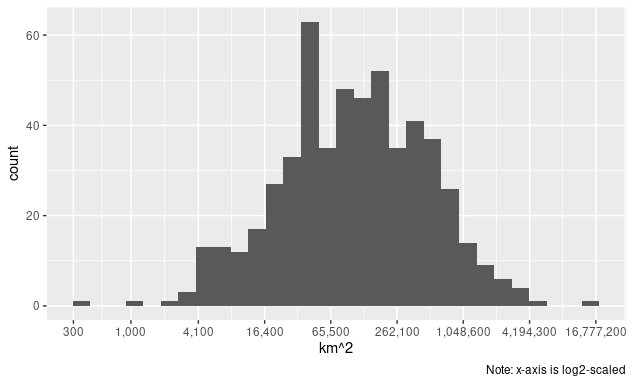
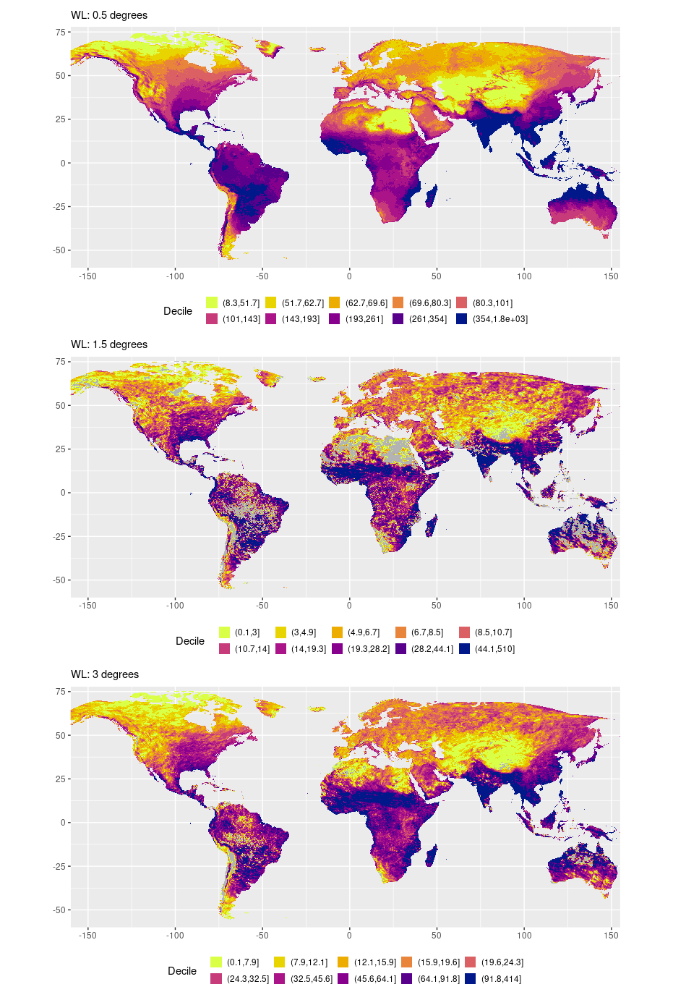
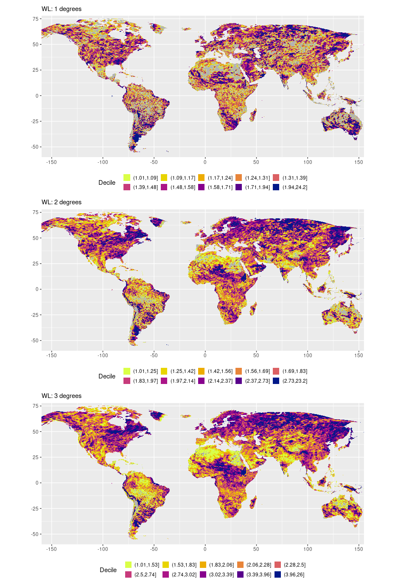
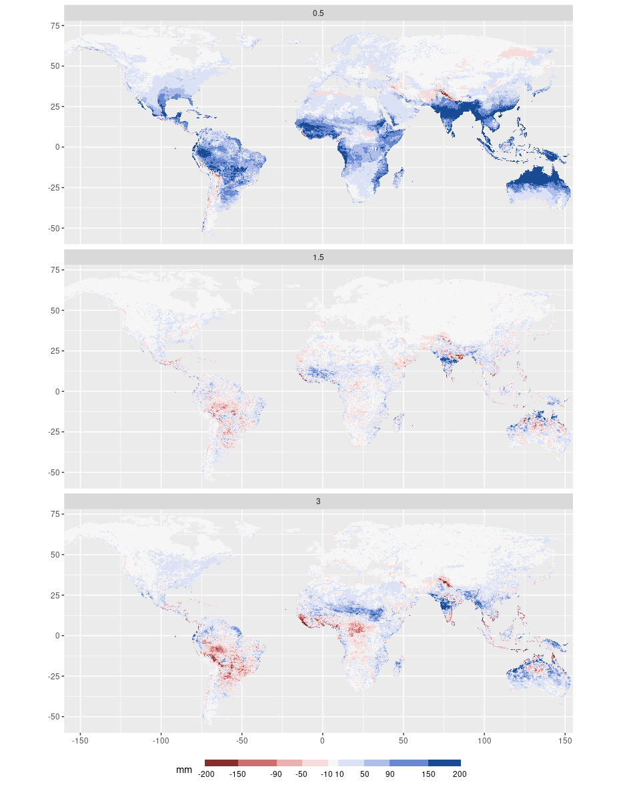
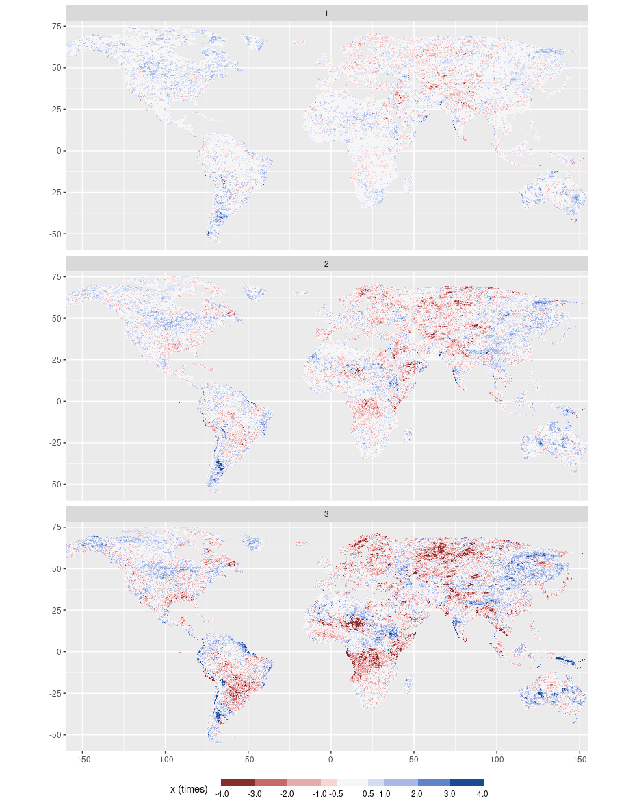

Regional Frequency Analysis: Statistics
================
Carlos Dobler -
2023-03-21

The following figure shows the distributions of regions by size. The
most common size is of between \~30,000 and \~260,000 km^2. The
distribution is heavily left-tailed skewed (small regions are way more
common than very large ones; the skew is not immediately noticeable due
to the x-axis scaling).

------------------------------------------------------------------------

In the next figure, the top map shows the extreme precipitation deciles
at 0.5 degrees of warming. Places in blue (yellow) represent where the
100-yr storm precipitation amounts are the highest (lowest) in the world
under the baseline. The middle and the bottom map show deciles of
positive *change* in extreme precipitation compared to the baseline
(i.e. only increases in amounts). Places in blue (yellow) represent
where 100-yr storms will intensify the most (least). Places in grey
correspond to places that will experience a negative change (i.e. the
100-yr storm precipitation will decrease).

------------------------------------------------------------------------

The following figure shows positive *changes* in the frequency of the
100-yr storm for varying degrees of warming relative to a 0.5 degree
warming level. Places in blue (yellow) represent where the 100-yr storm
frequency is expected to increase the most (least). Places in grey
correspond to places that will experience a negative change (i.e. the
0.5 WL 100-yr storm will become less common).

------------------------------------------------------------------------

The following figure shows the differences between v1 and v2 of the
100-yr storm precipitation amounts maps. Blue (red) represent areas
where the new map depicts higher (lower) amounts than the old map. The
map at the top, corresponding to a warming level of 0.5 degrees, shows
“raw” precipitation differences. The middle and bottom map show
differences in *change* of precipitation (i.e. differences of deltas).

------------------------------------------------------------------------

The following maps show differences in the *change* of frequency of the
100-yr storm between v1 and v2 maps (i.e. all maps show differences of
deltas). Blue (red) represent areas where the new map depicts higher
(lower) frequency than the old map.

